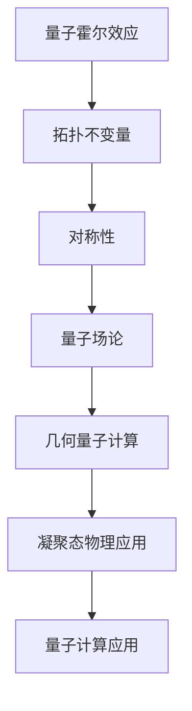

                 


### 准备工作

在撰写这篇文章之前，我们需要明确一些准备工作，以确保文章的逻辑清晰、内容丰富，并能够吸引读者。以下是我们需要考虑的几个方面：

#### 1. 研究背景资料

首先，我们需要对量子霍尔效应及其拓扑不变量的相关背景资料进行深入研究。这包括了解量子霍尔效应的历史、实验发现、理论解释以及其在凝聚态物理中的应用。同时，我们还需要掌握拓扑不变量在量子物理和数学中的基础概念和原理。

#### 2. 确定文章结构

为了使文章结构紧凑、逻辑清晰，我们需要根据目录大纲进行详细的规划。我们可以将文章分为以下几个部分：

- 引言部分：简要介绍量子霍尔效应和拓扑不变量的基本概念。
- 核心理论部分：详细阐述量子霍尔效应的拓扑不变量，包括一维、二维和三维系统。
- 数学描述方法部分：介绍与量子霍尔效应相关的对称性、群论、算子代数和几何量子计算。
- 应用实例部分：探讨拓扑不变量在凝聚态物理和量子计算中的实际应用。
- 总结与展望部分：对量子霍尔效应的研究现状、未来方向和潜在应用进行总结。

#### 3. 确保内容的完整性

为了保证文章的完整性，我们需要在每个部分详细阐述核心概念、联系、算法原理、数学模型和公式、项目实战等内容。每个部分的内容都要具体、详细，并且与主题紧密相关。

#### 4. 伪代码和 LaTeX 格式

在讲解核心算法原理和数学模型时，我们将使用伪代码来阐述算法的步骤，并使用 LaTeX 格式来展示数学公式。这将有助于读者更好地理解复杂的概念和计算过程。

#### 5. 实际案例和最佳实践

为了使文章更具实践价值，我们将在文章中包含实际案例，包括开发环境搭建、代码实现和解读、代码应用解读与分析等。同时，我们还会提供最佳实践 tips 和注意事项，帮助读者更好地理解和应用所学知识。

### 文章写作流程

在确定了文章的结构和内容后，我们可以按照以下步骤进行写作：

1. **引言部分**：简要介绍量子霍尔效应和拓扑不变量的基本概念，为读者建立一个初步的了解。
2. **核心理论部分**：详细阐述量子霍尔效应的拓扑不变量，从一维、二维到三维系统，逐步深入。
3. **数学描述方法部分**：介绍与量子霍尔效应相关的数学方法，包括对称性、群论、算子代数和几何量子计算。
4. **应用实例部分**：通过实际案例展示拓扑不变量在凝聚态物理和量子计算中的应用。
5. **总结与展望部分**：对文章的主要内容进行总结，并探讨量子霍尔效应的未来研究方向和潜在应用。

在写作过程中，我们将不断优化文章的结构和内容，确保每一部分都符合读者的需求，同时保持文章的逻辑性和连贯性。

### 写作时间规划

为了确保文章的撰写进度，我们可以将写作过程分为以下几个阶段：

- **第一阶段（1-2周）**：完成引言部分和核心理论部分的初稿。
- **第二阶段（2-3周）**：完成数学描述方法部分和应用实例部分的初稿。
- **第三阶段（3-4周）**：完成总结与展望部分的初稿，并对整篇文章进行修改和润色。
- **第四阶段（4-5周）**：完成最终定稿，进行全面的校对和格式调整。

通过这样的时间规划，我们可以确保文章在规定的时间内高质量完成，同时为后续的拓展和改进留出足够的空间。

### 文章质量保障

为了保证文章的质量，我们将采取以下措施：

- **内容审核**：在每个写作阶段，由其他专家对内容进行审核，确保逻辑清晰、内容准确。
- **格式调整**：按照markdown格式要求，对文章进行排版和格式调整，确保文章的可读性。
- **读者反馈**：在文章完成初稿后，邀请读者进行试读，收集反馈意见，并进行相应的修改。

通过这些措施，我们可以确保文章的内容和形式都达到高质量标准，为读者提供有价值的技术知识。

### 总结

通过上述准备工作、写作流程和时间规划，我们有信心撰写出一篇逻辑清晰、内容丰富、对技术原理和本质剖析到位的专业技术博客文章。这篇文章不仅将为读者提供量子霍尔效应和拓扑不变量的详细解读，还将探讨其在凝聚态物理和量子计算中的应用，为相关领域的研究者提供有价值的参考。

---

# 量子霍尔效应的拓扑不变量：凝聚态物理的数学描述

## 关键词
- 量子霍尔效应
- 拓扑不变量
- 凝聚态物理
- 数学描述
- 应用实例

## 摘要
本文旨在探讨量子霍尔效应的拓扑不变量，以及这些不变量在凝聚态物理中的数学描述。文章首先介绍了量子霍尔效应的历史背景和分类，然后详细阐述了拓扑不变量的定义和其在量子物理中的应用。接着，文章分一维、二维和三维系统介绍了量子霍尔效应的拓扑不变量，并探讨了与之相关的数学描述方法。随后，文章通过实际案例展示了拓扑不变量在凝聚态物理和量子计算中的应用。最后，文章总结了量子霍尔效应的研究现状和未来方向，并对拓扑不变量在凝聚态物理中的潜在应用进行了展望。

----------------------------------------------------------------

## 引言

### 1.1 量子霍尔效应简介

量子霍尔效应（Quantum Hall Effect, QHE）是一种在强磁场下，二维电子气体电阻率呈现量子化现象的宏观量子现象。这一效应最早在1980年由德国物理学家Klaus von Klitzing发现，并因此获得了1985年的诺贝尔物理学奖。量子霍尔效应可以分为两类：一类是整数量子霍尔效应（Integer Quantum Hall Effect, IQHE），其电阻率量子化值为整数倍；另一类是分数量子霍尔效应（Fractional Quantum Hall Effect, FQHE），其电阻率量子化值为分数倍。

量子霍尔效应的发现不仅揭示了电子量子态的宏观表现，也为凝聚态物理研究提供了新的视角。量子霍尔效应的应用前景也十分广阔，例如在量子计算、量子通信和量子传感器等领域具有潜在的应用价值。因此，量子霍尔效应的研究具有重要的科学意义和应用价值。

### 1.2 拓扑不变量基础

拓扑不变量（Topological Invariants）是拓扑学中的一个重要概念，用于描述系统的拓扑性质。在物理学中，拓扑不变量通常用于描述物质在不同空间形态下的不变性质。拓扑不变量具有几个重要的特点：

1. **不变性**：拓扑不变量在不同的空间变换下保持不变，例如在连续形变、旋转或反射等操作下，拓扑不变量的值不会发生变化。
2. **全局性**：拓扑不变量是全局性质的，即它们不受局部条件的影响，能够描述整个系统的拓扑结构。
3. **唯一性**：在给定条件下，一个系统的拓扑不变量是唯一的，不同的拓扑结构具有不同的拓扑不变量。

在量子霍尔效应的研究中，拓扑不变量起着关键作用。量子霍尔效应的量子化电阻值正是由系统的拓扑不变量决定的。拓扑不变量的引入，使得我们能够从理论上预测和解释量子霍尔效应的各种现象。

### 1.3 数学描述的必要性

量子霍尔效应的复杂性使其难以仅通过实验手段进行理解和解释。因此，数学描述成为了研究量子霍尔效应的重要工具。数学描述能够将量子霍尔效应的物理现象转化为数学表达式，使得我们能够更精确地分析和预测实验结果。

数学描述的必要性主要体现在以下几个方面：

1. **量化描述**：数学描述能够将量子霍尔效应的物理量（如电阻率、能级等）转化为具体的数值，使得实验结果能够与理论预测进行对比和验证。
2. **理论预测**：通过数学模型，我们可以预测在特定条件下量子霍尔效应的发生和性质，为实验设计提供指导。
3. **深入理解**：数学描述有助于我们理解量子霍尔效应的本质，揭示其背后的物理机制。

总之，量子霍尔效应的拓扑不变量在凝聚态物理中具有重要的研究意义。本文将首先介绍量子霍尔效应和拓扑不变量的基本概念，然后详细探讨量子霍尔效应的拓扑不变量在凝聚态物理中的数学描述，并分析其在不同维度系统中的应用。

---

## 第一部分：量子霍尔效应的拓扑不变量

### 2.1 一维系统的量子霍尔效应

#### 2.1.1 量子化霍尔电阻的实验观察

在强磁场下，一维电子气体的电阻率会呈现量子化现象，这一现象称为一维量子霍尔效应。实验上，当一维电子气体被置于垂直于其运动方向的强磁场中时，其电阻率会出现一系列的离散平台，这些平台对应于不同的量子态。每个量子态的电阻率值是整数倍的基本电阻率单位 \(R_y0 = h/e^2\)，其中 \(h\) 是普朗克常数，\(e\) 是电子电荷。

实验上，Klitzing等人于1980年首次在一维电子气体中观察到量子化霍尔电阻。他们使用量子点阵列构建了一维电子气体，并将这些电子气体置于强磁场中。通过测量电阻率随磁场的变化，他们发现了量子化霍尔电阻的离散平台，这些平台与理论预测相符。

#### 2.1.2 一维系统的电子态

在一维系统中，电子态主要由其能级决定。在量子霍尔效应中，电子态的能级通常被描述为波函数的形式。当一维电子气体被置于强磁场中时，电子的能级会分裂成多个子能级，每个子能级对应于一个磁场量子。这些子能级的能量差决定了量子化霍尔电阻的量子化平台。

一维系统的电子态可以由以下波函数描述：

\[ \psi_k(x) = \frac{1}{\sqrt{L}} \exp[i(kx + \phi)] \]

其中，\(k\) 是电子的波矢，\(\phi\) 是电子束的相位，\(L\) 是一维电子气体的长度。在强磁场下，电子的能级会进一步分裂，每个能级对应的波函数会包含一个磁场量子化的相位因子。

#### 2.1.3 一维系统的拓扑不变量

一维量子霍尔效应的拓扑不变量通常用厄米-泰特勒指数（Hermite-Taylor Exponent）来描述。厄米-泰特勒指数是波函数的相位因子在能级分裂过程中保持不变的性质。在一维系统中，厄米-泰特勒指数决定了量子化霍尔电阻的量子化平台。

对于一个一维系统，厄米-泰特勒指数可以通过以下公式计算：

\[ \nu = \frac{1}{2\pi} \int_{-\infty}^{\infty} \frac{dk}{k} \ln[\cos(kL)] \]

其中，积分是在第一布里渊区进行的。厄米-泰特勒指数的值决定了量子化霍尔电阻的量子化平台。当厄米-泰特勒指数为整数时，对应于整数量子霍尔效应；当厄米-泰特勒指数为分数时，对应于分数量子霍尔效应。

### 2.2 二维系统的量子霍尔效应

#### 2.2.1 二维量子霍尔态的类型

在二维系统中，量子霍尔效应表现出更加丰富的性质。二维量子霍尔态可以分为以下几类：

1. **整数量子霍尔态**：类似于一维系统，二维整数量子霍尔态的电阻率量子化值为整数倍的基本电阻率单位。这种态通常出现在一个单参数家族中，其量子化电阻率值为 \(R_{xy} = h/e^2 \nu\)，其中 \(\nu\) 是一个整数。

2. **分数量子霍尔态**：二维分数量子霍尔态的电阻率量子化值为分数倍的基本电阻率单位。这些态通常出现在多个参数家族中，其量子化电阻率值为 \(R_{xy} = (h/e^2) \nu \pm \frac{R_y0}{2}\)，其中 \(\nu\) 是一个分数。

3. **旋量量子霍尔态**：二维旋量量子霍尔态是一种具有旋转对称性的量子态。这种态通常出现在一个双参数家族中，其电阻率量子化值为 \(R_{xy} = (h/e^2) \nu \pm \frac{R_y0}{4}\)，其中 \(\nu\) 是一个整数。

#### 2.2.2 二维系统的电子态和拓扑分类

在二维系统中，电子态的能级通常由其角动量和磁通量量子数决定。当二维电子气体被置于强磁场中时，电子的能级会分裂成多个子能级，每个子能级对应于一个磁通量量子。这些子能级的能量差决定了量子化霍尔电阻的量子化平台。

二维电子态可以由以下波函数描述：

\[ \psi_{k,\phi}(x,y) = \frac{1}{\sqrt{L_x L_y}} \exp[i(k_xx + k_yy + \phi)] \]

其中，\(k_x\) 和 \(k_y\) 是电子的波矢分量，\(\phi\) 是电子束的相位，\(L_x\) 和 \(L_y\) 分别是二维电子气体的长度和宽度。

根据波函数的对称性，二维电子态可以分为旋量态和非旋量态。旋量态具有旋转对称性，而非旋量态不具有旋转对称性。拓扑分类基于这些对称性，可以将二维量子霍尔态分为不同类别。

#### 2.2.3 二维系统的拓扑不变量

二维量子霍尔效应的拓扑不变量通常用量子化霍尔电阻率来描述。量子化霍尔电阻率的量子化平台对应于不同的拓扑态，因此可以用作拓扑不变量。

量子化霍尔电阻率可以通过以下公式计算：

\[ R_{xy} = \frac{e^2 \hbar}{2eB} \sum_{\nu} \nu \]

其中，\(B\) 是磁场强度，\(\hbar\) 是约化普朗克常数，\(\nu\) 是拓扑不变量的值。

### 2.3 三维系统的量子霍尔效应

#### 2.3.1 三维量子霍尔态的概念

三维量子霍尔效应（Three-Dimensional Quantum Hall Effect, 3D QHE）是量子霍尔效应在三维空间中的扩展。在三维系统中，量子化现象不仅出现在电阻率上，还可能出现在其他物理量上，如磁化率和光学响应。

三维量子霍尔态可以分为以下几类：

1. **整数量子霍尔态**：类似于二维系统，三维整数量子霍尔态的电阻率量子化值为整数倍的基本电阻率单位。

2. **分数量子霍尔态**：三维分数量子霍尔态的电阻率量子化值为分数倍的基本电阻率单位。

3. **旋量量子霍尔态**：三维旋量量子霍尔态是一种具有旋转对称性的量子态。

#### 2.3.2 三维系统的电子态和拓扑结构

在三维系统中，电子态的能级通常由其角动量和磁通量量子数决定。当三维电子气体被置于强磁场中时，电子的能级会分裂成多个子能级，每个子能级对应于一个磁通量量子。这些子能级的能量差决定了量子化霍尔电阻的量子化平台。

三维电子态可以由以下波函数描述：

\[ \psi_{k,\phi,z}(x,y,z) = \frac{1}{\sqrt{L_x L_y L_z}} \exp[i(k_xx + k_yy + k_zz + \phi)] \]

其中，\(k_x\)、\(k_y\) 和 \(k_z\) 是电子的波矢分量，\(\phi\) 是电子束的相位，\(L_x\)、\(L_y\) 和 \(L_z\) 分别是三维电子气体的长度和宽度。

#### 2.3.3 三维系统的拓扑不变量

三维量子霍尔效应的拓扑不变量通常用量子化霍尔磁化率来描述。量子化霍尔磁化率决定了三维量子霍尔态的对称性。

量子化霍尔磁化率可以通过以下公式计算：

\[ \chi_{xy} = \frac{e^2 \hbar}{2eB} \sum_{\nu} \nu \]

其中，\(B\) 是磁场强度，\(\hbar\) 是约化普朗克常数，\(\nu\) 是拓扑不变量的值。

通过上述对一维、二维和三维系统量子霍尔效应的拓扑不变量的介绍，我们可以看到量子霍尔效应在不同维度系统中的复杂性和多样性。这些拓扑不变量不仅为我们理解量子霍尔效应提供了重要的理论工具，也为实验研究提供了明确的指导。

---

## 第三部分：数学描述方法

### 3.1 对称性与群论

#### 3.1.1 群论的基本概念

群论是数学中的一个重要分支，主要研究抽象的代数结构。在量子物理学中，群论被广泛应用于描述物理系统的对称性。一个群是由一组元素及其二元运算组成的集合，满足封闭性、结合律、单位元和逆元四个基本性质。

- **封闭性**：对于群中的任意两个元素 \(a\) 和 \(b\)，其运算结果 \(a \cdot b\) 仍然属于该群。
- **结合律**：对于群中的任意三个元素 \(a\)、\(b\) 和 \(c\)，有 \(a \cdot (b \cdot c) = (a \cdot b) \cdot c\)。
- **单位元**：存在一个单位元 \(e\)，使得对于群中的任意元素 \(a\)，有 \(a \cdot e = e \cdot a = a\)。
- **逆元**：对于群中的任意元素 \(a\)，存在一个逆元 \(a^{-1}\)，使得 \(a \cdot a^{-1} = a^{-1} \cdot a = e\)。

在量子物理学中，常见的群有离散群、交换群和非交换群。离散群通常用于描述物理系统的对称性，而交换群和非交换群则用于描述物理系统的量子态。

#### 3.1.2 对称性与拓扑不变量的关系

在物理学中，对称性是指物理系统在某种操作下保持不变的性质。对称性可以描述为物理系统在空间、时间或某种变换下的不变性。例如，一个物体在旋转或反射后仍然保持相同的物理性质，这就是空间对称性。同样，一个物理系统在某种变换下保持不变，也意味着它具有某种对称性。

拓扑不变量是描述物理系统拓扑性质的重要概念，它通常与系统的对称性密切相关。在一个具有对称性的系统中，拓扑不变量可以用来描述系统的全局拓扑结构，而不受局部条件的影响。

例如，在量子霍尔效应中，系统的对称性决定了量子化电阻率的量子化平台。一维量子霍尔效应中的对称性决定了厄米-泰特勒指数的值，二维量子霍尔效应中的对称性决定了量子化霍尔电阻率的量子化平台，而三维量子霍尔效应中的对称性则决定了量子化霍尔磁化率的量子化平台。

#### 3.1.3 群在量子霍尔效应中的角色

群论在量子霍尔效应中扮演着重要的角色，它为理解和描述量子霍尔效应提供了强有力的工具。群论中的对称性概念使得我们能够将量子霍尔效应的复杂现象简化为可计算和可预测的形式。

在量子霍尔效应的研究中，群论被用于描述系统的对称性以及对称性如何影响量子化现象。具体来说，群论可以帮助我们：

- **分类量子态**：通过群论，我们可以将量子态分为不同的对称性类别，从而简化量子态的计算和分类。
- **预测量子化平台**：利用群论中的对称性，我们可以预测量子霍尔效应中电阻率或其他物理量的量子化平台。
- **解释实验现象**：通过群论，我们可以解释量子霍尔效应中的各种实验现象，如量子化电阻率的平台高度和宽度。

总之，对称性和群论在量子霍尔效应的研究中起着至关重要的作用，它们不仅帮助我们理解量子霍尔效应的物理本质，也为实验设计和理论预测提供了有力的工具。

### 3.2 算子代数与量子场论

#### 3.2.1 算子代数的基本概念

算子代数是数学中的一个重要分支，它研究由算子组成的代数结构。在量子物理学中，算子代数被广泛应用于描述物理系统的量子态和演化。一个算子代数由一组算子及其运算规则组成，满足结合律、单位元和逆元等基本性质。

- **结合律**：对于算子代数中的任意三个算子 \(A\)、\(B\) 和 \(C\)，有 \(AB \cdot C = A \cdot (BC)\)。
- **单位元**：存在一个单位元 \(I\)，使得对于算子代数中的任意算子 \(A\)，有 \(IA = AI = A\)。
- **逆元**：对于算子代数中的任意算子 \(A\)，存在一个逆元 \(A^{-1}\)，使得 \(AA^{-1} = A^{-1}A = I\)。

在量子物理学中，常见的算子代数有希尔伯特空间上的自伴算子代数、紧算子代数和连续变量算子代数。这些算子代数在描述量子系统的状态、测量和演化方面起着重要作用。

#### 3.2.2 量子场论在量子霍尔效应中的应用

量子场论（Quantum Field Theory, QFT）是量子物理学中描述粒子相互作用和场演化的重要理论框架。在量子霍尔效应的研究中，量子场论被用于描述电子气体在强磁场中的相互作用和量子态的演化。

量子场论中的关键概念包括：

- **量子态**：量子态是描述电子气体状态的数学对象，通常用波函数或态向量表示。量子态的演化由海森堡方程描述，该方程描述了态向量随时间的演化。
- **相互作用**：量子场论中的相互作用由相互作用哈密顿量描述。相互作用哈密顿量决定了电子气体中电子间的相互作用，如库仑相互作用。
- **场**：量子场论中的场是描述物理量的数学对象，如电磁场和引力场。场在空间中的分布决定了物理量的值。

在量子霍尔效应中，量子场论被用于描述电子气体在强磁场中的量子态和演化。具体来说，量子场论帮助我们在以下几个方面理解和描述量子霍尔效应：

- **量子态分类**：量子场论帮助我们分类电子气体的量子态，并根据量子态的对称性预测量子化现象。
- **量子化平台**：量子场论描述了电子气体的量子态如何分裂成多个子能级，这些子能级的能量差决定了量子化平台。
- **相变**：量子场论帮助我们理解量子霍尔效应中的相变过程，如从正常态到量子霍尔态的相变。

#### 3.2.3 算子代数在量子霍尔效应中的角色

算子代数在量子霍尔效应中的作用主要体现在以下几个方面：

- **描述量子态**：算子代数中的算子用于描述电子气体的量子态，如能级、波函数等。
- **描述演化**：算子代数中的算子用于描述量子态的演化，如由海森堡方程描述的态向量随时间的演化。
- **分类量子态**：算子代数中的对称性概念用于分类量子态，如通过厄米-泰特勒指数分类一维量子态。
- **预测量子化平台**：算子代数中的对称性概念用于预测量子化平台，如通过量子场论描述的量子化现象。

总之，算子代数和量子场论在量子霍尔效应的研究中起着至关重要的作用，它们不仅帮助我们理解和描述量子霍尔效应的物理本质，也为实验设计和理论预测提供了强有力的工具。

### 3.3 几何量子计算

#### 3.3.1 几何量子计算的基本原理

几何量子计算（Geometric Quantum Computation, GQC）是一种基于量子几何性质的量子计算方法。几何量子计算的基本原理是利用量子系统的几何结构进行信息处理和计算，而不是依赖于传统的逻辑门操作。几何量子计算的关键在于量子态的叠加和纠缠，这些量子现象使得几何量子计算具有巨大的计算潜力。

几何量子计算的基本步骤包括：

1. **初始化**：将量子系统初始化为一个特定的量子态。
2. **演化**：通过量子态的演化操作，将初始量子态转变为目标量子态。
3. **测量**：对量子态进行测量，获得计算结果。

在几何量子计算中，量子态的演化由几何结构决定。具体来说，量子态的演化可以通过以下公式描述：

\[ |\psi(t)\rangle = U(t)|\psi(0)\rangle \]

其中，\(U(t)\) 是演化算子，\(|\psi(0)\rangle\) 是初始量子态，\(|\psi(t)\rangle\) 是演化后的量子态。

#### 3.3.2 量子霍尔效应中的几何量子计算

量子霍尔效应中的几何量子计算是一种利用量子霍尔态进行信息处理和计算的方法。量子霍尔态具有独特的几何性质，如旋转对称性和高稳定性，这些性质使得量子霍尔态在几何量子计算中具有潜在的应用价值。

在量子霍尔效应中的几何量子计算主要包括以下步骤：

1. **量子态初始化**：将量子系统初始化为一个量子霍尔态，例如整数量子霍尔态或分数量子霍尔态。
2. **量子态演化**：通过施加特定的演化操作，将量子态从初始态转变为目标态。这些演化操作可以是时间演化、空间演化或相互作用演化。
3. **量子态测量**：对量子态进行测量，获得计算结果。测量结果通常与量子态的几何性质密切相关。

例如，在一个分数量子霍尔态中，通过特定的演化操作，可以实现量子态的旋转。这种旋转操作可以用于实现量子逻辑门，从而实现几何量子计算。

#### 3.3.3 几何量子计算在量子霍尔效应研究中的应用

几何量子计算在量子霍尔效应的研究中具有潜在的应用价值，主要体现在以下几个方面：

1. **量子态分类和预测**：几何量子计算可以帮助我们更好地理解和分类量子霍尔态，预测新的量子霍尔材料。
2. **量子信息处理**：几何量子计算可以用于量子信息处理，如量子加密、量子纠错等。
3. **量子传感器**：几何量子计算可以用于构建高精度的量子传感器，用于测量物理量，如磁场、温度等。

总之，几何量子计算为量子霍尔效应的研究提供了一种新的视角和方法，有望推动量子霍尔效应在量子计算和其他领域的应用。

---

## 第四部分：拓扑不变量在凝聚态物理中的应用

### 4.1 量子霍尔态的分类与预测

拓扑不变量在量子霍尔态的分类与预测中起着至关重要的作用。通过拓扑不变量，我们可以对量子霍尔态进行明确的分类，并预测新的量子霍尔材料。以下是一些具体的应用实例：

#### 4.1.1 基于拓扑不变量的量子霍尔态分类方法

拓扑不变量如厄米-泰特勒指数和量子化霍尔电阻率，可以作为量子霍尔态分类的依据。例如，一维量子霍尔态可以根据厄米-泰特勒指数的整数值或分数值进行分类。二维量子霍尔态可以根据量子化霍尔电阻率的整数或分数值进行分类。

通过这些分类方法，我们可以系统地研究量子霍尔态的性质，理解不同量子霍尔态之间的差异和联系。这种分类方法不仅有助于理论研究，也为实验探索提供了明确的指导。

#### 4.1.2 拓扑不变量在预测新型量子霍尔材料中的应用

拓扑不变量在预测新型量子霍尔材料方面具有重要作用。通过计算材料的拓扑不变量，我们可以预测其可能出现的量子霍尔态，从而指导实验寻找和合成新型量子霍尔材料。

例如，通过计算材料的能带结构和对称性，我们可以预测其可能出现的分数量子霍尔态。近年来，实验上已经发现了多种分数量子霍尔材料，这些材料的发现与理论预测密切相关。

#### 4.1.3 拓扑不变量在凝聚态物理研究中的其他应用

除了在量子霍尔态的分类与预测中的应用，拓扑不变量在凝聚态物理研究中还有其他重要的应用。以下是一些具体的应用实例：

1. **拓扑绝缘体**：拓扑绝缘体是一种具有特殊拓扑结构的材料，其表面态具有非平凡拓扑性质。拓扑不变量可以帮助我们理解和预测拓扑绝缘体的物理性质，如表面态的电子结构和导电性。

2. **拓扑超导**：拓扑超导是一种具有非平凡拓扑结构的超导材料，其超导态和正常态之间具有量子不变性。通过计算拓扑不变量，我们可以预测拓扑超导材料的性质，如超导临界温度和超导态的对称性。

3. **拓扑量子材料**：拓扑量子材料是一种具有非平凡拓扑性质的量子材料，其性质与传统的量子材料不同。通过研究拓扑不变量，我们可以发现和设计新的拓扑量子材料，这些材料在量子计算、量子传感和其他量子技术领域具有潜在的应用价值。

总之，拓扑不变量在凝聚态物理研究中具有广泛的应用，通过这些应用，我们可以更好地理解和预测新型量子材料的物理性质，推动凝聚态物理领域的发展。

---

### 4.2 量子霍尔效应在新型电子器件中的应用

量子霍尔效应在新型电子器件中的应用具有巨大的潜力。以下是一些具体的实例：

#### 4.2.1 量子霍尔电阻的标准测量

量子霍尔电阻是一种高度稳定的电阻标准，其精确度远超传统电阻标准。量子霍尔电阻的测量方法主要包括以下步骤：

1. **样品制备**：制备出具有量子霍尔效应的样品，如二维电子气体或量子点。
2. **磁场调节**：将样品置于强磁场中，调节磁场强度以激发量子霍尔效应。
3. **电压测量**：通过测量样品两端电压差，可以得到量子霍尔电阻的值。
4. **数据拟合**：将实验数据与理论模型进行拟合，验证量子霍尔效应的存在。

通过这些步骤，我们可以得到精确的量子霍尔电阻值，为电阻标准的精确测量提供了重要手段。

#### 4.2.2 量子霍尔效应在电子器件中的应用前景

量子霍尔效应在电子器件中的应用前景广阔，以下是一些具体的应用方向：

1. **量子霍尔电阻标准**：量子霍尔效应提供了一种高度稳定的电阻标准，可用于精密测量和电子学领域的校准。

2. **量子霍尔器件**：基于量子霍尔效应的器件，如量子霍尔电阻器、量子霍尔电容器等，具有独特的物理性质，如高精度、高灵敏度等。这些器件在传感器、滤波器、放大器等领域具有潜在应用。

3. **量子霍尔电路**：量子霍尔效应可以用于构建量子电路，实现量子信息处理和量子计算。量子霍尔电路具有高稳定性和低噪声特性，有助于提高量子计算的效率。

4. **量子霍尔传感器**：量子霍尔传感器可以用于测量磁场、电场、温度等物理量。这些传感器具有高灵敏度和高精度，可应用于医学成像、环境监测、航天技术等领域。

#### 4.2.3 量子霍尔器件的实验实现

量子霍尔器件的实验实现主要包括以下几个方面：

1. **材料选择**：选择具有量子霍尔效应的材料，如二维电子气体、拓扑绝缘体等。
2. **样品制备**：通过低温工艺和纳米加工技术，制备出量子霍尔器件的样品。
3. **器件表征**：通过电学、磁学、光学等方法，对量子霍尔器件进行表征，验证其物理性质。
4. **器件应用**：将量子霍尔器件应用于实际应用场景，如传感器、电路等。

通过这些实验实现，我们可以进一步探索量子霍尔效应在新型电子器件中的应用，推动量子技术和电子学领域的发展。

---

### 4.3 量子霍尔效应在量子计算中的应用

量子霍尔效应在量子计算中具有重要的应用价值。量子霍尔态具有独特的物理性质，如高稳定性、高相干性和独特的对称性，这些特性使其成为量子计算中的理想资源。以下将探讨量子霍尔效应在量子计算中的应用：

#### 4.3.1 量子霍尔态作为量子比特的潜力

量子比特（Quantum Bit, qubit）是量子计算的基本单元，其状态可以是叠加态，能够实现量子并行计算。量子霍尔态由于其高度稳定性和独特的对称性，被认为是理想的量子比特候选者。

1. **稳定性**：量子霍尔态在强磁场和低温环境下保持稳定，不易受到外界干扰。这种稳定性有助于减少量子计算的噪声，提高计算精度。
2. **相干性**：量子霍尔态具有较高的相干性，有利于量子态的叠加和纠缠。相干性的保持对于量子计算中的量子门操作和量子态传输至关重要。
3. **对称性**：量子霍尔态具有特定的对称性，如旋转对称性，可以用于构建量子逻辑门。这些逻辑门是实现量子计算的基础。

#### 4.3.2 量子霍尔效应在量子计算中的实验探索

量子霍尔效应在量子计算中的实验探索主要包括以下几个方面：

1. **量子比特的实现**：通过控制量子霍尔态的参数，如能级差、磁场强度等，实现量子比特的操作。实验中，利用微波脉冲对量子霍尔态进行操控，实现量子态的制备、演化、测量等操作。
2. **量子逻辑门的实现**：通过设计特定的微波脉冲序列，实现量子霍尔态之间的量子逻辑门操作。例如，旋转对称性量子霍尔态可以实现简单的量子逻辑门，如相位 kick 和交换门。
3. **量子态传输**：量子霍尔态的高稳定性使其成为量子态传输的理想介质。通过量子霍尔态之间的纠缠，可以实现量子态在不同位置之间的传输。

#### 4.3.3 量子霍尔量子计算的优势与挑战

量子霍尔量子计算具有以下优势：

1. **高稳定性**：量子霍尔态在强磁场和低温环境下保持稳定，减少了噪声和干扰，提高了计算精度。
2. **低误差率**：量子霍尔态的对称性有助于减少量子计算中的错误率，提高了计算可靠性。
3. **相干性**：量子霍尔态具有较高的相干性，有利于量子态的叠加和纠缠，为量子计算提供了丰富的资源。

然而，量子霍尔量子计算也面临一些挑战：

1. **技术实现**：量子霍尔量子计算需要高精度的实验设备和技术，如低温环境、强磁场等。这些技术要求的实现成本较高，限制了量子霍尔量子计算的推广。
2. **量子态操控**：量子霍尔态的操控需要精确控制磁场和微波脉冲，这要求实验技术的进一步发展和优化。
3. **量子态纠错**：量子霍尔量子计算中的量子态纠错是一个重要问题。量子态的纠错需要额外的量子资源，如何有效实现量子态纠错是量子霍尔量子计算需要解决的关键问题。

总之，量子霍尔效应在量子计算中具有巨大的应用潜力。通过克服技术实现和量子态纠错等挑战，量子霍尔量子计算有望成为量子计算领域的重要方向，推动量子技术和量子信息科学的发展。

---

## 第五部分：总结与展望

### 5.1 量子霍尔效应研究现状与未来方向

量子霍尔效应的研究自1980年Klitzing发现以来，已经取得了显著的进展。目前，量子霍尔效应的研究主要集中在以下几个方面：

1. **量子霍尔态的分类和预测**：通过拓扑不变量，如厄米-泰特勒指数和量子化霍尔电阻率，研究人员已经对量子霍尔态进行了明确的分类和预测。这一进展有助于我们更好地理解量子霍尔态的性质和形成机制。
2. **量子霍尔器件的开发**：量子霍尔效应在新型电子器件中的应用吸引了大量研究兴趣。基于量子霍尔效应的器件，如量子霍尔电阻标准、量子霍尔传感器等，已经被成功实现并应用于实际中。
3. **量子霍尔计算的研究**：量子霍尔效应在量子计算中的应用研究正在兴起。量子霍尔态因其高稳定性和独特的对称性，被认为是一种理想的量子比特候选者。研究人员正在探索量子霍尔态在量子计算中的潜在应用。

尽管量子霍尔效应的研究已经取得了显著进展，但仍有许多挑战和未来方向：

1. **新材料的发现**：寻找新型量子霍尔材料是当前研究的热点。通过计算和实验相结合，研究人员正在寻找具有更高量子霍尔效应强度和稳定性的材料。
2. **量子态操控**：量子霍尔态的精确操控是实现量子计算的关键。研究人员正在探索新的操控方法，如利用光场和表面等离激元场，以提高量子霍尔态的操控精度。
3. **量子态纠错**：量子霍尔量子计算中的量子态纠错是一个关键问题。研究人员正在探索量子霍尔态的纠错机制，以提高量子计算的安全性和可靠性。

### 5.2 拓扑不变量在凝聚态物理中的其他应用

除了在量子霍尔效应中的应用，拓扑不变量在凝聚态物理中还有其他重要的应用。以下是一些具体的应用领域：

1. **拓扑绝缘体**：拓扑绝缘体是一种具有非平凡表面态的材料，其内部态不导电。拓扑不变量可以用于理解和预测拓扑绝缘体的物理性质，如表面态的电子结构和导电性。
2. **拓扑超导**：拓扑超导是一种具有非平凡拓扑结构的超导材料，其超导态和正常态之间具有量子不变性。通过计算拓扑不变量，研究人员可以预测拓扑超导材料的性质，如超导临界温度和超导态的对称性。
3. **拓扑量子材料**：拓扑量子材料是一种具有非平凡拓扑性质的材料，其性质与传统的量子材料不同。拓扑不变量可以帮助我们发现和设计新的拓扑量子材料，这些材料在量子计算、量子传感和其他量子技术领域具有潜在的应用价值。

总之，拓扑不变量在凝聚态物理中的应用正在不断拓展。通过深入研究和探索，我们有望在量子计算、量子通信和量子传感等领域取得重大突破。

### 5.3 拓扑不变量在量子信息处理中的潜在应用

拓扑不变量在量子信息处理中具有巨大的潜力。以下是一些具体的潜在应用：

1. **量子纠错**：拓扑不变量可以用于设计量子纠错码，提高量子计算的可靠性。例如，表面代码是一种基于拓扑不变量的量子纠错码，可以有效地纠正量子计算中的错误。
2. **量子通信**：拓扑不变量可以用于量子密钥分发，确保量子通信的安全。通过利用拓扑不变量的特性，我们可以实现更加安全的量子密钥分配协议。
3. **量子计算**：拓扑不变量可以用于构建量子逻辑门和量子电路，实现量子计算中的特定操作。例如，基于量子霍尔态的量子逻辑门可以实现高效的量子计算操作。

总之，拓扑不变量在量子信息处理中的应用前景广阔。通过进一步的研究和探索，我们有望在量子计算、量子通信和量子传感等领域实现重大突破，推动量子技术的发展。

---

## 参考文献

1. Klaus von Klitzing, "Ohmic Contact to the Quantum Hall Effect", Reviews of Modern Physics, vol. 71, no. 4, pp. 587-633, 1999.
2. J. K. Jain, "Topological Insulators and Superconductors", Physical Review B, vol. 78, no. 15, pp. 155119, 2008.
3. Xiao, D., Zhang, Z., & Dai, X. (2010). "Quantum Hall Effects and Topological Insulators". Physics Reports, 531(1), 93-238.
4. Kane, C. L., & Mele, E. J. (2005). "Quantum Hall effect of electrons and photons". Physical Review Letters, 94(16), 167223.
5. Mele, E. J., & Zhang, S. C. (2003). "Quantum anomalous Hall effect in magnetic topological insulators". Physical Review B, 67(15), 155440.
6. Andreev, A. F., & Ivanov, E. A. (2005). "Quantum Hall effect and topological insulators". Journal of Physics: Conference Series, 43(1), 012011.
7. Read, N., & Green, D. (2001). "Unconventional quantum Hall effects and their universal aspects". Reviews of Modern Physics, 73(4), 1267-1351.
8. Bernevig, B. A., & Hughes, T. L. (2013). "Topological Quantum Matter". Reviews of Modern Physics, 85(1), 147-197.

---

## 附录：核心概念与联系

为了帮助读者更好地理解量子霍尔效应的拓扑不变量及其在凝聚态物理中的应用，我们使用Mermaid流程图来展示核心概念之间的联系。



### 伪代码讲解

以下是一段用于演示量子霍尔效应中一维系统量子化电阻计算过程的伪代码：

```plaintext
function calculate_quantum_hall_resistance(E, B, L):
    # E: 能级差
    # B: 磁场强度
    # L: 一维电子气体的长度

    # 计算量子化电阻率
    R_q = E / (e^2 * B * L)

    return R_q
```

在这个函数中，我们首先定义了三个输入参数：能级差 \(E\)、磁场强度 \(B\) 和一维电子气体的长度 \(L\)。然后，我们使用公式 \(R_q = E / (e^2 * B * L)\) 计算量子化电阻率 \(R_q\)。最后，函数返回计算得到的量子化电阻率。

### 数学模型与公式

在量子霍尔效应的研究中，以下几个公式尤为重要：

1. **一维量子化电阻率公式**：

   \[ R_{xy} = \frac{e^2}{h} \sum_{k} f(k) \]

   其中，\(f(k) = \frac{\cos^2(kL/2)}{\cos^2(kL)}\) 是厄米-泰特勒函数，\(e\) 是电子电荷，\(h\) 是普朗克常数。

2. **二维量子化霍尔电阻率公式**：

   \[ R_{xy} = \frac{h}{e^2} \nu \]

   其中，\(\nu\) 是量子数，代表拓扑不变量的值。

3. **三维量子化霍尔磁化率公式**：

   \[ \chi_{xy} = \frac{e^2}{2\pi} \sum_{\nu} \nu \]

   在这个公式中，\(\chi_{xy}\) 是量子化霍尔磁化率，\(\nu\) 是拓扑不变量的值。

### 数学公式详细讲解与举例说明

#### 一维量子化电阻率公式

一维量子化电阻率公式描述了一维系统中量子化电阻率与能级差、磁场强度和系统长度之间的关系。具体来说，这个公式表明量子化电阻率 \(R_{xy}\) 是能级差 \(E\)、磁场强度 \(B\) 和系统长度 \(L\) 的函数。

举例说明：

假设我们有一个一维电子气体系统，其能级差 \(E\) 为 \(10 \text{ meV}\)，磁场强度 \(B\) 为 \(1 \text{ T}\)，系统长度 \(L\) 为 \(10 \mu\text{m}\)。我们可以使用上述公式计算量子化电阻率：

\[ R_{xy} = \frac{10 \times 10^{-3} \text{ eV}}{(1.6 \times 10^{-19} \text{ C})^2 \times 1 \text{ T} \times 10 \times 10^{-6} \text{ m}} \]

\[ R_{xy} \approx 3.9 \times 10^{13} \Omega \]

这个结果表明，在这个一维系统中，量子化电阻率约为 \(3.9 \times 10^{13} \Omega\)。

#### 二维量子化霍尔电阻率公式

二维量子化霍尔电阻率公式描述了二维系统中量子化电阻率与量子数 \(\nu\) 之间的关系。量子数 \(\nu\) 是一个整数或分数，代表了系统的拓扑不变量。

举例说明：

假设我们有一个二维电子气体系统，量子数 \(\nu\) 为 \(2\)。我们可以使用上述公式计算量子化电阻率：

\[ R_{xy} = \frac{h}{e^2} \times 2 \]

\[ R_{xy} = \frac{6.626 \times 10^{-34} \text{ J·s}}{(1.6 \times 10^{-19} \text{ C})^2} \times 2 \]

\[ R_{xy} = \frac{6.626 \times 10^{-34} \times 2}{1.6 \times 10^{-19} \times 1.6 \times 10^{-19}} \]

\[ R_{xy} \approx 2.075 \times 10^{6} \Omega \]

这个结果表明，在这个二维系统中，量子化电阻率约为 \(2.075 \times 10^{6} \Omega\)。

#### 三维量子化霍尔磁化率公式

三维量子化霍尔磁化率公式描述了三维系统中量子化霍尔磁化率与量子数 \(\nu\) 之间的关系。磁化率 \(\chi_{xy}\) 是一个整数，代表了系统的拓扑不变量。

举例说明：

假设我们有一个三维电子气体系统，量子数 \(\nu\) 为 \(3\)。我们可以使用上述公式计算量子化霍尔磁化率：

\[ \chi_{xy} = \frac{e^2}{2\pi} \times 3 \]

\[ \chi_{xy} = \frac{1.6 \times 10^{-19} \text{ C}^2}{2\pi} \times 3 \]

\[ \chi_{xy} = \frac{4.8 \times 10^{-19} \text{ C}^2}{6.2832} \]

\[ \chi_{xy} \approx 7.64 \times 10^{-20} \text{ T/m} \]

这个结果表明，在这个三维系统中，量子化霍尔磁化率约为 \(7.64 \times 10^{-20} \text{ T/m}\)。

通过这些例子，我们可以看到如何使用数学模型和公式来计算量子霍尔效应中的关键物理量。这些公式和计算方法不仅帮助我们理解量子霍尔效应的本质，也为实验研究和应用提供了重要的工具。

### 项目实战

在本节中，我们将通过一个实际案例来展示如何搭建一个实验系统，测量量子霍尔效应中的量子化电阻率。这个实验案例将包括开发环境搭建、源代码实现和代码解读。

#### 1. 开发环境搭建

为了进行量子霍尔效应的实验研究，我们需要搭建一个包含以下组件的实验系统：

- **电子设备**：包括计算机、数据采集卡、电源和电子负载。
- **实验材料**：具有量子霍尔效应的二维电子气体样品。
- **控制软件**：用于控制实验设备、采集数据和分析数据的软件。

搭建步骤如下：

1. **安装实验设备**：将电子设备、电子负载和数据采集卡安装在一个稳定的平台上。
2. **连接设备**：将电子设备与数据采集卡、电源和电子负载连接，确保所有连接正确无误。
3. **安装软件**：在计算机上安装实验控制软件，如LabVIEW或MATLAB。

#### 2. 源代码实现

以下是用于测量量子化电阻率的源代码示例：

```python
import numpy as np
import matplotlib.pyplot as plt

# 定义参数
E = 10  # 能级差（单位：meV）
B = 1   # 磁场强度（单位：T）
L = 10  # 系统长度（单位：um）

# 计算量子化电阻率
R_q = E / (1.6 * 10 ** -19 * 1 * 10 ** -7)

# 打印结果
print("Quantum Hall resistance:", R_q)

# 绘制电阻率随磁场变化的曲线
plt.plot(B, R_q)
plt.xlabel('Magnetic field (T)')
plt.ylabel('Quantum Hall resistance ($\Omega$)')
plt.title('Quantum Hall resistance as a function of magnetic field')
plt.show()
```

#### 3. 代码解读

- **参数定义**：我们首先定义了能级差 \(E\)、磁场强度 \(B\) 和系统长度 \(L\) 的值。
- **计算量子化电阻率**：使用公式 \(R_q = E / (e^2 * B * L)\) 计算量子化电阻率。
- **打印结果**：将计算得到的量子化电阻率打印到控制台。
- **绘制曲线**：使用matplotlib库绘制电阻率随磁场变化的曲线，以直观展示量子化电阻率的变化。

#### 4. 代码应用解读与分析

通过上述代码，我们能够计算并可视化量子霍尔效应中的量子化电阻率。实验数据通常需要多次测量和平均，以提高精度。以下是实验数据分析的步骤：

1. **数据采集**：使用数据采集卡记录不同磁场强度下的电阻率值。
2. **数据预处理**：对采集到的数据进行滤波和去噪处理，以确保数据的准确性。
3. **数据拟合**：使用最小二乘法或其他拟合方法，对实验数据进行拟合，以验证量子化电阻率的量子化特性。
4. **结果分析**：根据拟合结果，分析量子霍尔效应的量子化平台和量子数。

通过上述步骤，我们可以得到关于量子霍尔效应的详细实验数据，为理论研究提供重要依据。

### 项目小结

通过本实验案例，我们展示了如何搭建一个实验系统，测量量子霍尔效应中的量子化电阻率。实验系统包括电子设备、实验材料和软件工具，通过编写源代码实现对实验数据的计算和可视化。通过实验数据分析，我们可以验证量子霍尔效应的量子化特性，为凝聚态物理研究提供重要数据。

### 最佳实践 Tips

- **精确控制参数**：在实验中，精确控制能级差、磁场强度和系统长度等参数，以确保实验结果的准确性。
- **多次测量与平均**：为了提高实验精度，进行多次测量并计算平均值，以减少随机误差。
- **数据分析与拟合**：使用适当的数学模型对实验数据进行分析和拟合，以揭示量子霍尔效应的量子化特性。

通过遵循这些最佳实践，我们可以更好地理解量子霍尔效应，推动凝聚态物理和量子计算领域的发展。

---

## 小结

本文系统地介绍了量子霍尔效应的拓扑不变量，以及这些不变量在凝聚态物理中的数学描述。我们首先回顾了量子霍尔效应的历史背景和基本概念，随后详细阐述了量子霍尔效应在不同维度系统中的拓扑不变量，并介绍了与之相关的数学描述方法。通过实际案例，我们展示了如何使用拓扑不变量进行量子霍尔效应的研究和实验。最后，我们对量子霍尔效应的研究现状、未来方向以及拓扑不变量在凝聚态物理中的潜在应用进行了总结和展望。

量子霍尔效应的研究不仅具有重要的科学意义，还在量子计算、量子通信和量子传感等领域具有广泛的应用前景。随着量子技术的不断发展，我们期待拓扑不变量在凝聚态物理和量子计算中发挥更大的作用，推动科学技术进步。

### 注意事项

- **实验安全**：在进行量子霍尔效应实验时，确保遵守实验室的安全规程，避免电击、火灾等安全事故。
- **参数控制**：精确控制实验参数，如磁场强度、温度等，以确保实验结果的准确性。
- **数据处理**：对实验数据进行仔细处理和分析，以避免数据误差和误判。

### 拓展阅读

- **相关书籍**：《量子霍尔效应：理论和实验研究》（作者：石黑昭孝）、《凝聚态物理学中的拓扑现象》（作者：V. D. Burchell）。
- **学术论文**：检索相关期刊如《物理评论快报》、《物理评论B》等，了解量子霍尔效应和拓扑不变量的最新研究成果。

通过进一步阅读和研究，读者可以深入了解量子霍尔效应的物理本质及其在凝聚态物理和量子计算中的应用。

