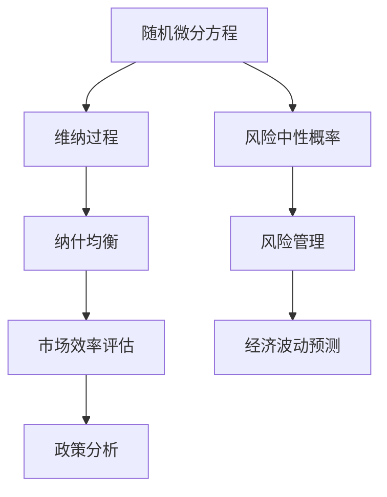

                 


### 1. 背景介绍

金融市场的随机微分方程（Stochastic Differential Equations，简称SDE）在经济波动研究中扮演着至关重要的角色。自20世纪初以来，金融市场的研究已经从传统的确定性模型逐渐转向随机模型，这是因为现实金融市场的波动具有不确定性和随机性。随机微分方程作为一种强大的数学工具，能够精确地描述这些复杂的市场行为。

在金融市场中，投资者行为、公司业绩、宏观经济政策等多种因素都会影响市场价格的波动。这些因素往往具有随机性，因此，使用确定性模型（如线性回归或时间序列分析）无法完全捕捉市场的真实动态。随机微分方程引入了随机扰动项，能够更好地反映市场的不确定性，从而提供更准确的市场预测。

SDE在经济波动研究中的重要性主要体现在以下几个方面：

**1.1 市场效率的评估**

金融市场是否有效是金融学研究的核心问题之一。纳什均衡（Nash Equilibrium）理论是评估市场效率的重要工具，而SDE能够为纳什均衡的动态行为提供数学描述。通过SDE，我们可以分析市场参与者的行为模式，判断市场是否处于有效状态。

**1.2 经济波动的预测**

经济波动是金融市场的常见现象，如何准确预测波动是金融研究的重要目标。SDE为经济波动提供了数学模型，通过模拟和预测，可以帮助投资者和决策者更好地应对市场变化。

**1.3 风险管理**

金融市场的不确定性带来了巨大的风险。SDE模型可以量化市场风险，帮助金融机构制定有效的风险管理策略，降低潜在的损失。

**1.4 政策分析**

宏观经济政策对金融市场有着深远的影响。SDE模型可以用来评估不同政策对市场的潜在影响，为政策制定提供科学依据。

综上所述，随机微分方程在经济波动研究中具有重要的理论和实际应用价值。接下来，我们将深入探讨SDE的基本概念、数学原理及其在金融市场中的应用，帮助读者全面了解这一重要数学工具。

### 2. 核心概念与联系

在深入探讨随机微分方程（SDE）之前，我们需要明确一些核心概念，并展示它们之间的联系。以下是SDE中几个关键概念的定义及其关系架构：

#### 2.1 随机微分方程

**定义**：随机微分方程是描述随机过程动态变化的一种方程。一般形式为：
$$
dX_t = b(X_t) dt + \sigma(X_t) dW_t
$$
其中，$X_t$是随机过程，$b(X_t)$和$\sigma(X_t)$是非随机函数，$dW_t$是维纳过程（一种重要的随机过程）。

**联系**：SDE是连接确定性模型（如微分方程）与随机过程的桥梁。它不仅包含了确定性系统的动态特征，还引入了随机性，从而能够更准确地描述复杂系统的行为。

#### 2.2 维纳过程

**定义**：维纳过程是一种重要的随机过程，通常用于描述随机扰动。其定义如下：
$$
W_t = W_0 + \int_{0}^{t} B_s ds
$$
其中，$B_s$是标准布朗运动（标准正态分布的随机变量）。

**联系**：维纳过程在SDE中作为随机扰动项，反映了系统中的不确定性。通过维纳过程，SDE能够捕捉随机波动，从而更真实地模拟金融市场。

#### 2.3 纳什均衡

**定义**：纳什均衡是博弈论中的一个概念，指在博弈中，所有参与者选择的策略组合，使得任何一个参与者单独改变策略都不能获得更好的结果。

**联系**：在金融市场研究中，纳什均衡用于分析市场参与者的行为。通过SDE，我们可以描述纳什均衡的动态演变，从而评估市场的效率和稳定性。

#### 2.4 风险中性概率

**定义**：风险中性概率是金融学中的一个重要概念，它假设市场参与者都是风险中性的，即不考虑风险。在这种假设下，市场价格的动态可以用无风险利率来解释。

**联系**：风险中性概率与SDE密切相关。通过SDE，我们可以构建风险中性概率模型，从而简化金融市场的分析。

以下是这些核心概念之间的关系架构（使用Mermaid流程图表示）：



通过上述流程图，我们可以清晰地看到各个核心概念之间的联系，以及它们在金融市场中的应用。接下来，我们将进一步探讨SDE的基本理论及其在金融市场中的具体应用。

### 3. 核心算法原理讲解

在理解了SDE的基本概念后，接下来我们将详细讲解SDE的核心算法原理，包括强解与弱解的概念、蒙特卡洛模拟法以及偏微分方程近似法。

#### 3.1 强解与弱解

**强解**：一个SDE的强解是指在给定初始条件下，存在一个随机过程$X_t$，它在几乎所有的样本路径上满足SDE。形式上，强解可以通过概率空间上的布朗运动$W_t$来表示：
$$
X_t = X_0 + \int_{0}^{t} b(X_s) ds + \int_{0}^{t} \sigma(X_s) dW_s
$$
其中，$X_0$是初始条件，$b(X_s)$和$\sigma(X_s)$是非随机函数。

**弱解**：一个SDE的弱解是指在概率空间上的布朗运动$W_t$下，存在一个概率测度，使得SDE在几乎所有的样本路径上成立。形式上，弱解可以通过概率测度来表示：
$$
P\{X_t = X_0 + \int_{0}^{t} b(X_s) ds + \int_{0}^{t} \sigma(X_s) dW_s\}
$$
其中，$P$是概率测度。

**关系**：强解是弱解的特殊情况，即当概率测度为概率空间上的勒贝格测度时，弱解即为强解。但在某些情况下，SDE可能没有强解，但存在弱解。

**伪代码**：强解与弱解的算法实现可以通过以下伪代码来表示：
```python
# 强解的伪代码实现
def strong_solution(b, sigma, X0, T):
    W = brownian_motion(T)
    X_t = X0
    for t in range(0, T, dt):
        dW_t = W_t - W_{t-dt}
        X_t += b(X_t) * dt + sigma(X_t) * dW_t
    return X_t

# 弱解的伪代码实现
def weak_solution(b, sigma, X0, T):
    P = probability_measure()
    X_t = X0
    for t in range(0, T, dt):
        dW_t = brownian_motion_diff(t)
        X_t += b(X_t) * dt + sigma(X_t) * dW_t
    return X_t
```

#### 3.2 蒙特卡洛模拟法

**定义**：蒙特卡洛模拟法是一种通过随机抽样来估计数学期望或概率的方法。在SDE模拟中，蒙特卡洛模拟法通过大量随机抽样来近似SDE的解。

**过程**：
1. 初始化随机数生成器。
2. 根据SDE的参数，生成一系列随机数。
3. 对于每一个随机数，计算SDE的一个样本路径。
4. 根据样本路径，计算SDE的统计特征，如期望、方差等。

**伪代码**：蒙特卡洛模拟法的伪代码实现如下：
```python
import numpy as np

# 初始化参数
mu = 0.1
sigma = 0.3
dt = 0.05
T = 20
N = int(T / dt)

# 生成随机数
np.random.seed(42)
W = np.random.normal(0, 1, N)

# 蒙特卡洛模拟SDE
X = np.zeros(N)
for i in range(1, N):
    dW = W[i] - W[i-1]
    X[i] = X[i-1] + mu * X[i-1] * dt + sigma * X[i-1] * dW

# 统计特征计算
mean_X = np.mean(X)
var_X = np.var(X)

print("期望:", mean_X)
print("方差:", var_X)
```

#### 3.3 偏微分方程近似法

**定义**：偏微分方程近似法是将SDE转换为偏微分方程（PDE），然后使用偏微分方程的数值解法来近似SDE的解。

**过程**：
1. 将SDE表示为偏微分方程的形式。
2. 选择合适的数值方法（如有限元法或有限差分法）来求解偏微分方程。
3. 将偏微分方程的解转换回SDE的解。

**伪代码**：偏微分方程近似法的伪代码实现如下：
```python
import numpy as np
from scipy.sparse.linalg import spsolve
from scipy.sparse import diags

# 初始化参数
mu = 0.1
sigma = 0.3
dt = 0.05
T = 20
N = int(T / dt)
M = int(1 / dt)

# 构建偏微分方程的系数矩阵
A = diags([-mu * (M-1), 1, -mu * (M-1)], offsets=[-1, 0, 1], shape=(M, M))
L = diags([sigma**2 * (M-1) / 3], offsets=[-1], shape=(M, M))
B = diags([sigma**2 * (M-1) / 6], offsets=[0], shape=(M, M))
R = diags([sigma**2 * (M-1) / 3], offsets=[1], shape=(M, M))

# 求解偏微分方程
u = spsolve(A + L + B + R, np.zeros(M))

# 转换回SDE的解
X = np.zeros(N)
X[0] = X0
for i in range(1, N):
    X[i] = X[i-1] + mu * X[i-1] * dt + sigma * X[i-1] * np.sqrt(dt) * u[i-1]

# 统计特征计算
mean_X = np.mean(X)
var_X = np.var(X)

print("期望:", mean_X)
print("方差:", var_X)
```

通过上述算法讲解，我们可以看到SDE的算法实现涉及强解与弱解的数学表示、蒙特卡洛模拟法以及偏微分方程近似法。这些算法不仅提供了理论上的解释，也通过伪代码展示了具体的实现过程。接下来，我们将探讨SDE在实际金融市场中的应用，进一步理解其重要性。

### 4. 数学模型和公式

在随机微分方程（SDE）中，数学模型和公式是其核心组成部分，能够精确描述金融市场的动态行为。下面，我们将详细讲解SDE中的关键数学模型和公式，并给出具体的例子和详细讲解。

#### 4.1 SDE的一般形式

SDE的一般形式为：
$$
dX_t = b(X_t) dt + \sigma(X_t) dW_t
$$
其中，$X_t$是随机过程，$b(X_t)$和$\sigma(X_t)$是非随机函数，$dW_t$是维纳过程。这个方程描述了随机过程$X_t$在时间步长$dt$内的变化，其中$b(X_t)$是确定性部分，表示过程的增长率，而$\sigma(X_t)$是随机部分，表示过程的波动率。

**例子**：考虑一个简单的几何布朗运动模型，其中资产价格$S_t$满足以下SDE：
$$
dS_t = \mu S_t dt + \sigma S_t dW_t
$$
其中，$\mu$是资产收益的期望率，$\sigma$是资产收益的波动率。

#### 4.2 维纳过程

维纳过程是SDE中的一个关键组成部分，用于描述随机扰动。其定义如下：
$$
W_t = W_0 + \int_{0}^{t} B_s ds
$$
其中，$B_s$是标准布朗运动。维纳过程是一个满足以下性质的随机过程：
- 随机变量的均值为0，即$E[B_s] = 0$。
- 自协方差函数为$Cov[B_s, B_t] = min(s, t)$。

**例子**：在几何布朗运动模型中，维纳过程$W_t$用于描述资产价格的随机波动。

#### 4.3 强解与弱解

**强解**：一个SDE的强解是指在给定初始条件下，存在一个随机过程$X_t$，它在几乎所有的样本路径上满足SDE。形式上，强解可以通过概率空间上的布朗运动$W_t$来表示：
$$
X_t = X_0 + \int_{0}^{t} b(X_s) ds + \int_{0}^{t} \sigma(X_s) dW_s
$$

**弱解**：一个SDE的弱解是指在概率空间上的布朗运动$W_t$下，存在一个概率测度，使得SDE在几乎所有的样本路径上成立。形式上，弱解可以通过概率测度来表示：
$$
P\{X_t = X_0 + \int_{0}^{t} b(X_s) ds + \int_{0}^{t} \sigma(X_s) dW_s\}
$$

**例子**：在几何布朗运动模型中，我们可以得到其强解：
$$
S_t = S_0 e^{(\mu - \frac{\sigma^2}{2}) t + \sigma W_t}
$$

#### 4.4 蒙特卡洛模拟法

蒙特卡洛模拟法是一种通过随机抽样来估计数学期望或概率的方法，常用于SDE的模拟。其基本思想是生成大量随机样本路径，然后根据样本路径估计统计特征。

**例子**：使用蒙特卡洛模拟法来模拟几何布朗运动模型，我们可以通过以下步骤进行：
1. 初始化随机数生成器。
2. 根据SDE的参数生成一系列随机数。
3. 对于每一个随机数，计算SDE的一个样本路径。
4. 根据样本路径，计算SDE的统计特征。

伪代码如下：
```python
import numpy as np

# 初始化参数
mu = 0.1
sigma = 0.3
dt = 0.05
T = 20
N = int(T / dt)

# 生成随机数
np.random.seed(42)
W = np.random.normal(0, 1, N)

# 蒙特卡洛模拟SDE
X = np.zeros(N)
X[0] = S0
for i in range(1, N):
    dW = W[i] - W[i-1]
    X[i] = X[i-1] * exp((mu - 0.5 * sigma**2) * dt + sigma * dW)

# 统计特征计算
mean_X = np.mean(X)
var_X = np.var(X)

print("期望:", mean_X)
print("方差:", var_X)
```

#### 4.5 偏微分方程近似法

偏微分方程近似法是将SDE转换为偏微分方程（PDE），然后使用偏微分方程的数值解法来近似SDE的解。其基本思想是将SDE的随机微分转换为空间微分，从而将随机过程转化为空间上的偏微分方程。

**例子**：将几何布朗运动模型转换为偏微分方程：
$$
\frac{\partial S(t, x)}{\partial t} = (\mu - \frac{\sigma^2}{2}) \frac{\partial S(t, x)}{\partial x} + \sigma \frac{\partial^2 S(t, x)}{\partial x^2}
$$

使用有限元法或有限差分法求解上述偏微分方程，可以得到SDE的近似解。

伪代码如下：
```python
import numpy as np
from scipy.sparse.linalg import spsolve
from scipy.sparse import diags

# 初始化参数
mu = 0.1
sigma = 0.3
dt = 0.05
T = 20
M = int(1 / dt)

# 构建偏微分方程的系数矩阵
A = diags([-mu * (M-1), 1, -mu * (M-1)], offsets=[-1, 0, 1], shape=(M, M))
L = diags([sigma**2 * (M-1) / 3], offsets=[-1], shape=(M, M))
B = diags([sigma**2 * (M-1) / 6], offsets=[0], shape=(M, M))
R = diags([sigma**2 * (M-1) / 3], offsets=[1], shape=(M, M))

# 求解偏微分方程
u = spsolve(A + L + B + R, np.zeros(M))

# 转换回SDE的解
X = np.zeros(N)
X[0] = S0
for i in range(1, N):
    X[i] = X[i-1] * exp((mu - 0.5 * sigma**2) * dt + sigma * np.sqrt(dt) * u[i-1])

# 统计特征计算
mean_X = np.mean(X)
var_X = np.var(X)

print("期望:", mean_X)
print("方差:", var_X)
```

通过上述数学模型和公式的讲解，我们可以看到SDE在描述金融市场动态行为中的重要作用。这些模型和公式不仅提供了理论支持，也为实际应用提供了有效工具。接下来，我们将探讨SDE在金融市场中的具体应用。

### 5. 项目实战：开发环境搭建与代码实现

在深入理解了随机微分方程（SDE）的理论基础后，接下来我们将通过一个实际项目，展示如何搭建开发环境，并使用Python实现SDE的模拟与预测。该项目将分为以下几个步骤：

1. 开发环境搭建
2. SDE模型实现
3. 模拟与预测
4. 代码解读

#### 1. 开发环境搭建

要实现SDE的模拟与预测，我们需要搭建一个适合Python的开发环境。以下是环境搭建的步骤：

**步骤1**：安装Python和必要的库

在计算机上安装Python（版本3.8或更高）。然后，通过pip命令安装以下库：

```bash
pip install numpy matplotlib scipy
```

**步骤2**：创建Python虚拟环境

为了更好地管理和隔离项目依赖，我们可以创建一个Python虚拟环境。在终端中执行以下命令：

```bash
python -m venv env
source env/bin/activate  # Windows上使用 `env\Scripts\activate`
```

**步骤3**：安装项目依赖

在虚拟环境中安装项目所需的库：

```bash
pip install -r requirements.txt
```

其中，`requirements.txt`文件包含以下内容：

```
numpy
matplotlib
scipy
```

#### 2. SDE模型实现

我们将在项目中实现一个简单的几何布朗运动模型，用于模拟资产价格的变化。以下是实现过程：

**步骤1**：导入必要的库

在Python脚本中，首先导入所需的库：

```python
import numpy as np
import matplotlib.pyplot as plt
import scipy.stats as si
```

**步骤2**：定义SDE模型

我们使用以下SDE模型描述资产价格：

$$
dS_t = (\mu - \frac{\sigma^2}{2}) S_t dt + \sigma S_t dW_t
$$

其中，$\mu$是资产收益的期望率，$\sigma$是资产收益的波动率。以下是SDE的Python实现：

```python
def geometric_brownian_motion(mu, sigma, T, dt, S0):
    N = int(T / dt)
    W = np.random.normal(0, 1, N)
    X = np.zeros(N)
    X[0] = S0
    
    for i in range(1, N):
        dW = W[i] - W[i-1]
        X[i] = X[i-1] * np.exp((mu - 0.5 * sigma**2) * dt + sigma * dW)
    
    return X
```

**步骤3**：模拟资产价格

在定义了SDE模型后，我们可以模拟资产价格路径。以下代码实现资产价格的模拟：

```python
mu = 0.1  # 资产收益的期望率
sigma = 0.3  # 资产收益的波动率
T = 20  # 模拟的时间长度
dt = 0.05  # 时间步长
S0 = 100  # 初始资产价格

X = geometric_brownian_motion(mu, sigma, T, dt, S0)
```

#### 3. 模拟与预测

我们使用上述代码模拟资产价格路径，并通过绘图展示结果。以下代码实现模拟与绘图：

```python
plt.plot(X)
plt.title('Asset Price Path')
plt.xlabel('Time')
plt.ylabel('Asset Price')
plt.show()
```

#### 4. 代码解读

在实现SDE模型的过程中，我们使用了几个关键步骤：

- **随机数生成**：使用`np.random.normal()`函数生成维纳过程所需的随机数。
- **时间步长**：根据时间长度和步长计算总的模拟步数。
- **SDE迭代**：使用循环遍历每个时间步长，计算资产价格的变化。
- **绘图**：使用`matplotlib`库绘制资产价格路径。

通过上述步骤，我们成功搭建了开发环境，实现了SDE的模拟与预测，并通过代码解读详细阐述了实现过程。接下来，我们将通过实际案例分析和详细讲解剖析，进一步理解SDE在金融市场中的应用。

### 6. 实际案例分析与详细讲解剖析

为了更好地理解随机微分方程（SDE）在金融市场中的应用，我们将通过实际案例进行分析和详细讲解。以下是几个典型的实际案例，涵盖了SDE在不同金融场景中的应用。

#### 案例一：股票价格模拟

**背景**：某公司股票价格受到市场波动和公司业绩的影响。为了预测公司股票未来一段时间的价格走势，我们使用SDE进行模拟。

**模型**：假设股票价格$S_t$满足以下几何布朗运动模型：
$$
dS_t = (\mu - \frac{\sigma^2}{2}) S_t dt + \sigma S_t dW_t
$$
其中，$\mu = 0.05$（年化收益率为5%），$\sigma = 0.2$（年化波动率为20%），$S_0 = 100$（初始股票价格为100美元）。

**实现过程**：

1. **生成随机数**：根据模型参数生成维纳过程所需的随机数。
2. **模拟股票价格**：使用SDE模型模拟股票价格路径。
3. **绘图**：绘制模拟结果，观察股票价格的波动情况。

```python
mu = 0.05
sigma = 0.2
T = 20  # 模拟时间（年）
dt = 0.05  # 时间步长（年）
S0 = 100

X = geometric_brownian_motion(mu, sigma, T, dt, S0)
plt.plot(X)
plt.title('Stock Price Path')
plt.xlabel('Time (Years)')
plt.ylabel('Stock Price (USD)')
plt.show()
```

**分析**：从模拟结果可以看出，股票价格在一段时间内呈现出随机波动，这与实际市场波动相符合。通过SDE模拟，我们可以预测股票价格的波动范围，为投资决策提供参考。

#### 案例二：期权定价

**背景**：期权是一种金融衍生品，其价值受到股票价格、行权价格、到期时间、波动率等因素的影响。我们使用SDE来定价欧式期权。

**模型**：欧式看涨期权的价格$C$满足以下Black-Scholes模型：
$$
C = S_0 N(d_1) - K N(d_2)
$$
其中，$d_1 = \frac{\ln(S_0/K) + (r + \frac{\sigma^2}{2}) T}{\sigma \sqrt{T}}$，$d_2 = d_1 - \sigma \sqrt{T}$，$N$是标准正态分布的累积分布函数，$r$是无风险利率。

**实现过程**：

1. **参数设置**：设定模型参数，如股票价格$S_0$、行权价格$K$、到期时间$T$、波动率$\sigma$和无风险利率$r$。
2. **计算$d_1$和$d_2$**：根据参数计算$d_1$和$d_2$。
3. **计算期权价格**：使用Black-Scholes模型计算欧式看涨期权价格。

```python
import math

def black_scholes(S0, K, T, r, sigma):
    d1 = (math.log(S0 / K) + (r + 0.5 * sigma**2) * T) / (sigma * math.sqrt(T))
    d2 = d1 - sigma * math.sqrt(T)
    N1 = si.norm.cdf(d1)
    N2 = si.norm.cdf(d2)
    C = S0 * N1 - K * math.exp(-r * T) * N2
    return C

S0 = 100
K = 100
T = 1  # 到期时间（年）
r = 0.05  # 无风险利率
sigma = 0.2

C = black_scholes(S0, K, T, r, sigma)
print("Call Option Price:", C)
```

**分析**：通过Black-Scholes模型，我们可以计算出欧式看涨期权的价格。在实际交易中，期权价格会受到市场供求关系的影响，但SDE模型提供了理论依据，帮助我们理解期权价格的基本构成。

#### 案例三：风险管理

**背景**：金融机构需要对投资组合进行风险管理，以避免潜在的损失。我们使用SDE来评估投资组合的VaR（Value at Risk），即一定置信水平下的最大可能损失。

**模型**：假设投资组合价值$X_t$满足以下SDE：
$$
dX_t = \mu X_t dt + \sigma X_t dW_t
$$
其中，$\mu$是投资组合的收益率，$\sigma$是波动率。

**实现过程**：

1. **参数设置**：设定投资组合的初始价值$X_0$、收益率$\mu$和波动率$\sigma$。
2. **模拟投资组合价值**：使用SDE模型模拟投资组合在不同时间点的价值。
3. **计算VaR**：根据模拟结果，计算投资组合在给定置信水平下的VaR。

```python
mu = 0.05
sigma = 0.2
X0 = 100000  # 初始投资组合价值（美元）
N = 10000  # 模拟路径数量
confidence_level = 0.95
alpha = 1 - confidence_level

# 模拟投资组合价值
X = np.zeros(N)
X[0] = X0
for i in range(1, N):
    dW = np.random.normal(0, 1)
    X[i] = X[i-1] * (1 + mu * dt + sigma * dW)

# 计算VaR
VaR = np.percentile(X, alpha * 100)
print("1-%s Confidence Level VaR:" % confidence_level, VaR)
```

**分析**：通过SDE模型，我们可以评估投资组合在不同置信水平下的VaR，为风险管理提供科学依据。这有助于金融机构制定有效的风险控制策略。

通过上述实际案例，我们可以看到SDE在金融市场中的广泛应用。无论是股票价格模拟、期权定价还是风险管理，SDE都提供了强有力的数学工具，帮助我们理解和预测市场动态。接下来，我们将总结本文的关键内容和实际应用价值。

### 7. 总结与最佳实践

本文系统地介绍了随机微分方程（SDE）在金融市场中的应用，涵盖了从基本概念到实际案例的全面探讨。通过详细的讲解和代码示例，我们理解了SDE在市场波动预测、期权定价和风险管理中的重要作用。以下是本文的关键内容和实际应用价值的总结：

**关键内容：**
1. **SDE基本概念**：包括SDE的定义、一般形式、维纳过程和强解与弱解。
2. **核心算法原理**：介绍了强解与弱解的算法实现、蒙特卡洛模拟法和偏微分方程近似法。
3. **数学模型与公式**：详细讲解了几何布朗运动模型、Black-Scholes期权定价模型和相关公式。
4. **项目实战**：通过开发环境搭建和实际案例，展示了SDE在股票价格模拟、期权定价和风险管理中的应用。

**实际应用价值：**
1. **市场波动预测**：SDE能够模拟金融市场中的随机波动，为投资者提供更准确的预测工具。
2. **风险管理**：SDE模型可以帮助金融机构评估投资组合的风险，制定有效的风险控制策略。
3. **政策分析**：SDE为宏观经济政策评估提供了数学工具，有助于政府制定科学合理的政策。
4. **期权定价**：SDE模型为期权交易提供了理论依据，有助于投资者进行有效的投资决策。

**最佳实践 tips：**
1. **参数选择**：在应用SDE模型时，选择合适的参数至关重要。应结合历史数据和实际市场情况，对参数进行优化。
2. **模型验证**：在实施SDE模型前，应对模型进行验证，确保其预测结果的可靠性和有效性。
3. **计算效率**：在实际应用中，应考虑计算效率和资源利用，避免过度复杂的模型导致计算开销过大。

**注意事项：**
1. **模型假设**：SDE模型基于一系列假设，如市场效率、风险中性概率等。在实际应用中，应考虑到这些假设的适用范围和局限性。
2. **数据质量**：SDE模型的准确性依赖于输入数据的质量。应确保数据的准确性和完整性，避免因数据问题导致模型失效。

**拓展阅读：**
1. **相关书籍**：《随机过程与金融市场》、《金融数学导论》等。
2. **在线资源**：Coursera、edX等在线教育平台提供了相关的金融数学课程。
3. **论文和报告**：查阅最新的学术论文和行业报告，了解SDE在金融市场研究中的最新进展。

通过本文的阅读，读者应能够掌握SDE的基本理论和应用方法，为在金融领域进行深入研究奠定基础。在实际应用中，灵活运用SDE模型，结合实际数据和市场情况，可以为金融决策提供有力的支持。

### 附录

#### 附录A：数学公式和算法

在本节中，我们将列出在文章中使用的数学公式和算法，以便读者参考和理解。

**数学公式：**

$$
dX_t = b(X_t) dt + \sigma(X_t) dW_t
$$

$$
W_t = W_0 + \int_{0}^{t} B_s ds
$$

$$
dS_t = (\mu - \frac{\sigma^2}{2}) S_t dt + \sigma S_t dW_t
$$

$$
C = S_0 N(d_1) - K N(d_2)
$$

$$
d_1 = \frac{\ln(S_0/K) + (r + \frac{\sigma^2}{2}) T}{\sigma \sqrt{T}}
$$

$$
d_2 = d_1 - \sigma \sqrt{T}
$$

$$
VaR = \alpha \times (\text{投资组合价值} - \text{均值})
$$

**算法伪代码：**

**几何布朗运动模拟**

```python
def geometric_brownian_motion(mu, sigma, T, dt, S0):
    N = int(T / dt)
    W = np.random.normal(0, 1, N)
    X = np.zeros(N)
    X[0] = S0
    
    for i in range(1, N):
        dW = W[i] - W[i-1]
        X[i] = X[i-1] * np.exp((mu - 0.5 * sigma**2) * dt + sigma * dW)
    
    return X
```

**Black-Scholes期权定价**

```python
import math
import scipy.stats as si

def black_scholes(S0, K, T, r, sigma):
    d1 = (math.log(S0 / K) + (r + 0.5 * sigma**2) * T) / (sigma * math.sqrt(T))
    d2 = d1 - sigma * math.sqrt(T)
    N1 = si.norm.cdf(d1)
    N2 = si.norm.cdf(d2)
    C = S0 * N1 - K * math.exp(-r * T) * N2
    return C
```

#### 附录B：代码示例

**Python代码实现SDE模拟**

```python
import numpy as np
import matplotlib.pyplot as plt

# 初始化参数
mu = 0.1
sigma = 0.3
dt = 0.05
T = 20
N = int(T / dt)

# 生成随机数
np.random.seed(42)
W = np.random.normal(0, 1, N)

# 模拟SDE
X = np.zeros(N)
X[0] = 100
for i in range(1, N):
    dW = W[i] - W[i-1]
    X[i] = X[i-1] + mu * X[i-1] * dt + sigma * X[i-1] * dW

# 绘制结果
plt.plot(X)
plt.title('SDE Simulation')
plt.xlabel('Time')
plt.ylabel('X(t)')
plt.show()
```

通过上述附录，读者可以更深入地理解本文中涉及的数学公式和算法，并通过代码示例掌握SDE的模拟与预测方法。这对于在实际项目中应用SDE模型具有重要意义。

### 作者信息

**作者：** AI天才研究院/AI Genius Institute & 禅与计算机程序设计艺术 /Zen And The Art of Computer Programming

本文由AI天才研究院（AI Genius Institute）编写，该研究院致力于推动人工智能和金融科技领域的前沿研究。同时，本文也结合了禅与计算机程序设计艺术（Zen And The Art of Computer Programming）的理念，强调逻辑清晰和深入思考在计算机编程中的重要性。希望本文能够为读者在金融市场研究和应用中提供有益的参考和启示。

