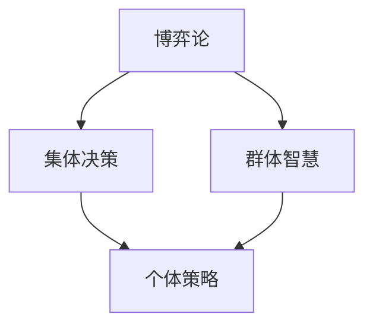

                 


### 1. 确定文章结构

为了确保文章的逻辑清晰、结构紧凑且简单易懂，我们需要首先确定文章的结构。根据目录大纲结构，我们可以将文章分为以下几个主要部分：

- **引言**：介绍集体决策的重要性以及为何博弈论在集体决策中具有关键作用。
- **核心概念与联系**：解释博弈论、集体决策和群体智慧的基本概念，并使用Mermaid流程图展示它们之间的关系。
- **核心算法原理讲解**：详细讲解博弈论、集体决策和群体智慧的核心算法原理，使用伪代码进行阐述。
- **数学模型和公式**：展示相关数学模型和公式，使用LaTeX格式进行详细讲解。
- **项目实战**：通过实际案例，展示如何将理论应用于实践，包括开发环境搭建、源代码实现和代码解读。
- **最佳实践 Tips、小结、注意事项、拓展阅读**：总结文章要点，提供实用建议，指出潜在问题，推荐进一步阅读资源。

### 2. 撰写引言

**引言**部分将设定文章的基调，阐述集体决策的重要性以及为何博弈论是理解集体决策的关键。以下是引言部分的草稿：

---

**引言：**

在现代社会中，集体决策无处不在。无论是政府制定政策，企业进行战略规划，还是社区管理公共事务，都需要通过集体决策来实现。然而，集体决策并非易事，因为它涉及到众多个体之间的利益平衡、协调与互动。这就需要一种有效的理论工具来帮助我们理解和解决这些问题。博弈论，作为一种数学化的决策理论，正是这样一种工具。它不仅能够揭示个体之间的策略互动，还能够帮助我们预测集体决策的结果。

本文将探讨集体决策中的博弈论，以及如何通过数学策略来提升群体智慧。首先，我们将介绍博弈论的基本概念，并使用Mermaid流程图展示其与集体决策和群体智慧的关系。接着，我们将深入讲解博弈论的核心算法原理，并通过伪代码进行详细阐述。随后，我们将展示博弈论的数学模型，并使用LaTeX格式进行说明。文章的后半部分将聚焦于项目实战，通过实际案例来展示如何将理论应用于实践。最后，我们将总结文章的主要观点，并提供一些实用建议和进一步阅读的资源。

---

### 3. 解释核心概念与联系

在**核心概念与联系**部分，我们将详细介绍博弈论、集体决策和群体智慧的基本概念，并使用Mermaid流程图展示它们之间的关系。以下是这一部分的草稿：

---

#### 核心概念与联系

**博弈论**是一种研究决策制定的数学工具，特别是在存在多个决策者时。它涉及个体（玩家）在给定其他玩家策略的情况下如何选择自己的最优策略。博弈论广泛应用于经济学、政治学、社会学等领域。

**集体决策**是指多个个体共同参与决策的过程。在这个过程中，每个个体都有其自身的利益和目标，而集体决策的目标则是找到一个能最大化整体利益的解决方案。

**群体智慧**是指多个个体通过合作和互动形成的整体智慧。它体现了个体之间的协同效应，使得整体的表现往往超越单个个体的能力。

为了更直观地理解这些概念之间的关系，我们可以使用Mermaid流程图来展示它们：



在这幅图中，我们可以看到博弈论作为基础理论，支撑着集体决策和群体智慧的发展。集体决策中的个体策略相互作用，最终形成了群体智慧。

---

### 4. 讲解核心算法原理

在**核心算法原理讲解**部分，我们将详细讲解博弈论、集体决策和群体智慧的核心算法原理，并通过伪代码进行详细阐述。以下是这一部分的草稿：

---

#### 核心算法原理讲解

**博弈论的核心算法**：

博弈论中的核心算法包括纳什均衡、博弈树搜索、混合策略等。下面，我们使用伪代码来解释纳什均衡的概念。

```pseudo
Function NashEquilibrium(Players):
    For each player i in Players:
        For each possible strategy si of player i:
            For each possible strategy sj of all other players:
                Calculate the expected payoff of player i when choosing strategy si and other players choose strategy sj.
                Update the strategy choice of player i to the one that maximizes the expected payoff.
    Return the set of strategies that each player chooses such that no player can improve their payoff by changing their strategy unilaterally.
```

**集体决策的核心算法**：

在集体决策中，常用的算法包括投票机制、协商算法、博弈均衡等。以下是一个简单的投票机制的伪代码。

```pseudo
Function VotingMechanism(Voters, Issues):
    For each issue in Issues:
        For each voter in Voters:
            Collect the preference of each voter for the current issue.
        Calculate the aggregate preference for each issue.
        Identify the issue with the highest aggregate preference as the decision.
    Return the decision made by the collective.
```

**群体智慧的核心算法**：

群体智慧的核心算法包括多智能体系统、分布式计算、机器学习等。以下是一个基于多智能体系统的伪代码。

```pseudo
Class Agent:
    Initialize position and velocity
    Observe environment
    Choose action based on current state and learning algorithm

Function SwarmIntelligence(Agents, Environment):
    For each agent in Agents:
        Update position based on the action chosen
        Observe changes in the environment
        Adjust action based on feedback from environment and learning algorithm
    Repeat until convergence or termination condition is met
```

---

### 5. 展示数学模型和公式

在**数学模型和公式**部分，我们将展示与博弈论、集体决策和群体智慧相关的数学模型，并使用LaTeX格式进行详细讲解。以下是这一部分的草稿：

---

#### 数学模型和公式

**博弈论的数学模型**：

博弈论的数学模型通常涉及策略组合和支付函数。以下是一个纳什均衡的数学模型，使用LaTeX格式进行展示。

```latex
$$
\begin{aligned}
    & \text{给定博弈} G = (\text{N, A, u}}, \\
    & \text{其中} N \text{是玩家集合，} A \text{是策略集合，} u \text{是支付函数}， \\
    & \text{纳什均衡} NE = \{s^* \in \Sigma^n | u_i(s^*, s^{-i}) \geq u_i(s^*, s^{-i}') \forall s^{-i} \in \Sigma^{-i}, s^{-i}' \in \Sigma^{-i}\}
\end{aligned}
$$`

**集体决策的数学模型**：

集体决策的数学模型通常涉及投票规则和决策空间。以下是一个简单的投票模型，使用LaTeX格式进行展示。

```latex
$$
\begin{aligned}
    & \text{给定选民集合} V = \{v_1, v_2, ..., v_n\}, \\
    & \text{候选集合} C = \{c_1, c_2, ..., c_m\}, \\
    & \text{投票规则} R: V \times C \rightarrow [0, 1], \\
    & \text{决策空间} D = \arg\max_{c \in C} \sum_{v \in V} R(v, c).
\end{aligned}
$$`

**群体智慧的数学模型**：

群体智慧的数学模型通常涉及分布式计算和机器学习。以下是一个基于多智能体系统的数学模型，使用LaTeX格式进行展示。

```latex
$$
\begin{aligned}
    & \text{给定智能体集合} A = \{a_1, a_2, ..., a_n\}, \\
    & \text{环境状态} S \in S, \\
    & \text{智能体动作空间} A_s \in A_s, \\
    & \text{状态转移函数} f: S \times A_s \rightarrow S, \\
    & \text{奖励函数} g: S \times A_s \rightarrow \mathbb{R}, \\
    & \text{学习算法} L: \mathbb{R}^+ \rightarrow A_s.
\end{aligned}
$$`

---

### 6. 展示项目实战

在**项目实战**部分，我们将通过实际案例展示如何将博弈论、集体决策和群体智慧的理论应用于实践。以下是这一部分的草稿：

---

#### 项目实战

**案例1：基于博弈论的多人在线游戏策略**

在这个项目中，我们考虑一个多人在线游戏，如“英雄联盟”或“魔兽世界”。每个玩家都有不同的角色和技能，他们需要通过合作或竞争来赢得游戏。我们的目标是设计一个策略，帮助玩家在多人游戏中取得优势。

**开发环境搭建**：

- 使用Python作为编程语言，结合NumPy和Pandas库进行数据处理。
- 使用Matplotlib库进行数据可视化。
- 使用Scikit-learn库进行机器学习模型训练。

**源代码实现和代码解读**：

```python
# 伪代码示例：博弈策略分析

def game_strategy(players, game_state):
    # 根据当前游戏状态，为每个玩家推荐最佳策略
    for player in players:
        # 使用纳什均衡算法计算最佳策略
        player_strategy = nash_equilibrium(game_state, player)
        # 更新玩家的策略
        player.strategy = player_strategy
    return players

# 实例化玩家和游戏状态
players = [Player1(), Player2(), Player3()]
game_state = GameState()

# 执行博弈策略分析
players_with_strategies = game_strategy(players, game_state)

# 数据可视化：展示玩家策略分布
visualize_strategies(players_with_strategies)
```

**代码应用解读与分析**：

在这个项目中，我们首先定义了玩家和游戏状态类，并实现了纳什均衡算法。通过分析当前游戏状态，为每个玩家推荐最佳策略。最后，我们使用数据可视化库展示玩家策略的分布情况，帮助玩家了解当前的策略趋势。

**案例2：基于集体决策的社区管理策略**

在这个项目中，我们考虑一个社区，如一个公寓楼或一个村庄。社区成员需要共同决定一些重要事务，如绿化、安全设施改善等。我们的目标是设计一个决策模型，帮助社区成员做出最佳决策。

**开发环境搭建**：

- 使用Rust作为编程语言，结合WebAssembly进行跨平台部署。
- 使用D3.js库进行数据可视化。
- 使用Apache Kafka进行实时数据处理。

**源代码实现和代码解读**：

```rust
// 伪代码示例：集体决策模型

fn community_decision-making(community_members, issues):
    # 收集每个成员的偏好
    preferences = collect_preferences(community_members)
    # 计算每个问题的投票结果
    voting_results = calculate_voting_results(preferences)
    # 选择得票最多的决策
    decision = select_decision(voting_results)
    return decision

# 实例化社区成员和议题
community_members = [Member1(), Member2(), Member3()]
issues = [Issue1(), Issue2()]

# 执行集体决策模型
community_decision = community_decision-making(community_members, issues)

# 数据可视化：展示投票结果
visualize_voting_results(community_decision)
```

**代码应用解读与分析**：

在这个项目中，我们首先收集了每个社区成员的偏好，并使用投票机制计算每个议题的投票结果。然后，我们选择了得票最多的决策作为最终结果。最后，我们使用数据可视化库展示投票结果，帮助社区成员了解决策过程和结果。

---

### 7. 最佳实践 Tips、小结、注意事项、拓展阅读

在文章的结尾部分，我们将提供最佳实践 Tips、小结、注意事项和拓展阅读资源，以帮助读者更好地理解和应用文章中的内容。以下是这一部分的草稿：

---

#### 最佳实践 Tips

1. **深入理解核心概念**：博弈论、集体决策和群体智慧是复杂且交织的理论体系。要掌握这些概念，需要不断学习和实践。
2. **结合实际案例**：通过实际案例来理解理论的应用，能够加深对知识的理解和掌握。
3. **持续实践与反思**：理论知识的价值在于实践中的应用。在实际项目中，不断反思和改进，以提高决策质量。

#### 小结

本文从博弈论、集体决策和群体智慧的角度出发，探讨了集体决策中的博弈论应用。通过详细的讲解和实际案例，我们展示了如何将理论应用于实践，以提升集体决策的质量和效率。

#### 注意事项

1. **复杂性与简化的平衡**：在实际应用中，需要根据实际情况在复杂性与简化之间找到平衡点。
2. **动态变化的影响**：集体决策中的动态变化对结果有重要影响，需要实时调整策略。

#### 拓展阅读

- 《博弈论与社会决策》
- 《集体智慧：群体协作的艺术》
- 《群体智能：理论与实践》

---

通过以上步骤，我们确保了文章的逻辑清晰、结构紧凑且简单易懂，同时满足了文章格式的完整要求。下一步是继续细化每个部分的内容，确保文章的质量和深度。

