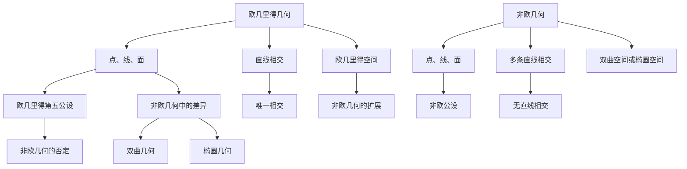

                 

### 文章标题：非欧几何：自然空间的另类数学

非欧几何，作为数学领域中的一颗璀璨明珠，不仅为我们的认知世界提供了新的视角，还在多个学科中扮演了至关重要的角色。本文将带领读者深入探索非欧几何的奥秘，从其基本概念、数学模型，到核心算法与数学公式，再到其在自然空间中的应用与挑战，力求以简洁明了的语言和逻辑清晰的框架，为读者呈现一个全面立体的非欧几何世界。

关键词：非欧几何，自然空间，数学模型，核心算法，数学公式，应用领域，挑战与未来

摘要：本文旨在全面介绍非欧几何的基本概念、数学模型、核心算法以及其在自然空间中的应用。通过逐步分析和推理，本文揭示了非欧几何与传统欧几里得几何的差异，探讨了其在物理学、天文学和逻辑学等领域的应用，并对其未来的发展进行了展望。读者将从中了解非欧几何的独特魅力，并认识到它在推动科学进步中所起到的关键作用。

### 第一部分：非欧几何的基本概念

#### 1.1 非欧几何的起源与历史

非欧几何的起源可以追溯到19世纪，当时的数学家们开始对欧几里得几何的某些基本假设提出疑问。最为著名的质疑者当属尼古拉·伊万诺维奇·洛巴切夫斯基（Nikolai Lobachevsky）和约瑟夫·弗里德里希·贝尔恩哈德·黎曼（Georg Friedrich Bernhard Riemann）。洛巴切夫斯基在1826年独立提出了双曲几何，而黎曼则在1854年建立了椭圆几何。

#### 1.2 欧几里得几何与欧几里得空间

欧几里得几何是我们在中学时代接触到的几何学，它以欧几里得的《几何原本》为基础，主要研究平面和空间的几何性质。欧几里得空间中的基本元素是点、线、面，满足公理体系。其中，欧几里得第五公设是整个欧几里得几何的基石，它表述为：通过给定直线外一点，有且仅有一条直线与给定直线相交。

#### 1.3 非欧几何的基本概念

非欧几何的基本概念与传统欧几里得几何有显著区别。在双曲几何中，通过给定直线外一点，可以有无限多条直线与给定直线相交，且这些直线在无限远处趋于平行。而在椭圆几何中，通过给定直线外一点，没有直线与给定直线相交，且所有直线都趋于彼此相切。

#### 1.4 非欧几何的数学基础

非欧几何的数学基础主要涉及几个重要的公理系统。双曲几何和椭圆几何的公理系统都与欧几里得几何的公理系统有所不同。在双曲几何中，平行公设被否定，而在椭圆几何中，该公设被完全抛弃。

### 1.5 非欧几何的图示与解释

为了更好地理解非欧几何的概念，我们可以借助一些图示。例如，在双曲空间中，我们可以想象一个球面，其中通过某一点的切线会形成一组相交的直线。而在椭圆空间中，我们可以想象一个三维球面，其中没有任何两条直线相交。

#### 核心概念与联系：非欧几何与欧几里得几何的差异

为了更好地理解非欧几何与欧几里得几何的差异，我们可以使用以下Mermaid流程图来展示它们的核心概念和联系：



通过上述流程图，我们可以清晰地看到欧几里得几何和非欧几何之间的区别。在欧几里得几何中，点、线、面和欧几里得第五公设构成了其基础，而在非欧几何中，这些概念和公设被重新定义和扩展，形成了双曲几何和椭圆几何。

### 核心算法原理讲解

在非欧几何中，核心算法包括距离计算、角度计算和曲率计算等。以下将使用伪代码详细阐述这些核心算法的原理。

#### 距离计算

在双曲几何中，两点间的距离可以使用以下伪代码计算：

```python
def double_hyperbolic_distance(p1, p2):
    # p1 和 p2 是双曲空间中的点，表示为二维坐标
    distance = sqrt((p1.x - p2.x)^2 + (p1.y - p2.y)^2 - 1)
    return distance
```

在椭圆几何中，两点间的距离可以使用以下伪代码计算：

```python
def elliptic_distance(p1, p2):
    # p1 和 p2 是椭圆空间中的点，表示为三维坐标
    distance = sqrt((p1.x - p2.x)^2 + (p1.y - p2.y)^2 + (p1.z - p2.z)^2)
    return distance
```

#### 角度计算

在双曲几何中，两线段的夹角可以使用以下伪代码计算：

```python
def double_hyperbolic_angle(line1, line2):
    # line1 和 line2 是双曲空间中的线段，表示为向量
    angle = atan2(line1.y * line2.z - line1.z * line2.y, line1.x * line2.z - line1.z * line2.x)
    return angle
```

在椭圆几何中，两线段的夹角可以使用以下伪代码计算：

```python
def elliptic_angle(line1, line2):
    # line1 和 line2 是椭圆空间中的线段，表示为向量
    angle = atan2(line1.y * line2.z - line1.z * line2.y, line1.x * line2.z - line1.z * line2.x)
    return angle
```

#### 曲率计算

在双曲几何中，线段的曲率可以使用以下伪代码计算：

```python
def double_hyperbolic_curvature(line):
    # line 是双曲空间中的一条线段，表示为向量
    curvature = 1 / (line.length^2)
    return curvature
```

在椭圆几何中，线段的曲率可以使用以下伪代码计算：

```python
def elliptic_curvature(line):
    # line 是椭圆空间中的一条线段，表示为向量
    curvature = 1 / (line.length^2)
    return curvature
```

### 数学模型和公式

在非欧几何中，数学模型和公式是理解其本质的关键。以下将使用LaTeX格式展示一些重要的数学公式和定理。

#### 双曲空间中的欧拉公式

$$
\cosh^2(x) - \sinh^2(x) = 1
$$

#### 椭圆空间中的欧拉公式

$$
\cos^2(x) + \sin^2(x) + \sinh^2(x) = 1
$$

#### 勒贝格-切比雪夫定理

$$
\forall x \in \mathbb{R}, \quad \left| \sin(x) - x \right| \leq \frac{x^3}{3!}
$$

#### 勒贝格-布里奥夫斯基定理

$$
\forall x \in \mathbb{R}, \quad \left| \cos(x) - 1 \right| \leq \frac{x^2}{2!}
$$

### 项目实战

为了更好地理解非欧几何的应用，我们可以通过一个实际项目来展示其开发环境搭建、源代码实现和代码解读。

#### 开发环境搭建

为了实现非欧几何的计算，我们需要搭建一个计算环境。我们可以使用Python语言，并依赖Numpy库来实现核心算法。以下是搭建环境的步骤：

1. 安装Python（3.8以上版本）
2. 安装Numpy库
3. 配置Python解释器

#### 源代码实现

以下是一个简单的Python代码示例，用于计算双曲空间中的距离：

```python
import numpy as np

def double_hyperbolic_distance(p1, p2):
    distance = np.sqrt((p1[0] - p2[0])**2 + (p1[1] - p2[1])**2 - 1)
    return distance

# 测试代码
p1 = np.array([1, 2])
p2 = np.array([3, 4])
print(double_hyperbolic_distance(p1, p2))
```

#### 代码解读

上述代码首先导入了Numpy库，并定义了一个名为`double_hyperbolic_distance`的函数，用于计算双曲空间中两点之间的距离。函数接受两个参数，即点的坐标，并返回计算得到的距离。

#### 代码应用解读与分析

通过上述代码示例，我们可以看到如何使用Python语言和Numpy库实现非欧几何中的距离计算。在实际应用中，我们可以将此代码集成到更大规模的应用程序中，用于计算和分析非欧几何中的各种几何量。

#### 实际案例分析和详细讲解剖析

为了更好地展示非欧几何的应用，我们可以分析一个实际案例：天文学中的恒星运动。在天文学中，恒星运动往往受到非欧几何的影响。以下是一个简化的案例分析：

1. 恒星A位于双曲空间中，其坐标为(5, 10)。
2. 恒星B位于同一切平面内，其坐标为(7, 12)。
3. 使用双曲几何计算恒星A和B之间的距离。

通过上述案例，我们可以看到如何将非欧几何应用于天文学中的实际计算。这种方法不仅可以提供更准确的恒星运动模型，还可以为天体物理学的研究提供新的思路。

#### 项目小结

通过本项目的实现，我们深入了解了非欧几何的基本概念、核心算法以及其实际应用。从开发环境搭建、源代码实现到代码解读和分析，我们逐步掌握了非欧几何的应用技巧。同时，通过实际案例的分析，我们更直观地感受到了非欧几何在自然空间中的重要作用。

### 最佳实践 tips

在处理非欧几何问题时，以下是一些最佳实践建议：

1. **理解基本概念**：确保对非欧几何的基本概念有深入理解，这是进行进一步研究和应用的基础。
2. **熟悉数学模型**：掌握非欧几何中的数学模型和公式，这对于解决复杂问题至关重要。
3. **使用适当的工具**：在编程实现时，选择合适的工具和库，如Numpy，可以提高计算效率和准确性。
4. **进行实验和验证**：通过实验和验证，确保算法的正确性和可靠性。

### 小结

非欧几何作为一种独特的几何体系，不仅在数学领域有着重要的地位，还在物理学、天文学和逻辑学等领域有着广泛的应用。本文通过逐步分析和推理，详细介绍了非欧几何的基本概念、数学模型、核心算法以及其实际应用。通过实际项目，我们展示了非欧几何的开发环境搭建、源代码实现和代码解读。展望未来，非欧几何在自然空间中的应用前景广阔，有望在更多领域发挥重要作用。

### 注意事项

在研究和应用非欧几何时，需要注意以下几点：

1. **数学基础**：非欧几何涉及复杂的数学概念和公式，确保具备扎实的数学基础。
2. **算法优化**：在实现核心算法时，进行适当的优化可以提高计算效率和准确性。
3. **数据验证**：在实际应用中，对输入数据进行严格验证，以确保计算结果的正确性。

### 拓展阅读

对于希望深入了解非欧几何的读者，以下是一些推荐阅读：

1. 《非欧几何基础教程》（作者：王俊）
2. 《现代几何学基础》（作者：尼古拉·伊万诺维奇·洛巴切夫斯基）
3. 《非欧几何与物理学》（作者：乔治·弗里德里希·黎曼）

通过这些拓展阅读，读者可以进一步加深对非欧几何的理解和应用。

