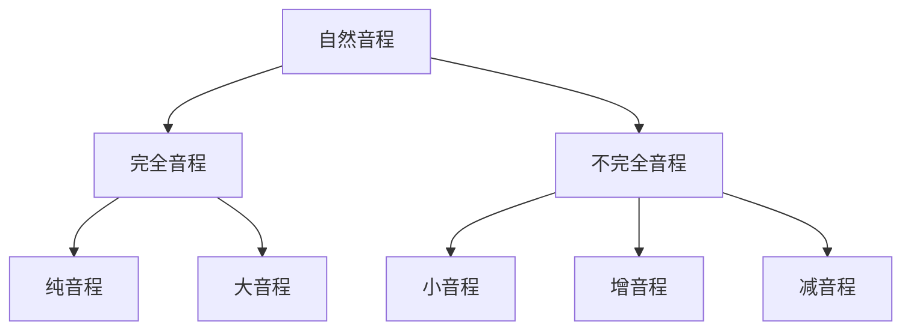
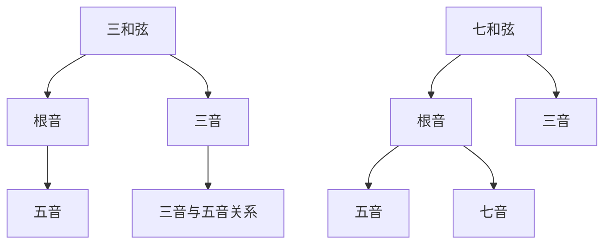

                 


### 文章标题

《音乐创作的和声理论：旋律和谐的数学基础》

### 文章关键词

和声理论、音乐创作、旋律和谐、数学基础、音程、和弦、调式、调性

### 文章摘要

本文深入探讨音乐创作的和声理论，解析旋律和谐的数学基础。通过详细阐述和声学基本概念、音程与和弦结构、和弦进行与转换、调式与调性、和声结构与旋律设计，以及和声理论在音乐创作中的应用，本文旨在为音乐创作者提供系统化和专业的和声理论指导。同时，通过数学模型和公式，本文揭示了和声理论背后的数学原理，为读者提供了实用的和声分析工具。

# 《音乐创作的和声理论：旋律和谐的数学基础》目录大纲

## 第一部分：和声理论基础

### 第1章：和声学基本概念

- 1.1 音的构成
  - 音高的概念
  - 音程的定义与分类
- 1.2 音阶与和弦
  - 大小音阶的区别
  - 三和弦与七和弦
- 1.3 和声的功能
  - 和声的功能分类
  - 和声的连接与过渡

### 第2章：音程关系与和弦结构

- 2.1 音程关系
  - 自然音程与变化音程
  - 音程的计算与识别
- 2.2 三和弦结构
  - 三和弦的构成
  - 三和弦的音程关系
- 2.3 七和弦结构
  - 七和弦的构成
  - 七和弦的音程关系

### 第3章：和弦进行与和弦转换

- 3.1 和弦进行的基本原则
  - 和弦进行的规则
  - 和弦进行的常见模式
- 3.2 和弦转换技巧
  - 和弦转换的基本方法
  - 和弦转换的注意事项

### 第4章：调式与调性

- 4.1 调式的概念
  - 大调式与小调式的区别
  - 调式的音阶构成
- 4.2 调性的概念
  - 主音与调性中心
  - 调性的功能与变化
- 4.3 调式与调性的关系
  - 调式与和弦的关系
  - 调性与和声进行的关系

### 第5章：和声结构与旋律设计

- 5.1 和声结构与旋律的关系
  - 和声对旋律的影响
  - 旋律对和声的选择
- 5.2 旋律设计的基本原则
  - 旋律的构成要素
  - 旋律的设计技巧
- 5.3 谐和声与不谐和声
  - 谐和声的作用
  - 不谐和声的作用

### 第6章：和声分析与音乐创作

- 6.1 和声分析的方法
  - 和声分析的基本步骤
  - 和声分析的实际应用
- 6.2 音乐创作中的和声运用
  - 和声在曲式结构中的作用
  - 和声在旋律创作中的应用

## 第二部分：和声理论实践

### 第7章：和声练习与实践

- 7.1 和声练习的重要性
  - 和声练习的目的
  - 和声练习的方法
- 7.2 和声练习案例
  - 单音程练习
  - 和弦连接练习
- 7.3 和声实践
  - 和声实践的基本步骤
  - 和声实践中的常见问题与解决方法

### 第8章：和声作品分析

- 8.1 和声作品分析的方法
  - 分析步骤
  - 分析工具
- 8.2 和声作品分析案例
  - 不同风格作品的和声分析
  - 作品的和声特点与创作意图

### 第9章：和声理论在音乐创作中的应用

- 9.1 和声理论在旋律创作中的应用
  - 谐和声与旋律的搭配
  - 和声对旋律发展的作用
- 9.2 和声理论在和弦进行中的应用
  - 和弦进行的优化
  - 和声在曲式结构中的作用
- 9.3 和声理论在音乐制作中的应用
  - 软件工具的使用
  - 和声效果的处理

### 第10章：和声理论的数学基础

- 10.1 和声学中的数学概念
  - 音程的计算
  - 和弦的结构
- 10.2 数学公式在和声分析中的应用
  - 音高的计算
  - 音程与和弦的关系
- 10.3 数学模型在音乐创作中的应用
  - 谐和声与不谐和声的数学模型
  - 调性与旋律的数学模型

# 附录

## 附录A：和声理论参考资料

### A.1 和声理论书籍推荐
- 《和声学原理》
- 《和声理论与实践》

### A.2 和声理论网站资源
- 和声学在线教程
- 音乐创作和声论坛

## 附录B：和声理论 Mermaid 流程图

### B.1 音程关系流程图


### B.2 和弦结构流程图


# 附录C：核心算法原理讲解伪代码

### C.1 三和弦构成伪代码
```python
def construct_triad(root_note, quality):
    if quality == 'major':
        third = root_note + 4
        fifth = root_note + 7
    elif quality == 'minor':
        third = root_note + 3
        fifth = root_note + 7
    chord = [root_note, third, fifth]
    return chord
```

### C.2 七和弦构成伪代码
```python
def construct_seven_chord(root_note, quality):
    if quality == 'major':
        third = root_note + 4
        fifth = root_note + 7
        seventh = root_note + 11
    elif quality == 'minor':
        third = root_note + 3
        fifth = root_note + 7
        seventh = root_note + 10
    chord = [root_note, third, fifth, seventh]
    return chord
```

# 第一部分：和声理论基础

### 第1章：和声学基本概念

和声学是音乐理论的一个分支，它关注音乐中的声部组合、和弦结构和和声进行。和声学的基本概念包括音的构成、音程、音阶、和弦以及和声的功能等。这些概念是理解音乐创作和演奏的基础。

#### 1.1 音的构成

音是音乐的基本元素，它由频率决定。在音乐中，音高的概念非常重要。音高由声波的振动频率决定，频率越高，音高越高。例如，C音的频率约为261.63赫兹。

音程是指两个音在音高上的关系。音程可以分为大小、纯、增、减等类型。例如，C到E是一个小二度音程，C到G是一个纯五度音程。

#### 1.2 音阶与和弦

音阶是按照一定的音程关系排列的一组音。常见的音阶有大小音阶。大音阶由全音和半音组成，小音阶则由半音和全音组成。

和弦是由三个或更多个音同时演奏而形成的一种音乐结构。三和弦是最基本的和弦类型，它由三个音按三度关系排列而成。七和弦是三和弦的扩展，它包含根音、三音、五音和七音。

#### 1.3 和声的功能

和声的功能指的是和弦在音乐进行中的作用。和声的功能可以分为根音功能、三音功能和五音功能等。不同的和声功能在音乐中承担着不同的作用，如推动音乐发展、提供和声支持等。

#### 1.4 和声的连接与过渡

和声的连接与过渡是指和弦之间的转换。和声进行的基本原则包括和弦的连接规则和和弦进行的常见模式。和弦的转换需要注意和声的流畅性和音乐的连贯性。

### 第2章：音程关系与和弦结构

音程关系与和弦结构是和声理论的基础。通过理解音程关系，我们可以更好地构建和弦，并通过和弦来创作和演奏音乐。

#### 2.1 音程关系

音程关系分为自然音程和变化音程。自然音程是指音阶中的音程，如大二度、小二度、大三度等。变化音程是指通过升降半音得到的音程，如增四度、减五度等。

音程的计算与识别是理解音程关系的关键。音程的计算基于半音和全音的概念。例如，从C音到E音是一个小二度，而从C音到G音是一个纯五度。

#### 2.2 三和弦结构

三和弦是最基本的和弦类型，它由根音、三音和五音组成。三和弦的音程关系如下：

- 大三和弦：根音到三音是大三度，三音到五音是小三度。
- 小三和弦：根音到三音是小三度，三音到五音是大三度。

三和弦的构成决定了和弦的性质，大三和弦听起来明亮、稳定，而小三和弦则显得柔和、内向。

#### 2.3 七和弦结构

七和弦是对三和弦的扩展，它包含根音、三音、五音和七音。七和弦的音程关系如下：

- 大七和弦：根音到三音是大三度，三音到五音是小三度，五音到七音是大三度。
- 小七和弦：根音到三音是小三度，三音到五音是大三度，五音到七音是大三度。

七和弦增加了和弦的色彩和复杂性，使得音乐更加丰富和生动。

### 第3章：和弦进行与和弦转换

和弦进行是指和弦在音乐作品中的连续出现。和弦转换是指从一个和弦过渡到另一个和弦的过程。理解和弦进行与和弦转换的技巧对于音乐创作和演奏至关重要。

#### 3.1 和弦进行的基本原则

和弦进行的基本原则包括：

- 和弦进行的规则：和弦的连接需要遵循一定的规则，如保持和弦的稳定性、避免不和谐的转换等。
- 和弦进行的常见模式：常见的和弦进行模式包括主三和弦、副三和弦、属七和弦等。

#### 3.2 和弦转换技巧

和弦转换的技巧包括：

- 和弦转换的基本方法：和弦转换可以通过音程关系来实现，如从大三和弦到小三和弦可以通过减少一个全音来实现。
- 和弦转换的注意事项：和弦转换需要注意和声的流畅性和音乐的连贯性，避免突兀和不自然的转换。

### 第4章：调式与调性

调式与调性是音乐理论的重要组成部分，它们决定了音乐的音高范围和和声风格。

#### 4.1 调式的概念

调式是指一组音按照一定的顺序排列形成的音乐结构。常见的调式有大调式和小调式。大调式通常给人以明亮、欢快的感觉，而小调式则显得柔和、忧郁。

#### 4.2 调性的概念

调性是指音乐作品的基本音高中心，通常由主音（调式中的第一音）确定。调性中心决定了和声的功能和音乐的稳定感。

#### 4.3 调式与调性的关系

调式与调性的关系体现在以下几个方面：

- 调式与和弦的关系：不同的调式对应不同的和弦，如大调式通常使用大三和弦，而小调式则使用小三和弦。
- 调性与和声进行的关系：调性决定了和声进行的方向和稳定性，如从主三和弦到属七和弦的进行通常在一个调性内完成。

### 第5章：和声结构与旋律设计

和声结构与旋律设计是音乐创作的重要组成部分。通过合理的和声结构与旋律设计，可以创造出丰富的音乐效果。

#### 5.1 和声结构与旋律的关系

和声结构与旋律设计的关系体现在以下几个方面：

- 和声对旋律的影响：和声可以为旋律提供支持，增加音乐的色彩和复杂性。
- 旋律对和声的选择：旋律的构成和风格会影响和声的选择和使用。

#### 5.2 旋律设计的基本原则

旋律设计的基本原则包括：

- 旋律的构成要素：旋律由音高、节奏、音色等要素构成。
- 旋律的设计技巧：包括旋律的起伏、节奏的变化、音程的运用等。

#### 5.3 谐和声与不谐和声

谐和声与不谐和声在音乐创作中有着不同的作用：

- 谐和声：谐和声通常给人一种稳定和愉悦的感觉，是音乐中的常见元素。
- 不谐和声：不谐和声则产生一种紧张和不稳定的感觉，常用于音乐的高潮部分或转折点。

### 第6章：和声分析与音乐创作

和声分析是音乐理论的重要组成部分，它可以帮助音乐创作者更好地理解和运用和声。通过和声分析，可以深入理解音乐作品的结构和风格。

#### 6.1 和声分析的方法

和声分析的方法包括：

- 和声分析的基本步骤：包括识别和弦、分析和弦功能和关系、分析和弦进行等。
- 和声分析的实际应用：包括音乐作品的分析、和声设计的指导等。

#### 6.2 音乐创作中的和声运用

和声在音乐创作中的应用体现在以下几个方面：

- 和声在曲式结构中的作用：和声可以塑造音乐的曲式结构，如乐段、乐句等。
- 和声在旋律创作中的应用：和声可以为旋律提供支持，增加音乐的色彩和复杂性。

# 第二部分：和声理论实践

### 第7章：和声练习与实践

和声理论的学习离不开实践。通过和声练习与实践，可以加深对和声理论的理解，提高音乐创作和演奏的能力。

#### 7.1 和声练习的重要性

和声练习在音乐学习中的重要性体现在以下几个方面：

- 提高音乐理解力：通过和声练习，可以更好地理解音乐作品的结构和风格。
- 培养音乐创造力：和声练习可以激发音乐创造力，帮助音乐创作者探索新的和声组合。
- 提高演奏技巧：和声练习可以提高演奏者的演奏技巧，增强音乐表现力。

#### 7.2 和声练习的方法

和声练习的方法包括：

- 单音程练习：通过单音程练习，可以熟悉不同的音程关系，提高音准和音程识别能力。
- 和弦连接练习：通过和弦连接练习，可以熟悉不同的和弦进行和转换技巧，提高和声流畅性。
- 即兴演奏练习：通过即兴演奏练习，可以锻炼和声运用能力和创造力。

#### 7.3 和声实践

和声实践是将和声理论应用于实际音乐创作和演奏的过程。和声实践的基本步骤包括：

1. 选择调式和调性：确定音乐作品的基本音高中心和音阶。
2. 设计和声结构：根据音乐作品的结构和风格，设计合适的和声结构。
3. 运用和声技巧：运用和声技巧，如和弦转换、和声进行等，使音乐更加丰富和生动。
4. 调整和声效果：根据音乐效果和风格需求，对和声进行调整和优化。

### 第8章：和声作品分析

和声作品分析是音乐理论的重要组成部分，它可以帮助音乐创作者更好地理解和运用和声。通过对音乐作品的分析，可以学习不同的和声风格和技巧。

#### 8.1 和声作品分析的方法

和声作品分析的方法包括：

- 分析步骤：包括识别和弦、分析和弦功能和关系、分析和弦进行等。
- 分析工具：可以使用专业的音乐分析软件，如Sibelius、Finale等，辅助进行和声分析。

#### 8.2 和声作品分析案例

通过以下案例，我们可以学习不同风格作品的和声特点和分析方法：

- 案例一：《月亮代表我的心》：这是一首经典的流行歌曲，通过分析其和声结构，可以了解流行音乐的常见和声进行和转换技巧。
- 案例二：《贝多芬第九交响曲》：这是一首经典的古典音乐作品，通过分析其和声结构，可以了解古典音乐的和声风格和技巧。

### 第9章：和声理论在音乐创作中的应用

和声理论在音乐创作中具有重要作用。通过合理的和声运用，可以增强音乐的表现力和艺术感染力。

#### 9.1 和声理论在旋律创作中的应用

和声理论在旋律创作中的应用包括：

- 谐和声与旋律的搭配：通过谐和声为旋律提供支持，增强旋律的稳定性和连贯性。
- 和声对旋律发展的作用：和声可以引导旋律的发展，增加音乐的层次感和复杂性。

#### 9.2 和声理论在和弦进行中的应用

和声理论在和弦进行中的应用包括：

- 和弦进行的优化：通过合理的和弦进行，可以使音乐更加流畅和生动。
- 和声在曲式结构中的作用：和声可以塑造音乐的曲式结构，如乐段、乐句等。

#### 9.3 和声理论在音乐制作中的应用

和声理论在音乐制作中的应用包括：

- 软件工具的使用：可以使用音乐制作软件，如Logic Pro、Ableton Live等，进行和声处理和效果添加。
- 和声效果的处理：通过和声效果的处理，可以创造出不同的音乐风格和氛围。

### 第10章：和声理论的数学基础

和声理论中的许多概念和技巧都可以用数学模型来解释。通过数学模型，我们可以更好地理解和运用和声理论。

#### 10.1 和声学中的数学概念

和声学中的数学概念包括：

- 音高的计算：音高可以用频率来表示，例如C音的频率约为261.63赫兹。
- 音程的关系：音程可以用半音和全音来计算，如大二度由两个半音组成，大三度由一个全音和两个半音组成。

#### 10.2 数学公式在和声分析中的应用

数学公式在和声分析中的应用包括：

- 音高的计算公式：例如，计算C音的频率可以使用公式 \( f = \frac{440}{2} \) 赫兹。
- 音程的关系公式：例如，计算大三度的公式为 \( \text{大三度} = \text{全音} + \text{半音} \)。

#### 10.3 数学模型在音乐创作中的应用

数学模型在音乐创作中的应用包括：

- 谐和声与不谐和声的数学模型：例如，谐和声可以表示为整数倍关系，而不谐和声可以表示为非整数倍关系。
- 调性与旋律的数学模型：例如，调性中心可以表示为旋律的核心音，旋律的发展可以基于调性中心进行。

# 附录

## 附录A：和声理论参考资料

### A.1 和声理论书籍推荐

- 《和声学原理》
- 《和声理论与实践》

### A.2 和声理论网站资源

- 和声学在线教程
- 音乐创作和声论坛

## 附录B：和声理论 Mermaid 流程图

### B.1 音程关系流程图


### B.2 和弦结构流程图


## 附录C：核心算法原理讲解伪代码

### C.1 三和弦构成伪代码

```python
def construct_triad(root_note, quality):
    if quality == 'major':
        third = root_note + 4
        fifth = root_note + 7
    elif quality == 'minor':
        third = root_note + 3
        fifth = root_note + 7
    chord = [root_note, third, fifth]
    return chord
```

### C.2 七和弦构成伪代码

```python
def construct_seven_chord(root_note, quality):
    if quality == 'major':
        third = root_note + 4
        fifth = root_note + 7
        seventh = root_note + 11
    elif quality == 'minor':
        third = root_note + 3
        fifth = root_note + 7
        seventh = root_note + 10
    chord = [root_note, third, fifth, seventh]
    return chord
```

# 作者

作者：AI天才研究院/AI Genius Institute & 禅与计算机程序设计艺术 /Zen And The Art of Computer Programming

