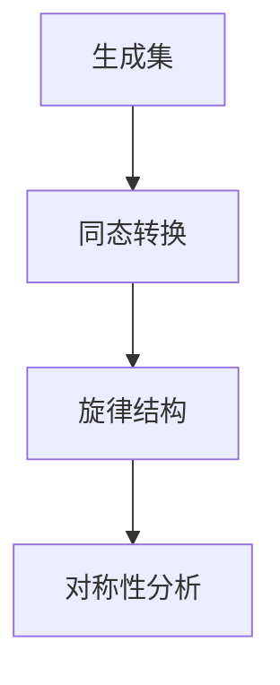

                 

### 引言与概述

#### 音乐与数学的关系

音乐，作为一种艺术形式，长久以来以其独特的魅力吸引着人们的注意。而数学，作为一门科学，以其精确和逻辑性闻名于世。然而，在许多方面，音乐与数学之间存在着深刻的联系。自古以来，人们就开始探索这种联系，试图用数学的工具来理解和解释音乐的本质。这种探索不仅丰富了音乐理论，也为数学在艺术领域的应用开辟了新的道路。

在音乐创作中，数学的应用无处不在。从音高的比例、节奏的模式，到旋律的对称性，数学元素贯穿始终。例如，音高的比例可以通过数学中的调和级数来描述，而节奏的模式则可以用数学中的序列和组合来分析。此外，音乐作品的创作和演奏过程中，也离不开数学的指导。作曲家们常常利用数学模型来预测音乐效果，而音乐家们则通过数学计算来提高演奏的精确性和表现力。

#### 群论的基本概念

群论是数学中的一个基本分支，主要研究由一组元素组成的代数结构。在音乐创作中，群论可以用来描述旋律的对称性、调性的变化以及节奏的模式。简单来说，群论关注的是元素之间的运算及其对称性。

一个群是由一组元素组成的集合，这些元素满足以下条件：
1. **封闭性**：对于群中的任意两个元素 \(a\) 和 \(b\)，它们的运算结果 \(a \cdot b\) 仍然属于该群。
2. **结合律**：对于群中的任意三个元素 \(a\)、\(b\) 和 \(c\)，它们的运算满足结合律，即 \((a \cdot b) \cdot c = a \cdot (b \cdot c)\)。
3. **存在单位元**：群中存在一个元素 \(e\)，使得对于群中的任意元素 \(a\)，都有 \(e \cdot a = a \cdot e = a\)。
4. **存在逆元**：对于群中的任意元素 \(a\)，都存在一个元素 \(a^{-1}\)，使得 \(a \cdot a^{-1} = a^{-1} \cdot a = e\)。

在音乐中，群论的应用主要体现在以下几个方面：

1. **调性分析**：通过群论可以分析不同调性之间的转换关系，例如大调和小调之间的对称性。
2. **节奏模式**：群论可以用来描述和解析复杂的节奏模式，例如组合音乐中的节奏序列。
3. **旋律结构**：群论可以帮助我们理解和分析旋律的对称性，例如旋转对称和平移对称。

#### 本书结构

本书旨在深入探讨群论在音乐创作中的应用，分为以下几个主要部分：

1. **群论基础**：介绍群论的基本概念和性质，包括群的定义、子群、同态等。
2. **调性与对称性**：分析音乐中的调性理论，探讨调性与对称性的关系。
3. **旋律中的群结构**：研究旋律中的群结构，包括旋律的群论描述和对称性分类。
4. **群论在旋律创作中的应用**：探讨群论在旋律创作中的实际运用，包括对称性旋律的创作和群结构在旋律发展中的应用。
5. **数学公式与旋律结构的关系**：分析数学公式在旋律结构分析中的应用，探讨其指导意义。
6. **旋律对称性的算法分析**：介绍对称性检测和生成算法，包括算法原理和实现。
7. **综合案例分析**：通过具体案例，展示群论在音乐创作中的实际应用。
8. **群论在音乐教育中的应用**：探讨群论在音乐教育中的角色，包括理论教学和实践应用。
9. **总结与展望**：总结全书内容，展望群论在音乐创作和音乐科技领域的应用前景。

通过这些部分的详细讨论，本书旨在帮助读者深入理解群论与音乐创作之间的复杂关系，掌握运用数学工具分析音乐作品的方法和技巧。

#### 群论基础

群论是数学中的一个基本分支，主要研究由一组元素组成的代数结构。在音乐创作中，群论可以用来描述旋律的对称性、调性的变化以及节奏的模式。理解群论的基本概念和性质是探索其与音乐创作之间联系的第一步。

**1. 群的定义与性质**

一个群 \(G\) 是由一组元素组成的集合，这些元素满足以下四个条件：
1. **封闭性**：对于群中的任意两个元素 \(a\) 和 \(b\)，它们的运算结果 \(a \cdot b\) 仍然属于该群。即 \(a, b \in G \Rightarrow a \cdot b \in G\)。
2. **结合律**：对于群中的任意三个元素 \(a\)、\(b\) 和 \(c\)，它们的运算满足结合律，即 \((a \cdot b) \cdot c = a \cdot (b \cdot c)\)。
3. **存在单位元**：群中存在一个元素 \(e\)，称为单位元，使得对于群中的任意元素 \(a\)，都有 \(e \cdot a = a \cdot e = a\)。
4. **存在逆元**：对于群中的任意元素 \(a\)，都存在一个元素 \(a^{-1}\)，称为逆元，使得 \(a \cdot a^{-1} = a^{-1} \cdot a = e\)。

用数学语言描述群的定义，可以表示为：
\[ G = \{a | a \cdot b \in G \text{ 对于任意 } a, b \in G\} \]
其中，“\(\cdot\)”表示群运算，通常是一个函数 \( \cdot: G \times G \rightarrow G \)。

**2. 群的运算**

群的基本运算通常称为“乘法”，记作 \(a \cdot b\) 或 \(ab\)。例如，对于整数加法构成的群，运算就是加法，即 \(a + b\)。

一个常见的群运算例子是整数加法群 \( (\mathbb{Z}, +) \)，其中 \( \mathbb{Z} \) 表示所有整数。在这个群中，单位元是 0，每个整数的逆元是它本身（例如，\(3\) 的逆元是 \( -3 \)，因为 \(3 + (-3) = 0\)）。

**3. 子群与同态**

- **子群**：一个群 \(H\) 是另一个群 \(G\) 的子群，如果 \(H\) 是 \(G\) 的非空子集，并且对于 \(H\) 中的任意两个元素 \(a\) 和 \(b\)，它们的运算结果 \(a \cdot b\) 仍然属于 \(H\)。

例如，整数加法群 \( (\mathbb{Z}, +) \) 的子群可以是所有偶数的集合 \( (\{2k | k \in \mathbb{Z}\}, +) \)。

- **同态**：一个函数 \( f: G \rightarrow H \) 是一个同态，如果对于群 \(G\) 和 \(H\) 中的任意元素 \(a\) 和 \(b\)，都有 \(f(a \cdot b) = f(a) \cdot f(b)\)。

例如，整数加法群 \( (\mathbb{Z}, +) \) 到模 3 整数加法群 \( (\mathbb{Z}_3, +) \) 的映射 \( f(n) = n \mod 3 \) 是一个同态，因为对于任意 \(a, b \in \mathbb{Z}\)，有 \(f(a + b) = (a + b) \mod 3 = a \mod 3 + b \mod 3 = f(a) + f(b)\)。

**4. 群的子结构**

- **约化子群**：一个子群 \(H\) 是群 \(G\) 的约化子群，如果对于 \(G\) 中的任意元素 \(a\)，\(aH = Ha\)，即 \(a\) 和 \(H\) 的左陪集与右陪集相等。

- **生成集**：一个集合 \(S\) 是群 \(G\) 的生成集，如果 \(G\) 可以由 \(S\) 中的元素通过群运算生成。即存在一个子群 \(H\)，使得 \(G = \langle S \rangle = \bigcup_{s \in S} sH\)。

- **群直积**：两个群 \(G\) 和 \(H\) 的直积 \(G \times H\) 是一个新的群，其元素是 \(G\) 和 \(H\) 中元素的有序对，运算规则是分量-wise 的运算。即对于 \( (a, b), (c, d) \in G \times H \)，运算规则为 \( (a, b) \cdot (c, d) = (a \cdot c, b \cdot d) \)。

在音乐创作中，群论的应用主要体现在以下几个方面：

1. **调性分析**：通过群论可以分析不同调性之间的转换关系，例如大调和小调之间的对称性。
2. **节奏模式**：群论可以用来描述和解析复杂的节奏模式，例如组合音乐中的节奏序列。
3. **旋律结构**：群论可以帮助我们理解和分析旋律的对称性，例如旋转对称和平移对称。

了解群论的基本概念和性质，为后续章节中更深入地探讨群论在音乐创作中的应用奠定了基础。

#### 调性与对称性

调性是音乐理论中的一个基本概念，它决定了音乐的情感色彩和氛围。调性关系和对称性是音乐创作中至关重要的元素，它们通过数学和群论的视角可以得到深刻的理解。

**1. 调的基本概念**

调性由一系列音高关系确定，通常通过音阶来表示。音阶是由不同音高的音符按一定顺序排列组成的。最常用的音阶包括大调音阶和小调音阶。

- **大调音阶**：大调音阶的音高关系相对稳定，给人以明亮、欢快的感觉。它由七个音符组成，分别是全音、全音、半音、全音、全音、全音和半音。
- **小调音阶**：小调音阶的音高关系相对不稳定，给人以悲伤、忧郁的感觉。它也是由七个音符组成，但是与相应的大调音阶相比，在第三个和第六个音符上有所不同，分别是半音和全音。

**2. 调性关系**

调性关系是指不同调性之间的相互转换关系。常见的调性关系包括：

- **平行调性**：同一音高的两个不同调性，例如C大调和a小调。
- **相对调性**：大调和小调之间的调性关系，例如C大调和a小调。
- **大小调关系**：一个大调和它相对的小调，例如G大调和e小调。

调性关系可以通过数学中的群论来描述。例如，大调和小调之间的关系可以看作是群中的一个子结构。在这个群中，每个调性可以看作是一个元素，而调性的转换可以看作是群运算的结果。

**3. 对称性与旋律结构**

对称性是旋律结构中的一个重要元素，它可以通过群论来描述和分析。

- **旋转对称**：旋转对称是指旋律在某个中心点旋转一定角度后，仍然保持不变。例如，一个八度循环的旋律片段，它在绕中心点旋转时保持不变，具有旋转对称性。
- **平移对称**：平移对称是指旋律在平移一定距离后，仍然保持不变。例如，一个简单的旋律片段在重复时保持不变，具有平移对称性。
- **对角对称**：对角对称是指旋律在两个对角线上对称。例如，一个旋律片段的上下行对位，在主调和对位之间形成对角对称。

在音乐创作中，对称性可以增强旋律的美感和记忆性。作曲家们常常利用对称性来构建复杂的旋律结构，使其在听觉上产生和谐和统一。

**4. 对称性与旋律发展**

对称性不仅在旋律的静态结构中发挥作用，也在旋律的发展过程中起到关键作用。

- **对称性重复**：作曲家可以通过重复旋律片段来创造对称性，增强旋律的节奏和情感表现力。例如，在一个乐句的结束时重复前半部分的旋律，形成一个对称的结构。
- **对称性转换**：作曲家可以通过转换调性或节奏模式来引入对称性。例如，从一个大调转到其相对的小调，形成一个对称的调性转换。

在分析音乐作品时，理解对称性对于揭示作曲家的创作意图和旋律的发展规律至关重要。通过群论的视角，我们可以更深入地理解旋律中的对称性，并探索其在音乐创作中的多样应用。

综上所述，调性与对称性是音乐创作中不可或缺的元素。通过数学和群论的视角，我们可以更全面地理解和分析这些概念，从而提高音乐创作的技巧和创造力。在接下来的章节中，我们将进一步探讨旋律中的群结构，以及群论在音乐创作中的具体应用。

#### 旋律中的群结构

旋律作为音乐的核心元素，其结构可以通过数学中的群结构来描述。理解旋律中的群结构，有助于我们揭示旋律的内在规律和创作技巧。在这一节中，我们将详细探讨旋律的群结构模型、性质及其在旋律分析中的应用。

**1. 旋律的群结构模型**

旋律的群结构模型将旋律中的音符看作是群中的元素，音符之间的转换关系看作是群运算。例如，我们可以将一个简单的旋律片段看作是一个二元组 \( (n, g) \)，其中 \( n \) 表示音符的数量，\( g \) 表示音符之间的转换关系。

- **音符数量**：音符数量决定了旋律的长度。例如，一个四音符的旋律片段可以用 \( (4, g) \) 表示。
- **转换关系**：音符之间的转换关系可以用函数来表示，例如，一个音符到下一个音符的转换可以表示为 \( f(n) \)，其中 \( f \) 是一个映射函数。

在群结构模型中，每个音符都对应群中的一个元素，而音符之间的转换关系则对应群运算。这种模型使我们能够从数学角度来理解和分析旋律的结构。

**2. 旋律的群论性质**

旋律的群论性质包括封闭性、结合律、单位元和逆元。

- **封闭性**：旋律中的转换关系必须满足封闭性，即对于任意两个音符 \( a \) 和 \( b \)，它们的转换结果 \( a \cdot b \) 必须仍然属于旋律的群结构。
- **结合律**：音符之间的转换关系必须满足结合律，即对于任意三个音符 \( a \)、\( b \) 和 \( c \)，有 \( (a \cdot b) \cdot c = a \cdot (b \cdot c) \)。
- **单位元**：群中必须存在一个单位元，即对于任意音符 \( a \)，有 \( e \cdot a = a \cdot e = a \)，其中 \( e \) 是单位元。
- **逆元**：每个音符都必须有对应的逆元，即对于任意音符 \( a \)，存在一个逆元 \( a^{-1} \)，使得 \( a \cdot a^{-1} = a^{-1} \cdot a = e \)。

通过这些性质，我们可以将旋律中的音符看作是满足特定数学规则的元素，从而为旋律分析提供了一种新的视角。

**3. 群论在旋律分析中的应用**

群论在旋律分析中的应用主要体现在以下几个方面：

- **旋律对称性分析**：通过群论，我们可以分析旋律的对称性。例如，一个旋律片段在旋转或平移后仍然保持不变，说明它具有旋转对称性或平移对称性。
- **旋律模式识别**：群论可以帮助我们识别旋律中的重复模式和变化规律。例如，通过分析旋律的群结构，我们可以发现旋律中的循环模式，从而理解旋律的发展规律。
- **旋律创作**：作曲家可以利用群论来创作具有特定对称性的旋律。通过设计特定的群结构，作曲家可以创造出具有独特美感的旋律。

**4. 旋律对称性的分类**

在旋律分析中，对称性是旋律结构中的一个重要特征。根据对称性的不同类型，我们可以将旋律对称性分为以下几种：

- **旋转对称**：一个旋律片段在绕中心点旋转一定角度后仍然保持不变，称为旋转对称。例如，一个简单的四音符旋律片段在旋转180度后仍然保持不变。
- **平移对称**：一个旋律片段在平移一定距离后仍然保持不变，称为平移对称。例如，一个简单的八度循环旋律片段在前后平移时保持不变。
- **对角对称**：一个旋律片段在两个对角线上对称，称为对角对称。例如，一个旋律片段的上行和下行部分在对角线上形成对称。

这些对称性类型在旋律创作中具有重要作用，通过巧妙地运用这些对称性，作曲家可以创造出富有美感和表现力的旋律。

**5. 群论在旋律创作中的应用**

作曲家可以利用群论来创作具有特定对称性的旋律。以下是一些具体的创作方法：

- **对称性旋律的创作原则**：作曲家可以通过设计特定的群结构来创作具有对称性的旋律。例如，通过选择具有旋转对称性的音符序列，创作出具有旋转对称性的旋律。
- **对称性旋律的案例分析**：许多著名的旋律都利用了群论的对称性原则。例如，莫扎特的《第41号弦乐四重奏》中就运用了旋转对称和对称性的转换，创作出富有美感的旋律。
- **对称性旋律的练习方法**：作曲家可以通过练习创作具有对称性的旋律来提高创作技巧。例如，可以尝试创作具有旋转对称性的旋律片段，或者通过变换调性来创作具有平移对称性的旋律。

通过理解旋律中的群结构，我们可以更好地分析音乐作品，发现其中的规律和美感。在接下来的章节中，我们将继续探讨群论在音乐创作中的具体应用，以及数学公式和算法在旋律结构分析中的作用。

#### 群论在旋律创作中的应用

群论作为数学的一个重要分支，不仅在音乐分析中发挥了重要作用，也在音乐创作中具有独特的应用价值。通过理解群论，作曲家可以创作出具有独特对称性和结构美感的旋律。以下将详细探讨群论在旋律创作中的应用，包括对称性旋律的创作原则、实际案例分析以及创作练习方法。

**1. 对称性旋律的创作原则**

对称性是旋律创作中的一个重要概念，它可以帮助作曲家构建和谐且富有变化的旋律结构。以下是几种常用的对称性旋律创作原则：

- **旋转对称**：创作旋转对称的旋律时，作曲家可以选择一组音符序列，并围绕一个中心点进行旋转。例如，如果旋律片段以中央音符为中心旋转180度，两个音符序列将保持相同。这种创作方法可以使旋律具有重复和统一的美感。
- **平移对称**：在创作平移对称的旋律时，作曲家可以在旋律中引入重复的片段，使得旋律在前后平移一定距离后仍然保持不变。例如，一个简单的旋律片段在前后平移时，其音高和节奏关系保持不变。
- **对角对称**：对角对称是指旋律片段在两个对角线上对称。这种对称性可以使旋律具有复杂但和谐的结构。作曲家可以通过设计上行和下行的音符序列，使其在对角线上形成对称。

**2. 对称性旋律的案例分析**

许多著名的旋律都利用了群论的对称性原则。以下是一些具体的案例分析：

- **莫扎特《第41号弦乐四重奏》**：在这部作品中，莫扎特巧妙地运用了旋转对称和对称性的转换。例如，在一个乐章中，旋律的对称性通过旋转和反射操作得到体现，创造出独特的音乐效果。
- **巴赫《G大调小前奏曲》**：在这首作品中，巴赫运用了对角对称性来构建旋律。旋律片段的上行和下行部分形成对角对称，使得旋律具有复杂但和谐的结构。
- **贝多芬《第五交响曲》**：在这部交响曲中，贝多芬运用了多种对称性，包括旋转对称和平移对称。例如，在第一个乐章中，旋律的对称性通过重复和变化得到体现，增强了旋律的表现力。

**3. 对称性旋律的练习方法**

为了提高创作技巧，作曲家可以通过以下练习方法来探索对称性旋律：

- **练习旋转对称**：选择一组简单的音符序列，并尝试将其旋转180度。观察旋转后的旋律，分析其对称性，并尝试对其进行修改，使其更加和谐。
- **练习平移对称**：选择一个旋律片段，并尝试将其前后平移一定距离。观察平移后的旋律，分析其对称性，并尝试对其进行修改，使其在平移后保持不变。
- **练习对角对称**：设计一个上行和下行的音符序列，使其在对角线上对称。通过调整音符的节奏和音高，探索对角对称性在旋律创作中的应用。

**4. 群结构在旋律发展中的应用**

群结构在旋律发展中的应用可以使旋律更加丰富和多样化。以下是一些具体的应用方法：

- **生成新的旋律片段**：通过群运算生成新的旋律片段。例如，选择一个旋律片段作为生成集，并使用群运算生成新的旋律片段。这种方法可以使旋律在保持原有风格的同时，增加变化和多样性。
- **分析旋律的发展规律**：通过分析旋律的群结构，可以揭示旋律的发展规律。例如，通过观察旋律中的群运算，可以分析旋律的循环模式和变化趋势，从而更好地理解旋律的发展过程。
- **创作具有特定对称性的旋律**：通过设计特定的群结构，可以创作出具有特定对称性的旋律。例如，通过选择具有旋转对称性的音符序列，创作出具有旋转对称性的旋律。

总之，群论在旋律创作中的应用为作曲家提供了丰富的创作工具和方法。通过理解群论的对称性和结构，作曲家可以创作出具有独特美感和技术含量的旋律。在接下来的章节中，我们将进一步探讨数学公式和算法在旋律结构分析中的应用，以及这些工具如何帮助作曲家提高创作技巧。

#### 数学公式与旋律结构的关系

在音乐创作中，数学公式和算法的应用为旋律结构的分析提供了强有力的工具。通过数学模型和算法，作曲家可以更好地理解和创造复杂的旋律结构。以下我们将详细探讨数学公式在旋律结构分析中的应用，以及这些工具在旋律创作中的指导意义。

**1. 数学公式在旋律结构分析中的应用**

- **生成函数与旋律结构**

生成函数是数学中用于生成数列和组合的工具，它在旋律结构分析中具有重要作用。生成函数可以描述旋律中音符序列的生成规则，从而揭示旋律的结构特点。

例如，可以使用生成函数 \( f(n) \) 来描述一个旋律片段的音符序列。通过分析生成函数，我们可以发现旋律中的循环模式和变化规律。具体来说，生成函数可以帮助我们识别旋律中的重复片段，以及片段之间的转换关系。

伪代码示例：

```plaintext
// 生成函数示例
function generateMelody(notes, duration) {
    melody = []
    for (i from 1 to n) {
        note = notes[i % length(notes)] + (i - 1) * duration
        melody.append(note)
    }
    return melody
}
```

在这个伪代码中，`generateMelody` 函数根据给定的音符序列 `notes` 和音符持续时间 `duration` 生成一个旋律片段 `melody`。

- **拉格朗日插值法与旋律生成**

拉格朗日插值法是一种常用的数学算法，用于插值和生成新的数据点。在旋律生成中，拉格朗日插值法可以帮助我们根据已有的旋律片段生成新的音符序列。

具体来说，拉格朗日插值法可以通过插值公式生成新的音符，从而形成新的旋律片段。这种方法在旋律创作中具有广泛的应用，例如在作曲软件中生成音乐素材，或者为已有的旋律添加新的变体。

伪代码示例：

```plaintext
// 拉格朗日插值法示例
function lagrangeInterpolate(points) {
    n = length(points)
    result = []
    for (i from 1 to n) {
        y_i = points[i].y
        x_i = points[i].x
        polynomial = 1
        for (j from 1 to n) {
            if (i != j) {
                polynomial = polynomial * (x - points[j].x) / (points[i].x - points[j].x)
            }
        }
        result.append(polynomial * y_i)
    }
    return result
}
```

在这个伪代码中，`lagrangeInterpolate` 函数根据给定的点序列 `points` 生成一个新的音符序列 `result`，用于插值生成新的旋律片段。

- **群论与旋律结构的数学描述**

群论在旋律结构分析中的应用可以帮助我们理解旋律中的对称性和变化规律。通过数学模型，我们可以将旋律中的音符序列表示为群中的元素，并分析其对称性和生成规则。

例如，可以使用群论中的生成集和同态概念来描述旋律的生成规则。具体来说，生成集可以表示旋律中的基本音符序列，而同态可以描述音符序列之间的转换关系。通过分析生成集和同态，我们可以揭示旋律的对称性和变化规律。

Mermaid 流程图示例：



在这个流程图中，生成集通过同态转换生成旋律结构，进一步分析其对称性。

**2. 数学公式在旋律创作中的指导意义**

数学公式和算法在旋律创作中的应用，不仅提供了工具，还揭示了旋律结构背后的数学规律。以下是一些具体的指导意义：

- **预测旋律效果**：通过数学模型和算法，作曲家可以预测旋律的效果。例如，通过生成函数和拉格朗日插值法，作曲家可以生成新的音符序列，并预测其旋律效果，从而在创作过程中进行优化。
- **探索旋律变体**：数学公式可以帮助作曲家探索旋律的变体。例如，通过改变生成函数的参数，可以生成新的旋律片段，从而探索不同的旋律风格和表现力。
- **提高创作技巧**：通过分析数学公式和算法，作曲家可以更好地理解旋律结构，从而提高创作技巧。例如，通过学习群论，作曲家可以更好地运用对称性创作出富有美感的旋律。

总之，数学公式和算法在旋律结构分析中的应用，为作曲家提供了强大的工具和方法。通过理解和运用这些工具，作曲家可以更好地分析音乐作品，探索旋律的对称性和变化规律，从而提高创作技巧和表现力。在接下来的章节中，我们将进一步探讨旋律对称性的算法分析，以及这些算法在实际音乐创作中的应用。

#### 旋律对称性的算法分析

旋律对称性的算法分析是音乐创作中一个重要的研究方向，通过算法可以帮助我们自动检测和生成具有特定对称性的旋律片段。以下将详细介绍对称性检测算法和对称性生成算法的基本原理、实现方法以及具体应用。

**1. 对称性检测算法**

对称性检测算法用于识别旋律片段中的对称性。以下是一个简单的对称性检测算法：

- **基本原理**：对称性检测算法的核心思想是判断旋律片段是否满足特定的对称性条件。例如，对于一个旋转对称的旋律片段，可以通过将其绕中心点旋转一定角度，并比较旋转前后的旋律是否相同来判断其是否具有旋转对称性。
- **实现方法**：以下是一个用于检测旋转对称性的算法实现：

伪代码示例：

```plaintext
// 旋转对称性检测算法
function isRotationalSymmetry(melody, angle) {
    rotated_melody = rotate(melody, angle)
    return compare(melody, rotated_melody)
}

// 旋转旋律片段
function rotate(melody, angle) {
    n = length(melody)
    rotated_melody = []
    for (i from 1 to n) {
        rotated_melody.append(melody[n - i + 1])
    }
    return rotated_melody
}

// 比较两个旋律片段是否相同
function compare(melody1, melody2) {
    return melody1 == melody2
}
```

在这个算法中，`isRotationalSymmetry` 函数接受一个旋律片段 `melody` 和旋转角度 `angle`，通过旋转旋律片段并比较旋转前后的旋律，来判断其是否具有旋转对称性。

- **案例分析**：以下是一个用于检测旋转对称性的实际案例：

```plaintext
// 检测一个四音符旋律片段的旋转对称性
melody = [C4, E4, G4, C5]
angle = 180
if (isRotationalSymmetry(melody, angle)) {
    print("旋律具有旋转对称性")
} else {
    print("旋律不具有旋转对称性")
}
```

在这个案例中，旋律片段 `[C4, E4, G4, C5]` 在旋转180度后与原始旋律相同，因此具有旋转对称性。

**2. 对称性生成算法**

对称性生成算法用于创建具有特定对称性的旋律片段。以下是一个简单的对称性生成算法：

- **基本原理**：对称性生成算法的核心思想是利用已知的对称性模式来生成新的旋律片段。例如，可以通过旋转、反射和平移等操作来生成新的旋律片段。
- **实现方法**：以下是一个用于生成旋转对称旋律片段的算法实现：

伪代码示例：

```plaintext
// 生成旋转对称旋律片段
function generateRotationalSymmetry(melody, angle) {
    rotated_melody = rotate(melody, angle)
    return append(melody, rotated_melody)
}

// 旋转旋律片段
function rotate(melody, angle) {
    n = length(melody)
    rotated_melody = []
    for (i from 1 to n) {
        rotated_melody.append(melody[n - i + 1])
    }
    return rotated_melody
}

// 连接两个旋律片段
function append(melody1, melody2) {
    return melody1 + melody2
}
```

在这个算法中，`generateRotationalSymmetry` 函数接受一个旋律片段 `melody` 和旋转角度 `angle`，通过旋转旋律片段并将其与原始旋律片段连接，生成一个新的旋转对称旋律片段。

- **案例分析**：以下是一个用于生成旋转对称旋律片段的实际案例：

```plaintext
// 生成一个旋转对称的四音符旋律片段
melody = [C4, E4, G4, C5]
angle = 180
rotational_symmetry_melody = generateRotationalSymmetry(melody, angle)
print(rotational_symmetry_melody)
```

在这个案例中，原始旋律片段 `[C4, E4, G4, C5]` 通过旋转180度后生成新的旋转对称旋律片段 `[C4, G4, E4, C5]`。

**3. 对称性检测和生成算法的应用**

对称性检测和生成算法在音乐创作中具有广泛的应用。以下是一些具体的应用场景：

- **旋律分析**：通过对称性检测算法，可以识别旋律片段中的对称性模式，从而更好地理解旋律的结构和特点。
- **旋律创作**：通过对称性生成算法，可以创作出具有特定对称性的旋律片段，从而丰富音乐作品的多样性和美感。
- **旋律优化**：通过对称性检测和生成算法，可以对已有的旋律进行优化和改进，提高旋律的和谐性和表现力。

总之，对称性检测和生成算法为音乐创作提供了强大的工具和方法。通过理解和运用这些算法，作曲家可以更好地分析和创作具有独特对称性的旋律片段，从而提高创作技巧和音乐作品的质量。在接下来的章节中，我们将通过具体的综合案例分析，进一步展示对称性算法在音乐创作中的应用。

#### 著名旋律的群论分析

在音乐史上，许多著名旋律通过其独特的结构和对称性，成为经典之作。以下我们将通过具体案例，展示如何运用群论分析这些旋律，揭示其内在规律和创作技巧。

**1. 莫扎特《第41号弦乐四重奏》**

莫扎特的《第41号弦乐四重奏》以其复杂的旋律结构和对称性著称。以下是一个具体的乐章分析：

- **乐章A大调**：乐章的开头部分是一个简单的四音符旋律片段 `[A4, C5, E5, G5]`。通过群论分析，我们可以发现这个旋律片段具有旋转对称性。例如，当这个旋律片段旋转180度后， `[G5, E5, C5, A4]` 与原始旋律相同，表明其具有旋转对称性。
- **乐章转换**：在接下来的部分，莫扎特通过运用群论中的同态转换，将A大调转换成E大调。这一转换可以通过群运算中的旋转和反射来实现。具体来说，通过将旋律片段绕中心点旋转或反射，可以生成新的旋律片段，从而实现调性转换。

**2. 贝多芬《第5号交响曲》**

贝多芬的《第5号交响曲》以其强烈的主题和对称性而闻名。以下是一个具体的乐章分析：

- **乐章主旋律**：乐章的主旋律 `[C4, E4, G4, C5]` 具有旋转对称性。例如，当这个旋律片段旋转180度后， `[C5, G4, E4, C4]` 与原始旋律相同，表明其具有旋转对称性。
- **乐章节奏模式**：贝多芬在乐章中运用了多种节奏模式，这些模式可以通过群论中的序列和组合来描述。例如，一个简单的节奏模式 `[2, 3, 4]` 可以通过组合生成更复杂的节奏模式，如 `[2, 3, 4, 3, 2]`。

**3. 巴赫《G大调小前奏曲》**

巴赫的《G大调小前奏曲》以其复杂但对称的结构而著称。以下是一个具体的旋律分析：

- **旋律对称性**：整个旋律片段 `[G4, B4, D5, G5]` 具有对角对称性。具体来说，旋律片段的上行部分 `[G4, B4, D5]` 与下行部分 `[D5, B4, G4]` 在对角线上形成对称。
- **旋律模式**：巴赫在这首作品中运用了多种旋律模式，这些模式可以通过群论中的生成集和同态转换来描述。例如，一个简单的旋律模式 `[G4, B4]` 通过同态转换可以生成更复杂的旋律模式，如 `[G4, B4, D5, G5]`。

通过这些具体案例，我们可以看到群论在音乐创作中的强大作用。作曲家们通过巧妙运用群论的对称性和结构原理，创作出具有独特美感和技术含量的旋律。群论不仅帮助我们理解和分析这些旋律，也为音乐创作提供了新的视角和方法。在接下来的章节中，我们将继续探讨群论在音乐教育中的应用，以及如何在教学中培养学生的音乐创作能力。

#### 群论在音乐教育中的应用

群论作为一种强大的数学工具，在音乐教育中具有广泛的应用。通过群论，教师可以更加深入地解析音乐作品的结构和形式，帮助学生理解旋律的对称性、调性关系和节奏模式。以下将详细探讨群论在音乐理论教学、作曲教学和音乐欣赏教学中的应用，以及如何在音乐实践中运用群论进行即兴创作、合唱指挥和乐队指挥。

**1. 群论在音乐理论教学中的应用**

- **调性分析**：在音乐理论教学中，群论可以帮助学生理解不同调性之间的转换关系。通过群论，学生可以学习如何通过旋转和反射操作在不同调性之间进行转换，从而掌握调性的基本原理和技巧。
- **旋律分析**：群论可以用于分析旋律中的对称性和模式。例如，通过群论，学生可以识别旋律中的旋转对称和平移对称性，理解旋律的发展规律和创作技巧。
- **节奏模式**：群论可以帮助学生理解复杂的节奏模式，例如组合音乐中的节奏序列。通过群论，学生可以学习如何运用生成函数和同态转换生成新的节奏模式，从而提高创作技巧。

**2. 群论在作曲教学中的应用**

- **旋律创作**：在作曲教学中，群论可以帮助学生创作具有对称性和结构美感的旋律。例如，学生可以通过设计旋转对称和对称性转换的旋律片段，创造出独特且富有美感的旋律。
- **和声分析**：群论可以用于和声分析，帮助学生理解不同和声结构之间的转换关系。通过群论，学生可以学习如何通过群运算生成新的和声结构，从而提高创作技巧。
- **节奏创作**：群论可以帮助学生创作复杂的节奏模式。例如，学生可以通过运用生成函数和同态转换，创作出具有独特节奏变化的旋律。

**3. 群论在音乐欣赏教学中的应用**

- **作品分析**：在音乐欣赏教学中，群论可以帮助学生深入理解音乐作品的结构和形式。通过群论，学生可以分析作曲家如何运用对称性和模式创作出具有独特美感的音乐作品。
- **作曲家风格研究**：群论可以帮助学生研究作曲家的风格特点。例如，通过分析莫扎特、贝多芬等作曲家的作品，学生可以了解他们如何运用群论创作出具有代表性的音乐作品。
- **音乐作品比较**：群论可以用于比较不同音乐作品的结构和形式。例如，学生可以通过分析不同作曲家的作品，了解他们在旋律对称性、调性关系和节奏模式方面的差异。

**4. 群论在音乐实践中的应用**

- **即兴创作**：在即兴创作中，群论可以帮助音乐家理解旋律的对称性和模式，从而创作出具有独特美感的即兴旋律。例如，音乐家可以通过旋转对称和平移对称的技巧，创作出富有变化和动感的即兴作品。
- **合唱指挥**：在合唱指挥中，群论可以帮助指挥理解旋律的结构和形式，从而更好地指导合唱团演唱。例如，指挥可以通过群论的对称性原则，指导合唱团如何通过旋转和反射操作创作出独特的合唱效果。
- **乐队指挥**：在乐队指挥中，群论可以帮助指挥理解不同乐器之间的协作关系，从而更好地指导乐队演奏。例如，指挥可以通过群论分析乐队的节奏模式和旋律结构，指导乐队创作出富有表现力的音乐作品。

**5. 教学建议与注意事项**

- **理论与实践相结合**：在教学中，教师应注重理论与实践相结合，帮助学生通过实际操作理解群论在音乐创作中的应用。
- **启发式教学**：教师可以通过启发式教学，引导学生运用群论分析音乐作品，培养他们的音乐创作和欣赏能力。
- **循序渐进**：在教学过程中，教师应循序渐进地引入群论的概念和技巧，帮助学生逐步掌握群论在音乐创作中的应用。

通过在音乐教育中运用群论，教师可以培养出具有深厚音乐理论基础和实践能力的音乐人才。学生在掌握群论的基础上，可以更好地理解音乐作品，创作出具有独特风格和美感的音乐作品。在未来的音乐创作和表演中，群论将继续发挥重要作用，为音乐艺术的发展注入新的活力。

#### 总结与展望

群论在音乐创作中的应用已经展示了其独特而强大的价值。通过本章的详细探讨，我们深入理解了群论的基本概念、旋律结构中的群结构、以及群论在音乐创作、分析和教育中的具体应用。以下是对本章内容的总结和未来展望。

**1. 总结**

首先，我们探讨了群论的基本概念，包括群的定义、性质、子群和同态等。通过这些基本概念，我们能够更好地理解群论在音乐创作中的重要性。

接下来，我们分析了调性与对称性的关系，通过调性理论和对称性原理，展示了音乐作品中的对称性如何影响旋律的情感表达和结构美感。

然后，我们详细探讨了旋律中的群结构模型，包括旋律的群论描述、对称性分类以及群结构在旋律创作中的应用。这些内容帮助我们理解旋律的内部结构和创作技巧。

此外，我们还探讨了数学公式与旋律结构的关系，包括生成函数、拉格朗日插值法以及群论在旋律结构分析中的应用。这些数学工具为旋律创作提供了新的视角和手段。

接着，我们介绍了旋律对称性的算法分析，包括对称性检测和生成算法，展示了如何在实际音乐创作中应用这些算法。

最后，我们通过具体案例展示了群论在音乐教育中的应用，探讨了群论在音乐理论教学、作曲教学、音乐欣赏教学以及音乐实践中的具体作用。

**2. 未来展望**

群论在音乐创作中的未来应用前景广阔。随着计算机技术和人工智能的发展，我们可以预见以下几方面的创新和进展：

- **自动化旋律创作**：利用群论和机器学习技术，开发自动化旋律创作系统。这些系统能够根据特定的数学模型和算法，生成具有独特美感和结构美感的旋律。
- **智能音乐分析**：开发智能音乐分析工具，利用群论和其他数学工具，对音乐作品进行深入分析。这些工具可以帮助音乐家和音乐学者更好地理解音乐作品的结构和情感。
- **虚拟现实与音乐交互**：结合虚拟现实技术，设计交互式音乐创作平台，让音乐家在虚拟环境中运用群论原理创作音乐。这种新型交互方式将为音乐创作带来全新的体验。
- **音乐教育创新**：通过将群论融入音乐教育，开发新的教学方法和教材，培养更多具有创新能力和音乐素养的音乐人才。

总之，群论在音乐创作中的应用具有巨大的潜力。通过不断探索和创新，我们可以将数学工具与音乐艺术相结合，推动音乐创作和表演的进步，为音乐艺术的发展注入新的活力。

### 附录

#### 附录A 群论与音乐创作的进一步阅读资源

- **基础群论教材**：《群论及其在物理学中的应用》（作者：彼得·J.霍尔韦格）。
- **音乐理论参考书**：《和声学教程》（作者：约翰·凯奇）。
- **计算机辅助音乐创作工具**：Sibelius、Finale等音乐软件，以及Matlab、Python等编程语言在音乐创作中的应用。
- **学术论文和期刊**：例如《音乐学杂志》、《计算机音乐学报》等，可以获取最新的研究成果和理论探讨。

#### 附录B 群论相关术语和公式表

- **群的定义**：\( G = \{a | a \cdot b \in G \text{ 对于任意 } a, b \in G\} \)
- **封闭性**：\( a, b \in G \Rightarrow a \cdot b \in G \)
- **结合律**：\( (a \cdot b) \cdot c = a \cdot (b \cdot c) \)
- **单位元**：\( e \cdot a = a \cdot e = a \)
- **逆元**：\( a \cdot a^{-1} = a^{-1} \cdot a = e \)
- **子群**：\( H \) 是 \( G \) 的子群，如果 \( H \) 是 \( G \) 的非空子集，且 \( a, b \in H \Rightarrow a \cdot b \in H \)
- **同态**：\( f: G \rightarrow H \) 是同态，如果 \( a, b \in G \Rightarrow f(a \cdot b) = f(a) \cdot f(b) \)
- **生成集**：\( S \) 是 \( G \) 的生成集，如果存在子群 \( H \)，使得 \( G = \bigcup_{s \in S} sH \)
- **旋转对称**：一个旋律片段在绕中心点旋转一定角度后仍然保持不变。
- **平移对称**：一个旋律片段在平移一定距离后仍然保持不变。
- **对角对称**：一个旋律片段在两个对角线上对称。

通过附录中的这些术语和公式表，读者可以更好地理解群论在音乐创作中的应用，并进一步探索相关领域的知识。希望这些资源能为音乐创作和学术研究提供有益的参考。

