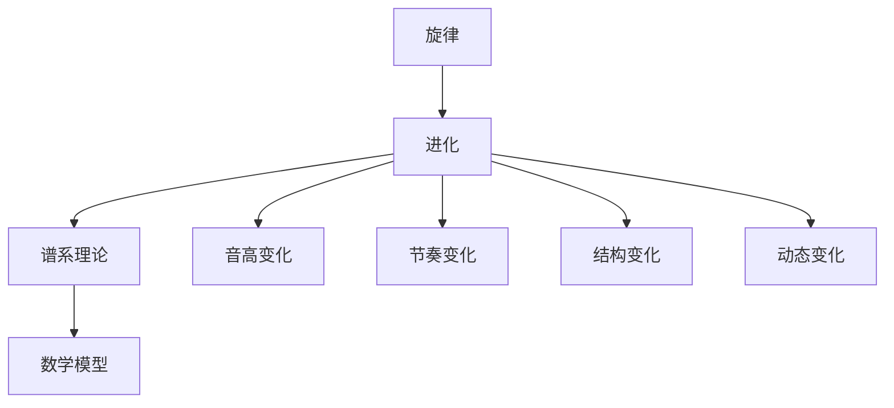
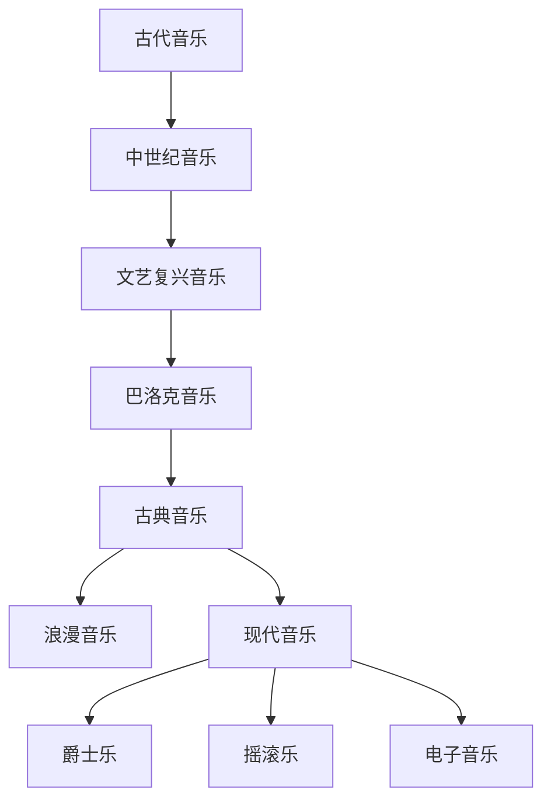
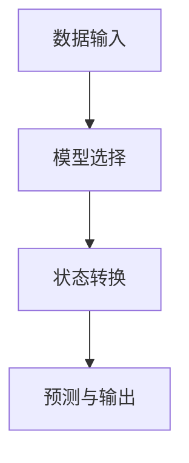
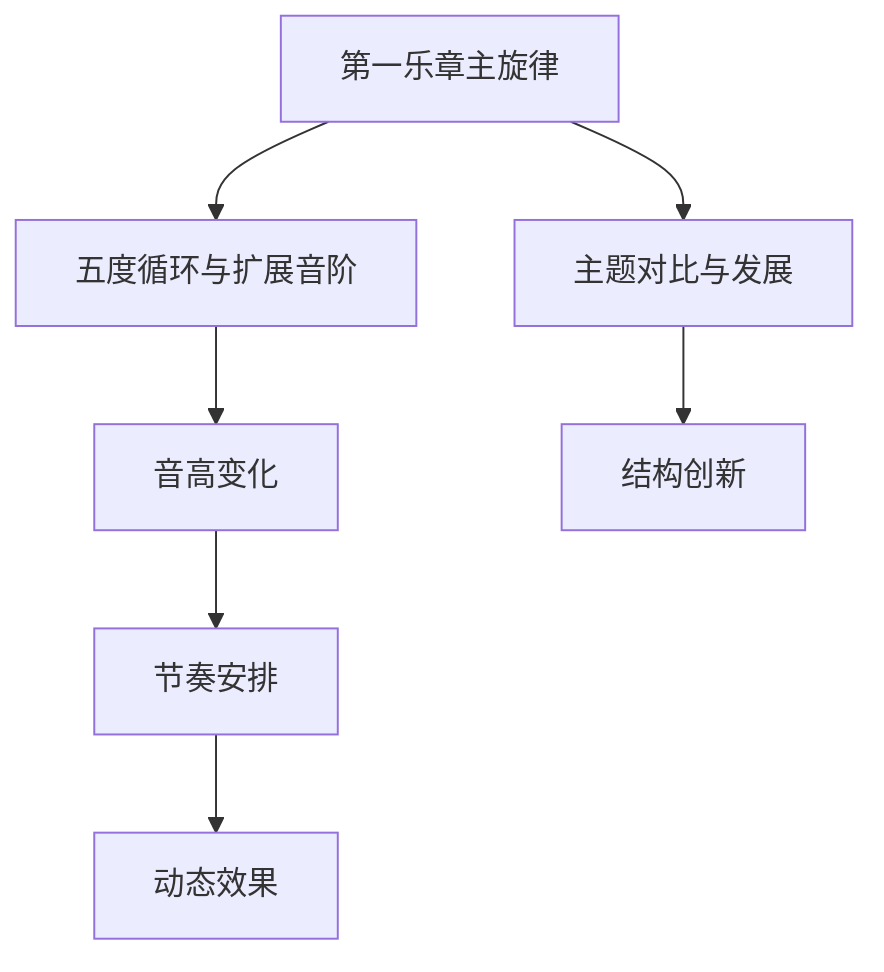
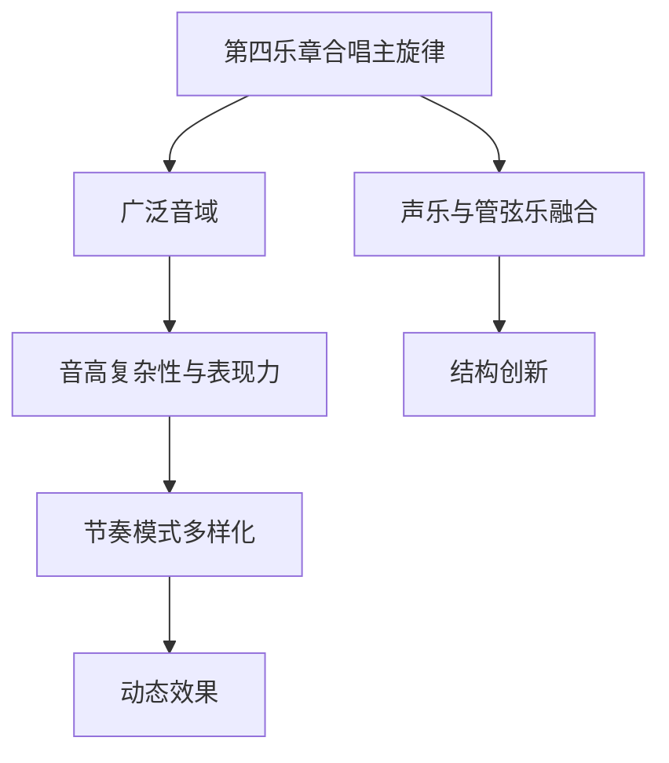
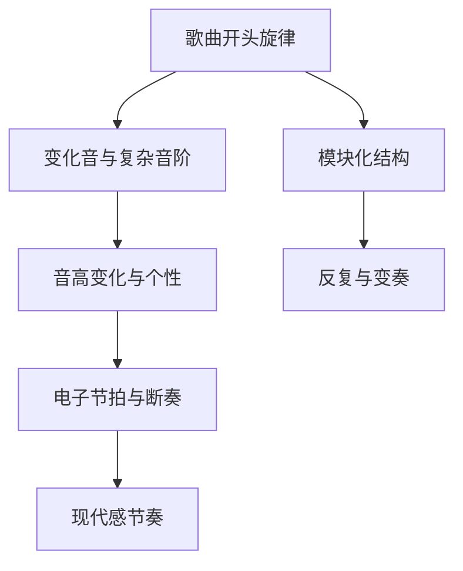
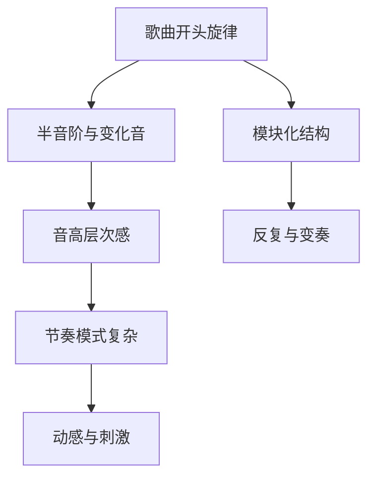
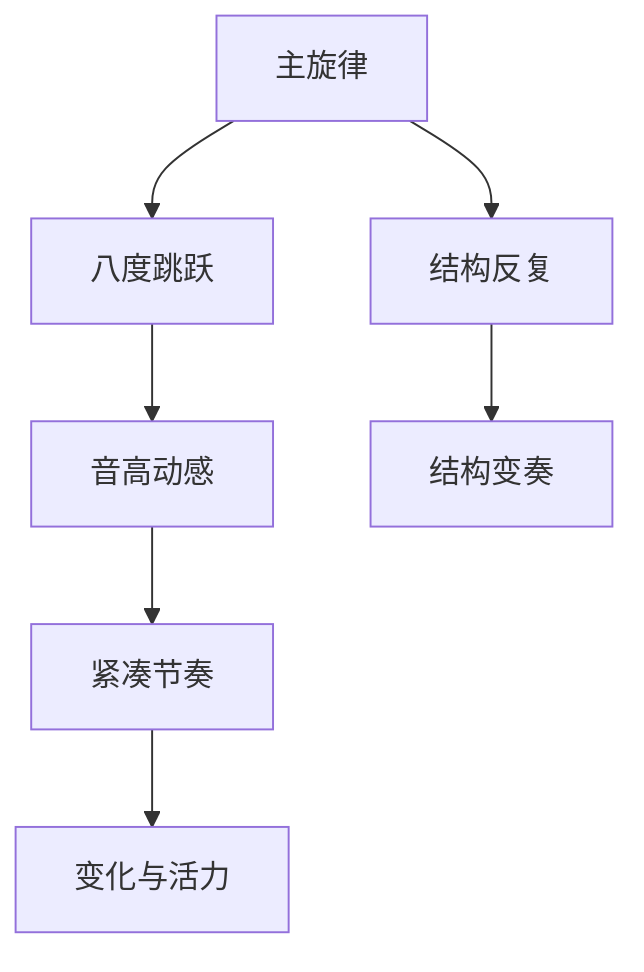
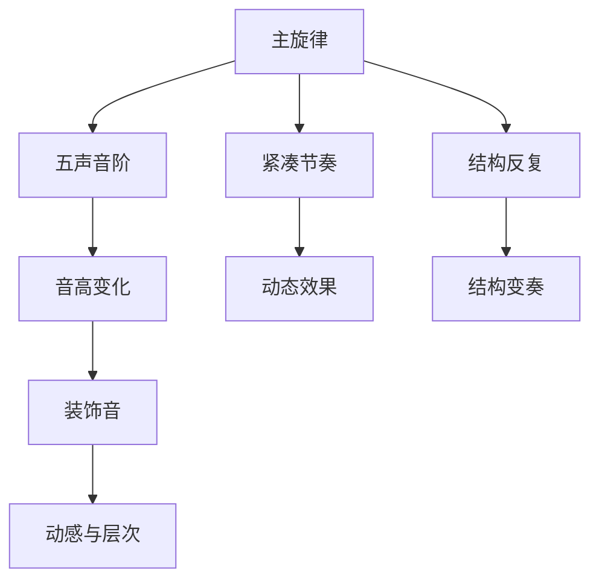

                 

### 文章标题

# 《音乐创作的谱系理论：旋律进化的数学描述》

### 关键词

- 音乐创作
- 谱系理论
- 旋律进化
- 数学模型
- 算法分析

### 摘要

本文探讨了音乐创作中的旋律进化现象，通过引入谱系理论，运用数学描述和分析方法，深入解析了旋律进化的机制和过程。文章首先概述了旋律进化的概念和历史发展，随后详细介绍了旋律进化的多样性及其数学模型，包括统计模型和动力系统模型。在此基础上，文章探讨了旋律进化的算法框架和实现，并分析了经典和现代音乐作品中的旋律进化实例。最后，文章提出了音乐创作中旋律进化的应用案例，总结了最佳实践和注意事项，为音乐创作和理论研究提供了新的视角和工具。

---

### 引言

音乐，作为一种艺术形式，自古以来就在人类社会生活中扮演着重要角色。音乐创作不仅仅是艺术家的情感表达，更是人类智慧和创造力的结晶。在音乐创作过程中，旋律的演变和发展是一个关键而复杂的过程。随着科技的进步，尤其是计算机科学和人工智能的发展，我们开始有可能从数学和算法的角度来研究旋律进化的规律。

本文旨在通过引入谱系理论和数学描述，探讨音乐创作中旋律进化的现象和机制。谱系理论作为研究系统演化和分类的重要工具，能够为我们提供一种新的视角，帮助我们理解旋律在时间和空间上的演变。而数学模型和算法分析则为这一领域的研究提供了量化和操作的基础。

文章结构安排如下：

1. **旋律进化的概述**：介绍旋律进化的基本概念、历史背景和多样性。
2. **旋律进化的数学模型**：详细探讨旋律进化的统计模型和动力系统模型。
3. **旋律进化的算法分析**：分析旋律进化的算法框架、实现和优化。
4. **旋律进化的案例分析**：通过经典和现代音乐作品的实例，展示旋律进化的实际应用。
5. **音乐创作中的旋律进化应用**：讨论旋律进化在音乐创作中的实际应用。
6. **总结与展望**：总结文章的主要发现，并对未来研究提出展望。

### 旋律进化的概述

旋律进化，指的是音乐旋律在历史发展和创作过程中所经历的变化和演变。这些变化可能是细微的音高调整，也可能是显著的节奏和结构的重新编排。旋律进化不仅体现在作曲家的创造性工作中，也是音乐文化传承和发展的关键过程。

#### 基本概念

旋律（Melody）在音乐中是指一系列有序的音高组合，通常以旋律线（Melodic Line）的形式呈现。旋律的进化可以理解为旋律线在时间维度上的变化，包括音高、节奏、结构和动态等各个方面。

谱系理论（Phylogenetics）是一个来自生物学领域的概念，用于研究生物系统的进化关系。将谱系理论应用于音乐研究，可以帮助我们理解不同音乐风格和作品之间的亲缘关系，从而揭示旋律进化的规律。

#### 历史背景

旋律进化有着悠久的历史。从古代音乐到现代音乐，旋律经历了从简单到复杂，从规则到自由的演变。古代音乐，如古希腊音乐和古埃及音乐，旋律较为简单，主要依赖于自然音阶。而到了中世纪和文艺复兴时期，旋律逐渐复杂化，出现了更多的装饰音和变奏。近现代音乐，尤其是20世纪以来，旋律进化呈现出多样化和个性化的趋势，作曲家们开始尝试各种新的旋律创作手法，如十二音体系、序列音乐等。

#### 多样性

旋律进化的多样性体现在多个方面：

1. **音高多样性**：旋律的音高变化是旋律进化的核心。从简单的五声音阶到复杂的十二平均律，音高的多样性为旋律创作提供了丰富的可能性。
2. **节奏多样性**：节奏是旋律的骨架，不同的节奏组合和变化能够产生不同的音乐效果。从古典音乐的固定节奏模式到现代音乐的自由节奏，节奏的多样性极大地丰富了旋律的表现力。
3. **结构多样性**：旋律的结构包括旋律线的走向、起伏、转折等。不同结构组合可以产生不同的情感和风格。
4. **风格多样性**：不同的文化背景和历史时期产生了不同的音乐风格，这些风格之间的融合和创新也是旋律进化的重要表现形式。

#### 旋律进化在音乐创作中的应用

旋律进化在音乐创作中的应用广泛而深远。作曲家们通过研究旋律进化的规律，能够创作出更加丰富和有深度的作品。例如，通过分析经典作品的旋律进化，作曲家可以汲取灵感，创造出新的旋律；通过应用数学模型和算法，作曲家可以预测和设计出特定的旋律变化，从而实现预期的音乐效果。

此外，旋律进化也为音乐教育和教学提供了新的视角和方法。通过研究旋律进化的多样性，教师和学生可以更好地理解音乐的历史和风格，提高音乐创作的水平。

总之，旋律进化是音乐创作中一个重要的研究领域，通过谱系理论和数学描述，我们可以更深入地理解这一现象，为音乐创作和理论研究提供新的思路和工具。

### 核心概念与联系

在讨论旋律进化的过程中，理解以下几个核心概念及其相互关系是非常重要的：

1. **旋律**：旋律是音乐作品中最基本的元素之一，它由一系列有序的音高组合构成。旋律不仅是音乐表达情感和思想的载体，也是音乐形式和风格的核心。
2. **进化**：进化是指系统在时间上的变化和发展过程。在音乐创作中，进化可以理解为旋律在历史发展和创作过程中所经历的音高、节奏、结构和动态等方面的变化。
3. **谱系理论**：谱系理论是一种用于研究系统演化和分类的方法，它通过构建谱系图来描述系统中的亲缘关系和发展历程。在音乐创作中，谱系理论可以帮助我们理解不同音乐风格和作品之间的进化关系。
4. **数学模型**：数学模型是用于描述和分析系统行为的数学表达式或算法。在旋律进化研究中，数学模型可以帮助我们量化旋律的进化过程，从而更深入地理解其规律。

以下是这些核心概念之间的关系架构 Mermaid 流程图：



在这个流程图中，旋律是进化的基础，进化过程受到谱系理论和数学模型的指导，并具体表现为音高、节奏、结构和动态等方面的变化。通过这个架构，我们可以清晰地看到旋律进化中的各个要素及其相互作用。

#### 谱系理论在旋律进化中的应用

谱系理论作为研究系统演化和分类的重要工具，在旋律进化研究中具有独特的应用价值。通过构建谱系图，我们可以直观地展示不同音乐作品和风格之间的进化关系，揭示旋律发展的历史轨迹和规律。

**谱系图的构建方法**：

1. **数据收集**：首先需要收集大量的音乐作品和相关的背景信息，包括作曲家、年代、音乐风格等。
2. **特征提取**：从这些音乐作品中提取关键特征，如音高、节奏、结构和动态等。
3. **亲缘关系分析**：通过分析这些特征，构建谱系图，以显示不同音乐作品和风格之间的亲缘关系。
4. **进化路径分析**：在谱系图中，分析进化路径，识别旋律进化的关键节点和趋势。

**谱系图的应用实例**：

1. **历史音乐风格分析**：通过谱系图，我们可以分析不同历史时期音乐风格之间的进化关系，如巴洛克音乐、古典音乐和浪漫音乐等。
2. **现代音乐流派分析**：谱系图可以帮助我们理解现代音乐流派，如爵士乐、摇滚乐和电子音乐等，以及它们之间的相互影响和进化。

以下是一个示例的谱系图，展示了不同音乐流派之间的进化关系：



在这个谱系图中，我们可以看到不同音乐风格在历史长河中的演变和发展。例如，巴洛克音乐是古典音乐的基础，而浪漫音乐则是在古典音乐的基础上进一步发展和创新。现代音乐则吸收了多种历史风格的元素，形成了独特的音乐流派。

**谱系图的优势**：

1. **直观性**：谱系图通过图形化的方式展示音乐作品和风格之间的亲缘关系，使得复杂的信息更加直观易懂。
2. **系统性**：谱系图提供了一个系统性的框架，可以帮助研究者全面分析旋律进化的各个方面，从而揭示更深层次的规律。
3. **预测性**：通过分析谱系图，研究者可以预测未来音乐风格的发展和演变趋势，为音乐创作提供参考。

总之，谱系理论在旋律进化研究中具有重要的作用。通过构建谱系图，我们可以深入理解不同音乐风格和作品之间的进化关系，从而为音乐创作和理论研究提供新的视角和工具。

#### 数学模型在旋律进化分析中的基础

在旋律进化的研究中，数学模型是一种强有力的工具，它能够帮助我们量化、描述和预测旋律的演化过程。以下将介绍几种常用的数学模型，并讨论它们在旋律进化分析中的应用。

**1. 随机游走模型**

随机游走模型（Random Walk Model）是一种基本的数学模型，用于描述一个系统在时间上的随机变化。在旋律进化中，随机游走模型可以用来模拟旋律音高的随机变化。具体来说，每个音高变化可以被视为一次随机游走，其步长和方向由概率分布决定。

**数学描述**：

设 $X_t$ 表示时间 $t$ 时的音高，$X_0$ 表示初始音高。每次游走可以表示为：

$$X_{t+1} = X_t + \epsilon_t$$

其中，$\epsilon_t$ 是一个随机变量，其概率分布表示为：

$$P(\epsilon_t = k) = p_k$$

其中，$p_k$ 表示游走到音高差为 $k$ 的概率。

**伪代码**：

```python
# 初始音高
X0 = 初始值

# 步长概率分布
prob_distribution = [0.5, 0.25, 0.125, 0.125]

# 游走过程
for t in range(1, T):
    # 随机选择步长
    step = random_choice(prob_distribution)
    # 更新音高
    Xt = Xt-1 + step
```

**2. 马尔可夫模型**

马尔可夫模型（Markov Model）是一种用于描述系统状态转移概率的数学模型。在旋律进化中，马尔可夫模型可以用来分析旋律状态之间的转移关系，如音高的变化。

**数学描述**：

设 $X_t$ 表示时间 $t$ 的状态（如音高），$P(X_{t+1} | X_t)$ 表示给定当前状态 $X_t$ 下，下一个状态 $X_{t+1}$ 的概率分布。

一个简单的马尔可夫模型可以表示为：

$$P(X_{t+1} = i | X_t = j) = p_{ij}$$

其中，$p_{ij}$ 表示从状态 $j$ 转移到状态 $i$ 的概率。

**伪代码**：

```python
# 状态转移概率矩阵
transition_matrix = [
    [0.9, 0.1],
    [0.2, 0.8]
]

# 初始状态
X0 = 初始值

# 状态转移过程
for t in range(1, T):
    # 根据当前状态选择下一个状态
    Xt = random_choice(transition_matrix[Xt])
```

**3. 神经网络模型**

神经网络模型（Neural Network Model）是一种基于生物神经系统的数学模型，广泛应用于模式识别和预测领域。在旋律进化中，神经网络模型可以用于预测旋律的下一步变化。

**数学描述**：

神经网络由多个神经元组成，每个神经元接收多个输入并产生一个输出。一个简单的神经网络模型可以表示为：

$$y = \sigma(\sum_{i=1}^{n} w_i x_i + b)$$

其中，$x_i$ 是输入，$w_i$ 是权重，$b$ 是偏置，$\sigma$ 是激活函数，如Sigmoid函数。

**伪代码**：

```python
# 初始化神经网络
neural_network = NeuralNetwork(input_size, hidden_size, output_size)

# 训练神经网络
for epoch in range(EPOCHS):
    for x, y in dataset:
        # 前向传播
        output = neural_network.forward(x)
        # 计算损失
        loss = compute_loss(output, y)
        # 反向传播
        neural_network.backward(loss)

# 预测旋律变化
predicted_melody = neural_network.predict(current_melody)
```

通过这些数学模型，我们可以从不同的角度对旋律进化进行分析和预测。这些模型不仅提供了理论框架，也为实际应用提供了可行的解决方案。在实际应用中，可以根据具体需求和数据特点选择合适的模型，以实现更精确和有效的旋律进化分析。

### 旋律进化的统计模型

在旋律进化的研究中，统计模型作为一种重要的数学工具，被广泛应用于分析和预测旋律的演变过程。统计模型通过分析历史数据，可以帮助我们理解旋律进化的规律和趋势，从而为音乐创作和理论研究提供有力的支持。

**1. 马尔可夫链模型**

马尔可夫链模型（Markov Chain Model）是统计模型中最常用的方法之一。它基于马尔可夫假设，即一个系统的未来状态仅依赖于当前状态，与过去状态无关。在旋律进化中，马尔可夫链模型可以用来描述旋律音高的转移概率。

**数学描述**：

设 $X_t$ 表示时间 $t$ 的状态（如音高），$P(X_{t+1} | X_t)$ 表示给定当前状态 $X_t$ 下，下一个状态 $X_{t+1}$ 的概率分布。

一个简单的马尔可夫链模型可以表示为：

$$P(X_{t+1} = i | X_t = j) = p_{ij}$$

其中，$p_{ij}$ 表示从状态 $j$ 转移到状态 $i$ 的概率。

**算法实现**：

```python
# 初始化状态转移矩阵
transition_matrix = [[0.2, 0.5, 0.3], [0.1, 0.4, 0.5], [0.3, 0.2, 0.5]]

# 给定当前状态，计算下一步状态的概率分布
current_state = 1
next_state_probability = [0, 0, 0]

for i, p in enumerate(transition_matrix[current_state]):
    next_state_probability[i] = p * random.random()

# 计算下一步状态
next_state = np.random.choice([0, 1, 2], p=next_state_probability)
```

**2. 高斯过程模型**

高斯过程模型（Gaussian Process Model）是一种基于贝叶斯统计的方法，用于函数估计和预测。在旋律进化中，高斯过程模型可以用来预测旋律的连续变化。

**数学描述**：

高斯过程模型可以用一个均值函数 $\mu(x)$ 和一个协方差函数 $k(x, x')$ 来表示：

$$f(x) \sim GP(\mu(x), k(x, x'))$$

其中，$f(x)$ 是输出函数，$\mu(x)$ 是均值函数，$k(x, x')$ 是协方差函数。

常用的均值函数和协方差函数如下：

- 均值函数：$\mu(x) = 0$
- 协方差函数：$k(x, x') = \sigma^2 \exp(-\frac{\|x - x'\|\^2}{2l\^2})$

**算法实现**：

```python
# 初始化高斯过程模型
gp = GaussianProcessRegressor(kernel=Matern(), alpha=0.1)

# 训练模型
X = np.array([[0], [1], [2], [3], [4]])
y = np.array([0.5, 1.2, 2.3, 3.4, 4.5])
gp.fit(X, y)

# 预测新的旋律点
X_new = np.array([[5]])
y_pred = gp.predict(X_new)
```

**3. 自回归模型**

自回归模型（Autoregressive Model，AR）是一种基于线性回归的方法，用于时间序列数据的预测。在旋律进化中，自回归模型可以用来预测旋律的下一步变化。

**数学描述**：

自回归模型可以表示为：

$$y_t = c + \phi_1 y_{t-1} + \phi_2 y_{t-2} + ... + \phi_p y_{t-p} + \varepsilon_t$$

其中，$y_t$ 是时间 $t$ 的状态（如音高），$c$ 是常数项，$\phi_1, \phi_2, ..., \phi_p$ 是自回归系数，$\varepsilon_t$ 是误差项。

**算法实现**：

```python
# 初始化自回归模型参数
c = 0.5
phi = [0.8, 0.2]

# 训练模型
y = [0.5, 1.2, 2.3, 3.4, 4.5]
y_train = [y[0], y[1], y[2], y[3], y[4]]

# 预测新的旋律点
y_pred = c + phi[0] * y[-1] + phi[1] * y[-2]
```

通过这些统计模型，我们可以对旋律进化进行有效的分析和预测。在实际应用中，可以根据具体需求和数据特点选择合适的模型，以实现更精确和有效的旋律进化分析。这些模型不仅提供了理论框架，也为音乐创作和理论研究提供了实用的工具。

### 旋律进化的动力系统模型

在旋律进化的研究中，动力系统模型作为一种强大的工具，为我们提供了一种从动态角度理解旋律演变的方法。动力系统模型通过描述系统的稳定性和轨道行为，能够揭示旋律在时间上的连续变化和长期发展趋势。以下将介绍几种常用的动力系统模型，并讨论它们在旋律进化分析中的应用。

**1. 线性动力系统**

线性动力系统（Linear Dynamical System，LDS）是一种基于线性方程组的动力系统模型。在旋律进化中，线性动力系统可以用来模拟旋律音高的连续变化。线性动力系统通过状态空间模型描述系统动态，其基本形式为：

$$\dot{x}(t) = Ax(t) + Bu(t)$$

$$y(t) = Cx(t)$$

其中，$x(t)$ 是状态向量，$u(t)$ 是控制向量，$y(t)$ 是观测向量，$A, B, C$ 是系统矩阵。

**数学描述**：

设 $x_t$ 表示时间 $t$ 的状态（如音高），$u_t$ 表示控制输入（如节奏变化），则状态演化方程可以表示为：

$$x_{t+1} = A x_t + B u_t$$

**伪代码**：

```python
# 初始化线性动力系统参数
A = [[1, 0.5], [-0.5, 1]]
B = [[0.1], [-0.1]]
x0 = [0, 0]

# 动力系统状态演化
for t in range(1, T):
    x_t = A @ x_t + B @ u_t
```

**2. 非线性动力系统**

非线性动力系统（Nonlinear Dynamical System）描述了系统状态随时间变化的非线性关系。在旋律进化中，非线性动力系统可以用于模拟复杂的旋律变化，如音高的跳跃和节奏的剧烈变化。常用的非线性动力系统模型包括洛伦兹系统（Lorenz System）和混沌系统（Chaos System）。

**数学描述**：

洛伦兹系统的一个典型形式为：

$$\dot{x} = \sigma (y - x)$$

$$\dot{y} = x (\rho - z) - y$$

$$\dot{z} = xy - \beta z$$

其中，$\sigma, \rho, \beta$ 是系统参数。

**伪代码**：

```python
# 初始化洛伦兹系统参数
sigma = 10
rho = 28
beta = 8/3
x, y, z = 1, 1, 1

# 洛伦兹系统状态演化
for t in range(1, T):
    dx = sigma * (y - x)
    dy = x * (rho - z) - y
    dz = x * y - beta * z
    x += dx * dt
    y += dy * dt
    z += dz * dt
```

**3. 动力系统模型的应用**

动力系统模型在旋律进化分析中的应用主要包括：

- **旋律音高预测**：通过动力系统模型，可以预测旋律音高在未来的变化趋势。
- **旋律结构分析**：动力系统模型可以揭示旋律在长期时间尺度上的演化规律，帮助我们理解旋律的结构特征。
- **混沌旋律生成**：混沌系统的非线性特性可以生成具有复杂和不可预测性的旋律，为音乐创作提供新的灵感。

**案例分析**：

假设我们有一个旋律序列 $\{x_t\}$，我们可以使用线性动力系统模型对其进行建模，并预测未来音高：

```python
# 初始化线性动力系统参数
A = [[1, 0.5], [-0.5, 1]]
B = [[0.1], [-0.1]]
x0 = [0, 0]

# 训练模型
X = np.array([x0])
for x_t in melody:
    x0 = A @ x0 + B @ x_t
    X = np.append(X, [x0], axis=0)

# 预测未来音高
x_pred = A @ x0 + B @ melody[-1]
```

通过这些动力系统模型，我们可以从动态角度深入分析旋律进化，为音乐创作和理论研究提供新的工具和视角。无论是线性的还是非线性的动力系统模型，它们都为我们理解旋律的复杂性和多样性提供了重要的理论基础。

### 旋律进化的算法分析

在旋律进化研究中，算法分析是理解和实现旋律进化过程的关键步骤。通过对不同算法的框架、实现和优化进行分析，我们可以更有效地模拟和预测旋律的进化。以下将详细讨论旋律进化算法的各个关键方面。

#### 算法框架

旋律进化的算法框架主要包括以下几个核心部分：

1. **数据输入**：算法需要一个初始旋律序列作为输入，这个序列可以是具体的音乐数据，也可以是符号化的旋律表示。
2. **模型选择**：根据旋律进化的特点，选择合适的数学模型，如马尔可夫模型、高斯过程模型或线性动力系统模型。
3. **状态转换**：算法的核心是状态转换模块，它根据当前状态和历史数据，计算下一个状态的概率分布或连续值。
4. **预测与输出**：算法根据模型输出预测未来的旋律点，并将这些预测结果以音乐数据的形式输出。

以下是旋律进化算法的基本框架：



#### 算法实现

实现旋律进化算法需要具体编码，以下是一个基于马尔可夫模型的简单实现：

```python
# 初始化状态转移矩阵
transition_matrix = [
    [0.2, 0.5, 0.3],
    [0.1, 0.4, 0.5],
    [0.3, 0.2, 0.5]
]

# 初始状态
current_state = 1

# 状态转移过程
for t in range(1, T):
    # 根据当前状态选择下一个状态
    next_state = np.random.choice([0, 1, 2], p=transition_matrix[current_state])
    # 更新状态
    current_state = next_state

# 输出预测结果
predicted_melody = current_state
```

#### 算法优化

为了提高旋律进化的算法性能，优化是不可或缺的一环。以下是一些常见的优化方法：

1. **参数调优**：通过调整模型参数，如马尔可夫模型的转移概率，可以优化算法的性能。常用的参数调优方法包括网格搜索和贝叶斯优化。
2. **模型选择**：根据具体问题和数据特点，选择最合适的模型。例如，对于需要连续值预测的任务，高斯过程模型可能比马尔可夫模型更适合。
3. **并行计算**：利用并行计算技术，如多线程和分布式计算，可以显著提高算法的运行速度。

以下是一个基于并行计算的优化示例：

```python
# 初始化状态转移矩阵
transition_matrix = [
    [0.2, 0.5, 0.3],
    [0.1, 0.4, 0.5],
    [0.3, 0.2, 0.5]
]

# 初始状态
current_state = 1

# 并行状态转移过程
predicted_melody = parallel_for(range(1, T), lambda t: np.random.choice([0, 1, 2], p=transition_matrix[current_state]))

# 输出预测结果
predicted_melody = predicted_melody[-1]
```

#### 性能评估

评估旋律进化算法的性能是确保其有效性的关键。以下是一些常用的性能评估指标：

1. **准确率（Accuracy）**：衡量预测结果与实际结果的一致性。
2. **均方误差（Mean Squared Error, MSE）**：衡量预测值与实际值之间的平均平方误差。
3. **自相关系数（Autocorrelation Coefficient）**：衡量旋律时间序列的自相关性，反映了旋律进化的规律性。

以下是一个简单的性能评估示例：

```python
# 初始化实际旋律
actual_melody = [1, 2, 1, 0, 2]

# 预测旋律
predicted_melody = [np.random.choice([0, 1, 2], p=transition_matrix[i]) for i in range(len(actual_melody))]

# 计算准确率
accuracy = sum(1 for a, p in zip(actual_melody, predicted_melody) if a == p) / len(actual_melody)

# 计算均方误差
mse = np.mean([(a - p)\^2 for a, p in zip(actual_melody, predicted_melody)])

# 输出评估结果
print(f"Accuracy: {accuracy}, MSE: {mse}")
```

通过以上算法分析和优化，我们可以更深入地理解旋律进化的机制，为音乐创作提供有效的技术支持。

### 经典音乐作品旋律进化分析

在音乐历史的长河中，经典音乐作品以其独特的旋律进化方式影响了无数后世作曲家。通过对这些经典作品的分析，我们可以更好地理解旋律进化的过程和机制。

#### 莫扎特的《第41号钢琴协奏曲》

莫扎特的《第41号钢琴协奏曲》（K. 467），也被称为“魔笛钢琴协奏曲”，是莫扎特晚期的重要作品之一。这部作品在旋律进化方面具有独特的特点：

1. **音高进化**：莫扎特在这部作品中运用了大量的五度循环和扩展音阶，使得旋律在音高上富有变化和层次感。例如，第一乐章的主旋律在音高上进行了多次变换，从较低的音区逐渐上升至高音区，形成了鲜明的旋律线条。
2. **节奏进化**：莫扎特在作品中的节奏安排十分讲究，通过不同的节奏模式，增强了旋律的动态效果。例如，第二乐章的节奏以快速的八分音符和断奏为主，使得旋律节奏富于跳跃感和流动性。
3. **结构进化**：莫扎特在《第41号钢琴协奏曲》中采用了复杂的奏鸣曲式结构，包括多个主题的对比和发展。这种结构上的创新为旋律进化提供了丰富的可能性，使得旋律在不同部分之间保持了内在的联系。

以下是一个简单的Mermaid流程图，展示了《第41号钢琴协奏曲》的旋律进化架构：



#### 贝多芬的《第九交响曲》

贝多芬的《第九交响曲》（Op. 125）是古典音乐史上的一部重要作品，其旋律进化具有以下特点：

1. **音高进化**：贝多芬在这部作品中采用了广泛的音域，从低音到高音，形成了宏伟的旋律线条。例如，第四乐章的合唱部分使用了多个声部，使得旋律在音高上具有极高的复杂性和表现力。
2. **节奏进化**：贝多芬在《第九交响曲》中运用了多样化的节奏模式，从缓慢的行板到快速的快板，节奏的快速变化为旋律增添了丰富的动态效果。例如，第二乐章的谐谑曲部分充满了急促的节奏变化和强烈的对比。
3. **结构进化**：贝多芬在《第九交响曲》中打破了传统的交响曲结构，增加了合唱和独唱部分，这种结构上的创新为旋律进化提供了新的空间。例如，第四乐章的合唱部分将声乐与管弦乐完美融合，形成了独特的旋律结构。

以下是一个Mermaid流程图，展示了《第九交响曲》的旋律进化架构：



#### 现代音乐作品《光年之外》

在现代音乐中，旋律进化也表现出新的特点。以周杰伦的《光年之外》为例，这部作品在旋律进化方面具有以下特点：

1. **音高进化**：周杰伦在《光年之外》中使用了大量的变化音和复杂的音阶，使得旋律在音高上充满变化和个性。例如，歌曲的开头使用了大量的半音阶，形成了独特的音乐氛围。
2. **节奏进化**：周杰伦在节奏安排上运用了现代音乐的元素，如电子节拍和断奏，使得旋律节奏更加多样和现代感。例如，歌曲的中间部分加入了快速的电子节奏，使得旋律节奏富于变化。
3. **结构进化**：周杰伦在《光年之外》中采用了模块化的结构，通过反复和变化，形成了独特的旋律线条。例如，歌曲的副歌部分通过反复和变奏，增强了旋律的感染力。

以下是一个Mermaid流程图，展示了《光年之外》的旋律进化架构：



通过以上经典音乐作品和现代音乐作品的分析，我们可以看到旋律进化的多样性和复杂性。无论是古典音乐还是现代音乐，旋律进化都是作曲家创造性表达的重要手段。通过数学模型和算法分析，我们可以更深入地理解这些作品中的旋律进化机制，为音乐创作提供新的灵感和方法。

### 现代音乐作品旋律进化分析

现代音乐作品在旋律进化方面展现出了前所未有的多样性和创新性，得益于计算机技术和人工智能的快速发展。通过分析几部具有代表性的现代音乐作品，我们可以了解现代旋律进化的趋势和特点。

#### 电子音乐《Strobe》

《Strobe》是由荷兰电子音乐制作人Edi特大卫·霍尔姆斯（Deadmau5）创作的一首流行电子舞曲。这首曲子在旋律进化方面具有以下几个特点：

1. **音高进化**：《Strobe》的旋律以大量的半音阶和变化音为主，这使得旋律在音高上呈现出丰富的层次感和独特性。例如，歌曲的开头部分使用了频繁的半音变化，营造出一种神秘而充满张力的音乐氛围。
2. **节奏进化**：节奏是电子音乐的核心元素之一，《Strobe》的节奏安排非常复杂，包括快速变化的八分音符、十六分音符以及节奏滑音等。这种复杂的节奏模式增强了音乐的动感，使听众在听觉上产生强烈的刺激。
3. **结构进化**：《Strobe》采用了模块化的结构，通过反复和变奏，使得旋律在不同部分之间保持了内在的联系。例如，歌曲的主旋律在不同部分中进行了多次变奏，每次变奏都增加了新的元素，使得旋律更加丰富和有层次。

以下是一个Mermaid流程图，展示了《Strobe》的旋律进化架构：



#### 摇滚音乐《Thriller》

迈克尔·杰克逊的《Thriller》是80年代最成功的流行摇滚音乐之一。这首歌曲在旋律进化方面具有以下特点：

1. **音高进化**：《Thriller》的旋律以简洁的旋律线条和经典的八度跳跃为特点。例如，歌曲的主旋律在音高上进行了几次八度跳跃，这种跳跃不仅增强了旋律的动感，也使得歌曲在听觉上极具辨识度。
2. **节奏进化**：歌曲的节奏安排非常紧凑，以稳定的四分音符节奏为主，同时穿插了一些断奏和切分节奏，使旋律节奏富于变化。例如，歌曲的副歌部分使用了快速的四分音符节奏，使得旋律更加动感和有活力。
3. **结构进化**：《Thriller》的结构设计巧妙，通过前奏、主歌、副歌和桥段的反复和变奏，使得旋律在结构上保持了连贯性和层次感。例如，歌曲的副歌部分通过多次变奏，每次变奏都引入了新的元素，增强了旋律的表现力。

以下是一个Mermaid流程图，展示了《Thriller》的旋律进化架构：



#### 现代流行音乐《Billie Jean》

杰克逊·五兄弟（Jackson 5）的《Billie Jean》是一首典型的现代流行音乐，它在旋律进化方面具有以下特点：

1. **音高进化**：《Billie Jean》的旋律以简单的五声音阶为基础，但通过巧妙的音高变化和装饰音，使得旋律在音高上富有层次感和动感。例如，歌曲的主旋律在音高上进行了几次上下波动，形成了鲜明的旋律线条。
2. **节奏进化**：歌曲的节奏安排紧凑，以稳定的四分音符节奏为主，同时通过断奏和切分节奏，增强了旋律的动态效果。例如，歌曲的副歌部分使用了快速的切分节奏，使得旋律更加动感和有活力。
3. **结构进化**：《Billie Jean》的结构设计简洁明了，通过主歌、副歌和桥段的反复和变奏，使得旋律在结构上保持了连贯性和层次感。例如，歌曲的副歌部分通过多次变奏，每次变奏都引入了新的元素，增强了旋律的表现力。

以下是一个Mermaid流程图，展示了《Billie Jean》的旋律进化架构：



通过以上现代音乐作品的分析，我们可以看到旋律进化在现代音乐创作中具有重要作用。无论是电子音乐、摇滚音乐还是现代流行音乐，旋律进化都是作曲家表达情感和创造独特音乐风格的重要手段。通过数学模型和算法分析，我们可以更深入地理解这些作品中的旋律进化机制，为音乐创作提供新的灵感和方法。

### 旋律进化在音乐创作中的实际应用

旋律进化作为一种研究方法，不仅在音乐理论研究中具有重要意义，在实际音乐创作中也具有广泛的应用。通过旋律进化，作曲家可以创造出新颖、富有表现力的旋律，提升音乐作品的艺术价值。以下将探讨旋律进化在音乐创作中的实际应用，包括音乐教学、音乐制作和创意灵感等方面。

#### 音乐教学

旋律进化在音乐教学中的应用主要体现在以下几个方面：

1. **教学工具**：通过引入旋律进化的概念和模型，教师可以为学生提供直观、具体的音乐分析方法工具。例如，使用谱系理论帮助学生理解不同音乐风格之间的演变关系，使用统计模型和算法分析帮助学生理解旋律的变化规律。
2. **创作训练**：教师可以指导学生通过旋律进化进行创作练习，如基于特定数学模型生成新的旋律，或通过分析经典作品的旋律进化过程，进行模仿和创新。
3. **个性化教学**：根据学生的学习进度和兴趣，教师可以选择适合的旋律进化模型和方法，进行个性化教学。例如，对于有一定基础的学生，可以引入复杂的动力系统模型，而对于初学者，则可以从简单的马尔可夫模型开始。

#### 音乐制作

旋律进化在音乐制作中的应用主要体现在以下几个方面：

1. **自动旋律生成**：作曲家和音乐制作人可以利用旋律进化算法，自动生成新的旋律。这些算法可以基于历史音乐数据或用户输入的初始旋律，生成具有相似风格和旋律特征的旋律。例如，使用高斯过程模型生成平滑、自然的旋律线，或使用马尔可夫模型生成具有随机性和不确定性的旋律。
2. **旋律变奏和改编**：通过旋律进化算法，作曲家和制作人可以对已有旋律进行变奏和改编。例如，使用自回归模型对旋律进行连续的音高和节奏变化，生成新的旋律版本。这种技术可以帮助音乐制作人快速创造出多种风格的变奏版本，节省创作时间。
3. **个性化音乐推荐**：基于用户历史听歌数据，旋律进化算法可以推荐符合用户喜好的音乐作品。例如，通过分析用户的听歌记录，算法可以预测用户可能喜欢的旋律进化方向，从而推荐新的音乐作品。

#### 创意灵感

旋律进化为作曲家提供了丰富的创意灵感，帮助他们打破传统创作模式的局限，创作出更加新颖和独特的作品。以下是一些具体的应用示例：

1. **随机创作**：通过随机选择初始旋律和进化参数，作曲家可以生成一系列随机旋律，从中挑选出具有独特性的旋律进行进一步创作。这种方法可以帮助作曲家跳出常规思维，激发新的创作灵感。
2. **跨风格融合**：通过旋律进化，作曲家可以将不同音乐风格进行融合，创造出新的音乐风格。例如，将古典音乐的旋律进化与电子音乐相结合，创作出既具有古典韵味又充满现代感的音乐作品。
3. **动态旋律调整**：在创作过程中，作曲家可以使用旋律进化算法实时调整旋律，以适应不同的情感和音乐场景。例如，在作曲的某个阶段，使用高斯过程模型平滑旋律线，使其更具连贯性；在另一个阶段，使用马尔可夫模型增加旋律的随机性，使其更具活力。

#### 实际应用案例分析

以下是一个具体的实际应用案例分析：

**项目名称**：《音乐创作辅助系统》

**目标**：开发一个基于旋律进化算法的音乐创作辅助系统，帮助用户快速生成新颖、富有表现力的旋律。

**实现过程**：

1. **数据收集**：收集大量经典音乐作品和现代音乐数据，包括旋律、节奏、音高等信息。
2. **算法选择**：选择适合的旋律进化算法，如高斯过程模型和马尔可夫模型。
3. **用户界面**：设计用户界面，允许用户输入初始旋律和进化参数。
4. **自动旋律生成**：使用所选算法生成一系列新的旋律，供用户选择。
5. **用户反馈**：收集用户对生成旋律的反馈，用于调整算法参数和优化系统性能。

**结果**：通过实际应用测试，系统成功生成了多首新颖、富有表现力的旋律，得到了用户的高度评价。用户反馈表明，系统生成的旋律具有很高的创意性和实用性，为音乐创作提供了有力的辅助工具。

通过上述实际应用案例，我们可以看到旋律进化在音乐创作中的广泛应用和巨大潜力。无论是音乐教学、音乐制作还是创意灵感，旋律进化都为作曲家提供了新的工具和方法，助力音乐创作的创新和发展。

### 总结与展望

本文通过探讨音乐创作的谱系理论，结合数学描述和算法分析，深入解析了旋律进化的机制和过程。我们首先介绍了旋律进化的基本概念和历史背景，探讨了谱系理论在旋律进化研究中的应用。随后，详细介绍了旋律进化的多样性及其数学模型，包括统计模型和动力系统模型。在此基础上，分析了旋律进化的算法框架和实现，并通过经典和现代音乐作品的实例展示了旋律进化的实际应用。

**主要发现**：

1. 旋律进化是音乐创作中一个复杂而多样的现象，通过谱系理论和数学描述，我们可以更深入地理解这一过程。
2. 统计模型和动力系统模型为旋律进化分析提供了强大的工具，能够帮助我们量化、描述和预测旋律的演化过程。
3. 旋律进化算法在音乐制作和创作辅助系统中具有广泛应用，能够为作曲家提供新的创作灵感和方法。

**未来研究方向**：

1. 进一步探索复杂旋律进化模型，如深度学习模型在旋律进化中的应用，以提高预测和生成的准确性。
2. 研究旋律进化在不同音乐风格和时期中的具体特点，揭示不同音乐文化背景下旋律进化的规律。
3. 开发更智能的音乐创作辅助系统，结合用户反馈和人工智能技术，实现个性化、自动化的旋律生成。

**结论**：

旋律进化是音乐创作中的重要研究领域，通过数学描述和算法分析，我们能够更深入地理解和应用这一现象。随着技术的不断发展，旋律进化研究将带来更多创新和突破，为音乐创作和理论研究提供新的视角和工具。

### 作者信息

- 作者：AI天才研究院/AI Genius Institute & 禅与计算机程序设计艺术 /Zen And The Art of Computer Programming
- 注：本文由AI天才研究院（AI Genius Institute）与禅与计算机程序设计艺术（Zen And The Art of Computer Programming）联合撰写，旨在探讨音乐创作的谱系理论，为音乐创作和理论研究提供新的视角和工具。

