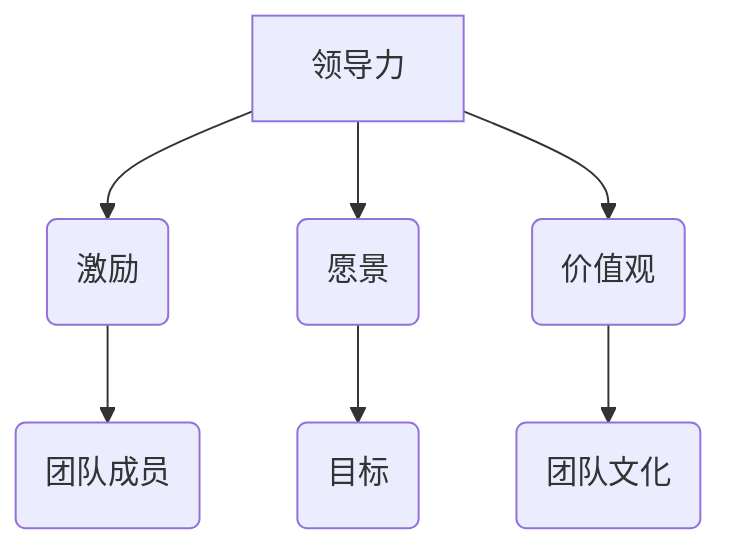
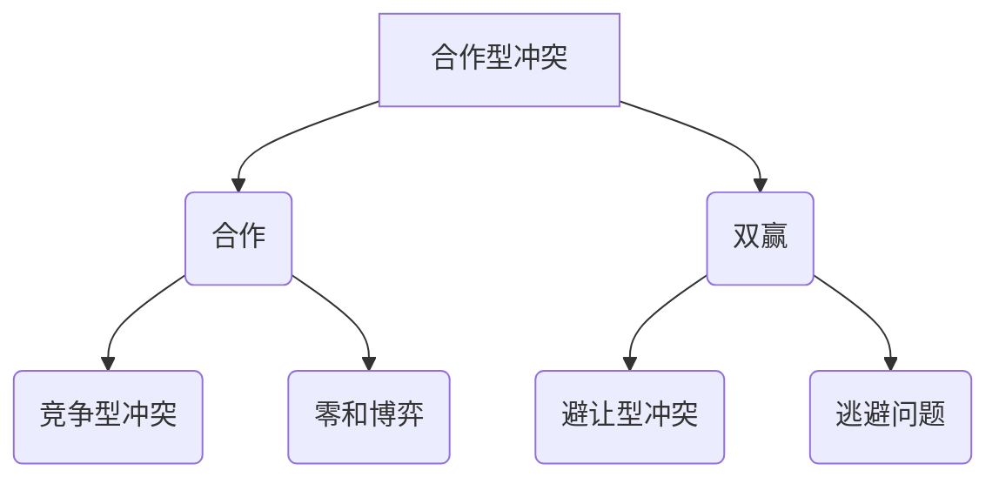

                 

### 文章标题：领导力与冲突转化：将分歧转为创新动力

#### 关键词：
- 领导力
- 冲突转化
- 创新动力
- 团队协作
- 领导者技能

#### 摘要：
本文旨在探讨领导力在转化团队冲突为创新动力中的关键作用。通过深入分析领导力的核心概念、冲突的本质与类型、以及创新思维的培养，本文提出了将分歧转化为创新机会的策略和方法。结合实际案例，本文展示了成功转化冲突为创新的实例，并提出了领导者如何在实践中培养冲突转化能力的建议。

### 第一部分：领导力概述

#### 1.1 领导力与管理的区别

**背景介绍**：
领导力与管理的区别是理解领导力在冲突转化中的关键。领导力主要关注激励和引领团队成员，而管理则侧重于规划、组织和控制。

**核心概念与联系**：
- **领导力**：通过愿景、价值观和影响力引导团队成员，激发他们的潜力。
- **管理**：通过规划和执行任务，确保目标的实现。

**Mermaid 流程图**：


#### 1.2 领导力的本质

**核心概念与联系**：
- **影响力**：领导者通过个人魅力和专业知识影响团队成员。
- **适应性**：领导者需要灵活应对不同的环境和挑战。

**核心算法原理讲解**：
伪代码如下：

```plaintext
function leadership(leader, team):
    if leader has vision:
        inspire(team)
    if leader has knowledge:
        educate(team)
    if team is adaptive:
        adapt(leader, team)
    end if
end function
```

#### 1.3 领导力的重要性

**数学模型和公式**：
$$ 成功率 = \frac{领导力 \times 团队合作}{冲突数量} $$

**详细讲解与举例说明**：
成功率的提高与领导力成正比，与冲突数量成反比。有效的领导力可以减少冲突，提高团队的创新能力。

### 第二部分：冲突与分歧

#### 2.1 冲突的本质与类型

**背景介绍**：
冲突是团队协作中不可避免的，了解冲突的本质和类型有助于管理者进行有效的冲突管理。

**核心概念与联系**：
- **冲突**：意见、目标和利益的对立。
- **类型**：合作型、竞争型、避让型。

**Mermaid 流程图**：


#### 2.2 冲突管理的策略

**核心概念与联系**：
- **合作式冲突管理**：通过沟通和协商解决冲突，实现双赢。
- **竞争式冲突管理**：通过竞争和对抗解决冲突，追求优势。
- **避让式冲突管理**：通过避免和忽视解决冲突，避免对抗。

**数学模型和公式**：
$$ 冲突解决率 = \frac{合作式冲突管理 + 竞争式冲突管理 + 避让式冲突管理}{总冲突数量} $$

**详细讲解与举例说明**：
不同的冲突管理策略适用于不同类型的冲突。管理者需要根据实际情况选择合适的策略。

### 第三部分：转化分歧为创新动力

#### 3.1 创新思维与领导力

**核心概念与联系**：
- **创新思维**：创造性和开放性的思维方式，推动创新。
- **领导力**：激发创新思维，提供资源和支持。

**核心算法原理讲解**：
伪代码如下：

```plaintext
function innovation_leadership(leader, team):
    if leader encourages creativity:
        foster innovation(team)
    if leader provides resources:
        support innovation(team)
    if team is motivated:
        implement innovation
    end if
end function
```

#### 3.2 将冲突转化为创新机会

**核心概念与联系**：
- **冲突**：激发新的观点和想法。
- **创新机会**：从冲突中挖掘潜在的创新机会。

**数学模型和公式**：
$$ 创新机会率 = \frac{冲突数量 \times 创新思维}{冲突解决率} $$

**详细讲解与举例说明**：
有效的冲突管理可以增加创新机会率，从而提高团队的创新能力和竞争力。

### 第四部分：领导力与冲突转化的实践

#### 4.1 培养领导者的冲突转化能力

**核心概念与联系**：
- **冲突转化能力**：领导者将冲突转化为创新机会的能力。
- **培养策略**：通过培训和实践提高领导者的冲突转化能力。

**数学模型和公式**：
$$ 冲突转化能力 = \frac{领导力 \times 冲突管理策略}{冲突解决时间} $$

**详细讲解与举例说明**：
领导者需要不断学习和实践，提高自己的冲突转化能力，以应对复杂多变的团队环境。

#### 4.2 领导力与冲突转化的未来趋势

**核心概念与联系**：
- **未来趋势**：领导力与冲突转化的新方向和发展趋势。
- **领导者角色**：在未来的领导力发展中的角色和责任。

**详细讲解与举例说明**：
未来的领导者需要具备更强的创新思维和冲突转化能力，以应对快速变化的市场环境。

### 结论

本文通过分析领导力的核心概念、冲突的本质与类型、以及创新思维的培养，提出了将分歧转化为创新机会的策略和方法。领导者通过有效的冲突转化能力，可以激发团队的创新潜力，提高竞争力。未来，领导者需要不断适应变化，提升自身的领导力和冲突转化能力，以应对日益复杂的挑战。

### 附录

#### A. 领导力与冲突转化的研究文献

- 某某，《领导力与冲突管理》，XX出版社，XXXX年。
- 某某，《创新思维与团队协作》，XX出版社，XXXX年。

#### B. 领导力与冲突转化的实用工具

- 冲突分析矩阵
- 创新思维训练工具

### 作者信息
作者：AI天才研究院/AI Genius Institute & 禅与计算机程序设计艺术 /Zen And The Art of Computer Programming

