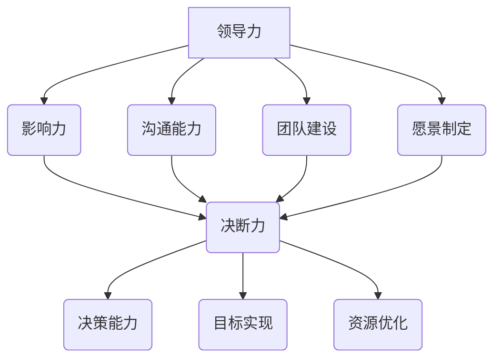

                 

### 背景介绍

在现代商业和社会环境中，领导力与决断力成为衡量一个领导者是否卓越的关键因素。领导力不仅关乎个人魅力和权力，更涉及到如何有效地管理团队、应对挑战、驱动创新。而决断力则是在关键时刻迅速做出明智决策的能力，它决定了团队和组织在面对复杂多变的环境时的适应能力和竞争力。

本文将围绕领导力与决断力的培养展开深入探讨。首先，我们将介绍这两个核心概念的基本定义和作用，并解析它们之间的内在联系。接着，文章将深入探讨决策艺术的技巧和策略，详细解析决策过程中的各个环节。在此基础上，我们将通过实际案例展示领导力与决断力在实践中的应用，最后提供具体的培养方法和策略，以帮助读者在实际工作中提升领导力和决断力。

领导力与决断力不仅是领导者必备的能力，也是每个职业人士在职业生涯中需要不断培养和提升的关键技能。本文将通过系统化的分析和具体的实践指导，帮助读者更好地理解这两个概念，掌握决策艺术，提升自己的领导力和决断力，从而在关键时刻做出更加明智和有效的决策。

### 核心概念与联系

首先，我们需要明确领导力与决断力的定义及其在领导实践中的核心作用。

**领导力的定义：** 领导力是指一个人在团队中引导、激励和协调成员的能力，通过建立愿景、制定目标、优化团队运作等方式，实现团队和组织的目标。领导力不仅仅是权力的体现，更是一种影响力，涉及到沟通、影响力、团队建设、决策等多方面的能力。

**决断力的定义：** 决断力则是指一个人在面对复杂和不确定性情境时，能够迅速分析形势、评估选项，并做出合理决策的能力。它不仅需要快速反应，更需要在短时间内进行深入思考，确保决策的有效性和可行性。

**领导力与决断力的联系：** 领导力与决断力是相辅相成的，二者共同构成了领导者在关键时刻的重要决策能力。具体来说，领导力提供了决断力的基础，包括对团队的深刻理解、对目标的清晰定义以及对资源的合理调配。而决断力则是领导力在实际操作中的具体体现，它帮助领导者面对各种挑战和不确定性，做出迅速且明智的决策。

为了更好地理解这两个概念之间的关系，我们可以通过以下Mermaid流程图展示其内在联系：



从图中可以看出，领导力的各个方面，如影响力、沟通能力、团队建设等，都是决断力的基础。而决断力则通过决策能力、目标实现和资源优化等具体行动，将领导力转化为实际的领导效果。

**核心要素分析：**

1. **影响力：** 领导者的首要任务是建立影响力，这包括个人魅力、专业知识以及与团队成员的信任关系。只有具备足够的影响力，领导者才能在决策时得到团队成员的支持和信任。

2. **沟通能力：** 高效的沟通是领导力的核心要素之一。领导者需要通过清晰、准确的沟通，确保团队成员对目标和愿景有共同的理解，从而为决策创造良好的基础。

3. **团队建设：** 一个高效的团队是领导者成功的重要保障。领导者需要通过团队建设活动，增强团队成员之间的协作和信任，提高团队的凝聚力和战斗力。

4. **愿景制定：** 明确的愿景是领导者指引团队前进的方向。通过制定和传达愿景，领导者能够激励团队成员为实现共同目标而努力。

5. **决策能力：** 决策能力是领导力与决断力的结合体。领导者需要在面对复杂情境时，快速评估各种选项，并做出明智的决策。

6. **目标实现：** 决策的最终目的是实现目标。领导者需要确保决策能够有效地推动团队向目标迈进，并持续跟踪和调整策略，以适应环境变化。

7. **资源优化：** 资源的合理配置是决策成功的关键。领导者需要评估团队的资源状况，确保资源能够被最有效地利用，从而支持决策的实施。

通过以上分析，我们可以看到领导力与决断力在领导实践中的紧密联系和相互影响。一个卓越的领导者不仅需要具备强大的领导力，还需要在关键时刻展现出出色的决断力，以确保团队和组织能够在竞争激烈的环境中持续发展和成功。

### 决策艺术

决策艺术是领导力与决断力的具体体现，特别是在面对复杂和不确定的环境时，有效的决策能力显得尤为重要。本文将从以下几个方面详细探讨决策艺术的技巧与策略：

**一、如何在复杂环境中做出有效决策**

1. **情景分析：** 在决策前，首先需要全面了解当前的情境，包括内部和外部因素。内部因素如团队的组成、资源的分配、员工的士气等，外部因素如市场变化、政策调整、竞争对手的动作等。通过情景分析，领导者可以更加全面地了解决策的环境。

   ```mermaid
   graph TB
   A[内部因素] --> B[团队组成]
   A --> C[资源分配]
   A --> D[员工士气]
   E[外部因素] --> F[市场变化]
   E --> G[政策调整]
   E --> H[竞争对手动作]
   ```

2. **情景模拟：** 通过模拟不同的情境，领导者可以预判不同决策可能带来的结果。这种方法可以帮助领导者评估风险，并选择最合适的决策方案。

   ```mermaid
   graph TB
   A[决策方案] --> B{市场顺利}
   A --> C{市场波动}
   A --> D{政策调整}
   B --> E[收益分析]
   C --> F[风险分析]
   D --> G[政策应对]
   ```

3. **数据分析：** 基于数据的决策更加科学和客观。领导者需要收集和分析相关的数据，如销售数据、财务数据、市场调研数据等，以支持决策。

   ```python
   # 数据分析示例
   import pandas as pd

   # 加载数据
   data = pd.read_csv('sales_data.csv')

   # 数据预处理
   data['sales'] = data['sales'].astype(float)

   # 数据分析
   avg_sales = data['sales'].mean()
   max_sales = data['sales'].max()
   min_sales = data['sales'].min()

   print(f'平均销售额: {avg_sales}')
   print(f'最大销售额: {max_sales}')
   print(f'最小销售额: {min_sales}')
   ```

**二、决策中的心理因素与应对策略**

1. **认知偏差：** 决策过程中容易受到各种认知偏差的影响，如确认偏见、过度自信、群体思维等。领导者需要意识到这些偏差，并采取措施进行纠正。

   ```mermaid
   graph TB
   A[确认偏见] --> B{基于已有信息做出判断}
   A --> C[过度自信] --> D{低估风险}
   A --> E[群体思维] --> F{缺乏独立思考}
   ```

2. **情绪管理：** 决策过程中情绪波动很大，领导者需要学会控制情绪，保持冷静和理性。可以通过以下方法进行情绪管理：

   - **深呼吸：** 在做出重要决策前进行几次深呼吸，有助于缓解紧张和焦虑。
   - **情绪释放：** 通过运动、冥想等方式释放情绪压力。
   - **情绪分享：** 与信任的同事或顾问分享情绪，获取不同的视角和建议。

   ```mermaid
   graph TB
   A[深呼吸] --> B{缓解紧张}
   A --> C[情绪释放] --> D{运动、冥想}
   A --> E[情绪分享] --> F{获取建议}
   ```

**三、高效决策的时间管理技巧**

1. **时间规划：** 在决策过程中，合理规划时间是确保决策效率的关键。可以采用以下方法进行时间规划：

   - **优先级排序：** 根据决策的重要性和紧急性对任务进行排序，优先处理最重要和最紧急的任务。
   - **时间限制：** 为每个决策设定时间限制，以避免无休止的讨论和拖延。
   - **专注时间：** 利用专注时间窗口进行决策，避免多任务处理带来的效率下降。

   ```mermaid
   graph TB
   A[优先级排序] --> B{重要紧急}
   A --> C[时间限制] --> D{避免拖延}
   A --> E[专注时间] --> F{提高效率}
   ```

2. **工具应用：** 利用各种工具和方法提高决策效率，如决策树、SWOT分析、矩阵分析等。

   ```mermaid
   graph TB
   A[决策树] --> B{逐步分析}
   A --> C[SWOT分析] --> D{评估优势与劣势}
   A --> E[矩阵分析] --> F{权衡利弊}
   ```

通过以上技巧和策略，领导者可以在复杂和不确定的环境中做出更加有效和明智的决策，从而提高团队和组织在竞争中的适应能力和竞争力。

### 决策过程解析

决策过程是领导力与决断力的核心组成部分，它不仅涉及到如何识别和定义问题，还涉及到信息收集、方案评估、执行与反馈等多个环节。以下是决策过程的详细解析：

**一、问题识别与诊断**

1. **定义问题：** 在决策的第一步，需要明确问题是什么。这包括理解问题的本质、原因和影响。问题定义的清晰性直接关系到后续决策的质量。

   ```mermaid
   graph TB
   A[定义问题] --> B{理解本质}
   A --> C{分析原因}
   A --> D{评估影响}
   ```

2. **情景分析：** 通过对当前情境的全面分析，确定问题的背景和条件。这包括内部和外部环境的分析，以及可能的影响因素。

   ```mermaid
   graph TB
   E[内部环境] --> F{团队结构}
   E --> G{资源状况}
   E --> H{员工士气}
   I[外部环境] --> J{市场变化}
   I --> K{政策调整}
   I --> L{竞争对手动作}
   ```

3. **诊断问题：** 在明确问题和情境的基础上，对问题进行深入诊断，找出根本原因。这可以通过访谈、数据分析、SWOT分析等方法进行。

   ```mermaid
   graph TB
   M[问题分析] --> N{数据收集}
   M --> O{访谈调研}
   M --> P{SWOT分析}
   ```

**二、信息收集与处理**

1. **数据收集：** 收集与问题相关的各种信息，包括定量数据和定性数据。这些数据可以是内部数据（如销售数据、财务报表）和外部数据（如市场调研报告、行业分析）。

   ```python
   # 数据收集示例
   import pandas as pd

   # 加载数据
   sales_data = pd.read_csv('sales_data.csv')
   market_report = pd.read_csv('market_report.csv')

   # 数据处理
   combined_data = pd.merge(sales_data, market_report, on='date')
   ```

2. **信息筛选：** 在大量信息中筛选出关键信息，确保信息的准确性和相关性。这可以通过数据清洗、统计分析等方法实现。

   ```python
   # 数据筛选示例
   import numpy as np

   # 数据清洗
   clean_data = sales_data.dropna()

   # 数据筛选
   key_indicators = clean_data[(clean_data['sales'] > 1000) & (clean_data['market_share'] > 0.05)]
   ```

3. **信息处理：** 对收集到的信息进行综合处理，形成对问题更深刻的理解。这可以通过数据可视化、因果分析等方法实现。

   ```mermaid
   graph TB
   Q[数据收集] --> R[信息筛选]
   R --> S[信息处理]
   ```

**三、方案评估与选择**

1. **制定方案：** 在收集和处理信息的基础上，制定多个可能的解决方案。这些方案需要考虑目标的实现、资源的分配、风险的控制等因素。

   ```mermaid
   graph TB
   T[制定方案] --> U{方案1}
   T --> V{方案2}
   T --> W{方案3}
   ```

2. **评估方案：** 对每个方案进行详细评估，包括优点、缺点、可行性、风险等。可以使用决策矩阵、成本效益分析等方法进行评估。

   ```mermaid
   graph TB
   X[评估方案] --> Y{决策矩阵}
   X --> Z{成本效益分析}
   ```

3. **选择方案：** 根据评估结果，选择最合适的方案进行实施。选择方案时需要综合考虑各种因素，确保决策的全面性和合理性。

   ```python
   # 选择方案示例
   from operator import itemgetter

   # 方案评估结果
   assessment_results = {
       '方案1': {'得分': 8, '风险': 3},
       '方案2': {'得分': 6, '风险': 2},
       '方案3': {'得分': 9, '风险': 1}
   }

   # 选择方案
   best_scheme = max(assessment_results.items(), key=itemgetter('得分'))
   print(f'最佳方案：{best_scheme[0]}')
   ```

**四、决策执行与监督**

1. **制定执行计划：** 根据选择的方案，制定详细的执行计划，明确执行步骤、责任分工、时间节点等。

   ```mermaid
   graph TB
   AA[执行计划] --> BB{步骤1}
   AA --> CC{责任分工}
   AA --> DD{时间节点}
   ```

2. **执行与监控：** 在执行过程中，对方案的实施情况进行监控，确保各个环节按照计划进行。可以通过设置关键绩效指标（KPI）、定期检查等方式进行监控。

   ```mermaid
   graph TB
   EE[执行与监控] --> FF{KPI设置}
   EE --> GG{定期检查}
   ```

3. **反馈与调整：** 根据执行结果进行反馈和调整，及时纠正偏差和优化方案。这可以通过定期的回顾会议、数据分析等方式进行。

   ```mermaid
   graph TB
   HH[反馈与调整] --> II{回顾会议}
   HH --> JJ{数据分析}
   ```

通过以上步骤，领导者可以系统地识别和诊断问题，收集和处理信息，评估和选择方案，并确保决策的有效执行。这不仅提高了决策的质量，也增强了领导力和决断力，从而在复杂和不确定的环境中做出更加明智和有效的决策。

### 商业决策案例分析

**案例一：创业公司的战略决策**

某初创公司（公司A）在面临市场竞争激烈的情况下，需要进行一项重要的战略决策，以保持市场竞争力并实现长期发展。

**问题识别与诊断：**

1. **问题定义：** 公司A的产品在市场上受到多家竞争对手的挑战，市场份额逐渐下降。为了重新获取市场优势，公司需要进行战略调整。
2. **情景分析：** 分析市场环境、竞争对手动作、自身产品优势和劣势。

**决策过程：**

1. **信息收集与处理：**
   - 收集市场数据，如销售额、市场份额、竞争对手产品情况等。
   - 分析财务数据，如成本结构、利润率等。

2. **方案评估：**
   - 制定多个战略方案，包括产品创新、市场拓展、价格调整等。
   - 通过成本效益分析和风险评估，评估各个方案的可能性。

3. **选择方案：**
   - 根据评估结果，选择“产品创新”方案，因为该方案具有最高的潜在回报和较低的失败风险。

**执行与反馈：**

1. **制定执行计划：**
   - 明确产品创新的具体步骤，如研发方向、时间节点等。
   - 分配研发资源，确保项目顺利进行。

2. **执行与监控：**
   - 持续监控研发进度和预算，确保按计划执行。
   - 定期进行项目回顾，调整研发方向和资源分配。

3. **反馈与调整：**
   - 研发完成后，对新产品进行市场测试，收集用户反馈。
   - 根据用户反馈，调整产品功能和营销策略。

**结果：**
   - 新产品成功上市，市场份额回升，公司实现了持续增长。

**案例分析总结：**
   公司A通过系统化的决策过程，在市场竞争中做出了明智的战略决策。有效的信息收集、方案评估和执行监督，确保了决策的成功实施。这一案例展示了创业公司在面对挑战时，如何通过战略决策实现市场竞争力提升。

**案例二：大型企业并购决策**

某大型企业（公司B）计划收购一家初创公司（公司C），以扩大业务范围和技术实力。

**问题识别与诊断：**

1. **问题定义：** 公司B需要通过并购来增强竞争力，但并购决策需要确保双方的利益和风险平衡。
2. **情景分析：** 分析公司C的技术优势、市场潜力、财务状况等。

**决策过程：**

1. **信息收集与处理：**
   - 收集公司C的财务报表、市场报告、技术专利等。
   - 分析公司B和公司C的业务互补性和潜在风险。

2. **方案评估：**
   - 制定并购方案，包括收购价格、股权分配、整合策略等。
   - 通过财务分析和风险评估，评估各个方案的可能性。

3. **选择方案：**
   - 根据评估结果，选择“全面收购”方案，因为该方案能够确保公司C的技术和人才资源完全纳入公司B。

**执行与反馈：**

1. **制定执行计划：**
   - 确定收购价格和股权结构，签署并购协议。
   - 制定整合策略，确保公司C的业务顺利融入公司B。

2. **执行与监控：**
   - 持续监控并购进度，确保协议按计划执行。
   - 定期进行整合评估，确保双方业务顺利整合。

3. **反馈与调整：**
   - 并购完成后，对公司C的业务进行评估，识别潜在问题和改进机会。
   - 根据评估结果，调整整合策略，优化业务运营。

**结果：**
   - 并购成功，公司B的技术实力和市场影响力显著提升。

**案例分析总结：**
   公司B通过系统化的并购决策过程，成功实现了业务扩张和竞争力提升。有效的信息收集、方案评估和执行监督，确保了并购决策的成功实施。这一案例展示了大型企业如何通过并购实现战略目标。

通过以上两个案例，我们可以看到商业决策在复杂和不确定的环境中的关键作用。通过系统化的决策过程，企业能够更好地应对市场变化，实现长期发展。

### 政策决策案例分析

**案例一：政府应急决策**

某地方政府在应对突发公共卫生事件（如新冠疫情）时，需要做出一系列紧急决策以保障公众健康和安全。

**问题识别与诊断：**

1. **问题定义：** 面对新冠疫情的迅速传播，政府需要迅速采取行动，遏制疫情扩散，保障公众健康。
2. **情景分析：** 分析疫情的发展态势、医疗资源的紧张程度、公众的心理状态等。

**决策过程：**

1. **信息收集与处理：**
   - 收集疫情数据，如确诊病例数、病毒传播路径等。
   - 分析医疗资源的分布和使用情况，包括医院床位、医疗设备等。

2. **方案评估：**
   - 制定多个应急方案，包括加强检测、封锁疫情严重区域、增加医疗资源等。
   - 通过风险评估和成本效益分析，评估各个方案的有效性和可行性。

3. **选择方案：**
   - 根据评估结果，选择“加强检测和封锁疫情严重区域”的方案，因为该方案能够迅速遏制疫情扩散，同时成本相对较低。

**执行与反馈：**

1. **制定执行计划：**
   - 明确检测和封锁的具体措施，包括检测点的设置、封锁区域的划分等。
   - 分配医疗资源，确保医疗设施和物资充足。

2. **执行与监控：**
   - 持续监控疫情发展和应急措施的实施情况。
   - 定期进行公共卫生评估，调整应急措施。

3. **反馈与调整：**
   - 根据疫情变化和公众反馈，调整应急策略，如加强疫苗接种、优化医疗资源分配等。

**结果：**
   - 通过一系列应急措施，成功遏制了疫情的扩散，保障了公众的健康和安全。

**案例分析总结：**
   政府在应对突发公共卫生事件时，通过系统化的应急决策过程，迅速采取有效措施，保障了公众的福祉。这一案例展示了政府如何在紧急情况下做出迅速而明智的决策，以应对突发危机。

**案例二：公共政策制定中的决策艺术**

某地方政府计划制定一项新的交通政策，以缓解城市交通拥堵问题。

**问题识别与诊断：**
1. **问题定义：** 城市交通拥堵严重，影响居民出行和生活质量。
2. **情景分析：** 分析交通流量、公共交通系统状况、居民的出行需求等。

**决策过程：**

1. **信息收集与处理：**
   - 收集交通流量数据，如高峰期交通流量、交通事故率等。
   - 分析公共交通系统的运行效率和服务水平。

2. **方案评估：**
   - 制定多个交通政策方案，包括增加公共交通线路、实施交通拥堵收费、推广自行车出行等。
   - 通过成本效益分析和公众意见调查，评估各个方案的有效性和可行性。

3. **选择方案：**
   - 根据评估结果，选择“增加公共交通线路和推广自行车出行”的方案，因为该方案能够有效缓解交通拥堵，同时成本较低，符合公众期望。

**执行与反馈：**

1. **制定执行计划：**
   - 明确公共交通线路的规划，包括新增线路、改进公交站点等。
   - 制定自行车出行推广计划，包括自行车道建设、自行车停放设施等。

2. **执行与监控：**
   - 持续监控交通拥堵情况，评估新政策的实施效果。
   - 定期进行公众满意度调查，了解政策的实际效果。

3. **反馈与调整：**
   - 根据交通拥堵情况和公众反馈，调整交通政策，如优化公交路线、增加自行车道等。

**结果：**
   - 通过新政策的实施，城市交通拥堵问题得到显著缓解，公共交通使用率上升，居民出行更加便捷。

**案例分析总结：**
   政府在制定公共政策时，通过系统化的决策过程，充分考虑了交通现状和公众需求，选择了最合适的政策方案，有效缓解了城市交通拥堵问题。这一案例展示了政府如何运用决策艺术，制定出符合实际需求的有效公共政策。

通过以上两个案例，我们可以看到政策决策在政府治理中的重要性。通过科学的决策过程和有效的执行监督，政府能够更好地应对突发危机和解决长期问题，提升治理效能和社会福祉。

### 个人决策案例分析

**案例一：职业规划中的关键决策**

某职场新人小张在职业发展过程中面临一个重要的决策：是继续留在当前的公司，还是跳槽到一家更具挑战性的公司。

**问题识别与诊断：**

1. **问题定义：** 小张需要选择一条职业发展的道路，这关系到他的职业成长和收入水平。
2. **情景分析：** 分析当前公司的职业发展机会、薪资待遇、工作环境等，以及目标公司的职位晋升空间、薪资待遇、企业文化等。

**决策过程：**

1. **信息收集与处理：**
   - 收集当前公司的内部晋升机会、工作满意度调查、薪资增长情况等。
   - 收集目标公司的职位描述、薪酬水平、晋升机制、企业文化等。

2. **方案评估：**
   - 制定两个方案：“留在当前公司”和“跳槽到目标公司”。
   - 通过比较两个方案的优劣，分析各自的潜在收益和风险。

3. **选择方案：**
   - 根据评估结果，选择“跳槽到目标公司”，因为目标公司提供更高的薪资和更好的职业发展机会。

**执行与反馈：**

1. **制定执行计划：**
   - 准备跳槽所需的材料，如简历、推荐信等。
   - 与目标公司沟通，确保跳槽计划的顺利实施。

2. **执行与监控：**
   - 持续关注目标公司的招聘进度，确保求职过程顺利进行。
   - 跟进当前公司的工作，确保在离职前完成手头的工作。

3. **反馈与调整：**
   - 跳槽成功后，根据新公司的实际情况和职业发展情况，调整职业规划。

**结果：**
   - 小张成功跳槽到目标公司，获得了更高的薪资和更好的职业发展机会，职业成长显著。

**案例分析总结：**
   小张通过系统化的决策过程，充分考虑了职业发展的各种因素，做出了明智的跳槽决策，成功提升了职业发展水平。这一案例展示了个人在职业规划中如何运用决策艺术，实现职业成长。

**案例二：生活中的重要选择**

某家庭在购房时面临一个重要的决策：是购买市中心的高档公寓，还是郊区的大户型别墅。

**问题识别与诊断：**

1. **问题定义：** 家庭需要选择一种住房方案，以适应家庭成员的需求和预算。
2. **情景分析：** 分析市中心公寓和郊区别墅的居住环境、交通便捷性、教育资源、预算等。

**决策过程：**

1. **信息收集与处理：**
   - 收集市中心公寓的价格、交通便利性、教育资源等。
   - 收集郊区别墅的价格、居住环境、交通时间等。

2. **方案评估：**
   - 制定两个方案：“购买市中心公寓”和“购买郊区别墅”。
   - 通过成本效益分析、家庭需求分析等，评估两个方案的优劣。

3. **选择方案：**
   - 根据评估结果，选择“购买郊区别墅”，因为别墅的居住环境更好，更适合家庭成员的需求。

**执行与反馈：**

1. **制定执行计划：**
   - 与房产中介沟通，了解房源信息。
   - 准备购房所需的材料，如首付、贷款等。

2. **执行与监控：**
   - 持续关注房源动态，确保购房过程顺利进行。
   - 在购房后，对居住环境进行评估，确保满足家庭需求。

3. **反馈与调整：**
   - 根据居住体验，对住房环境进行适当调整。

**结果：**
   - 家庭成功购买了郊区别墅，居住环境舒适，满足了家庭成员的需求。

**案例分析总结：**
   家庭通过系统化的决策过程，充分考虑了居住环境、交通便捷性、教育资源等因素，做出了明智的购房决策。这一案例展示了个人在生活中如何运用决策艺术，做出符合实际需求的重要选择。

通过以上两个案例，我们可以看到个人决策在职业生涯和生活选择中的重要性。通过系统化的决策过程，个人能够更好地理解问题、评估方案，并做出明智的决策，实现职业发展和生活质量的提升。

### 领导力培养方法

提升领导力是一个长期而系统的过程，需要从多个方面进行综合培养。以下是一些具体的培养方法：

**一、持续学习与实践**

1. **阅读书籍：** 选择经典和前沿的领导力书籍，如《领导力的五项修炼》、《高效能人士的七个习惯》等，通过阅读获取理论知识和实践经验。

2. **参加培训：** 参加领导力培训课程和工作坊，通过专业讲师的指导和互动讨论，提升领导技能。

3. **实践应用：** 将学到的领导力知识应用到实际工作中，通过实践检验和提升领导能力。

**二、提升自我认知与情绪管理**

1. **自我反思：** 定期进行自我反思，识别自己的优势和不足，制定改进计划。

2. **情绪管理：** 学习情绪管理技巧，如深呼吸、冥想等，通过自我调节，保持情绪稳定。

3. **寻求反馈：** 向同事、下属和导师寻求反馈，了解自己的领导风格和行为对团队的影响，不断改进。

**三、强化沟通能力与团队协作**

1. **有效沟通：** 学习有效沟通技巧，如清晰表达、积极倾听等，提高沟通效率。

2. **团队建设：** 通过团队建设活动，增强团队成员之间的信任和合作，提升团队凝聚力。

3. **冲突解决：** 学习冲突解决技巧，如中立第三方调解、共同寻找解决方案等，有效处理团队冲突。

**四、培养决策能力**

1. **情景模拟：** 通过模拟不同的决策情景，提升快速分析和决策能力。

2. **风险评估：** 学会评估决策可能带来的风险和影响，制定应对策略。

3. **持续改进：** 通过回顾和总结决策过程和结果，不断优化决策方法，提高决策质量。

**五、提升战略思维**

1. **全局视野：** 学会从全局视角看待问题，把握事物发展的趋势和规律。

2. **目标导向：** 确立明确的目标，制定实现目标的战略规划。

3. **创新思维：** 培养创新意识，通过创新方法和工具，推动团队和组织的发展。

通过以上方法，领导者可以全面提升自己的领导力，从而在复杂多变的环境中，更加从容地应对各种挑战，实现团队和组织的目标。

### 决断力培养技巧

提升决断力是每位领导者必须面对的重要课题，以下是一些具体的培养技巧：

**一、提升信息处理能力**

1. **快速筛选信息：** 在大量信息中迅速筛选出关键信息，避免被无关信息干扰。可以采用以下方法：
   - **优先级排序：** 根据信息的重要性和紧急性进行排序，优先处理关键信息。
   - **数据可视化：** 通过图表、图像等方式，将复杂的信息简化，便于快速理解。

2. **批判性思维：** 学会批判性地分析信息，识别信息的真实性和有效性。可以通过以下方法：
   - **交叉验证：** 对多个来源的信息进行比对，确保信息的准确性。
   - **逻辑推理：** 通过逻辑推理，评估信息的合理性和一致性。

**二、增强决策勇气与自信心**

1. **接受风险：** 决策往往伴随着风险，领导者需要学会接受风险，并勇敢地面对。可以通过以下方法：
   - **风险评估：** 在决策前进行详细的风险评估，制定应对措施。
   - **建立信心：** 通过成功经验的积累，增强自己的信心。

2. **积极心态：** 保持积极的心态，相信自己有能力做出正确的决策。可以通过以下方法：
   - **正面思考：** 面对挑战时，从积极的角度思考问题，寻找解决方案。
   - **学习态度：** 对决策过程中出现的错误持开放态度，将其视为学习和成长的机会。

**三、学会从失败中吸取教训**

1. **反思失败：** 在决策失败后，进行深入反思，分析失败的原因和教训。可以通过以下方法：
   - **复盘分析：** 通过复盘，重新回顾决策过程，找出问题所在。
   - **制定改进计划：** 根据反思结果，制定具体的改进措施。

2. **持续改进：** 将反思的教训应用到未来的决策中，不断优化决策过程。可以通过以下方法：
   - **经验积累：** 随着经验的积累，逐步提高决策的准确性和有效性。
   - **持续学习：** 学习先进的决策理论和技巧，不断提升自己的决策水平。

**四、强化决策勇气与自信心**

1. **信任团队：** 领导者需要学会信任团队成员，发挥集体的智慧和力量。可以通过以下方法：
   - **团队讨论：** 通过集体讨论，汇集不同意见和建议，提高决策质量。
   - **授权：** 给予团队成员足够的决策权，激发他们的积极性和创造力。

2. **培养决断力：** 通过日常训练，培养自己的决断力。可以通过以下方法：
   - **快速决策：** 在日常工作中，主动面对决策机会，练习快速决策。
   - **模拟情境：** 通过模拟不同决策情境，提升应对复杂问题的能力。

通过以上技巧，领导者可以逐步提升自己的决断力，在面对关键时刻时能够迅速做出明智的决策，从而提高团队和组织在竞争中的适应能力和竞争力。

### 综合培养策略

领导力与决断力的培养需要综合运用多种方法和策略，形成系统的培养体系。以下是一些综合培养策略，帮助读者全面提升领导力和决断力：

**一、领导力与决断力的双轮驱动**

1. **理论结合实践：** 领导力与决断力的培养不仅需要理论学习，更需要将理论应用到实际工作中。通过理论学习，获取领导力和决断力的基本知识和方法；通过实践应用，检验和提升这些能力。

2. **循环迭代：** 领导力和决断力的培养是一个循环迭代的过程。每次实践后，都需要进行反思和总结，发现不足之处，并针对性地进行改进。通过不断循环迭代，逐步提升自己的领导力和决断力。

**二、融合实践与理论**

1. **案例学习：** 通过学习经典和现代的领导力与决断力案例，了解成功领导者的决策过程和方法。通过案例分析，总结经验教训，为自身领导力与决断力的提升提供参考。

2. **培训与实践：** 参加领导力与决断力的培训课程和工作坊，通过专业讲师的指导，结合实际案例进行讨论和模拟，将理论与实践相结合，提升自身能力。

**三、持续改进与适应性调整**

1. **反思与总结：** 在每次决策后，进行深入反思和总结，分析决策的正确性和效果，识别存在的问题和改进空间。

2. **适应性调整：** 根据反思和总结的结果，及时调整领导策略和决策方法，提高决策的准确性和有效性。

3. **持续学习：** 保持开放的学习心态，不断学习新的领导力和决断力理论和方法，跟上时代的步伐，提升自身的综合素质。

**四、团队协作与互助**

1. **建立团队：** 建立一个高效的团队，通过团队协作，共同面对挑战和机遇，提升整体领导力和决断力。

2. **互相学习：** 在团队内部，成员之间互相学习、分享经验，共同提升领导力和决断力。

3. **导师指导：** 寻找一位经验丰富的导师，通过导师的指导和反馈，加快自身领导力和决断力的提升。

通过以上综合培养策略，读者可以系统地提升自己的领导力和决断力，从而在职业生涯中更加从容地应对各种挑战，实现个人和团队的长期发展。

### 附录：领导力与决断力培养资源

**相关书籍推荐：**

1. 《领导力的五项修炼》（作者：Stephen R. Covey）
   - 内容概述：本书详细阐述了领导力的五大核心要素，包括自我意识、共情能力、诚信正直、承诺和责任等，并通过具体案例进行了深入分析。
   - 推荐理由：对于希望提升领导力的人来说，这是一本不可或缺的指导书籍。

2. 《高效能人士的七个习惯》（作者：Stephen R. Covey）
   - 内容概述：本书提出了七个关键习惯，包括主动积极、以终为始、要事第一等，帮助读者提高个人效能和领导力。
   - 推荐理由：实用的方法和技巧，适用于各个层次的领导者和职业人士。

3. 《决断力：如何做出最佳决策》（作者：Rolf Dobelli）
   - 内容概述：本书通过深入探讨决策中的心理因素和误区，提供了有效的决策策略和方法，帮助读者提高决断力。
   - 推荐理由：对决策心理和行为的研究，提供了科学的决策指导。

**在线课程与培训资源：**

1. Coursera - 《领导力和决策》：由斯坦福大学提供的一系列课程，涵盖领导力的各个方面，包括团队管理、沟通技巧和决策艺术。
   - 访问链接：[https://www.coursera.org/specializations/leadership-decision-making](https://www.coursera.org/specializations/leadership-decision-making)

2. edX - 《领导力基础》：由哈佛大学提供的免费课程，介绍领导力的基本概念和技能，适合初学者。
   - 访问链接：[https://www.edx.org/course/leadership-foundations](https://www.edx.org/course/leadership-foundations)

3. LinkedIn Learning - 《决断力提升》：提供一系列视频课程，帮助读者理解和应用各种决断力提升技巧。
   - 访问链接：[https://www.linkedin.com/learning/courses/detail/decisiveness](https://www.linkedin.com/learning/courses/detail/decisiveness)

**实践案例库与决策工具：**

1. **案例库：**
   - 麦肯锡案例库（McKinsey Case Studies）：提供各种实际商业案例，包括决策分析、战略规划等。
     - 访问链接：[https://www.mckinsey.com/insights/cases](https://www.mckinsey.com/insights/cases)
   - Harvard Business Review（HBR）案例库：涵盖广泛的商业和管理案例，包括领导力和决策案例。
     - 访问链接：[https://hbr.org/case-studies](https://hbr.org/case-studies)

2. **决策工具：**
   - SWOT分析工具：用于评估项目的优势、劣势、机会和威胁。
     - 访问链接：[https://www.canva.com/tools/swot-analysis/](https://www.canva.com/tools/swot-analysis/)
   - 决策树工具：用于可视化决策过程和评估不同决策路径的结果。
     - 访问链接：[https://www.lucidchart.com/](https://www.lucidchart.com/)

通过以上资源，读者可以系统地学习和提升领导力与决断力，为实际工作和生活做好准备。无论在个人职业发展还是团队管理中，这些资源都将提供宝贵的帮助和指导。

### 文章小结

本文围绕领导力与决断力的培养，深入探讨了这两个关键能力的定义、联系、决策艺术、实践案例以及培养方法。通过系统地分析，我们了解到领导力不仅涉及个人魅力和权力，还包括沟通、团队建设和决策能力。而决断力则是在复杂和不确定情境下，迅速做出明智决策的能力。本文通过具体案例展示了领导力与决断力在实际中的应用，并提供了一系列培养策略，帮助读者在实际工作中提升这些能力。

在未来的学习和实践中，读者可以继续关注以下几个方面：

1. **持续学习：** 保持对领导力与决断力的学习和更新，不断吸收最新的理论和实践成果。
2. **实践应用：** 将学到的知识和方法应用到实际工作中，通过实践检验和提升领导力和决断力。
3. **反思与总结：** 在每次决策后进行深入反思和总结，从成功和失败中吸取经验教训，不断优化决策过程。
4. **团队协作：** 建立高效的团队，通过团队合作，共同面对挑战和机遇，提升整体领导力和决断力。

通过持续的学习和实践，读者可以逐步提升自己的领导力和决断力，成为更加卓越的领导者。

### 注意事项与最佳实践

在培养领导力和决断力的过程中，需要注意以下几点事项和最佳实践：

1. **明确目标：** 在决策和领导过程中，首先要明确目标和期望结果，确保每一步行动都与整体目标一致。

2. **充分准备：** 决策前需要进行充分的准备，包括信息收集、风险评估和方案评估，以避免因信息不全或准备不足导致的错误决策。

3. **灵活调整：** 在执行决策过程中，要能够根据实际情况灵活调整计划和策略，以应对环境变化和不确定性。

4. **寻求反馈：** 定期向团队成员和利益相关者寻求反馈，了解决策的实施效果和影响，及时进行调整和优化。

5. **持续学习：** 领导力和决断力需要通过不断学习和实践来提升，定期参加培训、阅读相关书籍和文章，以及向经验丰富的导师学习。

6. **情绪管理：** 学会管理自己的情绪，避免因情绪波动影响决策质量。在面对压力和挑战时，保持冷静和理性。

7. **团队协作：** 强调团队协作，鼓励团队成员积极参与决策过程，发挥集体的智慧和力量，共同应对挑战。

通过遵循以上最佳实践，读者可以更加有效地培养和提升领导力和决断力，实现个人和团队的目标。

### 拓展阅读

**《领导力的心理学》**

作者：丹尼斯·雷恩哈特（Dennis Reina）和帕梅拉·雷恩哈特（Pamela Reina）

本书从心理学的角度深入探讨了领导力的本质和影响。通过丰富的案例研究和实证数据，揭示了领导力背后的心理机制，帮助读者理解如何通过心理学知识提升领导能力。

**《决断力：如何作出更好的选择》**

作者：理查德·塞勒（Richard Thaler）

这本书以行为经济学为基础，探讨了决策过程中常见的心理偏差和误区，并提出了改善决策质量的实用方法。书中丰富的实例和实验数据，为读者提供了科学的决策指导。

**《领导力与决策：应对复杂性的艺术》**

作者：彼得·德鲁克（Peter Drucker）

作为管理学大师，彼得·德鲁克在这本书中系统地阐述了领导力和决策的关系，以及如何在复杂和不确定的环境中做出明智的决策。书中涵盖了大量的企业案例和理论分析，对领导者具有很高的参考价值。

**《团队的智慧：构建高效的团队协作》**

作者：罗恩·海斯（Ron Heifetz）和马丁·卢瑟（Martin Luther）

本书探讨了团队协作的心理学和行为学原理，提出了构建高效团队的策略和方法。通过具体的团队建设活动和案例，帮助读者理解和应用团队协作的最佳实践。

通过阅读这些书籍，读者可以进一步深化对领导力和决断力的理解，为实际工作提供更多的理论支持和实践指导。

