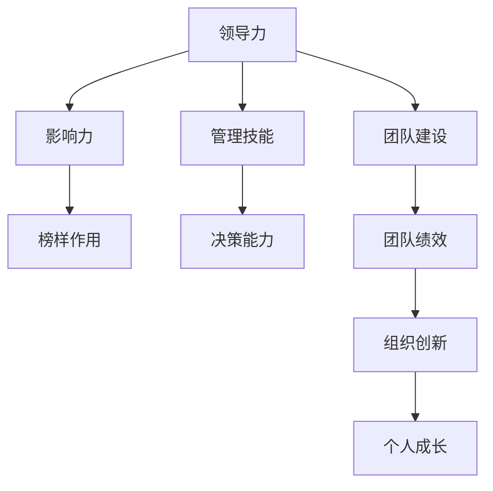

                 

# 文章标题：领导力与决断：在压力下做出正确决策

## 关键词
领导力，决断力，压力管理，决策过程，案例分析

## 摘要
本文旨在探讨领导力与决断力在压力下的关系，以及如何在高压环境中做出正确的决策。文章首先介绍了领导力与决断力的核心概念，并阐述了它们之间的内在联系。接着，本文分析了压力对决策过程的影响，并提出了相应的压力管理策略。通过核心算法原理讲解、数学模型与公式展示，以及实际项目实战，文章详细阐述了在压力下做出正确决策的方法和技巧。最后，本文总结了最佳实践，并提供了拓展阅读建议。

## 引言
### 1.1 书籍背景
领导力与决断力是每个成功领导者必须具备的关键能力。在快速变化和充满不确定性的商业环境中，领导者需要具备强大的决断力，以便在面对压力和挑战时做出明智的决策。同时，领导力不仅关乎个人的成长，更影响着整个团队的绩效和凝聚力。因此，提升领导力和决断力成为许多企业和个人关注的焦点。

### 1.2 目的与目标
本文的目标是帮助读者理解领导力与决断力的核心概念，学会在压力下管理情绪和做出正确的决策。通过分析压力对决策过程的影响，本文旨在提供实用的策略和技巧，帮助读者在实际工作中更好地应对挑战。同时，本文还通过案例分析和项目实战，为读者提供实践指导，以加深对理论知识的理解。

### 1.3 结构安排
本文分为四个主要部分：

1. **领导力的基础**：介绍领导力的本质、领导者角色以及领导力核心概念之间的联系。
2. **决断力的培养**：探讨决断力的定义与特征，决断力培养策略，决策模型与算法原理，以及数学模型与公式。
3. **压力下的决策**：分析压力管理、压力下的决策技巧，以及压力情境下的决断力。
4. **案例分析与实践**：通过经典案例分析和实际项目实战，提供实践指导。

## 第一部分：领导力的基础

### 2.1 领导力的本质
领导力并非天生，而是一种可以通过学习和实践培养的能力。领导力是指引导和激励他人实现目标的能力。它不仅涉及个人品质，还包括管理技能和决策能力。

#### 2.1.1 领导力定义
领导力是一种在团队或组织内部通过影响力和榜样作用，激励团队成员实现共同目标的能力。它不仅仅是职位赋予的权威，更是通过个人魅力、专业知识、沟通能力和决策能力来实现的。

#### 2.1.2 领导力的重要性
领导力对于个人和组织的发展至关重要。一个优秀的领导者能够激发团队成员的潜力，提高团队绩效，推动组织创新和发展。同时，领导力也是领导者自身成长的催化剂。

### 2.2 领导者角色
领导者不仅仅是管理者，更是团队的引领者和榜样。领导者需要具备多方面的能力，包括战略规划、沟通协调、冲突管理、团队建设等。

#### 2.2.1 领导风格
领导风格是领导者管理团队的方式和手段。常见的领导风格包括民主型、权威型、参与型等。不同的领导风格适用于不同的情境，领导者需要根据实际情况灵活调整。

#### 2.2.2 领导者的责任与挑战
领导者的责任包括设定目标、激励团队成员、解决冲突、提供反馈等。同时，领导者还面临诸多挑战，如应对不确定性、平衡团队需求、管理冲突等。

### 2.3 领导力核心概念联系
为了更好地理解领导力，我们需要探讨领导力核心概念之间的联系。以下是领导力核心概念之间的 Mermaid 流程图：



## 第二部分：决断力的培养

### 3.1 决断力的定义与特征
决断力是指在面对复杂问题和不确定性时，能够迅速做出明确决策的能力。它是一种基于判断力、自信心和决心的综合能力。

#### 3.1.1 决断力定义
决断力是指一个人在面对复杂情境时，能够迅速分析问题、权衡利弊，并做出决策的能力。它是一种动态的能力，需要不断地培养和锻炼。

#### 3.1.2 决断力的重要性
决断力在个人和组织的成功中起着关键作用。一个具备强大决断力的人能够在关键时刻迅速做出决策，避免拖延和失误。同时，决断力也是领导者必备的能力之一。

### 3.2 决断力培养策略
要培养决断力，我们需要从自我认知、情绪管理、信息搜集与评估等方面入手。

#### 3.2.1 自我认知
自我认知是决断力的基础。我们需要了解自己的优势和劣势，明确自己的价值观和目标。通过自我反思和反馈，我们可以更好地认识自己，提高决断力。

#### 3.2.2 情绪管理
情绪管理是决断力培养的重要一环。在面临压力和不确定性时，我们需要学会控制情绪，避免被情绪所左右。通过冥想、运动等方式，我们可以提高情绪管理能力。

#### 3.2.3 信息搜集与评估
在做出决策前，我们需要充分搜集信息，并对其进行评估。通过多种渠道获取信息，我们可以提高决策的准确性和可靠性。

### 3.3 决策模型与算法原理
为了更好地理解决策过程，我们可以使用决策树和线性规划等算法来模拟决策过程。以下是决策树模型的伪代码：

```python
def decision_tree(data):
    if data['condition1']:
        return action1
    elif data['condition2']:
        return action2
    else:
        return action3
```

### 3.4 数学模型与公式
在决策过程中，数学模型和公式可以帮助我们优化决策。以下是一个简单的线性规划模型：

$$
\min\ z = c^T x
$$

$$
Ax \leq b
$$

$$
x \geq 0
$$

其中，$c$是目标函数系数，$A$是约束矩阵，$b$是约束向量，$x$是决策变量。通过求解该模型，我们可以找到最优决策。

## 第三部分：压力下的决策

### 4.1 压力管理
压力是领导力和决断力面临的挑战之一。有效的压力管理可以帮助我们更好地应对决策过程中的压力。

#### 4.1.1 压力的来源
压力可以来自工作、人际关系、家庭等多个方面。在决策过程中，压力主要来自不确定性、责任感和时间限制等。

#### 4.1.2 压力对决策的影响
压力可以影响我们的认知能力和决策质量。在高压力环境下，我们容易受到情绪影响，导致决策失误。

#### 4.1.3 压力管理策略
以下是一些有效的压力管理策略：

1. **时间管理**：合理安排时间，避免过度工作。
2. **情绪管理**：通过冥想、运动等方式调节情绪。
3. **沟通与反馈**：与同事和下属保持良好的沟通，及时获取反馈。
4. **自我反思**：定期进行自我反思，找出压力来源并采取相应措施。

### 4.2 压力下的决策技巧
在压力下做出正确决策需要一定的技巧。以下是一些建议：

1. **预先准备**：在决策前，充分准备相关信息，降低决策时的不确定感。
2. **分解问题**：将复杂问题分解为若干小问题，逐一解决。
3. **权衡利弊**：在决策时，权衡各种可能的后果，选择最优方案。
4. **快速决策**：在压力下，快速决策可以减少犹豫和后悔。

### 4.3 压力情境下的决断力
在压力情境下，决断力尤为重要。以下是一些建议，帮助我们在压力情境下保持决断力：

1. **保持冷静**：在压力情境下，保持冷静和清晰的头脑至关重要。
2. **聚焦目标**：将注意力集中在目标上，避免被细节所困扰。
3. **寻求支持**：在需要时，向同事或领导寻求支持和建议。
4. **反思与总结**：在决策后，反思决策过程和结果，总结经验教训。

## 第四部分：案例分析与实践

### 5.1 领导力与决断力经典案例分析
通过以下经典案例，我们可以更好地理解领导力与决断力在实际工作中的应用。

#### 5.1.1 案例一：成功决策的要素
在一个快速发展的科技公司中，领导者在面对市场变化时，做出了迅速调整，带领团队取得了显著的成功。这个案例展示了领导力与决断力在应对市场变化时的关键作用。

#### 5.1.2 案例二：应对决策挑战
在一个大型企业中，领导者在面对复杂的业务挑战时，通过有效的沟通和团队协作，最终解决了问题。这个案例展示了领导者在决策过程中如何应对挑战和压力。

### 5.2 实践指导
以下是一些实用的实践指导，帮助读者在工作和生活中更好地运用领导力与决断力。

1. **建立良好的沟通机制**：与团队成员保持密切沟通，确保信息的畅通和透明。
2. **培养团队意识**：通过团队活动和培训，增强团队成员的凝聚力和协作能力。
3. **学会拒绝**：在面对过多的任务和要求时，学会拒绝不合理的要求，保护自己的时间和精力。
4. **定期反思**：定期对自己的决策和行动进行反思，总结经验教训，不断提高决策能力。

### 5.3 项目实战
以下是一个实际项目实战案例，包括开发环境搭建、源代码详细实现和代码解读。

#### 5.3.1 项目简介
本案例是一个基于 Python 的决策支持系统项目，旨在帮助企业在面对市场变化时做出更明智的决策。

#### 5.3.2 开发环境搭建
1. 安装 Python 3.8 及以上版本。
2. 安装必要的 Python 库，如 NumPy、Pandas、Matplotlib 等。

#### 5.3.3 源代码实现
以下是项目的核心代码实现：

```python
import pandas as pd
import numpy as np
import matplotlib.pyplot as plt

# 读取数据
data = pd.read_csv('market_data.csv')

# 数据预处理
data['price_change'] = data['current_price'] - data['previous_price']
data['price_change_percent'] = (data['price_change'] / data['previous_price']) * 100

# 决策模型
def decision_model(data):
    # 计算价格变化百分比
    data['price_change_percent'] = (data['current_price'] - data['previous_price']) / data['previous_price'] * 100
    
    # 检查是否有价格下降
    if data['price_change_percent'].min() < 0:
        return 'reduce_stock'
    else:
        return 'increase_stock'

# 决策执行
data['decision'] = data.apply(lambda row: decision_model(row), axis=1)

# 可视化
data['decision'].value_counts().plot(kind='bar')
plt.xlabel('Decision')
plt.ylabel('Frequency')
plt.title('Decision Distribution')
plt.show()
```

#### 5.3.4 代码解读与分析
1. 读取市场数据，并进行预处理。
2. 定义决策模型，根据价格变化百分比做出决策。
3. 执行决策，并将决策结果可视化。

### 5.4 实际案例分析和详细讲解剖析
以下是一个实际案例分析和详细讲解：

#### 案例背景
一家电商公司面临着激烈的市场竞争，需要根据用户行为数据做出商品推荐的决策。

#### 案例分析
1. 数据收集：收集用户浏览、购买和评价等行为数据。
2. 数据预处理：对数据进行清洗和归一化处理。
3. 决策模型：使用协同过滤算法生成推荐列表。
4. 决策执行：根据推荐列表，调整商品展示策略。

#### 详细讲解
1. 数据收集：通过数据分析平台，收集用户行为数据。
2. 数据预处理：使用 Pandas 库对数据进行清洗和归一化处理。
3. 决策模型：使用协同过滤算法，生成推荐列表。协同过滤算法包括基于用户和基于物品的推荐方法。
4. 决策执行：根据推荐列表，调整商品展示策略，提高用户满意度。

### 5.5 项目小结
通过本项目的实战，我们可以看到领导力与决断力在实际工作中的应用。在实际项目中，领导力体现在对项目的整体把控和团队成员的激励；决断力则体现在对项目关键决策的迅速制定和执行。通过本案例的分析和讲解，我们了解了在项目实践中如何运用领导力和决断力，以提高项目成功率。

## 结论
### 6.1 总结与反思
本文从领导力与决断力的核心概念出发，探讨了在压力下做出正确决策的方法和技巧。通过案例分析与实践，我们看到了领导力和决断力在实际工作中的应用。在实际工作中，领导者需要不断提高自己的领导力和决断力，以便在压力下做出明智的决策。

### 6.2 未来展望
未来，领导力和决断力的研究将进一步深入，涉及更多领域和情境。随着人工智能和大数据技术的发展，决策支持系统将为领导者提供更多信息和工具，帮助他们做出更明智的决策。

### 6.3 建议与启示
1. 定期进行领导力和决断力培训，提高自身能力。
2. 学会压力管理，保持良好的心态和情绪。
3. 善于倾听团队成员的意见，形成共识。
4. 在决策过程中，充分考虑各种可能性和后果。

## 附录
### A.1 附加资源
1. 《领导力心理学》 - 迈克尔·波特
2. 《决断力》 - 凯瑟琳·斯图尔特
3. 《压力管理》 - 罗伯特·E·斯通

### A.2 参考文献
1. 领导力与组织行为学 - 彼得·德鲁克
2. 决策心理学 - 丹尼尔·卡内曼
3. 商业分析实战 - 约翰·福布斯·纳什

## 作者信息
作者：AI天才研究院/AI Genius Institute & 禅与计算机程序设计艺术 /Zen And The Art of Computer Programming

