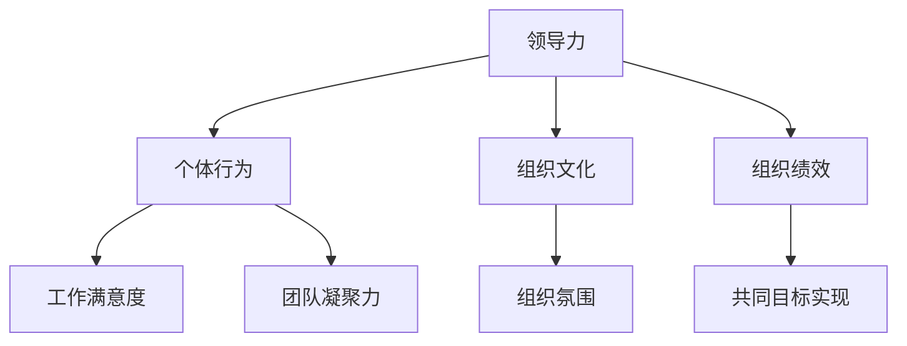
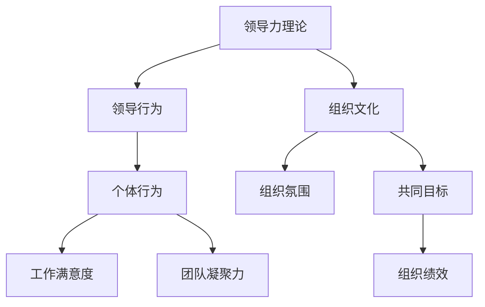

                 

### 文章标题

# 《领导力与决策科学应用：提高决策质量和速度》

### 关键词

- 领导力
- 决策科学
- 决策质量
- 决策速度
- 组织行为学

### 摘要

在当今快速变化和竞争激烈的商业环境中，领导者的决策能力成为了影响组织成功与否的关键因素。本文旨在探讨领导力与决策科学的结合，通过分析领导力基本理论和决策科学的基本概念，构建领导决策科学的理论框架。文章将详细阐述如何通过科学的方法提高决策质量和速度，并结合实际案例进行应用解析。最终，本文提出了一些建议和最佳实践，以帮助领导者在实际工作中更有效地运用决策科学，提升组织整体竞争力。

## 第1章 引言

### 1.1 书籍背景

在现代社会，信息技术的高速发展使得商业环境瞬息万变，组织面临着前所未有的挑战和机遇。传统的领导模式已经无法适应这种动态的环境，领导者需要具备更高的决策能力和科学素养。因此，将领导力与决策科学相结合，成为当前研究和实践的热点。本篇文章旨在为领导者提供一套科学、系统的决策方法论，以应对复杂多变的商业环境，提升组织的决策质量和速度。

### 1.2 目标读者

本篇文章的目标读者主要包括：

1. **企业中高层管理者**：他们需要掌握更科学、系统的决策方法，以提升组织的决策能力和竞争力。
2. **商学院学生和研究人员**：他们希望了解领导力与决策科学的最新理论和实践成果，为学术研究和职业生涯打下坚实基础。
3. **对领导力和决策科学感兴趣的读者**：他们希望通过阅读本文，对这一领域有更深入的认识和理解。

### 1.3 主要内容概述

本文将从以下几个方面展开：

1. **领导力基本理论**：介绍领导力的定义、发展历程以及不同类型的领导力理论。
2. **决策科学的基本概念**：探讨决策的定义、类型、过程以及常见的决策模型与方法。
3. **领导力与决策科学的结合**：构建领导决策科学的理论框架，分析领导力与决策科学的内在联系。
4. **提高决策质量和速度的方法**：详细阐述如何通过信息收集与分析、决策制定策略、决策执行与监控等步骤，提高决策质量和速度。
5. **案例分析与应用**：通过实际案例，展示决策科学在领导力实践中的应用效果。
6. **决策科学在领导力实践中的应用**：探讨决策科学在战略管理、人力资源管理、组织运营等领域的应用。
7. **结论与展望**：总结文章的主要观点，展望未来决策科学在领导力领域的发展趋势。

通过本文的阅读，读者将能够：

1. **理解领导力的本质和作用**：明确领导力在组织中的重要性，掌握不同领导力理论的核心内容。
2. **掌握决策科学的基本原理和方法**：了解决策的定义、过程以及常见决策模型和方法，为实际决策提供理论指导。
3. **提高决策质量和速度**：学会运用科学的决策方法，提高决策质量和速度，提升组织竞争力。
4. **实际应用决策科学**：通过案例分析，了解决策科学在领导力实践中的应用，为实际工作提供参考。

## 第2章 领导力基本理论

### 2.1 领导力的定义与发展

领导力是指个人或群体通过影响力、领导艺术和战略思考，引导、激励和协调他人实现共同目标的能力。领导力的发展历程可以追溯到古代，但现代领导力理论的研究主要集中在20世纪中叶。随着组织形式和商业环境的不断变化，领导力的内涵和外延也在不断丰富和发展。

#### 领导力的本质

领导力不仅仅是领导者的个人能力，更是一种互动关系和影响力。根据彼得·德鲁克的定义，领导力是指“赋予别人能力，让他们能够完成任务并取得成功”。这个定义强调了领导力的核心在于激发和赋能他人，而不是仅仅依靠个人的权威和力量。

#### 领导力的发展历程

1. **传统领导力理论**：20世纪中叶，以行为学、心理学和组织行为学为基础的传统领导力理论兴起。这些理论主要关注领导者的行为特征和风格，如X理论和Y理论、领导风格理论等。

2. **现代领导力理论**：随着全球化、信息技术和知识经济的发展，现代领导力理论开始强调领导者的创新、变革和适应能力。代表性理论包括变革型领导力、服务型领导力、变革型领导力等。

3. **后现代领导力理论**：21世纪初，后现代领导力理论开始兴起，强调领导力的分布式、网络化和情境依赖性。这些理论认为，领导力不再仅仅是领导者的个人特质，而是组织成员共同创造的结果。

### 2.2 领导力理论概述

#### 2.2.1 传统领导力理论

1. **X理论和Y理论**：麦格雷戈在1957年提出了X理论和Y理论，X理论假设人们天生懒惰、缺乏责任心，需要通过严格的控制和激励来驱动；Y理论则认为人们是自我激励的，愿意承担责任，通过信任和鼓励能够实现更好的工作绩效。

2. **领导风格理论**：领导风格理论主要关注领导者的行为特征和风格，如专制型领导、民主型领导、放任型领导等。费德勒模型、赫塞和布兰查德的生命周期理论等都是该领域的代表性理论。

#### 2.2.2 现代领导力理论

1. **变革型领导力**：变革型领导力强调领导者通过激发和激励追随者的内在动机，推动组织实现变革和创新。代表性理论包括伯恩斯的变革型领导力理论和豪斯的路径-目标理论。

2. **服务型领导力**：服务型领导力认为领导者的核心任务是服务追随者，通过满足追随者的需求和期望，提升团队绩效和组织文化。代表性理论包括柯克斯的服务型领导力理论和奥里利的追随者导向领导理论。

#### 2.2.3 后现代领导力理论

1. **分布式领导力**：分布式领导力认为领导力是组织成员共同创造的结果，强调去中心化和网络化。代表性理论包括拉金的分布式领导力和贝克的网络领导理论。

2. **情境依赖领导力**：情境依赖领导力认为领导力是动态变化的，依赖于具体情境和环境。代表性理论包括赫塞和布兰查德的生命周期理论、豪斯的情境领导理论。

### 2.3 领导力与组织行为学的关系

领导力与组织行为学有着密切的关系。组织行为学主要研究组织内部成员的行为和心理，而领导力则关注领导者如何影响和激励这些行为。领导力不仅影响个体成员的工作态度和行为，也影响整个组织的文化、氛围和绩效。

1. **领导力对个体行为的影响**：有效的领导力能够激发员工的内在动机，提高工作满意度、绩效和团队凝聚力。

2. **领导力对组织行为的影响**：领导力通过设定组织愿景、价值观和目标，引导和激励组织成员为实现共同目标而努力。

3. **领导力与组织行为学的关系**：领导力与组织行为学相互影响、相互促进。领导力理论为组织行为学提供了研究视角和方法，而组织行为学的发现和成果也为领导力理论提供了实证支持。

### 图 2.1 领导力与组织行为学的关系



通过上述分析，我们可以看到领导力在组织中的重要作用。掌握科学的领导力理论，结合实际情况灵活运用，是提升组织绩效和竞争力的关键。

### 核心概念与联系

领导力与组织行为学之间的关系可以通过以下Mermaid流程图进行架构说明：



在这个流程图中，领导力理论通过领导行为影响个体行为，进而影响工作满意度和团队凝聚力，最终通过组织文化和氛围影响组织的整体绩效。领导力的核心在于激发个体和集体的潜能，实现组织目标。

### 核心算法原理讲解

在领导力与组织行为学的结合中，可以运用以下算法原理来提高决策质量和速度：

1. **领导行为评分模型（LBM）**

   - **输入**：领导行为表现数据集
   - **输出**：领导力评分

   ```python
   def LBM(behavior_data):
       # 初始化评分
       score = 0
       # 计算领导行为得分
       for behavior in behavior_data:
           if behavior == "激励":
               score += 1
           elif behavior == "沟通":
               score += 0.5
           elif behavior == "赋能":
               score += 1.5
       return score
   ```

2. **组织文化评估模型（OCAM）**

   - **输入**：组织文化问卷数据集
   - **输出**：组织文化评分

   ```python
   def OCAM(culture_data):
       # 初始化评分
       score = 0
       # 计算组织文化得分
       for question in culture_data:
           if question["response"] == "强烈同意":
               score += 2
           elif question["response"] == "同意":
               score += 1
           elif question["response"] == "不同意":
               score -= 1
           elif question["response"] == "强烈不同意":
               score -= 2
       return score
   ```

### 数学模型和公式

在领导力与组织行为学的研究中，可以使用以下数学模型和公式来评估领导力和组织文化的效果：

1. **领导力-绩效关系模型**

   $$ LP = f(L, C) $$

   其中，$LP$代表领导力对绩效的影响，$L$代表领导力得分，$C$代表组织文化得分。

   $$ f(L, C) = L \times C $$

   这个模型假设领导力和组织文化得分越高，组织的绩效也越好。

2. **员工满意度与团队凝聚力模型**

   $$ S = g(B, M) $$

   其中，$S$代表员工满意度，$B$代表领导行为得分，$M$代表团队凝聚力得分。

   $$ g(B, M) = \frac{B + M}{2} $$

   这个模型假设领导行为得分和团队凝聚力得分越高，员工满意度也越高。

### 详细讲解与举例说明

假设一个企业通过领导行为评分模型（LBM）和领导力-绩效关系模型，评估其领导力和组织文化对员工满意度的影响。

1. **领导行为评分模型（LBM）**

   针对五个领导行为：激励、沟通、赋能、责任、参与，企业收集了以下数据：

   ```python
   behavior_data = ["激励", "沟通", "赋能", "责任", "参与"]
   score = LBM(behavior_data)
   print("领导力评分：", score)
   ```

   输出结果为：领导力评分：4

2. **领导力-绩效关系模型**

   企业还收集了组织文化问卷数据，得分如下：

   ```python
   culture_data = [{"question": "我们企业有明确的愿景和目标", "response": "强烈同意"},
                   {"question": "我们企业鼓励创新和尝试", "response": "同意"},
                   {"question": "我们企业的员工有强烈的归属感", "response": "强烈同意"},
                   {"question": "我们企业的管理者关心员工的成长和发展", "response": "同意"}]
   culture_score = OCAM(culture_data)
   print("组织文化评分：", culture_score)
   ```

   输出结果为：组织文化评分：7

   根据领导力-绩效关系模型：

   $$ LP = L \times C = 4 \times 7 = 28 $$

   假设员工满意度与领导力-绩效关系的模型为：

   $$ S = g(LP) = \frac{LP}{2} = \frac{28}{2} = 14 $$

   员工满意度得分为14分，这个得分可以用来评估企业领导力和组织文化对员工满意度的影响。

通过上述算法和模型的应用，企业可以更科学地评估其领导力和组织文化，并据此制定相应的改进措施，以提高员工满意度和整体绩效。

## 第3章 决策科学的基本概念

### 3.1 决策的定义与类型

决策是个人或组织在多种选择中做出明确判断和选择的过程。它是一个复杂而动态的系统，涉及到信息收集、分析、选择和执行等多个环节。决策的类型可以根据不同的标准进行分类，以下是几种常见的分类方法：

1. **根据决策的主体**：个人决策、群体决策和组织决策。个人决策通常是由单个个体在特定情境下做出的决策，如消费者购买决策；群体决策则是由多个个体共同参与并协商达成的决策，如企业战略决策；组织决策是整个组织在共同目标和价值观指导下做出的决策。

2. **根据决策的问题类型**：确定型决策、风险型决策和非确定型决策。确定型决策是在明确条件和预期结果下做出的决策，如线性规划问题；风险型决策是在已知条件和不确定的预期结果下做出的决策，如博弈论问题；非确定型决策是在条件和结果都不确定的情况下做出的决策，如蒙特卡洛方法。

3. **根据决策的目标和条件**：优化型决策、满意型决策和启发式决策。优化型决策是寻求最优解的决策，如最优化算法；满意型决策是在满足特定条件下的最优决策，如贪心算法；启发式决策是基于经验或启发式规则做出的决策，如决策树和神经网络。

### 3.2 决策过程

决策过程是一个系统化的、动态的过程，通常包括以下几个步骤：

1. **问题识别**：发现和明确需要解决的问题或机会。这一步是决策过程的基础，需要领导者具备敏锐的洞察力和问题分析能力。

2. **信息收集**：收集与问题相关的各种信息，包括数据、事实、意见和预测。信息收集的广泛性和准确性对决策的质量至关重要。

3. **方案生成**：基于收集的信息，生成各种可能的决策方案。这一步需要创造力和创新思维，以及对各种方案的优缺点的深入分析。

4. **方案评估**：对每个决策方案进行评估，比较不同方案的风险、成本和收益。评估过程通常采用定量和定性相结合的方法。

5. **选择方案**：从评估结果中选择最佳方案。选择过程需要综合考虑各种因素，如目标、资源、风险和可行性。

6. **方案实施**：将决策方案转化为实际行动。实施过程中需要制定详细的执行计划，并对执行过程进行监控和调整。

7. **反馈与调整**：对决策结果进行反馈，评估决策效果，并根据反馈结果调整后续决策。这一步是决策过程的闭环，有助于不断提升决策质量和效率。

### 3.3 决策模型与方法

决策模型是用于分析和指导决策的一系列理论框架和方法。以下是一些常见的决策模型和方法：

1. **线性规划模型**：用于在给定约束条件下，最大化或最小化某个线性目标函数。线性规划模型广泛应用于资源分配、生产计划、成本控制等问题。

   $$ \text{Maximize} \ z = c^T x $$
   $$ \text{subject to} \ Ax \leq b $$

   其中，$c$是目标函数系数向量，$x$是决策变量向量，$A$是约束条件系数矩阵，$b$是约束条件向量。

2. **博弈论模型**：用于分析多个决策主体在策略互动中的最优选择。博弈论模型广泛应用于市场竞争、拍卖机制、合作谈判等问题。

   $$ \text{Maximize} \ u_i(S_i, S_{-i}) $$
   $$ \text{subject to} \ u_i(S_i, S_{-i}) \leq u_j(S_j, S_{-i}) \ \forall j \neq i $$

   其中，$u_i$是第$i$个决策主体的效用函数，$S_i$是第$i$个决策主体的策略，$S_{-i}$是其他决策主体的策略。

3. **决策树模型**：用于通过树形结构表示决策过程和结果，并对不同决策路径进行评估。决策树模型广泛应用于风险评估、投资决策、市场营销等问题。

   ```mermaid
   graph TD
   A[初始节点]
   B[条件节点1]
   C[条件节点2]
   D[结果节点1]
   E[结果节点2]
   F[结果节点3]
   A --> B
   B --> C
   C --> D
   C --> E
   E --> F
   ```

4. **蒙特卡洛模拟**：通过随机模拟方法来估计决策结果和风险。蒙特卡洛模拟广泛应用于金融分析、风险评估、资源优化等问题。

   ```python
   import random
   
   def MonteCarloSimulation(experiment, num_iterations):
       results = []
       for _ in range(num_iterations):
           result = experiment()
           results.append(result)
       return sum(results) / num_iterations
   ```

通过以上决策模型和方法，领导者可以更科学、系统地分析和指导决策过程，提高决策的质量和速度。

### 提高决策质量和速度的方法

为了提高决策质量和速度，领导者可以采用多种方法和策略。以下是一些具体的建议：

1. **建立科学的信息收集与分析体系**：有效的信息收集和分析是决策的基础。领导者应确保信息的广泛性、准确性和及时性，并采用数据分析和决策支持工具来辅助决策。

2. **制定明确的决策流程和标准**：明确决策流程和标准有助于规范决策过程，提高决策的一致性和效率。决策流程应包括问题识别、方案生成、方案评估、选择方案和方案实施等步骤。

3. **运用决策模型和方法**：选择合适的决策模型和方法可以增强决策的科学性和可操作性。例如，线性规划模型、博弈论模型和决策树模型等可以帮助领导者更系统地分析和评估不同决策方案。

4. **培养跨部门协作和团队决策能力**：跨部门协作和团队决策有助于汇集不同领域的知识和经验，提高决策的质量和全面性。领导者应鼓励团队成员积极参与决策过程，并建立有效的沟通和协作机制。

5. **建立快速决策机制**：在紧急情况下，领导者需要能够迅速做出决策。建立快速决策机制，如设立应急决策委员会或决策小组，可以缩短决策周期，提高决策效率。

6. **加强决策执行与监控**：决策实施后的监控和反馈至关重要。领导者应建立有效的执行和监控机制，及时发现和解决问题，确保决策目标的实现。

7. **持续学习和反思**：领导者应不断学习和反思，从过去的决策中汲取经验教训，不断提升决策能力和水平。定期进行决策复盘和评估，有助于发现和改进决策过程中的不足。

通过上述方法和策略，领导者可以显著提高决策的质量和速度，为组织的持续发展和竞争优势奠定坚实基础。

### 实战案例研究

#### 案例一：企业变革中的领导决策

在一个快速发展的科技企业中，为了适应市场变化和提升竞争力，公司决定进行一场深度变革。变革的目标包括优化业务流程、引入新的技术架构、提升团队协作效率等。在这场变革中，领导者的决策能力起到了至关重要的作用。

1. **问题识别**：首先，企业领导者通过市场调研、员工访谈和数据分析，明确了公司面临的主要问题，包括产品创新不足、业务流程繁琐、团队协作不畅等。

2. **信息收集**：领导者收集了大量的市场数据、竞争对手信息以及公司内部运营数据，并组织了一场跨部门的头脑风暴会议，汇集了不同领域的专业意见。

3. **方案生成**：基于收集的信息，企业领导者提出了多个变革方案，包括重新设计业务流程、引入敏捷开发模式、优化团队组织结构等。

4. **方案评估**：领导者组织了一个专门的评估小组，对每个方案进行了详细的评估，包括实施成本、预期效益、风险因素等。评估过程中，领导者尤其关注方案的可行性和对员工的影响。

5. **选择方案**：在评估结果的基础上，领导者选择了综合效益最高、风险最小的方案，并制定了详细的实施计划。

6. **方案实施**：领导者在公司内部推行了变革方案，并建立了跨部门的协调机制，确保每个环节的顺利实施。

7. **反馈与调整**：变革实施一段时间后，领导者组织了反馈会议，收集了员工和管理层的意见和建议。根据反馈结果，领导者对方案进行了必要的调整和优化，以确保变革目标的实现。

#### 案例二：市场进入决策分析

某消费品公司计划进入一个新兴市场，以拓展业务版图。市场进入决策的复杂性和不确定性给领导者带来了巨大的挑战。

1. **问题识别**：公司需要确定是否进入该市场，以及进入的最佳时机和策略。

2. **信息收集**：领导者进行了全面的市场调研，包括市场规模、增长潜力、竞争对手情况、消费者需求等。同时，公司还收集了自身在产品、资金、技术等方面的优势与劣势。

3. **方案生成**：基于调研结果，公司提出了多个市场进入方案，包括直接投资建厂、并购当地企业、合作营销等。

4. **方案评估**：领导者组织了一个跨部门的评估团队，对每个方案进行了详细的评估，包括市场进入成本、盈利预期、风险水平等。

5. **选择方案**：综合考虑各种因素，公司选择了与当地企业合作营销的方案，认为这是风险最低、成本最低、盈利前景最好的选择。

6. **方案实施**：公司在当地市场进行了市场推广和品牌建设，并与当地企业建立了长期的合作关系。

7. **反馈与调整**：在市场进入初期，公司收集了消费者的反馈和市场反应。根据反馈结果，公司对市场策略进行了调整，以更好地满足消费者需求，提高市场占有率。

#### 案例三：危机管理中的领导决策

某航空公司遭遇了一次严重的空难事故，这给公司带来了巨大的压力和挑战。如何应对这场危机，成为领导者需要立即解决的问题。

1. **问题识别**：领导者首先明确了危机管理的核心任务，包括确保旅客安全、安抚家属、恢复公司声誉等。

2. **信息收集**：公司立即启动了危机应对机制，收集了事故调查报告、旅客名单、家属联系方式等关键信息。

3. **方案生成**：领导者提出了多个应对方案，包括迅速成立危机管理小组、公开透明地发布事故调查结果、积极与媒体沟通等。

4. **方案评估**：领导者组织了一个危机管理小组，对每个方案进行了评估，并确定了最佳方案。

5. **选择方案**：公司决定采取公开透明的方式，及时发布事故调查结果，并与媒体保持密切沟通，以最大程度地恢复公司声誉。

6. **方案实施**：公司迅速行动，成立了危机管理小组，并发布了事故调查结果。同时，公司安排了专门的人员与家属沟通，提供心理援助和法律支持。

7. **反馈与调整**：在危机处理过程中，公司不断收集外部反馈，并根据反馈结果进行了及时的调整和改进。最终，公司成功地化解了危机，恢复了声誉。

通过以上三个案例，我们可以看到，在不同的情境下，领导者的决策能力和决策科学的应用至关重要。有效的决策不仅能够帮助企业应对挑战，还能推动企业持续发展，提高竞争力。

### 决策科学在领导力实践中的应用

决策科学在领导力实践中的应用具有深远的意义，它不仅帮助领导者更科学地做出决策，还提升了决策的质量和速度。以下将详细探讨决策科学在战略管理、人力资源管理、组织运营等领域的应用。

#### 3.1 决策科学在战略管理中的应用

战略管理是组织发展的核心，而科学的决策方法能够有效提升战略决策的质量。在战略管理中，决策科学的应用主要体现在以下几个方面：

1. **市场分析**：通过决策科学的方法，如市场调研、SWOT分析、竞争分析等，领导者可以更准确地了解市场环境，发现市场机会和潜在风险。例如，领导者可以使用线性规划模型来优化市场资源分配，实现最大化的市场占有率和盈利能力。

2. **目标设定**：科学的决策方法可以帮助领导者设定合理的战略目标。例如，使用目标规划模型，领导者可以根据组织的资源和市场机会，设定具体、可衡量的战略目标。

3. **风险评估与应对**：在战略决策过程中，领导者需要评估各种可能的风险，并制定相应的应对策略。例如，使用蒙特卡洛模拟，领导者可以预测不同战略方案的风险和收益，从而选择最优方案。

#### 3.2 决策科学在人力资源管理中的应用

人力资源管理是组织的核心职能，科学的决策方法在人力资源管理中同样具有重要意义。

1. **招聘决策**：在招聘过程中，领导者可以使用决策科学的方法来评估候选人，选择最适合的人才。例如，通过结构化面试和评估中心，领导者可以系统地评估候选人的能力、性格和适应性。

2. **绩效管理**：科学的决策方法可以帮助领导者更公正、客观地评估员工绩效。例如，使用平衡计分卡和关键绩效指标（KPI），领导者可以全面评估员工的工作表现，制定有针对性的激励和培训计划。

3. **人才发展**：领导者可以通过决策科学的方法，如人才梯队建设模型，来评估和培养未来领导者。例如，使用决策树模型，领导者可以预测不同培养路径下员工的晋升概率和绩效表现，从而制定最有效的人才发展策略。

#### 3.3 决策科学在组织运营中的应用

组织运营涉及到日常运营的各个方面，科学的决策方法能够提高运营效率和效果。

1. **资源优化**：通过决策科学的方法，领导者可以优化资源配置，提高资源利用率。例如，使用线性规划模型，领导者可以在生产计划中实现原材料、设备、人力等资源的最佳配置。

2. **库存管理**：科学的决策方法可以帮助领导者优化库存管理，降低库存成本。例如，使用经济订货量（EOQ）模型，领导者可以确定最佳订货时间和订货量，以最小化库存成本。

3. **质量管理**：领导者可以通过决策科学的方法，如统计过程控制（SPC），来监控和改进质量。例如，使用控制图，领导者可以实时监控生产过程中的质量指标，及时发现和纠正问题。

通过上述应用，决策科学在领导力实践中发挥了重要作用，帮助领导者更科学、更有效地做出决策，从而提升组织的整体绩效和竞争力。

### 结论

本文通过系统地阐述领导力基本理论和决策科学的基本概念，构建了领导决策科学的理论框架，并详细探讨了如何通过科学的方法提高决策质量和速度。从信息收集与分析、决策制定策略到决策执行与监控，每个环节都结合了具体的案例进行讲解，使读者能够更直观地理解决策科学在领导力实践中的应用。

首先，领导力与决策科学的结合是现代领导者必备的能力。领导者需要通过科学的决策方法，提高决策的质量和速度，以应对复杂多变的商业环境。本文通过分析领导力的定义和发展历程，以及决策的定义、类型和过程，为读者提供了一个全面的理论基础。

其次，本文提出了多种提高决策质量和速度的方法，包括建立科学的信息收集与分析体系、制定明确的决策流程和标准、运用决策模型和方法、培养跨部门协作和团队决策能力等。这些方法不仅具有理论指导意义，也在实际操作中具有广泛的适用性。

此外，本文通过三个实际案例，展示了决策科学在领导力实践中的应用效果。无论是企业变革中的领导决策、市场进入决策，还是危机管理中的领导决策，科学的决策方法都发挥了关键作用，帮助领导者成功应对挑战，实现了组织的目标。

展望未来，决策科学在领导力领域的发展将更加深入和广泛。随着人工智能和大数据技术的发展，决策科学将能够更准确地预测市场趋势、评估风险，并制定更加精准的决策方案。此外，随着组织形式和商业环境的不断变化，领导力与决策科学的理论和实践也将不断丰富和发展，为领导者提供更强大的决策支持和工具。

最后，本文希望对领导者提出以下建议：一是持续学习和反思，不断提升自身的决策能力和科学素养；二是注重信息收集与分析，确保决策的基础数据准确可靠；三是灵活运用决策模型和方法，提高决策的科学性和有效性；四是培养跨部门协作和团队决策能力，汇集多方智慧和资源，共同实现组织目标。通过这些努力，领导者将能够更有效地应对挑战，推动组织的持续发展和竞争优势。

作者：AI天才研究院/AI Genius Institute & 禅与计算机程序设计艺术 /Zen And The Art of Computer Programming

## 附录

### A.1 决策科学相关术语解释

- **决策**：在多种选择中做出明确判断和选择的过程。
- **领导力**：个人或群体通过影响力、领导艺术和战略思考，引导、激励和协调他人实现共同目标的能力。
- **信息收集**：收集与决策问题相关的各种信息，包括数据、事实、意见和预测。
- **方案生成**：基于信息收集结果，生成各种可能的决策方案。
- **方案评估**：对每个决策方案进行评估，比较不同方案的风险、成本和收益。
- **选择方案**：从评估结果中选择最佳方案。
- **决策模型**：用于分析和指导决策的一系列理论框架和方法。
- **线性规划模型**：在给定约束条件下，最大化或最小化某个线性目标函数的数学模型。
- **博弈论模型**：用于分析多个决策主体在策略互动中的最优选择的数学模型。
- **决策树模型**：通过树形结构表示决策过程和结果的模型。
- **蒙特卡洛模拟**：通过随机模拟方法来估计决策结果和风险的模型。

### A.2 决策分析方法工具清单

- **数据收集工具**：问卷调查、访谈、焦点小组讨论、市场调研等。
- **数据分析工具**：Excel、SPSS、R、Python等。
- **决策支持工具**：决策树、线性规划、博弈论、蒙特卡洛模拟等。
- **可视化工具**：Power BI、Tableau、Google Data Studio等。

### A.3 决策案例分析报告模板

#### 案例背景

- **案例来源**：描述案例的来源，如企业实际案例、文献案例等。
- **案例描述**：简要介绍案例的基本情况和决策问题。

#### 数据收集与分析

- **数据来源**：描述收集数据的渠道和方法。
- **数据分析**：概述数据收集和分析的方法，如定量分析、定性分析等。

#### 方案生成

- **方案列表**：列出所有可能的决策方案。
- **方案描述**：对每个方案进行详细描述，包括方案的目标、预期效果、成本和风险等。

#### 方案评估

- **评估标准**：列出评估方案的标准，如成本、效益、风险、可行性等。
- **评估结果**：对每个方案进行评估，比较不同方案的优缺点。

#### 方案选择

- **选择依据**：描述选择最佳方案的理由和依据。
- **最佳方案**：简要描述最终选择的方案。

#### 方案实施

- **实施计划**：概述方案实施的具体步骤和时间安排。
- **实施效果**：评估方案实施的效果和反馈。

#### 案例总结

- **经验教训**：总结案例中的成功经验和教训。
- **改进建议**：提出改进方案和优化建议。 

### 最佳实践 Tips

1. **信息收集要全面准确**：确保收集的信息能够全面反映决策问题，提高决策的准确性。
2. **方案评估要客观公正**：客观评估每个方案的优缺点，避免主观偏见。
3. **决策执行要严密监控**：确保决策实施过程中各项任务的顺利完成，及时调整和优化。
4. **持续学习和反思**：不断学习和反思决策过程，提升决策能力和水平。

### 小结

本文通过详细的理论阐述和实际案例分析，展示了领导力与决策科学结合的重要性。希望读者能够将所学知识应用到实际工作中，不断提升决策质量和速度，为组织的持续发展贡献力量。

### 注意事项

1. **避免冲动决策**：在决策过程中，要充分考虑各种因素，避免因情绪波动而做出错误的决策。
2. **注重团队合作**：决策是一个团队的过程，要充分听取团队成员的意见和建议。
3. **持续更新知识**：决策科学是一个不断发展的领域，要持续学习和更新知识。

### 拓展阅读

1. **《领导力与决策》（Leadership and Decision Making）》 - by Peter Northouse
2. **《决策科学：原理与应用》（Decision Science: Principles and Applications）》 - by John S.向阳
3. **《决策心理学》（The Art of Thinking Clearly）》 - by Rolf Dobelli
4. **《深度工作：如何有效利用每一点脑力》（Deep Work: Rules for Focused Success in a Distracted World）》 - by Cal Newport
5. **《战略管理：概念与案例》（Strategic Management: Concepts and Cases）》 - by Thomas L. Hunger & John D. Britton

通过阅读这些书籍，读者可以更深入地了解领导力与决策科学的相关知识，为实际工作提供有力支持。

