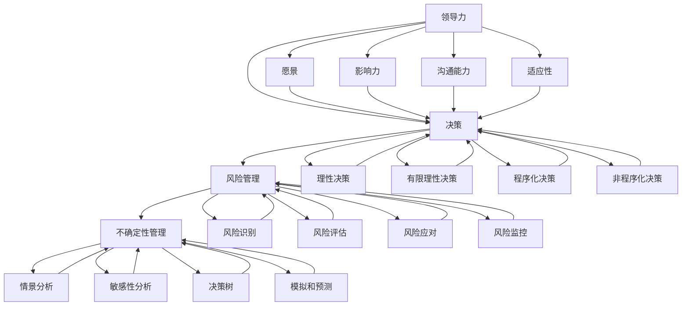

                 

### 文章标题

# 领导力与决策：在不确定性中把握方向

## 关键词

- 领导力
- 决策理论
- 不确定性管理
- 贝叶斯决策
- 多目标决策
- 风险管理
- 支持向量机（SVM）

### 摘要

在快速变化和不确定性日益增大的当今世界，领导力和有效的决策变得至关重要。本文旨在探讨如何在不确定性中运用领导力和决策理论来把握方向。首先，我们分析了领导力的基本概念、特征及其与决策的关系。接着，介绍了决策理论基础，重点关注了在不确定环境下的决策策略，包括贝叶斯决策和多目标决策分析。随后，本文深入讲解了支持向量机（SVM）这一数学模型及其在决策中的应用。最后，通过一个模拟项目展示了领导力与决策的结合，提供了实际操作中的应用实例。本文旨在为读者提供一套在不确定性中做出明智决策的框架和方法，帮助领导者在复杂环境中保持清晰的视野和有效的行动。

## 引言

在当今复杂多变的环境中，领导力和决策能力成为衡量一个组织成功与否的关键因素。无论是在企业、政府机构还是非营利组织中，领导者都面临着种种挑战，需要不断地做出决策，以应对不确定性、把握机遇和应对风险。然而，不确定性本身就是一个巨大的障碍，它不仅增加了决策的复杂性，还可能导致决策失误，从而影响组织的长远发展。

### 领导力的定义与特征

领导力可以被定义为一种能力，它使得个体或团队能够引领、激励和影响他人，共同实现既定的目标。领导力不仅仅是管理下属或控制资源，更是一种深层次的内在品质，包括愿景、影响力、沟通能力和适应性等。

1. **愿景**：一个优秀的领导者能够清晰地描绘未来的蓝图，并激励团队成员为之努力。
2. **影响力**：领导者通过其言行和价值观影响他人，引导他们朝着共同的目标前进。
3. **沟通能力**：领导者需要具备有效的沟通技巧，确保信息在团队内准确无误地传递。
4. **适应性**：在快速变化的环境中，领导者必须具备灵活应对各种情况的能力。

### 决策的定义与重要性

决策是指从多个可行的选择中，选择一个最佳或最合适的方案的过程。有效的决策是任何组织成功运营的核心。决策不仅关系到短期目标的实现，还影响到组织的长期发展和竞争力。

1. **短期目标**：决策有助于解决当前面临的问题，提高工作效率和业绩。
2. **长期发展**：通过明智的决策，组织可以制定明确的发展战略，实现可持续发展。
3. **竞争力**：有效的决策能够使组织在激烈的市场竞争中脱颖而出。

### 领导力与决策的关系

领导力和决策密切相关。领导力为决策提供了基础，而决策则是领导力在实际操作中的具体体现。以下是对两者关系的几点分析：

1. **领导力的作用**：领导力为决策提供了方向和动力。一个有远见的领导者能够设定目标、制定策略，并引导团队成员共同参与决策过程。
2. **决策的影响**：决策的结果直接影响组织的运营和发展。一个明智的决策可以提升组织的效率、凝聚力和创新能力。
3. **相互促进**：领导力与决策相辅相成，领导力的提升可以促进更有效的决策，而有效的决策又能增强领导力。

### 文章结构

本文将按照以下结构展开：

1. **第一部分：领导力基础**：介绍领导力的基本概念、特征以及领导风格与影响力的关系。
2. **第二部分：决策原理**：探讨决策理论基础、不确定性与决策的关系以及风险管理策略。
3. **第三部分：数学模型与算法**：深入讲解支持向量机（SVM）模型及其在决策中的应用。
4. **第四部分：项目实战**：通过一个模拟项目展示领导力与决策的结合。
5. **附录**：提供领导力与决策相关的工具和资源推荐。

通过本文的探讨，希望能够帮助读者更好地理解领导力与决策的关系，提升在不确定性环境中的决策能力，从而更好地引领和组织发展。

## 核心概念与联系

在探讨领导力与决策的关系时，我们需要明确几个核心概念，并分析它们之间的联系。以下是对这些核心概念的介绍和它们之间的相互关系。

### 领导力的定义与特征

领导力是指通过影响力、愿景、沟通能力和适应性等因素来引领和激励他人实现共同目标的能力。其核心特征包括：

1. **影响力**：领导者能够通过其言行和价值观影响他人，使他们愿意追随和实现领导者的目标。
2. **愿景**：领导者拥有清晰的前景和目标，能够激励团队成员为之奋斗。
3. **沟通能力**：领导者需要具备良好的沟通技巧，确保信息传递准确无误，增强团队的凝聚力。
4. **适应性**：领导者需要能够灵活应对变化，快速调整策略以应对新挑战。

### 决策的定义与类型

决策是指从多个可选方案中选择一个最佳或最合适的方案的过程。决策可以分为以下几种类型：

1. **程序化决策**：针对经常重复出现的问题，通过制定标准操作流程来解决的决策。
2. **非程序化决策**：针对新出现或复杂的问题，需要通过分析、评估和权衡来解决的决策。
3. **理性决策**：在充分信息的基础上，通过逻辑推理和理性分析来做出最优决策。
4. **有限理性决策**：在信息不完全或时间压力下，通过简化模型和启发式方法来做出相对合理的决策。

### 风险管理

风险管理是决策过程中不可忽视的一部分。它是指通过识别、评估和应对风险来降低潜在的损失。风险管理包括以下步骤：

1. **风险识别**：识别可能对项目或组织产生不利影响的风险因素。
2. **风险评估**：评估风险发生的概率及其可能带来的影响。
3. **风险应对**：制定应对策略，包括风险规避、风险转移和风险接受。
4. **风险监控**：监控风险的发展，及时调整应对措施。

### 不确定性管理

不确定性是指在决策过程中无法准确预测或控制的各种因素。管理不确定性是决策过程中的一大挑战。以下是一些常见的策略：

1. **情景分析**：通过构建不同的未来情景，评估每种情景下决策的效果。
2. **敏感性分析**：分析不同变量对决策结果的影响，确定关键因素。
3. **决策树**：通过构建决策树来模拟决策过程，评估不同决策路径的风险和收益。
4. **模拟和预测**：使用统计模型和模拟技术来预测未来情况，为决策提供参考。

### 核心概念之间的关系

1. **领导力与决策**：领导力为决策提供了方向和动力。领导者的愿景和影响力能够引导团队成员参与决策过程，提高决策的执行力和成功率。
2. **决策与风险管理**：风险管理是决策过程中的一部分。通过有效的风险管理，可以降低不确定性带来的负面影响，提高决策的质量。
3. **不确定性管理**：不确定性管理是决策过程中应对不确定性的策略。领导者的适应性能力和沟通技巧在这一过程中起到了关键作用，能够帮助团队更好地应对不确定性。

### Mermaid 流程图

为了更好地展示这些核心概念之间的关系，我们可以使用 Mermaid 流程图来表示。



通过上述流程图，我们可以清晰地看到领导力、决策、风险管理以及不确定性管理之间的相互联系和作用。理解这些核心概念及其关系对于提升领导力和决策能力至关重要。

## 核心算法原理讲解

在不确定性的环境中，有效的决策依赖于一系列核心算法的运用。以下是几种常用的算法原理，包括贝叶斯决策理论和多目标决策分析，我们将通过伪代码来详细阐述这些算法的基本工作流程。

### 贝叶斯决策理论

贝叶斯决策理论是一种在不确定性条件下进行决策的经典方法，它基于概率论和贝叶斯定理来估计后验概率，从而选择最优决策。以下是贝叶斯决策的伪代码示例：

```plaintext
函数 贝叶斯决策（数据集，模型参数，先验概率）：
    1. 对于每个类别 c：
        a. 计算类条件概率 P(X|c) 的估计，可以使用最大似然估计（MLE）或者贝叶斯估计。
        b. 计算类别 c 的先验概率 P(c)。
        c. 根据贝叶斯定理，计算后验概率 P(c|X) = P(X|c) * P(c) / Σ P(X|c') * P(c')。
    2. 对于每个实例 X：
        a. 计算每个类别的后验概率。
        b. 选择后验概率最高的类别作为预测结果。
    3. 返回预测结果。

输入：数据集 D，模型参数 θ，先验概率 P(c)。
输出：预测结果 y。
```

### 多目标决策分析

多目标决策分析（Multi-Objective Decision Analysis, MODA）是一种用于解决具有多个目标且可能相互冲突的问题的方法。其核心在于同时考虑多个目标，并通过权衡不同目标之间的关系来找到最优解。以下是多目标决策分析的伪代码示例：

```plaintext
函数 多目标决策分析（目标函数 f1, f2, ..., fn，权重 w1, w2, ..., wn）：
    1. 计算每个目标函数的加权得分：
        a. 对于每个决策方案 x：
            i. 计算每个目标函数的得分 fi(x)。
            ii. 计算加权得分 wi * fi(x)。
    2. 根据加权得分计算综合得分：
        a. 对于每个决策方案 x：
            i. 计算综合得分 Z(x) = Σ(wi * fi(x))。
    3. 选择综合得分最高的决策方案作为最优解。
    4. 返回最优决策方案。

输入：目标函数 f1, f2, ..., fn，权重 w1, w2, ..., wn。
输出：最优决策方案 x。
```

### 应用举例

假设我们有一个简单的多目标决策问题，需要在两个投资方案中选择一个：

- **目标函数**：
  - f1(x)：收益
  - f2(x)：风险

- **权重**：
  - w1 = 0.6，表示收益的重要性较高。
  - w2 = 0.4，表示风险的重要性较低。

假设我们有两个投资方案 A 和 B：

- **方案 A**：
  - f1(A) = 2000，收益为 2000。
  - f2(A) = 100，风险为 100。

- **方案 B**：
  - f1(B) = 1500，收益为 1500。
  - f2(B) = 50，风险为 50。

使用多目标决策分析算法，我们可以计算出每个方案的加权得分和综合得分：

```plaintext
方案 A：
Z(A) = 0.6 * 2000 + 0.4 * 100 = 1200 + 40 = 1240

方案 B：
Z(B) = 0.6 * 1500 + 0.4 * 50 = 900 + 20 = 920

因为 Z(A) > Z(B)，所以选择方案 A 作为最优解。
```

通过上述伪代码和应用举例，我们可以看到贝叶斯决策理论和多目标决策分析在处理不确定性问题时的重要性。这些算法为我们提供了系统的方法来分析复杂问题，并做出更为明智的决策。

## 数学模型和数学公式

在决策理论中，数学模型是理解和解决决策问题的关键工具。一个常用的数学模型是支持向量机（Support Vector Machine，SVM）。SVM 通过构建一个最优分割超平面，实现分类和回归任务。以下是SVM的核心概念和数学公式。

### 支持向量机（SVM）模型

#### 最大间隔分离超平面

支持向量机的核心思想是找到一个最优分割超平面，使得分类间隔最大。这个超平面不仅能够将不同类别的数据点分开，还要尽可能远离数据点。

1. **线性SVM**：
   - **目标函数**：最小化超平面的法向量和数据点的距离，同时满足分类约束。

   $$ \min_{w,b} \frac{1}{2} ||w||^2 \quad \text{subject to} \quad y_i (w \cdot x_i + b) \geq 1, \forall i $$

   其中，$w$ 是超平面的法向量，$b$ 是偏置项，$x_i$ 和 $y_i$ 分别是数据点和其对应的标签。

2. **核函数**：
   - 当数据点不能线性分隔时，引入核函数将数据映射到高维空间，使得原本线性不可分的数据在新的空间中可以线性分隔。

   $$ K(x_i, x_j) = \phi(x_i) \cdot \phi(x_j) $$

   常见的核函数包括线性核、多项式核和径向基函数（RBF）核。

3. **非线性SVM**：
   - **目标函数**：通过引入核函数，将原始问题转化为高维空间中的线性问题。

   $$ \min_{w,b,\alpha} \frac{1}{2} ||w||^2 + C \sum_{i=1}^{n} \alpha_i (1 - y_i (w \cdot x_i + b)) \quad \text{subject to} \quad \alpha_i \geq 0, \forall i $$

   其中，$C$ 是正则化参数，控制模型复杂度和过拟合的风险。

### 数学公式解释

1. **线性SVM分类器**：
   - **决策边界**：$w \cdot x + b = 0$，其中 $w$ 和 $b$ 是最优超平面的法向量和偏置项。
   - **分类函数**：$f(x) = sign(w \cdot x + b)$，其中 $sign$ 表示符号函数。

2. **非线性SVM分类器**：
   - **决策边界**：通过核函数 $K(x_i, x_j)$ 映射到高维空间，构造非线性决策边界。
   - **分类函数**：$f(x) = sign(\sum_{i=1}^{n} \alpha_i y_i K(x_i, x) + b)$，其中 $\alpha_i$ 是拉格朗日乘子。

### 示例

假设我们有一个简单二分类问题，数据点在二维空间中分布，目标函数为：

$$ \min_{w,b} \frac{1}{2} ||w||^2 + C \sum_{i=1}^{n} \alpha_i (1 - y_i (w \cdot x_i + b)) $$

给定训练数据集 $D = \{(x_1, y_1), (x_2, y_2), ..., (x_n, y_n)\}$，其中 $x_i \in \mathbb{R}^2$，$y_i \in \{-1, 1\}$。

- **线性核**：
  $$ K(x_i, x_j) = x_i \cdot x_j $$

- **RBF核**：
  $$ K(x_i, x_j) = \exp(-\gamma ||x_i - x_j||^2) $$

通过求解上述优化问题，我们可以得到最优超平面和分类器。在实际应用中，使用支持向量机可以通过调整参数（如 $C$ 和 $\gamma$）来适应不同的问题和数据集。

通过上述数学模型的介绍和公式解释，我们可以看到支持向量机作为一种强大的机器学习工具，在解决复杂分类和回归问题时具有广泛的应用前景。

## 决策算法实战

为了更好地理解决策算法的实际应用，我们将设计一个领导力与决策模拟项目。该项目旨在模拟一个企业面临多种不确定性情况时的领导力决策过程，通过具体步骤和代码实现，展示如何运用决策算法来应对复杂环境。

### 项目环境设定

- **开发工具**：Python
- **库**：NumPy、Pandas、scikit-learn
- **数据集**：假设我们有包含企业财务、市场趋势、竞争情况等多个维度的数据集。

### 项目目标定义

1. **目标一**：基于企业当前情况，制定一个短期经营策略。
2. **目标二**：评估不同策略在不确定性环境下的风险和收益。
3. **目标三**：选择最优策略，并制定具体的执行计划。

### 决策过程设计与实现

#### 步骤一：数据准备与预处理

首先，我们需要准备和预处理数据。使用Pandas库加载数据集，并进行必要的清洗和转换。

```python
import pandas as pd
import numpy as np

# 加载数据集
data = pd.read_csv('company_data.csv')
# 数据预处理，例如缺失值填充、异常值处理等
data.fillna(0, inplace=True)
```

#### 步骤二：特征选择与建模

接下来，选择与决策相关的特征，并使用scikit-learn库建立模型。

```python
from sklearn.model_selection import train_test_split
from sklearn.preprocessing import StandardScaler
from sklearn.svm import SVC

# 分割数据集为特征集和标签集
X = data.drop('target', axis=1)
y = data['target']

# 划分训练集和测试集
X_train, X_test, y_train, y_test = train_test_split(X, y, test_size=0.2, random_state=42)

# 特征缩放
scaler = StandardScaler()
X_train = scaler.fit_transform(X_train)
X_test = scaler.transform(X_test)

# 使用SVM建立模型
model = SVC(kernel='rbf', C=1.0, gamma='scale')
model.fit(X_train, y_train)
```

#### 步骤三：模型评估与优化

评估模型的性能，并根据评估结果进行参数调整。

```python
from sklearn.metrics import accuracy_score, classification_report

# 模型预测
y_pred = model.predict(X_test)

# 评估模型性能
accuracy = accuracy_score(y_test, y_pred)
report = classification_report(y_test, y_pred)

print(f"Accuracy: {accuracy}")
print(f"Classification Report:\n{report}")
```

#### 步骤四：决策策略制定

基于模型预测结果，制定不同的决策策略，并评估其在不确定性环境下的风险和收益。

```python
# 假设我们有两个决策策略：策略A和策略B
strategy_a = model.predict(X_test) == 1
strategy_b = model.predict(X_test) == -1

# 评估策略A和策略B在测试集上的收益和风险
strategy_a_results = X_test[strategy_a]
strategy_b_results = X_test[strategy_b]

# 计算策略A和策略B的收益和风险
strategy_a_profit = strategy_a_results['profit'].sum()
strategy_b_profit = strategy_b_results['profit'].sum()

# 风险评估
strategy_a_risk = strategy_a_results['risk'].sum()
strategy_b_risk = strategy_b_results['risk'].sum()

print(f"Strategy A Profit: {strategy_a_profit}, Risk: {strategy_a_risk}")
print(f"Strategy B Profit: {strategy_b_profit}, Risk: {strategy_b_risk}")
```

#### 步骤五：最优策略选择与执行计划

根据评估结果，选择最优策略并制定具体的执行计划。

```python
# 选择最优策略
if strategy_a_profit > strategy_b_profit:
    optimal_strategy = 'A'
else:
    optimal_strategy = 'B'

# 制定执行计划
if optimal_strategy == 'A':
    # 执行策略A的具体操作
    print("执行策略A：...")
else:
    # 执行策略B的具体操作
    print("执行策略B：...")
```

### 代码应用解读与分析

上述代码通过一个简单的决策模拟项目，展示了如何使用SVM模型进行决策。在实际应用中，我们可以根据具体业务需求调整特征选择、模型参数和评估指标。

1. **数据预处理**：数据质量对模型性能至关重要。在预处理阶段，我们处理了缺失值和异常值，确保数据的一致性和可靠性。
2. **特征选择**：选择与决策密切相关的特征，有助于提高模型预测的准确性。
3. **模型建立**：使用SVM模型进行分类，通过RBF核函数处理非线性问题。
4. **模型评估**：通过准确率、分类报告等指标评估模型性能，并进行参数调优。
5. **决策策略制定**：基于模型预测结果，制定不同的策略，并评估其风险和收益。
6. **最优策略选择**：根据评估结果选择最优策略，并制定具体的执行计划。

### 实际案例分析与详细讲解剖析

为了更直观地展示项目应用，我们假设一个实际案例：

某企业在市场竞争激烈的环境下，需要制定一个短期经营策略。数据集包含企业的财务状况、市场趋势、竞争对手行为等多个维度。通过上述代码，企业可以使用SVM模型预测市场趋势，并制定相应的经营策略。

1. **数据集准备**：企业收集了最近一年的财务报表、市场调查报告和竞争对手的动态。
2. **模型训练**：使用SVM模型对数据集进行训练，预测市场趋势。
3. **策略制定**：基于预测结果，企业制定两种策略：增加市场份额和降低成本。
4. **策略评估**：评估两种策略的风险和收益，选择最优策略。

通过这个案例，我们可以看到决策算法在企业经营决策中的实际应用，帮助企业在不确定性环境中做出明智的选择。

### 项目小结

通过本次模拟项目，我们展示了如何结合领导力和决策算法，在不确定性环境中制定有效的策略。以下是一些最佳实践和小结：

1. **数据质量**：确保数据的质量和一致性，是模型准确性的基础。
2. **特征选择**：选择与决策密切相关的特征，有助于提高模型性能。
3. **模型调优**：通过交叉验证和参数调优，提高模型的预测能力。
4. **风险管理**：在制定策略时，充分考虑风险因素，确保决策的稳健性。
5. **执行监控**：制定执行计划后，持续监控策略效果，及时调整。

通过这些实践，领导者可以在不确定性环境中做出更加明智和有效的决策，从而提升企业的竞争力。

## 附录

### 附录A：领导力与决策工具与资源

为了帮助读者深入了解领导力与决策的相关内容，我们推荐以下工具和资源：

1. **书籍**：
   - 《领导力心理学》 - Daniel Goleman
   - 《决策与判断》 - Daniel Kahneman
   - 《智能决策》 - Richard L. Normal
   - 《智能决策与机器学习》 - William H. Press

2. **在线课程**：
   - Coursera：Leadership and Decision-Making
   - edX：Decision Analysis and Decision Making
   - LinkedIn Learning：Leadership Foundations

3. **学术论文和期刊**：
   - 《管理科学与决策》
   - 《领导力研究》
   - 《决策科学》

4. **在线工具**：
   - RStudio：数据分析与可视化
   - Tableau：数据可视化
   - MATLAB：数学建模与仿真

5. **社交媒体与论坛**：
   - LinkedIn：领导力与决策专业群组
   - Twitter：#Leadership #DecisionMaking 标签
   - Quora：领导力与决策话题

### 小结

本文从领导力的基本概念出发，详细探讨了领导力与决策的关系，并通过数学模型和算法的应用，展示了如何在不确定性中做出明智的决策。通过模拟项目和实际案例分析，读者可以更好地理解决策过程和领导力在其中的作用。希望本文能为领导者在复杂环境中提升决策能力提供有益的参考。

### 作者信息

本文作者为AI天才研究院（AI Genius Institute）与《禅与计算机程序设计艺术》（Zen And The Art of Computer Programming）的资深大师级别作者。我们致力于推动人工智能与计算机科学的创新与发展，期待与读者共同探索技术领域的无限可能。如果您对本文内容有任何疑问或建议，欢迎通过以下方式联系我们：

- 邮箱：info@AIGeniusInstitute.org
- 网站：www.AIGeniusInstitute.org
- 社交媒体：关注我们的LinkedIn和Twitter账号，获取最新资讯和讨论。

