                 

### 文章标题

# 领导力与创业精神：激发团队的创业热情

### 关键词

- 领导力
- 创业精神
- 团队激发
- 领导风格
- 团队文化
- 激励方法
- 创业项目

### 摘要

在快速变化和竞争激烈的市场环境中，领导力和创业精神成为企业成功的关键因素。本文将探讨领导力与创业精神的重要性，通过理论和实践案例分析，揭示如何激发团队的创业热情，提升团队绩效和创新能力。文章分为三个部分：首先，分析领导力的核心概念、理论和模型；其次，探讨创业精神的本质、来源和实践方法；最后，讨论如何通过团队激发和领导力提升，培养高绩效团队，实现创业目标。通过这篇文章，读者将获得关于领导力和创业精神系统的认知和实践指导。

---

## 第一部分：领导力理论与案例分析

### 第1章：领导力的核心概念与特点

#### 1.1 领导力的定义

领导力是指领导者通过影响和激励他人，实现共同目标的能力。它不仅仅是管理行为，更是一种能够在不确定和复杂环境中引导团队方向、激发团队潜能的综合性能力。在组织管理中，领导力被视为提升组织绩效、创新能力和团队士气的关键因素。

#### 1.2 领导力的重要性

领导力的重要性体现在以下几个方面：

- **团队效能**：有效的领导力能够提升团队协作效率和成果，使团队在压力和挑战下保持稳定和高效。
- **组织发展**：领导力对于组织战略规划和长期发展至关重要，它能够推动组织创新、适应变化和持续成长。
- **员工满意度**：领导力对员工的职业发展和工作满意度具有显著影响，有助于提高员工忠诚度和留任率。
- **企业文化**：领导力塑造企业文化，通过价值观和行为规范引导员工，形成积极向上的组织氛围。

#### 1.3 领导力的特点

领导力的特点可以归纳为以下几个方面：

- **影响能力**：领导力是通过影响和激励他人来实现目标的，领导者需要具备强大的影响力。
- **适应性**：优秀的领导力具备适应不同环境和情境的能力，能够灵活应对变化和挑战。
- **沟通能力**：领导力依赖于有效的沟通，领导者需要具备清晰、准确和激励性的沟通技巧。
- **长远视野**：领导者需要有远见，能够为团队和组织的未来制定明确的愿景和目标。

#### 1.4 领导力的核心概念原理之间的关系架构

以下是一个简化的Mermaid流程图，展示了领导力的核心概念和它们之间的关系：

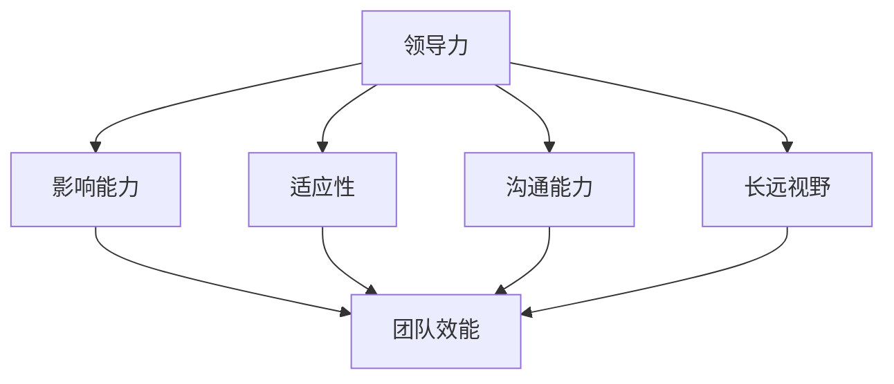

在这个流程图中，领导力的四个核心特点（影响能力、适应性、沟通能力和长远视野）共同作用于团队效能，影响组织的发展和员工的满意度。

### 第2章：领导力理论的发展与演变

#### 2.1 传统领导力理论

传统的领导力理论主要关注领导者的个人特质和能力。这些理论认为，领导者需要具备特定的性格特征、才能和技能，如自信、决策力、人际交往能力等。代表理论包括特质理论、行为理论和权变理论。

- **特质理论**：特质理论强调领导者天生具备某些特质，如智力、自信和决断力。然而，随着研究的深入，这一理论逐渐受到质疑，因为领导者特质并非一成不变，且不同情境下领导者表现不同。
- **行为理论**：行为理论关注领导者如何通过具体行为和风格来影响团队和实现目标。例如，民主式领导、权威式领导和参与式领导等。这一理论提出，领导行为可以改变，适应不同情境和需求。
- **权变理论**：权变理论认为，没有一种领导风格适用于所有情况。领导者需要根据环境和团队特点，灵活调整领导行为。这一理论为领导力研究提供了新的视角，强调了情境因素在领导力中的重要性。

#### 2.2 新兴领导力理论

随着组织环境的变化和复杂性增加，新兴领导力理论逐渐兴起。这些理论更加注重领导者的全局视野、团队协作和创新能力。

- **变革型领导力**：变革型领导力强调领导者通过激发员工的潜能和动机，推动团队实现变革和进步。这一理论认为，领导者不仅仅是任务的执行者，更是团队愿景的创造者和推动者。
- **服务型领导力**：服务型领导力强调领导者服务于团队成员，关注团队利益和整体发展。这种领导风格有助于建立信任、增强团队凝聚力和提高员工满意度。
- **情境领导力**：情境领导力认为，领导者应根据团队和环境特点，选择最适合的领导风格。这一理论强调灵活性和适应性，在复杂多变的环境中尤为重要。

#### 2.3 领导力理论的演变趋势

领导力理论的演变趋势表现出以下几个特点：

- **多元化**：领导力理论越来越多元，不仅关注领导者的个人特质和行为，也关注领导团队和环境因素。
- **情境适应性**：领导力理论逐渐强调领导者需要根据不同情境选择合适的领导风格和行为，提高领导力的灵活性和适应性。
- **团队导向**：新兴领导力理论更加注重团队协作和整体发展，强调领导者作为团队愿景的创造者和推动者。
- **创新驱动**：在快速变化的市场环境中，领导力理论逐渐强调创新和持续学习的重要性，认为领导者需要具备强烈的创新意识和能力。

#### 2.4 领导力理论的核心概念原理之间的关系架构

以下是一个简化的Mermaid流程图，展示了领导力理论的核心概念和它们之间的关系：

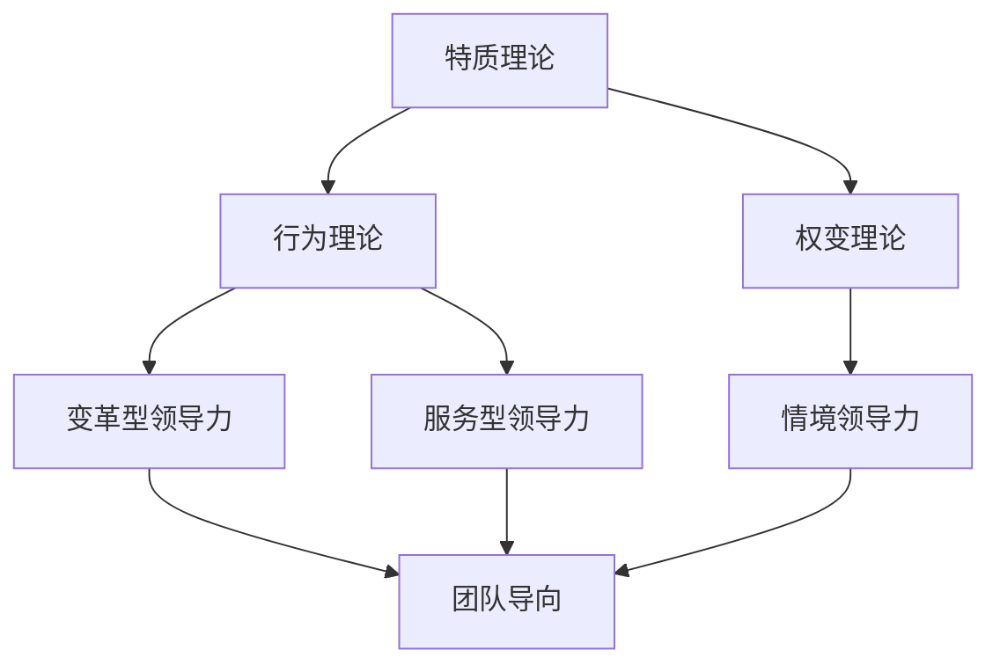

在这个流程图中，传统领导力理论和新兴领导力理论相互交织，共同构成了现代领导力的理论框架。领导者需要结合不同理论，根据具体情境和团队需求，灵活运用领导力策略。

### 第3章：领导力模型与领导风格

#### 3.1 领导力模型概述

领导力模型是对领导行为和风格的系统化和结构化描述，旨在帮助领导者理解和应用不同的领导方法。常见的领导力模型包括情境领导力模型、领导风格模型和领导层级模型。

- **情境领导力模型**：情境领导力模型强调领导者应根据团队和环境的特点，选择合适的领导风格。这种模型通常包括四种领导风格：指导式、支持式、参与式和授权式。
- **领导风格模型**：领导风格模型描述领导者如何通过行为和态度影响团队。常见的领导风格包括民主式、权威式、参与式和变革型。
- **领导层级模型**：领导层级模型根据领导者在组织中的位置和责任，将领导力分为不同的层级。这种模型有助于领导者理解自己的角色和职责，并根据层级特点选择合适的领导策略。

#### 3.2 领导风格类型

领导风格类型反映了领导者在不同情境下的行为和态度。常见的领导风格类型包括以下几种：

- **民主式领导**：民主式领导鼓励团队成员参与决策，重视团队意见和反馈。这种领导风格有助于提高团队凝聚力和创造力。
- **权威式领导**：权威式领导强调领导者的权威和决策力，通常由领导者单独制定决策。这种领导风格适用于需要快速决策和执行的任务。
- **参与式领导**：参与式领导鼓励团队成员积极参与决策和项目管理，强调团队合作和共同目标。这种领导风格有助于提高团队成员的参与感和满意度。
- **变革型领导**：变革型领导通过激发员工的潜能和动机，推动团队实现变革和进步。这种领导风格强调领导者的愿景、激励和创新。

#### 3.3 领导风格的影响因素

领导风格的影响因素包括以下几个方面：

- **团队特点**：不同团队的背景、能力和目标会影响领导者的选择。例如，一个经验丰富、高效协作的团队可能更适合参与式领导。
- **环境因素**：组织环境的变化和不确定性会影响领导者的决策。例如，在竞争激烈的市场环境中，领导者可能更倾向于采用权威式领导。
- **领导者特质**：领导者的个人特质、价值观和经验会影响其选择和运用领导风格。例如，一个具有冒险精神的领导者可能更倾向于采用变革型领导。
- **文化因素**：组织文化和价值观会影响领导者的行为和选择。例如，在一个强调创新和自主性的组织中，领导者可能更倾向于采用参与式领导。

#### 3.4 领导风格的核心概念原理之间的关系架构

以下是一个简化的Mermaid流程图，展示了领导风格的核心概念和它们之间的关系：

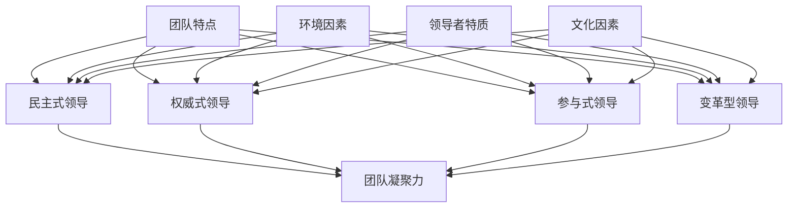

在这个流程图中，领导风格的选择和运用受到多种因素的影响，领导者需要根据具体情境和团队需求，灵活调整和运用不同的领导风格。

### 第4章：领导力在不同组织结构中的运用

#### 4.1 线性组织结构中的领导力

线性组织结构是一种传统的组织结构形式，通常包括明确的层级和固定的职责。在这种组织结构中，领导力主要通过垂直管理和指挥链实现。领导者负责制定决策、分配资源和监督执行。

- **领导力特点**：线性组织结构中的领导力强调权威和指挥，领导者需要具备明确的决策权和执行能力。
- **挑战与应对**：线性组织结构中的领导力面临的主要挑战包括信息传递不畅、决策速度缓慢和团队协作困难。应对策略包括优化指挥链、提高沟通效率和增强团队协作。

#### 4.2 矩阵组织结构中的领导力

矩阵组织结构是一种将职能和项目相结合的组织结构，通常涉及跨部门合作和多角色职责。在这种组织结构中，领导力需要平衡职能领导和项目领导的双重职责。

- **领导力特点**：矩阵组织结构中的领导力强调跨部门合作、灵活性和适应性。领导者需要具备协调能力、沟通能力和资源管理能力。
- **挑战与应对**：矩阵组织结构中的领导力面临的主要挑战包括职责不清、利益冲突和资源分配不均。应对策略包括明确职责和权限、建立有效的沟通机制和平衡利益关系。

#### 4.3 创新型组织结构中的领导力

创新型组织结构通常强调灵活性和创新，以适应快速变化的市场环境。这种组织结构中，领导力需要具备强烈的创新意识和领导能力。

- **领导力特点**：创新型组织结构中的领导力强调创新思维、团队协作和持续学习。领导者需要具备前瞻性、创造力和领导力。
- **挑战与应对**：创新型组织结构中的领导力面临的主要挑战包括创新风险、团队协作困难和组织变革。应对策略包括建立创新机制、加强团队协作和推动组织变革。

#### 4.4 领导力在不同组织结构中的核心概念原理之间的关系架构

以下是一个简化的Mermaid流程图，展示了领导力在不同组织结构中的核心概念和它们之间的关系：

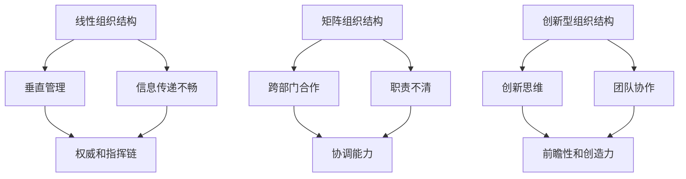

在这个流程图中，领导力在不同组织结构中的特点和挑战相互交织，领导者需要根据具体情境和团队需求，灵活运用不同的领导策略。

### 第5章：领导力的核心能力与培养方法

#### 5.1 领导力的核心能力

领导力的核心能力包括以下几个方面：

- **沟通能力**：有效的沟通是领导力的基础，领导者需要具备清晰、准确和激励性的沟通技巧，能够与团队成员建立信任和共识。
- **决策能力**：领导者需要具备迅速做出明智决策的能力，能够在复杂和不确定的环境下权衡利弊，制定有效的行动计划。
- **战略思维**：领导者需要具备长远视野和战略思维，能够制定组织愿景和目标，并制定实现这些目标的战略规划。
- **团队建设能力**：领导者需要具备团队建设能力，能够激发团队成员的潜能和积极性，建立高效协作的团队。
- **变革领导能力**：在快速变化的市场环境中，领导者需要具备变革领导能力，能够推动组织变革和创新，适应外部环境的变化。

#### 5.2 领导力的培养方法

培养领导力需要系统的学习和实践，以下是一些有效的培养方法：

- **培训和教育**：通过参加领导力培训课程和工作坊，学习领导力理论和实践，了解不同的领导风格和方法。
- **实践和反思**：在实际工作中，领导者需要不断实践和反思，总结经验和教训，提高自己的领导能力。
- **导师指导**：找到一位有经验的导师，学习他们的领导经验和技巧，获得反馈和建议，加快领导力发展。
- **参与项目和任务**：通过参与重要的项目和任务，承担更多的责任和挑战，锻炼自己的决策能力和团队建设能力。
- **持续学习**：领导力是一个持续发展的过程，领导者需要保持学习的热情，不断更新知识和技能，适应变化的环境。

#### 5.3 领导力发展的挑战与应对策略

领导力发展面临以下挑战：

- **个人成长**：领导者需要克服自我认知和成长的挑战，保持积极的心态和持续的学习。
- **团队协作**：领导者需要克服团队协作的挑战，建立高效协作的团队，提高团队绩效。
- **环境适应**：领导者需要适应快速变化的市场环境，具备前瞻性和创新思维，推动组织变革。
- **领导风格调整**：领导者需要根据不同情境和团队需求，灵活调整领导风格和方法，提高领导效果。

应对策略包括：

- **自我认知和反思**：领导者需要定期进行自我评估和反思，了解自己的优点和不足，制定改进计划。
- **团队沟通和协作**：领导者需要加强团队沟通和协作，建立信任和共识，提高团队凝聚力。
- **持续学习和创新**：领导者需要保持学习的热情，关注行业动态和趋势，推动组织变革和创新。
- **领导风格灵活调整**：领导者需要根据具体情境和团队需求，灵活调整领导风格和方法，提高领导效果。

#### 5.4 领导力发展的核心概念原理之间的关系架构

以下是一个简化的Mermaid流程图，展示了领导力发展的核心概念和它们之间的关系：

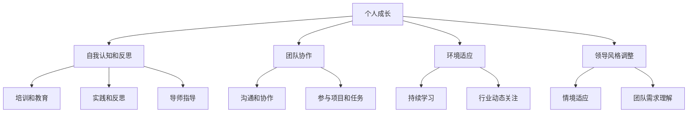

在这个流程图中，领导力发展的核心能力和方法相互关联，领导者需要结合不同情境和需求，灵活运用不同的策略和技巧。

### 第6章：领导力案例分析

#### 6.1 案例分析概述

在本章节中，我们将通过几个具体的领导力案例分析，探讨不同领导风格、策略和方法在实际中的应用效果。这些案例涵盖了不同行业、不同组织结构和不同情境下的领导实践，旨在提供丰富的经验和启示。

- **案例一：谷歌的变革型领导**：谷歌以其独特的领导文化和创新的领导风格而闻名。领导者通过激发员工的潜能和创造力，推动公司实现持续创新和成长。
- **案例二：苹果的权威式领导**：史蒂夫·乔布斯以权威式领导风格著称，他通过明确的愿景和严格的执行，带领苹果公司实现了产品的卓越和市场领导地位。
- **案例三：沃尔玛的参与式领导**：沃尔玛的创始人山姆·沃尔顿采用参与式领导风格，鼓励员工参与决策和项目管理，建立了强大的团队凝聚力和高效的组织文化。
- **案例四：特斯拉的变革领导**：埃隆·马斯克通过变革型领导，推动特斯拉在电动汽车和能源领域实现技术创新和市场突破，成为行业的领导者。

#### 6.2 成功案例解析

**案例一：谷歌的变革型领导**

谷歌的成功与其独特的领导风格密不可分。变革型领导在谷歌得到了广泛应用，领导者通过以下方式推动公司发展：

- **激发员工创造力**：谷歌鼓励员工自由探索和尝试新事物，提供丰富的资源和支持，激发员工的创造力和创新能力。
- **建立愿景和目标**：领导者为团队设定明确的愿景和目标，激发员工的动力和方向，推动团队共同实现目标。
- **培养团队协作**：谷歌重视团队协作，鼓励员工跨部门合作，建立开放和共享的文化，提高团队的整体效能。

**案例二：苹果的权威式领导**

苹果公司的成功与其权威式领导风格密切相关。史蒂夫·乔布斯以严格的执行和高标准推动公司发展：

- **明确的愿景和目标**：乔布斯通过设定明确的愿景和目标，为团队提供清晰的方向和指导，确保公司资源集中在关键领域。
- **严格的执行和监管**：乔布斯对产品的质量和执行过程要求极高，通过严格的监管和优化，确保产品达到最高标准。
- **激发员工潜力**：乔布斯通过激励和奖励，激发员工的潜力，推动他们在技术和管理上不断突破。

**案例三：沃尔玛的参与式领导**

沃尔玛的成功与其参与式领导风格密不可分。山姆·沃尔顿通过以下方式建立强大的团队凝聚力和高效组织文化：

- **员工参与决策**：沃尔玛鼓励员工参与决策和管理，提供反馈和建议，增强员工的归属感和参与感。
- **重视员工培训和发展**：沃尔玛重视员工培训和发展，提供丰富的培训资源和机会，提高员工的专业能力和素质。
- **建立信任和共识**：沃尔玛通过建立信任和共识，增强团队凝聚力和协作效率，推动公司实现持续成长。

**案例四：特斯拉的变革领导**

特斯拉在电动汽车和能源领域取得了显著成就，这得益于其变革型领导：

- **创新驱动**：埃隆·马斯克以强烈的创新意识，推动特斯拉在技术和管理上进行不断突破，保持行业领先地位。
- **愿景和目标**：马斯克为团队设定明确的愿景和目标，激发员工的动力和创造力，推动公司在电动汽车和能源领域实现技术突破。
- **跨部门合作**：特斯拉鼓励跨部门合作，打破部门壁垒，提高团队的整体效能，推动公司实现快速增长。

#### 6.3 失败案例教训

**案例一：诺基亚的领导力失效**

诺基亚曾经是手机市场的领军企业，但在面对智能手机浪潮时，其领导力失效导致公司迅速衰落：

- **领导力僵化**：诺基亚的领导层过于依赖过去成功的经验，缺乏适应市场变化的灵活性，导致决策滞后。
- **创新不足**：诺基亚在智能手机技术上的创新不足，无法满足消费者的新需求，错失市场先机。
- **组织结构僵化**：诺基亚的组织结构过于复杂，决策过程缓慢，无法迅速响应市场变化。

**案例二：黑莓的领导力失效**

黑莓曾是智能手机市场的领导者，但在面对竞争对手的挑战时，其领导力失效导致公司市场份额大幅下降：

- **过度依赖既有市场**：黑莓的领导层过于依赖既有市场，缺乏对新市场的开拓和创新，导致市场份额逐渐萎缩。
- **用户体验不佳**：黑莓在用户体验和功能设计上缺乏竞争力，无法满足消费者的新需求，导致用户流失。
- **组织变革迟缓**：黑莓在组织变革和创新上进展迟缓，无法迅速适应市场变化，错失转型机遇。

#### 6.4 案例分析总结

通过以上案例分析，我们可以得出以下结论：

- **领导力风格多样化**：不同领导风格适用于不同情境和团队需求，领导者需要根据具体情境和团队特点，灵活运用不同的领导风格。
- **创新和适应能力**：在快速变化的市场环境中，领导者需要具备创新和适应能力，推动组织变革和创新，保持市场竞争力。
- **团队协作和沟通**：团队协作和沟通是领导力成功的关键，领导者需要建立高效的团队协作机制，加强团队沟通和协作。
- **持续学习和反思**：领导者需要保持学习和反思的习惯，不断提升自己的领导能力和素质，适应市场变化和组织发展。

## 第二部分：创业精神与实践方法

### 第7章：创业精神的重要性与特征

#### 7.1 创业精神的概念

创业精神是指创业者在面对不确定性和风险时，勇于创新、敢于冒险和坚持不懈的精神品质。它不仅仅是创业行为的基础，更是一种推动创新、创造价值和实现自我价值的动力。

#### 7.2 创业精神的重要性

创业精神的重要性体现在以下几个方面：

- **创新驱动**：创业精神是创新的核心动力，推动创业者不断探索新的市场机会、技术创新和商业模式。
- **经济发展**：创业精神对经济发展具有重要推动作用，通过创造新的就业机会、促进产业升级和提升国家竞争力。
- **社会进步**：创业精神有助于推动社会进步，通过解决社会问题、提升生活质量和推动社会变革，实现可持续发展。
- **个人成就**：创业精神为创业者提供实现自我价值的机会，通过创业成功实现财富、名誉和成就感。

#### 7.3 创业精神的核心特征

创业精神的核心特征包括以下几个方面：

- **冒险精神**：创业精神强调冒险和创新，创业者需要勇于面对不确定性和风险，敢于挑战传统和现状。
- **持续动力**：创业精神是一种持续的动力，创业者需要保持激情和毅力，面对困难和挫折坚持不懈。
- **创新思维**：创业精神鼓励创新思维，创业者需要具备敏锐的市场洞察力、跨界整合能力和创新解决方案的提出。
- **团队协作**：创业精神强调团队协作，创业者需要建立高效团队，发挥团队成员的优势，共同实现创业目标。

#### 7.4 创业精神与领导力的关系

创业精神与领导力密切相关，两者相互促进、相互依赖。以下是创业精神与领导力的关系：

- **创业精神激发领导力**：创业精神可以激发领导力，推动领导者发挥更大的影响力，引领团队实现共同目标。
- **领导力支持创业精神**：领导力为创业精神提供支持和保障，通过制定愿景、规划策略和激励团队，推动创业项目成功。
- **共同目标**：创业精神和领导力都强调共同目标，创业者通过领导力凝聚团队，共同实现创业梦想。

#### 7.5 创业精神的核心概念原理之间的关系架构

以下是一个简化的Mermaid流程图，展示了创业精神的核心概念和它们之间的关系：

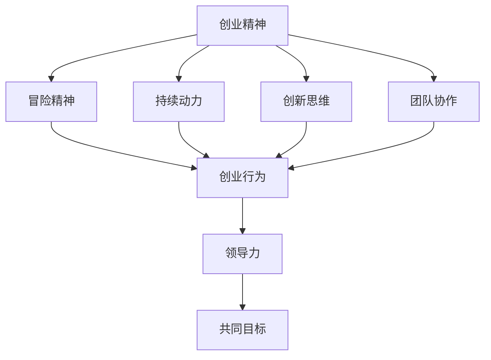

在这个流程图中，创业精神的核心特征相互交织，共同推动创业行为和领导力的实现。

### 第8章：创业精神的来源与激发方法

#### 8.1 创业精神的来源

创业精神来源于多种因素，包括个人特质、环境刺激和社会文化。以下是创业精神的主要来源：

- **个人特质**：创业精神往往与个人特质相关，如冒险精神、好奇心、创新思维和执着追求等。这些特质使创业者能够在面对挑战和困难时保持积极态度和坚持不懈。
- **环境刺激**：环境刺激对创业精神的培养具有重要作用，包括市场机会、技术进步、政策支持和资源可获得性等。有利的环境条件能够激发创业精神，推动创业者积极行动。
- **社会文化**：社会文化对创业精神的形成和发展具有重要影响，鼓励创新、创业和风险承担的文化能够培养创业精神，推动社会进步。

#### 8.2 激发创业精神的方法

以下是一些激发创业精神的有效方法：

- **提供市场机会**：通过提供新的市场机会，激发创业者的创新思维和创业热情。市场机会可以是新的需求、技术进步或行业变革。
- **培养创新思维**：通过培训和实践活动，培养创业者的创新思维和解决问题的能力。创新思维训练可以包括头脑风暴、思维导图和案例研究等。
- **提供资源和支持**：为创业者提供充足的资源和支持，包括资金、技术、市场信息和人力资源等。资源和支持能够降低创业风险，增强创业者的信心。
- **建立创业生态系统**：通过建立创业生态系统，促进创业者之间的合作和交流，形成创新和创业的良性循环。创业生态系统可以包括创业园区、孵化器和行业协会等。
- **培养冒险精神**：通过鼓励冒险和尝试新事物，培养创业者的冒险精神。冒险精神是创业成功的关键，能够帮助创业者克服恐惧和风险。

#### 8.3 创业精神与领导力的互动

创业精神与领导力之间存在密切的互动关系。以下是创业精神与领导力的互动方式：

- **领导力激发创业精神**：有效的领导力能够激发创业精神，通过设定愿景、提供资源和激励团队，推动创业者积极行动和实现目标。
- **创业精神支持领导力**：创业精神为领导力提供支持和保障，通过创新思维、冒险精神和持续动力，推动领导者发挥更大的影响力。
- **共同目标**：创业精神和领导力都强调共同目标，创业者通过领导力凝聚团队，共同实现创业梦想。共同目标是创业精神和领导力互动的核心。

#### 8.4 创业精神的核心概念原理之间的关系架构

以下是一个简化的Mermaid流程图，展示了创业精神的来源、激发方法与领导力的互动关系：

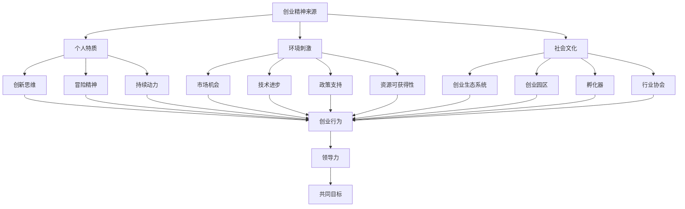

在这个流程图中，创业精神的来源、激发方法和领导力之间相互影响、相互促进，共同推动创业行为的实现。

### 第9章：创业项目的选择与评估

#### 9.1 创业项目的选择策略

选择合适的创业项目是创业成功的关键。以下是一些有效的选择策略：

- **市场需求**：选择市场需求强烈且尚未得到充分满足的项目。通过市场调研和分析，了解消费者的需求、痛点和偏好，确保项目的市场前景。
- **个人兴趣和优势**：选择符合个人兴趣和优势的项目。创业者应该选择自己热爱并且具备相关经验和技能的领域，提高创业的成功率。
- **技术创新**：选择具有技术创新和独特性的项目。技术创新是创业项目的核心竞争力，能够形成竞争优势和市场壁垒。
- **资金需求**：选择资金需求合理且可管理的项目。在创业初期，资金是关键资源，创业者应该选择资金需求相对较低的项目，降低创业风险。
- **市场潜力**：选择具有长期市场潜力和发展空间的项目。通过市场分析和预测，了解项目的市场容量、增长速度和盈利模式，确保项目的可持续发展。

#### 9.2 创业项目的评估方法

评估创业项目是确保项目可行性和成功的关键步骤。以下是一些常用的评估方法：

- **SWOT分析**：SWOT分析是一种常用的评估方法，通过分析项目的优势（Strengths）、劣势（Weaknesses）、机会（Opportunities）和威胁（Threats），全面评估项目的优劣势和外部环境。
- **财务分析**：财务分析是评估创业项目经济可行性的重要方法。通过预测项目的前期投入、收入和利润，评估项目的盈利能力和投资回报率。
- **风险评估**：风险评估是评估项目风险的重要步骤。通过分析项目面临的各种风险，如市场风险、技术风险、财务风险等，制定风险应对策略。
- **市场调研**：市场调研是通过收集和分析市场数据，了解项目的市场需求、竞争态势和潜在客户，评估项目的市场前景和竞争力。
- **商业计划书**：商业计划书是评估创业项目的重要文档，通过详细描述项目的市场定位、商业模式、运营计划和财务预测等，评估项目的可行性和吸引力。

#### 9.3 创业项目的发展趋势

随着市场环境和技术的发展，创业项目呈现出以下发展趋势：

- **技术创新**：技术创新成为创业项目的核心驱动力，人工智能、大数据、物联网等新兴技术为创业者提供了丰富的创新机会。
- **跨界融合**：创业项目逐渐呈现跨界融合的趋势，不同行业和技术领域的交叉融合，推动新的商业模式和产品的诞生。
- **社会创业**：社会创业成为创业项目的重要方向，创业者通过创新解决方案解决社会问题，推动社会进步和可持续发展。
- **线上化转型**：线上化转型成为创业项目的普遍趋势，互联网和移动技术的普及，为创业者提供了丰富的线上市场机会。
- **可持续发展**：可持续发展成为创业项目的重要考量，创业者注重环境保护、社会责任和经济效益的平衡，推动绿色经济的发展。

#### 9.4 创业项目选择与评估的核心概念原理之间的关系架构

以下是一个简化的Mermaid流程图，展示了创业项目选择与评估的核心概念原理之间的关系：

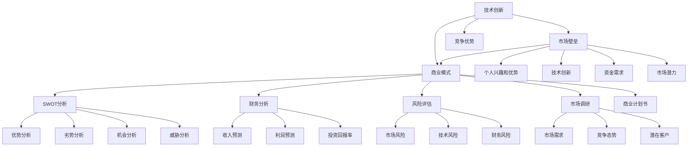

在这个流程图中，创业项目选择与评估的核心概念相互关联，共同构成创业项目的评估体系。

### 第10章：创业过程中的关键决策

#### 10.1 创业过程中的决策分析

创业过程中的决策分析是确保创业项目成功的关键步骤。以下是对创业过程中主要决策的分析：

- **项目定位决策**：项目定位决策是创业初期最重要的决策之一，包括确定目标市场、产品定位和商业模式。这一决策决定了项目的市场前景和竞争优势。
- **资源分配决策**：资源分配决策涉及创业项目所需的人力、资金、技术和其他资源的分配。合理的资源分配能够提高项目的效率和质量，降低创业风险。
- **风险控制决策**：风险控制决策包括识别、评估和应对创业项目面临的各种风险。通过制定风险控制策略，创业项目能够降低风险，确保项目的稳定发展。
- **战略规划决策**：战略规划决策包括制定长期和短期的发展目标，以及实现这些目标的战略和计划。有效的战略规划能够确保创业项目在市场竞争中保持优势。
- **组织结构决策**：组织结构决策涉及创业项目的组织架构和人员配置。合理的组织结构能够提高团队的协作效率，确保项目的顺利实施。

#### 10.2 关键决策的类型与影响

创业过程中的关键决策可以分为以下几种类型：

- **战略决策**：战略决策涉及项目的发展方向、市场定位和长期规划。战略决策对创业项目的影响深远，决定项目的成功与否。
- **运营决策**：运营决策涉及项目的日常运营管理，包括生产、销售、人力资源和财务管理等。运营决策直接影响项目的运营效率和质量。
- **财务决策**：财务决策涉及项目的资金筹集、投资回报和利润分配等。财务决策对项目的资金流动和经济效益具有重要影响。
- **风险决策**：风险决策涉及项目面临的风险识别、评估和应对。风险决策能够降低项目的风险，提高项目的稳定性和可持续性。
- **组织决策**：组织决策涉及项目的组织架构、人员配置和团队合作等。组织决策对项目的团队建设和协作效率具有关键作用。

#### 10.3 创业决策的制定方法

制定创业决策需要科学的方法和工具，以下是一些有效的制定方法：

- **SWOT分析**：通过SWOT分析，评估项目的优势、劣势、机会和威胁，为决策提供全面的参考。
- **市场调研**：通过市场调研，了解市场需求、竞争态势和潜在客户，为决策提供市场依据。
- **财务分析**：通过财务分析，预测项目的收入、利润和投资回报，评估项目的经济效益。
- **风险评估**：通过风险评估，识别项目面临的各种风险，制定风险应对策略。
- **专家咨询**：通过咨询行业专家和学者，获取专业的意见和建议，为决策提供指导。

#### 10.4 创业决策的核心概念原理之间的关系架构

以下是一个简化的Mermaid流程图，展示了创业决策的核心概念原理之间的关系：

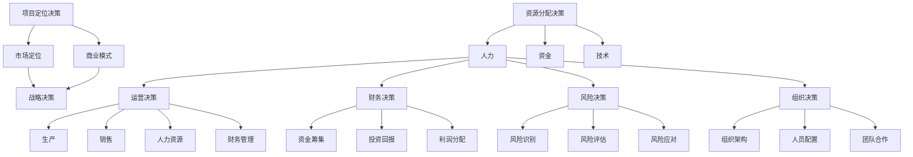

在这个流程图中，创业决策的核心概念相互关联，共同构成创业决策的体系。

### 第11章：创业资源的整合与利用

#### 11.1 创业资源的种类

创业资源是创业项目成功的关键因素，主要包括以下几种：

- **人力资源**：人力资源是创业项目中最重要的资源，包括创业者、员工和合作伙伴。人力资源的素质、能力和团队合作精神对项目的成功至关重要。
- **资金资源**：资金资源是创业项目的基础，包括创业初期的启动资金、运营资金和后续融资。足够的资金资源能够确保项目的顺利推进和持续发展。
- **技术资源**：技术资源包括创业项目所需的技术、知识产权和技术支持。技术资源的高水平和技术创新的潜力是创业项目的核心竞争力。
- **市场资源**：市场资源包括市场需求、市场机会和客户资源。市场资源的丰富程度直接影响项目的市场前景和盈利能力。
- **社会资源**：社会资源包括政府政策支持、行业协会资源和社会资本。社会资源的获取能够为创业项目提供良好的外部环境和资源支持。

#### 11.2 创业资源的整合方法

创业资源的整合是提高创业项目效率和效果的关键，以下是一些有效的整合方法：

- **跨部门合作**：通过跨部门合作，整合不同部门的专业知识和资源，提高项目的整体效能。跨部门合作可以包括研发、市场、销售和财务等部门。
- **合作伙伴关系**：建立稳定的合作伙伴关系，整合合作伙伴的资源和技术优势，共同推动项目发展。合作伙伴可以包括供应商、客户、投资者和其他行业企业。
- **社会化媒体**：利用社会化媒体平台，整合社会资源，扩大项目的影响力和知名度。社会化媒体可以包括微信、微博、抖音等平台。
- **技术创新平台**：利用技术创新平台，整合技术资源，推动技术创新和产品研发。技术创新平台可以包括实验室、研究中心和科技孵化器等。
- **资源共享机制**：建立资源共享机制，提高资源利用效率，降低创业成本。资源共享机制可以包括资源共享平台、协作办公和联合采购等。

#### 11.3 创业资源的利用策略

创业资源的有效利用是创业成功的关键，以下是一些有效的利用策略：

- **精准定位**：根据项目特点和市场需求，精准定位资源投入方向，确保资源投入的高效性和针对性。
- **优化配置**：通过优化资源配置，提高资源利用效率，降低资源浪费。优化配置可以包括合理分配人力、资金和技术资源等。
- **灵活调度**：根据项目进展和市场变化，灵活调度资源，确保项目能够应对不同阶段的挑战和需求。
- **创新能力**：鼓励创业者在资源利用过程中不断创新，通过技术创新和商业模式创新，提高资源利用效果。
- **风险管理**：建立完善的风险管理体系，降低资源利用过程中的风险，确保项目的稳定发展。

#### 11.4 创业资源的整合与利用的核心概念原理之间的关系架构

以下是一个简化的Mermaid流程图，展示了创业资源的整合与利用的核心概念原理之间的关系：

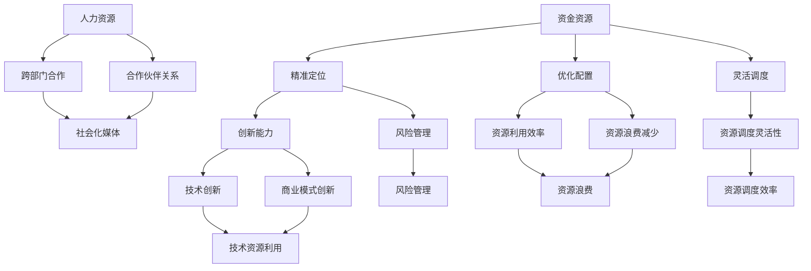

在这个流程图中，创业资源的整合与利用的核心概念相互关联，共同推动创业项目的成功。

### 第12章：创业失败的原因与应对策略

#### 12.1 创业失败的原因

创业失败的原因多种多样，以下是一些常见的原因：

- **市场定位不准**：创业项目在市场定位上存在偏差，未能准确识别和满足市场需求，导致项目无法获得足够的用户和市场份额。
- **资源不足**：创业项目在人力资源、资金资源和技术资源等方面存在不足，导致项目无法顺利推进，影响项目的整体效果。
- **技术创新不足**：创业项目在技术创新上存在不足，无法在市场中形成竞争优势，导致项目的竞争力下降。
- **管理不善**：创业项目的管理不善，包括组织结构不合理、管理流程不畅、团队协作不力等，导致项目效率低下、成本增加。
- **风险控制不足**：创业项目在风险控制上存在不足，未能及时发现和应对项目面临的各种风险，导致项目无法持续发展。
- **商业模式不成熟**：创业项目的商业模式不成熟，无法实现持续的盈利和增长，导致项目无法持续运营。

#### 12.2 创业失败的应对策略

面对创业失败，创业者需要采取积极的应对策略，以下是一些有效的应对策略：

- **市场再定位**：根据市场变化和用户需求，重新调整创业项目的市场定位，寻找新的市场机会和目标用户。
- **资源优化**：通过优化资源配置，提高资源利用效率，降低创业成本，确保项目能够继续推进。
- **技术创新**：加大技术创新力度，通过技术创新和产品升级，提高项目的市场竞争力和用户满意度。
- **管理优化**：通过优化管理流程和组织结构，提高项目管理的效率和效果，增强团队的协作能力和执行力。
- **风险控制**：建立完善的风险控制体系，通过风险评估和风险应对策略，降低项目面临的风险，确保项目的稳定发展。
- **商业模式调整**：根据市场环境和用户需求，调整创业项目的商业模式，寻找新的盈利点和增长点，实现项目的持续盈利和增长。

#### 12.3 创业失败的教训与启示

创业失败的教训对创业者具有重要启示，以下是一些主要教训和启示：

- **市场调研的重要性**：市场调研是创业成功的关键，创业者需要投入足够的时间和精力进行市场调研，准确识别市场需求和用户痛点，避免市场定位不准。
- **资源规划和管理**：创业者需要制定科学的资源规划和管理策略，确保项目在人力资源、资金资源和技术资源等方面的充足和合理，避免资源不足导致项目失败。
- **技术创新的持续投入**：创业者需要持续投入技术创新，通过不断改进产品和提升用户体验，保持项目的市场竞争力。
- **有效的团队管理**：创业者需要重视团队管理，建立高效的团队协作机制，培养团队的凝聚力和执行力，确保项目的顺利推进。
- **风险管理意识的培养**：创业者需要树立风险管理意识，建立完善的风险控制体系，通过风险评估和风险应对策略，降低项目面临的风险。
- **商业模式的灵活性**：创业者需要具备商业模式调整的能力，根据市场环境和用户需求，灵活调整商业模式，实现项目的持续盈利和增长。

#### 12.4 创业失败的核心概念原理之间的关系架构

以下是一个简化的Mermaid流程图，展示了创业失败的原因和应对策略的核心概念原理之间的关系：

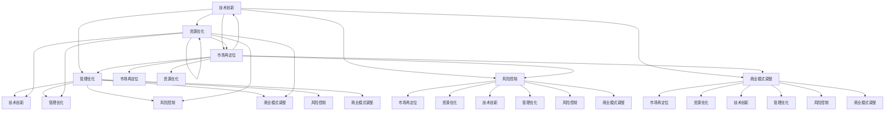

在这个流程图中，创业失败的原因和应对策略相互关联，共同构成创业成功的关键因素。

### 第三部分：团队激发与领导力提升

#### 第13章：团队激励理论与方法

#### 13.1 团队激励的概念

团队激励是指通过特定的机制和方法，激发团队成员的积极性、主动性和创造性，以提高团队绩效和实现组织目标的过程。团队激励不仅关注物质激励，还强调精神激励和内在激励。

#### 13.2 团队激励的理论基础

团队激励的理论基础包括以下几个重要理论：

- **需要层次理论**：马斯洛的需求层次理论认为，人的需求分为生理需求、安全需求、社交需求、尊重需求和自我实现需求。团队激励应满足团队成员的不同层次需求，从而提高其工作动力。
- **期望理论**：弗鲁姆的期望理论认为，个体行为受到期望价值、期望水平和激励因素的共同影响。团队激励需要建立合理的期望体系，提高团队成员的期望水平和期望价值。
- **公平理论**：亚当斯的公平理论认为，个体通过比较自己的投入和回报与他人的投入和回报，评估自己的公平感。团队激励需要确保团队成员感受到公平，避免激励不公平引发的不满和消极情绪。
- **自我决定理论**：德西和瑞安的自我决定理论认为，自主性、胜任感和归属感是驱动个体自我决定行为的关键因素。团队激励应尊重团队成员的自我决定权，提高其自主性和成就感。

#### 13.3 团队激励的方法与实践

团队激励的方法包括以下几种：

- **物质激励**：物质激励是通过提供薪酬、奖金、福利等物质回报来激发团队成员的工作积极性。物质激励需要合理设计，确保公平性和激励性。
- **精神激励**：精神激励是通过表扬、认可、培训和发展机会等非物质手段来激发团队成员的内在动力。精神激励能够提高团队成员的归属感和成就感，增强团队凝聚力。
- **目标激励**：目标激励是通过设定明确的、具有挑战性的目标和奖励机制来激发团队成员的积极性和创造力。目标激励能够提高团队成员的参与感和责任感，推动团队目标的实现。
- **参与激励**：参与激励是通过让团队成员参与决策和项目管理，提高其参与感和责任感。参与激励能够增强团队成员的归属感和自主性，提高团队绩效。
- **竞争激励**：竞争激励是通过组织内部或外部的竞争，激发团队成员的竞争意识和进取心。竞争激励能够提高团队成员的积极性和创新力，推动团队发展。

在实际应用中，团队激励需要根据团队特点和情境灵活选择和组合不同的激励方法，以达到最佳激励效果。

#### 13.4 团队激励的核心概念原理之间的关系架构

以下是一个简化的Mermaid流程图，展示了团队激励的核心概念和原理之间的关系：

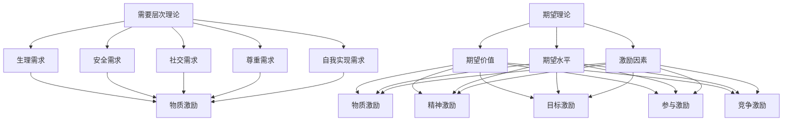

在这个流程图中，团队激励的核心概念和原理相互关联，共同构成团队激励的理论框架。

#### 第14章：构建高绩效团队的关键

#### 14.1 高绩效团队的特点

高绩效团队是指能够在高压力和高竞争环境下，高效协作、创新和实现共同目标的团队。高绩效团队的特点包括以下几个方面：

- **明确的目标**：高绩效团队有明确的目标和愿景，团队成员对目标有共同的理解和承诺，确保团队的努力方向一致。
- **有效的沟通**：高绩效团队拥有有效的沟通机制，团队成员能够开放、坦诚地交流，确保信息的透明和准确传递。
- **角色清晰**：高绩效团队的成员角色和职责明确，每个成员都清楚自己的职责和贡献，确保团队的分工合理和高效协作。
- **协作精神**：高绩效团队强调团队合作和协作精神，团队成员能够相互支持、互补不足，共同克服困难和挑战。
- **持续学习**：高绩效团队具备持续学习的能力，团队成员不断学习和提升自己的知识和技能，保持团队的竞争力和创新能力。
- **积极氛围**：高绩效团队拥有积极的团队氛围，团队成员之间相互鼓励、支持和认可，形成正向的激励和反馈机制。

#### 14.2 构建高绩效团队的策略

构建高绩效团队需要系统的策略和措施，以下是一些有效的策略：

- **明确目标和愿景**：领导者需要明确团队的目标和愿景，与团队成员进行深入沟通，确保每个人都对目标和愿景有共同的理解和认同。
- **建立有效的沟通机制**：领导者需要建立有效的沟通机制，确保团队成员之间的信息传递畅通无阻，包括定期的会议、团队讨论和反馈机制等。
- **角色明确和分工合理**：领导者需要明确团队成员的角色和职责，确保每个成员都能清楚自己的职责和贡献，并合理分配任务，避免重复和冲突。
- **培养协作精神**：领导者需要通过团队建设活动和协作项目，培养团队成员的协作精神，提高团队的协作效率和效果。
- **推动持续学习**：领导者需要鼓励团队成员持续学习，提供培训和发展机会，支持团队成员的职业成长和个人发展。
- **营造积极氛围**：领导者需要营造积极的团队氛围，鼓励团队成员相互鼓励和支持，建立正向的反馈和激励机制。

#### 14.3 高绩效团队的持续发展

高绩效团队的持续发展需要领导者和团队成员的共同努力，以下是一些关键的持续发展策略：

- **定期评估和反馈**：领导者需要定期评估团队的绩效和进展，提供及时的反馈和指导，帮助团队不断改进和提升。
- **建立持续改进机制**：领导者需要建立持续改进的机制，鼓励团队成员提出改进建议和创新方案，推动团队不断进步。
- **培养团队成员的领导力**：领导者需要培养团队成员的领导力，鼓励他们在团队中发挥领导作用，提高团队的整体领导水平和协作能力。
- **加强外部合作和资源整合**：领导者需要加强外部合作和资源整合，借助外部资源和合作，为团队提供更多的支持和机会，推动团队的持续发展。
- **关注团队成员的身心健康**：领导者需要关注团队成员的身心健康，提供健康的工作环境和关怀支持，确保团队成员能够保持良好的工作状态。

#### 14.4 高绩效团队的核心概念原理之间的关系架构

以下是一个简化的Mermaid流程图，展示了高绩效团队的核心概念和原理之间的关系：

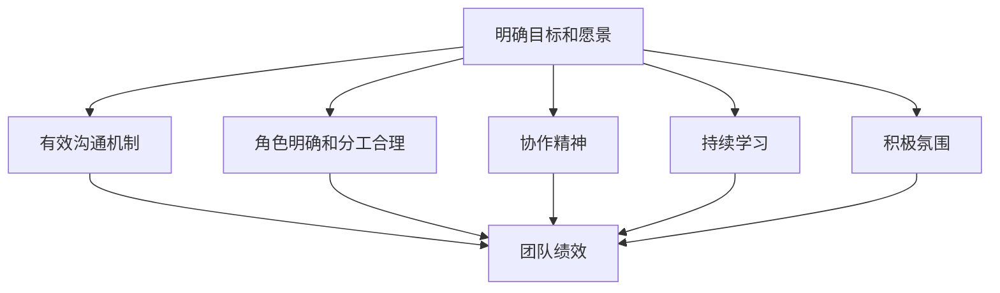

在这个流程图中，高绩效团队的核心概念和原理相互关联，共同构成团队持续发展的基础。

### 第15章：领导力与团队文化

#### 15.1 团队文化的概念与类型

团队文化是指团队成员在长期合作过程中形成的共同价值观、信念和行为准则。团队文化对团队成员的行为和团队绩效具有深远影响，可以分为以下几种类型：

- **目标导向型文化**：目标导向型文化强调团队目标的实现，团队成员以共同目标为中心，积极协作，追求卓越。
- **创新导向型文化**：创新导向型文化鼓励团队成员勇于创新和尝试新事物，通过持续创新推动团队进步和成长。
- **协作导向型文化**：协作导向型文化强调团队合作和互助精神，团队成员相互信任、支持和协作，共同实现团队目标。
- **结果导向型文化**：结果导向型文化关注团队绩效和成果，鼓励团队成员追求高效和高质量的工作，以结果为导向。
- **稳定性文化**：稳定性文化注重团队稳定和持续发展，团队成员倾向于保持现状，避免变革和风险。

#### 15.2 领导力与团队文化的互动

领导力与团队文化之间存在密切的互动关系，领导者对团队文化具有深远影响。以下为领导力与团队文化互动的几个方面：

- **塑造团队文化**：领导者通过行为、决策和沟通，塑造团队的文化价值观和行为准则。领导者的价值观和行为方式对团队成员产生示范作用，影响团队文化的形成和发展。
- **强化团队文化**：领导者需要不断强化团队文化，通过持续的沟通、激励和制度建设，确保团队文化得到有效传承和发扬。
- **适应团队文化**：领导者需要根据团队文化的特点和环境的变化，灵活调整领导行为和策略，确保团队文化能够适应外部环境的变化。
- **促进团队文化创新**：领导者需要鼓励团队文化的创新，通过提供资源和支持，激发团队成员的创新思维和创造力，推动团队文化的持续发展和完善。

#### 15.3 塑造积极团队文化的方法

以下是一些塑造积极团队文化的方法：

- **建立共同价值观**：领导者需要明确团队的核心价值观，并与团队成员共同探讨和认同，确保团队成员对团队的价值观有共同的理解和认同。
- **提供发展机会**：领导者需要为团队成员提供职业发展和个人成长的机会，激发团队成员的积极性和创造力。
- **加强沟通与协作**：领导者需要建立有效的沟通机制，促进团队成员之间的交流和协作，增强团队凝聚力。
- **激励与认可**：领导者需要通过激励和认可，鼓励团队成员的积极行为和贡献，提高团队士气和工作满意度。
- **建立反馈机制**：领导者需要建立反馈机制，鼓励团队成员提出意见和建议，确保团队文化的不断优化和改进。

#### 15.4 领导力与团队文化的核心概念原理之间的关系架构

以下是一个简化的Mermaid流程图，展示了领导力与团队文化的核心概念原理之间的关系：

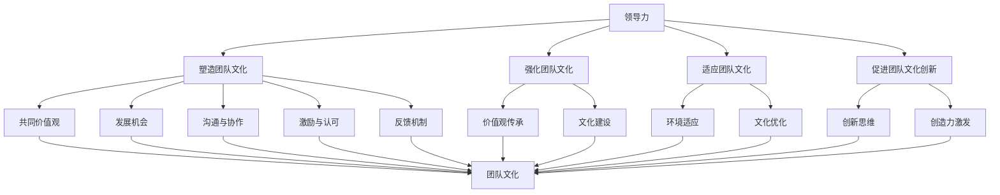

在这个流程图中，领导力与团队文化的核心概念和原理相互关联，共同促进团队的积极发展。

### 第16章：团队沟通与冲突管理

#### 16.1 团队沟通的重要性

团队沟通是团队协作和成功的关键因素，它对团队的绩效、凝聚力和创新能力具有深远影响。以下为团队沟通的重要性：

- **信息传递**：有效的沟通是信息传递的基础，能够确保团队成员了解组织的目标、任务和期望，提高团队协作的效率。
- **建立信任**：良好的沟通有助于建立团队成员之间的信任，增强团队的凝聚力和归属感，提高团队的整体绩效。
- **解决冲突**：沟通是解决团队冲突的重要手段，通过开放的沟通，团队成员能够理解对方的立场和需求，找到共识和解决方案。
- **激发创新**：有效的沟通能够激发团队成员的创新思维和创造力，通过分享知识和经验，推动团队的持续发展和进步。
- **提高士气**：良好的沟通能够提高团队成员的工作满意度和士气，增强团队成员的积极性和工作动力。

#### 16.2 团队沟通的障碍与对策

团队沟通过程中可能会遇到各种障碍，以下是一些常见的障碍及其对策：

- **信息过滤**：团队成员可能会有意或无意地筛选信息，导致信息传递失真。对策：建立透明的沟通机制，鼓励团队成员开放地分享信息和观点，减少信息过滤。
- **语言障碍**：团队成员之间的语言和文化差异可能会影响沟通效果。对策：采用简单明了的语言和共享的沟通工具，加强跨文化的沟通培训，提高跨文化沟通的能力。
- **沟通渠道不畅**：团队内部缺乏有效的沟通渠道，可能导致信息传递不畅。对策：建立多样化的沟通渠道，包括会议、邮件、即时通讯和面对面交流等，确保团队成员能够及时获取信息。
- **个人偏见**：个人偏见和成见可能会影响沟通效果，导致误解和冲突。对策：提高团队成员的沟通意识和技巧，培养开放和尊重的心态，减少个人偏见的影响。
- **沟通频率不足**：团队沟通频率不足可能导致信息滞后和问题积累。对策：建立定期的沟通机制，包括团队会议、报告和反馈等，确保团队成员能够及时沟通和解决问题。

#### 16.3 冲突管理的原则与方法

团队冲突是团队沟通和协作中的常见现象，有效的冲突管理对于团队的发展和绩效至关重要。以下为冲突管理的原则与方法：

- **开放和坦诚**：冲突管理需要开放和坦诚的沟通，团队成员应勇于表达自己的观点和感受，尊重他人的立场和意见。
- **理解对方立场**：冲突管理需要理解对方的立场和需求，通过换位思考和同理心，寻找共识和解决方案。
- **积极倾听**：积极倾听是冲突管理的关键，团队成员应认真倾听对方的意见和观点，避免打断和批评。
- **协商和妥协**：冲突管理需要协商和妥协，通过寻求共同的利益和解决方案，实现双方的共赢。
- **保持冷静和理性**：冲突管理需要保持冷静和理性，避免情绪化的争吵和攻击，确保冲突管理的有效性和公正性。

常用的冲突管理方法包括：

- **回避**：回避是一种暂时的策略，适用于冲突不严重且短期内无法解决的情况。通过暂时搁置冲突，避免冲突升级。
- **妥协**：妥协是通过双方各自让步，寻求中间解决方案的方法。适用于双方利益相对均衡且需要快速解决问题的情境。
- **竞争**：竞争是通过竞争和对抗来解决问题，适用于冲突双方利益冲突明显且需要明确胜者的情境。
- **合作**：合作是通过共同合作和协作，寻求双赢的解决方案。适用于冲突双方利益相关且需要长期合作的情境。

#### 16.4 团队沟通与冲突管理的核心概念原理之间的关系架构

以下是一个简化的Mermaid流程图，展示了团队沟通与冲突管理的核心概念原理之间的关系：

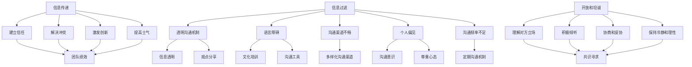

在这个流程图中，团队沟通与冲突管理的核心概念和原理相互关联，共同促进团队的协作和成功。

### 第17章：领导力在团队变革中的角色

#### 17.1 团队变革的概念与重要性

团队变革是指团队在面临外部环境变化或内部需求时，对现有组织结构、文化、流程和策略进行调整和优化的过程。团队变革的重要性体现在以下几个方面：

- **适应外部环境**：随着市场环境的快速变化和竞争加剧，团队需要通过变革适应外部环境的变化，保持竞争力和生存能力。
- **提升团队绩效**：团队变革有助于提升团队的整体绩效，通过优化流程、提高效率、激发创新和改善文化，实现团队的长期发展。
- **满足内部需求**：团队变革可以满足内部需求，如员工职业发展、组织结构调整和战略调整等，提高员工的满意度和忠诚度。
- **实现组织目标**：团队变革有助于实现组织目标，通过调整和优化团队结构和文化，推动组织战略的实施和目标的达成。

#### 17.2 领导力在团队变革中的角色

领导力在团队变革中扮演着关键角色，以下为领导力在团队变革中的角色：

- **变革的推动者**：领导者需要作为变革的推动者，引领团队走出舒适区，克服变革中的困难和挑战，推动团队实现变革目标。
- **变革的倡导者**：领导者需要作为变革的倡导者，向团队成员传达变革的必要性和紧迫性，激发团队成员对变革的支持和参与。
- **变革的协调者**：领导者需要作为变革的协调者，协调团队内外部的资源和利益，确保变革的顺利进行和成功实施。
- **变革的激励者**：领导者需要作为变革的激励者，激励团队成员克服变革中的恐惧和不确定感，增强团队成员的信心和动力。
- **变革的促进者**：领导者需要作为变革的促进者，推动团队不断学习和适应变革，提高团队的创新能力和应变能力。

#### 17.3 领导力在团队变革中的核心能力与策略

领导力在团队变革中需要具备以下核心能力和策略：

- **愿景和目标的明确**：领导者需要明确团队变革的愿景和目标，确保团队成员对变革有共同的理解和认同。
- **有效的沟通**：领导者需要通过有效的沟通，传达变革的必要性和紧迫性，解释变革的预期收益和风险，建立团队成员对变革的支持。
- **变革的领导风格**：领导者需要根据团队的实际情况和变革的需求，选择合适的领导风格，如变革型领导、变革推动型领导等。
- **激励和激励**：领导者需要通过激励和激励，提高团队成员的参与度和积极性，激发团队成员的创造力和创新力。
- **风险管理**：领导者需要建立风险管理体系，识别和评估变革过程中的风险，制定风险应对策略，确保变革的安全性和可控性。
- **持续支持和反馈**：领导者需要持续支持和反馈，为团队成员提供必要的支持和资源，及时反馈变革的进展和成果，确保变革的顺利进行。

#### 17.4 领导力在团队变革中的核心概念原理之间的关系架构

以下是一个简化的Mermaid流程图，展示了领导力在团队变革中的核心概念和原理之间的关系：

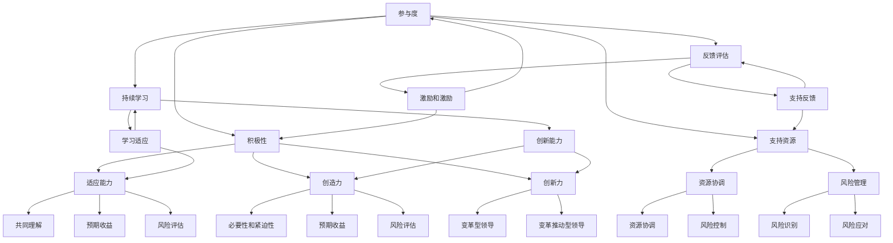

在这个流程图中，领导力在团队变革中的核心概念和原理相互关联，共同推动团队变革的成功实施。

### 第18章：领导力评估与提升

#### 18.1 领导力评估的重要性

领导力评估是衡量领导者能力和发展水平的重要手段，它对于组织的发展和领导力的提升具有重要意义。以下为领导力评估的重要性：

- **了解领导力现状**：领导力评估能够帮助组织了解领导力现状，识别领导力的优势和不足，为领导力发展提供依据。
- **制定发展计划**：领导力评估为组织和个人制定领导力发展计划提供依据，确保领导力发展目标的实现。
- **提升领导力水平**：领导力评估能够推动领导者自我反思和持续改进，提高领导力水平，提升组织绩效。
- **优化领导资源配置**：领导力评估有助于优化领导资源配置，确保组织在关键岗位上配置合适的领导者，提高组织整体效能。

#### 18.2 领导力评估的方法与工具

领导力评估可以采用以下几种方法和工具：

- **360度反馈**：360度反馈是一种全面的领导力评估方法，通过收集来自团队成员、上级、同事和下属的反馈，全面评估领导者的能力和发展需求。
- **行为观察法**：行为观察法通过观察领导者的日常工作行为和领导风格，评估领导者的实际能力和表现。
- **自我评估**：自我评估是领导者通过自我反思和评估，了解自己的领导能力和发展需求的方法。
- **领导力问卷**：领导力问卷是一种量化的评估工具，通过设计一系列关于领导力各个方面的问题，评估领导者的能力水平。
- **模拟情境**：模拟情境是一种通过模拟实际工作情境，评估领导者在不同情境下的领导能力和应对策略的方法。

#### 18.3 领导力提升的策略与方法

领导力提升是组织和个人持续发展的关键，以下为领导力提升的策略与方法：

- **培训与发展**：组织和个人可以通过参加领导力培训课程和工作坊，学习领导力理论和实践，提升领导力水平。
- **实践与反思**：通过实际工作中的实践和反思，领导者可以不断总结经验教训，提高领导能力。
- **导师指导**：找到一位有经验的导师，学习他们的领导经验和技巧，获得反馈和建议，加快领导力发展。
- **参与项目和任务**：通过参与重要的项目和任务，承担更多的责任和挑战，锻炼领导能力和决策能力。
- **持续学习和创新**：领导者需要保持学习的热情，关注行业动态和趋势，不断更新知识和技能，适应变化的环境。
- **建立反馈机制**：组织应建立有效的反馈机制，鼓励领导者接受反馈，及时改进自己的领导行为。

#### 18.4 领导力评估与提升的核心概念原理之间的关系架构

以下是一个简化的Mermaid流程图，展示了领导力评估与提升的核心概念原理之间的关系：

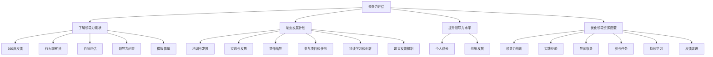

在这个流程图中，领导力评估与提升的核心概念和原理相互关联，共同推动领导力的发展和提升。

### 附录A：领导力与创业精神相关资源列表

以下是一些关于领导力和创业精神的重要资源，供读者进一步学习和参考：

- **书籍**：
  - 《领导力的五项修炼》作者：约翰·M·布莱克
  - 《创业精神》作者：杰弗里·A·泰勒
  - 《创业家精神》作者：史蒂夫·乔布斯
  - 《团队协作的艺术》作者：泰瑞·雷恩

- **学术论文和期刊**：
  - "The Theory and Practice of Leadership" by John P. Kotter
  - "Entrepreneurship: The Theory and Practice" by Jeffry A. Timmons and Stephen G. Spinelli
  - "Team Building: A Practical Guide for Leaders and Managers" by Ron R. Rice

- **在线课程与讲座**：
  - Coursera上的《领导力与组织行为》课程
  - EdX上的《创业精神》课程
  - TED上的关于领导力和创业精神的精彩演讲

- **社交媒体和论坛**：
  - LinkedIn上的领导力和创业精神专业群组
  - Quora上的领导力和创业精神话题讨论
  - Medium上的领导力和创业精神相关文章

### 附录B：常用领导力模型介绍

以下是一些常用的领导力模型，读者可以参考这些模型来了解不同领导力风格和策略：

- **情境领导力模型**：根据团队成员的能力和环境特点，选择合适的领导风格。模型包括指导式、支持式、参与式和授权式领导。
- **领导风格模型**：描述领导者如何通过行为和态度影响团队。包括民主式领导、权威式领导、参与式领导和变革型领导。
- **变革型领导力模型**：通过激发员工的潜能和动机，推动团队实现变革和进步。模型包括领导者的愿景、激励和模范行为。
- **服务型领导力模型**：领导者关注团队成员的需求，通过服务和支持团队成员来实现共同目标。

### 附录C：创业项目案例分析

以下是一些具有代表性的创业项目案例分析，读者可以从中了解创业项目的成功经验和失败教训：

- **案例一：特斯拉**：特斯拉通过变革型领导力和创新精神，在电动汽车领域取得显著成就。其成功经验包括明确的愿景、创新技术和持续的市场投入。
- **案例二：Airbnb**：Airbnb通过创新商业模式和用户体验，成为全球知名的共享住宿平台。其成功经验包括强大的市场定位、用户体验和快速扩展。
- **案例三：WhatsApp**：WhatsApp通过简单的即时通讯应用，迅速获得大量用户，被Facebook收购。其成功经验包括简单易用的产品、用户导向和快速扩展。
- **案例四：谷歌**：谷歌通过变革型领导力和创新精神，成为全球领先的科技公司。其成功经验包括开放的文化、创新技术和持续的投资。

### 总结与展望

领导力与创业精神是推动组织和个人发展的重要力量。本文从领导力的核心概念、创业精神的重要性、团队激发与领导力提升等多个方面，探讨了如何激发团队的创业热情，提升团队绩效和创新能力。通过理论分析和实践案例，读者可以深入了解领导力和创业精神的本质和作用，掌握有效的团队激发和领导力提升方法。

展望未来，随着全球化和技术变革的加速，领导力和创业精神的重要性将愈发凸显。领导者需要具备更强的适应能力、创新能力和领导力，以应对复杂多变的市场环境。同时，创业者需要不断激发创业精神，勇于创新和冒险，推动社会进步和经济发展。

希望本文能为读者提供有价值的参考和启示，助力领导者和创业者更好地发挥领导力和创业精神，实现个人和组织的目标。让我们共同努力，激发团队的创业热情，共创美好未来。

