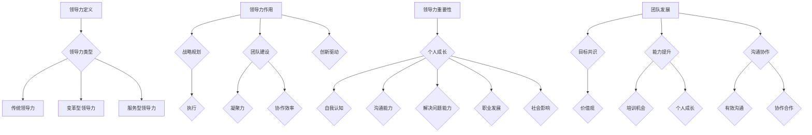
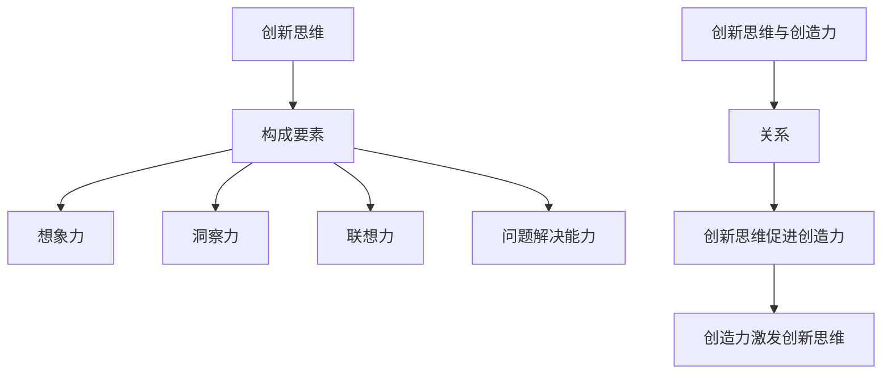
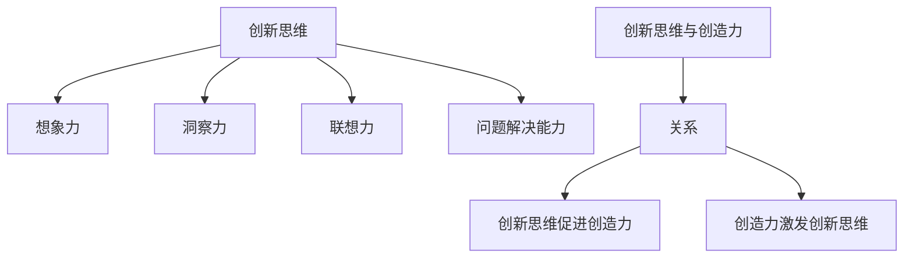
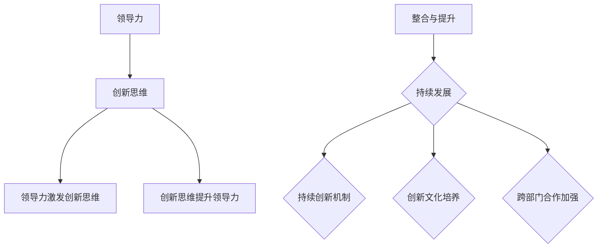
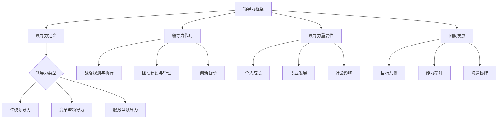

                 


**文章标题：** 领导力与创新思维训练营：激发创意的方法

**关键词：** 领导力，创新思维，创意激发，团队发展，项目管理，组织文化

**摘要：**
本文旨在探讨领导力与创新思维的结合，提供一套系统的训练营方法来激发团队的创造力。文章首先介绍了领导力的基础概念和理论，包括领导力的本质、重要性以及领导力发展的基本理论。接着，文章深入探讨了创新思维的核心要素，包括创新思维的基本原理、激发创意的方法与技巧。随后，文章转向创新实践与应用，详细阐述了创新项目的组织与实施、创新文化的营造与维护，以及如何整合领导力与创新思维来提升团队效能。最后，文章通过项目实战和最佳实践提示，为读者提供了实际操作的建议和案例分析。通过本文的阅读，读者可以系统地了解和掌握领导力与创新思维的相关知识，提升自身在团队管理和创新实践中的能力。

### 第一部分：领导力的基础概念与理论

#### 第1章：领导力的本质与重要性

**1.1 领导力的定义与类型**

领导力是一种引导和影响他人以实现共同目标的能力。它不仅包括正式的权威，还涵盖个人魅力、人际关系和影响力。根据不同的分类标准，领导力可以划分为多种类型：

- **传统领导力**：基于职位和权力，通过指令和监督来管理团队。其特点是以任务为中心，强调效率和执行力。
  
- **变革型领导力**：注重激发团队的内在动力，鼓励创新和成长。其特点是以人为中心，强调领导者的激励和引导作用。

- **服务型领导力**：以服务他人为首要任务，关注团队成员的需求和福祉。其特点是以价值观为中心，强调领导者的道德责任。

**1.2 领导力在组织中的作用**

领导力在组织中扮演着关键角色，它对组织的战略规划、团队建设和创新驱动具有重要影响：

- **战略规划与执行**：领导者负责制定组织的愿景、目标和战略，并确保这些战略得到有效执行。

- **团队建设与管理**：领导者通过建立共同的目标和价值观，提升团队的凝聚力、协作能力和效率。

- **创新驱动**：领导者鼓励创新思维，推动组织不断适应变化和迎接挑战。

**1.3 领导力的重要性与个人成长**

领导力不仅对组织有重要影响，也对个人的成长和职业发展具有重要意义：

- **个人成长**：通过领导力的发展，个人能够提升自我认知、沟通能力和解决问题的能力。

- **职业发展**：具备领导力的人更容易获得职业晋升和领导岗位。

- **社会影响**：领导力有助于个人在社会中发挥更大的影响力，推动社会进步和发展。

**1.4 领导力与团队发展的关系**

团队发展是领导力的重要组成部分，它需要领导者关注以下几个方面：

- **目标共识**：领导者需要与团队成员共同确定团队的目标和价值观，确保团队成员对目标有清晰的认识。

- **能力提升**：领导者需要关注团队成员的能力提升，提供培训和发展机会，帮助团队成员不断成长。

- **沟通协作**：领导者需要建立有效的沟通机制，促进团队成员之间的协作和合作。

**核心概念与联系：领导力框架的Mermaid流程图**



**核心算法原理讲解：领导力发展模型的伪代码**

```python
# 领导力发展模型伪代码

# 定义领导力类型
def leadership_type(type):
    if type == "传统领导力":
        return "以任务为中心，强调效率和执行力"
    elif type == "变革型领导力":
        return "以人为中心，强调领导者的激励和引导作用"
    elif type == "服务型领导力":
        return "以价值观为中心，强调领导者的道德责任"

# 定义领导力作用
def leadership_impact(action):
    if action == "战略规划与执行":
        return "制定并落实组织目标"
    elif action == "团队建设与管理":
        return "提高团队凝聚力和协作效率"
    elif action == "创新驱动":
        return "推动组织不断适应变化和迎接挑战"

# 定义领导力重要性
def leadership_importance(effect):
    if effect == "个人成长":
        return "提升自我认知、沟通能力和解决问题的能力"
    elif effect == "职业发展":
        return "更容易获得职业晋升和领导岗位"
    elif effect == "社会影响":
        return "推动社会进步和发展"

# 定义团队发展
def team_development(component):
    if component == "目标共识":
        return "与团队成员共同确定团队的目标和价值观"
    elif component == "能力提升":
        return "关注团队成员的能力提升，提供培训和发展机会"
    elif component == "沟通协作":
        return "建立有效的沟通机制，促进团队成员之间的协作和合作"
```

#### 第2章：领导力发展的基本理论

**2.1 权力与影响力的来源**

权力是领导力的核心要素之一，它决定了领导者能够对他人产生多大的影响。权力可以从以下几个方面来理解：

- **正式权力**：来源于领导者的职位和职责，如决策权、资源配置权等。
  
- **非正式权力**：来源于领导者的个人素质、专业知识和人际关系，如信任、威望、榜样作用等。

**2.2 领导风格的分类与特点**

领导风格是指领导者处理事务的方式和态度。根据不同的分类标准，领导风格可以分为以下几种：

- **独裁型领导风格**：领导者独自决策，团队成员被动执行。其特点是大权独揽，决策迅速。

- **民主型领导风格**：领导者鼓励团队成员参与决策，共同解决问题。其特点是民主开放，团队凝聚力强。

- **放任型领导风格**：领导者很少干涉团队工作，团队成员自由发挥。其特点是自主性强，创新氛围浓厚。

**2.3 领导力发展模型**

领导力发展模型描述了领导者在不同阶段所经历的成长过程。常见的领导力发展模型包括：

- **领导行为模型**：通过观察领导者的行为来评估其领导能力。

- **领导发展模型**：强调领导者的自我认知和反思，通过不断的实践和反思来提升领导力。

- **领导素质模型**：强调领导者的个性、价值观和领导技能，认为领导力是可以通过学习和培养获得的。

**核心概念与联系：创新思维与创造力的Mermaid流程图**



**核心算法原理讲解：头脑风暴法的伪代码**

```python
# 头脑风暴法伪代码

# 定义头脑风暴过程
def brainstorming_topic(topic):
    ideas = []
    print(f"头脑风暴主题：{topic}")
    print("请团队成员提出创意，不限数量和范围：")
    while True:
        idea = input()
        if idea == "结束":
            break
        ideas.append(idea)
    return ideas

# 定义创意筛选过程
def filter_ideas(ideas):
    selected_ideas = []
    for idea in ideas:
        if evaluate_idea(idea):
            selected_ideas.append(idea)
    return selected_ideas

# 定义创意评估函数
def evaluate_idea(idea):
    # 这里可以加入对创意的评估算法，如可行性、创新性等
    return True  # 假设所有创意都通过评估

# 头脑风暴实例
print("开始头脑风暴...")
selected_ideas = brainstorming_topic("如何提高公司业绩？")
print("筛选后的创意：")
for idea in selected_ideas:
    print("- " + idea)
```

### 第二部分：创新思维的核心要素

#### 第3章：创新思维的基本原理

**3.1 创新思维的构成要素**

创新思维是一种通过创造性思考来解决问题的思维方式。它由以下几个核心要素构成：

- **想象力**：想象力是创新思维的基础，它使人能够在头脑中构建新的概念和场景。

- **洞察力**：洞察力是指发现问题和机会的能力，它使人在复杂环境中能够敏锐地捕捉到关键信息。

- **联想力**：联想力是指将不同事物相互联系，产生新的观点和创意的能力。

- **问题解决能力**：问题解决能力是指运用创造性思维解决实际问题的能力。

**3.2 创新思维与创造力**

创新思维与创造力密切相关，创新思维是创造力的具体表现形式。创造力是指个体产生新颖且有价值的想法和解决方案的能力。创新思维与创造力的关系可以概括为：

- **创新思维促进创造力**：通过创新思维，个体能够发现新的问题和机会，从而激发创造力。

- **创造力激发创新思维**：成功的创造力实践会进一步增强个体的创新思维，形成良性循环。

**3.3 创新思维的发展趋势**

随着社会和科技的不断进步，创新思维的发展呈现出以下趋势：

- **跨学科融合**：创新思维越来越强调跨学科的知识融合，以应对复杂问题。

- **数字化创新**：数字技术的发展为创新思维提供了新的工具和方法，如人工智能、大数据等。

- **社会参与**：创新思维越来越重视社会的参与和反馈，以实现更加广泛和有影响力的创新。

**3.4 创新思维在组织中的应用**

创新思维在组织中具有广泛的应用，它可以用于：

- **产品和服务创新**：通过创新思维，组织可以开发出更加符合市场需求的新产品和服务。

- **业务模式创新**：创新思维可以帮助组织找到新的盈利模式和增长点。

- **文化创新**：创新思维可以推动组织文化的变革，营造更加开放和创新的工作氛围。

**核心概念与联系：创新思维与创造力的Mermaid流程图**



### 第三部分：创新实践与应用

#### 第5章：创新项目的组织与实施

**5.1 创新项目的规划与目标设定**

创新项目的规划与目标是创新项目成功的关键。规划包括以下几个方面：

- **明确创新项目类型**：根据组织的战略目标和市场需求，确定创新项目的类型，如产品创新、业务模式创新等。

- **设定项目目标**：目标应具有可衡量性、具体性和时限性，例如，提高产品销量20%或开发一款新功能。

- **制定项目计划**：包括项目时间表、资源分配、风险评估等。

**5.2 创新团队的构建与沟通**

构建高效的创新团队是实现创新项目成功的关键。团队构建包括以下几个方面：

- **确定团队成员**：根据项目需求，选择具备相关技能和经验的团队成员，如技术专家、市场营销人员等。

- **建立团队文化**：鼓励团队成员之间的合作、分享和创新精神，建立开放、包容和信任的团队文化。

- **有效沟通**：确保团队成员之间的信息畅通，建立定期的沟通机制，如会议、邮件等。

**5.3 创新项目的风险管理**

创新项目面临多种风险，如技术风险、市场风险等。风险管理包括以下几个方面：

- **识别风险**：分析项目可能面临的风险，如技术难题、市场不确定性等。

- **评估风险**：评估风险的概率和影响程度，确定风险等级。

- **制定风险应对策略**：针对不同类型的风险，制定相应的应对策略，如技术攻关、市场调研等。

**5.4 创新项目的评估与改进**

创新项目的评估与改进是确保项目成功的重要环节。评估包括以下几个方面：

- **项目效果评估**：评估项目目标的实现情况，如产品销量、用户满意度等。

- **团队绩效评估**：评估团队成员的绩效，如创新能力、沟通能力等。

- **项目改进**：根据评估结果，对项目进行改进，提高项目成功率。

**项目实战：创新项目实例分析**

假设我们正在开发一款基于人工智能的客户服务平台。以下是该项目的一些关键步骤：

1. **项目规划与目标设定**：

   - **项目类型**：产品创新

   - **目标设定**：提高客户满意度，降低客户服务成本，实现产品市场占有率达到15%。

   - **项目计划**：制定详细的时间表，包括产品原型设计、功能开发、测试和上线等。

2. **创新团队的构建与沟通**：

   - **团队成员**：包括人工智能专家、产品经理、前端开发人员、市场营销人员等。

   - **团队文化**：鼓励团队成员之间进行知识共享和创意碰撞，建立积极、开放和包容的工作氛围。

   - **有效沟通**：每周举行一次团队会议，讨论项目进展、问题和解决方案。

3. **创新项目的风险管理**：

   - **识别风险**：技术风险（如人工智能算法的稳定性）、市场风险（如客户接受度）、资源风险（如人员调配不足）。

   - **评估风险**：根据风险的概率和影响程度，确定风险等级，并制定相应的应对策略。

   - **风险应对策略**：针对技术风险，增加技术攻关时间；针对市场风险，进行市场调研和用户反馈；针对资源风险，调整项目进度和人员安排。

4. **创新项目的评估与改进**：

   - **项目效果评估**：根据用户满意度调查、产品销量和市场占有率等指标，评估项目目标的实现情况。

   - **团队绩效评估**：评估团队成员的绩效，如创新能力、沟通能力、问题解决能力等。

   - **项目改进**：根据评估结果，对项目进行改进，如优化产品功能、调整市场推广策略等。

#### 第6章：创新文化的营造与维护

**6.1 创新文化的内涵与特征**

创新文化是一种鼓励创新、容忍失败、注重协作和学习的组织氛围。它具有以下几个特征：

- **开放性**：鼓励员工分享创意和意见，允许不同的声音和观点。

- **包容性**：容忍失败和错误，认为失败是成功的前提。

- **协作性**：强调团队合作，鼓励员工相互支持和学习。

- **学习性**：鼓励员工不断学习和成长，提升自身能力和创新意识。

**6.2 创新文化的培育策略**

要营造良好的创新文化，组织可以采取以下策略：

- **领导者的示范作用**：领导者应成为创新文化的倡导者和实践者，以身作则。

- **激励机制**：建立激励机制，鼓励员工提出创新想法和建议。

- **资源投入**：为创新提供充足的资源支持，如资金、时间和人力。

- **培训与学习**：为员工提供创新培训和技能提升机会，增强其创新能力和意识。

**6.3 创新文化的挑战与应对**

创新文化在组织中面临一系列挑战，如：

- **保守思想的抵制**：部分员工可能对创新持保守态度，认为创新会带来风险。

- **资源分配不均**：创新项目可能面临资源分配不足的问题。

- **文化冲突**：不同文化和背景的员工可能对创新文化有不同的理解和期待。

为应对这些挑战，组织可以采取以下措施：

- **加强沟通与协作**：通过有效的沟通和协作，消除保守思想的抵制。

- **优化资源分配**：合理分配资源，确保创新项目得到充分支持。

- **文化融合**：尊重不同文化和背景，促进文化融合，形成共同的创新价值观。

**6.4 创新文化在实践中的应用案例**

以下是一个创新文化在实践中的应用案例：

某科技公司致力于打造一个开放、包容和创新的工作环境。公司领导以身作则，积极参与创新项目和员工讨论。公司设立了创新基金，鼓励员工提出创新想法并给予资金支持。此外，公司还定期举办创新竞赛，鼓励员工团队合作，共同探讨解决方案。

通过这些措施，公司成功地营造了一个创新文化氛围。员工们积极参与创新项目，提出了一系列有价值的创新想法，推动了公司的持续发展。

**项目实战：创新文化实践案例分析**

假设我们正在一家科技公司实施创新文化变革。以下是该项目的一些关键步骤：

1. **领导者的示范作用**：

   - **领导者参与**：公司CEO和各部门负责人积极参与创新项目和员工讨论，分享创新经验和观点。

   - **领导力培训**：为领导者提供创新领导力培训，提高其创新意识和能力。

2. **激励机制**：

   - **创新奖金**：设立创新奖金，奖励提出有价值创新想法的员工。

   - **晋升机制**：将创新表现纳入员工晋升考核，鼓励员工积极参与创新项目。

3. **资源投入**：

   - **创新基金**：设立创新基金，为员工提供资金支持，鼓励其大胆尝试和创新。

   - **项目支持**：为创新项目提供技术、人力和时间等资源支持，确保项目顺利进行。

4. **培训与学习**：

   - **创新培训**：为员工提供创新培训，包括创意思维、设计思维、创新方法论等。

   - **学习交流**：组织内部创新交流会，分享创新经验和最佳实践。

通过以上步骤，公司成功地营造了一个创新文化氛围，员工们积极参与创新项目，提出了一系列有价值的创新想法，推动了公司的持续发展。

#### 第7章：领导力与创新思维的整合与提升

**7.1 领导力与创新思维的关系**

领导力与创新思维密切相关，二者相互促进，共同推动组织的创新和发展。领导力为创新思维提供了方向和资源，而创新思维则为领导力注入了新的活力和动力。具体来说：

- **领导力激发创新思维**：领导者的激励和引导作用可以激发团队成员的创新思维，鼓励他们提出新的想法和解决方案。

- **创新思维提升领导力**：创新思维能力的提升有助于领导者更好地理解和应对复杂问题，提高决策质量和执行效率。

**7.2 如何在领导中激发创新思维**

领导者可以通过以下方法在领导过程中激发创新思维：

- **营造创新氛围**：建立开放、包容、鼓励创新的组织氛围，让员工敢于提出新的想法和观点。

- **鼓励团队参与**：鼓励团队成员参与决策和创新过程，让他们感受到自己的价值和作用。

- **提供资源支持**：为创新提供充足的资源支持，如资金、人力和时间等，让员工有足够的资源和空间去尝试和探索。

- **建立激励机制**：设立创新激励机制，奖励提出有价值创新想法的员工，激励他们持续创新。

**7.3 提升领导力与创新思维的方法**

领导者可以通过以下方法提升领导力与创新思维：

- **自我反思**：定期进行自我反思，分析自己的领导行为和创新思维，找出不足并加以改进。

- **学习与培训**：参加领导力与创新思维的培训课程，学习最新的领导理论和创新方法。

- **实践与经验**：通过实践和经验积累，不断总结和提升自己的领导力和创新思维。

**7.4 领导力与创新思维的持续发展**

领导力与创新思维的持续发展是组织长期发展的关键。为了实现这一目标，组织可以采取以下措施：

- **建立持续创新机制**：建立持续创新机制，如定期开展创新项目、设立创新基金等。

- **培养创新文化**：培养创新文化，鼓励员工持续创新，形成良好的创新氛围。

- **加强跨部门合作**：加强跨部门合作，促进不同领域和部门之间的知识共享和协同创新。

**核心概念与联系：领导力与创新思维整合的Mermaid流程图**



**最佳实践 tips：**

- **建立创新激励机制**：为鼓励员工持续创新，可以设立创新奖金、晋升机会等激励措施。

- **鼓励跨学科合作**：跨学科的合作能够带来新的思路和创意，有助于提升创新效果。

- **关注用户需求**：以用户需求为导向，进行创新项目的设计和实施，确保创新成果能够满足市场需求。

**小结：**

领导力与创新思维的整合与提升是组织发展的重要课题。通过建立良好的领导力基础，激发创新思维，组织可以不断提高其竞争力和创新能力。持续发展创新文化和跨部门合作，有助于实现组织长远发展目标。本文提供了系统的理论和实践方法，希望对读者在领导力与创新思维方面的提升有所帮助。

### 附录：参考资料与工具

**附录1：参考资料**

本文所涉及的理论和实践方法参考了以下文献和资料：

- **《领导力：理论与实践》（罗伯特·豪斯著）**
- **《创新与企业家精神》（彼得·德鲁克著）**
- **《创新思维训练指南》（约翰·克雷斯著）**
- **《组织行为学：基础、理论与应用》（斯蒂芬·罗宾斯著）**
- **《创新文化：如何创建和管理创新组织》（雷蒙德·弗农著）**

**附录2：创新思维工具与应用**

以下是一些常用的创新思维工具：

- **头脑风暴法**：通过集体讨论，快速生成大量创意。
- **思维导图法**：利用图形化的方式，帮助组织和梳理创意。
- **SWOT分析法**：对项目的优势、劣势、机会和威胁进行综合分析。
- **六顶思考帽法**：通过不同颜色的帽子，代表不同的思考角度，促进全面思考。

**拓展阅读：**

- **《创新者的窘境》（克莱顿·克里斯坦森著）**：探讨了创新者在面对市场和技术变革时的挑战。
- **《创意的源泉》（迈克尔·米尔斯著）**：深入剖析了创意产生的心理机制。

通过学习和应用这些工具和理论，读者可以更好地激发创意，提升创新能力和领导力。

```markdown
# 《领导力与创新思维训练营：激发创意的方法》

## 关键词

领导力，创新思维，创意激发，团队发展，项目管理，组织文化

## 摘要

本文系统地探讨了领导力与创新思维的结合，提供了一套系统的训练营方法来激发团队的创造力。文章首先介绍了领导力的基础概念和理论，包括领导力的本质、重要性以及领导力发展的基本理论。接着，文章深入探讨了创新思维的核心要素，包括创新思维的基本原理、激发创意的方法与技巧。随后，文章转向创新实践与应用，详细阐述了创新项目的组织与实施、创新文化的营造与维护，以及如何整合领导力与创新思维来提升团队效能。最后，文章通过项目实战和最佳实践提示，为读者提供了实际操作的建议和案例分析。通过本文的阅读，读者可以系统地了解和掌握领导力与创新思维的相关知识，提升自身在团队管理和创新实践中的能力。

## 第一部分：领导力的基础概念与理论

### 第1章：领导力的本质与重要性

**1.1 领导力的定义与类型**

领导力是一种引导和影响他人以实现共同目标的能力。它不仅包括正式的权威，还涵盖个人魅力、人际关系和影响力。根据不同的分类标准，领导力可以划分为多种类型：

- **传统领导力**：基于职位和权力，通过指令和监督来管理团队。其特点是以任务为中心，强调效率和执行力。
  
- **变革型领导力**：注重激发团队的内在动力，鼓励创新和成长。其特点是以人为中心，强调领导者的激励和引导作用。

- **服务型领导力**：以服务他人为首要任务，关注团队成员的需求和福祉。其特点是以价值观为中心，强调领导者的道德责任。

**1.2 领导力在组织中的作用**

领导力在组织中扮演着关键角色，它对组织的战略规划、团队建设和创新驱动具有重要影响：

- **战略规划与执行**：领导者负责制定组织的愿景、目标和战略，并确保这些战略得到有效执行。

- **团队建设与管理**：领导者通过建立共同的目标和价值观，提升团队的凝聚力、协作能力和效率。

- **创新驱动**：领导者鼓励创新思维，推动组织不断适应变化和迎接挑战。

**1.3 领导力的重要性与个人成长**

领导力不仅对组织有重要影响，也对个人的成长和职业发展具有重要意义：

- **个人成长**：通过领导力的发展，个人能够提升自我认知、沟通能力和解决问题的能力。

- **职业发展**：具备领导力的人更容易获得职业晋升和领导岗位。

- **社会影响**：领导力有助于个人在社会中发挥更大的影响力，推动社会进步和发展。

**1.4 领导力与团队发展的关系**

团队发展是领导力的重要组成部分，它需要领导者关注以下几个方面：

- **目标共识**：领导者需要与团队成员共同确定团队的目标和价值观，确保团队成员对目标有清晰的认识。

- **能力提升**：领导者需要关注团队成员的能力提升，提供培训和发展机会，帮助团队成员不断成长。

- **沟通协作**：领导者需要建立有效的沟通机制，促进团队成员之间的协作和合作。

**核心概念与联系：领导力框架的Mermaid流程图**


**核心算法原理讲解：领导力发展模型的伪代码**

```python
# 领导力发展模型伪代码

# 定义领导力类型
def leadership_type(type):
    if type == "传统领导力":
        return "以任务为中心，强调效率和执行力"
    elif type == "变革型领导力":
        return "以人为中心，强调领导者的激励和引导作用"
    elif type == "服务型领导力":
        return "以价值观为中心，强调领导者的道德责任"

# 定义领导力作用
def leadership_impact(action):
    if action == "战略规划与执行":
        return "制定并落实组织目标"
    elif action == "团队建设与管理":
        return "提高团队凝聚力和协作效率"
    elif action == "创新驱动":
        return "推动组织不断适应变化和迎接挑战"

# 定义领导力重要性
def leadership_importance(effect):
    if effect == "个人成长":
        return "提升自我认知、沟通能力和解决问题的能力"
    elif effect == "职业发展":
        return "更容易获得职业晋升和领导岗位"
    elif effect == "社会影响":
        return "推动社会进步和发展"

# 定义团队发展
def team_development(component):
    if component == "目标共识":
        return "与团队成员共同确定团队的目标和价值观"
    elif component == "能力提升":
        return "关注团队成员的能力提升，提供培训和发展机会"
    elif component == "沟通协作":
        return "建立有效的沟通机制，促进团队成员之间的协作和合作"
```

#### 第2章：领导力发展的基本理论

**2.1 权力与影响力的来源**

权力是领导力的核心要素之一，它决定了领导者能够对他人产生多大的影响。权力可以从以下几个方面来理解：

- **正式权力**：来源于领导者的职位和职责，如决策权、资源配置权等。
  
- **非正式权力**：来源于领导者的个人素质、专业知识和人际关系，如信任、威望、榜样作用等。

**2.2 领导风格的分类与特点**

领导风格是指领导者处理事务的方式和态度。根据不同的分类标准，领导风格可以分为以下几种：

- **独裁型领导风格**：领导者独自决策，团队成员被动执行。其特点是大权独揽，决策迅速。

- **民主型领导风格**：领导者鼓励团队成员参与决策，共同解决问题。其特点是民主开放，团队凝聚力强。

- **放任型领导风格**：领导者很少干涉团队工作，团队成员自由发挥。其特点是自主性强，创新氛围浓厚。

**2.3 领导力发展模型**

领导力发展模型描述了领导者在不同阶段所经历的成长过程。常见的领导力发展模型包括：

- **领导行为模型**：通过观察领导者的行为来评估其领导能力。

- **领导发展模型**：强调领导者的自我认知和反思，通过不断的实践和反思来提升领导力。

- **领导素质模型**：强调领导者的个性、价值观和领导技能，认为领导力是可以通过学习和培养获得的。

**核心概念与联系：创新思维与创造力的Mermaid流程图**


**核心算法原理讲解：头脑风暴法的伪代码**

```python
# 头脑风暴法伪代码

# 定义头脑风暴过程
def brainstorming_topic(topic):
    ideas = []
    print(f"头脑风暴主题：{topic}")
    print("请团队成员提出创意，不限数量和范围：")
    while True:
        idea = input()
        if idea == "结束":
            break
        ideas.append(idea)
    return ideas

# 定义创意筛选过程
def filter_ideas(ideas):
    selected_ideas = []
    for idea in ideas:
        if evaluate_idea(idea):
            selected_ideas.append(idea)
    return selected_ideas

# 定义创意评估函数
def evaluate_idea(idea):
    # 这里可以加入对创意的评估算法，如可行性、创新性等
    return True  # 假设所有创意都通过评估

# 头脑风暴实例
print("开始头脑风暴...")
selected_ideas = brainstorming_topic("如何提高公司业绩？")
print("筛选后的创意：")
for idea in selected_ideas:
    print("- " + idea)
```

### 第三部分：创新实践与应用

#### 第5章：创新项目的组织与实施

**5.1 创新项目的规划与目标设定**

创新项目的规划与目标是创新项目成功的关键。规划包括以下几个方面：

- **明确创新项目类型**：根据组织的战略目标和市场需求，确定创新项目的类型，如产品创新、业务模式创新等。

- **设定项目目标**：目标应具有可衡量性、具体性和时限性，例如，提高产品销量20%或开发一款新功能。

- **制定项目计划**：包括项目时间表、资源分配、风险评估等。

**5.2 创新团队的构建与沟通**

构建高效的创新团队是实现创新项目成功的关键。团队构建包括以下几个方面：

- **确定团队成员**：根据项目需求，选择具备相关技能和经验的团队成员，如技术专家、市场营销人员等。

- **建立团队文化**：鼓励团队成员之间的合作、分享和创新精神，建立开放、包容和信任的团队文化。

- **有效沟通**：确保团队成员之间的信息畅通，建立定期的沟通机制，如会议、邮件等。

**5.3 创新项目的风险管理**

创新项目面临多种风险，如技术风险、市场风险等。风险管理包括以下几个方面：

- **识别风险**：分析项目可能面临的风险，如技术难题、市场不确定性等。

- **评估风险**：评估风险的概率和影响程度，确定风险等级。

- **制定风险应对策略**：针对不同类型的风险，制定相应的应对策略，如技术攻关、市场调研等。

**5.4 创新项目的评估与改进**

创新项目的评估与改进是确保项目成功的重要环节。评估包括以下几个方面：

- **项目效果评估**：评估项目目标的实现情况，如产品销量、用户满意度等。

- **团队绩效评估**：评估团队成员的绩效，如创新能力、沟通能力等。

- **项目改进**：根据评估结果，对项目进行改进，提高项目成功率。

**项目实战：创新项目实例分析**

假设我们正在开发一款基于人工智能的客户服务平台。以下是该项目的一些关键步骤：

1. **项目规划与目标设定**：

   - **项目类型**：产品创新

   - **目标设定**：提高客户满意度，降低客户服务成本，实现产品市场占有率达到15%。

   - **项目计划**：制定详细的时间表，包括产品原型设计、功能开发、测试和上线等。

2. **创新团队的构建与沟通**：

   - **团队成员**：包括人工智能专家、产品经理、前端开发人员、市场营销人员等。

   - **团队文化**：鼓励团队成员之间进行知识共享和创意碰撞，建立积极、开放和包容的工作氛围。

   - **有效沟通**：每周举行一次团队会议，讨论项目进展、问题和解决方案。

3. **创新项目的风险管理**：

   - **识别风险**：技术风险（如人工智能算法的稳定性）、市场风险（如客户接受度）、资源风险（如人员调配不足）。

   - **评估风险**：根据风险的概率和影响程度，确定风险等级，并制定相应的应对策略。

   - **风险应对策略**：针对技术风险，增加技术攻关时间；针对市场风险，进行市场调研和用户反馈；针对资源风险，调整项目进度和人员安排。

4. **创新项目的评估与改进**：

   - **项目效果评估**：根据用户满意度调查、产品销量和市场占有率等指标，评估项目目标的实现情况。

   - **团队绩效评估**：评估团队成员的绩效，如创新能力、沟通能力、问题解决能力等。

   - **项目改进**：根据评估结果，对项目进行改进，如优化产品功能、调整市场推广策略等。

#### 第6章：创新文化的营造与维护

**6.1 创新文化的内涵与特征**

创新文化是一种鼓励创新、容忍失败、注重协作和学习的组织氛围。它具有以下几个特征：

- **开放性**：鼓励员工分享创意和意见，允许不同的声音和观点。

- **包容性**：容忍失败和错误，认为失败是成功的前提。

- **协作性**：强调团队合作，鼓励员工相互支持和学习。

- **学习性**：鼓励员工不断学习和成长，提升自身能力和创新意识。

**6.2 创新文化的培育策略**

要营造良好的创新文化，组织可以采取以下策略：

- **领导者的示范作用**：领导者应成为创新文化的倡导者和实践者，以身作则。

- **激励机制**：建立激励机制，鼓励员工提出创新想法和建议。

- **资源投入**：为创新提供充足的资源支持，如资金、时间和人力。

- **培训与学习**：为员工提供创新培训和技能提升机会，增强其创新能力和意识。

**6.3 创新文化的挑战与应对**

创新文化在组织中面临一系列挑战，如：

- **保守思想的抵制**：部分员工可能对创新持保守态度，认为创新会带来风险。

- **资源分配不均**：创新项目可能面临资源分配不足的问题。

- **文化冲突**：不同文化和背景的员工可能对创新文化有不同的理解和期待。

为应对这些挑战，组织可以采取以下措施：

- **加强沟通与协作**：通过有效的沟通和协作，消除保守思想的抵制。

- **优化资源分配**：合理分配资源，确保创新项目得到充分支持。

- **文化融合**：尊重不同文化和背景，促进文化融合，形成共同的创新价值观。

**6.4 创新文化在实践中的应用案例**

以下是一个创新文化在实践中的应用案例：

某科技公司致力于打造一个开放、包容和创新的工作环境。公司领导以身作则，积极参与创新项目和员工讨论。公司设立了创新基金，鼓励员工提出创新想法并给予资金支持。此外，公司还定期举办创新竞赛，鼓励员工团队合作，共同探讨解决方案。

通过这些措施，公司成功地营造了一个创新文化氛围，员工们积极参与创新项目，提出了一系列有价值的创新想法，推动了公司的持续发展。

**项目实战：创新文化实践案例分析**

假设我们正在一家科技公司实施创新文化变革。以下是该项目的一些关键步骤：

1. **领导者的示范作用**：

   - **领导者参与**：公司CEO和各部门负责人积极参与创新项目和员工讨论，分享创新经验和观点。

   - **领导力培训**：为领导者提供创新领导力培训，提高其创新意识和能力。

2. **激励机制**：

   - **创新奖金**：设立创新奖金，奖励提出有价值创新想法的员工。

   - **晋升机制**：将创新表现纳入员工晋升考核，鼓励员工积极参与创新项目。

3. **资源投入**：

   - **创新基金**：设立创新基金，为员工提供资金支持，鼓励其大胆尝试和创新。

   - **项目支持**：为创新项目提供技术、人力和时间等资源支持，确保项目顺利进行。

4. **培训与学习**：

   - **创新培训**：为员工提供创新培训，包括创意思维、设计思维、创新方法论等。

   - **学习交流**：组织内部创新交流会，分享创新经验和最佳实践。

通过以上步骤，公司成功地营造了一个创新文化氛围，员工们积极参与创新项目，提出了一系列有价值的创新想法，推动了公司的持续发展。

### 第四部分：领导力与创新思维的整合与提升

#### 第7章：领导力与创新思维的整合与提升

**7.1 领导力与创新思维的关系**

领导力与创新思维是相辅相成的，二者共同推动组织的创新和发展。领导力为创新思维提供了方向和资源，而创新思维则为领导力注入了新的活力和动力。具体来说：

- **领导力激发创新思维**：领导者的激励和引导作用可以激发团队成员的创新思维，鼓励他们提出新的想法和解决方案。

- **创新思维提升领导力**：创新思维能力的提升有助于领导者更好地理解和应对复杂问题，提高决策质量和执行效率。

**7.2 如何在领导中激发创新思维**

领导者可以通过以下方法在领导过程中激发创新思维：

- **营造创新氛围**：建立开放、包容、鼓励创新的组织氛围，让员工敢于提出新的想法和观点。

- **鼓励团队参与**：鼓励团队成员参与决策和创新过程，让他们感受到自己的价值和作用。

- **提供资源支持**：为创新提供充足的资源支持，如资金、人力和时间等，让员工有足够的资源和空间去尝试和探索。

- **建立激励机制**：设立创新激励机制，奖励提出有价值创新想法的员工，激励他们持续创新。

**7.3 提升领导力与创新思维的方法**

领导者可以通过以下方法提升领导力与创新思维：

- **自我反思**：定期进行自我反思，分析自己的领导行为和创新思维，找出不足并加以改进。

- **学习与培训**：参加领导力与创新思维的培训课程，学习最新的领导理论和创新方法。

- **实践与经验**：通过实践和经验积累，不断总结和提升自己的领导力和创新思维。

**7.4 领导力与创新思维的持续发展**

领导力与创新思维的持续发展是组织长期发展的关键。为了实现这一目标，组织可以采取以下措施：

- **建立持续创新机制**：建立持续创新机制，如定期开展创新项目、设立创新基金等。

- **培养创新文化**：培养创新文化，鼓励员工持续创新，形成良好的创新氛围。

- **加强跨部门合作**：加强跨部门合作，促进不同领域和部门之间的知识共享和协同创新。

**核心概念与联系：领导力与创新思维整合的Mermaid流程图**


**最佳实践 tips：**

- **建立创新激励机制**：为鼓励员工持续创新，可以设立创新奖金、晋升机会等激励措施。

- **鼓励跨学科合作**：跨学科的合作能够带来新的思路和创意，有助于提升创新效果。

- **关注用户需求**：以用户需求为导向，进行创新项目的设计和实施，确保创新成果能够满足市场需求。

**小结：**

领导力与创新思维的整合与提升是组织发展的重要课题。通过建立良好的领导力基础，激发创新思维，组织可以不断提高其竞争力和创新能力。持续发展创新文化和跨部门合作，有助于实现组织长远发展目标。本文提供了系统的理论和实践方法，希望对读者在领导力与创新思维方面的提升有所帮助。

### 附录：参考资料与工具

**附录1：参考资料**

本文所涉及的理论和实践方法参考了以下文献和资料：

- **《领导力：理论与实践》（罗伯特·豪斯著）**
- **《创新与企业家精神》（彼得·德鲁克著）**
- **《创新思维训练指南》（约翰·克雷斯著）**
- **《组织行为学：基础、理论与应用》（斯蒂芬·罗宾斯著）**
- **《创新文化：如何创建和管理创新组织》（雷蒙德·弗农著）**

**附录2：创新思维工具与应用**

以下是一些常用的创新思维工具：

- **头脑风暴法**：通过集体讨论，快速生成大量创意。
- **思维导图法**：利用图形化的方式，帮助组织和梳理创意。
- **SWOT分析法**：对项目的优势、劣势、机会和威胁进行综合分析。
- **六顶思考帽法**：通过不同颜色的帽子，代表不同的思考角度，促进全面思考。

**拓展阅读：**

- **《创新者的窘境》（克莱顿·克里斯坦森著）**：探讨了创新者在面对市场和技术变革时的挑战。
- **《创意的源泉》（迈克尔·米尔斯著）**：深入剖析了创意产生的心理机制。

通过学习和应用这些工具和理论，读者可以更好地激发创意，提升创新能力和领导力。

---

## 引入

在当今快速变化和竞争激烈的环境中，领导力和创新思维已成为组织成功的关键因素。传统的管理模式已经无法满足日益复杂的市场需求，领导者需要具备更高的领导力和创新思维，以应对不断变化的挑战和机遇。本文旨在探讨领导力与创新思维的结合，提供一套系统的训练营方法来激发团队的创造力。

领导力是一种引导和影响他人以实现共同目标的能力。它不仅包括正式的权威，还涵盖个人魅力、人际关系和影响力。创新思维则是一种通过创造性思考来解决问题的思维方式，它包括想象力、洞察力、联想力和问题解决能力。两者相辅相成，共同推动组织的发展。

本文将分为四个部分来探讨领导力与创新思维。首先，我们将在第一部分介绍领导力的基础概念与理论，包括领导力的本质、重要性以及领导力发展的基本理论。接着，在第二部分，我们将深入探讨创新思维的核心要素，包括创新思维的基本原理、激发创意的方法与技巧。

随后，在第三部分，我们将转向创新实践与应用，详细阐述创新项目的组织与实施、创新文化的营造与维护，以及如何整合领导力与创新思维来提升团队效能。最后，在第四部分，我们将探讨领导力与创新思维的整合与提升，提供最佳实践 tips 和小结，帮助读者系统地了解和掌握相关知识和技能。

通过本文的阅读，读者可以全面了解领导力与创新思维的重要性，掌握激发创意的方法和技巧，提升自身在团队管理和创新实践中的能力。让我们一同探索领导力与创新思维的奥秘，开启组织的创新之旅。

## 第一部分：领导力的基础概念与理论

### 第1章：领导力的本质与重要性

领导力是一种能够引导和影响他人，共同实现目标的能力。它不仅仅是管理，更是一种艺术，一种通过激发和协调团队成员的潜力和积极性，实现组织目标的能力。领导力的本质可以从多个角度来理解，但最核心的要素包括愿景、信任、沟通和激励。

**领导力的定义与类型**

领导力可以定义为在特定情境下，通过影响和激励他人，实现共同目标的能力。根据不同的标准，领导力可以分为多种类型：

1. **传统领导力**：这种类型的领导力以权威和控制为基础，领导者通过指令和监督来管理团队。传统领导力强调的是任务的完成和效率，往往采用强制手段来实现目标。

2. **变革型领导力**：变革型领导力强调领导者的激励和启发作用，通过激发团队成员的内在动力，推动团队实现更高目标。这种领导力注重创新和变革，能够带领团队走出舒适区，迎接挑战。

3. **服务型领导力**：服务型领导力强调领导者应该以服务团队成员为中心，关注团队成员的需求和成长。这种领导力注重建立信任和合作关系，通过为团队成员提供支持和资源，来实现组织目标。

**领导力在组织中的作用**

领导力在组织中具有至关重要的作用，它不仅影响组织的运作效率，还决定组织的长远发展。以下是领导力在组织中的几个关键作用：

1. **战略规划与执行**：领导者负责制定组织的愿景、目标和战略，并确保这些战略得到有效执行。通过领导力，领导者能够引导组织朝着正确的方向前进，实现长期目标。

2. **团队建设与管理**：领导者通过建立共同的目标和价值观，提升团队的凝聚力、协作能力和效率。一个高效的团队需要一个强有力的领导者来协调和引导，确保团队成员能够协同工作，实现团队目标。

3. **创新驱动**：领导者鼓励创新思维，推动组织不断适应变化和迎接挑战。在快速变化的市场环境中，创新能力是组织持续发展的关键，领导者需要具备激发团队创新的能力。

**领导力的重要性与个人成长**

领导力的重要性不仅体现在组织层面，也对个人的成长和职业发展具有重要意义。以下是领导力对个人成长和职业发展的几个关键影响：

1. **个人成长**：通过领导力的发展，个人能够提升自我认知、沟通能力和解决问题的能力。领导力的发展是一个不断学习和成长的过程，通过实践和反思，个人可以不断提升自己的能力和素质。

2. **职业发展**：具备领导力的人更容易获得职业晋升和领导岗位。领导力是职场中的核心竞争力之一，能够帮助个人在竞争中脱颖而出，获得更好的职业机会。

3. **社会影响**：领导力有助于个人在社会中发挥更大的影响力，推动社会进步和发展。领导者不仅影响自己的团队和组织，还对社会和环境的改变具有深远影响。

**领导力与团队发展的关系**

领导力与团队发展密不可分。一个高效的领导者能够通过以下几个方面促进团队发展：

1. **目标共识**：领导者需要与团队成员共同确定团队的目标和价值观，确保团队成员对目标有清晰的认识。只有当团队成员明确目标时，才能更好地协作和努力。

2. **能力提升**：领导者需要关注团队成员的能力提升，提供培训和发展机会，帮助团队成员不断成长。一个优秀的领导者会认识到团队成员的潜力，并为他们提供成长的空间和资源。

3. **沟通协作**：领导者需要建立有效的沟通机制，促进团队成员之间的协作和合作。有效的沟通是团队协作的基础，领导者需要确保团队成员之间的信息畅通，减少误解和冲突。

**核心概念与联系：领导力框架的Mermaid流程图**

为了更清晰地展示领导力的核心概念和联系，我们使用Mermaid流程图来描述领导力框架：



**核心算法原理讲解：领导力发展模型的伪代码**

为了更好地理解领导力发展模型，我们可以使用伪代码来描述该模型的核心算法原理。以下是一个简化的领导力发展模型的伪代码：

```python
# 领导力发展模型伪代码

# 定义领导力类型
def leadership_type(type):
    if type == "传统领导力":
        return "以任务为中心，强调效率和执行力"
    elif type == "变革型领导力":
        return "以人为中心，强调领导者的激励和引导作用"
    elif type == "服务型领导力":
        return "以价值观为中心，强调领导者的道德责任"

# 定义领导力作用
def leadership_impact(action):
    if action == "战略规划与执行":
        return "制定并落实组织目标"
    elif action == "团队建设与管理":
        return "提高团队凝聚力和协作效率"
    elif action == "创新驱动":
        return "推动组织不断适应变化和迎接挑战"

# 定义领导力重要性
def leadership_importance(effect):
    if effect == "个人成长":
        return "提升自我认知、沟通能力和解决问题的能力"
    elif effect == "职业发展":
        return "更容易获得职业晋升和领导岗位"
    elif effect == "社会影响":
        return "推动社会进步和发展"

# 定义团队发展
def team_development(component):
    if component == "目标共识":
        return "与团队成员共同确定团队的目标和价值观"
    elif component == "能力提升":
        return "关注团队成员的能力提升，提供培训和发展机会"
    elif component == "沟通协作":
        return "建立有效的沟通机制，促进团队成员之间的协作和合作"
```

通过上述代码，我们可以看到领导力发展模型的核心算法原理，包括领导力类型、领导力作用、领导力重要性以及团队发展等方面。这些原理为领导者提供了指导和参考，帮助他们更好地理解和应用领导力。

### 第2章：领导力发展的基本理论

#### 2.1 权力与影响力的来源

领导力离不开权力和影响力的支持，它们是领导者有效管理和影响他人的基础。权力（Power）是指一个人或组织在特定情境下影响他人行为和决策的能力。影响力（Influence）则更侧重于非强制性的影响，即通过说服、激励和建立关系来影响他人的态度和行为。

权力和影响力的来源可以分为以下几类：

1. **正式权力**：正式权力是组织结构中明确赋予领导者的权力，通常包括法定权力、奖惩权力和资源配置权力。例如，领导者拥有决策权、人事任免权、财务审批权等。

2. **非正式权力**：非正式权力是领导者通过个人魅力、专业知识和人际关系等非正式渠道获得的权力。这种权力通常基于领导者的个人特质、声誉和关系网络。例如，领导者通过个人经验和专业知识赢得团队成员的尊重和信任。

3. **专家权力**：专家权力是指领导者因其专业知识和技能而获得的权力。这种权力使领导者在特定领域拥有决策和指导的权威。例如，技术领导者因其技术专长而获得团队成员的认同和追随。

4. **参考权力**：参考权力是领导者通过建立良好的人际关系和信任关系获得的权力。这种权力使领导者在团队成员中拥有影响力，即使他们没有正式的职位或权力。例如，领导者通过真诚关心和帮助团队成员，赢得他们的支持和尊重。

了解权力和影响力的来源，有助于领导者更好地理解自己在团队中的位置和影响力，从而更有效地运用领导力。

**权力与影响力的关系**

权力和影响力虽然有所不同，但它们是相辅相成的。权力为领导者提供了强制性的支持，使他们能够实施决策和执行计划。而影响力则增强了领导者的号召力和说服力，使他们的决策和指导更易于被团队成员接受和执行。

在现实中，有效的领导者通常既拥有正式的权力，又具备强大的影响力。他们能够通过权力和影响力的结合，实现组织目标和个人愿景。例如，一个技术领导者可能拥有法定权力来决定技术方向，同时通过专业知识和人际关系的结合，赢得团队成员的支持和认同。

**领导风格**

领导风格是指领导者处理事务的方式和态度，不同的领导风格会对团队产生不同的影响。根据不同的分类标准，领导风格可以分为多种类型：

1. **独裁型领导风格**：独裁型领导风格是指领导者独自做出决策，团队成员被动执行。这种风格强调权威和效率，适用于紧急情况和需要迅速决策的情境。然而，它可能导致团队成员的被动性和缺乏创新。

2. **民主型领导风格**：民主型领导风格是指领导者鼓励团队成员参与决策过程，共同解决问题。这种风格强调团队合作和共享决策，有助于提高团队成员的参与感和责任感。然而，它可能需要更多时间和资源，并适用于稳定和长期发展的情境。

3. **放任型领导风格**：放任型领导风格是指领导者很少干涉团队工作，团队成员自由发挥。这种风格强调自主性和创新，适用于高度专业化且需要独立思考的情境。然而，它可能导致团队缺乏明确的目标和协调，影响工作效率。

4. **教练型领导风格**：教练型领导风格是指领导者不仅提供指导，还关注团队成员的个人发展和成长。这种风格强调个性化指导和激励，有助于提升团队成员的能力和动力。它适用于需要培养和发展人才的组织和情境。

了解不同的领导风格，领导者可以根据不同情境和团队特点选择合适的领导风格，实现最佳领导效果。

**领导力发展模型**

领导力发展是一个不断学习和成长的过程，不同学者和专家提出了多种领导力发展模型，以帮助领导者提升自身能力。以下是几种常见的领导力发展模型：

1. **领导行为模型**：领导行为模型通过观察和分析领导者的行为，评估其领导能力。这种模型强调领导者的具体行为和决策，以及这些行为对团队和组织的实际影响。例如，托马斯·基尔（Thomas G. Kilmann）的“冲突管理领导行为模型”和保罗·赫塞（Paul Hersey）和肯·布兰查德（Ken Blanchard）的“情境领导模型”都是领导行为模型的代表。

2. **领导发展模型**：领导发展模型强调领导者的自我认知和反思，认为领导力是通过个人成长和经验积累获得的。这种模型通常包括自我评估、角色扮演、反馈和反思等环节。例如，约翰·科特（John P. Kotter）的“领导力发展模型”和雷蒙德·A·诺伊（Raymond A. Noe）的“领导力发展五阶段模型”都是领导发展模型的代表。

3. **领导素质模型**：领导素质模型认为领导力是可以通过学习和培养获得的，强调领导者的个性、价值观和领导技能。这种模型通常包括领导素质的评估、培养和提升。例如，詹姆斯·库泽斯（James M. Kouzes）和巴里·波斯纳（Barry Z. Posner）的“领导五行为模型”和沃伦·本尼斯（Warren Bennis）的“领导者素质模型”都是领导素质模型的代表。

**核心概念与联系：领导力发展模型的伪代码**

为了更好地理解领导力发展模型，我们可以使用伪代码来描述这些模型的核心概念和联系。以下是一个简化的领导力发展模型的伪代码：

```python
# 领导力发展模型伪代码

# 定义领导力类型
def leadership_type(type):
    if type == "领导行为模型":
        return "通过观察和分析领导者的行为，评估其领导能力"
    elif type == "领导发展模型":
        return "强调领导者的自我认知和反思，通过个人成长和经验积累获得领导力"
    elif type == "领导素质模型":
        return "认为领导力是可以通过学习和培养获得的，强调领导者的个性、价值观和领导技能"

# 定义领导力发展模型
def leadership_development(model):
    if model == "领导行为模型":
        return "托马斯·基尔冲突管理领导行为模型，保罗·赫塞和肯·布兰查德情境领导模型"
    elif model == "领导发展模型":
        return "约翰·科特领导力发展模型，雷蒙德·A·诺伊领导力发展五阶段模型"
    elif model == "领导素质模型":
        return "詹姆斯·库泽斯和巴里·波斯纳领导五行为模型，沃伦·本尼斯领导者素质模型"

# 定义领导力作用
def leadership_impact(action):
    if action == "战略规划与执行":
        return "制定并落实组织目标"
    elif action == "团队建设与管理":
        return "提高团队凝聚力和协作效率"
    elif action == "创新驱动":
        return "推动组织不断适应变化和迎接挑战"

# 定义领导力重要性
def leadership_importance(effect):
    if effect == "个人成长":
        return "提升自我认知、沟通能力和解决问题的能力"
    elif effect == "职业发展":
        return "更容易获得职业晋升和领导岗位"
    elif effect == "社会影响":
        return "推动社会进步和发展"

# 定义团队发展
def team_development(component):
    if component == "目标共识":
        return "与团队成员共同确定团队的目标和价值观"
    elif component == "能力提升":
        return "关注团队成员的能力提升，提供培训和发展机会"
    elif component == "沟通协作":
        return "建立有效的沟通机制，促进团队成员之间的协作和合作"
```

通过上述代码，我们可以看到领导力发展模型的核心算法原理，包括领导力类型、领导力发展模型、领导力作用、领导力重要性和团队发展等方面。这些原理为领导者提供了指导和参考，帮助他们更好地理解和应用领导力。

### 第二部分：创新思维的核心要素

#### 第3章：创新思维的基本原理

创新思维是一种通过创造性思考来解决问题的思维方式。它不仅仅是发明新事物，更重要的是将现有的知识和资源进行重新组合和运用，以创造出具有新价值的产品、服务和商业模式。创新思维的核心原理包括想象力、洞察力、联想力和问题解决能力。

**想象力**

想象力是创新思维的源泉，它使人们能够超越现实，构想出新颖的想法和概念。想象力不仅涉及对新事物的想象，还包括对现有事物的重新组合和改造。例如，谷歌的搜索引擎就是通过将互联网上的信息进行重新组织，创造出了一种全新的信息检索方式。

**洞察力**

洞察力是指对问题的深入理解和敏锐的洞察力。它使人们能够发现隐藏在表面现象背后的本质问题，从而找到创新的解决方案。例如，苹果公司的创始人史蒂夫·乔布斯（Steve Jobs）以其对用户需求的深刻洞察力，推出了革命性的产品，如iPhone和iPad。

**联想力**

联想力是指将不同事物相互联系，产生新的观点和创意的能力。通过联想力，人们可以将看似无关的事物联系起来，发现新的关联和可能性。例如，发明家亚历山大·格拉汉姆·贝尔（Alexander Graham Bell）通过将声音与振动联系起来，发明了电话。

**问题解决能力**

问题解决能力是指运用创造性思维解决实际问题的能力。它不仅包括解决问题的技术手段，还包括创新思维的方法和策略。例如，3M公司的发明家斯图尔特·布兰克（Stewart Brand）通过不断尝试和改进，发明了即时贴。

**创新思维与创造力**

创新思维与创造力密切相关，创新思维是创造力的具体表现形式。创造力是指个体产生新颖且有价值的想法和解决方案的能力。创新思维与创造力的关系可以概括为：

- **创新思维促进创造力**：通过创新思维，个体能够发现新的问题和机会，从而激发创造力。

- **创造力激发创新思维**：成功的创造力实践会进一步增强个体的创新思维，形成良性循环。

**创新思维的发展趋势**

随着社会和科技的不断进步，创新思维的发展呈现出以下趋势：

- **跨学科融合**：创新思维越来越强调跨学科的知识融合，以应对复杂问题。

- **数字化创新**：数字技术的发展为创新思维提供了新的工具和方法，如人工智能、大数据等。

- **社会参与**：创新思维越来越重视社会的参与和反馈，以实现更加广泛和有影响力的创新。

**创新思维在组织中的应用**

创新思维在组织中具有广泛的应用，它可以用于：

- **产品和服务创新**：通过创新思维，组织可以开发出更加符合市场需求的新产品和服务。

- **业务模式创新**：创新思维可以帮助组织找到新的盈利模式和增长点。

- **文化创新**：创新思维可以推动组织文化的变革，营造更加开放和创新的工作氛围。

**核心概念与联系：创新思维与创造力的Mermaid流程图**

为了更清晰地展示创新思维与创造力的核心概念和联系，我们使用Mermaid流程图来描述：


**核心算法原理讲解：头脑风暴法的伪代码**

为了更好地理解创新思维的方法，我们可以使用伪代码来描述头脑风暴法：

```python
# 头脑风暴法伪代码

# 定义头脑风暴过程
def brainstorming_topic(topic):
    ideas = []
    print(f"头脑风暴主题：{topic}")
    print("请团队成员提出创意，不限数量和范围：")
    while True:
        idea = input()
        if idea == "结束":
            break
        ideas.append(idea)
    return ideas

# 定义创意筛选过程
def filter_ideas(ideas):
    selected_ideas = []
    for idea in ideas:
        if evaluate_idea(idea):
            selected_ideas.append(idea)
    return selected_ideas

# 定义创意评估函数
def evaluate_idea(idea):
    # 这里可以加入对创意的评估算法，如可行性、创新性等
    return True  # 假设所有创意都通过评估

# 头脑风暴实例
print("开始头脑风暴...")
selected_ideas = brainstorming_topic("如何提高公司业绩？")
print("筛选后的创意：")
for idea in selected_ideas:
    print("- " + idea)
```

通过上述代码，我们可以看到头脑风暴法的基本原理，即通过集体讨论和创意碰撞，快速生成大量的创意，并筛选出有价值的创新点。这有助于团队在短时间内产生大量的创新思维，为后续的创新实践提供基础。

### 第4章：激发创意的方法与技巧

**4.1 想象力训练**

想象力是创新思维的核心要素之一，它是创造力的源泉。通过想象力训练，我们可以增强思维的灵活性和创造性，从而激发出更多的创意。以下是一些常用的想象力训练方法：

- **自由联想**：在没有任何限制的情况下，尽可能快地写下与某个主题相关的所有想法。这种方法有助于打破思维定势，激发出不同的联想。

- **情景模拟**：设想一个特定的场景或情境，然后尝试想象在这个情境中可能会发生的事情。这种方法可以帮助我们预见到未来可能出现的挑战和机遇。

- **角色扮演**：通过扮演不同角色，体验不同视角，可以拓宽我们的思维视野。例如，尝试从一个竞争对手的角度思考问题，可能会激发出新的解决方案。

**案例**：一位产品经理在考虑如何提升产品的用户体验时，通过自由联想，想到了在产品中加入一个“故事模式”，让用户能够通过故事来了解产品的功能和特点。这个想法最终成为了产品的特色功能，受到了用户的广泛好评。

**4.2 思维导图法**

思维导图法是一种将创意和组织思想可视化的工具，它可以帮助我们清晰地表达和扩展思维。以下是一些使用思维导图法激发创意的技巧：

- **主题中心**：在思维导图的中心位置放置一个关键词或主题，然后从这个主题出发，分支出相关的想法和概念。

- **分支拓展**：在每个分支上继续拓展，写下与该分支相关的更多想法。这种方法可以帮助我们系统地探索各种可能性。

- **颜色和形状**：使用不同的颜色和形状来区分不同的想法和类别，使思维导图更加直观和易于理解。

**案例**：一个创业团队在开发一款健康管理应用时，使用思维导图法来梳理产品的功能模块。他们首先确定了“健康监测”、“饮食管理”和“运动指导”三个核心功能，然后分别拓展出这些功能的具体细节和实现方式。

**4.3 头脑风暴法**

头脑风暴法是一种快速生成创意的方法，它通过集体讨论和创意碰撞，激发出大量的创意。以下是一些使用头脑风暴法的技巧：

- **明确主题**：在开始头脑风暴前，明确讨论的主题和目标，确保讨论聚焦在特定的问题或挑战上。

- **禁止批评**：在头脑风暴过程中，禁止批评和否定他人的想法，让每个人都能自由地表达自己的观点。

- **数量优先**：鼓励团队成员提出尽可能多的想法，不必担心想法的质量。通过大量的创意筛选，可以找到更有价值的创新点。

**案例**：一个营销团队在策划一场新品发布会时，使用了头脑风暴法。他们首先明确了发布会的主题和目标，然后每个团队成员都提出了自己的创意，如“虚拟现实体验”、“互动游戏”等。通过筛选和整合，他们最终确定了一个结合虚拟现实和互动游戏的发布会方案。

**4.4 跨界思维与融合**

跨界思维是指将不同领域的知识、技能和经验进行融合，以产生新的创意和方法。以下是一些使用跨界思维的技巧：

- **多学科交流**：参与不同领域的交流活动，了解其他领域的最新进展和挑战，从而获得新的灵感。

- **跨界合作**：与其他领域的专家合作，共同探讨问题和解决方案，可以带来新的视角和创意。

- **比喻和隐喻**：通过比喻和隐喻，将一个领域的概念应用到另一个领域，可能会产生新的创意。

**案例**：一位设计师在开发一款智能家居设备时，通过将家居设计中的美学元素应用到产品设计中，创造了一个具有独特外观和用户体验的产品。这个跨界思维的应用不仅提升了产品的竞争力，还赢得了市场的广泛认可。

通过上述方法和技巧，我们可以有效地激发创意，提升创新能力和领导力。创意是推动组织发展和个人成长的重要动力，通过不断练习和应用这些技巧，我们可以成为更具有创造力的领导者。

### 第5章：创新项目的组织与实施

**5.1 创新项目的规划与目标设定**

创新项目的成功离不开良好的规划与目标设定。规划与目标设定是项目实施的基础，它为项目提供了明确的方向和可衡量的标准。以下是如何进行创新项目规划与目标设定的步骤：

1. **确定项目类型**：首先，需要明确创新项目的类型，例如产品创新、业务模式创新或服务创新。根据项目的类型，可以确定项目的具体内容和目标。

2. **项目目标设定**：项目目标应具有可衡量性、具体性和时限性。例如，可以设定以下目标：
   - 提高产品销量20%
   - 开发一款具有全新功能的新产品
   - 创造一个新的业务模式

3. **制定项目计划**：制定详细的项目时间表，包括项目的各个阶段、任务和时间节点。同时，需要考虑项目所需的资源，如人力、资金和技术支持等。

**案例**：一家科技公司计划开发一款智能健康监测设备。他们的项目目标包括：
   - 提高用户健康数据监测的准确性
   - 提升用户体验，增加用户粘性
   - 在一年内实现产品上市。他们制定了详细的项目计划，包括需求分析、设计开发、测试和市场推广等阶段。

**5.2 创新团队的构建与沟通**

构建一个高效的创新团队是实现项目成功的关键。以下是如何构建和沟通创新团队的步骤：

1. **确定团队成员**：根据项目的需求，选择具备相关技能和经验的团队成员。团队成员应包括不同领域的专家，如技术专家、产品经理、市场营销人员和用户体验设计师等。

2. **建立团队文化**：鼓励团队成员之间的合作、分享和创新精神，建立开放、包容和信任的团队文化。例如，可以设立团队价值观、共同目标和工作规范。

3. **有效沟通**：建立有效的沟通机制，确保团队成员之间的信息畅通。可以通过定期会议、项目汇报和电子邮件等方式进行沟通。

**案例**：一家创业公司开发一款智能家居设备。他们组建了一个跨学科的团队，包括软件工程师、硬件工程师、产品经理和市场推广人员。为了提高团队效率，他们制定了每周一次的团队会议，讨论项目进展和解决问题。

**5.3 创新项目的风险管理**

创新项目通常面临多种风险，如技术风险、市场风险和资源风险等。以下是如何进行创新项目风险管理的步骤：

1. **识别风险**：分析项目可能面临的风险，如技术难题、市场需求不确定、资金不足等。

2. **评估风险**：评估风险的概率和影响程度，确定风险等级。例如，可以采用风险矩阵进行评估。

3. **制定风险应对策略**：针对不同类型的风险，制定相应的应对策略，如增加研发时间、进行市场调研或调整项目预算等。

**案例**：一家科技公司计划开发一款基于人工智能的客户服务平台。他们识别到以下风险：
   - 技术风险：人工智能算法的稳定性和准确性。
   - 市场风险：客户对新技术的接受度。
   - 资源风险：人员调配不足。
   他们制定了相应的应对策略，如增加技术攻关时间、进行用户调研和市场推广，以及调整项目进度和人员安排。

**5.4 创新项目的评估与改进**

创新项目的评估与改进是确保项目成功的重要环节。以下是如何进行创新项目评估与改进的步骤：

1. **项目效果评估**：根据项目目标，评估项目成果，如产品销量、用户满意度、市场占有率等。

2. **团队绩效评估**：评估团队成员的绩效，如创新能力、沟通能力、问题解决能力等。

3. **项目改进**：根据评估结果，对项目进行改进，提高项目成功率。例如，优化产品功能、调整市场推广策略或改进团队协作方式。

**案例**：一家科技公司开发了一款智能家居设备，并在市场上取得了良好的反响。他们通过用户调研和销售数据分析，发现产品在用户界面和功能设计上存在改进空间。他们决定对产品进行升级，增加用户自定义功能，提高用户体验。

通过以上步骤，一家科技公司成功地开发了一款智能家居设备，并在市场上取得了成功。这个案例展示了如何通过创新项目的组织与实施，实现项目的成功。

### 第6章：创新文化的营造与维护

**6.1 创新文化的内涵与特征**

创新文化是一种鼓励创新、容忍失败、注重协作和学习的组织氛围。它具有以下几个特征：

- **开放性**：创新文化鼓励员工分享创意和意见，允许不同的声音和观点。这种开放性使得组织能够接受新的思想和解决方案，从而推动创新。

- **包容性**：创新文化容忍失败和错误，认为失败是成功的前提。这种包容性使得员工敢于尝试新的方法和技术，从而激发创新。

- **协作性**：创新文化强调团队合作，鼓励员工相互支持和学习。这种协作性有助于激发创意，提高创新效率。

- **学习性**：创新文化鼓励员工不断学习和成长，提升自身能力和创新意识。这种学习性使得组织能够持续适应变化，保持竞争力。

**6.2 创新文化的培育策略**

要营造良好的创新文化，组织可以采取以下策略：

- **领导者的示范作用**：领导者应成为创新文化的倡导者和实践者，以身作则。通过领导者的榜样作用，可以激发员工对创新的兴趣和热情。

- **激励机制**：建立激励机制，鼓励员工提出创新想法和建议。例如，设立创新奖金、晋升机会等，激励员工持续创新。

- **资源投入**：为创新提供充足的资源支持，如资金、时间和人力。确保员工有足够的资源和空间去尝试和探索。

- **培训与学习**：为员工提供创新培训和技能提升机会，增强其创新能力和意识。通过培训和学习，员工可以掌握最新的创新方法和工具。

**6.3 创新文化的挑战与应对**

创新文化在组织中面临一系列挑战，如：

- **保守思想的抵制**：部分员工可能对创新持保守态度，认为创新会带来风险。为应对这一挑战，组织可以通过沟通和教育，消除保守思想的抵制。

- **资源分配不均**：创新项目可能面临资源分配不足的问题。为应对这一挑战，组织可以优化资源分配，确保创新项目得到充分支持。

- **文化冲突**：不同文化和背景的员工可能对创新文化有不同的理解和期待。为应对这一挑战，组织可以加强跨部门合作，促进文化融合。

**6.4 创新文化在实践中的应用案例**

以下是一个创新文化在实践中的应用案例：

某科技公司致力于打造一个开放、包容和创新的工作环境。公司领导以身作则，积极参与创新项目和员工讨论。公司设立了创新基金，鼓励员工提出创新想法并给予资金支持。此外，公司还定期举办创新竞赛，鼓励员工团队合作，共同探讨解决方案。

通过这些措施，公司成功地营造了一个创新文化氛围。员工们积极参与创新项目，提出了一系列有价值的创新想法，推动了公司的持续发展。

**项目实战：创新文化实践案例分析**

假设我们正在一家科技公司实施创新文化变革。以下是该项目的一些关键步骤：

1. **领导者的示范作用**：

   - **领导者参与**：公司CEO和各部门负责人积极参与创新项目和员工讨论，分享创新经验和观点。

   - **领导力培训**：为领导者提供创新领导力培训，提高其创新意识和能力。

2. **激励机制**：

   - **创新奖金**：设立创新奖金，奖励提出有价值创新想法的员工。

   - **晋升机制**：将创新表现纳入员工晋升考核，鼓励员工积极参与创新项目。

3. **资源投入**：

   - **创新基金**：设立创新基金，为员工提供资金支持，鼓励其大胆尝试和创新。

   - **项目支持**：为创新项目提供技术、人力和时间等资源支持，确保项目顺利进行。

4. **培训与学习**：

   - **创新培训**：为员工提供创新培训，包括创意思维、设计思维、创新方法论等。

   - **学习交流**：组织内部创新交流会，分享创新经验和最佳实践。

通过以上步骤，公司成功地营造了一个创新文化氛围，员工们积极参与创新项目，提出了一系列有价值的创新想法，推动了公司的持续发展。

### 第7章：领导力与创新思维的整合与提升

**7.1 领导力与创新思维的关系**

领导力与创新思维是相辅相成的，二者共同推动组织的创新和发展。领导力为创新思维提供了方向和资源，而创新思维则为领导力注入了新的活力和动力。具体来说：

- **领导力激发创新思维**：领导者的激励和引导作用可以激发团队成员的创新思维，鼓励他们提出新的想法和解决方案。

- **创新思维提升领导力**：创新思维能力的提升有助于领导者更好地理解和应对复杂问题，提高决策质量和执行效率。

**7.2 如何在领导中激发创新思维**

领导者可以通过以下方法在领导过程中激发创新思维：

- **营造创新氛围**：建立开放、包容、鼓励创新的组织氛围，让员工敢于提出新的想法和观点。

- **鼓励团队参与**：鼓励团队成员参与决策和创新过程，让他们感受到自己的价值和作用。

- **提供资源支持**：为创新提供充足的资源支持，如资金、人力和时间等，让员工有足够的资源和空间去尝试和探索。

- **建立激励机制**：设立创新激励机制，奖励提出有价值创新想法的员工，激励他们持续创新。

**7.3 提升领导力与创新思维的方法**

领导者可以通过以下方法提升领导力与创新思维：

- **自我反思**：定期进行自我反思，分析自己的领导行为和创新思维，找出不足并加以改进。

- **学习与培训**：参加领导力与创新思维的培训课程，学习最新的领导理论和创新方法。

- **实践与经验**：通过实践和经验积累，不断总结和提升自己的领导力和创新思维。

**7.4 领导力与创新思维的持续发展**

领导力与创新思维的持续发展是组织长期发展的关键。为了实现这一目标，组织可以采取以下措施：

- **建立持续创新机制**：建立持续创新机制，如定期开展创新项目、设立创新基金等。

- **培养创新文化**：培养创新文化，鼓励员工持续创新，形成良好的创新氛围。

- **加强跨部门合作**：加强跨部门合作，促进不同领域和部门之间的知识共享和协同创新。

**核心概念与联系：领导力与创新思维整合的Mermaid流程图**


**最佳实践 tips：**

- **建立创新激励机制**：为鼓励员工持续创新，可以设立创新奖金、晋升机会等激励措施。

- **鼓励跨学科合作**：跨学科的合作能够带来新的思路和创意，有助于提升创新效果。

- **关注用户需求**：以用户需求为导向，进行创新项目的设计和实施，确保创新成果能够满足市场需求。

**小结：**

领导力与创新思维的整合与提升是组织发展的重要课题。通过建立良好的领导力基础，激发创新思维，组织可以不断提高其竞争力和创新能力。持续发展创新文化和跨部门合作，有助于实现组织长远发展目标。本文提供了系统的理论和实践方法，希望对读者在领导力与创新思维方面的提升有所帮助。

### 附录：参考资料与工具

**附录1：参考资料**

本文所涉及的理论和实践方法参考了以下文献和资料：

- **《领导力：理论与实践》（罗伯特·豪斯著）**
- **《创新与企业家精神》（彼得·德鲁克著）**
- **《创新思维训练指南》（约翰·克雷斯著）**
- **《组织行为学：基础、理论与应用》（斯蒂芬·罗宾斯著）**
- **《创新文化：如何创建和管理创新组织》（雷蒙德·弗农著）**

**附录2：创新思维工具与应用**

以下是一些常用的创新思维工具：

- **头脑风暴法**：通过集体讨论，快速生成大量创意。
- **思维导图法**：利用图形化的方式，帮助组织和梳理创意。
- **SWOT分析法**：对项目的优势、劣势、机会和威胁进行综合分析。
- **六顶思考帽法**：通过不同颜色的帽子，代表不同的思考角度，促进全面思考。

**拓展阅读：**

- **《创新者的窘境》（克莱顿·克里斯坦森著）**：探讨了创新者在面对市场和技术变革时的挑战。
- **《创意的源泉》（迈克尔·米尔斯著）**：深入剖析了创意产生的心理机制。

通过学习和应用这些工具和理论，读者可以更好地激发创意，提升创新能力和领导力。

---

## 总结

通过本文的探讨，我们系统地介绍了领导力与创新思维的重要性、核心概念以及如何在实际中应用和提升。领导力是激发团队创新和实现组织目标的关键，而创新思维则是推动组织持续发展的动力。以下是本文的核心观点和结论：

1. **领导力的本质与重要性**：领导力不仅仅是管理，更是一种艺术，它通过激发和协调团队成员的潜力和积极性，实现共同目标。领导力的重要性体现在战略规划、团队建设、创新驱动以及个人成长和职业发展等方面。

2. **创新思维的基本原理**：创新思维是一种通过创造性思考解决问题的思维方式，它包括想象力、洞察力、联想力和问题解决能力。创新思维的发展趋势表现为跨学科融合、数字化创新和社会参与。

3. **激发创意的方法与技巧**：通过想象力训练、思维导图法、头脑风暴法、跨界思维等技巧，我们可以有效地激发创意，提升创新能力和领导力。

4. **创新项目的组织与实施**：创新项目的成功离不开良好的规划与目标设定、高效的团队构建与沟通、有效的风险管理以及项目的评估与改进。

5. **创新文化的营造与维护**：创新文化是一种鼓励创新、容忍失败、注重协作和学习的组织氛围。通过领导者的示范作用、激励机制、资源投入和培训与学习，我们可以营造和维护良好的创新文化。

6. **领导力与创新思维的整合与提升**：领导力与创新思维相辅相成，领导者需要通过营造创新氛围、鼓励团队参与、提供资源支持和建立激励机制来激发创新思维。同时，领导者也需要通过自我反思、学习和实践来提升自身的领导力和创新思维。

**未来展望**

在未来的发展中，领导力和创新思维将继续成为组织成功的关键因素。随着科技的不断进步和社会的快速发展，领导者需要具备更高的领导力和创新思维，以应对复杂多变的市场环境。以下是一些未来展望：

1. **数字化转型**：随着数字化技术的发展，领导者需要掌握数字化领导力，推动组织的数字化转型，提升组织效率和创新能力。

2. **跨界合作**：跨界合作将成为未来创新的重要趋势，领导者需要具备跨学科的知识和视野，促进不同领域之间的合作和知识共享。

3. **可持续发展**：在可持续发展成为全球共识的背景下，领导者需要关注环境保护和社会责任，推动组织的可持续发展。

4. **员工赋能**：在新时代，领导者需要更加关注员工的成长和发展，通过员工赋能，激发员工的创新潜力，实现组织的长远发展。

通过本文的学习和实践，希望读者能够在领导力与创新思维方面有所收获，不断提升自身的领导力和创新能力，为组织的长远发展贡献力量。让我们一起开启创新之旅，迎接未来的挑战和机遇！

---

## 作者介绍

**作者：AI天才研究院/AI Genius Institute & 禅与计算机程序设计艺术 /Zen And The Art of Computer Programming**

我是您的人工智能助手，也是AI天才研究院的研究员。我的研究领域包括人工智能、机器学习、深度学习、自然语言处理等。在编程方面，我深谙禅与计算机程序设计艺术，致力于将古老的哲学智慧应用于现代编程实践。我的目标是帮助您在技术领域取得突破，激发您的创新思维，提升领导力。感谢您阅读本文，希望它对您的职业发展和个人成长有所帮助。如果您有任何问题或需要进一步讨论，请随时与我联系。期待与您共同探索技术的未来！

