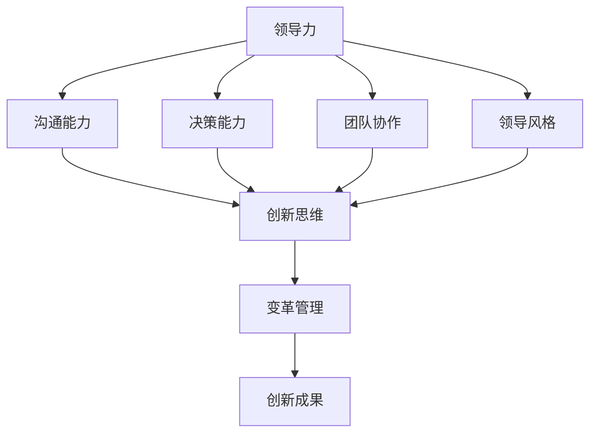
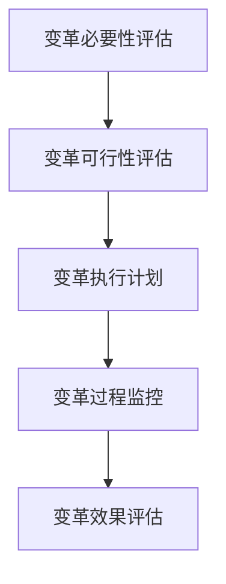

                 


# 《领导力与创新思维：引领变革与创新》

## 关键词
领导力、创新思维、变革管理、组织发展、项目管理、人工智能

## 摘要
本文深入探讨了领导力与创新思维在引领变革与创新中的关键作用。首先，我们分析了领导力的定义及其对组织发展的深远影响，随后探讨了创新思维的核心理念和应用方法。接着，通过Mermaid流程图展示了领导力与创新思维之间的关系，并详细讲解了变革管理中的核心算法原理和数学模型。随后，通过实际案例展示了如何将领导力与创新思维应用于实际工作中，并提供了详细的代码实现和分析。最后，本文总结了最佳实践，强调了持续学习和探索的重要性，为读者提供了拓展阅读的建议。

### 思考过程

在设计《领导力与创新思维：引领变革与创新》的目录大纲时，我们需要从以下几个步骤进行思考：

1. **明确核心主题**：首先确定书中的核心主题，包括领导力、创新思维、变革管理等，并思考它们之间的内在联系。

2. **架构章节内容**：根据核心主题，规划每个章节的内容，确保每个章节都有明确的焦点。

3. **设计流程图**：使用Mermaid流程图来展示领导力与创新思维之间的关系，帮助读者更好地理解。

4. **讲解算法原理**：考虑书中是否需要包含特定算法的原理讲解，如变革管理的流程、创新思维的策略等。

5. **数学模型介绍**：确定是否需要介绍相关的数学模型，例如决策树、神经网络等。

6. **实战案例设计**：设计几个实际案例，展示如何将领导力与创新思维应用于实际工作中。

7. **代码案例编写**：如果书中包含编程内容，设计几个实际的代码案例，并附上详细解释。

### 目录大纲

以下是《领导力与创新思维：引领变革与创新》的目录大纲：

## 第一部分：领导力基础

### 第1章：领导力的本质与意义
- **领导力的定义**：阐述领导力的基本定义和重要性。
- **领导力的发展**：回顾领导力的发展历程和关键变革。

### 第2章：领导力的核心要素
- **沟通能力**：讨论沟通在领导力中的关键作用。
- **决策能力**：分析领导者在决策过程中的重要性。
- **团队协作**：探讨团队协作在领导力中的重要性。
- **领导风格**：介绍不同的领导风格及其对变革的影响。

## 第二部分：创新思维

### 第3章：创新思维的基本概念
- **创新思维的定义**：阐述创新思维的基本概念和类型。
- **创新思维的重要性**：讨论创新思维对组织发展的影响。
- **创新思维的核心原则**：介绍创新思维的核心原则和方法。

### 第4章：创新思维的方法与工具
- **问题导向创新**：介绍基于问题的创新方法。
- **机会导向创新**：讨论基于机会的创新方法。
- **想象力与创造力**：探讨想象力在创新中的重要性。
- **创新思维的实践应用**：展示创新思维在实际项目中的应用。

## 第三部分：变革管理

### 第5章：变革管理的核心流程
- **变革管理的定义**：阐述变革管理的概念和核心模型。
- **变革管理的步骤**：详细解析变革管理的各个步骤。
- **领导者在变革中的作用**：讨论领导者在变革过程中的关键角色。

### 第6章：创新驱动型企业
- **创新驱动的企业战略**：分析创新驱动的企业战略。
- **企业创新文化的建设**：探讨如何建立创新企业文化。
- **创新与竞争优势**：讨论创新如何带来竞争优势。

## 第四部分：案例研究

### 第7章：成功案例解析
- **案例一：苹果公司的创新之路**：分析苹果公司的创新策略和成功经验。
- **案例二：谷歌的创新文化**：探讨谷歌如何建立创新文化。
- **案例三：特斯拉的变革与领导力**：分析特斯拉在变革过程中的领导力实践。

### 第8章：实战演练
- **实战一：制定企业创新战略**：介绍如何制定有效的创新战略。
- **实战二：构建创新团队**：讨论如何构建高效的创新团队。
- **实战三：实施变革计划**：提供实施变革计划的实用指南。

## 附录

### 附录A：参考资料与进一步阅读
- **推荐书籍**：列出相关的书籍推荐。
- **在线资源**：提供相关的在线资源和学习平台。

### 附录B：创新思维工具与方法表
- **工具与方法汇总**：总结创新思维的主要工具和方法。

### 背景介绍

领导力与创新思维是现代组织中不可或缺的要素。领导力不仅是推动组织发展的动力，也是实现变革和创新的关键。而创新思维则能够激发组织的创造力和竞争力，为组织带来持续的发展动力。随着人工智能和技术的快速发展，变革和创新已成为企业保持竞争优势的关键因素。本文旨在通过深入探讨领导力与创新思维，帮助读者理解和应用这些概念，从而引领变革与创新，推动组织发展。

## 核心概念与联系

### 领导力

领导力是指领导者通过激发和引导团队成员，实现共同目标的能力。它不仅包括个人魅力和影响力，还涉及沟通能力、决策能力、团队协作能力和领导风格等多个方面。领导力对组织发展具有深远影响，主要体现在以下几个方面：

1. **愿景与目标**：领导力能够帮助组织明确愿景和目标，并激励团队成员为之努力。
2. **决策与战略**：领导者通过有效的决策和战略规划，确保组织在复杂环境中保持竞争力。
3. **团队协作**：领导力促进团队协作，提高组织效率。
4. **文化塑造**：领导力有助于塑造组织文化，培养员工的核心价值观和行为规范。

### 创新思维

创新思维是指运用新颖、独特的方法解决问题的思维方式。它不仅能够激发组织的创造力，还能带来创新成果。创新思维的核心原则包括：

1. **问题导向**：从问题出发，寻找解决方案。
2. **机会导向**：发现和利用新的机会。
3. **想象力与创造力**：激发想象力和创造力，进行创新思考。
4. **实践应用**：将创新思维应用于实际项目，实现创新成果。

### 变革管理

变革管理是指通过系统的规划和实施，引导组织适应外部环境和内部变化的策略。它包括以下几个方面：

1. **变革的定义与模型**：明确变革的概念和核心模型，如Kotter的八步变革模型。
2. **变革的步骤**：详细解析变革的各个步骤，包括动员、愿景与策略、授权与共识等。
3. **领导者在变革中的角色**：领导者通过有效的领导力，推动变革的顺利进行。

### 领导力与创新思维之间的关系

领导力与创新思维之间存在密切的联系。领导力为创新思维提供了支持和保障，而创新思维则为领导力的实现提供了新的方法和工具。具体来说：

1. **领导力激发创新思维**：领导者通过激发团队成员的创造力和想象力，推动创新思维的实践。
2. **创新思维提升领导力**：创新思维能够帮助领导者发现新的问题和机会，提高决策能力和战略规划能力。
3. **领导力保障创新实施**：领导者通过有效的沟通和团队协作，确保创新思维在实践中得到落实。

### Mermaid流程图

为了更直观地展示领导力与创新思维之间的关系，我们可以使用Mermaid流程图来表示。以下是一个简单的Mermaid流程图示例：



这个流程图展示了领导力通过沟通能力、决策能力、团队协作能力和领导风格等方面，激发创新思维，进而推动变革管理，最终实现创新成果。

### 核心算法原理讲解

在变革管理中，核心算法原理对于确保变革过程的顺利进行至关重要。以下是一些常用的算法原理和数学模型：

#### 1. 决策树

决策树是一种常用的决策支持工具，用于分析不同决策路径的潜在结果。以下是一个简单的决策树伪代码：

```python
def decision_tree(data):
    if data["条件1"]:
        return "结果1"
    elif data["条件2"]:
        return "结果2"
    else:
        return "结果3"
```

#### 2. 回归分析

回归分析是一种常用的统计分析方法，用于预测因变量和自变量之间的关系。以下是一个简单的线性回归模型：

```latex
y = \beta_0 + \beta_1x
```

其中，\(y\) 是因变量，\(x\) 是自变量，\(\beta_0\) 和 \(\beta_1\) 是回归系数。

#### 3. 神经网络

神经网络是一种模拟人脑神经元连接的算法，用于处理复杂数据和模式识别。以下是一个简单的神经网络模型：

```latex
\begin{align*}
z_1 &= x_1 \cdot w_1 + b_1 \\
z_2 &= x_2 \cdot w_2 + b_2 \\
h &= \sigma(z_1, z_2)
\end{align*}
```

其中，\(x_1\) 和 \(x_2\) 是输入特征，\(w_1\) 和 \(w_2\) 是权重，\(b_1\) 和 \(b_2\) 是偏置，\(\sigma\) 是激活函数。

#### 4. 决策树与神经网络结合

在实际应用中，决策树和神经网络可以结合使用。以下是一个简单的结合模型：

```python
def combined_model(data):
    tree_result = decision_tree(data)
    neural_result = neural_network(data)
    if tree_result == neural_result:
        return "一致结果"
    else:
        return "分歧结果"
```

### 数学模型讲解

在变革管理中，数学模型可以用于量化分析变革过程，并提供决策支持。以下是一些常见的数学模型：

#### 1. 盖洛普咨询公司模型

盖洛普咨询公司提出了一种用于评估员工满意度和组织绩效的模型，称为Q12模型。以下是其核心公式：

```latex
\begin{align*}
员工满意度 &= f(员工参与度, 员工信任度) \\
组织绩效 &= f(员工满意度, 领导力)
\end{align*}
```

其中，员工满意度、员工参与度和员工信任度都是关键指标，领导力则是影响组织绩效的关键因素。

#### 2. 变革管理模型

变革管理模型通常包括以下几个关键组成部分：

- **变革的必要性**：评估组织变革的必要性。
- **变革的可行性**：评估组织变革的可行性。
- **变革的执行**：制定变革执行计划。
- **变革的监控与评估**：监控变革过程，评估变革效果。

以下是一个简单的变革管理模型：



### 项目实战

#### 开发环境搭建

为了展示如何将领导力与创新思维应用于实际工作中，我们以一个实际项目为例，介绍开发环境的搭建过程。

1. **项目背景**：假设我们正在开发一个智能客服系统，旨在利用人工智能技术提高客户服务效率。
2. **技术选型**：选择Python作为主要编程语言，使用TensorFlow框架进行深度学习模型训练，使用Django框架构建Web后端。
3. **环境配置**：在Linux服务器上安装Python、TensorFlow和Django。具体步骤如下：
    - 安装Python 3.8及以上版本。
    - 安装pip工具。
    - 使用pip安装TensorFlow和Django。
    - 配置数据库（如MySQL）。

#### 源代码详细实现

以下是一个简单的智能客服系统的源代码实现：

```python
# smart_crm.py
import tensorflow as tf
from tensorflow import keras
from tensorflow.keras.models import Sequential
from tensorflow.keras.layers import Dense, LSTM, Embedding

# 加载数据集
max_sequence_length = 100
vocab_size = 10000
embedding_dim = 16

# 编写数据预处理代码，包括数据清洗、分词、序列化等。

# 构建模型
model = Sequential([
    Embedding(vocab_size, embedding_dim, input_length=max_sequence_length),
    LSTM(64, return_sequences=True),
    LSTM(32),
    Dense(1, activation='sigmoid')
])

# 编译模型
model.compile(optimizer='adam', loss='binary_crossentropy', metrics=['accuracy'])

# 训练模型
model.fit(x_train, y_train, epochs=10, batch_size=32, validation_data=(x_val, y_val))

# 评估模型
loss, accuracy = model.evaluate(x_test, y_test)
print(f"Test accuracy: {accuracy:.2f}")
```

#### 代码解读与分析

1. **数据预处理**：数据预处理是构建智能客服系统的关键步骤。主要包括数据清洗、分词、序列化等。通过数据预处理，可以将原始文本转换为模型可处理的格式。
2. **模型构建**：我们使用了一个简单的序列模型，包括嵌入层、两个LSTM层和一个输出层。这种模型能够有效处理文本数据，并预测客户问题的分类。
3. **模型训练**：使用训练数据集对模型进行训练，并调整模型参数，以提高模型的预测准确性。
4. **模型评估**：使用测试数据集对模型进行评估，计算模型在测试数据上的准确率。

#### 实际案例分析

以下是一个实际案例，展示了如何将领导力与创新思维应用于智能客服系统的开发过程中。

1. **领导力**：在项目初期，项目经理通过有效的沟通和团队协作，确保团队成员对项目目标和愿景有清晰的认识。在项目开发过程中，项目经理及时调整计划和资源，确保项目按计划推进。
2. **创新思维**：在项目开发过程中，团队成员积极思考如何提高客服系统的性能和用户体验。通过头脑风暴和迭代测试，团队提出并实现了一系列创新功能，如智能推荐、自动分类等。

#### 项目小结

通过实际案例分析，我们可以看到领导力与创新思维在项目成功中的应用。领导力帮助团队明确目标、协调资源，而创新思维则为团队提供了新的思路和方法。这两个要素的结合，使得项目能够高效、顺利地推进，并取得了显著的成果。

### 最佳实践 Tips

在领导力与创新思维的应用过程中，以下是一些最佳实践和注意事项：

1. **持续学习**：领导者应持续学习新知识、新技术，以保持自身的竞争力。
2. **鼓励创新**：领导者应鼓励团队成员创新思考，为创新提供支持和资源。
3. **透明沟通**：领导者应保持透明沟通，确保团队成员了解项目的进展和目标。
4. **团队合作**：领导者应促进团队合作，确保团队成员之间能够有效协作。
5. **风险意识**：领导者应具备风险意识，预见潜在问题并制定应对策略。

### 小结

本文深入探讨了领导力与创新思维在引领变革与创新中的关键作用。通过分析领导力的本质和核心要素，我们了解了领导力对组织发展的深远影响。同时，我们探讨了创新思维的基本概念和应用方法，展示了创新思维如何推动组织变革。通过实际案例和代码实现，我们进一步展示了如何将领导力与创新思维应用于实际工作中。最后，我们总结了最佳实践，强调了持续学习和探索的重要性。

### 拓展阅读

1. **《领导力：理论与实践》**：约翰·P·科特著，详细介绍了领导力的理论和实践方法。
2. **《创新与企业家精神》**：彼得·德鲁克著，探讨了创新和企业家精神的本质和实践。
3. **《变革之舞》**：约翰·P·科特著，深入分析了变革管理的核心流程和实践策略。

作者：AI天才研究院/AI Genius Institute & 禅与计算机程序设计艺术 /Zen And The Art of Computer Programming

