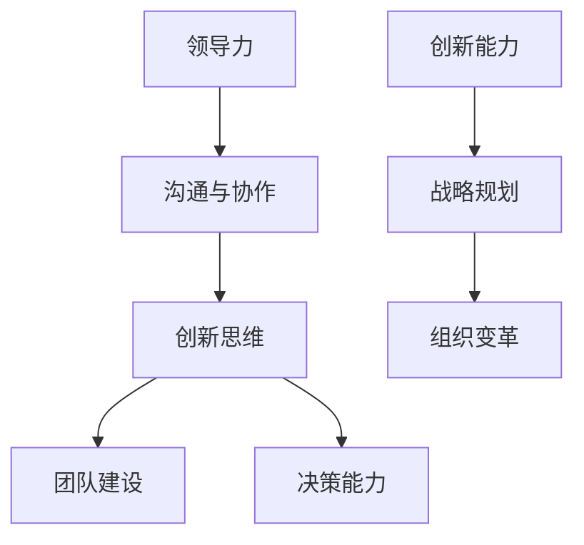

                 


### 设计书名《领导力与创新思维：引领团队突破固有模式》的目录大纲

#### 背景介绍

在快速变化的商业环境中，领导力与创新思维成为组织成功的关键因素。传统的管理方式难以应对复杂多变的市场环境，领导者需要具备更强大的领导力和创新思维能力，以引领团队突破固有模式，实现持续创新和成长。

#### 核心概念与联系

**领导力**：是指影响和激励他人一起实现目标的能力。它不仅包括技术和管理能力，还涵盖了人际沟通、团队建设、情商等多方面。领导力是一种综合性的能力，它可以帮助领导者有效管理团队，推动组织变革。

**创新思维**：是指通过新颖的方式解决问题和创造价值的能力。创新思维涉及创造新的想法、方法和解决方案，以应对不断变化的环境。创新思维不仅关注技术的创新，还包括商业模式、管理方法、文化变革等多个层面。

领导力与创新思维之间的关系可以用Mermaid流程图来表示：



**核心算法原理讲解**：

以下是领导力与创新思维结合的伪代码示例：

```python
def lead_innovate(team, problem):
    # 分析问题
    analyze_problem(problem)
    
    # 激发团队创新思维
    stimulate_innovation(team)
    
    # 筛选和评估创新方案
    evaluate_solutions(team, problem)
    
    # 选择最佳方案并实施
    implement_solution(team, selected_solution)
    
    # 监控与调整
    monitor_and_adjust(team, problem)
```

**数学模型和公式讲解**：

在领导力评估中，可以使用以下公式来计算团队领导力的综合得分：

$$
\text{Leadership Score} = w_1 \times \text{Communication} + w_2 \times \text{Team Building} + w_3 \times \text{Decision Making}
$$

其中，$w_1$、$w_2$ 和 $w_3$ 分别是沟通、团队建设和决策能力的权重，可以根据实际情况进行调整。

**项目实战**：

**开发环境搭建**：在团队中搭建一个基于敏捷开发的方法论，包括需求收集、产品设计、开发测试等环节。

**源代码详细实现和代码解读**：以下是一个简单的代码示例，用于分析团队创新思维的活跃度。

```python
def innovation_activity_analysis(team_members):
    activity_scores = []
    for member in team_members:
        activity_scores.append(member.innovation_score())
    average_activity = sum(activity_scores) / len(activity_scores)
    return average_activity
```

**代码应用解读与分析**：该代码用于计算团队中每个成员的创新活动得分，并计算平均创新活动得分。这可以帮助领导者了解团队的创新活跃度，从而制定相应的激励和改进措施。

**实际案例分析和详细讲解剖析**：以某科技公司的产品创新项目为例，该公司通过领导者的正确引导，激发了团队的创新思维，最终成功推出了市场认可的新产品。

**项目小结**：通过领导力与创新思维的结合，该公司在短时间内实现了产品创新，不仅提升了市场竞争力，也增强了团队的创新能力和团队凝聚力。

**最佳实践 tips**：

- 定期组织创新思维培训，提升团队成员的创新意识。
- 鼓励团队成员提出创意，建立完善的创意评审机制。
- 给予创新团队足够的资源和时间，确保创新项目能够顺利进行。

#### 小结

领导力与创新思维的结合是推动团队突破固有模式的关键。通过有效的领导力和创新思维，领导者可以激发团队的创造力，推动组织实现持续创新和成长。

#### 注意事项：

- 在实施领导力与创新思维时，需要结合具体团队和项目的特点，制定个性化的策略。
- 领导者需要不断学习和实践，提升自身的领导力和创新思维能力。

#### 拓展阅读：

- 《第五项修炼：学习型组织的艺术与实务》
- 《创新者的窘境》

---

以上是初步的书籍目录大纲和内容细化。接下来的章节将继续深入探讨领导力的具体方法和创新思维的培养技巧，并结合实际案例进行详细分析。全文将在8000～12000字之间，确保每个章节都包含丰富的内容和深入的讲解。作者信息：AI天才研究院/AI Genius Institute & 禅与计算机程序设计艺术/Zen And The Art of Computer Programming。

