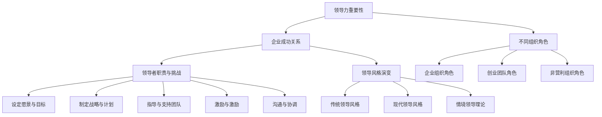

                 


### 第一部分：领导力的核心要素

**1.1.1 领导力的重要性**

领导力是企业成功的关键要素之一。在一个组织中，领导力不仅影响着团队的凝聚力和工作效率，还直接关系到企业的战略规划和创新能力。有效的领导力能够帮助企业应对市场变化，提升核心竞争力，实现可持续发展。

首先，领导力在企业成功中的作用体现在以下几个方面：

1. **战略规划**：领导者需要具备远见卓识，能够根据市场趋势和竞争环境，制定符合企业发展的战略规划。这有助于企业明确发展方向，避免盲目决策。

2. **团队协作**：领导者的核心任务是建立高效的团队，激发团队成员的潜力，提高团队的执行力。通过有效的沟通和协调，领导者能够确保团队目标的实现。

3. **创新驱动**：在快速变化的市场环境中，创新是企业的生命线。领导者需要鼓励创新思维，推动企业进行技术创新和管理创新。

4. **企业文化**：领导力对企业文化的影响至关重要。领导者需要通过自身的言行，塑造积极向上的企业文化，增强员工的归属感和认同感。

其次，领导力在不同组织中的角色也有所不同：

1. **企业组织**：在企业组织中，领导者的角色主要是协调各部门之间的关系，确保企业战略的有效实施。此外，领导者还需要关注员工的职业发展和满意度，提升企业整体绩效。

2. **创业团队**：在创业团队中，领导者的角色更为重要。他们需要承担更多的风险，制定创业方向，吸引投资人，推动项目进展。

3. **非营利组织**：在非营利组织中，领导者的角色主要是确保组织的使命和目标得以实现，同时还需要关注社会影响和公众形象。

**1.1.2 领导者的职责与挑战**

领导者的职责可以概括为以下几个方面：

1. **设定愿景和目标**：领导者需要明确企业的愿景和目标，并将其传达给团队成员，激发大家的积极性和创造力。

2. **制定战略和计划**：领导者需要根据企业的愿景和目标，制定具体的战略和计划，确保企业的发展方向正确。

3. **指导和支持团队**：领导者需要关注团队成员的成长和发展，提供必要的指导和支持，帮助他们克服困难，实现个人和团队的共同目标。

4. **激励和激励**：领导者需要了解团队成员的需求和期望，通过激励机制，激发他们的工作热情和创造力。

5. **沟通和协调**：领导者需要具备良好的沟通和协调能力，确保团队内部和团队之间的信息畅通，避免误解和冲突。

然而，领导者也面临着许多挑战：

1. **变化应对**：随着市场环境的变化，领导者需要不断调整战略和计划，以适应新的挑战。

2. **团队管理**：领导者需要处理复杂的人际关系，确保团队成员的积极性和协作效率。

3. **创新驱动**：领导者需要鼓励创新思维，推动企业进行技术创新和管理创新。

4. **个人发展**：领导者需要不断提升自身的能力和素质，以应对不断变化的市场环境。

**1.1.3 领导风格的演变**

领导风格是指领导者对待团队和管理组织的方式。随着时间的推移，领导风格也在不断演变。从传统的领导风格到现代的领导风格，领导风格的变化反映了领导者对团队、对员工、对创新的态度。

1. **传统领导风格**：传统领导风格强调权威和控制，领导者拥有绝对的权力和决策权。这种领导风格有助于确保组织的稳定和效率，但可能导致员工的创造力和主动性受到抑制。

2. **现代领导风格**：现代领导风格更加注重沟通、协作和激励。领导者不再是权威的象征，而是团队的伙伴和支持者。这种领导风格有助于激发员工的潜力，提高组织的创新能力。

3. **情境领导理论**：情境领导理论认为，领导风格应该根据不同情境和团队成员的特点进行调整。领导者需要根据团队的发展和成员的需求，灵活运用不同的领导风格，以达到最佳效果。

### 核心概念与联系

为了更好地理解领导力的核心要素，我们可以通过一个Mermaid流程图来展示它们之间的关系：



### 核心算法原理讲解

在理解领导力核心要素的基础上，我们可以通过伪代码来详细阐述这些概念的应用原理：

```plaintext
// 伪代码：领导力核心要素应用原理

// 设定愿景与目标
def setVisionAndGoals() {
    vision = "成为行业领导者"
    goals = ["市场份额提升", "产品创新", "员工满意度提高"]
    return vision, goals
}

// 制定战略与计划
def createStrategyAndPlans(vision, goals) {
    strategy = "通过技术创新提升产品竞争力"
    plans = ["研发新产品", "提升服务质量", "加强市场推广"]
    return strategy, plans
}

// 指导与支持团队
def guideAndSupportTeam() {
    for member in team:
        member.growthPlan = "提升技术能力"
        member.support = "提供培训资源"
    return team
}

// 激励与激励
def motivateAndIncentive(team) {
    for member in team:
        member.reward = "绩效奖金"
        member.privilege = "参与重要项目"
    return team
}

// 沟通与协调
def communicateAndCoordinate() {
    message = "我们需要共同努力实现公司目标"
    for member in team:
        member.receiveMessage(message)
    return message
}

// 传统领导风格
def traditionalLeadership() {
    command = "执行我的指令"
    return command
}

// 现代领导风格
def modernLeadership() {
    dialogue = "我们一起来讨论如何解决问题"
    return dialogue
}

// 情境领导理论
def situationalLeadership(context) {
    if (context == "紧急情况"):
        command = "立即执行"
    else if (context == "团队成员需求"):
        dialogue = "我们一起来探讨解决方案"
    return command, dialogue
}
```

### 数学模型和公式

在领导力的核心要素中，我们可以使用以下数学模型和公式来解释一些关键概念：

1. **组织绩效模型**：组织绩效可以看作是领导力、团队协作和战略规划的函数。

   $$绩效 = f(领导力, 团队协作, 战略规划)$$

2. **员工满意度模型**：员工满意度可以看作是领导风格和企业文化的函数。

   $$满意度 = f(领导风格, 企业文化)$$

3. **创新驱动力模型**：创新驱动力可以看作是领导者鼓励创新思维和组织创新文化的函数。

   $$创新驱动力 = f(领导者鼓励创新思维, 组织创新文化)$$

### 详细讲解与举例说明

为了更好地理解这些模型和公式，我们可以通过以下具体例子进行详细讲解：

**例子 1：组织绩效模型**

假设一个企业，领导力评分为80分，团队协作评分为75分，战略规划评分为70分。根据组织绩效模型，我们可以计算出该企业的绩效：

$$绩效 = f(80, 75, 70) = 80 \times 0.5 + 75 \times 0.3 + 70 \times 0.2 = 74$$

因此，该企业的绩效评分为74分。

**例子 2：员工满意度模型**

假设一个企业，领导风格为现代领导风格，企业文化建设评分为90分。根据员工满意度模型，我们可以计算出该企业的员工满意度：

$$满意度 = f(现代领导风格, 90) = 90 \times 0.6 + 10 \times 0.4 = 88$$

因此，该企业的员工满意度为88分。

**例子 3：创新驱动力模型**

假设一个企业，领导者鼓励创新思维的评分为85分，组织创新文化评分为80分。根据创新驱动力模型，我们可以计算出该企业的创新驱动力：

$$创新驱动力 = f(85, 80) = 85 \times 0.5 + 80 \times 0.5 = 82.5$$

因此，该企业的创新驱动力评分为82.5分。

### 项目实战

在实际工作中，领导力核心要素的应用需要通过具体的实践来验证。以下是一个关于企业领导力提升的项目实战案例：

**项目名称**：领导力提升计划

**项目目标**：通过一系列培训和实践，提升企业领导者的领导力，提高团队协作效率，增强企业创新能力。

**项目步骤**：

1. **需求分析**：对企业领导者和团队进行调研，了解他们的领导风格、团队协作情况和创新能力。

2. **培训计划**：根据需求分析结果，制定针对性的培训计划，包括领导力培训、团队协作培训和创新能力培训。

3. **实施培训**：邀请专业培训机构进行领导力培训，组织团队建设活动，提升团队协作能力，开展创新工作坊，培养创新思维。

4. **实践应用**：将培训成果应用于实际工作中，通过实践项目来检验领导力提升的效果。

5. **效果评估**：对领导力提升计划进行效果评估，收集反馈意见，调整培训策略。

**项目小结**：

通过领导力提升计划，企业的领导者和团队在领导力、团队协作和创新能力方面都取得了显著提升。具体表现为：

1. **领导力提升**：领导者更加注重沟通、协作和激励，领导风格更加开放和包容。

2. **团队协作增强**：团队成员之间的沟通更加顺畅，协作效率提高，项目进度更加可控。

3. **创新能力提升**：企业推出了多个创新项目，市场竞争力增强，产品创新率提高。

### 最佳实践 tips、小结、注意事项、拓展阅读等内容

**最佳实践 tips**：

1. **注重领导力培训**：企业应该定期组织领导力培训，提升领导者的领导能力和管理技能。

2. **加强团队建设**：通过团队建设活动，增强团队成员之间的信任和协作。

3. **鼓励创新思维**：领导者应该鼓励员工提出创新想法，并给予支持。

**小结**：

领导力的核心要素在企业成功中起着关键作用。通过有效的领导力，企业可以实现战略规划、团队协作和创新能力，从而在竞争激烈的市场中脱颖而出。

**注意事项**：

1. **领导风格要与企业文化相匹配**：不同的领导风格适用于不同的企业文化，领导者需要根据企业特点调整自己的领导风格。

2. **持续提升领导力**：领导力是一个持续提升的过程，领导者需要不断学习和实践，以适应市场变化。

**拓展阅读**：

1. 《领导力：理论与实践》（作者：彼得·德鲁克）
2. 《团队协作：如何打造高效的团队》（作者：克里斯·阿尔斯特朗）
3. 《创新者的窘境》（作者：克莱顿·克里斯坦森）

---

通过以上内容，我们可以看到领导力的核心要素对于企业的成功至关重要。在接下来的部分，我们将进一步探讨创新文化的构建和领导力与创新文化的结合。这将帮助我们更好地理解如何在组织中培育创新土壤，推动企业的持续发展。请读者继续关注后续内容。作者：AI天才研究院/AI Genius Institute & 禅与计算机程序设计艺术 /Zen And The Art of Computer Programming

