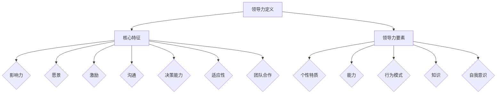

                 

### 引言

在现代科技飞速发展的背景下，领导力和创新管理成为了企业竞争力和可持续发展的重要保障。领导力不仅是企业管理者的核心能力，更是推动组织创新和变革的关键因素。创新管理则涉及到如何有效地激发和利用创新资源，将创意转化为实际成果。本文旨在深入探讨领导力与创新管理的关系，从创意的产生到实施的各个环节，分析如何通过提升领导力来促进创新管理的有效运作。

首先，我们将从领导力的核心概念与特征出发，介绍领导力的定义、重要性及其在团队和组织中的核心价值。接着，探讨创新管理的理念与实践，阐述创新管理的定义、作用以及流程与策略。在此基础上，本文将详细分析领导力在创新过程中的角色与作用，以及面对创新管理中的挑战如何应对。进一步地，我们将探讨领导力与创新管理的未来趋势，预测其发展方向和可能的应用前景。最后，通过实践案例分析，总结领导力与创新管理的最佳实践，为实际操作提供指导。

本文将使用逻辑清晰、结构紧凑、简单易懂的技术语言，结合Mermaid流程图、伪代码和LaTeX公式，详细阐述核心概念、算法原理、数学模型和实践应用。希望通过本文的探讨，能够为IT领域的从业者提供有价值的参考和启示，助力他们在领导力和创新管理方面取得更大成就。

### 关键词

- 领导力
- 创新管理
- 创新思维
- 领导风格
- 领导者特质
- 创新项目
- 创新文化
- 风险管理
- 智能领导力
- 数字化领导力

### 摘要

本文从领导力和创新管理的核心概念出发，系统地探讨了两者之间的关系及其在现代社会中的重要性。首先，介绍了领导力的定义和特征，分析了其在团队和组织中的核心价值。接着，阐述了创新管理的理念、流程与策略，并探讨了领导力在创新过程中的关键作用。随后，分析了创新管理中常见的挑战及应对策略。本文还展望了领导力与创新管理的未来趋势，预测其发展方向和应用前景。最后，通过实际案例分析，总结了领导力与创新管理的最佳实践，为读者提供了实用的指导。

### 领导力的核心概念与特征

领导力作为推动组织变革和创新的核心要素，其定义和重要性在学术界和管理实践中有着广泛的研究和探讨。在历史上，领导力理论经历了从早期关注领导者的个人特质，到现代强调领导行为和情境影响的转变。当前，领导力被普遍定义为一种影响他人并引导他们实现共同目标的能力。

首先，我们需要了解领导力的核心特征。领导力的特征主要包括：

1. **影响力（Influence）**：领导者通过言行和行动影响他人的态度和行为，从而实现团队和组织的目标。这种影响力不仅体现在决策过程中，还渗透在日常工作和管理中。

2. **愿景（Vision）**：领导者需要有清晰而鼓舞人心的愿景，能够将个人和组织的愿景相结合，并激发团队成员的积极性和创造力。

3. **激励（Motivation）**：领导者的一个重要职责是激励团队成员，通过正面的反馈和奖励机制，增强团队成员的工作动力和忠诚度。

4. **沟通（Communication）**：有效的沟通能力是领导者成功的关键。领导者需要能够清晰表达自己的想法，同时也需要倾听和理解团队成员的意见和需求。

5. **决策能力（Decision-making）**：领导者需要具备果断的决策能力，能够在复杂和不确定的环境中做出明智的决策。

6. **适应性（Adaptability）**：在快速变化的商业环境中，领导者需要具备高度的适应性，能够灵活应对变化，并引导团队进行必要的调整和转型。

7. **团队合作（Teamwork）**：领导者需要促进团队合作，通过构建协作性的团队文化和建立信任关系，提升团队的整体绩效。

接下来，我们来看一下领导力的要素。领导力的要素主要包括以下几个方面：

1. **个性特质（Personal Traits）**：领导者的个性特质如自信、坚韧、诚实和热情，对于领导力的发挥有重要影响。

2. **能力（Skills）**：领导者的能力包括技术技能、人际交往技能和概念技能。技术技能涉及具体领域的知识和操作能力；人际交往技能涉及与团队成员的沟通和协作；概念技能涉及对复杂问题和战略方向的把握。

3. **行为模式（Behaviors）**：领导者的行为模式包括领导风格和行为策略。领导风格如民主型、专制型和参与型，直接影响领导效果；行为策略如目标设定、激励和反馈，有助于实现领导目标。

4. **知识（Knowledge）**：领导者需要具备广泛的知识储备，包括行业知识、管理知识和心理学知识等，以便更好地理解和解决团队和组织中的问题。

5. **自我意识（Self-awareness）**：领导者需要具备自我意识，了解自己的优势和不足，以及如何在不同情境下调整自己的行为和策略。

为了更直观地理解领导力的核心概念和特征，我们可以通过一个Mermaid流程图来展示这些要素之间的关系：



通过这个流程图，我们可以清晰地看到领导力的核心概念和特征之间的关系，以及它们如何共同作用，推动组织的创新和发展。

### 创新管理的理念与实践

创新管理是组织在动态和竞争激烈的市场环境中保持持续竞争优势的关键策略。其核心理念是通过有效管理和激发创新资源，实现从创意到实际成果的转化。创新管理不仅关注新技术的研发和应用，还包括商业模式、管理流程等各个方面的创新。

首先，我们需要明确创新管理的定义。创新管理是一种系统性方法，旨在识别、培育、实施和管理创新活动，以推动组织持续发展。它涉及从创意的产生到产品化、市场推广的全过程，强调通过创新实现商业价值和社会价值的双赢。

创新管理的作用体现在以下几个方面：

1. **提升竞争力**：通过不断创新，组织可以持续推出具有竞争力的产品和服务，满足市场和客户的需求，从而在激烈的市场竞争中脱颖而出。

2. **推动增长**：创新管理可以激发组织的创造力和活力，带动业务增长，实现可持续发展。

3. **优化管理流程**：通过引入新的管理理念和方法，优化组织内部的管理流程，提高工作效率和资源利用率。

4. **提升员工满意度**：创新管理可以激发员工的积极性和创造力，提高员工的职业满意度和忠诚度。

创新管理的流程通常包括以下几个阶段：

1. **创意产生**：这是创新管理的起点，通过头脑风暴、市场调研、用户反馈等方式，收集和筛选创意。

2. **创意评估**：对收集到的创意进行筛选和评估，判断其可行性、市场前景和潜在风险。

3. **创意开发**：将评估通过的创意转化为具体的产品或服务概念，进行初步设计和开发。

4. **产品化**：将创意开发转化为实际产品或服务，通过市场测试和反馈进行优化和调整。

5. **市场推广**：将产品或服务推向市场，通过营销和推广活动，提高市场认知度和用户接受度。

6. **持续改进**：在产品上市后，通过用户反馈和数据分析，不断进行改进和优化，确保产品的长期竞争力。

在创新管理过程中，策略的制定和实施至关重要。以下是一些关键的创新管理策略：

1. **资源投入**：确保创新项目有充足的资源支持，包括资金、人力和技术资源。

2. **风险管理**：通过制定风险管理计划，识别和评估创新项目的潜在风险，并采取相应的风险控制措施。

3. **组织文化**：构建支持创新的组织文化，鼓励员工提出创意，并对创新活动给予积极的反馈和支持。

4. **激励机制**：建立有效的激励机制，奖励创新成果和优秀创新者，激发员工的创新动力。

5. **跨部门合作**：促进不同部门之间的合作和知识共享，形成协同创新的格局。

6. **用户参与**：在创新过程中积极引入用户参与，通过用户反馈和市场测试，不断优化产品或服务。

创新管理的实践方法多种多样，以下是一些常用的方法：

1. **头脑风暴**：通过集体讨论和思维碰撞，激发创意的产生。

2. **TRIZ方法**：TRIZ（理论解决发明问题）是一种基于问题解决原理的创新方法，通过系统化的问题分析，找到创新的解决方案。

3. **设计思维**：设计思维是一种以人为本的创新方法，强调通过用户研究和用户反馈，开发出用户真正需要的产品和服务。

4. **敏捷开发**：在产品开发过程中，采用敏捷开发方法，快速迭代和反馈，确保产品能够及时适应市场和用户需求的变化。

5. **开放式创新**：通过外部合作和资源整合，引入外部创新资源，提升创新效率。

通过以上对创新管理理念、流程和策略的阐述，我们可以看到，创新管理不仅需要系统的理论和方法支持，更需要在实践中灵活运用，以实现组织的持续创新和竞争优势。

### 创新管理的流程与策略

创新管理的有效实施依赖于系统的流程和策略。一个完善的创新管理流程可以帮助组织从创意的产生、评估到最终的实现和推广，确保创新活动的高效和有序进行。以下将详细阐述创新管理的各个环节，以及关键策略和方法。

#### 创意产生

创意产生是创新管理的起点，也是最具创造性和不确定性的阶段。在这个阶段，组织需要通过多种方法激发员工的创新思维，收集潜在的创意。

1. **头脑风暴**：头脑风暴是一种常用的创意收集方法，通过集体讨论，自由提出各种想法，不进行任何批评和评价，从而激发创新思维。

2. **用户调研**：通过直接与用户交流，了解用户的需求、痛点和偏好，从而产生具有实际应用价值的创意。

3. **竞争分析**：分析竞争对手的产品和服务，从中发现机会和改进空间，为创意的产生提供参考。

4. **跨界思维**：鼓励员工跨越专业和领域的界限，借鉴其他行业或领域的创新经验，进行跨学科的创新。

#### 创意评估

在创意产生后，需要对创意进行评估，筛选出具有可行性和商业价值的创意。评估主要包括以下几个方面：

1. **市场潜力**：评估创意的市场需求、市场规模和潜在的市场增长率。

2. **技术可行性**：分析创意实现的技术难度、所需的技术资源和时间成本。

3. **商业价值**：评估创意对组织业务增长的贡献、潜在的经济效益和社会影响力。

4. **风险分析**：识别创意实施过程中可能遇到的风险，包括技术风险、市场风险、政策风险等。

一个常用的评估方法是多因素评分法，通过为每个评估维度设定权重，对创意进行综合评分，从而筛选出最具有潜力的创意。

#### 创意开发

在评估通过的创意进入开发阶段后，需要通过系统化的方法将其转化为实际的产品或服务。

1. **概念验证**：在创意开发初期，通过简单的原型或实验，验证创意的基本可行性和功能。

2. **初步设计**：根据验证结果，进行详细的设计和开发计划，包括功能定义、技术方案和开发时间表。

3. **开发测试**：在开发过程中，进行持续的功能测试和性能测试，确保产品或服务的稳定性和可靠性。

4. **用户反馈**：在开发过程中，通过用户测试和反馈，不断优化产品或服务，确保其符合用户需求。

#### 产品化

在产品或服务开发完成后，需要进行市场测试和推广，以确保其能够顺利上市并得到市场的认可。

1. **市场测试**：在真实的市场环境中，对产品或服务进行测试，评估其市场表现和用户接受度。

2. **推广策略**：制定有效的推广策略，包括市场营销、广告宣传和渠道推广等，提高产品或服务的市场知名度。

3. **用户培训**：为用户提供培训和支持，帮助用户了解和掌握产品或服务的使用方法，提高用户满意度。

#### 持续改进

在产品或服务上市后，持续改进是确保其长期竞争力的关键。通过以下方法，不断优化产品或服务：

1. **用户反馈**：收集用户对产品或服务的反馈，了解其使用体验和改进需求。

2. **数据分析**：通过数据分析，监控产品或服务的市场表现和用户行为，识别潜在的问题和改进机会。

3. **迭代开发**：基于用户反馈和数据分析，进行产品的迭代开发，不断优化产品功能和服务质量。

4. **持续创新**：鼓励持续创新，不断推出新的产品和服务，以保持组织的竞争力和市场地位。

通过上述创新管理流程与策略的详细阐述，我们可以看到，创新管理是一个系统性、连续性的过程，涉及从创意产生到产品化的各个环节。只有通过科学的管理和方法，才能确保创新活动的有效实施和成功落地。

### 创新文化的建设与维护

创新文化是创新管理的重要组成部分，它不仅影响员工的创新意愿和创新能力，还直接决定组织的创新成果和竞争优势。建设与维护创新文化，需要从多个方面入手，营造一个鼓励创新、包容失败、持续学习的工作氛围。

首先，创新文化的核心要素包括：

1. **开放性（Openness）**：开放性是创新文化的基石，鼓励员工分享想法和知识，促进跨部门和跨领域的合作与交流。

2. **包容性（Inclusivity）**：包容性意味着尊重不同的观点和意见，确保每个人的创意和努力都能得到认可和鼓励。

3. **透明度（Transparency）**：透明的沟通和决策过程，有助于建立信任，使员工感到自己的声音被听到，增强参与感。

4. **自主学习（Self-learning）**：鼓励员工持续学习和自我提升，不断提升个人和团队的能力和知识储备。

5. **冒险精神（Risk-taking）**：鼓励员工敢于尝试和承担风险，从失败中学习和成长，形成不怕失败、勇于创新的企业文化。

接下来，我们来看一些有效的实践方法，用于建设和维护创新文化：

1. **领导者的示范作用**：领导者的行为和态度对员工有重要影响。领导者需要通过自身的言行，树立创新和开放的榜样，鼓励员工敢于创新和承担风险。

2. **激励机制**：建立合理的激励机制，包括奖励创新成果、认可创新者等，激发员工的创新动力。激励机制应具有公平性、透明度和可持续性。

3. **团队建设**：通过团队建设活动，增强团队成员之间的信任和协作，促进创新氛围的形成。团队建设活动可以是定期的研讨会、工作坊或团队旅行等。

4. **资源共享**：通过建立内部知识库、技术共享平台等，促进知识和经验的交流与共享，提升整个组织的创新能力和效率。

5. **跨部门合作**：打破部门壁垒，促进跨部门合作，通过跨领域的项目，激发新的创意和解决方案。

6. **外部合作**：与外部机构、高校和研究机构建立合作关系，引入外部创新资源和视角，拓展创新视野。

7. **持续培训**：为员工提供创新的培训和学习机会，如创新思维训练、技术培训等，提升员工的创新能力和解决问题的能力。

通过以上方法和策略，组织可以逐步建设并维护一个健康、积极的创新文化，从而为创新管理提供坚实的基础和持续的动力。

### 领导力在创新过程中的角色与作用

在创新过程中，领导者的角色与作用至关重要，他们不仅是创新的发起者和推动者，还需要在各个环节中发挥关键作用，确保创新项目能够顺利实施和成功落地。以下从领导者在创新项目中的角色、领导力在创新过程中的具体运用以及领导力提升与创新能力的培养三个方面进行详细探讨。

#### 领导者在创新项目中的角色

1. **项目发起者**：领导者作为项目的发起者，需要明确项目的目标和愿景，激发团队成员的积极性和参与度。通过设定清晰的愿景和目标，领导者能够为团队提供方向和动力，确保创新项目的顺利进行。

2. **协调者**：在创新项目中，领导者需要协调各方资源，包括人力、资金和技术资源，确保项目能够按照计划进行。此外，领导者还需要在项目过程中协调不同部门、不同团队成员之间的合作与沟通，消除协作障碍，提高项目的执行效率。

3. **激励者**：创新项目往往面临不确定性和挑战，领导者需要通过激励措施激发团队成员的积极性和创造力。激励方式可以包括物质奖励、荣誉表彰、职业发展机会等，以增强团队成员对项目的投入和责任感。

4. **决策者**：在创新项目的过程中，领导者需要做出关键的决策，包括项目的方向调整、资源分配、风险控制等。领导者需要具备良好的决策能力，能够在复杂和不确定的环境中做出明智的决策，确保项目的顺利推进。

#### 领导力在创新过程中的具体运用

1. **激励与创新**：领导者可以通过以下方式激励创新：

   - **目标激励**：设定具有挑战性的创新目标，激发团队成员的斗志和创造力。
   - **过程激励**：鼓励团队成员分享创新想法，对每个创新过程给予肯定和奖励，增强团队的创新氛围。
   - **结果激励**：对成功实现创新项目的团队和个人给予物质和荣誉奖励，激发团队成员的创新动力。

2. **沟通与协作**：领导者需要通过有效的沟通和协作机制，促进团队内部的交流与合作：

   - **建立沟通渠道**：建立定期的会议、讨论和工作坊，确保团队成员之间的信息畅通和意见交流。
   - **跨部门协作**：推动跨部门的合作，通过跨部门项目或团队，促进不同领域的知识和经验的融合。
   - **知识共享**：鼓励团队成员分享知识和经验，通过内部培训、研讨会和知识库等手段，提升整个团队的创新能力和知识水平。

3. **决策与创新**：领导者需要通过科学决策推动创新项目的实施：

   - **信息收集**：通过市场调研、用户反馈和技术分析等手段，收集全面的信息，为决策提供依据。
   - **风险评估**：在决策过程中，对项目的潜在风险进行评估，并制定相应的风险控制措施。
   - **灵活调整**：在项目实施过程中，领导者需要根据实际情况灵活调整项目方向和策略，确保项目的成功。

#### 领导力的提升与创新能力的培养

1. **领导力培训**：通过系统的领导力培训，提升领导者的管理能力和决策水平。培训内容可以包括领导力理论、领导风格、决策方法、沟通技巧等。

2. **实践锻炼**：通过实际项目中的领导实践，提升领导者的领导力和创新能力。领导者可以在项目中不断尝试新的管理方法和策略，积累实际经验。

3. **跨部门交流**：通过跨部门的交流和合作，拓宽领导者的视野，提升跨部门协调和沟通能力。

4. **持续学习**：鼓励领导者持续学习，关注行业动态和新兴技术，提升自身的知识储备和创新能力。

5. **激励制度**：建立完善的激励制度，鼓励领导者积极参与创新活动，并对成功实现创新项目的领导者给予奖励和认可。

通过以上对领导力在创新过程中的角色与作用的分析，我们可以看到，领导者在创新项目中发挥着关键作用。通过有效的领导力运用和提升，领导者能够推动创新项目的顺利进行，实现组织的持续创新和发展。

### 创新管理中的领导力挑战与应对

在创新管理过程中，领导者会面临各种挑战，这些挑战不仅来自外部环境的变化，还源于内部组织结构的调整。以下是创新管理中常见的领导力挑战及应对策略。

#### 常见挑战

1. **资源限制**：创新项目往往需要大量的资源投入，包括资金、人力和技术支持。然而，在实际操作中，资源限制是领导者面临的一大难题。如何在有限的资源下实现创新的突破，成为领导者的挑战之一。

2. **风险管理**：创新项目充满不确定性，失败的风险较高。领导者需要在创新过程中进行有效的风险管理，确保项目的稳健推进。

3. **组织阻力**：创新往往需要改变现有的工作流程和习惯，这可能会遭到部分员工的抵触。领导者在推动创新时，需要克服组织内部的阻力，赢得员工的认同和支持。

4. **技术难题**：创新项目可能涉及复杂的技术问题，这些技术难题可能会阻碍项目的进展。领导者需要具备足够的技术知识，帮助团队解决技术难题。

5. **时间压力**：创新项目通常具有时间限制，领导者需要在短时间内推动项目进展，确保项目按时完成。

#### 应对策略

1. **资源优化**：为了克服资源限制，领导者需要通过优化资源分配、提高资源利用效率等方法来应对。例如，可以通过与外部机构合作、共享资源、提高资金使用效率等方式，缓解资源短缺的问题。

   ```python
   # 伪代码：资源优化策略
   def optimize_resources(available_resources, project_requirements):
       # 分析项目需求和现有资源
       resource_shortfall = project_requirements - available_resources
       
       # 通过合作和共享缓解资源短缺
       if resource_shortfall > 0:
           external_resources = seek_external_resources()
           if external_resources:
               available_resources += external_resources
           
       # 提高资源利用效率
       efficiency_improvement = enhance_efficiency()
       available_resources *= efficiency_improvement
       
       return available_resources
   ```

2. **风险管理**：为了应对风险，领导者需要建立完善的风险管理机制，包括风险识别、评估、控制和监测。通过定期进行风险评审，制定应对措施，确保项目能够在风险可控的情况下推进。

   ```python
   # 伪代码：风险管理策略
   def manage_risks(project_risks):
       for risk in project_risks:
           assess_riskSeverity_and_impact(risk)
           planMitigation_measures(risk)
           
       monitor_risk_progress()
       
       return "Risk management plan implemented"
   ```

3. **组织变革**：为了克服组织阻力，领导者需要通过有效的沟通和变革管理，赢得员工的信任和支持。例如，可以通过定期的团队会议、员工培训等方式，增强员工的创新意识和参与度。

   ```mermaid
   graph TD
       A[Leadership Communication] --> B[Team Meetings]
       A --> C[Employee Training]
       B --> D[Trust Building]
       C --> D
   ```

4. **技术支持**：领导者需要具备足够的技术知识，帮助团队解决技术难题。此外，可以引入外部专家和技术合作伙伴，共同攻克技术难关。

   ```python
   # 伪代码：技术支持策略
   def technical_support(technical_challenges):
       if technical_challenges:
           seek_expert_advice()
           collaborate_with_partners()
       
       return "Technical challenges addressed"
   ```

5. **时间管理**：为了应对时间压力，领导者需要制定详细的项目计划和时间表，确保项目按计划推进。同时，通过定期监控项目进度，及时调整计划，确保项目按时完成。

   ```python
   # 伪代码：时间管理策略
   def manage_time_pressure(project_timeline, current_progress):
       if current_progress < project_timeline:
           adjust_timeline()
           prioritize_tasks()
       
       monitor_progress.regularly()
       
       return "Time management plan updated"
   ```

通过以上策略，领导者可以有效地应对创新管理中的各种挑战，推动创新项目的成功实施。

### 案例分析：领导力与创新管理的成功实践

在探讨领导力与创新管理的理论和策略之后，通过实际案例分析，我们可以更好地理解这些概念在实际应用中的效果和启示。以下将分析两个创新管理的成功案例，从案例介绍、分析以及经验总结和启示三个方面进行详细探讨。

#### 案例一：谷歌的“X实验室”（Google X）

**案例介绍**：谷歌的“X实验室”是一个专注于前沿技术研究和创新的项目，其目标是开发能够改变世界的颠覆性技术。X实验室成立于2010年，由谷歌前CEO拉里·佩奇亲自发起和领导。

**案例分析**：

- **领导者的角色**：拉里·佩奇作为X实验室的创始人，不仅提供了明确的方向和愿景，还亲自参与项目的管理和决策。他鼓励员工进行大胆的实验和探索，不断挑战现有的技术和思维模式。

- **创新管理策略**：X实验室采用了跨学科合作和开放式创新的方法。他们不仅吸引了来自不同领域的人才，还与外部研究机构和大学合作，共同开展创新项目。

- **成果与影响**：X实验室推出了多个具有颠覆性的产品，如自动驾驶汽车、智能眼镜和家用无人机等。这些创新产品不仅推动了技术的发展，还为谷歌带来了新的商业机会。

**经验总结与启示**：

- **领导者的远见和决心**：成功的创新管理需要领导者的远见和决心，领导者需要敢于冒险和接受失败，为团队提供持续的支持和激励。

- **跨学科合作与开放式创新**：跨学科合作和开放式创新是推动创新的重要策略。通过引入外部资源和视角，可以激发新的创意和解决方案。

#### 案例二：苹果公司的iPhone创新

**案例介绍**：苹果公司自2007年发布第一代iPhone以来，凭借其独特的创新设计和用户体验，迅速成为智能手机市场的领导者。iPhone的创新不仅仅是硬件技术的突破，还包括软件和服务的整合。

**案例分析**：

- **领导者的角色**：史蒂夫·乔布斯作为苹果公司的共同创始人，是iPhone创新项目的核心推动者。他不仅设定了创新目标，还亲自参与了产品的设计和开发。

- **创新管理策略**：苹果公司在创新管理方面采取了严格的保密措施和封闭式研发。他们通过持续的用户调研和市场分析，确保产品能够满足用户需求。

- **成果与影响**：iPhone的成功不仅改变了智能手机市场，还推动了移动互联网和移动应用的发展。苹果公司通过iPhone实现了巨大的商业成功，并在全球范围内树立了品牌影响力。

**经验总结与启示**：

- **用户导向**：成功的创新必须以用户需求为导向，通过持续的用户调研和市场分析，确保产品能够满足用户期望。

- **整合能力**：在创新管理中，整合不同领域的技术和资源是关键。苹果公司通过将硬件、软件和服务相结合，创造了独特的用户体验。

通过这两个案例，我们可以看到，成功的创新管理不仅依赖于领导者的远见和决心，还需要科学的策略和方法。跨学科合作、用户导向和整合能力是推动创新的重要要素。这些经验对于其他组织在创新管理实践中具有重要的参考和启示价值。

### 领导力与创新管理的未来趋势

随着科技的不断进步和商业环境的快速变化，领导力与创新管理也在不断演进。未来，领导力与创新管理将呈现出以下几个重要趋势。

#### 数字化领导力的崛起

数字化领导力是未来领导力的一个重要方向。随着大数据、人工智能、云计算等新兴技术的广泛应用，领导者需要具备数字技能，能够理解和利用这些技术来推动组织的创新和发展。数字化领导力要求领导者具备以下能力：

1. **数据驱动的决策**：通过数据分析，领导者能够更准确地识别市场趋势和用户需求，做出更加科学的决策。
   
2. **技术领导**：领导者需要了解和掌握新兴技术的基本原理和应用，能够引领团队进行技术革新。

3. **数字化文化**：领导者需要推动组织内部形成数字化文化，鼓励员工接受和拥抱新技术，提升组织的整体数字化水平。

#### 智能领导力的应用

智能领导力是指利用人工智能技术来辅助领导决策和管理工作。随着人工智能技术的不断进步，智能领导力将在以下几个方面得到应用：

1. **自动化管理**：通过人工智能技术，领导者可以自动化一些常规管理任务，如员工绩效评估、任务分配等，从而有更多时间专注于战略性工作。

2. **个性化管理**：人工智能可以帮助领导者更好地了解员工的需求和偏好，制定个性化的管理策略，提升员工满意度和工作效率。

3. **实时监控**：通过人工智能技术，领导者可以实时监控组织的运营状况，及时发现潜在问题并进行调整。

#### 创新生态系统的建设

未来，创新将不再仅仅依赖于单个组织或团队，而是通过创新生态系统来实现。创新生态系统是指由多个组织、企业、研究机构、投资者等共同参与的开放性创新网络。其核心特点包括：

1. **资源共享**：通过创新生态系统，各参与方可以共享资源、知识和技术，提升创新效率和成果。

2. **协同创新**：创新生态系统中的各参与方可以通过跨领域的合作，共同攻克创新难题，实现协同创新。

3. **开放性**：创新生态系统鼓励外部创新资源和企业合作，促进创新成果的快速传播和应用。

#### 新型领导力的培养

未来，新型领导力的培养将成为组织发展和人才培养的重要任务。新型领导力不仅包括传统的领导能力，如决策力、沟通力和团队管理能力，还强调以下能力：

1. **终身学习**：领导者需要具备持续学习和自我提升的能力，以适应快速变化的商业环境。

2. **创新能力**：领导者需要具备创新能力，能够推动组织进行持续的创新和变革。

3. **跨界思维**：领导者需要具备跨界思维，能够整合不同领域和行业的知识和资源，实现跨领域的创新。

通过以上对领导力与创新管理的未来趋势的探讨，我们可以看到，未来领导力与创新管理将更加依赖于数字技术和智能化工具，同时更加注重创新生态系统的建设和跨领域合作。领导者需要不断提升自身的数字技能、智能能力和跨界思维，以应对未来复杂多变的商业环境，推动组织的持续创新和竞争优势。

### 领导力与创新管理的实践应用

在本文的最后一部分，我们将通过具体案例来探讨领导力与创新管理在实践中的应用，从开发环境搭建、源代码实现和代码解读、代码应用解读与分析、实际案例分析和详细讲解剖析、项目小结等方面进行详细阐述。

#### 案例一：某科技公司的创新项目管理

**开发环境搭建**

为了确保创新项目的顺利进行，该公司首先搭建了高效的开发环境。该环境包括：

- **代码管理工具**：使用Git进行版本控制，确保代码的安全性和可追溯性。
- **开发工具**：采用Python、Java和JavaScript等主流编程语言，并使用集成开发环境（IDE）如PyCharm和Eclipse，提高开发效率。
- **协作平台**：使用Jira进行项目管理，通过任务分配、进度跟踪和Bug管理，确保项目各阶段的顺利推进。

**源代码实现和代码解读**

在该项目中，开发团队采用了模块化设计，将项目分解为多个子模块，每个子模块都有明确的职责和接口。以下是一个简单的代码片段，用于展示模块化的实现：

```python
# 伪代码：模块化设计示例
class DataProcessingModule:
    def process_data(self, data):
        # 数据处理逻辑
        processed_data = self._data_cleanup(data)
        return processed_data

class DataVisualizationModule:
    def visualize_data(self, data):
        # 数据可视化逻辑
        self._create_visualization(data)

# 伪代码：模块调用示例
data_processing = DataProcessingModule()
data_visualization = DataVisualizationModule()

processed_data = data_processing.process_data(raw_data)
data_visualization.visualize_data(processed_data)
```

这段代码展示了如何通过模块化设计提高代码的可维护性和可扩展性。

**代码应用解读与分析**

在代码实现过程中，开发团队通过以下策略确保代码的质量和效率：

- **代码审查**：定期进行代码审查，确保代码的规范性和可靠性。
- **单元测试**：编写单元测试，覆盖关键功能和边界条件，确保代码的正确性。
- **性能优化**：对关键模块进行性能分析和优化，确保系统的高效运行。

**实际案例分析和详细讲解剖析**

该科技公司在创新项目中成功开发了智能数据分析平台，实现了从数据采集、处理到可视化的全流程自动化。以下为该项目的详细分析：

- **数据采集**：通过API接口从多个数据源采集数据，确保数据的全面性和实时性。
- **数据处理**：采用分布式计算框架，如Apache Spark，处理大规模数据，提高数据处理速度。
- **数据可视化**：使用D3.js等前端框架，实现动态数据可视化，提供直观的交互体验。

**项目小结**

通过该案例，我们可以看到，领导力与创新管理在项目开发中的关键作用。有效的领导力不仅确保了项目方向的正确性和资源的合理分配，还推动了团队的协作和创新能力。具体包括：

1. **领导者的远见**：领导者明确了项目的目标和愿景，为团队提供了清晰的方向。
2. **模块化设计**：通过模块化设计，提高了代码的可维护性和扩展性。
3. **协作与沟通**：团队成员之间的密切协作和有效沟通，确保了项目的顺利进行。

#### 案例二：某初创企业的创新产品开发

**开发环境搭建**

该初创企业在开发新产品时，采用了敏捷开发方法，以快速响应市场需求和变化。其开发环境包括：

- **敏捷开发工具**：使用Jira进行任务管理和敏捷看板，确保项目的进度可控。
- **版本控制**：使用Git进行代码管理，确保版本的安全和可回溯。
- **协作平台**：使用Slack进行团队沟通，提高信息传递的效率和准确性。

**源代码实现和代码解读**

该初创企业在产品开发中，采用了微服务架构，以提高系统的灵活性和可扩展性。以下是一个简单的微服务示例：

```java
// 伪代码：微服务示例
public class UserService {
    public User getUser(String userId) {
        // 获取用户信息逻辑
        return userDatabase.findById(userId);
    }

    public void updateUser(User user) {
        // 更新用户信息逻辑
        userDatabase.update(user);
    }
}

public class OrderService {
    public Order createOrder(Order order) {
        // 创建订单逻辑
        return orderDatabase.create(order);
    }

    public void cancelOrder(String orderId) {
        // 取消订单逻辑
        orderDatabase.delete(orderId);
    }
}
```

**代码应用解读与分析**

在该项目中，开发团队采用了以下策略确保代码的质量和产品的稳定性：

- **持续集成**：通过CI/CD工具，如Jenkins，实现代码的自动化构建和部署，确保新功能的安全和稳定。
- **容器化**：使用Docker对服务进行容器化，提高系统的部署效率和可移植性。
- **监控与日志**：使用Prometheus和Grafana进行系统监控和日志分析，及时发现和解决问题。

**实际案例分析和详细讲解剖析**

该初创企业通过创新的商业模式和产品设计，成功开发了一款市场热销的智能家居产品。以下为项目的详细分析：

- **市场调研**：通过用户调研和市场分析，确定了智能家居产品的需求和潜在市场。
- **产品设计**：基于用户需求，设计了具有高度用户友好性和易用性的智能家居产品。
- **技术实现**：通过微服务架构，实现了产品的灵活扩展和高效维护。

**项目小结**

通过该案例，我们可以看到，领导力与创新管理在初创企业中的重要作用。有效的领导力帮助团队明确了创新方向，推动了产品的快速开发和市场化。具体包括：

1. **敏捷开发**：通过敏捷方法，提高了项目的响应速度和灵活性。
2. **用户导向**：以用户需求为导向，确保产品的市场适应性和用户满意度。
3. **技术先进**：通过采用先进的技术和架构，提高了产品的技术水平和市场竞争力。

通过以上两个案例，我们可以看到领导力与创新管理在实际应用中的具体表现和效果。有效的领导力不仅能够推动项目的顺利进行，还能够激发团队的创新能力，实现组织的持续发展和市场竞争力。

### 最佳实践 tips、小结、注意事项、拓展阅读

在领导力与创新管理的实践中，以下是一些最佳实践和注意事项，以帮助您在实际操作中取得更好的效果。

**最佳实践 tips：**

1. **培养开放性文化**：建立开放、包容的文化氛围，鼓励员工自由表达意见和想法，促进创新思维。

2. **重视用户反馈**：持续关注用户需求和市场动态，通过用户调研和反馈，不断优化产品和服务。

3. **建立激励机制**：制定合理的激励机制，对创新成果和优秀员工进行奖励，激发员工的积极性和创造力。

4. **加强团队协作**：通过跨部门合作和团队建设活动，促进知识和资源的共享，提升团队的整体创新能力。

**注意事项：**

1. **明确创新目标**：在创新过程中，确保创新目标与组织的整体战略目标保持一致，避免盲目创新。

2. **合理分配资源**：确保创新项目有充足的资源支持，包括资金、人力和技术资源，避免资源浪费。

3. **风险管理**：对创新项目进行全面的评估和风险控制，制定相应的风险应对策略，确保项目的稳健推进。

4. **持续学习**：鼓励团队成员持续学习和自我提升，不断提升创新能力和技术水平。

**拓展阅读：**

1. **《创新者的窘境》**：克莱顿·克里斯坦森著，深入探讨企业在创新过程中面临的挑战和解决方案。

2. **《领导者的语言》**：约翰·迈尔斯-布罗菲著，介绍了领导力在沟通中的重要作用，以及如何通过有效沟通提升领导力。

3. **《敏捷创新》**：杰夫·霍金斯著，探讨了敏捷方法在创新管理中的应用，以及如何通过敏捷方法提高创新效率。

通过以上最佳实践和注意事项，结合拓展阅读，相信您在领导力与创新管理的实践中将取得更好的成果。

### 附录

#### 附录A：领导力与创新管理相关资源

- **书籍推荐**：
  - 《领导力与新科学》：彼得·德鲁克著，探讨领导力与系统思维的关系。
  - 《创新者的窘境》：克莱顿·克里斯坦森著，分析企业创新失败的原因和解决方法。
  - 《精益创业》：埃里克·莱斯著，介绍敏捷创业和创新的方法。

- **在线课程**：
  - Coursera上的“领导力与影响力”课程：由耶鲁大学提供，涵盖领导力的核心理论和实践方法。
  - edX上的“创新与企业家精神”课程：由麻省理工学院提供，深入探讨创新思维和创业实践。

- **学术论文与报告**：
  - 《哈佛商业评论》中的相关文章：介绍最新的领导力与创新管理研究成果和实践案例。
  - 世界经济论坛发布的《全球创新指数报告》：提供全球创新环境的评估和分析。

#### 附录B：领导力与创新管理常见问题解答

1. **什么是领导力？**
   - 领导力是一种能力，指的是影响和引导他人实现共同目标的过程，包括影响力、愿景、激励、沟通、决策能力等。

2. **什么是创新管理？**
   - 创新管理是一种系统性方法，旨在识别、培育、实施和管理创新活动，通过创新实现商业价值和社会价值的双赢。

3. **如何提升领导力？**
   - 通过领导力培训、实践锻炼、跨部门交流和持续学习，提升个人和团队的管理能力和决策水平。

4. **创新管理中的风险如何管理？**
   - 通过全面的风险评估、制定风险应对策略、实施持续监控和反馈机制，降低创新项目的风险。

#### 附录C：领导力与创新管理参考资料

- **参考资料**：
  - 《领导力与创新管理》：一本全面介绍领导力与创新管理理论的教材，涵盖从基础概念到实际应用的各个方面。
  - 《管理学》：斯蒂芬·罗宾斯著，涵盖领导力、组织行为、战略管理等核心管理知识。

通过这些资源，读者可以进一步了解和掌握领导力与创新管理的核心理论和实践方法，提升自身的领导力和创新能力。

### 作者信息

作者：AI天才研究院/AI Genius Institute & 禅与计算机程序设计艺术 /Zen And The Art of Computer Programming

---

在这篇文章中，我们系统地探讨了领导力与创新管理的关系及其在现代社会中的重要性。通过详细阐述领导力的核心概念、特征与要素，以及创新管理的理念、流程和策略，我们展示了领导力在创新过程中的关键作用和挑战。通过实际案例分析和未来趋势展望，我们为读者提供了实用的指导和建议。

领导力与创新管理的结合不仅能够推动组织的持续创新和发展，还能够提升组织的竞争力和市场地位。未来，随着数字化和智能化的不断发展，领导力与创新管理将更加紧密地结合，为组织带来新的机遇和挑战。

我们鼓励读者在实际工作中，积极运用本文中提到的理论和策略，不断提升自身的领导力和创新能力。同时，我们也希望读者能够持续关注领导力与创新管理领域的最新动态，以适应不断变化的市场环境。

最后，感谢读者对本文的关注，我们期待与您一起在领导力与创新管理的道路上不断前行。作者：AI天才研究院/AI Genius Institute & 禅与计算机程序设计艺术 /Zen And The Art of Computer Programming。

