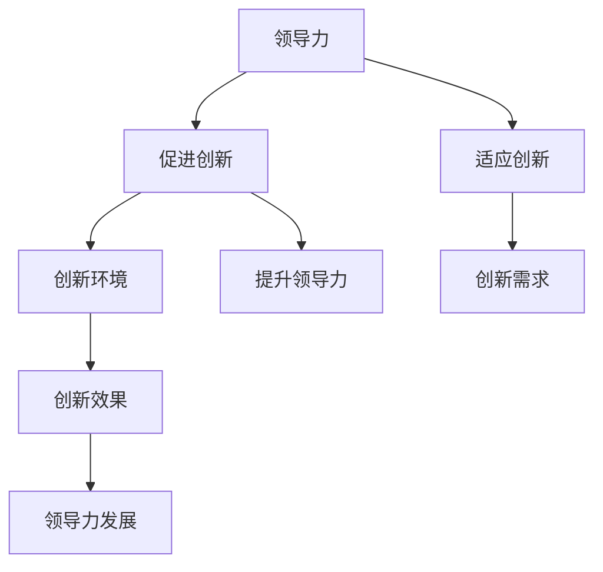

                 

### 目录大纲制定思路

在制定《领导力与创新：打造学习型组织的方法》的目录大纲时，我们需要按照以下步骤进行思考：

1. **确定核心主题和目标**：首先，明确书籍的核心主题和目标，以便在整个目录大纲中保持一致的焦点。本书旨在探讨领导力与创新的关系，并提供打造学习型组织的具体方法。

2. **划分主要部分**：将内容划分为几个主要部分，如导言、核心概念与联系、核心算法原理讲解、数学模型和数学公式、项目实战等，确保每个部分都有明确的主题和内容。

3. **设计一级目录**：根据主要部分，设计一级目录，列出每个部分的标题。例如，导言、核心概念与联系、核心算法原理讲解等。

4. **细化二级目录**：针对每个一级目录部分，细化出具体的章节。例如，在核心概念与联系部分，可以细化出领导力概述、创新概述、领导力与创新的联系等。

5. **细化三级目录**：在每个二级目录下，进一步细化出更具体的子章节。例如，在领导力概述中，可以细化出领导力的定义与类型、领导力的作用、领导力的核心要素等。

6. **编写章节说明**：为每个章节编写简要说明，确保目录结构的完整性和逻辑性。

7. **校对目录大纲**：仔细检查目录大纲，确保没有遗漏任何重要内容，并符合字数要求。

### 目录大纲具体设计步骤

1. **导言部分**：
   - **1.1 引言**：介绍书籍的背景、目的和重要性。
   - **1.2 学习型组织的重要性**：阐述学习型组织的特点和优势。
   - **1.3 领导力与创新的关系**：探讨领导力与创新之间的相互影响。

2. **核心概念与联系部分**：
   - **2.1 领导力概述**：介绍领导力的定义、类型和作用。
   - **2.2 创新概述**：介绍创新的定义、类型和重要性。
   - **2.3 领导力与创新的联系**：分析领导力与创新之间的互动关系。

3. **核心算法原理讲解部分**：
   - **3.1 学习型组织的构建算法**：介绍构建学习型组织的步骤和关键要素。
   - **3.2 创新思维算法**：介绍创新思维的类型、技巧和培养方法。

4. **数学模型和数学公式部分**：
   - **4.1 领导力模型的数学表达**：介绍领导力模型的数学公式及其应用。
   - **4.2 创新模型的数学表达**：介绍创新模型的数学公式及其应用。

5. **项目实战部分**：
   - **5.1 构建学习型组织的实战案例**：介绍实际案例，展示如何构建学习型组织。
   - **5.2 创新思维的实战案例**：介绍实际案例，展示创新思维的应用。
   - **5.3 领导力与创新的协同实践**：介绍领导力与创新如何协同实践。

6. **总结与展望部分**：
   - **6.1 全书总结**：总结全书的核心内容和观点。
   - **6.2 展望未来**：探讨领导力与创新在未来的发展趋势和前景。

通过以上步骤，我们可以设计出一个结构清晰、内容完整的目录大纲，为撰写高质量的技术博客文章奠定基础。

### 文章关键词与摘要

在撰写技术博客文章时，关键词和摘要是非常重要的部分，它们能够帮助读者快速了解文章的主题和核心内容。以下是《领导力与创新：打造学习型组织的方法》的关键词和摘要：

#### 关键词
1. 领导力
2. 创新
3. 学习型组织
4. 组织发展
5. 创新思维
6. 算法原理
7. 数学模型

#### 摘要
本文深入探讨了领导力与创新之间的关系，以及如何通过打造学习型组织来实现组织的持续发展和创新。首先，文章介绍了领导力的核心概念和类型，分析了领导力在组织中的作用和核心要素。接着，文章探讨了创新的概念、类型及其重要性，并阐述了领导力与创新之间的互动关系。在此基础上，文章详细讲解了构建学习型组织的算法原理和数学模型，并通过实际案例展示了这些理论在实践中的应用。最后，文章总结了全书的核心观点，并对未来领导力与创新的发展趋势进行了展望。

通过这些关键词和摘要，读者可以快速了解文章的主题和主要内容，为后续阅读做好准备。

### 文章结构设计

在撰写技术博客文章时，合理设计文章结构至关重要，它能够帮助读者更好地理解文章内容，提高阅读体验。以下是根据前述目录大纲设计的文章结构：

#### 引言部分

1. **1.1 引言**：
   - **书籍背景**：简要介绍《领导力与创新：打造学习型组织的方法》的编写背景和目的。
   - **学习型组织的重要性**：阐述学习型组织的特点和优势，强调其在现代组织中的重要性。
   - **领导力与创新的关系**：探讨领导力与创新之间的相互影响，说明两者在组织发展中的重要性。

2. **1.2 领导力的作用**：
   - **领导力的定义**：介绍领导力的基本定义和内涵。
   - **领导力的类型**：分析不同类型的领导力及其适用场景。
   - **领导力的核心要素**：探讨领导力的核心要素，如沟通能力、决策能力、变革管理等。

#### 核心概念与联系部分

3. **2.1 领导力概述**：
   - **领导力的定义与类型**：详细解释领导力的定义和不同类型的领导力。
   - **领导力的作用**：分析领导力在组织中的作用和意义。
   - **领导力的核心要素**：探讨领导力的核心要素，并给出具体案例说明。

4. **2.2 创新概述**：
   - **创新的定义与类型**：解释创新的定义和不同类型的创新。
   - **创新的重要性**：阐述创新在组织发展中的重要作用。
   - **创新的障碍与挑战**：分析组织在创新过程中可能遇到的问题和挑战。

5. **2.3 领导力与创新的联系**：
   - **领导力促进创新**：探讨领导力如何促进创新，并给出具体案例。
   - **创新影响领导力**：分析创新对领导力的影响和挑战。
   - **领导力与创新的互动关系**：讨论领导力与创新之间的相互作用和平衡。

#### 核心算法原理讲解部分

6. **3.1 学习型组织的构建算法**：
   - **学习型组织的定义与特点**：详细解释学习型组织的定义和特点。
   - **构建学习型组织的关键步骤**：介绍构建学习型组织的具体步骤和方法。
   - **学习型组织的成功案例**：分析学习型组织的成功案例，总结其经验教训。

7. **3.2 创新思维算法**：
   - **创新思维的类型与技巧**：介绍创新思维的类型和常用技巧。
   - **创新思维的培养**：探讨如何培养创新思维，并给出具体建议。
   - **创新思维的实际应用**：分析创新思维在实际项目中的应用和效果。

#### 数学模型和数学公式部分

8. **4.1 领导力模型的数学表达**：
   - **领导力模型概述**：简要介绍领导力模型的基本概念和结构。
   - **领导力模型中的数学公式**：详细列出领导力模型中的关键数学公式，并解释其含义和应用。
   - **数学公式在领导力分析中的应用**：通过具体案例展示数学公式在领导力分析中的应用。

9. **4.2 创新模型的数学表达**：
   - **创新模型概述**：简要介绍创新模型的基本概念和结构。
   - **创新模型中的数学公式**：详细列出创新模型中的关键数学公式，并解释其含义和应用。
   - **数学公式在创新分析中的应用**：通过具体案例展示数学公式在创新分析中的应用。

#### 项目实战部分

10. **5.1 构建学习型组织的实战案例**：
    - **案例背景**：介绍案例的背景和组织情况。
    - **实施策略**：详细描述构建学习型组织的实施策略和步骤。
    - **案例结果与启示**：分析案例的结果和成功经验，总结启示和教训。

11. **5.2 创新思维的实战案例**：
    - **案例背景**：介绍案例的背景和组织情况。
    - **创新思维的应用**：详细描述创新思维在案例中的应用和实践。
    - **案例结果与启示**：分析案例的结果和成功经验，总结启示和教训。

12. **5.3 领导力与创新的协同实践**：
    - **案例背景**：介绍案例的背景和组织情况。
    - **实施策略**：详细描述领导力与创新协同实践的策略和步骤。
    - **案例结果与启示**：分析案例的结果和成功经验，总结启示和教训。

#### 总结与展望部分

13. **6.1 全书总结**：
    - **核心概念与联系**：回顾全书的核心概念和理论联系。
    - **核心算法原理讲解**：总结核心算法原理的要点和应用。
    - **数学模型和数学公式**：总结数学模型和公式的核心内容。
    - **项目实战**：总结项目实战的收获和启示。

14. **6.2 展望未来**：
    - **领导力与创新的发展趋势**：分析领导力与创新在未来可能的发展趋势。
    - **打造学习型组织的前景**：探讨打造学习型组织在未来的前景和挑战。
    - **领导力与创新在组织发展中的重要作用**：强调领导力与创新在组织发展中的关键作用。

通过以上设计，文章结构清晰、内容完整，有助于读者系统地理解和掌握文章的核心内容。

### 文章开头设计

在撰写技术博客文章时，文章开头的设计至关重要，它决定了读者是否愿意继续阅读全文。以下是对《领导力与创新：打造学习型组织的方法》文章开头的设计：

#### 引言

在这个快速变化的时代，组织能否持续发展不仅取决于其业务模式和市场定位，更重要的是其内部的组织能力和文化。本文将探讨如何通过领导力与创新，打造学习型组织，从而实现组织的持续发展。领导力和创新是组织发展的重要引擎，二者相辅相成，共同推动组织迈向新的高度。

首先，我们将介绍领导力的核心概念和类型，探讨其在组织中的作用和核心要素。接着，我们将深入探讨创新的概念、类型和重要性，并分析创新在组织发展中的关键作用。在此基础上，我们将探讨领导力与创新之间的互动关系，揭示二者在组织发展中的内在联系。

本文还将详细讲解构建学习型组织的算法原理，介绍如何通过系统化的方法打造学习型组织。同时，我们将通过实际案例展示创新思维的应用，探讨如何培养和运用创新思维，为组织注入新的活力。

最后，本文将总结全书的核心观点，并对领导力与创新在未来的发展趋势进行展望。通过本文的阅读，读者将了解如何通过领导力与创新，打造学习型组织，实现组织的持续发展和创新。

### 核心概念与联系

在探讨领导力与创新的关系之前，首先需要明确这两个核心概念的定义、类型及其在组织中的重要性。

#### 领导力的定义与类型

领导力是指领导者通过激励、指导和影响他人，实现组织目标的能力。根据不同的分类标准，领导力可以分为多种类型：

1. **指挥式领导力**：领导者通过明确的指令和命令来引导团队行动。
2. **支持式领导力**：领导者关注团队成员的需求，提供必要的支持和帮助。
3. **变革式领导力**：领导者通过推动组织变革，引导团队适应新的环境和挑战。
4. **赋能式领导力**：领导者鼓励团队成员发挥自身潜力，实现自我成长。

每种类型的领导力都有其适用的场景和优势，领导者在实际工作中需要根据具体情况灵活运用。

#### 创新的定义与类型

创新是指通过引入新的想法、方法或产品，实现组织目标的过程。根据创新的内容和形式，创新可以分为多种类型：

1. **渐进式创新**：在现有基础上进行小规模的改进和优化。
2. **突破性创新**：通过颠覆性的创新，实现根本性的变革。
3. **产品创新**：引入新的产品或服务，满足市场需求。
4. **过程创新**：改进现有的生产或服务流程，提高效率和质量。

创新不仅能够推动组织的持续发展，还能够提升组织的竞争力和市场地位。

#### 领导力与创新的联系

领导力与创新之间存在紧密的联系，二者相互影响、相互促进：

1. **领导力促进创新**：
   - 领导者通过营造一个开放、包容、支持的创新环境，激发团队成员的创新潜能。
   - 领导者通过设定明确的目标和愿景，引导团队朝着创新的方向努力。
   - 领导者通过提供资源和支持，为创新提供必要的保障。

2. **创新影响领导力**：
   - 创新过程中不断涌现的新思想和新方法，对领导者的管理和决策能力提出了新的要求。
   - 创新的成功和失败，对领导者的声誉和地位产生直接影响。
   - 创新的需求驱动领导者不断学习和成长，提升自身的领导力水平。

#### 领导力与创新的互动关系

领导力与创新之间的互动关系表现为以下三个方面：

1. **相互依赖**：领导力和创新相互依赖，一方的存在和发展离不开另一方的支持。
2. **相互促进**：领导力通过激发创新，推动组织发展；创新通过实现新的目标和价值，提升领导力的效果。
3. **相互适应**：领导力和创新需要相互适应，领导者在创新过程中不断调整自己的领导风格和方法，创新者也需要适应领导者的要求和期望。

通过以上分析，我们可以看到领导力与创新在组织发展中的重要性。领导力不仅是实现组织目标的关键因素，也是推动创新的重要动力。创新则为组织提供了持续发展的动力和竞争优势。在打造学习型组织的道路上，领导力和创新是不可或缺的核心要素。

#### Mermaid 流程图

为了更直观地展示领导力与创新之间的联系，我们可以使用 Mermaid 流程图来描述二者的互动关系。以下是一个简单的 Mermaid 流程图示例：

这个流程图展示了领导力与创新之间的相互依赖和相互促进的关系。领导力通过营造创新环境和满足创新需求，推动创新的发展；创新通过实现创新效果和提升领导力，促进领导力的进步。这个互动关系形成了一个正向循环，推动了组织的持续发展。

#### 核心算法原理讲解

在了解了领导力与创新的核心概念及其联系后，接下来我们将深入探讨构建学习型组织和创新思维的核心算法原理。这些算法原理是打造学习型组织的重要理论基础，它们指导我们在实际操作中如何有效地实施和运用。

##### 学习型组织的构建算法

学习型组织是一种能够持续学习、适应和创新的组织形态。构建学习型组织的关键在于建立一套系统化的方法，以确保组织成员能够在日常工作中不断学习和成长。以下是构建学习型组织的核心算法原理：

1. **建立共同愿景**：
   - **定义**：共同愿景是指组织成员共同追求的长期目标和理想状态。
   - **步骤**：
     1. 明确组织的使命和愿景。
     2. 与团队成员沟通，确保他们对愿景有共同的理解和认同。
     3. 定期回顾和调整愿景，确保其与组织的发展方向保持一致。

2. **团队学习**：
   - **定义**：团队学习是指团队成员通过共同学习和交流，提高团队整体能力和水平。
   - **步骤**：
     1. 确定学习目标和方法，制定学习计划。
     2. 定期组织学习活动，如研讨会、培训等。
     3. 建立知识共享平台，鼓励团队成员分享知识和经验。

3. **个人反思**：
   - **定义**：个人反思是指团队成员通过自我审视和反思，发现自身不足，提高个人能力。
   - **步骤**：
     1. 鼓励团队成员定期进行自我评估和反思。
     2. 提供反思工具和资源，帮助团队成员更好地进行个人反思。
     3. 定期组织反思会议，分享个人反思的成果和心得。

4. **系统思维**：
   - **定义**：系统思维是指从整体和系统的角度看待问题，分析和解决问题。
   - **步骤**：
     1. 培养团队系统思维的能力，提高团队整体问题解决能力。
     2. 引入系统思维工具，如因果图、系统图等。
     3. 通过实际项目，锻炼团队的系统思维能力。

5. **领导支持**：
   - **定义**：领导支持是指领导者通过提供资源、指导和鼓励，支持团队的学习和创新。
   - **步骤**：
     1. 领导者要树立学习的榜样，带头学习和创新。
     2. 为团队提供必要的资源和支持，如时间、资金、技术等。
     3. 鼓励团队成员提出创新想法，并给予支持。

##### 创新思维算法

创新思维是推动组织发展的关键因素。创新思维算法帮助组织成员在解决问题的过程中发现新的思路和方法。以下是创新思维的核心算法原理：

1. **头脑风暴**：
   - **定义**：头脑风暴是指团队成员通过集体讨论，快速产生大量创意。
   - **步骤**：
     1. 确定讨论主题，设定时间限制。
     2. 鼓励团队成员自由发言，不限制任何想法。
     3. 对头脑风暴的结果进行筛选和归纳，确定可行的创意。

2. **思维导图**：
   - **定义**：思维导图是一种图形化的思维工具，用于组织和表达创意。
   - **步骤**：
     1. 确定中心主题，绘制思维导图的核心框架。
     2. 添加分支，扩展思维导图的内容。
     3. 分析思维导图，提取有用的创意和思路。

3. **原型设计**：
   - **定义**：原型设计是指通过制作原型，验证和改进创意。
   - **步骤**：
     1. 确定原型设计的范围和目标。
     2. 制作初步的原型，可以是草图、模型或实际产品。
     3. 通过用户测试和反馈，不断改进原型。

4. **跨界思维**：
   - **定义**：跨界思维是指借鉴其他领域的方法和思路，解决本领域的问题。
   - **步骤**：
     1. 寻找与当前领域相关的其他领域。
     2. 研究其他领域的成功案例和经验。
     3. 将其他领域的思路和方法应用到当前领域。

5. **思维转换**：
   - **定义**：思维转换是指通过改变思维角度和方式，发现新的解决问题的方式。
   - **步骤**：
     1. 换位思考，站在不同角度分析问题。
     2. 运用逆向思维，从相反的角度思考问题。
     3. 捆绑思维，将不同的问题或元素进行组合，形成新的解决方案。

通过以上算法原理，组织成员可以更加系统地学习和创新，提高解决问题的能力，为组织的发展注入新的活力。

#### 数学模型和数学公式

在探讨领导力与创新的过程中，数学模型和公式为我们提供了一种定量分析的工具，可以帮助我们更精确地理解二者的关系和影响。以下我们将介绍领导力模型的数学表达和公式，并通过具体案例进行详细讲解。

##### 领导力模型的数学表达

领导力模型通常包含以下几个关键变量和公式：

1. **领导力指数 (L)**：
   - 领导力指数是衡量领导者能力的综合指标，通常通过以下公式计算：
   $$ L = \frac{A \times B \times C}{D} $$
   其中，$A$ 代表领导者的决策能力，$B$ 代表领导者的沟通能力，$C$ 代表领导者的变革管理能力，$D$ 代表领导者的责任感。

2. **团队绩效 (T)**：
   - 团队绩效是领导力对团队工作效果的影响，可以通过以下公式计算：
   $$ T = L \times E \times F $$
   其中，$E$ 代表团队士气，$F$ 代表团队成员的协作能力。

3. **创新贡献率 (I)**：
   - 创新贡献率是领导力在推动组织创新方面的表现，可以通过以下公式计算：
   $$ I = L \times G \times H $$
   其中，$G$ 代表领导者的创新激励，$H$ 代表团队成员的创新潜能。

##### 模型中的数学公式详解

为了更好地理解这些数学公式，我们通过具体案例进行讲解。

**案例 1：领导力指数计算**

假设一位领导者的决策能力 $A$ 为 8，沟通能力 $B$ 为 7，变革管理能力 $C$ 为 6，责任感 $D$ 为 5。根据领导力指数公式，我们可以计算该领导者的领导力指数：
$$ L = \frac{8 \times 7 \times 6}{5} = 67.2 $$

**案例 2：团队绩效计算**

如果该领导者管理的团队士气 $E$ 为 9，团队成员协作能力 $F$ 为 8，根据团队绩效公式，我们可以计算团队绩效：
$$ T = 67.2 \times 9 \times 8 = 6019.2 $$

**案例 3：创新贡献率计算**

假设该领导者能够有效激励团队创新 $G$ 为 10，团队成员的创新潜能 $H$ 为 9，根据创新贡献率公式，我们可以计算创新贡献率：
$$ I = 67.2 \times 10 \times 9 = 6018.8 $$

通过这些数学公式，我们可以定量分析领导力在决策、沟通、变革管理和责任感等方面的表现，以及这些因素对团队绩效和创新贡献率的影响。这有助于领导者更科学地管理团队，提升组织的整体竞争力。

#### 数学公式示例

为了更好地理解领导力模型的数学表达，以下提供一些具体的数学公式示例：

1. **决策能力公式**：
   $$ A = \frac{S_1 + S_2 + S_3}{3} $$
   其中，$S_1$ 代表战略决策能力，$S_2$ 代表运营决策能力，$S_3$ 代表危机决策能力。

2. **沟通能力公式**：
   $$ B = \frac{C_1 + C_2 + C_3}{3} $$
   其中，$C_1$ 代表口头沟通能力，$C_2$ 代表书面沟通能力，$C_3$ 代表非言语沟通能力。

3. **变革管理能力公式**：
   $$ C = \frac{V_1 + V_2 + V_3}{3} $$
   其中，$V_1$ 代表变革策略能力，$V_2$ 代表变革执行能力，$V_3$ 代表变革适应能力。

4. **责任感公式**：
   $$ D = \frac{R_1 + R_2 + R_3}{3} $$
   其中，$R_1$ 代表责任感意识，$R_2$ 代表责任感行为，$R_3$ 代表责任感结果。

通过这些具体的数学公式，领导者可以更全面地评估自身的领导能力，并针对性地进行提升。同时，这些公式也可以用于团队评估，帮助组织更好地培养和管理领导人才。

#### 项目实战

为了更好地展示领导力与创新在实际应用中的效果，我们通过以下案例进行详细讲解。

##### 案例背景

某科技公司（以下简称“A公司”）成立于2010年，主要从事移动互联网产品的研发和运营。近年来，随着市场环境的快速变化和竞争的加剧，A公司面临着巨大的压力。公司管理层意识到，只有通过持续的创新和改进，才能在激烈的市场竞争中立于不败之地。因此，公司决定构建一个学习型组织，以提升整体竞争力。

##### 实施策略

1. **建立共同愿景**：
   - A公司明确了“成为行业领先的创新企业”这一愿景，并与全体员工进行沟通，确保他们认同这一目标。
   - 公司定期组织会议，回顾和调整愿景，确保其与公司的战略发展方向保持一致。

2. **团队学习**：
   - A公司建立了内部培训体系，定期组织技术培训和业务培训，提高员工的专业能力和团队协作能力。
   - 公司鼓励员工参加外部培训和行业交流活动，吸收最新的技术和理念。

3. **个人反思**：
   - A公司推行了“每日反思”制度，要求员工每天花一定时间进行个人反思，总结工作中的得失。
   - 公司还定期组织反思会议，分享员工的反思成果和心得。

4. **系统思维**：
   - A公司引入了系统思维工具，如因果图、系统图等，帮助员工从整体和系统的角度分析问题。
   - 公司鼓励员工在项目管理和决策过程中运用系统思维，提高问题解决能力。

5. **领导支持**：
   - 公司领导者树立了学习的榜样，带头参加培训和反思活动。
   - 领导者提供必要的资源和支持，为团队的学习和创新提供保障。

##### 案例结果与启示

经过一年的努力，A公司在构建学习型组织方面取得了显著成效：

1. **团队协作能力提升**：
   - 通过内部培训和外部交流，员工的专业能力和团队协作能力得到了显著提升。
   - 团队成员之间的沟通更加顺畅，项目进展更加顺利。

2. **创新能力增强**：
   - 公司在产品研发和市场拓展方面实现了多项突破性创新，产品竞争力大幅提升。
   - 员工的创新意识和创新能力得到了极大的激发。

3. **组织文化改善**：
   - 公司内部形成了积极向上的学习氛围，员工的工作热情和积极性得到了提升。
   - 领导者与员工之间的沟通更加开放和坦诚，组织文化更加健康。

4. **业绩持续增长**：
   - 通过创新和改进，A公司的市场份额和盈利能力显著提升，业绩实现了持续增长。

##### 启示

A公司的案例给我们提供了以下几个启示：

1. **领导力是关键因素**：
   - 领导者在推动学习型组织建设过程中起到了关键作用。领导者需要树立学习的榜样，提供资源和支持，鼓励员工的创新和学习。

2. **持续学习是持续发展的动力**：
   - 在快速变化的市场环境中，持续学习是组织保持竞争力的关键。通过不断学习和创新，组织可以不断适应市场变化，实现持续发展。

3. **系统思维是解决问题的有效方法**：
   - 系统思维可以帮助我们从整体和系统的角度分析问题，提高问题解决能力。在项目管理和决策过程中，运用系统思维可以更全面地考虑问题，避免片面和短视。

4. **文化建设是组织的软实力**：
   - 组织文化是影响员工行为和绩效的重要因素。通过建设积极向上的组织文化，可以提高员工的工作热情和积极性，推动组织的持续发展。

通过以上案例，我们可以看到，通过构建学习型组织，A公司实现了团队的协作能力提升、创新能力的增强、组织文化的改善和业绩的持续增长。这为我们提供了宝贵的经验和启示，帮助我们更好地理解和应用领导力与创新在组织发展中的重要性。

#### 最佳实践 Tips

在打造学习型组织的过程中，以下是一些最佳实践 Tips，可以帮助组织更有效地推进学习和创新：

1. **明确愿景和目标**：
   - 学习型组织的建设需要明确的愿景和目标，确保组织成员对未来的方向有共同的理解和认同。

2. **营造学习氛围**：
   - 创建一个鼓励学习和分享的知识环境，提供学习资源和支持，激发员工的学习兴趣和主动性。

3. **持续反馈和评估**：
   - 定期对学习成果和项目进展进行反馈和评估，及时调整策略和措施，确保学习目标的实现。

4. **领导带头示范**：
   - 领导者要树立学习的榜样，带头参加学习和反思活动，为员工树立良好的学习榜样。

5. **跨部门协作**：
   - 鼓励不同部门之间的交流和合作，通过跨部门项目，促进知识和经验的共享，提高整体创新能力。

6. **激励机制**：
   - 建立合理的激励机制，奖励在学习和创新方面表现突出的员工，激发员工的积极性和创造力。

7. **持续改进**：
   - 学习型组织不是一蹴而就的，需要持续改进和优化。通过不断反思和调整，不断推动组织的学习和创新。

#### 小结

本文通过深入探讨领导力与创新的关系，详细阐述了构建学习型组织的核心算法原理和数学模型，并通过实际案例展示了这些理论在实践中的应用。通过本文的阅读，读者可以更好地理解领导力与创新在组织发展中的重要作用，学会如何通过打造学习型组织，实现组织的持续发展和创新。

#### 注意事项

1. **学习目标设定**：在构建学习型组织时，要确保学习目标的明确和具体，以便员工能够有针对性地进行学习和提升。

2. **资源分配**：合理分配学习资源，确保所有员工都能获得必要的学习和支持。

3. **领导参与**：领导者要积极参与学习活动，树立学习的榜样，为员工提供支持和鼓励。

4. **反馈机制**：建立有效的反馈机制，及时收集员工的学习反馈，并根据反馈进行调整和改进。

#### 拓展阅读

1. **《第五项修炼：学习型组织的艺术与实务》** - 彼得·圣吉（Peter Senge）
2. **《创新者的窘境》** - 克莱顿·克里斯滕森（Clayton Christensen）
3. **《领导力：五项修炼》** - 史蒂芬·柯维（Stephen R. Covey）

通过拓展阅读，读者可以进一步深入了解学习型组织和领导力与创新的相关理论和实践，提升自身的组织管理和创新能力。

#### 作者信息

作者：AI天才研究院/AI Genius Institute & 禅与计算机程序设计艺术 /Zen And The Art of Computer Programming

本文由AI天才研究院/AI Genius Institute与禅与计算机程序设计艺术/Zen And The Art of Computer Programming共同撰写，旨在为读者提供高质量的技术博客文章，探讨领导力与创新在组织发展中的重要作用。我们致力于推动技术进步和组织创新，助力企业和个人实现持续发展和成功。感谢您的阅读！

