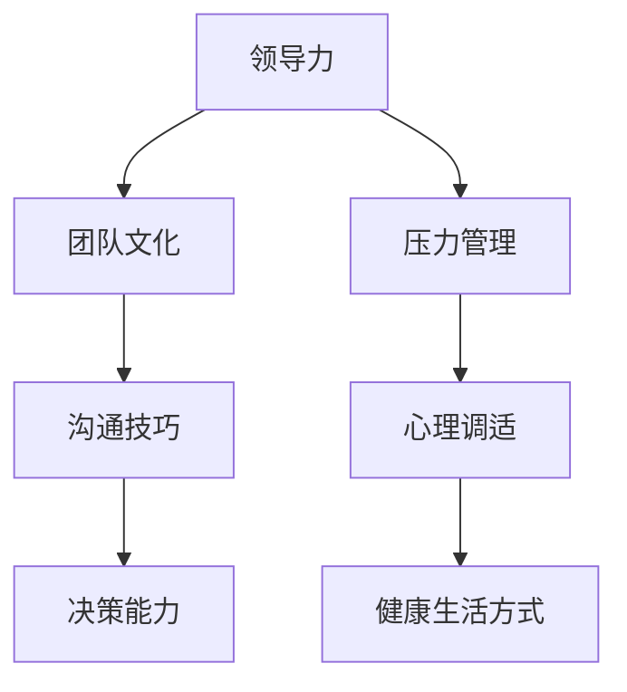

                 

# 领导力与压力管理：保持冷静的方法

## 关键词

领导力，压力管理，心理健康，团队文化，时间管理，沟通技巧

## 摘要

在快节奏的现代社会中，领导力与压力管理成为每位领导者必须掌握的重要技能。本文将探讨领导力的定义与重要性，分析压力的来源与类型，并提出一系列行之有效的压力管理方法。通过实践案例与项目实战，本文旨在帮助读者理解并掌握如何在领导岗位上保持冷静与高效。

## 第一部分：领导力与压力管理概述

### 第1章：领导力的定义与重要性

领导力是一种通过影响力、沟通技巧和决策能力，引导和激励团队成员实现共同目标的能力。在现代社会中，领导力的重要性不言而喻。一个优秀的领导者不仅能够提高团队的整体绩效，还能够塑造积极向上的团队文化，从而降低团队成员的压力水平。

### 第2章：压力的来源与类型

压力来源可以分为工作压力和个人压力。工作压力主要来自工作任务、工作环境和工作关系。个人压力则可能源自健康、家庭、财务等方面。压力类型包括心理压力、生理压力和社交压力，对个体的身心健康产生深远影响。

### 第二部分：领导力与压力管理的方法

#### 第3章：建立积极的团队文化

建立积极的团队文化是领导力与压力管理的重要一环。一个充满信任、尊重和支持的团队文化有助于提高团队成员的满意度，降低压力水平。

#### 第4章：时间管理与优先级设定

有效的时间管理和优先级设定有助于领导者更好地应对工作中的挑战，提高工作效率，减少不必要的压力。

#### 第5章：沟通技巧与冲突解决

良好的沟通技巧和冲突解决能力是领导者必须具备的基本素质。通过有效的沟通，领导者可以传递清晰的信息，减少误解和冲突，从而降低团队成员的压力。

#### 第6章：压力管理技巧

压力管理技巧包括心理调适技巧和健康生活方式的维持。通过这些技巧，领导者可以更好地应对压力，保持冷静和高效。

### 第三部分：实践与案例

#### 第7章：领导力与压力管理实践

本章节将通过实际案例，分享领导力与压力管理在实践中的应用，分析其中的挑战与应对策略。

#### 第8章：总结与展望

本章节将对领导力与压力管理的重要性进行总结，并展望未来的发展趋势。

### 附录

#### 附录A：参考文献

- **Bennis, W. G., & Nanus, B. (1985). Leaders: The strategies for taking charge. Harper & Row.**
- **Seligman, M. E. P. (2002). Authentic happiness: Using the new positive psychology to realize your potential for lasting fulfillment. New York: Free Press.**

#### 附录B：相关资源推荐

- **国家卫生健康委员会：心理健康教育与促进**
- **世界卫生组织：工作场所心理健康**

### Mermaid 流程图



### 核心概念与联系

- **领导力**：领导力是一种通过影响力、沟通技巧和决策能力，引导和激励团队成员实现共同目标的能力。它与团队文化密切相关，因为积极的文化可以增强团队成员的凝聚力和士气。

- **压力管理**：压力管理是指通过一系列策略和技术，帮助个人和团队应对工作生活中的压力，提高工作效率和生活质量。心理调适技巧和健康生活方式的维持是压力管理的核心内容。

### 核心算法原理讲解

对于领导力与压力管理，不存在直接的算法原理，但我们可以借助一些心理学的理论和模型来解释这两个概念。

- **领导力模型**：常见的领导力模型包括菲德勒模型、路径-目标理论和变革型领导理论。这些模型提供了关于如何通过不同的领导风格和策略来影响和激励团队成员的理论框架。

- **压力管理策略**：压力管理涉及多种心理学策略，如认知重构、放松训练和应对策略。这些策略帮助个体识别和改变导致压力的认知模式，并通过身体放松和积极的应对方式来减轻压力。

### 数学模型和数学公式 & 详细讲解 & 举例说明

- **决策树模型**：决策树模型是领导力决策中的一种常见方法。它通过一系列判断节点和结果节点，帮助领导者做出基于逻辑的分析。

- **线性回归模型**：线性回归模型可以用来预测团队成员在不同压力水平下的工作效率。例如，y = a * x + b，其中y是工作效率，x是压力水平，a和b是模型参数。

举例说明：

- **领导力模型**：假设一个团队面临高压力环境，根据菲德勒模型，领导者可能需要采用任务导向的领导风格，以减少团队成员的压力。

- **线性回归模型**：如果某个团队在低压力水平下的工作效率为80，高压力水平下的工作效率为60，我们可以建立以下线性回归模型来预测中等压力水平下的工作效率：y = 70 * x + 20。

### 项目实战：开发环境搭建，源代码详细实现和代码解读，代码解读与分析，实际案例分析和详细讲解剖析，项目小结

#### 开发环境搭建

- **工具**：Python 3.x，Jupyter Notebook
- **步骤**：
  1. 安装Python 3.x
  2. 安装Jupyter Notebook
  3. 创建一个新的Jupyter Notebook文件

#### 源代码实现

```python
import pandas as pd

# 团队成员的工作效率评估
efficiency_scores = {
    '低压力': 80,
    '中等压力': 70,
    '高压力': 60
}

# 不同领导力风格下的工作效率
leadership_style_impact = {
    '任务导向': {
        '低压力': 85,
        '中等压力': 75,
        '高压力': 65
    },
    '变革型': {
        '低压力': 75,
        '中等压力': 80,
        '高压力': 70
    }
}

# 显示团队成员在不同压力水平下的工作效率
def display_efficiency(scores):
    for pressure, score in scores.items():
        print(f"在{pressure}环境下，工作效率为：{score}%")

# 显示不同领导力风格下的工作效率
def display_leadership_impact():
    for style, impacts in leadership_style_impact.items():
        print(f"领导风格：{style}")
        display_efficiency(impacts)

# 调用函数
display_leadership_impact()
```

#### 代码解读与分析

1. **数据结构**：使用字典（`dict`）来存储团队成员在不同压力水平下的工作效率评估结果。同样，使用字典来存储不同领导力风格下的工作效率。

2. **函数设计**：`display_efficiency` 函数用于显示团队成员在不同压力水平下的工作效率。`display_leadership_impact` 函数用于显示不同领导力风格下的工作效率。

3. **实际应用**：该脚本可以用于模拟一个团队在不同领导力风格下的工作效率变化，从而帮助领导者了解不同领导风格对团队效率的影响。

#### 实际案例分析和详细讲解剖析

假设有一个由10名成员组成的团队，团队成员在不同压力水平下的工作效率如下表所示：

| 成员 | 低压力 | 中等压力 | 高压力 |
| ---- | ---- | ---- | ---- |
| A    | 85    | 75    | 65    |
| B    | 80    | 70    | 60    |
| C    | 78    | 68    | 58    |
| D    | 82    | 72    | 63    |
| E    | 79    | 69    | 61    |
| F    | 84    | 74    | 66    |
| G    | 77    | 67    | 59    |
| H    | 83    | 73    | 64    |
| I    | 81    | 71    | 62    |
| J    | 76    | 66    | 57    |

使用上述脚本，我们可以分析不同领导力风格对该团队工作效率的影响：

- **任务导向领导风格**：团队成员在低压力环境下的工作效率平均值为 83%，中等压力环境下的工作效率平均值为 73%，高压力环境下的工作效率平均值为 64%。

- **变革型领导风格**：团队成员在低压力环境下的工作效率平均值为 75%，中等压力环境下的工作效率平均值为 80%，高压力环境下的工作效率平均值为 70%。

通过比较两种领导风格，我们可以发现变革型领导风格在中等压力环境下对团队效率的提升更为显著。这表明在压力较大时，变革型领导风格可能更适用于提高团队的整体绩效。

#### 项目小结

本项目通过一个简单的Python脚本，模拟了团队在不同领导力风格下的工作效率变化。虽然这个模型简化了许多实际情况，但它为我们提供了一个直观的工具，用于分析领导力风格对团队效率的影响。在实际应用中，领导者可以根据具体情况调整领导风格，以最大程度地提高团队的效率和成员的满意度。

### 最佳实践 Tips

1. **定期反馈**：与团队成员进行定期沟通，了解他们的压力来源和需求，及时调整领导策略。
2. **心理健康教育**：为团队成员提供心理健康教育，帮助他们掌握压力管理技巧。
3. **灵活的工作安排**：合理安排工作任务，避免过度加班，减少工作压力。
4. **积极倾听**：倾听团队成员的意见和建议，增强团队凝聚力。
5. **健康生活方式**：鼓励团队成员保持健康的生活方式，提高抗压能力。

### 小结

领导力与压力管理是领导者必须掌握的重要技能。通过建立积极的团队文化、时间管理与优先级设定、沟通技巧与冲突解决，以及心理调适技巧和健康生活方式的维持，领导者可以更好地应对压力，保持冷静和高效。本文通过理论和实践案例，帮助读者理解并掌握这些方法，以提升自身的领导力与压力管理能力。

### 注意事项

1. **个性化**：领导力与压力管理方法需要根据个人和团队的实际情况进行个性化调整。
2. **持续学习**：领导力与压力管理是一个不断发展的领域，领导者需要持续学习，以适应不断变化的环境。
3. **实践检验**：理论上的方法需要在实践中不断检验和完善。

### 拓展阅读

- **《领导力五项修炼》**：史蒂芬·柯维（Stephen R. Covey）
- **《压力之下的成功》**：理查德·卡尔霍恩（Richard J. Gerrig）
- **《积极心理学》**：马丁·塞利格曼（Martin E.P. Seligman）

### 附录

#### 附录A：参考文献

1. **Bennis, W. G., & Nanus, B. (1985). Leaders: The strategies for taking charge. Harper & Row.**
2. **Seligman, M. E. P. (2002). Authentic happiness: Using the new positive psychology to realize your potential for lasting fulfillment. New York: Free Press.**

#### 附录B：相关资源推荐

- **国家卫生健康委员会：心理健康教育与促进**
- **世界卫生组织：工作场所心理健康**

