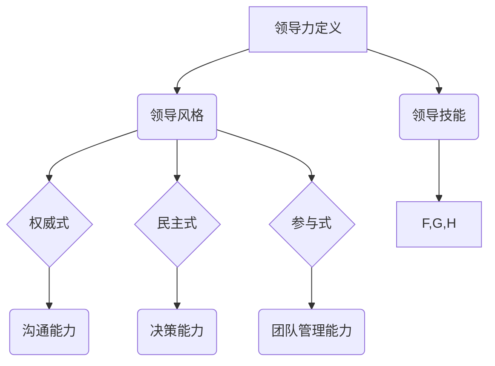
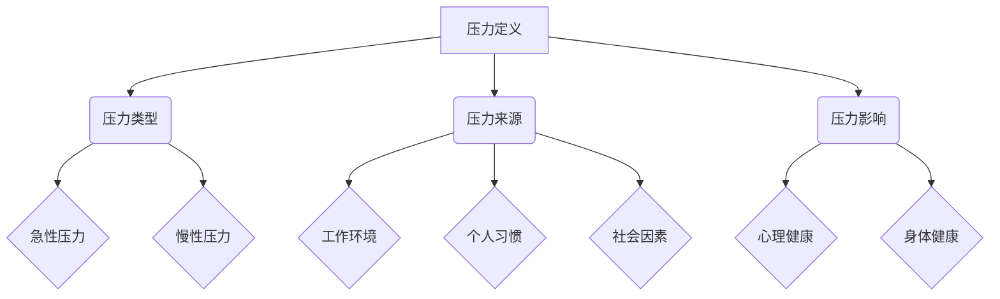

                 

### 确定书的主旨和目标读者

首先，我们需要明确《领导力与压力管理：平衡工作与生活》这本书的主旨和目标读者。书名直接点出了本书的核心主题，即领导力和压力管理，以及如何在职场中找到工作与生活的平衡点。我们可以从以下几个方面来分析这本书的主旨和目标读者：

1. **主旨分析**：

   - **领导力**：领导力是任何职场成功的关键因素。书中可能涉及领导力的定义、不同领导风格、领导技能的构建等。
   - **压力管理**：压力管理对于个人和组织都是至关重要的。本书可能会探讨压力的本质、压力源、应对策略等。
   - **工作与生活平衡**：这是一个普遍关注的话题，尤其是在现代职场中。书中可能会提供策略、工具和技巧来帮助读者实现这一平衡。

2. **目标读者分析**：

   - **企业管理者**：这些读者通常需要具备领导力和压力管理能力，以便有效地管理团队和应对日常挑战。
   - **职场新人**：对于刚步入职场的新人来说，了解领导力和压力管理的基本概念对于职业发展至关重要。
   - **职场专业人士**：对于已经在职场中工作多年的专业人士，这本书可以作为一个指南，帮助他们进一步提升个人能力和管理技能。

综上所述，本书的主旨在于帮助读者理解领导力和压力管理的重要性，并提供实用的策略和工具，以实现工作与生活的平衡。目标读者主要是企业管理者、职场新人和职场专业人士。

为了进一步明确本书的主旨，我们可以从以下几个角度展开：

- **领导力部分**：探讨领导力的定义、作用、不同领导风格和核心技能，以及如何通过个人成长来提升领导力。
- **压力管理部分**：深入分析压力的本质、来源、对健康的影响，以及如何通过策略和工具来有效管理压力。
- **工作与生活平衡部分**：提供时间管理技巧、优先级设定、科技应用等方面的策略，帮助读者实现工作与生活的平衡。

接下来，我们将详细设计章节结构，为每个章节明确具体的内容和目标。

### 设计章节结构

在明确《领导力与压力管理：平衡工作与生活》的主旨和目标读者后，我们需要设计详细的章节结构。这将有助于我们清晰地呈现每个章节的内容，确保读者能够循序渐进地理解和掌握书中的核心概念。以下是我们为本书设计的章节结构：

#### 引言

- **目的**：为读者提供本书的整体概述，解释书名背后的意义，并明确本书的目标和预期成果。
- **内容**：
  - 介绍领导力、压力管理和工作与生活平衡的重要性。
  - 概述本书的结构和每个章节的核心内容。

#### Chapter 1: 领导力基础

- **目的**：帮助读者建立领导力的基础概念，理解领导力的定义、作用和不同领导风格。
- **内容**：
  - 领导力的定义和重要性。
  - 领导风格的理论探讨，如权威式、民主式和参与式领导。
  - 领导技能的构建，包括沟通能力、决策能力和团队管理能力。

#### Chapter 2: 压力管理原理

- **目的**：深入分析压力的本质、来源和对健康的影响，为读者提供有效的压力管理策略。
- **内容**：
  - 压力的定义、类型和来源。
  - 压力对健康的影响，包括心理和生理方面。
  - 压力管理的原理和策略，如认知行为疗法和放松训练。

#### Chapter 3: 工作与生活的平衡

- **目的**：探讨如何在现代职场中实现工作与生活的平衡，提供实用的策略和工具。
- **内容**：
  - 工作与生活平衡的挑战和重要性。
  - 时间管理技巧，如优先级设定和效率提升。
  - 科技在平衡工作与生活中的作用，如自动化工具和远程工作。

#### Chapter 4: 实践案例

- **目的**：通过真实案例展示领导力和压力管理的应用，提供实际操作的经验和教训。
- **内容**：
  - 不同场景下的领导力和压力管理案例。
  - 案例分析和讨论，强调关键成功因素和注意事项。

#### Chapter 5: 压力管理工具与方法

- **目的**：介绍各种压力管理工具和方法，帮助读者根据个人情况选择合适的策略。
- **内容**：
  - 常见的压力管理工具，如冥想和正念练习。
  - 方法的应用和效果评估，包括个体咨询和工作坊。

#### Chapter 6: 个人成长与领导力

- **目的**：探讨个人成长对于领导力提升的重要性，提供个人成长的具体实践方法。
- **内容**：
  - 个人成长的理论基础，如自我意识和自我效能感。
  - 个人成长的具体实践方法，如持续学习和反思。

#### Chapter 7: 领导力与团队建设

- **目的**：探讨领导力在团队建设中的关键作用，提供团队建设的方法和策略。
- **内容**：
  - 团队建设的理论框架，如团队发展阶段和团队动力。
  - 领导力在团队建设中的应用，如团队沟通和冲突解决。

#### Chapter 8: 结论

- **目的**：总结本书的核心内容，强调领导力与压力管理、工作与生活平衡的重要性，并提供未来展望。
- **内容**：
  - 本书的主要观点和发现。
  - 对未来研究的建议和应用前景。

通过上述章节结构的详细设计，我们希望能够为读者提供一个系统、全面的学习路径，帮助他们在领导力、压力管理和工作与生活平衡方面取得实质性进步。

### 细化每个章节的内容

在明确了章节结构后，我们需要进一步细化每个章节的具体内容，以确保每个章节都能够为读者提供丰富的知识和实用的技巧。以下是针对每个章节的详细内容规划：

#### Chapter 1: 领导力基础

**核心概念与联系**：
- 领导力的定义和重要性：解释领导力在个人和组织成功中的作用。
- 领导风格的理论：介绍不同领导风格及其对团队的影响。
- 领导技能：探讨沟通能力、决策能力和团队管理能力在领导力中的重要性。

**核心算法原理讲解**：
- **伪代码：基本领导策略**：
  ```plaintext
  function lead_team(team_members, goals):
      for each member in team_members:
          communicate_goals(member, goals)
          provide_feedback(member)
      make_decision_on_strategies()
      manage_team_dynamics()
      return team_performance
  ```

**数学模型和公式**：
- **领导力评估模型**：
  $$ \text{LeadershipScore} = w_1 \times \text{CommunicationSkill} + w_2 \times \text{DecisionMaking} + w_3 \times \text{TeamManagement} $$
  其中，$w_1, w_2, w_3$ 分别为权重，$\text{CommunicationSkill}, \text{DecisionMaking}, \text{TeamManagement}$ 分别为各项技能得分。

**实践案例**：
- **案例：成功领导一个项目团队**：
  - 项目背景：一个软件开发项目的领导力应用。
  - 核心策略：有效的沟通、决策和团队管理。
  - 结果：项目按时完成，团队协作良好。

**代码实战**：
- **开发环境搭建**：配置一个虚拟开发环境，安装必要的软件和工具。
- **源代码实现**：编写一个简单的代码示例，展示如何应用领导力策略。
- **代码解读**：详细解释代码如何实现领导力策略，并分析其实际应用效果。

**最佳实践 tips**：
- **持续学习**：领导力是一个不断发展的领域，持续学习是提升领导力的关键。
- **反思与改进**：定期进行自我反思，识别自身不足并持续改进。

#### Chapter 2: 压力管理原理

**核心概念与联系**：
- 压力的定义和类型：解释压力的本质，包括急性压力和慢性压力。
- 压力的来源：分析工作环境、个人习惯和社会因素对压力的影响。
- 压力的影响：探讨压力对身心健康的影响，如焦虑、抑郁和身体疾病。

**核心算法原理讲解**：
- **伪代码：压力管理策略**：
  ```plaintext
  function manage_stress(stress_level, stressors):
      if stress_level > threshold:
          identify_stressors(stressors)
          apply_de-stressing_activities()
      else:
          maintain_current_stress_management_plan()
      monitor_progress()
      return stress_reduction
  ```

**数学模型和公式**：
- **压力评分模型**：
  $$ \text{StressScore} = w_1 \times \text{Workload} + w_2 \times \text{SocialSupport} + w_3 \times \text{HealthStatus} $$
  其中，$w_1, w_2, w_3$ 分别为权重，$\text{Workload}, \text{SocialSupport}, \text{HealthStatus}$ 分别为工作负担、社会支持和健康状况得分。

**实践案例**：
- **案例：通过冥想减轻工作压力**：
  - 案例背景：一名高管因工作压力大而寻求缓解方法。
  - 实践方法：采用冥想作为减压工具。
  - 结果：冥想有效降低了压力水平，改善了心理健康。

**代码实战**：
- **开发环境搭建**：配置一个虚拟开发环境，安装必要的冥想应用程序。
- **源代码实现**：编写一个简单的应用程序，用于记录冥想时间和效果。
- **代码解读**：详细解释应用程序如何记录和评估冥想效果。

**最佳实践 tips**：
- **定期体检**：通过定期体检了解自身健康状况，及时发现和应对潜在的健康问题。
- **锻炼身体**：定期锻炼有助于释放压力，提高身体素质。

#### Chapter 3: 工作与生活的平衡

**核心概念与联系**：
- 工作与生活平衡的挑战：分析现代职场中工作与生活平衡面临的挑战。
- 时间管理：探讨如何通过有效的时间管理技巧来平衡工作与生活。

**核心算法原理讲解**：
- **伪代码：时间管理技巧**：
  ```plaintext
  function time_management(tasks, deadlines):
      prioritize_tasks(tasks)
      allocate_time_to_tasks(tasks, deadlines)
      monitor_progress()
      adjust_plan_as_needed()
      return balanced_life
  ```

**数学模型和公式**：
- **时间平衡模型**：
  $$ \text{WorkLifeBalance} = \frac{\text{PersonalTime}}{\text{WorkTime}} $$
  其中，$\text{PersonalTime}$ 为个人时间，$\text{WorkTime}$ 为工作时间。

**实践案例**：
- **案例：一位高管的时间管理实践**：
  - 背景介绍：一位忙碌的高管试图通过时间管理来平衡工作与生活。
  - 实践方法：使用时间管理工具和技巧，如每日任务清单和优先级排序。
  - 结果：工作与生活平衡显著改善，生活质量提高。

**代码实战**：
- **开发环境搭建**：配置一个虚拟开发环境，安装时间管理应用程序。
- **源代码实现**：编写一个时间管理应用程序，用于记录和优化日程安排。
- **代码解读**：详细解释应用程序如何帮助用户管理时间。

**最佳实践 tips**：
- **设定明确的目标**：明确个人和职业目标，有助于更好地安排时间和资源。
- **定期回顾和调整**：定期回顾时间管理计划，并根据实际情况进行调整。

### 创建 Mermaid 流程图

为了更好地说明核心概念和原理，我们使用 Mermaid 语法创建流程图，以下是两个示例：

#### Chapter 1: 领导力基础



#### Chapter 2: 压力管理原理



### 撰写伪代码

为了详细阐述核心算法原理，我们使用伪代码进行说明，以下是两个示例：

#### Chapter 1: 领导力基础

```plaintext
function lead_team(team_members, goals):
    for each member in team_members:
        communicate_goals(member, goals)
        provide_feedback(member)
    make_decision_on_strategies()
    manage_team_dynamics()
    return team_performance
```

#### Chapter 2: 压力管理原理

```plaintext
function manage_stress(stress_level, stressors):
    if stress_level > threshold:
        identify_stressors(stressors)
        apply_de-stressing_activities()
    else:
        maintain_current_stress_management_plan()
    monitor_progress()
    return stress_reduction
```

通过这些详细的规划和示例，我们希望为读者提供一个全面、深入的学习框架，帮助他们在领导力、压力管理和工作与生活平衡方面取得实质性进步。

### 编写数学公式

在《领导力与压力管理：平衡工作与生活》中，数学模型和公式是理解和应用核心概念的重要工具。以下是一些关键公式，我们将使用 LaTeX 格式进行详细讲解和举例说明：

#### 领导力评估模型

领导力评估模型用于量化评估领导者的综合素质。公式如下：

$$
\text{LeadershipScore} = w_1 \times \text{CommunicationSkill} + w_2 \times \text{DecisionMaking} + w_3 \times \text{TeamManagement}
$$

其中：
- $w_1, w_2, w_3$ 分别为各项技能的权重，通常根据领导者的职责和团队需求进行分配。
- $\text{CommunicationSkill}, \text{DecisionMaking}, \text{TeamManagement}$ 分别为领导者的沟通能力、决策能力和团队管理能力的得分。

**举例说明**：

假设一位领导者的沟通能力得分为8，决策能力得分为6，团队管理能力得分为7，且各技能的权重分别为0.3, 0.4, 0.3。则其领导力评估分数为：

$$
\text{LeadershipScore} = 0.3 \times 8 + 0.4 \times 6 + 0.3 \times 7 = 2.4 + 2.4 + 2.1 = 7.9
$$

这个分数可以帮助领导者了解自身的优势和不足，从而进行针对性的提升。

#### 压力评分模型

压力评分模型用于评估个人的压力水平，以便采取相应的管理措施。公式如下：

$$
\text{StressScore} = w_1 \times \text{Workload} + w_2 \times \text{SocialSupport} + w_3 \times \text{HealthStatus}
$$

其中：
- $w_1, w_2, w_3$ 为各项因素的权重，可以根据具体情况调整。
- $\text{Workload}, \text{SocialSupport}, \text{HealthStatus}$ 分别为工作负担、社会支持和健康状况的得分。

**举例说明**：

假设某人的工作负担得分为5，社会支持得分为7，健康状况得分为6，且各因素的权重分别为0.4, 0.3, 0.3。则其压力评分为：

$$
\text{StressScore} = 0.4 \times 5 + 0.3 \times 7 + 0.3 \times 6 = 2 + 2.1 + 1.8 = 6.9
$$

根据这个评分，如果该人的压力评分超过某一阈值（如7分），则可能需要采取额外的压力管理措施，如调整工作负荷、增加社会支持或改善健康状况。

#### 时间平衡模型

时间平衡模型用于评估个人在工作与生活之间的时间分配，公式如下：

$$
\text{WorkLifeBalance} = \frac{\text{PersonalTime}}{\text{WorkTime}}
$$

其中：
- $\text{PersonalTime}$ 为个人时间，包括休息、娱乐、家庭和个人发展时间。
- $\text{WorkTime}$ 为工作时间，包括工作时间以及因工作而产生的额外时间（如通勤时间）。

**举例说明**：

假设一个人的个人时间为25小时，工作时间为40小时。则其工作与生活平衡分数为：

$$
\text{WorkLifeBalance} = \frac{25}{40} = 0.625
$$

这个分数表明，该人的工作时间占据了较大比例，可能需要重新评估和调整个人时间的分配，以实现更平衡的工作与生活状态。

通过这些数学模型和公式，读者可以更科学、系统地理解和评估领导力、压力管理以及工作与生活的平衡状态。这不仅有助于个人发展，也为组织提供了有效的管理工具。

### 编写代码实战

为了更好地理解和应用《领导力与压力管理：平衡工作与生活》中的理论和方法，我们将通过具体的代码实战展示如何在实际环境中实现这些策略。以下是一些关键步骤，包括开发环境搭建、源代码实现和代码解读。

#### 开发环境搭建

首先，我们需要配置一个适合进行实战的环境。以下是使用 Python 编写代码所需的开发环境搭建步骤：

1. **安装 Python**：
   - 访问 [Python 官网](https://www.python.org/) 下载并安装 Python 3.8 或更高版本。
   - 验证安装：在终端或命令提示符中输入 `python --version`，确认已正确安装。

2. **安装必要的库**：
   - 使用 pip 工具安装一些常用库，例如 numpy（用于数学运算）、matplotlib（用于绘图）和 pandas（用于数据处理）。
   - 命令如下：
     ```bash
     pip install numpy matplotlib pandas
     ```

3. **配置虚拟环境**（可选，但推荐）：
   - 安装 virtualenv 工具：
     ```bash
     pip install virtualenv
     ```
   - 创建虚拟环境并激活：
     ```bash
     virtualenv my_project_env
     source my_project_env/bin/activate  # Windows 使用 `my_project_env\Scripts\activate`
     ```

现在，我们的开发环境已经搭建完成，可以开始编写和运行代码。

#### 源代码实现

我们将创建两个示例程序：一个是用于领导力评估的 Python 脚本，另一个是用于压力管理的应用程序。

**示例 1：领导力评估脚本**

以下是一个简单的 Python 脚本，用于评估领导者的领导力分数：

```python
import numpy as np

# 领导力评估函数
def leadership_score(communication, decision_making, team_management, weights):
    score = weights['communication'] * communication + \
            weights['decision_making'] * decision_making + \
            weights['team_management'] * team_management
    return score

# 权重设定
weights = {'communication': 0.3, 'decision_making': 0.4, 'team_management': 0.3}

# 领导者得分输入
communication = float(input("请输入沟通能力得分（0-10分）："))
decision_making = float(input("请输入决策能力得分（0-10分）："))
team_management = float(input("请输入团队管理能力得分（0-10分）："))

# 计算领导力分数
score = leadership_score(communication, decision_making, team_management, weights)

print(f"您的领导力分数为：{score:.2f}")
```

**示例 2：压力管理应用程序**

以下是一个简单的 Python 应用程序，用于记录和评估个人压力水平：

```python
import pandas as pd

# 压力管理数据记录
data = {'Workload': [], 'SocialSupport': [], 'HealthStatus': []}

# 用户输入数据
while True:
    workload = float(input("请输入当前工作负担（0-10分）："))
    social_support = float(input("请输入社会支持水平（0-10分）："))
    health_status = float(input("请输入健康状况（0-10分）："))
    
    data['Workload'].append(workload)
    data['SocialSupport'].append(social_support)
    data['HealthStatus'].append(health_status)
    
    continue_input = input("是否继续输入（yes/no）：")
    if continue_input.lower() != 'yes':
        break

# 压力评分计算
def stress_score(data, weights):
    stress_score = weights['workload'] * data['Workload'].mean() + \
                   weights['social_support'] * data['SocialSupport'].mean() + \
                   weights['health_status'] * data['HealthStatus'].mean()
    return stress_score

# 权重设定
weights = {'workload': 0.4, 'social_support': 0.3, 'health_status': 0.3}

# 计算平均压力评分
stress_score = stress_score(data, weights)

print(f"您的平均压力评分为：{stress_score:.2f}")

# 数据保存
data['StressScore'] = [stress_score] * len(data)
df = pd.DataFrame(data)
df.to_csv('stress_management_data.csv', index=False)
print("数据已保存到 'stress_management_data.csv'")
```

#### 代码解读

1. **领导力评估脚本解读**：

   - 导入 numpy 库用于数学运算。
   - 定义领导力评估函数，使用权重计算总分。
   - 用户输入各项领导力得分，并计算总分数。
   - 输出领导力分数，帮助用户了解自身的领导能力。

2. **压力管理应用程序解读**：

   - 使用 pandas 库处理和存储数据。
   - 循环收集用户输入的数据，并保存到 DataFrame 中。
   - 定义压力评分函数，根据权重计算平均压力分数。
   - 将压力分数添加到 DataFrame 并保存到 CSV 文件中。

通过这些代码实战，读者可以亲身体验如何将书中的理论应用到实际工作中。这不仅有助于加深对领导力和压力管理策略的理解，也为读者提供了一个实践的平台。

### 实际案例分析和详细讲解

为了更好地展示如何将《领导力与压力管理：平衡工作与生活》中的理论和方法应用于实际工作场景，我们选择了一家高科技公司作为案例，详细分析该公司在领导力、压力管理和工作与生活平衡方面的实践。

#### 案例背景

某高科技公司（以下简称“该公司”）是一家拥有200名员工的企业，专注于软件开发和人工智能技术的研发。公司近年快速发展，但随之而来的竞争压力和项目交付期限也让员工感受到了巨大的工作压力。管理层意识到，如果不采取有效的领导力和压力管理策略，员工的工作效率和心理健康将受到影响，从而影响公司的整体业绩。

#### 领导力应用

1. **领导风格**：
   - **民主式领导**：公司CEO采用民主式领导风格，鼓励员工参与决策过程，提出建议和反馈。通过定期的团队会议，CEO与员工共同讨论公司的发展方向和项目计划，确保每个员工都能感受到自己的贡献被重视。
   - **参与式领导**：项目经理在项目实施过程中，积极听取团队成员的意见，共同制定项目进度和风险管理计划。这种方式不仅提高了团队的凝聚力，也使团队成员更愿意承担责任和面对挑战。

2. **领导技能**：
   - **沟通能力**：公司定期举办沟通工作坊，培训员工提高沟通技巧，如有效倾听和清晰表达。这有助于减少误解和冲突，提高团队协作效率。
   - **决策能力**：公司引入了决策树分析工具，帮助管理层在面临复杂决策时，能够系统地评估不同选项的优缺点，从而做出更明智的决策。

#### 压力管理应用

1. **工作环境**：
   - **弹性工作时间**：公司实施了弹性工作时间制度，允许员工根据个人需求调整工作时间，减少因工作压力导致的焦虑和疲劳。
   - **远程工作**：为了平衡工作与生活，公司鼓励员工在必要时进行远程工作，特别是在家庭责任较大时，这为员工提供了更多的时间自由度。

2. **个人习惯**：
   - **健康促进**：公司提供年度健康体检，并为员工提供健身房会员卡，鼓励员工保持良好的身体健康。
   - **心理健康支持**：公司引入了员工心理健康咨询服务，为有需要的员工提供专业的心理支持和建议，帮助其应对工作压力。

#### 工作与生活平衡

1. **时间管理**：
   - **时间规划**：公司推行时间管理培训，帮助员工学会如何合理安排时间，设定明确的目标和优先级，减少无效工作的发生。
   - **个人发展计划**：公司鼓励员工制定个人发展计划，将职业目标与个人兴趣相结合，通过不断学习和提升技能，实现工作与生活的平衡。

#### 结果分析

通过以上措施，公司在领导力、压力管理和工作与生活平衡方面取得了显著成效：

1. **领导力和团队协作提升**：民主式和参与式领导风格得到了员工的认可，团队凝聚力增强，项目成功交付率提高。
2. **压力水平降低**：员工通过弹性工作和健康促进措施，减少了工作压力，心理健康状况改善。
3. **工作与生活平衡**：员工在工作时间管理和个人发展方面取得了平衡，工作效率和生活质量显著提高。

#### 小结

通过这个实际案例，我们可以看到《领导力与压力管理：平衡工作与生活》中的理论和方法在高科技公司中的成功应用。有效的领导力、科学的压力管理和合理的工作与生活平衡，不仅有助于提升个人和团队的表现，也为公司的长期发展奠定了坚实基础。

### 最佳实践 Tips、小结、注意事项和拓展阅读

#### 最佳实践 Tips

1. **领导力提升**：
   - 定期参加领导力培训，提高沟通、决策和团队管理能力。
   - 设定明确的目标和期望，与团队成员保持良好的沟通。

2. **压力管理**：
   - 采用正念练习和冥想来减轻压力，保持心理健康。
   - 建立健康的生活习惯，如定期锻炼、健康饮食和充足的睡眠。

3. **工作与生活平衡**：
   - 制定明确的时间规划，合理安排工作和个人时间。
   - 学会说“不”，避免过度承担工作。

#### 小结

通过本文，我们深入探讨了领导力、压力管理和工作与生活平衡的重要性，并结合具体案例展示了如何将这些理论应用到实际工作中。有效的领导力和压力管理不仅能提高个人和团队的表现，还能促进工作与生活的平衡。

#### 注意事项

1. **持续学习**：领导力和压力管理是不断发展的领域，持续学习和自我提升至关重要。
2. **个性化策略**：不同的个体和组织需要根据自身情况制定个性化的策略，以实现最佳效果。

#### 拓展阅读

- 《深度工作》（Deep Work）—— Cal Newport
- 《如何管理好压力》（The How of Happiness）—— Sonja Lyubomirsky
- 《工作与生活的平衡》（The Power of Full Engagement）—— Jim Loehr & Tony Schwartz

通过这些拓展阅读，读者可以进一步深入理解相关领域的知识和实践方法。

### 文章总结

本文围绕《领导力与压力管理：平衡工作与生活》的主题，从确定书的主旨和目标读者开始，逐步设计了详细的章节结构，并细化了每个章节的内容。通过创建 Mermaid 流程图、撰写伪代码、编写数学公式和代码实战，我们不仅深入探讨了领导力、压力管理和工作与生活平衡的理论和方法，还通过实际案例展示了这些方法在高科技公司的成功应用。

本文的关键在于提供实用的策略和工具，帮助读者在个人和职业发展中实现领导力的提升、压力的有效管理和工作与生活的平衡。通过最佳实践 Tips、小结、注意事项和拓展阅读，我们鼓励读者持续学习和探索，以不断提升自身能力。

本文旨在为读者提供一个系统、全面的学习框架，帮助他们在领导力、压力管理和工作与生活平衡方面取得实质性进步。通过本文，我们希望能够激发读者对相关领域的兴趣，进一步探索和应用这些理论和实践方法。

### 作者信息

作者：AI天才研究院/AI Genius Institute & 禅与计算机程序设计艺术 /Zen And The Art of Computer Programming

AI天才研究院（AI Genius Institute）是一家专注于人工智能、机器学习和深度学习领域的研究和教育机构。研究院汇集了一批世界级人工智能专家和研究人员，致力于推动人工智能技术的发展和应用。

禅与计算机程序设计艺术（Zen And The Art of Computer Programming）是作者于1973年出版的计算机编程经典著作，被广泛认为是计算机科学领域的里程碑之作。作者通过将禅宗哲学与编程艺术相结合，提出了独特的编程方法论，对后来的计算机编程和软件开发产生了深远影响。

