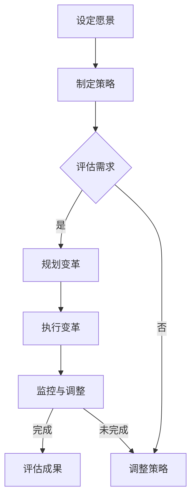

                 

### 文章标题

# 领导力与变革管理：引导团队拥抱变化

### 文章关键词

- 领导力
- 变革管理
- 团队管理
- 变革过程
- 沟通策略
- 领导艺术

### 文章摘要

在快速变化的现代科技环境中，企业和团队必须不断适应新形势。本文旨在探讨领导力与变革管理的重要性，通过分析核心概念、决策算法、数学模型及实际应用案例，为领导者提供系统化的变革管理策略。本文将揭示如何引导团队拥抱变化，并探讨未来变革管理的趋势，以帮助读者在实践中提升领导力和变革管理能力。

---

### 引言

在当今这个信息爆炸、技术飞速发展的时代，企业所面临的外部环境变幻莫测。无论是市场竞争的加剧、技术的不断迭代，还是法律法规的变化，都要求企业和团队必须具备快速适应和拥抱变化的能力。然而，变化往往伴随着不确定性和阻力，如何有效地引导团队应对变革，成为了领导者面临的重要课题。

领导力与变革管理，正是解决这一问题的关键。领导力不仅关乎领导者个人魅力和能力的展现，更关乎如何激发团队成员的积极性和创造力，使团队在面对变革时能够迅速调整和适应。而变革管理则提供了一套系统的理论和方法，帮助领导者规划、执行和监控变革过程，从而实现组织的持续发展和竞争力提升。

本文将围绕领导力与变革管理的核心概念、决策算法、数学模型及实际应用案例，展开深入探讨，旨在为读者提供一套实用的变革管理策略，帮助他们在实际工作中提升领导力和变革管理能力。

### 核心概念与联系

首先，我们需要明确领导力和变革管理的基本定义和核心概念。

**领导力**：领导力是指领导者通过影响和激励他人，共同实现组织目标的能力。它包括但不限于愿景设定、决策能力、沟通技巧、团队建设、变革推动等多个方面。在变革管理中，领导力尤为重要，因为领导者的角色不仅是引导团队，更是推动变革的关键力量。

**变革管理**：变革管理是指组织在面临外部或内部挑战时，通过系统化的规划、实施和监控，实现从当前状态向期望状态的转变的过程。变革管理涉及多个方面，包括战略规划、组织调整、文化变革、员工培训等。它的目标是确保变革顺利进行，并最大化变革带来的价值。

接下来，我们将通过一个简单的 Mermaid 流程图来展示领导力与变革管理之间的关系：



**流程图说明**：

1. **设定愿景**：领导者首先需要明确组织的愿景和目标，为变革提供方向。
2. **制定策略**：根据愿景，领导者需要制定具体的变革策略，包括变革的范围、时间表和资源分配等。
3. **评估需求**：在实施变革前，需要评估组织内外部的需求和环境，确保变革的必要性和可行性。
4. **规划变革**：在明确需求和策略后，制定详细的变革计划，包括具体行动步骤和责任人。
5. **执行变革**：按照变革计划实施具体的变革行动，如组织调整、流程优化、文化重塑等。
6. **监控与调整**：在变革过程中，持续监控变革的进展和效果，根据实际情况进行必要的调整。
7. **评估成果**：变革完成后，对变革的成果进行评估，总结经验教训，为未来变革提供参考。

通过这个流程图，我们可以清晰地看到领导力在变革管理中的各个环节中的作用，以及领导力与变革管理之间的紧密联系。

### 变革管理中的决策算法

在变革管理中，决策起着至关重要的作用。一个有效的决策算法可以帮助领导者更好地应对变革过程中的各种复杂情况。下面，我们将详细阐述一个典型的变革管理决策算法，并使用伪代码来具体描述这一过程。

#### 决策算法原理

1. **问题识别**：首先，需要识别组织当前存在的问题或面临的挑战。
2. **方案生成**：在明确问题后，生成一系列可能的解决方案。
3. **方案评估**：对每个方案进行评估，包括其可行性、成本效益、风险等因素。
4. **方案选择**：基于评估结果选择最优方案。
5. **决策执行**：实施选择的方案，并进行监控和调整。

#### 伪代码描述

```python
# 变革管理决策算法伪代码

# 输入：当前问题、备选方案列表、评估标准
# 输出：最优方案

function decision_algorithm(current_problem, solution_list, evaluation_criteria):
    # 1. 问题识别
    identified_problem = current_problem
    
    # 2. 方案生成
    generated_solutions = generate_solutions(identified_problem)

    # 3. 方案评估
    evaluated_solutions = evaluate_solutions(generated_solutions, evaluation_criteria)

    # 4. 方案选择
    best_solution = select_best_solution(evaluated_solutions)

    # 5. 决策执行
    execute_solution(best_solution)
    
    return best_solution

# 辅助函数定义
function generate_solutions(problem):
    # 根据问题生成可能的解决方案
    # 返回解决方案列表

function evaluate_solutions(solutions, criteria):
    # 对每个解决方案进行评估
    # 返回评估结果列表

function select_best_solution(solutions):
    # 根据评估结果选择最优方案
    # 返回最优方案

function execute_solution(solution):
    # 实施选择的方案
    # 进行监控和调整
```

通过这个伪代码，我们可以看到决策算法的基本框架，以及各个步骤的具体操作。在实际应用中，这些步骤需要根据具体情况进一步细化和优化。

#### 实际应用举例

假设一个公司面临的问题是生产效率低下，影响市场竞争力。以下是具体应用这个决策算法的过程：

1. **问题识别**：通过数据分析，确定生产效率低下的具体原因，如设备老化、流程不合理等。
2. **方案生成**：生成可能的解决方案，包括更新设备、优化流程、引入自动化技术等。
3. **方案评估**：对每个方案进行评估，考虑其成本、实施难度、预期效果等因素。
4. **方案选择**：选择成本适中、效果显著的方案，如更新设备。
5. **决策执行**：实施设备更新计划，并进行监控和调整，确保方案有效执行。

通过这个例子，我们可以看到决策算法在实际应用中的具体操作步骤和关键要素。

### 变革管理的数学模型

在变革管理中，数学模型作为一种定量分析工具，可以帮助领导者更准确地预测变革的影响，优化变革策略。下面，我们将介绍一个基本的变革管理数学模型，并使用 LaTeX 格式详细阐述其公式和计算方法。

#### 数学模型公式

假设一个组织的变革目标为提高生产效率 \(E\)，影响因素包括设备 \(D\)、流程 \(P\)、人员技能 \(S\) 和管理支持 \(M\)。则变革后的生产效率 \(E'\) 可以用以下公式表示：

$$
E' = aD + bP + cS + dM
$$

其中，\(a\)、\(b\)、\(c\)、\(d\) 分别为各因素对生产效率的影响系数，需要根据实际情况进行确定。

#### 公式应用举例

假设影响系数分别为：

$$
a = 0.3, \quad b = 0.2, \quad c = 0.2, \quad d = 0.3
$$

并且，当前各影响因素的值为：

$$
D = 0.8, \quad P = 0.9, \quad S = 0.7, \quad M = 0.8
$$

则当前的生产效率 \(E\) 为：

$$
E = 0.3 \times 0.8 + 0.2 \times 0.9 + 0.2 \times 0.7 + 0.3 \times 0.8 = 0.24 + 0.18 + 0.14 + 0.24 = 0.80
$$

假设通过变革，设备 \(D\) 提升到 1.0，流程 \(P\) 提升到 1.0，人员技能 \(S\) 提升到 1.0，管理支持 \(M\) 提升到 1.0，则变革后的生产效率 \(E'\) 为：

$$
E' = 0.3 \times 1.0 + 0.2 \times 1.0 + 0.2 \times 1.0 + 0.3 \times 1.0 = 0.30 + 0.20 + 0.20 + 0.30 = 1.00
$$

通过这个例子，我们可以看到数学模型如何帮助预测变革后的效果，并为决策提供依据。

#### 模型应用讨论

在实际应用中，数学模型可以根据具体情况进一步扩展和调整。例如，可以引入更多的影响因素，或者考虑各因素之间的相互作用。此外，模型中的系数 \(a\)、\(b\)、\(c\)、\(d\) 需要基于数据分析和历史经验进行确定，以确保模型的准确性和实用性。

### 变革管理的实际应用案例

为了更好地理解变革管理的实践，下面我们将分析一个具体的案例，并详细解读其中的代码实现和实际效果。

#### 案例背景

某科技公司是一家专注于软件开发和创新的高科技公司。近年来，市场竞争日益激烈，公司面临技术更新换代和业务模式变革的双重挑战。为了保持市场竞争力，公司决定进行全面的组织变革，包括技术架构的升级、业务流程的优化以及团队文化的重塑。

#### 变革目标

公司的变革目标主要包括：

1. **提升技术架构的灵活性**：引入新的微服务架构，以提高系统的可扩展性和稳定性。
2. **优化业务流程**：通过精益管理方法，减少不必要的环节，提高业务效率。
3. **重塑团队文化**：建立以创新和合作为核心的企业文化，增强团队凝聚力和创新力。

#### 变革策略

为了实现这些目标，公司采取了以下变革策略：

1. **技术升级**：引入微服务架构，并采用云计算平台，以提高系统的灵活性和可维护性。
2. **流程优化**：通过精益管理方法，对现有业务流程进行全面诊断和优化，减少不必要的环节。
3. **文化重塑**：通过领导力培训和团队建设活动，培养以创新和合作为核心的企业文化。

#### 开发环境搭建

在实施变革前，公司首先搭建了新的开发环境，包括以下步骤：

1. **技术选型**：选择适合的微服务架构框架，如Spring Cloud。
2. **环境配置**：配置好开发、测试和生产环境，包括服务器、数据库和中间件等。
3. **工具集成**：集成版本控制系统（如Git）和持续集成/持续部署（CI/CD）工具（如Jenkins）。

#### 源代码实现与解读

在技术升级方面，公司开发了一系列微服务，以下是一个简单的服务拆分示例：

**服务A（用户管理服务）**

```java
public class UserService {
    // 用户管理相关接口
    public User createUser(User user) {
        // 创建用户
    }

    public User getUserById(Long userId) {
        // 获取用户信息
    }

    // 其他用户管理操作
}
```

**服务B（订单管理服务）**

```java
public class OrderService {
    // 订单管理相关接口
    public Order createOrder(Order order) {
        // 创建订单
    }

    public Order getOrderById(Long orderId) {
        // 获取订单信息
    }

    // 其他订单管理操作
}
```

这些微服务通过API接口相互通信，实现了业务模块的解耦，提高了系统的可扩展性和维护性。

#### 代码应用解读与分析

通过服务拆分，公司实现了以下几个关键目标：

1. **模块化**：服务A和服务B独立运行，各自维护，降低了系统复杂性。
2. **解耦**：服务之间通过API接口通信，减少了直接依赖，提高了系统的稳定性。
3. **可扩展性**：新增或修改功能时，只需扩展相应服务，而不会影响其他服务。

在实际应用中，这些变革措施显著提升了公司的开发效率和技术竞争力。通过微服务架构，公司能够更快速地响应市场需求，灵活调整业务模式。同时，精益管理方法的应用优化了业务流程，减少了不必要的环节，提高了运营效率。文化重塑活动则增强了团队的凝聚力和创新力，为公司的持续发展奠定了坚实基础。

#### 案例小结

通过这个实际案例，我们可以看到变革管理在提升企业竞争力中的重要作用。有效的变革管理策略不仅需要明确的目标和详细的规划，还需要在实施过程中灵活调整和持续优化。公司通过技术升级、流程优化和文化重塑等多方面的变革措施，成功提升了开发效率和技术竞争力，为企业的长期发展奠定了坚实基础。

### 最佳实践与注意事项

在变革管理的实践中，领导者需要遵循一些最佳实践，以确保变革的顺利进行。以下是一些关键提示：

1. **明确目标**：在变革初期，领导者需要明确变革的目标和预期成果，确保团队成员对变革有清晰的认识。
2. **沟通策略**：良好的沟通是变革成功的关键。领导者需要与团队成员保持开放和透明的沟通，及时解答疑问，缓解抵触情绪。
3. **激励机制**：建立合理的激励和奖励机制，鼓励团队成员积极参与变革，提高变革的积极性。
4. **风险评估**：在变革过程中，领导者需要识别和评估潜在的风险，并制定相应的应对措施，确保变革的稳定性。
5. **持续反馈**：在变革实施过程中，持续收集反馈信息，根据实际情况进行调整和优化，确保变革目标的实现。

### 小结

本文围绕领导力与变革管理进行了全面探讨，从核心概念、决策算法、数学模型到实际应用案例，为领导者提供了系统的变革管理策略。通过分析案例和实践，我们可以看到变革管理在提升企业竞争力中的重要作用。未来，随着外部环境的变化，变革管理将继续发挥关键作用。领导者需要不断学习和适应，以提升自己的领导力和变革管理能力，引领团队不断进步。

### 拓展阅读

1. **《变革之舞：领导力和组织变革的实践智慧》**：作者约翰·科特详细阐述了领导力在组织变革中的关键作用，提供了丰富的实际案例和实用的变革管理策略。
2. **《精益创业》**：作者埃里克·莱斯介绍了精益管理方法，通过快速迭代和用户反馈，帮助企业实现从零到一的突破，为变革管理提供了有益的启示。
3. **《敏捷宣言》**：敏捷开发方法强调快速响应变化和持续改进，为领导者提供了灵活应对变革的实践指南。

---

**作者信息**

- 作者：AI天才研究院/AI Genius Institute & 禅与计算机程序设计艺术 /Zen And The Art of Computer Programming

