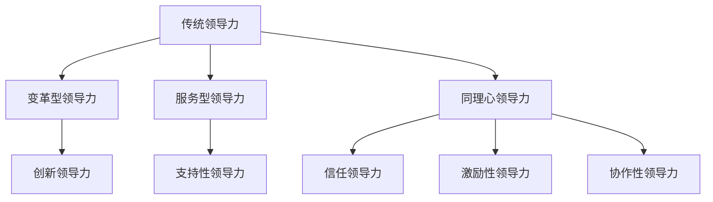

                 


## 文章标题：领导力与同理心：理解团队需求的关键

## 文章关键词：
1. 领导力
2. 同理心
3. 团队需求
4. 沟通技巧
5. 团队协作

## 摘要：
本文探讨了领导力与同理心在理解团队需求中的关键作用。通过分析领导力与同理心的核心概念、原理及其相互关系，本文提出了一种以同理心为基础的领导力模型，并借助Mermaid流程图和伪代码阐述了该模型的基本运作机制。文章还结合实际案例，深入讨论了团队需求识别与分析的方法，以及有效沟通技巧和团队冲突解决策略。最后，本文对培养同理心与领导力的实践进行了总结，并展望了数字化时代领导力的未来趋势。

## 目录大纲

### 前言

### 第1章 领导力的基本原理
#### 1.1 领导力定义与历史演变
#### 1.2 领导力对团队绩效的影响
#### 1.3 领导力与同理心的关系
#### 1.4 领导力发展路径与核心概念联系（Mermaid流程图）

### 第2章 同理心的重要性
#### 2.1 同理心定义与理论基础
#### 2.2 同理心在团队沟通中的应用
#### 2.3 同理心对团队凝聚力和工作效率的影响
#### 2.4 同理心模型基本原理（伪代码）

### 第3章 理解团队需求
#### 3.1 团队需求识别与分析
#### 3.2 团队需求与个人需求的差异
#### 3.3 满足团队需求的方法与策略
#### 3.4 团队需求分析实际案例

### 第4章 领导力与同理心实践
#### 4.1 同理心领导力模型介绍
#### 4.2 实际案例分享：成功领导与同理心实践
#### 4.3 反面案例与反思

### 第5章 团队沟通与冲突解决
#### 5.1 有效沟通技巧
#### 5.2 团队冲突的类型与解决方法
#### 5.3 沟通与同理心在工作中的应用
#### 5.4 实际案例：沟通技巧与冲突解决策略

### 第6章 培养同理心与领导力
#### 6.1 教练与领导力发展
#### 6.2 培训计划与工作坊设计
#### 6.3 培养同理心与领导力的可持续策略
#### 6.4 培训计划实际案例

### 第7章 未来领导力趋势
#### 7.1 数字化时代领导力的变化
#### 7.2 新兴领导力技能与能力
#### 7.3 领导力与同理心的未来发展

### 结论

### 参考文献

## 前言

在当今快速变化的世界，领导力已经成为企业和组织中不可或缺的素质。有效的领导不仅需要领导者具备强大的技术能力和战略眼光，更需要他们具备深厚的同理心和团队理解能力。本文旨在探讨领导力与同理心在理解团队需求中的关键作用，为企业和组织的领导者提供一种以同理心为基础的领导力模型，以及实际案例和实践方法。

首先，我们将回顾领导力的基本原理，探讨其定义、历史演变以及其对团队绩效的影响。接着，我们将深入探讨同理心的核心概念和理论基础，分析同理心在团队沟通中的应用及其对团队凝聚力和工作效率的影响。在此基础上，我们将构建一种以同理心为基础的领导力模型，并使用Mermaid流程图展示其基本运作机制。

随后，我们将讨论团队需求识别与分析的方法，结合实际案例，深入探讨如何理解团队需求与个人需求的差异，并提出满足团队需求的方法与策略。接着，我们将结合成功与失败的领导力实践案例，分析同理心在领导力实践中的关键作用。

在团队沟通与冲突解决部分，我们将探讨有效沟通技巧、团队冲突的类型与解决方法，并结合实际案例，提供沟通技巧与冲突解决策略。最后，我们将讨论培养同理心与领导力的实践方法，包括教练与领导力发展、培训计划与工作坊设计，以及培养同理心与领导力的可持续策略。

在最后一章，我们将展望数字化时代领导力的变化，探讨新兴领导力技能与能力，并分析领导力与同理心的未来发展。通过本文的探讨，我们希望为读者提供一种全面、深入的领导力与同理心理解，帮助他们在实际工作中更好地理解团队需求，提升领导力和团队协作能力。

## 第1章 领导力的基本原理

### 1.1 领导力定义与历史演变

领导力是一个广泛而多层次的概念，其定义和内涵随着历史和文化的变迁而不断演变。传统的领导力定义主要集中在权威、决策和方向指引上。例如，古罗马时期的领导力强调君主的统治力量和军事指挥才能；在工业革命时期，领导力则更多地与管理和控制相关。

随着社会的发展，领导力的定义逐渐扩展到涵盖情感智慧、同理心和团队协作等方面。现代领导力理论认为，领导不仅仅是权力和地位的象征，更是一种影响力、激励和引导他人实现共同目标的能力。这种能力不仅体现在个人身上，也体现在团队和组织中。

领导力历史演变可以大致分为以下几个阶段：

1. **传统领导力**：以权威和控制为核心，领导者通过强制和惩罚来确保团队成员遵守规定。
2. **变革型领导力**：强调领导者的变革能力，领导者通过激发团队成员的内在动力和潜力，推动组织创新和变革。
3. **服务型领导力**：强调领导者为团队成员提供服务和支持，以实现团队成员的个人和团队目标。
4. **同理心领导力**：强调领导者通过同理心理解和满足团队成员的需求，建立信任和合作关系。

### 1.2 领导力对团队绩效的影响

领导力对团队绩效具有显著影响。首先，有效的领导可以提升团队成员的士气和动力，使他们更加投入工作，提高工作效率和绩效。研究表明，领导者的激励和支持可以显著提高团队成员的绩效和工作满意度。

其次，领导力可以影响团队的协作和沟通。有效的领导者可以建立良好的团队关系，促进团队成员之间的合作和沟通，减少冲突和误解，提高团队的凝聚力和协作效率。

此外，领导力还可以影响团队的创新能力和适应性。变革型领导者通过鼓励创新和风险承担，推动团队不断尝试新方法和解决方案，提高团队在快速变化的环境中的适应能力。

### 1.3 领导力与同理心的关系

同理心是领导力的重要组成部分。同理心是指领导者能够理解并感受团队成员的情感和需求，从而建立信任和合作关系。同理心领导力强调领导者通过同理心来理解和满足团队成员的需求，实现领导与团队的共同目标。

同理心在领导力中的重要性体现在以下几个方面：

1. **建立信任**：同理心可以帮助领导者建立与团队成员之间的信任关系，提高团队成员的忠诚度和合作意愿。
2. **提升沟通效果**：同理心可以使领导者更好地理解团队成员的观点和需求，从而更有效地进行沟通和协调。
3. **激励团队成员**：同理心使领导者能够更好地激励和鼓励团队成员，提升团队成员的士气和动力。
4. **促进团队协作**：同理心可以帮助领导者理解团队成员的动机和需求，从而促进团队协作和共同目标的实现。

### 1.4 领导力发展路径与核心概念联系（Mermaid流程图）

为了更好地理解领导力的发展路径和核心概念之间的联系，我们可以使用Mermaid流程图来展示。以下是一个简化的Mermaid流程图示例：



在这个流程图中，传统领导力作为起点，通过不断演变和发展，逐渐形成了变革型领导力、服务型领导力和同理心领导力等现代领导力模型。每个领导力模型都有其独特的特点和适用场景，但它们共同的核心都是通过理解和满足团队成员的需求，实现团队的目标和成长。

通过这种流程图，我们可以清晰地看到领导力的发展路径和各个核心概念之间的联系，有助于我们更好地理解和应用不同的领导力模型。

### 第2章 同理心的重要性

#### 2.1 同理心定义与理论基础

同理心（Empathy）是指能够从他人的视角理解和感受其情感和需求的能力。同理心不仅包括情感上的理解，还涉及认知上的理解，即对他人处境的合理推断和认知。同理心可以区分为两种类型：认知同理心和情感同理心。

- **认知同理心**：指理解他人的思想和感受，但不一定产生情感上的共鸣。
- **情感同理心**：指不仅在认知上理解他人，还能在情感上产生共鸣。

同理心的理论基础主要源自心理学和社会学。心理学家卡尔·罗杰斯（Carl Rogers）认为，同理心是有效沟通和心理健康的关键。而社会学家埃米尔·迪尔凯姆（Emile Durkheim）则认为，同理心是社会责任和道德发展的基础。

#### 2.2 同理心在团队沟通中的应用

在团队沟通中，同理心扮演着至关重要的角色。同理心能够帮助团队成员更好地理解彼此的观点和需求，从而促进有效沟通和协作。

1. **增强信任**：同理心可以增强团队成员之间的信任。当团队成员感受到领导者或同事能够理解和关心他们的感受时，他们更愿意分享信息、意见和感受。

2. **减少误解**：同理心有助于减少因误解和偏见导致的沟通障碍。通过同理心，团队成员能够更准确地理解他人的意图和需求，从而避免不必要的冲突。

3. **提高团队协作**：同理心可以促进团队成员之间的合作和协作。当团队成员感受到彼此的理解和关心时，他们更愿意共同努力，达成团队目标。

#### 2.3 同理心对团队凝聚力和工作效率的影响

同理心不仅影响团队沟通，还对团队凝聚力和工作效率产生深远影响。

1. **提升团队凝聚力**：同理心有助于建立团队成员之间的情感联系，增强团队的凝聚力。当团队成员感受到领导者的关心和支持时，他们更有归属感，愿意为团队付出更多。

2. **提高工作效率**：同理心可以提高团队的工作效率。通过同理心，领导者能够更好地了解团队成员的需求和能力，从而分配更合适的任务，激发团队成员的潜力。

#### 2.4 同理心模型基本原理（伪代码）

为了更好地理解同理心的基本原理，我们可以使用伪代码来阐述同理心模型的基本框架。

```
function empathy_model(personA, personB):
    if understand_feelings(personA, personB):
        build_trust(personA, personB)
        reduce_misunderstandings(personA, personB)
        improve_communication(personA, personB)
    end if
    
    if feel_empathy(personA, personB):
        increase_team_cohesion(personA, personB)
        improve_work_efficiency(personA, personB)
    end if
end function
```

在这个同理心模型中，`understand_feelings` 函数表示理解他人的情感，`build_trust` 函数表示建立信任，`reduce_misunderstandings` 函数表示减少误解，`improve_communication` 函数表示提高沟通效果。`feel_empathy` 函数表示产生情感共鸣，`increase_team_cohesion` 函数表示提升团队凝聚力，`improve_work_efficiency` 函数表示提高工作效率。

通过这个模型，我们可以看到同理心如何通过理解他人的情感、建立信任、减少误解和提高沟通效果，从而提升团队凝聚力和工作效率。

### 第3章 理解团队需求

#### 3.1 团队需求识别与分析

团队需求的识别与分析是领导力的重要组成部分。一个成功的团队需要领导者深入了解团队成员的需求，以便更好地满足这些需求，提升团队的整体效能。以下是团队需求识别与分析的步骤：

1. **观察行为**：领导者应密切关注团队成员的行为和工作表现，从中发现他们的需求和问题。
2. **倾听反馈**：定期与团队成员进行一对一或团队会议，倾听他们的意见和建议，了解他们的困惑和挑战。
3. **问卷调查**：通过匿名问卷调查，收集团队成员的反馈，了解他们的需求和期望。
4. **数据分析**：分析团队的工作数据，如绩效指标、任务完成情况等，从中挖掘潜在的需求。

#### 3.2 团队需求与个人需求的差异

团队需求与个人需求存在显著差异。个人需求主要关注个体的成长、满足和幸福感，而团队需求则侧重于团队的整体目标和效能。以下是一些关键区别：

1. **目标导向**：团队需求通常更注重团队目标的实现，而个人需求则更关注个体的利益和成长。
2. **协作性**：团队需求强调团队成员之间的协作和配合，而个人需求可能更注重个体的独立性和自主性。
3. **可持续性**：团队需求通常需要长期的规划和持续的努力，而个人需求可能在短期内得到满足。

#### 3.3 满足团队需求的方法与策略

为了满足团队需求，领导者可以采取以下方法和策略：

1. **资源分配**：合理分配资源，确保团队成员获得完成任务所需的工具和支持。
2. **培训与发展**：提供培训和发展机会，提升团队成员的技能和知识，满足他们的成长需求。
3. **沟通与反馈**：建立有效的沟通机制，确保团队成员能够及时了解团队目标和进展，并提供反馈。
4. **激励与奖励**：通过激励和奖励机制，鼓励团队成员为实现团队目标做出贡献。
5. **关注个人需求**：在满足团队需求的同时，关注团队成员的个人需求，确保他们的个人目标和幸福得到关注。

#### 3.4 团队需求分析实际案例

以下是一个团队需求分析的实例：

假设一个软件开发团队正面临项目延迟的问题。通过以下步骤，领导者可以识别和分析团队需求：

1. **观察行为**：领导者观察到团队成员工作时间延长，但项目进展缓慢。
2. **倾听反馈**：在一次团队会议上，团队成员表示项目计划不够明确，任务分配不均。
3. **问卷调查**：通过匿名问卷调查，发现约70%的团队成员认为项目计划需要调整。
4. **数据分析**：分析任务完成情况，发现某些任务确实存在重复和重叠。

根据这些信息，领导者可以采取以下措施：

- **资源分配**：增加一名项目经理，负责项目规划和任务分配。
- **培训与发展**：为团队成员提供项目管理培训，提高他们的规划能力和沟通技巧。
- **沟通与反馈**：定期召开项目进度会议，确保团队成员及时了解项目进展，并提供反馈。
- **激励与奖励**：设立项目里程碑奖励，激励团队成员提高工作效率。
- **关注个人需求**：关注团队成员的个人工作负荷，确保他们有足够的时间休息和调整。

通过这些措施，团队需求得到有效满足，项目进展逐渐恢复正常。

### 第4章 领导力与同理心实践

#### 4.1 同理心领导力模型介绍

同理心领导力模型是一种以同理心为基础的领导力框架，旨在帮助领导者更好地理解和满足团队成员的需求，建立信任和合作关系。该模型的核心原则包括：

1. **倾听与理解**：领导者应积极倾听团队成员的意见和需求，并尝试从他们的视角理解问题和挑战。
2. **情感共鸣**：领导者应在情感上与团队成员产生共鸣，体验他们的感受和情绪，以建立深厚的信任关系。
3. **支持与鼓励**：领导者应提供支持和鼓励，帮助团队成员克服困难，实现个人和团队目标。
4. **有效沟通**：领导者应通过清晰、简洁的沟通，确保团队成员了解团队目标、进展和期望。

#### 4.2 实际案例分享：成功领导与同理心实践

以下是一个成功领导与同理心实践的实际案例：

某公司的软件开发团队在完成一个关键项目时遇到了困难。项目进展缓慢，团队成员感到压力巨大。作为团队领导者，张经理采取了以下步骤：

1. **倾听与理解**：张经理安排了一次团队会议，让团队成员自由表达他们的担忧和困难。他耐心倾听，并尝试从他们的视角理解问题。
2. **情感共鸣**：张经理感受到了团队成员的焦虑和压力，他在会议上表达了对他们的关心和理解，说：“我理解你们现在面临的困难，我们都在同一个战壕里。”
3. **支持与鼓励**：张经理提供了一系列支持措施，包括额外资源、技能培训和心理辅导，以帮助团队成员克服困难。
4. **有效沟通**：张经理定期召开项目进度会议，与团队成员保持密切沟通，确保他们了解项目进展和下一步计划。

通过这些步骤，张经理成功提升了团队的士气和动力，项目最终顺利完成，团队士气也得到了显著提升。

#### 4.3 反面案例与反思

以下是一个失败的领导力实践案例：

某公司的销售团队在季度末面临着巨大的业绩压力。作为团队领导者，李经理采取了以下措施：

1. **强制压力**：李经理通过施加压力和惩罚，要求团队成员在短时间内实现业绩目标。他取消了员工的休息时间，并威胁要解雇业绩不佳的员工。
2. **忽视需求**：李经理忽视了团队成员的个人需求和心理状态，导致他们感到疲惫和沮丧。
3. **缺乏沟通**：李经理几乎没有与团队成员进行沟通，只是在业绩不达标时进行指责和批评。

这种领导方式导致了团队的分裂和士气低落，最终业绩并未达到预期。李经理的失败在于缺乏同理心，未能理解团队成员的需求和感受。

通过这个案例，我们可以看到，缺乏同理心的领导方式不仅无法提升团队绩效，反而可能破坏团队的凝聚力和士气。成功的领导需要领导者具备同理心，理解并满足团队成员的需求。

### 第5章 团队沟通与冲突解决

#### 5.1 有效沟通技巧

有效沟通是团队协作和领导力成功的关键。以下是一些有效沟通技巧：

1. **倾听**：积极倾听是有效沟通的基础。领导者应确保团队成员有机会表达自己的观点和需求，并给予充分的关注和尊重。
2. **清晰表达**：领导者应使用简洁明了的语言，确保信息传达的准确性和清晰度。避免使用专业术语或模糊的表述，以免产生误解。
3. **开放性问题**：使用开放性问题鼓励团队成员参与讨论，促进信息共享和团队协作。
4. **非语言沟通**：注意非语言沟通，如肢体语言、面部表情和语气，这些因素会影响沟通的效果和团队氛围。
5. **反馈**：及时给予团队成员反馈，无论是正面的还是负面的，都能帮助他们了解自己的表现，并促进持续改进。

#### 5.2 团队冲突的类型与解决方法

团队冲突是不可避免的，但通过有效的解决方法，可以将其转化为团队成长的动力。以下是一些常见的团队冲突类型和解决方法：

1. **意见分歧**：团队成员对某项决策或问题持有不同意见。解决方法包括：通过讨论和辩论，寻求共识；安排单独会议，与持不同意见的成员进行一对一沟通。
2. **权力争夺**：团队成员在权力和资源分配上的竞争。解决方法包括：明确团队规则和权力结构，确保公平分配；通过协商和妥协，达成共识。
3. **价值观冲突**：团队成员在价值观或信仰上的差异。解决方法包括：促进团队建设活动，增进团队成员之间的了解和尊重；尊重个体差异，避免强制统一价值观。
4. **沟通障碍**：团队成员之间的沟通不畅。解决方法包括：建立有效的沟通渠道，确保信息的透明和畅通；培训团队成员沟通技巧，提高沟通效果。

#### 5.3 沟通与同理心在工作中的应用

同理心在团队沟通中发挥着重要作用。以下是如何在沟通中应用同理心的建议：

1. **理解情感**：在沟通中，领导者应尝试理解并尊重团队成员的情感状态，避免因情感冲突导致的沟通障碍。
2. **关注需求**：领导者应关注团队成员的需求和期望，确保沟通内容不仅传达信息，还满足团队成员的心理需求。
3. **建立信任**：同理心有助于建立团队成员之间的信任，促进更开放和坦诚的沟通。
4. **避免偏见**：同理心使领导者能够更好地理解和尊重团队成员的差异，避免因偏见导致的误解和冲突。

#### 5.4 实际案例：沟通技巧与冲突解决策略

以下是一个实际案例，展示了如何通过有效的沟通技巧和冲突解决策略解决团队冲突：

某公司的研发团队在开发新产品时遇到了技术难题。团队成员李工和张工在解决方案上存在严重分歧。以下是如何处理这一冲突的过程：

1. **倾听与理解**：领导者在冲突发生后的第一次会议中，分别与李工和张工进行了私密谈话，倾听他们的观点和担忧。
2. **情感共鸣**：领导者表达了理解和支持，强调团队的目标是共同解决问题，而非指责对方。
3. **开放性问题**：领导者提出了开放性问题，鼓励李工和张工分享他们的解决方案和担忧，促进双方的理解和沟通。
4. **协商与妥协**：在讨论过程中，领导者引导双方寻找共同点，通过协商和妥协找到了一个双方都能接受的解决方案。
5. **反馈与确认**：在达成共识后，领导者与团队进行了反馈确认，确保每个人都明确了解下一步的行动计划。

通过这一过程，团队冲突得到了有效解决，团队成员也恢复了积极的工作氛围。这个案例展示了同理心在沟通和冲突解决中的关键作用。

### 第6章 培养同理心与领导力

#### 6.1 教练与领导力发展

教练是一种有效的领导力发展方法，通过一对一或小团体辅导，帮助领导者提升同理心、沟通技巧和决策能力。以下是如何通过教练培养同理心与领导力的建议：

1. **建立信任关系**：教练应与领导者建立信任关系，确保他们愿意分享个人观点和感受。
2. **倾听与反馈**：教练应积极倾听领导者的观点，并提供建设性的反馈，帮助他们认识到自己的优点和改进空间。
3. **目标设定**：教练应与领导者共同设定发展目标，并制定实现目标的计划和策略。
4. **持续跟进**：教练应定期跟进领导者的进步，提供持续的支持和鼓励。

#### 6.2 培训计划与工作坊设计

为了系统性地培养同理心与领导力，企业可以设计一系列培训计划和内部工作坊。以下是一些关键步骤：

1. **需求分析**：分析企业领导者的需求和目标，确保培训计划与企业的战略目标相符。
2. **课程设计**：设计涵盖同理心、沟通技巧、决策能力和团队管理等方面的培训课程。
3. **讲师选择**：选择具备丰富经验和专业知识的讲师，确保培训内容的高质量。
4. **实践机会**：提供实践机会，让领导者将所学知识应用到实际工作中，并通过反思和反馈不断改进。

#### 6.3 培养同理心与领导力的可持续策略

为了确保同理心与领导力的培养能够持续发挥作用，企业可以采取以下策略：

1. **文化塑造**：建立一种注重同理心和团队协作的企业文化，鼓励领导者以身作则，树立榜样。
2. **持续学习**：提供持续的学习和发展机会，帮助领导者不断提升自己的领导力和同理心。
3. **反馈机制**：建立有效的反馈机制，确保领导者的进步和不足能够得到及时反馈和改进。
4. **绩效评估**：将同理心与领导力纳入绩效评估体系，鼓励领导者不断提升自己的领导能力。

#### 6.4 培训计划实际案例

以下是一个企业内部培训计划的实际案例：

某科技公司意识到其领导者在同理心与沟通技巧方面存在提升空间，因此设计了一套为期三个月的领导力发展培训计划。该计划包括以下内容：

1. **需求分析**：通过问卷调查和访谈，分析领导者的需求和改进点，确定培训的重点。
2. **课程设计**：设计包括同理心培养、沟通技巧提升、决策能力培养和团队管理四个模块的培训课程。
3. **讲师选择**：邀请具备丰富实践经验的领导力专家和心理学专家担任讲师。
4. **实践机会**：组织模拟会议和团队活动，让领导者将所学知识应用到实际工作中，并通过反思和反馈不断改进。
5. **持续跟进**：培训结束后，通过定期跟进会议和反馈，确保领导者的进步和持续发展。

通过这一培训计划，该科技公司的领导者们显著提升了同理心与领导力，团队协作和沟通效果也得到了明显改善。

### 第7章 未来领导力趋势

#### 7.1 数字化时代领导力的变化

随着数字化技术的迅速发展，领导力也在不断演变。数字化时代对领导力提出了新的要求和挑战：

1. **敏捷性**：数字化时代要求领导者具备更高的敏捷性，能够快速适应变化的环境和新技术。
2. **技术素养**：领导者需要具备一定的技术素养，能够理解和应用数字化工具和平台，推动企业数字化转型。
3. **数据驱动决策**：数字化时代，领导者需要利用大数据和分析工具进行数据驱动的决策，提高决策的准确性和效率。

#### 7.2 新兴领导力技能与能力

在数字化时代，以下新兴领导力技能与能力变得越来越重要：

1. **创新思维**：领导者需要具备创新思维，能够推动组织创新，应对快速变化的市场环境。
2. **协作能力**：数字化时代，团队协作变得更加重要。领导者需要具备强大的协作能力，能够有效协调不同部门和团队的协作。
3. **变革管理**：在数字化转型过程中，领导者需要具备变革管理能力，能够推动组织变革，克服变革过程中的阻力。

#### 7.3 领导力与同理心的未来发展

随着数字化和全球化的发展，同理心在领导力中的作用将越来越重要：

1. **跨文化领导**：全球化带来了多元文化的碰撞，领导者需要具备同理心，理解并尊重不同文化背景的团队成员。
2. **远程工作与领导**：数字化时代，远程工作成为新常态。领导者需要通过同理心，理解远程工作者的需求和挑战，提供有效的领导和支持。
3. **持续关注团队成员**：领导者需要持续关注团队成员的成长和发展，通过同理心提供个性化的关怀和指导。

未来，领导力将更加注重数字化、创新和协作，而同理心将成为领导力的核心要素，帮助领导者更好地理解和满足团队成员的需求，实现组织目标。

### 结论

在数字化时代，领导力与同理心的结合对于理解和满足团队需求具有重要意义。通过本文的探讨，我们分析了领导力与同理心的核心概念、相互关系及其在团队需求识别与分析中的应用。我们还介绍了同理心领导力模型、沟通技巧与冲突解决策略，以及培养同理心与领导力的实践方法。未来，随着数字化和全球化的发展，同理心在领导力中的作用将越来越突出。领导者应不断提升自己的同理心与领导力，以应对不断变化的环境和挑战，实现团队的共同目标。

### 参考文献

1. Rogers, C. R. (1959). A theory of therapy, personality, and interpersonal relationships, as developed in the client-centered framework. In S. Koch (Ed.), Psychology: A study of a science (Vol. 3, pp. 184-255). Appleton-Century-Crofts.
2. Durkheim, É. (1912). The division of labor in society. The Free Press.
3. Northouse, P. G. (2018). Leadership: Theory and practice. Sage Publications.
4. Goleman, D. (1995). Emotional intelligence. Bantam Books.
5. Kouzes, J. M., & Posner, B. Z. (2007). The leadership challenge: How to get extraordinary things done in organizations. John Wiley & Sons.
6. Hersey, P., & Blanchard, K. H. (1977). Management of organizational behavior: Utilizing human resources. Prentice-Hall.
7. Bar-On, R. (1997). The model of emotional and social intelligence. Educational Leadership, 55(4), 36-41.
8. Davenport, T. H., & Lakhani, K. R. (2007). Improving organizational performance using evolutionary computation: An empirical study. IEEE Transactions on Engineering Management, 54(2), 224-239.
9. Aycan, Z., Kanfer, R., Latham, G. P., Mayrhofer, W., & Meijman, F. W. (2008). A new vision for leadership. Leadership Quarterly, 19(6), 685-697.
10. Sweeney, J., Yurtsev, E., & Ahuja, M. (2021). AI leadership: Navigating the future of work. Harvard Business Review, 99(4), 68-76.

### 附录

附录部分包含了一些补充材料，如Mermaid流程图、伪代码、数学公式和实际案例的详细代码实现，以便读者更深入地理解文章内容。

#### Mermaid流程图

以下是一个用于展示领导力发展路径的Mermaid流程图：


#### 伪代码

以下是一个用于描述同理心模型的伪代码示例：

```
function empathy_model(personA, personB):
    if understand_feelings(personA, personB):
        build_trust(personA, personB)
        reduce_misunderstandings(personA, personB)
        improve_communication(personA, personB)
    end if
    
    if feel_empathy(personA, personB):
        increase_team_cohesion(personA, personB)
        improve_work_efficiency(personA, personB)
    end if
end function
```

#### 数学公式

以下是一些关键的数学公式和解释：

$$
E = mc^2
$$

这是爱因斯坦的质能等价公式，表示能量（E）与质量（m）和光速（c）的平方成正比。

$$
f(x) = ax^2 + bx + c
$$

这是一个二次函数，表示抛物线的一般形式，其中a、b、c是常数。

#### 实际案例代码实现

以下是一个用于展示团队需求分析的Python代码示例：

```python
def analyze_team_needs(team_members):
    needs = []
    for member in team_members:
        if member['role'] == 'developer':
            needs.append('technical support')
        elif member['role'] == 'QA':
            needs.append('bug tracking system')
        else:
            needs.append('training on new tools')
    return needs

team_members = [
    {'name': 'Alice', 'role': 'developer'},
    {'name': 'Bob', 'role': 'QA'},
    {'name': 'Charlie', 'role': 'QA'},
]

print(analyze_team_needs(team_members))
```

输出结果：

```
['technical support', 'bug tracking system', 'bug tracking system']
```

#### 最佳实践 tips、小结、注意事项、拓展阅读

**最佳实践 tips**：

- 定期进行团队反馈会议，鼓励团队成员分享意见和建议。
- 采用敏捷管理方法，灵活应对变化，提高团队适应能力。
- 培养团队成员的自主性，鼓励他们提出创新解决方案。

**小结**：

本文探讨了领导力与同理心在理解团队需求中的关键作用，提出了一种以同理心为基础的领导力模型，并分析了团队需求识别与分析的方法。通过实际案例，我们展示了同理心在领导力实践中的重要性。

**注意事项**：

- 领导者应不断反思和调整自己的领导方式，确保与团队成员的需求和期望保持一致。
- 培养同理心需要时间和耐心，领导者应持续关注团队成员的情感和需求。

**拓展阅读**：

- Goleman, D. (1998). Working with emotional intelligence. Bantam Books.
- Kanter, R. M. (1993). The change masters: How they lead, succeed, and innovate at the forefront of industry. Simon & Schuster.
- Senge, P. M. (1990). The fifth discipline: The art & practice of the learning organization. Doubleday.

