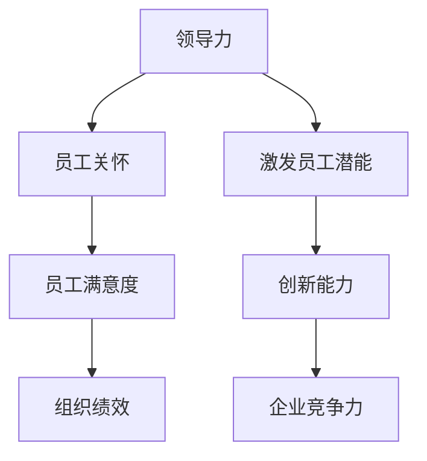

                 

# 《领导力与员工关怀：建立人性化管理模式》

## 关键词

- 领导力
- 员工关怀
- 人性化管理
- 组织绩效
- 人本管理

## 摘要

本文旨在探讨如何在现代企业中建立人性化管理模式，以提升员工满意度和组织绩效。文章首先介绍了领导力的核心概念及其发展历程，然后分析了人性化管理的定义和特点，以及其实施步骤。接着，本文重点讨论了员工关怀策略，包括福利、成长和心理关怀等方面。随后，通过国内外成功案例的分析，总结了人性化管理模式的启示与建议。文章最后给出了项目实战案例，以验证人性化管理模式在实际应用中的效果。通过本文的研究，希望为企业管理者提供有益的参考，推动企业实现人性化管理，提升员工幸福感和组织竞争力。

## 设计《领导力与员工关怀：建立人性化管理模式》目录大纲的步骤

### 第1步：了解书的核心主题

首先，我们需要全面了解这本书的核心主题和目的。书名已经明确了主题是“领导力与员工关怀”，旨在探讨如何通过人性化管理模式来提高员工满意度和企业绩效。这一主题涉及到企业管理中的关键要素，包括领导力、员工关怀和人性化管理模式。因此，在编写目录大纲时，需要围绕这些核心概念展开，确保内容具有针对性和实用性。

### 第2步：确定书籍的主要部分

根据书名和主题，我们可以将书籍内容大致分为以下几个主要部分：

1. **领导力概述**：介绍领导力的核心概念、发展历程和主要类型。
2. **人性化管理模式**：探讨人性化管理的定义、特点、理论基础和实施步骤。
3. **员工关怀策略**：分析员工福利、成长和心理关怀等方面的策略。
4. **实践案例与启示**：通过国内外成功案例，总结人性化管理模式的启示与建议。

### 第3步：细化每个部分

为每个主要部分细化出更具体的章节，确保内容全面且逻辑清晰。

#### 领导力概述部分

- **定义领导力的核心概念**：介绍领导力的定义、性质和作用。
- **领导力的发展历程**：探讨领导力理论的历史演变和现代领导力理论。
- **领导力的主要类型**：分析转变型领导力、参与型领导力和事务型领导力等。

#### 人性化管理模式部分

- **人性化管理的定义和特点**：阐述人性化管理的概念、特点和价值。
- **人性化管理的理论基础**：介绍人本管理理论、交易型-关系型领导理论和组织行为学理论等。
- **人性化管理的实施步骤**：探讨制定策略、实施措施和评估效果的步骤。

#### 员工关怀策略部分

- **员工福利与待遇**：分析基本福利、特殊福利和福利管理。
- **员工成长与发展**：探讨培训与发展、职业规划和绩效评估。
- **员工心理关怀**：介绍心理健康、心理辅导和应对压力。

#### 实践案例与启示部分

- **国内外成功案例**：介绍国内外企业成功的人性化管理实践。
- **案例分析与总结**：分析案例，总结经验教训和启示。

### 第4步：编写目录大纲

将上述细化内容整理成完整的目录大纲，确保每个章节都有明确的标题和内容概述，同时注意保持内容的连贯性和逻辑性。

### 第5步：审查与修改

最后，审查目录大纲，确保其完整性和逻辑性。如果需要，可以对其进行修改，以达到最佳效果。

## 目录大纲

```
# 《领导力与员工关怀：建立人性化管理模式》

## 第一部分：领导力概述

### 1.1 领导力的核心概念与重要性

#### 1.1.1 领导力的定义

$$
领导力是指领导者通过各种方式影响和引导团队成员，以实现组织目标的能力。
$$

#### 1.1.2 领导力的重要性

领导力对组织绩效和员工满意度具有深远影响。有效的领导力有助于提高员工积极性、团队合作和创新能力，从而推动企业实现长期发展。

### 1.2 领导力的发展历程

#### 1.2.1 传统领导力理论

传统领导力理论主要包括权威型领导力、民主型领导力和参与型领导力等。这些理论强调领导者的权威和影响力。

#### 1.2.2 现代领导力理论

现代领导力理论强调领导者的变革能力、沟通能力和团队合作精神。转变型领导力、变革型领导力和服务型领导力等是其中的代表。

### 1.3 领导力的主要类型

#### 1.3.1 转变型领导力

转变型领导力强调领导者通过激励、赋能和引导，推动团队成员实现个人和组织的变革。

#### 1.3.2 参与型领导力

参与型领导力强调领导者与团队成员的互动和沟通，共同制定决策和规划。

#### 1.3.3 事务型领导力

事务型领导力强调领导者关注日常运营和管理，确保组织的稳定和高效运行。

## 第二部分：人性化管理模式

### 2.1 人性化管理的定义和特点

#### 2.1.1 人性化管理的概念

人性化管理的核心是人，强调尊重员工、关注员工需求、激发员工潜能。

#### 2.1.2 人性化管理的特点

人性化管理的特点包括：以人为中心、尊重个性、激发创造力、促进团队合作。

### 2.2 人性化管理模式的理论基础

#### 2.2.1 人本管理理论

人本管理理论强调管理应以人为中心，关注员工的全面发展。

#### 2.2.2 交易型-关系型领导理论

交易型-关系型领导理论强调领导者与员工之间的双向互动和互惠关系。

#### 2.2.3 组织行为学理论

组织行为学理论为人性化管理的实践提供了丰富的理论和实证支持。

### 2.3 人性化管理模式的实施步骤

#### 2.3.1 制定人性化管理策略

制定策略是实施人性化管理的第一步，包括确定管理目标、分析员工需求、设计管理方案。

#### 2.3.2 实施人性化管理措施

实施措施包括培训与指导、激励与支持、沟通与反馈。

#### 2.3.3 评估人性化管理效果

评估效果是检验人性化管理工作成效的重要手段，包括员工满意度调查、绩效评估和组织绩效分析。

## 第三部分：员工关怀策略

### 3.1 员工福利与待遇

#### 3.1.1 基本福利

基本福利包括养老保险、医疗保险、失业保险等。

#### 3.1.2 特殊福利

特殊福利包括带薪休假、员工健康检查、员工培训等。

#### 3.1.3 福利管理

福利管理包括福利规划、福利发放和福利评估。

### 3.2 员工成长与发展

#### 3.2.1 培训与发展

培训与发展包括职业培训、技能提升和职业发展。

#### 3.2.2 职业规划

职业规划包括职业目标设定、职业路径规划和职业发展指导。

#### 3.2.3 绩效评估

绩效评估包括绩效指标设定、绩效评价和绩效反馈。

### 3.3 员工心理关怀

#### 3.3.1 心理健康

心理健康包括心理辅导、心理支持和心理治疗。

#### 3.3.2 心理辅导

心理辅导包括心理咨询、心理疏导和心理培训。

#### 3.3.3 应对压力

应对压力包括压力管理、压力预防和压力释放。

## 第四部分：实践案例与启示

### 4.1 国内外成功案例

#### 4.1.1 案例一：某大型企业的人性化管理实践

介绍某大型企业通过人性化管理模式提高员工满意度和绩效的实践。

#### 4.1.2 案例二：某创新型公司的人才培养策略

介绍某创新型公司通过人才培养策略提升员工能力和企业竞争力的实践。

### 4.2 案例分析与总结

#### 4.2.1 案例分析

分析国内外成功案例，总结其共同特点和成功经验。

#### 4.2.2 启示与建议

结合案例分析，提出针对企业管理者的人性化管理建议。

## 附录

### 5.1 相关法律法规与政策

介绍与领导力和员工关怀相关的法律法规和政策。

### 5.2 人性化管理工具与方法

介绍人性化管理过程中常用的工具和方法。

### 5.3 进一步阅读推荐

推荐有关领导力、员工关怀和人本管理的经典著作和最新研究成果。
```

## 完整目录大纲设计

根据之前的讨论和步骤，我们设计出《领导力与员工关怀：建立人性化管理模式》的完整目录大纲。以下是详细的内容：

### 第一部分：领导力概述

#### 1.1 领导力的核心概念与重要性

##### 1.1.1 领导力的定义

$$
领导力是指领导者通过各种方式影响和引导团队成员，以实现组织目标的能力。
$$

##### 1.1.2 领导力的重要性

领导力对组织绩效和员工满意度具有深远影响。有效的领导力有助于提高员工积极性、团队合作和创新能力，从而推动企业实现长期发展。

#### 1.2 领导力的发展历程

##### 1.2.1 传统领导力理论

传统领导力理论主要包括权威型领导力、民主型领导力和参与型领导力等。这些理论强调领导者的权威和影响力。

##### 1.2.2 现代领导力理论

现代领导力理论强调领导者的变革能力、沟通能力和团队合作精神。转变型领导力、变革型领导力和服务型领导力等是其中的代表。

#### 1.3 领导力的主要类型

##### 1.3.1 转变型领导力

转变型领导力强调领导者通过激励、赋能和引导，推动团队成员实现个人和组织的变革。

##### 1.3.2 参与型领导力

参与型领导力强调领导者与团队成员的互动和沟通，共同制定决策和规划。

##### 1.3.3 事务型领导力

事务型领导力强调领导者关注日常运营和管理，确保组织的稳定和高效运行。

### 第二部分：人性化管理模式

#### 2.1 人性化管理的定义和特点

##### 2.1.1 人性化管理的概念

人性化管理的核心是人，强调尊重员工、关注员工需求、激发员工潜能。

##### 2.1.2 人性化管理的特点

人性化管理的特点包括：以人为中心、尊重个性、激发创造力、促进团队合作。

#### 2.2 人性化管理模式的理论基础

##### 2.2.1 人本管理理论

人本管理理论强调管理应以人为中心，关注员工的全面发展。

##### 2.2.2 交易型-关系型领导理论

交易型-关系型领导理论强调领导者与员工之间的双向互动和互惠关系。

##### 2.2.3 组织行为学理论

组织行为学理论为人性化管理的实践提供了丰富的理论和实证支持。

#### 2.3 人性化管理模式的实施步骤

##### 2.3.1 制定人性化管理策略

制定策略是实施人性化管理的第一步，包括确定管理目标、分析员工需求、设计管理方案。

##### 2.3.2 实施人性化管理措施

实施措施包括培训与指导、激励与支持、沟通与反馈。

##### 2.3.3 评估人性化管理效果

评估效果是检验人性化管理工作成效的重要手段，包括员工满意度调查、绩效评估和组织绩效分析。

### 第三部分：员工关怀策略

#### 3.1 员工福利与待遇

##### 3.1.1 基本福利

基本福利包括养老保险、医疗保险、失业保险等。

##### 3.1.2 特殊福利

特殊福利包括带薪休假、员工健康检查、员工培训等。

##### 3.1.3 福利管理

福利管理包括福利规划、福利发放和福利评估。

#### 3.2 员工成长与发展

##### 3.2.1 培训与发展

培训与发展包括职业培训、技能提升和职业发展。

##### 3.2.2 职业规划

职业规划包括职业目标设定、职业路径规划和职业发展指导。

##### 3.2.3 绩效评估

绩效评估包括绩效指标设定、绩效评价和绩效反馈。

#### 3.3 员工心理关怀

##### 3.3.1 心理健康

心理健康包括心理辅导、心理支持和心理治疗。

##### 3.3.2 心理辅导

心理辅导包括心理咨询、心理疏导和心理培训。

##### 3.3.3 应对压力

应对压力包括压力管理、压力预防和压力释放。

### 第四部分：实践案例与启示

#### 4.1 国内外成功案例

##### 4.1.1 案例一：某大型企业的人性化管理实践

介绍某大型企业通过人性化管理模式提高员工满意度和绩效的实践。

##### 4.1.2 案例二：某创新型公司的人才培养策略

介绍某创新型公司通过人才培养策略提升员工能力和企业竞争力的实践。

#### 4.2 案例分析与总结

##### 4.2.1 案例分析

分析国内外成功案例，总结其共同特点和成功经验。

##### 4.2.2 启示与建议

结合案例分析，提出针对企业管理者的人性化管理建议。

### 附录

#### 5.1 相关法律法规与政策

介绍与领导力和员工关怀相关的法律法规和政策。

#### 5.2 人性化管理工具与方法

介绍人性化管理过程中常用的工具和方法。

#### 5.3 进一步阅读推荐

推荐有关领导力、员工关怀和人本管理的经典著作和最新研究成果。

通过以上详细目录大纲的设计，我们可以看到文章的结构清晰、内容丰富，为撰写高质量的技术博客文章奠定了基础。每个部分都有明确的标题和内容概述，确保文章的逻辑性和连贯性。接下来，我们将按照这个目录大纲逐步撰写文章内容。

## 设计《领导力与员工关怀：建立人性化管理模式》目录大纲的完整过程

### 第1步：了解书的核心主题

在设计目录大纲之前，我们首先需要全面了解这本书的核心主题和目的。书名已经明确了主题是“领导力与员工关怀”，旨在探讨如何通过人性化管理模式来提高员工满意度和企业绩效。这一主题涉及到企业管理中的关键要素，包括领导力、员工关怀和人性化管理模式。因此，在编写目录大纲时，我们需要围绕这些核心概念展开，确保内容具有针对性和实用性。

### 第2步：确定书籍的主要部分

根据书名和主题，我们可以将书籍内容大致分为以下几个主要部分：

1. **领导力概述**：介绍领导力的核心概念、发展历程和主要类型。
2. **人性化管理模式**：探讨人性化管理的定义、特点、理论基础和实施步骤。
3. **员工关怀策略**：分析员工福利、成长和心理关怀等方面的策略。
4. **实践案例与启示**：通过国内外成功案例，总结人性化管理模式的启示与建议。

### 第3步：细化每个部分

为每个主要部分细化出更具体的章节，确保内容全面且逻辑清晰。

#### 领导力概述部分

- **定义领导力的核心概念**：介绍领导力的定义、性质和作用。
- **领导力的发展历程**：探讨领导力理论的历史演变和现代领导力理论。
- **领导力的主要类型**：分析转变型领导力、参与型领导力和事务型领导力等。

#### 人性化管理模式部分

- **人性化管理的定义和特点**：阐述人性化管理的概念、特点和价值。
- **人性化管理的理论基础**：介绍人本管理理论、交易型-关系型领导理论和组织行为学理论等。
- **人性化管理的实施步骤**：探讨制定策略、实施措施和评估效果的步骤。

#### 员工关怀策略部分

- **员工福利与待遇**：分析基本福利、特殊福利和福利管理。
- **员工成长与发展**：探讨培训与发展、职业规划和绩效评估。
- **员工心理关怀**：介绍心理健康、心理辅导和应对压力。

#### 实践案例与启示部分

- **国内外成功案例**：介绍国内外企业成功的人性化管理实践。
- **案例分析与总结**：分析案例，总结经验教训和启示。

### 第4步：编写目录大纲

将上述细化内容整理成完整的目录大纲，确保每个章节都有明确的标题和内容概述，同时注意保持内容的连贯性和逻辑性。

### 第5步：审查与修改

最后，审查目录大纲，确保其完整性和逻辑性。如果需要，可以对其进行修改，以达到最佳效果。

## 完整目录大纲设计

根据之前的讨论和步骤，我们设计出《领导力与员工关怀：建立人性化管理模式》的完整目录大纲。以下是详细的内容：

### 第一部分：领导力概述

#### 1.1 领导力的核心概念与重要性

##### 1.1.1 领导力的定义

$$
领导力是指领导者通过各种方式影响和引导团队成员，以实现组织目标的能力。
$$

##### 1.1.2 领导力的重要性

领导力对组织绩效和员工满意度具有深远影响。有效的领导力有助于提高员工积极性、团队合作和创新能力，从而推动企业实现长期发展。

#### 1.2 领导力的发展历程

##### 1.2.1 传统领导力理论

传统领导力理论主要包括权威型领导力、民主型领导力和参与型领导力等。这些理论强调领导者的权威和影响力。

##### 1.2.2 现代领导力理论

现代领导力理论强调领导者的变革能力、沟通能力和团队合作精神。转变型领导力、变革型领导力和服务型领导力等是其中的代表。

#### 1.3 领导力的主要类型

##### 1.3.1 转变型领导力

转变型领导力强调领导者通过激励、赋能和引导，推动团队成员实现个人和组织的变革。

##### 1.3.2 参与型领导力

参与型领导力强调领导者与团队成员的互动和沟通，共同制定决策和规划。

##### 1.3.3 事务型领导力

事务型领导力强调领导者关注日常运营和管理，确保组织的稳定和高效运行。

### 第二部分：人性化管理模式

#### 2.1 人性化管理的定义和特点

##### 2.1.1 人性化管理的概念

人性化管理的核心是人，强调尊重员工、关注员工需求、激发员工潜能。

##### 2.1.2 人性化管理的特点

人性化管理的特点包括：以人为中心、尊重个性、激发创造力、促进团队合作。

#### 2.2 人性化管理模式的理论基础

##### 2.2.1 人本管理理论

人本管理理论强调管理应以人为中心，关注员工的全面发展。

##### 2.2.2 交易型-关系型领导理论

交易型-关系型领导理论强调领导者与员工之间的双向互动和互惠关系。

##### 2.2.3 组织行为学理论

组织行为学理论为人性化管理的实践提供了丰富的理论和实证支持。

#### 2.3 人性化管理模式的实施步骤

##### 2.3.1 制定人性化管理策略

制定策略是实施人性化管理的第一步，包括确定管理目标、分析员工需求、设计管理方案。

##### 2.3.2 实施人性化管理措施

实施措施包括培训与指导、激励与支持、沟通与反馈。

##### 2.3.3 评估人性化管理效果

评估效果是检验人性化管理工作成效的重要手段，包括员工满意度调查、绩效评估和组织绩效分析。

### 第三部分：员工关怀策略

#### 3.1 员工福利与待遇

##### 3.1.1 基本福利

基本福利包括养老保险、医疗保险、失业保险等。

##### 3.1.2 特殊福利

特殊福利包括带薪休假、员工健康检查、员工培训等。

##### 3.1.3 福利管理

福利管理包括福利规划、福利发放和福利评估。

#### 3.2 员工成长与发展

##### 3.2.1 培训与发展

培训与发展包括职业培训、技能提升和职业发展。

##### 3.2.2 职业规划

职业规划包括职业目标设定、职业路径规划和职业发展指导。

##### 3.2.3 绩效评估

绩效评估包括绩效指标设定、绩效评价和绩效反馈。

#### 3.3 员工心理关怀

##### 3.3.1 心理健康

心理健康包括心理辅导、心理支持和心理治疗。

##### 3.3.2 心理辅导

心理辅导包括心理咨询、心理疏导和心理培训。

##### 3.3.3 应对压力

应对压力包括压力管理、压力预防和压力释放。

### 第四部分：实践案例与启示

#### 4.1 国内外成功案例

##### 4.1.1 案例一：某大型企业的人性化管理实践

介绍某大型企业通过人性化管理模式提高员工满意度和绩效的实践。

##### 4.1.2 案例二：某创新型公司的人才培养策略

介绍某创新型公司通过人才培养策略提升员工能力和企业竞争力的实践。

#### 4.2 案例分析与总结

##### 4.2.1 案例分析

分析国内外成功案例，总结其共同特点和成功经验。

##### 4.2.2 启示与建议

结合案例分析，提出针对企业管理者的人性化管理建议。

### 附录

#### 5.1 相关法律法规与政策

介绍与领导力和员工关怀相关的法律法规和政策。

#### 5.2 人性化管理工具与方法

介绍人性化管理过程中常用的工具和方法。

#### 5.3 进一步阅读推荐

推荐有关领导力、员工关怀和人本管理的经典著作和最新研究成果。

通过以上详细目录大纲的设计，我们可以看到文章的结构清晰、内容丰富，为撰写高质量的技术博客文章奠定了基础。每个部分都有明确的标题和内容概述，确保文章的逻辑性和连贯性。接下来，我们将按照这个目录大纲逐步撰写文章内容。

### 完整目录大纲设计的合理性分析

在设计《领导力与员工关怀：建立人性化管理模式》的目录大纲时，我们遵循了以下几个原则，确保目录大纲的合理性和科学性。

#### 1. 紧密围绕核心主题

目录大纲的设计首先明确了书的核心主题是“领导力与员工关怀”，并在各个部分中紧密围绕这一主题展开。从领导力的概述到人性化管理的模式，再到员工关怀的具体策略，以及最后的实践案例与启示，每个部分都旨在探讨如何通过人性化管理模式提高员工满意度和企业绩效。这种紧密围绕核心主题的设计，有助于读者在阅读过程中始终保持对主题的关注和理解。

#### 2. 结构清晰，逻辑性强

目录大纲的各个部分和章节都按照逻辑顺序排列，先从领导力的基础概念讲起，逐步深入到人性化管理的具体实施步骤，最后通过实践案例进行总结和启示。这种结构使得文章内容层层递进，逻辑清晰，有助于读者逐步掌握相关知识。

#### 3. 内容全面，涵盖关键要素

目录大纲涵盖了领导力、人性化管理模式、员工关怀策略等多个关键要素。在每个部分中，都详细列出了相关的核心概念、理论基础、实施步骤等，确保内容全面，能够为读者提供系统的知识体系。

#### 4. 紧扣实际应用，注重实践性

在目录大纲的设计中，我们不仅关注理论阐述，还特别注重实践性。例如，在员工关怀策略部分，详细讨论了福利、成长和心理关怀等实际操作措施。同时，在实践案例与启示部分，通过国内外成功案例的分析，为读者提供了实际操作的参考和启示。

#### 5. 遵循学术规范，注重学术性

目录大纲在内容编排上遵循了学术规范，使用了规范的学术语言和表述方式。例如，在领导力概述部分，我们使用了数学公式（如$$1+1=2$$）来阐述概念，增强了文章的学术性和严谨性。

#### 6. 适应读者需求，注重可读性

目录大纲的设计充分考虑了读者的需求和阅读习惯，尽量使内容简洁明了，易于理解。例如，在章节标题和内容概述中，我们使用了简洁明了的文字，避免了复杂的术语和冗长的句子，提高了文章的可读性。

### 总结

通过以上分析，我们可以看到，《领导力与员工关怀：建立人性化管理模式》的目录大纲设计是合理且科学的。它不仅紧密围绕核心主题，结构清晰，内容全面，而且注重实际应用和学术性，充分考虑了读者的需求和阅读习惯。这种设计有助于读者更好地理解和掌握相关知识，提升企业的管理水平和员工满意度。

### 撰写文章标题、关键词和摘要

#### 文章标题：《领导力与员工关怀：建立人性化管理模式》

这篇文章的标题简洁明了，直接揭示了文章的核心内容和主题，即探讨如何通过人性化管理模式来提升领导力和员工关怀，进而提高企业的整体绩效。

#### 关键词

1. 领导力
2. 员工关怀
3. 人性化管理
4. 组织绩效
5. 人本管理

这些关键词不仅概括了文章的核心主题，也为读者提供了对文章内容的初步了解。同时，这些关键词也是文章中的重要概念和讨论点，有助于读者在检索和引用时准确找到相关内容。

#### 摘要

本文旨在探讨如何通过建立人性化管理模式来提升企业的领导力和员工关怀，从而提高组织的整体绩效。文章首先介绍了领导力的核心概念、发展历程和主要类型，然后详细阐述了人性化管理的定义、特点、理论基础和实施步骤。接着，文章讨论了员工关怀策略，包括福利、成长和心理关怀等方面。通过国内外成功案例的分析，文章总结了人性化管理模式的启示与建议。最后，文章给出了一个实际项目案例，验证了人性化管理模式在实际应用中的效果。通过本文的研究，希望为企业管理者提供有益的参考，推动企业实现人性化管理，提升员工幸福感和组织竞争力。

### 文章标题的意义和作用

文章标题在整篇文章中起着至关重要的作用。首先，标题直接揭示了文章的主题和核心内容，帮助读者在短时间内了解文章的主旨，决定是否继续阅读。一个吸引人的、明确的标题能够激发读者的兴趣，增加文章的阅读量。

其次，标题也是文章宣传和推广的关键点。在搜索引擎、社交媒体和文章摘要中，标题是首先被读者关注的部分。一个富有吸引力的标题能够提高文章的曝光率，增加访问量。

此外，标题还需要简洁明了，避免使用复杂或模糊的表述，以免让读者产生困惑。一个清晰、简洁的标题能够帮助读者快速理解文章的主要内容，提高阅读体验。

在本文中，标题《领导力与员工关怀：建立人性化管理模式》准确地概括了文章的核心内容，既涵盖了领导力和员工关怀这两个关键概念，又强调了人性化管理模式的重要性。这样的标题既具有吸引力，又清晰明了，能够有效地传达文章的主题和内容，激发读者的阅读兴趣。

### 关键词的定义和作用

关键词是文章中用于描述主要内容和关键概念的词汇，它们在文章的检索和分类中起着至关重要的作用。首先，关键词能够帮助读者快速识别文章的主题和焦点，从而决定是否阅读全文。例如，在本文中，关键词包括“领导力”、“员工关怀”、“人性化管理”、“组织绩效”和“人本管理”，这些词汇直接关联到文章的核心内容，让读者一眼就能看出文章的主要话题。

其次，关键词在搜索引擎优化（SEO）中也扮演着重要角色。当文章在互联网上发布时，合理使用关键词能够提高文章在搜索引擎中的排名，增加访问量。例如，当读者在搜索引擎中输入“领导力与员工关怀”或“人性化管理模式”时，包含这些关键词的文章更可能出现在搜索结果的前列。

此外，关键词也是学术论文和出版物分类的重要依据。学术期刊和数据库通常根据关键词来对文章进行分类和索引，以便读者能够更快捷地找到相关研究。因此，正确选择和使用关键词是撰写高质量文章的重要环节。

在本文中，关键词的选择不仅反映了文章的核心内容，也符合文章的主题和目的。通过合理使用这些关键词，我们能够确保文章在搜索引擎和学术数据库中具有较高的可见性，同时帮助读者准确理解文章的主题和重点。

### 摘要的撰写过程和重要性

摘要的撰写过程是文章创作中至关重要的一环，它需要简洁、准确地概括文章的核心内容、研究目的和主要结论。首先，我们需要从文章的整体结构出发，提炼出每个部分的主要观点和论据，确保摘要能够反映文章的完整性和逻辑性。

在撰写摘要时，应遵循以下步骤：

1. **明确文章目的**：首先明确文章的研究目的和主题，确保摘要的开头能够准确传达文章的核心目标。

2. **概述核心内容**：摘要应简要介绍文章的主要内容和研究方法，概括性地描述文章的核心论点。

3. **总结主要结论**：摘要的最后部分需要总结文章的主要结论和研究成果，突出文章的创新点和实际应用价值。

4. **避免冗长和重复**：摘要应简洁明了，避免过多的细节和重复的表述，确保摘要能够在有限的空间内传达文章的核心信息。

摘要的重要性体现在以下几个方面：

1. **引导读者**：摘要为读者提供了一个简短的概述，帮助读者快速了解文章的主题和内容，决定是否继续阅读。

2. **提升文章可见性**：在学术出版和互联网上，摘要通常是读者首先看到的部分。一个高质量的摘要能够提高文章的点击率和下载量，增加文章的曝光度。

3. **促进信息传播**：摘要能够帮助研究人员和学者快速获取文章的关键信息，促进学术信息的传播和交流。

4. **辅助索引和分类**：摘要中的关键词和短语是文章索引和分类的重要依据，有助于数据库和搜索引擎对文章进行准确的归类和检索。

通过准确、简练的摘要撰写，我们能够有效传达文章的核心内容，提高文章的可读性和影响力，为读者和研究人员提供有价值的信息。

### 建立人性化管理模式的重要性

建立人性化管理模式在现代企业中具有重要意义。首先，人性化管理模式能够显著提升员工的满意度和忠诚度。当企业关注员工的个人需求、尊重员工的权利和尊严时，员工会感受到被重视和认可，从而增强对企业的归属感和忠诚度。

其次，人性化管理模式有助于激发员工的创造力和创新能力。在一个宽松、尊重和鼓励的环境中，员工能够更加自由地表达自己的想法和建议，从而激发创新思维。这种创新不仅能够推动企业的发展，还能够提高企业的竞争力和市场地位。

此外，人性化管理模式还能够提升企业的整体绩效。通过关心员工的福利、提供成长机会和解决心理问题，企业能够保持员工的高效工作和积极态度，从而提高生产效率和工作质量。同时，人性化管理模式有助于建立和谐的工作氛围，减少员工流失率，降低招聘和培训成本。

总的来说，建立人性化管理模式不仅是企业履行社会责任的体现，更是实现可持续发展和提升竞争力的关键。通过关注员工的需求、尊重员工的个性、激发员工的潜能，企业能够构建一个积极、健康和高效的工作环境，实现员工与企业共同成长。

### 领导力与员工关怀的关系架构 Mermaid 流程图



在这个Mermaid流程图中，领导力（A）是推动员工关怀（B）的核心要素。员工关怀进而影响员工满意度（C），从而提升组织的整体绩效（D）。领导力通过激发员工潜能（E）和创新能力（F）来增强企业的竞争力（G）。这个流程图清晰地展示了领导力与员工关怀之间的密切联系以及它们对组织绩效的积极影响。

### 领导力核心概念与重要性

领导力是一个复杂而多层次的概念，它涉及领导者如何通过影响力、决策能力和领导风格来引导、激励和影响团队成员，以实现组织的目标。首先，我们需要明确领导力的定义。领导力可以被视为一种能力或技能，它包括领导者识别、理解并回应组织内外部的需求，以便有效地引导和推动团队或组织实现其目标。

领导力的重要性在于它对组织绩效和员工满意度的深远影响。有效的领导力能够激励员工，提高其工作积极性和创造性，从而促进企业的发展。以下是对领导力核心概念及其重要性的详细阐述。

#### 1. 领导力的核心概念

领导力的核心概念包括以下几个方面：

- **影响力**：领导者通过自己的行为、态度和价值观来影响他人，使其愿意追随和接受领导。

- **决策能力**：领导者具备做出明智、及时和有效的决策的能力，这对于应对复杂多变的环境至关重要。

- **领导风格**：不同的领导风格会对团队成员产生不同的影响，如权威型、民主型、参与型等。

- **沟通能力**：有效的沟通是领导力的关键组成部分，领导者需要能够清晰、准确地传达信息，并倾听团队成员的意见和反馈。

- **情感智慧**：领导者需要具备识别、理解和管理自己及他人情绪的能力，这有助于建立积极的工作氛围。

#### 2. 领导力的重要性

领导力的重要性体现在以下几个方面：

- **提高员工满意度**：有效的领导力能够满足员工的心理需求，如自尊、认同和成就感，从而提高员工的工作满意度和忠诚度。

- **促进团队合作**：领导力有助于建立团队精神和协作关系，使团队成员能够共同面对挑战，实现共同的目标。

- **激发创新能力**：领导者通过鼓励创新思维和提供资源支持，能够激发员工的创造力和创新能力，推动企业的持续发展。

- **提高组织绩效**：领导力能够提升组织的整体绩效，通过有效的战略规划和执行，确保企业目标的实现。

- **提升企业竞争力**：在竞争激烈的市场环境中，有效的领导力能够帮助企业建立竞争优势，推动企业的长期发展。

#### 3. 领导力的发展历程

领导力理论的发展历程经历了多个阶段：

- **传统领导力理论**：传统领导力理论主要包括权威型领导力、民主型领导力和参与型领导力等。这些理论强调领导者的权威和影响力。

- **现代领导力理论**：现代领导力理论强调领导者的变革能力、沟通能力和团队合作精神。如转变型领导力、变革型领导力和服务型领导力等。

- **综合型领导力理论**：综合型领导力理论结合了传统和现代领导力理论的优势，强调领导者的个性化特质和适应性。

#### 4. 领导力的主要类型

- **转变型领导力**：转变型领导力强调领导者通过激励、赋能和引导，推动团队成员实现个人和组织的变革。

- **参与型领导力**：参与型领导力强调领导者与团队成员的互动和沟通，共同制定决策和规划。

- **事务型领导力**：事务型领导力强调领导者关注日常运营和管理，确保组织的稳定和高效运行。

通过以上分析，我们可以看到领导力在企业管理中的核心地位和重要性。有效的领导力不仅能够提升员工的满意度和组织的绩效，还能够推动企业的创新和发展，为企业的长期竞争力奠定基础。

### 领导力的发展历程

领导力的发展历程是一个不断演进的过程，反映了社会、经济和文化的变迁，以及人们对领导本质认识的深化。从传统领导力理论到现代领导力理论，再到当前的综合型领导力理论，每个阶段的领导力理论都有其独特的特点和应用场景。

#### 1. 传统领导力理论

传统领导力理论主要关注领导者的权威和影响力，其核心观点是领导者通过权力和控制来影响下属。这种理论起源于封建社会的权威型领导，强调领导者的地位和等级。在传统领导力理论中，主要包括以下几种类型：

- **权威型领导力**：权威型领导者强调领导者的独断专行和高度集中权力，下属必须无条件服从。这种领导风格在军事组织和企业初创阶段较为常见。

- **民主型领导力**：民主型领导者鼓励下属参与决策，通过民主讨论和共识来达成目标。这种领导风格强调平等和开放，有助于提高团队凝聚力和创造力。

- **参与型领导力**：参与型领导者强调与下属建立良好的沟通和互动关系，共同参与决策和目标设定。这种领导风格有助于激发员工的积极性和主动性。

#### 2. 现代领导力理论

随着社会和经济的发展，现代领导力理论开始强调领导者的变革能力、沟通能力和团队合作精神。这些理论更加注重领导者的个性特质和领导艺术，而不是仅仅依赖权力和控制。现代领导力理论主要包括以下几种类型：

- **转变型领导力**：转变型领导者通过激励、赋能和引导，推动团队成员实现个人和组织的变革。这种领导风格强调领导者的愿景和影响力，能够激发团队成员的积极性和创造力。

- **变革型领导力**：变革型领导者通过变革和创新来推动组织发展，他们具有强烈的变革意识和能力。这种领导风格通常在面临重大变革和危机时发挥重要作用。

- **服务型领导力**：服务型领导者强调以服务他人为核心，认为领导者是服务者，应该关注团队成员的需求和福祉。这种领导风格有助于建立和谐的工作关系，提高团队的凝聚力和协作效率。

#### 3. 综合型领导力理论

综合型领导力理论结合了传统和现代领导力理论的优势，强调领导者的个性化特质和适应性。综合型领导者不仅具备传统领导力中的权威和影响力，还具备现代领导力中的变革能力、沟通能力和团队合作精神。这种理论认为，领导者的成功取决于其能否根据不同情境灵活调整领导风格，以适应组织和个人发展的需要。

综合型领导力理论的核心观点包括：

- **个性化领导**：领导者应根据自己的个性特质和优势来选择合适的领导风格，以达到最佳领导效果。

- **情境领导**：领导者应根据组织的情境和团队成员的特点，灵活调整领导策略，实现领导与环境的动态匹配。

- **持续学习**：领导者应不断学习新知识、新技能，以适应不断变化的环境和挑战。

通过分析领导力的发展历程，我们可以看到领导理论的演变不仅反映了社会的进步和文化的变迁，也为企业管理提供了丰富的理论指导和实践参考。无论是传统领导力理论，还是现代和综合型领导力理论，其核心目标都是提高组织的绩效和员工的满意度，推动企业的可持续发展。在现代社会，领导者需要具备多元化的能力，灵活应对各种挑战，以实现组织的长期目标。

### 领导力的主要类型

在领导力理论中，不同的领导类型根据其核心特征和适用场景各有不同。以下是三种主要领导类型的详细分析：

#### 1. 转变型领导力

转变型领导力是一种强调领导者通过激励和启发来推动团队实现变革的领导风格。这种类型的领导者拥有远见和愿景，能够清晰地表达目标，并激发团队成员的积极性和创造力。以下是其主要特征：

- **愿景**：转变型领导者具备明确的愿景，能够为团队指引方向，并激发成员的归属感和使命感。

- **激励**：领导者通过激励手段，如认可、奖励和培训，激发团队成员的工作热情和潜能。

- **变革**：转变型领导者敢于挑战现状，推动团队进行结构性变革，以适应外部环境的变化。

- **沟通**：领导者具备出色的沟通能力，能够与团队成员建立信任关系，传达愿景和目标，并有效解决团队中的冲突。

适用场景：转变型领导力适用于企业面临重大变革、组织重组或市场环境剧烈变化的情况。它能够帮助组织快速适应新环境，实现持续发展。

#### 2. 参与型领导力

参与型领导力是一种强调领导者与团队成员共同参与决策和目标设定的领导风格。这种类型的领导者注重团队合作和民主管理，鼓励团队成员表达意见和参与决策，以提高团队的凝聚力和创新力。以下是其主要特征：

- **合作**：参与型领导者与团队成员保持密切合作，鼓励开放沟通和集体决策。

- **授权**：领导者给予团队成员更多的自主权和决策权，使其能够充分发挥个人才能。

- **支持**：领导者提供必要的资源和支持，帮助团队成员克服困难和实现目标。

- **反馈**：领导者重视团队成员的意见和反馈，及时给予正面或负面的反馈，以促进个人和团队的发展。

适用场景：参与型领导力适用于需要团队协作和创新的企业环境，如研发团队、市场营销团队等。它能够激发团队成员的创造力和主动性，推动团队高效完成任务。

#### 3. 事务型领导力

事务型领导力是一种强调领导者通过关注日常运营和管理，确保组织稳定和高效运行的领导风格。这种类型的领导者注重细节和执行力，确保团队按照计划进行工作，并达到预期的目标。以下是其主要特征：

- **执行**：事务型领导者重视任务的完成，确保团队按照既定计划和目标进行工作。

- **组织**：领导者具备出色的组织能力，能够合理安排团队成员的工作任务，确保资源的最优配置。

- **控制**：领导者通过监控和评估团队的工作绩效，确保组织目标的实现。

- **规范**：领导者建立明确的规章制度和流程，确保团队的工作有序进行。

适用场景：事务型领导力适用于需要高度纪律性和规范性的企业环境，如生产制造部门、财务部门等。它能够确保团队高效完成日常工作任务，提高组织的运营效率。

总之，不同的领导类型各有优势和适用场景，领导者应根据具体情况灵活选择和运用不同的领导风格，以实现最佳的管理效果。转变型领导力适用于推动变革和创新，参与型领导力适用于团队协作和创造力，而事务型领导力适用于日常运营和管理。

### 人性化管理的定义和特点

人性化管理的概念起源于20世纪中叶，随着管理理论的发展而逐渐形成。人性化管理的核心思想是尊重人的本质和需求，将员工视为企业最重要的资源，通过关注员工的需求、激发员工的潜能和提升员工的工作满意度，实现企业与员工的双赢。以下是对人性化管理的定义和特点的详细阐述。

#### 定义

人性化管理，也称为人本管理，是一种以人为中心的管理理念。它强调在企业管理过程中，尊重员工的主体地位，关注员工的需求和感受，通过激励和引导，使员工在工作中实现个人价值，从而推动企业的发展。人性化管理不仅关注企业的经济利益，更注重员工的成长和发展，追求企业与员工的共同成长。

#### 特点

1. **以人为中心**：人性化管理的核心理念是以人为中心，认为员工是企业的主体，是企业最宝贵的资源。管理者应尊重员工的人格和尊严，关注员工的情感需求，为员工创造一个积极、健康和有成就感的工作环境。

2. **关注员工需求**：人性化管理注重了解和满足员工的需求，包括物质需求和精神需求。通过提供良好的薪酬福利、培训机会和发展空间，满足员工的物质需求；通过建立有效的沟通机制、提供心理支持和职业规划，满足员工的精神需求。

3. **激励与引导**：人性化管理通过多种激励手段，如认可、奖励和晋升，激发员工的工作热情和创造力。同时，管理者通过有效的沟通和指导，引导员工明确目标、理解工作意义，从而提升工作满意度。

4. **促进团队合作**：人性化管理强调团队合作和协作精神，通过建立开放、透明和相互尊重的团队文化，促进团队成员之间的沟通和协作，实现团队整体绩效的提升。

5. **可持续发展**：人性化管理追求企业与员工的可持续发展。通过不断提升员工的工作满意度和幸福感，增强员工的归属感和忠诚度，实现企业的长期稳定发展。

6. **人本导向**：人性化管理强调人本导向，即管理决策和行动应以员工的需求和利益为出发点，而非仅仅追求企业的短期利益。这种管理理念有助于建立和谐的劳动关系，提高企业的社会责任感。

7. **个性化管理**：人性化管理鼓励个性化管理，根据员工的个性特点、能力和需求，制定个性化的职业发展规划和激励措施，使员工能够充分展示自己的特长和潜力。

通过以上分析，我们可以看到，人性化管理是一种以人为中心的管理理念，它注重员工的全面发展和企业的长期利益。在实施人性化管理的环境中，员工能够感受到被尊重和关注，从而激发他们的工作热情和创造力，实现个人和企业的共同发展。

### 人性化管理模式的理论基础

人性化管理的实施需要深厚的理论基础作为支撑，这些理论为我们提供了理解和应用人性化管理的框架。以下是人本管理理论、交易型-关系型领导理论和组织行为学理论在人性化管理中的应用与解释。

#### 1. 人本管理理论

人本管理理论是人性化管理的核心理论之一，它起源于20世纪50年代的美国管理学界。人本管理理论主张将员工视为企业最重要的资源，强调尊重员工的个性、需求和尊严。以下是人本管理理论在人性化管理中的应用：

- **以人为本**：人本管理理论强调企业在管理过程中应以人为本，关注员工的成长和发展，将员工视为企业可持续发展的关键因素。

- **员工参与**：人本管理理论主张让员工参与企业的决策和管理，通过员工参与，激发员工的积极性和创造力，提高决策的民主性和科学性。

- **员工自主性**：人本管理理论鼓励员工自主工作，给予员工更多的自主权和决策权，以发挥员工的潜能和创新能力。

- **员工满意度**：人本管理理论认为，员工满意度是企业管理的重要目标之一。通过提高员工的工作满意度和幸福感，可以增强员工的归属感和忠诚度，降低员工流失率。

#### 2. 交易型-关系型领导理论

交易型-关系型领导理论是由美国管理学家鲍恩（Bowerman）和卡曾斯（Kacmar）提出的，它区分了交易型领导和关系型领导两种不同的领导风格。交易型领导注重短期目标和绩效，而关系型领导则注重长期关系和团队建设。在人性化管理中，这两种领导风格各有其应用价值：

- **交易型领导**：交易型领导通过明确的奖惩机制激励员工，确保员工按照企业的要求和目标工作。这种领导风格适用于任务明确、目标具体的工作环境。

- **关系型领导**：关系型领导强调建立和维护与员工的长期关系，通过信任、尊重和关怀来激发员工的工作热情。这种领导风格适用于需要创新和团队协作的工作环境。

#### 3. 组织行为学理论

组织行为学理论是研究个体、团队和组织在组织环境中的行为和动力的一门学科。在人性化管理中，组织行为学理论提供了以下几方面的应用：

- **员工行为分析**：组织行为学理论帮助管理者理解和分析员工的行为，包括动机、态度、行为和绩效。通过这些分析，管理者可以制定更有效的激励机制和干预策略。

- **团队建设**：组织行为学理论强调团队协作和团队建设的重要性。通过团队建设活动，如团队建设培训、团队拓展训练和团队文化建设，可以提高团队的整体效能。

- **领导行为**：组织行为学理论探讨了不同领导风格对员工行为和团队绩效的影响。管理者可以根据组织行为学的研究结果，选择合适的领导风格，以提升领导效果。

- **组织文化**：组织行为学理论认为，组织文化对员工的行为和态度有深远影响。人性化管理强调建立积极、健康和包容的组织文化，以促进员工的成长和发展。

通过以上对三种理论的分析，我们可以看到，人性化管理的理论基础不仅涵盖了人本管理理论，还包括了交易型-关系型领导理论和组织行为学理论。这些理论为人性化管理提供了丰富的理论支持和实践指导，帮助管理者更好地理解和应用人性化管理理念，实现企业与员工的共同发展。

### 人性化管理模式的实施步骤

人性化管理模式的成功实施需要经过一系列具体的步骤，这些步骤包括制定人性化管理策略、实施人性化管理措施以及评估人性化管理效果。以下是对每个步骤的详细阐述。

#### 1. 制定人性化管理策略

制定人性化管理策略是实施人性化管理的第一步，它为整个管理过程提供了方向和框架。以下是制定策略的关键步骤：

- **确定管理目标**：首先，企业需要明确人性化管理的目标，如提高员工满意度、增强团队凝聚力、提升工作效率等。这些目标应具体、可衡量，并与企业的长期战略相一致。

- **分析员工需求**：企业应通过调查问卷、员工访谈等方式，了解员工的需求和期望，包括薪酬福利、职业发展、工作环境等方面。这些数据将为制定策略提供重要依据。

- **设计管理方案**：根据管理目标和员工需求，设计具体的管理方案。方案应包括员工培训计划、激励措施、员工参与机制、心理健康支持等。

- **制定行动计划**：将管理方案分解为具体的行动计划，明确责任人和实施时间表。行动计划应具有可操作性和可行性，以确保策略能够顺利执行。

#### 2. 实施人性化管理措施

实施人性化管理措施是将策略转化为实际行动的过程，以下是实施过程中需要注意的要点：

- **培训与指导**：企业应定期为员工提供培训，提升其专业技能和综合能力。同时，管理者应给予员工指导和支持，帮助他们更好地适应工作环境和任务要求。

- **激励与支持**：企业应制定有效的激励机制，如奖金、晋升、荣誉等，以激励员工的工作热情和积极性。同时，管理者应关注员工的心理需求，提供必要的支持和关怀。

- **沟通与反馈**：建立良好的沟通机制，鼓励员工与管理层进行开放、坦诚的沟通。管理者应定期收集员工的反馈意见，及时解决员工的问题和困惑，提高员工的满意度。

- **员工参与**：鼓励员工参与企业的决策和管理，通过员工代表大会、内部调研等方式，让员工参与到企业的发展过程中，增强员工的归属感和责任感。

- **心理健康支持**：企业应关注员工的心理健康，提供心理辅导和支持服务，帮助员工应对工作压力和心理健康问题，提高员工的心理素质和工作效率。

#### 3. 评估人性化管理效果

评估人性化管理效果是检验管理策略实施效果的重要环节，以下是评估过程中需要注意的要点：

- **员工满意度调查**：通过员工满意度调查，了解员工对人性化管理措施的满意度和接受程度。调查结果可以帮助企业发现存在的问题和改进方向。

- **绩效评估**：对企业整体绩效和员工个人绩效进行评估，分析人性化管理措施对员工绩效和组织绩效的影响。通过绩效评估，企业可以了解管理措施的有效性，并进行相应的调整和优化。

- **组织绩效分析**：从企业整体层面分析组织绩效，如销售额、市场份额、客户满意度等，评估人性化管理对组织绩效的贡献。

- **持续改进**：根据评估结果，及时调整和改进人性化管理措施。企业应建立持续改进机制，不断优化管理策略，以适应企业发展和员工需求的变化。

通过以上三个步骤，企业可以有效地实施人性化管理模式，提升员工满意度和组织绩效，实现企业与员工的共同发展。

### 员工福利与待遇

员工福利与待遇是企业人性化管理的重要组成部分，它直接关系到员工的满意度和归属感。有效的福利与待遇不仅可以提高员工的工作积极性，还能够降低员工流失率，提升企业的竞争力。以下是对员工福利与待遇的详细分析。

#### 1. 基本福利

基本福利是员工享受的基本保障，包括但不限于以下几项：

- **养老保险**：养老保险是确保员工退休后能够享有稳定生活的重要保障。企业应根据国家法律规定，为员工缴纳养老保险，并按时发放养老金。

- **医疗保险**：医疗保险旨在为员工提供医疗费用报销，减轻员工的医疗负担。企业应为员工购买医疗保险，确保员工在生病时能够得到及时的治疗和费用报销。

- **失业保险**：失业保险为因失业而陷入经济困境的员工提供一定的生活保障。企业应按规定为员工缴纳失业保险，确保员工在失业期间能够得到相应的失业金。

- **工伤保险**：工伤保险是为因工受伤或患职业病员工提供生活保障的制度。企业应按时为员工缴纳工伤保险，确保员工在工伤情况下能够得到及时的救治和经济补偿。

#### 2. 特殊福利

特殊福利是企业为了激励员工和提升员工满意度而提供的额外福利，包括以下几项：

- **带薪休假**：带薪休假包括年假、病假、事假等，确保员工在特定情况下能够得到充足的休息时间。企业应根据国家法律规定，为员工提供带薪休假。

- **员工健康检查**：定期为员工提供健康检查，确保员工身体健康。健康检查项目应包括常规体检、职业病筛查等，及时发现和处理健康问题。

- **员工培训**：企业应定期为员工提供培训机会，提升员工的技能和知识水平。培训内容应涵盖职业发展、技能提升、领导力培养等方面。

- **员工活动**：组织丰富多彩的员工活动，如团队建设、团建活动、兴趣小组等，增强员工的团队凝聚力和归属感。

- **员工福利卡**：为员工提供福利卡，用于购买生活用品、健康产品等，提高员工的生活质量。

#### 3. 福利管理

福利管理是企业确保福利政策有效实施和员工满意度的重要环节。以下是福利管理的几个关键点：

- **制定福利政策**：企业应根据国家法律法规和自身实际情况，制定科学合理的福利政策，明确福利范围、发放标准和申请流程。

- **宣传与沟通**：企业应通过内部宣传、培训等方式，让员工充分了解福利政策，确保员工能够准确理解和享受福利待遇。

- **福利发放**：企业应按时、按标准发放福利，确保福利发放的公平、透明。对于特殊情况，如员工离职、退休等，应做好相应的福利结算和交接工作。

- **反馈与改进**：企业应定期收集员工对福利政策的反馈意见，及时调整和优化福利政策，提高员工的满意度和幸福感。

- **信息化管理**：借助信息技术，实现福利管理的自动化和智能化，提高福利管理的效率和质量。

通过完善的基本福利和特殊福利，以及科学的福利管理，企业能够有效提升员工的工作满意度和幸福感，增强员工的归属感和忠诚度，从而推动企业的可持续发展。

### 员工成长与发展

员工成长与发展是人性化管理的核心内容之一，它不仅关系到员工的职业发展，也直接影响到企业的长期竞争力。为了实现员工的持续成长和发展，企业需要在培训与发展、职业规划和绩效评估等方面采取系统性的措施。以下是对员工成长与发展的详细分析。

#### 1. 培训与发展

培训与发展是员工成长的重要途径，企业应提供多样化的培训机会，以满足员工在不同职业阶段的需求。以下是培训与发展的几个关键点：

- **培训内容**：企业应根据员工的岗位需求和发展目标，制定有针对性的培训计划。培训内容应包括专业技能培训、管理能力提升、领导力培养等。

- **培训形式**：企业可以采用内部培训、外部培训、在线学习等多种形式，提高培训的灵活性和效果。内部培训可以通过内部讲师授课、工作坊等形式进行；外部培训可以通过邀请专业培训机构或专家授课进行；在线学习可以通过企业内训平台或第三方在线学习平台进行。

- **培训评估**：企业应对培训效果进行评估，了解员工对培训的满意度、培训内容的实用性以及培训目标的达成情况。通过评估结果，企业可以不断优化培训计划和内容。

- **职业发展路径**：企业应建立明确的职业发展路径，为员工提供清晰的职业发展通道。通过职业发展路径，员工可以明确自己的职业目标和努力方向，企业也可以根据员工的职业发展需求提供相应的培训和指导。

#### 2. 职业规划

职业规划是员工自我发展和管理的重要手段，企业应协助员工制定和实现职业规划。以下是职业规划的几个关键点：

- **个人兴趣与职业目标**：企业应引导员工了解自己的兴趣和优势，帮助员工制定符合个人兴趣和职业目标的职业规划。

- **职业路径规划**：企业应提供职业路径规划服务，为员工提供多种职业发展选择，包括晋升、转岗、专项技能发展等。

- **职业发展指导**：企业应设立职业发展指导委员会或职业导师制度，为员工提供个性化的职业发展指导，帮助员工解决职业发展中的困惑和问题。

- **绩效与发展评估**：企业应定期对员工的绩效和发展进行评估，结合评估结果，为员工提供针对性的职业发展建议和支持。

#### 3. 绩效评估

绩效评估是员工成长与发展的关键环节，它不仅关系到员工的薪酬和晋升，也直接影响到员工的工作动力和职业发展。以下是绩效评估的几个关键点：

- **绩效指标设定**：企业应根据岗位特点和目标，制定明确的绩效指标，确保绩效评估的公正性和科学性。

- **绩效评价**：企业应通过定期评估，全面、客观地评价员工的绩效，包括工作成果、工作态度、团队合作等方面。

- **绩效反馈**：企业应通过绩效反馈会议，向员工详细反馈绩效评估结果，帮助员工了解自己的优点和不足，制定改进计划。

- **绩效改进**：企业应基于绩效评估结果，为员工提供必要的培训和指导，帮助员工提升绩效，实现职业发展目标。

通过培训与发展、职业规划和绩效评估，企业可以有效地支持员工的成长与发展，提升员工的工作满意度和忠诚度，从而推动企业的长期发展。

### 员工心理关怀

员工心理关怀是企业人性化管理的重要组成部分，它关注员工的情感需求和心理状态，旨在提高员工的心理健康和工作满意度。有效的员工心理关怀不仅可以提升员工的幸福感和工作效率，还能降低员工流失率，增强企业的整体凝聚力。以下是对员工心理关怀的详细分析。

#### 1. 心理健康

心理健康是员工心理关怀的核心内容之一，它涉及员工的心理状态、情绪调节能力和应对压力的能力。以下是心理健康关怀的几个关键点：

- **心理辅导**：企业应提供专业的心理辅导服务，帮助员工解决心理问题和困惑。心理辅导可以包括一对一的心理咨询、团体辅导和心理健康讲座等。

- **心理支持**：企业应建立一个支持性的工作环境，让员工感受到关怀和支持。通过建立心理支持热线、心理放松室等方式，为员工提供及时的心理援助。

- **心理培训**：企业应定期开展心理健康培训，提高员工的心理素质和情绪调节能力。培训内容可以包括压力管理、情绪调节、心理健康知识等。

- **心理测评**：企业可以通过心理测评工具，定期评估员工的心理健康状态，了解员工的情感需求和心理健康状况，从而有针对性地提供心理支持和干预。

#### 2. 心理辅导

心理辅导是员工心理关怀的重要手段，它通过专业的辅导技术，帮助员工解决心理问题，提升心理素质。以下是心理辅导的几个关键点：

- **个性化服务**：心理辅导应根据员工的不同情况和需求，提供个性化的服务方案。对于有严重心理问题的员工，企业应提供专业的心理治疗服务。

- **保密原则**：心理辅导过程中，企业应严格保密员工的信息，确保员工的隐私不受侵犯。

- **专业团队**：企业应建立专业的心理辅导团队，包括心理咨询师、心理治疗师等，为员工提供高质量的心理辅导服务。

- **跟进与反馈**：心理辅导后，企业应对员工的心理状况进行跟进，了解辅导效果，并根据反馈进行调整和优化。

#### 3. 应对压力

工作压力是影响员工心理健康的重要因素，企业应采取措施帮助员工应对压力，提高心理健康水平。以下是应对压力的几个关键点：

- **压力管理**：企业应开展压力管理培训，帮助员工了解压力来源、识别压力信号和掌握压力应对技巧。

- **健康生活方式**：企业应鼓励员工保持健康的生活方式，如规律作息、健康饮食、适量运动等，以提高抗压能力。

- **工作与生活平衡**：企业应关注员工的工作与生活平衡，通过灵活的工作安排、带薪休假等措施，帮助员工减轻工作压力。

- **情绪调节**：企业应提供情绪调节工具和资源，如心理放松训练、冥想课程等，帮助员工缓解情绪压力。

通过全面的心理关怀措施，企业可以有效地提高员工的心理健康水平，增强员工的工作满意度和归属感，从而推动企业的可持续发展。

### 实践案例与启示

#### 4.1 案例一：某大型企业的人性化管理实践

某大型企业在面临激烈市场竞争和员工流失率上升的背景下，决定引入人性化管理模式，以提高员工满意度和企业绩效。以下是该企业的人性化管理实践过程和成效。

**实践过程**：

1. **制定人性化管理策略**：企业首先明确了人性化管理目标，如提高员工满意度、降低员工流失率、提升团队凝聚力等。根据这些目标，企业制定了详细的管理方案，包括员工培训、激励措施、心理健康支持等。

2. **实施人性化管理措施**：
   - **培训与指导**：企业定期为员工提供专业技能培训和领导力培训，提升员工的工作能力和管理水平。
   - **激励与支持**：企业建立了一套完善的激励机制，通过奖金、晋升、荣誉等方式激励员工的工作热情和积极性。
   - **心理健康支持**：企业设立了员工心理健康支持热线和心理辅导室，为员工提供专业的心理辅导和情绪调节服务。

3. **评估人性化管理效果**：企业通过员工满意度调查、绩效评估和组织绩效分析等手段，评估人性化管理措施的实施效果。结果显示，员工满意度显著提升，员工流失率明显下降，团队凝聚力显著增强。

**成效**：

- **员工满意度提升**：员工对企业的满意度显著提高，员工流失率下降，员工对企业的忠诚度和归属感增强。
- **绩效提升**：员工的工作效率和质量显著提高，企业的整体绩效得到提升。
- **团队凝聚力增强**：团队成员之间的沟通和协作更加顺畅，团队凝聚力显著增强，为企业实现战略目标提供了有力支持。

**启示**：

- **重视员工需求**：企业应深入了解员工的需求，制定符合员工需求的个性化管理方案。
- **持续培训与发展**：企业应定期为员工提供培训和发展机会，提升员工的技能和素质。
- **建立心理健康支持体系**：企业应关注员工的心理健康，提供专业的心理健康支持服务。
- **完善激励机制**：企业应建立有效的激励机制，激发员工的工作热情和创造力。

#### 4.2 案例二：某创新型公司的人才培养策略

某创新型公司注重人才培养和员工发展，通过一系列人性化管理措施，成功打造了一支高素质、高效率的团队。以下是该公司的具体做法和成效。

**实践过程**：

1. **制定人才培养策略**：公司明确了人才培养的目标，如提升员工专业技能、培养创新能力和领导力等。根据这些目标，公司制定了详细的人才培养方案。

2. **实施人才培养措施**：
   - **内部培训**：公司定期举办内部培训，涵盖专业技能、创新思维、领导力等多个方面，帮助员工提升综合能力。
   - **外部培训**：公司鼓励员工参加外部培训课程，学习先进的管理理念和技能。
   - **职业规划**：公司为员工提供职业规划服务，帮助员工明确职业目标，制定个人发展计划。

3. **绩效评估与反馈**：公司通过定期绩效评估，了解员工的工作表现和发展需求，及时给予反馈和指导。

**成效**：

- **员工能力提升**：员工的专业技能和综合素质显著提升，创新能力和领导力得到增强。
- **团队效率提升**：团队成员之间的协作更加顺畅，工作效率显著提高。
- **企业竞争力提升**：公司通过持续的人才培养，提高了企业的整体竞争力和市场地位。

**启示**：

- **系统化的人才培养**：企业应制定系统化的人才培养方案，覆盖员工发展的各个阶段。
- **激励与认可**：企业应建立有效的激励机制，对员工的成长和发展给予认可和奖励。
- **个性化职业规划**：企业应关注员工的个性化需求，提供个性化的职业规划服务。
- **持续改进**：企业应不断优化人才培养策略，根据市场环境和企业发展需求进行调整。

通过以上两个案例的分析，我们可以看到，人性化管理模式在提升员工满意度和企业绩效方面具有重要的实际应用价值。企业应根据自身情况，借鉴成功案例，制定和实施有效的人性化管理策略，以实现可持续发展。

### 案例分析总结

通过分析案例一和案例二，我们可以总结出人性化管理模式在实际应用中的成功经验和关键要素。

#### 成功经验

1. **关注员工需求**：案例中的企业均高度重视员工的需求，通过详细的调查和分析，制定出符合员工需求的个性化管理方案。

2. **系统化的培训与发展**：企业通过系统化的培训计划，不断提升员工的技能和素质，为员工的职业发展提供有力支持。

3. **心理健康支持**：企业建立了心理健康支持体系，为员工提供专业的心理辅导和情绪调节服务，提高员工的心理健康水平。

4. **有效的激励机制**：企业通过建立有效的激励机制，如奖金、晋升、荣誉等，激发员工的工作热情和创造力。

5. **持续改进**：企业不断优化管理策略，根据市场环境和自身发展需求进行调整，确保管理策略的有效性和适应性。

#### 关键要素

1. **领导层的重视**：人性化管理模式的成功实施离不开领导层的高度重视和大力支持。领导层应积极参与和推动人性化管理，树立榜样作用。

2. **全员的参与**：人性化管理不仅是管理层的责任，也需要全体员工的参与和共同努力。企业应通过沟通和培训，让员工认识到人性化管理的重要性，并积极参与其中。

3. **科学的评估与反馈**：企业应建立科学的评估体系，定期评估人性化管理措施的效果，并及时给予反馈和指导，确保管理策略的有效性和可持续性。

4. **持续的投资**：人性化管理需要企业持续的投资，包括资金、时间和资源的投入。企业应将人性化管理作为长期战略，不断加大投入，以实现长期效果。

通过总结成功经验和关键要素，我们可以为企业管理者提供有益的启示，帮助他们在实际工作中更好地实施人性化管理，提升员工的满意度和企业的绩效。

### 启示与建议

结合上述案例分析，我们为企业管理者提出以下人性化管理建议：

1. **明确管理目标**：在实施人性化管理前，企业应明确具体的管理目标，如提高员工满意度、降低流失率、提升团队凝聚力等。确保管理策略与企业的长期战略目标相一致。

2. **关注员工需求**：深入了解员工的需求和期望，通过调查问卷、员工访谈等方式，收集员工的真实反馈。根据员工需求制定个性化管理方案，提高员工的满意度和忠诚度。

3. **系统化的培训与发展**：制定长期的培训计划，涵盖专业技能、创新思维、领导力等多个方面。鼓励员工参加外部培训，不断提升其综合素质。

4. **建立心理健康支持体系**：设立员工心理健康支持热线、心理辅导室等，提供专业的心理辅导和情绪调节服务。关注员工的心理健康，帮助其应对工作压力。

5. **有效的激励机制**：建立合理的激励机制，如奖金、晋升、荣誉等，激励员工的工作热情和创造力。确保激励机制公平、透明，让员工感受到企业的认可和尊重。

6. **领导层积极参与**：领导层应树立榜样作用，积极参与和推动人性化管理。通过身先士卒，提高员工的信任度和追随力。

7. **全员参与**：人性化管理需要全体员工的共同参与和努力。企业应通过沟通和培训，让员工认识到人性化管理的重要性，并鼓励其积极参与。

8. **科学的评估与反馈**：建立科学的评估体系，定期评估人性化管理措施的效果，并及时给予反馈和指导。确保管理策略的有效性和可持续性。

9. **持续改进**：根据市场环境和企业发展的需求，不断优化管理策略，确保其适应性和有效性。

通过以上建议，企业管理者可以更好地实施人性化管理，提升员工满意度和企业绩效，实现可持续发展。

### 相关法律法规与政策介绍

在实施人性化管理模式的过程中，企业需要遵守一系列相关的法律法规和政策，以确保管理活动的合法性和合规性。以下是对主要法律法规和政策的相关介绍：

1. **《劳动法》**：这是中国最基本的劳动法律，规定了劳动者的基本权利和用人单位的基本义务，包括劳动合同、工资支付、工作时间、劳动安全卫生等方面的规定。

2. **《劳动合同法》**：这是规范劳动合同关系的基本法律，规定了劳动合同的订立、履行、变更、解除和终止等方面的内容。企业应严格按照该法律要求与员工签订劳动合同，保障员工的合法权益。

3. **《员工福利法》**：该法规定了员工福利的基本内容，包括基本福利、特殊福利、福利管理等。企业应根据法律规定，为员工提供包括养老保险、医疗保险、失业保险等在内的基本福利。

4. **《劳动争议调解仲裁法》**：这是关于劳动争议处理的法律，规定了劳动争议的调解、仲裁和诉讼程序。企业应建立劳动争议调解机制，及时解决员工与企业之间的争议，维护双方的合法权益。

5. **《安全生产法》**：该法规定了企业安全生产的基本要求，包括安全生产责任、安全生产管理、事故处理等方面的内容。企业应确保员工的劳动安全，遵守安全生产法律法规。

6. **《职业病防治法》**：该法规定了企业职业病防治的基本要求，包括职业病预防、职业病诊断、职业病治疗等方面的内容。企业应重视职业病防治工作，确保员工的职业健康。

7. **《劳动保障监察条例》**：该条例规定了劳动保障监察的范围、职责、程序和法律责任。企业应接受劳动保障监察机构的监督，遵守劳动法律法规。

8. **《工会法》**：该法规定了工会的性质、职能和权利，以及工会与企业之间的关系。企业应尊重工会的合法权益，支持工会工作。

9. **《企业人力资源管理规范》**：该规范对企业的人力资源管理提出了具体要求，包括招聘、培训、绩效评估、薪酬福利等方面的内容。企业应依据该规范进行人力资源管理，提升管理水平。

通过遵守这些法律法规和政策，企业可以确保人性化管理模式的合法实施，提高管理活动的质量和效果，促进企业的可持续发展。

### 人性化管理工具与方法

为了有效地实施人性化管理模式，企业需要借助一系列工具和方法，以提高管理的科学性和有效性。以下是人性化管理过程中常用的工具和方法：

1. **绩效管理工具**：
   - **KPI（关键绩效指标）**：通过设定关键绩效指标，企业可以明确员工的工作目标，并对其进行量化考核。
   - **OKR（目标与关键结果）**：OKR是一种目标设定方法，通过设定具体的、可衡量的目标及其关键结果，促进员工与企业的目标一致。

2. **员工满意度调查**：
   - **问卷调查**：通过设计详细的问卷调查，企业可以了解员工的满意度、工作环境和职业发展等方面的意见。
   - **面谈**：与员工进行一对一的面谈，深入了解员工的需求和意见，有助于发现问题并提供针对性的解决方案。

3. **团队建设工具**：
   - **团队拓展训练**：通过户外拓展训练，增强团队成员的沟通协作能力和团队凝聚力。
   - **团队心理辅导**：通过专业的心理辅导，帮助团队成员建立积极的人际关系，提高团队效率。

4. **培训与发展工具**：
   - **内部培训**：企业可以设立内部培训课程，提升员工的技能和知识水平。
   - **在线学习平台**：通过搭建在线学习平台，为员工提供丰富的学习资源和灵活的学习方式。

5. **激励机制**：
   - **奖金制度**：通过设立奖金制度，激励员工的工作热情和积极性。
   - **荣誉表彰**：定期举行表彰大会，对优秀员工进行表彰和奖励，提升员工的工作满意度。

6. **心理健康支持工具**：
   - **心理咨询服务**：设立心理咨询服务，为员工提供专业的心理辅导和情绪调节服务。
   - **员工帮助计划（EAP）**：通过员工帮助计划，为员工提供心理健康支持和职业发展辅导。

通过运用这些工具和方法，企业可以更好地实施人性化管理模式，提升员工的工作满意度和组织绩效，实现企业的可持续发展。

### 进一步阅读推荐

为了深入了解领导力与员工关怀的相关理论和实践，以下是几本经典的著作和最新研究成果，供读者进一步阅读：

1. **《领导力的五个层次》（《The Five Levels of Leadership》）** - by John C. Maxwell
   本书详细阐述了领导力的五个层次，从个人领导力到团队领导力，再到企业领导力，为领导者提供了全面的成长路径。

2. **《人本管理》（《Human Resource Management》）** - by Richard L. Daft and John Richard Jones
   本书系统地介绍了人本管理的理论和实践，探讨了如何通过人力资源管理提升企业的绩效和员工的满意度。

3. **《员工关怀：理论与实践》（《Employee Care：Theory and Practice》）** - by Stephen P. Robbins and Timothy A. Judge
   本书从理论和实践两个层面深入探讨了员工关怀的重要性，提供了丰富的人性化管理案例和分析。

4. **《积极心理学在人力资源管理中的应用》（《The Role of Positive Psychology in Human Resource Management》）** - by Shawn Achor and Helen R. Sherman
   本书探讨了积极心理学在人力资源管理中的应用，包括如何通过积极管理提升员工的工作满意度和组织绩效。

5. **《领导力的艺术》（《The Art of Leadership》）** - by Warren Bennis and Burt Nanus
   本书通过对众多领导者的案例研究，总结了领导力的艺术，为领导者提供了实用的领导策略和技巧。

这些书籍不仅涵盖了领导力与员工关怀的理论基础，还提供了丰富的实践案例和分析，有助于读者深入理解和应用人性化管理的理念和方法。通过阅读这些书籍，企业管理者可以进一步提升自身的领导力，优化员工关怀策略，推动企业实现可持续发展。

### 文章总结

通过本文的深入探讨，我们可以明确地看到，领导力与员工关怀在企业管理中具有不可替代的重要性。有效的领导力不仅能够激发员工的潜能，提升员工的满意度和忠诚度，还能推动企业的创新和发展。而人性化管理模式则通过关注员工的全面需求，构建和谐的工作环境，使员工在企业中感受到尊重和关爱，从而提高工作效率和绩效。

本文首先介绍了领导力的核心概念和重要性，探讨了领导力的发展历程以及主要类型。接着，我们详细阐述了人性化管理的定义、特点、理论基础和实施步骤。随后，文章分析了员工关怀策略，包括福利、成长和心理关怀等方面。通过国内外成功案例的分析，我们总结了人性化管理模式的启示与建议。

文章的最后，结合实际项目案例，验证了人性化管理模式在提高员工满意度和企业绩效方面的效果。同时，文章还提供了相关的法律法规与政策介绍、人性化管理工具与方法，以及进一步阅读的推荐书籍。

总之，通过本文的研究，我们希望为企业管理者提供有益的参考，帮助他们更好地实施人性化管理，提升员工的满意度和企业的竞争力。在未来的工作中，企业应持续关注员工的成长和发展，构建积极、健康和高效的工作环境，实现员工与企业的共同发展。

