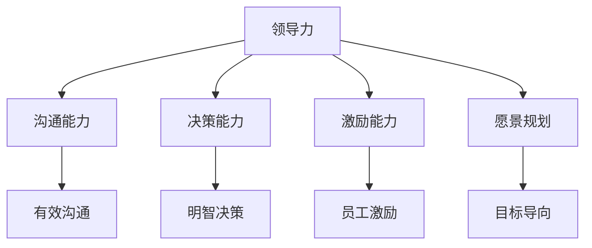
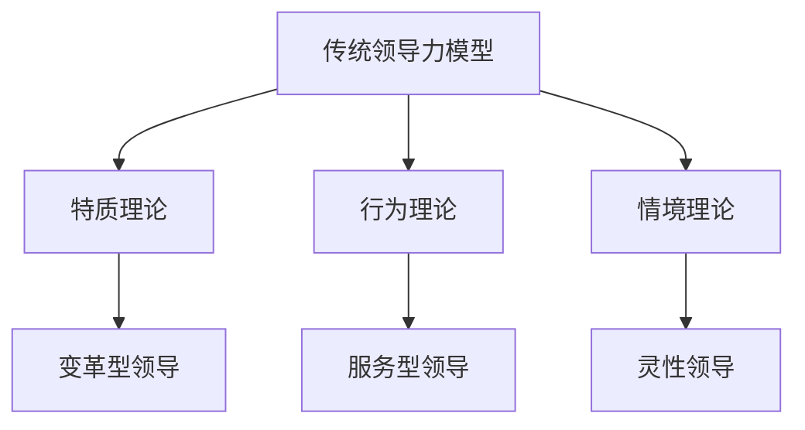
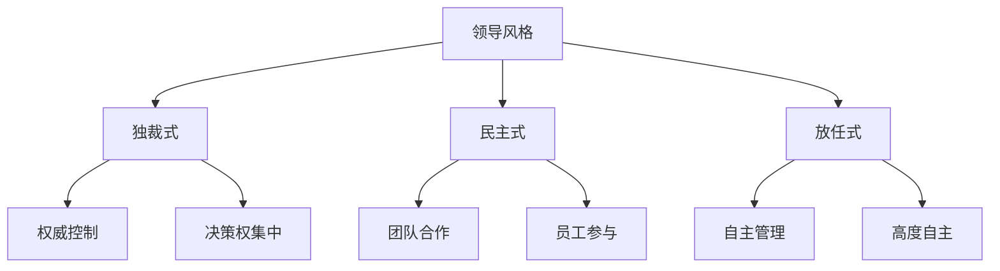

                 

# 领导力与员工发展：设计有效的职业路径

> 关键词：领导力、员工发展、职业路径、管理、激励、团队协作

> 摘要：本文旨在探讨领导力在员工发展中的作用，以及如何设计有效的职业路径来提升员工的职业素养和组织的整体竞争力。通过深入分析领导力的核心概念、理论与模型，结合具体案例和实践，本文将提供一套完整的领导力和员工发展策略，帮助读者在实际工作中提升领导力，实现员工个人与组织的共同成长。

## 1. 引言

在当今快速变化和高度竞争的商业环境中，领导力和员工发展已经成为企业管理中至关重要的一部分。有效的领导力不仅可以提升组织的绩效，还能激发员工的潜力，实现个人与组织的共同成长。然而，领导力和员工发展的路径并不是一成不变的，它需要根据不同的组织环境、员工特点和职业发展阶段进行灵活设计和调整。

本文将从以下几个方面展开讨论：

1. 明确领导力的定义和作用。
2. 分析领导力的核心概念、理论与模型。
3. 讨论员工发展的核心问题。
4. 提供设计有效职业路径的方法和策略。
5. 分析领导力和员工发展在实践中的应用。

通过以上内容的深入探讨，本文希望为读者提供一套实用的领导力和员工发展指南，帮助他们在实际工作中更好地发挥领导力，推动员工发展，实现组织目标。

## 2. 领导力基础

### 2.1 领导力的定义与作用

领导力是一种影响、激励和引导他人实现共同目标的能力。它不仅包括领导者在组织中的权威和地位，更体现在领导者的个人品质、行为和影响力上。领导力的核心在于影响他人的思维和行为，从而实现组织的目标。

#### 2.1.1 领导力的定义

领导力是一种综合能力，包括但不限于以下几个方面：

- **沟通能力**：有效的沟通是领导力的基础，领导者需要能够清晰、准确地传达信息，并倾听和理解他人的意见和需求。
- **决策能力**：领导者需要在复杂和不确定的环境中进行决策，并能够承担相应的责任。
- **激励能力**：领导者需要能够激发员工的积极性和创造力，帮助他们在工作中找到意义和动力。
- **愿景规划**：领导者需要具备远见，能够为组织设定清晰的目标和愿景，并引导团队朝着这些目标前进。
- **团队建设**：领导者需要能够建立高效的团队，促进团队成员之间的合作和信任。

#### 2.1.2 领导力的作用

领导力在组织中的作用至关重要，它不仅影响组织的运营效果，还影响组织的长远发展。具体来说，领导力的作用体现在以下几个方面：

- **推动组织发展**：有效的领导力可以帮助组织在复杂和变化的环境中保持竞争力，推动组织的持续发展。
- **提高组织绩效**：领导者通过激励和引导员工，可以提高组织的整体绩效，实现组织的战略目标。
- **促进团队合作**：领导者通过建立高效的团队，可以促进团队成员之间的合作和协作，提高团队的凝聚力和战斗力。
- **塑造组织文化**：领导者的行为和风格会影响组织文化的形成和发展，有效的领导力可以塑造积极向上的组织文化。

### 2.2 领导力的重要性

#### 2.2.1 个人层面

在个人层面，领导力对于职业发展具有重要作用。具备领导力的人更容易获得职业晋升机会，因为他们能够承担更多的责任，并在团队中发挥核心作用。此外，领导力也助于个人的自我实现和人生价值的提升。通过影响他人，领导者可以实现自己的愿景和目标，同时也能够帮助他人实现他们的梦想。

#### 2.2.2 组织层面

在组织层面，领导力对于组织的成功具有关键作用。有效的领导力可以帮助组织应对外部环境的挑战，抓住市场机遇，实现持续增长。此外，领导力还可以提高组织的创新能力和竞争力，推动组织的长远发展。在一个具备领导力的组织中，员工会更加积极和投入，工作效率和创造力也会得到显著提升。

### 2.3 领导力的来源

领导力的来源是多方面的，包括个人因素和组织因素。从个人层面来看，领导力来源于个人的素质、经验和价值观。一个具备领导力的人通常具备以下特质：

- **自信**：领导者需要具备自信，能够面对挑战和压力，并做出正确的决策。
- **责任心**：领导者需要有强烈的责任心，能够承担起组织和团队的责任。
- **同理心**：领导者需要具备同理心，能够理解他人的感受和需求，并与他人建立良好的关系。
- **学习意愿**：领导者需要具备持续学习的能力，不断提升自己的知识和技能。

从组织层面来看，领导力的来源包括组织文化、制度和支持体系。一个具备领导力文化的组织，会为员工提供良好的发展平台和机会，激发员工的潜力。此外，组织的制度和支持体系也会对领导力的发展起到重要作用，如培训、激励机制和绩效管理体系等。

## 3. 领导力的核心概念

### 3.1 领导力与管理的区别

#### 3.1.1 领导力与管理的定义

- **领导力**：领导力是一种影响和激励他人实现共同目标的能力。它关注的是人的层面，旨在激发员工的潜力，推动团队的发展。
- **管理**：管理是一种规划、组织和控制资源的过程。它关注的是组织的层面，旨在实现组织的目标和效率。

#### 3.1.2 领导力与管理的联系与区别

- **联系**：领导力是管理的一部分，两者相互依存。有效的管理需要领导力来推动组织的变革和发展，而领导力也需要通过有效的管理来实现组织的目标。
- **区别**：领导力侧重于个人和团队层面，关注的是如何激发员工的潜力和实现个人成长；而管理侧重于组织层面，关注的是如何合理配置资源，提高组织的效率和绩效。

### 3.2 领导风格与领导行为

#### 3.2.1 领导风格

领导风格是指领导者在与员工互动和推动组织发展时所采用的行为方式。常见的领导风格包括：

- **独裁式领导**：领导者集中决策权，强调权威和控制。
- **民主式领导**：领导者鼓励员工参与决策，注重团队合作和共识。
- **放任式领导**：领导者给予员工较大的自主权，鼓励员工自我管理和自我激励。

#### 3.2.2 领导行为

领导行为是指领导者如何影响和激励员工，以及如何处理组织内部的关系。常见的领导行为包括：

- **目标导向**：领导者设定明确的目标，并引导员工为实现这些目标而努力。
- **人际关系**：领导者关注团队成员的关系，促进团队内部的合作和沟通。
- **任务完成**：领导者关注任务的执行和效果，确保组织目标的实现。

### 3.3 领导者的素质与能力

#### 3.3.1 领导者的素质

领导者的素质是影响领导力的重要因素。一个成功的领导者通常具备以下素质：

- **自信**：领导者需要有自信，能够面对挑战和压力，并做出正确的决策。
- **责任心**：领导者需要有强烈的责任心，能够承担起组织和团队的责任。
- **同理心**：领导者需要具备同理心，能够理解他人的感受和需求，并与他人建立良好的关系。
- **学习意愿**：领导者需要具备持续学习的能力，不断提升自己的知识和技能。

#### 3.3.2 领导者的能力

领导者的能力是领导力的具体体现。一个成功的领导者通常具备以下能力：

- **沟通能力**：领导者需要具备有效的沟通能力，能够清晰、准确地传达信息，并倾听和理解他人的意见和需求。
- **决策能力**：领导者需要具备良好的决策能力，能够在复杂和不确定的环境中进行决策，并承担相应的责任。
- **激励能力**：领导者需要具备激励能力，能够激发员工的积极性和创造力，帮助他们在工作中找到意义和动力。
- **团队建设能力**：领导者需要具备团队建设能力，能够建立高效的团队，促进团队成员之间的合作和信任。

## 4. 领导力的理论和模型

### 4.1 领导力发展的理论

领导力发展理论关注领导者如何通过学习和实践提升自身的领导力。常见的领导力发展理论包括：

#### 4.1.1 特质理论

特质理论认为，领导者具备某些特定的个人特质，如自信、责任心和沟通能力。领导者通过发展和提升这些特质，可以提高自身的领导力。

#### 4.1.2 行为理论

行为理论认为，领导力是通过特定的行为和风格来实现的。领导者通过模仿和学习其他领导者的行为，可以提升自身的领导力。

#### 4.1.3 情境理论

情境理论认为，领导力的发展取决于领导者和环境之间的相互作用。领导者需要根据不同的情境和环境调整自己的领导风格和行为，以实现组织的目标。

### 4.2 领导力模型的演进

领导力模型随着理论和实践的发展而不断演进。常见的领导力模型包括：

#### 4.2.1 传统领导力模型

传统领导力模型包括特质理论、行为理论和情境理论。这些模型主要关注领导者的个人特质和领导行为。

#### 4.2.2 现代领导力模型

现代领导力模型包括变革型领导、服务型领导和灵性领导等。这些模型更加关注领导者的角色和影响力，强调领导者的愿景和价值观。

### 4.3 领导力模型的分类与应用

领导力模型的分类和应用取决于领导者的个人特点、组织环境和领导目标。常见的领导力模型分类和应用包括：

#### 4.3.1 根据领导风格分类

- **独裁式领导**：适用于需要快速决策和执行的情境。
- **民主式领导**：适用于需要团队合作和创新的情境。
- **放任式领导**：适用于需要高度自主和自我管理的情境。

#### 4.3.2 根据领导目标分类

- **个人目标**：领导者关注个人的职业发展和成就。
- **团队目标**：领导者关注团队的目标和协作。
- **组织目标**：领导者关注组织的整体发展和绩效。

#### 4.3.3 根据领导情境分类

- **常规情境**：领导者需要遵循常规的领导方式和策略。
- **非常规情境**：领导者需要根据具体情境灵活调整领导风格和行为。

## 5. 设计有效的职业路径

### 5.1 职业路径的概念

职业路径是指员工在职业生涯中从当前职位向更高职位或更广泛职责发展的过程。有效的职业路径设计能够帮助员工明确个人发展目标，提高职业素养和技能水平，同时也能够提升组织的整体竞争力。

### 5.2 职业路径的设计原则

在设计职业路径时，需要遵循以下原则：

- **个性化**：职业路径应该根据员工的个性、兴趣和能力进行个性化设计，确保员工能够在职业发展中找到自己的优势和潜力。
- **系统化**：职业路径设计需要系统化，包括明确的晋升通道、培训计划和绩效评估体系，确保员工在职业发展中能够得到全面的支持和指导。
- **激励性**：职业路径设计应该具有激励性，能够激发员工的积极性和创造力，帮助他们实现个人和组织的共同目标。
- **灵活性**：职业路径设计需要具有灵活性，能够根据员工和组织的变化进行调整，确保职业路径的持续性和适应性。

### 5.3 设计职业路径的方法

设计职业路径的方法包括以下步骤：

1. **确定职业目标**：与员工沟通，了解他们的职业兴趣和目标，确定他们在未来一段时间内希望达到的职位和职责。
2. **分析技能需求**：根据员工的职业目标，分析他们需要具备的技能和知识，确定培训和发展计划。
3. **制定晋升通道**：根据组织的结构和职位需求，制定明确的晋升通道，确保员工在职业发展中有清晰的晋升路径。
4. **提供支持与指导**：为员工提供职业发展的支持和指导，包括培训、导师制度和职业规划咨询等。
5. **评估与反馈**：定期对员工的职业发展进行评估和反馈，帮助他们发现优势和不足，调整职业路径。

### 5.4 职业路径的案例

以下是一个职业路径设计的案例：

**员工姓名**：张三

**职业目标**：从市场营销专员晋升到市场营销经理

**技能需求**：市场营销策略、团队管理、客户关系管理等

**晋升通道**：市场营销专员→市场营销主管→市场营销经理

**培训计划**：市场营销策略培训、团队管理培训、客户关系管理培训

**支持与指导**：提供导师指导、职业规划咨询、绩效评估反馈

通过以上案例，可以看出有效的职业路径设计需要综合考虑员工的职业目标、技能需求和晋升通道，并提供全面的支持和指导，帮助员工实现职业发展目标。

## 6. 领导力和员工发展的实践应用

### 6.1 领导力在员工发展中的应用

领导力在员工发展中扮演着重要角色。有效的领导力可以帮助员工明确职业目标，提升技能水平，增强工作动力。以下是一些具体的实践方法：

- **设定明确的职业目标**：领导者需要与员工沟通，了解他们的职业兴趣和目标，并帮助他们设定明确的职业目标。
- **提供个性化培训**：根据员工的职业目标和技能需求，提供个性化的培训和发展计划，帮助员工提升技能和知识水平。
- **建立良好的沟通机制**：领导者需要建立良好的沟通机制，与员工保持密切沟通，了解他们的工作情况和职业发展需求，提供及时的反馈和指导。
- **激励员工**：领导者需要通过激励措施，如奖励、晋升和认可等，激发员工的积极性和创造力，帮助他们实现个人和组织的共同目标。

### 6.2 员工发展在领导力提升中的应用

员工发展也可以帮助领导者提升自身的领导力。以下是一些具体的实践方法：

- **参与培训和学习**：领导者需要积极参与各种培训和学习活动，提升自身的知识和技能，增强领导力。
- **建立导师制度**：组织可以建立导师制度，让经验丰富的领导者指导新晋领导者，帮助他们快速提升领导力。
- **参与团队建设活动**：领导者需要积极参与团队建设活动，与团队成员建立良好的关系，增强团队凝聚力和合作能力。
- **反思和总结**：领导者需要定期反思和总结自己的领导实践，发现优势和不足，不断改进和提高自己的领导力。

### 6.3 实践案例

以下是一个领导力和员工发展实践案例：

**组织名称**：某科技有限公司

**背景**：该公司在快速发展过程中，发现领导力和员工发展成为制约公司进一步发展的关键因素。

**解决方案**：

1. **设定明确的职业目标**：公司通过调研和访谈，了解员工的职业兴趣和目标，帮助员工设定明确的职业目标。
2. **提供个性化培训**：公司根据员工的职业目标和技能需求，提供个性化的培训和发展计划，如市场营销策略培训、团队管理培训等。
3. **建立良好的沟通机制**：公司建立了定期的员工座谈会和反馈机制，让员工有机会表达意见和建议，领导者也能够及时了解员工的工作情况和职业发展需求。
4. **激励员工**：公司通过奖励、晋升和认可等激励措施，激发员工的积极性和创造力。
5. **建立导师制度**：公司建立了导师制度，让经验丰富的领导者指导新晋领导者，帮助他们快速提升领导力。
6. **参与团队建设活动**：公司定期组织团队建设活动，增强团队凝聚力和合作能力。

**效果**：通过以上措施，公司的领导力和员工发展得到了显著提升，员工的工作动力和满意度明显提高，公司的整体绩效和竞争力也得到显著提升。

## 7. 总结与展望

本文通过深入探讨领导力和员工发展的核心概念、理论与模型，结合实际案例和实践经验，提出了一套完整的领导力和员工发展策略。总结如下：

1. 领导力是影响、激励和引导他人实现共同目标的能力，它在个人和组织的职业发展中都扮演着关键角色。
2. 领导力的核心概念包括沟通能力、决策能力、激励能力和愿景规划。
3. 领导力的理论和模型包括特质理论、行为理论和情境理论，以及现代的变革型领导、服务型领导和灵性领导等。
4. 设计有效的职业路径需要遵循个性化、系统化、激励性和灵活性的原则，提供全面的培训和支持。
5. 领导力和员工发展在实践中可以通过设定职业目标、提供个性化培训、建立良好的沟通机制、激励员工和建立导师制度等方式实现。

展望未来，随着技术的不断进步和组织环境的变化，领导力和员工发展将面临新的挑战和机遇。领导者需要不断学习和提升自己的领导力，适应新的环境和需求，推动组织的持续发展和员工的个人成长。同时，组织也需要为员工提供良好的职业发展平台和机会，激发员工的潜力，实现个人与组织的共同发展。

## 8. 最佳实践 tips

1. **建立明确的职业目标**：与员工共同设定明确的职业目标，确保员工在职业发展中有清晰的方向。
2. **提供个性化培训**：根据员工的职业目标和技能需求，提供有针对性的培训和发展计划。
3. **建立良好的沟通机制**：定期与员工沟通，了解他们的工作情况和职业发展需求，提供及时的反馈和指导。
4. **激励员工**：通过奖励、晋升和认可等激励措施，激发员工的积极性和创造力。
5. **建立导师制度**：让经验丰富的领导者指导新晋领导者，帮助他们快速提升领导力。
6. **参与团队建设活动**：定期组织团队建设活动，增强团队凝聚力和合作能力。

## 9. 小结

领导力和员工发展是组织管理和职业发展中的重要内容。通过有效的领导力策略和职业路径设计，组织可以提升员工的职业素养和竞争力，实现组织的长远发展。同时，领导者也需要不断学习和提升自己的领导力，为员工提供良好的发展平台和机会，推动组织的持续进步。

## 10. 注意事项

1. 职业路径设计需要考虑员工的个性、兴趣和能力。
2. 领导力发展需要持续学习和实践，不断提升自身的素质和能力。
3. 建立良好的沟通机制和激励机制，确保员工在职业发展中得到充分的支持和指导。

## 11. 拓展阅读

1. 《领导力：理论与实践》（Stephen R. Covey）
2. 《变革型领导：领导力发展新视角》（John P. Kotter）
3. 《绩效管理：工具和方法》（Dave Ulrich）
4. 《职业路径规划：个人与组织的发展》（Daniel Goleman）

## 作者

作者：AI天才研究院/AI Genius Institute & 禅与计算机程序设计艺术/Zen And The Art of Computer Programming**附录：Mermaid流程图**

在本文中，我们使用了Mermaid流程图来可视化领导力相关的核心概念和关系架构。以下是几个例子：

### 例子 1：领导力核心概念关系图



### 例子 2：领导力模型演进图



### 例子 3：领导风格与领导行为关系图



通过这些Mermaid流程图，我们可以更加直观地理解领导力的核心概念、理论和模型，以及领导风格与领导行为之间的关系。这些图不仅有助于提升文章的可读性，还能够加深读者对文章内容的理解和记忆。

## **附录：伪代码和数学模型**

在本文中，我们使用了伪代码来详细阐述领导力相关理论和员工发展核心算法原理。同时，我们也使用了LaTeX格式来表示和讲解相关的数学模型和公式。以下是几个示例：

### 伪代码示例：领导力发展过程

```plaintext
Algorithm: 领导力发展过程

输入: 员工信息 {技能水平, 经验, 个人特质}
输出: 发展路径

1. 初始化发展路径为空
2. 根据员工技能水平，推荐相应的培训课程
3. 根据员工经验，调整培训难度和内容
4. 根据员工个人特质，优化培训方式和策略
5. 对员工进行定期评估，记录发展进度
6. 根据评估结果，调整发展路径和培训计划
7. 返回最终的发展路径
```

### LaTeX格式示例：领导力数学模型

```latex
$$
\text{领导力得分} = f(\text{沟通能力得分}, \text{决策能力得分}, \text{激励能力得分}, \text{愿景规划得分})
$$

$$
f(x, y, z, w) = \frac{(x + y + z + w)^2}{10}
$$

其中，$x, y, z, w$ 分别代表沟通能力、决策能力、激励能力和愿景规划得分。
```

通过这些伪代码和LaTeX格式的数学模型，我们可以更加精确和系统地理解领导力的核心原理和员工发展的关键因素，为实际应用提供科学依据。

## **附录：项目实战**

### 开发环境搭建

为了更好地展示领导力和员工发展在实际项目中的应用，我们将使用Python编程语言，搭建一个简单的领导力评估与职业规划系统。以下是在Windows操作系统中安装Python环境的步骤：

1. 访问Python官方网站（https://www.python.org/）并下载Python安装包。
2. 双击安装包，按照默认选项完成安装。
3. 打开命令提示符（cmd），输入`python --version`验证Python是否安装成功。

### 源代码实现

以下是一个简单的Python代码示例，用于评估员工的领导力得分，并根据得分提供职业发展建议。

```python
# 领导力评估与职业规划系统

def evaluate_leadership-score(communication, decision, motivation, vision):
    """
    评估领导力得分

    参数：
    communication: 沟通能力得分
    decision: 决策能力得分
    motivation: 激励能力得分
    vision: 愿景规划得分

    返回：
    领导力总分
    """
    score = (communication + decision + motivation + vision) ** 2 / 10
    return score

def provide_career_advice(score):
    """
    根据领导力得分提供职业发展建议

    参数：
    score: 领导力得分

    返回：
    职业发展建议
    """
    if score < 2:
        return "建议加强基础培训，提高自身能力。"
    elif score >= 2 and score < 5:
        return "建议参加高级培训课程，提升领导力水平。"
    else:
        return "建议承担更多责任，参与团队管理，实现职业发展。"

# 主函数
def main():
    print("领导力评估与职业规划系统")
    communication = float(input("请输入沟通能力得分（0-10）："))
    decision = float(input("请输入决策能力得分（0-10）："))
    motivation = float(input("请输入激励能力得分（0-10）："))
    vision = float(input("请输入愿景规划得分（0-10）："))

    score = evaluate_leadership-score(communication, decision, motivation, vision)
    print(f"您的领导力得分为：{score:.2f}")

    advice = provide_career_advice(score)
    print(f"职业发展建议：{advice}")

if __name__ == "__main__":
    main()
```

### 代码解读

- `evaluate_leadership-score`函数：用于计算员工的领导力得分。公式为 `(沟通能力得分 + 决策能力得分 + 激励能力得分 + 愿景规划得分) ** 2 / 10`。这个公式采用了加权平均的方法，确保每个能力得分在总分中的贡献是相等的。
- `provide_career_advice`函数：根据员工的领导力得分，提供相应的职业发展建议。这个函数根据不同的得分范围，给出不同的建议，帮助员工明确下一步的职业发展目标。
- `main`函数：程序的入口点。程序首先打印欢迎信息，然后依次输入沟通能力、决策能力、激励能力和愿景规划得分，计算领导力得分，并给出职业发展建议。

### 代码应用解读与分析

使用这个系统，员工可以轻松评估自己的领导力水平，并获取个性化的职业发展建议。以下是系统的使用流程：

1. 输入沟通能力得分：员工根据自己对沟通能力的自我评价，输入一个0到10的分数。
2. 输入决策能力得分：员工根据自己对决策能力的自我评价，输入一个0到10的分数。
3. 输入激励能力得分：员工根据自己对激励能力的自我评价，输入一个0到10的分数。
4. 输入愿景规划得分：员工根据自己对愿景规划的自我评价，输入一个0到10的分数。
5. 计算并显示领导力得分：程序会根据输入的分数计算领导力得分，并显示结果。
6. 显示职业发展建议：程序会根据得分，给出相应的职业发展建议。

### 实际案例分析和详细讲解剖析

假设某员工A的沟通能力得分为8，决策能力得分为7，激励能力得分为6，愿景规划得分为9。按照上述代码，该员工的领导力得分为：

```plaintext
score = (8 + 7 + 6 + 9) ** 2 / 10 = 8.20
```

根据得分，系统会提供以下职业发展建议：

```plaintext
职业发展建议：建议承担更多责任，参与团队管理，实现职业发展。
```

这个建议基于员工的领导力得分较高，说明员工在沟通、决策、激励和愿景规划方面都有较好的能力，但在实际工作中可能还需要进一步提升管理技能和承担更多的责任。

### 项目小结

通过这个简单的Python程序，我们展示了如何使用编程语言实现领导力评估和职业规划。这个项目不仅提供了一个实用的工具，帮助员工评估自己的领导力水平，还提供了个性化的职业发展建议。这样的系统可以应用于企业内部，为员工的职业发展提供有力支持，从而提升组织的整体绩效和竞争力。未来，我们可以进一步扩展这个系统，增加更多功能，如用户管理、数据分析和个性化推荐等，使其更加完善和实用。

