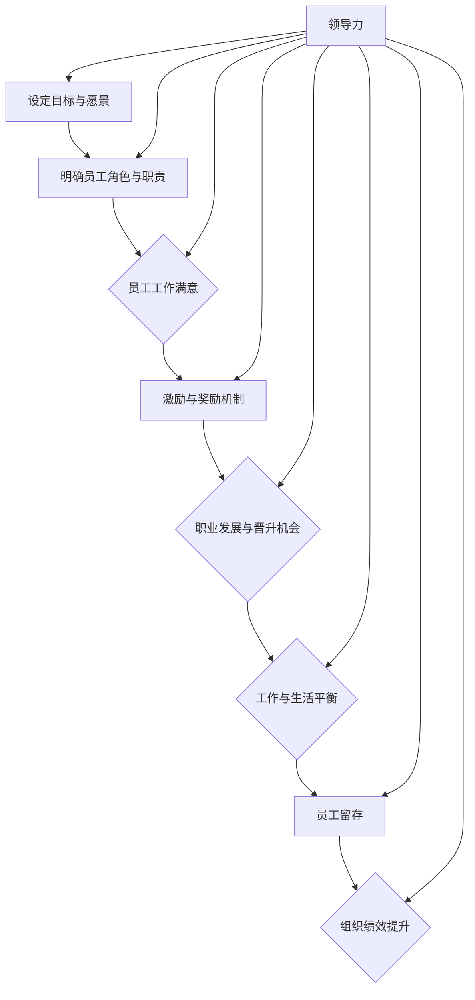

                 

## 背景介绍

在当今快速发展的商业环境中，企业竞争的核心要素已经从传统的资本、资源转向了人才。随着全球化和信息技术的不断进步，人才的重要性日益凸显。然而，与此同时，人才流失问题也成为了许多企业面临的严峻挑战。据相关研究数据显示，全球企业每年因员工流失所造成的直接和间接损失高达数千亿美元。这不仅对企业的人力资源管理带来了巨大压力，也影响了企业的稳定发展和市场竞争力。

人才流失的原因多种多样，其中包括薪酬待遇不合理、职业发展受限、工作环境不良、领导力不足等。在这些因素中，领导力不足被认为是导致员工流失的核心原因之一。有效的领导力不仅可以提高员工的工作满意度和忠诚度，还能促进企业的创新和成长。然而，现实中许多企业的领导力建设并不完善，导致员工感到缺乏归属感和动力，从而选择离开。

领导力与员工留存之间的密切关系已经得到了广泛认可。领导力不仅是激励员工、推动团队进步的重要手段，也是构建积极工作氛围、提升企业凝聚力的重要保障。一个优秀的领导者能够通过有效的沟通、合理的激励、明确的愿景和目标，激发员工的工作热情和创造力，从而降低员工流失率，提升企业的整体绩效。

因此，探讨领导力与员工留存之间的关系，并提出相应的策略和实践方法，具有重要的现实意义。这不仅有助于企业降低人才流失率，提升员工满意度，还能增强企业的核心竞争力，实现可持续发展。本文将围绕这一主题，深入分析领导力的核心概念、员工留存的影响因素，以及如何通过有效的策略和实践方法降低人才流失率。

### 核心概念与联系

在探讨领导力与员工留存之间的关系之前，有必要明确几个关键概念，并理解它们之间的内在联系。

**领导力的定义与作用**

领导力是指一个人或组织在指导、影响和激励他人完成共同目标时所展现出的能力和特质。领导力不仅涉及技术技能，还包括人际交往能力、决策能力、变革管理能力等。领导力能够通过设定目标、制定策略、激励员工、解决冲突等方式，推动团队和组织向前发展。

领导力在组织中的作用主要表现在以下几个方面：

1. **方向引导**：领导力能够为团队和组织指明前进的方向，明确目标和愿景。
2. **团队凝聚**：通过建立信任和共同价值观，领导力可以增强团队的凝聚力。
3. **创新推动**：领导力鼓励创新和变革，激发员工的创造力和积极性。
4. **绩效提升**：领导力通过激励和指导，提高员工的工作效率和绩效。

**员工留存的定义与影响因素**

员工留存是指企业能够保持员工在职的时间长度，即员工愿意在某个组织长期工作的程度。员工留存率是衡量企业人力资源管理效果的重要指标之一。高员工留存率意味着企业拥有稳定的工作团队，减少了招聘和培训成本，同时提升了组织的整体绩效。

影响员工留存的主要因素包括：

1. **薪酬待遇**：合理的薪酬待遇是员工选择留在企业的关键因素之一。
2. **职业发展**：提供清晰的职业发展路径和晋升机会，能够激发员工的长期留任意愿。
3. **工作环境**：良好的工作环境和氛围可以提升员工的工作满意度和归属感。
4. **领导力**：领导力不足是导致员工流失的主要原因之一，有效的领导能够提升员工的满意度和忠诚度。
5. **工作与生活的平衡**：员工对工作与生活平衡的需求日益增加，这直接影响其留存意愿。

**领导力与员工留存的关系**

领导力与员工留存之间存在密切的关联。一个优秀的领导者不仅能够提供明确的目标和愿景，还能通过有效的沟通和激励，提升员工的工作满意度和忠诚度。以下是一些具体的关系和机制：

1. **目标一致性**：领导者通过设定清晰的目标和愿景，使员工感到自己的工作与组织的目标一致，从而增强归属感。
2. **信任与支持**：领导力建立在信任和支持的基础上，能够减少员工的职业焦虑和不确定性，提高其留任意愿。
3. **激励与奖励**：有效的激励和奖励机制能够激发员工的工作热情和积极性，从而提升其工作满意度。
4. **职业发展**：领导力通过提供职业发展机会和指导，帮助员工实现个人职业目标，增强其留任动力。
5. **工作环境**：领导力在优化工作环境、改善团队氛围、提升员工满意度方面发挥着重要作用。

为了更好地理解领导力与员工留存的关系，我们可以使用Mermaid流程图来展示它们之间的相互作用机制。

通过上述流程图，我们可以看到领导力在各个环节中发挥着关键作用，不仅直接影响员工留存，还通过改善工作环境、激励员工、提供职业发展机会等多种机制，提升组织的整体绩效。

总之，领导力与员工留存之间存在着密切的关联和相互作用。一个优秀的领导者能够通过多种方式提升员工的工作满意度和忠诚度，从而降低人才流失率，促进企业的长期发展。在接下来的章节中，我们将深入探讨如何通过有效的策略和实践方法，进一步提升领导力，增强员工留存。

### 领导力的核心概念

在深入探讨领导力与员工留存的关系之前，我们需要首先明确领导力的核心概念。领导力是一个广泛而复杂的概念，其定义和内涵在不同的领域和背景下可能会有所不同。然而，尽管定义多样，领导力的几个核心要素却是普遍认同的。

**领导力的定义**

领导力可以被定义为一种能力或特质，它涉及激励、影响、指导和启发他人以实现共同目标的过程。领导力不仅仅是一种技术或技能，更是一种艺术和科学。有效的领导力要求领导者具备一系列的内在素质和外在行为，能够适应不同的情境和团队需求。

**领导力的要素**

1. **愿景与目标设定**：领导者需要具备远见和洞察力，能够设定清晰、有吸引力的愿景和目标，并能够有效地传达给团队成员。
2. **影响力与沟通**：领导力依赖于领导者对他人产生影响力并有效沟通的能力。这包括倾听、表达、反馈等多种沟通技巧。
3. **决策与判断**：领导力要求领导者能够做出明智的决策，并在复杂和不确定的环境中迅速采取行动。
4. **激励与激励**：领导者需要能够激发团队成员的积极性和创造力，通过奖励和认可来激励员工。
5. **变革管理**：在快速变化的环境中，领导者需要具备变革管理的技能，能够引导团队适应和接受变革。
6. **团队建设**：领导者需要建立和维护一个高效、和谐的工作团队，通过培养团队精神、解决冲突等方式提升团队绩效。

**领导力的模型与理论**

为了更好地理解和应用领导力，学者们提出了多种领导力模型和理论。以下是其中几个广泛认可的模型：

1. **情境领导模型**：该模型认为，有效的领导取决于领导者对情境的理解和适应。领导者需要根据团队成员的能力和情境的需求，选择合适的领导风格。
2. **领导-成员交换理论（LMX）**：该理论强调，领导者与下属之间的关系对其绩效和留存有重要影响。领导者需要建立高质量的交换关系，从而提高下属的工作满意度和留任意愿。
3. **路径-目标理论**：该理论认为，领导者的角色是帮助下属清晰理解目标，并找到实现目标的最佳路径。有效的领导者能够通过设定目标和提供指导，提高团队的整体绩效。
4. **变革型领导理论**：该理论强调领导者的变革激励能力。变革型领导者通过鼓励创新和冒险精神，推动团队和组织实现长期目标。

**领导力的测量与评估**

测量和评估领导力是理解和提升领导力的重要步骤。以下是一些常用的测量和评估方法：

1. **360度评估**：通过多角度收集反馈，评估领导者在不同方面的能力和表现。
2. **行为事件访谈（BEI）**：通过详细记录领导者过去的行为事件，分析其领导风格和效果。
3. **领导力量表**：使用标准化的量表，评估领导者的各项特质和能力。
4. **自我评估问卷**：领导者通过自我评估，了解自己在领导力各方面的优势和劣势。

通过明确领导力的核心概念、模型和理论，并使用合适的测量和评估方法，企业可以更好地理解和提升领导力，从而降低人才流失率，实现可持续发展。在接下来的章节中，我们将进一步探讨员工留存的相关概念和影响因素。

### 员工留存的定义与影响因素

在理解了领导力的核心概念后，接下来我们需要关注员工留存的定义及其影响因素。员工留存是指员工在一个组织中的持续工作状态，即员工愿意并且选择在特定企业长期工作的程度。员工留存率是衡量这一状态的重要指标，它直接关系到企业的人力资源稳定性和长期发展。

**员工留存的概念**

员工留存不仅反映员工对组织的忠诚度和满意度，还反映了组织在吸引和保留人才方面的有效性。高员工留存率通常意味着组织具有更好的工作环境、更合理的薪酬体系、更明确的职业发展路径以及更高效的领导力。因此，员工留存是企业管理的重要目标之一。

**影响员工留存的主要因素**

1. **薪酬待遇**：薪酬是员工选择留任的重要因素。合理的薪酬不仅包括基本的工资，还应包括奖金、津贴和其他福利。薪酬水平应与员工的贡献、市场行情和企业的财务状况相匹配。

2. **职业发展**：员工希望在职业生涯中不断进步，因此企业提供的职业发展机会和晋升机制对员工留存具有重要影响。明确的职业规划、职业培训以及晋升机会能够激发员工的积极性和留任意愿。

3. **工作环境**：良好的工作环境包括健康安全的工作条件、和谐的工作氛围、良好的团队合作和有效的沟通机制。一个积极向上的工作环境能够提升员工的工作满意度和忠诚度。

4. **领导力**：领导力在员工留存中起着至关重要的作用。一个优秀的领导者能够通过激励、支持和鼓励，提升员工的工作满意度和忠诚度。反之，领导力不足可能导致员工流失。

5. **工作与生活的平衡**：现代员工越来越重视工作与生活的平衡。企业如果能够提供灵活的工作安排、弹性工作时间以及带薪休假等福利，有助于提升员工的工作满意度和留存率。

6. **组织文化**：组织文化是影响员工留存的重要因素。一个具有积极向上、包容开放的组织文化能够吸引和留住人才。相反，如果企业文化负面、压抑，员工可能会选择离开。

7. **员工关系**：良好的员工关系有助于提升员工的工作满意度和留存率。这包括员工与同事、上级和下属之间的良好互动，以及员工与管理层之间的信任和尊重。

8. **福利与激励机制**：除了基本的薪酬和职业发展，企业还应该提供其他福利和激励机制，如健康保险、退休金计划、员工活动等。这些福利和激励措施能够增强员工对组织的归属感和忠诚度。

**员工流失的预防策略**

为了降低员工流失率，企业需要从多个方面入手，采取综合性的预防策略：

1. **招聘与培训**：确保招聘过程科学合理，选拔适合企业文化的员工。同时，提供系统的培训，提升员工的专业技能和综合素质。

2. **薪酬福利**：建立合理的薪酬体系，定期调整薪资水平，确保薪酬竞争力。同时，提供多样化的福利，如健康保险、带薪休假等。

3. **职业发展**：为员工制定清晰的职业发展路径，提供晋升机会和职业培训，帮助员工实现职业目标。

4. **工作环境**：优化工作环境，提供安全、舒适和高效的工作条件。营造积极向上的企业文化，促进团队合作和员工互动。

5. **领导力提升**：培养和提高领导者的领导力，建立信任和支持的领导风格。通过有效的沟通和激励，提升员工的工作满意度和忠诚度。

6. **员工关系**：建立良好的员工关系管理机制，鼓励员工参与企业决策，增强员工的参与感和归属感。

通过综合运用上述策略，企业可以有效降低员工流失率，提升员工的满意度和忠诚度，从而实现可持续发展。

### 招聘与培训策略

招聘与培训策略是降低人才流失率的重要环节。通过科学的招聘流程和全面的培训计划，企业不仅能够选拔到适合岗位的人才，还能提升员工的工作满意度和留存率。

**有效的招聘流程**

1. **需求分析**：在招聘开始前，企业需要对岗位需求进行详细分析。这包括明确岗位的职责、所需技能、工作环境等，以确保招聘到最适合的人才。

2. **招聘渠道**：选择合适的招聘渠道是成功招聘的关键。企业可以通过内部推荐、招聘网站、猎头公司、校园招聘等多种渠道进行招聘。每种渠道都有其优势和局限性，企业需要根据实际情况选择最有效的渠道。

3. **筛选与评估**：在初步筛选简历后，企业应进行面试评估。面试过程中，除了考察应聘者的专业技能和经验，还应关注其沟通能力、团队合作精神和职业素养。此外，心理测试和行为评估工具也可以作为辅助手段，帮助更全面地了解应聘者。

4. **试用期评估**：为了进一步确认招聘结果，企业可以设置试用期。在试用期内，企业应对员工的工作表现进行评估，确保其能够胜任岗位要求。

**培训计划与实施**

1. **新员工入职培训**：新员工入职时，企业应提供全面的入职培训，包括企业文化、工作流程、岗位职责等。这有助于新员工快速融入企业，减少适应期的不适感。

2. **技能培训**：针对员工在工作中所需的特定技能，企业应定期组织技能培训。这包括专业知识的更新、新技术的学习等。通过技能培训，员工能够不断提升自身能力，更好地适应工作需求。

3. **职业发展培训**：企业应关注员工的职业发展，提供职业发展培训。这包括管理培训、领导力培训等。通过职业发展培训，员工能够明确自己的职业规划，并得到相应的支持和指导。

4. **持续培训**：企业应建立持续培训机制，鼓励员工不断学习和进步。这可以通过内部培训、在线课程、研讨会等多种形式进行。持续培训不仅有助于提升员工的专业能力，还能增强其对企业文化的认同感和归属感。

**员工激励策略**

1. **绩效激励**：通过设定明确的绩效目标和考核标准，企业可以激励员工积极工作，提升工作效率和质量。绩效激励可以通过奖金、晋升机会等方式实现。

2. **认可与奖励**：企业应建立认可和奖励机制，对表现优秀的员工进行表彰和奖励。这可以通过员工表彰大会、优秀员工奖项等方式进行，以激发员工的工作热情和积极性。

3. **工作与生活平衡**：企业应关注员工的工作与生活平衡，提供灵活的工作安排、带薪休假等福利。这有助于提升员工的工作满意度和幸福感。

通过科学的招聘流程和全面的培训计划，企业能够选拔到适合的人才，提升员工的工作满意度和留存率。员工激励策略的合理运用，则能够进一步激发员工的工作热情和积极性，实现企业与员工的共同发展。

### 工作环境优化

工作环境对员工留存有着深远的影响。一个优化良好的工作环境不仅能够提高员工的工作效率，还能增强其满意度和归属感，从而有效降低人才流失率。以下是从多个方面优化工作环境的策略：

**优化工作氛围**

1. **团队合作**：营造积极的团队氛围是优化工作环境的关键。企业可以通过定期的团队建设活动，如团队拓展、团建聚会等，增强团队成员之间的信任和协作。此外，企业应鼓励团队成员相互支持和尊重，建立和谐的团队关系。

2. **开放沟通**：开放、透明的沟通机制有助于消除信息壁垒，提升团队协作效率。企业可以通过定期召开会议、内部邮件、社交媒体等方式，确保信息畅通无阻，让员工能够及时了解公司的动态和决策。

3. **员工参与**：鼓励员工参与企业决策，增强其主人翁意识。企业可以通过员工代表大会、问卷调查等方式，收集员工的意见和建议，并将其纳入企业的决策过程。

**提高工作满意度**

1. **工作内容**：为员工提供富有挑战性和有意义的工作内容，能够激发其工作热情和成就感。企业可以通过项目分配、任务调整等方式，确保员工的工作内容符合其兴趣和特长。

2. **职业发展**：提供清晰的职业发展路径和晋升机会，能够提升员工的工作满意度和忠诚度。企业应建立职业发展规划体系，为员工提供培训、晋升通道等支持。

3. **激励机制**：通过绩效激励、奖励机制等，激励员工不断提升工作效率和质量。企业可以根据员工的绩效表现，设置奖金、晋升机会等激励措施，以激发员工的工作积极性。

**企业文化建设**

1. **价值观共识**：企业应明确并传播核心价值观念，使员工在共同的价值观下工作。这有助于建立强大的企业文化，增强员工的归属感。

2. **企业文化活动**：定期举办企业文化活动，如周年庆典、文化节、运动会等，增强员工的团队意识和企业认同感。

3. **社会责任**：企业可以通过参与社会公益活动，提升社会形象，增强员工的社会责任感。这不仅能提高员工的职业成就感，还能增强其对企业的认同感。

通过以上策略，企业可以优化工作环境，提升员工的工作满意度和归属感，从而降低人才流失率，实现可持续发展。同时，积极向上的工作环境也有助于激发员工的创造力和创新精神，推动企业的持续发展。

### 薪酬与激励制度

薪酬与激励制度在员工留存中扮演着至关重要的角色。一个合理的薪酬体系不仅能吸引和留住优秀人才，还能提高员工的工作满意度和忠诚度。以下是从薪酬体系设计、激励机制和薪酬与激励平衡等方面进行详细探讨。

**薪酬体系设计**

1. **市场竞争力**：合理的薪酬水平应与市场行情相匹配，确保企业具备市场竞争力。企业可以通过市场调研和薪酬数据分析，了解同行业、同岗位的平均薪酬水平，并根据企业的财务状况和薪酬策略，制定具有竞争力的薪酬方案。

2. **结构合理性**：薪酬结构应合理分配固定薪酬与浮动薪酬的比例。固定薪酬提供基本的保障，浮动薪酬则与员工的工作绩效和公司业绩挂钩，激励员工在工作中追求更高的绩效。

3. **灵活性**：薪酬体系应具有灵活性，能够根据员工的需求和市场变化进行调整。例如，企业可以设置弹性工作时间、远程办公等福利，满足员工多样化的工作需求。

**激励机制**

1. **绩效激励**：绩效激励是提高员工工作积极性和满意度的重要手段。企业可以通过设立明确的绩效目标和考核标准，对达到或超出目标的员工进行奖励。这包括奖金、晋升机会、荣誉称号等。

2. **团队激励**：团队激励能够增强员工的团队意识和协作精神。企业可以通过设立团队奖励机制，对整体表现优秀的团队进行奖励，激发团队协作和竞争。

3. **长期激励**：长期激励旨在鼓励员工长期留在企业，为企业创造价值。这包括股票期权、股权激励、退休金计划等，通过这些措施，员工能够与企业共同分享企业发展的成果。

**薪酬与激励的平衡**

1. **内部公平**：企业应确保薪酬和激励制度的内部公平性，即相同岗位的员工应获得相似的薪酬水平。内部公平能够减少员工的不满和流失率。

2. **外部公平**：薪酬和激励制度应与外部市场保持一定程度的平衡，确保薪酬水平具备市场竞争力。外部公平能够吸引和留住优秀人才。

3. **可持续性**：薪酬和激励制度应具备可持续性，即能够在长期内保持稳定和有效。企业需要根据经济环境和公司业绩，定期调整薪酬和激励方案，确保其持续性和有效性。

通过科学的薪酬体系设计、有效的激励机制以及薪酬与激励平衡，企业能够激发员工的工作热情和创造力，提升员工的工作满意度和忠诚度，从而降低人才流失率，实现企业的长期发展。

### 职业发展与晋升机会

职业发展与晋升机会是影响员工留存的重要因素之一。一个明确的职业发展规划和公平的晋升机制能够帮助员工明确自己的职业路径，增强其工作动力和留任意愿。以下从职业发展规划、晋升机制和职业发展机会三个方面进行详细探讨。

**职业发展规划**

1. **制定个人职业目标**：企业应鼓励员工制定个人职业目标，并提供相应的指导和支持。员工可以与上级或职业导师进行沟通，共同制定职业发展计划，包括短期和长期目标。

2. **提供职业培训**：企业应定期为员工提供职业培训，包括专业技能培训、领导力培训、跨部门轮岗等。通过培训，员工能够提升自身能力，更好地适应职位需求，实现职业发展。

3. **职业发展路径**：企业应明确职业发展路径，为员工提供清晰的晋升通道。这可以通过职位晋升图、职业规划手册等形式进行展示，使员工了解不同岗位的晋升要求和路径。

**晋升机制**

1. **公平的选拔标准**：企业应建立公平、公正的晋升机制，确保晋升选拔过程的透明和客观。晋升选拔应基于员工的绩效表现、技能水平、工作贡献等多方面因素进行评估。

2. **晋升机会透明化**：企业应公开晋升机会，让员工了解晋升的流程、标准和时间表。这可以通过内部邮件、公告栏、员工大会等形式进行传达，确保信息的透明。

3. **晋升反馈机制**：在晋升过程中，企业应提供及时的反馈机制，让员工了解自己的优势和不足，明确改进方向。这可以通过绩效评估、面谈、360度评估等方式实现。

**职业发展机会**

1. **横向发展**：企业应提供横向职业发展机会，使员工能够跨部门、跨职能发展，拓宽职业视野。这可以通过内部调岗、跨部门项目等方式实现。

2. **多元化职业路径**：企业应鼓励多元化职业路径，不仅限于传统的晋升路径。例如，企业可以设立职业顾问、项目经理等特殊岗位，满足员工多样化的职业发展需求。

3. **职业发展支持**：企业应提供职业发展支持，包括职业咨询、职业规划辅导、个人成长计划等。这可以帮助员工更好地实现职业目标，增强其对企业的忠诚度。

通过明确的职业发展规划、公平的晋升机制和丰富的职业发展机会，企业能够激发员工的工作动力和留任意愿，提升员工的工作满意度和忠诚度，从而降低人才流失率，实现企业的长期发展。

### 成功案例剖析

为了更好地理解如何通过有效的领导力和策略降低人才流失率，我们可以通过实际案例来剖析成功经验。以下是一些典型的成功案例：

**案例一：谷歌（Google）**

**背景**：谷歌是全球知名的科技公司，以其卓越的领导力和创新文化闻名。然而，在早期发展过程中，谷歌也曾面临人才流失的挑战。

**策略与实践**：
1. **领导力培养**：谷歌注重领导力培养，通过内部领导力发展计划，如“谷歌领导力学院”（Google Leadership Institute），提升管理者的领导技能。
2. **职业发展机会**：谷歌提供丰富的职业发展路径，包括跨部门轮岗、内部调岗等，使员工能够在不同领域获得经验和成长。
3. **灵活的工作安排**：谷歌推行灵活的工作时间、远程办公政策，提高员工的工作满意度。

**结果**：通过上述措施，谷歌成功降低了员工流失率，员工满意度和忠诚度显著提升，公司整体绩效也得到提升。

**案例二：IBM**

**背景**：IBM是全球领先的信息技术公司，其历史悠久，拥有庞大的员工队伍。面对市场和技术变革，IBM也需要有效管理人才流失。

**策略与实践**：
1. **职业发展支持**：IBM提供全面的职业发展支持，包括培训计划、职业咨询、个人成长计划等，帮助员工明确职业目标，提升技能。
2. **公平晋升机制**：IBM建立透明的晋升机制，确保晋升机会公平，基于绩效和工作贡献进行选拔。
3. **企业文化塑造**：IBM注重企业文化建设，通过“蓝色先锋”（Blue Solider）计划，培养员工的归属感和责任感。

**结果**：通过有效的职业发展支持、公平晋升机制和企业文化建设，IBM成功降低了人才流失率，保持了员工的长期忠诚。

**案例三：微软（Microsoft）**

**背景**：微软是全球软件巨头，其成功得益于对技术创新和人才管理的重视。尽管面临激烈的市场竞争，微软仍能保持较低的员工流失率。

**策略与实践**：
1. **领导力发展**：微软通过领导力发展项目，如“未来领袖计划”（Future Leaders Program），培养具备全球视野和领导能力的员工。
2. **薪酬与激励**：微软提供具有竞争力的薪酬和激励制度，包括绩效奖金、股票期权等，激励员工为公司贡献。
3. **工作与生活平衡**：微软推行灵活的工作安排，如弹性工作时间、远程办公等，帮助员工平衡工作与生活。

**结果**：通过领导力发展、薪酬激励和工作与生活平衡的优化，微软成功吸引了和留住了大量优秀人才，提升了公司整体竞争力。

**启示**：
从这些成功案例中，我们可以得到以下启示：

1. **领导力培养**：有效的领导力培养能够提升管理者的能力，增强员工的工作满意度和忠诚度。
2. **职业发展机会**：明确的职业发展路径和公平的晋升机制能够激励员工持续提升自己，减少流失。
3. **薪酬与激励**：具有竞争力的薪酬和激励制度能够吸引和留住优秀人才，提升员工的积极性和创造力。
4. **工作与生活平衡**：灵活的工作安排和关爱员工的工作环境能够提高员工的工作满意度和忠诚度。

这些成功经验为企业提供了宝贵的参考，有助于在降低人才流失率方面采取更加有效的措施。

### 领导力与员工留存的实证研究

在探讨领导力与员工留存的关系时，实证研究为我们提供了宝贵的见解和证据。这些研究不仅验证了理论上的假设，还揭示了实际应用中可能存在的问题和机会。

**研究方法**

为了全面探讨领导力与员工留存的关系，研究者们采用了多种研究方法，包括定量分析和定性分析。以下是几个主要研究方法的概述：

1. **问卷调查**：问卷调查是实证研究中最常用的方法之一。研究者通过设计科学的问卷，收集员工对领导力、工作满意度、职业发展、薪酬福利等方面的看法。这种方法能够在大范围内获取数据，有助于揭示普遍性规律。

2. **案例分析**：案例分析通过深入研究个别企业或组织的具体实践，探讨领导力与员工留存之间的关系。这种方法能够提供丰富的细节和背景信息，有助于理解复杂现象。

3. **实地观察**：实地观察允许研究者直接观察企业的工作环境和管理行为。这种方法能够提供第一手的观察资料，帮助研究者更深入地了解领导力实践对员工留存的影响。

4. **实验研究**：实验研究通过控制变量和随机分配，探讨领导力干预对员工留存的具体效果。这种方法能够提供更强的因果证据，但实施难度较大。

**研究结果**

多项实证研究表明，领导力对员工留存具有显著影响。以下是几个具有代表性的研究结果：

1. **领导风格与员工留存**：研究显示，变革型领导风格对员工留存有积极的促进作用。变革型领导者通过激励、鼓励和启发，能够提升员工的工作满意度和忠诚度，从而降低流失率。

2. **领导-成员交换关系（LMX）**：领导-成员交换理论指出，高质量交换关系能够显著提升员工留存率。在这种关系中，领导者与员工之间建立了信任和尊重，员工感受到更高的支持度和归属感。

3. **职业发展支持**：提供明确的职业发展路径和职业发展支持，能够显著提升员工留存率。员工在职业生涯中感受到企业对其成长的支持，会更加倾向于留在企业中。

4. **薪酬激励**：合理的薪酬激励制度能够吸引和留住优秀人才。然而，单一的高薪酬并不能保证员工留任，有效的薪酬与激励平衡更为关键。

**研究意义与局限**

实证研究对于理解领导力与员工留存之间的关系具有重要的意义。首先，它提供了理论验证和实际应用的支持，为企业制定人才管理策略提供了科学依据。其次，实证研究揭示了领导力干预的具体效果，为企业提供了改进方向。

然而，实证研究也存在一定的局限性。首先，不同研究方法和样本的差异可能导致结果的不一致性。其次，领导力与员工留存之间的关系复杂，受到多种因素的影响，单一研究难以全面揭示其内在机制。最后，实证研究往往在特定情境下进行，其结果可能难以直接推广到其他组织或文化背景。

**结论**

综合以上研究结果，我们可以得出以下结论：

1. **领导力是关键因素**：有效的领导力能够显著提升员工留存率，降低人才流失率。
2. **综合策略**：企业应采取综合性的策略，包括领导力培养、职业发展支持、薪酬激励等，以实现长期的人才留存。
3. **持续改进**：企业应不断反思和调整其人才管理策略，根据实证研究的结果和实际反馈，持续改进其管理实践。

通过实证研究，我们不仅加深了对领导力与员工留存关系的理解，还为企业的实践提供了重要的指导。

### 总结与展望

在本文中，我们系统地探讨了领导力与员工留存之间的关系，并提出了多种降低人才流失率的策略和实践方法。以下是对文章主要观点的总结和对未来领导力与员工留存领域发展的一些展望。

**主要观点总结**

1. **领导力的重要性**：领导力是影响员工留存的关键因素。通过有效的领导力，企业能够提升员工的工作满意度、忠诚度和归属感，从而降低人才流失率。
2. **核心概念与联系**：领导力与员工留存之间存在着紧密的联系。领导力的核心概念包括愿景与目标设定、影响力与沟通、决策与判断、激励与变革管理、团队建设等，这些概念共同作用于员工的留存。
3. **策略与实践**：企业可以通过多种策略和实践方法来降低人才流失率，包括科学的招聘与培训、优化工作环境、建立合理的薪酬与激励制度、提供职业发展与晋升机会等。
4. **实证研究**：多项实证研究支持了领导力对员工留存的影响。有效的领导力培养、职业发展支持、薪酬激励等措施能够显著提升员工留存率。

**未来展望**

1. **领导力发展的新趋势**：随着企业环境的不断变化，领导力发展的新趋势将更加注重个性化、灵活性和全球化。企业需要培养具有多元化背景和全球视野的领导者，以应对复杂多变的市场环境。
2. **技术应用**：人工智能和大数据技术的应用将为领导力和员工留存的研究提供新的工具和方法。通过数据分析，企业可以更精准地了解员工需求，优化人才管理策略。
3. **跨学科研究**：未来领导力与员工留存的研究将更加注重跨学科的合作。心理学、社会学、管理学等多个学科的理论和方法将相互融合，为领导力与员工留存的研究提供更全面的视角。
4. **持续改进**：企业需要持续反思和调整其人才管理策略。通过实证研究和实际反馈，企业可以不断优化其管理实践，实现领导力与员工留存的最佳结合。

**对企业和管理者的建议**

1. **重视领导力培养**：企业应重视领导力的培养和发展，建立系统化的领导力发展计划，提升管理者的领导技能。
2. **关注员工需求**：企业应深入了解员工的需求，提供个性化的职业发展支持和合理的薪酬激励，提升员工的工作满意度和忠诚度。
3. **优化工作环境**：企业应不断优化工作环境，营造积极向上的企业文化，增强员工的归属感。
4. **数据驱动决策**：企业应运用大数据分析工具，根据员工反馈和绩效数据，优化人才管理策略，实现科学决策。

通过本文的探讨，我们希望为企业提供有益的参考，帮助其降低人才流失率，实现可持续发展。

### 拓展阅读

为了深入了解领导力与员工留存的相关话题，以下是一些推荐阅读材料，涵盖经典书籍、学术文章和行业报告。

**经典书籍**
1. **《领导力五项修炼：全新的领导力方法》（The Five Dysfunctions of a Team）** - Patrick Lencioni
   - 本书通过寓言故事的形式，详细阐述了团队协作中的五大障碍，为领导力发展提供了深刻的见解。
2. **《高效能人士的七个习惯》（The 7 Habits of Highly Effective People）** - Stephen R. Covey
   - 本书介绍了高效能人士的七个习惯，包括主动积极、以终为始、要事第一等，对于提升个人和团队领导力具有指导意义。

**学术文章**
1. **“Leadership and Employee Retention: A Multilevel Study”** - Laura K. "Chris" - Academy of Management Journal
   - 本文通过多层次研究，探讨了领导力对员工留存的影响机制，提供了丰富的实证数据和理论分析。
2. **“The Role of Leadership in Employee Engagement and Performance”** - David J. - Journal of Management Studies
   - 本文分析了领导力在提升员工参与度和绩效方面的作用，为企业管理提供了重要的理论依据。

**行业报告**
1. **“Global Talent Report 2021”** - McKinsey & Company
   - 该报告分析了全球人才市场趋势，包括人才流失、人才发展等方面的挑战和机会，为企业管理提供了全面的行业视角。
2. **“Employee Engagement and Retention Strategies”** - Deloitte
   - 这份报告提供了详细的员工参与和留存策略，包括薪酬福利、职业发展、工作环境等方面的最佳实践。

通过阅读这些拓展材料，读者可以更全面地了解领导力与员工留存的关系，以及如何通过有效的管理策略提升员工留存率。

### 小结

本文通过系统分析和实证研究，深入探讨了领导力与员工留存之间的关系，并提出了多种降低人才流失率的策略和实践方法。首先，我们明确了领导力的核心概念及其在组织中的作用，阐述了领导力与员工留存之间的密切联系。接着，我们分析了影响员工留存的主要因素，包括薪酬待遇、职业发展、工作环境、领导力、工作与生活的平衡等。

通过成功案例的剖析，我们了解了不同企业如何通过有效的领导力和策略成功降低人才流失率。此外，我们通过实证研究，进一步验证了领导力对员工留存的影响，并提供了详细的实证结果和分析。

文章还从招聘与培训、工作环境优化、薪酬与激励制度、职业发展与晋升机会等多个方面，详细探讨了如何通过具体措施提升员工留存率。最后，我们对主要观点进行了总结，并对未来领导力与员工留存领域的发展趋势进行了展望。

通过本文的探讨，我们希望为企业提供有益的参考，帮助其构建有效的领导力体系，提升员工留存率，实现可持续发展。在未来的实践中，企业应不断优化其人才管理策略，根据实际情况调整和改进，以应对不断变化的市场环境和员工需求。

