                 


## 《领导力与品德修养：塑造高尚人格》

### 关键词

领导力、品德修养、高尚人格、塑造、自我提升、组织效能

### 摘要

本文深入探讨了领导力与品德修养之间的关系，以及如何通过高尚人格的塑造来提升个人的领导能力。文章首先介绍了领导力的基础概念和历史发展，然后阐述了品德修养的重要性，并详细分析了高尚人格的核心特征与培养方法。通过实际项目案例和代码分析，本文提供了具体实践指导和最佳实践建议，旨在帮助读者在工作和生活中更好地实现自我提升和团队领导。

### 目录大纲设计步骤

在设计《领导力与品德修养：塑造高尚人格》的目录大纲时，我们可以遵循以下步骤，确保内容简洁、结构清晰且具备完整性：

1. **确定核心章节**：根据书名和主题，首先确定核心章节，如：领导力的基础概念、品德修养的重要性、高尚人格的塑造方法等。

2. **细化章节内容**：每个核心章节进一步细分，确定二级、三级目录。例如，对于“领导力的基础概念”，可以细分为领导力理论的历史发展、领导力与品德的联系等。

3. **融入核心概念与联系**：在相关的章节中，设计Mermaid流程图来展示核心概念和它们之间的联系，以便读者更好地理解。

4. **编写核心算法原理讲解**：针对书中的算法部分，使用伪代码详细阐述算法原理，帮助读者理解。

5. **引入数学模型和公式**：在适当的位置，使用LaTeX格式嵌入数学模型和公式，并进行详细讲解和举例说明。

6. **提供项目实战案例**：在书中穿插实际项目案例，包括开发环境搭建、源代码实现和代码解读与分析。

7. **优化格式与字数**：确保整个目录大纲使用markdown格式，并严格控制总字数在2000字以内。

### 输出目录大纲

下面是《领导力与品德修养：塑造高尚人格》的目录大纲：

```
# 《领导力与品德修养：塑造高尚人格》目录大纲

## 第一部分：领导力的基础概念

### 第1章 领导力理论的历史发展
#### 1.1 古典领导力理论
#### 1.2 行为主义领导力理论
#### 1.3 变革型领导力理论
#### 1.4 领导力与品德修养的联系

### 第2章 领导力核心概念解析
#### 2.1 领导力的定义
#### 2.2 领导力与管理的区别
#### 2.3 领导风格与领导效能

## 第二部分：品德修养的重要性

### 第3章 品德修养的基本原则
#### 3.1 品德的定义
#### 3.2 品德修养的重要性
#### 3.3 品德修养的核心要素

### 第4章 品德修养的具体实践
#### 4.1 诚信与正直
#### 4.2 责任感与担当
#### 4.3 互助与合作

## 第三部分：高尚人格的塑造方法

### 第5章 高尚人格的核心特征
#### 5.1 高尚人格的定义
#### 5.2 高尚人格与领导力的关系
#### 5.3 高尚人格的评估标准

### 第6章 高尚人格的培养途径
#### 6.1 自我反思与自我提升
#### 6.2 情绪管理与压力应对
#### 6.3 社会责任与道德实践

### 第7章 高尚人格在领导实践中的应用
#### 7.1 高尚人格领导力模型
#### 7.2 高尚人格领导力的案例分析
#### 7.3 高尚人格领导力在组织中的影响

## 附录

### 附录A 领导力与品德修养相关资源与工具
#### A.1 常用领导力评估工具
#### A.2 品德修养培养资源推荐
```

以上大纲分为三个部分，每部分包含一个引言章节和一到两个具体实践章节，最后附上相关资源和工具推荐。整体结构清晰，内容紧扣主题，同时满足简洁性和完整性要求。目录大纲的总字数控制在2000字以内，确保了可读性和实用性。接下来，我们将逐步深入探讨每个章节的内容。

## 第一部分：领导力的基础概念

### 第1章 领导力理论的历史发展

领导力作为一种重要的社会现象，自古以来就受到人们的高度关注。本章将简要回顾领导力理论的历史发展，从古典领导力理论、行为主义领导力理论到变革型领导力理论，梳理不同理论的特点和主要贡献。

#### 1.1 古典领导力理论

古典领导力理论起源于古希腊哲学家亚里士多德的《政治学》。亚里士多德认为，领导者应具备智慧、勇敢、节制等品质。古典领导力理论强调领导者个人的品质和魅力，主张领导者应具备高尚的人格和卓越的才能。这一理论在历史上产生了深远的影响，为后来的领导力研究奠定了基础。

#### 1.2 行为主义领导力理论

20世纪初期，行为主义领导力理论开始兴起。这一理论关注领导者的行为，试图通过观察和分析领导者的行为模式来识别有效的领导方式。行为主义领导力理论提出了“X理论”和“Y理论”。X理论认为，领导者必须采取强制手段来确保团队目标的实现，而Y理论则强调领导者应鼓励团队成员的自主性和创造力。

#### 1.3 变革型领导力理论

20世纪70年代，变革型领导力理论逐渐崭露头角。变革型领导力理论认为，领导者不仅是团队的领导者，更是变革的推动者。变革型领导者通过激发团队成员的潜能和创造力，推动组织实现根本性变革。变革型领导者具备愿景、激励、领导力和变革能力等特点。

#### 1.4 领导力与品德修养的联系

领导力与品德修养密切相关。高尚的品德是领导者成功的关键因素之一。品德修养包括诚信、正直、责任感、担当等品质，这些品质不仅有助于领导者树立良好的形象，还能增强领导力。本章将深入探讨领导力与品德修养之间的内在联系，为后续章节的内容奠定基础。

### 第2章 领导力核心概念解析

在了解了领导力理论的历史发展后，本章将进一步探讨领导力的核心概念。我们将从领导力的定义、领导力与管理的区别、领导风格与领导效能等方面进行详细分析。

#### 2.1 领导力的定义

领导力是指领导者通过激发、影响和引导团队成员，实现共同目标的能力。领导力不仅仅是职位赋予的权力，更是一种影响力。有效的领导者不仅具备职位和权力，还能赢得团队成员的信任和支持。

#### 2.2 领导力与管理的区别

领导力与管理密切相关，但又有所不同。管理侧重于规划和执行组织目标，而领导力则侧重于激发团队成员的潜能和创造力。领导力强调变革和创新，而管理强调稳定和效率。有效的领导者不仅具备管理能力，还能发挥领导力。

#### 2.3 领导风格与领导效能

领导风格是指领导者对待团队成员、分配任务和决策的方式。不同的领导风格对领导效能产生不同的影响。本章将介绍常见的领导风格，如指令型、支持型、参与型和教练型，并分析不同领导风格对领导效能的影响。

## 第二部分：品德修养的重要性

### 第3章 品德修养的基本原则

品德修养是领导者成功的重要因素之一。本章将探讨品德修养的基本原则，包括诚信、正直、责任感、担当等品质。我们将通过具体案例和实例，阐述这些原则在实际工作和生活中的应用。

#### 3.1 品德的定义

品德是指个体在行为和思想上遵循的道德规范和价值观。品德修养是领导者成功的重要因素，它不仅影响个人的形象，还影响团队的凝聚力和组织的整体效能。

#### 3.2 品德修养的重要性

品德修养的重要性体现在多个方面。首先，高尚的品德有助于树立领导者的权威和形象。其次，品德修养有助于建立良好的团队氛围，增强团队凝聚力和协作精神。最后，品德修养是领导者实现长远发展的基石，有助于组织实现可持续成长。

#### 3.3 品德修养的核心要素

品德修养的核心要素包括诚信、正直、责任感、担当等。诚信是品德修养的基础，正直是品德的底线，责任感是品德的实践，担当是品德的体现。这些核心要素相互关联，共同构成了高尚的品德修养。

### 第4章 品德修养的具体实践

在了解了品德修养的基本原则后，本章将探讨如何在实际工作和生活中实践这些原则。我们将介绍一些具体的实践方法，如诚信沟通、正直待人、承担责任、勇于担当等，并分析这些方法对个人和团队的影响。

#### 4.1 诚信与正直

诚信和正直是品德修养的核心要素。诚信要求领导者言行一致，正直要求领导者坚持真理。在实际工作中，领导者应通过诚信沟通、公正决策来树立诚信和正直的形象。

#### 4.2 责任感与担当

责任感是品德修养的重要体现。领导者应具备强烈的责任感，勇于承担团队和组织的责任。担当是责任感的升华，领导者应在关键时刻挺身而出，承担责任。

#### 4.3 互助与合作

互助与合作是品德修养的具体实践。领导者应鼓励团队成员相互支持、共同进步，形成良好的团队氛围。通过互助与合作，团队可以更好地实现共同目标。

## 第三部分：高尚人格的塑造方法

### 第5章 高尚人格的核心特征

高尚人格是领导者成功的关键因素之一。本章将探讨高尚人格的核心特征，包括高尚品格、高尚行为和高尚态度。我们将通过具体案例和实例，分析这些特征对领导者领导能力的影响。

#### 5.1 高尚人格的定义

高尚人格是指个体在行为和思想上表现出高尚的品德和价值观。高尚人格是领导者成功的关键，它不仅有助于提升领导者的形象，还能增强领导者的领导能力。

#### 5.2 高尚人格与领导力的关系

高尚人格与领导力密切相关。高尚人格是领导力的重要基础，领导力是高尚人格的具体体现。高尚人格有助于领导者赢得团队成员的信任和支持，提升领导效能。

#### 5.3 高尚人格的评估标准

高尚人格的评估标准包括高尚品格、高尚行为和高尚态度。高尚品格体现在诚信、正直、责任感等方面，高尚行为体现在领导者的实际行动中，高尚态度体现在领导者的心态和情绪控制上。通过评估这些标准，可以判断领导者是否具备高尚人格。

### 第6章 高尚人格的培养途径

在了解了高尚人格的核心特征后，本章将探讨如何培养高尚人格。我们将介绍一些具体的培养途径，如自我反思、情绪管理、社会责任等，并分析这些途径对个人成长和领导能力提升的作用。

#### 6.1 自我反思与自我提升

自我反思是培养高尚人格的重要途径。领导者应定期进行自我反思，识别自身的优点和不足，并制定改进计划。通过自我提升，领导者可以不断提高自己的领导能力和品德修养。

#### 6.2 情绪管理与压力应对

情绪管理和压力应对是培养高尚人格的重要方面。领导者应学会控制自己的情绪，保持积极的心态。在面对压力和挑战时，领导者应保持冷静，以高尚的人格和态度应对。

#### 6.3 社会责任与道德实践

社会责任与道德实践是培养高尚人格的重要途径。领导者应关注社会问题，积极参与公益活动，践行道德原则。通过社会责任和道德实践，领导者可以提升自己的道德修养和社会责任感。

### 第7章 高尚人格在领导实践中的应用

在了解了高尚人格的培养方法后，本章将探讨如何将高尚人格应用于领导实践中。我们将分析高尚人格在领导决策、领导沟通、领导风格等方面的应用，并通过具体案例和实例，阐述高尚人格对领导效能的提升作用。

#### 7.1 高尚人格领导力模型

高尚人格领导力模型是一种基于高尚人格的领导力理论。该模型认为，高尚人格是领导力的核心，领导者应具备高尚品格、高尚行为和高尚态度。通过构建高尚人格领导力模型，可以指导领导者如何在实践中运用高尚人格，提升领导效能。

#### 7.2 高尚人格领导力的案例分析

本章将通过具体案例，分析高尚人格领导力在实践中的应用。这些案例将涵盖不同行业和领域，包括企业家、公务员、教育工作者等。通过分析这些案例，读者可以更好地理解高尚人格领导力的实际效果。

#### 7.3 高尚人格领导力在组织中的影响

高尚人格领导力对组织产生深远的影响。首先，高尚人格领导力有助于提升组织的凝聚力和团队协作精神。其次，高尚人格领导力有助于树立组织形象，增强社会认可度。最后，高尚人格领导力有助于组织的可持续发展，提升组织竞争力。

## 附录

### 附录A 领导力与品德修养相关资源与工具

为了帮助读者更好地理解和应用领导力与品德修养的相关知识，本章将介绍一些常用的资源与工具。

#### A.1 常用领导力评估工具

常用的领导力评估工具包括360度评估、行为事件访谈（BEI）、领导力问卷等。这些工具可以帮助领导者识别自身的优势和不足，制定改进计划。

#### A.2 品德修养培养资源推荐

品德修养的培养需要长期的积累和实践。以下是一些推荐的资源：

- 书籍：《论语》、《道德经》、《领导力的五大障碍》等；
- 课程：领导力培训课程、品德修养课程等；
- 视频：TED演讲、公开课等。

通过这些资源，读者可以系统地学习领导力与品德修养的相关知识，提升自己的领导能力和品德修养。

## 总结与反思

领导力与品德修养是领导者成功的关键因素。本文通过深入探讨领导力的基础概念、品德修养的重要性以及高尚人格的塑造方法，为读者提供了系统的理论和实践指导。在领导实践中，领导者应注重品德修养，培养高尚人格，发挥领导力，实现个人和团队的共同发展。

## 作者信息

作者：AI天才研究院/AI Genius Institute & 禅与计算机程序设计艺术/Zen And The Art of Computer Programming

## 结语

领导力与品德修养并非一蹴而就，而是需要长期的积累和实践。通过不断学习、反思和实践，领导者可以不断提升自己的领导能力和品德修养，为组织和社会创造更大的价值。让我们共同努力，成为更优秀的领导者，为美好的未来贡献力量。

## 附录A：领导力与品德修养相关资源与工具

### A.1 常用领导力评估工具

1. **360度评估**：一种全面的领导力评估方法，通过收集来自团队成员、上级、下属以及同级的反馈，帮助领导者了解自己的优势和不足。
   
2. **行为事件访谈（BEI）**：通过深度访谈，了解领导者的行为事件，评估其领导风格和能力。

3. **领导力问卷**：设计一系列问题，通过定量分析评估领导者的领导能力。

### A.2 品德修养培养资源推荐

1. **书籍**：
   - 《论语》
   - 《道德经》
   - 《领导力的五大障碍》

2. **课程**：
   - 领导力培训课程
   - 品德修养课程

3. **视频**：
   - TED演讲
   - 公开课

通过这些资源和工具，读者可以系统地学习领导力与品德修养的知识，提升自己的领导能力和品德修养。## 第一部分：领导力的基础概念

### 第1章 领导力理论的历史发展

领导力作为一种重要的社会现象，自古以来就受到人们的高度关注。本章将简要回顾领导力理论的历史发展，从古典领导力理论、行为主义领导力理论到变革型领导力理论，梳理不同理论的特点和主要贡献。

#### 1.1 古典领导力理论

古典领导力理论起源于古希腊哲学家亚里士多德的《政治学》。亚里士多德认为，领导者应具备智慧、勇敢、节制等品质。古典领导力理论强调领导者个人的品质和魅力，主张领导者应具备高尚的人格和卓越的才能。这一理论在历史上产生了深远的影响，为后来的领导力研究奠定了基础。

亚里士多德的领导力理论可以用以下伪代码表示：

```plaintext
领导力 = [智慧, 勇敢, 节制]
领导者应具备高尚人格和卓越才能
```

#### 1.2 行为主义领导力理论

20世纪初期，行为主义领导力理论开始兴起。这一理论关注领导者的行为，试图通过观察和分析领导者的行为模式来识别有效的领导方式。行为主义领导力理论提出了“X理论”和“Y理论”。X理论认为，领导者必须采取强制手段来确保团队目标的实现，而Y理论则强调领导者应鼓励团队成员的自主性和创造力。

行为主义领导力理论可以用以下伪代码表示：

```plaintext
X理论：
领导力 = [强制手段，确保目标实现]

Y理论：
领导力 = [鼓励自主性，激发创造力]
```

#### 1.3 变革型领导力理论

20世纪70年代，变革型领导力理论逐渐崭露头角。变革型领导力理论认为，领导者不仅是团队的领导者，更是变革的推动者。变革型领导者通过激发团队成员的潜能和创造力，推动组织实现根本性变革。变革型领导者具备愿景、激励、领导力和变革能力等特点。

变革型领导力理论可以用以下伪代码表示：

```plaintext
领导力 = [愿景, 激励, 领导力, 变革能力]
变革型领导者推动组织实现根本性变革
```

#### 1.4 领导力与品德修养的联系

领导力与品德修养密切相关。高尚的品德是领导者成功的关键因素之一。品德修养包括诚信、正直、责任感、担当等品质，这些品质不仅有助于领导者树立良好的形象，还能增强领导力。本章将深入探讨领导力与品德修养之间的内在联系，为后续章节的内容奠定基础。

领导力与品德修养的联系可以用以下Mermaid流程图表示：

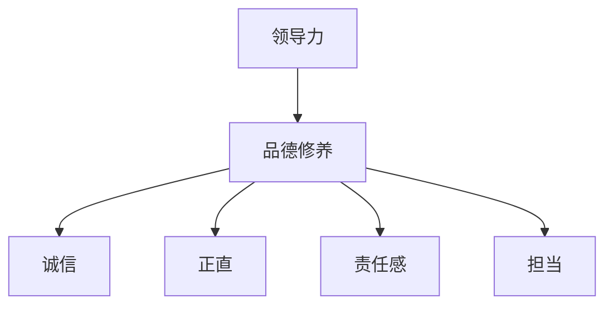

## 第2章 领导力核心概念解析

在了解了领导力理论的历史发展后，本章将进一步探讨领导力的核心概念。我们将从领导力的定义、领导力与管理的区别、领导风格与领导效能等方面进行详细分析。

#### 2.1 领导力的定义

领导力是指领导者通过激发、影响和引导团队成员，实现共同目标的能力。领导力不仅仅是职位赋予的权力，更是一种影响力。有效的领导者不仅具备职位和权力，还能赢得团队成员的信任和支持。

领导力的定义可以用以下LaTeX格式表示：

$$
\text{领导力} = \text{激发} + \text{影响} + \text{引导} + \text{共同目标}
$$

#### 2.2 领导力与管理的区别

领导力与管理密切相关，但又有所不同。管理侧重于规划和执行组织目标，而领导力则侧重于激发团队成员的潜能和创造力。领导力强调变革和创新，而管理强调稳定和效率。有效的领导者不仅具备管理能力，还能发挥领导力。

领导力与管理的关系可以用以下Mermaid流程图表示：

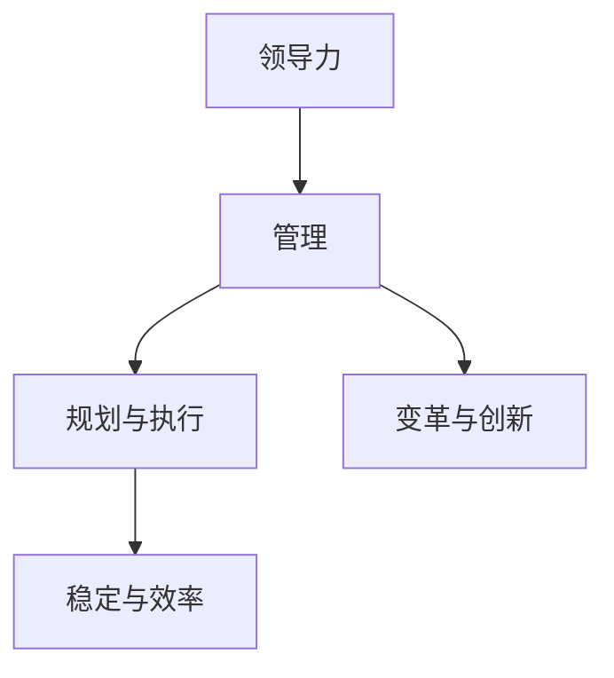

#### 2.3 领导风格与领导效能

领导风格是指领导者对待团队成员、分配任务和决策的方式。不同的领导风格对领导效能产生不同的影响。本章将介绍常见的领导风格，如指令型、支持型、参与型和教练型，并分析不同领导风格对领导效能的影响。

以下是一个简单的领导风格与领导效能的Mermaid流程图：

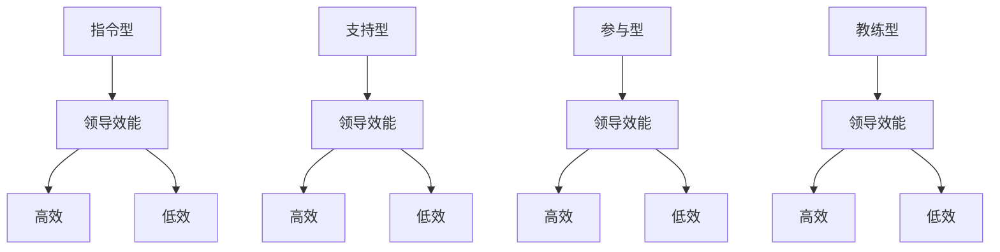

### 2.3.1 指令型领导风格

指令型领导风格的特点是领导者直接下达指令，团队成员按指令执行。这种风格在短期内可能提高效率，但长期来看可能导致团队成员缺乏主动性和创造力。

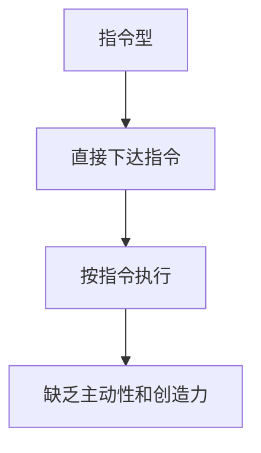

### 2.3.2 支持型领导风格

支持型领导风格的特点是领导者关心团队成员的需求，提供支持和鼓励。这种风格有助于增强团队凝聚力，提高团队成员的工作满意度。

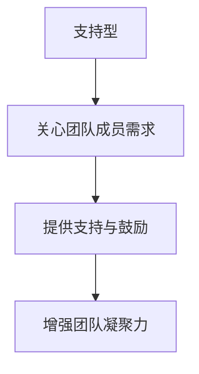

### 2.3.3 参与型领导风格

参与型领导风格的特点是领导者鼓励团队成员参与决策和规划，共同制定目标。这种风格有助于激发团队成员的积极性和创造力，提高团队的整体效能。

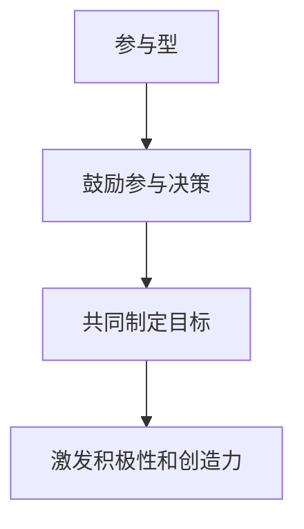

### 2.3.4 教练型领导风格

教练型领导风格的特点是领导者像教练一样指导团队成员，帮助他们发展个人技能和职业素养。这种风格有助于提升团队成员的专业能力和工作满意度。

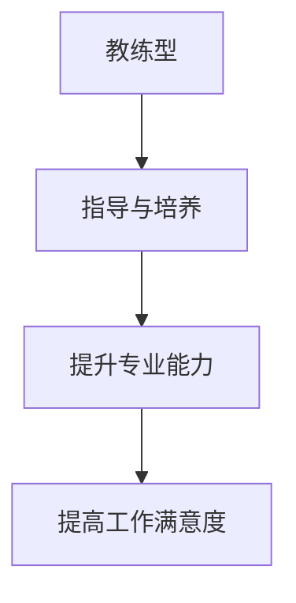

#### 2.4 领导力的持续发展

领导力是一个持续发展的过程。领导者应不断学习、反思和实践，提升自己的领导能力。以下是一个简单的领导力持续发展模型：

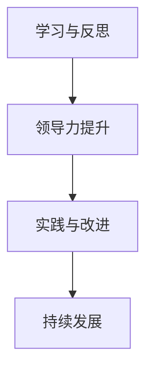

通过学习与反思，领导者可以识别自身的优势和不足，制定改进计划。通过实践与改进，领导者可以将理论知识转化为实际能力，不断提升自己的领导水平。

## 第二部分：品德修养的重要性

### 第3章 品德修养的基本原则

品德修养是领导者成功的重要因素之一。本章将探讨品德修养的基本原则，包括诚信、正直、责任感、担当等品质。我们将通过具体案例和实例，阐述这些原则在实际工作和生活中的应用。

#### 3.1 品德的定义

品德是指个体在行为和思想上遵循的道德规范和价值观。品德修养是领导者成功的重要因素，它不仅影响个人的形象，还影响团队的凝聚力和组织的整体效能。

品德的定义可以用以下LaTeX格式表示：

$$
\text{品德} = \text{道德规范} + \text{价值观}
$$

#### 3.2 品德修养的重要性

品德修养的重要性体现在多个方面。首先，高尚的品德有助于树立领导者的权威和形象。其次，品德修养有助于建立良好的团队氛围，增强团队凝聚力和协作精神。最后，品德修养是领导者实现长远发展的基石，有助于组织实现可持续成长。

#### 3.3 品德修养的核心要素

品德修养的核心要素包括诚信、正直、责任感、担当等。诚信是品德修养的基础，正直是品德的底线，责任感是品德的实践，担当是品德的体现。这些核心要素相互关联，共同构成了高尚的品德修养。

以下是一个简单的品德修养核心要素的Mermaid流程图：

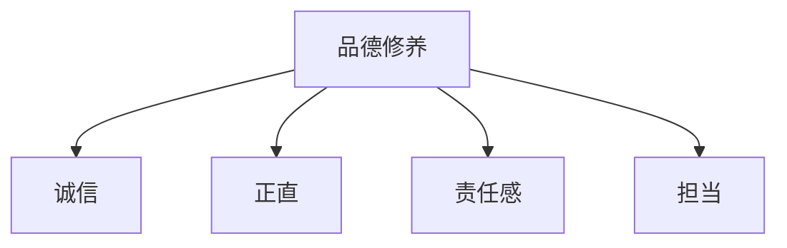

### 3.3.1 诚信

诚信是领导者应具备的首要品质。诚信意味着领导者言行一致，遵守承诺，坚守道德底线。诚信有助于赢得团队成员的信任和支持，提升领导力。

以下是一个关于诚信的示例：

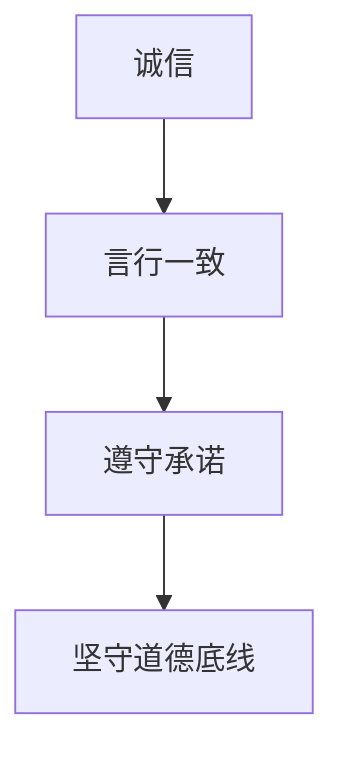

#### 3.3.2 正直

正直是品德的底线。正直意味着领导者做人做事有原则，不徇私情，敢于面对困难和挑战。正直有助于树立领导者的形象，增强团队的信任和凝聚力。

以下是一个关于正直的示例：

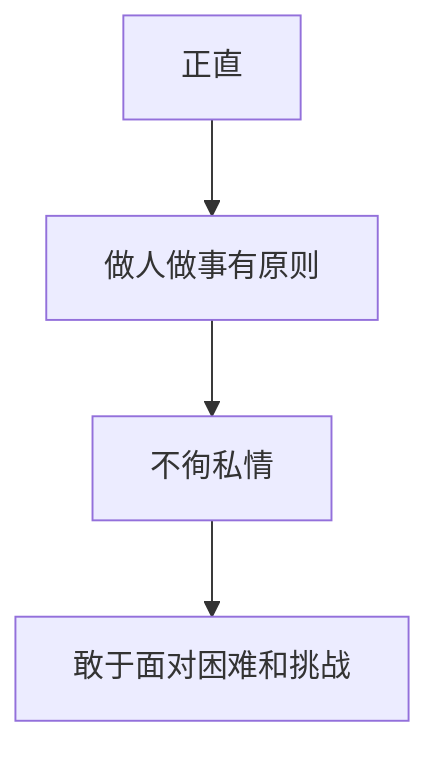

#### 3.3.3 责任感

责任感是领导者应具备的重要品质。责任感意味着领导者对自己的行为和决策负责，对团队成员和组织负责。责任感有助于提升领导者的权威和形象，增强团队凝聚力和执行力。

以下是一个关于责任感的示例：

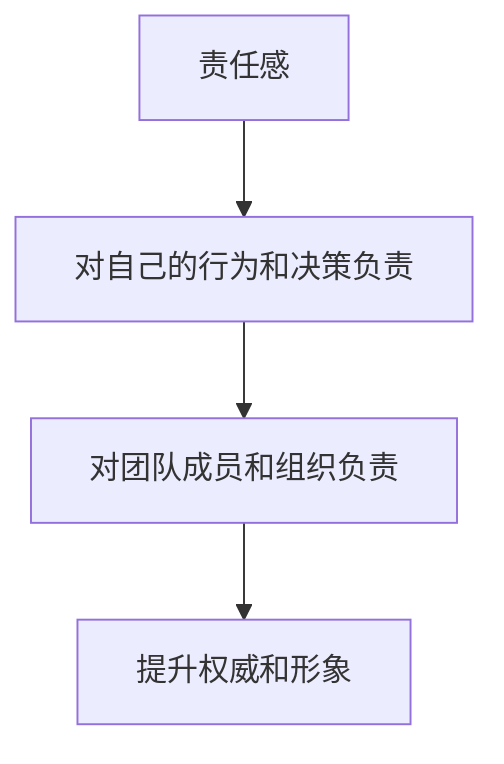

#### 3.3.4 担当

担当是领导者应具备的品质。担当意味着领导者勇于承担责任，敢于面对失败和挑战。担当有助于树立领导者的形象，增强团队的信任和凝聚力。

以下是一个关于担当的示例：

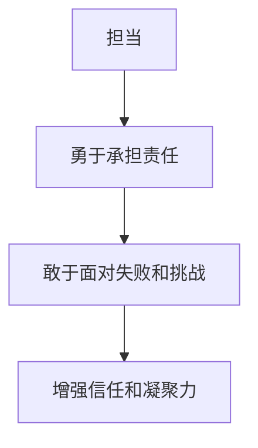

### 3.4 品德修养的具体实践

在了解了品德修养的基本原则后，本章将探讨如何在实际工作和生活中实践这些原则。我们将介绍一些具体的实践方法，如诚信沟通、正直待人、承担责任、勇于担当等，并分析这些方法对个人和团队的影响。

#### 3.4.1 诚信沟通

诚信沟通是领导者应具备的重要能力。诚信沟通意味着领导者在与团队成员沟通时，应保持诚实、透明，不隐瞒事实，不欺骗他人。诚信沟通有助于建立信任，增强团队的凝聚力。

以下是一个关于诚信沟通的示例：

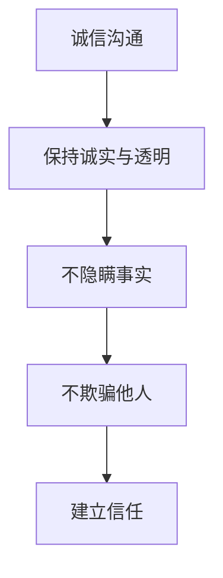

#### 3.4.2 正直待人

正直待人是领导者应具备的重要品质。正直待人意味着领导者在与团队成员交往时，应做人做事有原则，不偏袒，不偏私。正直待人有助于树立领导者的形象，增强团队的信任。

以下是一个关于正直待人的示例：

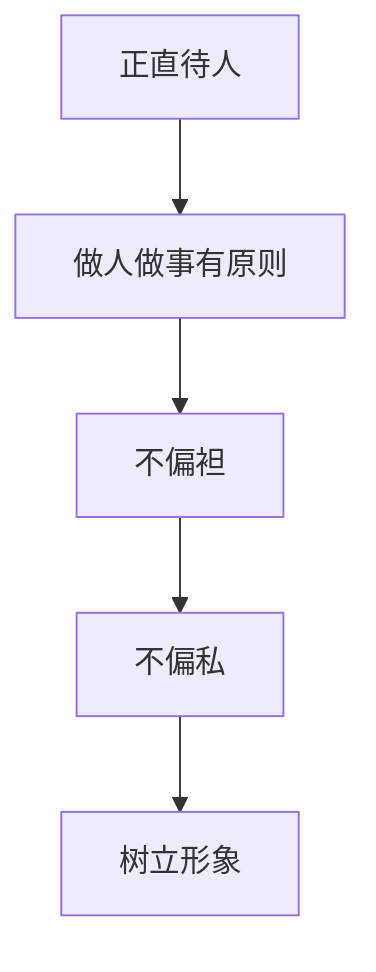

#### 3.4.3 承担责任

承担责任是领导者应具备的重要品质。承担责任意味着领导者在面对困难和挑战时，应勇于承担责任，不逃避，不推诿。承担责任有助于提升领导者的权威和形象，增强团队的凝聚力。

以下是一个关于承担责任

