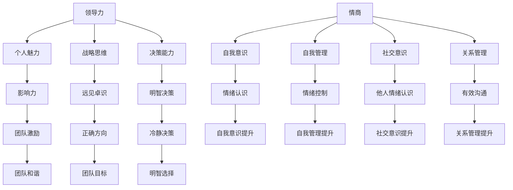

                 

### 文章标题：领导力与情商：提升人际关系管理能力

> 关键词：领导力，情商，人际关系管理，能力提升

> 摘要：本文旨在深入探讨领导力与情商在人际关系管理中的关键作用，分析两者的核心概念、相互关系，并通过具体的算法原理、数学模型、项目实战等，为读者提供实用的提升人际关系管理能力的路径。

### 引言

在快速变化和高度竞争的现代社会，领导力与情商已经成为个人和团队成功的重要因素。领导力不仅是带领团队实现目标的能力，更是影响和激励他人、建立良好人际关系的关键。情商则是指个体识别、理解和管理自己及他人情绪的能力，它对人际关系的和谐与冲突的化解起着至关重要的作用。

本文将围绕领导力与情商两大核心概念，逐步深入探讨它们在人际关系管理中的联系与应用。首先，我们将定义领导力和情商，并阐述它们之间的关系。接着，本文将介绍测量情商和培养领导力的方法，并利用伪代码和数学模型来解释这些方法。此外，通过一个具体的领导力与情商培训项目案例，我们将展示如何在实际中应用这些原理，并提供实用的代码实例来评估员工的人际关系管理能力。最后，文章将总结最佳实践，提出注意事项，并推荐拓展阅读资源。

### 一、核心概念与联系

#### 领导力

领导力是一种复杂且多维的能力，它包括个人魅力、战略思维、决策能力等多个方面。简单来说，领导力是指影响和激励他人，带领团队实现共同目标的能力。个人魅力是领导者能够吸引和激发团队成员的关键因素；战略思维则是指领导者具备的远见卓识和全局观念，能够指导团队朝着正确的方向前进；决策能力是领导者处理复杂问题、做出明智选择的重要体现。

#### 情商

情商（Emotional Intelligence，简称EQ）是指个体识别、理解和管理自己情绪，以及识别、理解和管理他人情绪的能力。情商的核心包括自我意识、自我管理、社交意识和关系管理。自我意识是指个体对自己情绪的认识和理解；自我管理则是指个体调节情绪、控制行为的能力；社交意识是指个体对他人在情绪上的认识和理解；关系管理是指个体在人际关系中的有效沟通和协调能力。

#### 领导力与情商的关系

领导力与情商之间存在密切的联系和相互影响。情商是领导力的重要组成部分，它有助于领导者更好地理解、沟通和激励团队成员。高情商的领导者能够敏锐地察觉团队成员的情绪变化，及时调整沟通方式，建立和谐的人际关系。同时，情商也影响着领导者的决策过程，使他们在面对压力和挑战时能够保持冷静、做出明智的决策。

**关系架构 Mermaid 流程图：**


通过上述流程图，我们可以清晰地看到领导力和情商之间的相互作用和影响。领导力通过个人魅力、战略思维和决策能力等维度，与情商中的自我意识、自我管理、社交意识和关系管理相互交织，共同构建起一个和谐高效的人际关系管理能力体系。

### 二、核心算法原理讲解

#### 情商测量方法

情商的测量是一个复杂的过程，它需要通过多种方法来全面评估个体的情商水平。以下是一些常见的情商测量方法及其原理：

1. **自我评估**

   自我评估是一种常见的情商测量方法，它要求个体对自己的情商进行自我评价。这种方法可以帮助个体意识到自己在情商方面的优势和劣势。自我评估通常包括一系列问题，如“我是否能控制自己的情绪？”或“我是否善于理解他人的情绪？”等问题。

   **伪代码示例：**
   ```python
   function self_assessment(person):
       questions = ["Do you control your emotions?", "Do you understand others' emotions?"]
       answers = person.answer_questions(questions)
       return average(answers)
   ```

2. **他人反馈**

   他人反馈是通过收集他人对个体情商的评价来评估情商的方法。这种方法提供了一个外部视角，帮助个体更全面地了解自己的情商水平。他人反馈可以来自同事、朋友或家人，他们通过回答一系列问题或填写问卷来评估个体的情商。

   **伪代码示例：**
   ```python
   function others_feedback(person):
       questions = ["Does the person control their emotions?", "Does the person understand others' emotions?"]
       feedbacks = person收集他人反馈(questions)
       return average(feedbacks)
   ```

3. **情境测试**

   情境测试是一种通过设置特定的情境来观察个体在处理情绪问题时的表现来评估情商的方法。这种方法可以帮助评估个体在实际情境中的情商水平。情境测试可以设计成角色扮演、模拟场景等形式。

   **伪代码示例：**
   ```python
   function situation_test(person):
       scenarios = ["Deal with a difficult coworker", "Manage a team conflict"]
       performances = person.handle_scenarios(scenarios)
       return average(performances)
   ```

综上所述，情商的测量方法包括自我评估、他人反馈和情境测试。这些方法相互补充，共同为全面评估个体的情商水平提供支持。

#### 领导力培养方法

领导力并非与生俱来，它可以通过后天的学习和实践来不断提升。以下是一些培养领导力的方法：

1. **自我反思**

   自我反思是培养领导力的重要步骤，它要求个体定期回顾自己的行为、决策和结果，从中学习和成长。自我反思可以帮助个体认识到自己在领导力方面的不足，并找到改进的方法。

   **伪代码示例：**
   ```python
   function reflection(person):
       reflections = person.review_actions()
       improvements = person.identify_improvements(reflections)
       return improvements
   ```

2. **学习领导力知识**

   学习领导力知识是培养领导力的基础，它包括阅读领导力相关的书籍、参加领导力培训课程和研讨会等。通过学习，个体可以了解领导力的理论基础和实践方法，为自己的领导力提升提供指导。

   **伪代码示例：**
   ```python
   function learning_leadership(person):
       knowledge = person.acquire_leadership_knowledge()
       understanding = person.apply_knowledge(knowledge)
       return understanding
   ```

3. **实践领导力技能**

   实践是检验和学习领导力技能的最佳方式。个体可以通过参与团队项目、领导团队活动或担任志愿者等途径，将学到的领导力知识应用到实际中。通过实践，个体可以不断提升自己的领导力水平。

   **伪代码示例：**
   ```python
   function practice_leadership(person):
       projects = personlead_projects()
       experiences = person.collect_experiences(projects)
       skills = person.improve_skills(experiences)
       return skills
   ```

通过自我反思、学习领导力知识和实践领导力技能，个体可以逐步提升自己的领导力水平。这些方法相互支持，共同为个体在领导力领域的成长提供坚实的基础。

### 三、数学模型和数学公式

#### 人际关系管理能力的数学模型

人际关系管理能力是一个复杂的概念，它不仅涉及到领导力和情商，还受到个体、环境和其他多种因素的影响。为了更系统地分析和理解人际关系管理能力，我们可以构建一个数学模型来描述这一能力。

假设人际关系管理能力由领导力和情商两个因素决定，我们可以使用以下公式表示人际关系管理能力：

$$
Ability = f(Leadership, Emotional Intelligence)
$$

其中，$Ability$ 表示人际关系管理能力，$Leadership$ 表示领导力，$Emotional Intelligence$ 表示情商。这个公式表明，人际关系管理能力是领导力和情商的函数，即一个人的领导力和情商水平越高，其人际关系管理能力也越强。

#### 领导力与情商的关系模型

领导力与情商之间的关系是一个多维度的复杂问题，但我们可以通过一个简化的模型来描述这种关系。一个常见的假设是，领导力与情商之间存在一个乘法关系，即：

$$
Leadership \cdot Emotional Intelligence = Maximize \: Ability
$$

这个公式表明，领导力与情商的乘积决定了人际关系管理能力的最大值。这意味着，在领导力和情商的协同作用下，个体能够达到最高的人际关系管理能力。例如，一个具有高情商但低领导力的个体可能无法充分发挥其潜力，而一个具有高领导力但低情商的个体也可能在与团队成员的互动中遇到困难。

#### 举例说明

为了更好地理解上述数学模型，我们可以通过一个具体的例子来说明。

假设有两个个体A和B，他们的领导力分别为$L_A = 0.8$和$L_B = 0.6$，情商分别为$E_A = 0.9$和$E_B = 0.7$。

根据领导力与情商的乘法关系，我们可以计算出他们的人际关系管理能力：

$$
Ability_A = L_A \cdot E_A = 0.8 \cdot 0.9 = 0.72
$$

$$
Ability_B = L_B \cdot E_B = 0.6 \cdot 0.7 = 0.42
$$

从计算结果可以看出，个体A的人际关系管理能力（0.72）高于个体B（0.42）。这表明，领导力和情商的协同作用对于提升人际关系管理能力至关重要。

通过数学模型和公式，我们可以更直观地理解和分析人际关系管理能力。这不仅有助于理论研究，也为实际应用提供了有力的工具。在实际中，我们可以根据这些模型和公式，设计和实施针对性的培训和改进策略，以提升个体和团队的人际关系管理能力。

### 四、项目实战

#### 领导力与情商培训项目

为了提升员工的人际关系管理能力，许多企业都会实施领导力与情商的培训项目。这样的项目旨在通过系统化的培训，帮助员工提升领导力、情商，从而更好地应对工作中的挑战，建立和谐高效的工作关系。以下是一个典型的领导力与情商培训项目步骤：

1. **培训需求分析**

   培训需求分析是项目设计的第一步，它旨在确定员工在领导力与情商方面的具体需求。通过问卷调查、访谈、焦点小组讨论等方式，收集员工对于领导力与情商培训的看法和建议，从而制定出符合实际需求的培训计划。

2. **设计培训课程**

   根据需求分析的结果，设计出针对性的培训课程。课程内容应涵盖领导力与情商的核心概念、测量方法、培养策略等。培训课程可以采用讲座、案例分析、角色扮演、模拟演练等多种形式，以增强培训的趣味性和互动性。

3. **实施培训课程**

   在实施培训课程时，应充分考虑员工的实际情况，合理安排培训时间和地点。培训过程中，讲师应引导员工积极参与，通过讨论、互动和反思，深化对领导力与情商的理解和应用。

4. **培训效果评估**

   培训效果评估是确保培训项目成功的重要环节。通过问卷调查、技能测试、访谈等方式，评估员工在领导力与情商方面的提升情况。根据评估结果，及时调整培训方案，以提高培训效果。

以下是一个简单的Python代码案例，用于评估员工的人际关系管理能力。这个代码通过计算员工的领导力和情商得分，评估其人际关系管理能力：

```python
def evaluate_ability(employees):
    leadership_scores = [employee.leadership_score() for employee in employees]
    emotional_intelligence_scores = [employee.emotional_intelligence_score() for employee in employees]
    ability_scores = [leadership * emotional_intelligence for leadership, emotional_intelligence in zip(leadership_scores, emotional_intelligence_scores)]
    return ability_scores

# 示例数据
employees = [
    {"name": "Alice", "leadership_score": 0.8, "emotional_intelligence_score": 0.9},
    {"name": "Bob", "leadership_score": 0.7, "emotional_intelligence_score": 0.8},
    {"name": "Charlie", "leadership_score": 0.6, "emotional_intelligence_score": 0.7}
]

# 调用评估函数
ability_scores = evaluate_ability(employees)

# 打印评估结果
for employee in employees:
    print(f"{employee['name']}的人际关系管理能力得分为：{ability_scores[employees.index(employee)]}")
```

**代码解读与分析：**

1. **evaluate_ability函数**

   这个函数接收一个员工列表作为输入，每个员工都包含其领导力和情商得分。函数首先从每个员工对象中提取领导力和情商得分，然后计算两者乘积，得到每个人的人际关系管理能力得分。最后，函数返回一个包含所有员工人际关系管理能力得分的列表。

2. **示例数据**

   示例数据是一个包含三个员工的对象列表，每个员工都有一个字典，包含其姓名、领导力得分和情商得分。

3. **调用评估函数**

   在调用evaluate_ability函数时，将示例数据传递给函数，得到一个包含每个人人际关系管理能力得分的列表。

4. **打印评估结果**

   最后，通过遍历员工列表和人际关系管理能力得分列表，打印出每个员工的人际关系管理能力得分。

通过这个简单的代码实例，我们可以直观地看到如何通过计算员工的领导力和情商得分，来评估其人际关系管理能力。这不仅有助于企业了解员工的整体能力水平，也为进一步的培训和改进提供了依据。

#### 领导力与情商培训项目的实际案例

为了更好地理解领导力与情商培训项目在实际中的应用，以下是一个具体的案例。

**项目背景：** 
某中型企业致力于提升员工的人际关系管理能力，以提高团队的整体效率和协作水平。为了实现这一目标，企业决定实施一项为期三个月的领导力与情商培训项目。

**项目步骤：**

1. **需求分析**  
   通过问卷调查和员工访谈，企业了解到员工在领导力和情商方面存在以下主要需求：提高团队沟通能力、增强情绪管理能力、提升决策能力和增强领导力自信心。

2. **课程设计**  
   根据需求分析结果，设计了一系列培训课程，包括团队沟通技巧、情绪管理、领导力基础和实践等。课程内容结合了理论知识与实际案例，并通过角色扮演、小组讨论和模拟演练等形式，提高员工的参与度和实践能力。

3. **培训实施**  
   培训分为三个阶段，每个阶段持续一个月。在第一阶段，员工学习了团队沟通技巧和情绪管理知识；在第二阶段，员工通过实际案例分析，练习领导力决策能力；在第三阶段，员工进行领导力实践，并在导师的指导下，实施一个小型项目，以检验所学知识。

4. **效果评估**  
   在培训结束后，企业通过问卷调查、技能测试和员工绩效评估等方式，评估了培训效果。结果显示，大多数员工在团队沟通、情绪管理和领导力决策方面有了显著提升。

**案例分析：**

**案例1：提高团队沟通能力**

在一次团队沟通技巧培训后，一名员工主动组织了团队会议，引入了“头脑风暴”环节，鼓励团队成员提出建议和意见。这一改变不仅提高了会议效率，还增强了团队的凝聚力。

**案例2：增强情绪管理能力**

另一名员工在情绪管理培训中学习了如何识别和管理自己的情绪。在一次项目紧张期，这名员工面对压力时，能够保持冷静，有效地解决了团队内部的矛盾，确保项目顺利进行。

**项目小结：**

通过领导力与情商培训项目，企业成功地提升了员工的人际关系管理能力，这不仅提高了团队的协作效率，也为企业创造了更多的价值。项目结果表明，系统化的培训对于提升员工能力和企业整体绩效具有重要意义。

### 五、最佳实践与注意事项

#### 最佳实践

1. **个性化培训方案**

   为了确保培训的有效性，应根据员工的不同需求和能力，设计个性化的培训方案。这可以包括不同层次的课程、定制化的学习资源和一对一的导师指导。

2. **持续跟进与反馈**

   培训不是一次性活动，而是一个持续的过程。企业应建立持续的跟进机制，定期收集员工的反馈，及时调整培训内容和方式，以保持培训的针对性和有效性。

3. **实践与反思相结合**

   培训应注重实践，鼓励员工将所学知识应用到实际工作中。通过反思和实践中的反馈，员工可以不断改进自己的领导力和情商能力。

#### 注意事项

1. **避免过度培训**

   过度培训可能导致员工疲劳和反感，影响培训效果。企业应合理安排培训时间，确保员工有足够的精力参与。

2. **注重实际应用**

   培训内容应紧密联系实际工作，确保员工能够将所学应用到实际场景中，从而提高培训的实用性。

3. **建立支持性环境**

   企业应创造一个支持性的环境，鼓励员工分享经验、相互学习，并在工作中给予必要的支持和资源。

### 六、拓展阅读

1. **《情商：为什么情商比智商更重要》（Daniel Goleman）**

   这本书详细阐述了情商的概念、重要性及其在个人和职业发展中的应用。

2. **《领导力》（John C. Maxwell）**

   本书提供了实用的领导力培养方法，适合那些希望提升领导能力的人。

3. **《如何高效学习》（Cal Newport）**

   本书介绍了高效学习的方法，包括如何通过反思和实践来不断提升自己的能力。

### 七、总结

本文系统地探讨了领导力与情商在人际关系管理中的关键作用，通过核心概念讲解、算法原理分析、数学模型建立和项目实战等环节，为读者提供了提升人际关系管理能力的有效路径。领导力和情商不仅对个人职业发展至关重要，也对团队的协作效率和企业文化的建设有着深远的影响。通过本文的介绍，希望读者能够深入理解并应用这些原理，不断提升自己的人际关系管理能力。

### 作者信息

作者：AI天才研究院/AI Genius Institute & 禅与计算机程序设计艺术 /Zen And The Art of Computer Programming

本文旨在通过深入探讨领导力与情商在人际关系管理中的关键作用，为读者提供提升人际关系管理能力的实用路径。作者结合自身在人工智能和计算机编程领域的丰富经验，以逻辑清晰、结构紧凑、简单易懂的专业技术语言，帮助读者理解并应用这些核心概念。希望通过本文，读者能够深入理解领导力与情商的重要性，并学会如何在实际中提升人际关系管理能力。

