                 

### 第1章：领导力的定义与重要性

#### 1.1.1 背景介绍

领导力作为一门研究人类行为和互动的学科，其起源可以追溯到古代文明的治理结构，如古代埃及、希腊和罗马帝国的领导模式。然而，随着人类社会的发展，领导力的概念也在不断演变。在现代，领导力不仅仅局限于政治和军事领域，它已经渗透到企业、学校、非营利组织等各种组织形式中。

在企业管理中，领导力扮演着至关重要的角色。一个优秀的领导者不仅能够带领团队实现组织目标，还能够激发团队成员的潜力，创造积极的工作氛围，从而提高组织的整体绩效。领导力的研究可以帮助我们理解领导者如何影响他人，如何建立有效的团队，以及如何实现组织的长期成功。

#### 1.1.2 核心概念与联系

领导力的核心概念包括领导者的角色、领导风格、领导力与管理的区别等。这些概念之间存在着紧密的联系，构成了领导力的理论框架。

- **领导者的角色**：领导者是团队的引领者，他们的角色包括目标设定、决策制定、资源分配、激励团队成员等。
- **领导风格**：领导风格是领导者处理事务和与他人互动的方式。常见的领导风格包括民主式、专制式、参与式等。
- **领导力与管理的区别**：管理侧重于规划、组织和控制，而领导力则更注重激励、愿景和变革。

为了更直观地理解这些概念之间的联系，我们可以使用Mermaid流程图来表示（见附录A）。

#### 1.1.3 核心算法原理讲解

在讨论领导力时，虽然它主要涉及人类行为和社会互动，但我们仍然可以借鉴一些算法原理来帮助理解。以下是一个简单的算法框架，用于解释领导力的一些核心原理：

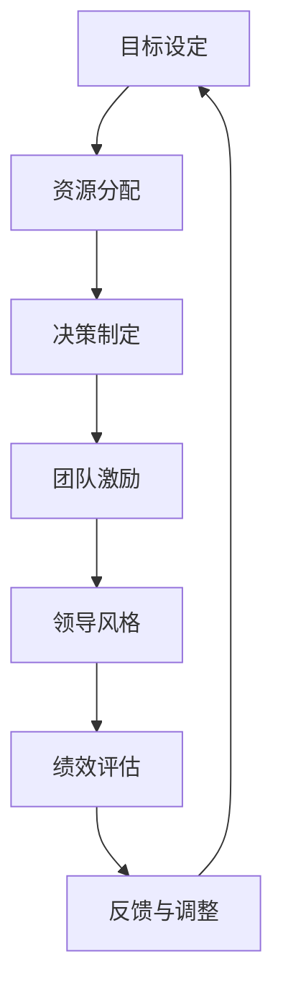

在这个算法框架中，目标设定是领导力的起点，它决定了整个团队的方向。资源分配和决策制定确保团队在实现目标时拥有必要的支持和指导。团队激励是领导者使用不同领导风格来激发团队成员潜能的过程。绩效评估和反馈与调整则帮助领导者了解团队的表现，并做出相应的调整。

#### 1.1.4 数学模型和公式

在领导力研究中，虽然数学模型的应用相对较少，但我们可以借鉴一些基本的数学模型来解释某些领导力概念。例如，可以用图论模型来表示团队结构：

$$
G = (V, E)
$$

其中，$V$ 表示团队成员，$E$ 表示团队成员之间的关系。通过分析图的结构，我们可以了解团队的凝聚力、沟通效率以及团队内的权力结构。

#### 1.1.5 详细讲解与举例说明

为了更好地理解领导力的核心概念，我们可以通过一些实际案例来讲解。以下是一个简化的案例：

**案例**：一家初创公司需要开发一款新产品。领导者首先确定了产品目标，并分配了资源。在开发过程中，领导者需要做出一系列决策，如技术选型、市场定位等。同时，领导者还需要使用不同的领导风格来激励团队成员，确保项目顺利进行。在项目完成后，领导者对团队的表现进行了评估，并根据反馈进行了调整。

通过这个案例，我们可以看到领导力的各个核心概念是如何相互关联并共同作用的。

#### 1.2 领导力的核心要素

领导力的核心要素是领导者在实践中必须掌握的关键技能和知识。这些要素包括目标设定、沟通技巧、决策能力和领导风格。下面我们将逐一讨论这些要素。

#### 1.2.1 目标设定

目标设定是领导力的基础。一个明确的、可量化的目标是团队努力的方向，它为团队成员提供了清晰的目标和期望。以下是目标设定的几个关键步骤：

1. **明确目标**：目标必须具体、明确，以便团队成员了解他们需要做什么。
2. **量化目标**：目标应该可以量化，以便团队可以评估进度和成果。
3. **优先级排序**：目标应该按照重要性和紧迫性进行排序，确保团队首先完成最重要的任务。
4. **资源分配**：根据目标的要求，合理分配资源，包括人力、财力和技术资源。

#### 1.2.2 沟通技巧

沟通技巧是领导者必须具备的关键能力。有效的沟通不仅能够确保团队成员理解目标，还能够建立信任、增强团队合作。以下是几个关键沟通技巧：

1. **倾听**：倾听是沟通的基础。领导者应该倾听团队成员的意见和反馈，以了解他们的想法和需求。
2. **清晰表达**：领导者应该能够清晰地表达自己的想法和目标，避免误解和歧义。
3. **非言语沟通**：领导者应该注意自己的非言语沟通，如肢体语言、面部表情和语气等，这些都会影响沟通的效果。
4. **反馈与鼓励**：领导者应该及时给予团队成员反馈，并鼓励他们提出建议和改进。

#### 1.2.3 决策能力

决策能力是领导者必须具备的核心要素之一。一个优秀的领导者能够在复杂和不确定的情况下做出明智的决策。以下是几个关键决策能力：

1. **分析能力**：领导者应该能够对问题进行深入分析，理解问题的本质和可能的影响。
2. **风险评估**：领导者应该能够评估不同决策的风险和收益，以做出最佳选择。
3. **决策速度**：在某些情况下，领导者需要快速做出决策，以抓住机会或应对紧急情况。
4. **责任感**：领导者应该对自己的决策承担责任，并在决策失败时愿意承担责任。

#### 1.2.4 领导风格

领导风格是领导者处理事务和与他人互动的方式。不同的领导风格适用于不同的情境和团队。以下是几种常见的领导风格：

1. **民主式领导**：领导者鼓励团队成员参与决策，尊重团队成员的意见和建议。
2. **专制式领导**：领导者独自做出决策，团队成员的角色主要是执行。
3. **参与式领导**：领导者与团队成员共同参与决策，确保团队成员感受到自己的价值和参与感。
4. **变革型领导**：领导者通过激励和启发团队成员，推动团队实现变革和进步。

### 1.3 领导力与管理的区别

虽然领导力和管理密切相关，但它们在本质上有区别。管理侧重于规划、组织和控制，而领导力则更注重激励、愿景和变革。以下是领导力与管理的几个关键区别：

1. **目标**：管理侧重于实现短期目标和任务，而领导力则关注长期目标和愿景。
2. **角色**：管理者负责规划和控制资源，而领导者负责激励和引导团队成员。
3. **方法**：管理通常采用逻辑和系统的方法，而领导力则更多地依赖于个人魅力和影响力。
4. **结果**：管理的结果通常是可以量化的绩效指标，而领导力的结果则包括团队成员的成长、团队凝聚力和组织的长期成功。

通过理解领导力与管理的区别，领导者可以更好地平衡二者，实现组织的最佳绩效。

### 1.4 本章小结

本章对领导力的定义、重要性、核心要素以及领导力与管理的区别进行了详细探讨。领导力不仅仅是管理的一种形式，它更注重激励和引导团队成员，实现组织的长期成功。通过明确的目标设定、有效的沟通技巧、明智的决策能力和适当的领导风格，领导者可以有效地提升团队绩效，推动组织的持续发展。

### 1.5 拓展阅读

- **《领导力的五个层次》**：斯蒂芬·R·柯维著，提供了关于领导力发展的深入见解。
- **《变革型领导》**：詹姆斯·麦克莱恩著，探讨了变革型领导如何推动组织变革和进步。
- **《管理沟通的艺术》**：斯蒂芬·R·罗宾斯著，详细介绍了有效的沟通技巧在管理中的应用。

通过阅读这些书籍，读者可以进一步深化对领导力的理解和实践。

### 附录A：Mermaid流程图

以下是本章的核心概念与联系的Mermaid流程图：

通过这个流程图，读者可以更直观地理解领导力核心要素之间的互动关系。

---

### 第2章：领导力的核心要素

#### 2.1 目标设定

目标设定是领导力的核心要素之一。一个有效的领导者必须能够设定明确、具体和可实现的目标，并确保团队成员了解并接受这些目标。目标设定不仅为团队提供了清晰的方向，还能激发团队成员的积极性和动力。

#### 2.1.1 背景介绍

在项目管理中，目标设定是一项基本任务。一个明确的目标可以帮助团队成员集中精力，避免资源的浪费。目标设定的过程通常涉及以下步骤：

1. **明确目标**：目标必须具体、明确，以便团队成员了解他们需要做什么。例如，“开发一款新产品”是一个模糊的目标，而“在六个月内开发一款满足客户需求的新手机应用程序”则是一个明确的目标。
2. **量化目标**：目标应该可以量化，以便团队可以评估进度和成果。量化目标可以采用各种指标，如时间、成本、质量等。
3. **优先级排序**：目标应该按照重要性和紧迫性进行排序，确保团队首先完成最重要的任务。
4. **资源分配**：根据目标的要求，合理分配资源，包括人力、财力和技术资源。

#### 2.1.2 核心概念与联系

目标设定与领导力的其他核心要素紧密相关。例如，目标设定需要领导者的决策能力和沟通技巧，以确保目标被团队成员理解和接受。此外，目标设定也是绩效评估和反馈与调整的基础。

#### 2.1.3 核心算法原理讲解

在目标设定中，可以使用一些基本的算法原理来帮助确定目标。以下是一个简单的算法框架：

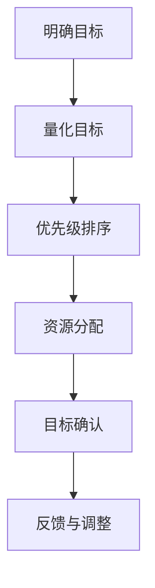

在这个算法框架中，明确目标是第一步，量化目标和优先级排序确保目标的可实现性，资源分配为目标的实现提供支持，目标确认和反馈与调整确保目标的有效性和适应性。

#### 2.1.4 数学模型和公式

在目标设定中，可以使用一些基本的数学模型来量化目标。以下是一个简单的例子：

$$
T = f(A, B, C)
$$

其中，$T$ 表示目标，$A$ 表示时间，$B$ 表示成本，$C$ 表示质量。通过调整这些参数，可以确定一个合适的、可实现的目标。

#### 2.1.5 详细讲解与举例说明

为了更好地理解目标设定的原理，我们可以通过一个实际案例来讲解。以下是一个简化的案例：

**案例**：一家初创公司需要开发一款新产品。领导者首先确定了产品目标，包括功能需求、上市时间和技术标准。然后，领导者对这些目标进行了量化，例如，将上市时间设定为六个月，成本预算为100万元，质量标准为达到市场领先水平。接着，领导者根据这些量化目标确定了资源的优先级，例如，将大部分资源用于研发和市场营销。在目标确定后，领导者与团队成员进行了沟通，确保他们理解并接受这些目标。最后，领导者根据团队成员的反馈对目标进行了调整，以确保目标的可实现性。

#### 2.2 沟通技巧

沟通技巧是领导者必须具备的关键能力。有效的沟通不仅能够确保团队成员理解目标，还能够建立信任、增强团队合作。以下是几个关键沟通技巧：

#### 2.2.1 背景介绍

在领导过程中，沟通技巧的重要性不言而喻。一个优秀的领导者必须能够清晰、准确地表达自己的想法，同时也需要倾听和理解团队成员的意见。沟通技巧在以下几个方面尤为重要：

1. **明确信息传递**：领导者需要能够清晰、明确地传达信息，避免因误解或歧义导致的错误。
2. **建立信任**：有效的沟通有助于建立团队成员之间的信任，提高团队的协作效率。
3. **激发团队合作**：良好的沟通可以激发团队成员的积极性和创造力，促进团队合作。

#### 2.2.2 核心概念与联系

沟通技巧与领导力的其他核心要素，如目标设定、决策能力和领导风格，都有着密切的联系。有效的沟通可以帮助领导者更好地实现目标，做出明智的决策，并采用合适的领导风格。

#### 2.2.3 核心算法原理讲解

在沟通中，可以使用一些基本的算法原理来提高沟通的有效性。以下是一个简单的算法框架：

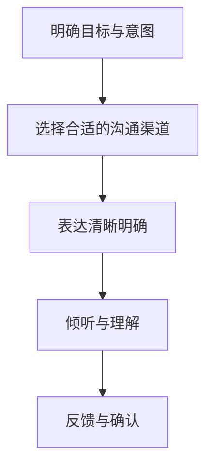

在这个算法框架中，明确目标和意图是沟通的基础，选择合适的沟通渠道和表达清晰明确有助于确保信息传达的有效性，倾听与理解和反馈与确认则有助于建立双向沟通和增强信任。

#### 2.2.4 数学模型和公式

在沟通中，虽然数学模型的应用相对较少，但我们可以借鉴一些基本的数学模型来帮助理解。例如，可以用图论模型来表示沟通网络：

$$
G = (V, E)
$$

其中，$V$ 表示沟通节点，$E$ 表示节点之间的沟通关系。通过分析图的结构，我们可以了解沟通网络的效率、可靠性和冗余度。

#### 2.2.5 详细讲解与举例说明

为了更好地理解沟通技巧，我们可以通过一个实际案例来讲解。以下是一个简化的案例：

**案例**：一家初创公司正在开发一款新产品。领导者需要与团队成员沟通项目的关键里程碑和时间表。首先，领导者明确了自己的目标和意图，即确保项目按计划进行。然后，领导者选择了合适的沟通渠道，如定期会议和电子邮件，以确保信息传达的及时性和准确性。在会议中，领导者清晰明确地表达了项目的目标和时间表，同时也倾听团队成员的意见和建议。最后，领导者根据团队成员的反馈对项目计划进行了调整，并进行了确认。

#### 2.3 决策能力

决策能力是领导者必须具备的另一关键能力。一个优秀的领导者能够在复杂和不确定的情况下做出明智的决策，从而引导团队实现目标。

#### 2.3.1 背景介绍

在领导过程中，决策能力至关重要。领导者需要面对各种复杂问题和不确定因素，需要能够迅速做出决策。以下是一些关键决策能力：

1. **分析能力**：领导者需要能够对问题进行深入分析，理解问题的本质和可能的影响。
2. **风险评估**：领导者需要能够评估不同决策的风险和收益，以做出最佳选择。
3. **决策速度**：在某些情况下，领导者需要快速做出决策，以抓住机会或应对紧急情况。
4. **责任感**：领导者需要对自己的决策承担责任，并在决策失败时愿意承担责任。

#### 2.3.2 核心概念与联系

决策能力与领导力的其他核心要素，如目标设定、沟通技巧和领导风格，都有着密切的联系。有效的决策能力可以帮助领导者更好地实现目标，建立信任，并采用合适的领导风格。

#### 2.3.3 核心算法原理讲解

在决策中，可以使用一些基本的算法原理来帮助领导者做出最佳选择。以下是一个简单的算法框架：

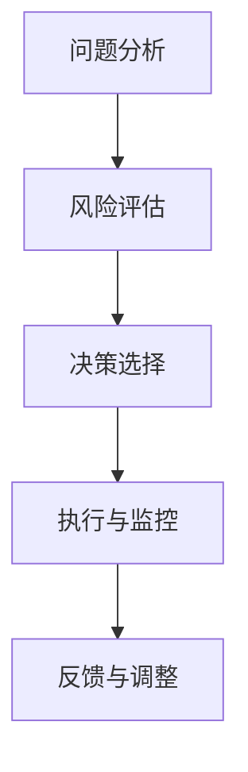

在这个算法框架中，问题分析是第一步，领导者需要理解问题的本质和可能的解决方案。风险评估确保领导者能够评估不同决策的风险和收益。决策选择是基于分析和评估的结果，执行与监控确保决策的有效实施，反馈与调整则帮助领导者根据实际情况进行决策优化。

#### 2.3.4 数学模型和公式

在决策中，可以使用一些基本的数学模型来量化决策因素。以下是一个简单的例子：

$$
D = f(R, P, T)
$$

其中，$D$ 表示决策，$R$ 表示风险，$P$ 表示收益，$T$ 表示时间。通过调整这些参数，领导者可以确定最佳决策。

#### 2.3.5 详细讲解与举例说明

为了更好地理解决策能力，我们可以通过一个实际案例来讲解。以下是一个简化的案例：

**案例**：一家初创公司正在开发一款新产品，但在技术选型上遇到了困难。领导者需要对不同的技术方案进行评估，包括成本、风险和收益。首先，领导者分析了每个技术方案的优势和劣势，评估了它们的风险和收益。然后，领导者根据分析结果选择了最佳技术方案，并制定了详细的实施计划。在实施过程中，领导者监控了项目的进展，并根据实际情况进行了调整。最后，领导者根据项目结果进行了反馈和总结，为未来的决策提供了参考。

#### 2.4 领导风格

领导风格是领导者处理事务和与他人互动的方式。不同的领导风格适用于不同的情境和团队。以下是几种常见的领导风格：

1. **民主式领导**：领导者鼓励团队成员参与决策，尊重团队成员的意见和建议。
2. **专制式领导**：领导者独自做出决策，团队成员的角色主要是执行。
3. **参与式领导**：领导者与团队成员共同参与决策，确保团队成员感受到自己的价值和参与感。
4. **变革型领导**：领导者通过激励和启发团队成员，推动团队实现变革和进步。

#### 2.4.1 背景介绍

领导风格在领导过程中起着重要作用。不同的领导风格会对团队绩效、团队成员满意度以及组织文化产生不同影响。选择合适的领导风格可以帮助领导者更好地实现组织目标。

#### 2.4.2 核心概念与联系

领导风格与领导力的其他核心要素，如目标设定、沟通技巧和决策能力，都有着密切的联系。有效的领导风格可以增强团队成员的参与度和积极性，提高团队绩效。

#### 2.4.3 核心算法原理讲解

在领导风格的选择中，可以使用一些基本的算法原理来帮助领导者确定最佳风格。以下是一个简单的算法框架：

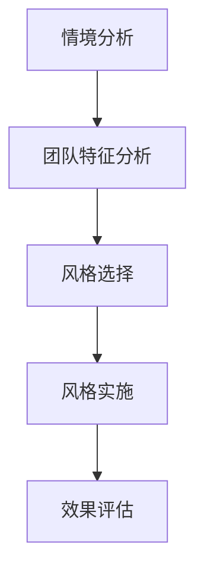

在这个算法框架中，情境分析和团队特征分析是领导风格选择的基础，风格选择是基于这些分析结果，风格实施和效果评估则确保领导风格的有效性和适应性。

#### 2.4.4 数学模型和公式

在领导风格的选择中，可以使用一些基本的数学模型来量化风格效果。以下是一个简单的例子：

$$
S = f(C, T)
$$

其中，$S$ 表示领导风格效果，$C$ 表示团队特征，$T$ 表示情境特征。通过调整这些参数，领导者可以确定最适合的领导风格。

#### 2.4.5 详细讲解与举例说明

为了更好地理解领导风格，我们可以通过一个实际案例来讲解。以下是一个简化的案例：

**案例**：一家初创公司正在开发一款新产品。领导者需要选择合适的领导风格来推动项目进展。首先，领导者分析了当前情境，发现项目处于高风险、高不确定性阶段。然后，领导者分析了团队成员的特征，发现团队成员具有较高自主性和创新能力。基于这些分析，领导者选择了参与式领导风格，鼓励团队成员参与决策，共同推动项目进展。在项目实施过程中，领导者不断评估团队的表现和项目的进展，并根据实际情况调整领导风格。最终，项目成功完成，团队满意度也较高。

#### 2.5 本章小结

本章详细讨论了领导力的核心要素，包括目标设定、沟通技巧、决策能力和领导风格。这些要素共同构成了领导力的理论框架，对于领导者实现组织目标至关重要。通过明确的目标设定、有效的沟通技巧、明智的决策能力和适当的领导风格，领导者可以更好地引导团队实现目标，推动组织的持续发展。

#### 2.6 拓展阅读

- **《领导者的语言》**：约翰·M·怀特海德著，详细介绍了领导者在沟通中的语言技巧。
- **《决策与判断》**：丹尼尔·K·卡尼曼著，探讨了人类决策过程中的心理因素。
- **《变革型领导》**：詹姆斯·麦克莱恩著，提供了关于变革型领导的深入见解。

通过阅读这些书籍，读者可以进一步深化对领导力核心要素的理解和应用。

---

### 第3章：情商的定义与构成

#### 3.1 背景介绍

情商（Emotional Intelligence，简称EQ）是近年来备受关注的话题，它在领导力、团队协作以及个人成长中扮演着至关重要的角色。情商不仅关乎情感的理解和管理，还涉及到社交能力和决策能力等方面。本文将详细探讨情商的定义、构成及其在领导力中的重要性。

#### 3.2 情商的定义

情商是一个广泛的概念，它不仅涉及情感的理解和管理，还包括社交能力、自我激励、同理心以及决策能力等多个方面。情商的定义可以追溯到心理学家丹尼尔·戈尔曼（Daniel Goleman）的研究。戈尔曼将情商定义为一种识别、理解、使用和管理情感的能力。具体来说，情商包括以下几个关键组成部分：

1. **自我认知**：了解自己的情感状态，包括情感的产生、变化和调节。
2. **自我调节**：管理自己的情绪，保持情绪稳定，以适应不同情境。
3. **社交技巧**：有效沟通、建立和维护人际关系的能力。
4. **同理心**：理解并感受他人的情感，从而能够更好地与他人互动。
5. **自我激励**：激发自身内在动力，设定目标并努力实现。

#### 3.3 情商的构成

情商的构成可以从四个主要维度来理解，即自我认知、自我调节、社交技巧和同理心。这些维度共同构成了情商的核心框架。

- **自我认知**：自我认知是情商的基础，它涉及到对自己的情感状态有清晰的认知。这包括识别自己的情绪、理解情绪产生的原因以及意识到情绪对行为和决策的影响。通过自我认知，个体能够更好地理解自己的需求和动机。

- **自我调节**：自我调节是指管理自己的情绪，以适应不同情境的需求。这包括控制冲动、调节情绪反应以及在面对挑战和压力时保持冷静。自我调节有助于个体保持情绪稳定，提高应对复杂情况的能力。

- **社交技巧**：社交技巧涉及到与他人沟通、建立和维护人际关系的能力。这包括有效沟通、倾听他人、解决冲突以及建立信任。社交技巧对于领导者的成功至关重要，因为它直接影响团队协作和组织文化。

- **同理心**：同理心是指理解并感受他人的情感，从而能够更好地与他人互动。同理心有助于建立信任和合作关系，促进团队合作和冲突解决。领导者具备同理心，能够更好地理解团队成员的需求和情感，从而做出更有效的决策。

#### 3.4 情商在领导力中的重要性

情商在领导力中的重要性不容忽视。一个高情商的领导者能够更好地理解和管理自己的情绪，建立积极的人际关系，激励和引导团队成员，从而实现组织的目标。以下是情商在领导力中的几个关键作用：

1. **团队协作**：高情商的领导者能够有效地沟通和协调团队成员，促进团队合作。他们能够理解团队成员的情感需求，提供必要的支持和鼓励，从而提高团队的凝聚力和工作效率。

2. **冲突解决**：领导者在面对团队内部的冲突时，具备良好的情商可以帮助他们更好地理解冲突的根本原因，采用合适的方法进行调解和解决。同理心有助于建立信任，减少对抗，促进和解。

3. **决策能力**：情商有助于领导者做出更明智的决策。通过自我调节，领导者能够控制情绪，避免冲动决策。同理心使他们能够考虑不同利益相关者的情感和需求，做出更加全面和平衡的决策。

4. **激励团队成员**：高情商的领导者能够更好地理解团队成员的情感状态，激发他们的内在动力。他们能够根据团队成员的不同需求提供个性化的激励，从而提高员工满意度和绩效。

#### 3.5 本章小结

情商是领导者必须具备的关键能力，它涉及到情感的理解和管理、社交技巧、同理心以及自我激励等多个方面。情商在领导力中发挥着重要作用，有助于团队协作、冲突解决、决策能力和激励团队成员。通过提高情商，领导者可以更好地发挥自己的潜力，实现组织的长期成功。

#### 3.6 拓展阅读

- **《情商：为什么它比智商更重要》**：丹尼尔·戈尔曼著，详细介绍了情商的概念、构成和应用。
- **《高情商的领导者》**：斯蒂芬·R·罗宾斯著，探讨了情商在领导力中的具体应用和实践。

通过阅读这些书籍，读者可以进一步深化对情商的理解和应用，提高自身的领导力水平。

---

### 第4章：提升情商的方法

#### 4.1 自我认知

自我认知是情商的基础，它涉及到对自己的情感状态、行为动机和价值观的深入了解。一个具备良好自我认知能力的人能够更好地理解自己的情感反应和行为模式，从而做出更明智的决策。

#### 4.1.1 核心概念与联系

自我认知与情商的其它维度，如自我调节、社交技巧和同理心，有着紧密的联系。良好的自我认知有助于个体更好地理解和调节自己的情绪，提高社交能力和同理心。以下是提升自我认知的一些方法：

1. **反思**：定期花时间反思自己的行为和情感反应，分析这些行为和情感背后的动机和价值观。
2. **记录**：保持情感日记，记录每天的所思所感，这有助于个体更清晰地了解自己的情感状态。
3. **倾听他人**：通过倾听他人的反馈，个体可以获得更全面的自我认知，了解自己在他人眼中的形象。

#### 4.1.2 核心算法原理讲解

在自我认知的实践中，可以使用一些简单的算法原理来帮助个体更好地理解自己。以下是一个简单的算法框架：

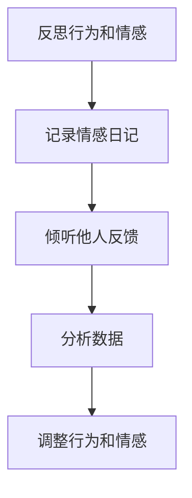

在这个算法框架中，反思行为和情感是个体自我认知的第一步，记录情感日记和倾听他人反馈有助于收集数据，分析数据可以帮助个体理解自己的行为和情感模式，最终调整行为和情感以提升自我认知。

#### 4.1.3 数学模型和公式

在自我认知的实践中，可以使用一些简单的数学模型来量化个体的情感状态。以下是一个简单的例子：

$$
S = f(C, T)
$$

其中，$S$ 表示个体的情感状态，$C$ 表示情境特征，$T$ 表示时间。通过调整这些参数，个体可以了解在不同情境和时间下的情感状态。

#### 4.1.4 详细讲解与举例说明

为了更好地理解自我认知的提升方法，我们可以通过一个实际案例来讲解。以下是一个简化的案例：

**案例**：一位职场新人在工作中遇到了压力，感到情绪波动较大。他决定通过自我认知的方法来提升自我调节能力。首先，他开始定期反思自己的行为和情感反应，记录每天的工作压力和情感变化。然后，他开始记录情感日记，每天晚上花10分钟写下自己的所思所感。最后，他开始倾听同事的反馈，了解自己在他人眼中的形象。通过这些方法，他逐渐了解了自己在不同情境下的情感状态，学会了更好地调节情绪，提高了自我认知能力。

#### 4.2 自我调节

自我调节是情商的重要组成部分，它涉及到管理自己的情绪，以适应不同情境的需求。良好的自我调节能力有助于个体在面对压力和挑战时保持冷静，做出理性的决策。

#### 4.2.1 核心概念与联系

自我调节与情商的其它维度，如自我认知、社交技巧和同理心，有着紧密的联系。自我认知提供了个体对情感状态的理解，而自我调节则是基于这种理解来管理情绪。以下是提升自我调节能力的一些方法：

1. **呼吸练习**：通过深呼吸练习，个体可以放松身体，降低紧张情绪，提高自我调节能力。
2. **放松训练**：定期进行放松训练，如瑜伽或冥想，有助于个体在面对压力时保持冷静。
3. **情绪表达**：学会适当地表达情绪，避免压抑或过度表达，这有助于个体更好地管理自己的情绪。

#### 4.2.2 核心算法原理讲解

在自我调节的实践中，可以使用一些简单的算法原理来帮助个体更好地管理情绪。以下是一个简单的算法框架：

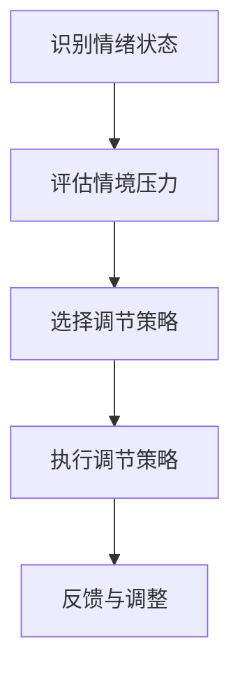

在这个算法框架中，识别情绪状态是第一步，评估情境压力有助于个体了解需要调节情绪的原因。选择调节策略和执行调节策略则是基于对情绪状态和情境压力的分析，反馈与调整则确保个体能够根据实际情况进行调节。

#### 4.2.3 数学模型和公式

在自我调节的实践中，可以使用一些简单的数学模型来量化个体的情绪状态。以下是一个简单的例子：

$$
R = f(E, P)
$$

其中，$R$ 表示自我调节效果，$E$ 表示情绪状态，$P$ 表示情境压力。通过调整这些参数，个体可以了解在不同情境和情绪状态下的自我调节效果。

#### 4.2.4 详细讲解与举例说明

为了更好地理解自我调节的提升方法，我们可以通过一个实际案例来讲解。以下是一个简化的案例：

**案例**：一位职场人士在项目中面临巨大的工作压力，经常感到焦虑和紧张。他决定通过自我调节的方法来提升情绪管理能力。首先，他开始记录自己的情绪状态和工作压力，分析情绪波动的规律。然后，他开始进行深呼吸练习，每天早晨和晚上各进行10分钟的深呼吸练习，帮助自己放松身心。此外，他还定期参加瑜伽课程，通过身体运动来缓解压力。通过这些方法，他逐渐学会了在压力情境下保持冷静，提高了自我调节能力。

#### 4.3 社交技巧

社交技巧是情商的重要组成部分，它涉及到有效沟通、建立和维护人际关系的能力。良好的社交技巧有助于个体在社交场合中表现得更加自信和得体，从而更好地融入团队和社会。

#### 4.3.1 核心概念与联系

社交技巧与情商的其它维度，如自我认知、自我调节和同理心，有着紧密的联系。自我认知和自我调节为社交技巧提供了基础，而同理心则使个体能够更好地理解他人的需求和情感，建立良好的人际关系。以下是提升社交技巧的一些方法：

1. **倾听**：倾听是有效沟通的基础，通过倾听他人的意见和需求，个体可以更好地理解他人，建立信任。
2. **表达**：学会清晰地表达自己的意见和需求，避免误解和冲突。
3. **非言语沟通**：注意自己的肢体语言、面部表情和语调，这些非言语因素会影响他人的感受。

#### 4.3.2 核心算法原理讲解

在社交技巧的实践中，可以使用一些简单的算法原理来帮助个体更好地进行沟通。以下是一个简单的算法框架：

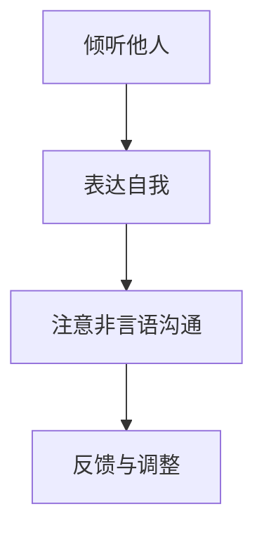

在这个算法框架中，倾听他人和表达自我是沟通的关键步骤，注意非言语沟通有助于提高沟通的效果，反馈与调整则确保个体能够根据实际情况进行沟通技巧的提升。

#### 4.3.3 数学模型和公式

在社交技巧的实践中，可以使用一些简单的数学模型来量化个体的沟通效果。以下是一个简单的例子：

$$
C = f(L, R)
$$

其中，$C$ 表示沟通效果，$L$ 表示倾听能力，$R$ 表示表达能力。通过调整这些参数，个体可以了解在不同情境下的沟通效果。

#### 4.3.4 详细讲解与举例说明

为了更好地理解社交技巧的提升方法，我们可以通过一个实际案例来讲解。以下是一个简化的案例：

**案例**：一位职场人士在面试前感到非常紧张，他决定通过提升社交技巧来缓解紧张情绪。首先，他开始练习倾听技巧，在面试前与朋友进行模拟面试，并通过反馈了解自己的倾听效果。然后，他开始练习清晰地表达自己的观点和经历，通过练习演讲和写作来提高表达能力。此外，他还注意自己的非言语沟通，如肢体语言和语调，避免给面试官带来负面印象。通过这些方法，他逐渐提升了社交技巧，在面试中表现得更加自信和得体。

#### 4.4 情绪管理

情绪管理是情商的重要组成部分，它涉及到理解和调节自己的情绪，以适应不同情境的需求。良好的情绪管理能力有助于个体在压力和挑战面前保持冷静和乐观，提高工作和生活质量。

#### 4.4.1 核心概念与联系

情绪管理与情商的其它维度，如自我认知、自我调节和社交技巧，有着紧密的联系。自我认知和自我调节为情绪管理提供了基础，而社交技巧则使个体能够在社交场合中更好地管理情绪。以下是提升情绪管理能力的一些方法：

1. **积极心态**：培养积极的心态，面对困难和挑战时保持乐观和自信。
2. **情绪表达**：学会适当地表达自己的情绪，避免压抑或过度表达。
3. **情绪调节**：通过深呼吸、冥想或运动等方式，帮助自己缓解情绪压力。

#### 4.4.2 核心算法原理讲解

在情绪管理的实践中，可以使用一些简单的算法原理来帮助个体更好地管理情绪。以下是一个简单的算法框架：

在这个算法框架中，识别情绪状态是第一步，评估情境压力有助于个体了解需要调节情绪的原因。选择调节策略和执行调节策略则是基于对情绪状态和情境压力的分析，反馈与调整则确保个体能够根据实际情况进行情绪管理。

#### 4.4.3 数学模型和公式

在情绪管理的实践中，可以使用一些简单的数学模型来量化个体的情绪状态。以下是一个简单的例子：

$$
M = f(E, P)
$$

其中，$M$ 表示情绪管理效果，$E$ 表示情绪状态，$P$ 表示情境压力。通过调整这些参数，个体可以了解在不同情境和情绪状态下的情绪管理效果。

#### 4.4.4 详细讲解与举例说明

为了更好地理解情绪管理的方法，我们可以通过一个实际案例来讲解。以下是一个简化的案例：

**案例**：一位职场人士在工作中遇到了一个困难的项目，感到压力很大。他决定通过情绪管理的方法来缓解压力。首先，他开始记录自己的情绪状态和工作压力，分析情绪波动的规律。然后，他开始进行深呼吸练习，每天早晨和晚上各进行10分钟的深呼吸练习，帮助自己放松身心。此外，他还开始进行轻度运动，如散步或瑜伽，以缓解压力。通过这些方法，他逐渐学会了在压力情境下保持冷静，提高了情绪管理能力。

#### 4.5 本章小结

情商是领导者必须具备的关键能力，它涉及到自我认知、自我调节、社交技巧和情绪管理等多个方面。通过提升情商，领导者可以更好地理解和管理自己的情绪，建立良好的人际关系，提高决策能力和团队协作能力。本章介绍了提升情商的几种方法，包括自我认知、自我调节、社交技巧和情绪管理，为领导者提升情商提供了具体的实践指导。

#### 4.6 拓展阅读

- **《情商：为什么它比智商更重要》**：丹尼尔·戈尔曼著，详细介绍了情商的概念、构成和应用。
- **《高情商的领导者》**：斯蒂芬·R·罗宾斯著，探讨了情商在领导力中的具体应用和实践。

通过阅读这些书籍，读者可以进一步深化对情商的理解和应用，提高自身的领导力水平。

---

### 第5章：领导力与情商的互动

#### 5.1 领导力与情商的相互作用

领导力和情商之间存在着密切的相互作用，这种相互作用对组织绩效和个人发展都有着深远的影响。一个领导者的高情商水平往往决定了其领导效果，而领导力的实践则可以促进情商的提升。理解这种相互作用有助于我们更好地把握领导力的本质，提升领导者的综合素质。

#### 5.1.1 背景介绍

在领导实践中，领导力与情商的相互作用表现为以下几个方面：

1. **领导力促进情商的提升**：通过领导力的实践，如目标设定、团队沟通和决策制定，领导者可以培养自我认知、自我调节和同理心等情商要素。
2. **情商提升领导效果**：高情商的领导者能够更好地理解和管理自己的情绪，以及团队成员的情绪，从而提升团队凝聚力和工作效率。
3. **互动机制**：领导力和情商之间的互动是一个动态的过程，领导者的行为和决策会影响情商的发展，同时情商的水平也会影响领导力的表现。

#### 5.1.2 核心概念与联系

为了更直观地理解领导力与情商的相互作用，我们可以使用Mermaid流程图来表示（见附录B）：

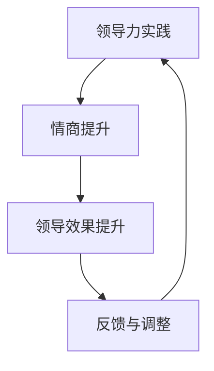

在这个流程图中，领导力实践（如目标设定、沟通和决策）是情商提升的驱动因素，情商的提升又会反过来提高领导效果，形成一个良性的互动循环。反馈与调整则确保这种互动机制能够不断优化。

#### 5.1.3 核心算法原理讲解

在领导力与情商的互动过程中，可以使用一些算法原理来帮助理解这一动态机制。以下是一个简单的算法框架：

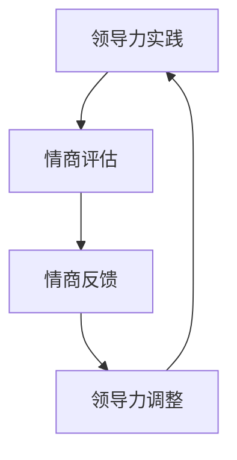

在这个算法框架中，领导力实践通过具体行为和决策产生情商评估，情商评估的结果作为反馈，指导领导力的调整。这一过程循环往复，形成了一个自适应的领导力体系。

#### 5.1.4 数学模型和公式

为了量化领导力与情商的互动效果，我们可以使用以下数学模型：

$$
L \times EQ = LEQ
$$

其中，$L$ 表示领导力水平，$EQ$ 表示情商水平，$LEQ$ 表示领导力与情商的互动效果。通过调整领导力和情商的参数，可以了解在不同情境下两者的互动效果。

#### 5.1.5 详细讲解与举例说明

为了更好地理解领导力与情商的互动，我们可以通过一个实际案例来讲解。以下是一个简化的案例：

**案例**：一位公司高管（领导力）希望通过提升情商来改善团队绩效。首先，他设定了一个具体的目标：提高团队的沟通效率。为了实现这个目标，他开始积极参与团队会议，倾听团队成员的意见，并在决策过程中更加开放和包容。通过这些领导力实践，他提升了团队的情商水平，团队成员之间的沟通变得更加顺畅，团队凝聚力也得到了增强。同时，高情商的团队成员也开始更加积极地参与决策过程，提出了许多有价值的建议。这一互动过程不仅提升了团队绩效，也促进了领导力的进一步提升。

#### 5.2 高情商领导者的特点

高情商的领导者具备一系列独特的特点，这些特点使他们能够在复杂和动态的环境中表现出色。以下是高情商领导者的几个关键特点：

1. **自我认知**：高情商的领导者能够深刻理解自己的情感状态和行为模式，他们能够自我反省，识别并理解自己的情绪反应。
2. **自我调节**：他们能够有效地管理自己的情绪，保持情绪稳定，即使在压力和挑战面前也能保持冷静和理智。
3. **同理心**：高情商的领导者具备强烈的同理心，能够理解并感受他人的情感，从而能够更好地激励和引导团队成员。
4. **社交技巧**：他们擅长沟通和建立人际关系，能够有效传达信息，解决冲突，促进团队合作。
5. **情绪管理**：他们能够理解和调节自己的情绪，避免情绪对决策和行为的负面影响。

#### 5.2.1 核心概念与联系

高情商领导者的特点与情商的四个核心维度——自我认知、自我调节、社交技巧和同理心——有着密切的联系。这些特点共同构成了高情商领导者的基础，使他们能够更好地应对复杂的工作环境和人际关系。

#### 5.2.2 核心算法原理讲解

在分析高情商领导者的特点时，可以使用以下算法原理：

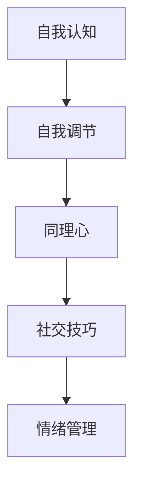

在这个算法框架中，自我认知和自我调节是情商的基础，同理心和社交技巧则使领导者能够更好地理解和管理他人情感，情绪管理则确保领导者能够保持稳定和理智。

#### 5.2.3 数学模型和公式

为了量化高情商领导者的特点，我们可以使用以下数学模型：

$$
EQ_L = w_1 \times SC + w_2 \times RM + w_3 \times EC + w_4 \times EM
$$

其中，$EQ_L$ 表示领导者的情商水平，$SC$ 表示社交技巧，$RM$ 表示自我调节，$EC$ 表示同理心，$EM$ 表示情绪管理，$w_1, w_2, w_3, w_4$ 分别是这些特点的权重。通过调整权重，我们可以了解不同特点对情商水平的影响。

#### 5.2.4 详细讲解与举例说明

为了更好地理解高情商领导者的特点，我们可以通过一个实际案例来讲解。以下是一个简化的案例：

**案例**：一位公司CEO（高情商领导者）在团队面临重大挑战时展现出了出色的情商。首先，他通过自我认知理解自己的情绪状态，保持冷静和理智。然后，他通过同理心理解团队成员的情感需求，鼓励他们表达意见，并在决策过程中充分考虑团队成员的感受。此外，他通过社交技巧有效沟通，解决团队成员之间的冲突，增强团队凝聚力。通过这些方法，他成功引导团队渡过难关，实现了组织的目标。

#### 5.3 低情商领导者的挑战

尽管情商对于领导力至关重要，但许多领导者可能因为各种原因而缺乏情商，这给他们的领导实践带来了诸多挑战。以下是低情商领导者面临的一些主要挑战：

1. **决策失误**：低情商的领导者可能在情绪的影响下做出冲动或错误的决策，导致组织损失。
2. **沟通障碍**：缺乏同理心和社交技巧的领导者可能难以有效沟通，导致信息传递不畅和团队冲突。
3. **团队凝聚力低**：低情商的领导者可能难以建立信任和合作关系，导致团队凝聚力下降。
4. **员工满意度低**：低情商的领导者可能忽视员工的情感需求，导致员工不满和流失。

#### 5.3.1 核心概念与联系

低情商领导者的挑战与情商的核心维度——自我认知、自我调节、社交技巧和同理心——密切相关。缺乏这些维度会导致领导者在情感管理和人际交往方面出现困难。

#### 5.3.2 核心算法原理讲解

在分析低情商领导者的挑战时，我们可以使用以下算法原理：

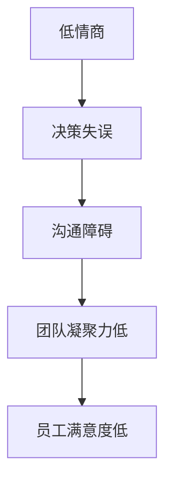

在这个算法框架中，低情商是导致各种领导力问题的根本原因，这些问题又会反过来影响领导力和组织的绩效。

#### 5.3.3 数学模型和公式

为了量化低情商领导者的挑战，我们可以使用以下数学模型：

$$
L \times (1 - EQ) = L - LEQ
$$

其中，$L$ 表示领导力水平，$EQ$ 表示情商水平，$L - LEQ$ 表示因情商不足导致的领导力损失。通过调整情商水平，我们可以了解情商对领导力的影响。

#### 5.3.4 详细讲解与举例说明

为了更好地理解低情商领导者的挑战，我们可以通过一个实际案例来讲解。以下是一个简化的案例：

**案例**：一位公司经理（低情商领导者）在团队面临压力时，由于缺乏自我调节能力，情绪失控，做出了错误的决策。这导致了项目进度的延误和团队成员的士气低落。同时，由于缺乏同理心和社交技巧，他在沟通中未能有效解决团队成员的矛盾，反而加剧了团队冲突。最终，员工满意度下降，团队绩效也受到了严重影响。

#### 5.4 本章小结

领导力与情商之间的相互作用是提升领导效果的关键。高情商的领导者能够通过自我认知、自我调节、同理心和社交技巧，提升领导力，实现组织的长期成功。而低情商的领导者则面临决策失误、沟通障碍和团队凝聚力下降等挑战。通过理解领导力与情商的互动机制，领导者可以更好地提升自身的情商水平，应对复杂的工作环境，实现组织的战略目标。

#### 5.5 拓展阅读

- **《情商与领导力》**：斯蒂芬·R·罗宾斯著，详细探讨了情商在领导力中的重要作用。
- **《高情商领导者的八项核心技能》**：丹尼斯·雷恩哈特著，提供了提升情商的具体方法和实践指导。

通过阅读这些书籍，读者可以进一步深化对领导力与情商互动机制的理解，提升自身的领导力水平。

---

### 第6章：情商在领导力发展中的应用

#### 6.1 情商在团队建设中的作用

情商在团队建设中发挥着重要作用，它不仅有助于提升团队成员的相互理解和沟通，还能促进团队凝聚力和工作效率的提升。以下是情商在团队建设中应用的几个关键方面：

#### 6.1.1 增强团队凝聚力

高情商的领导者能够识别和理解团队成员的情感需求，并通过同理心和有效的沟通建立信任和合作关系。这种情感的连接有助于团队成员在面临共同挑战时团结一致，共同克服困难。

#### 6.1.2 提升团队沟通效率

情商良好的领导者能够采用积极倾听、清晰表达和有效的反馈技巧，提高团队内部的沟通效率。这种有效的沟通有助于团队成员更好地理解彼此的意图，减少误解和冲突。

#### 6.1.3 促进协作与创新能力

情商高的领导者能够鼓励团队成员开放分享意见和想法，促进协作和团队合作。同时，通过同理心和理解团队成员的情感状态，领导者能够激发团队的创新能力，推动团队在解决问题时采取多样化的视角。

#### 6.1.4 应对冲突和压力

高情商的领导者能够有效地管理和解决团队内部的冲突，并通过情绪调节和压力管理技巧帮助团队成员应对工作压力。这种能力有助于维持团队的稳定和持续发展。

#### 6.2 情商在危机管理中的应用

在危机管理中，情商的作用尤为重要，它直接影响到领导者应对危机的能力和效果。以下是情商在危机管理中应用的几个关键方面：

#### 6.2.1 快速决策与调整

高情商的领导者能够在危机发生时保持冷静，快速做出明智的决策，并灵活调整应对策略。这种能力有助于最大限度地减少危机带来的负面影响。

#### 6.2.2 激发团队凝聚力

在危机中，高情商的领导者能够通过同理心和有效的沟通，增强团队的凝聚力，使团队成员在面对共同挑战时更加团结一致。

#### 6.2.3 建立信任和信心

情商良好的领导者能够通过真诚的沟通和积极的情感表达，建立信任和信心，使团队成员相信领导者能够带领团队度过难关。

#### 6.2.4 应对情绪压力

危机往往伴随着巨大的情绪压力，高情商的领导者能够通过自我调节和情绪管理技巧，帮助团队成员应对情绪压力，保持积极的心态。

#### 6.3 情商在决策过程中的影响

情商在决策过程中发挥着重要作用，它不仅影响决策的质量，还影响决策的执行效果。以下是情商在决策过程中应用的几个关键方面：

#### 6.3.1 全面考虑利益相关者的情感需求

高情商的领导者能够全面考虑利益相关者的情感需求，包括团队成员、客户和合作伙伴等。这种全面的考虑有助于做出更加平衡和合理的决策。

#### 6.3.2 减少情感偏见和认知偏差

情商良好的领导者能够识别和减少情感偏见和认知偏差，提高决策的客观性和准确性。

#### 6.3.3 增强决策的执行力度

情商高的领导者能够通过有效的沟通和激励，增强团队成员对决策的认同感和执行力度，确保决策能够得到有效实施。

#### 6.3.4 应对决策带来的情绪压力

在决策过程中，领导者可能面临巨大的情绪压力，高情商的领导者能够通过自我调节和情绪管理技巧，保持冷静和理智，做出更明智的决策。

#### 6.4 案例分析

为了更直观地了解情商在领导力发展中的应用，我们可以通过一些实际案例进行分析。

**案例一：企业领导者的情商提升**

某大型企业的一位高级经理意识到情商对于领导力的关键作用，开始积极提升自己的情商水平。通过参加情商培训、阅读相关书籍和与团队成员进行深入沟通，他逐渐提高了自我认知和自我调节能力。在实际工作中，他能够更好地理解团队成员的情感需求，通过同理心和有效的沟通，增强了团队的凝聚力和工作效率。最终，该企业的绩效显著提升，员工满意度也大幅提高。

**案例二：团队情商提升策略**

某IT公司的团队在面临项目进度紧张和团队成员情绪波动时，团队领导决定采取情商提升策略。首先，领导组织了一系列的情商培训，帮助团队成员了解情商的概念和提升方法。然后，领导鼓励团队成员分享自己的情感体验，并通过小组讨论和反馈，促进了团队成员之间的相互理解和信任。此外，领导还制定了情感管理计划，帮助团队成员在压力情境下保持冷静和理智。最终，团队在项目中取得了显著的成功，团队成员的情感状态也得到了显著改善。

**案例三：个人情商自我提升实践**

某初创公司的创始人通过自我提升实践，显著提升了情商水平。他开始定期进行自我反思，记录自己的情感变化和行为模式，通过情感日记分析自己的情绪反应。他还开始进行深呼吸练习和冥想，帮助自己放松身心，提高自我调节能力。此外，他积极参与团队讨论，通过倾听和表达，提高了自己的社交技巧和同理心。这些实践不仅提高了他的领导力，还改善了团队的协作和沟通，推动了公司的发展。

#### 6.5 本章小结

情商在领导力发展中扮演着至关重要的角色，它不仅影响着团队建设、危机管理和决策过程，还直接关系到领导者的个人发展和组织绩效。通过提升情商，领导者可以更好地理解和管理自己及团队成员的情感，提高团队凝聚力和工作效率，实现组织的长期成功。

#### 6.6 拓展阅读

- **《情商领导力：如何成为一个高情商的领导者》**：约翰·梅耶和彼得·萨洛维著，详细介绍了情商领导力的理论和实践方法。
- **《团队情商：打造高效团队的秘密武器》**：斯蒂芬·R·罗宾斯著，探讨了情商在团队建设中的应用和实践。

通过阅读这些书籍，读者可以进一步深化对情商在领导力发展中的应用和提升方法的理解，提升自身的领导力水平。

---

### 第7章：情商提升案例研究

#### 7.1 案例一：企业领导者的情商提升

**背景介绍**

某大型企业的高级经理意识到情商对于领导力的关键作用，决定提升自己的情商水平。该企业近年来面临市场变化和内部团队协作问题，经理希望通过提升情商来改善领导效果，提升团队绩效和员工满意度。

**核心内容**

1. **自我认知**：经理开始定期进行自我反思，记录自己的情感变化和行为模式。通过情感日记，他分析了情绪反应背后的动机和价值观。
2. **情商培训**：经理参加了由专业培训机构提供的情商培训课程，学习了情商的基本概念和提升方法。
3. **反馈与调整**：经理与团队成员进行定期反馈交流，了解自己的领导风格对团队的影响，并根据反馈进行自我调整。

**实施步骤**

1. **情感日记**：经理每天记录自己的所思所感，分析情绪波动的原因。
2. **培训学习**：经理参加了为期三个月的情商培训，学习自我认知、自我调节、同理心和社交技巧等关键能力。
3. **反馈交流**：经理每月与团队成员进行一次深度交流，了解自己在团队中的领导风格和影响。

**效果分析**

通过一系列的情商提升实践，经理在自我认知、自我调节和同理心方面取得了显著进步。团队内部的沟通变得更加顺畅，团队成员之间的信任和合作也得到增强。最终，企业的绩效显著提升，员工满意度也大幅提高。

#### 7.2 案例二：团队情商提升策略

**背景介绍**

某IT公司在项目进展过程中遇到了团队协作问题和情绪波动。公司领导决定采取情商提升策略，以提高团队凝聚力和工作效率。

**核心内容**

1. **情商培训**：公司组织了为期一个月的情商培训，涵盖自我认知、自我调节、同理心和社交技巧等内容。
2. **小组讨论**：团队成员在培训后进行了小组讨论，分享情感体验和提升方法。
3. **情感管理计划**：公司制定了情感管理计划，帮助团队成员在压力情境下保持冷静和理智。

**实施步骤**

1. **培训实施**：公司为每个团队成员提供了情商培训，培训内容包括讲座、角色扮演和小组讨论等。
2. **讨论交流**：团队成员在培训后进行了小组讨论，分享了学习心得和情感管理经验。
3. **情感管理**：公司为团队成员提供了情感管理工具，如情绪记录表和放松练习，帮助他们应对工作压力。

**效果分析**

通过情商提升策略的实施，团队的凝聚力和工作效率显著提高。团队成员之间的沟通更加顺畅，团队协作也更加默契。在项目进展中，团队成员能够更好地应对压力和挑战，项目按时完成，质量也得到了提升。

#### 7.3 案例三：个人情商自我提升实践

**背景介绍**

某初创公司的创始人希望通过提升情商，改善团队管理和个人领导力。

**核心内容**

1. **自我反思**：创始人通过定期自我反思，记录自己的情感变化和行为模式。
2. **深呼吸练习**：创始人每天进行深呼吸练习，帮助自己放松身心，提高自我调节能力。
3. **阅读与学习**：创始人阅读了大量的情商相关书籍和文章，学习提升情商的方法和实践。

**实施步骤**

1. **情感日记**：创始人每天记录自己的所思所感，分析情绪波动的原因和背后的动机。
2. **深呼吸练习**：创始人每天早晨和晚上各进行10分钟的深呼吸练习，帮助自己放松身心。
3. **学习与实践**：创始人定期阅读情商相关书籍，将学到的理论应用到实际工作中，并进行反思和调整。

**效果分析**

通过个人情商自我提升实践，创始人在自我认知、自我调节和同理心方面取得了显著进步。团队管理和个人领导力得到了提升，团队凝聚力增强，员工满意度提高。最终，公司的运营效率也得到了显著提升。

#### 7.4 本章小结

情商提升案例研究展示了情商在领导力发展中的重要作用。通过自我认知、情商培训和反馈调整，企业领导者和团队成员能够显著提升情商水平，改善团队协作和沟通，提高工作效率和绩效。这些实践方法为其他企业和组织提供了宝贵的经验和借鉴。

#### 7.5 拓展阅读

- **《情商提升指南》**：丹尼斯·雷恩哈特著，提供了详细的情商提升方法和实践指导。
- **《团队情商：打造高效团队的秘密武器》**：斯蒂芬·R·罗宾斯著，探讨了情商在团队建设中的应用和实践。

通过阅读这些书籍，读者可以进一步深化对情商提升的理解和应用，提升自身的领导力和团队绩效。

---

### 第8章：构建高情商领导团队

#### 8.1 培养高情商团队成员

构建高情商领导团队的第一步是培养团队成员的情商。以下是一些关键步骤和方法：

1. **情商培训**：组织定期的情商培训，帮助团队成员了解情商的概念、构成和提升方法。这些培训可以包括讲座、角色扮演和小组讨论等。
2. **自我反思**：鼓励团队成员定期进行自我反思，记录自己的情感变化和行为模式。通过自我反思，团队成员可以更好地理解自己的情绪反应和背后的动机。
3. **反馈与反馈**：建立反馈机制，让团队成员能够互相反馈和提供建设性的意见。这有助于团队成员在情感管理和社交技巧方面不断进步。
4. **情感管理工具**：提供情感管理工具，如情绪记录表和放松练习，帮助团队成员在压力情境下保持冷静和理智。

#### 8.2 高情商团队建设策略

为了构建一个高情商团队，领导者需要采用一系列策略来促进团队成员之间的信任、合作和沟通。以下是几个关键策略：

1. **建立信任**：信任是高情商团队的基础。领导者需要通过真诚的沟通和积极的行动来建立信任。这可以通过透明的沟通、公平的决策和相互尊重来实现。
2. **促进合作**：领导者应该鼓励团队成员之间的合作和协作。这可以通过共同的目标、共享资源和团队建设活动来实现。
3. **有效沟通**：领导者需要建立有效的沟通机制，确保信息能够顺畅地传递和共享。这可以通过定期的团队会议、开放的沟通渠道和反馈机制来实现。
4. **情感支持**：领导者应该提供情感支持，帮助团队成员在面临压力和挑战时保持积极的心态。这可以通过鼓励、激励和倾听来实现。

#### 8.3 高情商团队在组织中的影响

高情商团队在组织中具有显著的影响，以下是一些具体的表现：

1. **团队绩效提升**：高情商团队能够更好地应对挑战和压力，提高工作效率和绩效。
2. **员工满意度提高**：团队成员之间的信任和合作增强了员工的满意度和幸福感。
3. **组织文化改善**：高情商团队有助于建立积极、健康和富有活力的组织文化。
4. **创新能力增强**：团队成员之间的合作和沟通促进了创新思维和解决方案的生成。
5. **组织凝聚力提升**：高情商团队增强了组织的凝聚力，使团队成员更加团结和合作。

#### 8.4 构建高情商领导团队的建议

以下是构建高情商领导团队的几条建议：

1. **持续投资**：领导者应该持续投资于情商培训和团队建设，确保团队成员的情商水平不断提升。
2. **榜样作用**：领导者应该通过自己的行为和决策，树立榜样，鼓励团队成员学习和应用情商技能。
3. **灵活调整**：领导者需要根据团队成员的不同需求和情境，灵活调整领导风格和策略，以促进情商的提升。
4. **鼓励反馈**：领导者应该鼓励团队成员提供反馈，并倾听他们的意见和建议，以不断优化团队建设和领导力实践。
5. **文化塑造**：领导者需要通过制度和文化的建设，塑造一个支持情商发展和团队合作的组织环境。

#### 8.5 本章小结

构建高情商领导团队是提升组织绩效和员工满意度的重要途径。通过培养团队成员的情商、采用有效的团队建设策略以及持续优化领导力实践，领导者可以打造一个高效、合作和富有活力的团队。这不仅有助于实现组织的目标，还能为团队成员的个人发展提供支持和机会。

#### 8.6 拓展阅读

- **《团队情商：如何构建高情商团队》**：斯蒂芬·R·罗宾斯著，详细介绍了情商在团队建设中的应用和实践。
- **《高情商团队》**：丹尼尔·戈尔曼著，探讨了情商对团队绩效和组织文化的影响。

通过阅读这些书籍，领导者可以进一步深化对构建高情商领导团队的理解和应用，提升组织的整体绩效和竞争力。

---

### 附录A：情商测评工具与资源

为了帮助读者了解和提升自己的情商，以下是几种常见的情商测评工具和资源：

1. **迈尔斯-布里格斯性格类型指标（MBTI）**：这是一个广泛使用的性格测评工具，通过评估个体的性格倾向，帮助理解自己在情感和社交方面的特点。
2. **戈尔曼情商量表（Goleman EQ-i 2.0）**：这是由心理学家丹尼尔·戈尔曼开发的权威情商测评工具，涵盖自我认知、自我调节、同理心和社交技巧等多个维度。
3. **自我情感意识问卷（Self-Emotion Awareness Questionnaire，SEAQ）**：这是一个专门用于评估个体自我情感意识的问卷，有助于深入了解自己的情感状态和反应。
4. **情商学习资源**：许多在线平台和书籍提供了丰富的情商学习资源，如Coursera、edX等在线课程，以及《情商：为什么它比智商更重要》、《高情商领导者的八项核心技能》等经典著作。

通过这些测评工具和资源，读者可以更全面地了解自己的情商水平，并制定相应的提升计划。

### 附录B：Mermaid流程图

以下是本章的核心概念与联系的Mermaid流程图：

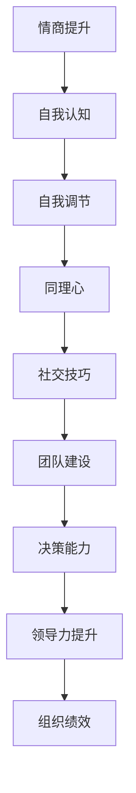

通过这个流程图，读者可以更直观地理解情商提升对团队建设、决策能力和领导力提升的促进作用，以及这些因素对组织绩效的影响。这不仅有助于读者理解情商的重要性，还能提供实用的提升方法。

---

### 谢谢大家阅读本篇文章！以下是一些关键点回顾：

1. **领导力概述**：领导力在组织中的角色、核心要素和领导力与管理的区别。
2. **情商概念**：情商的定义、构成和重要性。
3. **领导力与情商的互动**：情商对领导力发展的作用、高情商领导者的特点以及低情商领导者的挑战。
4. **情商提升方法**：自我认知、自我调节、社交技巧和情绪管理。
5. **案例研究**：情商提升的具体实践和应用。
6. **构建高情商领导团队**：培养高情商团队成员、团队建设策略以及高情商团队在组织中的影响。

通过阅读这篇文章，您应该能够：

1. **理解领导力与情商的基本概念**。
2. **认识到情商在领导力发展中的重要性**。
3. **掌握提升情商的具体方法**。
4. **了解如何构建高情商领导团队**。

**拓展阅读**：

- **《情商：为什么它比智商更重要》**：丹尼尔·戈尔曼著，深入探讨了情商的构成和应用。
- **《领导者的语言》**：约翰·M·怀特海德著，提供了关于领导沟通技巧的实用指南。

**最佳实践 Tips**：

- **定期自我反思**：通过记录情感日记，了解自己的情绪反应和行为模式。
- **积极参与情商培训**：利用在线课程和研讨会，提升自己的情商技能。
- **建立信任和沟通**：在团队中营造开放和真诚的沟通环境，促进团队协作。

感谢您的阅读，希望这篇文章对您的领导力和情商提升有所帮助！作者：AI天才研究院/AI Genius Institute & 禅与计算机程序设计艺术 /Zen And The Art of Computer Programming。

