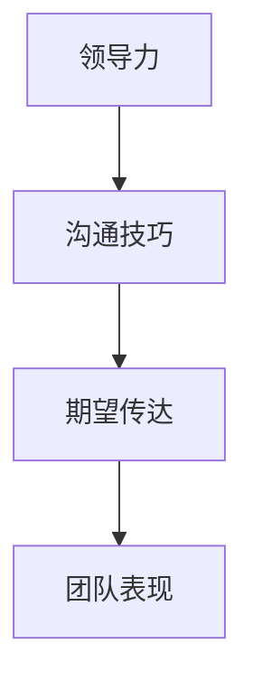

                 

### 引言

在当今快速发展的信息技术领域，领导力和沟通技巧的重要性愈发凸显。有效的领导力不仅能够推动技术团队高效协作，还能激发团队成员的潜能，实现技术创新与业务增长。而良好的沟通技巧则是确保团队目标一致、减少误解与冲突、增强团队凝聚力的重要保障。因此，本文将深入探讨领导力与沟通技巧，特别是如何通过有效传达期望来提升团队表现。

### 背景介绍

在信息技术行业，领导力不仅关乎管理团队，更关乎引领团队在技术浪潮中不断前行。有效的领导力要求领导者具备深厚的技术背景、敏锐的市场洞察力以及卓越的沟通能力。然而，在实际工作中，许多领导者面临着如何将期望清晰地传达给团队成员的挑战。

沟通技巧则是领导力的核心组成部分。无论是日常的工作交流，还是面对重大决策的沟通，领导者都需要具备出色的沟通技巧。有效的沟通能够确保团队成员理解任务要求、工作目标以及领导者的期望，从而避免误解和冲突，提升团队整体效率。

### 核心概念与联系

在本文中，我们将探讨以下几个核心概念：

1. **领导力**：指领导者通过影响力激励和引导团队成员实现共同目标的能力。
2. **沟通技巧**：包括语言和非语言交流技巧，以及在不同情境下选择合适的沟通策略。
3. **期望传达**：指领导者明确、具体地传达期望，确保团队成员理解并积极回应。

这些概念之间的关系可以概括为：领导力通过有效的沟通技巧来实现期望传达，进而推动团队表现。

#### Mermaid 流程图

以下是一个简要的Mermaid流程图，展示了这些核心概念之间的联系：



在这个流程图中，领导力通过沟通技巧传递期望，期望的清晰传达有助于提升团队表现。

### 核心算法原理讲解

为了更好地理解如何通过有效传达期望来提升团队表现，我们可以将这一过程视为一种算法。以下是这个算法的伪代码：

```plaintext
function EffectiveCommunication(leader, team):
    1. Define clear goals and expectations
    2. Assess the communication needs of the team
    3. Choose appropriate communication channels
    4. Deliver messages with clarity and confidence
    5. Seek and provide feedback to ensure understanding
    6. Adjust communication strategies as needed
    7. Monitor team performance and make necessary adjustments
    8. Celebrate successes and learn from failures
```

通过这个伪代码，我们可以看到，有效传达期望是一个持续迭代的过程，需要领导者不断地评估、调整并优化沟通策略。

### 数学模型和公式讲解

在期望传达的过程中，理解团队成员的期望值是非常重要的。我们可以使用概率论中的期望值公式来计算团队成员对期望的期望值。以下是这个数学模型的公式和详细讲解：

$$ E(X) = \sum_{i=1}^{n} x_i \cdot P(x_i) $$

其中，$E(X)$ 表示期望值，$x_i$ 表示第 $i$ 个团队成员的期望值，$P(x_i)$ 表示第 $i$ 个团队成员期望发生的概率。

#### 举例说明

假设一个团队有5名成员，他们的期望值分别是 $X_1, X_2, X_3, X_4, X_5$，且他们期望发生的概率分别是 $P(X_1), P(X_2), P(X_3), P(X_4), P(X_5)$。我们可以通过以下步骤计算团队整体的期望值：

$$ E(X) = X_1 \cdot P(X_1) + X_2 \cdot P(X_2) + X_3 \cdot P(X_3) + X_4 \cdot P(X_4) + X_5 \cdot P(X_5) $$

例如，如果团队成员的期望值和概率如下：

$$ X_1 = 8, P(X_1) = 0.2 $$
$$ X_2 = 10, P(X_2) = 0.3 $$
$$ X_3 = 7, P(X_3) = 0.1 $$
$$ X_4 = 9, P(X_4) = 0.2 $$
$$ X_5 = 11, P(X_5) = 0.2 $$

则团队整体的期望值 $E(X)$ 为：

$$ E(X) = 8 \cdot 0.2 + 10 \cdot 0.3 + 7 \cdot 0.1 + 9 \cdot 0.2 + 11 \cdot 0.2 = 8.6 $$

这个计算结果告诉我们，团队整体的期望值大约为8.6，这有助于领导者了解团队成员的整体期望，并据此调整沟通策略。

### 项目实战

为了更好地理解如何在实际项目中应用上述理论，我们可以通过一个实际案例来进行分析。

#### 开发环境搭建

假设我们正在开发一个实时数据分析平台，团队需要使用Python和Django框架。以下是开发环境搭建的步骤：

1. 安装Python（版本3.8或以上）
2. 安装Django（使用pip install django）
3. 创建一个新的Django项目（使用django-admin startproject myproject）
4. 创建一个新的Django应用程序（使用python manage.py startapp myapp）

#### 源代码详细实现和代码解读

接下来，我们详细解读一个关键部分的源代码，即数据处理的函数。

```python
def process_data(data):
    """
    数据处理函数，用于处理和分析实时数据。
    :param data: 待处理的数据
    :return: 处理后的数据
    """
    # 数据预处理
    cleaned_data = preprocess_data(data)
    
    # 数据分析
    analysis_results = analyze_data(cleaned_data)
    
    # 数据可视化
    visualize_data(analysis_results)
    
    return analysis_results
```

这个函数包含了三个主要步骤：数据预处理、数据分析和数据可视化。通过逐步分析这些步骤，我们可以理解每个部分的代码实现和作用。

1. **数据预处理**：`preprocess_data` 函数用于清洗和格式化数据，确保数据的质量和一致性。
2. **数据分析**：`analyze_data` 函数对预处理后的数据进行统计分析，提取有用的信息。
3. **数据可视化**：`visualize_data` 函数将分析结果可视化，便于团队成员理解和共享。

#### 代码应用解读与分析

在实际应用中，这个函数会被调用以处理实时传入的数据。例如，当新数据到达时，系统会自动调用 `process_data` 函数进行处理和分析。

```python
new_data = get_new_data()
processed_data = process_data(new_data)
```

这个流程确保了数据的实时处理和分析，从而为团队成员提供了及时的数据洞察。

#### 案例分析和详细讲解剖析

通过这个案例，我们可以看到如何通过有效传达期望来提升团队表现。以下是具体分析：

1. **明确目标**：团队明确了开发实时数据分析平台的目标，这有助于所有成员理解任务的重要性和期望结果。
2. **清晰传达**：领导者清晰地传达了每个开发任务的要求和期望，确保团队成员了解自己的职责和目标。
3. **持续反馈**：领导者通过定期检查代码质量、项目进度和团队成员的反馈，不断调整沟通策略，确保团队朝着共同目标前进。
4. **团队合作**：团队成员之间通过有效的沟通和协作，共同解决了开发过程中遇到的问题，确保项目的顺利进行。

#### 项目小结

通过这个实际案例，我们可以看到如何将领导力与沟通技巧应用于项目管理中，实现项目的成功。以下是项目小结：

- **明确目标**：确保团队成员理解任务的重要性和期望结果。
- **清晰传达**：通过清晰的沟通，确保团队成员明确自己的职责和目标。
- **持续反馈**：通过持续反馈和调整，优化团队表现。
- **团队合作**：鼓励团队成员之间的沟通和协作，共同解决问题。

### 最佳实践 Tips

为了进一步提升团队表现，以下是一些最佳实践 Tips：

1. **定期沟通**：定期组织团队会议，确保团队成员了解项目的进展和未来的计划。
2. **透明化**：保持项目信息的透明，让团队成员了解项目的全貌和相互依赖关系。
3. **培养信任**：建立团队信任，鼓励成员之间的开放沟通和合作。
4. **个性化沟通**：根据团队成员的个性和沟通偏好调整沟通方式，确保信息传达的有效性。
5. **持续学习**：鼓励团队成员不断学习新技能和知识，提升团队整体实力。

### 小结

通过本文的讨论，我们深入探讨了领导力与沟通技巧在信息技术行业中的应用，特别是如何通过有效传达期望来提升团队表现。有效的领导力和沟通技巧不仅能够推动团队高效协作，还能激发团队成员的潜能，实现技术创新与业务增长。

### 注意事项

在实际应用中，领导者需要根据团队的具体情况和任务特点灵活调整沟通策略，确保期望的清晰传达。同时，领导者应注重持续反馈和团队建设，以不断提升团队表现。

### 拓展阅读

对于希望进一步深入了解领导力与沟通技巧的读者，以下是一些推荐的书籍和资源：

- 《领导力五要素》（作者：史蒂芬·罗宾斯）
- 《非暴力沟通》（作者：马歇尔·卢森堡）
- 《团队协作的艺术》（作者：汤姆·彼得斯）
- 《敏捷开发实践指南》（作者：杰夫·萨瑟兰）

通过这些资源，读者可以进一步学习如何提升领导力和沟通技巧，为团队的成功打下坚实基础。作者：AI天才研究院/AI Genius Institute & 禅与计算机程序设计艺术 /Zen And The Art of Computer Programming。

