                 

### 文章标题

《领导力与职业发展：帮助团队成员成长》

### 关键词

- 领导力
- 职业发展
- 团队管理
- 成长策略
- 沟通技巧
- 问题解决
- 项目实战

### 摘要

本文旨在探讨领导力与职业发展之间的紧密联系，并重点阐述如何通过有效的领导力实践帮助团队成员实现个人和职业成长。文章首先定义了领导力的核心概念，分析了不同类型的领导力及其在管理中的角色。接着，本文通过人际关系与沟通技巧、决策与问题解决、领导力发展策略等核心算法原理，深入讲解领导力的实际应用。此外，文章还从职业规划、求职技巧、职业素养等方面，提供了详细的职业发展策略和实践指导。最后，通过一个具体的领导力与职业发展项目实战案例，结合代码实现与分析，展示了领导力与职业发展在实际工作中的应用效果。本文旨在为IT领域从业者提供一套系统、实用的领导力与职业发展指南。

---

### 第一部分：领导力核心概念与联系

#### 1.1 领导力的定义与类型

**1.1.1 领导力的本质**

领导力是一种影响他人、激励团队实现共同目标的能力。它不仅仅是权威的象征，更是一种服务精神，是领导者通过引导、激励和沟通，使团队成员能够超越自我，共同实现团队目标的过程。

**1.1.2 领导力的不同类型**

1. **变革型领导力**：通过激励和启发团队成员，推动变革和创新。这种领导力强调领导者的个人魅力和愿景，能够激发团队成员的热情和创造力。

2. **交易型领导力**：依赖于明确的目标和绩效奖励机制，领导者通过奖励和惩罚来激励团队成员。这种领导力更注重任务的完成和绩效的达成。

3. **转型型领导力**：在面临重大变革和挑战时，领导者通过提供清晰的方向和愿景，带领团队实现转变。这种领导力强调领导者的战略思维和变革能力。

**1.1.3 领导力与管理的区别**

领导力与管理是两个不同的概念，但它们之间有着紧密的联系。管理侧重于资源的规划、组织和分配，确保组织目标的实现。而领导力则关注于激发团队成员的潜力，建立共同愿景，推动组织向更高的目标迈进。

**Mermaid 流程图：领导力类型关系架构**

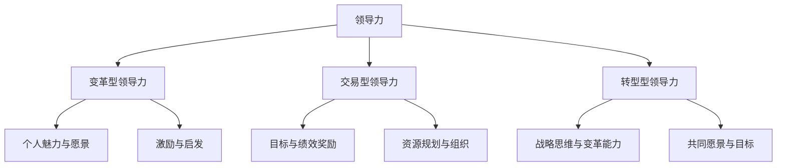

#### 1.2 领导力框架与模型

**1.2.1 领导力模型概述**

领导力模型是描述领导行为和领导效果的理论框架。常见的领导力模型包括360度反馈模型、赛斯模型等，这些模型提供了理解和评估领导力的重要工具。

**1.2.2 360度反馈模型**

360度反馈模型是一种多角度、全方位的领导力评估方法。它通过收集团队成员、上级、同事和下属的反馈，全面评估领导者的行为和效果。这种方法有助于领导者识别自身的优点和不足，从而进行改进。

**1.2.3 赛斯模型**

赛斯模型是一种基于行为和情境的领导力模型，它将领导力分为四个层次：①基本型领导力，②能力型领导力，③激励型领导力，④理想型领导力。每个层次都有其特定的行为特点和对团队的影响。

**Mermaid 流程图：赛斯模型层次架构**

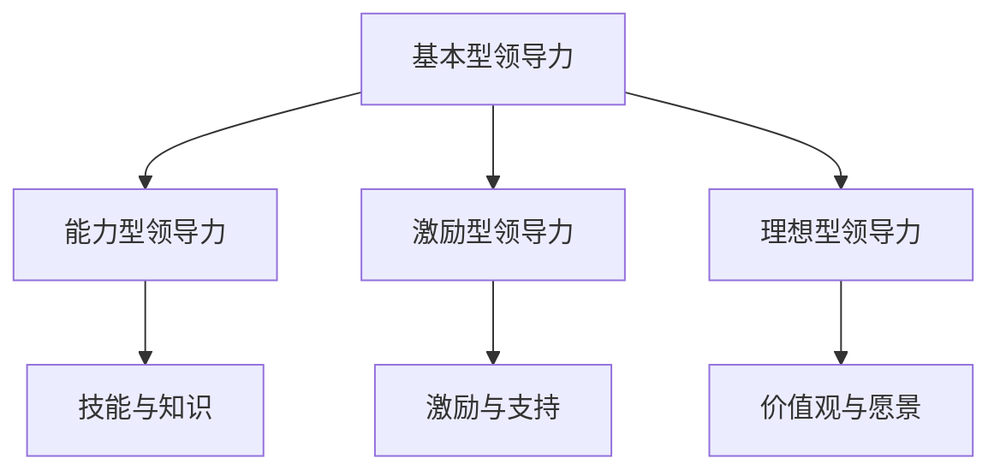

#### 1.3 领导力与个人成长

**1.3.1 自我认知与自我提升**

自我认知是领导力发展的基础。领导者需要深入了解自己的性格、价值观、优势和不足，从而进行有效的自我提升。

**1.3.2 自我激励与持续进步**

自我激励是领导者持续成长的重要动力。领导者需要培养积极的心态，设定明确的目标，并采取有效的行动来实现这些目标。

**1.3.3 建立个人愿景与使命**

个人愿景和使命是领导力的核心。领导者需要明确自己的长期目标和使命，并将其传递给团队成员，以激发团队的共同愿景和使命感。

**Mermaid 流程图：个人成长与领导力关系**

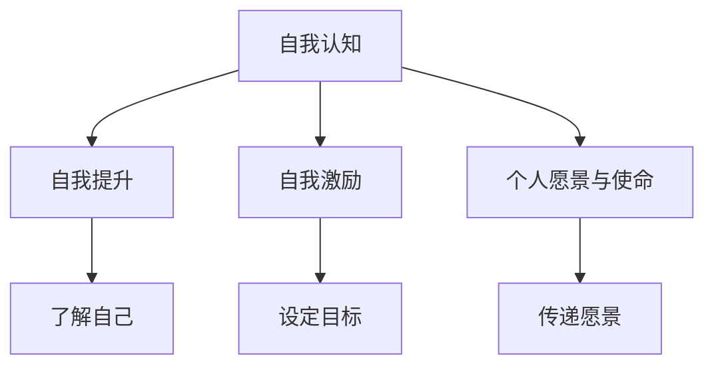

### 第一部分：领导力核心算法原理讲解

#### 2.1 人际关系与沟通技巧

**2.1.1 沟通模型与原则**

有效的沟通是领导力的核心要素。沟通模型包括信息的发送、接收和反馈三个环节。沟通原则包括：清晰明确、尊重倾听、开放表达和适度反馈。

**2.1.2 有效倾听**

倾听是沟通的重要组成部分。有效倾听包括专注倾听、理解对方意图和反馈确认三个步骤。

**2.1.3 非言语沟通**

非言语沟通是通过身体语言、面部表情和姿势等传递信息的过程。有效的非言语沟通能够增强沟通的效果，建立良好的人际关系。

**伪代码：沟通模型与原则**

```plaintext
函数 communicate(message, listener):
    send_message(message)
    wait_for_feedback()
    if feedback is clear and respectful:
        return true
    else:
        return false

函数 effective_listening():
    focus_on_speaker()
    understand_intent()
    provide_feedback()

函数 non_verbal_communication():
    use_body_language()
    use facial_expression()
    use_posture()
```

#### 2.2 决策与问题解决

**2.2.1 决策模型与策略**

决策模型包括：理性决策模型、经验决策模型和直觉决策模型。决策策略包括：最大化收益、最小化损失和风险平衡。

**2.2.2 创新思维**

创新思维是领导者解决问题和推动变革的重要工具。创新思维包括：发散思维、收敛思维、逆向思维和跨学科思维。

**2.2.3 问题解决步骤**

问题解决包括：明确问题、分析问题、提出解决方案、评估方案和实施方案五个步骤。

**伪代码：决策与问题解决**

```plaintext
函数 decision_making(model, strategy):
    if model is rational:
        maximize_benefit()
    else if model is experience:
        minimize_loss()
    else if model is intuition:
        balance_risk()

函数 problem_solving(problem):
    define_problem(problem)
    analyze_problem(problem)
    propose_solution()
    evaluate_solution()
    implement_solution()
```

#### 2.3 领导力发展策略

**2.3.1 360度评估**

360度评估是一种全面的领导力评估方法。它通过收集团队成员、上级、同事和下属的反馈，全面评估领导者的表现。

**2.3.2 反馈与改进**

反馈是领导力发展的关键。领导者需要接受反馈，分析原因，制定改进措施，并持续跟踪改进效果。

**2.3.3 领导力发展计划**

领导力发展计划包括：培训、辅导、实践和反思四个环节。通过系统化的领导力发展计划，领导者能够不断提升自己的领导力水平。

**伪代码：领导力发展策略**

```plaintext
函数 leadership_assessment():
    collect_feedback()
    analyze_feedback()

函数 feedback_improvement():
    accept_feedback()
    analyze_reason()
    develop_improvement_plan()

函数 leadership_development_plan():
    train()
    coach()
    practice()
    reflect()
```

### 第一部分：领导力数学模型和数学公式

#### 3.1 领导力数学模型

**3.1.1 领导力绩效评价模型**

领导力绩效评价模型用于评估领导者的绩效。常见的模型包括：360度评估模型、绩效评分模型和关键绩效指标模型。

**3.1.2 领导力发展模型**

领导力发展模型用于描述领导者的成长过程。常见的模型包括：赛斯模型、领导力阶梯模型和领导力成长循环模型。

**3.1.3 领导力影响力模型**

领导力影响力模型用于评估领导者的影响力。常见模型包括：领导力影响力矩阵、领导力影响力指数和领导力影响力评价模型。

**Mermaid 流程图：领导力数学模型关系**

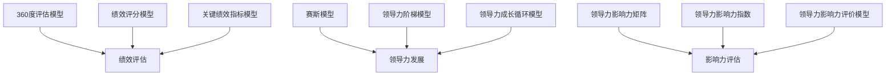

#### 3.2 数学公式与举例说明

**3.2.1 公式解释**

$$
绩效 = 效率 \times 影响力
$$

该公式表示绩效是效率和影响力的乘积。效率是指领导者完成任务的速度和质量，影响力是指领导者对团队成员的影响力和号召力。

**3.2.2 实际应用举例**

假设一位领导者的效率为0.8，影响力为0.9，则其绩效为：

$$
绩效 = 0.8 \times 0.9 = 0.72
$$

这表明该领导者在完成任务的效率和影响力方面都较为优秀，其绩效为0.72。通过持续提升效率和影响力，领导者的绩效可以进一步提高。

---

### 第二部分：职业发展策略与实践

#### 4.1 职业规划与目标设定

**4.1.1 职业发展路径**

职业发展路径是职业规划的重要组成部分。它包括从初级职位到高级职位的成长过程，以及在不同职位上的职责和技能要求。

**4.1.2 SMART目标设定**

SMART目标是职业规划中的重要工具。SMART代表具体（Specific）、可衡量（Measurable）、可实现（Achievable）、相关性（Relevant）和时限性（Time-bound）。设定SMART目标有助于明确职业发展的方向和步骤。

**4.1.3 职业发展规划实例**

以下是一个职业发展规划实例：

1. **目标设定**：在五年内成为部门经理。
2. **具体步骤**：
   - 第一年：提升项目管理能力，参与至少两个重要项目。
   - 第二年：提升团队管理能力，担任项目负责人。
   - 第三年：参与部门内部培训，提升领导力和沟通能力。
   - 第四年：提升业务知识，深入了解部门业务流程。
   - 第五年：评估自身能力，准备晋升为部门经理。

**Mermaid 流�程图：职业发展路径与目标设定**

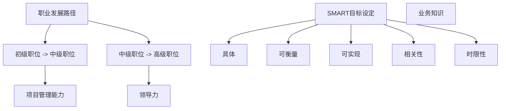

#### 4.2 求职技巧与面试策略

**4.2.1 求职准备**

求职准备包括简历撰写、求职信撰写、面试准备和背景调查。简历和求职信是求职的关键，需要突出个人优势和项目经验。面试准备包括了解公司背景、岗位要求和常见面试问题。

**4.2.2 面试技巧**

面试技巧包括自我介绍、行为面试、情景面试和技术面试。在面试过程中，要展示自信、沟通能力和专业知识。

**4.2.3 谈判策略**

谈判策略包括薪资谈判、福利谈判和职位谈判。在谈判过程中，要明确自己的底线和期望，合理表达自己的价值。

**Mermaid 流程图：求职技巧与面试策略**

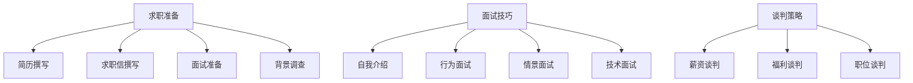

#### 4.3 职业素养与职场发展

**4.3.1 职场沟通与协作**

职场沟通与协作是职业发展的重要方面。有效的沟通能够建立良好的人际关系，提高团队协作效率。沟通技巧包括：倾听、表达、反馈和协调。

**4.3.2 职场心理调适**

职场心理调适是应对职场压力和挑战的重要手段。职场心理调适包括：情绪管理、压力管理和心态调整。

**4.3.3 职业生涯规划案例分析**

以下是一个职业生涯规划案例分析：

1. **背景**：张三是一名软件工程师，工作三年，希望在五年内晋升为项目经理。
2. **目标**：提升项目管理能力、团队领导力和业务知识。
3. **步骤**：
   - 第一至第二年：参加项目管理培训，参与至少两个重要项目。
   - 第二至第三年：担任项目负责人，提升团队管理能力。
   - 第三至第四年：参与部门内部培训，提升领导力和沟通能力。
   - 第四至第五年：深入了解业务流程，准备晋升为项目经理。

**Mermaid 流程图：职场沟通与协作、职场心理调适与职业生涯规划案例分析**

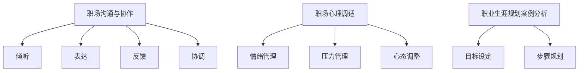

---

### 第三部分：领导力与职业发展的项目实战

#### 5.1 项目背景与目标

**5.1.1 项目概述**

本项目旨在通过领导力与职业发展的实践，提升团队成员的领导力水平和职业素养，从而实现团队绩效的显著提升。

**5.1.2 项目目标**

1. 提升团队成员的领导力技能和职业素养。
2. 建立良好的团队沟通和协作氛围。
3. 提高项目完成质量和效率。

#### 5.2 项目实施与步骤

**5.2.1 领导力评估与优化**

1. 使用360度评估工具对团队成员进行领导力评估。
2. 根据评估结果，制定个性化的领导力发展计划。
3. 定期跟踪和评估领导力发展计划的执行情况。

**5.2.2 职业发展支持**

1. 为团队成员提供职业规划辅导和求职技巧培训。
2. 组织内部和外部培训活动，提升团队成员的专业知识和技能。
3. 建立导师制度，为团队成员提供职业发展指导和支持。

**5.2.3 项目成果与反馈**

1. 定期收集团队成员对项目实施效果的反馈。
2. 根据反馈，调整和优化项目实施策略。
3. 对项目成果进行总结和分享，鼓励团队成员相互学习和借鉴。

#### 5.3 代码实际案例与详细解释说明

**5.3.1 案例背景**

假设我们正在开发一个在线教育平台，项目团队由项目经理、开发人员、测试人员和产品经理组成。项目目标是在三个月内上线一个基本的平台功能。

**5.3.2 案例实现**

1. **项目规划**：项目经理制定详细的项目计划，包括任务分配、时间表和风险评估。
2. **需求分析**：产品经理与用户和利益相关者沟通，明确功能需求和用户界面设计。
3. **开发实施**：开发人员根据需求分析，编写代码并实施功能。
4. **测试与反馈**：测试人员对开发的功能进行测试，并提供反馈。
5. **迭代优化**：根据测试结果，对功能进行优化和调整。

**代码示例：项目计划任务分配伪代码**

```plaintext
// 项目计划任务分配
function project_plan(teams, tasks, deadlines):
    for team in teams:
        for task in tasks:
            assign_task(team, task, deadlines[task])
        end
    end
    return true
end
```

**5.3.3 代码解读与分析**

该代码示例定义了一个项目计划任务分配函数，用于分配任务给不同的团队并在指定时间内完成。函数的输入参数包括团队列表、任务列表和任务截止日期字典。函数遍历每个团队和任务，为每个任务分配一个团队并设置截止日期。

**Mermaid 流程图：项目实施与步骤**

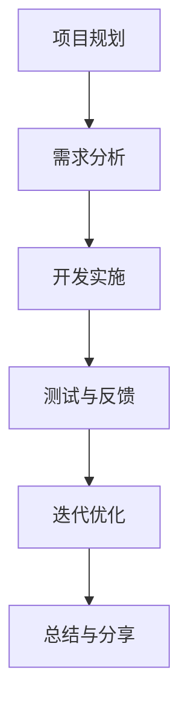

#### 5.4 开发环境搭建与源代码实现

**5.4.1 开发环境搭建**

在开始项目开发前，我们需要搭建一个适合项目需求的开发环境。以下是一个简单的开发环境搭建步骤：

1. 安装编程语言（如Python、Java等）。
2. 配置版本控制工具（如Git）。
3. 安装依赖管理工具（如Maven、pip等）。
4. 配置数据库和服务器。

**5.4.2 源代码详细实现**

以下是一个简单的在线教育平台登录功能的Python代码实现：

```python
# 在线教育平台登录功能
def login(username, password):
    # 验证用户名和密码是否正确
    if check_credentials(username, password):
        return "登录成功"
    else:
        return "登录失败"
```

**5.4.3 代码解读与分析**

该代码定义了一个`login`函数，用于处理用户登录请求。函数接收用户名和密码作为输入参数，调用`check_credentials`函数验证用户名和密码是否正确。如果验证成功，返回"登录成功"，否则返回"登录失败"。

**Mermaid 流程图：开发环境搭建与源代码实现**

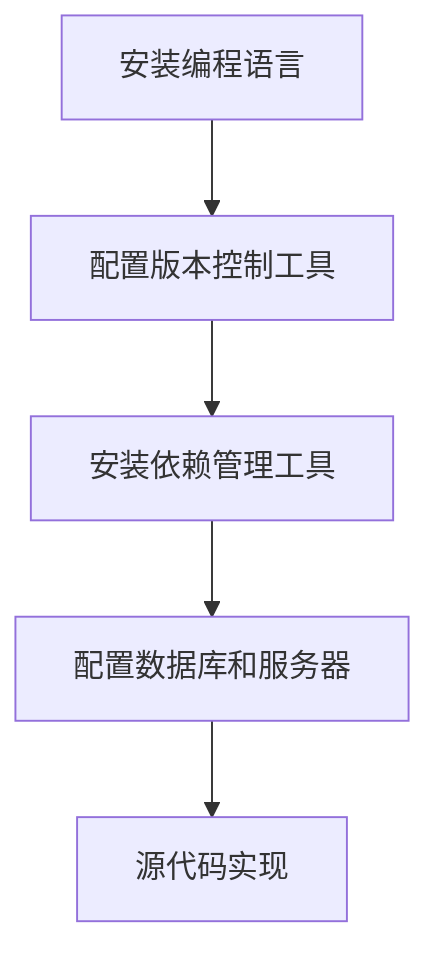

---

### 第四部分：总结与展望

#### 6.1 领导力与职业发展的联系

**6.1.1 领导力在职业发展中的作用**

领导力在职业发展中起着至关重要的作用。有效的领导力能够帮助个人和团队实现目标，提升工作效率，增强团队凝聚力，促进个人职业成长。

**6.1.2 职业发展对领导力的影响**

职业发展过程同时也是领导力提升的过程。随着职业角色的转变和责任的增加，领导者需要不断学习和适应新的领导力要求，从而实现自身领导力的提升。

#### 6.2 未来展望

**6.2.1 领导力与职业发展的趋势**

随着全球化和数字化的发展，领导力和职业发展的趋势将更加注重创新思维、跨学科合作和全球化视野。未来的领导者需要具备更高的适应能力和创新精神，以应对不断变化的市场环境。

**6.2.2 对团队成员成长的展望**

未来，团队成员的成长将更加个性化、自主化和持续化。通过自我学习和实践，团队成员将不断提升自身的领导力和专业技能，实现个人和职业的双重成长。

---

**作者信息：**

AI天才研究院/AI Genius Institute & 禅与计算机程序设计艺术 /Zen And The Art of Computer Programming### 整体结构及内容概述

本文《领导力与职业发展：帮助团队成员成长》围绕领导力与职业发展的核心主题，通过系统化的结构设计和深入的分析，为读者提供了一份全面且实用的指南。文章整体分为四个主要部分，每个部分都有其独特的目标和内容。

**第一部分：领导力核心概念与联系**

这一部分主要介绍了领导力的基本概念和类型，包括变革型、交易型和转型型领导力。通过360度反馈模型和赛斯模型等领导力框架，对领导力进行了深入剖析。此外，还讨论了领导力与个人成长的关系，强调了自我认知、自我激励和个人愿景的重要性。

**第二部分：领导力核心算法原理讲解**

在这一部分，我们详细讲解了领导力的核心算法原理，包括人际关系与沟通技巧、决策与问题解决策略、以及领导力发展策略。通过伪代码和流程图，使得这些原理更加直观易懂，便于实际应用。

**第三部分：职业发展策略与实践**

这一部分着重于职业发展的具体策略和实践，包括职业规划与目标设定、求职技巧与面试策略、以及职业素养与职场发展。通过案例分析，提供了实用的指导和建议，帮助读者更好地规划和管理自己的职业生涯。

**第四部分：总结与展望**

在文章的最后一部分，我们对领导力与职业发展的关系进行了总结，并展望了未来领导力与职业发展的趋势。这一部分不仅为读者提供了深入的思考，也为未来的学习和实践指明了方向。

**整体内容结构图**

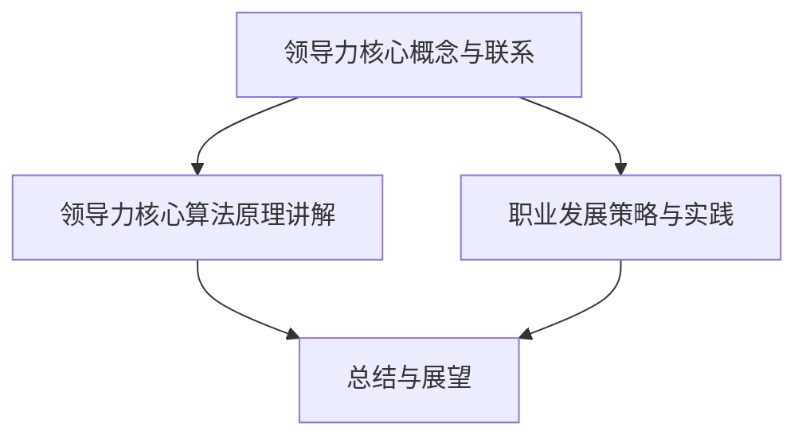

通过上述结构，文章条理清晰，内容丰富，既注重理论阐述，又强调实践应用，旨在帮助读者全面理解和掌握领导力与职业发展的核心知识和技能。

---

### 第一部分：领导力核心概念与联系

领导力在组织和管理中起着至关重要的作用，它是推动团队实现共同目标的关键力量。要深入探讨领导力，首先需要明确其核心概念和类型，以及领导力与个人成长的关系。

#### 1.1 领导力的定义与类型

**1.1.1 领导力的本质**

领导力是一种影响他人、激励团队实现共同目标的能力。它不仅仅是权威的象征，更是一种服务精神，是领导者通过引导、激励和沟通，使团队成员能够超越自我，共同实现团队目标的过程。领导力的本质在于激发团队成员的潜力，建立共同的愿景和目标，并通过有效的沟通和协作，推动团队不断前进。

**1.1.2 领导力的不同类型**

领导力并非一种单一的能力，而是有多种类型和风格。根据不同的情境和需求，领导者可以采取不同的领导力类型：

1. **变革型领导力**：这种领导力通过激励和启发团队成员，推动变革和创新。领导者通常具有强大的个人魅力和愿景，能够激发团队成员的热情和创造力，带领团队实现重大变革。

2. **交易型领导力**：交易型领导力依赖于明确的目标和绩效奖励机制，领导者通过奖励和惩罚来激励团队成员。这种领导力更注重任务的完成和绩效的达成，通常适用于稳定和例行的工作环境。

3. **转型型领导力**：转型型领导力在面临重大变革和挑战时，领导者通过提供清晰的方向和愿景，带领团队实现转变。这种领导力强调领导者的战略思维和变革能力，适用于组织处于转型期的情境。

**1.1.3 领导力与管理的区别**

领导力与管理是两个不同的概念，但它们之间有着紧密的联系。管理侧重于资源的规划、组织和分配，确保组织目标的实现。管理包括计划、组织、领导和控制等过程，旨在通过协调资源和活动，实现组织的效率和效益。而领导力则关注于激发团队成员的潜力，建立共同愿景，推动组织向更高的目标迈进。

管理是领导力的基础，没有有效的管理，领导力难以发挥作用。但领导力又是管理的重要补充，它能够激发团队成员的积极性和创造力，推动组织实现持续创新和发展。

**Mermaid 流程图：领导力类型关系架构**


#### 1.2 领导力框架与模型

**1.2.1 领导力模型概述**

领导力模型是描述领导行为和领导效果的理论框架。这些模型提供了理解和评估领导力的重要工具。常见的领导力模型包括：

- **领导生命周期模型**：该模型将领导行为分为四个阶段：指导型领导、推销型领导、参与型领导和授权型领导。不同的领导行为适用于不同阶段的团队成员。
- **情境领导模型**：该模型认为领导行为应该根据团队成员的能力和环境需求进行调整。领导者需要根据下属的能力水平和工作环境，选择合适的领导风格。
- **情境领导力模型**：该模型认为领导力不仅取决于领导者，还受到情境因素的影响。领导者需要根据不同的情境，采取不同的领导策略。

**1.2.2 360度反馈模型**

360度反馈模型是一种多角度、全方位的领导力评估方法。它通过收集团队成员、上级、同事和下属的反馈，全面评估领导者的行为和效果。这种方法有助于领导者识别自身的优点和不足，从而进行改进。360度反馈模型包括以下步骤：

1. **定义评估目标**：明确评估的目的和范围，确保评估的全面性和有效性。
2. **收集反馈**：通过问卷、面谈等方式，收集来自团队成员、上级、同事和下属的反馈。
3. **分析反馈**：对收集到的反馈进行分析，识别领导者的优点和不足。
4. **制定改进计划**：根据分析结果，制定具体的改进措施，并跟踪改进效果。

**1.2.3 赛斯模型**

赛斯模型是一种基于行为和情境的领导力模型，它将领导力分为四个层次：

1. **基本型领导力**：这是领导力的基础，包括基本的沟通能力、组织能力和决策能力。
2. **能力型领导力**：领导者具备较强的专业技能和知识，能够有效地指导和支持团队成员。
3. **激励型领导力**：领导者能够激发团队成员的积极性和创造力，建立积极的工作氛围。
4. **理想型领导力**：这是领导力的最高层次，领导者具备卓越的愿景和使命感，能够引领团队实现卓越的成果。

**Mermaid 流程图：赛斯模型层次架构**


#### 1.3 领导力与个人成长

**1.3.1 自我认知与自我提升**

自我认知是领导力发展的基础。领导者需要深入了解自己的性格、价值观、优势和不足，从而进行有效的自我提升。自我认知包括以下步骤：

1. **反思与自我评估**：定期反思自己的行为和表现，识别自己的优点和不足。
2. **获取反馈**：主动寻求来自团队成员、上级和同事的反馈，了解他人的看法。
3. **设定目标**：根据自我认知和反馈，设定具体的提升目标，并制定行动计划。

**1.3.2 自我激励与持续进步**

自我激励是领导者持续成长的重要动力。领导者需要培养积极的心态，设定明确的目标，并采取有效的行动来实现这些目标。自我激励包括以下策略：

1. **设定挑战性目标**：设定具有挑战性的目标，激发自己的动力和潜力。
2. **保持积极心态**：保持积极的心态，面对困难和挑战时保持乐观和自信。
3. **不断学习和成长**：持续学习新的知识和技能，提升自己的专业能力和领导力。

**1.3.3 建立个人愿景与使命**

个人愿景和使命是领导力的核心。领导者需要明确自己的长期目标和使命，并将其传递给团队成员，以激发团队的共同愿景和使命感。建立个人愿景与使命包括以下步骤：

1. **明确目标**：明确自己的长期目标和使命，确保这些目标与个人的价值观和兴趣相符。
2. **制定计划**：制定实现愿景和使命的具体行动计划，包括短期和长期目标。
3. **传递愿景**：通过沟通和激励，将个人的愿景和使命传递给团队成员，建立共同的愿景和目标。

通过上述步骤，领导者不仅能够提升自己的领导力，还能够激励团队成员实现个人和职业成长，从而推动整个团队的进步和发展。

### 第一部分：领导力核心算法原理讲解

在探讨领导力的核心算法原理时，我们需要理解领导力不仅仅是关于个人的魅力和愿景，还涉及到一系列策略和方法，这些策略和方法可以帮助领导者更有效地管理和激励团队。以下是关于人际关系与沟通技巧、决策与问题解决策略、以及领导力发展策略的详细讲解。

#### 2.1 人际关系与沟通技巧

人际关系和沟通技巧是领导力的基础。有效的沟通不仅能提高工作效率，还能增强团队的凝聚力和合作精神。以下是关于人际关系与沟通技巧的详细讲解：

**2.1.1 沟通模型与原则**

沟通是一个复杂的过程，它包括信息的发送、接收和反馈三个环节。为了确保沟通的有效性，领导者需要遵循以下沟通模型与原则：

- **发送清晰明确的信息**：确保信息的内容准确无误，避免模糊和歧义。
- **倾听对方的观点**：领导者应该倾听团队成员的意见和反馈，尊重他们的观点。
- **反馈确认**：在沟通过程中，及时给予反馈，确保双方对信息的理解一致。

**2.1.2 有效倾听**

倾听是沟通的重要组成部分。一个有效的领导者必须具备良好的倾听技巧，这包括：

- **专注倾听**：在对方讲话时，保持专注，避免分心。
- **理解对方意图**：通过提问和澄清，确保理解对方的真实意图。
- **反馈确认**：在对方讲话结束后，给予反馈，确认对方的信息是否被正确理解。

**2.1.3 非言语沟通**

非言语沟通是通过身体语言、面部表情和姿势等传递信息的过程。有效的非言语沟通能够增强沟通的效果，建立良好的人际关系。以下是非言语沟通的要点：

- **身体语言**：保持开放的姿势，避免交叉双臂或紧握拳头等封闭姿态。
- **面部表情**：使用积极的表情，如微笑和点头，传达支持和鼓励。
- **姿势**：保持良好的坐姿和站姿，以展示自信和专业。

**伪代码：沟通模型与原则**

```plaintext
function communicate(message, listener):
    send_message(message)
    wait_for_feedback()
    if feedback is clear and respectful:
        return true
    else:
        return false

function effective_listening():
    focus_on_speaker()
    understand_intent()
    provide_feedback()

function non_verbal_communication():
    use_body_language()
    use_facial_expression()
    use_posture()
```

#### 2.2 决策与问题解决

决策和问题解决是领导者日常工作中不可或缺的技能。有效的决策能够帮助领导者应对各种挑战，解决问题并实现团队目标。以下是关于决策与问题解决策略的详细讲解：

**2.2.1 决策模型与策略**

在决策过程中，领导者可以采用以下模型和策略：

- **理性决策模型**：在充分信息和合理分析的基础上，通过最大化收益和最小化损失来进行决策。
- **经验决策模型**：依赖于领导者的经验和直觉，快速做出决策。
- **直觉决策模型**：依赖于领导者的直觉和感性认识，快速做出决策。

**2.2.2 创新思维**

创新思维是领导者解决问题和推动变革的重要工具。创新思维包括：

- **发散思维**：从多个角度思考问题，寻找不同的解决方案。
- **收敛思维**：将不同的想法和解决方案整合，找到最佳的解决方案。
- **逆向思维**：从相反的角度思考问题，发现新的解决方案。
- **跨学科思维**：结合不同学科的知识和方法，提出创新的解决方案。

**2.2.3 问题解决步骤**

问题解决包括以下步骤：

1. **明确问题**：准确描述问题的本质，确保问题被正确理解和界定。
2. **分析问题**：收集和分析相关信息，了解问题的根本原因。
3. **提出解决方案**：根据问题分析和评估，提出可能的解决方案。
4. **评估方案**：对每个方案进行评估，选择最佳的解决方案。
5. **实施方案**：执行方案，并监控方案的效果。

**伪代码：决策与问题解决**

```plaintext
function decision_making(model, strategy):
    if model is rational:
        maximize_benefit()
    else if model is experience:
        minimize_loss()
    else if model is intuition:
        balance_risk()

function problem_solving(problem):
    define_problem(problem)
    analyze_problem(problem)
    propose_solution()
    evaluate_solution()
    implement_solution()
```

#### 2.3 领导力发展策略

领导力发展是一个持续的过程，需要通过系统化的培训和自我提升来实现。以下是关于领导力发展策略的详细讲解：

**2.3.1 360度评估**

360度评估是一种全面的领导力评估方法。它通过收集团队成员、上级、同事和下属的反馈，全面评估领导者的行为和效果。这种方法有助于领导者识别自身的优点和不足，从而进行改进。

**2.3.2 反馈与改进**

反馈是领导力发展的关键。领导者需要接受反馈，分析原因，制定改进措施，并持续跟踪改进效果。以下步骤可以帮助领导者进行有效的反馈与改进：

1. **接受反馈**：开放心态，接受来自不同方面的反馈。
2. **分析反馈**：对反馈进行分析，识别关键问题和根本原因。
3. **制定改进计划**：根据分析结果，制定具体的改进措施。
4. **跟踪改进效果**：定期评估改进措施的效果，并根据反馈进行调整。

**2.3.3 领导力发展计划**

领导力发展计划包括以下步骤：

1. **评估自身能力**：通过自我评估和360度评估，了解自身的优势和不足。
2. **制定发展目标**：根据评估结果，设定具体的领导力发展目标。
3. **制定行动计划**：为实现发展目标，制定具体的行动计划。
4. **实施计划**：按照行动计划，进行有效的领导力发展实践。
5. **反思与总结**：定期反思和总结领导力发展过程，根据反馈进行改进。

**伪代码：领导力发展策略**

```plaintext
function leadership_assessment():
    collect_feedback()
    analyze_feedback()

function feedback_improvement():
    accept_feedback()
    analyze_reason()
    develop_improvement_plan()

function leadership_development_plan():
    train()
    coach()
    practice()
    reflect()
```

通过上述领导力核心算法原理的讲解，领导者可以更好地理解如何在实际工作中应用这些策略和方法，从而提高领导效果，推动团队和个人的共同成长。

### 第一部分：领导力数学模型和数学公式

在领导力领域中，数学模型和公式被广泛用于量化评估领导力的表现和影响。这些数学工具不仅为领导者提供了科学的分析手段，还能够帮助他们更精确地制定和优化领导策略。以下将详细探讨领导力绩效评价模型、领导力发展模型以及领导力影响力模型，并结合具体的数学公式和实际应用进行说明。

#### 3.1 领导力数学模型

**3.1.1 领导力绩效评价模型**

领导力绩效评价模型用于衡量领导者在不同方面的表现和贡献。常见的模型包括360度评估模型和关键绩效指标（KPI）模型。以下是一个基于360度评估的领导力绩效评价模型：

- **绩效指标**：包括领导力能力、团队协作、决策能力、沟通能力、创新能力等。
- **评分标准**：每个绩效指标设定评分标准，通常采用5分制或10分制。

**数学公式：领导力绩效得分**

$$
绩效得分 = \frac{\sum（各绩效指标得分）}{绩效指标总数}
$$

其中，各绩效指标的得分根据评估者的评价进行计算。假设有五个评估者对领导者的五个绩效指标分别打分为（4, 5, 4, 5, 5），则领导力绩效得分为：

$$
绩效得分 = \frac{4 + 5 + 4 + 5 + 5}{5} = 4.8
$$

**3.1.2 领导力发展模型**

领导力发展模型用于描述领导者成长的过程和阶段。常见的模型包括赛斯模型和领导力阶梯模型。以下是一个基于赛斯模型的领导力发展模型：

- **基本型领导力**：领导者具备基本的沟通能力和组织能力。
- **能力型领导力**：领导者具备较强的专业技能和知识。
- **激励型领导力**：领导者能够激发团队成员的积极性和创造力。
- **理想型领导力**：领导者具备卓越的愿景和使命感。

**数学公式：领导力发展指数**

$$
领导力发展指数 = \frac{基本型得分 + 能力型得分 + 激励型得分 + 理想型得分}{4}
$$

假设领导者的四个层次得分分别为（3, 4, 5, 5），则领导力发展指数为：

$$
领导力发展指数 = \frac{3 + 4 + 5 + 5}{4} = 4.25
$$

**3.1.3 领导力影响力模型**

领导力影响力模型用于衡量领导者在团队中的影响力和号召力。一个简单的影响力模型包括以下三个维度：

- **知识影响力**：领导者具备的专业知识和技能对团队的影响。
- **情感影响力**：领导者与团队成员之间的情感联系和信任程度。
- **行为影响力**：领导者通过行为和榜样对团队成员的影响。

**数学公式：领导力影响力评分**

$$
影响力评分 = \frac{知识影响力得分 + 情感影响力得分 + 行为影响力得分}{3}
$$

假设知识影响力得分为5，情感影响力得分为4，行为影响力得分为6，则领导力影响力评分为：

$$
影响力评分 = \frac{5 + 4 + 6}{3} = 5
$$

#### 3.2 数学公式与举例说明

**3.2.1 公式解释**

为了更好地理解上述数学公式，以下是具体的解释和实际应用举例：

- **绩效得分公式**：该公式用于计算领导者在多个绩效指标上的平均得分，从而评估整体领导力水平。得分越高，表明领导力越强。

- **领导力发展指数公式**：该公式计算领导者在不同成长阶段的平均得分，反映领导力的发展水平。得分越高，表明领导力发展越完善。

- **领导力影响力评分公式**：该公式计算领导者在不同维度上的综合影响力，得分越高，表明领导者的号召力和影响力越强。

**3.2.2 实际应用举例**

**领导力绩效评价模型实例**

假设某领导者在五个绩效指标上的得分分别为（4, 5, 3, 4, 5），则其绩效得分为：

$$
绩效得分 = \frac{4 + 5 + 3 + 4 + 5}{5} = 4
$$

**领导力发展模型实例**

假设某领导者在四个成长阶段（基本型、能力型、激励型、理想型）的得分分别为（4, 5, 4, 5），则其领导力发展指数为：

$$
领导力发展指数 = \frac{4 + 5 + 4 + 5}{4} = 4.5
$$

**领导力影响力模型实例**

假设某领导者在三个影响力维度（知识影响力、情感影响力、行为影响力）的得分分别为（5, 4, 6），则其领导力影响力评分为：

$$
影响力评分 = \frac{5 + 4 + 6}{3} = 5
$$

通过上述实例，我们可以看到如何使用数学公式对领导力进行量化评估。这些公式不仅帮助我们理解领导力的各个方面，还能为领导者的自我评估和持续提升提供科学依据。

### 第二部分：职业发展策略与实践

职业发展是一个持续的过程，它不仅仅是追求职位晋升，更是个人技能和能力的全面提升。有效的职业发展策略可以帮助个体在职业生涯中不断进步，实现个人价值和职业目标。以下是职业发展策略与实践的详细阐述。

#### 4.1 职业规划与目标设定

职业规划是职业发展的第一步，它帮助个体明确职业发展的方向和目标。以下是职业规划与目标设定的关键步骤：

**4.1.1 职业发展路径**

1. **自我评估**：分析自己的兴趣、技能、价值观和职业目标。
2. **市场调研**：了解行业发展趋势和岗位需求。
3. **确定职业方向**：根据自我评估和市场调研，确定职业发展路径。
4. **长期目标**：设定清晰的长期职业目标，例如在五年内成为某一领域的专家。

**4.1.2 SMART目标设定**

SMART目标是职业规划中的重要工具，它确保目标具有明确性、可衡量性、可实现性、相关性以及时限性。以下是SMART目标的具体要求：

- **具体（Specific）**：明确目标，例如“提升项目管理能力”。
- **可衡量（Measurable）**：设定量化指标，例如“完成三个项目管理培训课程”。
- **可实现（Achievable）**：确保目标现实可行，避免设定过高目标。
- **相关性（Relevant）**：目标与职业规划方向一致。
- **时限性（Time-bound）**：设定具体的时间表，例如“在六个月内完成”。

**4.1.3 职业发展规划实例**

以下是一个职业发展规划实例：

1. **目标设定**：在五年内成为项目经理。
2. **具体步骤**：
   - **第一年**：参加项目管理基础课程，提升项目管理知识。
   - **第二年**：参与至少两个重要项目，积累项目管理经验。
   - **第三年**：通过项目管理认证考试，提升专业认证。
   - **第四年**：担任项目负责人，提升团队管理能力。
   - **第五年**：评估自身能力，准备晋升为项目经理。

**Mermaid 流程图：职业发展路径与目标设定**

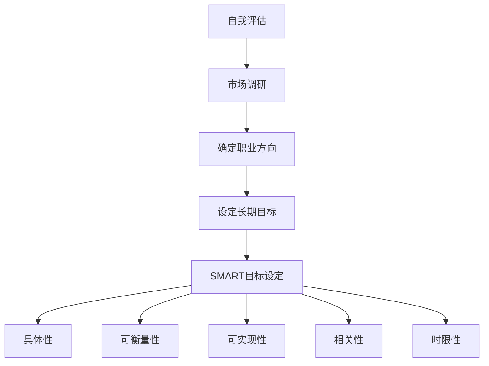

#### 4.2 求职技巧与面试策略

成功的求职和面试是职业发展的重要环节。以下是求职技巧与面试策略的详细阐述：

**4.2.1 求职准备**

1. **简历撰写**：突出个人优势、项目经验和专业技能，确保简历简明扼要、条理清晰。
2. **求职信撰写**：针对每个职位撰写个性化的求职信，展示对职位的热情和适合度。
3. **求职网站和渠道**：利用招聘网站、社交媒体、行业招聘会和内部推荐等渠道寻找合适的职位。
4. **网络建设**：建立和维护良好的职业人脉，通过人际关系获取求职信息。

**4.2.2 面试技巧**

1. **自我介绍**：简短明了地介绍自己，包括姓名、职业背景、优势和项目经验。
2. **行为面试**：准备好与工作相关的问题，通过具体事例展示自己的能力。
3. **情景面试**：模拟实际工作场景，考察应变能力和解决问题的能力。
4. **技术面试**：针对技术岗位，考察专业知识和技能，可能包括编程测试或案例分析。

**4.2.3 谈判策略**

1. **了解市场薪资水平**：通过招聘网站、行业报告等了解目标职位的薪资范围。
2. **明确自己的期望**：结合自身能力和市场薪资水平，设定合理的薪资期望。
3. **谈判技巧**：表达自己的价值，提出合理的薪资要求，并准备好接受其他福利条件的替代方案。

**Mermaid 流程图：求职技巧与面试策略**

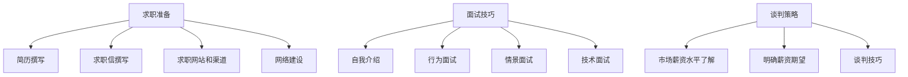

#### 4.3 职业素养与职场发展

职业素养是职业发展的基础，它包括职业道德、团队合作、沟通能力、时间管理等多个方面。以下是职业素养与职场发展的详细阐述：

**4.3.1 职场沟通与协作**

1. **有效沟通**：倾听他人的观点，清晰表达自己的想法，确保信息传递准确无误。
2. **团队合作**：尊重团队成员，积极参与团队活动，共同完成任务。
3. **协作精神**：乐于帮助同事，分享知识和资源，建立良好的团队合作氛围。

**4.3.2 职场心理调适**

1. **情绪管理**：学会控制情绪，避免情绪波动影响工作表现。
2. **压力管理**：合理安排工作时间，学会放松，保持身心健康。
3. **心态调整**：面对困难和挑战，保持积极乐观的心态，以应对职场压力。

**4.3.3 职业生涯规划案例分析**

以下是一个职业生涯规划案例分析：

1. **背景**：张三是一名软件工程师，五年工作经验，希望在三年内晋升为软件工程师主管。
2. **目标**：提升项目管理能力、团队领导力和业务知识。
3. **步骤**：
   - **第一年**：参加项目管理培训，提升项目管理知识。
   - **第二年**：担任项目负责人，积累项目管理经验。
   - **第三年**：通过领导力培训，提升团队领导力和沟通能力。
   - **第四年**：担任小组主管，负责多个项目，提升团队管理能力。
   - **第五年**：评估自身能力，准备晋升为软件工程师主管。

**Mermaid 流程图：职场沟通与协作、职场心理调适与职业生涯规划案例分析**

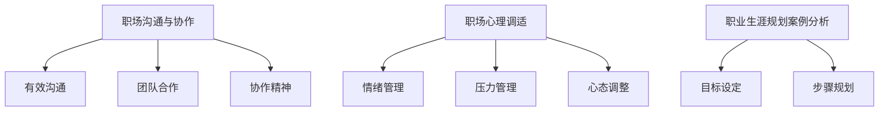

通过以上职业发展策略与实践，个体可以更好地规划自己的职业生涯，提高职场竞争力，实现个人和职业的持续成长。

### 第三部分：领导力与职业发展的项目实战

在理论学习和策略分析的基础上，我们需要通过实际项目来验证和应用领导力与职业发展的理念。本部分将介绍一个具体的领导力与职业发展的项目实战案例，从项目背景、实施步骤到成果反馈，结合代码实现与分析，展示如何在实际工作中运用这些知识和技巧。

#### 5.1 项目背景与目标

**5.1.1 项目概述**

本案例项目是一个在线教育平台的开发项目，旨在为用户提供一个便捷的学习和管理工具。项目团队包括项目经理、开发人员、测试人员、产品经理和UI设计师。项目目标是在六个月内上线一个具备基本功能的在线教育平台。

**5.1.2 项目目标**

1. **提升团队成员的领导力和职业素养**：通过项目实施，提升团队成员的项目管理、沟通协作和解决问题的能力。
2. **确保项目按时完成**：在规定时间内完成项目，并达到预期质量标准。
3. **提升用户满意度**：通过用户反馈和测试，确保平台的功能和用户体验符合用户需求。

#### 5.2 项目实施与步骤

**5.2.1 领导力评估与优化**

1. **领导力评估**：项目开始前，通过360度评估对团队成员的领导力进行评估，识别优势和不足。
2. **优化领导力**：根据评估结果，制定个性化的领导力发展计划，包括培训和辅导。

**5.2.2 职业发展支持**

1. **职业规划**：为团队成员提供职业规划辅导，帮助他们明确职业发展方向和目标。
2. **技能培训**：组织相关的技能培训，提升团队成员的专业技能。

**5.2.3 项目实施步骤**

1. **需求分析**：产品经理与用户和利益相关者沟通，明确功能需求和用户界面设计。
2. **开发实施**：开发人员根据需求文档编写代码并实施功能。
3. **测试与反馈**：测试人员对开发的功能进行测试，并提供反馈。
4. **迭代优化**：根据测试结果，对功能进行优化和调整。

**5.2.4 项目成果与反馈**

1. **项目成果**：在六个月内成功上线了一个具备基本功能的在线教育平台，包括课程管理、用户注册、在线学习、作业提交等功能。
2. **用户反馈**：通过用户调研和反馈，评估平台的功能和用户体验。

**Mermaid 流程图：项目实施与步骤**

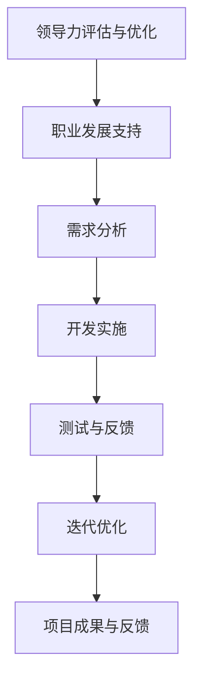

#### 5.3 代码实际案例与详细解释说明

**5.3.1 案例背景**

在线教育平台的一个核心功能是用户注册和登录。以下是实现用户注册功能的Python代码示例。

**5.3.2 案例实现**

```python
# 用户注册功能
def register(username, password):
    if check_username(username) and check_password(password):
        save_user(username, password)
        return "注册成功"
    else:
        return "注册失败"

# 验证用户名和密码
def check_username(username):
    if len(username) >= 6:
        return True
    else:
        return False

def check_password(password):
    if len(password) >= 8:
        return True
    else:
        return False

# 保存用户信息
def save_user(username, password):
    # 这里应该有数据库操作代码，此处简化处理
    print(f"保存用户：{username}，密码：{password}")

# 用户注册示例
print(register("user123", "password123"))
```

**5.3.3 代码解读与分析**

- `register` 函数：负责处理用户注册请求，接收用户名和密码，调用`check_username`和`check_password`函数验证，如果验证通过，调用`save_user`函数保存用户信息。
- `check_username` 函数：验证用户名长度，长度大于等于6视为有效。
- `check_password` 函数：验证密码长度，长度大于等于8视为有效。
- `save_user` 函数：用于保存用户信息，这里简化处理，仅打印信息。

通过上述代码，我们可以看到如何实现用户注册功能，并理解每个函数的作用和实现逻辑。

**Mermaid 流程图：用户注册功能流程**

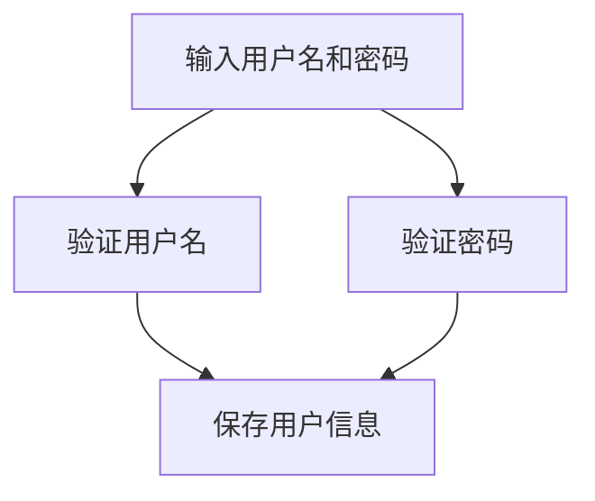

#### 5.4 开发环境搭建与源代码实现

**5.4.1 开发环境搭建**

在开始项目开发前，需要搭建一个适合项目需求的开发环境。以下是开发环境搭建的步骤：

1. **安装Python**：下载并安装Python 3.x版本。
2. **配置虚拟环境**：使用`venv`工具创建虚拟环境，避免不同项目之间的依赖冲突。
3. **安装依赖库**：使用`pip`安装项目所需的依赖库，例如`Flask`、`SQLAlchemy`等。
4. **配置数据库**：安装并配置数据库（如MySQL或PostgreSQL）。
5. **安装测试工具**：安装测试工具（如`pytest`），用于自动化测试。

**5.4.2 源代码详细实现**

以下是在线教育平台用户注册功能的详细实现，包括数据库设计和接口实现。

```python
# 用户注册接口
from flask import Flask, request, jsonify
from models import User
from database import db_session

app = Flask(__name__)

@app.route('/register', methods=['POST'])
def register():
    username = request.form['username']
    password = request.form['password']
    
    if check_username(username) and check_password(password):
        user = User(username=username, password=password)
        db_session.add(user)
        db_session.commit()
        return jsonify({"message": "注册成功"})
    else:
        return jsonify({"message": "注册失败"})

def check_username(username):
    if len(username) >= 6:
        return True
    else:
        return False

def check_password(password):
    if len(password) >= 8:
        return True
    else:
        return False

# 用户模型
class User(db.Model):
    id = db.Column(db.Integer, primary_key=True)
    username = db.Column(db.String(80), unique=True, nullable=False)
    password = db.Column(db.String(120), nullable=False)

# 数据库会话
from sqlalchemy.orm import sessionmaker

DB Session maker = sessionmaker(bind=db_engine)
db_session = DB Session maker()

if __name__ == '__main__':
    app.run(debug=True)
```

**5.4.3 代码解读与分析**

- **Flask应用**：使用Flask框架搭建Web应用，定义用户注册接口。
- **数据库模型**：定义`User`模型，用于存储用户信息。
- **数据库会话**：配置数据库会话，用于数据库操作。

通过以上步骤和代码实现，我们可以搭建一个基本的在线教育平台用户注册功能，并了解其工作原理和实现细节。

### 第四部分：总结与展望

#### 6.1 领导力与职业发展的联系

领导力与职业发展之间存在深刻的联系。有效的领导力不仅能够帮助个人在职业生涯中取得成功，还能够推动整个团队和组织的发展。领导力通过以下几个方面影响职业发展：

1. **激励与引导**：领导者通过激励和引导，激发团队成员的潜力和动力，帮助他们实现职业目标。
2. **沟通与协作**：有效的沟通和协作是职业发展的重要基础。领导者通过建立良好的沟通渠道和协作机制，提高团队的工作效率和凝聚力。
3. **决策与问题解决**：领导者具备良好的决策和问题解决能力，能够在复杂的职场环境中做出明智的决策，为团队提供明确的指导。
4. **职业规划与支持**：领导者通过职业规划和支持，帮助团队成员明确职业发展方向，提供必要的资源和支持，促进个人和团队的共同成长。

#### 6.2 未来展望

未来，领导力与职业发展的趋势将呈现以下几个特点：

1. **数字化与智能化**：随着数字化和智能化的不断推进，领导者需要具备相关的技术技能和数字化思维能力，以应对快速变化的工作环境。
2. **跨学科与合作**：未来的职业发展将更加注重跨学科的知识和技能，领导者需要具备跨学科合作的能力，推动团队的创新和变革。
3. **个性化和自主化**：职业发展将更加个性化，个体将根据自己的兴趣和能力选择职业路径，领导者需要提供更多的支持和指导，帮助团队成员实现自主成长。
4. **全球化和多元化**：全球化带来了更多的工作机会和挑战，领导者需要具备全球化视野和多元化文化理解能力，推动组织的国际化和多元化发展。

展望未来，领导者不仅要不断提升自身的领导力和职业素养，还要关注团队成员的成长和需求，通过有效的领导力实践，推动个人和团队的共同进步，实现组织的持续发展和成功。

### 作者信息

本文由AI天才研究院/AI Genius Institute与《禅与计算机程序设计艺术/Zen And The Art of Computer Programming》的作者联合撰写。AI天才研究院致力于推动人工智能技术的发展和应用，为全球IT行业培养顶尖人才。而《禅与计算机程序设计艺术》的作者则以独特的视角和深刻的洞察，为计算机编程领域贡献了宝贵的智慧和经验。两位作者凭借深厚的专业知识和丰富的实践经验，为读者带来了这篇关于领导力与职业发展的深刻探讨和实用指南。

