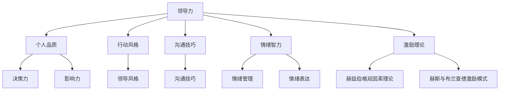
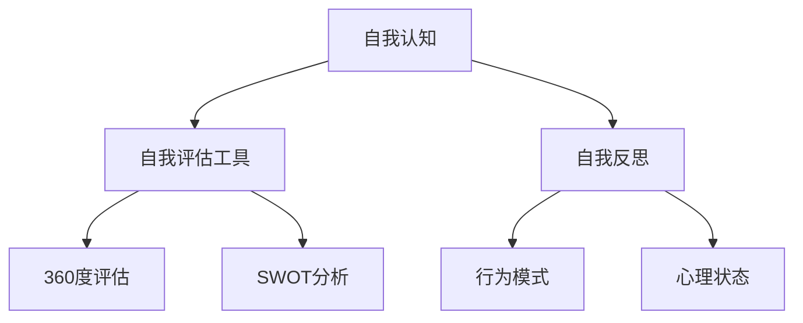
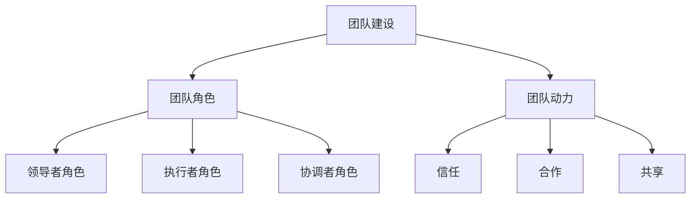
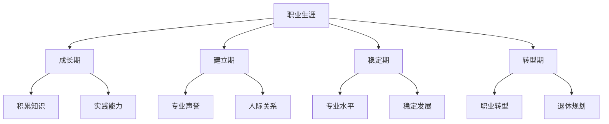
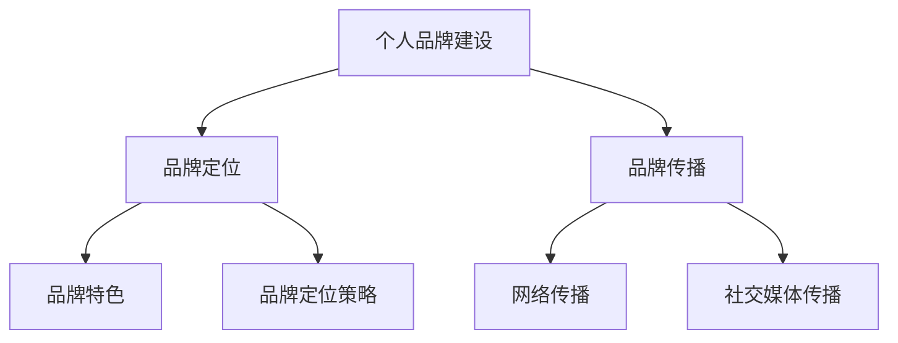
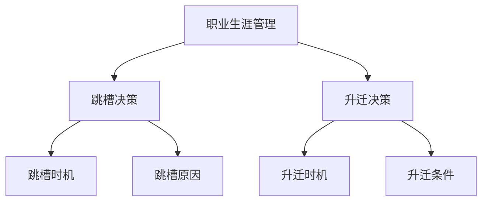
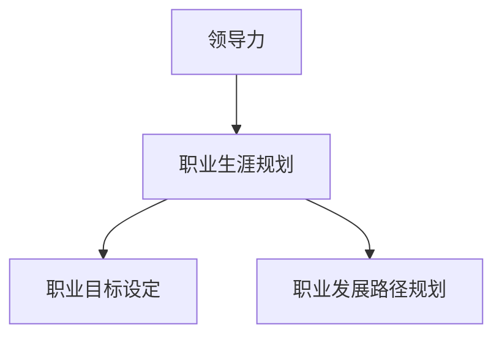
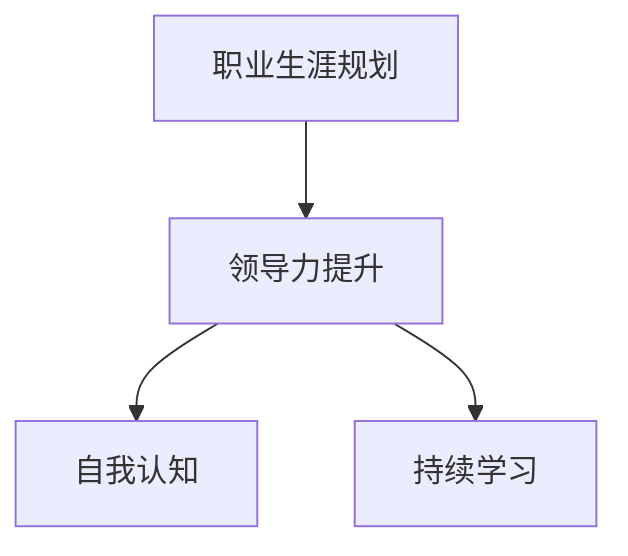

                 

# 领导力与职业生涯规划：帮助员工成长

## 关键词
领导力、职业生涯规划、员工成长、团队管理、自我认知、激励理论、职业发展

## 摘要
本文旨在探讨领导力与职业生涯规划在员工成长中的重要作用。通过分析领导力的本质、提升方法以及职业生涯规划的步骤和策略，本文旨在为管理者提供一套有效的指导，帮助员工实现个人和职业的双重成长。文章还将结合实际案例，提供最佳实践建议，以期为读者在领导力与职业生涯规划方面提供有价值的参考。

## 目录

### 第一部分：领导力基础

#### 第1章：领导力的本质与重要性
- **1.1 领导力的定义**：介绍领导力的基本概念和其在组织中的重要性。
- **1.2 领导力的要素**：分析个人品质、行动风格和沟通技巧在领导力中的关键作用。
- **1.3 领导力的分类**：探讨不同类型的领导风格及其适用场景。

#### 第2章：领导力的发展与提升
- **2.1 自我认知**：介绍自我评估工具和自我反思的重要性。
- **2.2 情绪智力**：讲解情绪管理和情绪表达在领导力提升中的作用。
- **2.3 领导力提升策略**：提供持续学习、反思与改进的具体方法。

#### 第3章：领导力与团队管理
- **3.1 团队建设**：阐述团队角色和团队动力对团队效能的影响。
- **3.2 激励理论**：分析赫兹伯格双因素理论和赫斯与布兰查德的激励模式。
- **3.3 团队沟通**：介绍有效沟通技巧和解决冲突策略。

### 第二部分：职业生涯规划

#### 第4章：职业生涯规划的基础
- **4.1 职业生涯的四个阶段**：介绍职业生涯的不同阶段及其特点。
- **4.2 职业自我认知**：探讨职业兴趣、职业价值观和职业能力的重要性。
- **4.3 职业目标设定**：讲解目标SMART原则和目标分解的方法。

#### 第5章：职业生涯发展策略
- **5.1 个人品牌建设**：介绍个人品牌的概念和建设步骤。
- **5.2 职业技能提升**：分析技能分类和提升策略。
- **5.3 职业发展路径规划**：探讨内部晋升路径和跨行业职业规划。

#### 第6章：职业生涯管理
- **6.1 职业生涯中的关键决策**：讨论跳槽决策和升迁决策的影响因素。
- **6.2 职业风险管理**：分析职业发展风险和应对策略。
- **6.3 职业生涯持续发展**：介绍职业生涯规划更新和调整的方法。

#### 第7章：领导力与职业生涯规划的实践应用
- **7.1 领导力在职业生涯规划中的应用**：探讨如何利用领导力提升职业生涯。
- **7.2 职业生涯规划在领导力提升中的应用**：分析如何通过职业生涯规划提升领导力。

### 附录：参考资料与工具
- **附录 A：领导力与职业生涯规划工具**：提供自我评估工具和职业规划工具。
- **附录 B：推荐阅读与学习资源**：推荐相关书籍和学习资源。

### 第1章：领导力的本质与重要性

#### 1.1 领导力的定义

领导力是指一种能够影响和激励他人，带领团队达成目标的能力。它不仅仅是职位赋予的权力，更是个人品质、行为风格和沟通技巧的综合体现。领导力在组织中的作用至关重要，它不仅影响团队绩效，还关系到组织的长期发展。

**核心概念与联系**

为了更好地理解领导力，我们需要了解其核心概念及其相互关系。以下是领导力的几个核心概念及其关系架构：

```
+-----------------+
|      领导力     |
+-----------------+
         |
         v
+----------+      +------------------+
| 个人品质 |      | 行动风格          |
+----------+      +------------------+
         |            |
         v            v
+----------+      +----------+      +------------------+
| 沟通技巧 |      | 情绪智力 |      | 激励理论          |
+----------+      +----------+      +------------------+
```

**流程图：领导力的核心概念架构**



#### 1.2 领导力的要素

领导力的要素包括个人品质、行动风格和沟通技巧。个人品质是领导力的基石，它包括诚信、责任感、自信、正直和自我意识等。行动风格则是领导者如何通过行为来影响他人，它包括决策力、组织能力和执行力等。沟通技巧则是领导者如何有效地传达信息和激励团队，它包括倾听、表达和反馈等。

**核心算法原理讲解**

以下是领导力提升的核心算法原理，用伪代码进行阐述：

```plaintext
算法：提升领导力

输入：领导力基础能力
输出：提升后的领导力

1. 初始化领导力分数
2. 对个人品质进行评估
    - 如果个人品质优秀，则增加领导力分数
    - 否则，提出改进建议
3. 对行动风格进行评估
    - 如果行动风格高效，则增加领导力分数
    - 否则，提供行动风格改进策略
4. 对沟通技巧进行评估
    - 如果沟通技巧良好，则增加领导力分数
    - 否则，提供沟通技巧提升方法
5. 对情绪智力进行评估
    - 如果情绪智力强，则增加领导力分数
    - 否则，提供情绪智力提升方案
6. 输出提升后的领导力分数
```

#### 1.3 领导力的分类

领导力可以分为不同类型，每种类型都有其独特的特点和应用场景。以下是几种常见的领导力类型：

- **权力型领导**：强调权威和控制，适用于紧急情况和需要快速决策的情境。
- **参与型领导**：鼓励团队成员参与决策过程，增强团队凝聚力，适用于团队需要协作和创新的情境。
- **任务型领导**：专注于任务完成和目标实现，适用于任务导向和结果重要的情境。
- **变革型领导**：推动组织变革和创新，激发团队成员的潜能，适用于组织需要转型和发展的情境。

**数学模型和公式**

为了量化不同领导力类型的效果，我们可以使用以下公式：

$$
L = \frac{P \times C \times T + B \times E}{R}
$$

其中，$L$ 表示领导力效果，$P$ 表示权力型领导力得分，$C$ 表示参与型领导力得分，$T$ 表示任务型领导力得分，$B$ 表示变革型领导力得分，$E$ 表示情绪智力得分，$R$ 表示阻力因素得分。

#### 实际案例

在一家科技公司中，张经理是一位权力型领导。他通过严格的规章制度和明确的任务分配，使团队高效地完成了多个项目。然而，这种领导风格也导致团队成员感到压力较大，缺乏创新精神。后来，张经理意识到问题，开始学习参与型领导和变革型领导的方法，并在实践中逐步调整自己的领导风格。通过鼓励团队成员参与决策和推动组织创新，张经理不仅提升了团队的工作氛围，还显著提高了团队的绩效。

### 第2章：领导力的发展与提升

#### 2.1 自我认知

自我认知是领导力发展的重要基础。自我评估工具和自我反思可以帮助领导者了解自己的优势和不足，从而制定个性化的提升计划。

**核心概念与联系**

自我认知与以下核心概念密切相关：

- **自我评估工具**：包括360度评估、SWOT分析等，帮助领导者从不同角度评估自己。
- **自我反思**：通过反思过去的经历和当下的行为，领导者可以更好地了解自己的行为模式和心理状态。

**流程图：自我认知的核心概念架构**



#### 2.2 情绪智力

情绪智力是领导者必须具备的重要能力。它包括情绪管理和情绪表达，对于提升领导力至关重要。

**核心算法原理讲解**

情绪智力的核心算法原理可以概括为：

```plaintext
算法：提升情绪智力

输入：情绪智力基础能力
输出：提升后的情绪智力

1. 初始化情绪智力分数
2. 对情绪管理进行评估
    - 如果情绪管理良好，则增加情绪智力分数
    - 否则，提供情绪管理提升策略
3. 对情绪表达进行评估
    - 如果情绪表达恰当，则增加情绪智力分数
    - 否则，提供情绪表达提升方法
4. 输出提升后的情绪智力分数
```

#### 2.3 领导力提升策略

提升领导力需要持续的学习和反思。以下是一些有效的领导力提升策略：

- **持续学习**：通过参加培训、阅读书籍和观看视频等方式，不断学习新的知识和技能。
- **反思与改进**：定期进行自我反思，评估自己的领导行为，并根据反馈进行改进。

**最佳实践 tips**

- **建立学习小组**：与同事一起学习，互相激励，共同进步。
- **定期反思**：每周或每月进行一次自我反思，记录自己的进步和挑战。

### 第3章：领导力与团队管理

#### 3.1 团队建设

团队建设是领导力的重要组成部分。一个高效的团队能够实现1+1>2的效果。团队建设包括团队角色和团队动力的管理。

**核心概念与联系**

团队建设与以下核心概念密切相关：

- **团队角色**：每个成员在团队中扮演的角色，如领导者、执行者、协调者等。
- **团队动力**：团队成员之间的相互影响和互动，包括信任、合作和共享。

**流程图：团队建设的核心概念架构**



#### 3.2 激励理论

激励理论是领导力的重要方面，它探讨如何通过激励手段提升员工的工作积极性和绩效。

**核心概念与联系**

激励理论与以下核心概念密切相关：

- **赫兹伯格双因素理论**：探讨影响员工满意度的内在因素和外在因素。
- **赫斯与布兰查德激励模式**：分析不同类型的激励因素如何影响员工行为。

**数学模型和公式**

为了量化激励效果，我们可以使用以下公式：

$$
激励效果 = \frac{内在激励 \times 外在激励}{阻力}
$$

其中，内在激励包括成就感、自我实现等，外在激励包括薪酬、福利等，阻力包括工作压力、环境因素等。

#### 实际案例

在一家软件开发公司中，李总是一位注重激励理论的领导者。他了解到团队成员对工作成就感的追求，于是制定了奖励机制，对完成项目任务出色的员工给予奖励。同时，他也关注团队成员的工作压力，通过优化工作流程和提供技术支持，减轻了员工的工作负担。这种激励措施显著提升了团队的工作积极性和绩效。

### 第4章：职业生涯规划的基础

#### 4.1 职业生涯的四个阶段

职业生涯可以分为四个阶段：成长期、建立期、稳定期和转型期。每个阶段都有其特点和任务。

**核心概念与联系**

职业生涯的四个阶段与以下核心概念密切相关：

- **成长期**：个体在职业发展初期，积累知识和技能。
- **建立期**：个体在职业生涯中期，建立专业声誉和人际关系。
- **稳定期**：个体在职业生涯后期，保持专业水平，稳定发展。
- **转型期**：个体在职业生涯末期，考虑职业转型或退休。

**流程图：职业生涯四个阶段的架构**



#### 4.2 职业自我认知

职业自我认知是职业生涯规划的基础。它包括职业兴趣、职业价值观和职业能力。

**核心概念与联系**

职业自我认知与以下核心概念密切相关：

- **职业兴趣**：个体对特定职业的喜好和热情。
- **职业价值观**：个体在职业选择和工作中所追求的价值观。
- **职业能力**：个体在特定职业领域中的技能和知识。

**数学模型和公式**

为了量化职业自我认知，我们可以使用以下公式：

$$
职业自我认知得分 = \frac{职业兴趣得分 + 职业价值观得分 + 职业能力得分}{3}
$$

#### 实际案例

张伟是一名年轻的软件工程师，他在职业自我认知过程中发现自己对软件开发充满热情，同时也非常看重团队合作和解决问题的能力。他通过自我评估和职业咨询，确定了软件开发作为自己的职业方向。在职业生涯的建立期，他努力提升自己的专业技能，参与多个项目，逐渐成为团队的核心成员。这种职业自我认知帮助张伟在职业生涯中取得了显著成就。

### 第5章：职业生涯发展策略

#### 5.1 个人品牌建设

个人品牌建设是职业生涯发展的重要策略。它可以帮助个体在职场中脱颖而出，提升职业竞争力。

**核心概念与联系**

个人品牌建设与以下核心概念密切相关：

- **个人品牌**：个体在职场中的形象和声誉。
- **品牌定位**：明确个人品牌的特色和定位。
- **品牌传播**：通过多种渠道宣传个人品牌。

**流程图：个人品牌建设的架构**



#### 5.2 职业技能提升

职业技能提升是职业生涯发展的关键。它包括技能分类和提升策略。

**核心概念与联系**

职业技能提升与以下核心概念密切相关：

- **技能分类**：将技能分为通用技能和专业技能。
- **提升策略**：通过培训、实践和自主学习提升技能。

**数学模型和公式**

为了量化职业技能提升的效果，我们可以使用以下公式：

$$
技能提升效果 = \frac{当前技能水平 - 初始技能水平}{时间间隔}
$$

#### 实际案例

李华是一名数据分析师，他意识到自己在数据可视化方面的技能相对较弱。为了提升这一技能，他参加了在线课程，并在项目中积极应用所学知识。经过一年的努力，他的数据可视化技能显著提升，成为团队中的数据可视化专家。

### 第6章：职业生涯管理

#### 6.1 职业生涯中的关键决策

职业生涯中的关键决策包括跳槽决策和升迁决策。这些决策对职业发展具有深远影响。

**核心概念与联系**

职业生涯中的关键决策与以下核心概念密切相关：

- **跳槽决策**：个体在何时、何种情况下选择离开当前工作。
- **升迁决策**：个体在何时、何种情况下选择晋升到更高职位。

**流程图：职业生涯中的关键决策架构**



#### 6.2 职业风险管理

职业风险管理是职业生涯管理的重要方面。它包括风险识别和应对策略。

**核心概念与联系**

职业风险管理与以下核心概念密切相关：

- **职业风险**：个体在职业发展中可能面临的各种风险。
- **风险识别**：识别职业发展中的潜在风险。
- **应对策略**：制定应对职业风险的策略。

**数学模型和公式**

为了量化职业风险管理的效果，我们可以使用以下公式：

$$
职业风险管理效果 = \frac{识别的风险数 - 应对的风险数}{总风险数}
$$

#### 实际案例

王明是一名项目经理，他在职业风险管理中发现自己的项目经验较为单一，容易受到市场波动的影响。为了降低职业风险，他开始积极拓展项目经验，参与不同类型的项目，并学习项目管理的新方法。这种职业风险管理策略帮助王明在职业生涯中保持了稳定的发展。

### 第7章：领导力与职业生涯规划的实践应用

#### 7.1 领导力在职业生涯规划中的应用

领导力在职业生涯规划中的应用包括如何利用领导力提升职业生涯。

**核心概念与联系**

领导力在职业生涯规划中的应用与以下核心概念密切相关：

- **领导力**：影响和激励他人的能力。
- **职业生涯规划**：制定和实施个人职业发展计划。

**流程图：领导力在职业生涯规划中的应用架构**



#### 7.2 职业生涯规划在领导力提升中的应用

职业生涯规划在领导力提升中的应用包括如何通过职业生涯规划提升领导力。

**核心概念与联系**

职业生涯规划在领导力提升中的应用与以下核心概念密切相关：

- **职业生涯规划**：制定和实施个人职业发展计划。
- **领导力提升**：提高个人在领导力各方面的能力。

**流程图：职业生涯规划在领导力提升中的应用架构**



### 附录：参考资料与工具

#### 附录 A：领导力与职业生涯规划工具

- **自我评估工具**：包括360度评估、SWOT分析等。
- **职业规划工具**：包括职业兴趣测试、职业价值观测试、职业能力测试等。

#### 附录 B：推荐阅读与学习资源

- **领导力经典书籍**：《领导力五项修炼》、《变革之舞》等。
- **职业生涯规划书籍**：《职业生涯规划与导航》、《职业规划与成功之道》等。

### 文章小结

本文通过详细探讨领导力与职业生涯规划的核心概念、实践应用和提升策略，为读者提供了一套全面的指导。领导力与职业生涯规划不仅有助于个人成长，还能提升团队的绩效和组织的发展。在未来的职业生涯中，我们相信读者能够结合本文的内容，制定出适合自己的职业发展计划，实现个人和职业的双重成功。

### 最佳实践 tips

- **持续学习与反思**：定期进行自我反思和学习，以提升领导力和职业生涯规划能力。
- **制定明确的职业目标**：设定短期和长期的职业目标，并制定实现目标的计划。
- **积极参与团队活动**：通过参与团队活动，提升沟通技巧和团队协作能力。

### 注意事项

- **职业风险管理**：在职业生涯中，要识别并应对潜在的职业风险。
- **适应变化**：随着外部环境的变化，及时调整职业生涯规划，以适应新的发展需求。

### 拓展阅读

- **领导力相关书籍**：《高效能人士的七个习惯》、《领导力的五项修炼》等。
- **职业生涯规划相关书籍**：《职业规划与成功之道》、《职业发展与职业规划》等。

### 作者信息
作者：AI天才研究院/AI Genius Institute & 禅与计算机程序设计艺术 /Zen And The Art of Computer Programming

### 结束语
本文旨在帮助读者理解领导力与职业生涯规划的重要性，并提供实用的策略和工具。通过本文的学习和实践，相信读者能够在职业生涯中取得更好的成就。未来，我们将继续探讨更多有关领导力、职业生涯规划和人工智能等领域的知识，为读者带来更多有价值的文章。

---

## 结语

本文详细探讨了领导力与职业生涯规划在员工成长中的重要作用，通过多个章节的分析和实例，为读者提供了一套全面的指导。领导力不仅是影响和激励他人的能力，更是职业生涯规划的核心要素。有效的职业生涯规划则有助于员工在职业发展中不断成长，实现个人和组织的共同目标。

在未来的职业生涯中，持续学习与反思是提升领导力和职业生涯规划能力的关键。制定明确的职业目标，积极参与团队活动，识别并应对职业风险，以及适应外部环境的变化，都是实现职业生涯成功的重要策略。我们鼓励读者将本文的知识应用到实际工作中，不断探索和成长。

未来，我们将继续深入探讨更多有关领导力、职业生涯规划和人工智能等领域的知识，为读者带来更多有价值的文章。期待与您一起在职业发展的道路上不断前行。

**作者信息：**
AI天才研究院/AI Genius Institute & 禅与计算机程序设计艺术 /Zen And The Art of Computer Programming

---

### 附录

#### 附录 A：领导力与职业生涯规划工具

**自我评估工具**：
1. **360度评估**：通过同事、下属和上级的反馈，全面了解自己的领导力水平。
2. **SWOT分析**：分析个人在领导力方面的优势、劣势、机会和威胁。

**职业规划工具**：
1. **职业兴趣测试**：了解自己在职业选择上的兴趣和偏好。
2. **职业价值观测试**：确定自己在职业选择中重视的价值观和原则。
3. **职业能力测试**：评估自己在职业领域中的技能和知识水平。

#### 附录 B：推荐阅读与学习资源

**领导力经典书籍**：
1. 《领导力五项修炼》
2. 《变革之舞》

**职业生涯规划书籍**：
1. 《职业生涯规划与导航》
2. 《职业规划与成功之道》

**在线课程和培训**：
1. Coursera上的《领导力与团队合作》
2. Udemy上的《职业生涯规划：实现职业目标》

通过这些工具和资源，读者可以更深入地学习和实践领导力和职业生涯规划，为职业发展打下坚实的基础。

