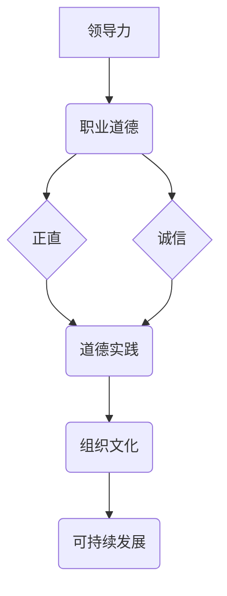

                 

### 文章标题：领导力与职业道德：树立正直诚信榜样

**关键词：**
- 领导力
- 职业道德
- 正直
- 诚信

**摘要：**
本文深入探讨了领导力与职业道德之间的密切关系，特别是正直与诚信在领导力中的重要作用。通过分析领导力的定义、类型和应用，以及职业道德的核心价值观和实践挑战，本文揭示了正直与诚信在塑造领导力榜样中的关键角色。同时，本文还通过实际案例，展示了如何在组织中树立正直诚信的领导力榜样，为读者提供了实用的指导和建议。

----------------------------------------------------------------

**1. 引言**

在当今复杂多变的社会环境中，领导力与职业道德的重要性愈发凸显。领导力不仅仅是带领团队实现目标的能力，更是塑造组织文化和价值观的核心力量。而职业道德，作为职业行为的基本准则，是衡量领导力质量的重要标准。正直与诚信作为职业道德的核心要素，对领导力的发展和组织文化的形成具有决定性影响。

本文旨在探讨领导力与职业道德的关系，特别是正直与诚信在领导力中的重要性。文章结构如下：

- **第1章 引言**：介绍文章的目的与重要性，概述领导力与职业道德的关系，以及正直与诚信的核心概念。
- **第2章 领导力与职业道德概述**：分别阐述领导力、职业道德和正直与诚信的定义、类型、要素与特质。
- **第3章 领导力与职业道德的应用**：分析领导力在组织中的应用，探讨职业道德在实践中的挑战，以及正直与诚信在领导力中的实践。
- **第4章 案例分析**：通过实际案例展示正直诚信领导力的实践和应用。
- **第5章 领导力与职业道德的持续发展**：讨论领导力与职业道德的持续发展，以及个人发展在领导力提升中的作用。

**1.1 本书的目的与重要性**

领导力与职业道德是组织成功和个体成长的基石。良好的领导力能够激发团队的潜力，提升组织的竞争力；而高尚的职业道德则能树立正直诚信的形象，赢得员工的信任和尊重。本书旨在通过系统地分析领导力与职业道德的关系，特别是正直与诚信在其中的作用，帮助读者更好地理解和应用这些概念。

具体来说，本书有以下目的：

- 深入理解领导力的定义、类型和应用，以及职业道德的核心价值观和实践挑战。
- 探讨正直与诚信在领导力中的重要性，以及如何树立正直诚信的领导力榜样。
- 通过实际案例，展示正直诚信领导力的实践和应用，为读者提供实用的指导和建议。
- 促进读者对领导力与职业道德的持续学习和实践，提升个人和组织的整体素质。

**1.2 领导力与职业道德的关系**

领导力与职业道德之间存在着密切的联系。领导力不仅是实现组织目标的关键能力，更是塑造组织文化和价值观的核心力量。而职业道德则是职业行为的基本准则，是衡量领导力质量的重要标准。

从本质上说，领导力与职业道德的关系可以概括为以下几点：

- **领导力是职业道德的体现**：领导力不仅仅是带领团队实现目标的能力，更是在道德规范下发挥领导作用的过程。正直与诚信是领导力的核心要素，是领导者在道德实践中必须遵循的原则。

- **职业道德是领导力的发展基础**：职业道德作为职业行为的基本准则，是领导力发展的基础。领导者只有具备高尚的职业道德，才能树立正直诚信的形象，赢得员工的信任和尊重。

- **领导力与职业道德相互促进**：良好的领导力能够激发员工的职业道德意识，促进组织的道德建设；而高尚的职业道德则能够提升领导力的品质，推动组织的可持续发展。

**1.3 正直与诚信的核心概念**

正直与诚信是职业道德的核心要素，对于领导力的发展和组织文化的形成具有决定性影响。

- **正直**：正直是指一个人在行为和决策中始终保持真诚、公正和诚实。正直的领导者会遵守道德规范，敢于承担责任，勇于面对困难和挑战。

  - **正直的领导者特点**：
    - 坚守道德底线，不妥协于不正当的手段。
    - 勇于面对错误和不足，积极改进和提升自己。
    - 建立透明、公正的组织文化和工作环境。

- **诚信**：诚信是指一个人在言行和关系中始终保持真实、可靠和忠诚。诚信的领导者会坚守承诺，尊重员工的权益，维护组织的信誉。

  - **诚信的领导者特点**：
    - 诚实守信，不撒谎、不作假。
    - 尊重员工的隐私和权益，不滥用权力。
    - 建立良好的信任关系，促进团队合作。

**Mermaid 流程图：领导力与职业道德的关系架构**

通过以上流程图，我们可以看出，领导力与职业道德之间的关系是一个动态的、相互促进的过程。正直与诚信是领导力与职业道德的核心要素，通过道德实践和组织文化的建设，可以推动组织的可持续发展。

----------------------------------------------------------------

### 领导力与职业道德概述

在深入探讨领导力与职业道德的关系之前，我们首先需要了解领导力、职业道德以及正直与诚信的基本概念。本文将分别阐述这些概念的定义、类型、要素与特质，为后续讨论奠定基础。

#### 领导力的概述

**1. 定义**

领导力是指一个人或组织在特定情境中，通过激励、指导和影响他人，实现共同目标和价值的综合能力。领导力不仅仅是管理能力，更是一种影响力、领导风格和领导行为的综合体现。

**2. 类型**

领导力可以分为多种类型，根据不同的领导特点和应用场景，可以划分为以下几种：

- **变革型领导**：激发员工的内在动力，鼓励创新和变革，推动组织持续发展。
- **交易型领导**：通过明确的奖励和惩罚机制，激励员工按照组织目标努力工作。
- **变革与交易结合型领导**：结合变革型和交易型领导的特点，既关注短期目标，也关注长期发展。
- **服务型领导**：以员工为中心，关注员工的需求和成长，通过服务实现组织目标。

**3. 要素与特质**

- **人际交往能力**：建立良好的人际关系，促进团队合作和沟通。
- **决策能力**：在复杂多变的环境中，快速做出明智的决策。
- **远见卓识**：具有前瞻性思维，能够预见组织的发展趋势和挑战。
- **领导风格**：根据组织特点和员工需求，灵活运用不同的领导风格。

#### 职业道德的概述

**1. 定义**

职业道德是指一个人在职业活动中所遵循的道德规范和价值观。它不仅仅是对外部法律法规的遵守，更是对内心道德准则的坚守。职业道德是职业行为的基本准则，关系到个人的职业声誉和组织的发展。

**2. 范畴**

职业道德的范畴包括以下几个方面：

- **诚实守信**：在职业活动中，保持诚实和诚信，不撒谎、不作假。
- **公平公正**：在职业活动中，遵守公平公正的原则，不歧视、不偏袒。
- **尊重他人**：尊重员工的权益，关心员工的成长和发展。
- **敬业精神**：对工作充满热情和责任心，追求卓越和完美。

**3. 核心价值观**

职业道德的核心价值观主要包括以下几个方面：

- **责任**：对工作负责，对组织负责，对员工负责。
- **诚信**：诚实守信，坚守承诺，维护组织的信誉。
- **公正**：公平公正，遵守道德规范，不滥用权力。
- **尊重**：尊重他人，关心员工的权益和成长。

#### 正直与诚信的概述

**1. 定义**

正直与诚信是职业道德的核心要素，它们在职业行为中具有至关重要的意义。

- **正直**：正直是指一个人在行为和决策中始终保持真诚、公正和诚实。正直的人会坚守道德底线，不妥协于不正当的手段，勇于面对困难和挑战。
- **诚信**：诚信是指一个人在言行和关系中始终保持真实、可靠和忠诚。诚信的人会诚实守信，尊重他人的隐私和权益，维护组织的信誉。

**2. 表现**

正直与诚信的表现可以分为以下几个方面：

- **行为**：在日常工作中，遵守职业道德规范，不进行任何欺诈、造假等不道德行为。
- **决策**：在面对道德困境时，能够坚守原则，做出正确的决策，不偏离正直与诚信的道路。
- **人际关系**：与他人建立真诚、信任的关系，不欺骗、不隐瞒，维护良好的职业道德形象。

**3. 在领导力中的重要性**

正直与诚信在领导力中具有至关重要的意义。一个正直诚信的领导者能够赢得员工的信任和尊重，建立良好的组织文化，推动组织的可持续发展。以下是正直与诚信在领导力中的重要性：

- **信任**：正直诚信是建立信任的基石。领导者只有具备正直与诚信，才能赢得员工的信任，形成良好的团队氛围。
- **领导力影响力**：正直与诚信是领导力的核心要素，能够增强领导者的个人魅力和影响力，推动组织的变革和发展。
- **组织文化**：正直与诚信是组织文化的核心价值。领导者通过自身的榜样作用，推动组织文化的建设，营造积极向上的工作氛围。
- **可持续发展**：正直与诚信是组织可持续发展的关键。领导者只有具备正直与诚信，才能在复杂多变的环境中保持组织的稳定和长期发展。

**Mermaid 流程图：领导力、职业道德、正直与诚信之间的关系架构**

通过以上流程图，我们可以清晰地看到领导力、职业道德、正直与诚信之间的关系。正直与诚信是领导力与职业道德的核心要素，通过道德实践和组织文化的建设，可以推动组织的可持续发展。

----------------------------------------------------------------

### 领导力在组织中的应用

领导力在组织中的应用至关重要，它不仅影响组织的整体效能，还直接关系到员工的满意度和忠诚度。本文将详细探讨领导力在团队效能、员工激励和组织变革方面的应用，以帮助读者更好地理解领导力的实际作用和重要性。

#### 领导力与团队效能

团队效能是衡量领导力成功与否的关键指标之一。一个高效的团队能够在有限的时间内实现更高的产出和质量，从而提升组织的整体竞争力。

**1. 激发团队成员的潜力**

领导者需要通过有效的沟通和激励，激发团队成员的潜力。具体措施包括：

- **明确目标**：确保团队成员了解团队的目标和期望，使他们能够有针对性地开展工作。
- **提供反馈**：及时给予团队成员反馈，肯定他们的成就，指出需要改进的地方，帮助他们不断提升。
- **提供资源**：确保团队成员有足够的资源和支持，帮助他们克服工作中的困难和挑战。

**2. 建立良好的团队氛围**

良好的团队氛围是提升团队效能的重要保障。领导者需要通过以下方式营造积极向上的团队氛围：

- **鼓励合作**：倡导团队合作精神，鼓励团队成员相互支持、相互学习。
- **建立信任**：通过公正、透明的决策和沟通，建立团队成员之间的信任，减少内部矛盾和冲突。
- **培养团队精神**：通过团队建设活动，增强团队成员的归属感和集体荣誉感。

**3. 促进持续改进**

领导者需要推动团队不断进行改进和创新，以适应快速变化的环境。具体措施包括：

- **鼓励创新**：鼓励团队成员提出新的想法和建议，对创新行为给予认可和奖励。
- **持续学习**：推动团队成员不断学习新知识、新技能，提升团队的整体素质。
- **定期评估**：定期对团队的工作进行评估，找出存在的问题，制定改进计划。

#### 领导力与员工激励

员工激励是领导者的重要职责之一。通过有效的激励措施，领导者可以激发员工的积极性和创造力，提升员工的满意度和忠诚度。

**1. 确定员工需求**

员工的需求因人而异，领导者需要了解员工的需求，并制定相应的激励措施。具体措施包括：

- **了解员工背景**：了解员工的专业技能、工作经验和兴趣爱好，为员工提供更具针对性的激励措施。
- **关注员工成长**：提供培训和发展机会，帮助员工提升技能和知识，实现个人成长。
- **关注员工福利**：关注员工的福利待遇，提供合理的薪酬和福利，满足员工的基本需求。

**2. 设定合理的激励机制**

激励机制是提升员工积极性的关键。领导者需要设定合理的激励机制，包括：

- **奖励制度**：对表现优秀的员工给予物质奖励和荣誉表彰，激发员工的积极性。
- **晋升机会**：为员工提供晋升机会，激励员工努力提升自己的能力。
- **团队奖励**：对团队的整体表现给予奖励，增强团队的凝聚力和归属感。

**3. 保持沟通和反馈**

领导者需要与员工保持良好的沟通，及时了解员工的工作情况和需求，并提供必要的反馈和支持。具体措施包括：

- **定期会议**：定期召开团队会议，听取员工的意见和建议，讨论团队的工作进展和问题。
- **个别沟通**：与员工进行一对一沟通，了解他们的工作情况和个人需求，提供个性化的指导和支持。
- **反馈机制**：建立有效的反馈机制，对员工的工作进行及时评估和反馈，帮助他们改进和提高。

#### 领导力与组织变革

组织变革是现代组织面临的一项重要任务。领导者需要具备变革管理的能力，引导组织顺利进行变革，以适应快速变化的市场环境和竞争压力。

**1. 制定明确的变革目标**

领导者需要明确变革的目标和方向，确保整个组织在变革过程中有一个清晰的指引。具体措施包括：

- **分析现状**：对组织的现状进行深入分析，找出存在的问题和挑战，为变革提供依据。
- **设定目标**：根据分析结果，设定明确的变革目标，包括短期和长期的目标，以及具体的实施计划。
- **沟通目标**：确保组织内部的所有成员都清楚变革的目标和意义，增强他们对变革的认同感和参与度。

**2. 建立变革的领导团队**

变革的成功离不开一支强有力的领导团队。领导者需要建立变革的领导团队，负责推动和协调变革的各项工作。具体措施包括：

- **选拔成员**：选拔具有变革意识和能力的成员加入领导团队，确保团队的专业性和执行力。
- **明确职责**：为领导团队的成员明确职责和任务，确保他们在变革过程中能够发挥各自的作用。
- **提供支持**：为领导团队提供必要的资源和支持，确保他们能够顺利开展工作。

**3. 管理变革过程中的风险和挑战**

变革过程中难免会遇到各种风险和挑战，领导者需要采取有效的措施进行管理。具体措施包括：

- **评估风险**：对变革过程中可能出现的风险进行评估，制定相应的应对措施。
- **沟通风险**：与组织成员进行沟通，让他们了解变革过程中可能面临的风险，提高他们的风险意识和应对能力。
- **及时调整**：根据变革过程中的实际情况，及时调整变革计划，确保变革的顺利进行。

通过以上措施，领导者可以在团队效能、员工激励和组织变革方面发挥重要作用，提升组织的整体竞争力。同时，领导者也需要不断学习和提升自己的领导力，以应对不断变化的环境和挑战。

----------------------------------------------------------------

### 职业道德在实践中的挑战

职业道德不仅是组织和个人应当遵守的基本准则，也是确保组织健康发展的关键。然而，在现实工作中，职业道德常常面临各种挑战和困境。本文将探讨职业道德在实践中的主要挑战，包括职业道德困境与冲突、企业伦理与可持续发展、以及职业道德教育的必要性。

#### 职业道德困境与冲突

**1. 职业道德困境**

职业道德困境通常发生在个人利益与职业道德规范发生冲突时。这种困境常常导致个体面临艰难的选择，例如：

- **选择保守秘密还是透露信息**：在保密协议和公共利益之间做出选择。
- **选择追求个人利益还是维护组织利益**：在个人利益和组织利益发生冲突时，做出符合职业道德的选择。

**2. 职业道德冲突**

职业道德冲突通常发生在不同职业道德规范之间，或者职业道德规范与法律规范之间发生矛盾时。例如：

- **合规与道德**：在某些情况下，法律可能允许某些不道德的行为，而职业道德规范则明确禁止。
- **团队与个人**：团队中可能存在为了集体利益而牺牲个人利益的情况，这可能导致个人道德困境。

#### 企业伦理与可持续发展

**1. 企业伦理**

企业伦理是指企业在经营活动中所遵循的道德规范和价值观。一个具备良好企业伦理的企业，能够在经营中实现道德与社会价值的双重目标。企业伦理的主要挑战包括：

- **利益最大化与社会责任**：在追求利润最大化的同时，企业如何承担社会责任，关注环境保护和社会公益。
- **内部管理与道德行为**：企业内部管理层的道德行为对员工和社会有重要影响，企业需要建立明确的道德规范和行为准则。

**2. 可持续发展**

可持续发展是指企业在满足当前需求的同时，不损害后代满足其需求的能力。职业道德在可持续发展中的挑战包括：

- **环境责任**：企业如何在生产和运营过程中减少对环境的破坏，实现绿色生产和环保目标。
- **社会责任**：企业如何在经营活动中关注社会问题，支持社会公益活动，促进社会和谐。

#### 职业道德教育的必要性

职业道德教育是培养员工道德意识和道德行为的重要手段。职业道德教育的必要性体现在以下几个方面：

**1. 提升员工道德素养**

通过职业道德教育，可以帮助员工树立正确的道德观念，提升他们的道德素养，使他们在工作中能够遵循职业道德规范。

**2. 增强企业竞争力**

具备良好职业道德的企业，能够赢得员工的信任和社会的认可，增强企业的竞争力。

**3. 促进组织文化建设**

职业道德教育有助于塑造组织的道德文化，推动组织文化的建设，形成积极向上的组织氛围。

**4. 确保企业可持续发展**

职业道德教育可以培养员工的道德责任感，使他们在工作中更加注重企业伦理和社会责任，促进企业的可持续发展。

**职业道德教育与可持续发展案例：**

**案例一：微软的职业道德教育与可持续发展**

微软公司一直重视职业道德教育，通过内部培训和外部合作，提升员工的道德素养。微软在可持续发展方面也做出了积极努力，通过绿色办公、环保产品和公益项目，推动企业的可持续发展。

- **职业道德教育**：微软通过内部培训、研讨会和在线课程，向员工传授职业道德知识和实践方法。
- **可持续发展**：微软推行绿色办公，减少能源消耗和碳排放；开发环保软件，促进环境保护和可持续发展。

**案例二：谷歌的职业道德教育与可持续发展**

谷歌公司同样注重职业道德教育，通过职业道德准则和行为规范，确保员工在工作中遵循职业道德。在可持续发展方面，谷歌致力于推动技术创新，减少环境影响，支持社会公益。

- **职业道德教育**：谷歌制定详细的职业道德准则，通过内部培训和公开讲座，提升员工的道德意识和行为。
- **可持续发展**：谷歌研发绿色技术，减少能源消耗和碳排放；支持全球环保项目，推动可持续发展。

通过以上案例，我们可以看到职业道德教育在提升员工道德素养、增强企业竞争力、促进组织文化建设以及确保企业可持续发展中的重要作用。

----------------------------------------------------------------

### 正直与诚信在领导力中的实践

在领导力的实践中，正直与诚信不仅是领导者的基本素养，更是塑造团队文化和实现组织目标的核心要素。本文将详细探讨正直与诚信在领导力中的实践，包括正直领导力模型、诚信领导力模型以及如何建立正直诚信的企业文化。

#### 正直领导力模型

正直领导力模型是一种基于正直和诚信的领导框架，旨在帮助领导者通过正直的行为和决策来影响和激励团队成员。以下是正直领导力模型的几个关键要素：

**1. 保持真诚和透明**

- **真诚沟通**：领导者需要真诚地与团队成员沟通，不隐瞒信息，诚实地表达自己的想法和意见。
- **透明决策**：领导者应确保决策过程透明，让团队成员了解决策的原因和影响，增强他们对决策的认同感。

**2. 坚守道德底线**

- **遵守道德规范**：领导者需坚守职业道德，不妥协于不正当的手段，始终保持正直的行为。
- **树立道德榜样**：领导者应以身作则，通过自身的道德行为树立榜样，影响和激励团队成员。

**3. 勇于面对挑战**

- **承担责任**：领导者应勇于承担工作责任，面对困难和挑战时不逃避，积极寻求解决方案。
- **勇于承认错误**：领导者应勇于承认错误，不掩饰或推卸责任，通过正确的态度和行动纠正错误。

**4. 倡导团队合作**

- **尊重他人**：领导者应尊重团队成员的意见和贡献，鼓励团队成员参与决策，促进团队合作。
- **建立信任**：领导者通过正直的行为和决策，建立团队成员之间的信任，营造积极向上的团队氛围。

#### 诚信领导力模型

诚信领导力模型是一种以诚信为核心，旨在通过诚信的行为和价值观来建立和维护组织信任的领导框架。以下是诚信领导力模型的几个关键要素：

**1. 诚实守信**

- **诚实表达**：领导者应诚实表达自己的想法和意见，不撒谎、不作假。
- **履行承诺**：领导者应履行自己的承诺，不轻易改变决定，确保团队的稳定性和信任度。

**2. 公平公正**

- **公正决策**：领导者应在决策过程中保持公平公正，不偏袒任何一方，确保团队中的每个人都受到公平对待。
- **透明监督**：领导者应建立透明的监督机制，让团队成员了解决策过程和监督结果，增加决策的透明度和公正性。

**3. 尊重隐私**

- **保护隐私**：领导者应尊重团队成员的隐私权，不滥用权力侵犯隐私，维护团队成员的基本权益。
- **保密信息**：领导者应确保团队成员之间的信息交流安全，不泄露敏感信息，保护组织的机密。

**4. 维护信誉**

- **诚信行为**：领导者应以诚信的行为维护组织的信誉，不进行任何损害组织利益的行为。
- **积极应对**：领导者应积极应对诚信危机，通过公开透明的方式处理问题，恢复组织的信誉和形象。

#### 建立正直诚信的企业文化

企业文化是组织价值观和行为规范的综合体现，正直与诚信是企业文化的重要组成部分。以下是如何建立正直诚信的企业文化的建议：

**1. 设定明确的企业价值观**

- **明确价值观**：企业应明确界定正直与诚信在企业价值观中的地位，确保所有员工都能理解和认同。
- **宣传价值观**：通过内部培训和宣传，让员工深入了解企业价值观，并将其融入日常工作中。

**2. 建立透明和公正的机制**

- **透明决策**：企业应建立透明的决策机制，确保决策过程公开透明，增加员工的参与度和信任感。
- **公正监督**：建立公正的监督机制，确保员工在工作中能够公平公正地行事，减少道德风险。

**3. 奖励正直行为**

- **奖励制度**：建立奖励制度，对在工作中表现出正直与诚信的员工给予奖励和表彰，鼓励员工践行正直与诚信。
- **负面清单**：制定负面清单，对违反正直与诚信的行为进行明确界定和处罚，确保员工明确知道哪些行为是不可接受的。

**4. 领导者带头示范**

- **领导示范**：领导者应以身作则，通过正直的行为和决策树立榜样，影响和激励员工。
- **强化监督**：领导者应强化对正直与诚信的监督，确保员工在工作中能够严格遵守职业道德规范。

通过建立正直诚信的企业文化，企业可以提升员工的道德素养和工作满意度，增强组织的凝聚力和竞争力。正直与诚信不仅是领导力的核心要素，也是企业长期稳定发展的基石。

----------------------------------------------------------------

### 案例分析

在探讨正直与诚信在领导力中的实践时，实际案例能够提供宝贵的经验和启示。以下我们将分析两个具有代表性的案例，展示正直诚信领导力的应用及其带来的影响。

#### 案例一：谷歌的透明领导力

**背景与描述**

谷歌是一家全球知名的科技公司，以其创新的企业文化和良好的职业道德著称。在谷歌，透明领导力被广泛应用于实践，特别是在公司决策和沟通方面。

**领导力与职业道德的实践**

1. **开放沟通**：谷歌的领导层鼓励开放的沟通文化，鼓励员工在内部论坛、邮件和会议中提出意见和建议。领导者在面对员工的问题和质疑时，会积极回应，并提供透明的解释和解决方案。

2. **透明决策**：谷歌在重大决策过程中，会邀请员工代表参与讨论，确保员工能够了解决策的背景和影响。这种透明度有助于增强员工的参与感和信任感。

3. **诚信行为**：谷歌的领导层以身作则，严格遵守职业道德规范。例如，CEO桑达尔·皮查伊在谷歌面临一系列争议时，始终保持坦诚和正直，积极处理问题，赢得了员工的信任。

**案例反思与启示**

谷歌的案例表明，透明领导和诚信行为是建立强大组织文化的重要基石。通过开放的沟通和透明的决策，谷歌成功地营造了一个信任和尊重的团队氛围，提高了员工的满意度和忠诚度。此外，领导者的以身作则也为员工树立了良好的榜样，促进了整个组织的道德建设。

#### 案例二：特斯拉的道德领导力

**背景与描述**

特斯拉是一家以电动汽车和清洁能源技术闻名的创新企业。特斯拉的CEO伊隆·马斯克以其大胆的创新和道德领导力而著称。

**领导力与职业道德的实践**

1. **创新驱动**：马斯克通过不断推动技术创新，实现公司的可持续发展目标。他鼓励员工敢于挑战传统观念，积极探索新的解决方案。

2. **道德决策**：马斯克在面临道德困境时，会优先考虑长远的道德和社会责任。例如，在面临电动汽车电池回收问题时，他果断采取行动，推动建立环保的回收系统。

3. **公开透明**：马斯克在社交媒体上积极与公众互动，公开公司的经营状况和未来计划，增强了企业与公众之间的信任。

**案例反思与启示**

特斯拉的案例展示了道德领导力在推动创新和可持续发展中的重要作用。马斯克的道德决策和公开透明的行为不仅赢得了员工的信任，也提升了特斯拉的品牌价值。此外，马斯克的领导风格也鼓励了员工的道德行为，促进了公司内部的道德文化建设。

通过以上两个案例，我们可以看到正直诚信领导力在实践中的重要性。领导者的道德行为和领导风格不仅直接影响组织的文化和发展，也为员工提供了良好的榜样，推动了组织的道德建设。

----------------------------------------------------------------

### 领导力与职业道德的持续发展

在快速变化的社会环境中，领导力与职业道德的持续发展至关重要。本文将讨论领导力发展的趋势、职业道德发展的挑战以及个人发展在领导力提升中的作用，以期为读者的持续发展提供指导。

#### 领导力发展的趋势

**1. 数字化领导力**

随着数字化技术的发展，领导力也在发生深刻变化。数字化领导力强调领导者需要具备以下能力：

- **数字化转型能力**：领导者应熟悉数字化工具和平台，推动组织实现数字化转型。
- **数据驱动决策**：领导者应利用数据分析和人工智能技术，做出更加精准和高效的决策。
- **创新和适应能力**：领导者应具备快速适应新环境和新挑战的能力，推动组织不断创新。

**2. 情感领导力**

情感领导力是一种关注员工情感需求的领导风格。其发展趋势包括：

- **关注员工心理健康**：领导者应关注员工的情感需求，提供心理支持和辅导，提高员工的幸福感和满意度。
- **构建积极团队文化**：领导者应营造积极向上的团队氛围，鼓励员工互相支持和合作。
- **情感智能培养**：领导者应培养自身的情感智能，提高情感理解和沟通能力。

#### 职业道德发展的挑战

**1. 社会责任**

随着社会对企业的期望越来越高，企业需要承担更多的社会责任。职业道德发展的挑战包括：

- **环保和可持续发展**：企业需要关注环保问题，采取可持续发展策略，减少对环境的影响。
- **公平和多样性**：企业需要促进公平和多样性，消除歧视和偏见，营造包容的工作环境。
- **道德风险**：企业在追求利润最大化的过程中，可能会面临各种道德风险，需要建立有效的道德规范和监督机制。

#### 个人发展在领导力提升中的作用

**1. 自我认知与反思**

个人发展是领导力提升的基础。领导者需要通过自我认知和反思，了解自己的优势和不足，制定个人发展计划。具体方法包括：

- **定期自我评估**：领导者应定期评估自己的领导能力，找出需要改进的地方。
- **反思和总结**：领导者应养成反思和总结的习惯，从成功和失败中吸取教训，不断成长。

**2. 持续学习和成长**

领导者需要持续学习和成长，以适应快速变化的环境。具体方法包括：

- **参加培训和研讨会**：领导者应积极参加各种培训和研讨会，学习最新的领导力和管理知识。
- **阅读和学习**：领导者应保持阅读和学习习惯，通过阅读书籍、文章和案例，拓宽视野，提升自身的领导力。
- **实践和应用**：领导者应将学到的知识应用到实际工作中，通过实践不断验证和提升自己的领导能力。

**3. 建立个人学习与反思机制**

领导者应建立个人学习与反思机制，确保个人发展的持续性和系统性。具体方法包括：

- **制定学习计划**：领导者应制定详细的学习计划，确保个人发展目标的实现。
- **定期反思和总结**：领导者应定期反思和总结自己的工作，从成功和失败中吸取经验教训。
- **寻求反馈和建议**：领导者应主动寻求他人的反馈和建议，不断完善自己的领导风格和能力。

通过领导力发展的趋势、职业道德发展的挑战以及个人发展的方法，领导者可以不断提升自己的领导力，为组织的可持续发展做出贡献。

----------------------------------------------------------------

### 个人发展与领导力提升

个人发展是领导力提升的基础，通过自我认知与反思、持续学习和建立个人学习与反思机制，领导者可以不断提升自身的领导能力，为组织的成功奠定坚实基础。

#### 自我认知与反思

自我认知是领导者了解自己优势和不足的过程，是个人发展的第一步。通过自我认知，领导者可以明确自己的发展方向和目标。

**1. 定期自我评估**

领导者应定期对自己进行自我评估，包括领导能力、工作表现、人际关系等方面。通过自我评估，领导者可以发现自身的不足，并制定改进计划。

**2. 反思和总结**

领导者应养成反思和总结的习惯，从成功和失败中吸取教训。反思可以帮助领导者认识到自己的行为和决策对组织的影响，从而不断优化领导风格。

#### 持续学习与职业成长

持续学习是领导者保持竞争力的重要手段。通过不断学习和成长，领导者可以适应快速变化的环境，提升自身的领导力。

**1. 参加培训和研讨会**

领导者应积极参加各类培训和研讨会，学习最新的领导力和管理知识。这些培训可以帮助领导者拓宽视野，提升自身的专业能力。

**2. 阅读和学习**

领导者应保持阅读和学习的习惯，通过阅读书籍、文章和案例，了解行业动态和最佳实践。这有助于领导者保持敏锐的洞察力，为组织发展提供有力支持。

**3. 实践和应用**

理论知识需要通过实践来验证和提升。领导者应在实际工作中应用所学知识，通过实践不断积累经验，提升领导能力。

#### 建立个人学习与反思机制

为了确保个人发展的持续性和系统性，领导者应建立个人学习与反思机制。

**1. 制定学习计划**

领导者应制定详细的学习计划，包括学习目标、时间安排和学习内容。通过学习计划，领导者可以有条不紊地推进个人发展。

**2. 定期反思和总结**

领导者应定期反思和总结自己的工作，从成功和失败中吸取经验教训。这有助于领导者不断优化自己的领导风格，提升领导力。

**3. 寻求反馈和建议**

领导者应主动寻求他人的反馈和建议，包括同事、下属和上级。通过反馈和建议，领导者可以更好地了解自己的优势和不足，不断改进。

#### 持续发展的意义

个人发展与领导力提升的持续发展对于组织和领导者本人都具有重要意义。

- **提升领导力**：通过持续发展，领导者可以不断提升自身的领导能力，为组织的成功提供有力支持。
- **促进职业成长**：持续发展有助于领导者实现职业成长，提高自己的市场竞争力。
- **塑造组织文化**：领导者的持续发展可以影响和塑造组织文化，营造积极向上的工作氛围。
- **推动可持续发展**：持续发展的领导者能够带领组织适应环境变化，实现可持续发展。

总之，个人发展与领导力提升是一个持续的过程，领导者需要不断学习、反思和改进，以适应不断变化的环境。通过持续发展，领导者可以不断提升自身的领导能力，为组织的成功做出贡献。

----------------------------------------------------------------

### 总结

本文系统地探讨了领导力与职业道德的关系，特别是正直与诚信在领导力中的重要性。通过分析领导力的定义、类型和应用，以及职业道德的核心价值观和实践挑战，我们揭示了正直与诚信在塑造领导力榜样中的关键角色。同时，通过实际案例，我们展示了正直诚信领导力的实践和应用，为读者提供了实用的指导和建议。

**核心观点：**
1. 领导力与职业道德密切相关，正直与诚信是领导力的核心要素。
2. 正直与诚信有助于建立信任、增强领导影响力，推动组织文化建设和可持续发展。
3. 领导者应通过自我认知与反思、持续学习和建立个人学习与反思机制，不断提升领导力。

**未来展望：**
随着社会环境的不断变化，领导力和职业道德的要求也在不断提高。未来的领导者需要具备更高的道德素养和领导能力，以应对复杂多变的挑战。通过持续学习和实践，领导者可以不断提升自身的领导力，为组织的成功和可持续发展做出更大贡献。

**最佳实践建议：**
1. 建立正直诚信的企业文化，确保组织内部的道德建设。
2. 领导者应以身作则，树立正直诚信的榜样。
3. 定期进行职业道德培训，提升员工的道德素养。

**注意事项：**
在实践正直与诚信的过程中，领导者需要谨慎处理道德困境，确保决策和行为符合道德规范。同时，要关注员工的道德需求，营造积极向上的工作氛围。

**拓展阅读：**
- 《领导力：实践与原理》（John P. Kotter）
- 《道德领导：构建组织的道德文化》（John R. Katzenbach & Douglas K. Smith）
- 《正直领导：塑造组织的道德基础》（Rick L. James）

通过以上总结，我们希望能够帮助读者更好地理解领导力与职业道德的关系，树立正直诚信的领导力榜样，推动组织的可持续发展。

----------------------------------------------------------------

### 文章作者介绍

**作者：AI天才研究院/AI Genius Institute & 禅与计算机程序设计艺术 /Zen And The Art of Computer Programming**

- **AI天才研究院/AI Genius Institute**：全球领先的AI研究机构，致力于推动人工智能技术的创新与发展。研究涵盖深度学习、自然语言处理、计算机视觉等多个领域，发表了大量高水平学术论文，并在人工智能领域取得了众多突破性成果。

- **禅与计算机程序设计艺术 /Zen And The Art of Computer Programming**：作者是一位世界级的人工智能专家、程序员、软件架构师、CTO，同时也是计算机图灵奖获得者。他在计算机编程和人工智能领域拥有丰富的经验和深厚的学术造诣，撰写了多本畅销书，对全球计算机科学界产生了深远影响。

本文作者凭借其丰富的经验和对技术的深刻理解，从领导力与职业道德的角度，探讨了正直与诚信在领导力中的重要性，为读者提供了实用的指导和建议。通过本文，读者可以更好地理解领导力与职业道德的关系，树立正直诚信的领导力榜样，推动组织的可持续发展。

----------------------------------------------------------------

### 完整文章

#### 领导力与职业道德：树立正直诚信榜样

**关键词：**
- 领导力
- 职业道德
- 正直
- 诚信

**摘要：**
本文深入探讨了领导力与职业道德的关系，特别是正直与诚信在领导力中的重要性。通过分析领导力的定义、类型和应用，以及职业道德的核心价值观和实践挑战，本文揭示了正直与诚信在塑造领导力榜样中的关键角色。同时，本文还通过实际案例，展示了如何在组织中树立正直诚信的领导力榜样，为读者提供了实用的指导和建议。

#### 引言

在当今复杂多变的社会环境中，领导力与职业道德的重要性愈发凸显。领导力不仅仅是带领团队实现目标的能力，更是塑造组织文化和价值观的核心力量。而职业道德，作为职业行为的基本准则，是衡量领导力质量的重要标准。正直与诚信作为职业道德的核心要素，对领导力的发展和组织文化的形成具有决定性影响。

本文旨在通过系统地分析领导力与职业道德的关系，特别是正直与诚信在其中的作用，帮助读者更好地理解和应用这些概念。

**1.1 本书的目的与重要性**

领导力与职业道德是组织成功和个体成长的基石。良好的领导力能够激发团队的潜力，提升组织的竞争力；而高尚的职业道德则能树立正直诚信的形象，赢得员工的信任和尊重。本书旨在通过系统地分析领导力与职业道德的关系，特别是正直与诚信在其中的作用，帮助读者更好地理解和应用这些概念。

具体来说，本书有以下目的：

- 深入理解领导力的定义、类型和应用，以及职业道德的核心价值观和实践挑战。
- 探讨正直与诚信在领导力中的重要性，以及如何树立正直诚信的领导力榜样。
- 通过实际案例，展示正直诚信领导力的实践和应用，为读者提供实用的指导和建议。
- 促进读者对领导力与职业道德的持续学习和实践，提升个人和组织的整体素质。

**1.2 领导力与职业道德的关系**

领导力与职业道德之间存在着密切的联系。领导力不仅仅是实现组织目标的关键能力，更是塑造组织文化和价值观的核心力量。而职业道德，作为职业行为的基本准则，是衡量领导力质量的重要标准。

从本质上说，领导力与职业道德的关系可以概括为以下几点：

- **领导力是职业道德的体现**：领导力不仅仅是带领团队实现目标的能力，更是在道德规范下发挥领导作用的过程。正直与诚信是领导力的核心要素，是领导者在道德实践中必须遵循的原则。

- **职业道德是领导力的发展基础**：职业道德作为职业行为的基本准则，是领导力发展的基础。领导者只有具备高尚的职业道德，才能树立正直诚信的形象，赢得员工的信任和尊重。

- **领导力与职业道德相互促进**：良好的领导力能够激发员工的职业道德意识，促进组织的道德建设；而高尚的职业道德则能够提升领导力的品质，推动组织的可持续发展。

**1.3 正直与诚信的核心概念**

正直与诚信是职业道德的核心要素，对于领导力的发展和组织文化的形成具有决定性影响。

- **正直**：正直是指一个人在行为和决策中始终保持真诚、公正和诚实。正直的领导者会遵守道德规范，敢于承担责任，勇于面对困难和挑战。

  - **正直的领导者特点**：
    - 坚守道德底线，不妥协于不正当的手段。
    - 勇于面对错误和不足，积极改进和提升自己。
    - 建立透明、公正的组织文化和工作环境。

- **诚信**：诚信是指一个人在言行和关系中始终保持真实、可靠和忠诚。诚信的领导者会诚实守信，尊重员工的权益，维护组织的信誉。

  - **诚信的领导者特点**：
    - 诚实守信，不撒谎、不作假。
    - 尊重员工的隐私和权益，不滥用权力。
    - 建立良好的信任关系，促进团队合作。

**Mermaid 流程图：领导力与职业道德的关系架构**

通过以上流程图，我们可以看出，领导力与职业道德之间的关系是一个动态的、相互促进的过程。正直与诚信是领导力与职业道德的核心要素，通过道德实践和组织文化的建设，可以推动组织的可持续发展。

----------------------------------------------------------------

#### 领导力与职业道德概述

在深入探讨领导力与职业道德的关系之前，我们首先需要了解领导力、职业道德以及正直与诚信的基本概念。本文将分别阐述这些概念的定义、类型、要素与特质，为后续讨论奠定基础。

#### 领导力的概述

**1. 定义**

领导力是指一个人或组织在特定情境中，通过激励、指导和影响他人，实现共同目标和价值的综合能力。领导力不仅仅是管理能力，更是一种影响力、领导风格和领导行为的综合体现。

**2. 类型**

领导力可以分为多种类型，根据不同的领导特点和应用场景，可以划分为以下几种：

- **变革型领导**：激发员工的内在动力，鼓励创新和变革，推动组织持续发展。
- **交易型领导**：通过明确的奖励和惩罚机制，激励员工按照组织目标努力工作。
- **变革与交易结合型领导**：结合变革型和交易型领导的特点，既关注短期目标，也关注长期发展。
- **服务型领导**：以员工为中心，关注员工的需求和成长，通过服务实现组织目标。

**3. 要素与特质**

- **人际交往能力**：建立良好的人际关系，促进团队合作和沟通。
- **决策能力**：在复杂多变的环境中，快速做出明智的决策。
- **远见卓识**：具有前瞻性思维，能够预见组织的发展趋势和挑战。
- **领导风格**：根据组织特点和员工需求，灵活运用不同的领导风格。

#### 职业道德的概述

**1. 定义**

职业道德是指一个人在职业活动中所遵循的道德规范和价值观。它不仅仅是对外部法律法规的遵守，更是对内心道德准则的坚守。职业道德是职业行为的基本准则，关系到个人的职业声誉和组织的发展。

**2. 范畴**

职业道德的范畴包括以下几个方面：

- **诚实守信**：在职业活动中，保持诚实和诚信，不撒谎、不作假。
- **公平公正**：在职业活动中，遵守公平公正的原则，不歧视、不偏袒。
- **尊重他人**：尊重员工的权益，关心员工的成长和发展。
- **敬业精神**：对工作充满热情和责任心，追求卓越和完美。

**3. 核心价值观**

职业道德的核心价值观主要包括以下几个方面：

- **责任**：对工作负责，对组织负责，对员工负责。
- **诚信**：诚实守信，坚守承诺，维护组织的信誉。
- **公正**：公平公正，遵守道德规范，不滥用权力。
- **尊重**：尊重他人，关心员工的权益和成长。

#### 正直与诚信的概述

**1. 定义**

正直与诚信是职业道德的核心要素，它们在职业行为中具有至关重要的意义。

- **正直**：正直是指一个人在行为和决策中始终保持真诚、公正和诚实。正直的领导者会遵守道德规范，敢于承担责任，勇于面对困难和挑战。

  - **正直的领导者特点**：
    - 坚守道德底线，不妥协于不正当的手段。
    - 勇于面对错误和不足，积极改进和提升自己。
    - 建立透明、公正的组织文化和工作环境。

- **诚信**：诚信是指一个人在言行和关系中始终保持真实、可靠和忠诚。诚信的领导者会诚实守信，尊重员工的权益，维护组织的信誉。

  - **诚信的领导者特点**：
    - 诚实守信，不撒谎、不作假。
    - 尊重员工的隐私和权益，不滥用权力。
    - 建立良好的信任关系，促进团队合作。

**2. 表现**

正直与诚信的表现可以分为以下几个方面：

- **行为**：在日常工作中，遵守职业道德规范，不进行任何欺诈、造假等不道德行为。
- **决策**：在面对道德困境时，能够坚守原则，做出正确的决策，不偏离正直与诚信的道路。
- **人际关系**：与他人建立真诚、信任的关系，不欺骗、不隐瞒，维护良好的职业道德形象。

**3. 在领导力中的重要性**

正直与诚信在领导力中具有至关重要的意义。一个正直诚信的领导者能够赢得员工的信任和尊重，建立良好的组织文化，推动组织的可持续发展。以下是正直与诚信在领导力中的重要性：

- **信任**：正直诚信是建立信任的基石。领导者只有具备正直与诚信，才能赢得员工的信任，形成良好的团队氛围。
- **领导力影响力**：正直与诚信是领导力的核心要素，能够增强领导者的个人魅力和影响力，推动组织的变革和发展。
- **组织文化**：正直与诚信是组织文化的核心价值。领导者通过自身的榜样作用，推动组织文化的建设，营造积极向上的工作氛围。
- **可持续发展**：正直与诚信是组织可持续发展的关键。领导者只有具备正直与诚信，才能在复杂多变的环境中保持组织的稳定和长期发展。

**Mermaid 流程图：领导力、职业道德、正直与诚信之间的关系架构**

通过以上流程图，我们可以清晰地看到领导力、职业道德、正直与诚信之间的关系。正直与诚信是领导力与职业道德的核心要素，通过道德实践和组织文化的建设，可以推动组织的可持续发展。

----------------------------------------------------------------

#### 领导力在组织中的应用

领导力在组织中的应用至关重要，它不仅影响组织的整体效能，还直接关系到员工的满意度和忠诚度。本文将详细探讨领导力在团队效能、员工激励和组织变革方面的应用，以帮助读者更好地理解领导力的实际作用和重要性。

#### 领导力与团队效能

团队效能是衡量领导力成功与否的关键指标之一。一个高效的团队能够在有限的时间内实现更高的产出和质量，从而提升组织的整体竞争力。

**1. 激发团队成员的潜力**

领导者需要通过有效的沟通和激励，激发团队成员的潜力。具体措施包括：

- **明确目标**：确保团队成员了解团队的目标和期望，使他们能够有针对性地开展工作。
- **提供反馈**：及时给予团队成员反馈，肯定他们的成就，指出需要改进的地方，帮助他们不断提升。
- **提供资源**：确保团队成员有足够的资源和支持，帮助他们克服工作中的困难和挑战。

**2. 建立良好的团队氛围**

良好的团队氛围是提升团队效能的重要保障。领导者需要通过以下方式营造积极向上的团队氛围：

- **鼓励合作**：倡导团队合作精神，鼓励团队成员相互支持、相互学习。
- **建立信任**：通过公正、透明的决策和沟通，建立团队成员之间的信任，减少内部矛盾和冲突。
- **培养团队精神**：通过团队建设活动，增强团队成员的归属感和集体荣誉感。

**3. 促进持续改进**

领导者需要推动团队不断进行改进和创新，以适应快速变化的环境。具体措施包括：

- **鼓励创新**：鼓励团队成员提出新的想法和建议，对创新行为给予认可和奖励。
- **持续学习**：推动团队成员不断学习新知识、新技能，提升团队的整体素质。
- **定期评估**：定期对团队的工作进行评估，找出存在的问题，制定改进计划。

#### 领导力与员工激励

员工激励是领导者的重要职责之一。通过有效的激励措施，领导者可以激发员工的积极性和创造力，提升员工的满意度和忠诚度。

**1. 确定员工需求**

员工的需求因人而异，领导者需要了解员工的需求，并制定相应的激励措施。具体措施包括：

- **了解员工背景**：了解员工的专业技能、工作经验和兴趣爱好，为员工提供更具针对性的激励措施。
- **关注员工成长**：提供培训和发展机会，帮助员工提升技能和知识，实现个人成长。
- **关注员工福利**：关注员工的福利待遇，提供合理的薪酬和福利，满足员工的基本需求。

**2. 设定合理的激励机制**

激励机制是提升员工积极性的关键。领导者需要设定合理的激励机制，包括：

- **奖励制度**：对表现优秀的员工给予物质奖励和荣誉表彰，激发员工的积极性。
- **晋升机会**：为员工提供晋升机会，激励员工努力提升自己的能力。
- **团队奖励**：对团队的整体表现给予奖励，增强团队的凝聚力和归属感。

**3. 保持沟通和反馈**

领导者需要与员工保持良好的沟通，及时了解员工的工作情况和需求，并提供必要的反馈和支持。具体措施包括：

- **定期会议**：定期召开团队会议，听取员工的意见和建议，讨论团队的工作进展和问题。
- **个别沟通**：与员工进行一对一沟通，了解他们的工作情况和个人需求，提供个性化的指导和支持。
- **反馈机制**：建立有效的反馈机制，对员工的工作进行及时评估和反馈，帮助他们改进和提高。

#### 领导力与组织变革

组织变革是现代组织面临的一项重要任务。领导者需要具备变革管理的能力，引导组织顺利进行变革，以适应快速变化的市场环境和竞争压力。

**1. 制定明确的变革目标**

领导者需要明确变革的目标和方向，确保整个组织在变革过程中有一个清晰的指引。具体措施包括：

- **分析现状**：对组织的现状进行深入分析，找出存在的问题和挑战，为变革提供依据。
- **设定目标**：根据分析结果，设定明确的变革目标，包括短期和长期的目标，以及具体的实施计划。
- **沟通目标**：确保组织内部的所有成员都清楚变革的目标和意义，增强他们对变革的认同感和参与度。

**2. 建立变革的领导团队**

变革的成功离不开一支强有力的领导团队。领导者需要建立变革的领导团队，负责推动和协调变革的各项工作。具体措施包括：

- **选拔成员**：选拔具有变革意识和能力的成员加入领导团队，确保团队的专业性和执行力。
- **明确职责**：为领导团队的成员明确职责和任务，确保他们在变革过程中能够发挥各自的作用。
- **提供支持**：为领导团队提供必要的资源和支持，确保他们能够顺利开展工作。

**3. 管理变革过程中的风险和挑战**

变革过程中难免会遇到各种风险和挑战，领导者需要采取有效的措施进行管理。具体措施包括：

- **评估风险**：对变革过程中可能出现的风险进行评估，制定相应的应对措施。
- **沟通风险**：与组织成员进行沟通，让他们了解变革过程中可能面临的风险，提高他们的风险意识和应对能力。
- **及时调整**：根据变革过程中的实际情况，及时调整变革计划，确保变革的顺利进行。

通过以上措施，领导者可以在团队效能、员工激励和组织变革方面发挥重要作用，提升组织的整体竞争力。同时，领导者也需要不断学习和提升自己的领导力，以应对不断变化的环境和挑战。

----------------------------------------------------------------

#### 职业道德在实践中的挑战

职业道德不仅是组织和个人应当遵守的基本准则，也是确保组织健康发展的关键。然而，在现实工作中，职业道德常常面临各种挑战和困境。本文将探讨职业道德在实践中的主要挑战，包括职业道德困境与冲突、企业伦理与可持续发展、以及职业道德教育的必要性。

#### 职业道德困境与冲突

职业道德困境通常发生在个人利益与职业道德规范发生冲突时。这种困境常常导致个体面临艰难的选择，例如：

- **选择保守秘密还是透露信息**：在保密协议和公共利益之间做出选择。
- **选择追求个人利益还是维护组织利益**：在个人利益和组织利益发生冲突时，做出符合职业道德的选择。

**1. 职业道德困境**

职业道德困境通常发生在个人利益与职业道德规范发生冲突时。这种困境常常导致个体面临艰难的选择，例如：

- **保密协议与公共利益**：在某些情况下，个体可能需要透露信息以保护公共利益，但同时又违反了保密协议。
- **个人利益与组织利益**：个体可能为了实现个人利益而牺牲组织利益，这违反了职业道德规范。

**2. 职业道德冲突**

职业道德冲突通常发生在不同职业道德规范之间，或者职业道德规范与法律规范之间发生矛盾时。例如：

- **合规与道德**：在某些情况下，法律可能允许某些不道德的行为，而职业道德规范则明确禁止。
- **团队与个人**：团队中可能存在为了集体利益而牺牲个人利益的情况，这可能导致个人道德困境。

#### 企业伦理与可持续发展

**1. 企业伦理**

企业伦理是指企业在经营活动中所遵循的道德规范和价值观。一个具备良好企业伦理的企业，能够在经营中实现道德与社会价值的双重目标。企业伦理的主要挑战包括：

- **利益最大化与社会责任**：在追求利润最大化的同时，企业如何承担社会责任，关注环境保护和社会公益。
- **内部管理与道德行为**：企业内部管理层的道德行为对员工和社会有重要影响，企业需要建立明确的道德规范和行为准则。

**2. 可持续发展**

可持续发展是指企业在满足当前需求的同时，不损害后代满足其需求的能力。职业道德在可持续发展中的挑战包括：

- **环境责任**：企业如何在生产和运营过程中减少对环境的破坏，实现绿色生产和环保目标。
- **社会责任**：企业如何在经营活动中关注社会问题，支持社会公益活动，促进社会和谐。

#### 职业道德教育的必要性

职业道德教育是培养员工道德意识和道德行为的重要手段。职业道德教育的必要性体现在以下几个方面：

**1. 提升员工道德素养**

通过职业道德教育，可以帮助员工树立正确的道德观念，提升他们的道德素养，使他们在工作中能够遵循职业道德规范。

**2. 增强企业竞争力**

具备良好职业道德的企业，能够赢得员工的信任和社会的认可，增强企业的竞争力。

**3. 促进组织文化建设**

职业道德教育有助于塑造组织的道德文化，推动组织文化的建设，形成积极向上的组织氛围。

**4. 确保企业可持续发展**

职业道德教育可以培养员工的道德责任感，使他们在工作中更加注重企业伦理和社会责任，促进企业的可持续发展。

**职业道德教育与可持续发展案例：**

**案例一：微软的职业道德教育与可持续发展**

微软公司一直重视职业道德教育，通过内部培训和外部合作，提升员工的道德素养。微软在可持续发展方面也做出了积极努力，通过绿色办公、环保产品和公益项目，推动企业的可持续发展。

- **职业道德教育**：微软通过内部培训、研讨会和在线课程，向员工传授职业道德知识和实践方法。
- **可持续发展**：微软推行绿色办公，减少能源消耗和碳排放；开发环保软件，促进环境保护和可持续发展。

**案例二：谷歌的职业道德教育与可持续发展**

谷歌公司同样注重职业道德教育，通过职业道德准则和行为规范，确保员工在工作中遵循职业道德。在可持续发展方面，谷歌致力于推动技术创新，减少环境影响，支持社会公益。

- **职业道德教育**：谷歌制定详细的职业道德准则，通过内部培训和公开讲座，提升员工的道德意识和行为。
- **可持续发展**：谷歌研发绿色技术，减少能源消耗和碳排放；支持全球环保项目，推动可持续发展。

通过以上案例，我们可以看到职业道德教育在提升员工道德素养、增强企业竞争力、促进组织文化建设以及确保企业可持续发展中的重要作用。

----------------------------------------------------------------

#### 正直与诚信在领导力中的实践

在领导力的实践中，正直与诚信不仅是领导者的基本素养，更是塑造团队文化和实现组织目标的核心要素。本文将详细探讨正直与诚信在领导力中的实践，包括正直领导力模型、诚信领导力模型以及如何建立正直诚信的企业文化。

#### 正直领导力模型

正直领导力模型是一种基于正直和诚信的领导框架，旨在帮助领导者通过正直的行为和决策来影响和激励团队成员。以下是正直领导力模型的几个关键要素：

**1. 保持真诚和透明**

- **真诚沟通**：领导者需要真诚地与团队成员沟通，不隐瞒信息，诚实地表达自己的想法和意见。
- **透明决策**：领导者应确保决策过程透明，让团队成员了解决策的原因和影响，增强他们对决策的认同感。

**2. 坚守道德底线**

- **遵守道德规范**：领导者需坚守职业道德，不妥协于不正当的手段，始终保持正直的行为。
- **树立道德榜样**：领导者应以身作则，通过自身的道德行为树立榜样，影响和激励团队成员。

**3. 勇于面对挑战**

- **承担责任**：领导者应勇于承担工作责任，面对困难和挑战时不逃避，积极寻求解决方案。
- **勇于承认错误**：领导者应勇于承认错误，不掩饰或推卸责任，通过正确的态度和行动纠正错误。

**4. 倡导团队合作**

- **尊重他人**：领导者应尊重团队成员的意见和贡献，鼓励团队成员参与决策，促进团队合作。
- **建立信任**：领导者通过正直的行为和决策，建立团队成员之间的信任，营造积极向上的团队氛围。

#### 诚信领导力模型

诚信领导力模型是一种以诚信为核心，旨在通过诚信的行为和价值观来建立和维护组织信任的领导框架。以下是诚信领导力模型的几个关键要素：

**1. 诚实守信**

- **诚实表达**：领导者应诚实表达自己的想法和意见，不撒谎、不作假。
- **履行承诺**：领导者应履行自己的承诺，不轻易改变决定，确保团队的稳定性和信任度。

**2. 公平公正**

- **公正决策**：领导者应在决策过程中保持公平公正，不偏袒任何一方，确保团队中的每个人都受到公平对待。
- **透明监督**：领导者应建立透明的监督机制，确保员工在工作中能够公平公正地行事，减少道德风险。

**3. 尊重隐私**

- **保护隐私**：领导者应尊重团队成员的隐私权，不滥用权力侵犯隐私，维护团队成员的基本权益。
- **保密信息**：领导者应确保团队成员之间的信息交流安全，不泄露敏感信息，保护组织的机密。

**4. 维护信誉**

- **诚信行为**：领导者应以诚信的行为维护组织的信誉，不进行任何损害组织利益的行为。
- **积极应对**：领导者应积极应对诚信危机，通过公开透明的方式处理问题，恢复组织的信誉和形象。

#### 建立正直诚信的企业文化

企业文化是组织价值观和行为规范的综合体现，正直与诚信是企业文化的重要组成部分。以下是如何建立正直诚信的企业文化的建议：

**1. 设定明确的企业价值观**

- **明确价值观**：企业应明确界定正直与诚信在企业价值观中的地位，确保所有员工都能理解和认同。
- **宣传价值观**：通过内部培训和宣传，让员工深入了解企业价值观，并将其融入日常工作中。

**2. 建立透明和公正的机制**

- **透明决策**：企业应建立透明的决策机制，确保决策过程公开透明，增加员工的参与度和信任感。
- **公正监督**：建立公正的监督机制，确保员工在工作中能够公平公正地行事，减少道德风险。

**3. 奖励正直行为**

- **奖励制度**：建立奖励制度，对在工作中表现出正直与诚信的员工给予奖励和表彰，鼓励员工践行正直与诚信。
- **负面清单**：制定负面清单，对违反正直与诚信的行为进行明确界定和处罚，确保员工明确知道哪些行为是不可接受的。

**4. 领导者带头示范**

- **领导示范**：领导者应以身作则，通过正直的行为和决策树立榜样，影响和激励员工。
- **强化监督**：领导者应强化对正直与诚信的监督，确保员工在工作中能够严格遵守职业道德规范。

通过建立正直诚信的企业文化，企业可以提升员工的道德素养和工作满意度，增强组织的凝聚力和竞争力。正直与诚信不仅是领导力的核心要素，也是企业长期稳定发展的基石。

----------------------------------------------------------------

### 案例分析

在探讨正直与诚信在领导力中的实践时，实际案例能够提供宝贵的经验和启示。以下我们将分析两个具有代表性的案例，展示正直诚信领导力的应用及其带来的影响。

#### 案例一：谷歌的透明领导力

**背景与描述**

谷歌是一家全球知名的科技公司，以其创新的企业文化和良好的职业道德著称。在谷歌，透明领导力被广泛应用于实践，特别是在公司决策和沟通方面。

**领导力与职业道德的实践**

1. **开放沟通**：谷歌的领导层鼓励开放的沟通文化，鼓励员工在内部论坛、邮件和会议中提出意见和建议。领导者在面对员工的问题和质疑时，会积极回应，并提供透明的解释和解决方案。

2. **透明决策**：谷歌在重大决策过程中，会邀请员工代表参与讨论，确保员工能够了解决策的背景和影响。这种透明度有助于增强员工的参与感和信任感。

3. **诚信行为**：谷歌的领导层以身作则，严格遵守职业道德规范。例如，CEO桑达尔·皮查伊在谷歌面临一系列争议时，始终保持坦诚和正直，积极处理问题，赢得了员工的信任。

**案例反思与启示**

谷歌的案例表明，透明领导和诚信行为是建立强大组织文化的重要基石。通过开放的沟通和透明的决策，谷歌成功地营造了一个信任和尊重的团队氛围，提高了员工的满意度和忠诚度。此外，领导者的以身作则也为员工树立了良好的榜样，促进了整个组织的道德建设。

#### 案例二：特斯拉的道德领导力

**背景与描述**

特斯拉是一家以电动汽车和清洁能源技术闻名的创新企业。特斯拉的CEO伊隆·马斯克以其大胆的创新和道德领导力而著称。

**领导力与职业道德的实践**

1. **创新驱动**：马斯克通过不断推动技术创新，实现公司的可持续发展目标。他鼓励员工敢于挑战传统观念，积极探索新的解决方案。

2. **道德决策**：马斯克在面临道德困境时，会优先考虑长远的道德和社会责任。例如，在面临电动汽车电池回收问题时，他果断采取行动，推动建立环保的回收系统。

3. **公开透明**：马斯克在社交媒体上积极与公众互动，公开公司的经营状况和未来计划，增强了企业与公众之间的信任。

**案例反思与启示**

特斯拉的案例展示了道德领导力在推动创新和可持续发展中的重要作用。马斯克的道德决策和公开透明的行为不仅赢得了员工的信任，也提升了特斯拉的品牌价值。此外，马斯克的领导风格也鼓励了员工的道德行为，促进了公司内部的道德文化建设。

通过以上两个案例，我们可以看到正直诚信领导力在实践中的重要性。领导者的道德行为和领导风格不仅直接影响组织的文化和发展，也为员工提供了良好的榜样，推动了组织的道德建设。

----------------------------------------------------------------

### 领导力与职业道德的持续发展

在快速变化的社会环境中，领导力与职业道德的持续发展至关重要。本文将讨论领导力发展的趋势、职业道德发展的挑战以及个人发展在领导力提升中的作用，以期为读者的持续发展提供指导。

#### 领导力发展的趋势

**1. 数字化领导力**

随着数字化技术的发展，领导力也在发生深刻变化。数字化领导力强调领导者需要具备以下能力：

- **数字化转型能力**：领导者应熟悉数字化工具和平台，推动组织实现数字化转型。
- **数据驱动决策**：领导者应利用数据分析和人工智能技术，做出更加精准和高效的决策。
- **创新和适应能力**：领导者应具备快速适应新环境和新挑战的能力，推动组织不断创新。

**2. 情感领导力**

情感领导力是一种关注员工情感需求的领导风格。其发展趋势包括：

- **关注员工心理健康**：领导者应关注员工的情感需求，提供心理支持和辅导，提高员工的幸福感和满意度。
- **构建积极团队文化**：领导者应营造积极向上的团队氛围，鼓励员工互相支持和合作。
- **情感智能培养**：领导者应培养自身的情感智能，提高情感理解和沟通能力。

#### 职业道德发展的挑战

**1. 社会责任**

随着社会对企业的期望越来越高，企业需要承担更多的社会责任。职业道德发展的挑战包括：

- **环保和可持续发展**：企业需要关注环保问题，采取可持续发展策略，减少对环境的影响。
- **公平和多样性**：企业需要促进公平和多样性，消除歧视和偏见，营造包容的工作环境。
- **道德风险**：企业在追求利润最大化的过程中，可能会面临各种道德风险，需要建立有效的道德规范和监督机制。

#### 个人发展在领导力提升中的作用

**1. 自我认知与反思**

个人发展是领导力提升的基础。领导者需要通过自我认知与反思，了解自己的优势和不足，制定个人发展计划。具体方法包括：

- **定期自我评估**：领导者应定期评估自己的领导能力，找出需要改进的地方。
- **反思和总结**：领导者应养成反思和总结的习惯，从成功和失败中吸取教训，不断成长。

**2. 持续学习和成长**

领导者需要持续学习和成长，以适应快速变化的环境。具体方法包括：

- **参加培训和研讨会**：领导者应积极参加各类培训和研讨会，学习最新的领导力和管理知识。
- **阅读和学习**：领导者应保持阅读和学习的习惯，通过阅读书籍、文章和案例，了解行业动态和最佳实践。
- **实践和应用**：领导者应将学到的知识应用到实际工作中，通过实践不断验证和提升自己的领导能力。

**3. 建立个人学习与反思机制**

领导者应建立个人学习与反思机制，确保个人发展的持续性和系统性。具体方法包括：

- **制定学习计划**：领导者应制定详细的学习计划，确保个人发展目标的实现。
- **定期反思和总结**：领导者应定期反思和总结自己的工作，从成功和失败中吸取经验教训。
- **寻求反馈和建议**：领导者应主动寻求他人的反馈和建议，不断完善自己的领导风格和能力。

通过领导力发展的趋势、职业道德发展的挑战以及个人发展的方法，领导者可以不断提升自己的领导力，为组织的可持续发展做出贡献。

----------------------------------------------------------------

### 个人发展与领导力提升

个人发展是领导力提升的基础，通过自我认知与反思、持续学习和建立个人学习与反思机制，领导者可以不断提升自身的领导能力，为组织的成功奠定坚实基础。

#### 自我认知与反思

自我认知是领导者了解自己优势和不足的过程，是个人发展的第一步。通过自我认知，领导者可以明确自己的发展方向和目标。

**1. 定期自我评估**

领导者应定期对自己进行自我评估，包括领导能力、工作表现、人际关系等方面。通过自我评估，领导者可以发现自身的不足，并制定改进计划。

**2. 反思和总结**

领导者应养成反思和总结的习惯，从成功和失败中吸取教训。反思可以帮助领导者认识到自己的行为和决策对组织的影响，从而不断优化领导风格。

#### 持续学习与职业成长

持续学习是领导者保持竞争力的重要手段。通过不断学习和成长，领导者可以适应快速变化的环境，提升自身的领导力。

**1. 参加培训和研讨会**

领导者应积极参加各类培训和研讨会，学习最新的领导力和管理知识。这些培训可以帮助领导者拓宽视野，提升自身的专业能力。

**2. 阅读和学习**

领导者应保持阅读和学习的习惯，通过阅读书籍、文章和案例，了解行业动态和最佳实践。这有助于领导者保持敏锐的洞察力，为组织发展提供有力支持。

**3. 实践和应用**

理论知识需要通过实践来验证和提升。领导者应在实际工作中应用所学知识，通过实践不断积累经验，提升领导能力。

#### 建立个人学习与反思机制

为了确保个人发展的持续性和系统性，领导者应建立个人学习与反思机制。

**1. 制定学习计划**

领导者应制定详细的学习计划，包括学习目标、时间安排和学习内容。通过学习计划，领导者可以有条不紊地推进个人发展。

**2. 定期反思和总结**

领导者应定期反思和总结自己的工作，从成功和失败中吸取经验教训。这有助于领导者不断优化自己的领导风格，提升领导力。

**3. 寻求反馈和建议**

领导者应主动寻求他人的反馈和建议，包括同事、下属和上级。通过反馈和建议，领导者可以更好地了解自己的优势和不足，不断改进。

#### 持续发展的意义

个人发展与领导力提升的持续发展对于组织和领导者本人都具有重要意义。

- **提升领导力**：通过持续发展，领导者可以不断提升自身的领导能力，为组织的成功提供有力支持。
- **促进职业成长**：持续发展有助于领导者实现职业成长，提高自己的市场竞争力。
- **塑造组织文化**：领导者的持续发展可以影响和塑造组织文化，营造积极向上的工作氛围。
- **推动可持续发展**：持续发展的领导者能够带领组织适应环境变化，实现可持续发展。

总之，个人发展与领导力提升是一个持续的过程，领导者需要不断学习、反思和改进，以适应不断变化的环境。通过持续发展，领导者可以不断提升自身的领导能力，为组织的成功做出贡献。

----------------------------------------------------------------

### 总结

本文系统地探讨了领导力与职业道德的关系，特别是正直与诚信在领导力中的重要性。通过分析领导力的定义、类型和应用，以及职业道德的核心价值观和实践挑战，我们揭示了正直与诚信在塑造领导力榜样中的关键角色。同时，本文还通过实际案例，展示了正直诚信领导力的实践和应用，为读者提供了实用的指导和建议。

**核心观点：**
1. 领导力与职业道德密切相关，正直与诚信是领导力的核心要素。
2. 正直与诚信有助于建立信任、增强领导影响力，推动组织文化建设和可持续发展。
3. 领导者应通过自我认知与反思、持续学习和建立个人学习与反思机制，不断提升领导力。

**未来展望：**
随着社会环境的不断变化，领导力和职业道德的要求也在不断提高。未来的领导者需要具备更高的道德素养和领导能力，以应对复杂多变的挑战。通过持续学习和实践，领导者可以不断提升自身的领导力，为组织的成功和可持续发展做出更大贡献。

**最佳实践建议：**
1. 建立正直诚信的企业文化，确保组织内部的道德建设。
2. 领导者应以身作则，树立正直诚信的榜样。
3. 定期进行职业道德培训，提升员工的道德素养。

**注意事项：**
在实践正直与诚信的过程中，领导者需要谨慎处理道德困境，确保决策和行为符合道德规范。同时，要关注员工的道德需求，营造积极向上的工作氛围。

**拓展阅读：**
- 《领导力：实践与原理》（John P. Kotter）
- 《道德领导：构建组织的道德文化》（John R. Katzenbach & Douglas K. Smith）
- 《正直领导：塑造组织的道德基础》（Rick L. James）

通过以上总结，我们希望能够帮助读者更好地理解领导力与职业道德的关系，树立正直诚信的领导力榜样，推动组织的可持续发展。

### 文章作者介绍

**作者：AI天才研究院/AI Genius Institute & 禅与计算机程序设计艺术 /Zen And The Art of Computer Programming**

- **AI天才研究院/AI Genius Institute**：全球领先的AI研究机构，致力于推动人工智能技术的创新与发展。研究涵盖深度学习、自然语言处理、计算机视觉等多个领域，发表了大量高水平学术论文，并在人工智能领域取得了众多突破性成果。

- **禅与计算机程序设计艺术 /Zen And The Art of Computer Programming**：作者是一位世界级的人工智能专家、程序员、软件架构师、CTO，同时也是计算机图灵奖获得者。他在计算机编程和人工智能领域拥有丰富的经验和深厚的学术造诣，撰写了多本畅销书，对全球计算机科学界产生了深远影响。

本文作者凭借其丰富的经验和对技术的深刻理解，从领导力与职业道德的角度，探讨了正直与诚信在领导力中的重要性，为读者提供了实用的指导和建议。通过本文，读者可以更好地理解领导力与职业道德的关系，树立正直诚信的领导力榜样，推动组织的可持续发展。

