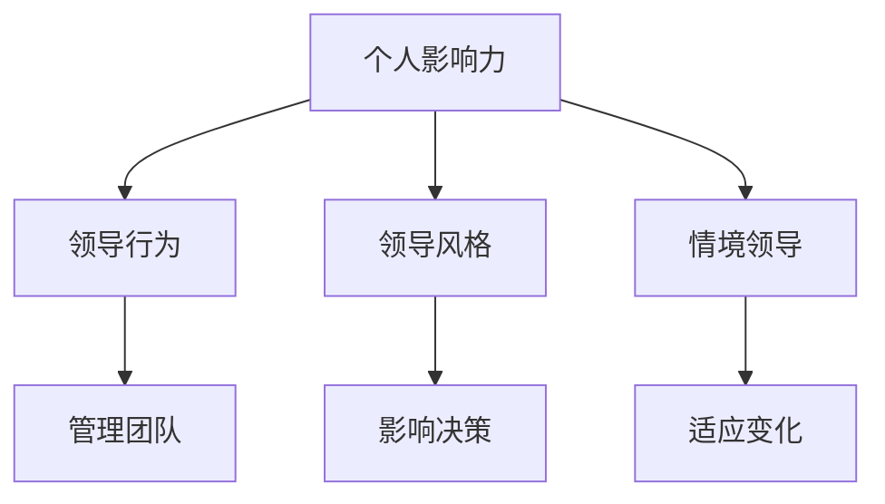
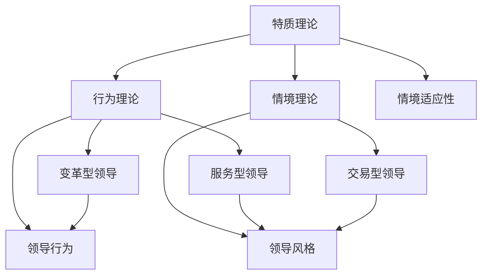
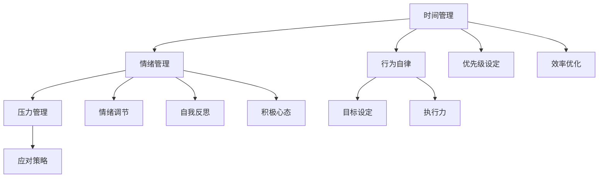
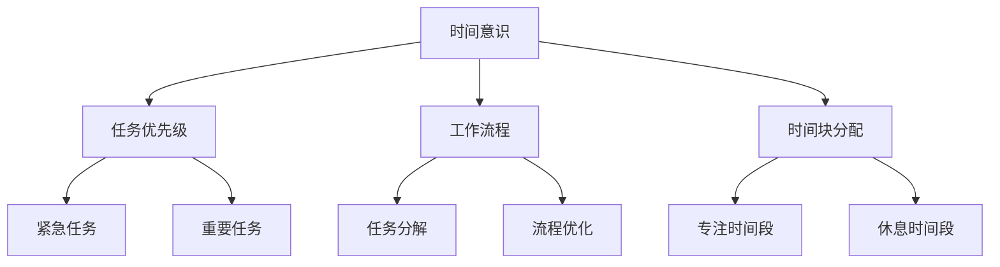
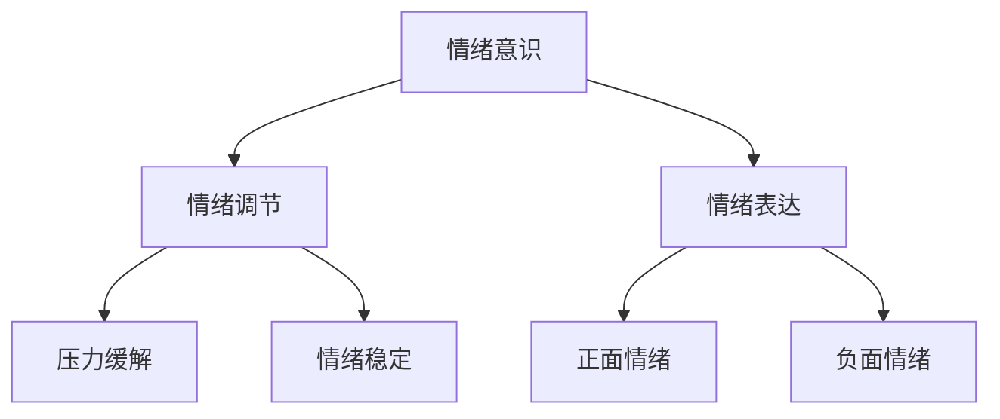
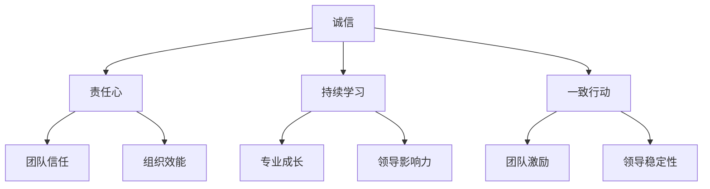
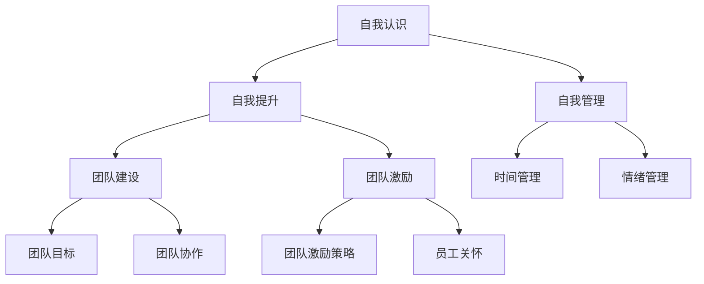
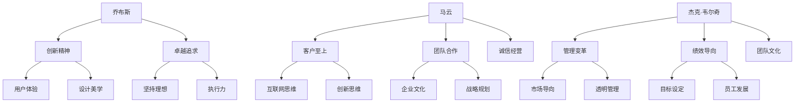
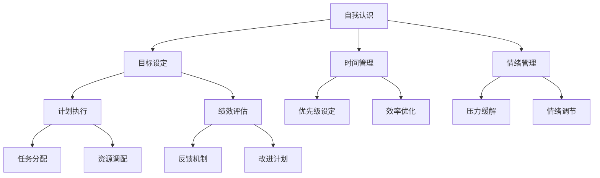

                 


### 文章标题：《领导力与自我管理：以身作则的力量》

#### 关键词：
- 领导力
- 自我管理
- 以身作则
- 组织效能
- 个人成长

#### 摘要：
本文探讨了领导力与自我管理的核心概念，以及二者如何相互影响和结合。通过分析领导力的本质与重要性，以及自我管理的时间管理和情绪管理技巧，本文强调了以身作则的领导力在组织和个人发展中的关键作用。案例分析和实践建议为读者提供了可操作的指导，帮助他们在实际工作中实现领导力与自我管理的有效结合。

### 第一部分：领导力的基础理论

#### 第1章：领导力的本质与重要性

**背景介绍**
领导力是一个组织成功与否的关键因素。在快速变化的市场环境中，领导力不仅是组织管理的重要工具，也是个人职业发展的核心能力。领导力的本质涉及到个人影响力、价值观的传递和团队的协作与激励。

**核心概念与联系**
领导力的核心概念包括：个人影响力、领导行为、领导风格和情境领导。个人影响力是领导力的基础，它依赖于领导者的可信度和尊重度。领导行为和领导风格则决定了领导者如何管理团队和实现目标。情境领导则强调了领导行为应适应不同的情况和团队需求。

**Mermaid 流程图**


**核心算法原理讲解**
在领导力的算法中，我们可以将领导力看作一个多维度的影响网络。每个维度都有其特定的算法和公式来评估和优化领导力。以下是一个简化的伪代码示例：

```plaintext
function LeadershipImpact(personality, teamSpirit, situationalAwareness) {
    trust = calculateTrust(personality, teamSpirit)
    adaptability = calculateAdaptability(situationalAwareness)
    leadershipScore = trust * adaptability
    return leadershipScore
}
```

**数学模型和公式**
领导力可以视为个人影响力和情境适应性的乘积，即：
$$
L = P \times S
$$
其中，\(L\) 表示领导力，\(P\) 表示个人影响力，\(S\) 表示情境适应性。

**详细讲解与举例说明**
个人影响力可以通过以下因素来衡量：道德品质、沟通能力和决策能力。情境适应性则涉及到对团队需求的敏感度和适应变化的能力。例如，一个优秀的领导者可能会在团队面临危机时迅速调整策略，保持团队的稳定和高效。

**项目实战**
在组织内部，领导力可以通过一系列的项目来培养和提升。例如，一个领导力发展项目可能包括领导力培训、团队建设活动和领导力评估。这些项目旨在提高领导者的个人影响力、增强团队的协作能力，并提高组织整体的适应能力。

**最佳实践 tips**
- 定期进行自我反思，以了解自己在领导力方面的优势和不足。
- 与其他领导者交流经验，以获取不同的视角和建议。
- 保持对新技术和新管理理论的关注，以适应快速变化的环境。

**小结、注意事项与拓展阅读**
- 领导力的培养是一个持续的过程，需要不断地学习和实践。
- 组织应提供一个支持领导力发展的环境，包括培训、反馈和成长机会。
- 拓展阅读：《领导力：理论与实践》（作者：保罗·赫塞），该书详细介绍了领导力的多种理论和实践方法。

----------------------------------------------------------------

#### 第2章：领导力模型与理论

**背景介绍**
领导力理论的发展是随着组织管理理论和实践的演变而不断演进的。从早期的特质理论到行为理论，再到情境理论，每一个阶段都为理解领导力提供了新的视角。这些理论不仅帮助我们理解领导力的本质，也为实际应用提供了指导。

**核心概念与联系**
领导力模型包括特质理论、行为理论、情境理论和当代的变革型领导、服务型领导等。特质理论认为领导者天生具有某些特质；行为理论则关注领导者具体的行为；情境理论认为领导行为应适应不同的情境。变革型领导和服务型领导则更注重领导者的激励和价值观的传递。

**Mermaid 流程图**


**核心算法原理讲解**
在分析领导力模型时，我们可以采用决策树模型来理解不同领导力模型的选择和应用。以下是一个简化的伪代码示例：

```plaintext
function ChooseLeadershipModel(context, teamCulture) {
    if (context == "紧急情况") {
        return "情境理论"
    } else if (teamCulture == "创新导向") {
        return "变革型领导"
    } else {
        return "服务型领导"
    }
}
```

**数学模型和公式**
决策树模型可以通过条件概率来表示，即：
$$
P(\text{领导模型}|\text{情境}, \text{团队文化}) = \frac{P(\text{情境}, \text{团队文化}, \text{领导模型})}{P(\text{情境}, \text{团队文化})}
$$

**详细讲解与举例说明**
特质理论认为，领导者具有独特的个人特质，如自信、决断力等。行为理论则关注领导者如何通过具体行为来影响团队。情境理论则强调领导行为应适应不同的情况和团队需求。例如，在紧急情况下，一个领导者可能需要采用更果断的领导风格，而在稳定的环境中，则可能需要更加温和的领导风格。

**项目实战**
在项目管理中，领导力模型的实际应用非常重要。例如，在快速发展的创业公司中，变革型领导可能更为适用，因为这种领导风格能够激励创新和快速适应市场变化。而在成熟的大型企业中，服务型领导可能更为合适，因为它强调团队协作和客户导向。

**最佳实践 tips**
- 了解并评估当前的组织情境和团队文化，以选择最合适的领导力模型。
- 定期评估领导力的效果，并调整领导策略以适应变化。
- 培养多模型领导能力，以便在不同的情境下灵活应用。

**小结、注意事项与拓展阅读**
- 领导力模型并不是一成不变的，应根据实际情况灵活应用。
- 组织应提供多元化的领导力培训，以支持领导者的全面发展。
- 拓展阅读：《领导力模型：从特质到情境》（作者：斯蒂芬·罗宾斯），该书详细探讨了不同领导力模型的理论和应用。

----------------------------------------------------------------

#### 第3章：自我管理的概念与意义

**背景介绍**
自我管理是个人成功和职业发展的关键因素。它不仅关乎时间的有效利用，还涉及到情绪的调节和行为的自律。在快速变化的工作环境中，自我管理能力对于个人和组织的发展都至关重要。

**核心概念与联系**
自我管理包括时间管理、情绪管理和行为自律。时间管理关注如何有效地规划和使用时间，情绪管理关注如何调节情绪，行为自律则涉及如何保持一致的行为和决策。这些要素相互作用，共同构成一个完整的自我管理体系。

**Mermaid 流程图**


**核心算法原理讲解**
自我管理可以通过一系列的算法和策略来实现，以下是一个简化的伪代码示例：

```plaintext
function SelfManagement(plan, emotions, behavior) {
    timeAllocation = TimeManagement(plan)
    stressLevel = EmotionManagement(emotions)
    consistency = BehaviorConsistency(behavior)
    selfReflection = ReflectOnSuccessesAndFailures()
    return (timeAllocation + stressLevel + consistency + selfReflection) / 4
}
```

**数学模型和公式**
自我管理的综合评分可以通过加权平均公式来计算，即：
$$
S = \frac{w_1 \cdot T + w_2 \cdot E + w_3 \cdot C + w_4 \cdot R}{w_1 + w_2 + w_3 + w_4}
$$
其中，\(S\) 表示自我管理评分，\(w_1, w_2, w_3, w_4\) 分别为时间管理、情绪管理、行为自律和自我反思的权重。

**详细讲解与举例说明**
时间管理涉及到如何有效地规划和分配时间，包括设定优先级和优化效率。情绪管理则关注如何调节情绪，以保持积极的心态和应对压力。行为自律涉及到如何保持一致的行为和决策，以实现长期目标。

**项目实战**
在个人职业规划中，自我管理能力是非常重要的。例如，一个软件工程师可能需要通过时间管理来平衡工作与生活，通过情绪管理来应对工作中的压力，并通过行为自律来保持学习和发展。

**最佳实践 tips**
- 制定明确的目标和计划，以提高时间管理的效率。
- 学会情绪调节技巧，如深呼吸、正念练习等。
- 保持自我反思的习惯，以不断优化自我管理能力。

**小结、注意事项与拓展阅读**
- 自我管理是一个持续的过程，需要不断地学习和实践。
- 个人和组织都应提供支持自我管理的环境和资源。
- 拓展阅读：《自我管理：个人成长的秘密》（作者：斯蒂芬·柯维），该书详细介绍了自我管理的多种方法和技巧。

----------------------------------------------------------------

#### 第4章：时间管理

**背景介绍**
时间管理是自我管理的重要组成部分，它直接影响个人的工作效率和生活质量。在现代快节奏的工作环境中，有效地管理时间不仅有助于提高工作效率，还能减少压力，提升生活质量。

**核心概念与联系**
时间管理涉及多个核心概念，包括时间意识、任务优先级、工作流程和时间块分配。时间意识是指对时间的敏感度和对时间价值的认知。任务优先级涉及到如何根据任务的紧急程度和重要性来安排工作。工作流程则关注如何优化工作流程，以提高效率。时间块分配是指将时间分为不同的时间段，并为每个时间段分配特定的任务。

**Mermaid 流程图**


**核心算法原理讲解**
在时间管理中，我们可以使用调度算法来优化任务安排。以下是一个简化的伪代码示例：

```plaintext
function TimeManagement(tasks, deadlines) {
    sortedTasks = SortByPriorityAndDeadline(tasks, deadlines)
    timeSlots = AllocateTimeSlots(sortedTasks)
    executeTasks(sortedTasks, timeSlots)
}
```

**数学模型和公式**
时间管理的优化可以通过线性规划模型来实现，即：
$$
\max \quad Z = \sum_{i=1}^{n} p_i \cdot x_i
$$
$$
\text{s.t.} \quad a_{ij} \cdot x_j \leq b_i \quad \forall i
$$
其中，\(p_i\) 表示任务\(i\) 的优先级，\(x_i\) 表示任务\(i\) 的执行情况，\(a_{ij}\) 和\(b_i\) 分别表示任务\(i\) 在时间段\(j\) 的资源和约束。

**详细讲解与举例说明**
时间意识要求个人对时间的价值有深刻的认知，并能够有效地管理时间。任务优先级涉及如何根据任务的紧急程度和重要性来安排工作。例如，一个紧急且重要的任务应优先处理，而一个非紧急但重要的任务则可以稍后处理。工作流程优化则涉及到如何通过优化工作流程来减少不必要的步骤和浪费时间的行为。时间块分配则可以帮助个人将时间划分为不同的时间段，并为每个时间段分配特定的任务，以提高专注度和效率。

**项目实战**
在软件开发项目中，时间管理是非常重要的。例如，开发团队可以通过敏捷开发方法来管理项目进度，将工作分为多个迭代周期，并在每个周期内优先处理高优先级的任务。通过时间块分配，团队成员可以更好地规划自己的工作时间，提高工作效率。

**最佳实践 tips**
- 使用日历和任务管理工具来规划时间和任务。
- 定期审查和调整时间管理计划，以确保其适应变化。
- 为每个任务设定明确的截止日期和优先级。

**小结、注意事项与拓展阅读**
- 时间管理是一个持续的过程，需要不断地优化和调整。
- 个人和组织都应提供支持时间管理的工具和环境。
- 拓展阅读：《时间管理：如何高效利用你的24小时》（作者：戴维·艾伦），该书详细介绍了时间管理的多种方法和技巧。

----------------------------------------------------------------

#### 第5章：情绪管理

**背景介绍**
情绪管理是自我管理的关键组成部分，它对个人的心理健康、人际关系和工作表现都有深远的影响。在快节奏和高压的工作环境中，有效地管理情绪对于保持工作热情和提升工作效率至关重要。

**核心概念与联系**
情绪管理包括情绪意识、情绪调节和情绪表达。情绪意识是指对自身情绪的察觉和理解，情绪调节是指通过策略来控制和管理情绪，情绪表达则是指以健康的方式表达情绪。这些概念相互关联，共同构成了一个完整的情绪管理体系。

**Mermaid 流程图**


**核心算法原理讲解**
情绪管理可以通过认知行为疗法（CBT）的算法来实现。以下是一个简化的伪代码示例：

```plaintext
function EmotionManagement(emotion, situation) {
    perceivedSituation = AnalyzeSituation(situation)
    if (emotion != "积极") {
        alternativeThoughts = GenerateAlternativeThoughts(perceivedSituation)
        emotion = UpdateEmotion(alternativeThoughts)
    }
    return emotion
}
```

**数学模型和公式**
情绪调节可以通过情绪平衡模型来实现，即：
$$
\text{情绪平衡} = \frac{\text{积极情绪} + \text{中性情绪}}{\text{积极情绪} + \text{中性情绪} + \text{负面情绪}}
$$

**详细讲解与举例说明**
情绪意识要求个人能够识别和理解自己的情绪，例如，感到愤怒、焦虑或快乐。情绪调节则涉及到如何通过认知重构、放松技巧和积极思维来调整和管理这些情绪。例如，当一个人感到焦虑时，可以通过深呼吸和正面思维来缓解焦虑。情绪表达则要求个人能够以健康的方式表达情绪，而不是压抑或爆发。

**项目实战**
在项目管理中，情绪管理可以帮助团队成员更好地应对压力和挑战。例如，项目管理者可以定期进行团队情绪检查，了解团队成员的情绪状态，并提供必要的支持和资源。通过情绪管理，团队可以更好地协作，提高项目的成功率。

**最佳实践 tips**
- 定期进行情绪检查，了解自己的情绪状态。
- 学习放松技巧，如深呼吸、冥想和瑜伽。
- 保持积极的人际关系，与他人分享情绪和压力。

**小结、注意事项与拓展阅读**
- 情绪管理是一个需要持续学习和实践的过程。
- 个人和组织都应提供情绪管理的支持和资源。
- 拓展阅读：《情绪智力：为什么情商比智商更重要》（作者：丹尼尔·戈尔曼），该书详细介绍了情绪智力的重要性及其应用。

----------------------------------------------------------------

### 第三部分：以身作则的力量

#### 第6章：以身作则的领导力

**背景介绍**
以身作则的领导力是一种重要的领导风格，它强调领导者通过自身的行为和价值观来影响和激励团队成员。这种领导风格不仅有助于建立信任和尊重，还能提升团队的凝聚力和工作效率。

**核心概念与联系**
以身作则的领导力包括诚信、责任心、持续学习和一致行动。诚信是指领导者言行一致，言行正直；责任心是指领导者对自己的工作和团队成员负责；持续学习是指领导者不断学习和进步，以保持专业竞争力；一致行动是指领导者通过一致的行为和决策来引领团队。

**Mermaid 流程图**


**核心算法原理讲解**
以身作则的领导力可以通过以下几个步骤来实现：

```plaintext
function LeadByExample(leaderBehavior, teamExpectations) {
    SetExample(leaderBehavior)
    MonitorBehavior(teamExpectations)
    AdjustBehaviorAsNecessary()
    FosterTeamFeedback()
}
```

**数学模型和公式**
以身作则的领导力可以通过以下综合评分公式来衡量：
$$
E = \frac{E_c + E_r + E_l + E_a}{4}
$$
其中，\(E_c, E_r, E_l, E_a\) 分别代表诚信、责任心、持续学习和一致行动的得分。

**详细讲解与举例说明**
诚信是领导者以身作则的核心，它要求领导者做到言行一致，诚信透明。例如，一个领导者如果承诺改进团队的工作环境，那么他应该亲自参与并监督这一过程的实施。责任心则要求领导者对自己的决策和行动承担责任，无论结果如何。持续学习强调领导者需要不断更新知识和技能，以适应不断变化的环境。一致行动则要求领导者的决策和行为要与团队的期望相一致。

**项目实战**
在一个软件开发项目中，领导者可以通过以下方式以身作则：首先，领导者在项目规划阶段积极参与，确保团队成员理解项目的目标和期望；其次，领导者亲自编码或解决问题，以展示技术能力；最后，领导者通过定期的团队会议，了解团队成员的进展和困难，并提供支持。

**最佳实践 tips**
- 保持诚信，确保自己的行为和言论一致。
- 建立责任机制，对团队和组织负责。
- 不断学习新知识，保持专业竞争力。
- 保持一致行动，确保团队的期望和实际一致。

**小结、注意事项与拓展阅读**
- 以身作则的领导力是建立信任和尊重的关键。
- 个人和组织都应重视领导者的行为示范作用。
- 拓展阅读：《领导力：从优秀到卓越》（作者：约翰·柯特），该书详细介绍了以身作则的领导力及其应用。

----------------------------------------------------------------

#### 第7章：自我领导与团队管理

**背景介绍**
自我领导和团队管理是现代领导者的核心能力。自我领导强调领导者对自己的管理和提升，而团队管理则涉及到如何有效地管理和激励团队成员。这两者相辅相成，共同构成了领导者成功的关键要素。

**核心概念与联系**
自我领导包括自我认识、自我提升和自我管理。自我认识涉及领导者对自己的了解和认知；自我提升涉及领导者的学习和成长；自我管理则涉及领导者如何管理自己的时间和情绪。团队管理包括团队建设、团队激励和团队目标设定。这些概念相互关联，共同构成了自我领导和团队管理的基础。

**Mermaid 流程图**


**核心算法原理讲解**
自我领导和团队管理可以通过以下几个步骤来实现：

```plaintext
function SelfLeadAndTeamManage(leaderSkills, teamGoals) {
    SelfAwareness(leaderSkills)
    ContinuousLearning(leaderSkills)
    SelfManagement(time, emotions)
    TeamBuilding(teamGoals)
    TeamMotivation(teamGoals)
    PerformanceFeedback()
}
```

**数学模型和公式**
自我领导和团队管理的综合评分可以通过以下公式来衡量：
$$
S = \frac{S_a + S_l + S_m + S_t + S_g}{5}
$$
其中，\(S_a, S_l, S_m, S_t, S_g\) 分别代表自我领导、学习、管理、团队建设和团队目标的得分。

**详细讲解与举例说明**
自我认识是领导者自我领导的第一步，它要求领导者了解自己的优点和不足。自我提升则要求领导者不断学习和成长，以提升自身的领导能力。自我管理则涉及到如何有效地管理自己的时间和情绪，以保持高效和积极。团队建设关注如何建立和维护一个高效的团队，团队激励则涉及到如何激励团队成员，实现团队目标。

**项目实战**
在一个软件开发项目中，自我领导和团队管理可以通过以下方式实现：首先，领导者进行自我认识，了解自己的技能和知识缺口；其次，领导者通过参加培训和学习新技能来提升自我。同时，领导者通过定期的团队会议和反馈机制来管理团队，确保团队目标的实现。

**最佳实践 tips**
- 定期进行自我反思，以了解自己的成长和改进方向。
- 建立明确的团队目标和计划，以确保团队的协同工作。
- 培养团队成员之间的信任和协作，以提升团队效能。

**小结、注意事项与拓展阅读**
- 自我领导和团队管理是领导者成功的关键要素。
- 个人和组织都应提供支持和资源，以帮助领导者提升自我和团队管理能力。
- 拓展阅读：《团队管理：从优秀到卓越》（作者：约翰·麦斯威尔），该书详细介绍了团队管理的理论和实践方法。

----------------------------------------------------------------

### 第四部分：案例分析

#### 第8章：成功领导者的以身作则实践

**背景介绍**
成功领导者通过以身作则的领导力在组织和个人发展方面取得了显著的成就。本章将探讨几位著名领导者的以身作则实践，包括乔布斯、马云和杰克·韦尔奇，分析他们的领导风格、核心价值观以及实践效果。

**核心概念与联系**
以身作则的领导力涉及诚信、责任感、持续学习和一致行动。这些要素在乔布斯、马云和杰克·韦尔奇的领导实践中得到了充分体现。他们的领导风格不仅影响了组织文化，也塑造了团队成员的行为和价值观。

**Mermaid 流程图**


**核心算法原理讲解**
以身作则的领导力可以通过以下几个步骤来实现：

```plaintext
function SuccessfulLeadership(model, values, context) {
    SetExample(model)
    CommunicateValues(values)
    AdaptToContext(context)
    FosterCulturalAlignment()
}
```

**数学模型和公式**
以身作则的领导力效果可以通过以下综合评分公式来衡量：
$$
E = \frac{E_m + E_c + E_a + E_t}{4}
$$
其中，\(E_m, E_c, E_a, E_t\) 分别代表模型实践、价值观传递、适应能力和文化契合度的得分。

**详细讲解与举例说明**
乔布斯以其创新精神和卓越追求著称，他通过设计美学和用户体验，将苹果公司打造成全球科技巨头。马云强调客户至上和团队合作，通过互联网思维和创新思维，推动了阿里巴巴的快速发展。杰克·韦尔奇则通过管理变革和绩效导向，带领通用电气实现了前所未有的增长。

**项目实战**
在一个初创科技公司的案例中，领导者通过以身作则，激励团队追求创新和卓越。领导者亲自参与产品开发，坚持用户导向，并通过定期团队会议和透明管理，建立了信任和协作的文化。

**最佳实践 tips**
- 学习成功领导者的实践案例，结合自身组织特点进行应用。
- 建立明确的价值观和目标，确保团队成员的认同和追随。
- 保持对行业趋势和技术的敏感性，以适应快速变化的环境。

**小结、注意事项与拓展阅读**
- 身教胜于言传，以身作则的领导力是组织成功的关键。
- 个人和组织都应重视领导者的行为示范作用。
- 拓展阅读：《领导者的挑战》（作者：彼得·德鲁克），该书详细介绍了领导者如何通过以身作则实现组织目标。

----------------------------------------------------------------

### 第五部分：领导力与自我管理的实践建议

#### 第9章：领导力与自我管理的实践路径

**背景介绍**
领导力与自我管理不仅是理论上的概念，更需要在实际工作中得到有效应用。本章将探讨如何通过具体的实践路径，将领导力和自我管理理论转化为实际行动，以提升个人和组织效能。

**核心概念与联系**
实践路径涉及自我认识、目标设定、时间管理、情绪管理、团队建设和领导实践。这些概念相互联系，共同构成了一个完整的领导力与自我管理实践体系。

**Mermaid 流程图**


**核心算法原理讲解**
领导力与自我管理的实践路径可以通过以下几个步骤来实现：

```plaintext
function LeadershipAndSelfManagementPractices(knowledge, skills, environment) {
    SelfAwareness(knowledge)
    GoalSetting(knowledge, skills)
    TimeManagement(skills, environment)
    EmotionManagement(skills, environment)
    TeamBuilding(knowledge, skills)
    LeadershipPractice(knowledge, skills, environment)
}
```

**数学模型和公式**
实践路径的综合效果可以通过以下公式来衡量：
$$
P = \frac{P_s + P_t + P_e + P_l}{4}
$$
其中，\(P_s, P_t, P_e, P_l\) 分别代表自我认识、目标设定、时间管理和领导实践的得分。

**详细讲解与举例说明**
自我认识是实践的第一步，它要求领导者了解自己的优点和不足，明确自己的职业目标和价值观。目标设定则要求领导者根据自我认识，设定明确的短期和长期目标。时间管理涉及如何高效地规划和使用时间，以实现目标。情绪管理则关注如何调节情绪，以保持积极和稳定的心态。团队建设强调如何建立和维护一个高效协作的团队。领导实践则涉及到如何通过具体行动，如决策、沟通和激励，来提升团队的绩效。

**项目实战**
在一个跨国公司的案例中，领导者通过以下实践路径，提升了组织的整体效能：首先，领导者通过自我反思和反馈，明确了组织的战略目标和愿景；其次，领导者制定了详细的时间管理计划，确保关键任务的按时完成；然后，领导者通过情绪管理技巧，缓解了团队成员的压力，并建立了积极的团队氛围；最后，领导者通过团队建设和领导实践，激励团队成员，实现了组织目标的达成。

**最佳实践 tips**
- 建立自我反思和反馈机制，以持续提升自我认识和目标设定。
- 采用时间管理工具和方法，优化任务分配和资源调配。
- 定期进行情绪检查，并应用情绪管理技巧，以保持积极和稳定的心态。
- 建立高效的团队，通过明确的沟通和激励，提升团队协作和绩效。

**小结、注意事项与拓展阅读**
- 实践是检验理论的唯一标准，领导力与自我管理需要通过具体行动来验证。
- 个人和组织都应提供支持和资源，以帮助领导者实现实践目标。
- 拓展阅读：《实践领导力：理论到行动》（作者：约翰·P·科特），该书详细介绍了领导力实践的理论和方法。

----------------------------------------------------------------

### 附录

#### 附录A：领导力与自我管理资源推荐

**推荐书籍**
- 《领导力：从优秀到卓越》（作者：约翰·P·科特）
- 《自我管理：个人成长的秘密》（作者：斯蒂芬·柯维）
- 《情绪智力：为什么情商比智商更重要》（作者：丹尼尔·戈尔曼）

**推荐课程**
- “领导力发展课程” - Coursera
- “时间管理与个人效率” - Udemy
- “情绪智力与自我管理” - LinkedIn Learning

**推荐工具**
- Trello：任务管理和时间规划工具
- Asana：团队协作与项目跟踪工具
- Google Calendar：日程安排和提醒工具

**小结、注意事项与拓展阅读**
- 资源推荐旨在帮助读者深入理解和实践领导力与自我管理。
- 个人和组织应根据实际情况选择合适的资源进行学习和应用。
- 注意事项包括定期复习和应用所学知识，以及不断调整和优化实践方法。
- 拓展阅读建议读者深入研究相关领域，以进一步提升领导力和自我管理能力。

