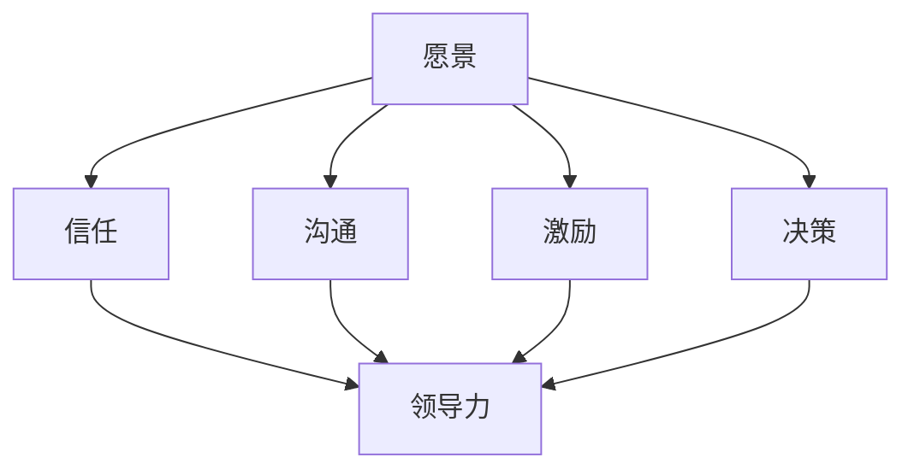
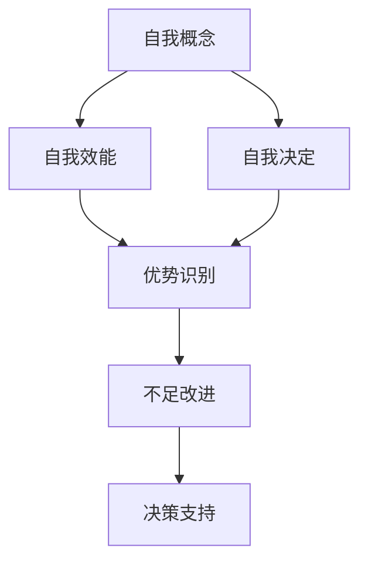

                 

## 文章标题

### 领导力与自我认知：了解自己的优势与不足

## 关键词

- **领导力**
- **自我认知**
- **优势分析**
- **不足改进**
- **领导发展**

## 摘要

本文旨在探讨领导力与自我认知之间的关系，通过深入分析领导者的优势与不足，帮助读者更好地了解自己，提升领导能力。文章首先介绍了领导力的基本概念和核心要素，然后阐述了自我认知的重要性及其理论基础。接着，文章详细讨论了如何识别和利用个人的优势，以及如何发现和改进不足。最后，文章通过实际案例分析和最佳实践建议，为读者提供了具体可行的提升路径。

## 第一部分：领导力基础理论

### 第1章：领导力的定义与核心要素

领导力是一种能力，它涉及到如何激励、引导和影响他人，以实现共同的目标。本章节将介绍领导力的基本定义，探讨其核心要素，并分析领导力与管理的区别。

#### 1.1 领导力的概念与历史演变

领导力的概念在不同的历史时期有着不同的理解。传统的领导力理论强调领导者的权威和控制能力。然而，随着时代的发展，领导力逐渐演变为一种更加注重协作和影响力的人际技能。

- **权威型领导**：强调领导者的权威和控制能力。
- **变革型领导**：注重领导者的创新和变革能力。
- **服务型领导**：强调领导者的服务意识和团队建设。

#### 1.2 领导力的核心要素

领导力的核心要素包括：

- **愿景**：领导者对未来的清晰描绘和目标设定。
- **信任**：领导者与团队成员之间的信任关系。
- **沟通**：领导者有效的信息传递和反馈能力。
- **激励**：领导者如何激励团队成员发挥潜力。
- **决策**：领导者如何做出明智的决策。

#### 1.3 领导力与管理的区别

领导力与管理的区别在于其焦点和目标。管理侧重于组织的日常运营和任务分配，而领导力则更关注组织的愿景、文化和长期发展。

- **管理**：关注效率和流程。
- **领导力**：关注创新和变革。

### Mermaid 流程图：领导力核心要素关系架构

## 第二部分：自我认知理论

### 第2章：自我认知的重要性

自我认知是指个体对自己的认识和理解。自我认知的重要性在于它有助于领导者识别自己的优势和不足，从而更好地发挥领导力。

#### 2.1 自我认知的定义

自我认知包括以下几个方面：

- **自我概念**：个体对自己的总体看法和评价。
- **自我效能**：个体对自己完成特定任务的信心。
- **自我决定**：个体在决策过程中自主选择的能力。

#### 2.2 自我认知的作用

自我认知在领导力中的作用包括：

- **优势识别**：领导者通过自我认知识别自己的优势，从而更好地利用这些优势。
- **不足改进**：领导者通过自我认知识别自己的不足，从而制定改进计划。
- **决策支持**：领导者通过自我认知评估自己的决策风格和偏好，从而做出更明智的决策。

#### 2.3 自我认知的挑战

自我认知的挑战在于：

- **偏见**：个体往往存在自我偏见，难以客观地评价自己。
- **变化**：自我认知是一个动态的过程，随着时间的推移和情境的变化而变化。

### Mermaid 流程图：自我认知的核心概念关系架构

## 第三部分：优势与不足分析

### 第3章：优势识别与利用

#### 3.1 优势识别的方法

优势识别的方法包括：

- **自我反思**：领导者通过反思自己的行为和成就，识别自己的优势。
- **他人反馈**：领导者通过他人的反馈，了解自己的优势。
- **专业评估**：领导者通过专业的评估工具，如能力测试和性格测试，识别自己的优势。

#### 3.2 优势发展的策略

优势发展的策略包括：

- **持续学习**：领导者通过不断学习，提升自己的优势。
- **实践应用**：领导者通过实践应用，巩固和强化自己的优势。
- **团队合作**：领导者通过与团队成员的合作，发挥和扩展自己的优势。

#### 3.3 优势在实际工作中的运用

优势在实际工作中的运用包括：

- **决策**：领导者利用自己的优势，做出更明智的决策。
- **沟通**：领导者利用自己的优势，提高沟通效果。
- **团队建设**：领导者利用自己的优势，促进团队的发展和合作。

### 第4章：不足识别与改进

#### 4.1 不足识别的挑战

不足识别的挑战包括：

- **否认**：领导者可能不愿意承认自己的不足。
- **偏见**：领导者可能存在自我偏见，难以客观地识别自己的不足。

#### 4.2 不足改进的策略

不足改进的策略包括：

- **自我反思**：领导者通过反思自己的行为和结果，识别自己的不足。
- **他人反馈**：领导者通过他人的反馈，了解自己的不足。
- **专业培训**：领导者通过专业培训，改进自己的不足。
- **实践应用**：领导者通过实践应用，巩固和改善自己的不足。

#### 4.3 不足对领导力的影响

不足对领导力的影响包括：

- **决策**：不足可能影响领导者的决策质量和效率。
- **沟通**：不足可能影响领导者的沟通效果和团队关系。
- **团队建设**：不足可能影响领导者的团队建设和团队氛围。

## 第四部分：实践指导

### 第5章：自我认知与领导力的提升

#### 5.1 自我认知提升的实践方法

自我认知提升的实践方法包括：

- **定期反思**：领导者定期反思自己的行为和结果，提升自我认知。
- **寻求反馈**：领导者主动寻求他人的反馈，提升自我认知。
- **专业咨询**：领导者寻求专业咨询，提升自我认知。

#### 5.2 领导力提升的实践方法

领导力提升的实践方法包括：

- **领导力培训**：领导者参加领导力培训，提升领导能力。
- **角色扮演**：领导者通过角色扮演，提升领导力。
- **实践应用**：领导者通过实践应用，提升领导力。

#### 5.3 综合提升策略

综合提升策略包括：

- **持续学习**：领导者持续学习，提升自我认知和领导力。
- **团队合作**：领导者通过团队合作，提升领导力和团队效能。
- **领导实践**：领导者通过领导实践，提升领导能力和自我认知。

### 第6章：案例分析

#### 6.1 成功领导者的案例分析

通过分析成功领导者的案例，可以了解他们如何通过自我认知和优势利用，提升领导力。

- **案例一**：某科技公司的CEO通过自我认知和优势识别，成功地推动了公司创新和变革。
- **案例二**：某非营利组织的负责人通过自我反思和他人反馈，提升了领导力和团队凝聚力。

#### 6.2 失败领导者的案例分析

通过分析失败领导者的案例，可以了解他们如何因为自我认知不足或优势利用不当而导致领导力失败。

- **案例一**：某公司的CEO因为无法识别和改进自己的不足，导致公司业绩下滑。
- **案例二**：某非营利组织的负责人因为过于依赖自己的优势，忽视了他人的意见，导致团队分裂。

#### 6.3 案例启示与应用

案例启示和应用包括：

- **自我认知**：领导者需要定期进行自我认知，识别自己的优势和不足。
- **优势利用**：领导者需要合理利用自己的优势，避免过度依赖。
- **团队合作**：领导者需要通过团队合作，提升领导力和团队效能。

## 附录

### 附录A：领导力与自我认知评估工具

- **自我认知评估工具**：如MBTI、DISC等。
- **领导力评估工具**：如LPI、360度评估等。

### 附录B：推荐阅读与参考资料

- **领导力相关书籍**：《领导力的五个层次》、《影响力》等。
- **自我认知相关书籍**：《自我认知的力量》、《如何赢得朋友与影响他人》等。
- **学术论文与研究报告**：关于领导力与自我认知的最新研究。

## 作者信息

作者：AI天才研究院/AI Genius Institute & 禅与计算机程序设计艺术 /Zen And The Art of Computer Programming

**全文结束。**

