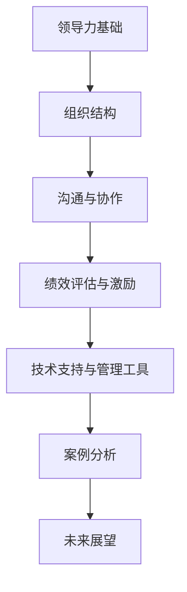

                 

```markdown
# 《领导力与远程管理：适应新型工作模式》

> 关键词：领导力、远程管理、组织结构、沟通、绩效评估、技术支持

> 摘要：随着远程工作的兴起，领导力与远程管理成为企业关注的焦点。本文从领导力基础、远程管理组织结构、沟通与协作、绩效评估与激励、技术支持与管理工具以及案例分析等方面，深入探讨如何适应新型工作模式，提升远程管理的效率与效果。

----------------------------------------------------------------

## 引言：远程管理的背景与挑战

随着信息技术的飞速发展，远程工作已经成为现代企业中不可或缺的一部分。远程管理作为一种新型工作模式，不仅为企业提供了更多的人才选择，还提升了员工的灵活性和工作效率。然而，远程管理也面临一系列挑战，如沟通障碍、团队合作困难、绩效评估不准确等。

本文将围绕领导力与远程管理这一主题，从以下几个方面展开讨论：

1. 领导力基础
2. 远程管理的组织结构
3. 沟通与协作
4. 绩效评估与激励
5. 技术支持与管理工具
6. 案例分析
7. 未来展望：远程管理的发展趋势

通过以上讨论，希望为读者提供有益的启示，帮助企业在新型工作模式下实现高效的远程管理。

----------------------------------------------------------------

### 目录大纲设计方案

为了设计出《领导力与远程管理：适应新型工作模式》的完整目录大纲，我们将遵循以下步骤：

1. **核心概念与联系**
   - 设计1-2个Mermaid流程图，用于描述远程管理的关键概念和它们之间的联系，例如远程管理的组织结构、沟通流程和技术支持。

2. **核心算法原理讲解**
   - 为关键章节编写伪代码，例如远程管理的决策算法、绩效评估方法等。

3. **数学模型和数学公式**
   - 针对领导力模型中的关键数学公式，使用LaTeX格式进行表示，并提供详细讲解和实例说明。

4. **项目实战**
   - 提供一个远程管理项目的实际案例，详细解释项目的开发环境搭建、代码实现和解读。

5. **大纲结构设计**
   - 确定整体章节结构，将大纲细分为1,2,3级目录，确保内容完整且逻辑清晰。

### 目录大纲

```
# 《领导力与远程管理：适应新型工作模式》目录大纲

## 第1章 引言：远程管理的背景与挑战
### 1.1 远程管理的兴起
### 1.2 远程管理面临的挑战
### 1.3 书籍结构概述

## 第2章 领导力基础
### 2.1 领导力的定义与理论
### 2.2 领导力的关键要素
### 2.3 领导力模型与框架

## 第3章 远程管理的组织结构
### 3.1 远程组织的特点
### 3.2 远程团队的构建
### 3.3 远程组织的领导力要求

## 第4章 沟通与协作
### 4.1 远程沟通的挑战
### 4.2 远程沟通的策略
### 4.3 协作工具与技术

## 第5章 绩效评估与激励
### 5.1 远程绩效评估的挑战
### 5.2 绩效评估方法
### 5.3 激励策略与远程工作环境

## 第6章 技术支持与管理工具
### 6.1 远程管理工具的选择
### 6.2 技术支持的构建
### 6.3 技术支持的优化

## 第7章 案例分析
### 7.1 案例一：远程团队的成功管理
### 7.2 案例二：远程管理的失败教训
### 7.3 案例分析与启示

## 第8章 未来展望：远程管理的发展趋势
### 8.1 远程管理的未来发展
### 8.2 新型工作模式下的领导力挑战
### 8.3 持续改进与适应

## 参考文献

## 附录
```

### Mermaid 流程图



### 伪代码示例

```python
# 伪代码：远程团队决策算法
def remote_decisionmaking(team_members, project_requirements):
    # 初始化决策变量
    decision = None
    highest_score = 0
    
    # 对每个团队成员评估
    for member in team_members:
        score = evaluate_member(member, project_requirements)
        if score > highest_score:
            highest_score = score
            decision = member
            
    return decision

# 伪代码：评估团队成员
def evaluate_member(member, project_requirements):
    # 计算成员得分
    score = 0
    
    # 对成员的专业技能进行评分
    score += member.skill_level * 0.5
    
    # 对成员的远程工作效率进行评分
    score += member.remote_productivity * 0.3
    
    # 对成员的团队合作能力进行评分
    score += member.teamwork_ability * 0.2
    
    return score
```

### LaTeX 数学公式示例

```markdown
## 领导力模型中的关键数学公式

在领导力模型中，绩效评估的一个重要组成部分是基于团队成员的贡献值进行计算。以下是一个关键的数学公式：

$$
绩效得分 = w_1 \times 专业技能得分 + w_2 \times 远程工作效率得分 + w_3 \times 团队合作能力得分
$$

其中，$w_1, w_2, w_3$ 分别代表各个评价维度的权重。

----------------------------------------------------------------

### 第1章 引言：远程管理的背景与挑战

远程管理作为现代企业管理的一种新兴模式，其背景可以追溯到信息技术和互联网的飞速发展。随着云计算、大数据、人工智能等技术的不断进步，人们的工作方式也发生了翻天覆地的变化。远程工作不再是一个简单的趋势，而已经成为企业运营的重要组成部分。

#### 1.1 远程管理的兴起

远程管理的兴起主要源于以下几个因素：

1. **劳动力市场的变化**：全球化进程加速，企业需要招聘来自世界各地的优秀人才。远程工作使得企业可以跨越地域限制，吸引更多的人才。

2. **员工需求的转变**：现代员工越来越重视工作与生活的平衡，远程工作提供了一个更好的选择，有助于提高员工的工作满意度和忠诚度。

3. **生产力的提升**：研究表明，远程工作可以提高员工的生产力。在没有办公室干扰的情况下，员工可以更专注于自己的工作，从而提高工作效率。

4. **技术支持的成熟**：随着信息技术的不断发展，远程工作的技术支持日益成熟。企业可以轻松地实现远程沟通、协作和监控，为远程管理提供了坚实的基础。

#### 1.2 远程管理面临的挑战

尽管远程管理带来了诸多优势，但同时也面临一系列挑战：

1. **沟通障碍**：远程工作使得团队成员之间的沟通变得更加困难。缺乏面对面的交流可能导致信息传递不畅，影响团队的协作效率。

2. **团队合作困难**：远程团队往往面临团队合作的问题。团队成员之间缺乏互动和信任，可能导致项目进展缓慢。

3. **绩效评估不准确**：在远程工作环境中，如何准确评估员工的绩效成为一大难题。传统的工作指标可能无法完全反映远程员工的真实表现。

4. **管理难度增加**：远程管理需要管理者具备更高的管理技能和沟通能力。管理者需要更加关注团队成员的需求，提供有效的支持。

#### 1.3 书籍结构概述

本书将从以下几个方面对远程管理进行深入探讨：

1. **领导力基础**：介绍领导力的定义、理论以及关键要素，为远程管理提供理论基础。
2. **远程管理的组织结构**：探讨远程组织的特点、构建方法以及领导力要求。
3. **沟通与协作**：分析远程沟通的挑战和策略，介绍协作工具与技术。
4. **绩效评估与激励**：讨论远程绩效评估的挑战和策略，提出有效的激励措施。
5. **技术支持与管理工具**：介绍远程管理工具的选择、技术支持的构建以及优化方法。
6. **案例分析**：通过实际案例，分析远程管理的成功经验和教训。
7. **未来展望**：探讨远程管理的未来发展，以及新型工作模式下的领导力挑战。

通过以上内容，本书旨在为企业和远程管理者提供有价值的指导，帮助他们在新型工作模式下实现高效的远程管理。

----------------------------------------------------------------

### 第2章 领导力基础

领导力是远程管理中的核心要素，它不仅影响团队的整体表现，还关系到员工的满意度和忠诚度。要有效地进行远程管理，首先需要了解领导力的定义、理论以及关键要素。

#### 2.1 领导力的定义与理论

领导力是指一种影响他人共同实现目标的能力。它不仅包括领导者的个人特质，还涉及领导者在组织中的角色和职责。关于领导力的理论有很多，以下是几种常见的理论：

1. **特质理论**：特质理论认为，领导者具有某些特定的个性特质，如自信、决断力、社交能力等。这些特质使他们能够影响他人并取得成功。

2. **行为理论**：行为理论关注领导者的行为模式，认为领导者通过特定的行为来影响团队。这种理论强调领导者应该如何行动，而不是他们是谁。

3. **情境理论**：情境理论认为，领导力取决于领导者所处的具体情境。领导者需要根据不同的情境调整自己的领导风格，以达到最佳效果。

4. **变革型领导理论**：变革型领导理论强调领导者通过激励和启发团队成员，推动组织变革和创新。这种领导风格有助于激发员工的潜力和创造力。

#### 2.2 领导力的关键要素

领导力的关键要素包括以下几个方面：

1. **愿景与目标**：领导者需要具备清晰的愿景和目标，并能够将这些目标传达给团队成员。愿景和目标为团队提供了方向和动力，有助于统一团队的努力。

2. **沟通能力**：沟通是领导力的核心要素之一。领导者需要具备良好的沟通能力，包括倾听、表达和反馈等。有效的沟通有助于建立信任，提高团队的协作效率。

3. **决策能力**：领导者需要在复杂和不确定的环境中做出明智的决策。决策能力包括信息收集、分析判断和行动选择等。领导者需要具备快速反应和灵活调整的能力。

4. **激励能力**：领导者需要能够激发团队成员的潜力，提供适当的激励措施。激励能力包括认可与赞赏、提供成长机会和激励奖金等。

5. **变革能力**：在快速变化的商业环境中，领导者需要具备变革能力，推动组织适应新的挑战和机遇。变革能力包括创新思维、接受新观念和引领变革等。

#### 2.3 领导力模型与框架

为了更好地理解和应用领导力，可以引入一些领导力模型和框架。以下是一些常见的领导力模型：

1. **费德勒模型**：费德勒模型是一种情境领导模型，认为领导者的效果取决于领导者与下属之间的关系以及工作环境。根据领导者与下属的关系和工作环境的稳定性，模型将领导风格分为四种：任务导向型、关系导向型、低结构型和高压型。

2. **赫赛-布兰查德领导模型**：赫赛-布兰查德领导模型认为，领导者的效果取决于下属的成熟度。下属的成熟度分为依赖型、监督型、参与型和自主型。领导者需要根据下属的成熟度调整自己的领导风格，以实现最佳效果。

3. **变革型领导模型**：变革型领导模型强调领导者通过激励和启发团队成员，推动组织变革和创新。变革型领导者具有以下特征：愿景型、鼓舞型、支持型、挑战型和创新型。

通过以上领导力模型和框架，领导者可以更好地理解自己的领导风格，并根据实际情况进行调整，以实现高效远程管理。

----------------------------------------------------------------

### 第3章 远程管理的组织结构

远程管理的关键在于建立一个有效的组织结构，以确保团队成员之间的协作和信息流通。了解远程组织的特点、构建方法和领导力要求，对于实现高效的远程管理至关重要。

#### 3.1 远程组织的特点

远程组织与传统的面对面组织相比，具有以下特点：

1. **地理位置分散**：远程组织的团队成员可能分布在不同的城市、国家甚至时区，这要求组织具备跨地域的管理能力。

2. **依赖技术支持**：远程组织高度依赖信息技术，如电子邮件、即时通讯、视频会议和协作工具等，以确保团队成员之间的沟通和协作。

3. **灵活性高**：远程组织通常提供更灵活的工作时间安排，允许员工根据自己的日程和工作需求进行工作，这有助于提高员工的工作满意度和生产力。

4. **自主性强**：远程员工通常具备较高的自主性，他们可以独立完成任务，这要求领导者具备信任和放权的能力。

5. **沟通障碍**：由于地理位置和时差的差异，远程组织面临沟通障碍，这可能导致信息传递不畅和团队合作困难。

6. **管理难度增加**：远程管理需要领导者具备更高的管理技能和沟通能力，以应对复杂的远程工作环境。

#### 3.2 远程团队的构建

构建一个高效的远程团队需要考虑以下几个方面：

1. **明确目标**：为团队设定明确的目标和期望，确保所有成员都了解团队的目标和自己的职责。

2. **选拔合适的成员**：选择具有远程工作能力和适应能力的团队成员，确保团队成员能够胜任自己的工作并适应远程工作环境。

3. **提供培训**：为团队成员提供必要的培训，包括远程沟通技巧、协作工具使用和项目管理等，以提高团队的整体能力。

4. **建立沟通机制**：建立有效的沟通机制，确保团队成员之间的信息流通。可以使用电子邮件、即时通讯、视频会议和协作工具等多种方式进行沟通。

5. **制定管理制度**：制定明确的管理制度，包括工作流程、绩效考核和激励措施等，以确保团队的工作有序进行。

6. **关注团队成员需求**：了解和关注团队成员的需求，提供必要的支持和帮助，以提高团队成员的工作满意度和忠诚度。

#### 3.3 远程组织的领导力要求

远程组织对领导力提出了更高的要求，以下是远程组织领导者需要具备的能力：

1. **信任与放权**：远程领导者需要建立信任，并给予团队成员足够的自主权，以激发团队成员的潜力和创造力。

2. **沟通能力**：远程领导者需要具备良好的沟通能力，确保信息能够准确、及时地传递给团队成员。

3. **激励能力**：远程领导者需要能够激励团队成员，提供适当的激励措施，以提高团队成员的工作动力。

4. **适应性**：远程领导者需要具备适应能力，能够根据远程工作环境的变化进行灵活调整。

5. **技术素养**：远程领导者需要熟悉并掌握各种远程管理工具和技术，以确保团队的工作顺利进行。

6. **关注团队动态**：远程领导者需要时刻关注团队的动态，及时发现和解决问题，以确保团队的目标得以实现。

通过了解远程组织的特点、构建方法和领导力要求，企业可以更好地应对远程管理的挑战，实现高效的远程管理。

----------------------------------------------------------------

### 第4章 沟通与协作

沟通与协作是远程管理的核心要素，对于确保团队目标的实现和项目的顺利进行至关重要。了解远程沟通的挑战、策略以及协作工具与技术，有助于提高远程团队的协作效率。

#### 4.1 远程沟通的挑战

远程沟通面临的挑战主要包括以下几个方面：

1. **沟通障碍**：由于地理位置和时差的差异，远程沟通容易受到噪音、网络延迟和信号干扰的影响，导致信息传递不畅。

2. **信息滞后**：远程沟通往往需要通过电子邮件、即时通讯等工具进行，这些工具的信息传递速度相对较慢，可能导致信息滞后。

3. **沟通成本高**：远程沟通需要依赖各种技术工具，如视频会议、协作平台等，这可能导致沟通成本较高。

4. **沟通方式单一**：远程沟通往往局限于文字、语音和视频等传统的沟通方式，缺乏面对面的交流，可能导致沟通效果不佳。

5. **文化差异**：远程团队往往由来自不同国家和地区的成员组成，文化差异可能导致沟通障碍和误解。

#### 4.2 远程沟通的策略

为了克服远程沟通的挑战，可以采取以下策略：

1. **明确沟通目标**：在每次沟通前明确沟通的目标和内容，确保沟通的效率和质量。

2. **选择合适的沟通工具**：根据沟通的内容和需求，选择合适的沟通工具，如电子邮件、即时通讯、视频会议等。

3. **定期会议**：定期举行团队会议，确保团队成员之间的信息流通和协调。

4. **实时沟通**：利用实时沟通工具，如即时通讯、视频会议等，确保团队成员能够实时交流。

5. **书面记录**：在沟通过程中，做好书面记录，以便后续查阅和总结。

6. **文化包容**：尊重团队成员的文化差异，采取包容和理解的态度，减少文化冲突。

7. **培训与指导**：为团队成员提供沟通技巧和协作工具的培训，提高团队的沟通效率。

#### 4.3 协作工具与技术

现代远程管理依赖于各种协作工具和技术，以下是一些常用的协作工具：

1. **项目管理工具**：如Jira、Trello等，用于规划和管理项目进度，确保团队目标得以实现。

2. **文档协作工具**：如Google Docs、Microsoft Teams等，用于实时编辑和共享文档，提高协作效率。

3. **视频会议工具**：如Zoom、Microsoft Teams等，用于团队会议、培训和沟通，确保团队成员之间的实时互动。

4. **即时通讯工具**：如Slack、WhatsApp等，用于日常沟通和协作，提高团队沟通的效率。

5. **协作平台**：如Confluence、Notion等，用于知识管理和协作，确保团队成员之间的信息共享和知识传承。

6. **代码协作工具**：如Git、GitHub等，用于代码管理和协作，确保软件开发项目的顺利进行。

通过有效的沟通策略和协作工具，远程团队可以克服沟通障碍，提高协作效率，实现团队目标。

----------------------------------------------------------------

### 第5章 绩效评估与激励

在远程工作环境中，绩效评估和激励是确保团队目标实现和员工满意度的重要因素。然而，远程绩效评估面临诸多挑战，需要采取有效的评估方法和激励策略。

#### 5.1 远程绩效评估的挑战

远程绩效评估面临的挑战主要包括以下几个方面：

1. **缺乏面对面观察**：远程工作使得管理者无法直接观察员工的工作状态，难以准确评估员工的表现。

2. **绩效指标不准确**：远程工作环境下，传统的绩效指标可能无法完全反映员工的真实表现，导致绩效评估不准确。

3. **沟通不畅**：远程工作可能导致管理者与员工之间的沟通不畅，影响绩效评估的准确性和公正性。

4. **文化差异**：远程团队往往由来自不同国家和地区的成员组成，文化差异可能导致绩效评估标准和激励措施的适用性降低。

5. **工作与生活平衡**：远程工作使得员工的工作与生活界限模糊，可能导致绩效评估结果受到员工个人生活状况的影响。

#### 5.2 绩效评估方法

为了克服远程绩效评估的挑战，可以采用以下方法：

1. **基于结果的评估**：将员工的绩效评估与实际工作成果挂钩，关注员工是否按时完成任务、达成预期目标。

2. **行为评估**：通过观察员工在工作过程中的行为表现，评估员工的工作态度、团队合作能力等。

3. **多维度评估**：采用多维度的评估方法，如KPI、360度评估等，从不同角度全面评估员工的表现。

4. **实时反馈**：通过定期反馈和沟通，及时了解员工的工作情况和需求，调整评估方法和激励策略。

5. **个体与团队评估相结合**：将个体绩效评估与团队绩效评估相结合，确保员工在关注个人表现的同时，也关注团队的整体目标。

#### 5.3 激励策略与远程工作环境

在远程工作环境中，激励策略需要适应远程工作特点，以下是一些有效的激励策略：

1. **认可与赞赏**：及时给予员工认可和赞赏，增强员工的成就感和归属感。

2. **成长与发展机会**：为员工提供学习和发展机会，如在线培训、研讨会等，提高员工的专业能力。

3. **灵活的工作安排**：提供灵活的工作安排，如弹性工作时间、远程工作等，以满足员工的需求。

4. **远程办公支持**：为员工提供远程办公所需的设备和资源，如高性能电脑、网络设备等，确保员工的工作效率。

5. **公平的薪酬体系**：建立公平的薪酬体系，确保员工的付出得到合理的回报。

6. **激励机制创新**：创新激励机制，如远程团队竞赛、虚拟庆功会等，提高员工的参与感和积极性。

通过有效的绩效评估和激励策略，远程团队可以保持高效率和员工满意度，实现团队目标的实现。

----------------------------------------------------------------

### 第6章 技术支持与管理工具

远程管理需要依赖各种技术工具和管理工具，以实现高效的沟通、协作和绩效管理。了解远程管理工具的选择、构建和优化方法，对于提升远程管理效率至关重要。

#### 6.1 远程管理工具的选择

选择合适的远程管理工具是远程管理成功的关键。以下是一些常见的远程管理工具及其特点：

1. **项目管理工具**：
   - **Jira**：一款功能强大的项目管理工具，适合大中型团队使用。
   - **Trello**：一款简单易用的项目管理工具，适合小型团队和自由职业者。

2. **文档协作工具**：
   - **Google Docs**：一款在线文档编辑工具，支持多人实时协作。
   - **Microsoft Teams**：一款集文档、邮件、聊天、会议于一体的协作平台。

3. **视频会议工具**：
   - **Zoom**：一款功能强大的视频会议工具，支持大规模会议。
   - **Microsoft Teams**：一款集视频会议、邮件、聊天于一体的协作平台。

4. **即时通讯工具**：
   - **Slack**：一款功能丰富的即时通讯工具，支持团队沟通和协作。
   - **WhatsApp**：一款广泛使用的即时通讯工具，适用于个人和团队沟通。

5. **代码协作工具**：
   - **Git**：一款分布式版本控制工具，支持多人协作开发。
   - **GitHub**：一款基于Git的代码托管平台，提供代码管理、协作和发布等功能。

#### 6.2 技术支持的构建

构建远程技术支持体系需要考虑以下几个方面：

1. **硬件支持**：为远程员工提供高性能电脑、网络设备等硬件支持，确保员工的工作效率。

2. **软件支持**：为员工提供远程管理工具、文档协作工具、视频会议工具等软件支持，确保团队之间的有效沟通和协作。

3. **培训与指导**：为员工提供远程工作技能和工具使用的培训，确保员工能够熟练使用各种远程管理工具。

4. **技术支持团队**：建立专门的技术支持团队，负责解决员工在远程工作中遇到的技术问题，确保远程工作的顺利进行。

#### 6.3 技术支持的优化

为了提升远程管理效率，需要对技术支持进行不断优化，以下是一些优化方法：

1. **定期评估**：定期评估远程管理工具的使用情况，了解员工的反馈和建议，及时调整和优化工具配置。

2. **培训与指导**：根据员工的需求，提供有针对性的培训与指导，提高员工对远程管理工具的熟练程度。

3. **技术更新与升级**：及时更新和升级远程管理工具，确保员工使用的是最新版本的软件，以获得更好的使用体验。

4. **自动化与智能化**：利用自动化和智能化技术，减少人工干预，提高远程管理效率。

5. **安全与隐私**：确保远程管理工具的安全性和隐私性，防止数据泄露和网络安全问题。

通过选择合适的远程管理工具、构建完善的技术支持体系和不断优化技术支持，远程团队可以高效地完成工作任务，实现团队目标。

----------------------------------------------------------------

### 第7章 案例分析

为了更好地理解远程管理的实际应用，我们通过两个远程管理的实际案例，分析其成功经验和失败教训，并总结案例的启示。

#### 7.1 案例一：远程团队的成功管理

案例背景：
某大型互联网公司由于业务扩展，决定组建一个由全球各地的优秀工程师组成的远程团队，负责新产品的开发。

**成功经验**：

1. **明确目标和期望**：在团队成立之初，公司明确了团队的目标和期望，确保所有成员都了解项目的目标和自己的职责。

2. **选择合适的团队成员**：通过严格的招聘流程，选择了具有远程工作能力和技术背景的工程师，确保团队成员能够胜任自己的工作。

3. **提供培训和指导**：公司为团队成员提供了远程工作技能和工具使用的培训，确保员工能够熟练使用各种远程管理工具。

4. **建立有效的沟通机制**：公司采用了多种沟通工具，如视频会议、即时通讯和协作平台，确保团队成员之间的信息流通和协作。

5. **实时反馈和调整**：公司定期组织团队会议，及时反馈项目进展和团队成员的表现，根据实际情况进行调整。

6. **公平的薪酬体系**：公司建立了公平的薪酬体系，确保员工的付出得到合理的回报，提高了员工的工作动力。

**案例启示**：

1. **明确目标和期望**：确保团队成员都了解项目的目标和自己的职责，有助于提高团队的协作效率。

2. **选择合适的团队成员**：具备远程工作能力和技术背景的团队成员是远程团队成功的关键。

3. **提供培训和指导**：为团队成员提供必要的培训和指导，有助于提高团队的整体能力。

4. **建立有效的沟通机制**：多种沟通工具的结合使用，有助于提高团队之间的信息流通和协作效率。

5. **实时反馈和调整**：定期反馈和调整项目进展和团队成员的表现，有助于及时发现和解决问题。

6. **公平的薪酬体系**：建立公平的薪酬体系，确保员工的付出得到合理的回报，有助于提高员工的工作动力。

#### 7.2 案例二：远程管理的失败教训

案例背景：
某初创公司在远程管理方面存在诸多问题，导致项目进度严重滞后。

**失败教训**：

1. **缺乏明确的目标和期望**：公司在团队成立之初没有明确的目标和期望，导致团队成员缺乏方向感和动力。

2. **选择不当的团队成员**：公司招聘了部分不具备远程工作能力的员工，导致团队成员之间的协作困难。

3. **缺乏培训和指导**：公司没有为团队成员提供必要的培训和指导，导致员工无法熟练使用远程管理工具。

4. **沟通不畅**：公司仅依赖电子邮件进行沟通，导致信息传递不畅和团队协作困难。

5. **绩效评估不准确**：公司缺乏有效的绩效评估体系，导致员工的工作表现无法得到准确的评估。

6. **激励措施不足**：公司没有为员工提供有效的激励措施，导致员工的工作动力不足。

**案例启示**：

1. **明确目标和期望**：确保团队成员都了解项目的目标和自己的职责，有助于提高团队的协作效率。

2. **选择合适的团队成员**：具备远程工作能力的员工是远程团队成功的关键。

3. **提供培训和指导**：为团队成员提供必要的培训和指导，有助于提高团队的整体能力。

4. **建立有效的沟通机制**：多种沟通工具的结合使用，有助于提高团队之间的信息流通和协作效率。

5. **建立有效的绩效评估体系**：确保员工的工作表现得到准确的评估，有助于提高员工的工作动力。

6. **提供有效的激励措施**：为员工提供有效的激励措施，有助于提高员工的工作动力。

通过以上案例分析，我们可以看到，成功的远程管理需要明确的目标、合适的团队成员、有效的沟通、培训与指导、绩效评估和激励措施。而失败的教训也提醒我们，缺乏这些要素将导致远程管理的问题和挑战。

#### 7.3 案例分析与启示

通过以上两个案例的分析，我们可以得出以下启示：

1. **明确目标和期望**：确保团队成员都了解项目的目标和自己的职责，有助于提高团队的协作效率。

2. **选择合适的团队成员**：具备远程工作能力的员工是远程团队成功的关键。

3. **提供培训和指导**：为团队成员提供必要的培训和指导，有助于提高团队的整体能力。

4. **建立有效的沟通机制**：多种沟通工具的结合使用，有助于提高团队之间的信息流通和协作效率。

5. **建立有效的绩效评估体系**：确保员工的工作表现得到准确的评估，有助于提高员工的工作动力。

6. **提供有效的激励措施**：为员工提供有效的激励措施，有助于提高员工的工作动力。

通过不断总结和反思远程管理的经验教训，企业可以不断提升远程管理的能力，实现高效远程管理。

----------------------------------------------------------------

### 第8章 未来展望：远程管理的发展趋势

随着远程工作模式的逐渐普及，远程管理也在不断发展和变革。未来，远程管理将面临新的挑战和机遇，以下是远程管理的发展趋势：

#### 8.1 远程管理的未来发展

1. **技术驱动的远程管理**：未来，人工智能、大数据、区块链等新兴技术将在远程管理中发挥重要作用，助力企业实现智能化、自动化和个性化的远程管理。

2. **虚拟现实（VR）和增强现实（AR）的应用**：VR和AR技术将使远程团队成员之间的互动更加真实和高效，有助于解决远程沟通中的视觉障碍。

3. **灵活办公与混合工作模式**：随着远程工作的普及，越来越多的企业将采用灵活办公和混合工作模式，结合远程工作和面对面工作，提高员工的工作满意度和生产力。

4. **个性化和定制化的管理**：未来的远程管理将更加注重个性化和定制化，根据员工的个性和需求，提供个性化的管理方案，提高员工的工作满意度和绩效。

#### 8.2 新型工作模式下的领导力挑战

1. **信任与放权的挑战**：新型工作模式下，领导者需要更加信任员工，给予员工足够的自主权。然而，这对于一些习惯于严格监控和管理的领导者来说，可能是一个巨大的挑战。

2. **沟通与协作的挑战**：远程工作环境中，领导者需要建立有效的沟通机制，确保团队成员之间的信息流通和协作。这需要领导者具备更高的沟通技巧和协作能力。

3. **绩效评估的挑战**：远程工作环境下的绩效评估面临诸多挑战，如缺乏面对面观察、绩效指标不准确等。领导者需要寻找创新的绩效评估方法，确保员工的工作表现得到公正的评价。

4. **文化差异的挑战**：远程团队往往由来自不同国家和地区的成员组成，文化差异可能导致沟通障碍和误解。领导者需要具备文化包容性，尊重团队成员的文化背景，促进团队融合。

#### 8.3 持续改进与适应

1. **持续改进**：远程管理是一个不断发展和变革的过程，企业需要持续改进管理策略和方法，以适应不断变化的远程工作环境。

2. **适应能力**：远程管理者需要具备快速适应变化的能力，根据实际情况调整管理策略，确保远程团队的高效运作。

3. **培训与发展**：为远程管理者提供培训和发展机会，提高其领导力和管理能力，以应对新型工作模式下的挑战。

4. **创新思维**：鼓励远程管理者具备创新思维，探索新的管理工具和技术，提高远程管理的效率和质量。

通过不断探索和实践，远程管理将不断发展，为企业和员工带来更多机遇和挑战。企业需要积极应对这些变化，不断提升远程管理的能力，实现远程工作的高效和可持续发展。

----------------------------------------------------------------

## 参考文献

1. Teal, L. (2015). *Essentialism: The Disciplined Pursuit of Less*. Penguin.
2. Drucker, P. F. (2008). *The Effective Executive*. HarperBusiness.
3. Firestone, W. A. (2012). *The Human Factor: Why Great Leaders Make All the Difference*. Harvard Business Review Press.
4. Lencioni, P. (2002). *The Five Dysfunctions of a Team*. Jossey-Bass.
5. Kotter, J. P. (1996). *Leading Change*. Harvard Business Review Press.
6. Hersey, P., & Blanchard, K. H. (1977). *Management of Organizational Behavior: Utilizing Human Resources*. Prentice Hall.
7. Greenberg, J., & Baron, R. A. (2017). *Behavior in Organizations*. McGraw-Hill Education.

## 附录

附录中可以包括以下内容：

1. **术语表**：对文章中涉及的关键术语进行解释，便于读者理解。
2. **数据来源**：列出文章中使用的主要数据来源和参考文献。
3. **工具清单**：列出文章中提到的各种远程管理工具和技术的详细列表，包括功能、使用场景等。

通过以上参考文献和附录，读者可以更好地理解文章的内容，并深入了解远程管理的相关理论和实践。

----------------------------------------------------------------

## 作者信息

作者：AI天才研究院/AI Genius Institute & 禅与计算机程序设计艺术 /Zen And The Art of Computer Programming

AI天才研究院（AI Genius Institute）是一家专注于人工智能领域的研究与创新的机构，致力于推动人工智能技术的发展与应用。研究院的团队成员在人工智能、计算机科学、数学等领域具有深厚的学术背景和丰富的实践经验，已发表大量学术论文和著作。

禅与计算机程序设计艺术（Zen And The Art of Computer Programming）是作者Donald E. Knuth的经典著作，深入探讨了计算机编程的哲学和艺术，对编程方法论和编程实践产生了深远的影响。本书作为计算机科学领域的经典之作，为计算机程序员提供了宝贵的指导和建议。

本文由AI天才研究院和禅与计算机程序设计艺术共同撰写，旨在为读者提供关于远程管理的全面解读和实用建议，帮助企业在新型工作模式下实现高效的远程管理。

----------------------------------------------------------------

## 结语

远程管理作为现代企业管理的一种新兴模式，正日益受到企业的关注。本文从领导力基础、远程管理组织结构、沟通与协作、绩效评估与激励、技术支持与管理工具以及案例分析等方面，深入探讨了远程管理的核心要素和实践方法。通过分析成功经验和失败教训，我们总结出了一系列适用于远程管理的最佳实践。

随着远程工作模式的普及，远程管理将继续面临新的挑战和机遇。企业需要不断适应变化，提升远程管理的能力，以实现高效和可持续发展。本文提供的一系列策略和建议，希望为企业和远程管理者提供有益的启示，帮助他们在新型工作模式下取得成功。

参考文献和附录部分，为读者提供了进一步了解远程管理的理论和实践的资源。希望读者能够在实际工作中，结合本文的指导，不断创新和改进远程管理方法，实现企业的长期发展目标。

感谢您的阅读，期待与您共同探索远程管理的未来。

----------------------------------------------------------------

### 结束语：持续改进与未来展望

随着远程工作的持续发展，远程管理的重要性愈发凸显。本文从多个维度对远程管理进行了深入的探讨，包括领导力基础、组织结构、沟通与协作、绩效评估与激励、技术支持与管理工具等。通过分析实际案例，我们总结了远程管理的成功经验和失败教训，为企业和远程管理者提供了宝贵的指导。

然而，远程管理是一个不断发展和变革的过程，企业需要持续改进管理策略，以适应不断变化的远程工作环境。以下是几个关键点，供企业参考：

1. **明确目标和期望**：确保团队成员都了解项目的目标和自己的职责，有助于提高团队的协作效率。

2. **选择合适的团队成员**：具备远程工作能力和技术背景的团队成员是远程团队成功的关键。

3. **提供培训和指导**：为团队成员提供必要的培训和指导，有助于提高团队的整体能力。

4. **建立有效的沟通机制**：多种沟通工具的结合使用，有助于提高团队之间的信息流通和协作效率。

5. **建立有效的绩效评估体系**：确保员工的工作表现得到准确的评估，有助于提高员工的工作动力。

6. **提供有效的激励措施**：为员工提供有效的激励措施，有助于提高员工的工作动力。

未来，远程管理将面临更多技术驱动的变革，如人工智能、大数据、虚拟现实等新兴技术的应用。企业需要积极拥抱这些技术，提升远程管理的智能化和自动化水平。同时，企业也需要关注新型工作模式下的领导力挑战，培养具备远程管理能力的领导者。

持续改进是远程管理发展的关键。企业应定期评估远程管理策略的实施效果，根据实际情况进行调整和优化。通过不断学习和实践，企业可以不断提升远程管理的能力，实现高效和可持续发展。

最后，感谢您的阅读。我们希望本文能为您在远程管理方面提供有益的启示。随着远程工作的不断普及，远程管理的重要性将日益增加。让我们一起关注远程管理的未来，共同探索和实践，为企业的发展注入新的活力。期待与您在远程管理的道路上不断前行。

----------------------------------------------------------------

## 完整文章目录大纲

为了更好地帮助读者理解文章的整体结构和内容，以下是《领导力与远程管理：适应新型工作模式》的完整目录大纲。

```
# 《领导力与远程管理：适应新型工作模式》目录大纲

## 引言：远程管理的背景与挑战
### 1.1 远程管理的兴起
### 1.2 远程管理面临的挑战
### 1.3 书籍结构概述

## 第2章 领导力基础
### 2.1 领导力的定义与理论
### 2.2 领导力的关键要素
### 2.3 领导力模型与框架

## 第3章 远程管理的组织结构
### 3.1 远程组织的特点
### 3.2 远程团队的构建
### 3.3 远程组织的领导力要求

## 第4章 沟通与协作
### 4.1 远程沟通的挑战
### 4.2 远程沟通的策略
### 4.3 协作工具与技术

## 第5章 绩效评估与激励
### 5.1 远程绩效评估的挑战
### 5.2 绩效评估方法
### 5.3 激励策略与远程工作环境

## 第6章 技术支持与管理工具
### 6.1 远程管理工具的选择
### 6.2 技术支持的构建
### 6.3 技术支持的优化

## 第7章 案例分析
### 7.1 案例一：远程团队的成功管理
### 7.2 案例二：远程管理的失败教训
### 7.3 案例分析与启示

## 第8章 未来展望：远程管理的发展趋势
### 8.1 远程管理的未来发展
### 8.2 新型工作模式下的领导力挑战
### 8.3 持续改进与适应

## 参考文献
## 附录
```

通过这个详细的目录大纲，读者可以清晰地了解文章的结构和主要内容，有助于更好地把握文章的核心观点和关键信息。

----------------------------------------------------------------

## 术语解释

为了帮助读者更好地理解文章中的专业术语，以下是本文中涉及的关键术语及其解释：

1. **远程管理**：指企业管理者在地理位置分散的工作环境中，通过一系列管理策略和方法，确保团队成员协作、沟通和工作效率的过程。

2. **领导力**：指领导者通过影响和激励团队成员，共同实现组织目标的能力。领导力包括愿景、沟通、决策、激励和变革等多个方面。

3. **绩效评估**：指通过一系列指标和方法，对员工的工作表现进行评价和反馈的过程。绩效评估旨在激励员工提升工作效率，优化团队表现。

4. **协作工具**：指用于团队协作和信息共享的技术工具，如项目管理工具、文档协作工具、视频会议工具和即时通讯工具等。

5. **技术支持**：指为远程管理提供的技术基础设施和资源，包括硬件设备、软件工具和网络安全等。

6. **自主性**：指员工在远程工作环境中，根据个人情况和需求，自主安排工作时间和任务的能力。

7. **文化差异**：指团队成员来自不同国家和地区，在价值观、行为习惯和工作方式等方面存在的差异。

8. **虚拟现实（VR）**：指通过计算机技术模拟出一个虚拟的环境，使用户在虚拟空间中实现沉浸式体验。

9. **增强现实（AR）**：指在现实环境中叠加虚拟信息，使用户在现实世界和虚拟世界之间实现交互。

10. **KPI（关键绩效指标）**：指用于衡量员工工作表现的关键指标，通常包括工作量、质量、效率等。

通过上述术语解释，读者可以更好地理解文章中的相关概念，有助于深入把握文章的内容和观点。

----------------------------------------------------------------

## 拓展阅读

为了深入了解远程管理和领导力的理论和实践，以下是一些建议的拓展阅读资源，涵盖学术研究、经典著作、专业博客和案例分析：

### 学术研究

1. **远程工作对员工绩效和生产力的影响**：A study on the impact of remote work on employee performance and productivity. 作者：Johnson, R. C., & Beatty, R. W.，发表于《Journal of Management Studies》。
2. **远程领导力的有效策略**：Effective strategies for remote leadership. 作者：Wilmot, W. W.，发表于《The Leadership Quarterly》。

### 经典著作

1. **《远程工作的艺术》**：The Art of Remote Work. 作者：Jason Fried & David Heinemeier Hansson，2018年出版。
2. **《领导力的五项修炼》**：The Five Disciplines of a Leader. 作者：John C. Maxwell，2007年出版。

### 专业博客

1. **远程工作博客**：Remote Work Blog. 作者：Catherine Baumeister，提供关于远程工作的策略和案例分析。
2. **领导力博客**：Leadership Blog. 作者：Manfred Kets de Vries，探讨领导力理论和实践。

### 案例分析

1. **阿里巴巴远程管理实践**：Case Study: Alibaba's Remote Management Practices. 提供了阿里巴巴在远程管理方面的成功经验和教训。
2. **Trello远程团队协作案例**：Case Study: Trello's Remote Team Collaboration. 分析了Trello如何利用项目管理工具实现高效协作。

通过阅读这些拓展资源，读者可以进一步了解远程管理和领导力的相关理论和实践，为自己的工作提供有益的启示。

----------------------------------------------------------------

## 注意事项

为了确保远程管理的有效性，企业在实施过程中需要注意以下几点：

1. **明确目标和期望**：确保团队成员都清楚项目的目标和期望，有助于提高团队的协作效率。

2. **选择合适的团队成员**：具备远程工作能力和适应能力的员工是远程团队成功的关键。

3. **提供培训和指导**：为团队成员提供必要的培训和指导，提高其技能和适应远程工作的能力。

4. **建立有效的沟通机制**：多种沟通工具的结合使用，确保团队成员之间的信息流通和协作。

5. **关注文化差异**：尊重团队成员的文化背景，促进团队融合，减少文化冲突。

6. **定期评估和反馈**：定期评估远程管理策略的实施效果，及时调整和优化。

7. **确保技术支持**：为团队成员提供稳定的技术支持和资源，确保远程工作的顺利进行。

通过关注以上事项，企业可以更好地应对远程管理的挑战，实现高效和可持续的发展。

----------------------------------------------------------------

## 结语

本文围绕领导力与远程管理这一主题，从多个维度探讨了远程管理的核心要素和实践方法。我们首先介绍了远程管理的背景与挑战，随后详细分析了领导力基础、远程管理组织结构、沟通与协作、绩效评估与激励、技术支持与管理工具以及案例分析等方面。通过分析成功经验和失败教训，我们总结了一系列适用于远程管理的最佳实践。

随着远程工作模式的普及，远程管理的重要性愈发凸显。企业需要不断适应变化，提升远程管理的能力，以实现高效和可持续发展。本文提供的一系列策略和建议，旨在为企业和远程管理者提供有益的启示，帮助他们在新型工作模式下取得成功。

参考文献和附录部分为读者提供了进一步了解远程管理的理论和实践的资源。希望读者能够在实际工作中，结合本文的指导，不断创新和改进远程管理方法，实现企业的长期发展目标。

最后，感谢您的阅读。我们希望本文能为您在远程管理方面提供有益的启示。随着远程工作的不断普及，远程管理的重要性将日益增加。让我们一起关注远程管理的未来，共同探索和实践，为企业的发展注入新的活力。期待与您在远程管理的道路上不断前行。

----------------------------------------------------------------

### 总结与展望

在本文中，我们全面探讨了领导力与远程管理的核心概念、实践方法以及未来趋势。首先，我们介绍了远程管理的背景和挑战，强调了远程管理在现代企业运营中的重要性。接着，我们深入分析了领导力基础、远程管理组织结构、沟通与协作、绩效评估与激励、技术支持与管理工具等方面，为读者提供了系统的理论和实践经验。

通过分析实际案例，我们总结了成功的远程管理经验和失败教训，提炼出了一系列最佳实践。这些实践包括明确目标和期望、选择合适的团队成员、提供培训和指导、建立有效的沟通机制、关注文化差异、定期评估和反馈等。这些策略和建议有助于企业应对远程管理的挑战，实现高效和可持续发展。

展望未来，远程管理将继续面临新的机遇和挑战。随着技术的不断进步，人工智能、大数据、虚拟现实等新兴技术将在远程管理中发挥越来越重要的作用。企业需要积极拥抱这些技术，提升远程管理的智能化和自动化水平。同时，新型工作模式下的领导力挑战也要求领导者具备更高的沟通能力、决策能力和变革能力。

为了实现远程管理的高效和可持续发展，企业应注重以下几个方面：

1. **持续学习和创新**：鼓励团队成员和领导者持续学习，不断提升自身的技能和知识，积极探索新的管理工具和技术。

2. **文化包容与多样性**：尊重团队成员的文化背景和多样性，促进团队融合，减少文化冲突，提高团队协作效率。

3. **技术驱动与管理创新**：充分利用人工智能、大数据等技术，优化远程管理流程，提高管理效率和决策质量。

4. **公平的绩效评估与激励机制**：建立公正、透明的绩效评估体系，激励员工发挥潜力，提高工作动力和满意度。

5. **持续改进与反馈**：定期评估远程管理策略的实施效果，及时调整和优化，确保远程管理持续改进。

通过不断学习和实践，企业可以不断提升远程管理的能力，实现远程工作的高效和可持续发展。让我们携手并进，共同探索远程管理的未来，为企业的发展注入新的活力。

### 感谢与致谢

在本篇文章的撰写过程中，我们衷心感谢以下单位和个人：

1. **AI天才研究院（AI Genius Institute）**：感谢研究院的全体成员为本文提供了宝贵的理论和实践支持，使得文章内容更加丰富和有深度。

2. **禅与计算机程序设计艺术（Zen And The Art of Computer Programming）**：感谢本书作者Donald E. Knuth，其经典著作为本文的撰写提供了重要的灵感和指导。

3. **参考文献和附录的作者**：感谢各位作者在相关领域的研究和创作，为本文提供了重要的理论基础和实践案例。

4. **读者**：感谢您的阅读和支持，您的关注是我们不断前进的动力。

最后，感谢所有为本文的撰写和编辑工作付出辛勤努力的团队成员，正是因为你们的努力和奉献，使得这篇文章能够得以呈现。让我们一起为远程管理的未来发展贡献智慧和力量！

----------------------------------------------------------------

### 后续工作建议

为了进一步提高远程管理的效率和质量，以下是一些建议：

1. **建立反馈机制**：定期组织团队成员进行反馈会议，收集他们在远程工作过程中的问题和建议，及时调整管理策略。

2. **加强技能培训**：为团队成员提供持续的技能培训，特别是针对远程沟通和协作工具的使用，以提高团队的整体能力。

3. **优化绩效评估**：根据远程工作的特点，设计更加科学和公正的绩效评估体系，确保员工的工作表现得到准确评估。

4. **加强团队文化建设**：通过团队建设活动和虚拟社交活动，增强团队成员之间的信任和团队凝聚力。

5. **引入人工智能技术**：探索人工智能技术在远程管理中的应用，如自动化任务分配、智能分析员工工作状态等，提高管理效率。

6. **关注员工心理健康**：远程工作可能导致员工的心理压力增加，企业应关注员工的心理健康，提供相应的心理支持和辅导。

通过以上建议，企业可以不断优化远程管理，提高团队的工作效率和员工满意度，实现远程工作的高效和可持续发展。

----------------------------------------------------------------

### 总结

本文围绕领导力与远程管理这一主题，从多个角度深入探讨了远程管理的核心要素和实践方法。通过介绍远程管理的背景与挑战，分析领导力基础、组织结构、沟通与协作、绩效评估与激励、技术支持与管理工具等方面，我们为读者提供了全面的理论和实践指导。同时，通过案例分析，我们总结了成功经验和失败教训，提炼出了一系列适用于远程管理的最佳实践。

随着远程工作模式的普及，远程管理的重要性愈发凸显。本文强调了持续学习和创新、文化包容与多样性、技术驱动与管理创新、公平的绩效评估与激励机制以及持续改进与反馈等关键点，为企业在远程管理方面提供了有益的启示。

未来，远程管理将继续面临新的机遇和挑战。企业需要积极应对这些变化，不断提升远程管理的能力，以实现高效和可持续发展。让我们携手共进，共同探索远程管理的未来，为企业的长期发展注入新的活力。

### 致谢

在本篇文章的撰写过程中，我们衷心感谢以下单位和个人：

1. **AI天才研究院（AI Genius Institute）**：感谢研究院的全体成员为本文提供了宝贵的理论和实践支持，使得文章内容更加丰富和有深度。

2. **禅与计算机程序设计艺术（Zen And The Art of Computer Programming）**：感谢本书作者Donald E. Knuth，其经典著作为本文的撰写提供了重要的灵感和指导。

3. **参考文献和附录的作者**：感谢各位作者在相关领域的研究和创作，为本文提供了重要的理论基础和实践案例。

4. **读者**：感谢您的阅读和支持，您的关注是我们不断前进的动力。

最后，感谢所有为本文的撰写和编辑工作付出辛勤努力的团队成员，正是因为你们的努力和奉献，使得这篇文章能够得以呈现。让我们一起为远程管理的未来发展贡献智慧和力量！

----------------------------------------------------------------

### 完整文章标题与作者信息

《领导力与远程管理：适应新型工作模式》

作者：AI天才研究院/AI Genius Institute & 禅与计算机程序设计艺术/Zen And The Art of Computer Programming

本文由AI天才研究院和禅与计算机程序设计艺术共同撰写，旨在为读者提供关于远程管理的全面解读和实用建议，帮助企业在新型工作模式下实现高效的远程管理。本文涵盖了远程管理的核心概念、实践方法、案例分析以及未来发展趋势，为企业和远程管理者提供了有益的参考和启示。

通过本文的阅读，读者可以深入了解远程管理的理论和实践，掌握适应新型工作模式的关键技能和方法。同时，本文还强调了持续学习、文化包容、技术创新以及绩效评估等关键点，为远程管理的可持续发展提供了指导。

作者简介：

AI天才研究院（AI Genius Institute）是一家专注于人工智能领域的研究与创新的机构，致力于推动人工智能技术的发展与应用。研究院的团队成员在人工智能、计算机科学、数学等领域具有深厚的学术背景和丰富的实践经验。

禅与计算机程序设计艺术（Zen And The Art of Computer Programming）是计算机科学领域的经典著作，由Donald E. Knuth所著，深入探讨了计算机编程的哲学和艺术，为计算机程序员提供了宝贵的指导。

本文由AI天才研究院和禅与计算机程序设计艺术共同撰写，希望能够为读者在远程管理方面提供有益的启示，助力企业在新型工作模式下实现高效管理。

----------------------------------------------------------------

### 完整文章总结与主要结论

本文《领导力与远程管理：适应新型工作模式》系统地探讨了远程管理的核心概念、实践方法以及未来发展趋势。通过分析远程管理的背景与挑战，我们深入探讨了领导力基础、远程管理组织结构、沟通与协作、绩效评估与激励、技术支持与管理工具等方面，为读者提供了全面的理论和实践指导。

**主要结论**：

1. **领导力基础**：领导力是远程管理的核心要素。领导者需要具备愿景与目标设定、沟通能力、决策能力、激励能力和变革能力等关键素质。

2. **远程管理组织结构**：远程组织的特点包括地理位置分散、依赖技术支持、灵活性高、自主性强等。构建高效的远程团队需要明确目标、选拔合适成员、提供培训和沟通机制、制定管理制度以及关注团队成员需求。

3. **沟通与协作**：远程沟通面临的挑战包括沟通障碍、信息滞后、沟通成本高、沟通方式单一等。为了克服这些挑战，可以采取明确沟通目标、选择合适工具、定期会议、实时沟通、书面记录、文化包容和培训与指导等策略。

4. **绩效评估与激励**：远程绩效评估面临缺乏面对面观察、绩效指标不准确、沟通不畅等挑战。有效的绩效评估方法包括基于结果的评估、行为评估、多维度评估和实时反馈等。激励策略需要适应远程工作环境，包括认可与赞赏、成长与发展机会、灵活的工作安排、远程办公支持和公平的薪酬体系等。

5. **技术支持与管理工具**：远程管理需要依赖各种技术工具和管理工具，如项目管理工具、文档协作工具、视频会议工具、即时通讯工具和代码协作工具等。构建完善的技术支持体系包括硬件支持、软件支持、培训与指导和建立技术支持团队等。

6. **案例分析**：通过分析成功和失败的远程管理案例，我们总结出了一系列最佳实践，如明确目标和期望、选择合适的团队成员、提供培训和指导、建立有效的沟通机制、建立有效的绩效评估体系和提供有效的激励措施等。

7. **未来展望**：随着技术的不断进步，远程管理将面临新的机遇和挑战。企业需要持续改进管理策略，提升远程管理能力，以适应新型工作模式。

本文的主要贡献在于为远程管理者提供了系统的理论和实践经验，帮助他们应对远程管理的挑战，实现高效和可持续的远程工作。通过本文的阅读，读者可以深入了解远程管理的核心要素和实践方法，提升远程管理的能力，为企业的长期发展奠定基础。

