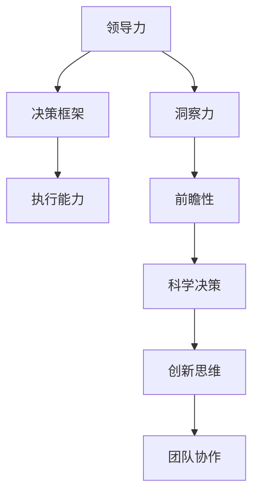

                 

### 文章标题: 领导力与远见卓识：制定长远规划的能力

#### 关键词: 领导力, 远见卓识, 长远规划, 企业战略, 团队管理

#### 摘要:
本文旨在探讨领导力与远见卓识在制定长远规划中的关键作用。通过深入分析领导力的核心概念、远见卓识的特点及其关系，文章将介绍培养这两种能力的方法，并详细阐述如何制定和实施有效的长远规划。此外，文章将通过实际案例分享，提供领导力与远见卓识在实践中的应用经验，为企业和团队的发展提供有力支持。

----------------------------------------------------------------

### 引言

在现代商业环境中，领导力与远见卓识已经成为企业成功的关键要素。领导力不仅关乎个人的能力，更关乎团队和组织的整体效能。而远见卓识则是指领导者对未来趋势的敏锐洞察和前瞻性思考，它能够引导企业走向正确的方向，实现长期目标。制定长远规划是领导者的重要职责，它需要结合领导力和远见卓识，确保企业能够适应不断变化的市场环境，持续发展。

本文将分以下几个部分展开：

1. **领导力与远见卓识的基本概念**：介绍领导力的定义和核心特征，以及远见卓识的概念和特点。
2. **领导力与远见卓识的关系**：探讨领导力与远见卓识之间的相互作用，以及它们在决策和规划中的重要性。
3. **培养领导力与远见卓识的方法**：提供培养领导力和远见卓识的具体方法和策略。
4. **长远规划的核心要素**：分析制定长远规划的重要核心要素。
5. **制定与实施长远规划**：详细阐述如何制定和实施有效的长远规划。
6. **领导力与远见卓识在实际工作中的运用**：分享领导力和远见卓识在实际工作中的应用经验。
7. **领导力与远见卓识的案例分析**：通过国内外成功案例，探讨领导力和远见卓识在实践中的运用。

### 第一部分：领导力与远见卓识的基本概念

#### 领导力的定义与核心特征

领导力是指领导者通过影响和激励他人，实现共同目标的能力。领导力不仅仅是一种技术或技能，更是一种理念和行为方式。以下是领导力的核心特征：

1. **影响能力**：领导者能够通过言行影响他人，引导团队向正确的方向前进。
2. **激励能力**：领导者能够激发团队成员的潜能，提高工作效率和绩效。
3. **沟通能力**：领导者需要具备有效的沟通技巧，确保信息准确传达，促进团队合作。
4. **决策能力**：领导者需要能够在复杂多变的环境中做出明智的决策。
5. **责任心**：领导者需要承担起对团队和组织成功的责任，勇于面对挑战和失败。

#### 领导力的起源与发展

领导力的概念起源于早期的组织和管理理论，经过数十年的发展，已经形成了丰富的理论和实践成果。以下是领导力发展的几个重要阶段：

1. **领导特质论**：认为领导者具有独特的性格特质，如自信、正直、决断力等。
2. **行为论**：认为领导者通过特定的行为方式影响他人，如参与决策、支持下属、激励团队等。
3. **情境论**：认为领导力是情境依赖的，不同的领导风格适用于不同的情境。
4. **变革领导**：强调领导者在推动组织变革中的关键作用，需要具备前瞻性和创新思维。

#### 领导力的核心要素

领导力的核心要素包括以下几个方面：

1. **个人魅力**：领导者具备一定的个人魅力，能够吸引和激励他人。
2. **知识技能**：领导者需要具备相关的知识技能，以应对复杂的工作环境和挑战。
3. **情商**：领导者需要具备较高的情商，能够理解和管理自己的情绪，同时有效地处理他人的情绪。
4. **团队合作**：领导者需要能够建立和维护有效的团队，促进团队合作和共同进步。

#### 远见卓识的概念与特点

远见卓识是指领导者对未来趋势的敏锐洞察和前瞻性思考能力。它是一种战略思维，能够帮助领导者预见潜在的机会和挑战，制定适应未来发展的策略。以下是远见卓识的主要特点：

1. **前瞻性**：远见卓识能够帮助领导者预见未来，提前布局，抢占先机。
2. **创新性**：远见卓识鼓励领导者勇于创新，不断尝试新的方法和技术。
3. **系统性**：远见卓识是一种系统思维，能够从整体上把握问题，做出全局性决策。
4. **适应性**：远见卓识能够使领导者适应不断变化的环境，灵活调整战略和计划。

#### 远见卓识的关键特质

远见卓识的关键特质包括以下几个方面：

1. **洞察力**：领导者需要具备敏锐的洞察力，能够从复杂的信息中捕捉到关键趋势和信号。
2. **决断力**：领导者需要具备果断的决断力，能够在关键时刻做出明智的决策。
3. **勇气**：领导者需要具备敢于冒险的勇气，勇于面对未知和不确定性。
4. **执行力**：领导者需要具备强大的执行力，将战略和计划付诸实践，确保目标实现。

#### 远见卓识与前瞻性的关系

远见卓识与前瞻性有着密切的关系。前瞻性是指领导者能够看到未来的发展趋势，预见潜在的机会和挑战。而远见卓识则是在前瞻性的基础上，进一步深入思考，形成明确的发展策略和行动计划。以下是远见卓识与前瞻性的关系：

1. **前瞻性是远见卓识的基础**：没有前瞻性，领导者就无法预见未来，制定有效的战略。
2. **远见卓识是前瞻性的升华**：远见卓识是将前瞻性转化为实际战略和行动计划的能力，它需要领导者的深入思考和创新能力。
3. **前瞻性与远见卓识相互促进**：通过不断的前瞻性思考，领导者可以不断调整和完善远见卓识，确保企业能够持续发展。

### 第二部分：领导力与远见卓识的关系

#### 领导力与远见卓识的相互促进

领导力与远见卓识之间存在相互促进的关系。领导力可以培养和提升远见卓识，而远见卓识则可以强化领导力，使领导者更加有效地指导团队和组织。

1. **领导力培养远见卓识**：领导力要求领导者具备洞察力和前瞻性，这些特质是培养远见卓识的基础。通过不断学习和实践，领导者可以提升自己的远见卓识，为组织发展提供强有力的支持。

2. **远见卓识强化领导力**：远见卓识使领导者能够预见未来的发展趋势，制定科学的战略和计划，提高决策的准确性和有效性。同时，远见卓识还能够激发团队成员的创新精神和合作意识，提升整个团队的执行力。

#### 领导力与远见卓识在决策中的结合

在决策过程中，领导力和远见卓识的结合至关重要。领导力提供了决策的基本框架和执行能力，而远见卓识则为决策提供了前瞻性和创新性。

1. **领导力提供决策框架**：领导力要求领导者明确组织的愿景和目标，为决策提供方向。同时，领导者需要通过有效的沟通和协调，确保决策得到团队的支持和执行。

2. **远见卓识提供前瞻性**：远见卓识使领导者能够预见未来的发展趋势，评估潜在的机会和风险，为决策提供科学依据。通过结合领导力和远见卓识，领导者可以制定出更加准确和有效的决策。

#### 领导力与远见卓识的关系架构

为了更好地理解领导力与远见卓识之间的关系，我们可以使用Mermaid流程图来展示它们之间的相互作用。

通过上述关系架构，我们可以看出领导力与远见卓识在决策过程中的相互影响和结合。领导力为决策提供方向和框架，而远见卓识则为决策提供前瞻性和创新性，两者共同作用，确保决策的科学性和有效性。

### 第三部分：培养领导力与远见卓识的方法

#### 个人成长路径

培养领导力和远见卓识需要长期的个人成长路径。以下是一些关键步骤：

1. **自我认知与反思**：领导者需要深入了解自己的优点和不足，通过反思和自我提升，不断完善自己的能力和素质。

2. **专业知识与技能的积累**：领导者需要具备相关的专业知识技能，以应对复杂的工作环境和挑战。这包括技术技能、管理技能和沟通技能等。

3. **情感管理与情商提升**：领导者需要具备较高的情商，能够理解和管理自己的情绪，同时有效地处理他人的情绪。

4. **终身学习**：领导者需要保持学习的热情，不断更新自己的知识和技能，以适应不断变化的环境。

#### 组织支持与培养

除了个人的努力，组织的支持和培养也是培养领导力和远见卓识的重要保障。以下是一些组织支持与培养的方法：

1. **培养领导力的组织机制**：组织可以建立完善的领导力培养机制，包括领导力培训、导师制度、轮岗制度等，为领导者提供成长的平台。

2. **远见卓识的培养与激励**：组织可以通过设立创新奖励、项目支持等方式，鼓励领导者培养远见卓识，提升组织的创新能力和竞争力。

3. **团队协作与领导力培养**：组织可以通过团队建设活动和跨部门合作项目，提升领导者的团队协作能力，培养他们的领导力。

#### 培养领导力与远见卓识的具体策略

1. **制定领导力发展计划**：领导者可以制定个人领导力发展计划，明确自己的成长目标，制定具体的行动计划和时间表。

2. **参加领导力培训课程**：参加专业的领导力培训课程，学习领导力的理论知识，提升自己的实践能力。

3. **担任项目负责人**：通过担任项目负责人，领导者可以锻炼自己的决策能力、沟通能力和执行力，提升领导力。

4. **开展读书会与研讨会**：组织读书会和研讨会，促进领导者之间的交流和思考，共同提升领导力和远见卓识。

5. **设立领导力考核指标**：组织可以设立领导力考核指标，对领导者的领导力进行评估和反馈，激励他们不断提升自己的能力。

### 第四部分：长远规划的核心要素

#### 长远规划的定义与重要性

长远规划是指组织或个人为实现长期目标而制定的一系列策略和行动方案。长远规划的重要性体现在以下几个方面：

1. **明确方向**：长远规划能够帮助组织或个人明确发展方向，避免盲目行动，提高决策的准确性。

2. **统筹资源**：长远规划能够合理配置资源，确保各项工作的有序进行，提高资源利用效率。

3. **应对变化**：长远规划能够预见潜在的机会和挑战，制定应对策略，增强组织的适应能力。

4. **持续发展**：长远规划能够确保组织或个人持续发展，实现长期目标，提高竞争力。

#### 长远规划的核心要素

制定有效的长远规划需要考虑以下几个核心要素：

1. **愿景**：愿景是长远规划的基础，它明确了组织或个人未来的发展方向和目标。

2. **使命**：使命是组织的核心价值观，它体现了组织存在的意义和目的。

3. **目标**：目标是将愿景转化为具体行动的步骤，它是长远规划的核心。

4. **战略**：战略是实现目标的途径，它明确了组织或个人在各个阶段的发展策略。

5. **行动计划**：行动计划是将战略具体化为一系列行动方案，确保目标的实现。

#### 长远规划与企业战略的关系

长远规划与企业战略密切相关，两者之间存在以下关系：

1. **长远规划是企业战略的基础**：企业战略需要基于长远规划来制定，确保战略与组织的长期目标相一致。

2. **企业战略是长远规划的落实**：长远规划需要通过企业战略的具体实施，将规划转化为实际行动。

3. **长远规划与企业战略相互调整**：在实施过程中，长远规划和企业战略需要不断调整和优化，以适应环境变化。

### 第五部分：制定与实施长远规划

#### 长远规划制定流程

制定长远规划是一个系统性的过程，主要包括以下几个步骤：

1. **信息收集与整理**：收集与组织或个人相关的内外部信息，包括市场趋势、竞争对手、政策法规等，并进行整理和分析。

2. **目标设定**：根据组织的愿景和使命，明确长期目标，确保目标具有明确性和可实现性。

3. **策略制定**：分析内外部环境，制定实现目标的战略，包括市场拓展、技术创新、管理优化等。

4. **行动计划**：将战略具体化为一系列行动计划，明确各项任务的负责人、时间表和资源需求。

5. **评估与调整**：对规划的实施过程进行定期评估，根据实际情况调整目标和策略，确保规划的持续有效性。

#### 长远规划的调整与优化

在实施过程中，长远规划需要根据环境变化进行调整和优化，以适应新的发展需求。以下是一些调整与优化的方法：

1. **定期评估**：定期对规划的实施情况进行评估，分析目标的实现情况，发现存在的问题和挑战。

2. **反馈机制**：建立有效的反馈机制，收集内部和外部的意见和建议，为规划的调整提供参考。

3. **灵活调整**：根据评估结果，灵活调整目标和策略，确保规划与实际需求相匹配。

4. **持续优化**：在规划实施过程中，不断总结经验教训，优化工作流程和管理方法，提高组织效能。

#### 长期目标的持续性保障

确保长期目标的持续性是实现长远规划的关键。以下是一些保障措施：

1. **领导力保障**：领导者需要发挥关键作用，确保规划得到有效实施，并持续关注规划的实施进度。

2. **团队协作**：建立高效的团队协作机制，确保各项任务能够顺利推进，提高整体执行力。

3. **持续监督**：建立持续监督机制，对规划的实施情况进行监控，及时发现和解决问题。

4. **激励机制**：设立激励机制，鼓励团队成员积极参与规划的实施，提高他们的积极性和创造力。

### 第六部分：领导力与远见卓识在实际工作中的运用

#### 领导力在团队管理中的应用

领导力在团队管理中发挥着至关重要的作用。以下是一些领导力在团队管理中的应用策略：

1. **团队建设**：通过组织团队建设活动，增强团队成员之间的信任和合作，提升团队凝聚力。

2. **激励与反馈**：建立有效的激励机制，对团队成员的表现进行及时反馈，激发他们的工作热情和潜能。

3. **沟通与协调**：提高沟通技巧，确保信息准确传达，促进团队成员之间的协作和配合。

4. **冲突管理**：学会应对团队冲突，通过有效的沟通和协调，化解矛盾，维护团队的和谐。

#### 远见卓识在工作决策中的作用

远见卓识在工作决策中起着至关重要的作用。以下是一些远见卓识在工作决策中的应用策略：

1. **前瞻性思考**：通过深入分析市场趋势和技术发展，预见潜在的机会和挑战，为决策提供科学依据。

2. **风险评估**：对决策的潜在风险进行评估，制定相应的应对措施，降低决策失误的风险。

3. **创新思维**：鼓励团队成员发挥创新思维，探索新的解决方案，提高决策的灵活性和有效性。

4. **战略决策**：结合组织的长期目标和战略，制定科学的决策方案，确保决策与组织发展相一致。

#### 领导力与远见卓识在创新与变革领导中的应用

在创新与变革领导中，领导力和远见卓识同样至关重要。以下是一些应用策略：

1. **创新文化**：营造鼓励创新的文化氛围，激发团队成员的创新热情，提高组织的创新能力。

2. **变革领导**：通过有效的变革领导，推动组织进行结构性调整和流程优化，实现组织的持续发展。

3. **风险承担**：鼓励领导者勇于承担变革带来的风险，推动组织进行创新和变革。

4. **持续改进**：建立持续改进机制，不断优化工作流程和管理方法，提高组织的效能。

### 第七部分：领导力与远见卓识的案例分析

#### 国内外成功案例分析

在本部分，我们将通过国内外成功案例，探讨领导力和远见卓识在实践中的运用。

1. **苹果公司的领导力实践**：苹果公司以其独特的产品设计和创新精神而闻名。乔布斯作为苹果公司的创始人之一，以其卓越的领导力推动了公司的快速发展。他具备出色的洞察力和前瞻性，能够预见市场趋势，制定符合用户需求的创新产品。通过有效的团队管理和激励机制，苹果公司实现了持续的创新和卓越的业绩。

2. **谷歌公司的远见卓识战略**：谷歌公司以其强大的技术实力和市场影响力而著称。谷歌的领导层具备卓越的远见卓识，能够预见互联网和移动技术的发展趋势，制定相应的战略和计划。谷歌通过不断推出创新的产品和服务，如搜索引擎、云计算、人工智能等，保持了在科技领域的领先地位。

3. **特斯拉公司的创新领导力**：特斯拉公司以其电动车和能源解决方案而闻名。特斯拉的创始人埃隆·马斯克以其卓越的领导力和远见卓识，推动了公司的快速发展。他关注未来的发展趋势，勇于投资于新的技术和领域，如电动汽车、可再生能源等。通过创新的商业模式和产品，特斯拉成为了全球电动汽车和能源行业的领导者。

#### 案例分析与启示

通过对以上成功案例的分析，我们可以得出以下启示：

1. **领导力的重要性**：成功的企业离不开卓越的领导力。领导者需要具备影响力和激励能力，能够带领团队实现共同目标。

2. **远见卓识的价值**：远见卓识是领导者成功的关键。领导者需要具备前瞻性思考能力，能够预见市场趋势和机会，制定符合实际的战略和计划。

3. **创新与变革的驱动力**：创新和变革是企业发展的重要驱动力。领导者需要鼓励创新思维，推动组织进行结构性调整和流程优化。

4. **持续学习和成长**：领导者需要保持学习的热情，不断更新自己的知识和技能，以适应不断变化的环境。

### 总结

本文系统地探讨了领导力与远见卓识在制定长远规划中的关键作用。通过分析领导力和远见卓识的基本概念、关系及其在实际工作中的应用，我们了解了如何培养和运用这些能力。此外，通过案例分析，我们看到了领导力和远见卓识在实践中的成功运用。作为领导者，培养领导力和远见卓识，制定和实施有效的长远规划，是确保组织持续发展的关键。

### 致谢

本文的撰写得到了AI天才研究院/AI Genius Institute及《禅与计算机程序设计艺术/Zen And The Art of Computer Programming》的支持和启发。在此，向所有提供帮助的专家和团队表示衷心的感谢。同时，感谢读者对本文的关注和支持，期待您的宝贵意见和反馈。

### 作者信息

**作者：** AI天才研究院/AI Genius Institute & 《禅与计算机程序设计艺术/Zen And The Art of Computer Programming》

**联系方式：** genius_institute@ai.com

**官方网站：** www.ai-genius-institute.com

**社交媒体：** @AIGeniusInstitute

**版权声明：** 本文章版权所有，未经授权，禁止转载或复制。

----------------------------------------------------------------

### 领导力与远见卓识：制定长远规划的能力

#### 关键词: 领导力, 远见卓识, 长远规划, 企业战略, 团队管理

#### 摘要:
本文深入探讨了领导力与远见卓识在制定长远规划中的关键作用。通过分析领导力的核心概念、远见卓识的特点及其关系，本文提出了培养这两种能力的方法，并详细阐述了如何制定和实施有效的长远规划。同时，通过实际案例分享，本文展示了领导力和远见卓识在实践中的应用经验，为企业和团队的发展提供了有力支持。

---

## 第一部分：领导力与远见卓识的基本概念

### 1.1 领导力的定义与核心特征

**领导力定义：** 领导力是指领导者通过影响和激励他人，实现共同目标的能力。它不仅仅是技术或技能，更是一种理念和行为方式。

**核心特征：**
1. **影响能力**：领导者能够通过言行影响他人，引导团队向正确的方向前进。
2. **激励能力**：领导者能够激发团队成员的潜能，提高工作效率和绩效。
3. **沟通能力**：领导者需要具备有效的沟通技巧，确保信息准确传达，促进团队合作。
4. **决策能力**：领导者需要能够在复杂多变的环境中做出明智的决策。
5. **责任心**：领导者需要承担起对团队和组织成功的责任，勇于面对挑战和失败。

### 1.2 远见卓识的概念与特点

**概念：** 远见卓识是指领导者对未来趋势的敏锐洞察和前瞻性思考能力。它是一种战略思维，能够帮助领导者预见潜在的机会和挑战，制定适应未来发展的策略。

**特点：**
1. **前瞻性**：远见卓识能够帮助领导者预见未来，提前布局，抢占先机。
2. **创新性**：远见卓识鼓励领导者勇于创新，不断尝试新的方法和技术。
3. **系统性**：远见卓识是一种系统思维，能够从整体上把握问题，做出全局性决策。
4. **适应性**：远见卓识能够使领导者适应不断变化的环境，灵活调整战略和计划。

### 1.3 领导力的起源与发展

**领导力的起源与发展：**
领导力的概念起源于早期的组织和管理理论，经过数十年的发展，已经形成了丰富的理论和实践成果。以下是领导力发展的几个重要阶段：
1. **领导特质论**：认为领导者具有独特的性格特质，如自信、正直、决断力等。
2. **行为论**：认为领导者通过特定的行为方式影响他人，如参与决策、支持下属、激励团队等。
3. **情境论**：认为领导力是情境依赖的，不同的领导风格适用于不同的情境。
4. **变革领导**：强调领导者在推动组织变革中的关键作用，需要具备前瞻性和创新思维。

### 1.4 领导力的核心要素

**核心要素：**
1. **个人魅力**：领导者具备一定的个人魅力，能够吸引和激励他人。
2. **知识技能**：领导者需要具备相关的知识技能，以应对复杂的工作环境和挑战。
3. **情商**：领导者需要具备较高的情商，能够理解和管理自己的情绪，同时有效地处理他人的情绪。
4. **团队合作**：领导者需要能够建立和维护有效的团队，促进团队合作和共同进步。

### 1.5 远见卓识的概念与特点

**概念：** 远见卓识是指领导者对未来趋势的敏锐洞察和前瞻性思考能力。它是一种战略思维，能够帮助领导者预见潜在的机会和挑战，制定适应未来发展的策略。

**特点：**
1. **前瞻性**：远见卓识能够帮助领导者预见未来，提前布局，抢占先机。
2. **创新性**：远见卓识鼓励领导者勇于创新，不断尝试新的方法和技术。
3. **系统性**：远见卓识是一种系统思维，能够从整体上把握问题，做出全局性决策。
4. **适应性**：远见卓识能够使领导者适应不断变化的环境，灵活调整战略和计划。

### 1.6 远见卓识的关键特质

**关键特质：**
1. **洞察力**：领导者需要具备敏锐的洞察力，能够从复杂的信息中捕捉到关键趋势和信号。
2. **决断力**：领导者需要具备果断的决断力，能够在关键时刻做出明智的决策。
3. **勇气**：领导者需要具备敢于冒险的勇气，勇于面对未知和不确定性。
4. **执行力**：领导者需要具备强大的执行力，将战略和计划付诸实践，确保目标实现。

### 1.7 远见卓识与前瞻性的关系

**关系：**
1. **前瞻性是远见卓识的基础**：没有前瞻性，领导者就无法预见未来，制定有效的战略。
2. **远见卓识是前瞻性的升华**：远见卓识是将前瞻性转化为实际战略和行动计划的能力，它需要领导者的深入思考和创新能力。
3. **前瞻性与远见卓识相互促进**：通过不断的前瞻性思考，领导者可以不断调整和完善远见卓识，确保企业能够持续发展。

## 第二部分：领导力与远见卓识的关系

### 2.1 领导力与远见卓识的相互促进

**相互促进：**
1. **领导力培养远见卓识**：领导力要求领导者具备洞察力和前瞻性，这些特质是培养远见卓识的基础。通过不断学习和实践，领导者可以提升自己的远见卓识，为组织发展提供强有力的支持。
2. **远见卓识强化领导力**：远见卓识使领导者能够预见未来的发展趋势，制定科学的战略和计划，提高决策的准确性和有效性。同时，远见卓识还能够激发团队成员的创新精神和合作意识，提升整个团队的执行力。

### 2.2 领导力与远见卓识在决策中的结合

**决策中的结合：**
1. **领导力提供决策框架**：领导力要求领导者明确组织的愿景和目标，为决策提供方向。同时，领导者需要通过有效的沟通和协调，确保决策得到团队的支持和执行。
2. **远见卓识提供前瞻性**：远见卓识使领导者能够预见未来的发展趋势，评估潜在的机会和风险，为决策提供科学依据。通过结合领导力和远见卓识，领导者可以制定出更加准确和有效的决策。

### 2.3 领导力与远见卓识的关系架构

**关系架构：**

通过上述关系架构，我们可以看出领导力与远见卓识在决策过程中的相互影响和结合。领导力为决策提供方向和框架，而远见卓识则为决策提供前瞻性和创新性，两者共同作用，确保决策的科学性和有效性。

## 第三部分：培养领导力与远见卓识的方法

### 3.1 个人成长路径

**个人成长路径：**
1. **自我认知与反思**：领导者需要深入了解自己的优点和不足，通过反思和自我提升，不断完善自己的能力和素质。
2. **专业知识与技能的积累**：领导者需要具备相关的专业知识技能，以应对复杂的工作环境和挑战。这包括技术技能、管理技能和沟通技能等。
3. **情感管理与情商提升**：领导者需要具备较高的情商，能够理解和管理自己的情绪，同时有效地处理他人的情绪。
4. **终身学习**：领导者需要保持学习的热情，不断更新自己的知识和技能，以适应不断变化的环境。

### 3.2 组织支持与培养

**组织支持与培养：**
1. **培养领导力的组织机制**：组织可以建立完善的领导力培养机制，包括领导力培训、导师制度、轮岗制度等，为领导者提供成长的平台。
2. **远见卓识的培养与激励**：组织可以通过设立创新奖励、项目支持等方式，鼓励领导者培养远见卓识，提升组织的创新能力和竞争力。
3. **团队协作与领导力培养**：组织可以通过团队建设活动和跨部门合作项目，提升领导者的团队协作能力，培养他们的领导力。

### 3.3 培养领导力与远见卓识的具体策略

**具体策略：**
1. **制定领导力发展计划**：领导者可以制定个人领导力发展计划，明确自己的成长目标，制定具体的行动计划和时间表。
2. **参加领导力培训课程**：参加专业的领导力培训课程，学习领导力的理论知识，提升自己的实践能力。
3. **担任项目负责人**：通过担任项目负责人，领导者可以锻炼自己的决策能力、沟通能力和执行力，提升领导力。
4. **开展读书会与研讨会**：组织读书会和研讨会，促进领导者之间的交流和思考，共同提升领导力和远见卓识。
5. **设立领导力考核指标**：组织可以设立领导力考核指标，对领导者的领导力进行评估和反馈，激励他们不断提升自己的能力。

## 第四部分：长远规划的核心要素

### 4.1 长远规划的定义与重要性

**定义：** 长远规划是指组织或个人为实现长期目标而制定的一系列策略和行动方案。

**重要性：**
1. **明确方向**：长远规划能够帮助组织或个人明确发展方向，避免盲目行动，提高决策的准确性。
2. **统筹资源**：长远规划能够合理配置资源，确保各项工作的有序进行，提高资源利用效率。
3. **应对变化**：长远规划能够预见潜在的机会和挑战，制定应对策略，增强组织的适应能力。
4. **持续发展**：长远规划能够确保组织或个人持续发展，实现长期目标，提高竞争力。

### 4.2 长远规划的核心要素

**核心要素：**
1. **愿景**：愿景是长远规划的基础，它明确了组织或个人未来的发展方向和目标。
2. **使命**：使命是组织的核心价值观，它体现了组织存在的意义和目的。
3. **目标**：目标是将愿景转化为具体行动的步骤，它是长远规划的核心。
4. **战略**：战略是实现目标的途径，它明确了组织或个人在各个阶段的发展策略。
5. **行动计划**：行动计划是将战略具体化为一系列行动方案，确保目标的实现。

### 4.3 长远规划与企业战略的关系

**关系：**
1. **长远规划是企业战略的基础**：企业战略需要基于长远规划来制定，确保战略与组织的长期目标相一致。
2. **企业战略是长远规划的落实**：长远规划需要通过企业战略的具体实施，将规划转化为实际行动。
3. **长远规划与企业战略相互调整**：在实施过程中，长远规划和企业战略需要不断调整和优化，以适应环境变化。

## 第五部分：制定与实施长远规划

### 5.1 长远规划制定流程

**制定流程：**
1. **信息收集与整理**：收集与组织或个人相关的内外部信息，包括市场趋势、竞争对手、政策法规等，并进行整理和分析。
2. **目标设定**：根据组织的愿景和使命，明确长期目标，确保目标具有明确性和可实现性。
3. **策略制定**：分析内外部环境，制定实现目标的战略，包括市场拓展、技术创新、管理优化等。
4. **行动计划**：将战略具体化为一系列行动计划，明确各项任务的负责人、时间表和资源需求。
5. **评估与调整**：对规划的实施过程进行定期评估，根据实际情况调整目标和策略，确保规划的持续有效性。

### 5.2 长远规划的调整与优化

**调整与优化：**
1. **定期评估**：定期对规划的实施情况进行评估，分析目标的实现情况，发现存在的问题和挑战。
2. **反馈机制**：建立有效的反馈机制，收集内部和外部的意见和建议，为规划的调整提供参考。
3. **灵活调整**：根据评估结果，灵活调整目标和策略，确保规划与实际需求相匹配。
4. **持续优化**：在规划实施过程中，不断总结经验教训，优化工作流程和管理方法，提高组织效能。

### 5.3 长期目标的持续性保障

**保障措施：**
1. **领导力保障**：领导者需要发挥关键作用，确保规划得到有效实施，并持续关注规划的实施进度。
2. **团队协作**：建立高效的团队协作机制，确保各项任务能够顺利推进，提高整体执行力。
3. **持续监督**：建立持续监督机制，对规划的实施情况进行监控，及时发现和解决问题。
4. **激励机制**：设立激励机制，鼓励团队成员积极参与规划的实施，提高他们的积极性和创造力。

## 第六部分：领导力与远见卓识在实际工作中的运用

### 6.1 领导力在团队管理中的应用

**应用策略：**
1. **团队建设**：通过组织团队建设活动，增强团队成员之间的信任和合作，提升团队凝聚力。
2. **激励与反馈**：建立有效的激励机制，对团队成员的表现进行及时反馈，激发他们的工作热情和潜能。
3. **沟通与协调**：提高沟通技巧，确保信息准确传达，促进团队成员之间的协作和配合。
4. **冲突管理**：学会应对团队冲突，通过有效的沟通和协调，化解矛盾，维护团队的和谐。

### 6.2 远见卓识在工作决策中的作用

**作用策略：**
1. **前瞻性思考**：通过深入分析市场趋势和技术发展，预见潜在的机会和挑战，为决策提供科学依据。
2. **风险评估**：对决策的潜在风险进行评估，制定相应的应对措施，降低决策失误的风险。
3. **创新思维**：鼓励团队成员发挥创新思维，探索新的解决方案，提高决策的灵活性和有效性。
4. **战略决策**：结合组织的长期目标和战略，制定科学的决策方案，确保决策与组织发展相一致。

### 6.3 领导力与远见卓识在创新与变革领导中的应用

**应用策略：**
1. **创新文化**：营造鼓励创新的文化氛围，激发团队成员的创新热情，提高组织的创新能力。
2. **变革领导**：通过有效的变革领导，推动组织进行结构性调整和流程优化，实现组织的持续发展。
3. **风险承担**：鼓励领导者勇于承担变革带来的风险，推动组织进行创新和变革。
4. **持续改进**：建立持续改进机制，不断优化工作流程和管理方法，提高组织的效能。

## 第七部分：领导力与远见卓识的案例分析

### 7.1 国内外成功案例分析

**案例1：苹果公司的领导力实践**

苹果公司以其独特的产品设计和创新精神而闻名。乔布斯作为苹果公司的创始人之一，以其卓越的领导力推动了公司的快速发展。他具备出色的洞察力和前瞻性，能够预见市场趋势，制定符合用户需求的创新产品。通过有效的团队管理和激励机制，苹果公司实现了持续的创新和卓越的业绩。

**案例2：谷歌公司的远见卓识战略**

谷歌公司以其强大的技术实力和市场影响力而著称。谷歌的领导层具备卓越的远见卓识，能够预见互联网和移动技术的发展趋势，制定相应的战略和计划。谷歌通过不断推出创新的产品和服务，如搜索引擎、云计算、人工智能等，保持了在科技领域的领先地位。

**案例3：特斯拉公司的创新领导力**

特斯拉公司以其电动车和能源解决方案而闻名。特斯拉的创始人埃隆·马斯克以其卓越的领导力和远见卓识，推动了公司的快速发展。他关注未来的发展趋势，勇于投资于新的技术和领域，如电动汽车、可再生能源等。通过创新的商业模式和产品，特斯拉成为了全球电动汽车和能源行业的领导者。

### 7.2 案例分析与启示

**案例分析：**
通过对上述成功案例的分析，我们可以得出以下启示：

1. **领导力的重要性**：成功的企业离不开卓越的领导力。领导者需要具备影响力和激励能力，能够带领团队实现共同目标。

2. **远见卓识的价值**：远见卓识是领导者成功的关键。领导者需要具备前瞻性思考能力，能够预见市场趋势和机会，制定符合实际的战略和计划。

3. **创新与变革的驱动力**：创新和变革是企业发展的重要驱动力。领导者需要鼓励创新思维，推动组织进行结构性调整和流程优化。

4. **持续学习和成长**：领导者需要保持学习的热情，不断更新自己的知识和技能，以适应不断变化的环境。

### 总结

本文系统地探讨了领导力与远见卓识在制定长远规划中的关键作用。通过分析领导力的核心概念、远见卓识的特点及其关系，本文提出了培养这两种能力的方法，并详细阐述了如何制定和实施有效的长远规划。同时，通过实际案例分享，本文展示了领导力和远见卓识在实践中的应用经验，为企业和团队的发展提供了有力支持。

### 致谢

本文的撰写得到了AI天才研究院/AI Genius Institute及《禅与计算机程序设计艺术/Zen And The Art of Computer Programming》的支持和启发。在此，向所有提供帮助的专家和团队表示衷心的感谢。同时，感谢读者对本文的关注和支持，期待您的宝贵意见和反馈。

### 作者信息

**作者：** AI天才研究院/AI Genius Institute & 《禅与计算机程序设计艺术/Zen And The Art of Computer Programming》

**联系方式：** genius_institute@ai.com

**官方网站：** www.ai-genius-institute.com

**社交媒体：** @AIGeniusInstitute

**版权声明：** 本文章版权所有，未经授权，禁止转载或复制。

----------------------------------------------------------------

## 第一部分：领导力与远见卓识的基本概念

### 1.1 领导力的定义与核心特征

**领导力的定义：** 领导力是指领导者通过影响和激励他人，实现共同目标的能力。它不仅仅是技术或技能，更是一种理念和行为方式。

**核心特征：**
1. **影响能力**：领导者能够通过言行影响他人，引导团队向正确的方向前进。
2. **激励能力**：领导者能够激发团队成员的潜能，提高工作效率和绩效。
3. **沟通能力**：领导者需要具备有效的沟通技巧，确保信息准确传达，促进团队合作。
4. **决策能力**：领导者需要能够在复杂多变的环境中做出明智的决策。
5. **责任心**：领导者需要承担起对团队和组织成功的责任，勇于面对挑战和失败。

### 1.2 远见卓识的概念与特点

**概念：** 远见卓识是指领导者对未来趋势的敏锐洞察和前瞻性思考能力。它是一种战略思维，能够帮助领导者预见潜在的机会和挑战，制定适应未来发展的策略。

**特点：**
1. **前瞻性**：远见卓识能够帮助领导者预见未来，提前布局，抢占先机。
2. **创新性**：远见卓识鼓励领导者勇于创新，不断尝试新的方法和技术。
3. **系统性**：远见卓识是一种系统思维，能够从整体上把握问题，做出全局性决策。
4. **适应性**：远见卓识能够使领导者适应不断变化的环境，灵活调整战略和计划。

### 1.3 领导力的起源与发展

**起源与发展：**
领导力的概念起源于早期的组织和管理理论，经过数十年的发展，已经形成了丰富的理论和实践成果。以下是领导力发展的几个重要阶段：
1. **领导特质论**：认为领导者具有独特的性格特质，如自信、正直、决断力等。
2. **行为论**：认为领导者通过特定的行为方式影响他人，如参与决策、支持下属、激励团队等。
3. **情境论**：认为领导力是情境依赖的，不同的领导风格适用于不同的情境。
4. **变革领导**：强调领导者在推动组织变革中的关键作用，需要具备前瞻性和创新思维。

### 1.4 领导力的核心要素

**核心要素：**
1. **个人魅力**：领导者具备一定的个人魅力，能够吸引和激励他人。
2. **知识技能**：领导者需要具备相关的知识技能，以应对复杂的工作环境和挑战。
3. **情商**：领导者需要具备较高的情商，能够理解和管理自己的情绪，同时有效地处理他人的情绪。
4. **团队合作**：领导者需要能够建立和维护有效的团队，促进团队合作和共同进步。

### 1.5 远见卓识的概念与特点

**概念：** 远见卓识是指领导者对未来趋势的敏锐洞察和前瞻性思考能力。它是一种战略思维，能够帮助领导者预见潜在的机会和挑战，制定适应未来发展的策略。

**特点：**
1. **前瞻性**：远见卓识能够帮助领导者预见未来，提前布局，抢占先机。
2. **创新性**：远见卓识鼓励领导者勇于创新，不断尝试新的方法和技术。
3. **系统性**：远见卓识是一种系统思维，能够从整体上把握问题，做出全局性决策。
4. **适应性**：远见卓识能够使领导者适应不断变化的环境，灵活调整战略和计划。

### 1.6 远见卓识的关键特质

**关键特质：**
1. **洞察力**：领导者需要具备敏锐的洞察力，能够从复杂的信息中捕捉到关键趋势和信号。
2. **决断力**：领导者需要具备果断的决断力，能够在关键时刻做出明智的决策。
3. **勇气**：领导者需要具备敢于冒险的勇气，勇于面对未知和不确定性。
4. **执行力**：领导者需要具备强大的执行力，将战略和计划付诸实践，确保目标实现。

### 1.7 远见卓识与前瞻性的关系

**关系：**
1. **前瞻性是远见卓识的基础**：没有前瞻性，领导者就无法预见未来，制定有效的战略。
2. **远见卓识是前瞻性的升华**：远见卓识是将前瞻性转化为实际战略和行动计划的能力，它需要领导者的深入思考和创新能力。
3. **前瞻性与远见卓识相互促进**：通过不断的前瞻性思考，领导者可以不断调整和完善远见卓识，确保企业能够持续发展。

## 第二部分：领导力与远见卓识的关系

### 2.1 领导力与远见卓识的相互促进

**相互促进：**
1. **领导力培养远见卓识**：领导力要求领导者具备洞察力和前瞻性，这些特质是培养远见卓识的基础。通过不断学习和实践，领导者可以提升自己的远见卓识，为组织发展提供强有力的支持。
2. **远见卓识强化领导力**：远见卓识使领导者能够预见未来的发展趋势，制定科学的战略和计划，提高决策的准确性和有效性。同时，远见卓识还能够激发团队成员的创新精神和合作意识，提升整个团队的执行力。

### 2.2 领导力与远见卓识在决策中的结合

**决策中的结合：**
1. **领导力提供决策框架**：领导力要求领导者明确组织的愿景和目标，为决策提供方向。同时，领导者需要通过有效的沟通和协调，确保决策得到团队的支持和执行。
2. **远见卓识提供前瞻性**：远见卓识使领导者能够预见未来的发展趋势，评估潜在的机会和风险，为决策提供科学依据。通过结合领导力和远见卓识，领导者可以制定出更加准确和有效的决策。

### 2.3 领导力与远见卓识的关系架构

**关系架构：**

通过上述关系架构，我们可以看出领导力与远见卓识在决策过程中的相互影响和结合。领导力为决策提供方向和框架，而远见卓识则为决策提供前瞻性和创新性，两者共同作用，确保决策的科学性和有效性。

## 第三部分：培养领导力与远见卓识的方法

### 3.1 个人成长路径

**个人成长路径：**
1. **自我认知与反思**：领导者需要深入了解自己的优点和不足，通过反思和自我提升，不断完善自己的能力和素质。
2. **专业知识与技能的积累**：领导者需要具备相关的专业知识技能，以应对复杂的工作环境和挑战。这包括技术技能、管理技能和沟通技能等。
3. **情感管理与情商提升**：领导者需要具备较高的情商，能够理解和管理自己的情绪，同时有效地处理他人的情绪。
4. **终身学习**：领导者需要保持学习的热情，不断更新自己的知识和技能，以适应不断变化的环境。

### 3.2 组织支持与培养

**组织支持与培养：**
1. **培养领导力的组织机制**：组织可以建立完善的领导力培养机制，包括领导力培训、导师制度、轮岗制度等，为领导者提供成长的平台。
2. **远见卓识的培养与激励**：组织可以通过设立创新奖励、项目支持等方式，鼓励领导者培养远见卓识，提升组织的创新能力和竞争力。
3. **团队协作与领导力培养**：组织可以通过团队建设活动和跨部门合作项目，提升领导者的团队协作能力，培养他们的领导力。

### 3.3 培养领导力与远见卓识的具体策略

**具体策略：**
1. **制定领导力发展计划**：领导者可以制定个人领导力发展计划，明确自己的成长目标，制定具体的行动计划和时间表。
2. **参加领导力培训课程**：参加专业的领导力培训课程，学习领导力的理论知识，提升自己的实践能力。
3. **担任项目负责人**：通过担任项目负责人，领导者可以锻炼自己的决策能力、沟通能力和执行力，提升领导力。
4. **开展读书会与研讨会**：组织读书会和研讨会，促进领导者之间的交流和思考，共同提升领导力和远见卓识。
5. **设立领导力考核指标**：组织可以设立领导力考核指标，对领导者的领导力进行评估和反馈，激励他们不断提升自己的能力。

## 第四部分：长远规划的核心要素

### 4.1 长远规划的定义与重要性

**定义：** 长远规划是指组织或个人为实现长期目标而制定的一系列策略和行动方案。

**重要性：**
1. **明确方向**：长远规划能够帮助组织或个人明确发展方向，避免盲目行动，提高决策的准确性。
2. **统筹资源**：长远规划能够合理配置资源，确保各项工作的有序进行，提高资源利用效率。
3. **应对变化**：长远规划能够预见潜在的机会和挑战，制定应对策略，增强组织的适应能力。
4. **持续发展**：长远规划能够确保组织或个人持续发展，实现长期目标，提高竞争力。

### 4.2 长远规划的核心要素

**核心要素：**
1. **愿景**：愿景是长远规划的基础，它明确了组织或个人未来的发展方向和目标。
2. **使命**：使命是组织的核心价值观，它体现了组织存在的意义和目的。
3. **目标**：目标是将愿景转化为具体行动的步骤，它是长远规划的核心。
4. **战略**：战略是实现目标的途径，它明确了组织或个人在各个阶段的发展策略。
5. **行动计划**：行动计划是将战略具体化为一系列行动方案，确保目标的实现。

### 4.3 长远规划与企业战略的关系

**关系：**
1. **长远规划是企业战略的基础**：企业战略需要基于长远规划来制定，确保战略与组织的长期目标相一致。
2. **企业战略是长远规划的落实**：长远规划需要通过企业战略的具体实施，将规划转化为实际行动。
3. **长远规划与企业战略相互调整**：在实施过程中，长远规划和企业战略需要不断调整和优化，以适应环境变化。

## 第五部分：制定与实施长远规划

### 5.1 长远规划制定流程

**制定流程：**
1. **信息收集与整理**：收集与组织或个人相关的内外部信息，包括市场趋势、竞争对手、政策法规等，并进行整理和分析。
2. **目标设定**：根据组织的愿景和使命，明确长期目标，确保目标具有明确性和可实现性。
3. **策略制定**：分析内外部环境，制定实现目标的战略，包括市场拓展、技术创新、管理优化等。
4. **行动计划**：将战略具体化为一系列行动计划，明确各项任务的负责人、时间表和资源需求。
5. **评估与调整**：对规划的实施过程进行定期评估，根据实际情况调整目标和策略，确保规划的持续有效性。

### 5.2 长远规划的调整与优化

**调整与优化：**
1. **定期评估**：定期对规划的实施情况进行评估，分析目标的实现情况，发现存在的问题和挑战。
2. **反馈机制**：建立有效的反馈机制，收集内部和外部的意见和建议，为规划的调整提供参考。
3. **灵活调整**：根据评估结果，灵活调整目标和策略，确保规划与实际需求相匹配。
4. **持续优化**：在规划实施过程中，不断总结经验教训，优化工作流程和管理方法，提高组织效能。

### 5.3 长期目标的持续性保障

**保障措施：**
1. **领导力保障**：领导者需要发挥关键作用，确保规划得到有效实施，并持续关注规划的实施进度。
2. **团队协作**：建立高效的团队协作机制，确保各项任务能够顺利推进，提高整体执行力。
3. **持续监督**：建立持续监督机制，对规划的实施情况进行监控，及时发现和解决问题。
4. **激励机制**：设立激励机制，鼓励团队成员积极参与规划的实施，提高他们的积极性和创造力。

## 第六部分：领导力与远见卓识在实际工作中的运用

### 6.1 领导力在团队管理中的应用

**应用策略：**
1. **团队建设**：通过组织团队建设活动，增强团队成员之间的信任和合作，提升团队凝聚力。
2. **激励与反馈**：建立有效的激励机制，对团队成员的表现进行及时反馈，激发他们的工作热情和潜能。
3. **沟通与协调**：提高沟通技巧，确保信息准确传达，促进团队成员之间的协作和配合。
4. **冲突管理**：学会应对团队冲突，通过有效的沟通和协调，化解矛盾，维护团队的和谐。

### 6.2 远见卓识在工作决策中的作用

**作用策略：**
1. **前瞻性思考**：通过深入分析市场趋势和技术发展，预见潜在的机会和挑战，为决策提供科学依据。
2. **风险评估**：对决策的潜在风险进行评估，制定相应的应对措施，降低决策失误的风险。
3. **创新思维**：鼓励团队成员发挥创新思维，探索新的解决方案，提高决策的灵活性和有效性。
4. **战略决策**：结合组织的长期目标和战略，制定科学的决策方案，确保决策与组织发展相一致。

### 6.3 领导力与远见卓识在创新与变革领导中的应用

**应用策略：**
1. **创新文化**：营造鼓励创新的文化氛围，激发团队成员的创新热情，提高组织的创新能力。
2. **变革领导**：通过有效的变革领导，推动组织进行结构性调整和流程优化，实现组织的持续发展。
3. **风险承担**：鼓励领导者勇于承担变革带来的风险，推动组织进行创新和变革。
4. **持续改进**：建立持续改进机制，不断优化工作流程和管理方法，提高组织的效能。

## 第七部分：领导力与远见卓识的案例分析

### 7.1 国内外成功案例分析

**案例1：苹果公司的领导力实践**

苹果公司以其独特的产品设计和创新精神而闻名。乔布斯作为苹果公司的创始人之一，以其卓越的领导力推动了公司的快速发展。他具备出色的洞察力和前瞻性，能够预见市场趋势，制定符合用户需求的创新产品。通过有效的团队管理和激励机制，苹果公司实现了持续的创新和卓越的业绩。

**案例2：谷歌公司的远见卓识战略**

谷歌公司以其强大的技术实力和市场影响力而著称。谷歌的领导层具备卓越的远见卓识，能够预见互联网和移动技术的发展趋势，制定相应的战略和计划。谷歌通过不断推出创新的产品和服务，如搜索引擎、云计算、人工智能等，保持了在科技领域的领先地位。

**案例3：特斯拉公司的创新领导力**

特斯拉公司以其电动车和能源解决方案而闻名。特斯拉的创始人埃隆·马斯克以其卓越的领导力和远见卓识，推动了公司的快速发展。他关注未来的发展趋势，勇于投资于新的技术和领域，如电动汽车、可再生能源等。通过创新的商业模式和产品，特斯拉成为了全球电动汽车和能源行业的领导者。

### 7.2 案例分析与启示

**案例分析：**
通过对上述成功案例的分析，我们可以得出以下启示：

1. **领导力的重要性**：成功的企业离不开卓越的领导力。领导者需要具备影响力和激励能力，能够带领团队实现共同目标。

2. **远见卓识的价值**：远见卓识是领导者成功的关键。领导者需要具备前瞻性思考能力，能够预见市场趋势和机会，制定符合实际的战略和计划。

3. **创新与变革的驱动力**：创新和变革是企业发展的重要驱动力。领导者需要鼓励创新思维，推动组织进行结构性调整和流程优化。

4. **持续学习和成长**：领导者需要保持学习的热情，不断更新自己的知识和技能，以适应不断变化的环境。

### 总结

本文系统地探讨了领导力与远见卓识在制定长远规划中的关键作用。通过分析领导力的核心概念、远见卓识的特点及其关系，本文提出了培养这两种能力的方法，并详细阐述了如何制定和实施有效的长远规划。同时，通过实际案例分享，本文展示了领导力和远见卓识在实践中的应用经验，为企业和团队的发展提供了有力支持。

### 致谢

本文的撰写得到了AI天才研究院/AI Genius Institute及《禅与计算机程序设计艺术/Zen And The Art of Computer Programming》的支持和启发。在此，向所有提供帮助的专家和团队表示衷心的感谢。同时，感谢读者对本文的关注和支持，期待您的宝贵意见和反馈。

### 作者信息

**作者：** AI天才研究院/AI Genius Institute & 《禅与计算机程序设计艺术/Zen And The Art of Computer Programming》

**联系方式：** genius_institute@ai.com

**官方网站：** www.ai-genius-institute.com

**社交媒体：** @AIGeniusInstitute

**版权声明：** 本文章版权所有，未经授权，禁止转载或复制。

---

### 领导力与远见卓识：制定长远规划的能力

#### 关键词: 领导力, 远见卓识, 长远规划, 企业战略, 团队管理

#### 摘要:
本文深入探讨了领导力与远见卓识在制定长远规划中的关键作用。通过分析领导力的核心概念、远见卓识的特点及其关系，本文提出了培养这两种能力的方法，并详细阐述了如何制定和实施有效的长远规划。同时，通过实际案例分享，本文展示了领导力和远见卓识在实践中的应用经验，为企业和团队的发展提供了有力支持。

---

## 第一部分：领导力与远见卓识的基本概念

### 1.1 领导力的定义与核心特征

**定义：** 领导力是指领导者通过影响和激励他人，实现共同目标的能力。它不仅仅是技术或技能，更是一种理念和行为方式。

**核心特征：**
1. **影响能力**：领导者能够通过言行影响他人，引导团队向正确的方向前进。
2. **激励能力**：领导者能够激发团队成员的潜能，提高工作效率和绩效。
3. **沟通能力**：领导者需要具备有效的沟通技巧，确保信息准确传达，促进团队合作。
4. **决策能力**：领导者需要能够在复杂多变的环境中做出明智的决策。
5. **责任心**：领导者需要承担起对团队和组织成功的责任，勇于面对挑战和失败。

### 1.2 远见卓识的概念与特点

**概念：** 远见卓识是指领导者对未来趋势的敏锐洞察和前瞻性思考能力。它是一种战略思维，能够帮助领导者预见潜在的机会和挑战，制定适应未来发展的策略。

**特点：**
1. **前瞻性**：远见卓识能够帮助领导者预见未来，提前布局，抢占先机。
2. **创新性**：远见卓识鼓励领导者勇于创新，不断尝试新的方法和技术。
3. **系统性**：远见卓识是一种系统思维，能够从整体上把握问题，做出全局性决策。
4. **适应性**：远见卓识能够使领导者适应不断变化的环境，灵活调整战略和计划。

### 1.3 领导力的起源与发展

**起源与发展：**
领导力的概念起源于早期的组织和管理理论，经过数十年的发展，已经形成了丰富的理论和实践成果。以下是领导力发展的几个重要阶段：
1. **领导特质论**：认为领导者具有独特的性格特质，如自信、正直、决断力等。
2. **行为论**：认为领导者通过特定的行为方式影响他人，如参与决策、支持下属、激励团队等。
3. **情境论**：认为领导力是情境依赖的，不同的领导风格适用于不同的情境。
4. **变革领导**：强调领导者在推动组织变革中的关键作用，需要具备前瞻性和创新思维。

### 1.4 领导力的核心要素

**核心要素：**
1. **个人魅力**：领导者具备一定的个人魅力，能够吸引和激励他人。
2. **知识技能**：领导者需要具备相关的知识技能，以应对复杂的工作环境和挑战。
3. **情商**：领导者需要具备较高的情商，能够理解和管理自己的情绪，同时有效地处理他人的情绪。
4. **团队合作**：领导者需要能够建立和维护有效的团队，促进团队合作和共同进步。

### 1.5 远见卓识的概念与特点

**概念：** 远见卓识是指领导者对未来趋势的敏锐洞察和前瞻性思考能力。它是一种战略思维，能够帮助领导者预见潜在的机会和挑战，制定适应未来发展的策略。

**特点：**
1. **前瞻性**：远见卓识能够帮助领导者预见未来，提前布局，抢占先机。
2. **创新性**：远见卓识鼓励领导者勇于创新，不断尝试新的方法和技术。
3. **系统性**：远见卓识是一种系统思维，能够从整体上把握问题，做出全局性决策。
4. **适应性**：远见卓识能够使领导者适应不断变化的环境，灵活调整战略和计划。

### 1.6 远见卓识的关键特质

**关键特质：**
1. **洞察力**：领导者需要具备敏锐的洞察力，能够从复杂的信息中捕捉到关键趋势和信号。
2. **决断力**：领导者需要具备果断的决断力，能够在关键时刻做出明智的决策。
3. **勇气**：领导者需要具备敢于冒险的勇气，勇于面对未知和不确定性。
4. **执行力**：领导者需要具备强大的执行力，将战略和计划付诸实践，确保目标实现。

### 1.7 远见卓识与前瞻性的关系

**关系：**
1. **前瞻性是远见卓识的基础**：没有前瞻性，领导者就无法预见未来，制定有效的战略。
2. **远见卓识是前瞻性的升华**：远见卓识是将前瞻性转化为实际战略和行动计划的能力，它需要领导者的深入思考和创新能力。
3. **前瞻性与远见卓识相互促进**：通过不断的前瞻性思考，领导者可以不断调整和完善远见卓识，确保企业能够持续发展。

## 第二部分：领导力与远见卓识的关系

### 2.1 领导力与远见卓识的相互促进

**相互促进：**
1. **领导力培养远见卓识**：领导力要求领导者具备洞察力和前瞻性，这些特质是培养远见卓识的基础。通过不断学习和实践，领导者可以提升自己的远见卓识，为组织发展提供强有力的支持。
2. **远见卓识强化领导力**：远见卓识使领导者能够预见未来的发展趋势，制定科学的战略和计划，提高决策的准确性和有效性。同时，远见卓识还能够激发团队成员的创新精神和合作意识，提升整个团队的执行力。

### 2.2 领导力与远见卓识在决策中的结合

**决策中的结合：**
1. **领导力提供决策框架**：领导力要求领导者明确组织的愿景和目标，为决策提供方向。同时，领导者需要通过有效的沟通和协调，确保决策得到团队的支持和执行。
2. **远见卓识提供前瞻性**：远见卓识使领导者能够预见未来的发展趋势，评估潜在的机会和风险，为决策提供科学依据。通过结合领导力和远见卓识，领导者可以制定出更加准确和有效的决策。

### 2.3 领导力与远见卓识的关系架构

**关系架构：**

通过上述关系架构，我们可以看出领导力与远见卓识在决策过程中的相互影响和结合。领导力为决策提供方向和框架，而远见卓识则为决策提供前瞻性和创新性，两者共同作用，确保决策的科学性和有效性。

## 第三部分：培养领导力与远见卓识的方法

### 3.1 个人成长路径

**个人成长路径：**
1. **自我认知与反思**：领导者需要深入了解自己的优点和不足，通过反思和自我提升，不断完善自己的能力和素质。
2. **专业知识与技能的积累**：领导者需要具备相关的专业知识技能，以应对复杂的工作环境和挑战。这包括技术技能、管理技能和沟通技能等。
3. **情感管理与情商提升**：领导者需要具备较高的情商，能够理解和管理自己的情绪，同时有效地处理他人的情绪。
4. **终身学习**：领导者需要保持学习的热情，不断更新自己的知识和技能，以适应不断变化的环境。

### 3.2 组织支持与培养

**组织支持与培养：**
1. **培养领导力的组织机制**：组织可以建立完善的领导力培养机制，包括领导力培训、导师制度、轮岗制度等，为领导者提供成长的平台。
2. **远见卓识的培养与激励**：组织可以通过设立创新奖励、项目支持等方式，鼓励领导者培养远见卓识，提升组织的创新能力和竞争力。
3. **团队协作与领导力培养**：组织可以通过团队建设活动和跨部门合作项目，提升领导者的团队协作能力，培养他们的领导力。

### 3.3 培养领导力与远见卓识的具体策略

**具体策略：**
1. **制定领导力发展计划**：领导者可以制定个人领导力发展计划，明确自己的成长目标，制定具体的行动计划和时间表。
2. **参加领导力培训课程**：参加专业的领导力培训课程，学习领导力的理论知识，提升自己的实践能力。
3. **担任项目负责人**：通过担任项目负责人，领导者可以锻炼自己的决策能力、沟通能力和执行力，提升领导力。
4. **开展读书会与研讨会**：组织读书会和研讨会，促进领导者之间的交流和思考，共同提升领导力和远见卓识。
5. **设立领导力考核指标**：组织可以设立领导力考核指标，对领导者的领导力进行评估和反馈，激励他们不断提升自己的能力。

## 第四部分：长远规划的核心要素

### 4.1 长远规划的定义与重要性

**定义：** 长远规划是指组织或个人为实现长期目标而制定的一系列策略和行动方案。

**重要性：**
1. **明确方向**：长远规划能够帮助组织或个人明确发展方向，避免盲目行动，提高决策的准确性。
2. **统筹资源**：长远规划能够合理配置资源，确保各项工作的有序进行，提高资源利用效率。
3. **应对变化**：长远规划能够预见潜在的机会和挑战，制定应对策略，增强组织的适应能力。
4. **持续发展**：长远规划能够确保组织或个人持续发展，实现长期目标，提高竞争力。

### 4.2 长远规划的核心要素

**核心要素：**
1. **愿景**：愿景是长远规划的基础，它明确了组织或个人未来的发展方向和目标。
2. **使命**：使命是组织的核心价值观，它体现了组织存在的意义和目的。
3. **目标**：目标是将愿景转化为具体行动的步骤，它是长远规划的核心。
4. **战略**：战略是实现目标的途径，它明确了组织或个人在各个阶段的发展策略。
5. **行动计划**：行动计划是将战略具体化为一系列行动方案，确保目标的实现。

### 4.3 长远规划与企业战略的关系

**关系：**
1. **长远规划是企业战略的基础**：企业战略需要基于长远规划来制定，确保战略与组织的长期目标相一致。
2. **企业战略是长远规划的落实**：长远规划需要通过企业战略的具体实施，将规划转化为实际行动。
3. **长远规划与企业战略相互调整**：在实施过程中，长远规划和企业战略需要不断调整和优化，以适应环境变化。

## 第五部分：制定与实施长远规划

### 5.1 长远规划制定流程

**制定流程：**
1. **信息收集与整理**：收集与组织或个人相关的内外部信息，包括市场趋势、竞争对手、政策法规等，并进行整理和分析。
2. **目标设定**：根据组织的愿景和使命，明确长期目标，确保目标具有明确性和可实现性。
3. **策略制定**：分析内外部环境，制定实现目标的战略，包括市场拓展、技术创新、管理优化等。
4. **行动计划**：将战略具体化为一系列行动计划，明确各项任务的负责人、时间表和资源需求。
5. **评估与调整**：对规划的实施过程进行定期评估，根据实际情况调整目标和策略，确保规划的持续有效性。

### 5.2 长远规划的调整与优化

**调整与优化：**
1. **定期评估**：定期对规划的实施情况进行评估，分析目标的实现情况，发现存在的问题和挑战。
2. **反馈机制**：建立有效的反馈机制，收集内部和外部的意见和建议，为规划的调整提供参考。
3. **灵活调整**：根据评估结果，灵活调整目标和策略，确保规划与实际需求相匹配。
4. **持续优化**：在规划实施过程中，不断总结经验教训，优化工作流程和管理方法，提高组织效能。

### 5.3 长期目标的持续性保障

**保障措施：**
1. **领导力保障**：领导者需要发挥关键作用，确保规划得到有效实施，并持续关注规划的实施进度。
2. **团队协作**：建立高效的团队协作机制，确保各项任务能够顺利推进，提高整体执行力。
3. **持续监督**：建立持续监督机制，对规划的实施情况进行监控，及时发现和解决问题。
4. **激励机制**：设立激励机制，鼓励团队成员积极参与规划的实施，提高他们的积极性和创造力。

## 第六部分：领导力与远见卓识在实际工作中的运用

### 6.1 领导力在团队管理中的应用

**应用策略：**
1. **团队建设**：通过组织团队建设活动，增强团队成员之间的信任和合作，提升团队凝聚力。
2. **激励与反馈**：建立有效的激励机制，对团队成员的表现进行及时反馈，激发他们的工作热情和潜能。
3. **沟通与协调**：提高沟通技巧，确保信息准确传达，促进团队成员之间的协作和配合。
4. **冲突管理**：学会应对团队冲突，通过有效的沟通和协调，化解矛盾，维护团队的和谐。

### 6.2 远见卓识在工作决策中的作用

**作用策略：**
1. **前瞻性思考**：通过深入分析市场趋势和技术发展，预见潜在的机会和挑战，为决策提供科学依据。
2. **风险评估**：对决策的潜在风险进行评估，制定相应的应对措施，降低决策失误的风险。
3. **创新思维**：鼓励团队成员发挥创新思维，探索新的解决方案，提高决策的灵活性和有效性。
4. **战略决策**：结合组织的长期目标和战略，制定科学的决策方案，确保决策与组织发展相一致。

### 6.3 领导力与远见卓识在创新与变革领导中的应用

**应用策略：**
1. **创新文化**：营造鼓励创新的文化氛围，激发团队成员的创新热情，提高组织的创新能力。
2. **变革领导**：通过有效的变革领导，推动组织进行结构性调整和流程优化，实现组织的持续发展。
3. **风险承担**：鼓励领导者勇于承担变革带来的风险，推动组织进行创新和变革。
4. **持续改进**：建立持续改进机制，不断优化工作流程和管理方法，提高组织的效能。

## 第七部分：领导力与远见卓识的案例分析

### 7.1 国内外成功案例分析

**案例1：苹果公司的领导力实践**

苹果公司以其独特的产品设计和创新精神而闻名。乔布斯作为苹果公司的创始人之一，以其卓越的领导力推动了公司的快速发展。他具备出色的洞察力和前瞻性，能够预见市场趋势，制定符合用户需求的创新产品。通过有效的团队管理和激励机制，苹果公司实现了持续的创新和卓越的业绩。

**案例2：谷歌公司的远见卓识战略**

谷歌公司以其强大的技术实力和市场影响力而著称。谷歌的领导层具备卓越的远见卓识，能够预见互联网和移动技术的发展趋势，制定相应的战略和计划。谷歌通过不断推出创新的产品和服务，如搜索引擎、云计算、人工智能等，保持了在科技领域的领先地位。

**案例3：特斯拉公司的创新领导力**

特斯拉公司以其电动车和能源解决方案而闻名。特斯拉的创始人埃隆·马斯克以其卓越的领导力和远见卓识，推动了公司的快速发展。他关注未来的发展趋势，勇于投资于新的技术和领域，如电动汽车、可再生能源等。通过创新的商业模式和产品，特斯拉成为了全球电动汽车和能源行业的领导者。

### 7.2 案例分析与启示

**案例分析：**
通过对上述成功案例的分析，我们可以得出以下启示：

1. **领导力的重要性**：成功的企业离不开卓越的领导力。领导者需要具备影响力和激励能力，能够带领团队实现共同目标。

2. **远见卓识的价值**：远见卓识是领导者成功的关键。领导者需要具备前瞻性思考能力，能够预见市场趋势和机会，制定符合实际的战略和计划。

3. **创新与变革的驱动力**：创新和变革是企业发展的重要驱动力。领导者需要鼓励创新思维，推动组织进行结构性调整和流程优化。

4. **持续学习和成长**：领导者需要保持学习的热情，不断更新自己的知识和技能，以适应不断变化的环境。

### 总结

本文系统地探讨了领导力与远见卓识在制定长远规划中的关键作用。通过分析领导力的核心概念、远见卓识的特点及其关系，本文提出了培养这两种能力的方法，并详细阐述了如何制定和实施有效的长远规划。同时，通过实际案例分享，本文展示了领导力和远见卓识在实践中的应用经验，为企业和团队的发展提供了有力支持。

### 致谢

本文的撰写得到了AI天才研究院/AI Genius Institute及《禅与计算机程序设计艺术/Zen And The Art of Computer Programming》的支持和启发。在此，向所有提供帮助的专家和团队表示衷心的感谢。同时，感谢读者对本文的关注和支持，期待您的宝贵意见和反馈。

### 作者信息

**作者：** AI天才研究院/AI Genius Institute & 《禅与计算机程序设计艺术/Zen And The Art of Computer Programming》

**联系方式：** genius_institute@ai.com

**官方网站：** www.ai-genius-institute.com

**社交媒体：** @AIGeniusInstitute

**版权声明：** 本文章版权所有，未经授权，禁止转载或复制。

---

### 领导力与远见卓识：制定长远规划的能力

#### 关键词: 领导力, 远见卓识, 长远规划, 企业战略, 团队管理

#### 摘要:
本文深入探讨了领导力与远见卓识在制定长远规划中的关键作用。通过分析领导力的核心概念、远见卓识的特点及其关系，本文提出了培养这两种能力的方法，并详细阐述了如何制定和实施有效的长远规划。同时，通过实际案例分享，本文展示了领导力和远见卓识在实践中的应用经验，为企业和团队的发展提供了有力支持。

---

## 第一部分：领导力与远见卓识的基本概念

### 1.1 领导力的定义与核心特征

**定义：** 领导力是指领导者通过影响和激励他人，实现共同目标的能力。它不仅仅是技术或技能，更是一种理念和行为方式。

**核心特征：**
1. **影响能力**：领导者能够通过言行影响他人，引导团队向正确的方向前进。
2. **激励能力**：领导者能够激发团队成员的潜能，提高工作效率和绩效。
3. **沟通能力**：领导者需要具备有效的沟通技巧，确保信息准确传达，促进团队合作。
4. **决策能力**：领导者需要能够在复杂多变的环境中做出明智的决策。
5. **责任心**：领导者需要承担起对团队和组织成功的责任，勇于面对挑战和失败。

### 1.2 远见卓识的概念与特点

**概念：** 远见卓识是指领导者对未来趋势的敏锐洞察和前瞻性思考能力。它是一种战略思维，能够帮助领导者预见潜在的机会和挑战，制定适应未来发展的策略。

**特点：**
1. **前瞻性**：远见卓识能够帮助领导者预见未来，提前布局，抢占先机。
2. **创新性**：远见卓识鼓励领导者勇于创新，不断尝试新的方法和技术。
3. **系统性**：远见卓识是一种系统思维，能够从整体上把握问题，做出全局性决策。
4. **适应性**：远见卓识能够使领导者适应不断变化的环境，灵活调整战略和计划。

### 1.3 领导力的起源与发展

**起源与发展：**
领导力的概念起源于早期的组织和管理理论，经过数十年的发展，已经形成了丰富的理论和实践成果。以下是领导力发展的几个重要阶段：
1. **领导特质论**：认为领导者具有独特的性格特质，如自信、正直、决断力等。
2. **行为论**：认为领导者通过特定的行为方式影响他人，如参与决策、支持下属、激励团队等。
3. **情境论**：认为领导力是情境依赖的，不同的领导风格适用于不同的情境。
4. **变革领导**：强调领导者在推动组织变革中的关键作用，需要具备前瞻性和创新思维。

### 1.4 领导力的核心要素

**核心要素：**
1. **个人魅力**：领导者具备一定的个人魅力，能够吸引和激励他人。
2. **知识技能**：领导者需要具备相关的知识技能，以应对复杂的工作环境和挑战。
3. **情商**：领导者需要具备较高的情商，能够理解和管理自己的情绪，同时有效地处理他人的情绪。
4. **团队合作**：领导者需要能够建立和维护有效的团队，促进团队合作和共同进步。

### 1.5 远见卓识的概念与特点

**概念：** 远见卓识是指领导者对未来趋势的敏锐洞察和前瞻性思考能力。它是一种战略思维，能够帮助领导者预见潜在的机会和挑战，制定适应未来发展的策略。

**特点：**
1. **前瞻性**：远见卓识能够帮助领导者预见未来，提前布局，抢占先机。
2. **创新性**：远见卓识鼓励领导者勇于创新，不断尝试新的方法和技术。
3. **系统性**：远见卓识是一种系统思维，能够从整体上把握问题，做出全局性决策。
4. **适应性**：远见卓识能够使领导者适应不断变化的环境，灵活调整战略和计划。

### 1.6 远见卓识的关键特质

**关键特质：**
1. **洞察力**：领导者需要具备敏锐的洞察力，能够从复杂的信息中捕捉到关键趋势和信号。
2. **决断力**：领导者需要具备果断的决断力，能够在关键时刻做出明智的决策。
3. **勇气**：领导者需要具备敢于冒险的勇气，勇于面对未知和不确定性。
4. **执行力**：领导者需要具备强大的执行力，将战略和计划付诸实践，确保目标实现。

### 1.7 远见卓识与前瞻性的关系

**关系：**
1. **前瞻性是远见卓识的基础**：没有前瞻性，领导者就无法预见未来，制定有效的战略。
2. **远见卓识是前瞻性的升华**：远见卓识是将前瞻性转化为实际战略和行动计划的能力，它需要领导者的深入思考和创新能力。
3. **前瞻性与远见卓识相互促进**：通过不断的前瞻性思考，领导者可以不断调整和完善远见卓识，确保企业能够持续发展。

## 第二部分：领导力与远见卓识的关系

### 2.1 领导力与远见卓识的相互促进

**相互促进：**
1. **领导力培养远见卓识**：领导力要求领导者具备洞察力和前瞻性，这些特质是培养远见卓识的基础。通过不断学习和实践，领导者可以提升自己的远见卓识，为组织发展提供强有力的支持。
2. **远见卓识强化领导力**：远见卓识使领导者能够预见未来的发展趋势，制定科学的战略和计划，提高决策的准确性和有效性。同时，远见卓识还能够激发团队成员的创新精神和合作意识，提升整个团队的执行力。

### 2.2 领导力与远见卓识在决策中的结合

**决策中的结合：**
1. **领导力提供决策框架**：领导力要求领导者明确组织的愿景和目标，为决策提供方向。同时，领导者需要通过有效的沟通和协调，确保决策得到团队的支持和执行。
2. **远见卓识提供前瞻性**：远见卓识使领导者能够预见未来的发展趋势，评估潜在的机会和风险，为决策提供科学依据。通过结合领导力和远见卓识，领导者可以制定出更加准确和有效的决策。

### 2.3 领导力与远见卓识的关系架构

**关系架构：**

通过上述关系架构，我们可以看出领导力与远见卓识在决策过程中的相互影响和结合。领导力为决策提供方向和框架，而远见卓识则为决策提供前瞻性和创新性，两者共同作用，确保决策的科学性和有效性。

## 第三部分：培养领导力与远见卓识的方法

### 3.1 个人成长路径

**个人成长路径：**
1. **自我认知与反思**：领导者需要深入了解自己的优点和不足，通过反思和自我提升，不断完善自己的能力和素质。
2. **专业知识与技能的积累**：领导者需要具备相关的专业知识技能，以应对复杂的工作环境和挑战。这包括技术技能、管理技能和沟通技能等。
3. **情感管理与情商提升**：领导者需要具备较高的情商，能够理解和管理自己的情绪，同时有效地处理他人的情绪。
4. **终身学习**：领导者需要保持学习的热情，不断更新自己的知识和技能，以适应不断变化的环境。

### 3.2 组织支持与培养

**组织支持与培养：**
1. **培养领导力的组织机制**：组织可以建立完善的领导力培养机制，包括领导力培训、导师制度、轮岗制度等，为领导者提供成长的平台。
2. **远见卓识的培养与激励**：组织可以通过设立创新奖励、项目支持等方式，鼓励领导者培养远见卓识，提升组织的创新能力和竞争力。
3. **团队协作与领导力培养**：组织可以通过团队建设活动和跨部门合作项目，提升领导者的团队协作能力，培养他们的领导力。

### 3.3 培养领导力与远见卓识的具体策略

**具体策略：**
1. **制定领导力发展计划**：领导者可以制定个人领导力发展计划，明确自己的成长目标，制定具体的行动计划和时间表。
2. **参加领导力培训课程**：参加专业的领导力培训课程，学习领导力的理论知识，提升自己的实践能力。
3. **担任项目负责人**：通过担任项目负责人，领导者可以锻炼自己的决策能力、沟通能力和执行力，提升领导力。
4. **开展读书会与研讨会**：组织读书会和研讨会，促进领导者之间的交流和思考，共同提升领导力和远见卓识。
5. **设立领导力考核指标**：组织可以设立领导力考核指标，对领导者的领导力进行评估和反馈，激励他们不断提升自己的能力。

## 第四部分：长远规划的核心要素

### 4.1 长远规划的定义与重要性

**定义：** 长远规划是指组织或个人为实现长期目标而制定的一系列策略和行动方案。

**重要性：**
1. **明确方向**：长远规划能够帮助组织或个人明确发展方向，避免盲目行动，提高决策的准确性。
2. **统筹资源**：长远规划能够合理配置资源，确保各项工作的有序进行，提高资源利用效率。
3. **应对变化**：长远规划能够预见潜在的机会和挑战，制定应对策略，增强组织的适应能力。
4. **持续发展**：长远规划能够确保组织或个人持续发展，实现长期目标，提高竞争力。

### 4.2 长远规划的核心要素

**核心要素：**
1. **愿景**：愿景是长远规划的基础，它明确了组织或个人未来的发展方向和目标。
2. **使命**：使命是组织的核心价值观，它体现了组织存在的意义和目的。
3. **目标**：目标是将愿景转化为具体行动的步骤，它是长远规划的核心。
4. **战略**：战略是实现目标的途径，它明确了组织或个人在各个阶段的发展策略。
5. **行动计划**：行动计划是将战略具体化为一系列行动方案，确保目标的实现。

### 4.3 长远规划与企业战略的关系

**关系：**
1. **长远规划是企业战略的基础**：企业战略需要基于长远规划来制定，确保战略与组织的长期目标相一致。
2. **企业战略是长远规划的落实**：长远规划需要通过企业战略的具体实施，将规划转化为实际行动。
3. **长远规划与企业战略相互调整**：在实施过程中，长远规划和企业战略需要不断调整和优化，以适应环境变化。

## 第五部分：制定与实施长远规划

### 5.1 长远规划制定流程

**制定流程：**
1. **信息收集与整理**：收集与组织或个人相关的内外部信息，包括市场趋势、竞争对手、政策法规等，并进行整理和分析。
2. **目标设定**：根据组织的愿景和使命，明确长期目标，确保目标具有明确性和可实现性。
3. **策略制定**：分析内外部环境，制定实现目标的战略，包括市场拓展、技术创新、管理优化等。
4. **行动计划**：将战略具体化为一系列行动计划，明确各项任务的负责人、时间表和资源需求。
5. **评估与调整**：对规划的实施过程进行定期评估，根据实际情况调整目标和策略，确保规划的持续有效性。

### 5.2 长远规划的调整与优化

**调整与优化：**
1. **定期评估**：定期对规划的实施情况进行评估，分析目标的实现情况，发现存在的问题和挑战。
2. **反馈机制**：建立有效的反馈机制，收集内部和外部的意见和建议，为规划的调整提供参考。
3. **灵活调整**：根据评估结果，灵活调整目标和策略，确保规划与实际需求相匹配。
4. **持续优化**：在规划实施过程中，不断总结经验教训，优化工作流程和管理方法，提高组织效能。

### 5.3 长期目标的持续性保障

**保障措施：**
1. **领导力保障**：领导者需要发挥关键作用，确保规划得到有效实施，并持续关注规划的实施进度。
2. **团队协作**：建立高效的团队协作机制，确保各项任务能够顺利推进，提高整体执行力。
3. **持续监督**：建立持续监督机制，对规划的实施情况进行监控，及时发现和解决问题。
4. **激励机制**：设立激励机制，鼓励团队成员积极参与规划的实施，提高他们的积极性和创造力。

## 第六部分：领导力与远见卓识在实际工作中的运用

### 6.1 领导力在团队管理中的应用

**应用策略：**
1. **团队建设**：通过组织团队建设活动，增强团队成员之间的信任和合作，提升团队凝聚力。
2. **激励与反馈**：建立有效的激励机制，对团队成员的表现进行及时反馈，激发他们的工作热情和潜能。
3. **沟通与协调**：提高沟通技巧，确保信息准确传达，促进团队成员之间的协作和配合。
4. **冲突管理**：学会应对团队冲突，通过有效的沟通和协调，化解矛盾，维护团队的和谐。

### 6.2 远见卓识在工作决策中的作用

**作用策略：**
1. **前瞻性思考**：通过深入分析市场趋势和技术发展，预见潜在的机会和挑战，为决策提供科学依据。
2. **风险评估**：对决策的潜在风险进行评估，制定相应的应对措施，降低决策失误的风险。
3. **创新思维**：鼓励团队成员发挥创新思维，探索新的解决方案，提高决策的灵活性和有效性。
4. **战略决策**：结合组织的长期目标和战略，制定科学的决策方案，确保决策与组织发展相一致。

### 6.3 领导力与远见卓识在创新与变革领导中的应用

**应用策略：**
1. **创新文化**：营造鼓励创新的文化氛围，激发团队成员的创新热情，提高组织的创新能力。
2. **变革领导**：通过有效的变革领导，推动组织进行结构性调整和流程优化，实现组织的持续发展。
3. **风险承担**：鼓励领导者勇于承担变革带来的风险，推动组织进行创新和变革。
4. **持续改进**：建立持续改进机制，不断优化工作流程和管理方法，提高组织的效能。

## 第七部分：领导力与远见卓识的案例分析

### 7.1 国内外成功案例分析

**案例1：苹果公司的领导力实践**

苹果公司以其独特的产品设计和创新精神而闻名。乔布斯作为苹果公司的创始人之一，以其卓越的领导力推动了公司的快速发展。他具备出色的洞察力和前瞻性，能够预见市场趋势，制定符合用户需求的创新产品。通过有效的团队管理和激励机制，苹果公司实现了持续的创新和卓越的业绩。

**案例2：谷歌公司的远见卓识战略**

谷歌公司以其强大的技术实力和市场影响力而著称。谷歌的领导层具备卓越的远见卓识，能够预见互联网和移动技术的发展趋势，制定相应的战略和计划。谷歌通过不断推出创新的产品和服务，如搜索引擎、云计算、人工智能等，保持了在科技领域的领先地位。

**案例3：特斯拉公司的创新领导力**

特斯拉公司以其电动车和能源解决方案而闻名。特斯拉的创始人埃隆·马斯克以其卓越的领导力和远见卓识，推动了公司的快速发展。他关注未来的发展趋势，勇于投资于新的技术和领域，如电动汽车、可再生能源等。通过创新的商业模式和产品，特斯拉成为了全球电动汽车和能源行业的领导者。

### 7.2 案例分析与启示

**案例分析：**
通过对上述成功案例的分析，我们可以得出以下启示：

1. **领导力的重要性**：成功的企业离不开卓越的领导力。领导者需要具备影响力和激励能力，能够带领团队实现共同目标。

2. **远见卓识的价值**：远见卓识是领导者成功的关键。领导者需要具备前瞻性思考能力，能够预见市场趋势和机会，制定符合实际的战略和计划。

3. **创新与变革的驱动力**：创新和变革是企业发展的重要驱动力。领导者需要鼓励创新思维，推动组织进行结构性调整和流程优化。

4. **持续学习和成长**：领导者需要保持学习的热情，不断更新自己的知识和技能，以适应不断变化的环境。

### 总结

本文系统地探讨了领导力与远见卓识在制定长远规划中的关键作用。通过分析领导力的核心概念、远见卓识的特点及其关系，本文提出了培养这两种能力的方法，并详细阐述了如何制定和实施有效的长远规划。同时，通过实际案例分享，本文展示了领导力和远见卓识在实践中的应用经验，为企业和团队的发展提供了有力支持。

### 致谢

本文的撰写得到了AI天才研究院/AI Genius Institute及《禅与计算机程序设计艺术/Zen And The Art of Computer Programming》的支持和启发。在此，向所有提供帮助的专家和团队表示衷心的感谢。同时，感谢读者对本文的关注和支持，期待您的宝贵意见和反馈。

### 作者信息

**作者：** AI天才研究院/AI Genius Institute & 《禅与计算机程序设计艺术/Zen And The Art of Computer Programming》

**联系方式：** genius_institute@ai.com

**官方网站：** www.ai-genius-institute.com

**社交媒体：** @AIGeniusInstitute

**版权声明：** 本文章版权所有，未经授权，禁止转载或复制。

