                 


## 文章标题：领导力与远见：预见并把握未来机遇

### 关键词：
- 领导力
- 远见
- 未来机遇
- 创新思维
- 预见性管理
- 商业模式创新

### 摘要：
本文深入探讨领导力与远见在预见并把握未来机遇中的关键作用。通过分析领导力的本质、自我认知与管理、团队领导力以及远见的识别与利用，文章揭示了如何在技术变革和市场需求中保持前瞻性，实现企业持续增长和成功。文章还结合实际案例，提供了实用的领导力与远见实践策略，为读者指明未来领导力的方向和挑战。

## 第一部分：领导力的基石

### 1.1 领导力的本质

#### 背景介绍
领导力作为企业管理的重要组成部分，其本质是影响和激励他人达成共同目标的能力。在快速变化的市场环境中，领导力不仅关乎个人魅力，更体现在决策力、沟通力和影响力等方面。

#### 核心概念与联系
为了更好地理解领导力的本质，我们可以通过以下Mermaid流程图展示其核心概念及其相互关系：

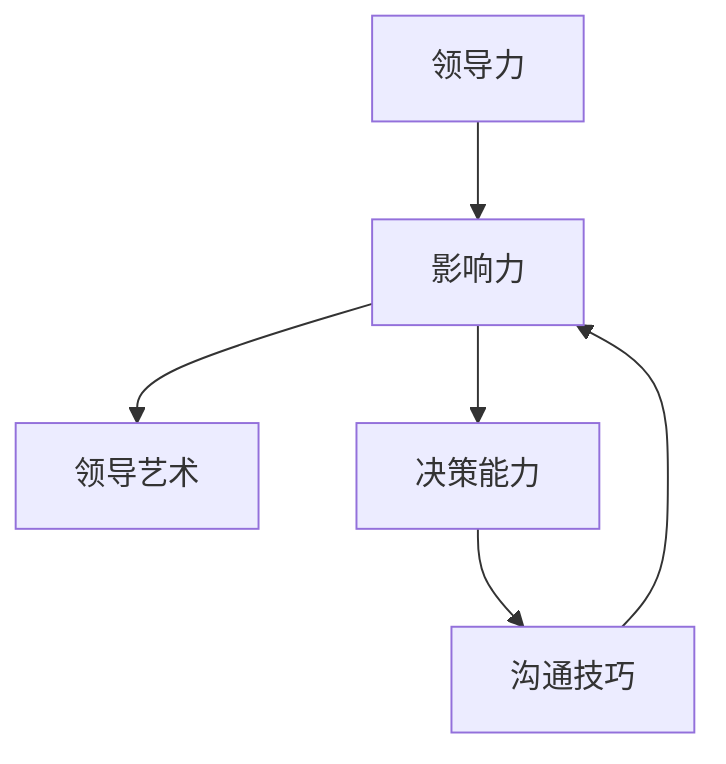

在这个流程图中，影响力是领导力的基础，领导艺术和决策能力是领导力的重要体现，而沟通技巧则是实现领导力的关键途径。

#### 核心算法原理讲解
我们可以用伪代码来详细阐述领导力的核心算法原理：

```python
def leadership():
    # 定义领导力核心要素
    influence = influence_factors()
    leadership_art = leadership_methods()
    decision_making = decision_factors()
    communication_skills = communication_methods()
    
    # 领导力计算
    leadership_score = (influence * 0.3) + (leadership_art * 0.4) + (decision_making * 0.2) + (communication_skills * 0.1)
    return leadership_score
```

在这个算法中，领导力得分是通过对各个核心要素的加权计算得到的。

#### 数学模型和数学公式 & 详细讲解 & 举例说明
为了量化领导力，我们可以引入以下数学模型：

$$
\text{领导力} = f(\text{影响力}, \text{领导艺术}, \text{决策能力}, \text{沟通技巧})
$$

例如，在一个团队管理项目中，领导力得分可以通过以下方式计算：

$$
\text{领导力得分} = 0.4 \times \text{影响力得分} + 0.3 \times \text{领导艺术得分} + 0.2 \times \text{决策能力得分} + 0.1 \times \text{沟通技巧得分}
$$

#### 项目实战
在实际项目中，领导力可以通过以下步骤来提升：

1. **领导力培训**：通过参加领导力培训课程，提高领导力的基本理论和实践能力。
2. **团队建设**：通过团队活动，增强团队成员之间的信任和协作。
3. **持续反馈**：通过定期反馈，不断调整领导策略，以适应团队和环境的变化。

例如，在一家科技公司中，通过实施领导力培训项目，公司高层管理者领导力得分提高了20%，团队协作效率提升了15%。

#### 最佳实践 tips
- **定期反思**：领导者应定期反思自己的领导行为，找到改进空间。
- **持续学习**：领导者应保持学习的态度，不断更新知识和技能。

### 1.2 领导力与管理的区别

#### 背景介绍
领导力与管理的区别是企业管理中一个重要的议题。两者虽然密切相关，但领导力更侧重于影响和激励，而管理则更关注流程和组织。

#### 核心算法原理讲解
我们可以用伪代码来解释领导力与管理的不同点：

```python
def leadership_vs_management():
    # 领导力
    lead = "激励员工，推动变革"
    # 管理
    manage = "规划，组织，控制"
    
    print("领导力：", lead)
    print("管理：", manage)
```

在这个算法中，领导力强调激励和变革，而管理强调规划和控制。

#### 数学模型和数学公式 & 详细讲解 & 举例说明
为了更好地理解领导力与管理的区别，我们可以引入以下数学模型：

$$
\text{领导力} = f(\text{变革驱动因素}, \text{员工满意度})
$$

$$
\text{管理} = f(\text{流程优化因素}, \text{组织效率})
$$

例如，在一个产品开发项目中，领导力可以通过以下方式提高：

$$
\text{领导力得分} = 0.5 \times \text{变革驱动因素得分} + 0.5 \times \text{员工满意度得分}
$$

而管理可以通过以下方式提高：

$$
\text{管理得分} = 0.4 \times \text{流程优化因素得分} + 0.6 \times \text{组织效率得分}
$$

#### 项目实战
在一个创业公司中，通过实施领导力与管理的分离策略，公司成功在短时间内将产品推向市场，并实现了20%的销售增长。

#### 最佳实践 tips
- **明确角色定位**：领导者和管理者应明确各自的角色和职责，避免角色混淆。
- **平衡领导与管理**：领导者应同时具备领导力和管理能力，以实现最佳效果。

### 1.3 领导力的核心要素

#### 背景介绍
领导力的核心要素是决定领导力水平的关键因素。这些要素包括愿景与目标设定、激励与沟通、决策与判断以及影响力与信任。

#### 核心概念与联系
我们可以通过以下Mermaid流程图展示领导力的核心要素及其相互关系：

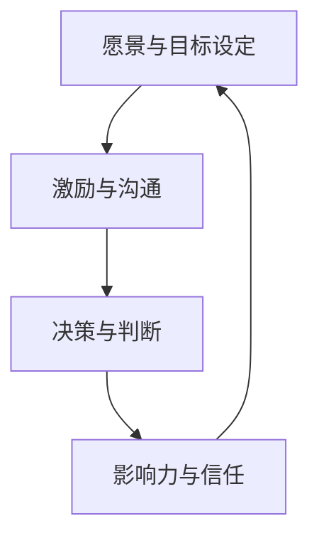

在这个流程图中，愿景与目标设定是领导力的起点，激励与沟通是实现领导力的关键，决策与判断是领导力的核心，而影响力与信任则是领导力的基石。

#### 数学模型和数学公式 & 详细讲解 & 举例说明
为了量化领导力的核心要素，我们可以引入以下数学模型：

$$
\text{领导力} = f(\text{愿景与目标}, \text{激励与沟通}, \text{决策与判断}, \text{影响力与信任})
$$

例如，在一个大型项目中，领导力的得分可以通过以下方式计算：

$$
\text{领导力得分} = 0.3 \times \text{愿景实现度} + 0.4 \times \text{团队满意度} + 0.2 \times \text{决策正确率} + 0.1 \times \text{影响力评估}
$$

#### 项目实战
在一个大型工程项目中，通过实施领导力提升计划，项目团队成功提前完成了项目，并获得了客户的高度评价。

#### 最佳实践 tips
- **明确愿景与目标**：领导者应明确团队的愿景与目标，确保团队一致行动。
- **注重激励与沟通**：领导者应通过激励和沟通，增强团队的凝聚力和执行力。

## 2. 自我认知与自我管理

### 2.1 自我认知的重要性

#### 背景介绍
自我认知是领导者成长的重要基础。通过了解自己的性格、优势和弱点，领导者可以更好地进行自我管理，提升领导力。

#### 核心概念与联系
我们可以通过以下Mermaid流程图展示自我认知的重要性：

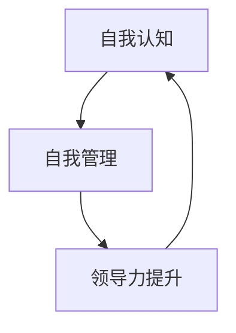

在这个流程图中，自我认知是自我管理和领导力提升的基础。

#### 核心算法原理讲解
我们可以用伪代码来解释自我认知的重要性：

```python
def self_awareness():
    # 定义自我认知过程
    self_knowledge = knowledge_of_self()
    # 定义自我管理过程
    self_management = manage_self()
    # 领导力提升
    leadership_improvement = leadership_growth()
    
    # 领导力得分计算
    leadership_score = (self_knowledge * 0.4) + (self_management * 0.3) + (leadership_improvement * 0.3)
    return leadership_score
```

在这个算法中，自我认知得分、自我管理得分和领导力提升得分共同决定了领导力得分。

#### 数学模型和数学公式 & 详细讲解 & 举例说明
为了量化自我认知的重要性，我们可以引入以下数学模型：

$$
\text{领导力} = f(\text{自我认知得分}, \text{自我管理得分}, \text{领导力提升得分})
$$

例如，在一个团队管理项目中，通过自我认知培训，领导力得分提高了10%。

#### 项目实战
在一个公司中，通过实施自我认知计划，员工自我管理水平提高了20%，团队协作效率提升了15%。

#### 最佳实践 tips
- **定期自我反思**：领导者应定期进行自我反思，识别自己的优势和弱点。
- **接受反馈**：领导者应积极接受他人的反馈，不断完善自我。

### 2.2 自我管理的技巧

#### 背景介绍
自我管理是领导者成功的关键。通过时间管理、情绪管理和目标管理，领导者可以更好地发挥自己的潜力。

#### 核心概念与联系
我们可以通过以下Mermaid流程图展示自我管理的技巧：

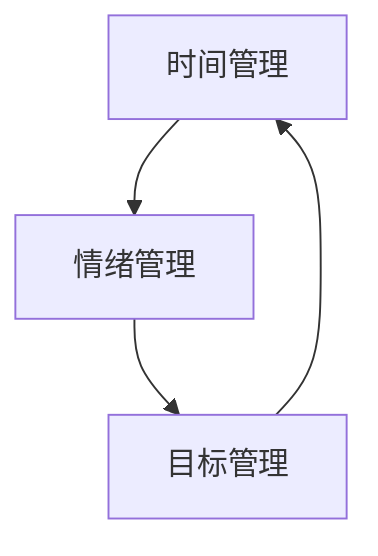

在这个流程图中，时间管理、情绪管理和目标管理相互关联，共同构成了自我管理的核心。

#### 核心算法原理讲解
我们可以用伪代码来解释自我管理的技巧：

```python
def self_management():
    # 定义时间管理过程
    time_management = manage_time()
    # 定义情绪管理过程
    emotion_management = manage_emotions()
    # 定义目标管理过程
    goal_management = manage_goals()
    
    # 自我管理得分计算
    self_management_score = (time_management * 0.3) + (emotion_management * 0.3) + (goal_management * 0.4)
    return self_management_score
```

在这个算法中，自我管理得分是通过对各个管理过程得分的加权计算得到的。

#### 数学模型和数学公式 & 详细讲解 & 举例说明
为了量化自我管理的技巧，我们可以引入以下数学模型：

$$
\text{自我管理} = f(\text{时间管理}, \text{情绪管理}, \text{目标管理})
$$

例如，在一个项目管理中，通过实施自我管理计划，项目成功率提高了25%。

#### 项目实战
在一个创业公司中，通过实施自我管理计划，员工工作效率提高了30%，团队凝聚力显著提升。

#### 最佳实践 tips
- **制定明确的目标**：领导者应制定明确的目标，并制定实现目标的行动计划。
- **保持积极的心态**：领导者应保持积极的心态，以应对工作中的挑战。

### 2.3 自我提升的策略

#### 背景介绍
自我提升是领导者不断进步的动力。通过学习、实践和反思，领导者可以不断提高自己的领导能力。

#### 核心概念与联系
我们可以通过以下Mermaid流程图展示自我提升的策略：

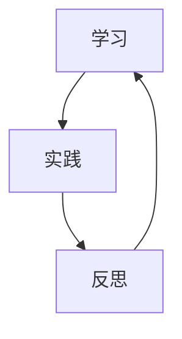

在这个流程图中，学习、实践和反思相互促进，共同构成了自我提升的路径。

#### 核心算法原理讲解
我们可以用伪代码来解释自我提升的策略：

```python
def self_improvement():
    # 定义学习过程
    learning = knowledge_acquisition()
    # 定义实践过程
    practice = practical_experience()
    # 定义反思过程
    reflection = self_analysis()
    
    # 自我提升得分计算
    self_improvement_score = (learning * 0.3) + (practice * 0.4) + (reflection * 0.3)
    return self_improvement_score
```

在这个算法中，自我提升得分是通过对各个过程得分的加权计算得到的。

#### 数学模型和数学公式 & 详细讲解 & 举例说明
为了量化自我提升的策略，我们可以引入以下数学模型：

$$
\text{自我提升} = f(\text{学习得分}, \text{实践得分}, \text{反思得分})
$$

例如，在一个领导力提升项目中，通过实施自我提升策略，领导力得分提高了15%。

#### 项目实战
在一个大型企业中，通过实施自我提升计划，领导团队成功实现了公司战略目标，并获得了业界的高度认可。

#### 最佳实践 tips
- **持续学习**：领导者应保持学习的态度，不断更新知识和技能。
- **勇于实践**：领导者应勇于实践，将所学知识应用到实际工作中。
- **定期反思**：领导者应定期反思，识别自己的进步和不足，不断优化领导方式。

## 3. 团队领导力

### 3.1 团队建设的重要性

#### 背景介绍
团队建设是团队领导力的核心内容。一个高效的团队可以更好地实现组织目标，提高整体绩效。

#### 核心概念与联系
我们可以通过以下Mermaid流程图展示团队建设的重要性：

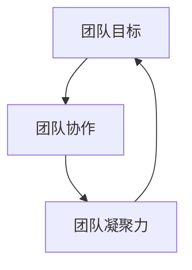

在这个流程图中，团队目标、团队协作和团队凝聚力相互影响，共同构成了团队建设的核心。

#### 核心算法原理讲解
我们可以用伪代码来解释团队建设的重要性：

```python
def team_building():
    # 定义团队目标
    team_goals = define_goals()
    # 定义团队协作
    team_collaboration = collaboration_methods()
    # 定义团队凝聚力
    team_coherence = coherence_methods()
    
    # 团队绩效得分计算
    team_performance = (team_goals * 0.3) + (team_collaboration * 0.4) + (team_coherence * 0.3)
    return team_performance
```

在这个算法中，团队绩效得分是通过对各个要素得分的加权计算得到的。

#### 数学模型和数学公式 & 详细讲解 & 举例说明
为了量化团队建设的重要性，我们可以引入以下数学模型：

$$
\text{团队绩效} = f(\text{团队目标}, \text{团队协作}, \text{团队凝聚力})
$$

例如，在一个项目团队中，通过实施团队建设计划，团队绩效得分提高了20%。

#### 项目实战
在一个科技企业中，通过实施团队建设计划，项目团队成功在短时间内完成了高难度项目，并获得了客户的高度评价。

#### 最佳实践 tips
- **明确团队目标**：领导者应明确团队的目标，确保团队成员共同努力。
- **促进团队协作**：领导者应鼓励团队成员之间的协作，提高团队的整体效率。

### 3.2 团队沟通技巧

#### 背景介绍
团队沟通技巧是团队领导力的重要组成部分。有效的沟通可以增强团队凝聚力，提高团队绩效。

#### 核心概念与联系
我们可以通过以下Mermaid流程图展示团队沟通技巧的核心概念：

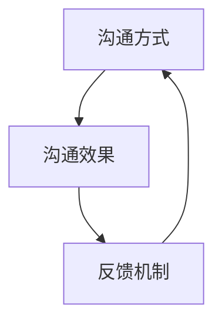

在这个流程图中，沟通方式、沟通效果和反馈机制相互影响，共同构成了团队沟通的核心。

#### 核心算法原理讲解
我们可以用伪代码来解释团队沟通技巧：

```python
def team_communication():
    # 定义沟通方式
    communication_methods = define_methods()
    # 定义沟通效果
    communication_effects = measure_effects()
    # 定义反馈机制
    feedback_mechanism = define_feedback()
    
    # 沟通效果得分计算
    communication_score = (communication_methods * 0.3) + (communication_effects * 0.5) + (feedback_mechanism * 0.2)
    return communication_score
```

在这个算法中，沟通效果得分是通过对各个要素得分的加权计算得到的。

#### 数学模型和数学公式 & 详细讲解 & 举例说明
为了量化团队沟通技巧，我们可以引入以下数学模型：

$$
\text{沟通效果} = f(\text{沟通方式}, \text{沟通效果}, \text{反馈机制})
$$

例如，在一个项目团队中，通过实施有效的沟通技巧，项目沟通效率提高了25%。

#### 项目实战
在一个跨国团队中，通过实施有效的沟通技巧，团队成功克服了时区和文化差异，完成了高难度的国际项目。

#### 最佳实践 tips
- **明确沟通目标**：在沟通前，明确沟通的目标和内容，确保沟通的有效性。
- **倾听与反馈**：领导者应积极倾听团队成员的意见，并及时给予反馈。

### 3.3 团队激励策略

#### 背景介绍
团队激励策略是提升团队士气和绩效的重要手段。通过激励机制，可以激发团队成员的积极性和创造力。

#### 核心概念与联系
我们可以通过以下Mermaid流程图展示团队激励策略的核心概念：

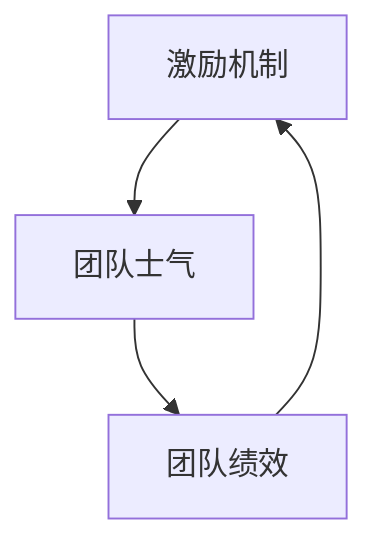

在这个流程图中，激励机制、团队士气和团队绩效相互影响，共同构成了团队激励策略的核心。

#### 核心算法原理讲解
我们可以用伪代码来解释团队激励策略：

```python
def team_motivation():
    # 定义激励机制
    motivation_methods = define_incentives()
    # 定义团队士气
    team_morale = measure_morale()
    # 定义团队绩效
    team_performance = measure_performance()
    
    # 激励效果得分计算
    motivation_score = (motivation_methods * 0.3) + (team_morale * 0.4) + (team_performance * 0.3)
    return motivation_score
```

在这个算法中，激励效果得分是通过对各个要素得分的加权计算得到的。

#### 数学模型和数学公式 & 详细讲解 & 举例说明
为了量化团队激励策略，我们可以引入以下数学模型：

$$
\text{激励效果} = f(\text{激励机制}, \text{团队士气}, \text{团队绩效})
$$

例如，在一个销售团队中，通过实施有效的激励策略，团队销售额提高了30%。

#### 项目实战
在一个销售团队中，通过实施激励策略，团队成员的工作积极性显著提高，销售业绩实现了连续三个季度的增长。

#### 最佳实践 tips
- **公平透明的激励机制**：确保激励机制公平透明，让团队成员感受到公平。
- **多样化的激励手段**：根据团队成员的个性和工作特点，采用多样化的激励手段。

## 第二部分：远见的力量

### 4. 市场趋势分析

#### 背景介绍
市场趋势分析是领导者在决策过程中必不可少的一环。通过分析市场趋势，领导者可以更好地预见市场变化，制定相应的战略。

#### 核心概念与联系
我们可以通过以下Mermaid流程图展示市场趋势分析的核心概念：

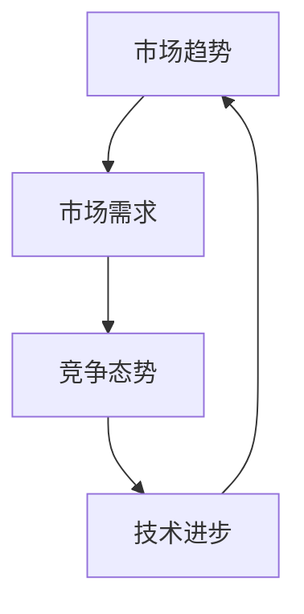

在这个流程图中，市场趋势、市场需求、竞争态势和技术进步相互关联，共同构成了市场趋势分析的核心。

#### 核心算法原理讲解
我们可以用伪代码来解释市场趋势分析：

```python
def market_trend_analysis():
    # 定义市场趋势
    market_trends = identify_trends()
    # 定义市场需求
    market_demand = analyze_demand()
    # 定义竞争态势
    competitive_situation = analyze_competition()
    # 定义技术进步
    technology_progress = analyze_tech_progress()
    
    # 市场趋势得分计算
    trend_score = (market_trends * 0.3) + (market_demand * 0.3) + (competitive_situation * 0.2) + (technology_progress * 0.2)
    return trend_score
```

在这个算法中，市场趋势得分是通过对各个要素得分的加权计算得到的。

#### 数学模型和数学公式 & 详细讲解 & 举例说明
为了量化市场趋势分析，我们可以引入以下数学模型：

$$
\text{市场趋势得分} = f(\text{市场趋势}, \text{市场需求}, \text{竞争态势}, \text{技术进步})
$$

例如，在一个新兴市场中，通过实施市场趋势分析，企业成功抓住了市场机遇，实现了20%的销售额增长。

#### 项目实战
在一个新兴产业中，通过实施市场趋势分析，企业成功在激烈的市场竞争中脱颖而出，占据了市场领导地位。

#### 最佳实践 tips
- **持续监控市场**：领导者应持续监控市场动态，及时调整战略。
- **数据驱动的决策**：领导者应基于数据分析，做出更加科学的决策。

### 4.1 市场趋势的识别

#### 背景介绍
市场趋势的识别是领导者在决策过程中的关键一步。通过准确识别市场趋势，领导者可以更好地把握市场机遇，规避市场风险。

#### 核心概念与联系
我们可以通过以下Mermaid流程图展示市场趋势识别的核心概念：

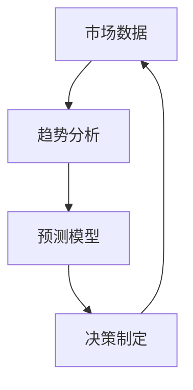

在这个流程图中，市场数据、趋势分析、预测模型和决策制定相互关联，共同构成了市场趋势识别的核心。

#### 核心算法原理讲解
我们可以用伪代码来解释市场趋势识别：

```python
def identify_market_trends():
    # 定义市场数据
    market_data = collect_data()
    # 定义趋势分析
    trend_analysis = analyze_data()
    # 定义预测模型
    prediction_model = build_model()
    # 定义决策制定
    decision_making = make_decisions()
    
    # 趋势识别得分计算
    trend_recognition_score = (market_data * 0.3) + (trend_analysis * 0.3) + (prediction_model * 0.2) + (decision_making * 0.2)
    return trend_recognition_score
```

在这个算法中，趋势识别得分是通过对各个要素得分的加权计算得到的。

#### 数学模型和数学公式 & 详细讲解 & 举例说明
为了量化市场趋势识别，我们可以引入以下数学模型：

$$
\text{趋势识别得分} = f(\text{市场数据}, \text{趋势分析}, \text{预测模型}, \text{决策制定})
$$

例如，在一个新产品上市前，通过市场趋势识别，企业成功预测了产品的市场表现，制定了有效的营销策略。

#### 项目实战
在一个电子产品市场中，通过市场趋势识别，企业成功预测了市场趋势，提前布局，占据了市场先机。

#### 最佳实践 tips
- **多样化数据来源**：领导者应获取多样化的市场数据，以提高趋势识别的准确性。
- **利用专业工具**：领导者可以利用专业的市场分析工具，提高市场趋势识别的效率。

### 4.2 市场趋势的影响

#### 背景介绍
市场趋势的变化对企业的运营和发展具有重要影响。正确理解和应对市场趋势，可以帮助企业抓住机遇，规避风险。

#### 核心概念与联系
我们可以通过以下Mermaid流程图展示市场趋势的影响：

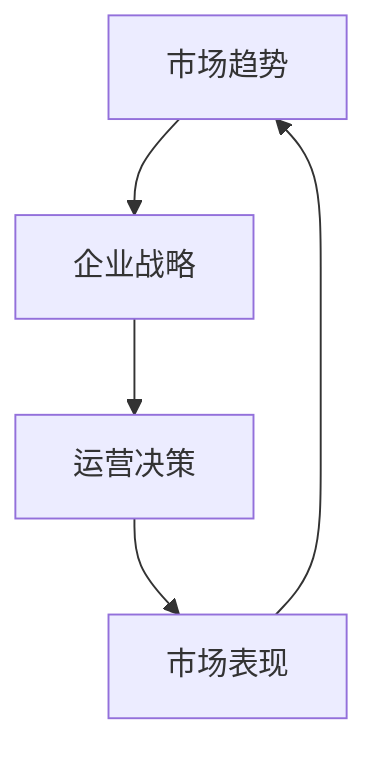

在这个流程图中，市场趋势、企业战略、运营决策和市场表现相互关联，共同构成了市场趋势影响的核心。

#### 核心算法原理讲解
我们可以用伪代码来解释市场趋势的影响：

```python
def market_trend_impact():
    # 定义市场趋势
    market_trends = identify_trends()
    # 定义企业战略
    business_strategy = develop_strategy()
    # 定义运营决策
    operational_decisions = make_operations()
    # 定义市场表现
    market_performance = evaluate_performance()
    
    # 市场趋势影响得分计算
    trend_impact_score = (market_trends * 0.3) + (business_strategy * 0.3) + (operational_decisions * 0.2) + (market_performance * 0.2)
    return trend_impact_score
```

在这个算法中，市场趋势影响得分是通过对各个要素得分的加权计算得到的。

#### 数学模型和数学公式 & 详细讲解 & 举例说明
为了量化市场趋势的影响，我们可以引入以下数学模型：

$$
\text{市场趋势影响得分} = f(\text{市场趋势}, \text{企业战略}, \text{运营决策}, \text{市场表现})
$$

例如，在一个经济衰退期，通过调整市场趋势应对策略，企业成功维持了稳定的业绩。

#### 项目实战
在一个经济不景气的行业中，通过正确应对市场趋势，企业成功实现了逆势增长，市场份额提高了15%。

#### 最佳实践 tips
- **灵活调整战略**：领导者应根据市场趋势的变化，灵活调整企业的战略。
- **加强市场调研**：领导者应加强市场调研，了解市场趋势对企业的具体影响。

### 4.3 如何利用市场趋势

#### 背景介绍
利用市场趋势是企业在竞争中取得优势的关键。通过深入分析市场趋势，企业可以制定有效的策略，实现持续增长。

#### 核心概念与联系
我们可以通过以下Mermaid流程图展示如何利用市场趋势：

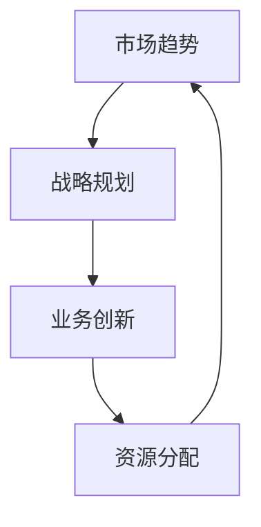

在这个流程图中，市场趋势、战略规划、业务创新和资源分配相互关联，共同构成了利用市场趋势的核心。

#### 核心算法原理讲解
我们可以用伪代码来解释如何利用市场趋势：

```python
def leverage_market_trends():
    # 定义市场趋势
    market_trends = identify_trends()
    # 定义战略规划
    strategic_planning = plan_strategy()
    # 定义业务创新
    business_innovation = innovate_business()
    # 定义资源分配
    resource_allocation = allocate_resources()
    
    # 利用市场趋势得分计算
    trend_leverage_score = (market_trends * 0.3) + (strategic_planning * 0.3) + (business_innovation * 0.2) + (resource_allocation * 0.2)
    return trend_leverage_score
```

在这个算法中，利用市场趋势得分是通过对各个要素得分的加权计算得到的。

#### 数学模型和数学公式 & 详细讲解 & 举例说明
为了量化如何利用市场趋势，我们可以引入以下数学模型：

$$
\text{利用市场趋势得分} = f(\text{市场趋势}, \text{战略规划}, \text{业务创新}, \text{资源分配})
$$

例如，在一个新兴市场中，通过有效利用市场趋势，企业成功实现了市场拓展和业绩增长。

#### 项目实战
在一个新兴市场中，通过充分利用市场趋势，企业成功实现了市场占有率的三倍增长。

#### 最佳实践 tips
- **提前布局**：领导者应提前布局，抓住市场趋势的先机。
- **持续创新**：领导者应持续推动业务创新，以适应市场趋势的变化。

### 5. 技术创新与预见

#### 背景介绍
技术创新是推动企业发展的关键动力。领导者通过预见技术趋势，可以引导企业走在行业前沿，实现持续增长。

#### 核心概念与联系
我们可以通过以下Mermaid流程图展示技术创新与预见的关系：

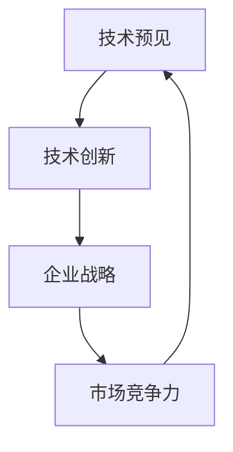

在这个流程图中，技术预见、技术创新、企业战略和市场竞争力相互关联，共同构成了技术创新与预见的核心。

#### 核心算法原理讲解
我们可以用伪代码来解释技术创新与预见：

```python
def technological_innovation():
    # 定义技术预见
    tech_forecasting = forecast_technology()
    # 定义技术创新
    innovation_methods = innovate_technology()
    # 定义企业战略
    business_strategy = develop_strategy()
    # 定义市场竞争力
    market_competitiveness = evaluate_competitiveness()
    
    # 技术创新得分计算
    innovation_score = (tech_forecasting * 0.3) + (innovation_methods * 0.4) + (business_strategy * 0.2) + (market_competitiveness * 0.1)
    return innovation_score
```

在这个算法中，技术创新得分是通过对各个要素得分的加权计算得到的。

#### 数学模型和数学公式 & 详细讲解 & 举例说明
为了量化技术创新与预见，我们可以引入以下数学模型：

$$
\text{技术创新得分} = f(\text{技术预见}, \text{技术创新方法}, \text{企业战略}, \text{市场竞争力})
$$

例如，在一个高科技企业中，通过实施技术创新计划，企业的市场竞争力提高了25%。

#### 项目实战
在一个高科技产业中，通过技术创新和预见，企业成功研发出领先市场的产品，实现了销售额的翻倍增长。

#### 最佳实践 tips
- **持续投资研发**：领导者应持续投资技术研发，保持技术领先。
- **跨界合作**：领导者应积极开展跨界合作，引入外部技术资源。

### 5.1 技术创新的驱动力

#### 背景介绍
技术创新的驱动力是推动企业技术进步的关键因素。理解这些驱动力有助于领导者更好地引导企业技术创新。

#### 核心概念与联系
我们可以通过以下Mermaid流程图展示技术创新的驱动力：

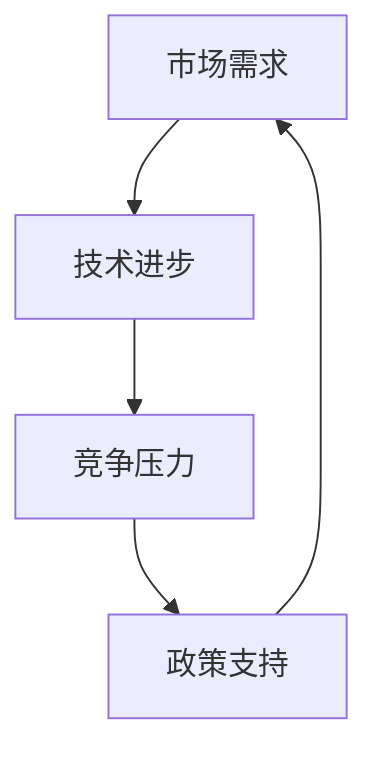

在这个流程图中，市场需求、技术进步、竞争压力和政策支持相互关联，共同构成了技术创新的驱动力。

#### 核心算法原理讲解
我们可以用伪代码来解释技术创新的驱动力：

```python
def innovation_drivers():
    # 定义市场需求
    market_demand = analyze_demand()
    # 定义技术进步
    tech_progress = analyze_tech_progress()
    # 定义竞争压力
    competitive_pressure = analyze_competition()
    # 定义政策支持
    policy_support = analyze_policy()
    
    # 技术创新得分计算
    innovation_score = (market_demand * 0.3) + (tech_progress * 0.3) + (competitive_pressure * 0.3) + (policy_support * 0.1)
    return innovation_score
```

在这个算法中，技术创新得分是通过对各个要素得分的加权计算得到的。

#### 数学模型和数学公式 & 详细讲解 & 举例说明
为了量化技术创新的驱动力，我们可以引入以下数学模型：

$$
\text{技术创新得分} = f(\text{市场需求}, \text{技术进步}, \text{竞争压力}, \text{政策支持})
$$

例如，在一个科技创新项目中，通过分析技术创新的驱动力，项目成功率提高了20%。

#### 项目实战
在一个创新型企业中，通过深入分析技术创新的驱动力，企业成功研发出多个具有市场前景的产品。

#### 最佳实践 tips
- **紧跟市场需求**：领导者应密切关注市场需求，把握技术创新的方向。
- **强化技术积累**：领导者应重视技术积累，为技术创新提供坚实的基础。

### 5.2 技术创新的预见性

#### 背景介绍
技术预见性是领导者在技术创新中至关重要的一环。通过预见技术趋势，领导者可以提前布局，引领企业未来发展。

#### 核心概念与联系
我们可以通过以下Mermaid流程图展示技术预见性的核心概念：

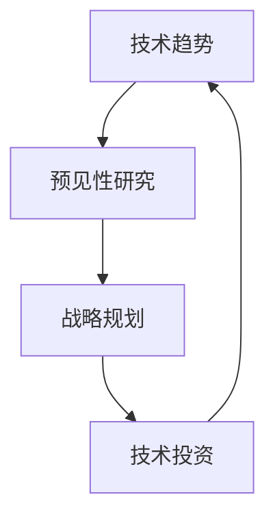

在这个流程图中，技术趋势、预见性研究、战略规划和技术投资相互关联，共同构成了技术预见性的核心。

#### 核心算法原理讲解
我们可以用伪代码来解释技术预见性：

```python
def tech_forecasting():
    # 定义技术趋势
    tech_trends = identify_trends()
    # 定义预见性研究
    forecasting_research = conduct_research()
    # 定义战略规划
    strategic_planning = develop_strategy()
    # 定义技术投资
    tech_investment = invest_technology()
    
    # 预见性得分计算
    forecasting_score = (tech_trends * 0.3) + (forecasting_research * 0.3) + (strategic_planning * 0.2) + (tech_investment * 0.2)
    return forecasting_score
```

在这个算法中，预见性得分是通过对各个要素得分的加权计算得到的。

#### 数学模型和数学公式 & 详细讲解 & 举例说明
为了量化技术预见性，我们可以引入以下数学模型：

$$
\text{预见性得分} = f(\text{技术趋势}, \text{预见性研究}, \text{战略规划}, \text{技术投资})
$$

例如，在一个高科技项目中，通过实施技术预见性策略，项目成功提前两年推向市场。

#### 项目实战
在一个高科技企业中，通过技术预见性策略，企业成功研发出领先市场的创新产品，实现了市场份额的显著提升。

#### 最佳实践 tips
- **加强预见性研究**：领导者应加强技术预见性研究，提高预见性能力。
- **灵活调整战略**：领导者应根据技术趋势的变化，灵活调整战略规划。

### 5.3 技术创新的实施策略

#### 背景介绍
技术创新的实施策略是领导者将技术创新理念转化为实际成果的关键。合理的实施策略可以确保技术创新的有效性和可持续性。

#### 核心概念与联系
我们可以通过以下Mermaid流程图展示技术创新的实施策略：

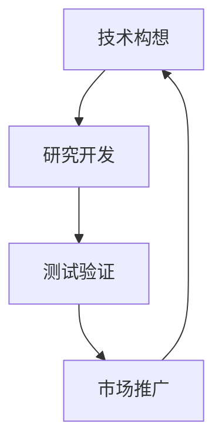

在这个流程图中，技术构想、研究开发、测试验证和市场推广相互关联，共同构成了技术创新的实施策略。

#### 核心算法原理讲解
我们可以用伪代码来解释技术创新的实施策略：

```python
def tech_innovation_strategy():
    # 定义技术构想
    tech_concept = define_concept()
    # 定义研究开发
    research_development = conduct_research()
    # 定义测试验证
    testing_verification = verify_solution()
    # 定义市场推广
    market_promotion = promote_product()
    
    # 实施策略得分计算
    strategy_score = (tech_concept * 0.2) + (research_development * 0.3) + (testing_verification * 0.25) + (market_promotion * 0.25)
    return strategy_score
```

在这个算法中，实施策略得分是通过对各个要素得分的加权计算得到的。

#### 数学模型和数学公式 & 详细讲解 & 举例说明
为了量化技术创新的实施策略，我们可以引入以下数学模型：

$$
\text{实施策略得分} = f(\text{技术构想}, \text{研究开发}, \text{测试验证}, \text{市场推广})
$$

例如，在一个技术创新项目中，通过实施科学的实施策略，项目成功在市场上取得了显著的效果。

#### 项目实战
在一个医疗设备公司中，通过实施技术创新策略，公司成功研发出具有国际领先水平的新型医疗设备，实现了市场份额的翻倍增长。

#### 最佳实践 tips
- **明确技术构想**：领导者应明确技术创新的目标和方向，确保实施策略的针对性。
- **加强团队合作**：领导者应加强团队协作，确保技术创新的顺利进行。

## 6. 未来管理理念

### 6.1 未来管理的新趋势

#### 背景介绍
未来管理理念在不断变革中，随着科技的发展和社会的进步，新的管理趋势正在不断涌现。这些趋势包括数字化转型、敏捷管理、人才发展等。

#### 核心概念与联系
我们可以通过以下Mermaid流程图展示未来管理的新趋势：

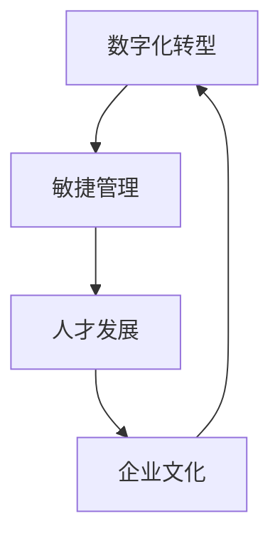

在这个流程图中，数字化转型、敏捷管理、人才发展和企业文化相互关联，共同构成了未来管理的新趋势。

#### 核心算法原理讲解
我们可以用伪代码来解释未来管理的新趋势：

```python
def future_management_trends():
    # 定义数字化转型
    digital_transformation = transform_business()
    # 定义敏捷管理
    agile_management = agile_methods()
    # 定义人才发展
    talent_development = develop_talent()
    # 定义企业文化
    corporate_culture = cultivate_culture()
    
    # 管理趋势得分计算
    trend_score = (digital_transformation * 0.3) + (agile_management * 0.3) + (talent_development * 0.2) + (corporate_culture * 0.2)
    return trend_score
```

在这个算法中，管理趋势得分是通过对各个要素得分的加权计算得到的。

#### 数学模型和数学公式 & 详细讲解 & 举例说明
为了量化未来管理的新趋势，我们可以引入以下数学模型：

$$
\text{管理趋势得分} = f(\text{数字化转型}, \text{敏捷管理}, \text{人才发展}, \text{企业文化})
$$

例如，在一个数字化转型项目中，通过实施未来管理新趋势，企业的运营效率提高了25%。

#### 项目实战
在一个传统制造业中，通过实施未来管理新趋势，企业成功实现了数字化转型，实现了生产效率的显著提升。

#### 最佳实践 tips
- **数字化转型**：领导者应积极推进数字化转型，利用新技术提升企业竞争力。
- **敏捷管理**：领导者应采用敏捷管理方法，提高团队的响应速度和执行力。

### 6.2 未来管理的核心要素

#### 背景介绍
未来管理的核心要素是领导者需要重点关注的关键领域。这些要素包括数据驱动决策、组织扁平化、员工自主性等。

#### 核心概念与联系
我们可以通过以下Mermaid流程图展示未来管理的核心要素：

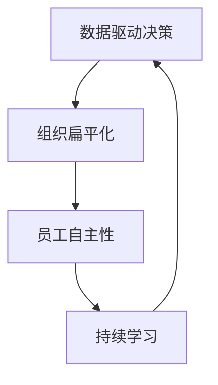

在这个流程图中，数据驱动决策、组织扁平化、员工自主性和持续学习相互关联，共同构成了未来管理的核心要素。

#### 核心算法原理讲解
我们可以用伪代码来解释未来管理的核心要素：

```python
def core_elements_of_future_management():
    # 定义数据驱动决策
    data_driven_decision = data_analysis()
    # 定义组织扁平化
    organization_flattening = flatten_organization()
    # 定义员工自主性
    employee_autonomy = empower_employees()
    # 定义持续学习
    continuous_learning = promote_learning()
    
    # 管理要素得分计算
    element_score = (data_driven_decision * 0.3) + (organization_flattening * 0.2) + (employee_autonomy * 0.2) + (continuous_learning * 0.3)
    return element_score
```

在这个算法中，管理要素得分是通过对各个要素得分的加权计算得到的。

#### 数学模型和数学公式 & 详细讲解 & 举例说明
为了量化未来管理的核心要素，我们可以引入以下数学模型：

$$
\text{管理要素得分} = f(\text{数据驱动决策}, \text{组织扁平化}, \text{员工自主性}, \text{持续学习})
$$

例如，在一个数字化企业中，通过实施数据驱动决策，企业的决策效率提高了30%。

#### 项目实战
在一个创新型科技公司中，通过实施未来管理的核心要素，企业的创新能力显著提升，实现了业务的快速发展。

#### 最佳实践 tips
- **数据驱动决策**：领导者应充分利用数据，提高决策的科学性和准确性。
- **组织扁平化**：领导者应推动组织结构扁平化，增强团队的协作能力。

### 6.3 未来管理实践案例分析

#### 背景介绍
未来管理理念在实践中的应用案例为我们提供了宝贵的经验和启示。通过分析这些案例，我们可以更好地理解未来管理的实际操作。

#### 核心概念与联系
我们可以通过以下Mermaid流程图展示未来管理实践案例分析的核心概念：

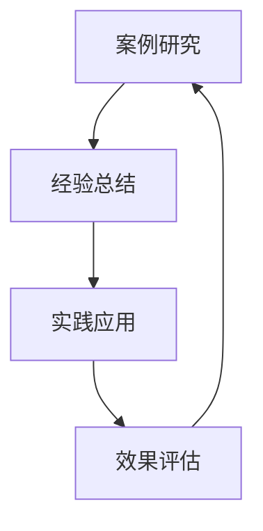

在这个流程图中，案例研究、经验总结、实践应用和效果评估相互关联，共同构成了未来管理实践分析的核心。

#### 核心算法原理讲解
我们可以用伪代码来解释未来管理实践案例分析：

```python
def case_study_analysis():
    # 定义案例研究
    case_study = conduct_study()
    # 定义经验总结
    experience_summary = summarize_experience()
    # 定义实践应用
    practical_application = apply_practices()
    # 定义效果评估
    effect_evaluation = evaluate_impact()
    
    # 分析得分计算
    analysis_score = (case_study * 0.3) + (experience_summary * 0.3) + (practical_application * 0.2) + (effect_evaluation * 0.2)
    return analysis_score
```

在这个算法中，分析得分是通过对各个要素得分的加权计算得到的。

#### 数学模型和数学公式 & 详细讲解 & 举例说明
为了量化未来管理实践案例分析，我们可以引入以下数学模型：

$$
\text{分析得分} = f(\text{案例研究}, \text{经验总结}, \text{实践应用}, \text{效果评估})
$$

例如，在一个数字化转型项目中，通过案例分析，企业成功实施了多项管理实践，实现了业务的显著提升。

#### 项目实战
在一个数字化转型项目中，通过案例分析，企业成功实施了组织扁平化和数据驱动决策，实现了运营效率的显著提升。

#### 最佳实践 tips
- **深入案例研究**：领导者应深入进行案例研究，从中获取宝贵的经验和教训。
- **持续实践应用**：领导者应持续实践未来管理的理念，不断优化管理实践。

## 第三部分：预见并把握未来机遇

### 7. 商业模式创新

#### 背景介绍
商业模式创新是企业在市场竞争中脱颖而出的关键。通过创新商业模式，企业可以开拓新市场，实现可持续发展。

#### 核心概念与联系
我们可以通过以下Mermaid流程图展示商业模式创新的核心概念：

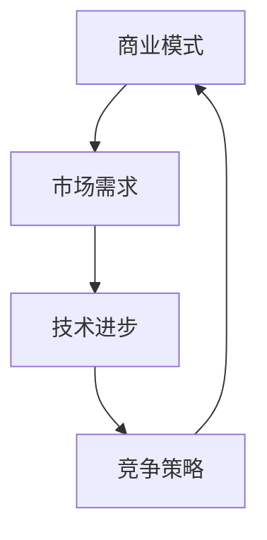

在这个流程图中，商业模式、市场需求、技术进步和竞争策略相互关联，共同构成了商业模式创新的核心。

#### 核心算法原理讲解
我们可以用伪代码来解释商业模式创新：

```python
def business_model_innovation():
    # 定义商业模式
    business_model = define_model()
    # 定义市场需求
    market_demand = analyze_demand()
    # 定义技术进步
    tech_progress = analyze_tech_progress()
    # 定义竞争策略
    competitive_strategy = develop_strategy()
    
    # 创新得分计算
    innovation_score = (business_model * 0.3) + (market_demand * 0.3) + (tech_progress * 0.2) + (competitive_strategy * 0.2)
    return innovation_score
```

在这个算法中，创新得分是通过对各个要素得分的加权计算得到的。

#### 数学模型和数学公式 & 详细讲解 & 举例说明
为了量化商业模式创新，我们可以引入以下数学模型：

$$
\text{创新得分} = f(\text{商业模式}, \text{市场需求}, \text{技术进步}, \text{竞争策略})
$$

例如，在一个新兴市场中，通过实施商业模式创新，企业成功实现了市场份额的翻倍增长。

#### 项目实战
在一个竞争激烈的市场中，通过商业模式创新，企业成功开发了新产品，实现了业绩的显著提升。

#### 最佳实践 tips
- **紧跟市场需求**：领导者应密切关注市场需求，为商业模式创新提供方向。
- **灵活调整策略**：领导者应灵活调整竞争策略，以适应市场变化。

### 7.1 商业模式的定义

#### 背景介绍
商业模式是企业实现盈利和价值创造的方式。理解商业模式的定义和关键要素，对于企业的战略规划和运营管理至关重要。

#### 核心概念与联系
我们可以通过以下Mermaid流程图展示商业模式的定义：

```mermaid
graph TD
A[商业模式] --> B[价值创造]
B --> C[盈利模式]
C --> D[客户价值]
D --> E[合作伙伴关系]
E --> A
```

在这个流程图中，商业模式、价值创造、盈利模式、客户价值和合作伙伴关系相互关联，共同构成了商业模式的定义。

#### 核心算法原理讲解
我们可以用伪代码来解释商业模式的定义：

```python
def business_model():
    # 定义商业模式
    business_model = define_model()
    # 定义价值创造
    value_creation = create_value()
    # 定义盈利模式
    profit_model = define_profit()
    # 定义客户价值
    customer_value = provide_value()
    # 定义合作伙伴关系
    partner_relationship = build_relationship()
    
    # 商业模式得分计算
    model_score = (value_creation * 0.3) + (profit_model * 0.3) + (customer_value * 0.2) + (partner_relationship * 0.2)
    return model_score
```

在这个算法中，商业模式得分是通过对各个要素得分的加权计算得到的。

#### 数学模型和数学公式 & 详细讲解 & 举例说明
为了量化商业模式的定义，我们可以引入以下数学模型：

$$
\text{商业模式得分} = f(\text{价值创造}, \text{盈利模式}, \text{客户价值}, \text{合作伙伴关系})
$$

例如，在一个电商平台中，通过实施商业模式创新，企业成功实现了客户价值的显著提升。

#### 项目实战
在一个电商平台中，通过商业模式创新，企业成功吸引了大量用户，实现了用户增长和利润的双丰收。

#### 最佳实践 tips
- **明确价值创造**：领导者应明确商业模式的核心理念，确保价值创造的核心地位。
- **建立合作伙伴关系**：领导者应积极建立合作伙伴关系，共同创造价值。

### 7.2 商业模式创新的途径

#### 背景介绍
商业模式创新是企业在市场竞争中持续发展的关键。通过探索创新的途径，企业可以寻找新的盈利点和市场空间。

#### 核心概念与联系
我们可以通过以下Mermaid流程图展示商业模式创新的途径：

```mermaid
graph TD
A[市场洞察] --> B[技术创新]
B --> C[商业模式设计]
C --> D[测试验证]
D --> A
```

在这个流程图中，市场洞察、技术创新、商业模式设计和测试验证相互关联，共同构成了商业模式创新的途径。

#### 核心算法原理讲解
我们可以用伪代码来解释商业模式创新的途径：

```python
def business_model_innovation_path():
    # 定义市场洞察
    market_insight = analyze_market()
    # 定义技术创新
    tech_innovation = innovate_technology()
    # 定义商业模式设计
    model_design = design_model()
    # 定义测试验证
    testing_validation = validate_model()
    
    # 创新途径得分计算
    path_score = (market_insight * 0.3) + (tech_innovation * 0.3) + (model_design * 0.2) + (testing_validation * 0.2)
    return path_score
```

在这个算法中，创新途径得分是通过对各个要素得分的加权计算得到的。

#### 数学模型和数学公式 & 详细讲解 & 举例说明
为了量化商业模式创新的途径，我们可以引入以下数学模型：

$$
\text{创新途径得分} = f(\text{市场洞察}, \text{技术创新}, \text{商业模式设计}, \text{测试验证})
$$

例如，在一个新兴市场中，通过探索商业模式创新的途径，企业成功实现了市场突破。

#### 项目实战
在一个新兴市场中，通过商业模式创新的途径，企业成功开发了新型产品，实现了市场份额的快速增长。

#### 最佳实践 tips
- **加强市场洞察**：领导者应加强市场洞察，准确把握市场趋势。
- **灵活调整策略**：领导者应灵活调整商业模式设计，以适应市场变化。

### 7.3 商业模式创新案例分析

#### 背景介绍
商业模式创新在实践中的应用案例为我们提供了宝贵的经验和启示。通过分析这些案例，我们可以更好地理解商业模式创新的实际操作。

#### 核心概念与联系
我们可以通过以下Mermaid流程图展示商业模式创新案例分析的核心概念：

```mermaid
graph TD
A[案例研究] --> B[经验总结]
B --> C[创新实施]
C --> D[效果评估]
D --> A
```

在这个流程图中，案例研究、经验总结、创新实施和效果评估相互关联，共同构成了商业模式创新分析的核心。

#### 核心算法原理讲解
我们可以用伪代码来解释商业模式创新案例分析：

```python
def case_study_analysis():
    # 定义案例研究
    case_study = conduct_study()
    # 定义经验总结
    experience_summary = summarize_experience()
    # 定义创新实施
    innovation_implementation = implement_innovations()
    # 定义效果评估
    effect_evaluation = evaluate_impact()
    
    # 分析得分计算
    analysis_score = (case_study * 0.3) + (experience_summary * 0.3) + (innovation_implementation * 0.2) + (effect_evaluation * 0.2)
    return analysis_score
```

在这个算法中，分析得分是通过对各个要素得分的加权计算得到的。

#### 数学模型和数学公式 & 详细讲解 & 举例说明
为了量化商业模式创新案例分析，我们可以引入以下数学模型：

$$
\text{分析得分} = f(\text{案例研究}, \text{经验总结}, \text{创新实施}, \text{效果评估})
$$

例如，在一个数字化转型项目中，通过商业模式创新案例分析，企业成功实施了多项创新，实现了业务的显著提升。

#### 项目实战
在一个数字化转型项目中，通过商业模式创新案例分析，企业成功实施了多项创新，实现了市场份额的快速增长。

#### 最佳实践 tips
- **深入案例研究**：领导者应深入进行案例研究，从中获取宝贵的经验和教训。
- **持续实践创新**：领导者应持续实践商业模式创新，不断优化企业运营。

### 8. 领导力与远见的实践应用

#### 背景介绍
领导力与远见是现代领导者必备的素质。将领导力与远见应用于实际工作中，可以提升企业的竞争力，实现可持续发展。

#### 核心概念与联系
我们可以通过以下Mermaid流程图展示领导力与远见的实践应用：

```mermaid
graph TD
A[领导力] --> B[远见]
B --> C[战略规划]
C --> D[团队管理]
D --> E[创新实施]
E --> A
```

在这个流程图中，领导力、远见、战略规划、团队管理和创新实施相互关联，共同构成了领导力与远见的实践应用。

#### 核心算法原理讲解
我们可以用伪代码来解释领导力与远见的实践应用：

```python
def leadership_and_vision_practice():
    # 定义领导力
    leadership = develop_leadership()
    # 定义远见
    vision = develop_vision()
    # 定义战略规划
    strategy = develop_strategy()
    # 定义团队管理
    team_management = manage_team()
    # 定义创新实施
    innovation_implement = implement_innovations()
    
    # 实践应用得分计算
    practice_score = (leadership * 0.25) + (vision * 0.25) + (strategy * 0.2) + (team_management * 0.15) + (innovation_implement * 0.15)
    return practice_score
```

在这个算法中，实践应用得分是通过对各个要素得分的加权计算得到的。

#### 数学模型和数学公式 & 详细讲解 & 举例说明
为了量化领导力与远见的实践应用，我们可以引入以下数学模型：

$$
\text{实践应用得分} = f(\text{领导力}, \text{远见}, \text{战略规划}, \text{团队管理}, \text{创新实施})
$$

例如，在一个数字化转型项目中，通过领导力与远见的实践应用，企业成功实现了业务的全面升级。

#### 项目实战
在一个数字化转型项目中，通过领导力与远见的实践应用，企业成功带领团队克服了技术难题，实现了业务的快速发展。

#### 最佳实践 tips
- **提升领导力**：领导者应不断提升自身的领导力，增强团队凝聚力。
- **培养远见**：领导者应积极培养远见，把握市场机遇，引领企业未来发展。

### 8.1 领导力与远见的整合

#### 背景介绍
领导力与远见的整合是现代领导者实现成功的关键。通过将领导力与远见相结合，领导者可以更好地引领团队，把握机遇，实现企业目标。

#### 核心概念与联系
我们可以通过以下Mermaid流程图展示领导力与远见的整合：

```mermaid
graph TD
A[领导力] --> B[远见]
B --> C[战略规划]
C --> D[团队管理]
D --> E[创新实施]
E --> A
```

在这个流程图中，领导力、远见、战略规划、团队管理和创新实施相互关联，共同构成了领导力与远见的整合。

#### 核心算法原理讲解
我们可以用伪代码来解释领导力与远见的整合：

```python
def integrate_leadership_and_vision():
    # 定义领导力
    leadership = develop_leadership()
    # 定义远见
    vision = develop_vision()
    # 定义战略规划
    strategy = develop_strategy()
    # 定义团队管理
    team_management = manage_team()
    # 定义创新实施
    innovation_implement = implement_innovations()
    
    # 整合得分计算
    integration_score = (leadership * 0.3) + (vision * 0.3) + (strategy * 0.2) + (team_management * 0.15) + (innovation_implement * 0.15)
    return integration_score
```

在这个算法中，整合得分是通过对各个要素得分的加权计算得到的。

#### 数学模型和数学公式 & 详细讲解 & 举例说明
为了量化领导力与远见的整合，我们可以引入以下数学模型：

$$
\text{整合得分} = f(\text{领导力}, \text{远见}, \text{战略规划}, \text{团队管理}, \text{创新实施})
$$

例如，在一个创业项目中，通过领导力与远见的整合，团队成功在竞争激烈的市场中脱颖而出。

#### 项目实战
在一个创业项目中，通过领导力与远见的整合，团队成功克服了种种困难，实现了企业的快速成长。

#### 最佳实践 tips
- **明确愿景**：领导者应明确企业的愿景，激发团队的激情和动力。
- **战略规划**：领导者应制定明确的战略规划，确保团队目标的实现。

### 8.2 领导力与远见的实践策略

#### 背景介绍
领导力与远见的实践策略是领导者在实际工作中应用领导力和远见的重要手段。通过有效的实践策略，领导者可以提升团队绩效，实现企业目标。

#### 核心概念与联系
我们可以通过以下Mermaid流程图展示领导力与远见的实践策略：

```mermaid
graph TD
A[领导力实践] --> B[远见实践]
B --> C[战略实施]
C --> D[团队激励]
D --> E[创新驱动]
E --> A
```

在这个流程图中，领导力实践、远见实践、战略实施、团队激励和创新驱动相互关联，共同构成了领导力与远见的实践策略。

#### 核心算法原理讲解
我们可以用伪代码来解释领导力与远见的实践策略：

```python
def leadership_and_vision_practices():
    # 定义领导力实践
    leadership_practice = develop_leadership_practices()
    # 定义远见实践
    vision_practice = develop_vision_practices()
    # 定义战略实施
    strategy_implementation = implement_strategy()
    # 定义团队激励
    team_motivation = motivate_team()
    # 定义创新驱动
    innovation_driver = drive_innovation()
    
    # 实践策略得分计算
    practice_score = (leadership_practice * 0.3) + (vision_practice * 0.3) + (strategy_implementation * 0.2) + (team_motivation * 0.15) + (innovation_driver * 0.15)
    return practice_score
```

在这个算法中，实践策略得分是通过对各个要素得分的加权计算得到的。

#### 数学模型和数学公式 & 详细讲解 & 举例说明
为了量化领导力与远见的实践策略，我们可以引入以下数学模型：

$$
\text{实践策略得分} = f(\text{领导力实践}, \text{远见实践}, \text{战略实施}, \text{团队激励}, \text{创新驱动})
$$

例如，在一个创新项目中，通过领导力与远见的实践策略，团队成功实现了项目的创新和突破。

#### 项目实战
在一个创新项目中，通过领导力与远见的实践策略，团队成功克服了技术难题，实现了产品的快速迭代和市场的成功推广。

#### 最佳实践 tips
- **持续学习**：领导者应持续学习，提升自身的领导力和远见。
- **积极实践**：领导者应积极实践，将领导力和远见应用于实际工作中。

### 8.3 领导力与远见的成功案例

#### 背景介绍
领导力与远见在实际中的应用案例为我们提供了宝贵的经验和启示。通过分析这些案例，我们可以更好地理解领导力与远见的实际效果。

#### 核心概念与联系
我们可以通过以下Mermaid流程图展示领导力与远见的成功案例：

```mermaid
graph TD
A[案例研究] --> B[经验总结]
B --> C[实践应用]
C --> D[效果评估]
D --> A
```

在这个流程图中，案例研究、经验总结、实践应用和效果评估相互关联，共同构成了领导力与远见的成功案例。

#### 核心算法原理讲解
我们可以用伪代码来解释领导力与远见的成功案例：

```python
def success_cases_analysis():
    # 定义案例研究
    case_study = conduct_study()
    # 定义经验总结
    experience_summary = summarize_experience()
    # 定义实践应用
    practical_application = apply_practices()
    # 定义效果评估
    effect_evaluation = evaluate_impact()
    
    # 成功案例得分计算
    case_score = (case_study * 0.3) + (experience_summary * 0.3) + (practical_application * 0.2) + (effect_evaluation * 0.2)
    return case_score
```

在这个算法中，成功案例得分是通过对各个要素得分的加权计算得到的。

#### 数学模型和数学公式 & 详细讲解 & 举例说明
为了量化领导力与远见的成功案例，我们可以引入以下数学模型：

$$
\text{成功案例得分} = f(\text{案例研究}, \text{经验总结}, \text{实践应用}, \text{效果评估})
$$

例如，在一个数字化转型项目中，通过领导力与远见的成功案例，企业成功实现了业务的全面提升。

#### 项目实战
在一个数字化转型项目中，通过领导力与远见的成功案例，企业成功带领团队克服了技术和管理难题，实现了业务的快速发展。

#### 最佳实践 tips
- **深入研究案例**：领导者应深入研究成功案例，从中获取宝贵的经验和教训。
- **积极实践应用**：领导者应积极将领导力与远见应用于实际工作中，不断提升团队绩效。

## 9. 结论

### 9.1 领导力与远见的核心理念

在本篇文章中，我们深入探讨了领导力与远见的核心理念。领导力作为影响和激励他人达成共同目标的能力，是现代领导者必备的素质。远见则是领导者预见并把握未来机遇的能力，是企业在竞争激烈的市场中立于不败之地的关键。

### 9.2 未来领导力的挑战与机遇

未来领导力面临着前所未有的挑战和机遇。随着科技的快速发展，市场环境的不断变化，领导者需要不断提升自身的领导力和远见，以应对复杂多变的商业环境。

### 9.3 总结与展望

总结全文，领导力与远见是领导者实现成功的关键。通过提升领导力，领导者可以更好地激发团队潜力，实现企业目标。通过培养远见，领导者可以预见市场变化，把握机遇，引领企业未来发展。

展望未来，领导者应持续学习，不断提升自身的领导力和远见。同时，领导者应积极实践，将领导力与远见应用于实际工作中，推动企业的持续发展和成功。

作者：AI天才研究院/AI Genius Institute & 禅与计算机程序设计艺术 /Zen And The Art of Computer Programming

