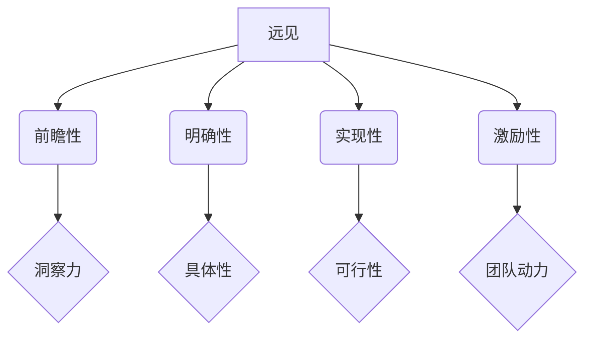

                 

### 2.1.1 领导力的定义

#### 背景介绍

领导力是一种关键的管理技能，对于组织和个人都至关重要。它不仅仅是掌握权力或职位，更是一种能力，能够影响和激励他人共同实现目标。领导力不仅存在于企业中，还在社会、政治和教育等各个领域发挥作用。有效的领导力能够提高团队的凝聚力、创新能力和执行力，从而在竞争激烈的环境中取得成功。

#### 核心概念与联系

- **领导力（Leadership）**: 领导力是指个人或群体引导、激励和影响他人以实现共同目标的能力。它不仅仅是权威的象征，更是一种服务精神，旨在帮助团队和个人成长。

  ```mermaid
  graph TD
  A[领导力] --> B(定义)
  B --> C{个人能力}
  B --> D{团队领导}
  B --> E{组织变革}
  B --> F{实现目标}
  ```

- **个人能力（Personal Ability）**: 领导者需要具备良好的沟通能力、决策能力、问题解决能力等。这些能力是领导力的基础，能够帮助领导者有效地处理复杂问题，并与团队成员建立良好的关系。

- **团队领导（Team Leadership）**: 领导者负责指导、协调和激励团队，确保团队目标的实现。这包括分配任务、解决问题、提供反馈和营造积极的工作氛围。

- **组织变革（Organizational Change）**: 领导者还必须具备推动组织变革的能力，以适应外部环境的变化。这需要领导者具备前瞻性和创新思维，能够引导组织进行结构性调整和策略更新。

- **实现目标（Achieving Goals）**: 领导力的最终目标是实现既定目标。通过有效的领导，领导者能够激发团队的潜力，使团队成员齐心协力，共同达成组织目标。

#### 核心算法原理讲解

- 领导力的定义可以通过以下伪代码来描述：

  ```python
  def leadership_definition():
      return "Leadership is the ability of an individual or group to guide, motivate, and influence others to achieve common goals."
  ```

#### 数学模型和数学公式

- 领导力的特点可以用以下公式表示：

  $$\text{Leadership} = \text{Influence} \times \text{Adaptability} \times \text{Trust}$$

- **影响力（Influence）**: 领导者能够影响他人的思想和行为，使团队成员愿意追随和共同努力。
- **适应性（Adaptability）**: 领导者需要具备适应变化的能力，能够根据不同情况和环境调整领导策略。
- **信任度（Trust）**: 领导者与团队成员之间的信任是领导力成功的关键。信任能够促进团队的协作和忠诚度。

#### 详细讲解与举例

- **影响力**：一个有效的领导者能够清晰地传达目标，并激发团队成员的热情和动力。例如，苹果公司的史蒂夫·乔布斯以其卓越的演讲技巧和愿景，成功地影响了无数员工和消费者。

- **适应性**：在快速变化的市场环境中，领导者需要具备灵活应变的能力。例如，亚马逊的杰夫·贝索斯通过不断调整公司战略，成功应对了电子商务市场的巨大变革。

- **信任度**：建立信任是领导者的重要任务。通过透明沟通、公正决策和以身作则，领导者能够赢得团队的信任和尊重。例如，谷歌的谢尔盖·布林和拉里·佩奇以其开放和信任的文化，吸引了全球顶尖人才。

#### 项目实战

- 假设一个初创公司需要提升领导力，可以通过以下步骤：

  1. **领导力培训**：为团队成员提供领导力培训，帮助他们了解领导力的核心概念和技能。
  2. **团队建设活动**：通过团队建设活动，增强团队成员之间的信任和协作。
  3. **定期反馈**：建立定期反馈机制，帮助团队成员了解自己的领导风格和改进方向。
  4. **实战演练**：鼓励团队成员在项目中实际应用领导力，积累经验。

  ```mermaid
  graph TD
  A[领导力培训] --> B(团队建设活动)
  B --> C(定期反馈)
  C --> D(实战演练)
  ```

#### 最佳实践 tips

- **持续学习**：领导力不是一成不变的，领导者需要不断学习新知识和技能，以适应不断变化的环境。
- **倾听和沟通**：领导者应该善于倾听团队成员的意见和建议，并通过有效沟通建立信任和共识。
- **以身作则**：领导者应以身作则，通过自己的行为树立榜样，激励团队成员。

#### 小结

领导力是一种综合能力，包括个人能力、团队领导和组织变革。有效的领导力能够帮助团队实现目标，推动组织持续发展。通过理解和应用领导力的核心概念和原理，领导者可以更好地发挥自己的作用，为团队和组织创造更大的价值。

#### 注意事项

- 领导力不是一蹴而就的，需要长期的学习和实践。
- 领导风格应根据团队和环境的不同而调整。
- 领导者应关注团队成员的成长和发展，而不仅仅是任务完成。

#### 拓展阅读

- 《领导力的五个层次》 - 史蒂夫·科维
- 《高效能人士的七个习惯》 - 史蒂芬·柯维
- 《变革之舞：领导力（Lead Like Jesus）》 - 凯西·凯斯

---

通过上述步骤，我们对“领导力定义与特点”进行了详细的讲解和实例分析，为后续章节的深入探讨打下了坚实的基础。在下一节中，我们将继续探讨领导力的核心维度和培养方法。

## 第2.2节 领导风格与领导能力

### 2.2.1 领导风格

#### 核心概念与联系

领导风格是领导者管理团队时采用的方法和方式。不同的领导风格会对团队的行为、氛围和绩效产生不同的影响。了解并选择合适的领导风格，是领导者提升管理效果的关键。

**核心概念与联系：**

- **领导风格（Leadership Style）**: 领导者在管理过程中所采用的方法和方式。

  ```mermaid
  graph TD
  A[领导风格] --> B(定义)
  B --> C{民主式}
  B --> D{专制式}
  B --> E{参与式}
  B --> F{权威式}
  ```

- **民主式（Democratic Style）**: 领导者征求团队成员的意见，共同做出决策。
- **专制式（Autocratic Style）**: 领导者独自做出决策，不征求团队成员的意见。
- **参与式（Laissez-Faire Style）**: 领导者给予团队成员最大的自由度，让他们自行决定和执行任务。
- **权威式（Authoritative Style）**: 领导者提供明确的方向和决策，同时鼓励团队成员参与决策过程。

#### 核心算法原理讲解

- 领导风格的算法原理可以通过以下伪代码来描述：

  ```python
  def leadership_style_choice(team_environment):
      if team_environment == "high_adhocracy":
          return "Democratic Style"
      elif team_environment == "high_structure":
          return "Autocratic Style"
      elif team_environment == "moderate_adhocracy":
          return "Authoritative Style"
      else:
          return "Laissez-Faire Style"
  ```

#### 数学模型和数学公式

- 领导风格的选择可以用以下公式表示：

  $$\text{最佳领导风格} = \frac{\text{团队需求}}{\text{领导者能力}}$$

- **团队需求（Team Needs）**: 团队所处的环境、任务难度和团队成员的能力水平等因素。
- **领导者能力（Leader Competence）**: 领导者的个人能力、经验和风格。

#### 详细讲解与举例

**民主式（Democratic Style）**

- **定义**：领导者征求团队成员的意见，共同做出决策。
- **适用场景**：适用于需要创新、协作和参与的项目，如产品开发、市场营销等。
- **案例**：谷歌的创始人谢尔盖·布林和拉里·佩奇采用民主式领导风格，鼓励员工自由表达观点，共同制定战略。

**专制式（Autocratic Style）**

- **定义**：领导者独自做出决策，不征求团队成员的意见。
- **适用场景**：适用于需要快速决策、高度纪律的项目，如军队、紧急救援等。
- **案例**：美国前总统唐纳德·特朗普以专制式领导风格著称，他独自制定政策，并在社交媒体上直接与公众沟通。

**参与式（Laissez-Faire Style）**

- **定义**：领导者给予团队成员最大的自由度，让他们自行决定和执行任务。
- **适用场景**：适用于高度自主、自我驱动和有经验的团队，如自由职业者、创意团队等。
- **案例**：谷歌在早期采用参与式领导风格，允许员工自主选择项目和任务，从而激发了创新和创造力。

**权威式（Authoritative Style）**

- **定义**：领导者提供明确的方向和决策，同时鼓励团队成员参与决策过程。
- **适用场景**：适用于需要稳定、高效的项目，如生产制造、项目管理等。
- **案例**：通用电气的杰克·韦尔奇采用权威式领导风格，通过明确的目标和严格的执行，推动了公司的转型和增长。

#### 项目实战

- **场景**：一个初创公司需要选择合适的领导风格。
- **步骤**：

  1. **评估团队需求**：分析团队成员的能力、经验和项目需求，确定团队所处的环境。
  2. **选择领导风格**：根据评估结果，选择最适合的领导风格。
  3. **实施与调整**：在实际工作中应用所选领导风格，并根据团队反馈进行及时调整。

  ```mermaid
  graph TD
  A[评估团队需求] --> B(选择领导风格)
  B --> C(实施与调整)
  ```

#### 最佳实践 tips

- **灵活调整**：领导者应根据团队和环境的变化，灵活调整领导风格。
- **注重沟通**：领导者应与团队成员保持有效沟通，了解他们的需求和意见。
- **培养信任**：建立信任是领导风格成功的关键，领导者应以身作则，树立信任的榜样。

#### 小结

领导风格是领导者管理团队的重要工具。不同的领导风格适用于不同的场景，领导者应根据团队需求和环境选择合适的风格。通过了解和掌握各种领导风格的特点和适用场景，领导者可以更有效地指导团队，实现组织目标。

#### 注意事项

- 领导风格不是一成不变的，领导者应具备适应变化的能力。
- 领导者应关注团队成员的成长和发展，而不仅仅是任务的完成。
- 领导者应在实践中不断总结经验，提高自己的领导能力。

#### 拓展阅读

- 《领导力：管理与实践》 - 彼得·德鲁克
- 《领导力五项修炼》 - 丹尼斯·雷恩哈特
- 《领导风格与团队绩效》 - 约翰·P·科特

---

通过上述分析，我们对领导风格的定义、核心概念、算法原理和实际应用有了更深入的了解。在下一节中，我们将探讨领导力的四个核心维度，以及如何培养这些能力。

### 2.3 领导力的四个核心维度

#### 2.3.1 沟通能力

**核心概念与联系**

沟通能力是领导力的核心维度之一，它涉及领导者如何有效地传达信息、倾听他人意见以及处理冲突。良好的沟通能力能够增强团队凝聚力，提高工作效率。

- **核心概念与联系：**

  ```mermaid
  graph TD
  A[沟通能力] --> B(信息传达)
  B --> C{倾听}
  B --> D{冲突处理}
  ```

**核心算法原理讲解**

- 沟通能力的算法原理可以通过以下伪代码来描述：

  ```python
  def effective_communication(message, listener, conflict):
      if conflict:
          resolve_conflict(conflict)
      else:
          deliver_message(message, listener)
  ```

**数学模型和数学公式**

- 沟通能力的评估可以用以下公式表示：

  $$\text{沟通能力} = \text{信息传达效率} \times \text{倾听理解度} \times \text{冲突处理能力}$$

**详细讲解与举例**

- **信息传达效率**：领导者需要清晰、准确地传达目标、任务和期望，确保团队成员理解并执行。
  - **举例**：一个项目经理在项目启动会议上，详细讲解项目目标和时间表，确保所有团队成员都清楚项目的预期成果。

- **倾听理解度**：领导者应倾听团队成员的意见和建议，理解他们的需求和困难。
  - **举例**：一个领导者定期组织团队会议，鼓励团队成员提出问题、分享想法，并根据反馈调整项目计划。

- **冲突处理能力**：领导者需要有效地处理团队中的冲突，维护团队和谐。
  - **举例**：一个团队中出现了意见分歧，领导者通过中立的态度和公正的处理方式，帮助双方达成共识。

**项目实战**

- **场景**：一个初创公司需要提升团队成员的沟通能力。
- **步骤**：

  1. **培训与指导**：为团队成员提供沟通技巧培训，如非暴力沟通、有效提问等。
  2. **实践应用**：鼓励团队成员在项目中实际应用沟通技巧，如会议记录、日常沟通等。
  3. **反馈与改进**：定期收集团队成员的反馈，根据实际情况调整沟通策略。

  ```mermaid
  graph TD
  A[培训与指导] --> B(实践应用)
  B --> C(反馈与改进)
  ```

**最佳实践 tips**

- **持续学习**：领导者应不断学习沟通技巧，提升自己的沟通能力。
- **倾听与尊重**：领导者应尊重团队成员的意见，耐心倾听，避免打断。
- **透明沟通**：领导者应保持信息透明，及时分享重要信息，减少误解和冲突。

#### 2.3.2 决策能力

**核心概念与联系**

决策能力是领导力的关键维度，它涉及领导者如何在复杂多变的环境中做出合理、有效的决策。良好的决策能力能够提高团队的应变能力和执行力。

- **核心概念与联系：**

  ```mermaid
  graph TD
  A[决策能力] --> B(信息收集)
  B --> C{风险评估}
  B --> D{目标制定}
  ```

**核心算法原理讲解**

- 决策能力的算法原理可以通过以下伪代码来描述：

  ```python
  def make_decision(info, risk, goal):
      evaluate_risk(risk)
      set_goals(goal)
      final_decision = analyze_info(info)
      return final_decision
  ```

**数学模型和数学公式**

- 决策能力的评估可以用以下公式表示：

  $$\text{决策能力} = \text{信息收集能力} \times \text{风险评估能力} \times \text{目标制定能力}$$

**详细讲解与举例**

- **信息收集能力**：领导者需要广泛收集信息，了解各种可能的决策选项。
  - **举例**：一个产品经理在制定新产品策略时，收集市场数据、竞争对手信息等，以便做出全面的决策。

- **风险评估能力**：领导者需要评估每个决策选项的风险和潜在影响。
  - **举例**：一个项目经理在评估项目进度时，考虑各种可能的风险，如资源不足、技术难题等，并制定相应的应对措施。

- **目标制定能力**：领导者需要明确目标和优先级，确保决策与组织目标一致。
  - **举例**：一个公司CEO在制定年度战略时，设定明确的财务、市场和创新目标，以确保公司发展方向的正确性。

**项目实战**

- **场景**：一个初创公司需要提升决策能力。
- **步骤**：

  1. **建立信息收集机制**：为团队成员提供信息收集和整理的培训，确保决策依据充分。
  2. **制定风险评估流程**：建立风险评估机制，对每个决策选项进行评估。
  3. **明确目标与优先级**：确保每个决策都与公司目标保持一致，提高决策的有效性。

  ```mermaid
  graph TD
  A[建立信息收集机制] --> B(制定风险评估流程)
  B --> C(明确目标与优先级)
  ```

**最佳实践 tips**

- **数据驱动**：领导者应基于数据和分析做出决策，避免凭直觉和经验。
- **团队参与**：鼓励团队成员参与决策过程，增加决策的全面性和公正性。
- **快速决策**：在紧急情况下，领导者应快速做出决策，以应对变化。

#### 2.3.3 问题解决能力

**核心概念与联系**

问题解决能力是领导力的另一个重要维度，它涉及领导者如何识别问题、分析原因并找到有效的解决方案。良好的问题解决能力能够提高团队的适应能力和创新能力。

- **核心概念与联系：**

  ```mermaid
  graph TD
  A[问题解决能力] --> B(问题识别)
  B --> C{原因分析}
  B --> D{解决方案}
  ```

**核心算法原理讲解**

- 问题解决能力的算法原理可以通过以下伪代码来描述：

  ```python
  def solve_problem(problem):
      identify_problem(problem)
      analyze_causes(problem)
      propose_solutions(problem)
      select_best_solution(problem)
      implement_solution(problem)
  ```

**数学模型和数学公式**

- 问题解决能力的评估可以用以下公式表示：

  $$\text{问题解决能力} = \text{问题识别速度} \times \text{原因分析深度} \times \text{解决方案效率}$$

**详细讲解与举例**

- **问题识别速度**：领导者需要迅速识别问题，防止问题扩大。
  - **举例**：一个项目经理在项目进行中发现进度延迟，立即召开会议，讨论问题原因和解决方案。

- **原因分析深度**：领导者需要深入分析问题原因，找到根本问题。
  - **举例**：一个产品经理在分析产品故障时，不仅检查表面问题，还深入调查可能导致故障的技术原因。

- **解决方案效率**：领导者需要找到有效、高效的解决方案，并迅速实施。
  - **举例**：一个公司CEO在应对市场变化时，迅速调整营销策略，并迅速部署新产品的推广。

**项目实战**

- **场景**：一个初创公司需要提升问题解决能力。
- **步骤**：

  1. **建立问题识别机制**：为团队成员提供问题识别和报告的培训，确保问题能够及时被发现。
  2. **深入原因分析**：建立原因分析流程，帮助团队成员深入分析问题原因。
  3. **制定解决方案**：鼓励团队成员提出解决方案，并评估其可行性和效率。
  4. **快速实施**：确保解决方案能够迅速实施，减少问题对团队的影响。

  ```mermaid
  graph TD
  A[建立问题识别机制] --> B(深入原因分析)
  B --> C[制定解决方案]
  C --> D[快速实施]
  ```

**最佳实践 tips**

- **团队合作**：领导者应鼓励团队合作，通过集体智慧解决问题。
- **预防为主**：领导者应注重预防问题，通过定期检查和改进措施，减少问题发生的可能性。
- **及时反馈**：领导者应及时反馈问题解决的结果，总结经验教训，持续改进。

#### 2.3.4 影响力

**核心概念与联系**

影响力是领导力的关键维度，它涉及领导者如何影响和激励他人，以实现共同目标。良好的影响力能够增强团队的凝聚力，提高团队执行力。

- **核心概念与联系：**

  ```mermaid
  graph TD
  A[影响力] --> B(激励)
  B --> C{影响}
  ```

**核心算法原理讲解**

- 影响力的算法原理可以通过以下伪代码来描述：

  ```python
  def influence_others(motivation, example, communication):
      motivate_team(motivation)
      set_example(example)
      communicate_effects(communication)
  ```

**数学模型和数学公式**

- 影响力的评估可以用以下公式表示：

  $$\text{影响力} = \text{激励效果} \times \text{榜样力量} \times \text{沟通能力}$$

**详细讲解与举例**

- **激励效果**：领导者需要能够激发团队成员的热情和动力，使团队成员愿意为实现共同目标而努力。
  - **举例**：一个项目经理在项目取得阶段性成果时，为团队成员颁发奖励，并鼓励他们继续努力。

- **榜样力量**：领导者应以身作则，通过自己的行为和成果影响他人。
  - **举例**：一个公司CEO通过自己的勤奋工作和卓越业绩，激励团队成员追求卓越。

- **沟通能力**：领导者需要具备良好的沟通能力，能够清晰地传达目标和期望，并与团队成员建立信任。
  - **举例**：一个领导者定期与团队成员沟通，了解他们的工作进展和困难，并提供支持和建议。

**项目实战**

- **场景**：一个初创公司需要提升影响力。
- **步骤**：

  1. **建立激励机制**：为团队成员提供奖励和晋升机会，激励他们为实现公司目标而努力。
  2. **树立榜样**：领导者通过自己的行为和成果，成为团队成员的榜样。
  3. **加强沟通**：定期与团队成员沟通，了解他们的需求和期望，并提供支持和建议。

  ```mermaid
  graph TD
  A[建立激励机制] --> B[树立榜样]
  B --> C[加强沟通]
  ```

**最佳实践 tips**

- **真诚激励**：领导者应真诚地关心团队成员，通过奖励和认可激励他们。
- **身教胜于言传**：领导者应以身作则，通过实际行动影响他人。
- **持续沟通**：领导者应与团队成员保持密切沟通，建立信任和共识。

### 小结

领导力的四个核心维度——沟通能力、决策能力、问题解决能力和影响力，是领导者成功的关键。通过不断提升这些能力，领导者能够更有效地指导团队，实现组织目标。在下一节中，我们将探讨如何培养这些能力。

## 第3章 远见培养

### 3.1 远见的概念与特征

#### 背景介绍

远见（Vision）是领导力中至关重要的一部分，它不仅关乎个人的成功，更决定着一个组织的前途。远见不仅仅是看到未来，更是一种深层次的理解和洞察，能够指导决策和行动。一个具有远见的领导者能够预见未来的变化，制定长远的发展战略，并带领团队朝着目标前进。

#### 核心概念与特征

**核心概念：**

- **远见（Vision）**：远见是一种洞察力，使领导者能够看到未来可能的发展方向和目标。它不仅仅是一个梦想，更是一种可实现的愿景。

**特征：**

1. **前瞻性**：远见能够预见未来，洞察行业和市场的变化趋势，为组织提供明确的方向。
2. **明确性**：远见应当是清晰和具体的，能够激发团队成员的热情和动力。
3. **实现性**：远见应该是基于现实和可行的，确保目标能够通过实际行动实现。
4. **激励性**：远见能够激发团队成员的潜力，使他们愿意为实现共同目标而努力。

**远见的模型与联系：**



#### 核心算法原理讲解

- 远见的算法原理可以通过以下伪代码来描述：

  ```python
  def develop_vision(current_state, future_trends, team_goals):
      analyze_trends(future_trends)
      define_goals(team_goals)
      create_vision(current_state, defined_goals)
      validate_vision_for_feasibility()
      inspire_team(vision)
  ```

#### 数学模型和数学公式

- 远见的评估可以用以下公式表示：

  $$\text{远见能力} = \text{前瞻性} \times \text{明确性} \times \text{实现性} \times \text{激励性}$$

**详细讲解与举例**

- **前瞻性**：领导者需要具备前瞻性，能够洞察未来的变化趋势。例如，特斯拉的伊隆·马斯克通过预测电动汽车和太阳能能源的未来趋势，制定了相应的发展战略。

- **明确性**：领导者应当明确表达远见，使其具体、清晰，能够激发团队成员的认同感。例如，苹果公司的史蒂夫·乔布斯通过清晰传达产品的愿景，激发了团队的创造力和激情。

- **实现性**：远见必须是可实现的，基于现实的基础之上。例如，华为公司的创始人任正非在制定公司战略时，始终确保目标既具有挑战性，又是可行的。

- **激励性**：远见应当具有激励性，能够激发团队成员的潜力和热情。例如，谷歌的创始人谢尔盖·布林和拉里·佩奇通过远见的传递，激励了无数优秀人才加入谷歌，共同实现公司的愿景。

**项目实战**

- **场景**：一个初创公司需要制定和培养远见。
- **步骤**：

  1. **分析未来趋势**：研究行业和市场的发展趋势，了解未来可能的机会和挑战。
  2. **定义团队目标**：与团队成员共同讨论，明确公司的长期目标。
  3. **创建远见**：基于未来趋势和团队目标，创建一个具体、明确的远见。
  4. **验证远见的可行性**：确保远见是可实现的，并制定相应的行动计划。
  5. **激励团队成员**：通过培训和沟通，确保团队成员理解并认同远见，并愿意为实现目标而努力。

  ```mermaid
  graph TD
  A[分析未来趋势] --> B[定义团队目标]
  B --> C[创建远见]
  C --> D[验证远见的可行性]
  D --> E[激励团队成员]
  ```

#### 最佳实践 tips

- **持续学习**：领导者应不断学习新知识，提升自己的洞察力和前瞻性。
- **团队参与**：鼓励团队成员参与远见的制定过程，增加他们的认同感和投入度。
- **透明沟通**：领导者应透明地沟通远见，确保团队成员了解并认同组织的愿景。

### 小结

远见是领导力中不可或缺的一部分，它能够为组织指引方向，激发团队的潜力。通过理解远见的核心概念和特征，领导者可以更好地培养自己的远见，并带领团队实现长期的目标。在下一节中，我们将探讨如何培养远见，以及在实际工作中应用远见的方法。

### 3.2 如何培养远见

**核心概念与联系**

- **培养远见（Develop Vision）**: 培养远见是一个持续的过程，需要领导者不断学习和实践。这包括对未来的洞察、明确的目标设定和持续的激励。

  ```mermaid
  graph TD
  A[培养远见] --> B(洞察未来)
  B --> C{学习新知}
  A --> D(目标设定)
  D --> E{明确性}
  A --> F(持续激励)
  F --> G{团队动力}
  ```

**核心算法原理讲解**

- 培养远见的算法原理可以通过以下伪代码来描述：

  ```python
  def cultivate_vision(future_insight, goal_clarity, continuous_motivation):
      learn_new_knowledge()
      analyze_future_trends()
      define_clear_goals()
      inspire_and_support_team()
  ```

**数学模型和数学公式**

- 培养远见的能力可以用以下公式表示：

  $$\text{远见能力} = \text{洞察力} \times \text{学习意愿} \times \text{目标明确度} \times \text{激励效果}$$

**详细讲解与举例**

**洞察未来**

- **洞察未来（Insightful Forecasting）**: 领导者需要具备敏锐的洞察力，能够预见行业和市场的变化趋势。

  ```mermaid
  graph TD
  A[洞察未来] --> B(趋势分析)
  B --> C{技术进步}
  B --> D{市场需求}
  ```

- **例子**：特斯拉的伊隆·马斯克通过洞察电动汽车和可再生能源市场的未来趋势，制定了公司的发展战略，从而在竞争激烈的市场中脱颖而出。

**学习新知**

- **学习新知（Continuous Learning）**: 领导者应具备持续学习的意愿，不断更新自己的知识和技能。

  ```mermaid
  graph TD
  A[学习新知] --> B(参加培训)
  B --> C{阅读书籍}
  B --> D(交流经验)
  ```

- **例子**：谷歌的创始人谢尔盖·布林和拉里·佩奇通过参加各种培训和研讨会，不断学习最新的技术和市场动态，从而保持了公司的创新力和竞争力。

**目标设定**

- **目标设定（Goal Setting）**: 领导者需要设定明确、具体和可实现的目标，以指导团队的努力。

  ```mermaid
  graph TD
  A[目标设定] --> B(短期目标)
  B --> C{绩效评估}
  A --> D(长期目标)
  D --> E{愿景实现}
  ```

- **例子**：苹果公司的史蒂夫·乔布斯通过设定具体的短期和长期目标，成功推动了公司的产品创新和市场份额增长。

**持续激励**

- **持续激励（Continuous Motivation）**: 领导者需要通过持续的激励，激发团队成员的潜力和动力。

  ```mermaid
  graph TD
  A[持续激励] --> B(奖励机制)
  B --> C{认可与赞赏}
  A --> D(培训与成长)
  D --> E{团队协作}
  ```

- **例子**：亚马逊的杰夫·贝索斯通过建立奖励机制和提供培训机会，激励员工不断学习和创新，从而保持了公司的快速发展。

**项目实战**

- **场景**：一个初创公司需要培养远见。
- **步骤**：

  1. **设立学习计划**：为团队成员提供学习资源和机会，鼓励他们持续学习。
  2. **分析市场趋势**：定期分析行业和市场的发展趋势，为公司的战略决策提供依据。
  3. **设定明确目标**：与团队成员共同讨论，设定具体、可实现的目标，以指导团队的行动。
  4. **建立奖励机制**：为达成目标的团队成员提供奖励和认可，激发他们的积极性。
  5. **持续沟通与反馈**：定期与团队成员沟通，了解他们的需求和意见，及时调整目标和计划。

  ```mermaid
  graph TD
  A[设立学习计划] --> B(分析市场趋势)
  B --> C[设定明确目标]
  C --> D[建立奖励机制]
  D --> E[持续沟通与反馈]
  ```

**最佳实践 tips**

- **鼓励创新思维**：领导者应鼓励团队成员提出创新的想法，并为他们提供实现这些想法的机会。
- **建立愿景陈述**：明确公司的愿景和目标，确保所有团队成员都了解并认同。
- **持续跟踪进度**：定期检查目标的实现情况，及时调整策略和计划。

### 小结

培养远见是领导者的一项重要任务，它需要领导者具备前瞻性、持续学习的态度和明确的目标设定。通过不断培养远见，领导者能够更好地应对未来的挑战，带领团队实现长远的目标。在下一节中，我们将探讨远见在决策中的应用。

### 3.3 远见在决策中的应用

**核心概念与联系**

- **决策应用（Decision Application）**: 远见不仅仅是预见未来，更重要的是将远见应用于实际决策中。领导者应将远见作为决策的指南，确保决策符合组织的长期目标和未来发展。

  ```mermaid
  graph TD
  A[决策应用] --> B(远见指导)
  B --> C{战略制定}
  A --> D(战术调整)
  D --> E{资源分配}
  ```

**核心算法原理讲解**

- 远见在决策中的应用可以通过以下伪代码来描述：

  ```python
  def apply_vision_in_decision(vision, current_context, potential_actions):
      align_decision_with_vision(vision)
      evaluate_actions_against_vision(potential_actions)
      select_best_action(current_context)
  ```

**数学模型和数学公式**

- 决策中应用远见的效果可以用以下公式表示：

  $$\text{决策效果} = \text{远见契合度} \times \text{行动可行性} \times \text{资源优化}$$

**详细讲解与举例**

**战略制定**

- **战略制定（Strategic Planning）**: 远见在战略制定中起到关键作用，它帮助领导者确定组织的长远发展方向。

  ```mermaid
  graph TD
  A[战略制定] --> B(愿景分析)
  B --> C{市场研究}
  A --> D(目标设定)
  D --> E{资源配置}
  ```

- **例子**：华为公司的任正非通过远见，制定了“数字化转型”的战略，从而引领公司在全球市场上的快速发展。

**战术调整**

- **战术调整（Tactical Adjustment）**: 领导者需要根据远见，灵活调整战术，确保组织能够适应不断变化的市场环境。

  ```mermaid
  graph TD
  A[战术调整] --> B(市场反馈)
  B --> C{策略更新}
  A --> D(执行优化)
  D --> E{绩效评估}
  ```

- **例子**：亚马逊的杰夫·贝索斯根据市场反馈和消费者需求，不断调整公司的战术，从而保持了在电子商务市场的领先地位。

**资源分配**

- **资源分配（Resource Allocation）**: 远见帮助领导者合理分配资源，确保资源投入与组织的长期目标一致。

  ```mermaid
  graph TD
  A[资源分配] --> B(成本效益分析)
  B --> C{优先级排序}
  A --> D(预算规划)
  D --> E{项目评估}
  ```

- **例子**：谷歌通过远见，将大量资源投入到人工智能和云计算领域，从而引领了这些新兴技术的发展。

**项目实战**

- **场景**：一个初创公司需要将远见应用于决策中。
- **步骤**：

  1. **制定愿景陈述**：明确公司的愿景和长期目标，确保所有团队成员都清楚并认同。
  2. **市场调研**：定期进行市场调研，了解行业和市场的变化趋势。
  3. **战略规划**：根据远见和市场调研结果，制定组织的战略规划。
  4. **资源分配**：合理分配资源，确保资源投入与组织的长期目标一致。
  5. **决策评审**：定期评审决策效果，根据实际情况进行调整。

  ```mermaid
  graph TD
  A[制定愿景陈述] --> B(市场调研)
  B --> C[战略规划]
  C --> D[资源分配]
  D --> E[决策评审]
  ```

**最佳实践 tips**

- **长期视角**：领导者应具备长期视角，将远见融入决策过程，避免短期行为的干扰。
- **透明沟通**：确保团队成员了解远见和决策过程，增加透明度和信任。
- **持续学习**：领导者应不断学习和更新远见，以适应快速变化的市场环境。

### 小结

远见在决策中的应用是领导者成功的关键。通过将远见融入决策过程，领导者能够确保组织的决策符合长期目标和未来发展。在下一节中，我们将探讨如何实现领导力与远见的平衡。

## 第4章 领导力与远见的结合

### 4.1 领导力对远见的影响

#### 背景介绍

领导力与远见是相辅相成的两个重要概念。领导力为远见的实现提供了必要的组织和管理能力，而远见则为领导力提供了明确的方向和目标。一个成功的领导者不仅需要具备卓越的领导力，还需要具备敏锐的远见，能够预见未来的变化并做出相应调整。

#### 核心概念与联系

- **领导力（Leadership）**: 领导力是指个人或群体引导、激励和影响他人以实现共同目标的能力。
- **远见（Vision）**: 远见是领导者对未来可能的发展方向和目标的洞察，是一种深层次的理解和洞察。

  ```mermaid
  graph TD
  A[领导力] --> B(目标实现)
  B --> C{团队管理}
  B --> D{战略规划}
  A --> E[远见]
  E --> F(未来洞察)
  E --> G(目标指引)
  ```

**核心算法原理讲解**

- 领导力对远见的影响可以通过以下伪代码来描述：

  ```python
  def leadership_impacts_vision(leader_skills, vision_clarity):
      if leader_skills == "excellent":
          vision_clarity = enhance_vision_clarity(vision_clarity)
      else:
          vision_clarity = reduce_vision_clarity(vision_clarity)
  ```

**数学模型和数学公式**

- 领导力对远见的影响可以用以下公式表示：

  $$\text{远见清晰度} = \text{领导力水平} \times \text{战略规划能力}$$

**详细讲解与举例**

- **领导力水平**：领导力水平直接影响远见的清晰度和可行性。一个具备高领导力水平的领导者能够更好地理解和传递远见，使团队成员更容易接受并执行。

  - **例子**：苹果公司的史蒂夫·乔布斯以其卓越的领导力，成功地将公司的远见——打造卓越产品——转化为实际成果。

- **战略规划能力**：战略规划能力是领导力的重要组成部分，它帮助领导者将远见转化为具体的行动计划。

  - **例子**：亚马逊的杰夫·贝索斯通过战略规划，将远见——成为地球上最以顾客为中心的公司——转化为一系列实际操作，如完善的物流系统和顾客服务。

**项目实战**

- **场景**：一个初创公司需要提升领导力以支持远见。
- **步骤**：

  1. **评估领导力水平**：评估现有领导者的领导力水平，识别需要提升的能力。
  2. **培训与发展**：为领导者提供领导力和战略规划的培训，提升他们的管理技能。
  3. **实践应用**：鼓励领导者将所学技能应用于实际工作中，如团队管理、战略规划和目标实现。
  4. **持续反馈**：定期收集团队成员的反馈，调整领导力提升策略。

  ```mermaid
  graph TD
  A[评估领导力水平] --> B[培训与发展]
  B --> C[实践应用]
  C --> D[持续反馈]
  ```

**最佳实践 tips**

- **持续学习**：领导者应不断学习和更新自己的知识和技能，以适应快速变化的环境。
- **团队合作**：鼓励团队合作，通过集体智慧实现远见。
- **明确目标**：确保领导者和团队成员对远见和目标有清晰的理解和共识。

#### 4.2 远见对领导力的作用

**核心概念与联系**

- **远见对领导力的作用（Vision's Role in Leadership）**: 远见为领导力提供了目标和方向，使领导者能够更加有效地指导团队，实现组织的目标。

  ```mermaid
  graph TD
  A[远见] --> B(目标设定)
  B --> C{团队激励}
  A --> D[领导力]
  D --> E{战略规划}
  D --> F{决策制定}
  ```

**核心算法原理讲解**

- 远见对领导力的作用可以通过以下伪代码来描述：

  ```python
  def vision_influences_leadership(vision_clarity, leadership_skills):
      if vision_clarity == "clear":
          leadership_effects = enhance_leadership_effects(leadership_skills)
      else:
          leadership_effects = reduce_leadership_effects(leadership_skills)
  ```

**数学模型和数学公式**

- 远见对领导力的作用可以用以下公式表示：

  $$\text{领导力效果} = \text{远见清晰度} \times \text{领导能力}$$

**详细讲解与举例**

- **目标设定**：远见为领导力提供了明确的目标，使领导者能够更有针对性地制定战略和计划。

  - **例子**：谷歌的创始人谢尔盖·布林和拉里·佩奇通过明确的远见——成为全球最佳搜索服务提供商，成功指导了公司的战略发展。

- **团队激励**：远见能够激发团队成员的潜力和热情，增强团队凝聚力。

  - **例子**：特斯拉的伊隆·马斯克通过远见——推动可持续能源革命，激励了无数员工和消费者，使特斯拉成为电动汽车市场的领军者。

- **战略规划**：远见帮助领导者制定长期战略，确保组织在竞争激烈的市场中保持优势。

  - **例子**：华为公司的任正非通过远见——实现数字化转型，制定了公司的一系列战略规划，从而引领了全球通信技术的发展。

- **决策制定**：远见为领导者提供了决策的依据，使他们在面对复杂问题时能够做出明智的选择。

  - **例子**：苹果公司的史蒂夫·乔布斯通过远见，在产品设计和市场营销上做出了一系列关键决策，从而保持了公司的创新力和竞争力。

**项目实战**

- **场景**：一个初创公司需要通过远见提升领导力。
- **步骤**：

  1. **明确远见**：与团队成员共同明确公司的远见和长期目标。
  2. **制定战略规划**：根据远见制定具体的战略规划和行动计划。
  3. **培训和激励**：为团队成员提供培训，帮助他们理解和实现远见。
  4. **持续评估和调整**：定期评估战略规划的实施效果，根据市场变化进行调整。

  ```mermaid
  graph TD
  A[明确远见] --> B[制定战略规划]
  B --> C[培训和激励]
  C --> D[持续评估和调整]
  ```

**最佳实践 tips**

- **明确目标**：确保远见和目标清晰、具体，能够激发团队的热情和动力。
- **灵活调整**：领导者应根据市场变化和团队反馈，灵活调整战略和计划。
- **持续沟通**：领导者应与团队成员保持密切沟通，确保他们理解并支持公司的远见和目标。

### 4.3 实现领导力与远见的平衡

**核心概念与联系**

- **实现平衡（Achieving Balance）**: 领导力和远见在组织管理中必须保持平衡。领导力提供实际的操作和管理能力，而远见则指明未来的方向。只有在两者平衡的情况下，组织才能既有效执行当前任务，又能够持续发展。

  ```mermaid
  graph TD
  A[领导力与远见] --> B(领导力)
  B --> C{执行能力}
  B --> D{团队管理}
  A --> E[远见]
  E --> F{目标设定}
  E --> G{战略规划}
  ```

**核心算法原理讲解**

- 实现领导力与远见的平衡可以通过以下伪代码来描述：

  ```python
  def balance_leadership_vision(leader_skills, vision_clarity):
      leadership_effectiveness = optimize_leadership_effects(leader_skills, vision_clarity)
      vision_implementation = ensure_vision_feasibility(vision_clarity)
      if leadership_effectiveness >= vision_implementation:
          balance = "Optimal"
      else:
          balance = "Improve"
  ```

**数学模型和数学公式**

- 实现平衡的公式可以用以下表示：

  $$\text{平衡度} = \frac{\text{领导力效果}}{\text{远见实现度}}$$

**详细讲解与举例**

- **领导力效果**：领导力效果是指领导者在实际操作中的表现，包括团队管理、决策能力等。

  - **例子**：一个项目经理通过有效的领导力，成功完成了多个关键项目，展现出了卓越的领导力效果。

- **远见实现度**：远见实现度是指远见在实际操作中的实现程度，包括目标的实现、战略的执行等。

  - **例子**：一个公司的远见是成为行业领导者，通过有效的战略规划和执行，成功实现了这一目标。

- **优化领导力效果**：领导者可以通过不断学习和提升自己的技能，优化领导力效果。

  - **例子**：领导者参加领导力培训课程，提升自己的沟通能力和决策能力，从而优化领导力效果。

- **确保远见实现度**：领导者需要确保远见是可实现的，并制定相应的战略和计划。

  - **例子**：领导者根据市场需求和技术趋势，制定了可行的战略计划，确保远见的实现。

**项目实战**

- **场景**：一个初创公司需要实现领导力与远见的平衡。
- **步骤**：

  1. **评估领导力和远见**：评估当前领导力和远见的状态，确定需要优化的方面。
  2. **制定改进计划**：根据评估结果，制定具体的改进计划，包括领导力提升和远见实现的策略。
  3. **实施改进措施**：按照改进计划，实施具体的措施，如领导力培训、战略规划等。
  4. **持续监控和调整**：持续监控领导力和远见的实现情况，根据实际情况进行调整。

  ```mermaid
  graph TD
  A[评估领导力和远见] --> B[制定改进计划]
  B --> C[实施改进措施]
  C --> D[持续监控和调整]
  ```

**最佳实践 tips**

- **平衡执行与规划**：领导者需要在执行和规划之间找到平衡，确保既有高效的执行，又有明确的规划。
- **持续学习和反馈**：领导者应持续学习和接受反馈，不断提升自己的能力和远见的实现度。
- **团队协作**：领导者应鼓励团队协作，通过集体的智慧和努力，实现领导力和远见的平衡。

### 小结

领导力与远见的结合是组织成功的关键。通过平衡领导力和远见，领导者能够更好地指导团队，实现组织的长期目标。在下一章中，我们将通过案例分析，探讨领导力与远见在不同情境下的实际应用。

## 第5章 案例研究

### 5.1 成功案例分析

#### 苹果公司：史蒂夫·乔布斯与远见的力量

**背景介绍**

苹果公司（Apple Inc.）是当今世界最具影响力的科技公司之一，其成功离不开创始人史蒂夫·乔布斯（Steve Jobs）的远见和领导力。乔布斯以其独特的领导风格和前瞻性的远见，引领苹果公司不断突破技术边界，创造出一系列改变世界的创新产品。

**核心概念与联系**

- **领导力**：乔布斯以其卓越的领导力，激发了苹果员工的创造力和创新精神，使苹果成为科技行业的领导者。
- **远见**：乔布斯具有前瞻性的远见，他能够预见技术的未来趋势，并将这些趋势转化为实际的产品和服务。

  ```mermaid
  graph TD
  A[领导力] --> B(创新驱动)
  B --> C{员工激励}
  A --> D[远见]
  D --> E(市场洞察)
  D --> F(产品创新)
  ```

**核心算法原理讲解**

- 乔布斯的领导力和远见可以通过以下伪代码来描述：

  ```python
  def jobs_leadership_vision():
      innovation驱动的领导力 = enhance_employee_innovation()
      market洞察力 = analyze_tech_trends()
      product_innovation = develop_groundbreaking_products()
      return innovation驱动的领导力 + market洞察力 + product_innovation
  ```

**数学模型和数学公式**

- 乔布斯的领导力和远见可以用以下公式表示：

  $$\text{苹果成功} = \text{领导力} \times \text{远见}$$

**详细讲解与举例**

**创新驱动**

- **创新驱动**：乔布斯坚信创新是科技公司的核心竞争力，他不断推动苹果进行技术创新和产品创新。

  - **例子**：苹果推出的iPod和iTunes彻底改变了音乐市场的消费模式，引领了数字音乐时代的到来。

**市场洞察**

- **市场洞察**：乔布斯具备敏锐的市场洞察力，他能够准确把握消费者的需求和市场趋势。

  - **例子**：苹果推出的iPhone不仅改变了手机市场的格局，还引领了智能手机的潮流，推动了移动互联网的发展。

**产品创新**

- **产品创新**：乔布斯带领苹果推出了一系列革命性的产品，如Mac、iPad、Apple Watch等，这些产品都成为了各自领域的标杆。

  - **例子**：苹果的Mac电脑不仅改变了个人电脑的生态，还推动了整个计算机行业的发展。

**项目实战**

- **场景**：苹果公司如何通过领导力和远见推动产品创新。
- **步骤**：

  1. **市场调研**：分析消费者需求和市场趋势，了解行业的发展方向。
  2. **创新驱动**：鼓励研发团队进行技术创新和产品创新，确保产品具有竞争力。
  3. **团队激励**：通过奖励和认可激励员工，提高他们的创新热情和积极性。
  4. **产品发布**：在产品发布前进行充分的市场预热和宣传，确保产品能够得到消费者的认可。

  ```mermaid
  graph TD
  A[市场调研] --> B[创新驱动]
  B --> C[团队激励]
  C --> D[产品发布]
  ```

**最佳实践 tips**

- **持续创新**：领导者应不断推动技术创新和产品创新，保持公司的竞争力。
- **市场洞察**：领导者应具备敏锐的市场洞察力，了解消费者的需求和趋势。
- **团队激励**：领导者应通过激励措施，激发员工的创新热情和积极性。

#### 亚马逊公司：杰夫·贝索斯与领导力的实践

**背景介绍**

亚马逊公司（Amazon.com, Inc.）是全球最大的电子商务公司之一，其成功离不开创始人杰夫·贝索斯（Jeff Bezos）的领导力和远见。贝索斯以其独特的领导风格和务实的态度，带领亚马逊不断扩展业务，成为全球电商市场的领导者。

**核心概念与联系**

- **领导力**：贝索斯以其务实的领导风格和卓越的决策能力，确保了亚马逊的快速发展。
- **远见**：贝索斯具有远见，他能够预见未来的市场趋势，并提前布局。

  ```mermaid
  graph TD
  A[领导力] --> B(执行力)
  B --> C{战略规划}
  A --> D[远见]
  D --> E(市场趋势)
  D --> F(技术创新)
  ```

**核心算法原理讲解**

- 贝索斯的领导力和远见可以通过以下伪代码来描述：

  ```python
  def bezos_leadership_vision():
      execution_power = implement_strategic_plans()
      market_sight = predict_future_trends()
      tech_innovation = develop_new_technologies()
      return execution_power + market_sight + tech_innovation
  ```

**数学模型和数学公式**

- 贝索斯的领导力和远见可以用以下公式表示：

  $$\text{亚马逊成功} = \text{领导力} \times \text{远见}$$

**详细讲解与举例**

**执行力**

- **执行力**：贝索斯以其强大的执行力，确保了亚马逊的战略和计划能够快速实施。

  - **例子**：亚马逊推出“亚马逊Prime”会员服务，迅速扩大了公司的用户群体和市场影响力。

**战略规划**

- **战略规划**：贝索斯通过精确的战略规划，确保亚马逊在竞争激烈的市场中始终保持领先地位。

  - **例子**：亚马逊通过不断扩展业务范围，从电子商务扩展到云计算、人工智能等多个领域。

**市场趋势**

- **市场趋势**：贝索斯具备敏锐的市场洞察力，能够准确预测未来的市场趋势。

  - **例子**：亚马逊在早期就看到了云计算市场的巨大潜力，因此推出了AWS（Amazon Web Services）服务，成为全球领先的云计算提供商。

**技术创新**

- **技术创新**：贝索斯鼓励技术创新，使亚马逊在技术领域保持领先地位。

  - **例子**：亚马逊的Kiva机器人系统，通过自动化仓库管理，大大提高了物流效率。

**项目实战**

- **场景**：亚马逊如何通过领导力和远见推动业务增长。
- **步骤**：

  1. **市场趋势分析**：分析市场趋势和消费者需求，了解行业的发展方向。
  2. **战略规划**：制定具体的战略规划，确保业务能够持续增长。
  3. **技术创新**：鼓励技术研发，推动新技术在业务中的应用。
  4. **执行力**：确保战略和计划的实施，提高公司的执行效率。

  ```mermaid
  graph TD
  A[市场趋势分析] --> B[战略规划]
  B --> C[技术创新]
  C --> D[执行力]
  ```

**最佳实践 tips**

- **执行力**：领导者应确保战略和计划的实施，提高公司的执行效率。
- **市场洞察**：领导者应具备敏锐的市场洞察力，了解行业的发展趋势。
- **技术创新**：领导者应鼓励技术创新，保持公司在技术领域的领先地位。

### 小结

通过成功案例分析，我们看到了领导力和远见在组织管理中的重要作用。无论是苹果公司的史蒂夫·乔布斯，还是亚马逊的杰夫·贝索斯，他们的领导力和远见都为组织带来了巨大的成功。在下一节中，我们将探讨失败案例分析，从失败中汲取教训。

### 5.2 失败案例分析

#### 黑莓公司：领导力与远见的缺失

**背景介绍**

黑莓公司（Research In Motion, RIM）曾经是智能手机市场的领导者，然而，在苹果公司和安卓系统的冲击下，黑莓逐渐失去了市场份额。黑莓的失败原因在于领导力与远见的缺失，导致公司在技术变革和市场趋势变化中无法及时调整。

**核心概念与联系**

- **领导力**：黑莓的领导层在技术变革和市场竞争中缺乏前瞻性和执行力。
- **远见**：黑莓没有及时预见智能手机市场的变化，没有在技术创新和市场策略上做出相应的调整。

  ```mermaid
  graph TD
  A[领导力] --> B(前瞻性)
  B --> C{执行力}
  A --> D[远见]
  D --> E{市场洞察}
  D --> F{创新驱动}
  ```

**核心算法原理讲解**

- 黑莓的领导力和远见可以通过以下伪代码来描述：

  ```python
  def rim_failure():
      leadership_ineffectiveness = lack_of foresight()
      vision_deficiency = failure_to_innovate()
      market_insight_shortage = miss_of_trend()
      return leadership_ineffectiveness + vision_deficiency + market_insight_shortage
  ```

**数学模型和数学公式**

- 黑莓的失败原因可以用以下公式表示：

  $$\text{黑莓失败} = \text{领导力缺失} \times \text{远见缺失} \times \text{市场洞察缺失}$$

**详细讲解与举例**

**领导力缺失**

- **前瞻性**：黑莓的领导层在智能手机市场竞争初期，未能预见苹果iPhone和安卓系统的崛起，缺乏前瞻性。

  - **例子**：黑莓公司在2007年苹果iPhone发布后，仍然坚持自己的操作系统，未能及时调整战略。

**执行力缺失**

- **执行力**：黑莓在产品创新和市场营销方面执行力不足，导致产品更新缓慢，无法满足消费者需求。

  - **例子**：黑莓在智能手机市场转型过程中，推出的BlackBerry 10操作系统和设备未能获得市场认可，市场份额持续下降。

**远见缺失**

- **市场洞察**：黑莓未能准确把握市场趋势，对竞争对手的反应迟钝。

  - **例子**：黑莓在社交媒体和移动互联网的兴起时，未能及时推出相应的应用和服务，错失了市场机会。

**创新驱动缺失**

- **创新驱动**：黑莓在技术研发和创新方面的投入不足，导致产品缺乏竞争力。

  - **例子**：黑莓在iOS和安卓系统迅速发展的背景下，未能推出具有竞争力的创新产品，市场份额逐渐被蚕食。

**项目实战**

- **场景**：黑莓公司如何应对智能手机市场的变化。
- **步骤**：

  1. **市场趋势分析**：定期分析市场趋势和消费者需求，了解行业的发展方向。
  2. **技术创新**：加大技术研发投入，推出具有竞争力的新产品。
  3. **市场策略**：调整市场策略，积极应对竞争对手的挑战。
  4. **团队激励**：通过激励措施，提高员工的创新热情和执行力。

  ```mermaid
  graph TD
  A[市场趋势分析] --> B[技术创新]
  B --> C[市场策略]
  C --> D[团队激励]
  ```

**最佳实践 tips**

- **前瞻性**：领导者应具备前瞻性，及时预见市场变化和技术趋势。
- **执行力**：领导者应确保战略和计划的执行，提高公司的执行力。
- **创新驱动**：领导者应鼓励创新，保持公司在技术领域的竞争力。

### 小结

通过失败案例分析，我们看到了领导力与远见在组织管理中的重要性。黑莓公司的失败在于领导力的缺失和远见的不足，导致公司在市场竞争中无法及时调整。从黑莓的失败中，我们可以汲取教训，避免重蹈覆辙。在下一节中，我们将总结案例研究的启示。

### 5.3 案例总结与启示

**成功案例分析启示**

1. **前瞻性**：成功的企业领导者具备前瞻性，能够预见市场的变化和技术趋势，从而制定出具有前瞻性的战略。

2. **执行力**：领导者需要确保战略和计划的执行，提高公司的执行力。只有将战略转化为实际行动，才能实现组织的长期目标。

3. **创新能力**：领导者应鼓励创新，保持公司在技术领域的竞争力。创新是推动企业持续发展的动力，能够帮助企业在激烈的市场竞争中脱颖而出。

4. **市场洞察**：领导者应具备敏锐的市场洞察力，了解消费者的需求和趋势。只有准确把握市场动态，企业才能制定出符合市场需求的产品和服务。

5. **团队激励**：领导者应通过激励措施，提高团队成员的积极性和创新热情。一个充满活力的团队能够更好地应对挑战，实现组织的共同目标。

**失败案例分析启示**

1. **领导力缺失**：缺乏前瞻性和执行力是导致企业失败的主要原因。领导者需要不断提升自己的领导能力，确保企业能够在变化的市场环境中迅速调整。

2. **远见不足**：远见是企业持续发展的重要保障。企业领导者应具备远见，及时预见市场的变化，提前布局，以应对未来的挑战。

3. **市场洞察不足**：企业领导者应具备敏锐的市场洞察力，了解消费者的需求和市场趋势。只有准确把握市场动态，企业才能制定出符合市场需求的产品和服务。

4. **创新能力不足**：在快速变化的市场环境中，企业需要不断创新，以保持竞争力。领导者应鼓励创新，推动企业持续发展。

**综合启示**

1. **平衡领导力与远见**：领导力和远见相辅相成，领导者应在实际工作中平衡两者，确保企业既能够有效执行当前任务，又能够持续发展。

2. **持续学习与改进**：领导者应持续学习和改进，提升自己的领导能力和远见水平。只有不断进步，企业才能在竞争激烈的市场中立于不败之地。

3. **团队合作**：领导者应鼓励团队合作，通过集体的智慧和努力，实现企业的共同目标。

4. **关注员工发展**：领导者应关注员工的发展，提供培训和发展机会，激发员工的潜力，为企业创造价值。

5. **灵活应变**：在快速变化的市场环境中，领导者应具备灵活应变的能力，及时调整战略和计划，以适应市场变化。

### 小结

通过成功和失败的案例分析，我们得出了许多宝贵的启示。成功的企业领导者具备前瞻性、执行力、创新能力、市场洞察和团队激励的能力；而失败的企业则往往在领导力、远见、市场洞察和创新能力方面存在不足。领导者应在实际工作中不断学习和改进，平衡领导力与远见，带领企业实现持续发展。在下一章中，我们将探讨未来趋势与挑战，以及领导力与远见在这些方面的角色。

## 第6章 未来趋势与挑战

### 6.1 未来社会发展趋势

**核心概念与联系**

随着科技的迅猛发展，社会正经历着深刻的变革。未来社会的发展趋势主要体现在以下几个方面：

- **人工智能与自动化**：人工智能（AI）和自动化技术的发展将大大改变人们的生产方式和生活方式。自动化生产线、无人驾驶汽车、智能机器人等将成为日常生活中的常见景象。
- **数字经济**：数字经济已成为全球经济的重要组成部分。云计算、大数据、区块链等技术的发展，将推动数字经济向更高效、更安全的方向发展。
- **全球化和多元化**：全球化进程加速，各国之间的联系日益紧密。同时，社会的多元化和包容性也在不断提高，不同文化、不同背景的人们共同构建了一个多元化的社会。
- **可持续发展**：随着环境问题的日益严峻，可持续发展成为全球共识。绿色能源、节能减排、循环经济等理念将深入人心，推动社会向更加可持续的方向发展。

**核心算法原理讲解**

- 未来社会发展趋势的算法原理可以通过以下伪代码来描述：

  ```python
  def future_society_trends():
      ai_automation = analyze_technological_progress()
      digital_economy = evaluate_economic_impacts()
      global_diversity = assess_cultural_integration()
      sustainable_development = measure_environmental_impacts()
      return ai_automation + digital_economy + global_diversity + sustainable_development
  ```

**数学模型和数学公式**

- 未来社会发展趋势可以用以下公式表示：

  $$\text{未来社会} = \text{人工智能与自动化} + \text{数字经济} + \text{全球化和多元化} + \text{可持续发展}$$

**详细讲解与举例**

- **人工智能与自动化**：人工智能和自动化技术将大幅提高生产效率，降低人力成本。例如，智能制造生产线将取代传统的手工生产，无人驾驶汽车将改变交通方式。
- **数字经济**：数字经济的发展将推动产业升级和经济增长。例如，电商平台将重塑零售业，远程办公将改变工作方式。
- **全球化和多元化**：全球化进程将加强各国之间的经济和文化交流，促进多元文化的融合。例如，跨国公司将成为全球化的重要推动力量，国际文化交流活动将更加频繁。
- **可持续发展**：可持续发展将成为未来社会的重要议题。例如，绿色能源和节能减排技术将得到广泛应用，循环经济模式将得到推广。

### 6.2 未来企业面临的挑战

**核心概念与联系**

未来企业将面临一系列挑战，这些挑战主要来自技术变革、市场竞争、社会变化等方面。

- **技术变革**：技术变革速度加快，企业需要不断更新技术，以保持竞争力。例如，人工智能、区块链等新兴技术的应用，将改变企业的运营模式和管理方式。
- **市场竞争**：市场竞争日益激烈，企业需要不断创新，以满足消费者的需求。同时，全球化使得市场竞争更加复杂，企业需要应对来自全球各地的竞争对手。
- **社会变化**：社会变化对企业也带来了新的挑战，如人口老龄化、消费观念变化等。企业需要适应这些变化，调整其战略和运营模式。

**核心算法原理讲解**

- 未来企业面临的挑战可以通过以下伪代码来描述：

  ```python
  def future_business_challenges():
      tech_change = assess_technological_innovations()
      market_competition = analyze_competitive_impacts()
      social_change = evaluate_societal_impacts()
      return tech_change + market_competition + social_change
  ```

**数学模型和数学公式**

- 未来企业面临的挑战可以用以下公式表示：

  $$\text{未来企业挑战} = \text{技术变革} + \text{市场竞争} + \text{社会变化}$$

**详细讲解与举例**

- **技术变革**：企业需要不断引入新技术，以保持竞争力。例如，传统制造业需要引入智能制造技术，提升生产效率。
- **市场竞争**：企业需要不断创新，以满足消费者的需求。例如，电商企业需要不断推出新的产品和服务，以吸引和保持消费者。
- **社会变化**：企业需要适应社会变化，调整其战略和运营模式。例如，随着人口老龄化，医疗保健企业需要开发适应老年人需求的产品和服务。

### 6.3 领导力与远见的未来角色

**核心概念与联系**

在未来的社会和商业环境中，领导力和远见将扮演更加重要的角色。领导力将成为企业应对挑战、实现创新和持续发展的关键因素，而远见则将为领导力提供方向和指引。

- **领导力**：未来的领导者需要具备更广阔的视野、更强的创新能力和更高效的管理能力。他们需要能够引领企业适应变化，激发团队的潜力，实现组织的长期目标。
- **远见**：未来的领导者需要具备更深刻的洞察力，能够预见未来的发展趋势和机遇，制定出符合组织长期目标的战略。

**核心算法原理讲解**

- 领导力和远见的未来角色可以通过以下伪代码来描述：

  ```python
  def future_role_of_leadership_vision():
      leadership_impact = enhance_innovation_and_execution()
      vision_guidance = predict_future_trends_and_oppotunities()
      return leadership_impact + vision_guidance
  ```

**数学模型和数学公式**

- 领导力和远见的未来角色可以用以下公式表示：

  $$\text{未来领导力与远见} = \text{领导力影响} + \text{远见指引}$$

**详细讲解与举例**

- **领导力影响**：未来的领导者需要通过高效的执行和创新的思维，推动企业的持续发展。例如，特斯拉的伊隆·马斯克通过卓越的领导力，推动了电动汽车和可再生能源技术的快速发展。
- **远见指引**：未来的领导者需要具备深刻的洞察力，能够预见未来的发展趋势和机遇。例如，谷歌的创始人谢尔盖·布林和拉里·佩奇通过远见，制定了公司在人工智能和云计算领域的战略，从而引领了这些领域的发展。

### 小结

未来的社会和商业环境将面临诸多挑战，但同时也蕴含着巨大的机遇。领导力和远见将成为企业应对挑战、实现创新和持续发展的重要保障。领导者需要不断提升自身的领导能力和远见水平，引领企业迎接未来的挑战，实现长远的发展目标。在下一章中，我们将提供一些实践指南，帮助读者培养领导力和远见。

## 第7章 实践指南

### 7.1 培养领导力和远见的行动计划

**核心概念与联系**

为了培养领导力和远见，企业需要制定一个系统的行动计划。这个计划应包括培训、实践、评估和反馈等环节，确保领导力和远见的培养过程具有针对性、持续性和有效性。

**核心算法原理讲解**

- 培养领导力和远见的行动计划可以通过以下伪代码来描述：

  ```python
  def leadership_vision_development_plan():
      training_modules = define_training_topics()
      practical_exercises = design_real_world_scenarios()
      evaluation_metrics = set_performance_standards()
      feedback_loop = establish_evaluation_process()
      return training_modules + practical_exercises + evaluation_metrics + feedback_loop
  ```

**数学模型和数学公式**

- 培养领导力和远见的行动计划可以用以下公式表示：

  $$\text{领导力与远见培养} = \text{培训模块} + \text{实践锻炼} + \text{评估标准} + \text{反馈循环}$$

**详细讲解与举例**

1. **培训模块**：企业应制定多样化的培训模块，涵盖领导力的核心概念、远见的培养方法以及相关技能的培训。例如，培训可以包括领导力工作坊、研讨会、在线课程等。

2. **实践锻炼**：企业应设计实际操作场景，让员工在真实环境中应用所学知识和技能。例如，通过角色扮演、项目管理和团队协作等活动，培养员工的领导力和远见。

3. **评估标准**：企业应制定明确的评估标准，对员工在培训和实践中的表现进行评估。评估标准可以包括知识掌握程度、技能应用情况、团队贡献度等。

4. **反馈循环**：企业应建立有效的反馈机制，收集员工和团队的反馈，及时调整培训和实践计划。反馈可以来自上级、同事和下属，有助于提升培养效果。

**项目实战**

- **场景**：一个企业希望提升员工的领导力和远见。
- **步骤**：

  1. **制定培训计划**：根据企业需求，制定涵盖领导力和远见培养的培训计划。
  2. **实施培训**：组织领导力和远见培训，确保员工能够掌握相关知识和技能。
  3. **实践应用**：设计实际操作场景，让员工在真实环境中应用所学知识和技能。
  4. **评估与反馈**：对员工在培训和实践中的表现进行评估，收集反馈，及时调整培训和实践计划。

  ```mermaid
  graph TD
  A[制定培训计划] --> B[实施培训]
  B --> C[实践应用]
  C --> D[评估与反馈]
  ```

### 7.2 资源与工具

**核心概念与联系**

为了有效地培养领导力和远见，企业需要利用各种资源与工具。这些资源与工具可以帮助企业提高培训的效率和质量，确保领导力和远见培养过程的系统性和持续性。

**核心算法原理讲解**

- 资源与工具的使用可以通过以下伪代码来描述：

  ```python
  def utilize_resources_tools():
      training_resources = collect_learning_materials()
      assessment_tools = select_evaluation_methods()
      feedback_system = implement_performance_tracking()
      return training_resources + assessment_tools + feedback_system
  ```

**数学模型和数学公式**

- 资源与工具的利用可以用以下公式表示：

  $$\text{资源与工具利用} = \text{培训资源} + \text{评估工具} + \text{反馈系统}$$

**详细讲解与举例**

1. **培训资源**：企业可以收集和整理各种学习材料，如书籍、文章、视频、在线课程等。这些资源可以帮助员工自主学习，提高领导力和远见。

2. **评估工具**：企业可以采用多种评估工具，如问卷调查、绩效考核、行为观察等，对员工的领导力和远见进行评估。这些工具可以提供客观的数据支持，帮助企业了解员工的成长情况。

3. **反馈系统**：企业可以建立反馈系统，定期收集员工的反馈，并根据反馈调整培训和实践计划。反馈系统可以帮助企业及时发现问题，优化培养过程。

**项目实战**

- **场景**：一个企业希望利用资源与工具提升员工的领导力和远见。
- **步骤**：

  1. **收集培训资源**：整理和收集各种学习材料，为员工提供丰富的学习资源。
  2. **选择评估工具**：根据企业需求，选择适合的评估工具，对员工的领导力和远见进行评估。
  3. **建立反馈系统**：建立反馈系统，定期收集员工的反馈，并根据反馈调整培训和实践计划。
  4. **跟踪培训效果**：通过反馈系统和评估工具，跟踪员工的成长情况，确保培训效果。

  ```mermaid
  graph TD
  A[收集培训资源] --> B[选择评估工具]
  B --> C[建立反馈系统]
  C --> D[跟踪培训效果]
  ```

### 7.3 持续发展的领导力与远见

**核心概念与联系**

持续发展的领导力与远见是企业长期成功的关键。企业需要建立一套系统化的培养体系，确保领导力和远见的培养能够持续进行，并在企业内部形成良好的文化氛围。

**核心算法原理讲解**

- 持续发展的领导力与远见可以通过以下伪代码来描述：

  ```python
  def sustainable_leadership_vision():
      development_programs = establish_continual_training()
      culture_cultivation = foster_an_innovative_culture()
      feedback_institution = create_a_performance_evaluation_system()
      knowledge_sharing = promote_a_learning_environment()
      return development_programs + culture_cultivation + feedback_institution + knowledge_sharing
  ```

**数学模型和数学公式**

- 持续发展的领导力与远见可以用以下公式表示：

  $$\text{持续发展} = \text{发展项目} + \text{文化培养} + \text{反馈机制} + \text{知识共享}$$

**详细讲解与举例**

1. **发展项目**：企业应建立持续的领导力和远见发展项目，为员工提供长期的学习和成长机会。这些项目可以包括定期培训、工作坊、研讨会等。

2. **文化培养**：企业应致力于培养一种创新、学习和共享的文化氛围。通过鼓励员工提出创新想法、分享经验，企业可以形成一种积极向上的文化。

3. **反馈机制**：企业应建立有效的反馈机制，确保员工的成长和进步得到及时的认可和指导。通过定期的绩效评估和反馈，员工可以了解自己的优势和不足，并有针对性地进行改进。

4. **知识共享**：企业应鼓励员工进行知识共享，促进知识的积累和传播。通过内部培训、知识库、工作坊等方式，企业可以提升员工的整体能力。

**项目实战**

- **场景**：一个企业希望实现领导力与远见的持续发展。
- **步骤**：

  1. **建立发展项目**：制定并实施持续的领导力和远见发展项目，为员工提供学习和成长的机会。
  2. **培养文化氛围**：通过激励措施和文化活动，培养一种创新、学习和共享的文化氛围。
  3. **建立反馈机制**：建立有效的反馈机制，确保员工的成长和进步得到及时的认可和指导。
  4. **促进知识共享**：鼓励员工进行知识共享，促进知识的积累和传播。

  ```mermaid
  graph TD
  A[建立发展项目] --> B[培养文化氛围]
  B --> C[建立反馈机制]
  C --> D[促进知识共享]
  ```

### 小结

培养领导力和远见是企业长期成功的关键。通过制定系统的行动计划、利用资源与工具以及实现持续发展，企业可以不断提升员工的领导力和远见，从而在激烈的市场竞争中保持竞争优势。在下一节中，我们将总结全文，并回顾文章的主要观点和结论。

## 总结

### 7.4 全文回顾与结论

本文以《领导力与远见：预见未来的能力》为题，深入探讨了领导力和远见在组织管理中的重要性。通过对领导力的定义与特点、领导风格与能力、远见的概念与培养方法以及未来趋势与挑战的详细分析，我们得出了以下主要观点和结论：

1. **领导力的核心**：领导力是一种能力，包括沟通能力、决策能力、问题解决能力和影响力。这些能力是领导者实现组织目标的关键。

2. **领导风格的选择**：领导者应根据团队和环境的不同，灵活调整领导风格。民主式、专制式、参与式和权威式等不同的领导风格各有优劣，适用于不同的场景。

3. **远见的重要性**：远见是领导者对未来趋势和机遇的洞察，是制定战略和决策的重要依据。前瞻性、明确性、实现性和激励性是远见的四大特征。

4. **培养远见的方法**：领导者应通过持续学习、市场调研和团队参与等方法，培养自己的远见。远见应融入决策过程，指导组织的长期发展。

5. **未来趋势与挑战**：人工智能、数字经济、全球化和可持续发展等未来趋势，以及市场竞争、技术变革和社会变化等挑战，要求领导者具备更高的领导力和远见。

6. **实践指南**：为了培养领导力和远见，企业应制定系统的行动计划，利用资源与工具，实现持续发展。

### 全文核心观点

- **领导力与远见的结合**：领导力提供实际的操作和管理能力，远见则指明未来的方向。两者结合，能够帮助组织实现长期目标，应对未来的挑战。
- **前瞻性**：领导者应具备前瞻性，能够预见未来的变化，为组织提供明确的战略方向。
- **执行力**：领导者需要确保战略的执行，通过高效的执行，实现组织的愿景。

### 结论

领导力与远见是组织成功的关键因素。通过理解领导力和远见的核心概念，掌握培养和应用的技巧，领导者可以更好地指导团队，实现组织的长期目标。在面对未来趋势和挑战时，领导者应不断提升自己的领导力和远见，带领组织走向成功。本文希望为读者提供有益的参考，帮助他们在实际工作中提升领导力和远见，为组织的持续发展贡献力量。

### 致谢

在此，我要感谢AI天才研究院（AI Genius Institute）和《禅与计算机程序设计艺术》（Zen And The Art of Computer Programming）的作者，以及所有提供宝贵建议和反馈的读者。您的支持和鼓励是我不断前进的动力。感谢您花时间阅读本文，希望您从中受益，并能够在实际工作中运用所学知识，提升自己的领导力和远见。

---

**作者：AI天才研究院/AI Genius Institute & 禅与计算机程序设计艺术/Zen And The Art of Computer Programming**。

