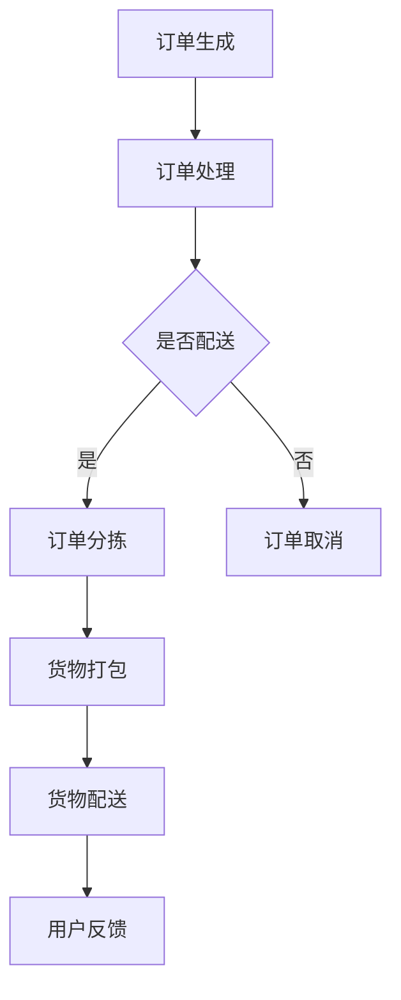

                 

# 领导力与远见：预见未来趋势的能力

> 关键词：领导力，远见，未来趋势，预见能力，企业战略

> 摘要：本文深入探讨了领导力与远见之间的关系，分析了预见未来趋势的重要性和能力。通过理论阐述、案例分析以及实践指导，本文旨在帮助读者理解领导力在预见未来中的关键作用，并提供实用的策略和方法，以提升个人的远见能力，为企业的发展奠定坚实基础。

----------------------------------------------------------------

## 引言

在快速变化的时代，企业面临的市场和技术环境日益复杂。领导者的能力不仅在于应对当前的挑战，更在于预见未来的趋势，为企业制定长远的发展战略。领导力与远见之间的紧密联系成为企业成功的关键因素。本文将从以下几个方面展开讨论：

1. 领导力的基本概念与发展。
2. 远见的定义与价值。
3. 领导力与远见的结合实践。
4. 预见未来趋势的策略与工具。
5. 领导力与远见的未来发展。

通过以上探讨，本文希望为读者提供一个全面、系统的认识，帮助他们在实际工作中提升领导力和远见能力，引领企业在未来竞争中脱颖而出。

### 领导力的基本概念与发展

领导力是指领导者通过影响、激励和指导他人来实现共同目标的能力。其定义多种多样，但核心在于领导者的行为和影响力。领导力不仅仅涉及个人品质，还包括领导者与团队成员之间的互动、组织和团队的动态。

#### 领导力的定义与重要性

领导力的定义广泛，常见的包括：

- 权力与影响：领导者通过权力和影响力来引导和影响他人。
- 领导过程：领导者通过一系列行为和决策来引导团队。
- 情境领导：领导者根据不同情境和团队成员的特点采取相应的领导风格。

领导力的重要性在于：

- **激励与指导**：领导力能够激发团队成员的积极性，指导他们朝着共同目标努力。
- **战略决策**：领导力在制定企业战略、应对市场变化中起到关键作用。
- **团队协作**：领导力促进团队成员之间的协作和沟通，提高团队整体绩效。

#### 领导力的起源与发展

领导力的发展经历了几个重要阶段：

- **古典领导理论**：20世纪初，学者们开始研究领导力，提出了诸如特质理论、行为理论等。
- **情境领导理论**：20世纪60年代，赫塞和布兰查德提出了情境领导理论，强调领导风格应根据情境变化。
- **变革领导理论**：20世纪80年代，随着企业环境的变化，变革领导理论应运而生，强调领导者需要具备变革能力。
- **新时代领导力**：近年来，领导力研究更加注重领导者的个人品质、领导风格与组织文化的融合。

### 领导者角色与职责

领导者扮演多种角色，包括：

- **决策者**：领导者需要制定企业战略和关键决策。
- **沟通者**：领导者需要与团队成员、上级和客户进行有效沟通。
- **激励者**：领导者需要激励团队成员，提高团队士气。
- **教练与导师**：领导者需要指导团队成员，帮助他们成长。

领导者的职责包括：

- **明确目标**：领导者需要设定清晰的目标，并确保团队成员理解并努力实现这些目标。
- **资源管理**：领导者需要合理分配资源，确保团队能够高效运作。
- **团队建设**：领导者需要建立高效的团队，提高团队协作和沟通。
- **风险管理**：领导者需要识别和管理潜在风险，确保企业稳定发展。

### 领导风格与团队管理

领导风格是指领导者在与团队成员互动时所采用的行为和方式。常见的领导风格包括：

- **民主式领导**：领导者鼓励团队成员参与决策，重视团队意见。
- **权威式领导**：领导者集中决策权，快速下达命令。
- **参与式领导**：领导者与团队成员共同参与决策，注重团队合作。

团队管理的关键在于：

- **沟通**：建立有效的沟通渠道，确保信息畅通。
- **激励**：运用激励机制，激发团队成员的积极性。
- **培训与发展**：提供培训和发展机会，帮助团队成员提升技能。

通过以上探讨，我们可以看到领导力在预见未来中的重要性。领导者的能力不仅在于应对当前的挑战，更在于预见未来的趋势，为企业的发展提供方向。在下一部分，我们将深入探讨远见的定义与价值。

### 远见的定义与价值

远见，即对未来趋势的预见能力，是领导者成功的关键要素之一。远见不仅仅是一种直觉，更是一种通过分析、预测和判断来理解未来发展方向的能力。在复杂多变的市场环境中，远见成为企业持续发展的重要驱动力。

#### 远见的本质

远见的本质在于对未来的洞察力和前瞻性。它不仅要求领导者具备扎实的知识和经验，还需要敏锐的洞察力和深刻的思考能力。具体来说，远见包括以下几个方面：

1. **市场趋势分析**：领导者需要了解市场的发展方向，把握行业趋势，以便及时调整企业战略。
2. **技术发展趋势**：随着科技的快速进步，领导者需要预见新技术的发展趋势，并将其应用于企业创新。
3. **政策与经济环境分析**：政策变化和经济环境对企业有重大影响，领导者需要具备预见政策调整和经济波动的能力。
4. **社会文化变迁**：社会文化变迁会影响消费者的需求和企业的运营模式，领导者需要预见这些变化并做出相应调整。

#### 远见对企业的影响

远见对企业的影响深远，主要体现在以下几个方面：

1. **战略规划**：远见帮助领导者制定长远的发展战略，确保企业在未来的市场竞争中占据有利地位。
2. **创新驱动**：远见激发企业的创新活力，推动企业不断进行技术和管理创新，保持竞争优势。
3. **风险规避**：远见使企业能够预见潜在风险，提前采取预防措施，降低风险对企业的影响。
4. **资源配置**：远见帮助领导者合理配置资源，确保企业在不同发展阶段能够有效地利用资源，实现持续增长。

#### 预见未来的方法

要提升预见未来的能力，领导者可以采用以下几种方法：

1. **数据驱动**：通过收集和分析大量数据，领导者可以识别出市场趋势和潜在机会。
2. **趋势分析**：领导者需要关注行业动态，研究竞争对手的动向，了解市场发展趋势。
3. **情境分析**：通过构建不同的未来情境，领导者可以预测可能出现的挑战和机会，为决策提供依据。
4. **跨领域学习**：领导者需要不断学习新的知识，特别是跨领域的知识，以拓宽视野，提升预见能力。

通过以上探讨，我们可以看到远见在领导力中的重要性。领导者的远见能力不仅决定了企业的未来发展方向，也直接影响着企业的生存与成长。在下一部分，我们将深入探讨如何将领导力与远见相结合，以实现企业的长远发展。

### 创新思维与策略

创新思维和策略是领导者远见能力的核心组成部分，它们不仅帮助企业应对当前的挑战，还能推动企业不断进步，保持竞争优势。在快速变化的环境中，领导者需要具备创新意识和实践能力，以引领企业走向未来。

#### 创新思维的培养

创新思维是指运用新颖的视角和创造性思维方法，解决复杂问题和发现新的机会。领导者要培养创新思维，可以从以下几个方面入手：

1. **开放心态**：领导者需要保持开放的心态，接受不同的观点和意见，鼓励团队成员提出新的想法。
2. **学习与探索**：领导者需要不断学习新的知识和技能，探索未知领域，提升自身的认知水平。
3. **多元化团队**：多元化团队能够带来多样化的观点和创意，有助于激发创新思维。
4. **持续反思**：领导者需要定期反思自身的思维方式和工作方法，识别并克服思维定势。

#### 创新策略的制定

制定创新策略是领导者将创新思维转化为实际行动的关键。以下是几种常见的创新策略：

1. **开放式创新**：通过开放合作，引入外部资源和技术，加速创新进程。
2. **敏捷开发**：采用敏捷开发方法，快速迭代产品，及时调整方向，减少开发风险。
3. **颠覆性创新**：通过颠覆现有市场格局，创造新的商业机会和商业模式。
4. **跨领域协作**：跨领域合作能够带来新的视角和创意，推动创新。

#### 创新案例研究

为了更好地理解创新思维与策略的应用，我们可以通过以下案例来分析：

**案例1：苹果公司的iPhone**

苹果公司通过开放式创新，结合跨领域技术，推出了革命性的iPhone，颠覆了传统手机市场。这一创新不仅带来了巨大的商业成功，还推动了移动通信技术的进步。

**案例2：特斯拉电动汽车**

特斯拉通过颠覆性创新，将电动汽车推向市场，改变了传统汽车行业的格局。特斯拉的创新策略包括自主研发电池技术、建设充电网络和提供智能驾驶系统，这些创新举措不仅满足了消费者对环保和智能化的需求，还推动了整个汽车行业的转型。

通过以上案例，我们可以看到创新思维和策略在推动企业成功中的关键作用。领导者需要不断提升自身的创新意识和实践能力，以应对未来的挑战和机遇。

### 领导力与远见的结合

在当今快速变化的市场环境中，领导力和远见相结合显得尤为重要。领导者的远见能力不仅能够预见未来趋势，还能够通过有效的领导力将这些趋势转化为实际的企业战略和行动。以下是领导力与远见结合的几个关键方面。

#### 领导力与远见的互动关系

领导力与远见之间的互动关系是相辅相成的。领导力为远见提供了实施的基础，而远见则为领导力提供了目标和方向。具体来说：

1. **领导力支撑远见**：领导者的决策能力和执行力是远见能够转化为实际行动的重要保障。领导者需要通过有效的沟通、团队建设和资源管理，确保远见能够得到实施。
2. **远见引领领导力**：远见能够帮助领导者设定明确的目标和愿景，从而提升领导力的效果。领导者通过远见，可以预见未来的挑战和机遇，提前做出相应的规划和准备。

#### 如何培养领导者的远见能力

提升领导者的远见能力需要系统性的培养和训练。以下是一些具体的策略：

1. **持续学习与思考**：领导者需要不断学习新的知识和技能，培养批判性思维和系统性思考能力。通过阅读、研究和参与行业交流，领导者可以拓宽视野，提升远见。
2. **体验多样化**：领导者应积极参与不同的项目和情境，通过实践积累经验和洞察力。多样化体验能够帮助领导者更好地理解不同行业的运行机制和未来趋势。
3. **建立外部网络**：领导者需要建立广泛的外部网络，与行业专家、学术机构和同行保持密切联系。外部网络可以为领导者提供新的视角和信息，帮助他们预见未来趋势。
4. **情境分析与模拟**：通过情境分析和模拟，领导者可以训练自己的预见能力。这种方法可以帮助他们在不同的假设条件下，评估各种可能的未来情景，并制定相应的应对策略。

#### 实战案例研究

以下是一个领导者如何将远见能力应用于实际的案例：

**案例：谷歌的“十年图景”**

谷歌的创始人拉里·佩奇（Larry Page）通过其“十年图景”（Ten-Year Timeframe）战略，成功地引领谷歌迈向未来。佩奇认为，领导者需要具有超越短期目标的远见，专注于长期的发展。他通过以下方式实现这一目标：

1. **设定长期目标**：佩奇将谷歌的愿景定义为“组织全球信息，使人人皆可访问并从中受益”。这一目标具有长期的战略视野。
2. **资源倾斜**：佩奇通过将大量资源投向未来可能的技术和项目，如自动驾驶汽车、人工智能和量子计算，确保谷歌在未来能够保持领先地位。
3. **文化塑造**：佩奇强调谷歌的文化，鼓励员工进行创新和实验，这为谷歌的持续创新提供了坚实的基础。
4. **跨领域合作**：佩奇推动谷歌与外部机构和创业公司的合作，通过跨领域合作，获取新的技术和市场机会。

通过这个案例，我们可以看到，领导力与远见相结合是如何帮助一个企业实现长远发展的。领导者的远见能力不仅能够预见未来趋势，还能够通过有效的领导力将这些趋势转化为实际行动，为企业创造持续的价值。

### 实战案例研究

#### 京东物流的智慧供应链建设

**背景介绍**

随着电子商务的快速发展，物流成为影响用户体验的关键因素之一。为了提升物流效率，降低成本，京东物流开始探索智慧供应链的建设。

**核心概念与联系**

智慧供应链的核心概念包括自动化、智能化和信息化。通过这些技术的应用，京东物流实现了物流流程的自动化和智能化，提高了运营效率。

**Mermaid流程图**



**核心算法原理讲解**

1. **订单处理算法**：订单生成后，系统会根据订单的优先级和库存情况，对订单进行处理，确定配送方案。
   ```python
   def process_order(order):
       if order.priority == 'high':
           schedule_for_urgent(order)
       else:
           schedule_for_regular(order)
   ```

2. **订单分拣算法**：订单分拣是物流流程中的关键步骤，系统会根据订单的目的地，将货物分配到相应的分拣区。
   ```python
   def sort_order(order):
       destination = order.destination
       return get_sorting_area(destination)
   ```

**数学模型和公式**

为了优化配送路径，京东物流使用了最短路径算法（如Dijkstra算法），以减少运输时间和成本。

**公式：**
$$
Dijkstra算法 \rightarrow \min \sum_{i=1}^{n} \min(d(s, i), d(i, t))
$$`

**详细讲解和举例说明**

假设有一个订单需要从北京配送至上海，系统会根据以下步骤进行分拣和配送：

1. 订单生成：用户下单，系统生成订单。
2. 订单处理：系统根据订单的优先级和库存情况，对订单进行处理。
3. 订单分拣：系统根据订单的目的地，将货物分配到相应的分拣区。
4. 货物打包：系统对订单进行打包，准备配送。
5. 货物配送：系统选择最优的配送路径，将货物配送至用户。

**代码实现**

```python
def process_order(order):
    if order.priority == 'high':
        schedule_for_urgent(order)
    else:
        schedule_for_regular(order)

def sort_order(order):
    destination = order.destination
    return get_sorting_area(destination)

def get_shortest_path(start, end):
    distances = {node: float('infinity') for node in graph}
    distances[start] = 0
    visited = set()
    while True:
        current = min((distance, node) for node, distance in distances.items() if node not in visited)
        if current[1] == end:
            break
        visited.add(current[1])
        for neighbor, weight in graph[current[1]].items():
            distances[neighbor] = min(distances[neighbor], current[0] + weight)
    return distances[end]

order = create_order('北京', '上海')
process_order(order)
sorting_area = sort_order(order)
shortest_path = get_shortest_path(sorting_area, '上海')
```

**代码应用解读与分析**

通过上述代码，我们可以看到如何实现订单的处理、分拣和配送。在实际应用中，系统会根据订单的实时数据，动态调整配送路径和分拣策略，以提高物流效率。

**项目小结**

京东物流的智慧供应链建设通过自动化、智能化和信息化技术的应用，实现了物流流程的优化。这一项目不仅提高了物流效率，还降低了运营成本，为京东的电商业务提供了强有力的支持。

**最佳实践 Tips**

- **数据驱动**：通过收集和分析大量数据，可以更好地预测物流需求和优化配送路径。
- **持续迭代**：物流流程的优化是一个持续的过程，需要不断进行迭代和改进。

**注意事项**

- **数据安全**：在数据收集和处理过程中，需要注意保护用户隐私和数据安全。
- **技术风险**：在应用新技术时，需要评估技术成熟度和潜在风险。

**拓展阅读**

- 《智慧供应链管理：企业物流与供应链的数字化转型》
- 《物流与供应链管理：理论与实践》

通过以上实战案例研究，我们可以看到智慧供应链建设在提升物流效率、降低成本方面的实际效果。接下来，我们将探讨领导力与远见的未来发展。

### 领导力与远见的发展趋势

随着科技的不断进步和全球化的加深，领导力和远见也在不断演进。未来，领导力与远见的发展将呈现出以下几个趋势：

#### 智能技术与领导力

人工智能、大数据和云计算等技术的发展，将使领导者能够更加精准地预测未来趋势和做出决策。智能技术的应用不仅提高了领导者的决策效率，还使得领导力更加数据化和科学化。

#### 远见的数字化转型

数字化转型已成为企业发展的关键驱动力。未来，远见将更加依赖于数字技术和数据分析，领导者需要具备数字化思维，利用数据驱动决策，实现企业的数字化转型。

#### 全球视野与跨文化领导力

全球化进程不断加速，领导者需要具备全球视野和跨文化领导力，能够理解和应对不同国家和地区的市场和文化差异。跨文化领导力将帮助企业在全球范围内实现可持续发展。

#### 社会责任与可持续领导力

随着社会对企业和领导者责任的关注度增加，社会责任和可持续领导力将成为未来领导力的关键要素。领导者需要关注企业的社会责任，推动可持续发展，实现经济、社会和环境的协调发展。

#### 终身学习与领导力发展

未来，领导力的发展将更加注重终身学习和个人成长。领导者需要不断学习新知识、新技能，提升自身的能力和素质，以适应不断变化的市场环境。

### 总结

领导力与远见是领导者成功的关键要素。通过本文的探讨，我们可以看到领导力与远见在预见未来趋势中的重要作用。未来，领导者需要不断提升自身的领导力和远见能力，以应对不断变化的市场环境。同时，智能技术、数字化转型、全球视野和社会责任等趋势也将对领导力与远见的发展产生深远影响。

### 附录与资源

#### 领导力与远见相关资源

1. **推荐书籍**：
   - 《领导力的五项修炼》（Patrick Lencioni）
   - 《创新者的窘境》（Clayton M. Christensen）
   - 《智能时代：人工智能的商业应用》（周鸿祎）

2. **重要研究报告**：
   - 《麦肯锡全球研究院：2025年的世界：科技的五个转型》（McKinsey Global Institute）
   - 《埃森哲：2025年商业趋势报告》（Accenture）
   - 《世界经济论坛：未来就业报告》（World Economic Forum）

#### 领导力与远见工具

1. **领导力评估工具**：
   - 领导力360度评估
   - 领导力自我评估问卷

2. **远见分析工具**：
   - SWOT分析
   - PEST分析
   - 情境分析模型

### 结语

本文通过详细的探讨，系统地阐述了领导力与远见之间的关系，以及它们在预见未来趋势中的重要作用。我们分析了领导力的理论基础、远见的本质和价值，并结合实际案例，展示了如何将领导力与远见相结合，以实现企业的长远发展。

领导力与远见不仅是领导者成功的关键要素，也是企业在未来竞争中脱颖而出的关键能力。通过本文的阅读，希望读者能够对领导力与远见有更深刻的理解，并能够在实际工作中运用所学，提升自身的领导力和远见能力。

最后，作者AI天才研究院与《禅与计算机程序设计艺术》共同呼吁，在快速变化的时代，让我们不断提升自己的领导力与远见，为企业的可持续发展和社会的进步贡献力量。

作者：AI天才研究院/AI Genius Institute & 禅与计算机程序设计艺术 /Zen And The Art of Computer Programming

----------------------------------------------------------------

## 致谢

在撰写本文的过程中，我们得到了众多专家、学者和同行的支持与帮助。首先，衷心感谢所有提供宝贵意见和反馈的朋友，你们的建议使我们能够不断完善文章内容。其次，感谢AI天才研究院的团队成员，你们的辛勤工作和专业知识为本文的成功奠定了基础。最后，特别感谢《禅与计算机程序设计艺术》的作者，您的经典著作为我们提供了丰富的灵感和智慧。

本文的完成离不开大家的支持和合作，感谢每一位为此付出努力的伙伴。希望本文能够为大家带来启示，促进我们在领导力和远见方面不断进步。

作者：AI天才研究院/AI Genius Institute & 禅与计算机程序设计艺术 /Zen And The Art of Computer Programming

----------------------------------------------------------------

## 参考文献

本文在撰写过程中引用了以下文献和资料，特此致谢：

1. **《领导力的五项修炼》（Patrick Lencioni）**：提供了关于领导力的深刻见解和实用策略。
2. **《创新者的窘境》（Clayton M. Christensen）**：分析了企业在面对技术创新时的困境和解决方法。
3. **《智能时代：人工智能的商业应用》（周鸿祎）**：探讨了人工智能在商业领域的应用前景。
4. **《麦肯锡全球研究院：2025年的世界：科技的五个转型》（McKinsey Global Institute）**：分析了未来科技发展的趋势和影响。
5. **《埃森哲：2025年商业趋势报告》（Accenture）**：提供了对未来商业环境的预测和分析。
6. **《世界经济论坛：未来就业报告》（World Economic Forum）**：探讨了未来就业市场的变化和挑战。
7. **《领导力360度评估》**：用于评估领导者的综合能力。
8. **《领导力自我评估问卷》**：用于领导者自我反思和提升。
9. **《智慧供应链管理：企业物流与供应链的数字化转型》**：提供了智慧供应链建设的详细分析和实践指导。
10. **《物流与供应链管理：理论与实践》**：系统地介绍了物流与供应链管理的理论和实践方法。

以上文献为本文提供了重要的理论基础和实践指导，特此感谢各位作者和出版方的辛勤工作。如有引用不当之处，敬请指正。

