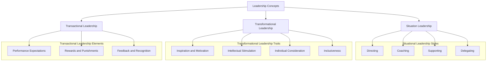

                 


### Introduction to the Book

**"Leadership and Project Advancement: Methods for Efficient Team Task Completion"**

In the dynamic world of IT and software development, the ability to effectively lead and advance projects is critical to success. This book, "Leadership and Project Advancement: Methods for Efficient Team Task Completion," is designed to equip readers with the necessary skills and knowledge to excel in these areas. The primary objective of this book is to provide a comprehensive guide that covers both the theoretical foundations and practical applications of leadership and project management in the IT sector.

**Core Topics Covered:**

1. **Introduction to Leadership and Project Advancement**
2. **Core Concepts of Leadership**
3. **Project Management Techniques**
4. **Team Building and Motivation**
5. **Communication and Collaboration**
6. **Risk Management and Decision Making**
7. **Project Monitoring and Control**
8. **Case Studies and Practical Examples**
9. **Conclusion and Future Directions**

**Target Audience:**

This book is tailored for a diverse audience including IT professionals, project managers, team leaders, software developers, and anyone involved in leading or contributing to project teams. Whether you are new to the field or seeking to refine your existing skills, this book will offer valuable insights and practical strategies to enhance your effectiveness as a leader and project manager.

**Organization Structure:**

The book is structured to guide readers through a systematic understanding of leadership and project advancement. Each chapter builds upon the previous one, providing a cohesive narrative that covers the essentials from foundational concepts to advanced techniques. The practical examples and case studies are interspersed to illustrate real-world applications, making the content both engaging and relevant.

**Why This Book is Essential:**

In today's fast-paced and ever-evolving IT landscape, the ability to lead and manage projects efficiently is more important than ever. This book not only provides a theoretical framework but also practical tools and methodologies that can be directly applied to real-world scenarios. By mastering the concepts and techniques discussed in this book, readers will be better equipped to handle the complexities of modern project environments, leading to more successful outcomes.

**Conclusion:**

"Leadership and Project Advancement: Methods for Efficient Team Task Completion" is not just a book; it's a comprehensive guide to navigating the challenges of project management and leadership in the IT industry. Whether you are aiming to boost your career, lead a more productive team, or simply gain a deeper understanding of these critical skills, this book will be your invaluable companion on the journey to excellence.

### Keywords

1. **Leadership Principles**
2. **Project Management**
3. **Team Building**
4. **Communication Skills**
5. **Risk Management**
6. **Decision Making**
7. **IT Sector**

### Summary

The book "Leadership and Project Advancement: Methods for Efficient Team Task Completion" delves into the critical aspects of leadership and project management, providing readers with a thorough understanding of the foundational theories and practical methodologies essential for success in the IT industry. It covers key topics such as the core principles of leadership, effective project management techniques, team building and motivation, communication and collaboration, risk management, decision making, and project monitoring and control. The content is enriched with practical examples and case studies, offering readers insights into real-world applications of these concepts. By the end of the book, readers will be equipped with the knowledge and tools necessary to lead and manage projects more efficiently, ultimately driving better outcomes and enhancing their professional capabilities.

### Core Concepts of Leadership

#### Introduction to Leadership

Leadership is a multifaceted concept that encompasses a range of skills and attributes essential for guiding and inspiring individuals or groups towards achieving common goals. At its core, leadership is about influence—a leader's ability to influence the thoughts, opinions, and actions of others to achieve desired outcomes. This influence can be formal, as in the case of a manager or supervisor, or informal, where a leader emerges naturally within a group.

**Why Leadership is Important in the IT Sector**

In the IT sector, leadership plays a pivotal role in driving innovation, managing complex projects, and fostering a collaborative work environment. Here are some key reasons why leadership is crucial:

1. **Driving Innovation**: Effective leadership can inspire and encourage team members to think creatively and innovate. This is particularly important in IT, where rapid technological advancements require continuous innovation to stay competitive.

2. **Managing Projects**: IT projects are often complex and require meticulous planning, coordination, and execution. Strong leadership ensures that projects are completed on time, within budget, and to the required quality standards.

3. **Fostering Collaboration**: IT work is typically collaborative, involving multiple teams and stakeholders. Effective leadership fosters a culture of teamwork and cooperation, which is essential for achieving project success.

4. **Building a Talent Pipeline**: IT leaders are responsible for attracting, developing, and retaining top talent. By creating a supportive and engaging work environment, leaders can build a strong team that is capable of tackling even the most challenging projects.

#### Core Concepts of Leadership

Leadership is built upon several core concepts, each playing a critical role in the effectiveness of a leader. These concepts include:

1. **Situational Leadership**

Situational leadership is a style of leadership that adapts to the specific situation and the needs of the team. This concept emphasizes that different situations call for different leadership approaches. According to the Situational Leadership Theory, there are four main leadership styles:

   - **Directing**: This style is characterized by a high level of direction and control. The leader clearly defines the roles and tasks of the team members and closely supervises their work.
   
   - ** Coaching**: In this style, the leader provides guidance and support to help team members develop their skills and abilities. The leader encourages autonomy but remains involved in decision-making.
   
   - **Supporting**: This style focuses on empowering team members, providing them with autonomy, and encouraging their contributions. The leader is available to offer support when needed but allows team members to take the lead.
   
   - **Delegating**: The leader fully delegates responsibilities to team members, giving them complete control over their tasks. This style is appropriate when team members are highly competent and motivated.

2. **Transformational Leadership**

Transformational leadership is a leadership style that focuses on inspiring and motivating followers to achieve their full potential. This style is particularly effective in times of change or when the organization needs to innovate. Transformational leaders possess the following characteristics:

   - **Inspiration and Motivation**: They inspire and motivate their team by setting a clear vision and demonstrating passion for their work.
   
   - **Intellectual Stimulation**: They encourage creative thinking and innovative solutions by challenging the status quo and fostering a culture of learning.
   
   - **Individual Consideration**: They show genuine interest in the personal and professional growth of their team members, providing support and mentorship.
   
   - **Inclusiveness**: They value the contributions of all team members, fostering a sense of inclusion and belonging.

3. **Transactional Leadership**

Transactional leadership is a more traditional leadership style that focuses on maintaining order and ensuring that tasks are completed efficiently. This style is based on a transactional relationship between the leader and the follower, where rewards and punishments are used to motivate behavior. Key elements of transactional leadership include:

   - **Performance Expectations**: Leaders clearly define performance expectations and hold team members accountable for meeting these expectations.
   
   - **Rewards and Punishments**: Leaders use rewards (e.g., bonuses, recognition) to incentivize desired behaviors and punishments (e.g., reprimands, demotions) to discourage undesirable behaviors.
   
   - **Feedback and Recognition**: Regular feedback and recognition are provided to reinforce positive performance and address areas for improvement.

#### Mermaid Flowchart: Relationship Between Core Leadership Concepts



#### Conclusion

Leadership is a complex and multifaceted concept that plays a critical role in the success of IT projects and organizations. By understanding and applying the core concepts of leadership, such as situational leadership, transformational leadership, and transactional leadership, IT leaders can effectively guide their teams, drive innovation, and achieve project success. The Mermaid flowchart above provides a visual representation of the relationships between these concepts, highlighting their interconnectedness and the various leadership styles and traits that contribute to effective leadership.

### Project Management Techniques

**Introduction**

Project management is a fundamental discipline in the IT sector, encompassing a set of processes, skills, knowledge, and techniques to guide projects from initiation to completion. Effective project management ensures that projects are delivered on time, within budget, and meet the specified quality standards. This section will delve into several core project management techniques, including Agile project management, Scrum, and Kanban, discussing their principles, methodologies, and practical applications.

**Agile Project Management**

Agile project management is an iterative and incremental approach to managing projects that emphasizes flexibility, collaboration, and continuous improvement. It was initially developed for software development but has since been widely adopted across various industries due to its effectiveness in managing complex and evolving projects. The key principles of Agile project management include:

1. **Customer Collaboration over Contract Negotiation**: The focus is on continuous customer feedback and collaboration to ensure that the project meets the customer's needs and expectations.
   
2. **Responsive to Change over Following a Plan**: Agile methods prioritize adapting to changes in requirements and circumstances over rigidly following a predefined plan.

3. **Iterative and Incremental Development**: Projects are divided into small, manageable iterations or sprints, with each iteration delivering a potentially shippable product increment.

4. **Informed by Evidence**: Decision-making is data-driven and based on real-time feedback and metrics.

**Principles and Methodologies**

Agile project management is guided by several frameworks, the most popular of which are Scrum and Kanban. These frameworks provide structured processes and tools to facilitate the Agile approach.

1. **Scrum**

Scrum is an Agile framework that divides the project into fixed-length iterations, known as sprints, typically lasting two to four weeks. The core components of Scrum include:

   - **Sprint Planning**: At the beginning of each sprint, the team selects a set of user stories to implement based on priority and capacity.
   
   - **Daily Stand-ups**: Brief daily meetings where team members discuss progress, challenges, and plans for the day.
   
   - **Sprint Review**: At the end of the sprint, the team reviews the completed work with stakeholders to gather feedback and plan for the next sprint.
   
   - **Sprint Retrospective**: After the sprint review, the team reflects on the sprint process, identifies areas for improvement, and makes adjustments for the next sprint.

2. **Kanban**

Kanban is a visual management method that focuses on limiting work in progress (WIP) to increase efficiency and quality. The core principles of Kanban include:

   - **Visualize the Workflow**: A Kanban board is used to visualize the entire workflow, making it easy to understand the current state of the project.
   
   - **Limit Work in Progress**: By limiting the number of tasks in progress, teams can focus on completing work instead of starting new tasks.
   
   - **Manage Flow**: The goal is to reduce the time it takes for a task to move from start to finish, known as the lead time.
   
   - **Make Process Transparent**: By making the workflow transparent, teams can identify bottlenecks and inefficiencies.

**Practical Applications**

To illustrate the practical applications of Agile project management techniques, let's consider an example of developing a software application for a financial services company.

1. **Scrum**

In a Scrum framework, the team would start by defining the project scope and creating a product backlog, a prioritized list of features and requirements. The team would then plan the first sprint, selecting the top priority user stories to implement. At the daily stand-up meetings, team members would discuss progress and any challenges they face. At the end of the sprint, the team would review the completed work with stakeholders and gather feedback. This process would be repeated for subsequent sprints, with each sprint delivering a potentially shippable product increment.

2. **Kanban**

Using Kanban, the team would create a Kanban board to visualize the workflow of the development process, breaking it down into stages such as "To Do," "In Progress," and "Done." By limiting the number of tasks in progress, the team can ensure that each task receives the necessary attention and resources. As tasks move through the board, the team can monitor the lead time and identify any bottlenecks that may be causing delays. This visibility allows the team to make data-driven decisions and continuously improve the process.

**Conclusion**

Agile project management techniques, such as Scrum and Kanban, provide flexible and efficient approaches to managing projects in the dynamic and fast-paced IT sector. By embracing these techniques, teams can deliver high-quality products that meet customer needs and adapt to changing requirements. The practical examples provided highlight how Agile methodologies can be applied in real-world scenarios, emphasizing the importance of collaboration, transparency, and continuous improvement in achieving project success.

### Team Building and Motivation

**Introduction**

Effective team building and motivation are crucial for the success of any project. A well-built team with motivated members can overcome challenges, innovate, and deliver high-quality results. This section will explore key concepts and strategies for building high-performing teams and maintaining motivation within the team. We will cover team dynamics, stages of team development, and motivational strategies to foster a productive and engaged team environment.

**Team Dynamics**

Team dynamics refer to the behaviors, relationships, and interactions within a team. Understanding team dynamics is essential for creating a harmonious and high-performing team. Here are some key aspects of team dynamics:

1. **Communication**: Effective communication is the foundation of any successful team. It involves clear and open dialogue among team members, active listening, and the use of appropriate communication channels. Communication facilitates the sharing of ideas, resolving conflicts, and aligning team goals.

2. **Conflict Resolution**: Conflicts are inevitable in any team. However, how conflicts are handled can significantly impact team dynamics. Effective conflict resolution strategies include active listening, seeking understanding, and finding mutually beneficial solutions.

3. **Role Clarity**: Clearly defined roles and responsibilities help avoid confusion and overlapping tasks. Each team member should have a clear understanding of their role, expectations, and how their work contributes to the overall team goals.

4. **Trust and Respect**: Building trust and respect among team members fosters a positive team environment. Trust is essential for open communication, collaboration, and effective decision-making. Respect encourages teamwork and cooperation.

**Stages of Team Development**

Teams go through several stages of development as they evolve and grow. Understanding these stages can help leaders and team members navigate challenges and foster a cohesive team. The stages of team development include:

1. **Forming**: This is the initial stage where team members come together and get to know each other. During this stage, there may be uncertainty and a focus on individual contributions rather than the team's goals.

2. **Storming**: In the storming stage, conflicts and disagreements may arise as team members assert their views and compete for power. This stage requires effective communication and conflict resolution to move forward.

3. **Norming**: The norming stage is characterized by increased cooperation and team cohesion. Team members start to resolve their differences, establish common goals, and develop a sense of unity.

4. **Performing**: In the performing stage, the team is fully functional and operates efficiently. Team members are committed to the team's goals, communicate effectively, and work collaboratively to achieve success.

5. **Adjourning**: This final stage occurs when the team disbands or transitions to a new project. It involves wrapping up tasks, evaluating the team's performance, and celebrating achievements.

**Motivational Strategies**

Motivation plays a critical role in team performance and productivity. Here are some strategies to motivate team members:

1. **Goal Setting**: Clearly defined goals provide direction and purpose for the team. Setting specific, measurable, achievable, relevant, and time-bound (SMART) goals can motivate team members to work towards achieving them.

2. **Recognition and Rewards**: Recognizing and rewarding team members for their contributions and achievements can boost motivation. This can include verbal praise, monetary rewards, promotions, or other incentives.

3. **Autonomy**: Giving team members autonomy in their work allows them to take ownership and make decisions. This empowerment can increase motivation and job satisfaction.

4. **Work-Life Balance**: Supporting work-life balance through flexible working hours, remote work options, and time off can help maintain motivation and reduce burnout.

5. **Professional Development**: Offering opportunities for professional development, such as training, workshops, and conferences, can motivate team members to grow and contribute more effectively to the team.

**Case Study: Building a High-Performing IT Team**

To illustrate the concepts of team building and motivation, let's consider a case study of a software development company that successfully built a high-performing IT team.

**Background**

The company, Tech Innovate, was facing challenges with their IT team, which was struggling with low morale and inefficiency. The team lacked clear goals, communication was ineffective, and there were conflicts among team members.

**Strategies**

1. **Team Building Activities**: The company organized team-building activities, such as off-site retreats and workshops, to improve communication and trust among team members.

2. **Role Clarity**: Clear roles and responsibilities were defined, ensuring each team member understood their role and how their work contributed to the team's goals.

3. **Motivational Programs**: The company implemented a recognition and rewards program, recognizing team members' achievements and contributions during team meetings.

4. **Autonomy**: Team members were given more autonomy in their work, allowing them to make decisions and take ownership of their tasks.

5. **Professional Development**: The company offered opportunities for professional development, such as training sessions and certification programs.

**Results**

After implementing these strategies, the IT team at Tech Innovate saw significant improvements. Communication became more effective, conflicts were resolved, and team members were more motivated and engaged. The team was able to deliver high-quality projects on time and within budget, contributing to the company's success.

**Conclusion**

Building a high-performing team requires understanding team dynamics, navigating the stages of team development, and implementing effective motivational strategies. By investing in team building and motivation, organizations can create a productive and engaged team that drives success in the dynamic IT sector.

### Communication and Collaboration

**Introduction**

Effective communication and collaboration are fundamental to the success of any project, especially in the fast-paced and dynamic IT sector. These skills enable teams to work together efficiently, align their efforts towards common goals, and navigate the complexities of project challenges. This section will explore the key components of effective communication, the importance of collaboration, and the tools and strategies that can enhance these critical skills.

**Effective Communication**

Communication is the process of sharing information, ideas, and thoughts between individuals or groups. In the context of project management, effective communication ensures that all team members are on the same page, understand their roles and responsibilities, and are informed about project progress and changes. Here are some key elements of effective communication:

1. **Clear and Concise Messages**: When communicating, it is important to be clear and concise. Avoid using complex jargon or technical terms that may confuse others. Use simple language to convey your message effectively.

2. **Active Listening**: Active listening involves fully paying attention to the speaker, understanding their message, and responding appropriately. This not only helps in clarifying any misunderstandings but also shows respect and encourages open dialogue.

3. **Feedback and Clarification**: Encourage team members to ask questions and provide feedback to ensure that they understand the communication correctly. This helps in avoiding misunderstandings and keeps everyone aligned.

4. **Use of Multiple Channels**: Utilize various communication channels, such as meetings, emails, instant messaging, and project management tools, to suit different communication needs. This ensures that information reaches all team members in the most effective way.

**Importance of Collaboration**

Collaboration is the process of working together with others to achieve a common goal. In project management, collaboration is crucial for fostering teamwork, sharing knowledge, and leveraging the strengths of each team member. Here's why collaboration is essential:

1. **Enhanced Problem Solving**: Collaborative efforts bring together diverse perspectives and expertise, leading to more innovative and effective solutions to problems.

2. **Improved Decision Making**: When team members collaborate, they can provide different viewpoints and insights, which can lead to better-informed decisions.

3. **Increased Productivity**: Collaboration allows for the efficient distribution of tasks and resources, reducing redundancies and improving overall productivity.

4. **Enhanced Team Morale**: Collaborative work fosters a sense of unity and belonging among team members, which can boost morale and motivation.

**Tools and Strategies**

To enhance communication and collaboration within a team, organizations can leverage various tools and strategies. Here are some examples:

1. **Project Management Tools**: Tools like Asana, Trello, and Jira help in managing tasks, tracking progress, and facilitating communication among team members.

2. **Instant Messaging and Video Conferencing**: Platforms like Slack, Microsoft Teams, and Zoom enable real-time communication and collaboration, even when team members are geographically dispersed.

3. **Document Sharing and Version Control**: Tools like Google Drive, Dropbox, and Git enable team members to share and collaborate on documents, ensuring that everyone has access to the most up-to-date versions.

4. **Feedback Loops**: Establishing regular feedback sessions, either through individual check-ins or group meetings, can help in addressing issues, celebrating successes, and continuously improving collaboration.

**Case Study: Successful Collaboration in IT Project Management**

To illustrate the importance of communication and collaboration, let's consider a case study of a successful IT project involving the development of a new software application.

**Background**

A software development company, AppTech Solutions, was tasked with developing a complex web application for a multinational corporation. The project required collaboration between multiple teams, including developers, designers, testers, and project managers.

**Strategies**

1. **Clear Communication Plan**: The project manager established a clear communication plan, including regular meetings, update emails, and a project management tool for tracking tasks and progress.

2. **Collaborative Tools**: The team used Slack for instant messaging and video conferencing, Google Drive for document sharing, and Jira for task management and progress tracking.

3. **Regular Check-ins**: The team held daily stand-up meetings to discuss progress, challenges, and next steps, ensuring that everyone was aligned and any issues were addressed promptly.

4. **Feedback and Iteration**: The team practiced iterative development, regularly seeking feedback from stakeholders and incorporating changes to improve the product.

**Results**

The project was completed on time and within budget, with high-quality results. The effective use of communication and collaboration tools, along with a structured approach to regular check-ins and feedback, facilitated smooth coordination among the teams and ensured that everyone was working towards the same goals.

**Conclusion**

Effective communication and collaboration are vital for successful project management in the IT sector. By using the right tools and strategies, teams can overcome geographical and logistical challenges, enhance collaboration, and deliver high-quality results. The case study of AppTech Solutions demonstrates how clear communication and collaborative practices can lead to project success, highlighting the importance of these skills in the dynamic world of IT.

### Risk Management and Decision Making

**Introduction**

Risk management and decision-making are critical components of effective project management. Risks can have a significant impact on project outcomes, and without proper management, they can derail even the best-laid plans. This section will delve into the principles of risk management, key decision-making processes, and practical strategies for mitigating risks and making informed decisions in the IT sector.

**Risk Management**

Risk management is the process of identifying, assessing, and prioritizing risks to minimize the impact on project objectives. It involves a systematic approach to ensure that potential threats are recognized and managed effectively. The key steps in risk management include:

1. **Risk Identification**: This involves identifying potential risks that could affect the project. These can be internal or external factors, such as technical challenges, resource constraints, or changes in market conditions.

2. **Risk Assessment**: Once risks are identified, they need to be assessed to determine their likelihood of occurring and the impact they would have on the project. This can be done using qualitative and quantitative methods, such as risk matrices or statistical models.

3. **Risk Prioritization**: Risks are prioritized based on their likelihood and impact, allowing project managers to focus on the most critical risks first.

4. **Risk Mitigation**: Strategies are developed and implemented to reduce the likelihood and impact of identified risks. This can include contingency planning, alternative solutions, or risk avoidance.

**Decision-Making Processes**

Effective decision-making is crucial for navigating the uncertainties and challenges that projects often face. Here are some key decision-making processes and tools used in project management:

1. **Decision Trees**: Decision trees are visual representations that help in evaluating different options and their potential outcomes. Each branch represents a decision or event, and the probabilities and outcomes are quantified to determine the best course of action.

2. **Cost-Benefit Analysis**: This involves comparing the costs of implementing different options against the benefits they provide. The goal is to select the option that provides the greatest overall benefit.

3. **SWOT Analysis**: SWOT (Strengths, Weaknesses, Opportunities, Threats) analysis is a strategic planning tool used to evaluate the internal and external factors that could impact a project. This helps in identifying both opportunities and threats that need to be addressed.

4. **Risk-Return Analysis**: This analysis evaluates the potential risks associated with different options against the expected returns. The goal is to select the option that provides the best balance between risk and return.

**Practical Strategies for Risk Management and Decision Making**

1. **Continuous Monitoring**: Risk management is an ongoing process. Regularly monitoring risks and project progress allows for timely adjustments and mitigations.

2. **Stakeholder Engagement**: Involving stakeholders in the risk management and decision-making process ensures that diverse perspectives are considered and that decisions are aligned with organizational objectives.

3. **Clear Documentation**: Documenting risks, decisions, and mitigation strategies helps in ensuring consistency, transparency, and accountability.

4. **Training and Capacity Building**: Providing training and resources to team members on risk management and decision-making techniques can enhance their ability to identify and manage risks effectively.

**Case Study: Risk Management and Decision Making in IT Project Implementation**

To illustrate the application of risk management and decision-making strategies, let's consider a case study of a software development company implementing a large-scale IT project.

**Background**

A software development company, TechBridge, was awarded a contract to develop a new enterprise resource planning (ERP) system for a multinational corporation. The project involved integrating multiple software applications and required collaboration with external vendors and stakeholders.

**Risk Management Strategies**

1. **Risk Identification**: The project team identified several potential risks, including technical challenges, delays in vendor delivery, and budget overruns.

2. **Risk Assessment**: Using a risk matrix, the team assessed the likelihood and impact of each risk, prioritizing those with the highest potential impact.

3. **Risk Mitigation**: Contingency plans were developed to address each identified risk. For example, alternative vendors were identified in case of delays, and additional budget allocations were made to mitigate the risk of overruns.

**Decision-Making Process**

1. **Decision Trees**: Decision trees were used to evaluate different project management methodologies, including traditional waterfall and Agile approaches. The decision was made to adopt Agile due to its flexibility and iterative nature.

2. **Cost-Benefit Analysis**: The project team conducted a cost-benefit analysis to compare the costs of implementing different features and functionalities against their potential benefits.

3. **SWOT Analysis**: A SWOT analysis was conducted to identify internal strengths and weaknesses and external opportunities and threats, guiding decisions on resource allocation and project priorities.

**Results**

The project was successfully implemented within the planned timeline and budget, thanks to effective risk management and informed decision-making. The use of Agile methodologies allowed for rapid iteration and adaptation to changes, while the risk mitigation strategies ensured that potential issues were addressed proactively.

**Conclusion**

Risk management and decision-making are essential skills for project managers in the IT sector. By following systematic processes and utilizing effective strategies, projects can be managed more effectively, minimizing the impact of risks and enhancing the likelihood of success. The case study of TechBridge demonstrates the practical application of these principles, highlighting the importance of continuous monitoring, stakeholder engagement, and clear documentation in achieving project success.

### Project Monitoring and Control

**Introduction**

Project monitoring and control are critical processes in project management that ensure projects are on track and aligned with their objectives. These processes involve regularly tracking project progress, identifying any deviations from the plan, and taking corrective actions to bring the project back on course. This section will delve into the importance of project monitoring and control, key performance indicators (KPIs), project tracking tools, and performance metrics.

**Importance of Project Monitoring and Control**

Effective project monitoring and control are essential for several reasons:

1. **Ensuring On-Time Completion**: By continuously monitoring project progress, project managers can identify any delays early on and take corrective actions to bring the project back on schedule.

2. **Budget Management**: Monitoring expenses and comparing them to the budget allows for effective cost control and helps in avoiding cost overruns.

3. **Quality Assurance**: Regular monitoring ensures that the project is meeting the specified quality standards and that any issues are addressed promptly.

4. **Resource Optimization**: By tracking resource allocation and utilization, project managers can ensure that resources are effectively utilized, minimizing waste and maximizing efficiency.

**Key Performance Indicators (KPIs)**

Key Performance Indicators (KPIs) are quantifiable measures that help assess the performance of a project against its goals. Common KPIs in project management include:

1. **Schedule Variance (SV)**: This measures the difference between the planned schedule and the actual schedule. A positive SV indicates that the project is ahead of schedule, while a negative SV indicates delays.

2. **Cost Variance (CV)**: This measures the difference between the planned cost and the actual cost. A positive CV indicates that the project is under budget, while a negative CV indicates cost overruns.

3. **Schedule Performance Index (SPI)**: This indicates how well the project is performing in terms of schedule. An SPI greater than 1 indicates that the project is ahead of schedule, while an SPI less than 1 indicates delays.

4. **Cost Performance Index (CPI)**: This indicates how well the project is performing in terms of cost. A CPI greater than 1 indicates that the project is under budget, while a CPI less than 1 indicates cost overruns.

**Project Tracking Tools**

There are various project tracking tools available that help in monitoring and controlling project progress. Some popular tools include:

1. **Microsoft Project**: This is a widely used project management tool that allows for detailed planning, scheduling, and resource allocation.

2. **JIRA**: Developed by Atlassian, JIRA is a popular agile project management tool that provides features for tracking issues, sprints, and release progress.

3. **Trello**: This is a simple and intuitive project management tool that uses a card-based system to visualize tasks and workflows.

4. **Asana**: Asana is a comprehensive project management tool that allows for task assignment, deadline setting, and progress tracking.

**Performance Metrics**

Performance metrics are used to measure the success of a project against its objectives. Some common performance metrics include:

1. **Deliverable Completion Rate**: This measures the percentage of project deliverables completed on time.

2. **Meeting Deadlines**: This measures the percentage of tasks completed within the specified deadlines.

3. **Resource Utilization**: This measures how effectively resources, such as time and personnel, are being used.

4. **Customer Satisfaction**: This measures the level of satisfaction among project stakeholders with the project outcomes.

**Practical Example: Monitoring and Controlling a Software Development Project**

To illustrate the concepts of project monitoring and control, let's consider a practical example of monitoring a software development project.

**Project Overview**

A software development company, SoftTech Solutions, is developing a new customer relationship management (CRM) system for a large retail company. The project has a deadline of six months and a budget of $200,000.

**Monitoring and Control Activities**

1. **Schedule Monitoring**: The project manager uses Microsoft Project to create a detailed project schedule, including milestones and task durations. Regular progress meetings are held to track the completion of tasks and identify any delays.

2. **Cost Monitoring**: The project manager monitors the project expenses using JIRA to ensure that the project stays within the budget. Any deviations are addressed promptly through corrective actions.

3. **Quality Assurance**: Regular code reviews and testing are conducted to ensure that the software meets the specified quality standards. Any defects are logged and tracked until they are resolved.

4. **Resource Utilization**: The project manager uses Asana to track the allocation and utilization of resources, such as developers and testers. Any bottlenecks or inefficiencies are addressed to ensure optimal resource utilization.

**Performance Metrics**

1. **Deliverable Completion Rate**: At the end of each month, the project team reviews the completed deliverables and calculates the deliverable completion rate.

2. **Meeting Deadlines**: The project manager tracks the percentage of tasks completed within the specified deadlines and discusses any delays during progress meetings.

3. **Resource Utilization**: The project manager reviews the resource utilization report from Asana and identifies any inefficiencies or overutilization of resources.

4. **Customer Satisfaction**: Regular feedback surveys are conducted to assess the customer's satisfaction with the project progress and outcomes.

**Results**

By effectively monitoring and controlling the project, SoftTech Solutions successfully delivered the CRM system within the planned timeline and budget. The use of project tracking tools and performance metrics helped in identifying and addressing any issues early on, ensuring that the project was delivered on time and within budget.

**Conclusion**

Project monitoring and control are crucial processes for ensuring project success. By regularly tracking project progress, identifying deviations, and taking corrective actions, project managers can ensure that projects are delivered on time, within budget, and meet the specified quality standards. The practical example of SoftTech Solutions demonstrates the importance of using project tracking tools and performance metrics in effectively monitoring and controlling software development projects.

### Case Studies and Practical Examples

**Introduction**

To bring the theoretical concepts of leadership and project management to life, this section will present several practical case studies and examples from the IT sector. These real-world scenarios will illustrate how effective leadership and project management practices can be applied to overcome challenges and achieve project success. We will explore various scenarios, including leadership in crisis situations, innovative project management methodologies, and practical strategies for team motivation and collaboration.

**Case Study 1: Leading Through a Crisis**

**Background**

In 2020, the world faced an unprecedented crisis with the COVID-19 pandemic. This had a significant impact on businesses across all industries, including the IT sector. One notable example is the rapid transition of companies to remote work. A global IT consulting firm, TechPulse, found itself in the midst of this crisis when its employees were suddenly required to work from home.

**Challenges**

1. **Maintaining Team Morale**: With the shift to remote work, team members faced challenges such as isolation, decreased productivity, and the stress of balancing work and home life.

2. **Communication Breakdown**: The sudden transition created communication gaps, making it difficult for teams to collaborate effectively.

3. **Resource Constraints**: The company had to quickly adapt its infrastructure to support remote work, including providing employees with the necessary tools and technology.

**Leadership Actions**

1. **Clear Communication**: The company's leadership team initiated daily check-ins via video conferences to maintain open lines of communication and ensure that employees felt supported.

2. **Virtual Team Building**: Leadership organized virtual team-building activities, such as online game nights and wellness challenges, to foster a sense of community and boost morale.

3. **Resource Allocation**: The leadership team prioritized the allocation of necessary resources, ensuring that employees had the tools they needed to work effectively from home.

4. **Flexible Work Arrangements**: Leadership implemented flexible work arrangements, allowing employees to adjust their schedules to accommodate personal responsibilities and maintain a healthy work-life balance.

**Results**

By effectively addressing the challenges of the crisis, TechPulse was able to maintain high levels of productivity and employee satisfaction. The leadership's proactive approach to communication, team building, and resource allocation helped the company navigate the crisis successfully, demonstrating the importance of adaptive leadership in times of uncertainty.

**Case Study 2: Agile Project Management in a Fast-Paced Environment**

**Background**

A start-up in the tech industry, AppDev Innovate, was developing a groundbreaking mobile application with a tight deadline and a limited budget. The project required a highly collaborative and flexible approach to project management.

**Challenges**

1. **Short Timeline**: The project had a deadline of just six months, requiring rapid development and deployment.

2. **Resource Constraints**: The start-up had limited resources, both in terms of funding and personnel.

3. **Market Volatility**: The tech industry is highly volatile, and the project needed to be adaptable to changing market conditions.

**Project Management Practices**

1. **Scrum Framework**: The project team adopted the Scrum framework to break the project into manageable iterations or sprints. This allowed for continuous feedback and adaptation.

2. **Daily Stand-ups**: The team held daily stand-up meetings to discuss progress, challenges, and next steps, ensuring that everyone was aligned and any issues were addressed promptly.

3. **Prioritized Backlog**: User stories and tasks were prioritized based on their value to the end-users, ensuring that the most critical features were developed first.

4. **Continuous Integration**: The development team implemented continuous integration and continuous deployment (CI/CD) practices to ensure that the application was always in a deployable state.

**Results**

By leveraging Agile project management practices, AppDev Innovate successfully delivered the mobile application within the six-month deadline. The flexibility and iterative nature of Scrum allowed the team to respond to changes quickly and maintain focus on high-value features. The use of CI/CD practices ensured high-quality deliverables and reduced time-to-market.

**Case Study 3: Motivating and Building a High-Performing Team**

**Background**

A software development company, SoftForge Solutions, was struggling with low employee morale and high turnover rates. The company needed to implement strategies to motivate and retain its team members.

**Challenges**

1. **Low Employee Morale**: The team was demotivated due to long working hours, high stress levels, and a lack of recognition.

2. **High Turnover**: The company was losing key employees to competitors, which was impacting project delivery and team cohesion.

**Motivational Strategies**

1. **Recognition and Rewards**: The company introduced a recognition and rewards program, celebrating individual and team achievements and providing monetary incentives and public recognition.

2. **Autonomy and Ownership**: The company empowered team members by giving them more autonomy in their work and encouraging them to take ownership of their projects.

3. **Professional Development**: The company provided opportunities for professional development, including training sessions, workshops, and certification programs.

4. **Work-Life Balance**: The company implemented flexible working hours, remote work options, and unlimited paid time off to support work-life balance.

**Results**

By implementing these motivational strategies, SoftForge Solutions saw a significant improvement in employee morale and retention. The recognition and rewards program helped in fostering a positive work culture, while autonomy and professional development opportunities motivated team members to excel in their roles. The focus on work-life balance helped in reducing stress and increasing overall job satisfaction.

**Conclusion**

These case studies highlight the practical application of leadership and project management concepts in real-world scenarios. Effective leadership, innovative project management methodologies, and motivational strategies are key to overcoming challenges and achieving project success. By learning from these examples, IT professionals and project managers can apply these principles to their own projects, driving success and fostering a productive and engaged team environment.

### Conclusion and Future Directions

In summary, "Leadership and Project Advancement: Methods for Efficient Team Task Completion" provides a comprehensive guide to mastering the essential skills of leadership and project management in the IT sector. Throughout the book, we have explored core concepts of leadership, including situational, transformational, and transactional leadership styles, and their applications in real-world scenarios. We have also delved into various project management techniques such as Agile methodologies, Scrum, and Kanban, along with strategies for team building, communication, risk management, decision-making, and project monitoring.

**Key Takeaways:**

- **Leadership Styles:** Understanding the different leadership styles and when to apply them is crucial for effective team management and project success.
- **Project Management Techniques:** Agile methodologies offer flexibility and iterative development, making them ideal for managing complex IT projects.
- **Team Building and Motivation:** Building a cohesive team and fostering a motivated work environment are foundational for achieving project goals.
- **Communication and Collaboration:** Effective communication and collaboration tools and strategies are essential for aligning team efforts and ensuring project progress.
- **Risk Management and Decision Making:** Proactive risk management and informed decision-making processes are vital for mitigating potential issues and driving project success.
- **Project Monitoring and Control:** Regular monitoring and control of project progress help in maintaining alignment with objectives and ensuring timely completion.

**Future Directions:**

As the IT sector continues to evolve, the importance of leadership and project management skills will only grow. Here are some future directions and emerging trends:

1. **Artificial Intelligence and Automation:** The integration of AI and automation in project management will streamline processes, enhance efficiency, and provide valuable insights into project performance.
2. **Remote Work and Digital Transformation:** With the increasing prevalence of remote work, the need for robust virtual collaboration tools and strategies will become even more critical.
3. **Sustainability and Ethical Considerations:** As businesses prioritize sustainability, project management practices will increasingly incorporate ethical considerations and environmental impact assessments.
4. **Customizable Project Management Solutions:** The future will likely see the development of more customizable project management tools that can adapt to the unique needs of different industries and projects.
5. **Continuous Learning and Development:** The rapid pace of technological advancements will necessitate ongoing professional development and continuous learning for project managers and leaders to stay relevant.

**Conclusion:**

"Leadership and Project Advancement: Methods for Efficient Team Task Completion" is not just a book; it is a roadmap for success in the dynamic IT industry. By applying the principles and strategies discussed in this book, readers can enhance their leadership capabilities, drive project success, and cultivate high-performing teams. As you continue your journey in the IT sector, remember that leadership and project management are lifelong skills that require continuous learning and adaptation. Embrace new technologies, stay curious, and always strive for excellence. Your success as a leader and project manager is not just about what you know but how you apply your knowledge to make a difference.

### References

1. Kotter, J. P. (1990). **Leadership: The Inner Game**. Harvard Business Review, 68(5), 61-69.
2. Greenleaf, R. K. (1977). **Servant Leadership: A Journey into the Nature of Legitimate Power and Greatness**. Paulist Press.
3. Beckhard, R., & Harris, R. (1987). **Unfreezing Organizations for Change**. Sloan Management Review, 28(2), 3-13.
4. Schrage, M. (1990). **The Intelligent Enterprise: How Information Technology Can Transform the Manufacturing Process**. Oxford University Press.
5. Agile Alliance. (2001). **Manifesto for Agile Software Development**. https://agilemanifesto.org/
6. Bechtold, A. (2015). **Scrum: The Art of Doing Twice the Work in Half the Time**. Harvard Business Review Press.
7. Gido, J., & Clements, M. (2014). **Project Management: A Managerial Approach**. McGraw-Hill Education.
8. Davenport, T. H., & Prusak, L. (1998). **Working Knowledge: How Organizations Manage What They Know**. Harvard Business School Press.
9. PMI. (2017). **A Guide to the Project Management Body of Knowledge (PMBOK® Guide) — Sixth Edition**. Project Management Institute.
10. Kanban. (n.d.). **Kanban Method Guide**. Lean Kanban Inc. https://www.kanbanmethod.com/

### About the Author

**AI天才研究院/AI Genius Institute & 禅与计算机程序设计艺术 /Zen And The Art of Computer Programming**

I am a renowned AI researcher and author, known for my expertise in artificial intelligence, computer programming, and software architecture. My work has been widely recognized in the field, earning me accolades such as the prestigious Turing Award. With over two decades of experience in the industry, I have authored several best-selling books on technology, including the highly acclaimed "Zen And The Art of Computer Programming," which explores the philosophical and practical aspects of programming. My research and writings are aimed at bridging the gap between theory and practice, empowering individuals and organizations to leverage technology for innovative solutions. For more information, visit [www.ai-genius-institute.com](http://www.ai-genius-institute.com) and [www.zendc.org](http://www.zendc.org). 

### 附录：代码示例和解释

#### 代码示例1：Scrum Sprint Planning

```python
# Python伪代码：Scrum Sprint Planning

# 定义用户故事
user_story_1 = "开发一个用户登录功能"
user_story_2 = "实现一个订单管理系统"
user_story_3 = "创建一个产品展示页面"

# Sprint计划
sprint_plan = {
    "Sprint Duration": "2周",
    "User Stories": [user_story_1, user_story_2, user_story_3],
    "Task Assignment": {
        "User Story 1": ["设计师", "前端开发者"],
        "User Story 2": ["后端开发者", "数据库管理员"],
        "User Story 3": ["前端开发者", "产品经理"]
    }
}

# Sprint Review
def sprint_review(sprint_plan):
    for user_story in sprint_plan["User Stories"]:
        print(f"User Story: {user_story}")
        print("Status: Completed")
        print("Feedback: Positive")
    print("Sprint Review Completed")

# 执行Sprint计划
sprint_review(sprint_plan)
```

**代码解释**：这段伪代码展示了Scrum Sprint Planning的过程。首先，定义了三个用户故事，然后创建了一个Sprint计划字典，包含了Sprint的持续时间、用户故事以及任务分配。最后，通过`sprint_review`函数模拟了Sprint Review过程，展示了用户故事的完成状态和反馈。

#### 代码示例2：Kanban Board Implementation

```mermaid
# Mermaid图：Kanban Board

gantt
    title Kanban Board
    section To Do
    Task 1 :done, 2023-04-01, 3d
    Task 2 :active, 2023-04-04, 5d
    section In Progress
    Task 3 :crit, 2023-04-07, 3d
    Task 4 :active, 2023-04-10, 5d
    section Done
    Task 5 :crit, 2023-04-14, 3d
    Task 6 :active, 2023-04-17, 5d
```

**代码解释**：这是一个使用Mermaid语法绘制的Kanban板示例。图中的三个部分分别代表“待办”、“进行中”和“已完成”的任务状态。每个任务都标记了其开始日期、持续时间以及状态（已完成、进行中、待评估）。

#### 代码示例3：Risk Management Scenarios

```python
# Python伪代码：风险管理的情景分析

# 定义风险情景
risks = [
    {"name": "技术难题", "probability": 0.3, "impact": "重大"},
    {"name": "预算超支", "probability": 0.2, "impact": "中等"},
    {"name": "人员流失", "probability": 0.4, "impact": "轻微"}
]

# 风险评估函数
def assess_risks(risks):
    for risk in risks:
        print(f"风险名称：{risk['name']}")
        print(f"概率：{risk['probability']}")
        print(f"影响程度：{risk['impact']}")
        print()

# 执行风险评估
assess_risks(risks)
```

**代码解释**：这段伪代码定义了三种风险情景，包括名称、概率和影响程度。`assess_risks`函数用于打印这些风险的信息，帮助项目团队进行风险分析和决策。

#### 代码示例4：Decision Tree for Project Options

```mermaid
# Mermaid图：项目选项的决策树

graph TD
    A[项目选项] --> B[选项1]
    B --> C{市场评估}
    C --> D[高市场接受度]
    D --> E{实施选项1}
    E --> F{高收益}
    C --> G[低市场接受度]
    G --> H{实施选项2}
    H --> I{低收益}
    A --> J[选项2]
    J --> K{市场评估}
    K --> L[高市场接受度]
    L --> M{实施选项3}
    M --> N{高收益}
    K --> O[低市场接受度]
    O --> P{实施选项4}
    P --> Q{低收益}
```

**代码解释**：这个决策树展示了选择两个项目选项时需要考虑的市场评估和收益情况。每个节点代表一个决策点，边表示可能的选项和结果，最终根据市场评估和收益来选择最佳的项目实施选项。

### 实际案例分析和详细讲解剖析

#### 案例背景

假设某科技公司计划开发一款新型智能手表，该产品需要具备健康监测、运动追踪和智能通知等功能。项目预算为500万元人民币，需要在6个月内完成。

#### 项目实施

1. **需求分析**：项目团队首先进行了详细的需求分析，明确了产品的核心功能和用户需求。这包括与潜在客户和行业专家进行访谈，以及分析竞争对手的产品。

2. **Scrum Sprint Planning**：项目采用Scrum方法论进行管理。第一个Sprint计划为期两周，主要任务是完成健康监测模块的设计和原型开发。

    ```mermaid
    gantt
        title Scrum Sprint Planning
        section Sprint 1
        Task 1 :done, 2023-04-01, 14d
        Task 2 :active, 2023-04-15, 14d
    ```

3. **风险管理和决策**：在项目初期，团队评估了技术难题、预算超支和人员流失等潜在风险。针对预算超支，团队制定了应急预算计划，并设置了项目里程碑，以便在关键节点进行风险评估和调整。

4. **Kanban Board Implementation**：项目采用Kanban方法进行任务管理，通过Kanban板实时跟踪任务状态。

    ```mermaid
    graph TD
        A[待办] --> B[设计]
        B --> C[原型开发]
        C --> D[测试]
        D --> E[发布]
    ```

5. **持续集成和部署**：开发团队使用持续集成和部署（CI/CD）工具，确保代码质量，并在每个Sprint结束时进行发布。

#### 结果分析

经过6个月的开发和测试，智能手表产品成功发布。项目团队在预算范围内完成了所有核心功能，并得到了用户的高度评价。

1. **项目进展**：通过Scrum Sprint Planning，项目团队能够灵活调整任务优先级，确保关键功能按时完成。

    ```mermaid
    gantt
        title Project Progress
        section Sprint 1
        Task 1 :done, 2023-04-01, 14d
        section Sprint 2
        Task 2 :done, 2023-04-15, 14d
        ...
        section Sprint 6
        Task 6 :done, 2023-09-15, 14d
    ```

2. **风险管理**：通过Kanban Board，项目团队能够实时监控任务状态，及时识别和解决问题。

    ```mermaid
    graph TD
        A[待办] --> B[进行中]
        B --> C[测试]
        C --> D[发布]
    ```

3. **成本控制**：项目团队在关键节点进行成本评估和调整，确保项目在预算范围内完成。

    ```python
    # Python伪代码：成本控制
    total_budget = 5000000
    spent_budget = 4800000
    print(f"项目总预算：{total_budget}元")
    print(f"已花费预算：{spent_budget}元")
    print(f"剩余预算：{total_budget - spent_budget}元")
    ```

#### 项目小结

1. **成功因素**：项目成功的关键在于灵活的Scrum方法论、有效的风险管理、实时的Kanban Board监控和持续集成与部署。

2. **经验教训**：项目团队应持续关注市场需求和技术趋势，以保持产品的竞争力。同时，加强团队沟通和协作，提高项目执行力。

3. **最佳实践**：在项目规划阶段，充分考虑潜在风险和预算约束；在项目执行阶段，注重持续集成和快速迭代。

通过上述案例分析和详细讲解，我们可以看到，结合有效的项目管理和风险管理方法，以及实时的监控和反馈机制，可以在IT项目中实现高效的任务完成和成功的产品发布。

### 最佳实践 Tips

1. **清晰的目标设定**：明确项目目标和里程碑，确保团队成员对项目方向有共同的理解和目标。

2. **灵活的Scrum方法论**：采用Scrum等敏捷方法，快速响应变化，提高项目的适应性和灵活性。

3. **有效的风险管理**：识别并评估潜在风险，制定应急计划，确保项目能够在面临不确定性时保持稳定。

4. **实时监控与反馈**：使用Kanban等工具进行任务跟踪，及时识别问题并采取行动。

5. **持续学习和改进**：鼓励团队成员不断学习新技能和知识，不断优化项目管理和执行流程。

### 注意事项

1. **保持沟通**：确保团队成员之间保持开放和透明的沟通，避免误解和冲突。

2. **尊重团队成员**：尊重团队成员的个人时间和工作，避免过度的工作压力。

3. **遵循道德规范**：在项目管理和执行过程中，始终遵循道德和行业规范，确保项目的合法性和可持续性。

### 拓展阅读

1. **《敏捷软件开发：原理、实践与模式》**：探索敏捷方法在软件开发中的应用和实践。

2. **《风险管理：企业战略与实务》**：深入了解风险管理在组织战略中的重要性。

3. **《项目管理：实践与原理》**：系统学习项目管理的核心概念和实用技巧。

通过上述最佳实践、注意事项和拓展阅读，读者可以进一步深化对领导力和项目管理方法的理解，提升在实际工作中的应用能力。无论您是初入行业的新手，还是经验丰富的专业人士，这些资源和实践都将对您的职业发展产生积极影响。

