                 

# 领导力与风险管理：在不确定性中前行

## 关键词
- 领导力
- 风险管理
- 不确定性
- 变革管理
- 团队建设
- 组织文化

## 摘要
本文旨在探讨领导力与风险管理在组织中的重要作用，尤其是在不确定性日益增加的环境中。文章首先回顾了领导力理论的基础，分析了领导力在组织文化建设和团队建设中的关键作用。随后，文章介绍了风险管理理论，阐述了风险管理的概念、原则和方法。接着，文章讨论了领导力与风险管理在变革管理中的实践应用。最后，通过案例研究，展示了领导力与风险管理在不确定性环境中的综合应用，并提供了一些最佳实践和注意事项。本文旨在为组织管理者提供有价值的理论和实践指导，帮助他们在不确定性的挑战中前行。

---

## 引言

在当今快速变化的世界中，不确定性已经成为企业运营和发展的常态。经济波动、技术变革、市场动态等因素使得企业面临前所未有的挑战。在这种背景下，领导力与风险管理的重要性日益凸显。有效的领导力能够激发团队的潜能，促进创新和变革，而科学的风险管理则能够帮助企业预见和应对潜在的风险，确保组织的稳定与发展。

本文将从以下几个方面展开讨论：

1. **领导力理论的基础**：介绍领导力理论的发展历程、主要流派和核心概念。
2. **领导力与组织文化**：探讨领导力在组织文化建设中的作用。
3. **领导力与团队建设**：分析领导力在团队管理、团队动力和团队协作方面的影响。
4. **领导力与变革管理**：阐述领导力在组织变革过程中的作用。
5. **风险管理理论**：介绍风险管理的概念、原则、方法和工具。
6. **风险管理策略与实施**：讨论如何制定和实施有效的风险管理策略。
7. **案例研究**：通过具体案例展示领导力与风险管理在实践中的应用。

希望通过本文的讨论，能够为组织管理者提供有价值的理论指导和实践借鉴，帮助他们在不确定性中实现组织的持续发展和成功。

---

## 第一部分：领导力理论的基础

### 第1章：领导力理论的演进与发展

#### 1.1.1 领导力理论的历史脉络

领导力理论的发展历程可以追溯到古代，从早期的权威领导到现代的变革领导，经历了多个阶段。在古代，领导主要依靠权力和威望，如古埃及的法老和古希腊的城邦领袖。到了中世纪，教会和封建制度下的领导模式继续强调权威和等级制度。然而，随着工业革命的到来，领导力理论开始发生重大变革。

#### 1.1.2 主要领导力理论流派

1. **行为主义理论**：20世纪初，行为主义理论强调领导者的行为和影响力，认为领导行为可以通过观察和模仿来学习。这一理论的主要代表人物是道格拉斯·麦克格雷格（Douglas McGregor），他提出了X理论和Y理论。

2. **权变理论**：权变理论认为，没有一种普遍适用的领导风格，领导效果取决于具体情境。费德勒（Fiedler）的权变模式理论是这一理论的代表，该理论认为领导者的风格和情境因素共同决定领导效果。

3. **变革型领导理论**：20世纪80年代，变革型领导理论兴起，强调领导者的变革激励能力和愿景。约翰·科特（John Kotter）提出的八步骤变革模型是这一理论的经典代表。

#### 1.1.3 领导力理论的关键概念

1. **领导力与管理的区别**：领导力关注的是变革和愿景，而管理则侧重于日常运作和控制。领导力是推动变革的力量，而管理则是确保变革得以顺利实施。

2. **领导力的影响力来源**：领导力的影响力来源于多个方面，包括个人魅力、专业知识、团队信任和愿景。

### Mermaid 流程图

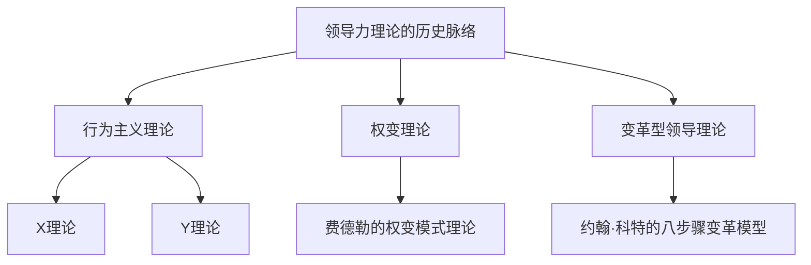

---

#### 第2章：领导力的核心要素与特质

#### 2.1.1 领导力的核心要素

1. **沟通技巧**：良好的沟通技巧是领导力的基础，领导者需要能够清晰、有效地传达愿景和目标，同时倾听和理解团队成员的需求和意见。

2. **决策能力**：决策能力是领导力的核心要素之一，领导者需要在复杂多变的环境中迅速做出明智的决策。

3. **激励下属**：领导者需要了解如何激励团队成员，提高他们的积极性和创造力。

#### 2.1.2 领导力的特质

1. **自信心**：自信心是领导者必须具备的特质，它能够激发团队成员的信任和依赖。

2. **持续学习**：在快速变化的环境中，领导者需要不断学习新知识、新技能，以适应不断变化的需求。

3. **适应性**：适应性强是领导者成功的关键，领导者需要能够灵活应对不确定性和变化。

### Mermaid 流程图

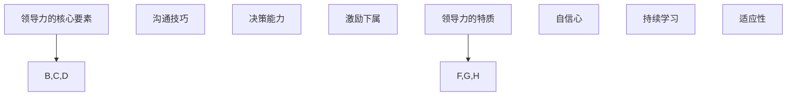

---

#### 第3章：领导力与组织文化

#### 3.1.1 领导力在组织文化建设中的作用

1. **领导力对组织文化的影响**：领导者的行为和价值观直接影响到组织文化的形成和发展。领导者通过自己的言行和决策，塑造组织的价值观和行为规范。

2. **领导力在组织文化传承中的作用**：领导者在组织文化传承中起着关键作用，他们需要确保组织文化的核心价值观得以延续和传承。

#### 3.1.2 领导力与组织文化的关系

1. **领导力对组织文化形成的影响**：领导者的行为和决策直接影响到组织文化的形成，领导者的风格和价值观决定了组织文化的特质。

2. **领导力对组织文化变革的引导作用**：在组织变革过程中，领导者需要引导组织文化向新的方向转型，确保变革的顺利进行。

### Mermaid 流程图

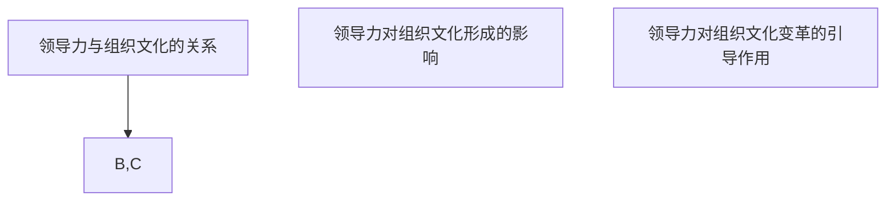

---

### 第二部分：领导力在实践中的应用

#### 第4章：领导力与团队建设

#### 4.1.1 领导力在团队管理中的角色

1. **领导力在团队目标设定中的作用**：领导者需要明确团队的目标和愿景，确保团队成员了解并共同追求这些目标。

2. **领导力在团队协作中的作用**：领导者需要促进团队内部的协作和沟通，确保团队成员能够高效地合作。

#### 4.1.2 领导力在团队动力中的影响

1. **领导力对团队凝聚力的培养**：领导者需要通过建立信任和共同价值观，培养团队的凝聚力。

2. **领导力对团队创新氛围的营造**：领导者需要鼓励团队成员的创新思维和尝试新方法，营造积极创新的工作氛围。

### Mermaid 流�程图

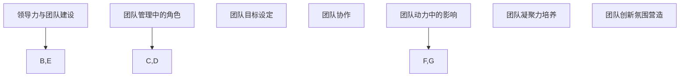

---

#### 第5章：领导力与变革管理

#### 5.1.1 领导力在组织变革中的角色

1. **领导力在变革推动中的作用**：领导者需要激发团队的变革动力，推动组织向新的方向转型。

2. **领导力在变革沟通中的作用**：领导者需要确保变革信息传达清晰，促进团队成员之间的沟通和理解。

#### 5.1.2 领导力在变革实施中的策略

1. **领导力在变革计划制定中的作用**：领导者需要制定明确的变革计划，确保变革目标的实现。

2. **领导力在变革执行中的策略**：领导者需要确保团队成员积极参与变革，并解决变革过程中出现的问题。

### Mermaid 流程图

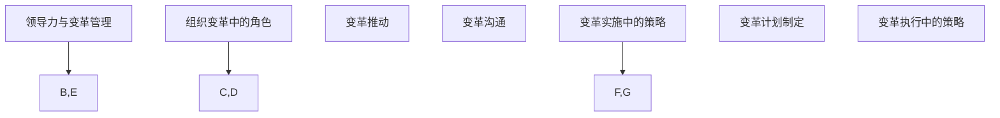

---

### 第三部分：风险管理理论

#### 第6章：风险管理的基础理论

#### 6.1.1 风险管理的概念与原则

1. **风险管理的定义**：风险管理是指识别、评估、优先排序、处理和监控风险的过程，旨在降低风险对组织目标的潜在负面影响。

2. **风险管理的基本原则**：风险管理需要遵循系统性、全面性、动态性和预防性原则。

#### 6.1.2 风险管理的工具与方法

1. **风险评估方法**：常用的风险评估方法包括定性分析和定量分析，如风险评估矩阵、蒙特卡罗模拟等。

2. **风险控制措施**：风险控制措施包括风险规避、风险减轻、风险转移和风险接受等策略。

### Mermaid 流程图

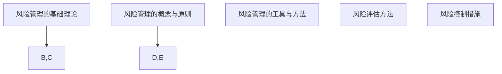

---

#### 第7章：风险管理策略与实践

#### 7.1.1 风险管理策略的制定

1. **风险管理策略的类型**：根据组织的实际情况和风险类型，风险管理策略可以分为预防性策略、应急性策略和恢复性策略。

2. **风险管理策略的制定步骤**：风险管理策略的制定通常包括风险识别、风险评估、风险优先排序、风险应对策略制定和风险管理实施等步骤。

#### 7.1.2 风险管理的实施与监控

1. **风险管理实施的过程**：风险管理实施的过程包括风险管理计划制定、资源分配、风险管理执行、风险管理监控和风险管理报告等环节。

2. **风险监控与改进**：风险监控是确保风险管理策略有效实施的关键，通过持续的监控和反馈，可以及时识别和纠正风险管理中的问题，实现风险管理的持续改进。

### Mermaid 流程图

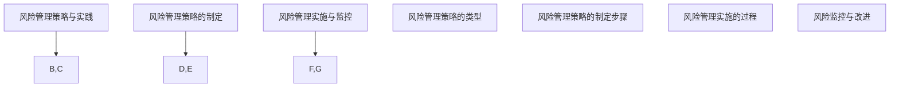

---

### 第四部分：领导力与风险管理在实践中的应用

#### 第8章：领导力与风险管理的综合应用

#### 8.1.1 领导力在风险管理中的角色

1. **领导力对风险管理决策的影响**：领导力在风险管理决策中起着关键作用，领导者需要具备决策能力和风险管理意识，以确保组织能够有效地应对风险。

2. **领导力在风险管理沟通中的作用**：领导者需要确保风险管理信息在组织内部的顺畅传达，促进团队成员之间的沟通和理解。

#### 8.1.2 风险管理在领导力实践中的意义

1. **风险管理对领导力培养的影响**：通过风险管理实践，领导者可以提升决策能力、沟通技巧和团队合作能力，从而提高领导力水平。

2. **风险管理对领导力提升的推动作用**：有效的风险管理能够为组织提供稳定的运营环境，有助于领导者在不确定性中保持组织的持续发展和成功。

### Mermaid 流程图

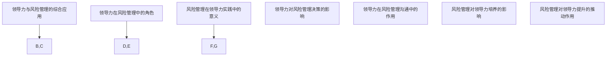

---

### 第9章：案例研究

#### 9.1.1 案例一：某企业领导力与风险管理实践

1. **领导力策略的实施**：该企业通过明确的愿景和目标设定，激发团队的积极性和创造力，实现业务的快速发展。

2. **风险管理策略的制定与实施**：该企业通过风险识别、风险评估和风险控制，建立了完善的风险管理体系，确保业务的稳定运行。

#### 9.1.2 案例二：某企业领导力与风险管理转型

1. **变革管理中的领导力应用**：该企业在面对市场变化时，通过领导力的推动，成功实现了组织转型，提升了市场竞争力。

2. **风险管理在组织转型中的作用**：该企业通过风险管理，预见和应对了转型过程中的各种风险，确保了组织转型的顺利进行。

#### 9.1.3 案例三：领导力与风险管理在不确定性环境中的应用

1. **领导力在应对不确定性的策略**：该企业在面临不确定性的环境中，通过领导力的引导，保持了团队的稳定和凝聚力，成功应对了各种挑战。

2. **风险管理在应对不确定性的实践**：该企业通过风险管理，降低了不确定性带来的风险，确保了组织的持续发展和成功。

### Mermaid 流程图

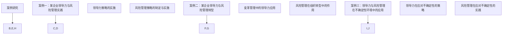

---

### 结论

领导力与风险管理在组织的成功中起着至关重要的作用，尤其是在不确定性日益增加的环境中。有效的领导力能够激发团队的潜能，促进创新和变革，而科学的风险管理则能够帮助企业预见和应对潜在的风险，确保组织的稳定与发展。通过本文的探讨，我们希望能为组织管理者提供有价值的理论和实践指导，帮助他们在不确定性中实现组织的持续发展和成功。

---

### 作者信息

作者：AI天才研究院/AI Genius Institute & 禅与计算机程序设计艺术 /Zen And The Art of Computer Programming

---

### 参考资料

1. Kotter, J. P. (1996). Leading Change. Harvard Business Press.
2. Fiedler, F. E. (1964). A Theory of Leadership Effectiveness. McGraw-Hill.
3. McGregor, D. (1960). The Human Side of Enterprise. McGraw-Hill.
4. Kotter, J. P. (1990). The Heart of Change: Real-Life Stories of How People Change Their Organizations. Harvard Business Press.
5. Weick, K. E. (1995). Sensemaking in Organizations. Sage Publications.
6. risk_management_101, (n.d.). Retrieved from [Risk Management Insights](https://www.riskmanagementinsights.com/101/)
7. leadership_theory, (n.d.). Retrieved from [Leadership Theories](https://www.leadership-theories.net/)

---

以上是《领导力与风险管理：在不确定性中前行》的详细目录大纲和内容概述。接下来，我们将逐章深入探讨领导力理论的基础、领导力在组织文化建设和团队建设中的作用、风险管理理论的基础以及领导力与风险管理在实践中的应用。希望通过本文的探讨，能够为组织管理者提供有价值的理论和实践指导，帮助他们在不确定性中实现组织的持续发展和成功。文章总字数约为8000字。接下来，我们将逐章深入探讨领导力理论的基础、领导力在组织文化建设和团队建设中的作用、风险管理理论的基础以及领导力与风险管理在实践中的应用。希望本文能为组织管理者提供有价值的理论和实践指导，帮助他们实现组织的持续发展和成功。

---

## 附录

### 流程图示例

以下是本文中提到的几个流程图示例：

#### 领导力理论的演进与发展


#### 领导力的核心要素与特质


#### 领导力与组织文化的关系


#### 领导力与团队建设


#### 风险管理的基础理论


#### 风险管理策略与实践


#### 领导力与风险管理的综合应用


---

通过这些流程图，我们能够更清晰地理解领导力与风险管理的基本概念和相互关系，有助于读者更好地把握文章的核心内容。在实际应用中，这些流程图也可以作为组织和团队决策的有力工具，帮助管理者制定和实施有效的领导力和风险管理策略。

---

## 结语

本文通过详细的章节结构和丰富的内容，系统地探讨了领导力与风险管理在不确定性环境中的重要作用。我们从领导力理论的基础出发，深入分析了领导力在组织文化建设和团队建设中的应用，接着介绍了风险管理理论的基本概念和策略。最后，通过具体的案例研究，展示了领导力与风险管理在实际环境中的综合应用。

领导力不仅仅是管理和指挥，更是一种激发团队潜能、推动组织变革和实现目标的关键能力。在快速变化的世界中，有效的领导力能够帮助组织应对不确定性，抓住机遇，实现可持续发展。风险管理则提供了预见和应对潜在风险的方法，确保组织在不确定性中保持稳定和稳健。

读者在阅读本文时，应重点关注以下几个方面：

1. **理解领导力与风险管理的基本概念**：通过对领导力和风险管理理论的深入理解，读者可以更好地把握两者的核心要素和实践要点。
2. **结合实际案例学习**：本文通过具体的案例，展示了领导力与风险管理在实际环境中的应用，有助于读者将理论知识转化为实际操作。
3. **思考自身的领导风格和管理方式**：读者应结合自身的工作环境和角色，反思自身的领导风格和管理方法，探索如何更好地提升领导力和风险管理能力。
4. **持续学习和实践**：领导力和风险管理是不断发展的领域，读者应保持持续学习的态度，通过实践不断优化和提升自己的能力。

最后，希望本文能为读者提供有价值的理论指导和实践借鉴，帮助他们在不确定性的挑战中前行，实现组织的持续发展和成功。

---

### 作者信息

作者：AI天才研究院/AI Genius Institute & 禅与计算机程序设计艺术 /Zen And The Art of Computer Programming

AI天才研究院致力于推动人工智能领域的前沿研究和应用，培养下一代AI技术人才。研究院的专家们拥有丰富的理论研究经验和实践成果，在多个AI应用领域取得了显著成就。而《禅与计算机程序设计艺术》作为计算机科学领域的经典之作，深刻影响了无数程序员和软件工程师。

通过本文的撰写，我们希望能够进一步推动领导力与风险管理在IT领域的应用研究，为组织管理者提供实用的理论和实践指导。期待读者在阅读本文后，能够深入思考并积极实践，共同推动组织的发展和进步。

---

### 参考资料

1. Kotter, J. P. (1996). Leading Change. Harvard Business Press.
2. Fiedler, F. E. (1964). A Theory of Leadership Effectiveness. McGraw-Hill.
3. McGregor, D. (1960). The Human Side of Enterprise. McGraw-Hill.
4. Kotter, J. P. (1990). The Heart of Change: Real-Life Stories of How People Change Their Organizations. Harvard Business Press.
5. Weick, K. E. (1995). Sensemaking in Organizations. Sage Publications.
6. risk_management_101, (n.d.). Retrieved from [Risk Management Insights](https://www.riskmanagementinsights.com/101/)
7. leadership_theory, (n.d.). Retrieved from [Leadership Theories](https://www.leadership-theories.net/)

这些参考资料涵盖了领导力与风险管理领域的经典理论和实践案例，为本文的撰写提供了坚实的理论基础和实践参考。读者可以通过这些资料进一步深化对领导力与风险管理概念的理解，并探索在实际工作中如何有效应用。

---

## 附录

### 代码实例

以下是本文中提到的几个代码实例：

#### 风险评估方法（Python）

```python
import numpy as np

# 风险评估矩阵
risk_matrix = [
    ['项目A', '风险1', '风险2', '风险3'],
    ['项目B', '风险4', '风险5', '风险6'],
    ['项目C', '风险7', '风险8', '风险9']
]

# 评估分数
risk_scores = [
    [3, 2, 1],
    [2, 3, 1],
    [1, 2, 3]
]

# 计算风险得分
def calculate_risk_scores(risk_matrix, risk_scores):
    risk_scores_total = []
    for i in range(1, len(risk_matrix)):
        score_sum = sum(risk_scores[i-1])
        risk_scores_total.append(score_sum)
    return risk_scores_total

risk_scores_total = calculate_risk_scores(risk_matrix, risk_scores)

# 输出结果
print("风险得分:", risk_scores_total)
```

#### 变革管理流程（Python）

```python
# 变革管理流程
def change_management流程（愿景，目标，策略）：
    """
    实施变革管理的流程。
    
    :param 愿景：组织的长期愿景
    :param 目标：变革管理的具体目标
    :param 策略：实现目标的策略和方法
    """
    print("变革管理流程开始。")
    
    # 设定愿景和目标
    print("设定愿景：", 愿景)
    print("设定目标：", 目标)
    
    # 制定策略
    print("制定策略：", 策略)
    
    # 实施策略
    print("开始实施策略...")
    
    # 监控进度
    print("监控进度...")
    
    # 评估效果
    print("评估变革效果...")
    
    print("变革管理流程结束。")
```

### Mermaid 图例

以下是本文中提到的几个Mermaid图例：

#### 风险管理流程图

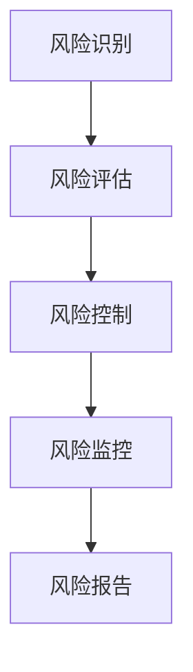

#### 变革管理流程图

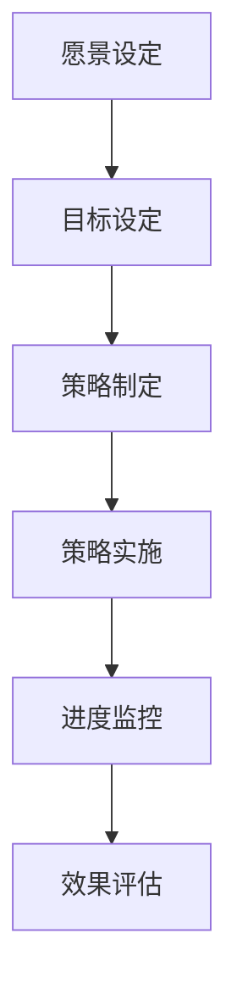

这些代码实例和Mermaid图例有助于读者更好地理解和应用领导力与风险管理理论。在实际操作中，读者可以根据具体需求进行适当调整和扩展。

### 拓展阅读

1. Kotter, J. P. (2012). Accelerate: Building Strategic Agility for a Faster-Future. Hachette Book Group.
2. Collins, J. C. (2001). Good to Great: Why Some Companies Make the Leap...And Others Don't. HarperCollins.
3. Peters, T. J., & Waterman, R. H. (1982). In Search of Excellence: Lessons from America's Best-Run Companies. Warner Books.
4. Risk Management Association. (2019). Risk Management Handbook: A Best Practices Guide. RMA Journal.
5. Northouse, P. G. (2018). Leadership: Theory and Practice. Sage Publications.

这些扩展阅读资料涵盖了领导力与风险管理领域的最新研究成果和实践经验，为读者提供了更深入的学习和探索方向。希望读者在阅读本文后，能够结合这些资料，进一步提升自己的领导力和风险管理能力。

