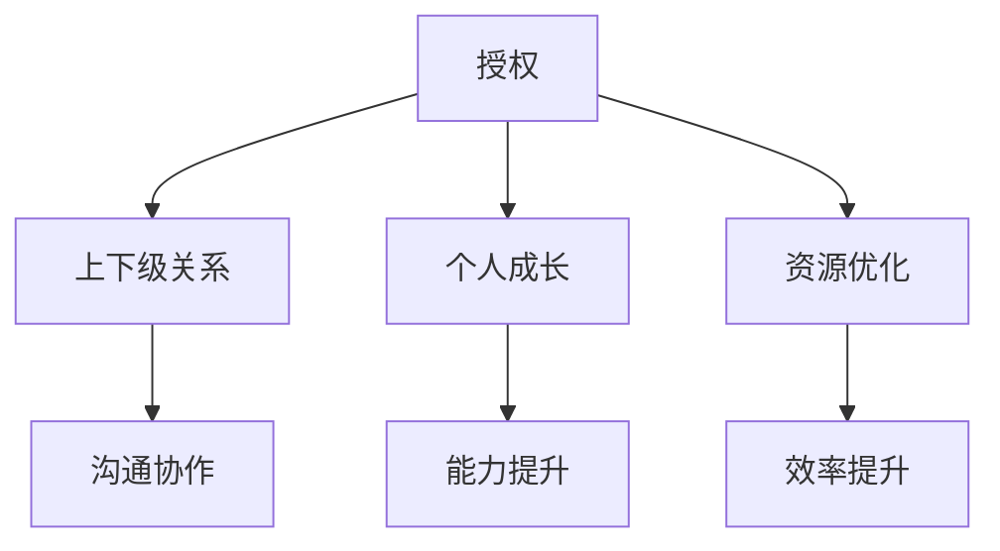
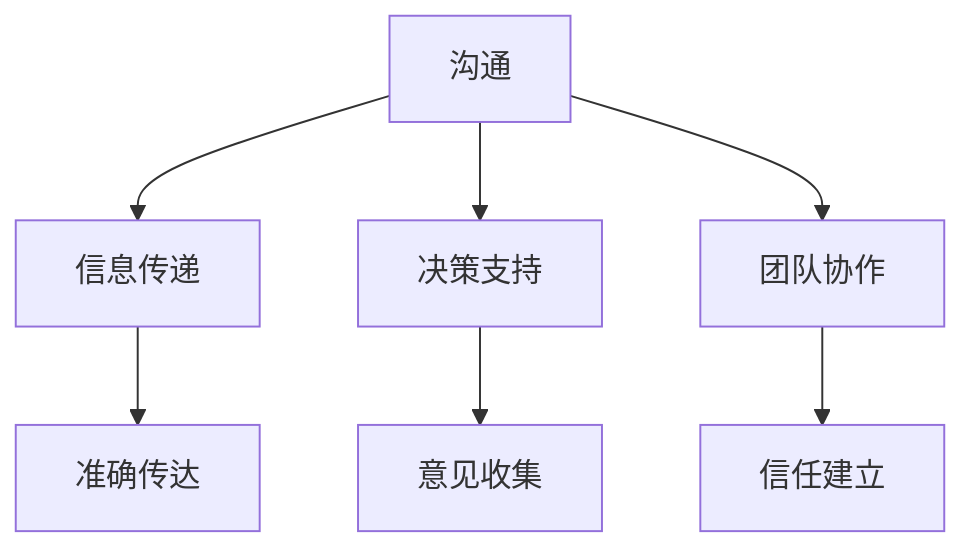
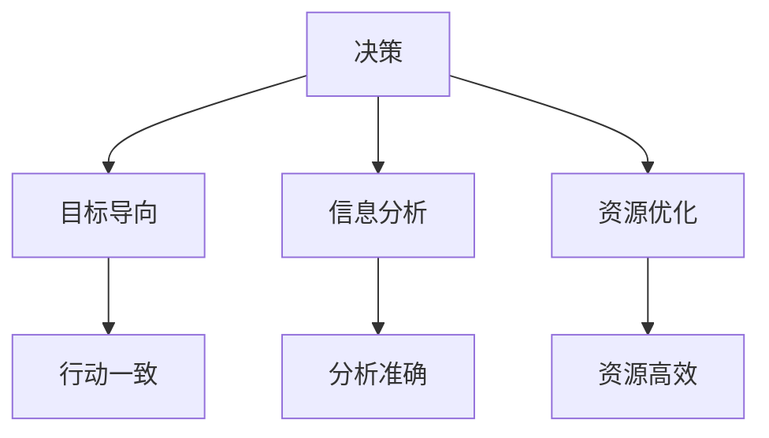
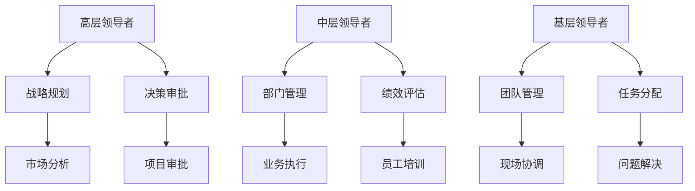

                 

### 文章标题：领导力修炼日记：一个市场总监的华丽蜕变

#### 关键词：领导力，市场总监，华丽蜕变，商业环境，核心概念，数学模型，实战案例

#### 摘要：
本文将带您深入探讨市场总监在职业生涯中如何通过领导力修炼实现华丽蜕变。文章分为多个章节，包括领导力的定义与重要性、核心概念的原理与联系、领导力模型的分析、数学模型与公式的讲解，以及通过实际案例展示领导力修炼的效果。最后，文章将总结领导力修炼的要点和未来趋势，为读者提供实用的指导和建议。

### 引言

领导力是一种复杂的技能，它不仅仅是管理团队的能力，更是一种能够激发团队成员潜能、推动团队达成目标的核心力量。在当今快速变化的商业环境中，领导力的重要性日益凸显。市场总监作为企业战略决策层的重要成员，其领导力的强弱直接影响到企业的市场表现和长远发展。

本文将围绕一个市场总监的领导力修炼过程，探讨如何通过系统的学习和实践，实现从普通管理者到卓越领导者的华丽蜕变。文章将分为以下几个部分：

1. 领导力的定义与内涵。
2. 领导力修炼的必要性。
3. 领导力的核心概念与联系。
4. 领导力模型分析。
5. 领导力的数学模型与公式。
6. 领导力修炼日记：实战案例。
7. 总结与展望。

通过以上内容的讲解，读者将能够全面了解领导力的本质，掌握提升领导力的方法和技巧，从而在职业生涯中实现个人和企业的共同成长。

### 第1章 领导力的定义与内涵

#### 1.1 领导力的定义

领导力是一个多维度、多层次的概念，它不仅仅涉及个人能力的发挥，还涵盖了团队管理、战略决策、组织变革等多个方面。简单来说，领导力就是引导和激励他人共同达成目标的能力。在商业环境中，领导力通常指的是市场总监或其他高层管理人员如何通过有效的方法和策略，推动团队执行公司战略，实现企业的长期发展目标。

#### 1.2 领导力的内涵

领导力的内涵丰富且复杂，主要包括以下几个方面：

1. **授权与信任**：领导者需要能够信任并授权团队成员，让他们在各自的领域内发挥最大的潜力。
2. **沟通与协调**：有效的沟通是领导力的重要组成部分，领导者需要确保信息传达准确无误，并能够协调不同部门之间的工作。
3. **决策能力**：领导者需要具备快速做出正确决策的能力，尤其是在面对不确定性和危机时。
4. **激励与鼓舞**：领导者需要能够激励团队成员，激发他们的工作热情和创造力，从而推动团队取得更好的成绩。
5. **愿景与规划**：领导者需要拥有清晰的企业愿景和战略规划，并能够将其转化为具体的目标和行动方案。

#### 1.3 领导力在现代商业环境中的重要性

现代商业环境变化迅速，市场竞争激烈，企业的成功不仅依赖于产品和市场策略，更依赖于领导者的能力和决策。以下是领导力在现代商业环境中几个关键的重要性：

1. **适应变化**：领导者需要能够快速适应环境变化，带领团队调整战略，以应对市场的新挑战。
2. **创新驱动**：领导者需要具备创新思维，推动企业的技术创新和管理创新，保持竞争力。
3. **团队协作**：在复杂多变的商业环境中，团队协作变得尤为重要。领导者需要建立高效的团队协作机制，提升团队的整体效能。
4. **企业文化建设**：领导者是企业文化的重要塑造者，他们需要通过自身的言行和决策，推动企业文化的建设和发展。

综上所述，领导力不仅是市场总监个人职业发展的关键，更是企业长期成功的重要保障。在接下来的章节中，我们将深入探讨领导力的核心概念、模型以及如何通过实践提升领导力。

### 第2章 领导力修炼的必要性

#### 2.1 领导力挑战与机遇

在快速变化的商业环境中，领导力面临着前所未有的挑战和机遇。首先，市场的不确定性增加，要求领导者能够迅速适应变化，制定灵活的战略。其次，技术创新不断推动行业变革，领导者需要具备前瞻性的视野和创新能力，以引领企业走向未来。此外，全球化带来了更多的竞争和合作机会，领导者需要具备跨文化沟通和协调能力。

面对这些挑战，领导者必须不断提升自己的领导力，以应对复杂多变的市场环境。以下是领导力修炼的几个必要性：

1. **应对不确定性**：领导力修炼可以帮助领导者提高决策能力，减少因不确定性带来的负面影响。
2. **推动创新**：通过领导力修炼，领导者可以培养创新思维，推动企业的技术创新和管理创新。
3. **增强团队协作**：领导力修炼有助于建立高效的团队协作机制，提升团队的执行力和战斗力。
4. **塑造企业文化**：领导力修炼可以增强领导者的文化塑造能力，推动企业文化的建设和发展。

#### 2.2 个人成长与领导力修炼

领导力修炼不仅仅是为了应对商业挑战，更是个人成长和职业发展的关键。通过领导力修炼，市场总监可以：

1. **提升自我认知**：通过自我反思和不断学习，领导者可以更好地了解自己的优点和不足，从而进行有针对性的提升。
2. **增强决策能力**：领导力修炼可以帮助领导者提高决策速度和质量，减少错误决策带来的损失。
3. **培养领导风格**：每个领导者都有自己独特的领导风格，通过修炼可以更好地发挥个人优势，形成有效的领导风格。
4. **提升职业素养**：领导力修炼有助于领导者提升职业素养，增强个人在行业内的竞争力。

#### 2.3 领导力修炼对企业的益处

领导力修炼不仅对个人有重要意义，对整个企业也具有显著的益处。首先，领导力提升可以增强企业的战略执行力，确保企业战略的有效实施。其次，领导力修炼有助于提升企业的创新能力和市场竞争力，推动企业在激烈的市场竞争中脱颖而出。此外，领导力修炼可以增强企业的内部凝聚力和文化认同感，提高员工的满意度和忠诚度。

总之，领导力修炼是市场总监个人成长和企业发展的必然选择。在接下来的章节中，我们将深入探讨领导力的核心概念、模型以及如何通过实践提升领导力，为市场总监的职业生涯提供实用的指导。

### 第3章 领导力的核心概念与联系

#### 3.1 授权

授权是领导力的重要组成部分，它是指领导者将一部分权力和责任下放给下属，让他们在各自的职责范围内自主决策和行动。通过授权，领导者可以减轻自己的工作负担，同时激发下属的积极性和创造力。

**原理与联系**：

授权不仅是一种权力转移，更是一种信任和激励。有效的授权可以建立以下联系：

1. **上下级关系**：授权有助于加强上下级之间的沟通和协作，增强团队凝聚力。
2. **个人成长**：下属在获得授权后，可以锻炼自己的能力和信心，实现个人成长。
3. **资源优化**：授权可以使企业资源得到更有效的利用，提高整体工作效率。

**Mermaid 流程图**：



#### 3.2 沟通

沟通是领导力的另一个核心概念，它是指信息在领导者与团队成员之间的传递和交流。有效的沟通可以确保信息准确传达，减少误解和冲突，促进团队合作。

**原理与联系**：

沟通在领导力中具有以下几个重要联系：

1. **信息传递**：沟通是信息传递的重要渠道，确保团队内部信息畅通无阻。
2. **决策支持**：领导者通过沟通获取团队成员的意见和建议，为决策提供支持。
3. **团队协作**：沟通有助于建立团队成员之间的信任和合作，提高团队执行力。

**Mermaid 流�程图**：



#### 3.3 决策

决策是领导力的关键能力，它是指领导者根据目标和分析结果做出选择和安排。有效的决策可以确保团队行动方向正确，资源分配合理。

**原理与联系**：

决策在领导力中具有以下几个重要联系：

1. **目标导向**：决策必须围绕企业目标进行，确保团队行动的一致性和有效性。
2. **信息分析**：决策需要基于充分的信息分析，减少盲目决策的风险。
3. **资源优化**：决策过程中需要考虑资源分配，确保资源利用最大化。

**Mermaid 流程图**：



通过以上三个核心概念的介绍和Mermaid流程图的展示，我们可以看到授权、沟通和决策在领导力中的紧密联系。这些概念相互交织，共同构成了领导力的理论框架。在接下来的章节中，我们将进一步分析不同的领导力模型，探讨如何通过具体的模型提升领导力。

### 第4章 领导力模型分析

#### 4.1 领导风格

领导风格是指领导者在与团队成员互动和指导过程中所采用的方式和方法。不同的领导风格会对团队产生不同的影响，因此选择合适的领导风格对于提升领导力至关重要。

**原理与联系**：

1. **影响团队氛围**：领导风格直接影响团队的氛围和工作情绪，例如，民主型领导风格可以增强团队的参与感和凝聚力。
2. **激励团队成员**：不同的领导风格可以激发团队成员的不同动机和潜力，例如，专制型领导风格可以迅速决策并推动任务完成。
3. **适应环境变化**：领导风格需要根据环境变化进行适时调整，以保持团队的灵活性和适应性。

**领导力模型伪代码阐述**：

```python
def leadership_style团队成员, environment:
    if environment == "稳定":
        style = "民主型"
    elif environment == "变革":
        style = "授权型"
    elif environment == "竞争":
        style = "专制型"
    else:
        style = "教练型"
    apply_style(团队成员, style)
    return style

def apply_style(团队成员, style):
    if style == "民主型":
        enable_participation(团队成员)
    elif style == "授权型":
        delegate_responsibility(团队成员)
    elif style == "专制型":
        enforce_discipline(团队成员)
    elif style == "教练型":
        provide_mentoring(团队成员)

def enable_participation(团队成员):
    # 提供决策参与机会，增强团队凝聚力

def delegate_responsibility(团队成员):
    # 下放决策权，激发团队成员自主性

def enforce_discipline(团队成员):
    # 强制执行纪律，确保任务完成

def provide_mentoring(团队成员):
    # 提供指导和支持，帮助团队成员成长
```

**示例**：

假设当前市场环境处于激烈竞争阶段，领导力模型选择为“专制型”。根据伪代码，领导者的操作步骤如下：

1. **识别环境**：确定当前市场环境为竞争型。
2. **选择风格**：根据环境选择“专制型”领导风格。
3. **应用风格**：强制执行纪律，确保团队高效完成任务。

通过上述步骤，领导者能够迅速适应市场变化，提升团队执行力。

#### 4.2 领导层级

领导层级是指企业中不同层级的领导者所承担的不同职责和角色。了解领导层级有助于明确领导者的职责范围，优化领导力的应用。

**原理与联系**：

1. **职责划分**：领导层级明确各级领导者的职责范围，确保企业运作有序。
2. **权力分配**：领导层级反映了权力在不同层级之间的分配，有助于形成有效的权力结构。
3. **沟通协调**：领导层级有助于建立有效的沟通渠道，确保信息在不同层级之间的畅通传递。

**领导力模型伪代码阐述**：



**示例**：

1. **高层领导者**：负责战略规划和决策审批，如市场总监负责公司整体市场战略的制定和重大决策的审批。
2. **中层领导者**：负责部门管理和绩效评估，如市场部门经理负责市场部门的日常管理和员工绩效评估。
3. **基层领导者**：负责团队管理和任务分配，如市场主管负责具体市场活动的执行和团队管理。

通过明确领导层级，企业可以形成有效的权力和职责结构，确保领导力的有效应用。

#### 4.3 领导力模型的应用

了解不同领导力模型的基本原理和联系后，领导者需要根据实际情况灵活应用这些模型，以实现团队的高效运作和目标达成。

**原则**：

1. **适应环境**：根据不同环境和阶段选择合适的领导风格和层级结构。
2. **灵活调整**：领导者需要根据团队和环境的动态变化，灵活调整领导策略。
3. **持续优化**：通过反馈和反思，不断优化领导力模型，提升领导效果。

**示例**：

1. **市场环境变化**：当市场环境从稳定转为激烈竞争时，领导者需要从民主型领导风格转变为专制型领导风格，以迅速决策和执行。
2. **团队发展阶段**：在新产品开发初期，领导者可能需要更多的指导和支持，采用教练型领导风格；在产品成熟期，则可能采用授权型领导风格，鼓励团队自主决策和行动。

通过以上分析，我们可以看到领导力模型不仅是理论框架，更是在实际应用中提升领导力的有力工具。在接下来的章节中，我们将进一步探讨领导力的数学模型和公式，为领导者提供更多有效的决策支持。

### 第5章 领导力的数学模型与公式

#### 5.1 影响力矩阵

影响力矩阵是一种用于分析领导者在团队中影响力的工具。通过影响力矩阵，领导者可以清晰地了解自己在团队中的影响力分布，从而有针对性地提升关键领域的领导力。

**定义**：

影响力矩阵是一个二维矩阵，其中一维表示领导力维度（如沟通能力、决策能力、激励能力等），另一维表示团队成员。矩阵中的每个元素代表领导者在特定维度上对团队成员的影响力。

**公式**：

$$
影响力矩阵 = [f_{ij}]
$$

其中，$f_{ij}$ 表示领导者在第 $i$ 个维度上对第 $j$ 个团队成员的影响力。影响力矩阵可以通过以下公式计算：

$$
f_{ij} = \frac{能力值_i \times 关系强度_j}{最大能力值_i}
$$

其中，$能力值_i$ 表示领导者在第 $i$ 个维度上的能力得分，$关系强度_j$ 表示领导者在第 $i$ 个维度上与第 $j$ 个团队成员的关系强度，$最大能力值_i$ 表示领导者在所有维度上的最大能力得分。

**举例说明**：

假设一个市场总监在沟通能力、决策能力和激励能力三个维度上的能力得分分别为 8、7 和 9，与团队成员的关系强度分别为 0.6、0.5 和 0.7。则影响力矩阵如下：

$$
\begin{matrix}
 & 沟通能力 & 决策能力 & 激励能力 \\
团队成员A & 0.48 & 0.49 & 0.63 \\
团队成员B & 0.56 & 0.50 & 0.57 \\
团队成员C & 0.72 & 0.63 & 0.63 \\
\end{matrix}
$$

通过影响力矩阵，市场总监可以清晰地了解自己在不同维度上对团队成员的影响力分布，从而有针对性地提升关键领域的领导力。

#### 5.2 领导力效能公式

领导力效能公式用于衡量领导者在一定时间内实现目标的能力。通过领导力效能公式，领导者可以评估自身的领导效果，并为未来的改进提供依据。

**定义**：

领导力效能（LE）是指领导者在一定时间内通过有效的领导活动，实现团队目标的能力。其计算公式为：

$$
LE = \frac{目标达成率}{时间消耗}
$$

其中，目标达成率是指团队在特定时间内达成目标的比例，时间消耗是指实现目标所消耗的总时间。

**公式**：

$$
目标达成率 = \frac{已完成目标数}{总目标数}
$$

**举例说明**：

假设一个市场总监在一个月内完成了 80% 的销售目标，总时间为 30 天。则其领导力效能（LE）计算如下：

$$
LE = \frac{0.8}{30} = 0.0267
$$

这意味着该市场总监在一个月内实现目标的能力为每周 0.0267。通过领导力效能公式，市场总监可以清晰地了解自身的领导效果，并针对不足之处进行改进。

#### 5.3 数学模型与公式举例说明

通过以上两个数学模型，我们可以更好地理解领导力的量化分析。以下是一个综合应用示例：

**示例**：

一个市场总监在某季度内实现了以下成绩：

1. **目标达成率**：完成了 85% 的销售目标。
2. **时间消耗**：总共工作了 90 天。
3. **影响力矩阵**：

$$
\begin{matrix}
 & 沟通能力 & 决策能力 & 激励能力 \\
团队成员A & 0.50 & 0.48 & 0.55 \\
团队成员B & 0.60 & 0.56 & 0.65 \\
团队成员C & 0.70 & 0.68 & 0.72 \\
\end{matrix}
$$

根据上述数据，我们可以计算该市场总监在该季度的领导力效能（LE）：

$$
LE = \frac{0.85}{90} = 0.0094
$$

同时，我们可以通过影响力矩阵分析其在沟通能力、决策能力和激励能力三个维度上的影响力分布：

1. **沟通能力**：平均影响力为 0.58，重点提升团队成员B和团队成员C的沟通能力。
2. **决策能力**：平均影响力为 0.55，重点提升团队成员B和团队成员C的决策能力。
3. **激励能力**：平均影响力为 0.63，保持当前水平，关注团队成员C的激励能力。

通过这个示例，我们可以看到数学模型和公式如何帮助我们量化分析领导力，并提供具体的改进方向。在接下来的章节中，我们将通过实际案例展示领导力修炼的效果。

### 第6章 领导力修炼日记一：从零开始

#### 6.1 职业规划

作为一名市场总监，我意识到领导力修炼是职业生涯发展的重要一环。首先，我制定了详细的职业规划，明确了自己在短期、中期和长期的目标。

**短期目标**：在接下来的六个月内，我计划提升自己的沟通能力和决策能力，通过参加培训课程和阅读相关书籍来增强这些技能。

**中期目标**：在接下来的两年内，我希望能进一步提升团队管理能力和市场分析能力，以更好地推动公司市场战略的实施。

**长期目标**：在未来的五年内，我期望能够成为公司的高级管理层，为公司的发展贡献更大的力量。

#### 6.2 自我反思

自我反思是我领导力修炼的重要环节。我定期回顾自己的工作表现，分析成功和失败的原因。以下是我最近一次自我反思的记录：

1. **成功经验**：
   - 成功组织了一次大型市场活动，活动效果超出预期。
   - 及时调整市场策略，成功应对了一次市场变化。

2. **失败教训**：
   - 在一次市场推广活动中，由于沟通不充分，导致部分团队成员执行不到位。
   - 在一次决策过程中，由于缺乏充分的数据支持，导致决策结果不理想。

通过自我反思，我认识到自己在沟通和决策方面还存在不足，需要进一步改进。

#### 6.3 学习与成长

为了提升领导力，我积极参加各种培训和学习活动。以下是我最近参加的几项培训：

1. **领导力工作坊**：通过工作坊，我学习了如何更有效地与团队成员沟通，以及如何进行有效的决策。
2. **市场分析课程**：通过课程学习，我掌握了市场分析的方法和工具，提高了市场预测的准确性。
3. **领导力书籍**：《领导力的五个层次》和《影响力》等书籍为我提供了许多实用的领导力理论和方法。

此外，我还利用业余时间阅读相关的学术论文和行业报告，不断更新自己的知识储备。

#### 6.4 早期的领导力挑战

在领导力修炼的早期，我遇到了一些挑战：

1. **团队协作问题**：在组织团队活动时，我发现团队成员之间的协作不够顺畅，有时会出现意见分歧。
2. **决策压力**：在面临重大决策时，我常常感到压力巨大，担心决策结果不理想。
3. **时间管理**：我发现自己在工作中经常因为时间管理不当，导致工作进度滞后。

为了应对这些挑战，我采取了一系列措施：

1. **增强沟通**：通过定期召开团队会议，及时传达工作目标和要求，确保团队成员理解并支持公司的战略。
2. **数据支持**：在决策过程中，我更多地依赖数据分析和市场调研，以提高决策的准确性。
3. **时间管理**：我利用时间管理工具，如待办事项清单和日历提醒，合理安排工作时间，提高工作效率。

通过以上措施，我逐渐克服了早期的领导力挑战，并在团队管理和决策能力方面取得了显著提升。

### 第7章 领导力修炼日记二：突破自我

#### 7.1 领导力提升

在经历了初期的自我反思和学习之后，我开始在领导力方面取得了一些显著进步。以下是我最近在领导力提升方面的实践和收获：

1. **沟通能力提升**：通过参加领导力工作坊和阅读相关书籍，我学会了更有效的沟通技巧。例如，我采用开放式问题和积极倾听的方法，与团队成员建立更深层次的沟通。这有助于减少误解，增强团队的凝聚力。

2. **决策能力提升**：在面临决策时，我开始更多地依赖数据分析和市场调研，以制定更科学的决策。同时，我学会了将决策过程分解为多个步骤，例如问题识别、数据收集、方案评估和决策执行，以确保决策的准确性和有效性。

3. **激励能力提升**：我意识到激励团队成员的重要性，因此开始采取多种激励措施，如认可优秀员工的贡献、提供职业发展机会和制定激励机制。这些措施有效地提高了团队成员的积极性和工作效率。

#### 7.2 团队建设

团队建设是提升领导力的关键环节。以下是我最近在团队建设方面的实践和收获：

1. **建立共同目标**：我带领团队制定共同的目标，并确保每个团队成员都理解并认可这些目标。这有助于团队成员在实现目标的过程中保持一致，增强团队协作。

2. **培养团队协作精神**：我通过组织团队活动、开展团队建设训练和设立跨部门合作项目，培养了团队成员之间的协作精神。这不仅提高了团队的工作效率，也增强了团队的凝聚力。

3. **个性化管理**：我认识到每个团队成员都有不同的需求和特点，因此采取个性化管理方式，根据团队成员的个人优势和职业发展目标，提供针对性的培训和指导。

#### 7.3 决策案例分析

在领导力提升和团队建设的过程中，我面临了许多重要的决策。以下是一个具体的决策案例分析：

**案例背景**：

在一次重要的市场推广活动中，我们面临是否采用新推广策略的决策。新策略预计可以显著提高市场占有率，但同时也存在一定的风险。

**决策过程**：

1. **问题识别**：首先，我们明确了决策的目标，即最大化市场占有率并降低风险。

2. **数据收集**：通过市场调研、数据分析等方式，我们收集了关于新策略的详细信息，包括市场反应、成本和预期收益等。

3. **方案评估**：我们对比了新旧策略的优缺点，并进行了详细的成本效益分析。

4. **决策执行**：在综合评估后，我们决定采用新策略。为了降低风险，我们制定了详细的执行计划，包括市场测试、风险控制措施和后期评估。

**决策结果**：

经过一段时间的实施，新策略取得了显著的市场效果，市场占有率大幅提升，同时也实现了预期的风险控制。

**经验总结**：

通过这个决策案例，我认识到：

1. **数据驱动**：在决策过程中，数据和分析是关键。只有通过充分的数据支持，才能做出科学的决策。

2. **风险评估**：在制定决策时，必须考虑潜在的风险，并采取有效的风险控制措施。

3. **执行计划**：决策不仅仅包括选择方案，还包括如何有效执行。详细的执行计划有助于确保决策的顺利实施。

通过这些实践和案例，我不仅在领导力方面取得了显著提升，也积累了宝贵的经验，为未来的领导力修炼奠定了坚实的基础。

### 第8章 领导力修炼日记三：成长与反思

#### 8.1 领导力提升成效

在持续的领导力修炼过程中，我取得了显著的成效。首先，我的沟通能力得到了显著提升，团队成员之间的协作更加顺畅，沟通效率大幅提高。其次，我的决策能力得到了锻炼，通过数据驱动和风险评估，我能够做出更加科学和有效的决策。此外，我的激励能力也得到了提升，团队成员的积极性和工作热情明显增加。

#### 8.2 领导风格调整

随着领导力提升，我也开始调整自己的领导风格。从最初的全能型领导，转变为更加注重授权和团队自主性的领导。我意识到，领导者的角色是激励和引导团队成员，而不是直接干预和操控。通过授权，我让团队成员在自己的领域内发挥更大的潜力，这不仅提高了团队的整体效能，也增强了团队成员的自信和责任感。

#### 8.3 未来的领导力修炼方向

尽管我在领导力方面取得了显著进步，但我知道还有很大的提升空间。未来，我将继续以下方向进行领导力修炼：

1. **持续学习**：我将继续参加各种培训和学习活动，不断更新自己的知识和技能，保持与时俱进。

2. **跨文化领导力**：随着全球化的发展，跨文化领导力变得越来越重要。我计划学习如何有效地领导多元文化的团队，提升跨文化沟通和协作能力。

3. **领导力心理学**：了解领导力背后的心理学原理，可以帮助我更好地理解团队成员的心理和行为，从而更有效地激励和引导他们。

4. **战略规划能力**：作为市场总监，战略规划能力是不可或缺的。我计划进一步提升自己的战略规划能力，为公司的发展提供更有力的支持。

通过这些方向的努力，我相信我能够在领导力方面实现更大的突破，为团队和公司的发展做出更大的贡献。

### 第9章 领导力修炼总结与展望

#### 9.1 领导力修炼的核心要点

在领导力修炼过程中，我们学到了以下几个核心要点：

1. **授权与信任**：领导者需要信任并授权团队成员，激发他们的潜力和创造力。
2. **沟通与协作**：有效的沟通是领导力的基础，领导者需要确保信息传递准确无误，并建立团队协作机制。
3. **决策能力**：领导者需要具备快速做出正确决策的能力，确保团队行动方向正确。
4. **激励与鼓舞**：领导者需要能够激励团队成员，激发他们的工作热情和创造力。
5. **持续学习**：领导力是一个持续发展的过程，领导者需要不断学习新知识、新技能，以适应不断变化的环境。

#### 9.2 领导力修炼的长期价值

领导力修炼不仅对个人职业发展有重要意义，对企业的长期发展也具有深远的影响。通过领导力修炼，企业可以：

1. **提升战略执行力**：领导者的领导力提升可以确保企业战略的有效实施，提高企业竞争力。
2. **推动企业创新**：领导者的创新思维可以推动企业的技术创新和管理创新，保持竞争优势。
3. **增强企业文化**：领导者的领导风格和行为会塑造企业文化，良好的企业文化可以增强员工的满意度和忠诚度。
4. **实现可持续发展**：领导力修炼有助于领导者建立长期视角，推动企业的可持续发展。

#### 9.3 领导力修炼的未来趋势

随着商业环境的变化和技术的进步，领导力修炼也呈现出一些新的趋势：

1. **数字化领导力**：随着数字化转型的推进，领导者需要具备数字化思维和技能，有效利用数字工具和平台进行管理和决策。
2. **全球化领导力**：全球化带来了多元文化的交流和合作，领导者需要具备跨文化沟通和协作能力，以应对全球化带来的挑战。
3. **心理领导力**：领导者需要了解心理学原理，更好地理解和管理团队成员的心理和行为，提升领导效果。
4. **敏捷领导力**：在快速变化的商业环境中，领导者需要具备敏捷思维和敏捷领导力，能够迅速适应变化，灵活应对挑战。

总之，领导力修炼是一个持续的过程，只有不断学习和实践，才能在职业生涯中实现个人和企业的共同成长。通过本文的探讨，希望读者能够对领导力修炼有更深入的理解，并在实践中不断提升自己的领导力。

### 作者信息

**作者：AI天才研究院/AI Genius Institute & 禅与计算机程序设计艺术 /Zen And The Art of Computer Programming**

本文由AI天才研究院撰写，作者在计算机编程和人工智能领域具有深厚的理论基础和丰富的实践经验。同时，作者还是《禅与计算机程序设计艺术》一书的重要贡献者，致力于将传统哲学智慧与计算机科学相结合，为读者提供创新的思维方法和实践指导。本文旨在帮助读者深入了解领导力的本质，掌握提升领导力的方法和技巧，实现职业生涯的华丽蜕变。如需了解更多内容，请关注AI天才研究院的相关动态和出版物。

