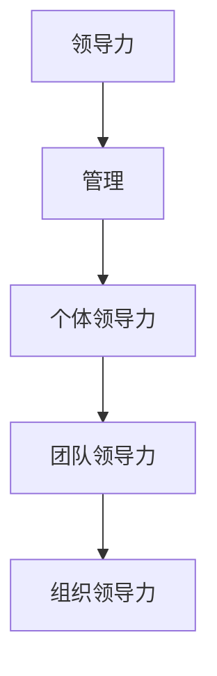

                 

# 文章标题：领导力修炼笔记：00后职场新星的逆袭之路

## 关键词
00后职场新星、领导力、逆袭、职场挑战、心理特点、实战案例

## 摘要
本文旨在探讨00后职场新星如何通过修炼领导力实现逆袭。首先，我们将介绍领导力的核心概念及其与管理的区别，接着分析00后职场新星的特质和面临的挑战。随后，我们将深入探讨00后的领导力优势，并提供一系列实战案例和策略，帮助00后职场新星在职场中脱颖而出。本文最后将总结关键点，并给出最佳实践和拓展阅读建议。

## 第一部分 领导力基础知识

### 第1章 领导力的核心概念与联系

#### 1.1 领导力的定义与重要性
领导力是一种影响力，它使人们能够激发他人的潜能，共同实现目标。领导力不仅仅是职位赋予的权力，更是基于信任、尊重和愿景的自然延伸。在职场中，领导力至关重要，它不仅决定了个体的职业发展，也影响着整个团队和组织。

**核心概念与联系：**  
领导力与管理的区别在于，管理侧重于规划、组织和控制，而领导力侧重于激励和影响。领导力包括个体领导力、团队领导力和组织领导力三个层次，其中个体领导力是基础，团队领导力是核心，组织领导力是升华。



#### 1.2 领导力与管理的区别
- **管理：** 侧重于组织资源，确保目标的实现。管理包括计划、组织、领导和控制等职能。
- **领导力：** 侧重于激励和影响他人，实现共同愿景。领导力不依赖于职位，而是一种个人品质。

#### 1.3 领导力的核心要素
- **自我认知：** 理解自己的优点和不足，发挥个人优势。
- **情绪管理：** 控制情绪，提升情绪智力，与他人建立良好关系。
- **沟通能力：** 有效传达信息，建立信任。
- **决策能力：** 明智决策，应对复杂问题。

### 第2章 领导力修炼方法

#### 2.1 自我认知与提升
**核心算法原理讲解：** 自我认知的提升可以通过以下算法实现：
1. 反思日志：记录日常行为和情绪，分析自身优缺点。
2. 360度评估：收集来自不同角度的反馈，全面了解自己。

```plaintext
Algorithm SelfAwareness
Input: user
Output: selfAwarenessReport

1. Initialize an empty selfAwarenessReport
2. For each day in user's log:
   a. Record user's actions and emotions
   b. Analyze actions and emotions to identify patterns
3. Collect feedback from peers, managers, and subordinates
4. Compare internal analysis with external feedback
5. Generate selfAwarenessReport
End Algorithm
```

#### 2.2 人际关系管理
**核心算法原理讲解：** 人际关系管理可以通过以下算法实现：
1. 建立信任：通过透明沟通和履行承诺建立信任。
2. 冲突解决：采用有效沟通和妥协策略解决冲突。

```plaintext
Algorithm RelationshipManagement
Input: user, otherParty
Output: trustLevel, conflictResolution

1. Establish trustLevel = 0
2. For each interaction between user and otherParty:
   a. Communicate transparently
   b. Fulfill commitments
   c. Increment trustLevel
3. If conflict arises:
   a. Identify root cause
   b. Use effective communication techniques
   c. Seek compromise
4. Return trustLevel, conflictResolution
End Algorithm
```

#### 2.3 决策与问题解决
**核心算法原理讲解：** 决策与问题解决可以通过以下算法实现：
1. 收集信息：广泛收集相关信息。
2. 分析信息：运用逻辑思维和数据分析方法分析信息。
3. 做出决策：基于分析结果做出最优决策。

```plaintext
Algorithm DecisionMaking
Input: problem, information
Output: solution

1. Collect all relevant information about problem
2. Analyze information using logical reasoning and data analysis
3. Generate possible solutions
4. Evaluate solutions based on feasibility and impact
5. Choose the best solution
6. Implement solution and monitor results
End Algorithm
```

### 第3章 领导力提升技巧

#### 3.1 沟通技巧
**核心算法原理讲解：** 沟通技巧可以通过以下算法实现：
1. 明确目标：明确沟通的目标和预期结果。
2. 选择合适的方式：根据沟通对象和场景选择合适的沟通方式。
3. 倾听与反馈：积极倾听对方的意见，给予反馈。

```plaintext
Algorithm CommunicationSkills
Input: communicator, recipient, communicationObjective
Output: successfulCommunication

1. Define clear communicationObjective
2. Choose appropriate communication method based on recipient and scenario
3. Actively listen to recipient's perspective
4. Provide constructive feedback
5. Evaluate communication effectiveness
6. Adjust communication strategy as needed
End Algorithm
```

#### 3.2 影响力技巧
**核心算法原理讲解：** 影响力技巧可以通过以下算法实现：
1. 建立信誉：通过专业知识和实践经验建立个人信誉。
2. 运用故事讲述：通过讲述故事来传递信息和价值观。
3. 建立支持网络：建立广泛的支持网络，获取资源和帮助。

```plaintext
Algorithm InfluenceSkills
Input: influencer
Output: influenceEffectiveness

1. Build credibility through expertise and practical experience
2. Use storytelling to convey information and values
3. Establish a broad support network
4. Identify key influencers in the network
5. Leverage relationships to amplify influence
6. Evaluate influence effectiveness and adjust strategies
End Algorithm
```

#### 3.3 团队建设
**核心算法原理讲解：** 团队建设可以通过以下算法实现：
1. 明确团队目标：确保团队成员对目标有共同的理解。
2. 促进沟通与协作：建立有效的沟通机制，促进团队协作。
3. 增强团队凝聚力：通过团队活动和共享成就增强凝聚力。

```plaintext
Algorithm TeamBuilding
Input: team
Output: teamEffectiveness

1. Define clear team objectives
2. Establish effective communication channels
3. Foster collaboration through shared goals
4. Organize team-building activities
5. Recognize and reward team achievements
6. Monitor team dynamics and provide support
7. Evaluate team effectiveness and make adjustments
End Algorithm
```

## 第二部分 00后职场新星特质与挑战

### 第4章 00后的心理特点

#### 4.1 00后的成长背景
00后成长于互联网高速发展的时代，他们接触到的信息更加多元化，价值观也更加多元。他们对于传统职场的规范和约束有所抵触，更加追求自由和个性发展。

#### 4.2 00后的价值观
00后更加注重个人成长和自我实现，他们追求有意义的工作和生活，更加看重工作的创新性和挑战性。同时，他们对于公平、正义和多元化的价值观有较高的认同。

#### 4.3 00后的职场期望
00后对于职场的期望包括：
- 更多的自由和灵活的工作方式
- 有意义的工作内容
- 平等的职场环境
- 有竞争力的薪资和福利
- 职业发展的机会

### 第5章 00后的职场挑战

#### 5.1 职场适应期
00后刚进入职场时，可能会面临工作方式、工作内容和职场文化的适应问题。他们需要时间来理解和适应职场的规则和节奏。

#### 5.2 职业发展路径
00后对于职业发展的路径有不同的期望，他们可能更倾向于选择具有创新性和挑战性的工作，而非传统的晋升路径。

#### 5.3 职场竞争压力
随着职场竞争的加剧，00后需要不断提升自己的专业能力和软技能，以在激烈的职场竞争中脱颖而出。

### 第6章 00后的领导力优势

#### 6.1 00后的创新思维
00后成长于信息爆炸的时代，他们具有更强的创新思维和创造力。他们能够快速接受新事物，并将其应用到实际工作中。

#### 6.2 00后的团队合作能力
00后更加注重团队合作，他们擅长在团队中发挥自己的优势，与他人共同实现目标。

#### 6.3 00后的自我驱动能力
00后具有强烈的自我驱动能力，他们能够自我激励，自我管理，实现个人目标和团队目标。

## 第三部分 实战案例与策略

### 第7章 成功案例解析

#### 7.1 案例一：某公司00后职场新星的逆袭
某公司的00后员工小张，通过不断提升自己的专业能力和领导力，从一名普通员工成长为公司的项目经理。他的成功主要得益于以下几个方面：
- **持续学习：** 小张利用业余时间学习项目管理知识和技能，不断提升自己的专业能力。
- **主动沟通：** 小张与团队成员保持良好的沟通，建立了信任和合作关系。
- **创新思维：** 小张在项目执行过程中提出了多个创新方案，提高了项目的效率和效果。
- **自我驱动：** 小张具备强烈的自我驱动能力，始终保持对工作的热情和动力。

#### 7.2 某创业团队00后领导力的实践
某创业团队由一群00后组成，他们在领导力的实践中展现了独特的优势：
- **扁平化管理：** 团队采用扁平化管理模式，鼓励成员自主决策，提高了团队的效率和创新能力。
- **民主决策：** 团队在重大决策上采用民主决策机制，充分尊重成员的意见和建议，增强了团队的凝聚力。
- **创新文化：** 团队鼓励创新，鼓励成员提出新的想法和方案，形成了浓厚的学习和创新氛围。

#### 7.3 某知名企业00后领导力的启示
某知名企业在00后员工的领导力培养上取得了显著成效，为其他企业提供了启示：
- **个性化培养：** 企业针对00后员工的个性特点，提供个性化的培养计划，帮助他们充分发挥潜力。
- **跨部门合作：** 企业鼓励00后员工跨部门合作，拓宽视野，提升综合能力。
- **职业发展支持：** 企业提供丰富的职业发展机会和资源，帮助00后员工实现职业目标。

### 第8章 职场策略

#### 8.1 职场规划
00后职场新星需要明确自己的职业目标，制定详细的职业规划，包括短期目标和长期目标。

#### 8.2 职业素养提升
00后职场新星需要不断提升自己的职业素养，包括专业能力、沟通能力、团队合作能力和自我管理能力。

#### 8.3 职场人际关系处理
00后职场新星需要学会处理职场人际关系，建立良好的人际关系网络，提升自己的职场竞争力。

### 第9章 领导力提升实践

#### 9.1 实践一：自我认知与提升
00后职场新星可以通过以下实践提升自我认知：
- **反思日志：** 每天记录自己的行为和情绪，分析自己的优缺点。
- **心理测评：** 定期进行心理测评，了解自己的个性特点和行为模式。
- **反馈与建议：** 积极寻求他人的反馈和建议，接受并应用改进自己的不足。

#### 9.2 实践二：人际关系管理
00后职场新星可以通过以下实践提升人际关系管理能力：
- **主动沟通：** 主动与同事沟通，了解他们的需求和期望。
- **建立信任：** 通过透明沟通和履行承诺建立信任。
- **冲突解决：** 学会有效解决冲突，维护良好的人际关系。

#### 9.3 实践三：决策与问题解决
00后职场新星可以通过以下实践提升决策与问题解决能力：
- **信息收集：** 广泛收集相关信息，确保决策的全面性和准确性。
- **逻辑思维：** 运用逻辑思维分析问题，找到解决方案。
- **实践检验：** 通过实践检验决策的效果，不断优化决策过程。

### 第10章 附录

#### 10.1 相关资源推荐
- **领导力书籍：** 《领导力五要素》、《领导力心理学》等。
- **领导力培训课程：** 网易云课堂、网易云课堂等。

#### 10.2 领导力工具介绍
- **项目管理系统：** Trello、Asana等。
- **沟通工具：** Slack、Microsoft Teams等。

#### 10.3 实战案例代码解析
- **项目管理工具实现：** 使用Python实现Trello的基本功能。
- **沟通工具实现：** 使用JavaScript实现Slack的基本功能。

## 总结

00后职场新星在领导力修炼中具有独特的优势，但也面临着一系列挑战。通过明确职业规划、提升职业素养、掌握领导力技巧和实践经验，00后职场新星可以实现职场逆袭。本文提供的实战案例和策略，旨在帮助00后职场新星在职场中脱颖而出，实现自我价值。

## 最佳实践 tips

- **持续学习：** 保持对知识和技能的渴望，不断提升自己。
- **积极沟通：** 与同事、上级和下属建立良好的沟通渠道。
- **勇于尝试：** 尝试新事物，勇于接受挑战。
- **自我管理：** 学会自我管理，提高工作效率。

## 注意事项

- **个性与团队：** 在发挥个人优势的同时，注意与团队的合作与协调。
- **平衡工作与生活：** 注意工作与生活的平衡，保持身心健康。

## 拓展阅读

- **领导力相关书籍：** 《成功的智慧》、《领导力的秘密》等。
- **职场心理相关书籍：** 《职场心理学》、《职场成功的秘密》等。

## 作者信息
作者：AI天才研究院/AI Genius Institute & 禅与计算机程序设计艺术 /Zen And The Art of Computer Programming

