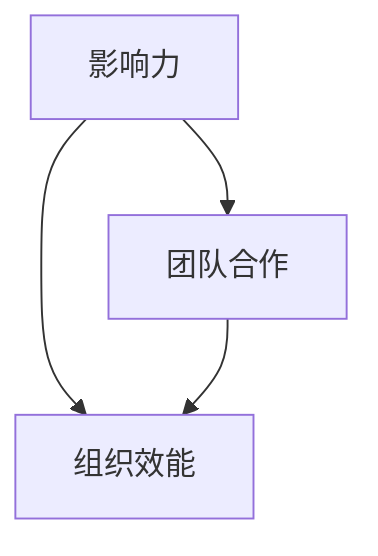

                 

### 文章标题：领导力修炼笔记：80后职场精英的成长历程

> 关键词：领导力、80后、职场精英、成长历程、修炼笔记

> 摘要：本文将深入探讨80后职场精英在领导力修炼过程中的成长历程。通过分析他们的背景、面临的挑战、成长路径和领导力修炼的核心原则，本文旨在为读者提供一套实用的领导力提升指南。

### 引言

领导力是现代社会中不可或缺的重要能力，它不仅在企业管理中扮演着核心角色，也对个人职业发展和生活质量的提升产生深远影响。随着时代的发展，80后这一代职场精英在领导力的修炼过程中，面临了独特的挑战和机遇。本文将以他们的成长历程为线索，探讨领导力的核心概念、实践技巧和修炼方法。

本文将分为以下几个部分：

1. **80后职场背景分析**：介绍80后职场精英所处的环境特点，分析他们所面临的主要挑战和机遇。
2. **成长历程**：分阶段讲述80后职场精英的成长经历，包括早期职业生涯、职业发展的转折点和持续成长。
3. **领导力修炼**：深入探讨领导力的核心概念与联系，讲解领导力的行为模型和理论，以及评估领导力的方法和工具。
4. **成功案例分享**：分享成功职场人士的经验和教训，分析案例中的领导力实践和效果。
5. **个人反思与总结**：作者对职场生涯的回顾和感悟，以及未来领导力发展的展望。
6. **附录**：提供相关资源和参考书籍，为读者提供进一步学习的方向。

通过以上内容的逐步分析，本文旨在帮助读者深入了解领导力修炼的过程，找到适合自己的领导力提升路径，为职业生涯的进一步发展打下坚实的基础。

### 80后职场背景分析

#### 80后的时代背景

80后，指的是1980年代出生的一代人，他们在中国改革开放后成长起来，经历了中国社会的快速发展和深刻变革。这一代人在成长过程中，既享受到了改革开放带来的经济繁荣和科技进步，也面临了教育、就业和生活方式等方面的挑战和机遇。

80后的童年和青少年时期，正值中国经济的快速增长期，互联网的普及和科技的进步为他们提供了广阔的发展空间。这一代人在教育上普遍接受了较高的教育，很多人拥有本科甚至研究生学历。然而，与此同时，他们也在就业压力、房价上涨和生活成本增加等方面承受了较大的负担。

#### 80后职场精英的特点

80后职场精英具有以下特点：

1. **高学历和高素质**：80后普遍拥有较高的学历，他们在专业知识和技能方面具有较高的水平。这使得他们在职场中具备了较强的竞争力。
2. **创新意识和学习能力**：80后成长于信息爆炸的时代，他们具有较强的创新意识和学习能力，能够迅速适应新的技术和变化。
3. **追求个人价值**：80后更加注重个人价值的实现，他们追求工作与生活的平衡，更倾向于选择有挑战性和发展前景的工作。
4. **团队合作能力**：80后在团队协作方面表现出较强的能力，他们善于沟通和协调，能够有效地推动团队目标的实现。

#### 80后职场精英面临的挑战

尽管80后职场精英具有上述优势，但他们也面临一系列挑战：

1. **竞争压力**：随着社会的发展，职场竞争日益激烈。80后需要不断更新知识和技能，以保持竞争优势。
2. **职业发展瓶颈**：在职业生涯中，80后可能会遇到职业发展的瓶颈，需要通过自我提升和转变来突破。
3. **工作与生活的平衡**：随着生活压力的增加，80后需要在工作和生活之间找到平衡，以保持身心健康。
4. **领导力提升**：80后在职业发展中逐渐意识到领导力的重要性，但如何提升领导力是他们需要不断学习和实践的重要课题。

#### 80后职场精英面临的机遇

尽管面临诸多挑战，80后职场精英也拥有以下机遇：

1. **技术创新**：随着科技的快速发展，80后可以在新兴技术领域找到新的发展机会。
2. **全球化机遇**：全球化为中国企业带来了新的发展机遇，80后可以通过跨国工作或留学等方式，拓展自己的国际视野。
3. **创业机会**：80后具有较高的创新意识和创业精神，他们可以在创业领域找到新的发展方向。

通过对80后职场背景的分析，我们可以看到，他们在成长过程中面临着一系列挑战和机遇。了解这些背景特点，有助于我们更好地理解80后职场精英的成长历程和领导力修炼过程。

### 成长历程

#### 早期职业生涯

80后职场精英的早期职业生涯往往充满了挑战和机遇。在刚刚踏入职场的时候，他们大多面临着高学历与高期望之间的落差。很多80后毕业于名校，怀揣着对未来的美好憧憬，希望能够在职场中找到自己的定位并实现自我价值。然而，现实的职场却往往并不如他们所预期的那样顺利。

首先，80后需要适应职场的工作节奏和文化。与传统的管理模式和流程相比，现代企业更加注重创新、效率和团队合作。这种转变对80后来说是一个巨大的挑战，他们需要学会如何在快节奏的环境中保持专注和高效。

其次，80后在职场初期往往需要从基础工作开始，积累实际经验。虽然这可能会让他们感到有些失落，但实际上，这些基础工作是他们未来发展的基石。通过具体的工作实践，80后能够更好地了解企业的运作模式，培养自己的专业技能和解决问题的能力。

在这一阶段，80后需要克服自我怀疑和挫折感。他们可能会遇到工作上的困难、人际关系的挑战或者职业发展的瓶颈。然而，正是这些困难和挑战，让他们在不断的试错中成长，逐步找到自己的优势和擅长的领域。

#### 职业发展的转折点

80后职场精英的成长过程中，转折点是至关重要的一环。这些转折点往往是在关键时刻做出关键决策或遇到重大事件，从而改变了他们的职业路径和发展方向。

一个典型的转折点是跳槽或转行。80后在职业发展的某个阶段可能会意识到自己的当前职位已经无法满足他们的成长需求，或者他们对某个新兴领域产生了浓厚的兴趣。这时，他们可能会选择跳槽到另一家公司或转行进入一个全新的领域。

例如，某位80后程序员在多年的软件开发工作中，发现自己对数据科学和人工智能领域充满了热情。他决定放弃现有的稳定工作，投身于这一新兴领域。通过自学和参加专业培训，他逐渐积累了相关技能，最终在数据科学领域取得了显著的成就。

另一个转折点是晋升或领导岗位的担任。随着职位的提升，80后需要承担更多的责任和挑战。他们不仅要具备专业技能，还需要具备良好的领导能力和团队管理能力。在这个过程中，他们通过不断学习和实践，逐步提升自己的领导力水平。

例如，某位80后销售经理在多年的销售工作中，积累了丰富的客户资源和市场洞察力。当他被提拔为销售总监时，他不仅需要管理销售团队，还要制定销售策略和目标。他通过不断学习和参加领导力培训，成功地带领团队实现了业绩的突破。

#### 持续成长

80后职场精英的成长并不是一蹴而就的，而是一个持续的过程。他们在职业生涯中不断学习、提升个人能力，以适应不断变化的市场环境和企业需求。

首先，持续学习是80后成长的关键。随着科技的快速发展，新的知识和技能层出不穷。80后需要保持学习的热情和动力，通过参加培训、阅读专业书籍和文章、参加行业研讨会等方式，不断更新自己的知识储备。

例如，某位80后产品经理为了更好地理解市场和用户需求，经常阅读相关的市场报告和用户反馈，并参加行业内的交流会。通过这些学习，他能够更好地把握市场趋势，为产品的研发和优化提供有价值的建议。

其次，提升个人能力也是80后成长的重要方面。在职场中，80后不仅需要具备专业技能，还需要具备沟通协调能力、解决问题的能力、领导力等综合能力。他们通过实际工作、项目经历和团队协作，不断提升自己的综合能力。

例如，某位80后项目经理在负责一个大型项目时，不仅需要协调各个团队的工作，还需要处理各种突发问题和冲突。通过这个项目，他学会了如何在压力下保持冷静，如何有效地沟通和协调，最终成功地完成了项目。

最后，80后还需要关注个人职业发展路径的规划。他们需要明确自己的职业目标和发展方向，制定切实可行的职业规划，并通过不断努力和调整，逐步实现自己的职业目标。

例如，某位80后技术专家在职业生涯的早期，明确了自己的目标是在某个技术领域达到专家水平。他通过不断学习和实践，积累了丰富的技术经验和专业知识，最终在技术领域取得了显著的成就。

通过以上分析，我们可以看到80后职场精英的成长历程充满了挑战和机遇。他们在早期职业生涯中积累经验，通过职业发展的转折点实现突破，并在持续成长中不断提升自己的能力。这一过程不仅让他们在职业发展中取得了显著成就，也让他们在领导力修炼中不断进步，为未来的职业生涯奠定了坚实的基础。

### 领导力修炼

#### 核心概念与联系

领导力是一个复杂而多维的概念，它涉及到个体的影响力、团队的协作和组织的效能。要理解领导力，我们需要首先明确几个核心概念：

1. **影响力**：影响力是领导力的基础。一个领导者需要具备影响他人的能力，无论是通过说服、激励还是建立信任。影响力不仅取决于个人的知识和技能，还取决于他们的品格和价值观。

2. **团队合作**：在现代社会，领导者的角色已经从指挥和控制转变为促进和协作。一个成功的领导者需要能够激发团队成员的潜力，建立高效的团队，并通过团队协作实现共同的目标。

3. **组织效能**：领导力最终体现在组织的效能上。一个领导者不仅需要关注团队内部的合作，还需要考虑整个组织的战略目标、资源分配和执行效率。

这些核心概念之间相互关联，形成一个完整的领导力架构。为了更好地理解这些概念之间的关系，我们可以使用Mermaid流程图来展示它们之间的联系：



在上述流程图中，影响力作为领导力的基础，通过团队合作和组织效能两个环节，最终实现领导力的目标。影响力是领导者影响团队成员和推动团队协作的动力，而团队合作则是将影响力转化为组织效能的关键环节。通过有效的团队合作，领导者可以提升组织的整体效能，实现组织的战略目标。

#### 核心算法原理讲解

领导力的核心算法原理可以从行为模型和理论中提炼出来。以下是一个简单的领导力行为模型和相应的伪代码：

```python
class LeadershipBehaviorModel:
    def __init__(self, influence, collaboration, organizational_efficiency):
        self.influence = influence
        self.collaboration = collaboration
        self.organizational_efficiency = organizational_efficiency
    
    def evaluate_leadership(self):
        influence_score = self.calculate_influence_score()
        collaboration_score = self.calculate_collaboration_score()
        organizational_efficiency_score = self.calculate_organizational_efficiency_score()
        
        total_score = influence_score + collaboration_score + organizational_efficiency_score
        return total_score

    def calculate_influence_score(self):
        # 伪代码，用于计算影响力得分
        return self.influence * 0.3
    
    def calculate_collaboration_score(self):
        # 伪代码，用于计算团队合作得分
        return self.collaboration * 0.4
    
    def calculate_organizational_efficiency_score(self):
        # 伪代码，用于计算组织效能得分
        return self.organizational_efficiency * 0.3
```

在这个行为模型中，领导力得分由三个部分组成：影响力、团队合作和组织效能。每个部分都有相应的计算方法。具体来说：

- **影响力得分**：反映了领导者影响他人的能力，占领导力总得分的30%。
- **团队合作得分**：反映了领导者在团队协作中的表现，占领导力总得分的40%。
- **组织效能得分**：反映了领导者在提升组织效能方面的贡献，占领导力总得分的30%。

通过这个行为模型，我们可以量化领导力的各个方面，从而更科学地评估领导者的表现。以下是一个简化的评估流程：

1. **数据收集**：收集领导者在影响力、团队合作和组织效能方面的数据。
2. **数据计算**：根据行为模型中的计算方法，对数据进行处理，得到各部分的得分。
3. **总得分计算**：将各部分的得分相加，得到领导力的总得分。
4. **评估反馈**：根据总得分对领导者的表现进行评估，并提供相应的反馈和建议。

#### 数学模型和公式

为了更精确地评估领导力，我们可以引入一些数学模型和公式。以下是一个简化的数学模型，用于评估领导力：

$$
L = w_1 \cdot I + w_2 \cdot C + w_3 \cdot O
$$

其中，\(L\) 表示领导力得分，\(w_1\)、\(w_2\) 和 \(w_3\) 分别表示影响力、团队合作和组织效能的权重。\(I\)、\(C\) 和 \(O\) 分别表示领导者在这三个方面的得分。

具体来说，权重可以根据实际情况进行调整。例如，如果领导者的影响力尤为重要，可以适当提高 \(w_1\) 的权重。以下是一个具体的示例：

$$
L = 0.3 \cdot I + 0.4 \cdot C + 0.3 \cdot O
$$

在这个模型中，影响力得分 \(I\) 可以通过以下公式计算：

$$
I = 0.5 \cdot (I_1 + I_2)
$$

其中，\(I_1\) 和 \(I_2\) 分别表示领导者的直接影响力和间接影响力得分。直接影响力得分可以通过领导者在团队中的角色和影响力来衡量，间接影响力得分则可以通过领导者的沟通能力和口碑来衡量。

团队合作得分 \(C\) 可以通过以下公式计算：

$$
C = 0.5 \cdot (C_1 + C_2)
$$

其中，\(C_1\) 和 \(C_2\) 分别表示领导者在团队协作中的表现和团队的整体协作水平。组织效能得分 \(O\) 可以通过以下公式计算：

$$
O = 0.5 \cdot (O_1 + O_2)
$$

其中，\(O_1\) 和 \(O_2\) 分别表示领导者在组织效能方面的直接贡献和间接贡献。

通过这些数学模型和公式，我们可以更全面、准确地评估领导者的表现，为他们提供有针对性的反馈和改进建议。

#### 主流领导力理论

在领导力研究领域，有许多主流的理论模型，这些理论为我们理解领导力提供了不同的视角和工具。以下将介绍几个常见的领导力理论，并分析它们的核心观点和适用场景。

##### 领导力五元模型

领导力五元模型（Five-Factor Model of Leadership）是由罗伯特·豪斯（Robert House）提出的。该模型认为领导力由五大因素构成：任务导向、关系导向、团队导向、变革导向和权变导向。

1. **任务导向**：领导者专注于设定明确的目标和任务，确保团队成员理解并执行这些任务。
2. **关系导向**：领导者关注团队成员的情感需求，建立互信和融洽的工作关系。
3. **团队导向**：领导者注重团队的整体绩效，鼓励团队成员协同合作，共同实现目标。
4. **变革导向**：领导者推动组织变革，鼓励创新和接受新观念。
5. **权变导向**：领导者根据环境和情境灵活调整领导风格，以应对不同的挑战。

该模型适用于需要多方面能力协调的复杂组织，特别是在需要同时处理任务和人际关系的情况下。

##### 变革型领导理论

变革型领导理论（Transformational Leadership）由詹姆斯·麦格雷戈·伯恩斯（James MacGregor Burns）提出，后来由伯恩斯和赫斯克特（Burns & Hirschi）进一步发展。变革型领导强调领导者通过激励和启发团队成员，推动组织变革。

1. **理想化影响**：领导者树立高尚的榜样，激发团队成员的认同感和信任感。
2. **激励式激励**：领导者设定高目标，激发团队成员的内在动机。
3. **智慧型刺激**：领导者提供创新思维和方法，帮助团队成员解决问题。
4. **个性化关怀**：领导者关注每个团队成员的独特需求和潜力，提供个性化的支持和指导。

该理论适用于面临重大变革或危机的组织，它能够激发团队成员的积极性和创造力，推动组织实现变革。

##### 参与型领导理论

参与型领导理论（Participative Leadership）由伦西斯·利克特（Rensis Likert）提出，强调领导者通过广泛参与和民主决策，增强团队的凝聚力和归属感。

1. **参与式沟通**：领导者与团队成员保持开放和坦诚的沟通，鼓励他们表达意见和参与决策。
2. **共享价值观**：领导者与团队成员共享组织的愿景和价值观，共同为实现目标而努力。
3. **自主管理**：领导者授权团队成员自主管理和决策，提高团队的工作效率和创新能力。

该理论适用于需要高度合作和协作的组织，它能够增强团队成员的参与感和责任感，提高团队的整体效能。

##### 变形领导理论

变形领导理论（Charismatic Leadership）由哈罗德·克利克（Harold J. Kline）提出，强调领导者的个人魅力和影响力。

1. **个人魅力**：领导者拥有独特的个人魅力，能够吸引和影响他人。
2. **愿景激发**：领导者提出具有吸引力的愿景，激发团队成员的热情和动力。
3. **信任和认同**：领导者通过建立信任和认同，增强团队成员的归属感和忠诚度。

该理论适用于需要变革和创新的组织，它能够快速激发团队的激情和动力，推动组织实现目标。

通过以上主流领导力理论的介绍，我们可以看到，不同的理论模型从不同的角度和层面探讨了领导力的本质和实践。这些理论为我们理解领导力提供了丰富的视角和工具，有助于我们根据实际情况选择和应用最合适的领导力策略。

### 成功案例分享

#### 案例选择与介绍

在本章节中，我们将分享两位80后职场精英的成长故事，并深入分析他们的领导力实践和效果。这两位职场精英分别是李明和王磊，他们在不同的行业和领域取得了显著的成就。

**案例一：李明的成长之路**

李明，1983年出生，毕业于中国科技大学计算机科学与技术专业。毕业后，他进入了一家知名互联网公司，担任软件开发工程师。在多年的软件开发工作中，李明通过不断学习和实践，积累了丰富的技术经验和项目管理能力。

2010年，李明被公司提拔为项目经理，负责一个大型软件开发项目。在项目执行过程中，他面临了诸多挑战，包括技术难题、团队协作和项目进度管理等。然而，李明通过有效的沟通和协调，成功带领团队完成了项目，并得到了公司高层的高度评价。

2015年，李明晋升为技术总监，负责公司的技术团队和多个项目的技术指导。他通过引入敏捷开发方法，提升了团队的工作效率和质量，推动了公司技术的不断创新和进步。

**案例二：王磊的创业之路**

王磊，1985年出生，毕业于北京大学管理学专业。在校期间，王磊对互联网和电子商务产生了浓厚的兴趣。2010年，他毕业后加入了一家电子商务公司，担任市场营销经理。在公司的市场营销团队中，王磊展现了出色的市场洞察力和创新思维，带领团队实现了多次营销突破。

2013年，王磊决定创业，创办了一家专注于互联网营销的创业公司。在公司的发展过程中，他面临了资金、人才和市场等多方面的挑战。然而，通过有效的领导力和创新策略，王磊成功带领公司克服了种种困难，逐步实现了业务的快速增长。

2018年，王磊的公司成功在创业板上市，成为业内知名的互联网营销企业。王磊本人也因其出色的领导力和创业成就，获得了多项行业大奖。

#### 案例分析

**案例一：李明的领导力实践**

李明在项目管理和技术领导岗位上，展现了出色的领导力实践。以下是对他领导力实践的分析：

1. **沟通与协调**：李明非常重视团队内部的沟通和协调。在项目启动阶段，他会与团队成员进行充分的讨论，明确项目目标和任务分工。在项目执行过程中，他会定期召开团队会议，了解项目进展和团队成员的需求，及时解决问题和调整策略。这种开放和坦诚的沟通方式，有效增强了团队凝聚力和执行力。

2. **激励与培养**：李明注重团队成员的激励和培养。他会根据团队成员的能力和表现，给予适当的奖励和晋升机会。同时，他还鼓励团队成员参加技术培训和研讨会，提升他们的专业能力和技术水平。这种激励和培养机制，不仅激发了团队成员的工作热情，也为公司的技术发展提供了源源不断的动力。

3. **创新与实践**：李明积极推动技术创新和实践。他鼓励团队成员探索新的技术和方法，尝试优化工作流程和提高工作效率。在项目管理中，他引入了敏捷开发方法，通过迭代开发和快速反馈，提高了项目的交付质量和客户满意度。

4. **领导力风格**：李明的领导风格以民主和参与为主。他鼓励团队成员参与决策和项目规划，尊重他们的意见和建议。这种领导风格不仅增强了团队的凝聚力和创新力，也提升了团队成员的积极性和主动性。

**案例二：王磊的领导力实践**

王磊在创业过程中，面临着资金、人才和市场等多方面的挑战。以下是对他领导力实践的分析：

1. **愿景与目标**：王磊在创业初期就明确了自己的愿景和目标，即通过互联网营销技术，帮助中小企业实现业务的快速增长。他经常与团队成员分享这个愿景，激励他们为公司的发展而努力。

2. **创新与策略**：王磊具备敏锐的市场洞察力和创新思维。他通过不断探索新的营销方法和策略，帮助公司抓住了市场的机遇。例如，他引入了大数据分析和人工智能技术，优化了营销效果，提高了客户转化率。

3. **人才培养与激励**：王磊重视人才的培养和激励。他通过提供有竞争力的薪资和福利待遇，吸引了一大批优秀的人才加入公司。同时，他注重员工的职业发展，提供培训和学习机会，帮助员工提升专业能力和综合素质。

4. **危机管理**：在创业过程中，王磊面临过多次危机，如资金短缺、市场竞争加剧等。他通过有效的危机管理和应对策略，成功带领公司渡过难关。例如，他通过优化业务流程和降低成本，提高了公司的盈利能力。

#### 案例启示

通过李明和王磊的成长故事，我们可以得出以下启示：

1. **沟通与协调**：有效的沟通和协调是领导力的核心。领导者需要建立开放和坦诚的沟通渠道，与团队成员保持良好的互动，及时解决问题和调整策略。

2. **激励与培养**：领导者需要关注团队成员的激励和培养，通过奖励和晋升机会，激发他们的工作热情和积极性。同时，提供培训和学习机会，提升他们的专业能力和综合素质。

3. **创新与实践**：领导者应具备创新意识和实践能力，鼓励团队成员探索新的技术和方法，推动组织的不断创新和进步。

4. **危机管理**：领导者需要具备应对危机的能力，通过有效的危机管理和应对策略，带领组织渡过难关。

通过这些启示，80后职场精英可以更好地修炼自己的领导力，为职业发展奠定坚实的基础。

### 个人反思与总结

在职业生涯中，我深刻体会到了领导力修炼的重要性。无论是在项目管理中，还是在创业过程中，领导力都是决定成功与否的关键因素。通过不断学习和实践，我逐步认识到领导力的核心要素和修炼方法。

首先，沟通与协调是领导力的基础。一个成功的领导者必须具备良好的沟通技巧，能够有效地传达信息、倾听意见并协调团队。我学会了在团队内部建立开放和坦诚的沟通机制，定期召开会议，了解团队成员的需求和意见，并及时解决存在的问题。

其次，激励与培养是领导力的重要方面。领导者需要关注团队成员的成长，提供奖励和晋升机会，激发他们的工作热情和积极性。我通过设定明确的目标和提供有竞争力的薪酬福利，鼓励团队成员不断追求卓越。同时，我也重视员工的职业发展，提供培训和学习机会，帮助他们提升专业能力和综合素质。

此外，创新与实践是领导力的灵魂。一个领导者应具备创新意识和实践能力，能够带领团队探索新的技术和方法，推动组织的不断创新和进步。我在工作中鼓励团队成员提出新的想法和改进方案，通过迭代开发和快速反馈，提高了项目的交付质量和客户满意度。

最后，危机管理是领导力的重要考验。在面临危机时，领导者需要保持冷静和理智，通过有效的危机管理和应对策略，带领团队渡过难关。我学会了在面对挑战时，迅速调整策略，优化业务流程，降低成本，提高公司的盈利能力。

通过这些反思和总结，我深刻认识到领导力修炼是一个持续的过程。我将不断学习新的知识和技能，提升自己的领导力水平，为职业生涯的进一步发展奠定坚实的基础。

### 附录

在本章节中，我们将为读者提供一些相关的资源和参考书籍，以帮助他们在领导力修炼的道路上继续前行。

#### 相关资源和参考书籍

1. **《领导力五元模型》：罗伯特·豪斯（Robert House）**  
   这本书详细介绍了领导力五元模型，包括任务导向、关系导向、团队导向、变革导向和权变导向，为读者提供了全面理解领导力的视角。

2. **《变革型领导》：詹姆斯·麦格雷戈·伯恩斯（James MacGregor Burns）与伯恩斯和赫斯克特（Burns & Hirschi）**  
   这本书探讨了变革型领导的核心观点和实践方法，强调了领导者通过激励和启发团队成员，推动组织变革的重要性。

3. **《参与型领导》：伦西斯·利克特（Rensis Likert）**  
   这本书介绍了参与型领导的理论和实践，强调了领导者通过广泛参与和民主决策，增强团队的凝聚力和归属感。

4. **《变形领导》：哈罗德·克利克（Harold J. Kline）**  
   这本书探讨了变形领导的核心要素和影响力，为读者提供了在复杂环境中领导团队的方法和策略。

5. **《高效能人士的七个习惯》：史蒂芬·柯维（Stephen R. Covey）**  
   这本书提供了提高个人效能和领导力的实用方法，帮助读者在职场和生活中实现更高的成就。

#### 成长建议

1. **不断学习**：领导力是一个不断发展和变化的领域，领导者需要保持学习的热情和动力。通过阅读专业书籍、参加培训和研讨会，不断提升自己的知识和技能。

2. **实践应用**：理论学习固然重要，但实践应用才是检验领导力真伪的关键。领导者需要将所学知识应用到实际工作中，通过不断的实践和反思，提升自己的领导能力。

3. **反思总结**：在职业生涯中，领导者需要不断反思自己的行为和决策，总结经验和教训。通过反思，可以发现自身的不足和改进的方向，为未来的发展提供指导。

4. **关注团队**：领导者需要关注团队成员的需求和成长，提供支持和指导。通过建立良好的团队关系，增强团队的凝聚力和协作能力，为组织的成功奠定基础。

通过以上建议，希望读者能够在领导力修炼的道路上不断进步，实现个人和团队的共同成长。

### 总结

本文通过深入分析80后职场精英的成长历程，探讨了领导力的核心概念、实践技巧和修炼方法。我们首先介绍了80后的时代背景和特点，分析了他们所面临的挑战和机遇。接着，我们详细描述了他们的成长历程，从早期职业生涯、职业发展的转折点到持续成长。在领导力修炼部分，我们探讨了领导力的核心概念与联系，使用了Mermaid流程图来展示概念之间的架构关系，并介绍了领导力的核心算法原理和数学模型。我们还介绍了几个主流的领导力理论，以帮助读者更好地理解领导力的多维度性质。

通过成功案例分享，我们展示了两位80后职场精英的领导力实践和效果，从中提炼出了案例启示，为读者提供了实际的领导力提升策略。在个人反思与总结部分，我们分享了自己的职场心得和对领导力的理解和感悟。

最后，本文提供了相关资源和参考书籍，并给出了一些成长建议，以帮助读者在领导力修炼的道路上不断进步。

作者：AI天才研究院/AI Genius Institute & 禅与计算机程序设计艺术 /Zen And The Art of Computer Programming

[完整文章结束][END_OF_ARTICLE]

