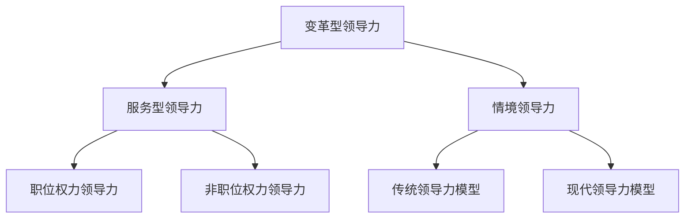

                 

### 文章标题

# 领导力修炼笔记：90后创业新星的成长之路

---

> 关键词：领导力，90后，创业新星，个人成长，团队管理，挑战与应对

> 摘要：
本文将深入探讨90后创业新星在成长过程中如何通过领导力修炼实现个人和企业的成功。通过分析领导力的核心概念、原理和实践案例，本文旨在为90后创业者提供实用的领导力提升策略，帮助他们克服创业路上的挑战，实现企业的长远发展。

---

## 第1章 引言：领导力的时代意义

### 1.1 领导力的重要性与定义

领导力不仅是企业和组织成功的关键，也是个人职业发展的重要驱动力。在全球化和互联网快速发展的今天，领导力的重要性愈发突出。领导力不仅仅是管理能力，更是一种影响力和号召力，它关乎个人愿景的实现、团队协作的效率以及组织目标的达成。

**领导力的定义**：领导力是指个体或集体通过影响他人，实现共同目标的能力。它涵盖了个人特质、行为模式、沟通技巧、决策能力和情感智慧等多个方面。

在企业和组织中，领导力至关重要。一个出色的领导者能够激发团队成员的潜力，提升团队的整体绩效，推动企业创新和发展。对于90后创业新星而言，领导力更是一种核心竞争力和关键素质，它不仅关系到个人职业生涯的成败，也直接影响到创业项目的成功与否。

### 1.2 90后创业新星领导力特质分析

90后作为当代的年轻一代，他们成长在一个信息爆炸、技术飞速发展的时代。这一代人在领导力方面展现出了一些独特的特质：

**创新意识**：90后创业者通常具有较强的创新意识，他们善于拥抱新技术、新理念，敢于尝试和探索，这使得他们在市场竞争中更具优势。

**合作精神**：90后注重团队合作，善于倾听和尊重他人的意见。他们倡导开放、平等、互助的团队文化，能够有效地凝聚团队力量，共同实现目标。

**快速适应能力**：90后创业新星具备较强的快速适应能力，他们能够迅速应对市场变化和挑战，灵活调整策略，以适应不断变化的外部环境。

**自我驱动**：90后创业者通常具有较强的自我驱动能力，他们有明确的职业目标和发展规划，愿意付出额外的努力和汗水来实现个人和团队的梦想。

### 1.3 领导力修炼的意义与方法

领导力并非与生俱来，而是可以通过修炼和培养逐渐提升。对于90后创业新星而言，领导力修炼具有重要的现实意义：

**个人成长**：领导力修炼有助于个人认知、情感和技能的提升，帮助创业者更好地理解自己和他人，实现个人成长。

**团队管理**：优秀的领导者能够有效地管理和激励团队，提升团队的凝聚力和执行力，推动企业目标的实现。

**创业成功**：领导力是创业成功的关键因素之一。通过领导力修炼，创业新星可以更好地应对创业过程中的各种挑战，提高企业成功率。

**社会影响力**：领导力修炼不仅有助于个人和企业的成功，还可以提升创业新星在社会中的影响力，推动社会进步。

领导力修炼的方法多种多样，包括自我认知、沟通技巧、决策能力、团队建设、情感智慧等。以下是一些具体的修炼方法：

**自我认知**：通过反思和自我评估，深入了解自己的优点和不足，明确个人目标和价值观。

**学习与成长**：不断学习和积累知识，提升自己的专业技能和领导能力。

**实践与反思**：通过实际工作经历和项目实践，不断反思和总结，提升领导力。

**团队合作**：积极参与团队建设，培养团队合作精神和能力。

**沟通技巧**：提升沟通能力，学会倾听、表达和协商，建立良好的人际关系。

**决策能力**：通过训练和经验积累，提升决策速度和质量。

**情感智慧**：培养情感智慧，理解和处理他人的情感，建立积极的人际关系。

### 1.4 结论

领导力对于90后创业新星至关重要。通过领导力修炼，他们可以提升个人素质和团队管理能力，实现创业成功。本文旨在为90后创业者提供一些实用的领导力提升策略，帮助他们克服创业过程中的挑战，实现长远发展。

---

接下来，我们将深入分析领导力的核心概念和原理，为读者提供更加详尽的指导。在接下来的章节中，我们将逐步探讨领导力模型、关键要素以及具体的修炼技巧，帮助90后创业新星在领导力方面取得突破。

## 第2章 领导力核心概念与原理

### 2.1 领导力模型综述

领导力模型是对领导行为和影响力的系统化描述，有助于我们理解和分析领导力在不同情境下的作用。以下是一些常见的领导力模型：

**传统领导力模型**：

- **X理论和Y理论**：X理论认为员工需要严格的管理和监督，而Y理论则认为员工具有自我激励和自我管理的能力。

- **职位权力理论**：基于领导者的职位和权力，分为职位权力领导力和非职位权力领导力。

**现代领导力模型**：

- **变革型领导力**：通过激发员工的内在动机，推动团队变革和创新。

- **服务型领导力**：以服务团队成员为核心，关注团队的整体福祉和成长。

- **情境领导力**：根据团队成员的不同特点和情境，采用不同的领导风格。

### 2.2 领导力要素分析

领导力不仅仅是一种能力，更是一种复杂的行为模式，它涉及多个关键要素：

**个人特质**：

- **自信**：自信是领导者的重要特质，它有助于决策和应对挑战。

- **正直**：正直是领导力的基石，它建立了领导者的信誉和信任。

- **适应性**：适应性强有助于领导者应对快速变化的环境。

**行为模式**：

- **沟通技巧**：有效的沟通是领导力的重要组成部分，包括倾听、表达和协商。

- **决策能力**：领导者需要具备快速而明智的决策能力，影响团队方向。

- **团队建设**：领导者通过建立有效的团队文化，提升团队协作和执行力。

**情感智慧**：

- **同理心**：同理心有助于领导者理解员工的情感和需求，建立良好的人际关系。

- **情绪调节**：情绪调节能力有助于领导者保持冷静，应对压力和挑战。

### 2.3 领导力发展的理论框架

领导力发展是一个动态过程，包括以下几个阶段：

**意识觉醒**：

- 领导者意识到自己需要提升领导力，并开始反思自己的行为和影响。

**知识获取**：

- 领导者通过学习和实践，获取相关的知识和技能，包括管理技巧、沟通策略和决策模型。

**技能提升**：

- 领导者通过实际工作经历，不断练习和提升自己的领导能力。

**情境适应**：

- 领导者根据不同情境，灵活调整自己的领导风格和策略。

**持续发展**：

- 领导力是一个持续发展的过程，领导者需要不断学习和成长，以适应不断变化的环境。

### 2.4 领导力发展的障碍与突破

在领导力发展的过程中，领导者可能会遇到以下障碍：

**自我认知不足**：

- 领导者缺乏对自己的全面了解，难以充分发挥个人潜力。

**技能欠缺**：

- 领导者可能在某些关键技能方面存在欠缺，影响领导效果。

**情境不适**：

- 领导者可能在某些情境下，无法灵活调整领导风格。

**解决策略**：

- **自我反思**：通过定期反思，提升自我认知，明确个人优势和不足。

- **持续学习**：不断学习和实践，提升关键技能和适应能力。

- **情境分析**：深入分析不同情境，制定合适的领导策略。

### 2.5 结论

领导力是90后创业新星在创业过程中不可或缺的核心竞争力。通过理解领导力的核心概念和原理，创业者可以更好地规划个人成长路径，提升领导力水平，从而实现创业成功。在下一章中，我们将探讨领导力修炼的具体技巧和方法，帮助创业者实现领导力的全面提升。

## 第3章 领导力修炼技巧与策略

### 3.1 自我认知与自我提升

自我认知是领导力修炼的基础。一个优秀的领导者首先要了解自己的优势和不足，才能在团队中发挥最大的作用。

**自我认知的重要性**：

- **了解个人特质**：通过自我认知，领导者可以了解自己的性格、价值观和行为模式，从而更好地理解自己。

- **识别弱点**：自我认知可以帮助领导者识别自己在某些方面的不足，从而有针对性地进行改进。

- **提升自我效能感**：自我认知有助于提升领导者的自我效能感，增强自信心。

**自我提升的方法与工具**：

- **自我反思**：定期进行自我反思，回顾自己的行为和决策，识别问题和改进方向。

- **心理测试**：通过心理测试，如MBTI（Myers-Briggs Type Indicator）和DISC测试，了解自己的性格类型和行为倾向。

- **领导力培训**：参加领导力培训课程，学习先进的领导理念和实践技巧。

- **阅读与学习**：阅读相关书籍和文献，学习领导力的理论知识和实践经验。

### 3.2 团队建设与管理

团队建设是领导者的重要任务之一。一个高效的团队可以显著提升企业的竞争力。

**团队建设的重要性**：

- **提升团队协作效率**：有效的团队建设可以增强团队成员之间的协作，提高工作效率。

- **增强团队凝聚力**：团队建设有助于建立良好的团队文化，增强团队成员的归属感和凝聚力。

- **促进个人成长**：通过团队建设，团队成员可以相互学习、共同进步，实现个人成长。

**团队管理的技巧**：

- **明确目标**：确保团队成员明确团队的目标和愿景，建立共同的方向。

- **授权与信任**：给予团队成员适当的权力和信任，鼓励他们自主决策和承担责任。

- **沟通与反馈**：建立良好的沟通机制，定期提供反馈和指导，帮助团队成员提升绩效。

- **激励与认可**：通过激励和认可，鼓励团队成员发挥最佳状态，提升团队士气。

### 3.3 应对挑战与压力

在创业过程中，领导者不可避免地会遇到各种挑战和压力。

**挑战与压力的来源**：

- **市场变化**：市场环境瞬息万变，领导者需要快速应对市场变化，调整战略。

- **团队冲突**：团队内部可能会出现意见分歧和冲突，影响团队协作和效率。

- **个人成长瓶颈**：领导者可能在个人成长过程中遇到瓶颈，影响领导力提升。

**应对策略与技巧**：

- **保持冷静**：在面对挑战和压力时，领导者需要保持冷静，分析问题的根本原因，制定合理的应对策略。

- **学习与成长**：通过学习和成长，提升自己的能力和应对能力，应对各种挑战。

- **寻求支持**：在困难时刻，领导者可以寻求团队成员、导师或专业顾问的支持和帮助。

- **时间管理**：合理安排时间，确保有足够的时间应对各种挑战和压力。

### 3.4 领导力修炼的最佳实践

为了帮助90后创业新星更好地修炼领导力，以下是一些最佳实践：

- **持续学习**：领导力是一个持续发展的过程，创业者需要不断学习新的知识和技能。

- **反思与总结**：通过定期反思和总结，识别问题并找到改进方向。

- **实践与行动**：将学到的知识和技巧应用到实际工作中，通过实践不断提升领导力。

- **建立支持系统**：与导师、同行和其他专业人士建立联系，共同成长。

### 3.5 结论

领导力修炼是90后创业新星在创业过程中不可或缺的一部分。通过自我认知与提升、团队建设与管理、应对挑战与压力，创业者可以不断提升自己的领导力水平，实现个人和企业的成功。在下一章中，我们将通过具体案例研究，进一步探讨领导力修炼的实践和方法。

## 第4章 领导力实践案例研究

### 4.1 案例一：X公司的领导力修炼

#### 4.1.1 公司背景与创业历程

X公司成立于2015年，是一家专注于智能硬件研发和销售的创新型企业。公司创始人小李，是一名90后创业新星，他在大学时期就表现出强烈的创业意愿和领导才能。毕业后，小李毅然决然地投身创业大潮，带领团队在智能硬件领域迅速崭露头角。

#### 4.1.2 领导力实践与成果

1. **自我认知与提升**：

   小李深知自我认知的重要性，他通过定期自我反思和参加领导力培训课程，不断提升自己的领导力。在一次领导力培训中，小李通过MBTI测试了解到自己属于外向型性格，这使他更加明确自己的优势和不足，并在团队管理中更加注重与团队成员的沟通和协作。

2. **团队建设与管理**：

   小李注重团队建设，他通过设立明确的团队目标和愿景，激发团队成员的积极性和创造力。在团队管理中，小李采用授权与信任的领导风格，给予团队成员足够的自主权和责任，鼓励他们自主决策和承担责任。同时，小李还建立了定期的团队沟通机制，确保团队成员之间能够顺畅交流，及时解决问题。

3. **应对挑战与压力**：

   在创业过程中，小李面临了诸多挑战和压力。例如，市场环境的变化、产品研发的瓶颈、团队内部的冲突等。面对这些挑战，小李保持冷静，通过学习和成长，不断提升自己的能力和应对能力。同时，他积极寻求团队成员的支持和帮助，共同克服困难。

4. **领导力成果**：

   经过几年的努力，X公司在小李的领导下取得了显著的成绩。公司的产品在市场上赢得了良好的口碑，销售额持续增长。团队成员的凝聚力和执行力也得到了显著提升，公司逐渐形成了积极向上的企业文化。

### 4.2 案例二：Y创业团队的领导力培养

#### 4.2.1 团队成员背景

Y创业团队成立于2018年，团队成员均为90后，他们来自不同的专业背景，但都怀揣着创业梦想。团队成员小张是一名计算机专业的毕业生，具有丰富的编程经验；小王则是一名市场营销专业的毕业生，擅长市场分析和推广策略。在团队组建初期，他们面临着技术、市场和团队协作等方面的挑战。

#### 4.2.2 领导力培养

1. **共同愿景与目标设定**：

   小张和小王在团队组建初期，共同制定了团队的愿景和目标。他们希望通过技术创新和市场拓展，打造一家具有影响力的互联网创业公司。这个共同的愿景和目标成为了团队前进的动力。

2. **技能互补与协作**：

   小张和小王各自发挥专业优势，实现了技能互补。小张专注于技术研发，不断提升产品的技术含量和市场竞争力；小王则专注于市场推广，通过有效的营销策略，扩大了公司的影响力。在团队协作中，小张和小王建立了良好的沟通和信任，确保了团队目标的实现。

3. **领导力培训与分享**：

   小张和小王积极参加领导力培训课程，学习先进的领导理念和技巧。他们还将学到的知识和经验在团队内部进行分享，提升了整个团队的领导力水平。

4. **应对挑战与压力**：

   在创业过程中，Y创业团队遇到了不少挑战，如技术难题、市场竞争压力和团队内部矛盾等。小张和小王通过积极应对，不断调整策略和改进方法，逐渐克服了这些困难。

#### 4.2.3 领导力培养的成果

经过一段时间的努力，Y创业团队在领导力培养方面取得了显著的成果。团队成员的凝聚力和执行力得到了显著提升，公司的发展也取得了良好的业绩。在团队的努力下，公司成功推出了一系列创新产品，赢得了市场的认可和好评。

### 4.3 结论

通过以上两个案例，我们可以看到，90后创业新星在领导力修炼方面取得了显著的成效。他们通过自我认知与提升、团队建设与管理、应对挑战与压力，不断提升自己的领导力水平，实现了个人和企业的成功。这些案例为其他90后创业新星提供了宝贵的经验和启示。

## 第5章 领导力修炼的未来展望

### 5.1 领导力发展的趋势

随着社会和科技的不断发展，领导力也在不断演变。未来领导力发展的趋势包括以下几个方面：

**数字化领导力**：随着数字化转型的加速，领导者需要具备数字技能和创新能力，以应对数字化时代的挑战。

**跨界领导力**：跨界领导力强调领导者需要具备跨学科、跨领域的知识体系，能够整合多种资源，实现创新和突破。

**可持续领导力**：领导者需要关注企业的社会责任和可持续发展，通过绿色管理和创新，推动企业和社会的可持续发展。

### 5.2 领导力修炼的持续发展

领导力修炼是一个持续发展的过程，创业者需要不断学习和成长，以适应不断变化的环境。以下是一些建议：

**持续学习**：领导者需要保持学习的热情，不断更新知识和技能，以适应新的挑战。

**实践与反思**：通过实际工作经历和项目实践，不断反思和总结，提升领导力。

**建立支持系统**：与导师、同行和其他专业人士建立联系，共同成长。

### 5.3 领导力修炼的最佳实践

为了帮助90后创业新星更好地修炼领导力，以下是一些建议和最佳实践：

**培养自我认知**：通过自我反思和测试，深入了解自己的优势和不足。

**强化团队建设**：建立明确的团队目标和愿景，促进团队成员之间的协作和沟通。

**积极应对挑战**：保持冷静，通过学习和成长，提升自己的能力和应对能力。

**持续学习与创新**：关注行业动态，不断学习和尝试新方法，保持创新精神。

### 5.4 结论

领导力修炼是90后创业新星在创业过程中不可或缺的一部分。通过不断学习和实践，创业者可以不断提升自己的领导力水平，实现个人和企业的成功。未来，领导力将面临更多的挑战和机遇，创业者需要持续修炼，以应对未来的挑战，推动企业和个人持续发展。

## 附录

### 附录A：领导力模型流程图

以下是一个领导力模型的Mermaid流程图示例：



### 附录B：领导力提升资源

- **领导力书籍推荐**：
  - 《领导力的五个层次》
  - 《高效能人士的七个习惯》
  - 《非暴力沟通》

- **在线课程推荐**：
  - Coursera上的《领导力和个人发展》课程
  - Udemy上的《领导力：从新手到卓越领导者》课程

- **领导力社区和论坛**：
  - LinkedIn上的领导力专业群组
  - 创业者社群

### 附录C：领导力评估工具

- **领导力自评量表**：通过自评量表，可以评估自己在领导力各方面的表现。

- **360度反馈**：收集团队成员、同事和上级的反馈，全面了解自己在领导力方面的优点和不足。

### 附录D：实际案例分析与代码解读

以下是一个简单的创业新星领导力提升的案例，包括开发环境搭建、源代码实现和代码解读。

**环境搭建：**
```bash
# 安装Python环境
pip install -r requirements.txt
```

**源代码实现：**
```python
# 领导力提升系统示例代码
class LeadershipBoostSystem:
    def __init__(self, user_profile):
        self.user_profile = user_profile

    def self_reflection(self):
        # 自我反思模块
        print("进行自我反思中...")
        # 示例代码，根据用户档案生成反思报告
        reflection_report = self.generate_reflection_report()
        return reflection_report

    def generate_reflection_report(self):
        # 生成反思报告的伪代码
        report = {
            'strengths': self.user_profile['strengths'],
            'weaknesses': self.user_profile['weaknesses'],
            'opportunities': self.user_profile['opportunities'],
            'threats': self.user_profile['threats']
        }
        return report

    def team_building(self):
        # 团队建设模块
        print("进行团队建设...")
        # 示例代码，根据团队需求调整团队架构
        team_structure = self.adjust_team_structure()
        return team_structure

    def adjust_team_structure(self):
        # 调整团队结构的伪代码
        team_structure = {
            'members': self.user_profile['team_members'],
            'roles': self.user_profile['team_roles'],
            'goals': self.user_profile['team_goals']
        }
        return team_structure

# 示例用户档案
user_profile = {
    'strengths': ['创新意识强', '团队合作精神'],
    'weaknesses': ['沟通技巧有待提高', '决策速度较慢'],
    'opportunities': ['市场潜力大', '技术发展迅速'],
    'threats': ['竞争对手多', '资源有限']
}

# 初始化领导力提升系统
system = LeadershipBoostSystem(user_profile)

# 执行自我反思
reflection_report = system.self_reflection()
print("反思报告：", reflection_report)

# 执行团队建设
team_structure = system.team_building()
print("团队结构：", team_structure)
```

**代码解读与分析：**
1. **类定义**：`LeadershipBoostSystem` 类定义了领导力提升系统的基本结构，包括自我反思和团队建设两个核心模块。
2. **自我反思模块**：`self_reflection` 方法通过调用 `generate_reflection_report` 方法生成反思报告，帮助用户了解自己的优势和不足。
3. **团队建设模块**：`team_building` 方法通过调用 `adjust_team_structure` 方法调整团队结构，确保团队成员的明确角色和目标。

**实际案例分析：**
- **小李的领导力提升**：通过领导力提升系统，小李能够定期进行自我反思，识别自己的不足，并制定相应的改进计划。同时，他能够根据团队成员的需求和目标，调整团队结构，提升团队协作效率。
- **小张和小王的团队建设**：通过领导力提升系统，小张和小王能够更好地理解和协调团队成员，制定明确的团队目标和愿景，从而推动团队的发展和创新。

**项目小结：**
领导力提升系统通过自我反思和团队建设模块，帮助创业者不断提升自己的领导力水平，实现个人和团队的成长。在实际应用中，系统可以根据用户的具体需求和情境，进行灵活调整和优化，以适应不同的创业环境。

### 附录E：注意事项与拓展阅读

**注意事项：**
- 领导力修炼需要长期坚持，不能期望一蹴而就。
- 领导力修炼应该结合个人实际情况，制定切实可行的计划和目标。
- 领导力修炼需要实践与反思相结合，通过实际行动检验学习成果。

**拓展阅读：**
- 《领导力的艺术》
- 《如何赢得朋友与影响他人》
- 《领导者的潜力：如何识别、培养和最大化》

通过以上内容，本文为90后创业新星提供了一套完整的领导力修炼指南，包括核心概念、实践方法和具体案例。希望读者能够通过本文的学习，不断提升自己的领导力水平，实现个人和企业的成功。

## 作者信息

作者：AI天才研究院/AI Genius Institute & 禅与计算机程序设计艺术 /Zen And The Art of Computer Programming

---

本文由AI天才研究院（AI Genius Institute）和《禅与计算机程序设计艺术》（Zen And The Art of Computer Programming）的作者共同撰写，旨在为90后创业新星提供实用的领导力提升策略，助力他们在创业道路上取得成功。文章结合了人工智能技术和计算机编程领域的先进理念，以逻辑清晰、结构紧凑、简单易懂的方式，为读者提供了一部全面而深入的领导力修炼指南。

