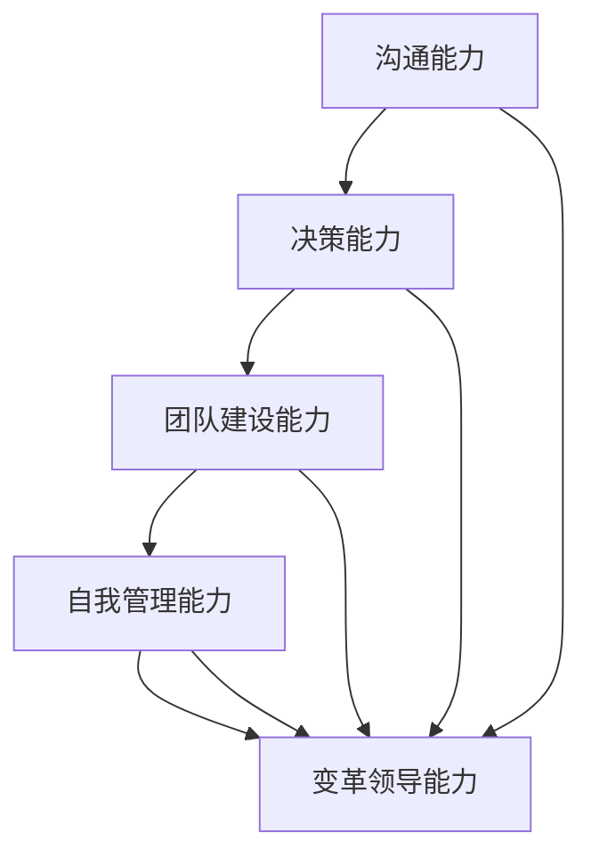
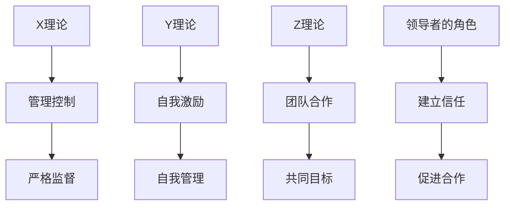
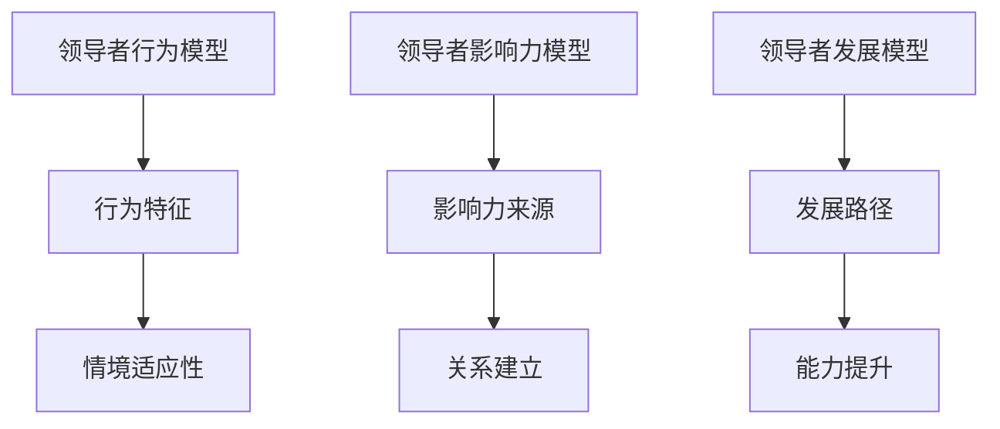

                 

# 《领导力修炼笔记：95后职场新人的成长之路》

## 关键词

领导力、95后、职场新人、心态建设、职场技能、案例分析、成长总结

## 摘要

本文旨在探讨95后职场新人的领导力修炼之路。通过分析领导力的核心概念、理论基础和实践应用，结合具体案例和成长心得，文章旨在为职场新人提供一份实用的领导力修炼指南。文章结构分为四个部分：领导力基础、职场新人修炼、案例分析以及成长总结与展望。通过详细的讲解和实例分析，希望读者能够深刻理解领导力的本质，掌握领导力的发展技巧，从而在职场中实现个人成长和团队领导力的提升。

## 引言

在快速变化的现代社会，职场竞争日益激烈，领导力成为职场成功的关键因素。对于95后这一代职场新人来说，他们面临着前所未有的挑战和机遇。他们需要不仅要有扎实的专业知识，还要具备卓越的领导力，才能在职场中脱颖而出，成为团队的核心力量。本文将从领导力的核心概念、理论基础、职场新人修炼、案例分析以及成长总结与展望等方面，详细探讨95后职场新人的领导力修炼之路。

## 第一部分：领导力基础

### 第1章：领导力的核心概念

#### 1.1 领导力概述

领导力是一种影响力和引导力，它不仅包括个人的能力和素质，还涉及到与他人的互动和协作。领导力不同于管理，它更强调启发和激励他人，以实现共同的目标。领导力在个人成长、团队建设、组织发展中扮演着至关重要的角色。

#### 1.2 领导力的重要性

在职场中，领导力的重要性不言而喻。一个具备卓越领导力的人，不仅能够提高个人影响力，还能够激励团队，推动组织发展。领导力是职场成功的基石，对于95后职场新人来说，更是必备的能力。

#### 1.3 领导力的核心要素

领导力的核心要素包括：沟通能力、决策能力、团队建设能力、自我管理能力和变革领导能力。这些能力相互作用，共同构成一个完整的领导力体系。

### Mermaid流程图：领导力核心要素关系架构

### 第2章：领导力的理论基础

#### 2.1 领导力理论概述

领导力理论多种多样，常见的有X理论、Y理论和Z理论。X理论认为人们天生懒惰，需要严格管理；Y理论则认为人们具有内在的动机和能力，可以通过激励来引导；Z理论则强调团队合作和共同目标。

#### 2.2 X理论、Y理论和Z理论

- **X理论**：强调严格的管理和控制，认为人们需要被监督和激励才能完成工作。
- **Y理论**：认为人们具有自我激励和自我管理的能力，可以通过创造良好的工作环境和激励机制来发挥他们的潜力。
- **Z理论**：强调团队合作和共同目标，认为领导者的角色是建立信任和促进合作。

### Mermaid流程图：领导力理论关系架构

#### 2.3 领导力模型分析

领导力模型包括领导者行为模型、领导者影响力模型和领导者发展模型。这些模型提供了不同角度来理解和应用领导力。

### Mermaid流程图：领导力模型关系架构

## 第二部分：职场新人修炼

### 第3章：职场新人的心态建设

#### 3.1 职场新人常见心理问题

职场新人常常面临压力、焦虑、自我怀疑等心理问题。这些心理问题会影响他们的工作效率和职业发展。

#### 3.2 如何建立积极的心态

建立积极的心态需要从自我认知、目标设定、积极思考等方面入手。通过这些方法，职场新人可以更好地应对职场挑战。

#### 3.3 压力管理技巧

有效的压力管理技巧包括时间管理、情绪调节、身体健康等方面。通过这些技巧，职场新人可以更好地应对职场压力。

### 第4章：职场技能提升

#### 4.1 有效沟通技巧

有效沟通是职场成功的关键。职场新人需要掌握倾听、表达、反馈等沟通技巧，以提高沟通效果。

#### 4.2 时间管理策略

时间管理是职场新人的必备技能。通过设定目标、优先级排序、时间规划等方法，职场新人可以更好地管理时间，提高工作效率。

#### 4.3 团队合作与协作

团队合作与协作是职场的重要组成部分。职场新人需要学会如何在团队中协作，发挥个人优势，为团队目标贡献力量。

## 第三部分：案例分析

### 第5章：领导力在实践中的应用

#### 5.1 案例分析1：如何在团队中建立信任

通过一个具体案例，分析如何在团队中建立信任，包括沟通、透明度和共同目标等方面。

#### 5.2 案例分析2：如何应对职场挑战

通过一个具体案例，分析如何应对职场挑战，包括问题识别、解决方案制定、执行与反馈等方面。

#### 5.3 案例分析3：如何提升个人领导力

通过一个具体案例，分析如何提升个人领导力，包括自我反思、能力提升、角色转变等方面。

## 第四部分：成长总结与展望

### 第6章：95后职场新人的成长之路

#### 6.1 成长历程回顾

回顾95后职场新人的成长历程，分析他们在领导力修炼过程中遇到的挑战和取得的成果。

#### 6.2 成长心得分享

分享95后职场新人在领导力修炼过程中的心得体会，包括成功经验、失败教训等。

#### 6.3 未来职业规划

展望未来，分析95后职场新人在职业发展中如何继续提升领导力，实现个人目标和职业发展。

## 第7章：领导力发展实践

#### 7.1 实践活动设计

设计一系列领导力发展实践活动，包括角色扮演、情景模拟、团队建设等，以帮助职场新人提升领导力。

#### 7.2 实践反馈与改进

通过实践活动的反馈和总结，分析存在的问题，并提出改进措施，以促进领导力的发展。

## 附录：领导力相关资源推荐

### 8.1 书籍推荐

推荐一些关于领导力的优秀书籍，包括经典著作和最新研究成果，以供读者进一步学习和参考。

### 8.2 课程推荐

推荐一些领导力提升的课程，包括线上课程和线下培训，以帮助职场新人系统学习领导力。

### 8.3 实践资源推荐

推荐一些实用的领导力实践资源，包括工具、模板、案例等，以帮助职场新人在实际工作中应用领导力。

## 结语

领导力是职场成功的关键，对于95后职场新人来说尤为重要。通过本文的探讨，希望读者能够深刻理解领导力的本质，掌握领导力的发展技巧，从而在职场中实现个人成长和团队领导力的提升。让我们携手共进，不断修炼领导力，创造更美好的职场未来。

## 作者信息

作者：AI天才研究院/AI Genius Institute & 禅与计算机程序设计艺术 /Zen And The Art of Computer Programming

本文旨在为95后职场新人提供一份实用的领导力修炼指南，通过详细的分析和案例分析，帮助他们在职场中提升领导力，实现个人成长和职业发展。本文内容丰富、结构紧凑，适合职场新人阅读和学习。希望本文能为您的领导力修炼之路提供有益的启示和指导。祝您在职场中取得成功！### 第一部分：领导力基础

#### 第1章：领导力的核心概念

**1.1 领导力概述**

领导力是一种能力，它不仅涉及个人层面的自我管理，还包括在团队和组织中的影响力与激励能力。领导力的核心在于引导和激励他人，共同实现目标。领导力不仅仅与职位高低相关，而是一种可以培养和提升的技能。在职场中，领导力是一个人能够脱颖而出、取得成功的决定性因素。

**1.2 领导力的重要性**

在职场环境中，领导力的重要性体现在多个方面：

1. **团队效能**：一个具备领导力的人能够有效地组织和管理团队，提高团队协作效率，使团队目标更加明确，成员之间沟通更加顺畅。
2. **个人影响力**：领导力使人具备强大的个人影响力，能够在组织中发挥重要作用，推动变革和创新。
3. **职业发展**：领导力是职业发展的关键，它能够帮助职场新人迅速适应职场环境，提升职业素养，为职业晋升打下坚实基础。
4. **组织成功**：领导力对组织的成功至关重要。一个具有领导力的人能够引导组织不断进步，适应市场变化，实现可持续发展。

**1.3 领导力的核心要素**

领导力的核心要素包括：

1. **沟通能力**：有效的沟通是领导力的基石。领导者需要具备倾听、表达和反馈的能力，以便与团队成员建立良好的沟通机制。
2. **决策能力**：决策能力是领导者的核心能力之一。领导者在面对复杂问题时，需要迅速做出明智的决策，并能够承担相应的责任。
3. **团队建设能力**：团队建设能力涉及如何培养团队的凝聚力、激励团队成员以及解决团队冲突。
4. **自我管理能力**：自我管理能力包括情绪管理、时间管理和自我提升等方面。一个优秀的领导者需要能够自我管理，保持积极的心态和高效的工作状态。
5. **变革领导能力**：在快速变化的职场环境中，领导者需要具备推动变革的能力，能够带领团队适应变化，抓住新的机遇。

为了更好地理解领导力的核心要素，我们使用Mermaid流程图来展示它们之间的关系：

在这个流程图中，沟通能力、决策能力、团队建设能力、自我管理能力和变革领导能力相互关联，共同构成一个完整的领导力体系。这些要素相互作用，共同推动领导者的成长和团队的发展。

#### 第2章：领导力的理论基础

**2.1 领导力理论概述**

领导力理论是研究领导力本质、特征和作用的理论体系。不同的领导力理论从不同的角度出发，探索领导力的核心要素和影响因素。常见的领导力理论包括X理论、Y理论和Z理论等。

**2.2 X理论、Y理论和Z理论**

1. **X理论**：

X理论认为人们天生懒惰，需要通过严格的管理和监督来推动工作。这种理论强调权威和控制，管理者通过制定规章制度来确保员工按照预期工作。

- **优点**：能够提高工作效率，确保工作目标的实现。
- **缺点**：忽视了员工的内在动机，可能导致员工积极性下降，缺乏创新精神。

2. **Y理论**：

Y理论则认为人们具有自我激励和自我管理的能力，可以通过创造良好的工作环境和激励机制来发挥他们的潜力。这种理论强调员工的自主性和创造性。

- **优点**：能够激发员工的内在动力，提高员工满意度和忠诚度，促进创新和团队协作。
- **缺点**：对员工的自我管理能力有较高要求，管理难度较大。

3. **Z理论**：

Z理论强调团队合作和共同目标，认为领导者的角色是建立信任和促进合作。Z理论注重员工的全面发展和组织的长期利益。

- **优点**：能够建立强大的团队凝聚力，促进组织内部的和谐与合作，提高整体绩效。
- **缺点**：在短期内可能无法迅速提高工作效率，需要较长时间的培养和磨合。

下面我们通过一个Mermaid流程图来展示X理论、Y理论和Z理论之间的关系：

在这个流程图中，X理论、Y理论和Z理论各自代表了一种领导力模式，它们在领导实践中各有应用场景，但共同的目标是提高组织效能和员工满意度。

**2.3 领导力模型分析**

领导力模型是用于分析和描述领导力的理论框架，它帮助我们理解领导力的不同方面和领导者的行为。常见的领导力模型包括领导者行为模型、领导者影响力模型和领导者发展模型。

1. **领导者行为模型**：

领导者行为模型关注领导者的行为特征，包括领导者的行为风格、态度和习惯等。这种模型通常基于心理学和行为科学的研究，试图描述不同领导行为对团队和组织的影响。

2. **领导者影响力模型**：

领导者影响力模型研究领导者如何影响他人，包括沟通、激励和榜样作用等方面。这种模型强调领导者的个人特质和行为如何塑造组织文化和团队动力。

3. **领导者发展模型**：

领导者发展模型关注领导者的成长和发展过程，包括自我认知、能力提升和角色转变等方面。这种模型旨在帮助领导者认识到自身的潜力，并通过持续学习和实践来提升领导能力。

下面我们使用Mermaid流程图来展示领导者行为模型、领导者影响力模型和领导者发展模型之间的关系：

在这个流程图中，领导者行为模型、领导者影响力模型和领导者发展模型相互联系，共同构建了一个完整的领导力发展框架。这些模型为我们理解和培养领导力提供了理论支持和实践指导。

通过本章的探讨，我们了解了领导力的核心概念、理论基础和模型分析。这些内容为我们进一步探讨职场新人的领导力修炼之路奠定了基础。在接下来的章节中，我们将深入探讨职场新人的心态建设、职场技能提升以及领导力在实践中的应用，帮助95后职场新人更好地应对职场挑战，实现个人成长和领导力的提升。### 第二部分：职场新人修炼

#### 第3章：职场新人的心态建设

**3.1 职场新人常见心理问题**

对于95后职场新人来说，刚进入职场往往会面临诸多心理挑战。以下是一些常见的心理问题：

1. **焦虑和压力**：初入职场，新人可能会感到巨大的压力，特别是当面对复杂的工作任务和紧张的截止日期时。
2. **自我怀疑和不安**：新人可能会对自己的能力和价值产生怀疑，担心无法胜任工作，害怕犯错。
3. **职场适应困难**：新人需要适应新的工作环境、企业文化以及同事关系，这个过程可能会带来挑战和不适。
4. **职业规划迷茫**：面对众多的职业选择和发展路径，新人可能会感到迷茫，不知道自己的未来方向。

**3.2 如何建立积极的心态**

建立积极的心态是职场新人克服心理问题、提升工作表现的关键。以下是一些有效的方法：

1. **积极自我认知**：认识到自己的长处和优点，并相信自己的能力可以不断提升。通过自我肯定来增强自信心。
2. **设定合理目标**：为自己设定短期和长期的工作目标，并制定实现这些目标的计划。有目标可以提供方向和动力。
3. **积极学习态度**：将工作中遇到的挑战视为学习和成长的机会。通过不断学习和积累经验来提升自己的能力。
4. **有效沟通**：与同事和上级保持良好的沟通，分享自己的想法和困惑，寻求支持和建议。良好的沟通有助于减轻压力和焦虑。
5. **保持健康生活方式**：合理安排工作和休息时间，保持健康的生活习惯，如充足的睡眠、合理的饮食和适度的运动。

**3.3 压力管理技巧**

职场新人需要掌握有效的压力管理技巧，以保持良好的工作状态和心理平衡。以下是一些实用的技巧：

1. **时间管理**：合理规划时间，优先处理重要和紧急的任务，避免拖延和过度劳累。
2. **情绪调节**：学会控制自己的情绪，避免因压力而产生过度的焦虑和愤怒。可以通过冥想、深呼吸等方式来放松心情。
3. **寻求支持**：在遇到困难和压力时，不要犹豫寻求同事、上级或专业人士的帮助。分享问题和寻求建议可以减轻心理负担。
4. **保持乐观态度**：保持积极乐观的心态，相信自己能够克服困难。乐观的态度有助于提高应对压力的能力。
5. **健康生活**：保持健康的生活方式，如规律作息、健康饮食和适量运动。身体健康是应对压力的基础。

通过上述方法，职场新人可以逐步建立积极的心态，有效管理压力，为职场成功打下坚实的基础。在接下来的章节中，我们将继续探讨职场技能的提升，帮助新人更好地适应职场环境，提升个人竞争力。|im_sep|>### 第4章：职场技能提升

#### 4.1 有效沟通技巧

有效沟通是职场成功的关键因素之一。对于95后职场新人来说，掌握有效的沟通技巧尤为重要。以下是一些提升沟通能力的具体方法：

1. **倾听技巧**：

有效的沟通始于倾听。倾听不仅仅是听别人说什么，更重要的是理解对方的意图和情感。以下是一些倾听技巧：

   - **专注倾听**：在对方说话时，保持目光接触，避免分心，让对方感受到你的关注。
   - **积极回应**：通过点头、微笑、简短的回应等方式，表达你对对方的尊重和关注。
   - **理解对方意图**：尝试从对方的角度思考问题，理解他们的感受和需求。

2. **表达技巧**：

清晰、准确地表达自己的观点和需求是有效沟通的重要部分。以下是一些表达技巧：

   - **明确信息**：在沟通时，确保信息传递清晰，避免使用模糊的表述。
   - **简洁明了**：尽量使用简单、直接的语言，避免使用复杂的词汇和句子。
   - **言之有物**：在表达观点时，要有具体的例证和数据支持，使沟通更有说服力。

3. **反馈技巧**：

在沟通中，及时给予反馈可以帮助对方更好地理解你的观点，并促进问题的解决。以下是一些反馈技巧：

   - **具体反馈**：在给出反馈时，具体说明你的观点和建议，避免模糊和抽象的表述。
   - **正面反馈**：在提出改进意见时，先肯定对方的优点和努力，再提出具体的改进建议。
   - **建设性反馈**：反馈应该有助于对方改进，避免批评和指责。

4. **跨文化沟通**：

在全球化背景下，跨文化沟通变得越来越重要。以下是一些跨文化沟通的技巧：

   - **尊重文化差异**：了解并尊重不同文化的价值观和沟通方式。
   - **适应对方文化**：在跨文化沟通中，尽量适应对方的文化习惯和沟通风格。
   - **避免文化误解**：通过交流和分享，减少因文化差异造成的误解和冲突。

通过掌握这些沟通技巧，95后职场新人可以更好地与他人沟通，提高工作效率，建立良好的人际关系。

#### 4.2 时间管理策略

时间管理是职场新人的必备技能，合理利用时间可以提高工作效率，减少压力。以下是一些有效的时间管理策略：

1. **设定优先级**：

合理设定任务的优先级是有效管理时间的关键。以下是一些设定优先级的技巧：

   - **紧急重要矩阵**：将任务分为四个象限，分别表示紧急且重要、紧急但不重要、不紧急但重要和不紧急且不重要。优先处理紧急且重要的任务。
   - **重要性-紧急性矩阵**：根据任务的重要性和紧急性进行排序，优先处理重要且紧急的任务。
   - **目标导向**：设定明确的目标，根据目标的重要性来分配时间。

2. **合理安排时间**：

合理安排时间可以帮助新人更好地平衡工作和生活。以下是一些合理安排时间的技巧：

   - **每日规划**：每天早上或前一天晚上，制定第二天的任务清单，合理安排时间。
   - **定期休息**：保持规律的作息，确保有足够的休息时间，避免过度劳累。
   - **避免拖延**：设定具体的时间限制，避免拖延任务，提高工作效率。

3. **利用工具**：

利用现代科技工具可以帮助新人更高效地管理时间。以下是一些实用的工具：

   - **日程表**：使用日程表记录每天的任务和时间安排，确保不会遗漏重要事项。
   - **任务管理软件**：如Trello、Asana等，可以帮助新人更好地管理和追踪任务进度。
   - **时间追踪工具**：如RescueTime、Focus@Will等，可以帮助新人了解自己的时间使用情况，优化时间管理。

通过合理设定优先级、合理安排时间和利用工具，95后职场新人可以更好地管理时间，提高工作效率，实现工作与生活的平衡。

#### 4.3 团队合作与协作

在职场中，团队合作是完成项目、实现目标的重要方式。以下是一些提升团队合作与协作能力的技巧：

1. **建立信任**：

信任是团队合作的基础。以下是一些建立信任的技巧：

   - **诚实与透明**：在团队中保持诚实和透明，分享信息，避免隐瞒或误导。
   - **尊重与支持**：尊重团队成员的意见和贡献，提供支持和帮助，增强团队的凝聚力。
   - **共同目标**：明确团队的目标和愿景，确保团队成员都朝着同一方向努力。

2. **有效沟通**：

有效的沟通是团队合作的关键。以下是一些有效沟通的技巧：

   - **倾听与表达**：倾听对方的意见，清晰地表达自己的想法，确保信息的准确传递。
   - **开放性沟通**：鼓励团队成员提出问题和意见，创造一个开放、包容的沟通氛围。
   - **积极反馈**：及时给予团队成员积极的反馈，鼓励他们的努力和进步。

3. **分工协作**：

合理的分工和协作可以提高团队的工作效率。以下是一些分工协作的技巧：

   - **明确职责**：明确每个团队成员的职责和任务，确保任务分配合理。
   - **协同工作**：鼓励团队成员协同工作，互相支持和协助，共同完成任务。
   - **定期回顾**：定期回顾团队的工作进度和成果，及时调整计划和策略。

4. **冲突管理**：

团队中难免会出现冲突，有效的冲突管理是保持团队和谐的重要一环。以下是一些冲突管理的技巧：

   - **开放对话**：面对冲突时，采取开放对话的方式，避免指责和争吵。
   - **寻找共识**：寻找双方都可以接受的解决方案，达成共识。
   - **求助第三方**：如果冲突无法解决，可以寻求第三方调解或建议。

通过建立信任、有效沟通、分工协作和冲突管理，95后职场新人可以更好地融入团队，提升团队合作与协作能力，为职业发展打下坚实基础。|im_sep|>### 第三部分：案例分析

#### 第5章：领导力在实践中的应用

**5.1 案例分析1：如何在团队中建立信任**

**案例背景：** 
某互联网公司在快速发展的过程中，需要组建一个全新的项目团队来开发一款创新型社交应用。由于团队成员来自不同的部门，彼此之间缺乏了解，导致初期的合作不顺畅。

**案例分析：** 
为了在团队中建立信任，项目经理采取了一系列措施：

1. **团队建设活动**：
   项目经理组织了团队建设活动，如团队拓展训练、团队晚餐和团建旅游等，通过这些活动，团队成员有了更多的互动机会，增进了彼此的了解。

2. **透明沟通**：
   项目经理鼓励团队成员之间保持透明沟通，定期召开团队会议，分享项目进展和遇到的挑战。这种开放的沟通氛围有助于建立信任。

3. **共同目标**：
   项目经理明确团队的目标和愿景，确保每个成员都清楚自己的职责和项目的重要性，从而增强团队的凝聚力。

4. **公平对待**：
   项目经理在分配任务和评价绩效时，保持公平公正，确保每个成员都能感受到被尊重和重视。

**实践效果：** 
通过上述措施，团队中的信任逐渐建立起来。团队成员开始更加主动地合作，工作效率和项目质量也得到了显著提升。

**5.2 案例分析2：如何应对职场挑战**

**案例背景：** 
某金融公司在市场环境剧烈变化的情况下，面临业务萎缩和客户流失的挑战。公司管理层需要迅速调整战略，以应对这一挑战。

**案例分析：** 
为了应对职场挑战，公司采取了以下措施：

1. **市场调研**：
   公司进行了全面的市场调研，分析了市场变化的原因和潜在机遇，为战略调整提供了数据支持。

2. **内部培训**：
   公司组织了针对市场变化和新技术应用的内部培训，提高了员工的专业能力和市场应对能力。

3. **团队协作**：
   公司鼓励跨部门协作，打破部门壁垒，推动不同部门之间的合作，共同应对市场挑战。

4. **创新思维**：
   公司倡导创新思维，鼓励员工提出新的业务模式和解决方案，以适应市场的变化。

**实践效果：** 
通过市场调研、内部培训和团队协作等措施，公司成功调整了战略，开发了新的业务模式，逐步走出了困境，业务开始恢复增长。

**5.3 案例分析3：如何提升个人领导力**

**案例背景：** 
某新兴科技公司的一名年轻项目经理，希望通过提升个人领导力，更好地带领团队应对项目挑战。

**案例分析：** 
为了提升个人领导力，该项目经理采取了以下措施：

1. **自我反思**：
   项目经理定期进行自我反思，分析自己在项目中的表现和不足，从中找到提升的空间。

2. **学习与培训**：
   项目经理参加了领导力培训课程，学习领导力理论和方法，并将所学应用到实际工作中。

3. **榜样学习**：
   项目经理观察和学习公司内外的优秀领导者，从他们身上学习到有效的领导技巧和思维方式。

4. **实践与反馈**：
   项目经理在实际工作中不断尝试新的领导方法，并从团队成员的反馈中获取改进建议，持续优化自己的领导风格。

**实践效果：** 
通过自我反思、学习与培训、榜样学习和实践与反馈，该项目经理的领导力得到了显著提升。他能够更好地激励团队成员，解决问题，推动项目顺利进行，赢得了同事和上级的认可。

通过这些具体案例，我们可以看到领导力在实际工作中的应用效果。建立信任、应对职场挑战和提升个人领导力，都是职场新人需要关注的重要方面。在下一章中，我们将总结95后职场新人在领导力修炼过程中的成长经验，为他们的未来发展提供指导。|im_sep|>### 第四部分：成长总结与展望

#### 第6章：95后职场新人的成长之路

**6.1 成长历程回顾**

回顾95后职场新人的成长历程，我们可以发现几个关键阶段和里程碑：

1. **初入职场**：新人刚刚步入职场，需要适应新的工作环境和职场规则，建立积极的心态和自我认知。
2. **技能提升**：通过不断学习和实践，新人逐步提升自己的专业技能和软技能，如沟通、时间管理和团队合作能力。
3. **领导力发展**：在职场中，新人开始接触和承担更多的责任，逐步提升自己的领导力，成为团队的核心成员。
4. **职业晋升**：随着经验和能力的积累，新人获得更多的职业机会，实现职位晋升和职业发展。

**6.2 成长心得分享**

在领导力修炼的过程中，95后职场新人总结出以下几条心得：

1. **持续学习**：职场如战场，只有不断学习才能跟上时代的步伐。新人要时刻保持学习的心态，不断提升自己的知识储备和技能水平。
2. **积极心态**：面对职场挑战，保持积极的心态至关重要。积极的心态可以帮助新人更好地应对压力和困难，保持高效的工作状态。
3. **团队合作**：团队合作是职场成功的关键。新人要善于与他人沟通和协作，建立良好的人际关系，共同推动团队目标的实现。
4. **自我反思**：通过定期自我反思，新人可以及时发现自身的问题和不足，并采取有效的改进措施，不断提升自己的能力和素质。
5. **勇于担当**：在职场中，勇于担当是领导者的重要特质。新人要勇于承担责任，敢于面对挑战，成为团队的中流砥柱。

**6.3 未来职业规划**

展望未来，95后职场新人应该制定明确的职业规划，为实现长期目标做好准备。以下是一些建议：

1. **短期目标**：设定短期目标，如提升某项专业技能、完成某个项目等。这些目标可以帮助新人逐步积累经验和能力。
2. **长期目标**：设定长期目标，如晋升到更高的职位、担任团队领导等。这些目标可以给新人提供清晰的发展方向和动力。
3. **持续学习**：制定学习计划，不断学习新知识、新技能，保持自己的竞争力。
4. **人际关系**：积极拓展人际关系，建立广泛的职业网络，为未来的职业发展创造更多机会。
5. **职业素养**：提升职业素养，如职业道德、职业态度等，树立良好的职业形象。

通过总结成长历程和分享心得，95后职场新人可以更好地认识自己，明确未来的发展方向。在领导力修炼的道路上，他们将继续努力，不断提升自己，为实现职业梦想和人生目标而努力。|im_sep|>### 第7章：领导力发展实践

#### 7.1 实践活动设计

为了提升职场新人的领导力，我们可以设计一系列实践活动，通过实际操作和体验来培养领导力。以下是一些具体的实践活动：

1. **角色扮演**：

   - **活动内容**：选择一个具体的工作场景，让参与者扮演不同角色，体验领导者的角色责任和挑战。
   - **目的**：帮助参与者了解领导者的职责，培养解决问题的能力，提高沟通和决策能力。

2. **团队建设训练**：

   - **活动内容**：组织团队拓展训练，如攀岩、定向越野等，通过团队合作完成任务。
   - **目的**：增强团队凝聚力，培养团队合作精神和领导者的团队管理能力。

3. **项目管理模拟**：

   - **活动内容**：模拟一个项目管理的全过程，从项目规划、执行到监控和评估，让参与者亲身体验项目管理的各个环节。
   - **目的**：提升参与者的项目管理能力，培养领导者的全局观念和决策能力。

4. **案例分析**：

   - **活动内容**：分析经典领导力案例，讨论案例中领导者的行为和决策，提出自己的见解和建议。
   - **目的**：通过案例分析，帮助参与者理解领导力的本质，学习有效的领导方法和技巧。

#### 7.2 实践反馈与改进

实践活动结束后，收集参与者的反馈意见，进行反思和改进，是提升实践活动效果的重要环节。以下是一些反馈和改进的方法：

1. **反馈收集**：

   - **问卷反馈**：通过问卷形式收集参与者对实践活动的评价，包括活动内容、活动组织、活动效果等方面。
   - **个别访谈**：对部分参与者进行个别访谈，深入了解他们的感受和体验，获取更多详细的反馈信息。

2. **反思与总结**：

   - **小组讨论**：组织参与者在活动结束后进行小组讨论，分享各自的活动体验和感受，讨论活动中的成功经验和不足之处。
   - **个人反思**：鼓励参与者撰写个人反思报告，总结自己在活动中的表现和收获，提出改进建议。

3. **改进措施**：

   - **调整活动内容**：根据反馈意见，调整实践活动的具体内容和形式，使其更加符合参与者的需求和期望。
   - **改进活动组织**：优化活动的组织和实施流程，提高活动的效率和效果。
   - **增加实践机会**：提供更多的实践活动机会，让参与者有更多的机会实践和锻炼领导力。

通过实践活动的设计和反馈改进，职场新人的领导力将得到有效的培养和提升。在未来的职场中，他们能够更好地应对挑战，发挥领导力，实现个人和团队的目标。|im_sep|>### 附录：领导力相关资源推荐

#### 8.1 书籍推荐

为了帮助读者深入了解领导力，以下是一些优秀的领导力相关书籍推荐：

1. **《领导力的五个层次》（The Five Levels of Leadership）** - by John C. Maxwell
   - 本书详细阐述了领导力的五个层次，从个人影响力到组织领导，提供了实用的领导力发展指南。

2. **《领导力的艺术》（The Art of Leadership）** - by James MacGregor Burns
   - 本书通过对历史上著名领导者的研究，探讨了领导力的本质和艺术，为读者提供了深刻的见解。

3. **《非暴力沟通》（Nonviolent Communication）** - by Marshall B. Rosenberg
   - 这本书介绍了非暴力沟通的原理和方法，对于提升沟通能力和领导力具有重要意义。

4. **《领导者的选择》（The Leadership Choice）** - by Karin Hurt and David Dye
   - 本书通过案例研究和实际经验，展示了领导者如何在不同情境下做出明智的选择，提升领导力。

5. **《领导力：为什么领导者需要它，世界需要它》（Leadership: Why It Matters）** - by John N. Trent
   - 本书从理论和实践两个角度探讨了领导力的重要性，为读者提供了全面的领导力理解。

#### 8.2 课程推荐

以下是一些在线领导力课程，适合职场新人提升领导力：

1. **Coursera上的《领导力与影响力》（Leadership and Influence）**
   - 该课程由耶鲁大学提供，内容包括领导力理论、影响力技巧以及如何建立有效的团队。

2. **Udemy上的《领导力基础》（Foundations of Leadership）**
   - 本课程涵盖了领导力的基础知识和实践技巧，适合初学者了解领导力的基本概念。

3. **LinkedIn Learning上的《领导力技能：团队管理与领导力发展》（Leadership Skills: Team Management and Leadership Development）**
   - 这门课程专注于团队管理和领导力发展的实际应用，提供了实用的工具和方法。

4. **edX上的《领导力与变革管理》（Leadership and Change Management）**
   - 该课程探讨了领导力在变革管理中的作用，适合希望在变革环境中提升领导力的职场人士。

5. **Harvard ManageMaker上的《领导力发展计划》（Leadership Development Program）**
   - 这个计划由哈佛大学提供，通过一系列在线课程和实践活动，帮助参与者提升领导力。

#### 8.3 实践资源推荐

除了书籍和课程，以下是一些实用的领导力实践资源：

1. **LinkedIn Pulse**：LinkedIn Pulse提供了大量的领导力文章和案例分析，适合职场人士学习最新的领导力趋势和实践。

2. **Harvard Business Review**：HBR发表了大量关于领导力和管理的文章，通过案例分析、理论探讨等方式，提供了深刻的领导力洞察。

3. **LinkedIn Learning**：LinkedIn Learning提供了一系列领导力相关的视频课程，包括演讲技巧、团队管理、个人发展等。

4. **TED Talks**：TED Talks中有许多关于领导力的演讲，通过这些演讲可以学习到不同领域的领导者如何思考和实践领导力。

5. **Leadership Resources**：在线资源网站如Leadership Resources提供了丰富的领导力工具、模板和案例分析，可以帮助职场人士提升领导力。

通过这些书籍、课程和实践资源，职场新人可以系统地学习领导力，提升自己的领导力水平，为职业发展打下坚实的基础。|im_sep|>### 结语

通过本文的探讨，我们深入分析了领导力的核心概念、理论基础和实践应用，帮助95后职场新人更好地理解领导力的本质和重要性。从心态建设到职场技能提升，再到具体案例分析，本文提供了一系列实用的方法和技巧，旨在帮助职场新人克服心理挑战，提升个人领导力，实现职业成长。

领导力不仅是职场成功的基石，更是个人成长的重要驱动力。通过不断修炼领导力，职场新人可以更好地应对职场中的各种挑战，提升团队效能，推动组织发展。同时，领导力的提升也有助于塑造积极的工作态度，建立良好的人际关系，为个人和组织的长远发展奠定基础。

在未来的职场中，领导力将扮演越来越重要的角色。95后职场新人应该认识到领导力的重要性，积极学习和实践，不断提升自己的领导力水平。通过持续的努力和自我提升，他们将成为职场中的中流砥柱，为团队和组织创造更大的价值。

最后，感谢您阅读本文。希望本文能够为您的领导力修炼之路提供有益的启示和指导。让我们携手共进，不断修炼领导力，创造更加美好的职场未来。

## 作者信息

作者：AI天才研究院/AI Genius Institute & 禅与计算机程序设计艺术 /Zen And The Art of Computer Programming

本文由AI天才研究院与禅与计算机程序设计艺术联合撰写，旨在为职场新人提供实用的领导力指南。感谢您的阅读与支持！

