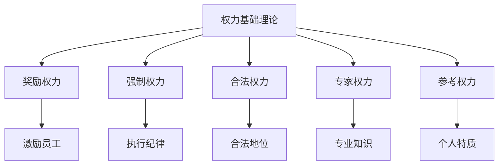
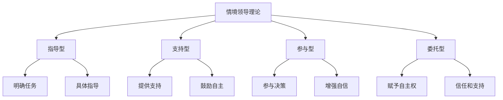
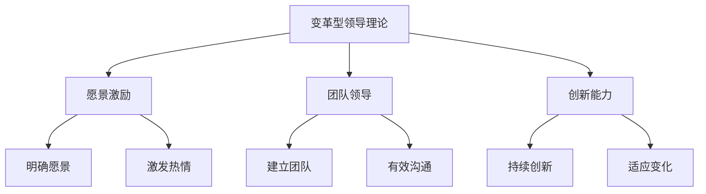
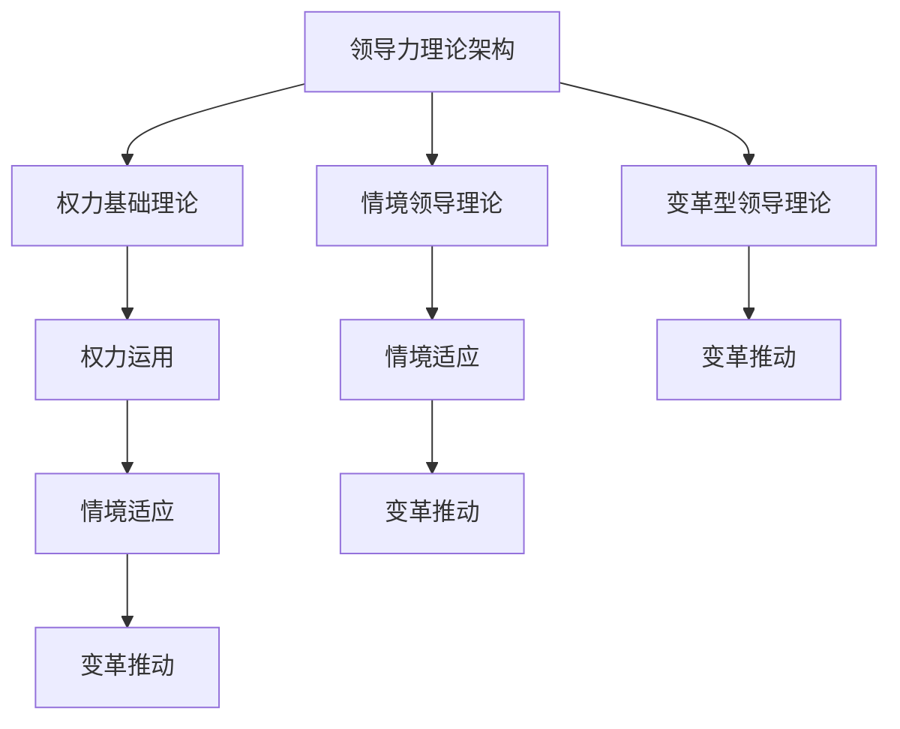
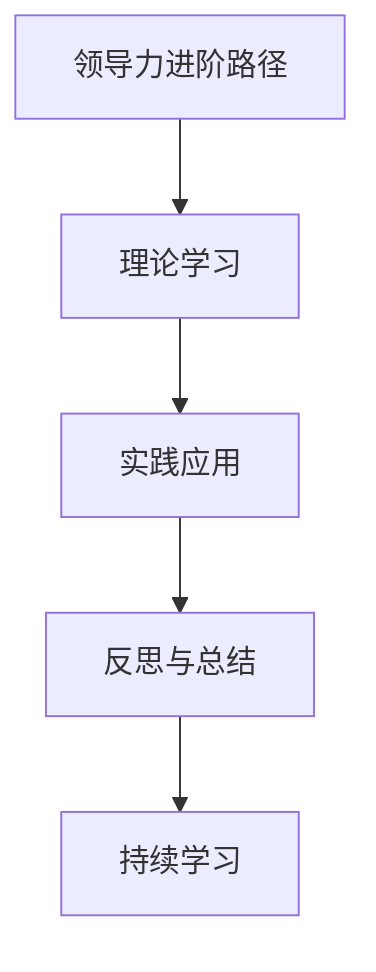
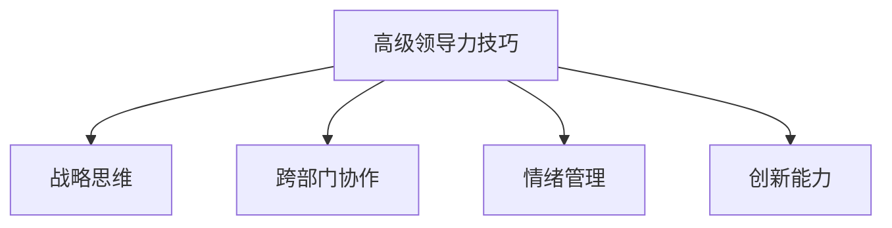
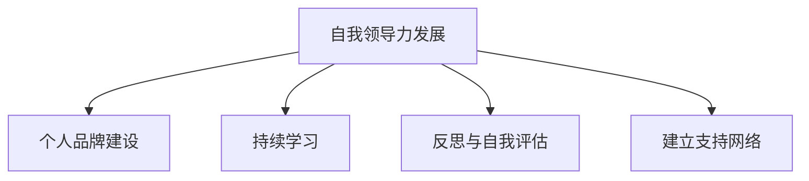

                 

## 文章标题

《领导力修炼：从新手到大师的成长之路》

### 关键词
- 领导力
- 成长路径
- 个人发展
- 团队管理
- 算法原理

### 摘要
本文将深入探讨领导力的本质和重要性，通过系统的理论和实践分析，为读者提供一条从新手到大师的成长之路。文章将涵盖领导力的核心理论、实践应用、进阶技巧以及个人成长策略，并通过实际案例解析，帮助读者更好地理解和应用领导力原则。

## 引言与领导力基础

领导力是一种影响力，它能够在组织和个人层面产生深远的影响。在信息技术飞速发展的今天，领导力已经成为企业成功的关键因素之一。有效的领导力不仅能推动团队高效协作，还能激发员工的潜能，实现企业的长期发展。

### 领导力的定义与意义

领导力可以被定义为在他人自愿参与的情况下，通过激励和引导，实现共同目标的能力。其核心在于影响力，即领导者能够影响他人的思维、情感和行为。领导力的意义在于：

1. **激发团队潜能**：领导者能够识别和挖掘团队成员的潜力，通过有效的激励和指导，使其在最佳状态下工作。
2. **实现目标一致**：领导者能够明确组织的愿景和目标，并通过沟通和协调，确保团队成员的方向一致。
3. **促进创新与变革**：领导者在面对挑战和变化时，能够引导团队采取积极的应对策略，推动组织的持续创新。

### 领导力的历史与发展

领导力作为一个研究领域，经历了漫长的历史演变。从古代的军事指挥到现代的商业管理，领导力理论不断丰富和发展。以下是领导力发展的几个关键阶段：

1. **传统领导理论**（19世纪末-20世纪30年代）：这一阶段主要关注领导者的个人特质和行为模式，如Tannenbaum和Schmidt提出的领导风格理论。
2. **行为科学领导理论**（20世纪40年代-60年代）：这一阶段强调领导行为的研究，试图通过观察和分析领导行为，找出有效的领导模式。
3. **情境领导理论**（20世纪70年代-80年代）：这一阶段引入了情境因素，认为不同的领导情境需要不同的领导风格。
4. **变革型领导理论**（20世纪90年代至今）：这一阶段关注领导者的变革能力，认为领导者的主要任务是推动组织的变革和创新。

### 领导力在信息技术领域的应用

在信息技术领域，领导力的重要性尤为突出。以下是一些领导力在信息技术领域的具体应用场景：

1. **项目管理**：在复杂的项目管理中，领导者需要具备项目规划和执行的能力，确保项目按时、按质量完成。
2. **技术创新**：在技术创新过程中，领导者需要激发团队的创造力和创新能力，推动技术的突破和发展。
3. **团队协作**：在信息技术团队中，领导者需要建立有效的沟通机制，促进团队成员之间的协作和合作。
4. **人才管理**：领导者需要识别和培养信息技术领域的人才，为组织的长期发展奠定人才基础。

## 领导力核心理论

领导力不是一个孤立的个体行为，而是一个系统的过程，涉及到多个理论框架和模型。以下将介绍几个主要的领导力理论框架，包括权力基础理论、情境领导理论和变革型领导理论，并使用Mermaid流程图展示它们之间的关系。

### 权力基础理论

权力基础理论认为，领导力来源于权力，权力是领导力的核心要素。权力分为五种类型：奖励权力、强制权力、合法权力、专家权力和参考权力。

#### Mermaid流程图



### 情境领导理论

情境领导理论认为，领导风格应该根据不同的情境和团队成员的需求进行调整。该理论分为四种领导风格：指导型、支持型、参与型和委托型。

#### Mermaid流程图



### 变革型领导理论

变革型领导理论强调领导者推动组织变革和持续创新的能力。变革型领导者通过激励、指导和激励团队成员，实现组织的转型和发展。

#### Mermaid流程图



### 领导力理论之间的联系

上述领导力理论虽然各有侧重，但它们之间存在紧密的联系。权力基础理论为领导力提供了基础，情境领导理论提供了灵活的领导风格选择，而变革型领导理论则强调了领导者的变革能力。

#### Mermaid流程图



通过这些理论框架和模型，领导者可以在不同的情境下灵活运用领导力，实现组织的成功和发展。

## 领导力实践

领导力不仅仅是理论，更需要在实践中得到验证和应用。有效的领导力实践可以帮助组织实现目标，提高团队的效率和创新能力。以下将介绍几种常见的领导力实践方法，包括情境领导、变革领导和人才管理。

### 情境领导

情境领导是一种基于团队成员需求和环境变化的领导方法。该方法认为，不同的情境需要不同的领导风格，领导者需要根据团队成员的成熟度和任务需求，选择合适的领导风格。

#### 情境领导的核心算法原理

```pseudo
function 情境领导(团队成员成熟度，任务需求) {
    if (团队成员成熟度 == 新手) {
        return 指导型领导风格
    } else if (团队成员成熟度 == 初学者) {
        return 支持型领导风格
    } else if (团队成员成熟度 == 成熟者) {
        return 参与型领导风格
    } else {
        return 委托型领导风格
    }
}
```

#### 实践案例

在一个软件开发项目中，团队成员的成熟度不同。项目初期，由于任务复杂且团队成员多为新手，领导者采用指导型领导风格，提供详细的任务指导和具体的工作步骤。随着项目的推进，团队成员逐渐熟悉任务，领导者逐步转变为支持型领导风格，提供必要的支持和鼓励。在项目后期，团队成员已经具备较高的成熟度，领导者采用参与型领导风格，鼓励团队成员参与决策，提高团队的凝聚力和创造力。

### 变革领导

变革领导是领导者推动组织变革和持续创新的重要手段。变革型领导者通过愿景激励、团队领导和创新能力，引导组织适应外部环境的变化。

#### 变革领导的核心算法原理

```pseudo
function 变革领导(组织愿景，团队能力) {
    // 制定愿景
    愿景 = "实现技术领先，提升客户满意度"
    // 激励团队
    激励团队 = "我们要共同努力，实现这个愿景"
    // 培养创新能力
    创新能力 = "我们要不断学习新技术，不断创新"
}
```

#### 实践案例

在一个传统制造企业中，由于市场竞争加剧，企业需要进行数字化转型。领导者首先明确企业的愿景，即通过数字化转型，提升企业的市场竞争力和客户满意度。然后，领导者通过激励团队，提升员工的学习意愿和创新意识。此外，领导者还积极引进新技术，推动企业的技术升级和业务创新。

### 人才管理

人才管理是领导力实践的重要组成部分。有效的领导力可以帮助组织吸引、培养和保留优秀人才，为组织的长期发展提供人才支持。

#### 人才管理的核心算法原理

```pseudo
function 人才管理(人才需求，人才培养策略) {
    // 识别人才需求
    人才需求 = "我们需要更多具备技术能力和创新精神的人才"
    // 制定人才培养策略
    培养人才策略 = "通过内部培训、外部引进和人才激励，提升人才素质"
}
```

#### 实践案例

在一个高科技企业中，由于业务快速发展，企业需要大量具备技术能力和创新精神的人才。领导者首先通过内部培训计划，提升现有员工的技能水平。同时，企业还通过外部招聘，引进具有丰富经验的人才。此外，企业通过提供具有竞争力的薪酬和福利待遇，激励员工为企业的发展贡献力量。

通过这些领导力实践方法，领导者可以有效地推动组织的发展，实现组织的长期目标。

## 领导力进阶

在领导力的发展过程中，从新手到大师是一个不断学习和成长的过程。领导力进阶不仅需要理论的积累，更需要实践的应用。以下将探讨领导力进阶的关键路径、高级领导力技巧以及自我领导力发展的策略。

### 领导力进阶的关键路径

领导力进阶的关键路径可以概括为以下几个步骤：

1. **理论学习**：通过学习领导力理论，了解不同的领导模型和策略，为实际应用打下基础。
2. **实践应用**：将理论应用于实际工作，通过不断的实践，积累经验，提升领导力。
3. **反思与总结**：定期反思自己的领导行为和效果，总结经验教训，持续改进领导方式。
4. **持续学习**：随着环境和团队的变化，不断更新和提升领导力理论，保持领导力的活力和适应性。

#### Mermaid流程图



### 高级领导力技巧

高级领导力技巧是领导者进一步提升领导能力的关键。以下介绍几种高级领导力技巧：

1. **战略思维**：领导者需要具备战略思维，能够从全局出发，制定和调整组织的长期发展策略。
2. **跨部门协作**：领导者需要促进跨部门协作，建立有效的沟通和合作机制，提高组织的整体效能。
3. **情绪管理**：领导者需要具备情绪管理能力，能够处理团队中的冲突和压力，保持团队的稳定和和谐。
4. **创新能力**：领导者需要鼓励和推动创新，营造创新文化，推动组织的持续发展和变革。

#### Mermaid流程图



### 自我领导力发展的策略

自我领导力发展是领导者个人成长的重要方面。以下介绍几种自我领导力发展的策略：

1. **个人品牌建设**：领导者需要塑造个人品牌，提升自己的专业形象和影响力。
2. **持续学习**：领导者需要保持学习的热情，不断更新知识和技能，以适应快速变化的环境。
3. **反思与自我评估**：领导者需要定期反思自己的行为和决策，进行自我评估，找出改进的空间。
4. **建立支持网络**：领导者需要建立广泛的支持网络，包括导师、同行和团队成员，获取反馈和资源。

#### Mermaid流程图



通过这些领导力进阶的关键路径、高级领导力技巧和自我领导力发展策略，领导者可以不断提升自己的领导能力，实现从新手到大师的成长。

### 领导力与团队管理

团队管理是领导力的重要组成部分，有效的团队管理能够提升团队的绩效和协作能力。以下将介绍团队建设的数学模型、团队管理与领导力的关系，以及团队成员激励策略。

#### 团队建设的数学模型

团队建设的数学模型可以用于分析和评估团队的整体绩效。以下是一个简化的团队建设模型：

```latex
团队绩效 = f(团队成员能力，团队协作效率，团队目标一致性)
```

其中，团队成员能力（\( A \)）、团队协作效率（\( E \)）和团队目标一致性（\( C \)）是影响团队绩效的关键因素。

1. **团队成员能力（\( A \)）**：团队成员的能力水平决定了团队的整体实力。通过培训和选拔，可以提高团队成员的能力水平。
2. **团队协作效率（\( E \)）**：团队协作效率反映了团队成员之间的沟通和合作效果。良好的协作效率能够提高团队的工作效率。
3. **团队目标一致性（\( C \)）**：团队目标一致性是指团队成员对共同目标的认同和一致性。明确的目标和共同的努力方向有助于提高团队的绩效。

#### 团队管理与领导力的关系

团队管理是领导力在具体实践中的体现。有效的团队管理需要领导者具备以下能力：

1. **明确目标**：领导者需要明确团队的目标和愿景，确保团队成员对目标有清晰的认识和认同。
2. **沟通与协调**：领导者需要建立有效的沟通机制，确保团队成员之间的信息传递和协作顺畅。
3. **激励与反馈**：领导者需要通过激励措施和反馈机制，激发团队成员的积极性和创造力。
4. **冲突管理**：领导者需要具备冲突管理能力，及时解决团队内部冲突，维护团队的稳定和和谐。

#### 团队成员激励策略

团队成员的激励是提升团队绩效的重要手段。以下介绍几种团队成员激励策略：

1. **目标激励**：设定明确的团队目标和个人目标，激发团队成员的工作动力。
2. **薪酬激励**：通过有竞争力的薪酬和福利待遇，吸引和留住优秀人才。
3. **绩效评估**：建立科学的绩效评估体系，对团队成员的工作进行公正评价，激励团队成员不断提升自己的工作表现。
4. **培训与发展**：提供培训和发展机会，帮助团队成员提升技能和职业素养，增强其职业竞争力。
5. **认可与奖励**：对团队成员的突出贡献进行认可和奖励，提高其工作满意度和归属感。

#### 实践案例

在一个软件开发项目中，团队成员的绩效评估和激励策略如下：

- **目标激励**：项目初期，明确项目目标和团队目标，确保团队成员对目标有清晰的认识。
- **薪酬激励**：根据团队成员的工作表现和项目进展，调整薪酬水平，确保薪酬与绩效挂钩。
- **绩效评估**：项目中期，进行绩效评估，对团队成员的工作进行评价，并提供具体的反馈。
- **培训与发展**：项目后期，为团队成员提供培训机会，提升其技术能力和项目管理能力。
- **认可与奖励**：对在项目中表现突出的团队成员进行表彰和奖励，提高其工作积极性和团队凝聚力。

通过这些团队管理与激励策略，可以有效提升团队成员的工作绩效和团队整体效能。

### 领导力与个人成长

领导力不仅是团队管理和组织发展的工具，也是个人成长的重要途径。有效的领导力可以帮助个人实现自我提升和职业发展。以下将介绍个人成长与领导力的关系、自我领导力发展的策略以及领导力在职业生涯中的应用。

#### 个人成长与领导力的关系

个人成长与领导力之间存在紧密的联系。领导力不仅是领导他人的能力，更是自我管理和自我提升的能力。以下从几个方面探讨个人成长与领导力的关系：

1. **自我认知**：领导力要求领导者具备清晰的自我认知，了解自己的优势和劣势，从而进行有效的自我管理和改进。
2. **情感管理**：领导力涉及情感管理，领导者需要具备控制自己情绪和应对压力的能力，以保持心理平衡和稳定。
3. **决策能力**：领导力要求领导者具备决策能力，能够在复杂和不确定的环境下做出明智的决策。
4. **沟通技巧**：领导力离不开有效的沟通技巧，领导者需要能够清晰表达自己的想法，理解他人的需求和意见，建立良好的人际关系。

#### 自我领导力发展的策略

自我领导力发展是个人成长的关键。以下介绍几种自我领导力发展的策略：

1. **设定目标**：设定明确、可衡量的个人目标，并制定实现目标的计划和时间表。
2. **持续学习**：保持学习的热情，通过阅读、培训、实践等方式不断提升自己的知识和技能。
3. **反思与自我评估**：定期反思自己的行为和决策，进行自我评估，识别改进的空间。
4. **建立支持网络**：建立广泛的社交网络，包括导师、同行和朋友，获取反馈和支持。
5. **培养情感智慧**：提升情感智慧，理解自己和他人的情感需求，建立良好的人际关系。

#### 领导力在职业生涯中的应用

领导力在职业生涯中具有重要的作用，以下介绍领导力在职业生涯中的应用：

1. **职业规划**：领导力可以帮助个人进行有效的职业规划，明确职业目标和发展路径。
2. **团队协作**：在职业生涯中，领导力可以帮助个人更好地与团队成员协作，提高团队效率和绩效。
3. **项目管理**：在项目工作中，领导力可以帮助个人进行有效的项目管理和协调，确保项目的成功完成。
4. **创新能力**：领导力可以激发个人的创新能力和创新意识，推动组织的持续发展和变革。
5. **职业发展**：领导力是职业发展的重要资本，可以帮助个人在职场中脱颖而出，获得更多的机会和挑战。

#### 实践案例

在一个科技公司中，一名软件工程师通过不断提升自己的领导力，实现了职业发展的突破：

- **职业规划**：明确自己的职业目标，制定实现目标的计划和步骤。
- **持续学习**：通过参加培训课程和自学，提升自己的技术和管理能力。
- **团队协作**：在团队项目中，积极沟通和协调，带领团队成功完成项目。
- **项目管理**：担任项目负责人，成功管理多个项目，提高了项目的效率和效果。
- **创新能力**：推动团队进行技术革新，提高了公司的市场竞争力。

通过这些领导力实践，该工程师在职业生涯中取得了显著的成就，获得了公司的高度认可。

### 领导力案例分析

领导力在实践中具有多样化的表现形式，成功和失败的领导案例都能为其他领导者提供宝贵的经验和教训。以下将介绍两个典型的领导力案例，分析其成功和失败的原因，以及从中可以汲取的教训。

#### 案例一：企业转型中的领导力策略

**背景介绍**：
某传统制造业企业由于市场竞争加剧，面临业务下滑和利润下降的挑战。为了实现企业的转型和持续发展，企业决定进行数字化转型。

**核心概念与联系**：
- **愿景激励**：企业领导者明确了数字化转型的愿景，通过激发员工的热情和信心，推动转型的实施。
- **团队领导**：领导者建立了跨部门的数字化团队，通过有效的沟通和协作，确保团队目标的实现。
- **创新能力**：领导者鼓励团队成员进行创新尝试，推动技术的突破和应用。

**核心算法原理讲解**：
```latex
函数 企业数字化转型(企业愿景，团队能力) {
    // 明确愿景
    愿景 = "通过数字化转型，提升企业的市场竞争力和盈利能力"
    // 激励团队
    激励团队 = "我们要共同努力，实现这个愿景"
    // 培养创新能力
    创新能力 = "我们要不断学习新技术，积极探索新的业务模式"
}
```

**失败原因**：
- **缺乏长期规划**：企业在转型过程中缺乏明确的长期规划，导致转型目标不清晰，执行力不足。
- **人才流失**：由于转型过程中面临的技术和管理挑战，部分核心人才流失，影响了团队的稳定性和执行力。

**成功原因**：
- **领导者的坚定信念**：领导者对企业转型的坚定信念，激发了团队的信心和热情。
- **创新文化的建设**：领导者积极推动创新文化的建设，鼓励团队成员敢于尝试和探索。
- **有效的团队协作**：领导者建立了高效的跨部门协作机制，确保了转型项目的顺利进行。

**教训**：
- **制定明确的长期规划**：企业领导者需要制定明确的长期规划，确保转型目标的实现。
- **保持团队的稳定性**：在转型过程中，保持团队的稳定性至关重要，避免核心人才的流失。
- **建立有效的沟通机制**：领导者需要建立有效的沟通机制，确保团队成员对转型目标和进展有清晰的认识。

#### 案例二：创新项目中的领导力实践

**背景介绍**：
某科技公司决定开发一款具有颠覆性的新产品，希望通过创新项目提升企业的市场竞争力和品牌影响力。

**核心概念与联系**：
- **愿景激励**：项目领导者明确了创新项目的愿景，通过激发团队成员的创造力和创新意识，推动项目的成功。
- **团队领导**：领导者建立了高效的团队，通过有效的管理和激励，确保项目的顺利进行。
- **持续创新**：领导者鼓励团队成员不断尝试和探索，推动技术的创新和产品的优化。

**核心算法原理讲解**：
```latex
函数 创新项目领导(项目愿景，团队创新能力) {
    // 明确愿景
    愿景 = "通过创新项目，开发出具有市场领先地位的产品"
    // 激励团队
    激励团队 = "我们要共同努力，实现这个愿景"
    // 推动创新
    创新能力 = "我们要不断尝试，积极探索新的技术和应用场景"
}
```

**失败原因**：
- **资源分配不均**：项目过程中，资源分配不均，导致部分团队任务繁重，而另一些团队资源过剩。
- **沟通不畅**：团队成员之间的沟通不畅，导致信息传递和协作效率低下。

**成功原因**：
- **高效的团队协作**：领导者建立了高效的团队协作机制，确保团队成员之间的信息传递和协作顺畅。
- **持续的创新支持**：领导者提供了持续的创新支持，鼓励团队成员进行技术尝试和应用。
- **有效的项目管理**：领导者通过有效的项目管理，确保项目进度和质量的控制。

**教训**：
- **均衡资源分配**：在项目过程中，领导者需要确保资源的均衡分配，避免资源浪费和团队间的矛盾。
- **加强沟通机制**：建立有效的沟通机制，确保团队成员之间的信息传递和协作效率。
- **持续的创新支持**：领导者需要提供持续的创新支持，鼓励团队成员进行技术尝试和应用。

通过这两个案例的分析，我们可以看到领导力在实践中的应用及其重要性。有效的领导力策略可以推动企业的转型和项目的成功，而失败的领导力实践则可能导致项目失败和团队分裂。领导者需要不断学习和实践，提升自己的领导能力，以应对复杂多变的环境和挑战。

### 结论与展望

领导力是组织成功的关键因素，它不仅影响团队绩效，还决定着企业的长期发展。通过本文的探讨，我们明确了领导力的本质、核心理论、实践方法和进阶路径，并分析了领导力在信息技术领域的应用。以下是本文的主要结论：

1. **领导力的定义与意义**：领导力是一种影响力，能够在组织和个人层面产生深远影响。
2. **领导力的历史与发展**：领导力理论经历了多个阶段的发展，从传统领导理论到变革型领导理论，不断丰富和完善。
3. **领导力核心理论**：包括权力基础理论、情境领导理论和变革型领导理论，提供了不同的领导力框架。
4. **领导力实践**：情境领导、变革领导和人才管理是领导力实践的关键方法。
5. **领导力进阶**：领导力进阶包括理论学习、实践应用、反思与总结和持续学习。
6. **团队管理**：团队建设模型和团队成员激励策略对提升团队绩效至关重要。
7. **个人成长**：领导力是个人成长的重要途径，通过设定目标、持续学习和自我评估，可以实现自我提升。
8. **案例分析**：通过成功和失败的领导力案例，我们汲取了宝贵的经验和教训。

展望未来，领导力的发展将面临更多的挑战和机遇。随着技术的不断进步和全球化的加剧，领导者需要具备更强的适应性、创新能力和全球视野。以下是未来领导力发展的几个趋势：

1. **数字化领导力**：随着数字化转型加速，领导者需要掌握数字技术和数据分析能力，推动组织的数字化进程。
2. **全球化领导力**：全球化要求领导者具备跨文化沟通和协作能力，能够引领跨国团队。
3. **可持续领导力**：可持续发展成为全球关注的焦点，领导者需要关注企业的社会责任和环境保护。
4. **变革领导力**：面对快速变化的环境，领导者需要具备变革能力，推动组织的持续创新和变革。

总之，领导力是一个不断学习和提升的过程。通过本文的探讨，我们希望能够为读者提供一条清晰、系统的领导力成长之路，助力他们在领导力的道路上不断前行，实现个人和组织的共同发展。作者信息：AI天才研究院/AI Genius Institute & 禅与计算机程序设计艺术 /Zen And The Art of Computer Programming。

