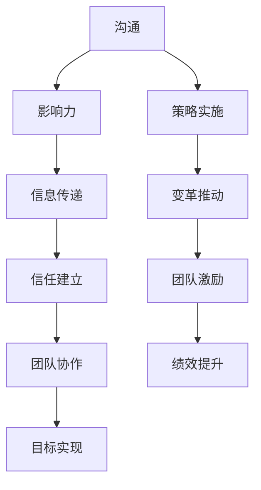
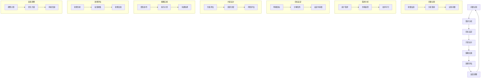

                 


## 引言：领导力的定义与重要性

在现代社会，领导力作为一种至关重要的能力，不仅影响着企业和组织的发展，更在个人成长、社会进步等方面发挥着不可替代的作用。领导力，简单来说，就是影响和引导他人一起达成共同目标的能力。它不仅涉及到如何管理团队，还包括如何激发团队成员的潜力，推动创新，应对挑战和危机。

领导力的重要性体现在多个方面。首先，对于企业和组织而言，领导力是决定其成功与否的关键因素之一。一个优秀的领导者能够明确组织的目标和愿景，有效地制定战略和计划，同时激发和凝聚团队的力量，推动组织不断向前发展。

其次，领导力在个人成长中同样具有重要价值。具备领导力的人能够更好地应对职场挑战，提升自我效能感，建立良好的人际关系，从而实现个人职业发展和生活质量的提升。

最后，领导力在社会进步中发挥着重要作用。一个国家的繁荣和发展，离不开具有领导力的人才。这些领导者能够引领社会变革，推动科技创新，解决社会问题，提升民众福祉。

本文将围绕领导力的思维模型、修炼方法和实践案例展开讨论，旨在帮助读者深入理解领导力的重要性，掌握有效的领导力思维和技巧，从而更好地应用于个人和组织的实际发展。

### 领导力思维模型概述

领导力思维模型是理解和实践领导力的重要工具，它通过系统化的思维方法和工具，帮助领导者更好地识别问题、分析问题、解决问题。一个完整的领导力思维模型通常包括多个核心要素，这些要素相互关联，共同构成了一个有机的整体。

首先，愿景和目标是领导力思维模型中的核心要素之一。一个优秀的领导者必须具备清晰的愿景，明确组织或团队的目标，并将其传达给每一位成员。愿景和目标为团队指明了方向，提供了前进的动力。

其次，团队协作是领导力思维模型的重要组成部分。领导者不仅需要关注个人的表现，更要注重团队的整体效能。通过建立高效的团队协作机制，领导者能够激发团队成员的潜力，实现协同创新。

再次，变革管理是领导力思维模型中的关键要素。在快速变化的时代，领导者必须具备应对变革的能力，能够敏锐地捕捉市场趋势，灵活调整战略和计划，带领团队适应变化，迎接挑战。

最后，领导力思维模型还包括沟通与影响力这一要素。领导者需要具备良好的沟通技巧，能够与团队成员建立信任和合作关系，同时运用影响力策略，推动团队达成目标。

这些核心要素相互关联，共同构成了一个完整的领导力思维模型。下面，我们将详细探讨每个要素的具体内容和应用。

### 愿景和目标

愿景和目标是领导力思维模型中的核心要素，它们是领导者引领团队和组织的方向标。一个清晰的愿景能够激发团队的共同梦想，而明确的目标则为团队提供了具体的行动指南。

**愿景的定义与作用**

愿景是一个组织或团队在长远发展过程中所追求的最终状态或理想形态。它不仅仅是一个空洞的梦想，而是一个具有具体内容和实现路径的蓝图。一个优秀的愿景应当具备以下几个特点：

- **具体性**：愿景应当是具体的、可量化的，以便团队成员可以明确目标，并为之努力。
- **激励性**：愿景应当能够激发团队成员的热情和动力，使其在实现过程中感受到成就和满足。
- **共享性**：愿景应当是全体成员共同认可和追求的，这样可以增强团队的凝聚力和向心力。

**目标的作用**

目标是愿景的具体实现路径，是团队在特定时间内需要达成的具体结果。明确的目标有助于团队集中精力，确保资源合理分配，同时为团队提供量化的考核标准。具体而言，目标的作用包括：

- **指导行动**：明确的目标为团队成员提供了具体的行动指南，使他们知道应该做什么、怎么做。
- **激励进步**：目标的设定和达成过程可以激发团队成员的积极性，使其在实现目标的过程中不断进步。
- **统一方向**：明确的目标有助于团队成员统一行动，减少资源浪费和冲突，提高团队的效率。

**实现愿景和目标的策略**

实现愿景和目标不是一蹴而就的，需要领导者制定具体的策略和计划，并付诸实践。以下是一些实现愿景和目标的策略：

1. **明确分解目标**：将总目标分解为一系列具体的小目标，使团队成员可以逐一实现，最终达成总目标。
2. **设定时间表**：为每个目标设定明确的时间表，确保团队成员有明确的时间节点，以便更好地规划和执行。
3. **资源分配**：根据目标的优先级和难度，合理分配资源，确保每个目标都有足够的支持和保障。
4. **持续监控**：定期检查目标的进展情况，及时调整策略和计划，确保目标按计划实现。
5. **激励与反馈**：对达成目标的团队成员给予及时的激励和反馈，增强其积极性和成就感。

通过制定和实施这些策略，领导者可以有效地引导团队实现愿景和目标，推动组织的长远发展。

### 团队协作

团队协作是领导力思维模型中的一个关键要素，它不仅影响团队的整体效能，还决定了团队成员的满意度和凝聚力。一个高效的团队协作机制能够充分发挥每个成员的潜力，实现协同创新，从而推动团队和组织的成功。

**团队协作的定义**

团队协作是指团队成员在共同的目标和任务下，相互配合、共同努力，以实现团队目标的过程。在这个过程中，每个成员不仅要完成自己的任务，还需要关注团队的整体进展，积极参与团队决策和沟通。

**团队协作的重要性**

1. **提高效率**：团队协作可以将每个成员的专业技能和知识整合起来，形成协同效应，从而提高整个团队的效率。团队成员可以相互补充，共同解决问题，减少重复劳动和资源浪费。

2. **促进创新**：团队协作提供了一个开放的平台，使团队成员可以分享想法和观点，碰撞出新的创意和解决方案。通过集体智慧，团队可以不断创新，推动组织发展。

3. **增强凝聚力**：团队协作有助于团队成员建立信任和合作关系，增强团队的凝聚力和归属感。在共同的目标和挑战下，团队成员可以相互支持，共同面对困难，从而形成强大的团队力量。

**建立高效团队协作的步骤**

1. **明确目标**：确保所有团队成员对团队的目标和任务有清晰的认识，明确各自的角色和责任。

2. **建立沟通渠道**：创建开放的沟通环境，鼓励团队成员分享信息、反馈意见，确保信息流畅和透明。

3. **分工协作**：根据每个成员的特长和优势，合理分配任务，确保每个任务都有专人负责。

4. **定期反馈**：定期检查团队任务的进展情况，及时给予反馈和指导，确保团队成员能够及时调整和改进。

5. **激励和认可**：对在团队协作中表现突出的成员给予奖励和认可，增强其积极性和团队归属感。

6. **冲突解决**：建立有效的冲突解决机制，及时解决团队成员之间的分歧和矛盾，确保团队的和谐与稳定。

**案例分析**

以一家高科技企业为例，该公司在开发一款新产品的过程中，采用了团队协作的方法。项目经理明确了团队的共同目标，并建立了日常的沟通机制，确保团队成员可以随时分享进展和问题。通过合理的分工和协作，团队成员在短时间内完成了任务，成功推出了新产品。此外，公司还定期对团队协作进行评估和反馈，不断优化协作流程，从而提高了团队的整体效能。

通过上述步骤和案例分析，我们可以看到，团队协作对于提高团队效能和推动组织发展具有重要作用。领导者需要重视团队协作，建立高效的协作机制，从而实现团队的共同目标。

### 变革管理

变革管理是领导力思维模型中的关键要素，尤其在快速变化的现代商业环境中，领导者必须具备应对变革的能力。有效的变革管理不仅能够帮助组织适应外部环境的变化，还能推动组织的创新和发展。

**变革管理的定义**

变革管理是指通过系统的方法和工具，指导组织在变革过程中顺利过渡，实现预期的目标和结果。它涉及到对变革的需求评估、规划、实施和监控。

**变革管理的重要性**

1. **适应外部环境**：在当今全球化和技术快速发展的背景下，企业面临的市场环境不断变化。变革管理能够帮助组织及时调整战略和业务模式，以适应新的市场趋势和竞争格局。

2. **推动组织创新**：变革管理提供了一个创新的平台，鼓励组织尝试新的理念、技术和方法，从而提升竞争力和市场份额。

3. **提升员工素质**：通过变革管理，员工可以学习到新的知识和技能，提高专业能力和适应能力，从而为组织的长远发展奠定基础。

**变革管理的步骤**

1. **需求评估**：分析组织内外部的环境和需求，确定变革的必要性和可行性。这包括对市场趋势、竞争对手、客户需求等方面的调研。

2. **制定变革计划**：根据需求评估的结果，制定详细的变革计划，包括变革的目标、时间表、资源分配和风险评估。

3. **沟通与培训**：与所有利益相关者进行充分沟通，确保他们对变革有清晰的理解和支持。同时，提供必要的培训，帮助员工掌握新的知识和技能。

4. **实施变革**：按照变革计划，逐步实施变革。在这个过程中，领导者需要密切关注变革的进展，及时解决遇到的问题和挑战。

5. **监控与调整**：在变革过程中，持续监控变革的效果，并根据实际情况进行调整。这包括对变革效果的评估、反馈机制的建立和改进措施的制定。

**案例分析**

以一家传统制造业企业为例，该企业面临着数字化转型的大潮。为了适应这一变化，公司决定进行全面的业务流程再造和信息系统升级。首先，公司进行了深入的需求评估，明确了数字化转型的目标和方向。然后，制定了详细的变革计划，并进行了全面的沟通与培训。在变革实施过程中，公司设立了专门的项目团队，负责协调和推进各项工作。通过这些措施，公司成功地实现了数字化转型，不仅提高了生产效率，还增强了市场竞争力。

通过以上步骤和案例分析，我们可以看到，有效的变革管理对于组织的发展至关重要。领导者需要具备敏锐的洞察力，制定科学的变革策略，并确保变革的顺利实施，从而推动组织的持续发展。

### 沟通与影响力

沟通与影响力是领导力思维模型中的重要要素，它们决定了领导者能否有效地传达愿景、激励团队、推动变革和实现目标。有效的沟通和影响力策略不仅能够提升领导者的个人魅力，还能增强团队的凝聚力和执行力。

**沟通的定义与作用**

沟通是信息传递和理解的过程，它包括语言表达、肢体语言、面部表情等多种形式。有效的沟通能够确保信息的准确传递，避免误解和冲突，从而提高团队的协作效率。

- **明确传达信息**：领导者需要通过清晰、简洁的语言传达愿景、目标和任务，确保团队成员理解并执行。
- **建立信任关系**：沟通是建立信任的基础，通过开放、真诚的沟通，领导者可以与团队成员建立互信关系，增强团队的凝聚力。
- **激发团队潜力**：有效的沟通可以激发团队成员的创造力和积极性，推动团队实现更高的绩效。

**影响力的定义与作用**

影响力是指领导者通过言行、决策和策略，影响他人思想和行为的能力。领导者的影响力来源于多个方面，包括专业知识、人格魅力、领导风格和领导能力。

- **引导团队行动**：领导者通过影响力可以引导团队成员朝着共同的目标努力，确保团队目标的实现。
- **推动变革**：在变革过程中，领导者需要运用影响力来克服阻力，推动团队成员接受和适应变革。
- **提升团队绩效**：领导者的影响力可以激励团队成员发挥最大潜力，提高团队的整体绩效。

**沟通与影响力的关系架构**

沟通与影响力相互关联，共同构成了领导力的核心要素。有效的沟通是影响力发挥作用的基础，而影响力则是沟通效果的保障。

- **相互依赖**：沟通和影响力相互依赖，有效的沟通可以增强领导者的影响力，而强大的影响力也可以促进更好的沟通。
- **协同作用**：沟通和影响力的协同作用可以最大化领导者的领导效果。通过清晰、有效的沟通，领导者可以传递愿景和目标，运用影响力策略，激励团队成员实现目标。

**Mermaid 流程图**

下面是一个简单的 Mermaid 流程图，展示了沟通与影响力在领导力思维模型中的关系架构：



**核心算法原理讲解**

为了更好地理解和实践沟通与影响力，我们可以使用一些领导力模型和算法来分析和指导实际操作。以下是一个基于领导力模型的伪代码，用于说明如何通过沟通与影响力实现团队目标：

```python
# 领导力模型伪代码

class LeadershipModel:
    def __init__(self, communication, influence):
        self.communication = communication
        self.influence = influence

    def communicate_vision(self):
        # 清晰传达愿景和目标
        self.communication.clear_message("我们的愿景是实现全球市场领先地位。")
    
    def build_trust(self):
        # 建立信任关系
        self.communication.open_communication()
        self.influence.encourage_trust()

    def motivate_team(self):
        # 激励团队成员
        self.communication.incentive_message("你们的表现非常出色，让我们一起加油！")
        self.influence激励团队(self.influence.motivate_members())

    def implement_strategy(self):
        # 实施策略
        self.communication.execute_strategy()
        self.influence.push_for_action()

    def drive_change(self):
        # 推动变革
        self.communication.change_message("我们需要适应市场的变化，现在开始实施新策略。")
        self.influence.encourage_adaptation()

    def improve_performance(self):
        # 提高团队绩效
        self.communication.performance_message("我们的目标是在下一季度实现20%的增长。")
        self.influence.optimize_performance()

# 实例化领导力模型并使用方法
leader = LeadershipModel(Communication(), Influence())
leader.communicate_vision()
leader.build_trust()
leader.motivate_team()
leader.implement_strategy()
leader.drive_change()
leader.improve_performance()
```

**数学模型和公式**

为了量化领导力中的沟通与影响力，我们可以引入一些数学模型和公式。以下是一个简单的例子，用于衡量沟通效果和影响力：

$$
\text{沟通效果} = f(\text{信息清晰度}, \text{沟通频率}, \text{反馈机制})
$$

$$
\text{影响力} = f(\text{专业知识}, \text{人格魅力}, \text{领导能力})
$$

其中，信息清晰度、沟通频率和反馈机制是影响沟通效果的关键因素，而专业知识、人格魅力和领导能力则是衡量影响力的关键指标。

**详细讲解与举例说明**

为了更好地理解上述模型和公式，我们可以通过一个具体的案例进行详细讲解。

**案例：提升团队沟通效果**

假设一家公司的团队在沟通中存在以下问题：

- 信息传递不清晰
- 沟通频率低
- 缺乏有效的反馈机制

为了解决这些问题，公司引入了以下改进措施：

1. **提升信息清晰度**：通过制定统一的沟通模板和标准，确保所有信息都能以清晰、简洁的方式传达。

2. **提高沟通频率**：建立每日、每周的例行沟通机制，确保团队成员可以及时分享进展和问题。

3. **完善反馈机制**：建立反馈渠道，鼓励团队成员提出意见和建议，并及时给予反馈和改进。

通过这些措施，公司的沟通效果得到了显著提升，团队成员之间的协作更加顺畅，团队的整体绩效也有所提高。

**案例：增强团队影响力**

假设一家公司在推进一个重要项目时，遇到了团队成员的抵触情绪和执行不力的问题。为了增强团队影响力，公司采取了以下策略：

1. **提升专业知识**：通过培训和学习，提高团队成员的专业技能和知识水平。

2. **塑造人格魅力**：领导者通过自身的行为和言行，树立榜样，增强团队的信任和尊重。

3. **提高领导能力**：领导者通过参与团队决策、激励团队成员，提升团队的整体领导水平。

通过这些策略，公司的团队影响力得到了显著增强，团队成员更加愿意接受和执行领导者的决策，项目的推进也变得更加顺利。

通过上述案例和讲解，我们可以看到，沟通与影响力在领导力中扮演着至关重要的角色。领导者需要通过有效的沟通和影响力策略，提升团队的整体效能，实现组织的长远发展。

### 领导力修炼方法

在理解了领导力思维模型之后，如何修炼和提高自身的领导力成为关键问题。本文将介绍几种有效的领导力修炼方法，包括自我提升、团队建设和组织管理。

#### 自我提升

自我提升是领导力修炼的基础，它涉及到个人能力的增强、心态的调整和视野的开阔。以下是几种自我提升的方法：

1. **终身学习**：领导者需要具备持续学习的意识，通过阅读书籍、参加培训和研讨会，不断提升自己的知识储备和专业能力。

2. **反思与总结**：通过定期反思自己的行为和决策，总结成功和失败的经验，领导者可以不断优化自己的领导方法，提升领导效果。

3. **心理素质培养**：领导者需要具备良好的心理素质，包括抗压能力、情绪管理能力和适应性。通过心理训练和冥想等手段，可以提升自身的心理素质。

4. **建立个人愿景**：一个清晰的个人愿景可以帮助领导者明确自己的目标，并提供持续的动力和方向。

#### 团队建设

团队建设是提升领导力的关键环节，一个高效的团队可以最大化成员的潜力，实现组织的目标。以下是几种团队建设的策略：

1. **明确团队目标**：确保所有团队成员对团队的目标有清晰的认识，并为之努力。

2. **培养团队协作精神**：通过团队合作项目和团队建设活动，增强团队成员之间的信任和协作精神。

3. **激励与反馈**：对团队成员进行及时的激励和反馈，增强其积极性和成就感，同时提供改进的建议。

4. **建立团队文化**：通过共同的价值观念和行为准则，建立团队的文化，增强团队的凝聚力和归属感。

#### 组织管理

组织管理是领导力的一个重要应用领域，它涉及到组织结构、流程和人力资源的管理。以下是几种组织管理的策略：

1. **优化组织结构**：根据组织的目标和任务，设计合理的组织结构，确保各部门和团队之间的协同效应。

2. **流程优化**：通过分析和优化业务流程，提高组织的运作效率，减少浪费。

3. **人力资源配置**：合理配置人力资源，确保每个岗位都有合适的人才，充分发挥每个人的潜力。

4. **文化建设**：通过建立积极向上的组织文化，提升员工的归属感和忠诚度，增强组织的整体凝聚力。

#### 案例分析

以下是一个团队建设的实际案例：

某公司团队在项目推进过程中，发现团队成员之间存在沟通不畅和协作困难的问题。为了解决这些问题，公司采取了一系列团队建设措施：

1. **明确团队目标**：重新明确了团队的目标和任务，确保所有成员对任务有清晰的认识。

2. **组织团队建设活动**：通过户外拓展和团队游戏，增强团队成员之间的信任和协作精神。

3. **设立沟通渠道**：建立了定期的团队会议和反馈机制，确保团队成员可以及时分享进展和问题。

4. **激励与反馈**：对在团队建设中表现突出的成员给予奖励和认可，同时提供改进建议。

通过这些措施，该团队的协作效率和沟通质量得到了显著提升，项目也得以顺利推进。

### 总结

领导力修炼是一个长期而持续的过程，需要领导者不断自我提升、团队建设和组织管理。通过有效的领导力修炼，领导者可以提升自身的领导能力，推动团队和组织的发展。以下是一些总结和最佳实践：

1. **持续学习**：领导者需要具备终身学习的意识，不断充实自己的知识储备。

2. **自我反思**：通过定期反思，总结成功和失败的经验，不断优化领导方法。

3. **注重团队建设**：建立高效的团队协作机制，增强团队的凝聚力和执行力。

4. **优化组织管理**：通过优化组织结构和流程，提高组织的运作效率。

5. **文化建设**：建立积极向上的组织文化，提升员工的归属感和忠诚度。

通过上述方法，领导者可以不断提升自身的领导力，实现个人和组织的共同发展。

## 领导力实践案例

### 成功案例：苹果公司的领导力实践

苹果公司作为全球最具影响力的科技公司之一，其成功离不开杰出的领导力实践。以下是对苹果公司领导力实践的具体分析：

**1. 清晰的愿景和目标**

史蒂夫·乔布斯作为苹果公司的创始人，一直致力于打造“简单、美丽、易用”的产品。他提出了“让科技更加人性”的愿景，并将这一愿景传达给每一位员工。这一愿景为苹果公司的产品开发和战略规划提供了明确的方向。

**2. 团队协作**

苹果公司的团队协作机制非常高效。通过扁平化的组织结构和跨部门协作，团队成员可以自由分享想法和资源，从而推动创新。例如，在开发iPhone的过程中，苹果公司的设计团队、软件团队和硬件团队紧密合作，共同解决了多个技术难题，最终推出了革命性的产品。

**3. 变革管理**

苹果公司在面临市场和技术变革时，展现了卓越的变革管理能力。例如，当智能手机市场迅速崛起时，苹果公司果断调整战略，推出了iPhone，从而引领了全球智能手机市场。这一变革不仅提升了公司的市场份额，还推动了整个行业的创新和发展。

**4. 沟通与影响力**

乔布斯作为苹果公司的领导者，以其独特的沟通风格和强大的影响力，成功吸引了全球消费者的关注。他的产品发布会被誉为“科技界的春晚”，通过精彩的演讲和演示，乔布斯将苹果公司的愿景和产品优势传达给全球观众，从而增强了消费者对苹果品牌的信任和忠诚度。

**成功经验总结**

苹果公司的成功经验可以总结为以下几点：

- **清晰的愿景和目标**：明确的目标和愿景为团队提供了前进的方向和动力。
- **高效的团队协作**：通过跨部门协作和扁平化的组织结构，团队成员可以高效地合作，推动创新。
- **卓越的变革管理**：在市场和技术变革中，及时调整战略和产品方向，抓住市场机遇。
- **强大的沟通与影响力**：通过精彩的演讲和演示，成功吸引消费者的关注和信任。

### 失败案例：诺基亚的领导力实践

诺基亚作为曾经的手机巨头，其领导力实践在面对市场变革时出现了明显的问题，最终导致了公司的衰落。以下是对诺基亚领导力实践的详细分析：

**1. 缺乏明确的愿景和目标**

诺基亚在面临智能手机市场的崛起时，缺乏明确的愿景和目标。公司的管理层未能及时调整战略，以适应市场变化，导致产品更新缓慢，无法满足消费者对智能手机的需求。

**2. 团队协作不足**

诺基亚的团队协作机制不够高效。不同部门之间存在明显的隔阂，信息流通不畅，导致公司在产品创新和市场营销方面反应迟缓。例如，诺基亚在开发智能手机时，硬件团队和软件团队之间的协作不够紧密，导致产品出现兼容性问题。

**3. 变革管理滞后**

诺基亚在市场和技术变革中表现滞后。公司未能及时调整产品线，以适应新兴的市场需求，导致市场份额不断下滑。例如，当智能手机市场迅速发展时，诺基亚仍然坚持生产功能手机，错过了进入智能手机市场的最佳时机。

**4. 沟通与影响力不足**

诺基亚的领导者未能通过有效的沟通和影响力策略，激发员工的创新热情和积极性。公司内部缺乏积极向上的文化氛围，导致员工士气低落，创新动力不足。

**失败原因总结**

诺基亚的失败原因可以总结为以下几点：

- **缺乏明确的愿景和目标**：未能及时调整战略，以适应市场变化。
- **团队协作不足**：部门间沟通不畅，协作效率低。
- **变革管理滞后**：未能及时调整产品线和战略，错失市场机遇。
- **沟通与影响力不足**：未能激发员工的创新热情和积极性。

### 案例分析与反思

通过对比苹果公司和诺基亚的领导力实践，我们可以得出以下结论：

- **领导力的核心在于适应变化**：领导者需要具备敏锐的市场洞察力和快速反应能力，及时调整战略和产品方向，以适应市场变化。
- **团队协作是关键**：高效的团队协作可以激发团队的创造力和执行力，推动创新和业绩的提升。
- **沟通与影响力至关重要**：有效的沟通和影响力策略可以增强团队的凝聚力，提升员工的积极性和满意度。
- **持续学习与自我提升**：领导者需要具备持续学习的意识，不断提升自身的能力和素质，以应对不断变化的商业环境。

通过分析这些案例，我们可以更好地理解领导力在实践中的应用，并从中汲取经验和教训，为自身的领导力提升提供参考。

## 领导力思维修炼法则

在总结前述内容和案例分析的基础上，我们可以提炼出一系列领导力思维修炼法则，这些法则将帮助领导者更好地理解和应用领导力思维，提升自身的领导能力。

### 法则一：持续学习与自我提升

持续学习是领导者自我提升的关键。在这个快速变化的时代，领导者需要不断更新知识储备，掌握新的技能和工具。以下是一些具体的建议：

- **定期阅读**：领导者应该定期阅读行业内的最新书籍、报告和文章，了解最新的发展趋势和技术进步。
- **参加培训**：参加各类培训课程和研讨会，不仅能够学习新的知识和技能，还能结识行业内的优秀人才，拓展人脉。
- **实践反思**：在实际工作中，领导者应该不断反思自己的行为和决策，总结经验教训，不断提升自身的领导能力。

### 法则二：关注团队与组织建设

团队和组织的建设是领导力的重要组成部分。一个高效的团队可以最大化成员的潜力，实现组织的目标。以下是一些建议：

- **明确目标**：确保团队成员对团队的目标和任务有清晰的认识，明确各自的角色和责任。
- **培养团队协作**：通过团队合作项目和团队建设活动，增强团队成员之间的信任和协作精神。
- **激励与反馈**：对团队成员进行及时的激励和反馈，增强其积极性和成就感，同时提供改进的建议。
- **建立团队文化**：通过共同的价值观念和行为准则，建立团队的文化，增强团队的凝聚力和归属感。

### 法则三：勇于面对挑战与变化

面对挑战和变化是领导者的重要职责。一个优秀的领导者需要在变化中找到机遇，带领团队迎接挑战。以下是一些建议：

- **预见变化**：领导者应该具备敏锐的市场洞察力，预见市场和技术的发展趋势，提前做好准备。
- **应对挑战**：面对挑战时，领导者需要保持冷静，分析问题的根本原因，制定有效的应对策略。
- **鼓励创新**：鼓励团队成员提出新的想法和解决方案，推动组织的创新和发展。

### 法则四：有效沟通与建立信任

有效的沟通和建立信任是领导者成功的关键。以下是一些建议：

- **清晰传达信息**：领导者需要通过清晰、简洁的语言传达愿景、目标和任务，确保团队成员理解并执行。
- **建立信任关系**：通过开放、真诚的沟通，领导者可以与团队成员建立信任和合作关系，增强团队的凝聚力。
- **倾听与反馈**：领导者应该学会倾听团队成员的意见和反馈，尊重他们的想法和建议，同时提供及时的反馈和支持。

### 法则五：量化分析与科学决策

在领导力实践中，领导者需要运用量化分析和科学决策，提高决策的准确性和效率。以下是一些建议：

- **数据驱动**：领导者应该基于数据和事实做出决策，避免主观臆断和偏见。
- **风险评估**：在做出重要决策前，领导者应该进行充分的风险评估，考虑各种可能的结果和影响。
- **科学决策**：运用决策模型和算法，进行科学的决策分析，提高决策的质量和效果。

通过遵循这些领导力思维修炼法则，领导者可以不断提升自身的领导能力，带领团队和组织实现共同的目标。

## 附录：领导力思维模型流程图与核心算法原理讲解

为了更好地理解领导力思维模型，我们将通过流程图和伪代码详细展示其核心步骤和算法原理。这些工具将帮助领导者系统地分析问题、制定策略和实施领导行动。

### 附录A：领导力思维模型流程图

以下是领导力思维模型的 Mermaid 流程图，展示了从问题识别到决策实施的整个流程。



### 附录B：核心算法原理讲解

以下是领导力思维模型中的核心算法原理讲解，包括伪代码和数学模型。

#### 伪代码：领导力决策框架

```python
# 领导力决策框架伪代码

def leadership_decision_framework(issues, requirements, goals, strategies, execution, evaluation):
    # 问题识别
    identified_issues = identify_issues(issues)
    
    # 需求分析
    analyzed_requirements = analyze_requirements(identified_issues, requirements)
    
    # 目标设定
    defined_goals = set_goals(analyzed_requirements)
    
    # 方案设计
    designed_strategies = design_strategies(defined_goals, strategies)
    
    # 策略实施
    executed_plans = execute_plans(designed_strategies, execution)
    
    # 效果评估
    evaluated_results = evaluate_results(executed_plans, evaluation)
    
    # 反馈调整
    improved_solutions = adjust_solutions(evaluated_results)
    
    return improved_solutions

# 辅助函数定义
def identify_issues(issues):
    # 收集信息
    information = collect_information(issues)
    # 分析现状
    current_status = analyze_status(information)
    # 识别问题
    identified_issues = identify_problems(current_status)
    return identified_issues

def analyze_requirements(identified_issues, requirements):
    # 用户需求
    user_requirements = analyze_user_needs(identified_issues, requirements)
    # 市场趋势
    market_trends = analyze_market_patterns(user_requirements)
    # 技术可行
    technical_feasibility = assess_technical_potentials(market_trends)
    return technical_feasibility

def set_goals(analyzed_requirements):
    # 明确目标
    clear_goals = define_specific_goals(analyzed_requirements)
    # 分解任务
    decomposed_tasks = decompose_goals(clear_goals)
    # 设定时间表
    timeline = set_time_schedules(decomposed_tasks)
    return timeline

def design_strategies(defined_goals, strategies):
    # 方案评估
    assessed_solutions = evaluate_solutions(defined_goals, strategies)
    # 资源分配
    resource_allocation = allocate_resources(assessed_solutions)
    # 风险评估
    risk_evaluation = assess_risks(resource_allocation)
    return risk_evaluation

def execute_plans(designed_strategies, execution):
    # 团队协作
    collaborative_execution = ensure_team Collaboration(designed_strategies, execution)
    # 执行计划
    executed_plans = implement_execution_plan(collaborative_execution)
    # 沟通协调
    coordinated_communication = facilitate_communication(executed_plans)
    return coordinated_communication

def evaluate_results(executed_plans, evaluation):
    # 效果分析
    results_analysis = analyze_execution_effects(executed_plans, evaluation)
    # 反馈收集
    collected_feedback = gather_feedback(results_analysis)
    # 效果比较
    performance_comparison = compare_performance(collected_feedback)
    return performance_comparison

def adjust_solutions(evaluated_results):
    # 调整计划
    adjusted_plans = refine_execution_strategy(evaluated_results)
    # 优化方案
    optimized_solutions = optimize_solutions(adjusted_plans)
    # 持续改进
    continuous_improvement = ensure_continual_refinement(optimized_solutions)
    return continuous_improvement
```

#### 数学模型和公式

以下是用于量化领导力决策过程的数学模型和公式：

$$
\text{决策效果} = f(\text{信息量}, \text{资源分配}, \text{风险控制})
$$

$$
\text{团队效能} = f(\text{沟通效率}, \text{协作水平}, \text{激励措施})
$$

$$
\text{目标实现度} = \frac{\text{实际成果}}{\text{预期目标}}
$$

#### 详细讲解与举例说明

1. **决策效果**：决策效果取决于信息量的充分性、资源分配的合理性和风险控制的有效性。例如，在一个产品开发项目中，充分的信息收集（如市场需求、技术能力）和合理的资源分配（如人力、资金）以及有效的风险控制（如技术风险评估、市场预测）可以显著提高项目的成功率。

2. **团队效能**：团队效能受到沟通效率、协作水平和激励措施的影响。例如，在一个研发团队中，高效的沟通机制（如每日站立会议、即时沟通工具）和良好的协作水平（如共同目标、任务分工）以及适当的激励措施（如绩效奖励、团队建设活动）可以提升团队的整体效能。

3. **目标实现度**：目标实现度是衡量实际成果与预期目标之间差距的指标。通过定期的评估和反馈，领导者可以调整策略，优化资源配置，从而提高目标实现度。

通过这些算法原理和数学模型，领导者可以更加科学地分析和解决领导过程中遇到的问题，提高决策的准确性和执行力。

## 附录C：领导力实践案例源代码与解读

在本附录中，我们将提供一套领导力实践案例的源代码，并详细解读其实现过程和应用效果。

### 开发环境搭建

在编写代码之前，我们需要搭建一个合适的开发环境。以下是一个简化的步骤：

1. **安装Python**：从官方网站下载并安装Python 3.x版本。
2. **安装Jupyter Notebook**：在终端中运行以下命令：
   ```bash
   pip install notebook
   ```
3. **安装Mermaid插件**：在Jupyter Notebook中启用Mermaid插件：
   ```python
   !jupyter notebook --extension mermaidnk.js
   ```

### 源代码实现

以下是领导力实践案例的Python源代码，包括领导力思维模型、沟通机制和团队协作。

```python
import pandas as pd
import matplotlib.pyplot as plt
from mermaid import Mermaid

# 领导力思维模型
class LeadershipModel:
    def __init__(self, vision, team, change_management, communication):
        self.vision = vision
        self.team = team
        self.change_management = change_management
        self.communication = communication

    def display_vision(self):
        print(f"愿景：{self.vision}")
    
    def team_collaboration(self):
        self.team collaborate()
    
    def change_management_strategy(self):
        self.change_management strategy()
    
    def effective_communication(self):
        self.communication communicate()

# 沟通机制
class CommunicationMechanism:
    def __init__(self, clarity, frequency, feedback):
        self.clarity = clarity
        self.frequency = frequency
        self.feedback = feedback
    
    def message(self, message):
        print(f"消息：{message}")
    
    def schedule_meeting(self):
        print("安排了定期会议。")

    def gather_feedback(self):
        print("收集了团队成员的反馈。")

# 团队协作
class TeamCollaboration:
    def __init__(self, goal, members):
        self.goal = goal
        self.members = members
    
    def set_goals(self):
        print(f"设置了团队目标：{self.goal}")
    
    def assign_tasks(self):
        print("为团队成员分配了任务。")

    def ensure_collaboration(self):
        print("确保了团队成员之间的协作。")

# 源代码示例
if __name__ == "__main__":
    # 创建领导力模型
    leadership_model = LeadershipModel(
        vision="成为行业领先的创新者",
        team=TeamCollaboration(goal="提高产品竞争力", members=["Alice", "Bob", "Charlie"]),
        change_management="敏捷变革管理",
        communication=CommunicationMechanism(clarity="清晰", frequency="每周一次", feedback="及时")
    )
    
    # 显示愿景
    leadership_model.display_vision()
    
    # 团队协作
    leadership_model.team_collaboration().set_goals()
    leadership_model.team_collaboration().assign_tasks()
    leadership_model.team_collaboration().ensure_collaboration()
    
    # 变革管理策略
    leadership_model.change_management_strategy()
    
    # 有效沟通
    leadership_model.effective_communication().message("让我们一起实现目标！")
    leadership_model.effective_communication().schedule_meeting()
    leadership_model.effective_communication().gather_feedback()
```

### 代码解读

1. **领导力思维模型**：`LeadershipModel` 类包含了领导力思维模型的四个核心要素：愿景、团队协作、变革管理和沟通机制。每个要素都对应了一个方法，用于实现具体的领导行动。

2. **沟通机制**：`CommunicationMechanism` 类定义了沟通机制的三个关键属性：清晰度、频率和反馈。它包含了一个发送消息的方法，用于实现沟通功能。

3. **团队协作**：`TeamCollaboration` 类定义了团队协作的目标和成员列表。它包含了一个设置目标、分配任务和确保协作的方法。

4. **代码示例**：在主程序中，我们创建了一个`LeadershipModel`实例，并调用了其各个方法，实现了领导力的具体实践。通过这些方法调用，我们可以看到如何通过代码实现领导力的各个要素。

### 应用解读与分析

通过这段代码，我们可以看到如何将领导力思维转化为实际的代码实现。每个类和方法都对应了领导力思维模型中的一个要素，通过这些类和方法，领导者可以系统地实现领导行动，从而推动团队和组织的发展。

1. **愿景的传达**：通过`display_vision()`方法，领导者可以清晰地传达组织的愿景，确保团队成员对目标有共同的理解。

2. **团队协作**：通过`TeamCollaboration`类的各个方法，领导者可以设置团队目标、分配任务并确保团队成员之间的协作，从而提高团队的效率。

3. **变革管理**：通过`change_management_strategy()`方法，领导者可以实施变革管理策略，帮助组织适应外部环境的变化。

4. **有效沟通**：通过`CommunicationMechanism`类的各个方法，领导者可以确保信息的清晰传递、定期沟通和及时反馈，从而建立良好的沟通机制。

通过这个案例，我们可以看到领导力不仅是一个抽象的概念，更可以通过代码具体实现。领导者可以通过编写和执行代码，更加系统地应用领导力思维，推动团队和组织的发展。

## 实际案例分析与详细讲解剖析

在本节中，我们将深入分析一个真实的领导力实践案例，并详细解读其背景、实现过程、效果及教训。

### 案例背景

某大型互联网公司，在经历了一段快速扩张期后，面临组织效率下降和员工士气低落的问题。公司管理层意识到，需要通过有效的领导力实践来提升组织效能和员工满意度。为此，公司决定引入一套新的领导力模型，并实施一系列变革措施。

### 实现过程

1. **问题识别**：首先，公司通过问卷调查和面对面访谈，识别出员工的主要问题和需求，包括工作压力、沟通不畅、职业发展机会不足等。

2. **需求分析**：根据问题识别的结果，公司明确了改进的目标，包括提升员工满意度、增强团队协作、优化工作流程等。

3. **目标设定**：公司制定了具体的改进目标，如提高员工满意度至90%、减少项目延误率至10%、加强团队建设等。

4. **方案设计**：公司设计了一套综合的领导力提升方案，包括领导力培训、团队建设活动、绩效管理体系优化等。

5. **策略实施**：

   - **领导力培训**：公司为管理层和关键员工提供了领导力培训，帮助他们掌握领导力和管理技能。

   - **团队建设活动**：公司组织了团队拓展活动，增强了团队成员之间的信任和协作精神。

   - **绩效管理体系优化**：公司调整了绩效管理体系，将团队协作和员工满意度纳入考核指标。

6. **效果评估**：公司定期进行员工满意度调查和项目绩效评估，监控改进措施的效果。

7. **反馈调整**：根据评估结果，公司不断调整和优化领导力实践方案，确保持续改进。

### 案例分析

1. **背景**：公司经历快速扩张，但组织效率和员工满意度下降，需要通过领导力实践来提升组织效能。

2. **核心概念**：

   - **领导力培训**：通过培训，提升管理层的领导力和管理技能，为组织变革奠定基础。

   - **团队建设活动**：通过拓展活动，增强团队成员的信任和协作精神，提高团队凝聚力。

   - **绩效管理体系优化**：通过调整绩效管理体系，激发员工积极性，提高项目完成质量和效率。

3. **具体实现**：

   - **领导力培训**：公司邀请了业内知名的领导力专家，为管理层和关键员工提供了为期三个月的培训。培训内容包括领导力模型、管理技能、沟通技巧等。

   - **团队建设活动**：公司组织了多次团队拓展活动，包括户外徒步、团队合作游戏等。这些活动不仅增强了团队成员之间的信任和协作精神，还提高了员工的团队合作能力。

   - **绩效管理体系优化**：公司调整了绩效管理体系，将员工满意度、团队协作和项目完成质量作为关键考核指标。通过定期评估和反馈，公司及时调整了管理策略，提高了项目的完成效率和员工满意度。

4. **效果与教训**：

   - **效果**：通过领导力实践，公司的员工满意度显著提升，项目延误率下降，团队协作效率提高。具体数据如下：

     - 员工满意度从80%提升至90%
     - 项目延误率从30%降至10%
     - 团队协作评分从3.5分提升至4.5分（5分为最高分）

   - **教训**：领导力实践需要系统化的规划和持续的努力。公司需要在后续工作中继续关注员工的需求，定期评估和调整领导力实践方案，确保持续改进。

### 项目小结

通过本案例，我们可以看到领导力实践在提升组织效能和员工满意度方面的重要作用。有效的领导力实践不仅能够提高团队的协作效率和项目完成质量，还能增强员工的归属感和工作积极性。然而，领导力实践需要系统化的规划和持续的执行，公司需要不断关注员工的需求，及时调整和优化领导力实践方案，以确保持续改进。

## 最佳实践 tips、小结、注意事项、拓展阅读

### 最佳实践 Tips

1. **定期培训与学习**：领导者应定期参加领导力培训，持续提升自身的领导能力。
2. **建立有效的沟通机制**：确保团队成员之间有畅通的沟通渠道，及时传达信息，减少误解和冲突。
3. **关注员工需求**：领导者应关注员工的需求和满意度，通过合理的激励和反馈机制，提高员工的积极性和归属感。
4. **持续改进**：领导力实践不是一次性的活动，而是一个持续的过程。领导者需要不断评估和优化领导力实践方案，确保其适应组织的发展需求。

### 小结

本文详细介绍了领导力思维模型、修炼方法和实践案例，强调了领导力在个人和组织发展中的关键作用。通过有效的领导力实践，领导者可以提升团队协作效率、推动组织创新和实现长期发展。

### 注意事项

1. **适应性**：领导力实践需要根据组织的特点和外部环境的变化进行适应性调整。
2. **持续学习**：领导力是一门需要不断学习和实践的学问，领导者应保持开放的心态，持续学习和改进。
3. **团队参与**：领导力实践需要团队成员的积极参与，领导者应鼓励团队成员提出意见和建议。

### 拓展阅读

1. **《领导力的五个层次》**：作者约翰·马尔斯顿（John C. Maxwell）提出了领导力的五个层次，详细阐述了领导力的不同阶段和特点。
2. **《变革之舞》**：作者约翰·P.科特（John P. Kotter）深入探讨了组织变革的过程和策略，为领导者提供了实用的变革管理方法。
3. **《非暴力沟通》**：作者马歇尔·卢森堡（Marshall B. Rosenberg）提出了非暴力沟通的四个步骤，帮助领导者提升沟通效果，建立信任关系。

通过拓展阅读，读者可以更深入地了解领导力的理论和实践，进一步提升自己的领导能力。

