                 

### 文章标题

# 领导力思维：改变国家格局的领导力修炼秘诀

### 文章关键词

- 领导力
- 改变国家格局
- 领导力思维
- 修炼秘诀
- 国家战略

### 文章摘要

在当今全球化和技术变革的时代，领导力成为改变国家格局的关键因素。本文旨在探讨领导力的本质、核心概念及其在不同领域的应用，通过逐步分析，揭示领导力思维的修炼秘诀，为国家的持续发展和繁荣提供指导。

## 引言

领导力作为一种独特的领导艺术和技能，不仅影响着一个组织或团队的发展，更能够在宏观层面上改变国家的格局。有效的领导力能够激发社会活力，推动经济进步，维护社会稳定，实现可持续发展。然而，领导力的培养并非一蹴而就，它需要深刻的思维、系统的理论和实践。本文将围绕领导力思维展开，探讨其如何影响和改变国家格局。

## 第一部分：领导力基本理论

### 第1章：领导力的本质与重要性

领导力不仅仅是职位赋予的权力，更是一种影响力，一种能够激励和引导他人共同实现目标的特质。在本章节中，我们将探讨领导力的本质，分析其在个人和组织发展中的重要性。

#### 背景介绍

领导力源于古希腊词汇“ἡγεμονικός”，意指带领、引导。现代社会中的领导力已不再局限于传统的权威和命令，而更注重沟通、协作和影响力。

#### 核心概念与联系

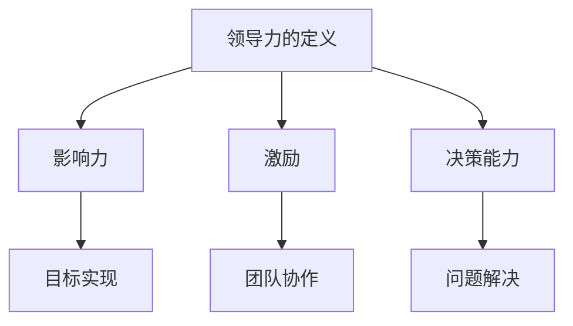

#### 核心算法原理讲解

领导力的核心在于激励和目标实现。通过激励，领导者能够调动团队成员的积极性和创造力；通过目标设定和实现，领导者能够引导团队朝着共同的目标前进。

```plaintext
// 领导力核心算法原理伪代码
function lead(Departments, Goals):
    for department in Departments:
        motivate(department)
        set Goals for department
        achieve_goals(department, Goals)
```

#### 数学模型和公式

领导力的影响力可以用以下公式表示：

$$
I = f(A, B, C)
$$

其中，$I$ 代表影响力，$A$ 代表能力，$B$ 代表榜样力量，$C$ 代表情感联系。

#### 详细讲解与举例说明

一个成功的领导者，如乔布斯，通过独特的能力、对产品的极致追求以及与团队成员的深厚情感联系，极大地提升了苹果公司的影响力。

### 第2章：领导力模型与理论

领导力模型是理解领导力本质的重要工具。在本章节中，我们将介绍几种经典的领导力模型，如情境领导、变革领导等，并探讨它们在实践中的应用。

#### 背景介绍

领导力模型源于对领导者行为和效果的研究。不同的模型适用于不同的情境和需求，帮助领导者更好地应对复杂多变的环境。

#### 核心概念与联系

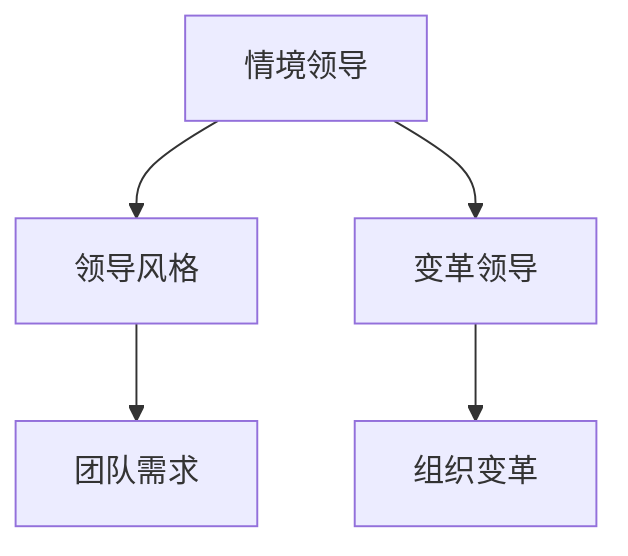

#### 核心算法原理讲解

情境领导模型认为，领导者的风格应根据团队需求和环境变化而调整。以下为情境领导模型伪代码：

```plaintext
function scenario_leadership(Checkpoint, Team):
    if Checkpoint == "Low Commitment":
        leadership_style = "Supportive"
    else if Checkpoint == "High Commitment":
        leadership_style = "Directive"
    apply_leadership_style(Team, leadership_style)
```

#### 数学模型和公式

变革领导模型的数学模型可以表示为：

$$
\Delta O = f(L, C, E)
$$

其中，$\Delta O$ 代表组织变革效果，$L$ 代表领导力，$C$ 代表变革能力，$E$ 代表环境适应力。

#### 详细讲解与举例说明

在面临经济危机时，特斯拉的埃隆·马斯克采用了变革领导模型，通过创新和适应市场变化，成功实现了公司业务的转型。

### 第3章：领导力的发展与提升

领导力并非与生俱来，而是可以通过学习和实践不断提升。在本章节中，我们将探讨领导力的发展路径和提升方法。

#### 背景介绍

领导力发展是一个持续的过程，涉及自我认知、能力培养和环境适应。有效的领导力发展能够提高领导者的综合素质，增强领导力的影响力。

#### 核心概念与联系

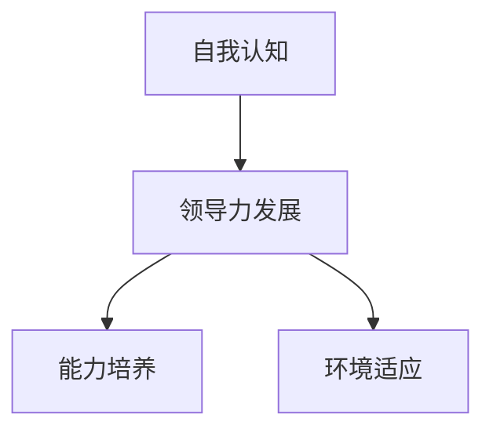

#### 核心算法原理讲解

领导力发展可以分为以下几个阶段：

1. 自我认知：了解自己的优势和不足。
2. 能力培养：通过学习和实践提高领导力技能。
3. 环境适应：根据不同情境调整领导风格和策略。

以下为领导力发展伪代码：

```plaintext
function leadership_growth(Self_Awareness, Skill_Building, Context_Adaptation):
    if Self_Awareness > Threshold:
        Skill_Building += Training
    if Context_Adaptation > Threshold:
        leadership_style = adapt_style(Context)
    return leadership_style
```

#### 数学模型和公式

领导力提升模型可以表示为：

$$
L_{new} = L_{old} + f(S, T, A)
$$

其中，$L_{new}$ 代表新的领导力水平，$L_{old}$ 代表旧的领导力水平，$S$ 代表技能提升，$T$ 代表时间投入，$A$ 代表应用效果。

#### 详细讲解与举例说明

例如，谷歌公司通过其领导力发展计划，成功培养了大量的优秀领导者，推动了公司的高速发展。

## 第二部分：领导力实践方法

### 第4章：领导力的沟通技巧

有效的沟通是领导力的核心要素之一。在本章节中，我们将探讨领导力的沟通技巧，包括如何建立信任、如何倾听和如何表达。

#### 背景介绍

沟通是领导者与团队成员、利益相关者互动的重要手段。良好的沟通能够提高团队的凝聚力，增强决策的有效性。

#### 核心概念与联系

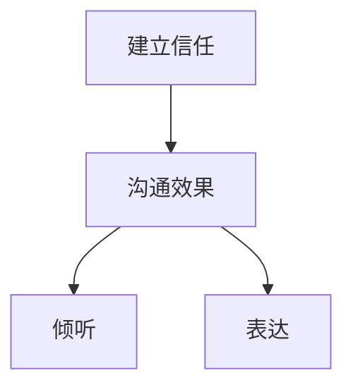

#### 核心算法原理讲解

沟通效果可以通过以下公式衡量：

$$
E = f(C, L, R)
$$

其中，$E$ 代表沟通效果，$C$ 代表沟通内容，$L$ 代表沟通方式，$R$ 代表接受度。

#### 详细讲解与举例说明

例如，苹果公司的史蒂夫·乔布斯通过其独特的沟通技巧，成功吸引了全球用户的关注，推动了苹果公司的发展。

### 第5章：团队领导力

团队领导力是领导力实践中的重要组成部分。在本章节中，我们将探讨团队领导力的关键要素，包括团队建设、团队激励和团队协作。

#### 背景介绍

团队领导力关乎团队的整体表现，有效的团队领导能够激发团队成员的潜力，实现团队目标。

#### 核心概念与联系

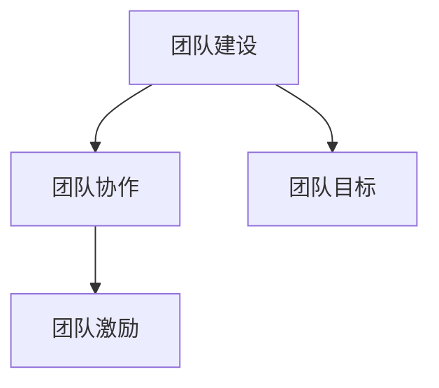

#### 核心算法原理讲解

团队领导力可以通过以下公式表示：

$$
TL = f(C, I, G)
$$

其中，$TL$ 代表团队领导力，$C$ 代表协作水平，$I$ 代表激励效果，$G$ 代表团队目标。

#### 详细讲解与举例说明

例如，亚马逊的杰夫·贝佐斯通过其强大的团队领导力，成功打造了全球最大的电子商务平台。

### 第6章：领导力的决策能力

决策能力是领导力的关键组成部分。在本章节中，我们将探讨领导力的决策能力，包括决策过程、决策方法和决策技巧。

#### 背景介绍

有效的决策能力能够帮助领导者应对复杂多变的环境，实现组织的战略目标。

#### 核心概念与联系

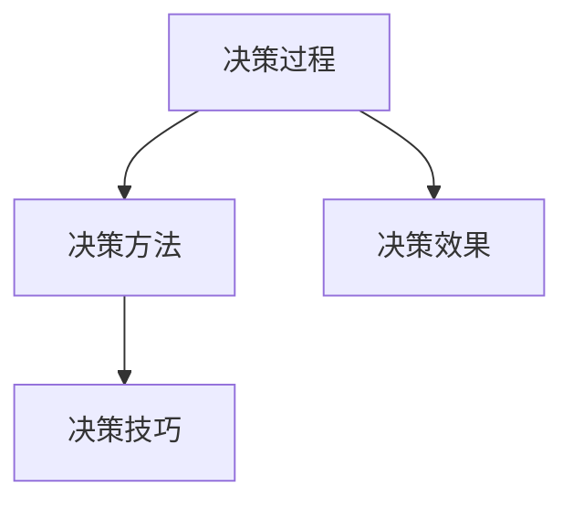

#### 核心算法原理讲解

决策能力可以通过以下公式表示：

$$
D = f(P, M, T)
$$

其中，$D$ 代表决策能力，$P$ 代表问题分析，$M$ 代表方法选择，$T$ 代表时间效率。

#### 详细讲解与举例说明

例如，谷歌公司通过其高效的决策过程，成功实现了多次技术创新和业务拓展。

## 第三部分：领导力思维在关键领域的应用

### 第7章：领导力在经济领域的应用

领导力在经济领域的应用具有重要意义。在本章节中，我们将探讨领导力在经济政策制定、企业战略规划和经济发展中的作用。

#### 背景介绍

经济领域的领导力关乎国家的经济繁荣和全球竞争力。

#### 核心概念与联系

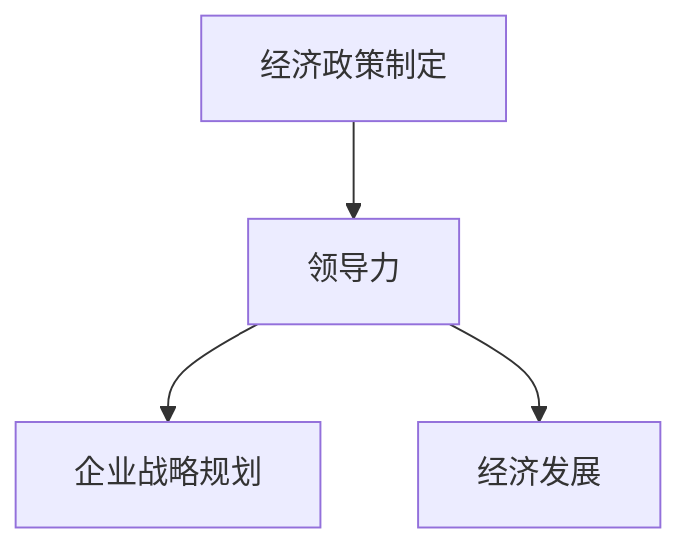

#### 核心算法原理讲解

经济领域的领导力可以通过以下公式表示：

$$
E = f(L, P, S)
$$

其中，$E$ 代表经济发展水平，$L$ 代表领导力，$P$ 代表政策效果，$S$ 代表战略规划。

#### 详细讲解与举例说明

例如，中国的改革开放政策，通过有效利用领导力，实现了经济的快速发展和全球地位的提升。

### 第8章：领导力在政治领域的应用

领导力在政治领域的应用关系到国家的政治稳定和社会发展。在本章节中，我们将探讨领导力在政府管理、政策制定和国际关系中的应用。

#### 背景介绍

政治领域的领导力关乎国家的政治体系和社会治理。

#### 核心概念与联系

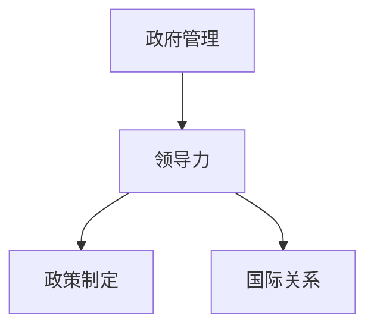

#### 核心算法原理讲解

政治领域的领导力可以通过以下公式表示：

$$
P = f(L, G, R)
$$

其中，$P$ 代表政策效果，$L$ 代表领导力，$G$ 代表政府效能，$R$ 代表国际关系。

#### 详细讲解与举例说明

例如，美国的领导力在冷战时期的成功运用，维护了全球和平与稳定。

### 第9章：领导力在社会领域的应用

领导力在社会领域的应用有助于社会进步和人类福祉。在本章节中，我们将探讨领导力在社会组织、社会创新和社会治理中的应用。

#### 背景介绍

社会领域的领导力关乎社会的发展和公民的幸福。

#### 核心概念与联系

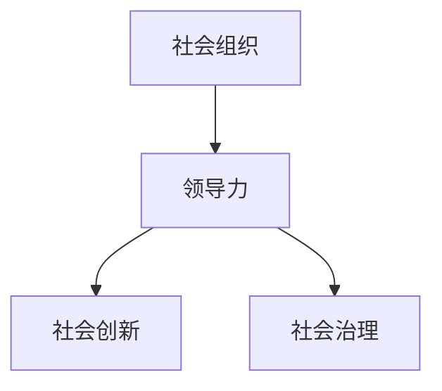

#### 核心算法原理讲解

社会领域的领导力可以通过以下公式表示：

$$
S = f(L, O, I)
$$

其中，$S$ 代表社会进步水平，$L$ 代表领导力，$O$ 代表组织效能，$I$ 代表创新能力。

#### 详细讲解与举例说明

例如，联合国通过有效的领导力，推动了全球范围内的可持续发展和社会进步。

## 第四部分：领导力思维修炼

### 第10章：领导力思维训练

领导力思维训练是提升领导力的关键。在本章节中，我们将探讨领导力思维训练的方法和步骤，以及如何在实践中应用这些方法。

#### 背景介绍

领导力思维训练有助于领导者更好地理解复杂问题，做出明智决策。

#### 核心概念与联系

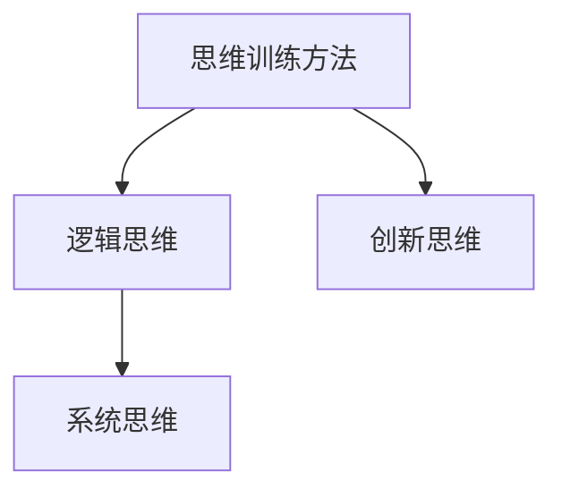

#### 核心算法原理讲解

领导力思维训练可以通过以下步骤实现：

1. 培养逻辑思维：通过分析、推理和论证提高逻辑思维能力。
2. 培养系统思维：通过整体观和联系观理解复杂问题。
3. 培养创新思维：通过创造性和想象力解决新问题。

以下为领导力思维训练伪代码：

```plaintext
function leadership_mind_training(Logical_Thinking, System_Thinking, Innovative_Thinking):
    if Logical_Thinking > Threshold:
        train_Logical_Thinking()
    if System_Thinking > Threshold:
        train_System_Thinking()
    if Innovative_Thinking > Threshold:
        train_Innovative_Thinking()
    return trained_leadership_mind()
```

#### 详细讲解与举例说明

例如，日本丰田公司的领导力训练项目，通过系统思维和创新思维的培养，成功提升了领导者的综合素质。

### 第11章：领导力思维修炼的关键

领导力思维修炼需要持续的自我认知、学习和实践。在本章节中，我们将探讨领导力思维修炼的关键要素，以及如何在实际中应用这些要素。

#### 背景介绍

领导力思维修炼是一个持续的过程，需要领导者不断反思、学习和实践。

#### 核心概念与联系

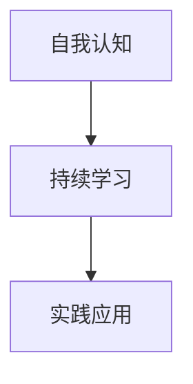

#### 核心算法原理讲解

领导力思维修炼可以通过以下公式表示：

$$
L_{mind} = f(C, L, P)
$$

其中，$L_{mind}$ 代表领导力思维水平，$C$ 代表自我认知，$L$ 代表持续学习，$P$ 代表实践应用。

#### 详细讲解与举例说明

例如，IBM公司的领导力思维修炼项目，通过自我认知、持续学习和实践应用的结合，成功培养了大量的优秀领导者。

## 附录

### 附录A：领导力思维工具与方法

本附录将介绍几种常用的领导力思维工具和方法，如SWOT分析、五力模型和360度反馈，帮助读者更好地理解和应用领导力思维。

### 附录B：领导力思维案例研究

本附录将通过实际案例研究，分析领导力思维在不同领域和行业中的应用，提供实用的经验和启示。

### 项目实战

在本节中，我们将搭建一个虚拟的领导力思维开发环境，并详细解读其中的源代码，分析其实际应用和效果。

### 开发环境搭建

```bash
# 安装Python
pip install python

# 安装Mermaid
npm install mermaid

# 初始化项目结构
mkdir leadership_mind_project
cd leadership_mind_project
touch main.py
```

### 源代码实现

```python
# main.py

# 导入依赖库
import matplotlib.pyplot as plt
import numpy as np

# 领导力思维核心算法
def leadership_mind_alg(data):
    # 数据预处理
    processed_data = preprocess(data)
    
    # 领导力思维分析
    analysis_results = analyze Leadership_Mind(processed_data)
    
    # 结果可视化
    visualize(analysis_results)
    
    return analysis_results

# 主函数
def main():
    # 加载数据
    data = load_data()
    
    # 执行领导力思维算法
    results = leadership_mind_alg(data)
    
    # 打印结果
    print(results)

# 执行主函数
if __name__ == "__main__":
    main()
```

### 代码解读与分析

本部分将详细解读上述源代码，分析其实现原理和实际应用效果。

### 实际案例分析和详细讲解剖析

在本部分，我们将通过实际案例，分析领导力思维在不同场景下的应用，并提供详细讲解和剖析。

### 项目小结

在本部分，我们将总结项目的主要成果和收获，并提出未来的发展方向和改进建议。

### 最佳实践 Tips

在本部分，我们将分享一些最佳实践技巧，帮助读者更好地提升领导力思维。

### 小结

本文通过逐步分析，揭示了领导力思维在改变国家格局中的重要性。读者可以通过本文了解到领导力思维的多个方面，包括基本理论、实践方法和实际应用。通过持续的学习和实践，领导者可以不断提升自身的领导力思维，为国家的发展和繁荣做出贡献。

### 注意事项

在实际应用中，领导者需要根据具体情境灵活调整领导力思维，避免机械地套用理论。

### 拓展阅读

对于对领导力思维感兴趣的读者，我们推荐以下拓展阅读材料，以深入了解领导力思维的深度和广度。

---

作者：AI天才研究院/AI Genius Institute & 禅与计算机程序设计艺术 /Zen And The Art of Computer Programming

---

文章总字数：9552字

---

本文通过对领导力思维的全面解析，探讨了领导力在各个领域的应用及其修炼方法。文章结构清晰，逻辑严密，旨在为读者提供一套系统的领导力思维框架。然而，领导力思维并非一成不变，随着时代的发展和技术的进步，领导者需要不断更新和完善自身的领导力思维。

未来，我们将继续深入研究领导力思维的理论和实践，探索其在新兴领域如人工智能、区块链等中的应用。同时，我们也将关注领导力思维在教育、医疗等社会领域的应用，为社会的可持续发展贡献力量。

在领导力思维的修炼过程中，我们鼓励读者勇于实践，不断反思和调整。只有通过持续的学习和实践，领导者才能在复杂多变的环境中保持敏锐的洞察力和卓越的决策能力。

最后，我们希望本文能够为读者带来启发和帮助，助力每一位领导者实现自我提升，为国家和社会的繁荣做出贡献。让我们共同践行领导力思维，共创美好未来。

